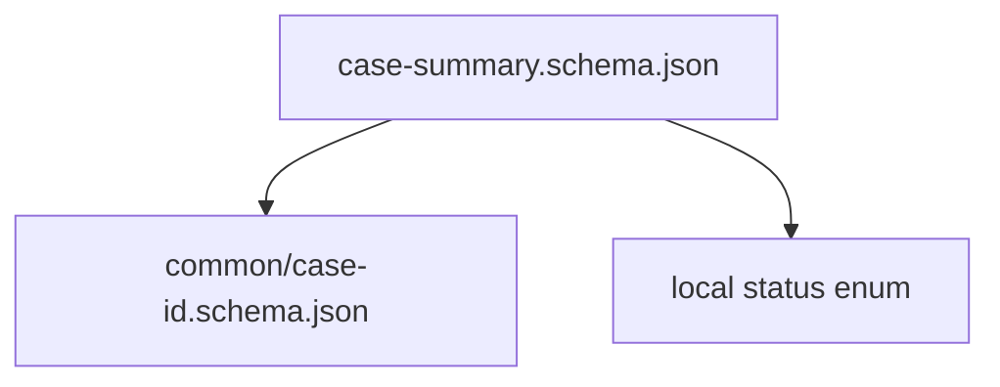
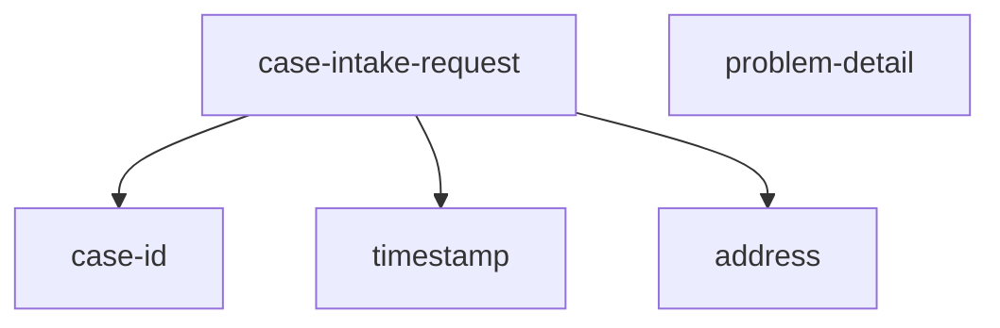
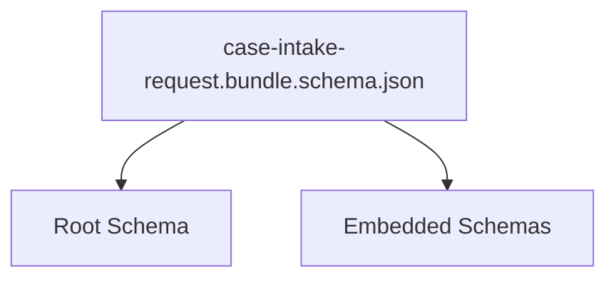
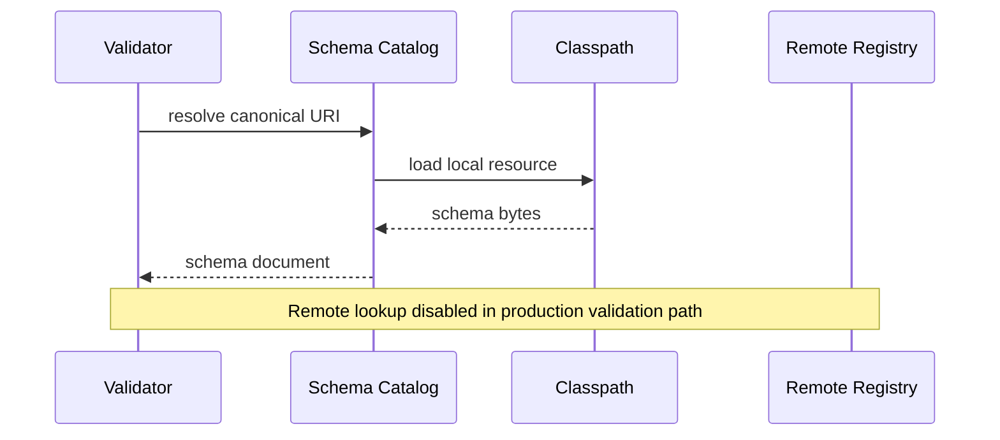
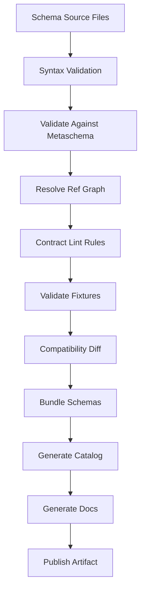
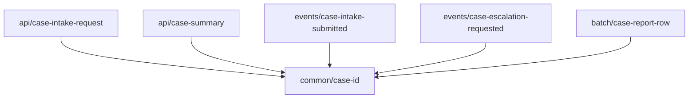
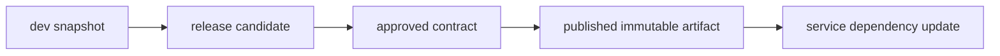
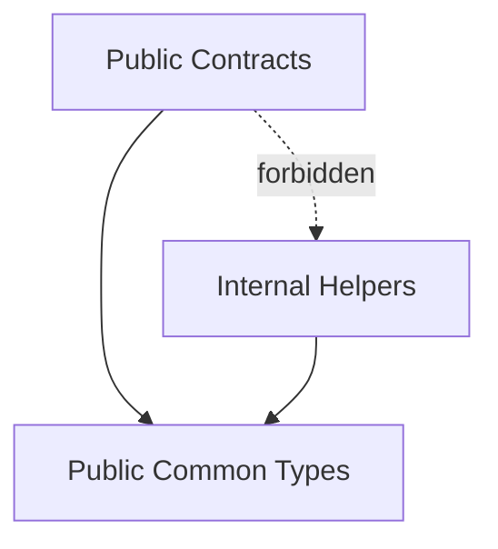
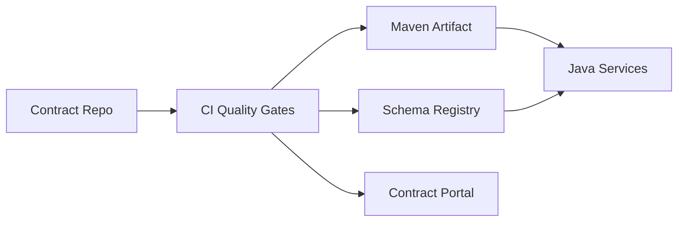
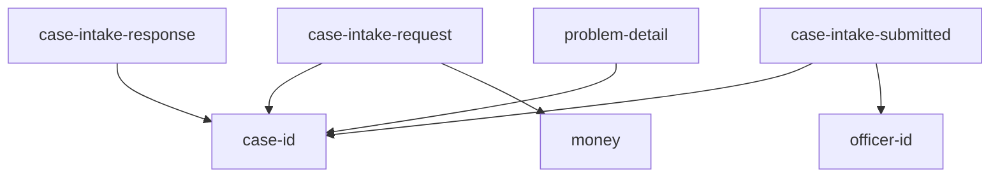

# Part 012 — JSON Schema Modularization, Bundling, and Reference Strategy

JSON Schema yang kecil bisa hidup sebagai satu file.

JSON Schema production-grade jarang bisa begitu.

Begitu domain tumbuh, kamu akan punya:

- common primitives;
- identifier types;
- money/time/address/contact types;
- error model;
- pagination model;
- event envelope;
- command/request payload;
- response payload;
- domain-specific subtypes;
- shared reference data structure;
- versioned schema package;
- schema yang dipakai API, event, file import, dan validation service.

Masalahnya bukan hanya “memecah file”. Masalahnya adalah membuat schema punya **identity**, **reference stability**, **build reproducibility**, dan **runtime resolvability**.

Part ini membangun strategi modularisasi JSON Schema Draft 2020-12 dari nol sampai production.

---

## 1. Why Modularization Fails

Banyak repository mulai seperti ini:

```text
schemas/
  case-intake.json
  case-escalation.json
  error.json
  address.json
```

Lalu muncul `$ref` relatif:

```json
{
  "$ref": "address.json"
}
```

Di laptop developer, valid.

Di CI, gagal.

Di runtime container, gagal.

Di generated documentation, link rusak.

Di schema registry, ID berubah.

Penyebabnya biasanya:

1. schema tidak punya `$id` yang stabil;
2. reference relatif bergantung working directory;
3. file path dianggap sama dengan canonical schema identity;
4. bundler mengubah struktur tanpa preserving URI;
5. validator runtime tidak punya resolver/catalog;
6. schema version tidak menjadi bagian dari identity;
7. shared schema diubah tanpa compatibility check terhadap dependents.

Mental model:

> File path adalah lokasi penyimpanan. `$id` adalah identitas kontrak. `$ref` adalah dependency edge. Bundling adalah packaging. Resolver adalah runtime supply chain.

---

## 2. Identity First: `$id` Is Not Decoration

Contoh schema tanpa `$id`:

```json
{
  "$schema": "https://json-schema.org/draft/2020-12/schema",
  "type": "object",
  "properties": {
    "caseId": { "type": "string" }
  }
}
```

Ini bisa divalidasi, tapi buruk sebagai kontrak reusable.

Lebih baik:

```json
{
  "$schema": "https://json-schema.org/draft/2020-12/schema",
  "$id": "https://contracts.example.com/regulatory/common/1.0/case-identity.schema.json",
  "title": "CaseIdentity",
  "type": "object",
  "required": ["caseId"],
  "properties": {
    "caseId": {
      "type": "string",
      "pattern": "^CASE-[0-9]{4}-[0-9]{4,}$"
    }
  },
  "additionalProperties": false
}
```

Rule `$id` production:

| Rule | Alasan |
|---|---|
| gunakan absolute URI | tidak bergantung working directory |
| sertakan domain/package | mudah governance |
| sertakan major/minor line | jelas lifecycle |
| jangan pakai random file path internal | path bisa berubah |
| jangan pakai `localhost` | tidak canonical |
| jangan pakai branch name | tidak immutable |

Contoh URI taxonomy:

```text
https://contracts.example.com/{business-domain}/{contract-kind}/{version}/{name}.schema.json
```

Contoh:

```text
https://contracts.example.com/regulatory/common/1.0/case-id.schema.json
https://contracts.example.com/regulatory/events/1.0/case-intake-submitted.schema.json
https://contracts.example.com/regulatory/api/1.0/case-intake-request.schema.json
https://contracts.example.com/platform/errors/1.0/problem-detail.schema.json
```

Prinsip:

> `$id` harus tetap bermakna meski file dipindahkan, repository berubah, atau schema dibundle.

---

## 3. File Layout vs Canonical URI

File layout boleh dioptimalkan untuk developer experience.

Canonical URI harus dioptimalkan untuk contract identity.

Contoh repo:

```text
contracts-json-schema/
  pom.xml
  src/main/schemas/
    regulatory/
      common/
        1.0/
          case-id.schema.json
          officer-id.schema.json
          timestamp.schema.json
      api/
        1.0/
          case-intake-request.schema.json
          case-intake-response.schema.json
      events/
        1.0/
          case-intake-submitted.schema.json
          case-escalation-requested.schema.json
    platform/
      errors/
        1.0/
          problem-detail.schema.json
  src/test/fixtures/
    valid/
    invalid/
  target/
    bundled-schemas/
    schema-catalog.json
```

Schema file:

```json
{
  "$schema": "https://json-schema.org/draft/2020-12/schema",
  "$id": "https://contracts.example.com/regulatory/api/1.0/case-intake-request.schema.json",
  "title": "CaseIntakeRequest",
  "type": "object"
}
```

File path:

```text
src/main/schemas/regulatory/api/1.0/case-intake-request.schema.json
```

Canonical identity:

```text
https://contracts.example.com/regulatory/api/1.0/case-intake-request.schema.json
```

Mereka konsisten, tapi tidak sama secara konsep.

---

## 4. `$defs` for Local Reuse

Gunakan `$defs` untuk tipe yang hanya relevan dalam satu schema atau satu bounded context kecil.

```json
{
  "$schema": "https://json-schema.org/draft/2020-12/schema",
  "$id": "https://contracts.example.com/regulatory/api/1.0/case-intake-request.schema.json",
  "type": "object",
  "required": ["requestId", "complainant"],
  "properties": {
    "requestId": { "type": "string", "format": "uuid" },
    "complainant": { "$ref": "#/$defs/Complainant" }
  },
  "additionalProperties": false,
  "$defs": {
    "Complainant": {
      "type": "object",
      "required": ["type", "displayName"],
      "properties": {
        "type": { "enum": ["PERSON", "ORGANIZATION", "ANONYMOUS"] },
        "displayName": { "type": "string", "minLength": 1 }
      },
      "additionalProperties": false
    }
  }
}
```

Gunakan `$defs` ketika:

- tipe hanya dipakai oleh satu schema;
- reuse masih lokal;
- tidak perlu version lifecycle sendiri;
- tidak perlu owner berbeda;
- tidak perlu dipublikasi sebagai artifact mandiri.

Jangan gunakan `$defs` untuk semua hal.

Jika `Address`, `Money`, `ProblemDetail`, `CaseId`, atau `OfficerId` dipakai lintas kontrak, beri file dan `$id` sendiri.

---

## 5. External `$ref` for Shared Types

Common type:

```json
{
  "$schema": "https://json-schema.org/draft/2020-12/schema",
  "$id": "https://contracts.example.com/regulatory/common/1.0/case-id.schema.json",
  "title": "CaseId",
  "type": "string",
  "pattern": "^CASE-[0-9]{4}-[0-9]{4,}$",
  "description": "Stable case identifier assigned by case registry."
}
```

Consumer schema:

```json
{
  "$schema": "https://json-schema.org/draft/2020-12/schema",
  "$id": "https://contracts.example.com/regulatory/api/1.0/case-summary.schema.json",
  "title": "CaseSummary",
  "type": "object",
  "required": ["caseId", "status"],
  "properties": {
    "caseId": {
      "$ref": "https://contracts.example.com/regulatory/common/1.0/case-id.schema.json"
    },
    "status": {
      "type": "string",
      "enum": ["SUBMITTED", "UNDER_REVIEW", "CLOSED"]
    }
  },
  "additionalProperties": false
}
```

Dependency graph:



Rule external `$ref`:

- refer ke canonical `$id`, bukan file path internal;
- pin ke version yang jelas;
- shared type harus punya owner;
- breaking change di shared type harus memeriksa semua dependents;
- runtime validator harus punya resolver/catolog untuk URI tersebut.

---

## 6. Anchors for Stable Internal Targets

JSON Pointer seperti ini valid:

```json
{
  "$ref": "https://contracts.example.com/regulatory/common/1.0/types.schema.json#/$defs/CaseId"
}
```

Tapi pointer ini rapuh jika struktur internal berubah.

Anchor memberi nama target yang lebih stabil:

```json
{
  "$schema": "https://json-schema.org/draft/2020-12/schema",
  "$id": "https://contracts.example.com/regulatory/common/1.0/types.schema.json",
  "$defs": {
    "CaseId": {
      "$anchor": "CaseId",
      "type": "string",
      "pattern": "^CASE-[0-9]{4}-[0-9]{4,}$"
    },
    "OfficerId": {
      "$anchor": "OfficerId",
      "type": "string",
      "pattern": "^USR-[0-9A-Z]{8,}$"
    }
  }
}
```

Referensi:

```json
{
  "$ref": "https://contracts.example.com/regulatory/common/1.0/types.schema.json#CaseId"
}
```

Kapan pakai `$anchor`?

- ketika satu file berisi beberapa type publik;
- ketika kamu ingin ref target stabil walau internal `$defs` berubah;
- ketika documentation ingin link ke named type;
- ketika schema catalog menampilkan daftar tipe.

Kapan jangan?

- untuk tipe lokal yang tidak seharusnya direferensikan luar;
- untuk menyembunyikan file besar yang terlalu banyak tanggung jawab.

---

## 7. Relative References: Allowed, But Dangerous

Relative reference:

```json
{
  "$ref": "../common/1.0/case-id.schema.json"
}
```

Ini bisa bekerja jika base URI jelas.

Tapi di enterprise contract system, relative ref sering jadi sumber nondeterminism.

Masalah:

- tergantung lokasi file saat dibaca;
- bundler bisa mengubah base;
- runtime validator dari classpath tidak selalu punya konsep folder yang sama;
- schema registry mungkin hanya menyimpan canonical ID;
- generated documentation bisa kehilangan link.

Preferensi:

> Gunakan absolute canonical URI untuk reference lintas file. Gunakan relative reference hanya untuk modul internal yang tidak dipublikasi terpisah dan dikontrol build pipeline yang sama.

---

## 8. Compound Schema Document and Bundling

Bundling adalah proses membuat satu artifact yang membawa schema utama dan dependensinya.

Sebelum bundling:



Setelah bundling:



Contoh simplified bundle:

```json
{
  "$schema": "https://json-schema.org/draft/2020-12/schema",
  "$id": "https://contracts.example.com/regulatory/api/1.0/case-intake-request.schema.json",
  "title": "CaseIntakeRequest",
  "type": "object",
  "required": ["caseId"],
  "properties": {
    "caseId": {
      "$ref": "https://contracts.example.com/regulatory/common/1.0/case-id.schema.json"
    }
  },
  "additionalProperties": false,
  "$defs": {
    "https://contracts.example.com/regulatory/common/1.0/case-id.schema.json": {
      "$id": "https://contracts.example.com/regulatory/common/1.0/case-id.schema.json",
      "title": "CaseId",
      "type": "string",
      "pattern": "^CASE-[0-9]{4}-[0-9]{4,}$"
    }
  }
}
```

Catatan: bundling yang benar harus menjaga `$id` embedded schema agar reference tetap resolve ke identity aslinya.

Jangan melakukan bundle dengan cara copy-paste yang menghapus `$id` dependency.

Tujuan bundling:

- runtime tidak perlu network call;
- deployment reproducible;
- validator bisa preload semua schema;
- documentation bisa satu paket;
- CI bisa menguji closed dependency graph;
- artifact bisa dipublish ke Maven/NPM/container image.

---

## 9. Schema Catalog

Runtime Java sebaiknya tidak resolve schema langsung ke internet.

Buat catalog:

```json
{
  "schemas": [
    {
      "id": "https://contracts.example.com/regulatory/common/1.0/case-id.schema.json",
      "resource": "classpath:/contracts/regulatory/common/1.0/case-id.schema.json",
      "sha256": "7d8f..."
    },
    {
      "id": "https://contracts.example.com/regulatory/api/1.0/case-intake-request.schema.json",
      "resource": "classpath:/contracts/regulatory/api/1.0/case-intake-request.bundle.schema.json",
      "sha256": "a1bc..."
    }
  ]
}
```

Resolver flow:



Production resolver policy:

| Policy | Recommendation |
|---|---|
| remote HTTP fetch during request validation | No |
| classpath schema loading | Yes |
| pinned artifact version | Yes |
| checksum verification | Yes for high assurance systems |
| fallback to latest registry | No |
| schema cache | Yes |
| deterministic startup preload | Yes |

Prinsip:

> Runtime validation must be deterministic. A request should not depend on remote schema availability.

---

## 10. Java Resolver Sketch

Pseudo-code:

```java
public final class CatalogBackedSchemaResolver {
    private final Map<URI, SchemaResource> catalog;
    private final ObjectMapper objectMapper;

    public JsonNode resolve(URI uri) {
        SchemaResource resource = catalog.get(uri);
        if (resource == null) {
            throw new UnknownSchemaReferenceException(uri);
        }

        byte[] bytes = loadFromClasspath(resource.classpathLocation());
        verifyChecksumIfPresent(resource, bytes);
        return parseJson(bytes);
    }

    private JsonNode parseJson(byte[] bytes) {
        try {
            return objectMapper.readTree(bytes);
        } catch (IOException e) {
            throw new InvalidSchemaArtifactException(e);
        }
    }
}
```

Validator initialization:

```java
public final class ContractValidatorRegistry {
    private final ConcurrentMap<URI, JsonSchema> validators = new ConcurrentHashMap<>();
    private final CatalogBackedSchemaResolver resolver;

    public JsonSchema getValidator(URI schemaId) {
        return validators.computeIfAbsent(schemaId, this::compile);
    }

    private JsonSchema compile(URI schemaId) {
        JsonNode schemaDocument = resolver.resolve(schemaId);
        return compileWithResolver(schemaDocument, resolver);
    }
}
```

Engineering notes:

- compile schema once, not per request;
- make resolver deterministic;
- fail service startup if required schema cannot load;
- expose health endpoint with loaded schema IDs;
- log schema ID and version on validation error;
- never silently ignore unresolved `$ref`.

---

## 11. Maven Artifact Strategy

Treat schema as build artifact.

Example Maven coordinates:

```xml
<dependency>
  <groupId>com.example.contracts</groupId>
  <artifactId>regulatory-json-schemas</artifactId>
  <version>1.4.2</version>
</dependency>
```

Artifact content:

```text
META-INF/contracts/
  schema-catalog.json
  regulatory/
    common/
      1.0/
        case-id.schema.json
        officer-id.schema.json
    api/
      1.0/
        case-intake-request.bundle.schema.json
    events/
      1.0/
        case-intake-submitted.bundle.schema.json
```

Versioning distinction:

| Version | Meaning |
|---|---|
| schema `$id` version | contract semantic line |
| Maven artifact version | package release version |
| Git tag | source snapshot |
| registry version | registry-specific revision |

Do not confuse them.

A Maven patch release can fix description, examples, or packaging without changing schema semantic version.

A schema major version indicates contract line changed.

---

## 12. Build Pipeline

Contract build pipeline:



Recommended quality gates:

1. every schema has `$schema`;
2. every public schema has absolute `$id`;
3. no duplicate `$id`;
4. all `$ref` resolve;
5. no remote unresolved dependency;
6. all examples validate;
7. all invalid fixtures fail for expected reason;
8. compatibility diff passes against previous release;
9. bundled schema preserves embedded `$id`;
10. generated catalog includes checksum;
11. documentation build passes;
12. artifact is immutable after publish.

---

## 13. Dependency Graph and Blast Radius

Shared schema change requires blast radius analysis.

Example:



If `case-id` pattern changes, affected contracts:

- API request;
- API response;
- event payload;
- batch export;
- documentation;
- generated DTO;
- validation service;
- downstream consumer test fixtures.

Therefore shared type changes need stricter review than leaf schema changes.

Change class examples:

| Change | Risk |
|---|---|
| description update | low |
| add example | low |
| relax pattern | medium |
| tighten pattern | high |
| change type | breaking |
| rename `$id` | breaking |
| move file but keep `$id` | safe if catalog updated |
| move file and change `$id` | breaking |

---

## 14. Versioned Package Strategy

Avoid this:

```text
common/latest/case-id.schema.json
```

`latest` is convenient for humans and dangerous for machines.

Prefer:

```text
common/1.0/case-id.schema.json
common/1.1/case-id.schema.json
common/2.0/case-id.schema.json
```

Reference explicit version:

```json
{
  "$ref": "https://contracts.example.com/regulatory/common/1.0/case-id.schema.json"
}
```

Promotion flow:



Do not let services consume mutable branch schemas directly.

---

## 15. Public vs Private Schema Modules

Not every schema should be public.

| Module type | Public `$id`? | External ref allowed? |
|---|---:|---:|
| API request/response | Yes | Yes |
| event payload | Yes | Yes |
| common domain primitive | Yes | Yes |
| local helper inside one schema | No | No |
| generated intermediate schema | Usually no | No |
| test fixture schema | No | No |

A good repository makes this explicit:

```text
src/main/schemas/public/
src/main/schemas/internal/
src/test/schemas/
```

Lint rule:

> Public schema may not `$ref` internal schema.

Dependency direction:



---

## 16. `$dynamicRef`: Powerful, Rarely Needed First

Draft 2020-12 includes dynamic reference features for advanced extensibility.

Mental model:

- `$ref` points to a statically resolved schema target;
- `$dynamicRef` can resolve through dynamic anchors depending on evaluation context.

This is powerful for meta-schema/dialect-like composition and recursive extensibility.

But for most enterprise business contracts, start with normal `$ref`.

Use `$dynamicRef` only when:

- you truly need recursive override behavior;
- you have validator support verified;
- you have test suite for resolution behavior;
- the contract platform team owns the pattern;
- reviewers understand the evaluation model.

Anti-pattern:

> Using `$dynamicRef` because normal `$ref` graph was poorly designed.

Practical advice:

> Keep business contract dependency graph boring. Advanced reference semantics belong in platform-level schema infrastructure, not everyday payload contracts.

---

## 17. Schema Registry vs Artifact Repository

A schema registry and artifact repository solve different problems.

| Capability | Schema Registry | Maven/Artifact Repo |
|---|---:|---:|
| compatibility check | strong fit | possible but custom |
| runtime lookup by subject/id | strong fit | not typical |
| Java dependency management | weak | strong |
| immutable package distribution | possible | strong |
| CI dependency lock | possible | strong |
| event serialization integration | strong | medium |
| documentation publishing | medium | medium |

For JSON Schema, many teams use both:



Rule:

- registry is control plane;
- artifact is supply chain;
- service runtime should consume pinned artifact or pinned registry version, not floating latest.

---

## 18. Documentation from Modular Schema

Modular schema should generate usable docs.

Minimum generated documentation fields:

- schema title;
- `$id`;
- version;
- owner;
- description;
- required fields;
- optional fields;
- field type;
- constraints;
- enum values or known values;
- examples;
- compatibility notes;
- deprecation notes;
- links to referenced schemas;
- valid/invalid fixture examples.

Schema metadata extension example:

```json
{
  "$schema": "https://json-schema.org/draft/2020-12/schema",
  "$id": "https://contracts.example.com/regulatory/common/1.0/case-id.schema.json",
  "title": "CaseId",
  "description": "Stable case identifier assigned by case registry.",
  "x-owner": "regulatory-case-platform",
  "x-lifecycle": "stable",
  "x-classification": "internal",
  "type": "string",
  "pattern": "^CASE-[0-9]{4}-[0-9]{4,}$"
}
```

Be careful: custom `x-*` metadata is annotation for your tooling. Validator behavior depends on dialect/vocabulary support. Do not rely on custom metadata for core validation unless you implement and govern it explicitly.

---

## 19. Local Developer Workflow

Developer should be able to run:

```bash
mvn verify
```

And get:

```text
[contracts] validating schemas against Draft 2020-12 metaschema
[contracts] resolving references
[contracts] validating 128 valid fixtures
[contracts] validating 94 invalid fixtures
[contracts] checking compatibility against v1.4.1
[contracts] bundling public schemas
[contracts] generating schema-catalog.json
[contracts] generating docs
[contracts] build successful
```

Local failure should be precise:

```text
Unresolved reference:
  from: https://contracts.example.com/regulatory/api/1.0/case-intake-request.schema.json
  ref : https://contracts.example.com/regulatory/common/1.0/address.schema.json
  hint: address.schema.json is not present in schema-catalog.json
```

Good contract tooling makes the right behavior easy and the wrong behavior noisy.

---

## 20. Anti-Patterns

### 20.1 `$ref` to GitHub Raw URL

```json
{
  "$ref": "https://raw.githubusercontent.com/org/repo/main/schema.json"
}
```

Bad because branch content is mutable and runtime depends on external availability.

### 20.2 `$id` Changes on File Move

Moving file should not change contract identity unless contract identity really changes.

### 20.3 Shared `common.json` Dump

```text
common.json
  Address
  Money
  User
  Case
  Status
  Error
  Everything
```

This creates high coupling and unclear ownership.

### 20.4 Runtime Remote Resolution

If every validation request can trigger remote schema fetch, your validator path now depends on network, registry latency, auth, DNS, TLS, and remote outage.

### 20.5 Mutable `latest`

Machines need reproducibility, not convenience.

### 20.6 Bundling Without Tests

A bundled schema can look valid but behave differently if `$id` or reference base changed. Always validate fixtures against both source graph and bundle.

---

## 21. Production Checklist

Before publishing modular JSON Schema package:

1. every public schema has absolute `$id`;
2. every public schema declares `$schema`;
3. no duplicate `$id` exists;
4. `$ref` graph is acyclic unless recursion is deliberate;
5. every external `$ref` uses canonical URI;
6. no public schema references private schema;
7. every shared type has owner and lifecycle;
8. all references resolve offline;
9. bundled schema preserves embedded `$id`;
10. fixtures pass against source schema graph;
11. fixtures pass against bundled schema;
12. schema catalog is generated;
13. checksums are generated if required;
14. Java validator can load from artifact without network;
15. compatibility check passes against previous release;
16. docs show dependency graph and referenced types;
17. artifact version is immutable;
18. registry version and artifact version are traceable;
19. deprecations are visible;
20. release notes list schema changes.

---

## 22. Capstone Exercise

Design a modular JSON Schema package for regulatory case platform.

Required public schemas:

```text
regulatory/common/1.0/case-id.schema.json
regulatory/common/1.0/officer-id.schema.json
regulatory/common/1.0/money.schema.json
regulatory/api/1.0/case-intake-request.schema.json
regulatory/api/1.0/case-intake-response.schema.json
regulatory/events/1.0/case-intake-submitted.schema.json
platform/errors/1.0/problem-detail.schema.json
```

Tasks:

1. assign canonical `$id` to each schema;
2. define file layout;
3. define `$ref` dependencies;
4. decide which schemas are public/private;
5. create `schema-catalog.json` structure;
6. define bundle output names;
7. define compatibility check rules;
8. define Java service loading strategy;
9. draw dependency graph with Mermaid;
10. write release checklist.

Expected graph shape:



Hard question:

> Should `problem-detail` depend on `case-id`, or should it stay platform-generic and carry case ID as extension metadata?

There is no universal answer. In a large enterprise, platform error contracts should usually stay generic. Domain-specific context can live under a controlled `extensions` object.

---

## 23. Ringkasan

Modularisasi JSON Schema adalah supply-chain problem, bukan hanya refactoring file.

Mental model final:

- `$id` adalah contract identity;
- file path adalah storage detail;
- `$ref` adalah dependency edge;
- `$defs` cocok untuk local reuse;
- external `$ref` cocok untuk shared public type;
- `$anchor` memberi target internal yang lebih stabil;
- bundling harus preserve identity;
- schema catalog membuat runtime deterministic;
- artifact publishing membuat service dependency reproducible;
- registry adalah control plane, artifact adalah supply chain;
- CI harus memeriksa syntax, metaschema, ref graph, fixtures, compatibility, bundle, catalog, dan docs.

Dengan fondasi ini, JSON Schema tidak lagi menjadi file validasi ad hoc. Ia menjadi bagian dari engineering platform: versioned, tested, published, traceable, and enforceable.

Di part berikutnya, kita akan masuk ke Java JSON Schema validation in production: validator selection, request/response validation, event validation, fail-fast vs collect-all, error mapping, schema cache, performance, dan failure mode runtime.
