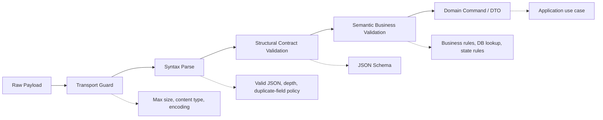
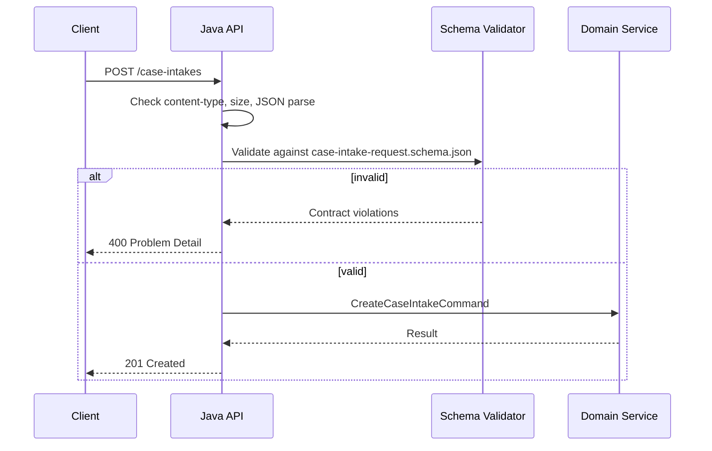
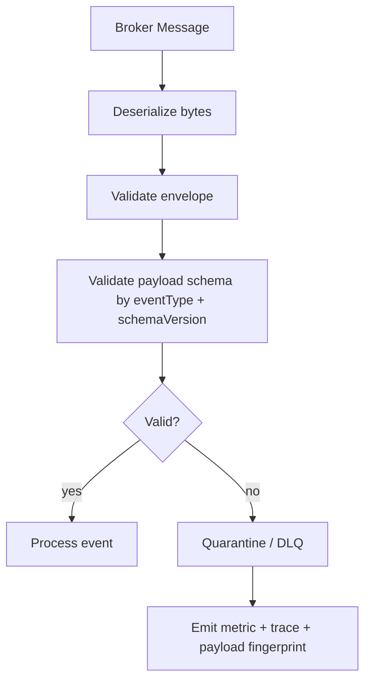
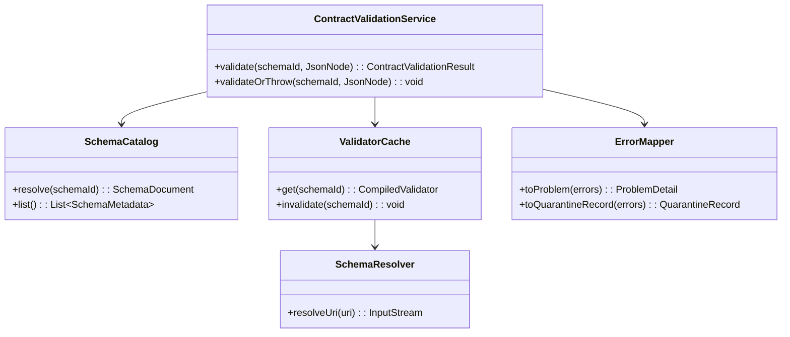
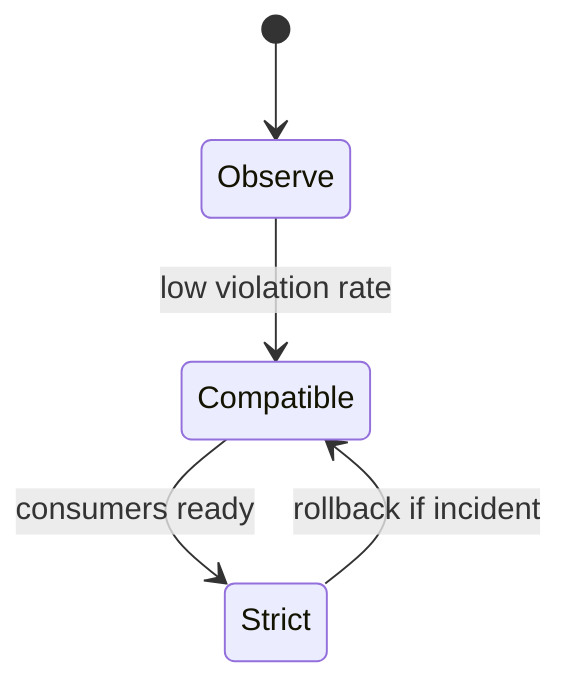
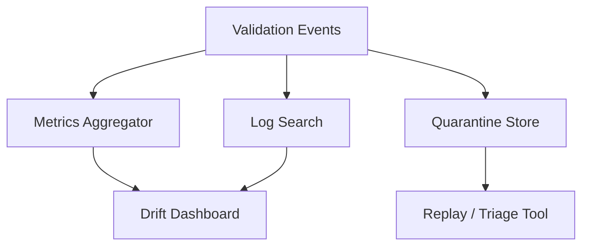
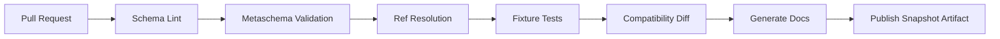

# Part 013 — Java JSON Schema Validation in Production

JSON Schema di production bukan sekadar:

```java
validator.validate(json);
```

Itu hanya bagian kecil.

Yang lebih penting adalah menjawab pertanyaan ini:

> Di boundary mana payload harus divalidasi, schema mana yang dipakai, bagaimana `$ref` di-resolve, bagaimana error dikembalikan ke caller, kapan validasi boleh dilewati, bagaimana failure diobservasi, dan bagaimana perubahan schema tidak menghancurkan consumer?

Part sebelumnya sudah membahas desain dan modularisasi schema. Part ini membahas **runtime enforcement di Java**.

Kita akan treat JSON Schema sebagai **runtime contract firewall**.

Bukan sebagai dokumentasi pasif.

Bukan sebagai dekorasi OpenAPI.

Bukan sebagai file JSON yang hanya dicek di CI.

---

## 1. Production Validation Mental Model

Validasi production-grade punya lima lapisan:



JSON Schema duduk di lapisan **structural contract validation**.

Ia sangat cocok untuk menjawab:

- apakah field wajib ada;
- apakah tipe field benar;
- apakah string mengikuti pola tertentu;
- apakah enum value diizinkan;
- apakah object boleh menerima field tambahan;
- apakah array punya panjang minimum/maksimum;
- apakah shape payload cocok dengan salah satu variant;
- apakah kombinasi field sederhana valid melalui `dependentRequired`, `if`, `then`, `else`, `oneOf`, `allOf`, atau `anyOf`.

Ia tidak cocok untuk menggantikan semua rule bisnis.

Contoh rule yang **bukan** tanggung jawab utama JSON Schema:

- apakah `caseId` benar-benar ada di database;
- apakah user punya authorization terhadap case tersebut;
- apakah case boleh dieskalasi dari state saat ini;
- apakah batas waktu appeal sudah lewat;
- apakah officer yang sama boleh approve keputusan;
- apakah nominal pembayaran cocok dengan ledger.

Jangan masukkan seluruh enterprise logic ke schema. Schema harus menjaga **shape dan primitive invariant**. Domain service menjaga **business invariant**.

---

## 2. Validation Boundary: Where to Validate

Validasi harus ditempatkan di boundary, bukan tersebar acak.

### 2.1 HTTP Ingress

Saat menerima HTTP request:



Ingress validation protects the application from malformed external input.

Di sini validation failure biasanya menjadi:

- `400 Bad Request` untuk syntactically invalid atau structurally invalid request;
- `422 Unprocessable Entity` jika organisasi membedakan syntactic structure dan semantically invalid command;
- `415 Unsupported Media Type` untuk content type salah;
- `413 Payload Too Large` untuk payload terlalu besar.

Yang penting bukan status code favorit. Yang penting adalah **konsistensi taxonomy**.

### 2.2 HTTP Egress

Response juga perlu validasi, minimal di environment non-production dan sampling production.

Kenapa?

Karena provider sering merusak contract tanpa sadar:

- field wajib lupa diisi;
- enum internal bocor ke public API;
- timestamp format berubah;
- numeric precision berubah;
- `null` muncul pada field yang harus absent;
- DTO mapper salah.

Egress validation bisa mahal jika dilakukan penuh di semua response high-throughput. Pola umum:

| Environment | Request Validation | Response Validation |
|---|---:|---:|
| Local | full | full |
| CI contract test | full | full |
| Staging | full | full or sampled |
| Production low-volume critical API | full | sampled/full |
| Production high-throughput API | full for ingress | sampled/feature-flagged |

### 2.3 Event Ingress

Untuk consumer Kafka/event-stream:



Di event system, invalid payload tidak selalu bisa dikembalikan ke producer. Maka pilihan operasionalnya:

- reject offset dan berhenti;
- skip dan log;
- kirim ke DLQ;
- kirim ke quarantine topic;
- accept-with-warning untuk field tambahan;
- route ke manual triage.

Default yang defensible untuk sistem penting: **quarantine, emit telemetry, preserve payload, do not silently drop**.

### 2.4 Batch/File Import

Batch import butuh mode berbeda:

- collect all errors;
- group error by row/document/path;
- continue validation after first error;
- produce validation report;
- support partial acceptance only jika business process mengizinkan.

JSON Schema validator harus bisa menghasilkan error detail cukup kaya untuk operator, bukan hanya `invalid`.

---

## 3. Validator Selection Criteria

Jangan memilih validator hanya karena dependency paling populer.

Gunakan checklist ini.

| Criterion | Why It Matters |
|---|---|
| Draft 2020-12 support | Keyword seperti `$defs`, `unevaluatedProperties`, dynamic reference, vocabulary behavior bisa berbeda antar draft |
| Deterministic `$ref` resolution | Runtime tidak boleh tiba-tiba fetch internet atau filesystem acak |
| Output error model | Error harus bisa dipetakan ke API error dan observability |
| Thread-safety | Validator biasanya dipakai di high-concurrency API |
| Schema caching | Parsing schema per request adalah bug performa |
| Format handling | `format` bisa annotation atau assertion tergantung dialect/config |
| Custom format / keyword | Domain sering butuh `case-id`, `currency-code`, `country-code`, `ulid`, dll |
| Performance behavior | `oneOf`, regex, deep recursion, dan remote ref bisa mahal |
| Security controls | Disable remote loading, depth limit, regex safety, payload size limit |
| License and maintenance | Library contract akan menjadi dependency platform |

Poin penting: JSON Schema Draft 2020-12 memisahkan `format` menjadi vocabulary annotation dan assertion. Artinya `format: email` tidak selalu otomatis menjadi validation failure, tergantung validator dan konfigurasi dialect.

Jangan pernah berasumsi `format` selalu strict.

Buat keputusan eksplisit.

---

## 4. Runtime Architecture

Untuk production, jangan biarkan setiap controller membuat validator sendiri.

Bangun satu validation service.



Komponen minimal:

1. **SchemaCatalog** — daftar schema yang boleh dipakai aplikasi.
2. **SchemaResolver** — resolve `$id` dan `$ref` dari classpath/artifact/registry/local cache.
3. **ValidatorCache** — compile schema sekali, reuse banyak kali.
4. **ContractValidationService** — API tunggal untuk controller, consumer, batch job.
5. **ErrorMapper** — ubah raw validation message menjadi error contract yang stabil.
6. **Metrics/Tracing Adapter** — observability.

---

## 5. Schema Identity in Java Runtime

Jangan validasi dengan file path sebagai identity utama.

Buruk:

```java
validate("schemas/case-intake.json", payload);
```

Lebih baik:

```java
validate(SchemaId.of("case-intake-request", "1.2.0"), payload);
```

Atau:

```java
validate(URI.create("https://contracts.example.com/case/intake/request/1.2.0"), payload);
```

Gunakan identity yang stabil, karena file path bisa berubah tanpa mengubah makna contract.

Contoh value object:

```java
package com.example.contracts.validation;

import java.util.Objects;

public record SchemaId(String name, String version) {

    public SchemaId {
        Objects.requireNonNull(name, "name must not be null");
        Objects.requireNonNull(version, "version must not be null");

        if (name.isBlank()) {
            throw new IllegalArgumentException("schema name must not be blank");
        }
        if (version.isBlank()) {
            throw new IllegalArgumentException("schema version must not be blank");
        }
    }

    public String cacheKey() {
        return name + ":" + version;
    }
}
```

Production rule:

> Application code should depend on logical contract identity, not incidental file layout.

---

## 6. Example Schema Package Layout

Untuk Java service:

```text
case-service/
  src/main/resources/contracts/json-schema/
    catalog.json
    common/
      identifiers.schema.json
      money.schema.json
      time.schema.json
      error.schema.json
    case/
      case-intake-request-1.2.0.schema.json
      case-intake-response-1.2.0.schema.json
      case-escalation-command-1.1.0.schema.json
```

`catalog.json`:

```json
{
  "schemas": [
    {
      "name": "case-intake-request",
      "version": "1.2.0",
      "id": "https://contracts.example.com/case/intake/request/1.2.0",
      "resource": "contracts/json-schema/case/case-intake-request-1.2.0.schema.json",
      "draft": "2020-12",
      "owner": "case-platform-team"
    }
  ]
}
```

Kenapa catalog berguna?

Karena runtime membutuhkan map deterministik:

```text
logical schema id -> resource location -> compiled validator
```

Tanpa catalog, resolver sering berubah menjadi kumpulan heuristik.

Heuristik adalah akar production incident.

---

## 7. Validation Result Model

Jangan expose raw library error secara langsung ke API.

Raw error message bukan contract. Ia bisa berubah saat library upgrade.

Bangun model internal:

```java
package com.example.contracts.validation;

import java.util.List;

public record ContractValidationResult(
        boolean valid,
        String schemaName,
        String schemaVersion,
        List<ContractViolation> violations
) {
    public static ContractValidationResult valid(String schemaName, String schemaVersion) {
        return new ContractValidationResult(schemaName, schemaVersion, List.of());
    }

    public ContractValidationResult(String schemaName, String schemaVersion, List<ContractViolation> violations) {
        this(violations == null || violations.isEmpty(), schemaName, schemaVersion, violations == null ? List.of() : List.copyOf(violations));
    }
}
```

```java
package com.example.contracts.validation;

public record ContractViolation(
        String code,
        String instancePath,
        String schemaPath,
        String message,
        Severity severity
) {
    public enum Severity {
        ERROR,
        WARNING
    }
}
```

Contoh normalized error:

```json
{
  "code": "CONTRACT_REQUIRED_PROPERTY_MISSING",
  "instancePath": "/subject",
  "schemaPath": "/required",
  "message": "required property 'subject' is missing",
  "severity": "ERROR"
}
```

Kode error harus stabil.

Pesan boleh berubah.

Path membantu developer.

Severity membantu mode accept-with-warning.

---

## 8. Java Validation Service Skeleton

Berikut skeleton arsitektur. Detail adapter library bisa diganti.

```java
package com.example.contracts.validation;

import com.fasterxml.jackson.databind.JsonNode;

public interface ContractValidationService {

    ContractValidationResult validate(SchemaId schemaId, JsonNode instance);

    default void validateOrThrow(SchemaId schemaId, JsonNode instance) {
        ContractValidationResult result = validate(schemaId, instance);
        if (!result.valid()) {
            throw new ContractValidationException(result);
        }
    }
}
```

```java
package com.example.contracts.validation;

public final class ContractValidationException extends RuntimeException {
    private final ContractValidationResult result;

    public ContractValidationException(ContractValidationResult result) {
        super("Contract validation failed for " + result.schemaName() + ":" + result.schemaVersion());
        this.result = result;
    }

    public ContractValidationResult result() {
        return result;
    }
}
```

Adapter library disembunyikan:

```java
package com.example.contracts.validation;

import com.fasterxml.jackson.databind.JsonNode;
import java.util.List;
import java.util.concurrent.ConcurrentHashMap;
import java.util.concurrent.ConcurrentMap;

public final class DefaultContractValidationService implements ContractValidationService {

    private final SchemaCatalog schemaCatalog;
    private final JsonSchemaCompiler compiler;
    private final ViolationMapper violationMapper;
    private final ConcurrentMap<String, CompiledJsonSchema> cache = new ConcurrentHashMap<>();

    public DefaultContractValidationService(
            SchemaCatalog schemaCatalog,
            JsonSchemaCompiler compiler,
            ViolationMapper violationMapper
    ) {
        this.schemaCatalog = schemaCatalog;
        this.compiler = compiler;
        this.violationMapper = violationMapper;
    }

    @Override
    public ContractValidationResult validate(SchemaId schemaId, JsonNode instance) {
        SchemaDocument document = schemaCatalog.resolve(schemaId);

        CompiledJsonSchema schema = cache.computeIfAbsent(
                schemaId.cacheKey(),
                ignored -> compiler.compile(document)
        );

        List<RawJsonSchemaViolation> rawViolations = schema.validate(instance);
        List<ContractViolation> violations = rawViolations.stream()
                .map(violationMapper::map)
                .toList();

        return new ContractValidationResult(
                schemaId.name(),
                schemaId.version(),
                violations
        );
    }
}
```

Kita sengaja membuat port:

```java
public interface JsonSchemaCompiler {
    CompiledJsonSchema compile(SchemaDocument document);
}

public interface CompiledJsonSchema {
    List<RawJsonSchemaViolation> validate(JsonNode instance);
}
```

Kenapa?

Karena library bisa berubah. Contract platform tidak boleh bocor terlalu dalam ke controller dan domain service.

---

## 9. Resolver Rule: No Surprise I/O

Runtime resolver tidak boleh melakukan network call acak saat validasi request.

Buruk:

```text
payload arrives -> schema has remote $ref -> validator downloads schema from internet
```

Risiko:

- latency tidak stabil;
- outage eksternal menjatuhkan API;
- SSRF risk;
- supply chain risk;
- behavior tidak reproducible;
- schema berubah tanpa release aplikasi.

Production rule:

> All schemas must be resolved from a trusted, pinned, immutable source.

Sumber yang layak:

- classpath resource dari artifact versioned;
- local immutable filesystem mount;
- internal schema registry dengan pinned version dan local cache;
- build-time bundled compound schema document;
- Maven artifact berisi schema package.

Remote dynamic lookup boleh dipakai untuk admin tooling, bukan hot path request validation.

---

## 10. Schema Compilation and Caching

Parsing dan compiling schema per request adalah anti-pattern.

Buruk:

```java
public void handle(JsonNode request) {
    JsonSchema schema = loadAndCompile("case-intake.schema.json");
    schema.validate(request);
}
```

Akibat:

- CPU waste;
- GC pressure;
- unpredictable latency;
- repeated `$ref` resolution;
- accidental network/file I/O;
- sulit observability.

Lebih baik:

```text
application startup:
  load catalog
  compile known schemas
  warm cache

request hot path:
  get compiled schema from cache
  validate JsonNode
```

Strategi cache:

| Strategy | Use When |
|---|---|
| Eager compile at startup | Schema set kecil/menengah, startup failure lebih baik daripada runtime failure |
| Lazy compile with bounded cache | Banyak schema, tidak semua dipakai |
| Build-time bundled validators | Strict reproducibility, low runtime overhead |
| Hot reload | Internal tooling/staging, bukan default production critical path |

Default yang bagus untuk API penting: **eager compile at startup**.

Jika schema rusak, aplikasi gagal start. Itu lebih baik daripada menerima traffic lalu gagal validasi schema sendiri.

---

## 11. Fail-Fast vs Collect-All

Ada dua mode validasi:

### Fail-Fast

Berhenti pada error pertama.

Cocok untuk:

- ultra-low latency;
- internal gateway high throughput;
- malicious payload filtering;
- event consumer yang hanya butuh tahu valid/invalid.

### Collect-All

Mengumpulkan semua violation.

Cocok untuk:

- public API developer experience;
- UI form validation;
- batch import;
- partner integration onboarding;
- contract test report.

Trade-off:

| Mode | Latency | Developer Experience | Error Report | Risk |
|---|---:|---:|---:|---|
| Fail-fast | lower | weaker | first error only | user fixes one issue at a time |
| Collect-all | higher | stronger | complete-ish | expensive on complex schema |

Production approach:

- ingress API: collect bounded errors;
- security pre-filter: fail-fast;
- batch import: collect all up to limit;
- event consumer: collect enough for triage, not infinite.

Bounded collect-all:

```text
collect at most 100 violations per payload
stop if validation exceeds time/depth/complexity budget
```

---

## 12. Mapping Validation Error to API Error Contract

Raw schema errors harus dipetakan ke public error model.

Contoh problem payload:

```json
{
  "type": "https://errors.example.com/contracts/validation-failed",
  "title": "Request body does not match the required contract",
  "status": 400,
  "code": "CONTRACT_VALIDATION_FAILED",
  "schema": {
    "name": "case-intake-request",
    "version": "1.2.0"
  },
  "violations": [
    {
      "code": "CONTRACT_REQUIRED_PROPERTY_MISSING",
      "path": "/subject",
      "message": "required property 'subject' is missing"
    },
    {
      "code": "CONTRACT_ADDITIONAL_PROPERTY_NOT_ALLOWED",
      "path": "/legacyFlag",
      "message": "property is not allowed by this contract"
    }
  ]
}
```

Rules:

1. Jangan expose full internal schema path jika itu membocorkan struktur internal.
2. Jangan expose Java exception class.
3. Jangan expose stack trace.
4. Stabilkan `code`.
5. Buat `path` berbasis JSON Pointer agar machine-readable.
6. Batasi jumlah violation.
7. Log correlation ID.
8. Jangan log payload penuh jika berisi PII.

---

## 13. Validation Severity: Error vs Warning

Tidak semua contract violation harus langsung hard reject.

Contoh:

- unknown field pada partner migration window;
- enum baru yang belum dikenali consumer;
- deprecated field masih dikirim;
- optional field tidak sesuai preferred format tapi masih parseable;
- payload memakai old schema version yang masih didukung.

Buat mode:

```text
STRICT      -> warnings and errors fail
COMPATIBLE  -> errors fail, warnings emitted
OBSERVE     -> no fail, all violations recorded
DISABLED    -> only syntax/transport guard
```

Production migration sering membutuhkan `OBSERVE` sebelum `STRICT`.



Ini membuat rollout lebih aman.

---

## 14. Structural Validation vs Semantic Validation

Jangan paksa JSON Schema menjadi rule engine.

Contoh schema structural:

```json
{
  "$schema": "https://json-schema.org/draft/2020-12/schema",
  "$id": "https://contracts.example.com/case/escalation-command/1.0.0",
  "type": "object",
  "required": ["caseId", "reason", "requestedBy"],
  "additionalProperties": false,
  "properties": {
    "caseId": {
      "type": "string",
      "pattern": "^CASE-[0-9]{8}$"
    },
    "reason": {
      "type": "string",
      "minLength": 20,
      "maxLength": 4000
    },
    "requestedBy": {
      "type": "string",
      "pattern": "^USR-[0-9]{8}$"
    }
  }
}
```

Contoh semantic validation di Java:

```java
public final class EscalationPolicy {

    public void validate(EscalateCaseCommand command, CaseAggregate aggregate, User actor) {
        if (!actor.canEscalate(aggregate)) {
            throw new ForbiddenOperationException("actor cannot escalate this case");
        }

        if (!aggregate.status().allowsEscalation()) {
            throw new InvalidCaseStateException("case cannot be escalated from " + aggregate.status());
        }

        if (aggregate.isClosed()) {
            throw new InvalidCaseStateException("closed case cannot be escalated");
        }
    }
}
```

Boundary:

- JSON Schema says: shape is acceptable.
- Domain policy says: action is allowed.

Campur keduanya terlalu jauh akan menghasilkan schema yang sulit dibaca, sulit dites, dan sulit di-evolve.

---

## 15. Custom Format Validators

Banyak domain butuh format khusus:

- `case-id`;
- `officer-id`;
- `legal-entity-id`;
- `currency-code`;
- `country-code`;
- `ulid`;
- `iban`;
- `tax-id`;
- `local-business-date`.

Schema:

```json
{
  "type": "string",
  "format": "case-id"
}
```

Tapi ingat: `format` bisa annotation atau assertion. Maka konfigurasi validator harus eksplisit.

Pola yang baik:

```java
public interface FormatValidator {
    String name();
    boolean isValid(String value);
}
```

```java
public final class CaseIdFormatValidator implements FormatValidator {
    private static final Pattern PATTERN = Pattern.compile("^CASE-[0-9]{8}$");

    @Override
    public String name() {
        return "case-id";
    }

    @Override
    public boolean isValid(String value) {
        return value != null && PATTERN.matcher(value).matches();
    }
}
```

Namun gunakan custom format secara disiplin.

Jangan buat custom format untuk rule yang butuh database lookup.

Buruk:

```json
{
  "type": "string",
  "format": "existing-active-case-id"
}
```

Itu bukan format. Itu business rule.

---

## 16. Regex Safety

JSON Schema sering memakai `pattern`.

Regex bisa menjadi sumber ReDoS jika tidak hati-hati.

Anti-pattern:

```json
{
  "type": "string",
  "pattern": "^(a+)+$"
}
```

Payload tertentu bisa membuat regex engine backtracking sangat lama.

Rules:

1. Hindari nested quantifier berbahaya.
2. Gunakan regex sederhana untuk contract primitive.
3. Batasi panjang string dengan `maxLength` sebelum pattern.
4. Review regex di CI.
5. Gunakan allowlist pattern, bukan parser kompleks.
6. Jangan validasi email super-kompleks dengan regex monster.

Contoh lebih aman:

```json
{
  "type": "string",
  "minLength": 13,
  "maxLength": 13,
  "pattern": "^CASE-[0-9]{8}$"
}
```

`maxLength` adalah security control, bukan hanya documentation.

---

## 17. Payload Size, Depth, and Complexity Budget

Validasi schema tidak menggantikan transport guard.

Sebelum JSON parse:

- batasi request body size;
- batasi decompressed size;
- batasi content type;
- batasi charset/encoding;
- batasi request timeout.

Saat parse:

- batasi nesting depth jika parser mendukung;
- tolak payload terlalu besar;
- putuskan duplicate key policy;
- jangan log payload penuh.

Saat validasi:

- batasi jumlah error;
- batasi runtime per payload jika memungkinkan;
- hindari schema yang memakai nested `oneOf` terlalu banyak;
- hindari dynamic reference tanpa kontrol;
- disable remote reference loading.

Production validation perlu budget:

```text
maxPayloadBytes = 1 MB
maxStringLength = schema-defined
maxValidationErrors = 100
maxArrayItems = schema-defined
maxObjectDepth = parser-defined
remoteRefLoading = false
```

Tanpa budget, validator bisa menjadi DoS amplifier.

---

## 18. Duplicate JSON Field Policy

JSON object secara konseptual adalah name/value collection, tetapi payload raw bisa mengandung duplicate key:

```json
{
  "caseId": "CASE-00000001",
  "caseId": "CASE-99999999"
}
```

Parser bisa memilih value terakhir, value pertama, atau menjaga duplikasi tergantung konfigurasi.

Untuk contract-grade system, duplicate keys sebaiknya ditolak sebelum schema validation.

Kenapa?

Karena schema validator biasanya melihat tree hasil parse, bukan raw token stream. Jika parser sudah membuang salah satu value, validator tidak tahu ada duplikasi.

Rule:

> Duplicate JSON object properties are syntax-adjacent integrity failures. Treat them as invalid input.

Dengan Jackson, pertimbangkan fitur strict duplicate detection pada parser layer.

---

## 19. Request Validation Flow in JAX-RS Style

Contoh filter/interceptor mental model:

```java
@Provider
public final class JsonContractValidationFilter implements ContainerRequestFilter {

    private final ObjectMapper objectMapper;
    private final ContractValidationService validationService;
    private final RouteSchemaMapping routeSchemaMapping;

    public JsonContractValidationFilter(
            ObjectMapper objectMapper,
            ContractValidationService validationService,
            RouteSchemaMapping routeSchemaMapping
    ) {
        this.objectMapper = objectMapper;
        this.validationService = validationService;
        this.routeSchemaMapping = routeSchemaMapping;
    }

    @Override
    public void filter(ContainerRequestContext context) throws IOException {
        RouteKey route = RouteKey.from(context);
        SchemaId schemaId = routeSchemaMapping.requestSchemaFor(route).orElse(null);

        if (schemaId == null) {
            return;
        }

        byte[] body = context.getEntityStream().readAllBytes();
        JsonNode json = objectMapper.readTree(body);

        ContractValidationResult result = validationService.validate(schemaId, json);
        if (!result.valid()) {
            throw new ContractValidationException(result);
        }

        context.setEntityStream(new ByteArrayInputStream(body));
    }
}
```

Catatan production:

- Jangan `readAllBytes()` tanpa max size guard.
- Request stream harus dikembalikan agar resource method tetap bisa membaca body.
- Untuk large payload, pertimbangkan streaming validation atau dedicated ingestion path.
- Mapping route ke schema harus explicit, bukan hasil tebak URI.

---

## 20. Event Validation Flow

Event envelope:

```json
{
  "eventId": "01J5Q2A4Z9D2QH2XK8MZ1V3P9A",
  "eventType": "CaseEscalated",
  "schemaVersion": "1.1.0",
  "occurredAt": "2026-07-03T09:30:00Z",
  "producer": "case-service",
  "payload": {
    "caseId": "CASE-00001234",
    "escalationLevel": "REGIONAL_REVIEW"
  }
}
```

Consumer flow:

```java
public final class ValidatingEventHandler {

    private final ContractValidationService validationService;
    private final EventSchemaMapping schemaMapping;
    private final EventProcessor processor;
    private final QuarantinePublisher quarantinePublisher;

    public void handle(JsonNode envelope) {
        ContractValidationResult envelopeResult = validationService.validate(
                new SchemaId("event-envelope", "1.0.0"),
                envelope
        );

        if (!envelopeResult.valid()) {
            quarantinePublisher.publish(envelope, envelopeResult);
            return;
        }

        String eventType = envelope.path("eventType").asText();
        String schemaVersion = envelope.path("schemaVersion").asText();
        JsonNode payload = envelope.path("payload");

        SchemaId payloadSchema = schemaMapping.resolve(eventType, schemaVersion);
        ContractValidationResult payloadResult = validationService.validate(payloadSchema, payload);

        if (!payloadResult.valid()) {
            quarantinePublisher.publish(envelope, payloadResult);
            return;
        }

        processor.process(envelope);
    }
}
```

Event validation harus menjaga dua kontrak:

1. envelope contract;
2. payload contract.

Jangan campur semua event payload menjadi satu schema raksasa.

---

## 21. Observability

Validation tanpa observability hanya menimbulkan misteri.

Minimal metrics:

```text
contract.validation.total{schema,version,boundary,result}
contract.validation.duration{schema,version,boundary}
contract.validation.violations.total{schema,version,code}
contract.validation.payload.bytes{schema,version,boundary}
contract.schema.cache.hit.total
contract.schema.cache.miss.total
contract.schema.compile.duration
contract.quarantine.total{schema,version,reason}
```

Log event saat invalid:

```json
{
  "event": "contract_validation_failed",
  "schemaName": "case-intake-request",
  "schemaVersion": "1.2.0",
  "boundary": "http_ingress",
  "correlationId": "req-123",
  "violationCount": 2,
  "violationCodes": [
    "CONTRACT_REQUIRED_PROPERTY_MISSING",
    "CONTRACT_ADDITIONAL_PROPERTY_NOT_ALLOWED"
  ],
  "payloadFingerprint": "sha256:...",
  "payloadLogged": false
}
```

Jangan log raw payload default. Gunakan fingerprint dan secure sample storage jika perlu.

---

## 22. Drift Detection

Validasi production bisa dipakai untuk melihat drift:

- producer mengirim field yang belum ada di schema;
- consumer menerima schema version lama terlalu lama;
- deprecated field masih tinggi;
- partner sering mengirim invalid enum;
- response provider mulai menyimpang dari OpenAPI/JSON Schema.

Drift dashboard:



Kontrak yang tidak diobservasi akan membusuk.

---

## 23. Testing Strategy

Test minimal:

```text
src/test/resources/contracts/fixtures/
  case-intake-request/
    valid-minimal.json
    valid-full.json
    invalid-missing-subject.json
    invalid-additional-property.json
    invalid-case-id-pattern.json
    invalid-null-priority.json
```

JUnit style:

```java
class CaseIntakeRequestContractTest {

    private ContractValidationService validationService;

    @Test
    void validMinimalPayloadPasses() {
        JsonNode payload = fixture("valid-minimal.json");
        ContractValidationResult result = validationService.validate(
                new SchemaId("case-intake-request", "1.2.0"),
                payload
        );

        assertTrue(result.valid());
    }

    @Test
    void missingSubjectFailsWithStableCode() {
        JsonNode payload = fixture("invalid-missing-subject.json");
        ContractValidationResult result = validationService.validate(
                new SchemaId("case-intake-request", "1.2.0"),
                payload
        );

        assertFalse(result.valid());
        assertTrue(result.violations().stream()
                .anyMatch(v -> v.code().equals("CONTRACT_REQUIRED_PROPERTY_MISSING")));
    }
}
```

Test bukan hanya valid/invalid. Test juga:

- error code;
- JSON Pointer path;
- schema version;
- response mapping;
- duplicate key behavior;
- payload size guard;
- remote ref disabled;
- custom format validator;
- unknown field behavior.

---

## 24. Contract Validation CI Gates

CI harus menjalankan:

1. schema syntax validation;
2. metaschema validation;
3. `$ref` resolution check;
4. fixture validation;
5. invalid fixture failure check;
6. compatibility check against previous version;
7. style/lint check;
8. max complexity check;
9. documentation generation;
10. artifact publishing dry run.

Pipeline:



Jangan biarkan schema masuk main branch hanya karena JSON-nya valid.

Schema harus **usable**, **resolvable**, **testable**, dan **compatible**.

---

## 25. Runtime Feature Flags

Validation behavior kadang perlu diubah saat rollout.

Feature flags yang berguna:

```text
contract.validation.enabled=true
contract.validation.response.enabled=false
contract.validation.mode=COMPATIBLE
contract.validation.maxErrors=100
contract.validation.quarantine.enabled=true
contract.validation.schema.case-intake-request.1.2.0.mode=STRICT
```

Namun jangan jadikan feature flag sebagai pintu bypass permanen.

Setiap bypass harus punya:

- owner;
- reason;
- expiry date;
- metric;
- risk acceptance.

---

## 26. Common Anti-Patterns

### Anti-Pattern 1: Validate After Mapping

Buruk:

```text
JSON -> DTO -> validate DTO with JSON Schema
```

Jika mapping sudah menghapus field unknown, mengubah null, atau menormalisasi string, validator tidak lagi melihat payload asli.

Validasi contract harus terjadi pada payload representation yang sedekat mungkin dengan input asli.

### Anti-Pattern 2: One Global Schema for Everything

Satu schema raksasa untuk semua request akan menjadi tidak maintainable.

Gunakan schema per boundary operation/event/file.

### Anti-Pattern 3: Required Everywhere

Membuat semua field required terlihat strict, tetapi menghancurkan evolvability.

Required field adalah komitmen jangka panjang.

### Anti-Pattern 4: additionalProperties False Without Extension Strategy

`additionalProperties: false` bagus untuk strictness, tetapi buruk jika tidak ada extension strategy.

Untuk public/partner API, pertimbangkan:

```json
{
  "properties": {
    "extensions": {
      "type": "object",
      "additionalProperties": true
    }
  },
  "additionalProperties": false
}
```

### Anti-Pattern 5: Trusting format Without Testing

`format` tidak selalu assertion. Buat test invalid fixture untuk setiap format penting.

### Anti-Pattern 6: Dynamic Remote Ref in Hot Path

Jangan lakukan network I/O saat validasi request.

### Anti-Pattern 7: Logging Invalid Payload Full Body

Invalid payload sering mengandung PII, token, atau rahasia.

---

## 27. Production Readiness Checklist

Sebelum JSON Schema validation dianggap production-ready:

- [ ] Semua schema punya `$schema` dan `$id` stabil.
- [ ] Semua `$ref` bisa di-resolve offline.
- [ ] Remote reference loading disabled di hot path.
- [ ] Validator support draft yang dipakai.
- [ ] `format` behavior diputuskan dan dites.
- [ ] Schema compile/cache strategy jelas.
- [ ] Request size guard ada sebelum parse.
- [ ] Duplicate key policy jelas.
- [ ] Error model stabil.
- [ ] Violation count dibatasi.
- [ ] Payload PII tidak bocor ke log.
- [ ] Metrics validation tersedia.
- [ ] Quarantine/DLQ tersedia untuk async invalid payload.
- [ ] Fixture valid dan invalid tersedia.
- [ ] CI mengecek metaschema, ref, fixture, compatibility.
- [ ] Feature flag punya expiry dan owner.
- [ ] Schema owner jelas.

---

## 28. Mini Case Study: Case Intake API

Request schema:

```json
{
  "$schema": "https://json-schema.org/draft/2020-12/schema",
  "$id": "https://contracts.example.com/case/intake/request/1.2.0",
  "title": "Case Intake Request",
  "type": "object",
  "required": ["source", "subject", "receivedAt"],
  "additionalProperties": false,
  "properties": {
    "source": {
      "type": "string",
      "enum": ["PORTAL", "EMAIL", "PHONE", "REFERRAL"]
    },
    "subject": {
      "type": "object",
      "required": ["type", "displayName"],
      "additionalProperties": false,
      "properties": {
        "type": {
          "type": "string",
          "enum": ["PERSON", "ORGANIZATION", "UNKNOWN"]
        },
        "displayName": {
          "type": "string",
          "minLength": 1,
          "maxLength": 300
        },
        "externalReference": {
          "type": "string",
          "maxLength": 100
        }
      }
    },
    "receivedAt": {
      "type": "string",
      "format": "date-time"
    },
    "allegations": {
      "type": "array",
      "maxItems": 100,
      "items": {
        "type": "object",
        "required": ["category", "description"],
        "additionalProperties": false,
        "properties": {
          "category": {
            "type": "string",
            "maxLength": 80
          },
          "description": {
            "type": "string",
            "minLength": 10,
            "maxLength": 4000
          }
        }
      }
    }
  }
}
```

Validation policy:

```text
boundary: http_ingress
schema: case-intake-request:1.2.0
mode: STRICT
maxPayloadBytes: 512 KB
maxValidationErrors: 50
remoteRef: disabled
formatAssertion: enabled for date-time
quarantine: not applicable, return 400
```

Semantic policy setelah structural validation:

```text
- source must be enabled for tenant
- allegation category must exist in active reference data
- subject may be deduplicated against existing entities
- receivedAt must not be more than configured threshold in the future
```

Ini pemisahan yang sehat.

---

## 29. Exercises

1. Ambil satu endpoint JSON dari sistemmu. Pisahkan rule menjadi:
   - transport guard;
   - syntax guard;
   - JSON Schema structural validation;
   - semantic domain validation.

2. Buat `ContractValidationResult` internal yang tidak bergantung pada library.

3. Buat fixture:
   - valid minimal;
   - valid full;
   - invalid missing required;
   - invalid additional property;
   - invalid enum;
   - invalid null;
   - invalid format.

4. Tambahkan metric:

```text
contract.validation.total{schema,version,boundary,result}
```

5. Buat satu invalid payload dan pastikan:
   - API mengembalikan error code stabil;
   - log tidak memuat PII;
   - path violation bisa dipahami consumer.

---

## 30. Key Takeaways

JSON Schema validation di Java production adalah masalah arsitektur runtime, bukan hanya masalah library.

Mental model utama:

1. Validate at boundary, before mapping.
2. Separate structural and semantic validation.
3. Resolve schemas deterministically.
4. Compile and cache schemas.
5. Normalize error output.
6. Make format behavior explicit.
7. Guard against payload, regex, reference, and complexity abuse.
8. Observe validation failures as contract drift.
9. Test both valid and invalid fixtures.
10. Treat schema validation as part of platform governance.

Kalau JSON Schema adalah contract, maka validator adalah enforcement mechanism.

Contract tanpa enforcement hanyalah dokumen.

Enforcement tanpa observability hanyalah black box.

Observability tanpa governance hanyalah dashboard.

Production-grade contract engineering membutuhkan ketiganya.

---

## References

- JSON Schema Draft 2020-12: `https://json-schema.org/draft/2020-12`
- JSON Schema Validation Vocabulary 2020-12: `https://json-schema.org/draft/2020-12/json-schema-validation`
- JSON Schema official specification page: `https://json-schema.org/specification`
