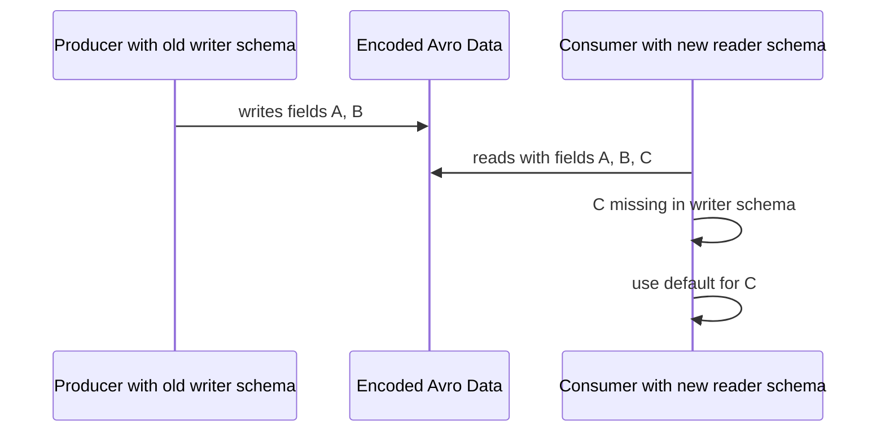
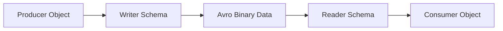

# Part 014 — Avro Core Model: Records, Unions, Defaults, and Logical Types

Avro sering diperkenalkan sebagai “schema format untuk Kafka”.

Itu terlalu sempit.

Avro adalah sistem serialization dengan schema yang menjadi bagian inti dari cara data ditulis, dibaca, di-resolve, dan dievolusi. Ia punya konsekuensi yang berbeda dari JSON Schema, XSD, Protobuf, dan OpenAPI.

Kalau JSON Schema biasanya memvalidasi JSON self-describing, Avro biasanya mengandalkan kombinasi:

```text
writer schema + encoded data + reader schema
```

Inilah mental model pentingnya:

> Avro compatibility bukan hanya tentang apakah dua file schema mirip. Compatibility adalah tentang apakah data yang ditulis dengan writer schema lama bisa dibaca dengan reader schema baru, dan sebaliknya sesuai arah compatibility yang dipilih.

Part ini membuka blok Avro dengan fokus pada model schema dasar: records, fields, names, namespaces, unions, defaults, enums, fixed, dan logical types.

Kita belum masuk penuh ke Java generated code dan schema registry. Itu part berikutnya.

---

## 1. Why Avro Exists in Contract Engineering

Avro kuat untuk:

- event streaming;
- append-only log;
- Kafka payload;
- batch file di data lake;
- compact binary serialization;
- data exchange antar service yang butuh schema evolution;
- dynamic language integration;
- schema registry workflow;
- long-lived data replay.

Avro kurang ideal untuk:

- public HTTP API contract;
- human-readable request debugging tanpa tooling;
- deeply nested polymorphic API payload;
- low-level RPC binary protocol yang sangat ketat seperti gRPC/Protobuf;
- validation-only use case tanpa serialization need.

Avro sangat cocok ketika pertanyaan utamanya adalah:

> Bagaimana data yang sudah diproduksi kemarin, bulan lalu, atau tahun lalu tetap bisa dibaca oleh consumer hari ini?

---

## 2. Avro Data Model

Avro mendukung primitive dan complex types.

Primitive:

| Type | Meaning |
|---|---|
| `null` | no value |
| `boolean` | boolean |
| `int` | 32-bit signed integer |
| `long` | 64-bit signed integer |
| `float` | single precision floating point |
| `double` | double precision floating point |
| `bytes` | sequence of bytes |
| `string` | Unicode character sequence |

Complex:

| Type | Use |
|---|---|
| `record` | structured object with named fields |
| `enum` | finite named symbol set |
| `array` | ordered collection |
| `map` | string-keyed map |
| `union` | value can be one of several schemas |
| `fixed` | fixed-size byte sequence |

A schema can be expressed as:

Primitive string:

```json
"string"
```

Object:

```json
{
  "type": "record",
  "name": "CaseCreated",
  "namespace": "com.example.contracts.caseevents",
  "fields": []
}
```

Array union:

```json
["null", "string"]
```

---

## 3. Record as the Default Contract Shape

Record adalah bentuk paling umum untuk event dan data object.

```json
{
  "type": "record",
  "name": "CaseCreated",
  "namespace": "com.example.contracts.caseevents.v1",
  "doc": "Emitted when a regulatory case is created.",
  "fields": [
    {
      "name": "caseId",
      "type": "string",
      "doc": "Stable case identifier."
    },
    {
      "name": "createdAt",
      "type": {
        "type": "long",
        "logicalType": "timestamp-micros"
      }
    },
    {
      "name": "source",
      "type": {
        "type": "enum",
        "name": "CaseSource",
        "symbols": ["PORTAL", "EMAIL", "PHONE", "REFERRAL", "UNKNOWN"],
        "default": "UNKNOWN"
      }
    }
  ]
}
```

Record punya:

- `type`;
- `name`;
- optional `namespace`;
- optional `doc`;
- `fields`.

Field punya:

- `name`;
- `type`;
- optional `doc`;
- optional `default`;
- optional `aliases`;
- optional `order`.

Mental model:

> Record adalah named product type. Field identity ada pada nama, bukan posisi, untuk schema resolution. Namun binary encoding menulis field sesuai order writer schema.

Ini penting. Avro binary tidak membawa field name untuk setiap value. Reader membutuhkan schema untuk memahami byte stream.

---

## 4. Names and Namespaces

Avro named types meliputi:

- record;
- enum;
- fixed.

Full name dibentuk dari `namespace` + `name`.

```json
{
  "type": "record",
  "name": "CaseCreated",
  "namespace": "com.example.contracts.caseevents.v1"
}
```

Full name:

```text
com.example.contracts.caseevents.v1.CaseCreated
```

Production rule:

> Treat Avro full name as a long-lived contract identity. Do not casually rename it.

Rename bukan sekadar refactor. Rename bisa menjadi breaking change kecuali ditangani dengan alias dan compatibility testing.

### 4.1 Namespace Strategy

Contoh namespace:

```text
com.company.contracts.caseevents.v1
com.company.contracts.commands.v1
com.company.contracts.reference.v1
```

Hindari namespace yang terlalu technical:

```text
com.company.case.service.kafka.dto
```

Itu mengikat contract pada implementasi service hari ini. Jika service dipecah, namespace menjadi misleading.

Lebih baik namespace berbasis domain contract:

```text
com.company.contracts.case.events
com.company.contracts.case.commands
com.company.contracts.case.snapshots
```

Versioning di namespace perlu hati-hati. Jika semua minor change membuat namespace `v2`, consumer akan hidup di banyak type paralel. Avro punya schema evolution; gunakan itu sebelum membuat namespace baru.

---

## 5. Field Design

Field Avro adalah komitmen evolusi.

Contoh field sederhana:

```json
{
  "name": "caseId",
  "type": "string",
  "doc": "Stable case identifier."
}
```

Desain field harus menjawab:

1. Apakah field wajib secara konseptual?
2. Apakah field bisa tidak diketahui saat event dibuat?
3. Apakah field bisa berubah setelah event dibuat?
4. Apakah field nullable atau absent?
5. Apakah field punya default yang aman?
6. Apakah field akan menjadi filter/query key?
7. Apakah field mengandung PII?
8. Apakah field bisa berevolusi tanpa breaking consumer?

### 5.1 Bad Field Names

Buruk:

```json
{ "name": "data", "type": "string" }
{ "name": "value", "type": "string" }
{ "name": "flag", "type": "boolean" }
{ "name": "status2", "type": "string" }
{ "name": "newCaseId", "type": "string" }
```

Nama field harus menjelaskan invariant.

Lebih baik:

```json
{ "name": "caseId", "type": "string" }
{ "name": "escalationReason", "type": "string" }
{ "name": "requiresManualReview", "type": "boolean", "default": false }
{ "name": "lifecycleStatus", "type": "string" }
```

### 5.2 Boolean Trap

Boolean sering terlihat sederhana tetapi miskin evolusi.

```json
{
  "name": "approved",
  "type": "boolean"
}
```

Apa arti `false`?

- rejected?
- pending?
- not reviewed?
- unknown?
- not applicable?

Lebih evolvable:

```json
{
  "name": "approvalStatus",
  "type": {
    "type": "enum",
    "name": "ApprovalStatus",
    "symbols": ["PENDING", "APPROVED", "REJECTED", "NOT_APPLICABLE", "UNKNOWN"],
    "default": "UNKNOWN"
  },
  "default": "UNKNOWN"
}
```

Boolean cocok untuk invariant yang benar-benar binary dan stabil:

```json
{
  "name": "requiresManualReview",
  "type": "boolean",
  "default": false
}
```

---

## 6. Defaults: The Most Misunderstood Avro Feature

Default di Avro bukan “field akan otomatis diisi saat writer menulis data”.

Default dipakai oleh reader ketika reader schema memiliki field yang tidak ada di writer schema.

Mental model:



Contoh evolusi aman:

Writer schema lama:

```json
{
  "type": "record",
  "name": "CaseCreated",
  "fields": [
    { "name": "caseId", "type": "string" }
  ]
}
```

Reader schema baru:

```json
{
  "type": "record",
  "name": "CaseCreated",
  "fields": [
    { "name": "caseId", "type": "string" },
    { "name": "priority", "type": "string", "default": "NORMAL" }
  ]
}
```

Consumer baru bisa membaca data lama karena `priority` punya default.

### 6.1 Defaults Are Contract Commitments

Default harus aman secara business.

Buruk:

```json
{
  "name": "riskLevel",
  "type": "string",
  "default": "LOW"
}
```

Jika risk belum diketahui, default `LOW` bisa misleading dan berbahaya.

Lebih aman:

```json
{
  "name": "riskLevel",
  "type": {
    "type": "enum",
    "name": "RiskLevel",
    "symbols": ["LOW", "MEDIUM", "HIGH", "UNKNOWN"],
    "default": "UNKNOWN"
  },
  "default": "UNKNOWN"
}
```

Default harus merepresentasikan **unknown** atau **safe fallback**, bukan nilai optimistik.

---

## 7. Nullability and Optionality

Avro tidak punya keyword `optional` seperti beberapa format lain. Biasanya optional field dimodelkan dengan union bersama `null`.

```json
{
  "name": "externalReference",
  "type": ["null", "string"],
  "default": null
}
```

Rule penting:

> For union defaults, the default value must match the first branch of the union.

Karena itu pola umum:

```json
"type": ["null", "string"],
"default": null
```

Bukan:

```json
"type": ["string", "null"],
"default": null
```

Yang kedua bermasalah karena default `null` tidak cocok dengan branch pertama `string`.

### 7.1 Null Is Not the Same as Missing

Dalam Avro:

- missing field terjadi saat reader schema punya field yang writer schema tidak punya;
- null adalah value eksplisit jika field type mengizinkan null;
- default adalah cara reader mengisi field missing.

Jangan samakan:

```text
missing != null != empty string != unknown
```

Contoh desain:

```json
{
  "name": "closureReason",
  "type": [
    "null",
    {
      "type": "enum",
      "name": "ClosureReason",
      "symbols": ["RESOLVED", "WITHDRAWN", "DUPLICATE", "OUT_OF_SCOPE", "UNKNOWN"],
      "default": "UNKNOWN"
    }
  ],
  "default": null,
  "doc": "Null means the case is not closed yet. UNKNOWN means closed but reason is not known."
}
```

Ini lebih jelas daripada menjadikan `UNKNOWN` untuk semua kondisi.

---

## 8. Union Discipline

Avro union adalah daftar kemungkinan schema.

```json
["null", "string"]
```

Atau:

```json
[
  "null",
  "com.example.contracts.caseevents.v1.PersonSubject",
  "com.example.contracts.caseevents.v1.OrganizationSubject"
]
```

Union berguna, tetapi mudah disalahgunakan.

### 8.1 Good Union Use

Good:

```json
{
  "name": "middleName",
  "type": ["null", "string"],
  "default": null
}
```

Good:

```json
{
  "name": "subject",
  "type": [
    {
      "type": "record",
      "name": "PersonSubject",
      "fields": [
        { "name": "personId", "type": "string" },
        { "name": "displayName", "type": "string" }
      ]
    },
    {
      "type": "record",
      "name": "OrganizationSubject",
      "fields": [
        { "name": "organizationId", "type": "string" },
        { "name": "displayName", "type": "string" }
      ]
    }
  ]
}
```

### 8.2 Bad Union Use

Bad:

```json
{
  "name": "value",
  "type": ["null", "string", "int", "long", "double", "boolean"]
}
```

Ini schema yang menyerah. Consumer harus menebak makna value.

Bad:

```json
{
  "name": "payload",
  "type": [
    "CaseCreated",
    "CaseUpdated",
    "CaseClosed",
    "CaseEscalated",
    "CaseAssigned",
    "CaseReopened"
  ]
}
```

Untuk event stream, sering lebih baik pisahkan event type/subject atau gunakan envelope dengan schema registry subject yang jelas, bukan satu union raksasa yang berubah terus.

### 8.3 Union Is Not Inheritance

Jangan berpikir union seperti class inheritance Java.

Avro union adalah encoding choice, bukan hierarchy behavior.

Di Java, union sering menjadi awkward karena generated API perlu merepresentasikan field yang bisa memuat beberapa tipe. Polymorphism yang terlalu dalam akan membuat consumer code rapuh.

Rule:

> Use union for small, stable variation. Avoid open-ended domain polymorphism inside Avro records.

---

## 9. Enum Design

Enum terlihat mudah, tetapi evolution-nya sensitif.

```json
{
  "type": "enum",
  "name": "CaseStatus",
  "symbols": [
    "DRAFT",
    "OPEN",
    "UNDER_REVIEW",
    "ESCALATED",
    "CLOSED",
    "UNKNOWN"
  ],
  "default": "UNKNOWN"
}
```

Rules:

1. Gunakan uppercase stable symbol.
2. Jangan rename symbol tanpa migration plan.
3. Tambahkan `UNKNOWN` jika consumer perlu bertahan terhadap value baru.
4. Jangan pakai enum untuk reference data yang berubah sering.
5. Hindari membuat enum terlalu granular jika lifecycle belum stabil.
6. Document semantic setiap symbol.

### 9.1 Enum vs String

Enum kuat untuk bounded domain yang stabil:

```text
CaseStatus, EventAction, DecisionOutcome
```

String lebih baik untuk controlled vocabulary yang dikelola di luar schema:

```text
legal basis code, violation category, industry classification, jurisdiction code
```

Jika code list berubah mingguan, jangan release schema setiap minggu hanya untuk menambah enum.

Pakai string dengan validation di reference data service atau code-list contract terpisah.

---

## 10. Arrays and Maps

Array:

```json
{
  "name": "allegations",
  "type": {
    "type": "array",
    "items": {
      "type": "record",
      "name": "Allegation",
      "fields": [
        { "name": "categoryCode", "type": "string" },
        { "name": "description", "type": "string" }
      ]
    }
  },
  "default": []
}
```

Map:

```json
{
  "name": "attributes",
  "type": {
    "type": "map",
    "values": "string"
  },
  "default": {}
}
```

Map key di Avro adalah string. Jika kamu butuh typed key, gunakan array of records:

```json
{
  "name": "riskScores",
  "type": {
    "type": "array",
    "items": {
      "type": "record",
      "name": "RiskScoreEntry",
      "fields": [
        { "name": "riskType", "type": "string" },
        { "name": "score", "type": "double" }
      ]
    }
  },
  "default": []
}
```

### 10.1 Array Default Trap

Default empty array berarti “tidak ada item”.

Itu berbeda dari “unknown”.

Jika unknown penting, gunakan union:

```json
{
  "name": "relatedCaseIds",
  "type": [
    "null",
    {
      "type": "array",
      "items": "string"
    }
  ],
  "default": null,
  "doc": "Null means not evaluated yet. Empty array means evaluated and no related cases found."
}
```

---

## 11. Fixed and Bytes

`bytes` untuk variable-length bytes.

```json
{
  "name": "attachmentHash",
  "type": "bytes"
}
```

`fixed` untuk fixed-length bytes:

```json
{
  "type": "fixed",
  "name": "Sha256Hash",
  "size": 32
}
```

`fixed` berguna untuk:

- hash;
- binary identifiers;
- decimal backing storage;
- protocol-level fixed bytes.

Namun untuk application event, string representation sering lebih operable:

```json
{
  "name": "attachmentSha256",
  "type": "string",
  "doc": "Lowercase hex-encoded SHA-256 digest."
}
```

Trade-off:

| Representation | Pros | Cons |
|---|---|---|
| `bytes`/`fixed` | compact, precise | less human-readable, harder debugging |
| `string` | readable, easier logs/tools | bigger, needs format discipline |

---

## 12. Logical Types

Logical type memberi makna tambahan pada primitive/complex underlying type.

Contoh timestamp:

```json
{
  "name": "occurredAt",
  "type": {
    "type": "long",
    "logicalType": "timestamp-micros"
  }
}
```

Underlying type tetap `long`. Logical type memberi semantic: microseconds since Unix epoch.

Common logical types:

| Logical Type | Backing Type | Use |
|---|---|---|
| `decimal` | `bytes` or `fixed` | exact decimal number |
| `uuid` | `string` | UUID value |
| `date` | `int` | days since Unix epoch |
| `time-millis` | `int` | time of day millis |
| `time-micros` | `long` | time of day micros |
| `timestamp-millis` | `long` | instant millis |
| `timestamp-micros` | `long` | instant micros |
| `local-timestamp-millis` | `long` | local timestamp millis |
| `local-timestamp-micros` | `long` | local timestamp micros |

Production rule:

> Prefer logical types for time, date, UUID, and decimal. Do not encode critical semantic types as arbitrary strings unless interoperability demands it.

---

## 13. Time Modeling

Time bugs are contract bugs.

Avro gives several choices.

### 13.1 Instant Event Time

For event occurrence time:

```json
{
  "name": "occurredAt",
  "type": {
    "type": "long",
    "logicalType": "timestamp-micros"
  }
}
```

Use for:

- event occurrence;
- audit log timestamp;
- created/updated instant;
- cross-timezone ordering.

### 13.2 Business Date

For date-only concept:

```json
{
  "name": "effectiveDate",
  "type": {
    "type": "int",
    "logicalType": "date"
  }
}
```

Use for:

- due date;
- filing date;
- effective date;
- local business day.

### 13.3 Local Timestamp

Local timestamp has no timezone/offset.

Use carefully:

```json
{
  "name": "localAppointmentTime",
  "type": {
    "type": "long",
    "logicalType": "local-timestamp-micros"
  }
}
```

If timezone matters, include timezone separately:

```json
{
  "name": "appointmentTimeZone",
  "type": "string",
  "doc": "IANA timezone ID, for example Asia/Jakarta."
}
```

Rule:

> For distributed systems, event time should usually be an instant. Business date can be date. Local timestamp requires explicit domain justification.

---

## 14. Money and Decimal

Never use `float` or `double` for money.

Bad:

```json
{
  "name": "penaltyAmount",
  "type": "double"
}
```

Good:

```json
{
  "name": "penaltyAmount",
  "type": {
    "type": "bytes",
    "logicalType": "decimal",
    "precision": 18,
    "scale": 2
  }
}
```

Better as structured money:

```json
{
  "type": "record",
  "name": "Money",
  "namespace": "com.example.contracts.common",
  "fields": [
    {
      "name": "currency",
      "type": "string",
      "doc": "ISO 4217 currency code."
    },
    {
      "name": "amount",
      "type": {
        "type": "bytes",
        "logicalType": "decimal",
        "precision": 18,
        "scale": 2
      }
    }
  ]
}
```

Decimal design requires:

- precision;
- scale;
- rounding policy outside schema;
- currency;
- business meaning;
- whether negative values are allowed.

Avro schema can encode precision/scale, but cannot encode every monetary policy.

---

## 15. UUID and Identity

UUID logical type:

```json
{
  "name": "eventId",
  "type": {
    "type": "string",
    "logicalType": "uuid"
  }
}
```

But many systems use ULID, KSUID, Snowflake IDs, or domain IDs:

```json
{
  "name": "caseId",
  "type": "string",
  "doc": "Stable case identifier. Format: CASE-[0-9]{8}."
}
```

Avro does not enforce regex like JSON Schema. If format enforcement is required, do it via:

- producer-side validation;
- consumer-side validation;
- schema registry rule extension if available;
- contract test;
- custom validation layer.

Do not assume string doc is runtime validation.

---

## 16. Avro vs JSON Schema Validation Mindset

JSON Schema:

```text
instance + schema -> valid/invalid
```

Avro:

```text
writer schema + encoded data + reader schema -> resolved data or failure
```

This difference changes everything.



Avro schema validation often happens implicitly during serialization/deserialization.

But production systems still need explicit validation for:

- required business format not expressible in Avro;
- schema version routing;
- envelope correctness;
- quarantine error classification;
- compatibility tests;
- generated class mapping tests.

---

## 17. Record Evolution Preview

Full evolution dibahas di Part 016, tetapi core model harus tahu dasar ini.

A change is often safe when:

- adding a field with safe default;
- adding enum symbol with enum default strategy;
- adding alias for renamed field/type;
- widening numeric type according to Avro promotion rules;
- making reader tolerate writer difference through defaults.

A change is dangerous when:

- removing field without consumer readiness;
- adding field without default;
- renaming field without alias;
- changing type incompatibly;
- reusing semantic meaning of field;
- changing enum symbol meaning;
- changing decimal precision/scale without analysis.

Production rule:

> In Avro, compatibility is tested, not guessed.

---

## 18. Example: CaseCreated Event Schema

Full example:

```json
{
  "type": "record",
  "name": "CaseCreated",
  "namespace": "com.example.contracts.caseevents",
  "doc": "Event emitted after a regulatory case has been created.",
  "fields": [
    {
      "name": "eventId",
      "type": {
        "type": "string",
        "logicalType": "uuid"
      },
      "doc": "Unique event identifier."
    },
    {
      "name": "caseId",
      "type": "string",
      "doc": "Stable case identifier."
    },
    {
      "name": "occurredAt",
      "type": {
        "type": "long",
        "logicalType": "timestamp-micros"
      },
      "doc": "Time when the event occurred."
    },
    {
      "name": "source",
      "type": {
        "type": "enum",
        "name": "CaseSource",
        "symbols": ["PORTAL", "EMAIL", "PHONE", "REFERRAL", "UNKNOWN"],
        "default": "UNKNOWN"
      },
      "default": "UNKNOWN"
    },
    {
      "name": "subject",
      "type": {
        "type": "record",
        "name": "CaseSubject",
        "fields": [
          {
            "name": "subjectType",
            "type": {
              "type": "enum",
              "name": "SubjectType",
              "symbols": ["PERSON", "ORGANIZATION", "UNKNOWN"],
              "default": "UNKNOWN"
            },
            "default": "UNKNOWN"
          },
          {
            "name": "displayName",
            "type": "string"
          },
          {
            "name": "externalReference",
            "type": ["null", "string"],
            "default": null
          }
        ]
      }
    },
    {
      "name": "initialPriority",
      "type": {
        "type": "enum",
        "name": "Priority",
        "symbols": ["LOW", "NORMAL", "HIGH", "URGENT", "UNKNOWN"],
        "default": "UNKNOWN"
      },
      "default": "UNKNOWN"
    },
    {
      "name": "tags",
      "type": {
        "type": "array",
        "items": "string"
      },
      "default": []
    }
  ]
}
```

Observasi:

- `eventId` memakai UUID logical type.
- `occurredAt` memakai timestamp logical type.
- enum punya `UNKNOWN` dan default.
- optional value memakai union `["null", "string"]` dan default `null`.
- array default `[]` karena empty list punya makna aman.
- subject sebagai nested record karena strukturnya bagian dari event contract.

---

## 19. Example: Bad Avro Event Schema

```json
{
  "type": "record",
  "name": "Event",
  "fields": [
    { "name": "id", "type": "string" },
    { "name": "type", "type": "string" },
    { "name": "data", "type": "string" },
    { "name": "status", "type": "string" },
    { "name": "amount", "type": "double" },
    { "name": "created", "type": "string" },
    { "name": "flag", "type": "boolean" }
  ]
}
```

Masalah:

- `Event` terlalu generik;
- namespace tidak ada;
- `data` string menyembunyikan payload;
- `status` string tanpa controlled semantics;
- money memakai double;
- timestamp memakai string tanpa logical type;
- `flag` tidak menjelaskan makna;
- tidak ada default;
- tidak ada doc;
- tidak ada evolution strategy.

Avro tidak otomatis membuat kontrak bagus. Ia hanya memberi alat.

---

## 20. Java Mapping Preview

Avro di Java biasanya punya tiga gaya:

1. `SpecificRecord` — generated class dari schema.
2. `GenericRecord` — dynamic object berbasis schema runtime.
3. Reflect — mapping dari Java class via reflection.

Part 015 akan membahas detail. Untuk sekarang, pahami impact core model:

| Avro Design | Java Impact |
|---|---|
| Deep unions | awkward generated access and type checks |
| Logical decimal | needs BigDecimal conversion discipline |
| Timestamp logical type | maps to Java time depending library/config |
| Enum | generated enum, symbol changes affect code |
| Nested records | generated nested/top-level classes depending tooling |
| Nullable union | Java null handling required |
| Generic field names | poor API and poor consumer code |

Schema design adalah API design untuk generated Java code.

Jika schema buruk, Java code juga buruk.

---

## 21. Operational Failure Modes

### 21.1 Missing Default on New Field

Producer lama menulis data tanpa field baru. Consumer baru butuh field baru tetapi tidak ada default.

Result: read failure.

### 21.2 Unsafe Enum Addition

Producer baru menulis enum symbol baru. Consumer lama tidak tahu symbol itu.

Jika tidak ada fallback/default strategy, consumer bisa gagal.

### 21.3 Semantic Rename Without Alias

Field `ownerId` diganti menjadi `assigneeId` tanpa alias.

Consumer reader schema tidak bisa resolve field lama.

### 21.4 Decimal Scale Change

`scale: 2` berubah menjadi `scale: 4`.

Mungkin terlihat kecil, tetapi monetary meaning berubah.

### 21.5 Stringly-Typed Everything

Semua dijadikan string agar “fleksibel”.

Akibatnya schema tidak memberi perlindungan kuat. Consumer membuat parser sendiri-sendiri.

### 21.6 Union Explosion

Union berisi terlalu banyak variant.

Akibatnya generated code sulit, compatibility sulit, consumer logic tersebar.

---

## 22. Avro Design Checklist

Untuk setiap Avro record:

- [ ] `name` jelas dan domain-specific.
- [ ] `namespace` stabil dan tidak terikat implementasi service.
- [ ] `doc` menjelaskan event/data meaning.
- [ ] Field names menjelaskan invariant.
- [ ] Field baru punya default jika ingin backward-compatible.
- [ ] Nullable field memakai `["null", T]` dengan `default: null`.
- [ ] Enum punya fallback jika consumer perlu toleransi.
- [ ] Money tidak memakai float/double.
- [ ] Time memakai logical type yang benar.
- [ ] Array default `[]` hanya jika empty benar-benar meaningful.
- [ ] Map tidak dipakai untuk menyembunyikan schema.
- [ ] Union tidak terlalu luas.
- [ ] ID format terdokumentasi.
- [ ] PII field diberi metadata/doc sesuai governance.
- [ ] Compatibility diuji terhadap versi sebelumnya.

---

## 23. Exercises

1. Ambil satu event JSON yang ada di sistemmu. Ubah menjadi Avro record.

2. Untuk setiap field, tulis:

```text
field name:
  type:
  nullable:
  default:
  semantic meaning:
  safe fallback:
  evolution risk:
```

3. Cari semua field `string` dan tanyakan:

```text
Apakah ini seharusnya enum, logical type, nested record, atau tetap string?
```

4. Cari semua field `boolean` dan tanyakan:

```text
Apakah false punya satu makna jelas?
```

5. Tambahkan satu field baru ke schema. Pastikan ada default yang business-safe.

6. Simulasikan consumer lama membaca event baru dan consumer baru membaca event lama. Catat failure mode.

---

## 24. Key Takeaways

Avro bukan hanya format file schema. Avro adalah model data yang sangat erat dengan serialization dan schema evolution.

Mental model utama:

1. Record adalah contract shape utama.
2. Names dan namespaces adalah identity jangka panjang.
3. Field name adalah semantic commitment.
4. Default dipakai saat reader membaca data lama yang tidak punya field baru.
5. Nullable biasanya dimodelkan sebagai union dengan `null`.
6. Union harus disiplin; jangan jadikan schema tempat semua kemungkinan liar.
7. Enum evolution membutuhkan fallback strategy.
8. Logical types penting untuk time, date, decimal, dan UUID.
9. Avro schema design memengaruhi Java generated code.
10. Compatibility harus diuji, bukan ditebak.

Jika JSON Schema adalah boundary validator yang eksplisit, Avro adalah serialization contract yang hidup di antara writer dan reader schema.

Kesalahan desain Avro tidak selalu terlihat saat schema ditulis. Ia muncul saat replay data lama, saat consumer belum upgrade, saat enum baru muncul, saat decimal berubah, atau saat generated Java code menjadi sulit dipakai.

Top-tier engineer tidak hanya tahu cara membuat `.avsc`.

Ia tahu bagaimana schema hari ini akan dibaca oleh sistem tiga tahun dari sekarang.

---

## References

- Apache Avro 1.12.0 Specification: `https://avro.apache.org/docs/1.12.0/specification/`
- Apache Avro 1.12.0 Documentation: `https://avro.apache.org/docs/1.12.0/`
- Apache Avro Getting Started Java 1.12.0: `https://avro.apache.org/docs/1.12.0/getting-started-java/`
