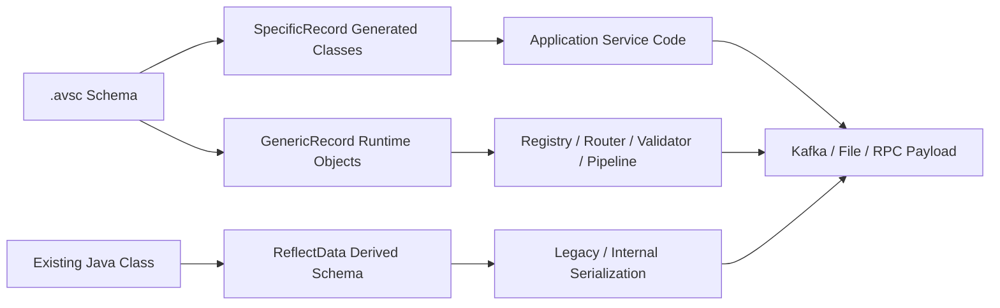
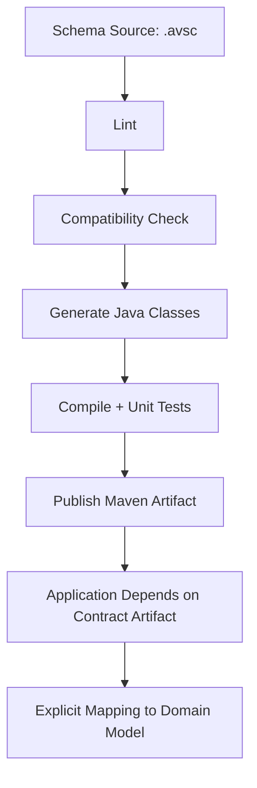
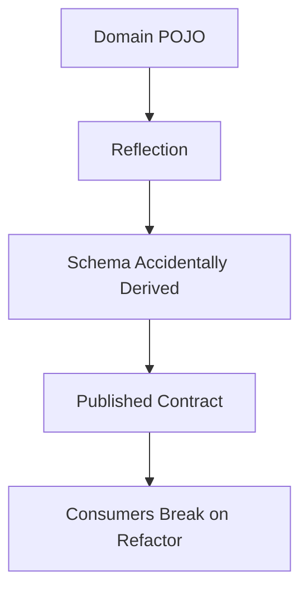

# Part 015 — Avro Java: SpecificRecord, GenericRecord, Reflect, and Builders

Part sebelumnya membahas model schema Avro: record, field, union, default, enum, fixed, dan logical type.

Sekarang kita masuk ke sisi Java.

Di Java, Avro bukan hanya “schema file lalu generate class”. Avro menyediakan beberapa model pemakaian yang masing-masing punya konsekuensi desain:

1. **SpecificRecord** — schema-first, generated Java class, kuat untuk service code yang butuh type safety.
2. **GenericRecord** — schema-driven runtime object, kuat untuk platform, router, validator, migrator, data pipeline, dan tools.
3. **Reflect** — Java class-first via reflection, berguna untuk internal atau legacy migration, tetapi biasanya buruk sebagai contract-first boundary.
4. **Builders** — cara membangun generated record dengan validasi struktur dasar dan readability lebih baik dibanding constructor manual.

Mental model penting:

> Avro Java API adalah adapter antara schema contract dan object model Java. Jangan biarkan adapter ini menjadi domain model permanen.

Generated Avro class itu representation dari wire/data contract, bukan model bisnis utama.

---

## 1. The Three Avro Java Models



### 1.1 SpecificRecord

SpecificRecord adalah pilihan utama ketika:

- schema adalah source of truth;
- service Java butuh compile-time type safety;
- producer/consumer code diketahui dan dikontrol;
- event type relatif stabil;
- mapping ke domain model dilakukan eksplisit;
- CI dapat menjalankan codegen dan compatibility checks.

Contoh generated class biasanya memiliki:

- static schema;
- getter/setter;
- builder;
- `getSchema()`;
- indexed `get(int field)` dan `put(int field, Object value)`;
- logical type conversion support tergantung konfigurasi/plugin;
- enum generated sebagai Java enum.

### 1.2 GenericRecord

GenericRecord cocok ketika schema baru diketahui saat runtime.

Contoh use case:

- schema registry explorer;
- event router;
- dynamic transformer;
- dead-letter replay tool;
- data quality scanner;
- multi-tenant ingestion pipeline;
- compatibility test harness;
- generic CDC/event bridge;
- contract observability sidecar.

GenericRecord memberi fleksibilitas, tapi kehilangan type safety.

### 1.3 Reflect

Reflect API dapat menurunkan schema dari Java class.

Ini terlihat praktis, tetapi berbahaya untuk kontrak publik.

Masalahnya:

- schema bisa berubah karena refactor class;
- annotation dan Java field structure menjadi contract secara tidak sadar;
- default value dan evolution lebih sulit dikontrol;
- class rename/package rename dapat merusak compatibility;
- domain object internal bocor menjadi wire contract;
- CI review schema menjadi kurang eksplisit.

Gunakan Reflect untuk:

- prototyping cepat;
- internal temporary serialization;
- migration dari legacy POJO;
- test fixture;
- one-off tools.

Jangan gunakan Reflect sebagai external event/API/data-lake contract utama.

---

## 2. Production Rule: Schema Is the Contract, Generated Code Is an Artifact

Dalam sistem production-grade, alurnya seharusnya seperti ini:



Bukan seperti ini:



Rule yang sehat:

> Schema review harus bisa dilakukan tanpa membaca Java implementation.

Kalau kontrak hanya bisa dipahami dengan membaca class internal, contract engineering sudah gagal.

---

## 3. Suggested Java Project Layout

Untuk service yang memproduksi atau mengonsumsi Avro event:

```text
case-events-contracts/
  pom.xml
  src/main/avro/
    common/
      Money.avsc
      Actor.avsc
      CaseId.avsc
    enforcement/
      EnforcementCaseCreated.avsc
      EnforcementCaseEscalated.avsc
      EnforcementCaseClosed.avsc
  src/test/resources/fixtures/
    v1/
    v2/
```

Untuk aplikasi:

```text
case-service/
  pom.xml
  src/main/java/
    com.acme.caseapp.domain/
      EnforcementCase.java
    com.acme.caseapp.contract.avro.mapper/
      EnforcementCaseEventMapper.java
    com.acme.caseapp.messaging/
      CaseEventProducer.java
```

Pisahkan:

| Layer | Contains | Should import generated Avro? |
|---|---|---|
| Domain | business state, invariant, lifecycle | No |
| Application | use cases, orchestration | Maybe, preferably through mapper |
| Messaging adapter | Kafka/Avro serializer boundary | Yes |
| Contract artifact | generated Avro classes | Yes |
| API DTO | HTTP/OpenAPI representation | No direct dependency on Avro |

Generated Avro class jangan menjadi entity JPA, request DTO, atau domain aggregate.

---

## 4. Maven Setup for Avro Code Generation

Contoh minimal:

```xml
<build>
  <plugins>
    <plugin>
      <groupId>org.apache.avro</groupId>
      <artifactId>avro-maven-plugin</artifactId>
      <version>1.12.0</version>
      <executions>
        <execution>
          <phase>generate-sources</phase>
          <goals>
            <goal>schema</goal>
          </goals>
          <configuration>
            <sourceDirectory>${project.basedir}/src/main/avro</sourceDirectory>
            <outputDirectory>${project.build.directory}/generated-sources/avro</outputDirectory>
            <stringType>String</stringType>
            <enableDecimalLogicalType>true</enableDecimalLogicalType>
          </configuration>
        </execution>
      </executions>
    </plugin>
  </plugins>
</build>
```

Catatan penting:

- `stringType=String` mengurangi surprise `Utf8` di application code.
- `enableDecimalLogicalType=true` membantu mapping decimal logical type ke Java `BigDecimal` pada generated code.
- Generated source harus masuk compilation source root.
- Pin versi plugin; jangan biarkan versi generator berubah diam-diam.
- Contract artifact sebaiknya dipublish sebagai Maven dependency tersendiri.

Contoh dependency runtime:

```xml
<dependency>
  <groupId>org.apache.avro</groupId>
  <artifactId>avro</artifactId>
  <version>1.12.0</version>
</dependency>
```

---

## 5. Example Schema

Kita gunakan event enforcement case.

```json
{
  "type": "record",
  "name": "EnforcementCaseCreated",
  "namespace": "com.acme.contract.enforcement.v1",
  "doc": "Published when a regulatory enforcement case is created.",
  "fields": [
    {
      "name": "eventId",
      "type": {
        "type": "string",
        "logicalType": "uuid"
      },
      "doc": "Unique event identifier."
    },
    {
      "name": "occurredAt",
      "type": {
        "type": "long",
        "logicalType": "timestamp-millis"
      },
      "doc": "UTC instant when the event occurred."
    },
    {
      "name": "caseId",
      "type": "string"
    },
    {
      "name": "caseType",
      "type": {
        "type": "enum",
        "name": "CaseType",
        "symbols": ["LICENSING", "MARKET_ABUSE", "CONDUCT", "PRUDENTIAL", "OTHER"],
        "default": "OTHER"
      }
    },
    {
      "name": "priority",
      "type": ["null", "string"],
      "default": null
    },
    {
      "name": "attributes",
      "type": {
        "type": "map",
        "values": "string"
      },
      "default": {}
    }
  ]
}
```

A few production notes:

- `eventId` should not be a plain string semantically, even if encoded as string.
- `occurredAt` is a machine timestamp, not local business date.
- `caseType` enum has an explicit `default` for evolution safety.
- `priority` is nullable union with `null` first and default `null`.
- `attributes` is an extension map, but should not become a garbage bag.

---

## 6. Using SpecificRecord

After code generation, usage is direct:

```java
var event = EnforcementCaseCreated.newBuilder()
    .setEventId(UUID.randomUUID())
    .setOccurredAt(Instant.now())
    .setCaseId("CASE-2026-000123")
    .setCaseType(CaseType.MARKET_ABUSE)
    .setPriority("HIGH")
    .setAttributes(Map.of("source", "intake-api"))
    .build();
```

Depending on generator settings, logical types may map to:

| Avro logical type | Java representation, commonly expected |
|---|---|
| `timestamp-millis` | `Instant` if logical conversions are enabled in generated code, otherwise `Long` |
| `date` | `LocalDate` or `Integer` depending on generator/runtime |
| `decimal` | `BigDecimal` if enabled, otherwise `ByteBuffer`/bytes |
| `uuid` | `UUID` or `CharSequence`/String depending on version/config |

Do not assume mapping blindly. Verify generated class.

### 6.1 Builder vs Constructor

Prefer builder:

```java
EnforcementCaseCreated event = EnforcementCaseCreated.newBuilder()
    .setEventId(eventId)
    .setOccurredAt(occurredAt)
    .setCaseId(caseId)
    .setCaseType(CaseType.CONDUCT)
    .setPriority(null)
    .setAttributes(Map.of())
    .build();
```

Avoid positional constructor for large records:

```java
// fragile: one field order change or similar-looking value can create bugs
new EnforcementCaseCreated(eventId, occurredAt, caseId, CaseType.CONDUCT, null, Map.of());
```

Builder is not a domain validator. It can help with structure, but it will not enforce business rules like:

- priority required when case type is market abuse;
- case ID must exist in case repository;
- occurredAt must not be in the future beyond skew tolerance;
- source system must be authorized.

Those belong outside Avro schema.

---

## 7. Serializing and Deserializing SpecificRecord Manually

Even if production uses Kafka serializer, understand the primitive flow.

```java
public byte[] serialize(EnforcementCaseCreated event) throws IOException {
    ByteArrayOutputStream out = new ByteArrayOutputStream();
    BinaryEncoder encoder = EncoderFactory.get().binaryEncoder(out, null);

    DatumWriter<EnforcementCaseCreated> writer =
        new SpecificDatumWriter<>(EnforcementCaseCreated.class);

    writer.write(event, encoder);
    encoder.flush();
    return out.toByteArray();
}
```

Deserialize:

```java
public EnforcementCaseCreated deserialize(byte[] bytes) throws IOException {
    DatumReader<EnforcementCaseCreated> reader =
        new SpecificDatumReader<>(EnforcementCaseCreated.class);

    BinaryDecoder decoder = DecoderFactory.get().binaryDecoder(bytes, null);
    return reader.read(null, decoder);
}
```

Important limitation:

> Raw Avro binary bytes do not automatically carry a schema ID unless your framing format or registry serializer adds one.

In Kafka with schema registry, payload often includes a registry-specific magic byte and schema ID. In object container files, schema metadata is in the file header. In raw binary encoding, you need a way to know the writer schema.

---

## 8. SpecificDatumWriter and SpecificDatumReader

The basic writer/reader family:

| Data model | Writer | Reader |
|---|---|---|
| SpecificRecord | `SpecificDatumWriter<T>` | `SpecificDatumReader<T>` |
| GenericRecord | `GenericDatumWriter<GenericRecord>` | `GenericDatumReader<GenericRecord>` |
| Reflect | `ReflectDatumWriter<T>` | `ReflectDatumReader<T>` |

The writer needs the writer schema.

The reader may need both:

```java
DatumReader<GenericRecord> reader = new GenericDatumReader<>(writerSchema, readerSchema);
```

That two-schema form is the heart of Avro evolution.

---

## 9. Using GenericRecord

GenericRecord is ideal for dynamic contract tools.

```java
Schema schema = new Schema.Parser().parse(schemaJson);

GenericRecord record = new GenericData.Record(schema);
record.put("eventId", UUID.randomUUID().toString());
record.put("occurredAt", Instant.now().toEpochMilli());
record.put("caseId", "CASE-2026-000123");
record.put("caseType", "MARKET_ABUSE");
record.put("priority", "HIGH");
record.put("attributes", Map.of("source", "intake-api"));
```

Serialize:

```java
ByteArrayOutputStream out = new ByteArrayOutputStream();
BinaryEncoder encoder = EncoderFactory.get().binaryEncoder(out, null);
DatumWriter<GenericRecord> writer = new GenericDatumWriter<>(schema);
writer.write(record, encoder);
encoder.flush();
byte[] payload = out.toByteArray();
```

Deserialize with writer and reader schema:

```java
DatumReader<GenericRecord> reader = new GenericDatumReader<>(writerSchema, readerSchema);
BinaryDecoder decoder = DecoderFactory.get().binaryDecoder(payload, null);
GenericRecord decoded = reader.read(null, decoder);
```

### 9.1 GenericRecord Trade-Off

| Dimension | SpecificRecord | GenericRecord |
|---|---|---|
| Type safety | Stronger | Weak |
| Runtime schema flexibility | Lower | High |
| Refactor safety | Better if schema-first | Depends on string keys |
| Tooling/platform use | Less flexible | Excellent |
| Application readability | Better | More verbose |
| Dynamic routing | Poor | Strong |
| Performance | Usually good | Usually acceptable, may be slower/more allocation-heavy |

Use SpecificRecord in domain-facing service adapters. Use GenericRecord in infrastructure and platform components.

---

## 10. ReflectData: Why It Is Dangerous for Contracts

Example:

```java
public final class EnforcementCaseCreatedPojo {
    public String eventId;
    public long occurredAt;
    public String caseId;
    public String caseType;
}

Schema schema = ReflectData.get().getSchema(EnforcementCaseCreatedPojo.class);
```

This creates a schema from Java structure.

The danger is subtle. A harmless Java refactor can become a contract change:

```java
// before
public String caseId;

// after
public String enforcementCaseId;
```

For Java, this may be a cleanup.

For Avro consumers, it is a breaking rename unless aliases and migration rules are handled.

Reflect is especially problematic with:

- inheritance;
- Java package changes;
- nullable fields;
- default values;
- collection generics;
- annotation interpretation;
- different JVM language models;
- binary compatibility across services.

A top-tier engineering rule:

> Reflection-generated schema may be acceptable for private serialization, but not for governed inter-service contracts.

---

## 11. The `Utf8` Problem

Avro internally often represents strings as `org.apache.avro.util.Utf8` for performance/memory reasons.

In application code, this can surprise you:

```java
Object value = record.get("caseId");
String caseId = (String) value; // may fail if value is Utf8
```

Safer:

```java
String caseId = String.valueOf(record.get("caseId"));
```

For generated code, configure `stringType=String` if you want normal Java `String` in generated classes.

But do not confuse convenience with contract semantics. Avro schema `string` remains a Unicode string regardless of Java representation.

---

## 12. Nullable Union in Java

Avro represents optional field commonly as:

```json
{
  "name": "priority",
  "type": ["null", "string"],
  "default": null
}
```

Java generated code may expose it as nullable Java type:

```java
String priority = event.getPriority();
```

GenericRecord simply stores either `null` or matching branch value.

Production rules:

- Put `null` first when default is `null`.
- Always provide default for newly added field.
- Do not use large multi-branch unions unless necessary.
- Prefer explicit tagged record if polymorphism matters.

Bad:

```json
{"name": "value", "type": ["null", "string", "long", "double", "boolean"], "default": null}
```

Better:

```json
{
  "name": "attributeValue",
  "type": [
    "null",
    {
      "type": "record",
      "name": "AttributeValue",
      "fields": [
        {"name": "kind", "type": {"type": "enum", "name": "AttributeKind", "symbols": ["TEXT", "NUMBER", "BOOLEAN"]}},
        {"name": "textValue", "type": ["null", "string"], "default": null},
        {"name": "numberValue", "type": ["null", "double"], "default": null},
        {"name": "booleanValue", "type": ["null", "boolean"], "default": null}
      ]
    }
  ],
  "default": null
}
```

The second form is more verbose, but easier to validate semantically and evolve.

---

## 13. Logical Type Conversions

Logical types are semantic overlays on primitive/complex encoded types.

Examples:

| Logical type | Encoded type | Common Java intent |
|---|---|---|
| `timestamp-millis` | `long` | `Instant` |
| `date` | `int` | `LocalDate` |
| `time-millis` | `int` | `LocalTime` |
| `uuid` | `string` | `UUID` |
| `decimal` | `bytes` or `fixed` | `BigDecimal` |

Potential failure modes:

- producer writes raw long while consumer expects `Instant` conversion;
- decimal precision/scale mismatch;
- timezone confusion from local datetime disguised as timestamp;
- UUID treated as arbitrary string;
- generated classes differ because plugin configuration differs across modules.

Contract rule:

> Logical type must be part of contract review, not an implementation afterthought.

For money:

```json
{
  "name": "amount",
  "type": {
    "type": "bytes",
    "logicalType": "decimal",
    "precision": 18,
    "scale": 2
  }
}
```

Also store currency separately:

```json
{"name": "currency", "type": "string"}
```

Never use floating point for money.

---

## 14. Generated Avro Class as Boundary DTO

A common mistake:

```java
@Entity
public class EnforcementCaseCreated extends SpecificRecordBase {
    // generated Avro class used as persistence entity
}
```

This couples:

- Avro contract;
- persistence schema;
- ORM lifecycle;
- domain model;
- messaging adapter.

Instead:

```java
public final class EnforcementCase {
    private final CaseId id;
    private final CaseType type;
    private final Priority priority;
    private final CaseLifecycleState state;
}
```

Mapper:

```java
public final class EnforcementCaseEventMapper {

    public EnforcementCaseCreated toCreatedEvent(EnforcementCase c, EventMetadata m) {
        return EnforcementCaseCreated.newBuilder()
            .setEventId(m.eventId())
            .setOccurredAt(m.occurredAt())
            .setCaseId(c.id().value())
            .setCaseType(mapCaseType(c.type()))
            .setPriority(c.priority().map(Priority::code).orElse(null))
            .setAttributes(Map.of("source", m.source()))
            .build();
    }
}
```

Mapping is not boilerplate. Mapping is where you protect the domain from transport evolution.

---

## 15. Object Reuse and Allocation

Avro readers support object reuse:

```java
GenericRecord reusable = null;
for (byte[] payload : payloads) {
    reusable = reader.read(reusable, decoderFor(payload));
    process(reusable);
}
```

This can reduce allocation in high-throughput pipelines.

But it is dangerous if record references escape:

```java
List<GenericRecord> records = new ArrayList<>();
GenericRecord reusable = null;

for (byte[] payload : payloads) {
    reusable = reader.read(reusable, decoderFor(payload));
    records.add(reusable); // bug: same mutable object reused
}
```

Use object reuse only inside tight controlled loops.

For application services, prefer clarity unless profiling proves allocation pressure.

---

## 16. Binary Encoding vs Object Container File

Avro has multiple usage forms:

| Usage | Carries schema? | Common use |
|---|---:|---|
| Raw binary encoding | No, unless wrapped/framed | Kafka with schema registry framing, RPC internals |
| Object Container File | Yes, in file metadata | data lake, batch files, archival |
| JSON encoding | Schema still needed for correct interpretation | debugging, tools, interop edge cases |

Object container file example:

```java
DatumWriter<EnforcementCaseCreated> datumWriter =
    new SpecificDatumWriter<>(EnforcementCaseCreated.class);

try (DataFileWriter<EnforcementCaseCreated> fileWriter = new DataFileWriter<>(datumWriter)) {
    fileWriter.create(EnforcementCaseCreated.getClassSchema(), outputFile);
    fileWriter.append(event);
}
```

Read:

```java
DatumReader<EnforcementCaseCreated> datumReader =
    new SpecificDatumReader<>(EnforcementCaseCreated.class);

try (DataFileReader<EnforcementCaseCreated> fileReader = new DataFileReader<>(inputFile, datumReader)) {
    while (fileReader.hasNext()) {
        EnforcementCaseCreated event = fileReader.next();
        process(event);
    }
}
```

Kafka payloads usually need registry-specific framing. Do not assume a raw Avro byte array is self-describing.

---

## 17. Error Handling at Avro Boundary

Categorize errors explicitly:

| Error | Example | Handling |
|---|---|---|
| Schema not found | registry ID unknown | retry if registry issue, DLQ if payload corrupt |
| Decode error | malformed bytes | DLQ/quarantine |
| Resolution error | missing required default | contract incident |
| Logical conversion error | invalid decimal/UUID | DLQ + producer bug |
| Semantic validation error | unknown case type transition | domain reject/quarantine |
| Mapping error | Java mapper cannot map field | application defect |

Do not collapse all into `RuntimeException`.

A production consumer should emit:

- schema ID or subject if available;
- writer schema fingerprint/version;
- consumer reader schema version;
- topic/partition/offset;
- event ID if decodable;
- validation failure path;
- error category.

---

## 18. Contract Tests for Avro Java

Minimum tests:

### 18.1 Generated Class Compiles

CI should fail if schema cannot generate code.

```bash
mvn clean generate-sources test
```

### 18.2 Round-Trip Test

```java
@Test
void roundTripSpecificRecord() throws Exception {
    EnforcementCaseCreated original = EnforcementCaseCreated.newBuilder()
        .setEventId(UUID.randomUUID())
        .setOccurredAt(Instant.parse("2026-07-03T10:15:30Z"))
        .setCaseId("CASE-001")
        .setCaseType(CaseType.CONDUCT)
        .setPriority(null)
        .setAttributes(Map.of())
        .build();

    byte[] bytes = avro.serialize(original);
    EnforcementCaseCreated decoded = avro.deserialize(bytes);

    assertEquals(original.getCaseId(), decoded.getCaseId());
    assertEquals(original.getCaseType(), decoded.getCaseType());
}
```

### 18.3 Golden Payload Test

Keep representative payloads from previous schema versions.

```text
src/test/resources/fixtures/avro/
  enforcement-case-created-v1.bin
  enforcement-case-created-v2.bin
```

Test new readers against old payloads.

### 18.4 Logical Type Test

Test date/time/decimal/UUID exactly.

```java
assertEquals(new BigDecimal("123.45"), decoded.getAmount());
```

### 18.5 Generic Compatibility Harness

```java
var reader = new GenericDatumReader<GenericRecord>(writerSchemaV1, readerSchemaV2);
var decoded = reader.read(null, decoder);
assertEquals("CASE-001", decoded.get("caseId").toString());
```

---

## 19. Common Anti-Patterns

### Anti-pattern 1: Generated Avro Everywhere

Symptom:

- controllers use Avro generated classes;
- JPA stores Avro generated classes;
- business logic mutates Avro objects;
- tests assert Avro implementation details.

Consequence:

- schema evolution becomes domain refactor;
- API and event contract get coupled;
- model cannot evolve independently.

### Anti-pattern 2: Reflect as Contract

Symptom:

- POJO is contract source;
- schema generated from internal classes;
- no `.avsc` review.

Consequence:

- accidental breaking change;
- hidden compatibility impact;
- poor governance.

### Anti-pattern 3: GenericRecord in Business Logic

Symptom:

```java
if (record.get("caseType").equals("MARKET_ABUSE")) {
    // business decision
}
```

Consequence:

- stringly typed domain;
- no invariant boundary;
- runtime-only failures.

Use GenericRecord for infrastructure, then map to typed domain model.

### Anti-pattern 4: Ignoring Logical Type Config

Symptom:

- one service sees decimal as `ByteBuffer`;
- another sees `BigDecimal`;
- tests pass locally but fail with generated artifact.

Consequence:

- production serialization mismatch;
- subtle precision bugs.

Pin plugin and runtime versions.

### Anti-pattern 5: No Writer Schema Awareness

Symptom:

- consumer deserializes bytes using only latest schema;
- old payload replay fails;
- registry ID ignored.

Consequence:

- replay unsafe;
- consumer cannot handle historical data.

Avro is designed around writer schema plus reader schema.

---

## 20. Production Checklist

Before publishing Avro Java contract artifact:

- [ ] `.avsc` is source of truth.
- [ ] Generated code is not manually edited.
- [ ] Maven/Gradle plugin version is pinned.
- [ ] Logical type conversion behavior is tested.
- [ ] `stringType` choice is explicit.
- [ ] Nullable union uses `null` first when default is null.
- [ ] Generated classes are isolated from domain model.
- [ ] Mapper exists between domain and Avro contract.
- [ ] Round-trip serialization test exists.
- [ ] Golden payload compatibility test exists.
- [ ] Old writer schema to new reader schema test exists.
- [ ] Error handling distinguishes decode/resolution/semantic errors.
- [ ] Registry framing assumptions are documented.
- [ ] Schema artifact is versioned and published.

---

## 21. Practice Exercise

Design Java Avro usage for `EnforcementCaseEscalated`.

Requirements:

- event ID is UUID;
- occurredAt is timestamp-millis;
- caseId is string;
- previousLevel and newLevel are enums;
- reasonCode is string;
- reasonText is optional;
- actor contains actorId, actorType, displayName;
- metadata map is optional with default empty object.

Tasks:

1. Write `.avsc` schema.
2. Decide whether service should use SpecificRecord or GenericRecord.
3. Write mapper from domain object to Avro generated class.
4. Write round-trip test.
5. Write a golden payload test plan.
6. Identify which fields are domain invariants, not schema invariants.

Expected architectural answer:

- application service uses SpecificRecord at messaging adapter only;
- domain model does not depend on Avro;
- `reasonText` is nullable union with default null;
- metadata has default `{}`;
- escalation level transition must be checked by domain logic, not Avro schema.

---

## 22. Summary

Avro Java has three major models:

- **SpecificRecord** for type-safe service adapters;
- **GenericRecord** for dynamic platform/runtime tools;
- **Reflect** for limited internal use, not governed external contracts.

The key production lesson:

> Treat generated Avro classes as boundary DTOs. Keep schema as contract source, generated code as artifact, and domain model as separate business truth.

In the next part, we go deeper into the most important Avro capability: **schema evolution through reader/writer resolution**.

That is where Avro becomes more than serialization.

It becomes a compatibility system.

---

## References

- Apache Avro 1.12.0 Specification — https://avro.apache.org/docs/1.12.0/specification/
- Apache Avro 1.12.0 Getting Started Java — https://avro.apache.org/docs/1.12.0/getting-started-java/
- Apache Avro 1.12.0 Java API — https://avro.apache.org/docs/1.12.0/api/java/
