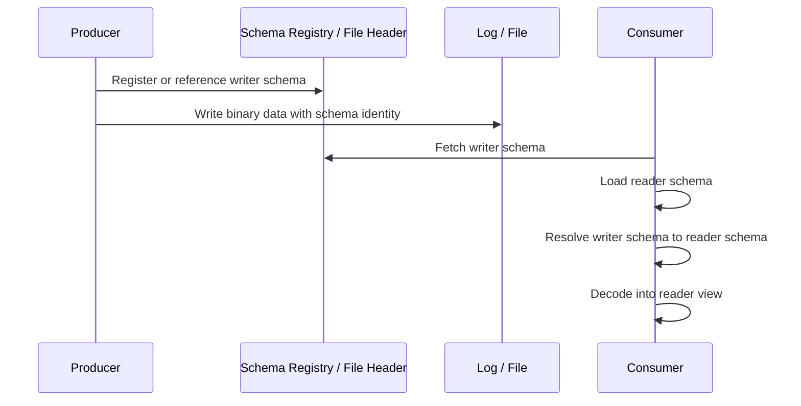
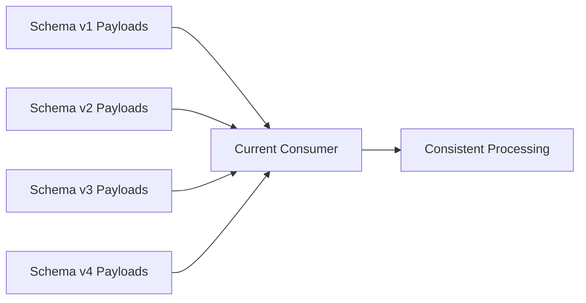
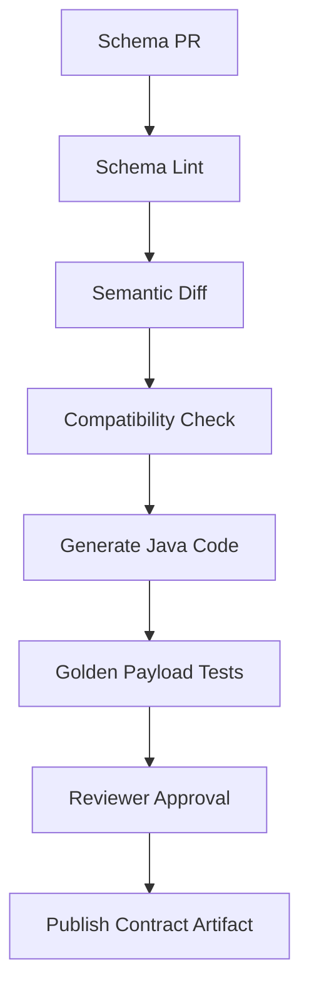

# Part 016 — Avro Schema Evolution and Reader/Writer Resolution

Avro sering dipilih bukan karena binary format-nya saja.

Avro dipilih karena ia punya model evolusi schema yang eksplisit.

Core idea:

```text
Data is written with writer schema.
Data is read with reader schema.
Avro resolves differences between both schemas using defined resolution rules.
```

Inilah yang membedakan Avro dari banyak validation-only schema.

JSON Schema menjawab:

> Apakah instance ini valid terhadap schema ini?

Avro menjawab:

> Apakah data yang ditulis dengan schema A bisa dibaca oleh reader dengan schema B?

Itu pertanyaan yang lebih dekat dengan masalah event streaming, replay, data lake, dan long-lived asynchronous systems.

---

## 1. The Real Problem Avro Solves

Bayangkan Kafka topic:

```text
case-events
  offset 100 -> EnforcementCaseCreated v1
  offset 980 -> EnforcementCaseCreated v2
  offset 4500 -> EnforcementCaseCreated v3
```

Consumer baru deploy hari ini.

Ia mungkin harus membaca:

- event baru dari producer terbaru;
- event lama saat replay;
- event dari producer yang belum upgrade;
- event dari branch deployment berbeda;
- event di data lake yang ditulis tahun lalu.

Pertanyaannya bukan:

> Apakah schema terbaru valid?

Pertanyaannya:

> Apakah semua data yang masih mungkin dibaca dapat di-resolve dengan reader schema consumer saat ini?

---

## 2. Reader Schema vs Writer Schema



Writer schema:

- schema used by producer when data was encoded;
- defines binary layout and field sequence;
- must be known to decode correctly.

Reader schema:

- schema desired by consumer;
- may be newer, older, or adapted;
- defines shape consumer wants to see.

Avro resolution happens between both.

---

## 3. Compatibility Direction

Compatibility terms are often misunderstood.

Use data-flow thinking.

### 3.1 Backward Compatibility

New reader can read old data.

```text
writer schema = old
reader schema = new
```

Useful when:

- consumers deploy first;
- consumer may replay historical data;
- schema registry checks whether latest consumer can read older producer data.

Example safe change:

- add a new field with a default value.

Old data lacks the field. New reader fills it from default.

### 3.2 Forward Compatibility

Old reader can read new data.

```text
writer schema = new
reader schema = old
```

Useful when:

- producer deploys before all consumers upgrade;
- old consumers continue reading topic while producer emits new schema.

Example safe change:

- add a new field, because old reader ignores fields it does not know.

But there are caveats when defaults, required fields, and removed fields are involved.

### 3.3 Full Compatibility

Both directions work.

```text
old writer -> new reader
new writer -> old reader
```

Full compatibility is the safest default for shared event streams, but it can slow evolution.

### 3.4 Transitive Compatibility

Latest schema compatible with all previous versions, not just immediate predecessor.

This matters when:

- topics retain old messages;
- data lake keeps old files;
- consumers replay from earliest offset;
- schema history is long.

Non-transitive compatibility can pass version-by-version but fail against older historical payloads.

---

## 4. The Simplified Compatibility Matrix

| Change | Backward: new reads old | Forward: old reads new | Full | Notes |
|---|---:|---:|---:|---|
| Add field with default | Yes | Yes | Yes | safest common additive change |
| Add field without default | No | Yes | No | new reader cannot read old data |
| Remove field that old reader expects with default | Yes | Yes if old reader has default | Usually yes | depends on old reader field default |
| Remove field old reader expects without default | Yes | No | No | old reader cannot fill missing field |
| Rename field without alias | No | No | No | appears as remove + add |
| Rename field with alias | Usually backward path possible | depends on direction and alias placement | needs test | aliases help name resolution |
| Change int to long | Often yes in promotion direction | not reverse | No | type promotion is directional |
| Add enum symbol | Reader/producer dependent | risky for old readers | risky | old reader may not know new symbol |
| Remove enum symbol | risky for old data | maybe | risky | old data may contain removed symbol |
| Change record namespace/name | No unless aliases | No unless aliases | risky | full name matters |
| Reorder fields | Usually yes | Usually yes | Yes | fields resolved by name, not position |
| Change default only | Usually yes for future missing values | Usually yes | Usually yes | but behavior can change subtly |

Never approve schema change from table alone. Always run compatibility tests.

---

## 5. Record Resolution

Avro records match by name.

The record full name is:

```text
namespace + name
```

Example:

```json
{
  "type": "record",
  "name": "EnforcementCaseCreated",
  "namespace": "com.acme.contract.enforcement.v1",
  "fields": []
}
```

Full name:

```text
com.acme.contract.enforcement.v1.EnforcementCaseCreated
```

Changing namespace is not cosmetic. It changes type identity.

### 5.1 Field Resolution

Fields resolve by name.

Writer v1:

```json
{
  "type": "record",
  "name": "CaseCreated",
  "fields": [
    {"name": "caseId", "type": "string"},
    {"name": "caseType", "type": "string"}
  ]
}
```

Reader v2:

```json
{
  "type": "record",
  "name": "CaseCreated",
  "fields": [
    {"name": "caseId", "type": "string"},
    {"name": "caseType", "type": "string"},
    {"name": "priority", "type": "string", "default": "NORMAL"}
  ]
}
```

Old data does not have `priority`.

Reader fills default:

```json
{"priority": "NORMAL"}
```

If no default exists, reading old data fails.

---

## 6. Field Addition

### 6.1 Safe Additive Change

Version 1:

```json
{
  "type": "record",
  "name": "CaseCreated",
  "fields": [
    {"name": "caseId", "type": "string"}
  ]
}
```

Version 2:

```json
{
  "type": "record",
  "name": "CaseCreated",
  "fields": [
    {"name": "caseId", "type": "string"},
    {"name": "priority", "type": ["null", "string"], "default": null}
  ]
}
```

This is safe because:

- old data can be read by new reader;
- old reader ignores new field from new data;
- default provides missing value for backward path.

### 6.2 Unsafe Additive Change

```json
{"name": "priority", "type": "string"}
```

No default.

New reader cannot read old data because old writer never wrote `priority`.

This is the classic Avro mistake.

Rule:

> Every newly added field in a shared Avro record should have a default unless you intentionally break backward compatibility.

---

## 7. Field Removal

Version 1:

```json
{
  "type": "record",
  "name": "CaseCreated",
  "fields": [
    {"name": "caseId", "type": "string"},
    {"name": "legacySource", "type": "string"}
  ]
}
```

Version 2 removes `legacySource`:

```json
{
  "type": "record",
  "name": "CaseCreated",
  "fields": [
    {"name": "caseId", "type": "string"}
  ]
}
```

New reader reading old data:

- old writer has extra field;
- new reader does not request it;
- field is ignored.

Backward path is usually okay.

Old reader reading new data:

- old reader expects `legacySource`;
- new writer does not provide it;
- old reader can only succeed if old reader schema has default for `legacySource`.

Therefore field removal can be forward-breaking.

Production playbook:

1. Make field optional/defaulted first.
2. Stop producing meaningful values.
3. Wait until consumers no longer depend on it.
4. Remove only after compatibility checks and retention window.

---

## 8. Rename Is Remove + Add Unless Aliased

Changing this:

```json
{"name": "caseId", "type": "string"}
```

to this:

```json
{"name": "enforcementCaseId", "type": "string"}
```

is not a harmless rename.

It is equivalent to:

- remove `caseId`;
- add `enforcementCaseId`.

Without a default or alias, compatibility breaks.

### 8.1 Alias Strategy

Reader v2:

```json
{
  "name": "enforcementCaseId",
  "type": "string",
  "aliases": ["caseId"]
}
```

This tells reader that old writer field `caseId` can map to new reader field `enforcementCaseId`.

But aliases must be tested in the exact direction you need. Alias behavior is powerful but easy to misunderstand when multiple versions and namespaces are involved.

Production recommendation:

- avoid renames for published event contracts;
- prefer adding new field, dual-writing, migrating consumers, then deprecating old field;
- use alias only with explicit compatibility tests.

---

## 9. Type Promotion

Avro supports certain promotions.

Common promotion direction:

```text
int -> long -> float -> double
int -> float
long -> float
string <-> bytes in some resolution contexts depending on spec rules/version
```

Practical guidance:

| Change | Risk |
|---|---|
| `int` to `long` | often safe for new reader reading old writer |
| `long` to `int` | unsafe, potential overflow |
| `float` to `double` | often safe widening |
| `double` to `float` | unsafe precision loss |
| `string` to enum | unsafe semantic narrowing |
| `string` to record | breaking |
| `bytes decimal(18,2)` to `bytes decimal(20,2)` | requires careful test and consumer support |
| `timestamp-millis` to `timestamp-micros` | semantic change; do not treat as harmless |

Even when binary resolution allows a promotion, domain semantics may not.

Example:

```json
{"name": "riskScore", "type": "int"}
```

to:

```json
{"name": "riskScore", "type": "long"}
```

Mechanically okay in one direction.

But if the domain always says `0..100`, changing to `long` may hide validation failure.

Contract compatibility is necessary, not sufficient.

---

## 10. Enum Evolution

Enums are dangerous in long-lived contracts.

Version 1:

```json
{
  "type": "enum",
  "name": "CaseType",
  "symbols": ["LICENSING", "CONDUCT", "OTHER"],
  "default": "OTHER"
}
```

Version 2 adds:

```json
"MARKET_ABUSE"
```

New reader can read old data.

Old reader reading new data may fail if it sees symbol `MARKET_ABUSE` and has no compatible default behavior.

Rules:

- Adding enum symbols is not always safe for old consumers.
- Removing enum symbols can break replay of old data.
- Renaming enum symbols is breaking.
- Reordering is generally less important than symbol identity, but still noisy and should be avoided.
- Always consider unknown/default behavior.

### 10.1 Safer Enum Strategy

For volatile business classifications:

```json
{
  "name": "caseTypeCode",
  "type": "string",
  "doc": "Controlled vocabulary code from case-type reference data."
}
```

Then validate code against reference data outside Avro.

Use Avro enum when:

- values are very stable;
- unknown values should be contract errors;
- generated Java enum is worth the rigidity.

Use string/code-list when:

- regulators add codes frequently;
- cross-organization vocabularies evolve;
- consumers should tolerate unknown code with warning;
- reference data has its own lifecycle.

---

## 11. Union Evolution

Nullable field:

```json
{"name": "priority", "type": ["null", "string"], "default": null}
```

Changing to:

```json
{"name": "priority", "type": ["null", "string", "int"], "default": null}
```

may be mechanically possible, but it creates reader complexity.

Problems:

- consumer code must handle more branches;
- JSON encoding becomes less obvious;
- generated code may expose broad `Object` style access;
- semantic meaning becomes unclear.

Production rule:

> Avoid evolving unions into ad-hoc polymorphic containers.

Prefer explicit record:

```json
{
  "name": "priority",
  "type": [
    "null",
    {
      "type": "record",
      "name": "Priority",
      "fields": [
        {"name": "code", "type": "string"},
        {"name": "score", "type": ["null", "int"], "default": null}
      ]
    }
  ],
  "default": null
}
```

---

## 12. Defaults Are Reader-Side Fill Values

A common misunderstanding:

> “Default means producer does not need to write the field.”

Not exactly.

In Avro schema resolution, default is used when the reader expects a field that the writer did not write.

Default is primarily a reader-side compatibility mechanism.

Example:

Reader v2:

```json
{"name": "priority", "type": "string", "default": "NORMAL"}
```

Old writer v1 did not write `priority`.

Reader gets:

```json
"NORMAL"
```

Be careful: default values are not always automatically applied by your builder or producer code in the way you expect. Generated builder behavior can depend on Avro version and codegen behavior. Test it.

Production implication:

- default changes can alter interpretation of historical data;
- default is not just schema decoration;
- changing default from `NORMAL` to `LOW` can change replay behavior.

---

## 13. Aliases

Aliases can exist for named types and fields.

Use cases:

- rename a field;
- rename a record;
- move namespace;
- support legacy producer naming.

Example field alias:

```json
{
  "name": "enforcementCaseId",
  "type": "string",
  "aliases": ["caseId"]
}
```

Example record alias:

```json
{
  "type": "record",
  "name": "CaseCreated",
  "namespace": "com.acme.contract.enforcement.v2",
  "aliases": ["com.acme.contract.enforcement.v1.CaseCreated"],
  "fields": []
}
```

Caution:

- aliases are not a substitute for governance;
- alias chains across many versions become hard to reason about;
- every alias must be covered by compatibility tests;
- generated Java package/name changes still affect application code.

---

## 14. Compatibility Test Harness in Java

You can test resolution explicitly.

```java
static GenericRecord decode(byte[] payload, Schema writerSchema, Schema readerSchema) throws IOException {
    DatumReader<GenericRecord> reader = new GenericDatumReader<>(writerSchema, readerSchema);
    BinaryDecoder decoder = DecoderFactory.get().binaryDecoder(payload, null);
    return reader.read(null, decoder);
}
```

Create payload with writer v1:

```java
static byte[] encode(GenericRecord record, Schema writerSchema) throws IOException {
    ByteArrayOutputStream out = new ByteArrayOutputStream();
    DatumWriter<GenericRecord> writer = new GenericDatumWriter<>(writerSchema);
    BinaryEncoder encoder = EncoderFactory.get().binaryEncoder(out, null);
    writer.write(record, encoder);
    encoder.flush();
    return out.toByteArray();
}
```

Test backward compatibility:

```java
@Test
void v2ReaderCanReadV1Payload() throws Exception {
    Schema v1 = loadSchema("CaseCreated-v1.avsc");
    Schema v2 = loadSchema("CaseCreated-v2.avsc");

    GenericRecord oldRecord = new GenericData.Record(v1);
    oldRecord.put("caseId", "CASE-001");

    byte[] payload = encode(oldRecord, v1);
    GenericRecord decoded = decode(payload, v1, v2);

    assertEquals("CASE-001", decoded.get("caseId").toString());
    assertEquals("NORMAL", decoded.get("priority").toString());
}
```

Test forward compatibility:

```java
@Test
void v1ReaderCanReadV2Payload() throws Exception {
    Schema v1 = loadSchema("CaseCreated-v1.avsc");
    Schema v2 = loadSchema("CaseCreated-v2.avsc");

    GenericRecord newRecord = new GenericData.Record(v2);
    newRecord.put("caseId", "CASE-001");
    newRecord.put("priority", "HIGH");

    byte[] payload = encode(newRecord, v2);
    GenericRecord decoded = decode(payload, v2, v1);

    assertEquals("CASE-001", decoded.get("caseId").toString());
}
```

This test is more valuable than reading a compatibility table.

---

## 15. Schema Registry Compatibility Modes

Most registry-backed platforms expose compatibility modes similar to:

| Mode | Meaning |
|---|---|
| `NONE` | no compatibility enforcement |
| `BACKWARD` | latest schema can read previous schema data |
| `BACKWARD_TRANSITIVE` | latest schema can read all previous schema data |
| `FORWARD` | previous schema can read latest schema data |
| `FORWARD_TRANSITIVE` | all previous schemas can read latest schema data |
| `FULL` | backward and forward against previous version |
| `FULL_TRANSITIVE` | backward and forward against all previous versions |

For event topics with long retention and replay requirements, prefer transitive modes unless cost is too high.

For internal low-risk topics, non-transitive may be acceptable.

For regulated audit/event logs, avoid `NONE`.

---

## 16. Schema Evolution Playbooks

### 16.1 Add Optional Field

Goal: add `assignedTeam`.

Schema v2:

```json
{"name": "assignedTeam", "type": ["null", "string"], "default": null}
```

Steps:

1. Add field with default.
2. Publish schema.
3. Deploy consumers that can read it.
4. Deploy producer to populate it.
5. Monitor null rate and consumer behavior.

### 16.2 Add Required Semantics Later

Avro contract remains nullable/defaulted for compatibility.

Domain rule changes separately:

```text
For events emitted after 2026-09-01, assignedTeam must be non-null for MARKET_ABUSE cases.
```

Enforce via producer validation and consumer semantic validation.

Do not break historical replay by making field non-null in schema immediately.

### 16.3 Rename Field Safely

Goal: rename `caseId` to `enforcementCaseId`.

Safer playbook:

1. Add `enforcementCaseId` with default `""` or nullable default null.
2. Produce both fields.
3. Migrate consumers.
4. Mark `caseId` deprecated in doc.
5. Stop using `caseId` semantically.
6. Remove only after retention and consumer audit.

Alias may help, but dual-field migration is often clearer operationally.

### 16.4 Split Field

Goal: split `actor` string into structured actor record.

Old:

```json
{"name": "actor", "type": "string"}
```

New:

```json
{
  "name": "actorDetails",
  "type": [
    "null",
    {
      "type": "record",
      "name": "ActorDetails",
      "fields": [
        {"name": "actorId", "type": "string"},
        {"name": "actorType", "type": "string"},
        {"name": "displayName", "type": ["null", "string"], "default": null}
      ]
    }
  ],
  "default": null
}
```

Do not mutate `actor` from string to record. Add a new field.

### 16.5 Change Enum to Code List

Goal: replace rigid enum `CaseType` with reference-data code string.

Playbook:

1. Add `caseTypeCode` string with default `"UNKNOWN"` or nullable default.
2. Continue writing enum field.
3. Write new string code.
4. Migrate consumers to code list lookup.
5. Deprecate enum field.
6. Remove after retention if compatibility policy allows.

---

## 17. Evolution and Event Semantics

Schema compatibility does not guarantee event semantic compatibility.

Example:

```json
{"name": "status", "type": "string"}
```

Values change from:

```text
OPEN, CLOSED
```

to:

```text
OPEN, CLOSED, SUSPENDED, REOPENED
```

Schema unchanged.

Consumer may still break because state machine assumptions changed.

Therefore contract review must include:

- structural compatibility;
- semantic compatibility;
- state machine impact;
- consumer behavior impact;
- replay impact;
- monitoring impact;
- regulatory/audit impact.

For enforcement lifecycle systems, semantic compatibility is often more important than structural compatibility.

---

## 18. Historical Replay Safety

A consumer is replay-safe only if it can handle every retained version of the event.



Replay risks:

- old events miss new fields;
- old enum values removed from reader;
- old logical type representation changed;
- old semantic interpretation changed;
- consumer mapper assumes new field non-null;
- default values distort old business meaning.

Testing replay safety requires old payload fixtures, not only old schemas.

---

## 19. Contract Diff vs Compatibility Resolution

A textual diff says:

```diff
+ assignedTeam
```

A semantic compatibility check asks:

```text
Can reader v2 read writer v1 data?
Can reader v1 read writer v2 data?
Can reader v5 read writer v1/v2/v3/v4 data?
```

A high-quality contract platform should produce both:

- human diff for review;
- machine compatibility result for gates;
- migration notes for consumers;
- risk classification.

Example review output:

```text
Change: added field assignedTeam: ["null", "string"], default null
Backward: PASS
Forward: PASS
Semantic risk: MEDIUM because consumers may treat null as unassigned
Required action: update analytics null handling before producer populates field
```

---

## 20. Production Guardrails

### 20.1 Governance Rules

- No field addition without explicit default.
- No field rename without migration plan.
- No enum symbol removal without replay analysis.
- No namespace/name change without alias and tests.
- No logical type change without consumer sign-off.
- No compatibility mode downgrade without architecture approval.
- No `NONE` compatibility for regulated/audit events.

### 20.2 CI Gates



### 20.3 Required Review Questions

For every Avro schema change:

1. Which producers emit this schema?
2. Which consumers read this schema?
3. Does current reader need to replay old data?
4. Can old readers read new data during rolling deploy?
5. Are default values semantically safe?
6. Are enum/code-list changes understood?
7. Does the change affect state machines or lifecycle transitions?
8. Is DLQ/replay tooling compatible?
9. Are data lake readers compatible?
10. Is documentation updated?

---

## 21. Edge Cases That Break Teams

### 21.1 Adding a Non-Nullable Field with Business Confidence

Team says:

> “Every new event will have assignedTeam, so make it required.”

But old events do not have it.

Replay fails.

Better:

- add nullable/defaulted field;
- enforce non-null in producer for new events;
- keep schema replay-compatible.

### 21.2 Changing Decimal Precision

Changing:

```json
{"logicalType": "decimal", "precision": 10, "scale": 2}
```

to:

```json
{"logicalType": "decimal", "precision": 18, "scale": 4}
```

may look like widening, but consumers may have database columns, reports, and Java assumptions tied to old precision/scale.

Treat money/decimal change as high-risk.

### 21.3 Enum Default Hides Unknown Value

Default enum symbol can keep reader alive, but may hide new business meaning.

If `MARKET_ABUSE` becomes `OTHER`, downstream enforcement metrics may be wrong.

Safe decoding is not always safe business behavior.

### 21.4 Compatibility With Previous Version Only

v1 -> v2 okay.

v2 -> v3 okay.

v1 -> v3 fails.

This happens when teams use non-transitive mode and old data remains readable in theory but not tested.

Use transitive checks for replay-heavy systems.

---

## 22. Avro Evolution Decision Framework

When considering a schema change, classify it:

```text
1. Structural change
   - add/remove/rename field
   - type change
   - enum change
   - namespace/name change

2. Compatibility direction needed
   - backward
   - forward
   - full
   - transitive

3. Runtime topology
   - producer first
   - consumer first
   - rolling deployment
   - multi-producer
   - multi-consumer

4. Data retention/replay
   - short retention
   - long retention
   - audit archive
   - lake files

5. Semantic risk
   - no semantic impact
   - interpretation changes
   - state machine changes
   - compliance/reporting changes

6. Migration strategy
   - direct safe change
   - expand-migrate-contract
   - dual-write
   - adapter
   - new event type
```

A change is safe only when all six dimensions are acceptable.

---

## 23. Practice Exercise

You have schema v1:

```json
{
  "type": "record",
  "name": "CaseEscalated",
  "namespace": "com.acme.contract.enforcement",
  "fields": [
    {"name": "caseId", "type": "string"},
    {"name": "level", "type": "string"},
    {"name": "reason", "type": "string"}
  ]
}
```

New requirements:

- split `level` into `previousLevel` and `newLevel`;
- make reason code machine-readable;
- keep human reason text optional;
- add actor details;
- old consumers must keep running for 3 months;
- current consumers must replay last 2 years.

Design v2.

Expected direction:

- do not mutate `level` directly;
- add `previousLevel` and `newLevel` with defaults or nullable defaults;
- keep `level` during migration;
- add `reasonCode` with default like `"UNSPECIFIED"` or nullable default depending semantic requirement;
- keep `reason` as human text, perhaps deprecate later;
- add `actorDetails` as nullable record default null;
- run full transitive compatibility against v1;
- update consumer mapping to prefer new fields but fallback to old `level`.

---

## 24. Summary

Avro schema evolution is not file diffing.

It is reader/writer resolution under real deployment and replay constraints.

Key rules:

- writer schema encodes how data was written;
- reader schema defines what consumer wants;
- new fields need defaults for backward reading;
- old readers ignore unknown new fields, but cannot fill missing old fields without defaults;
- renames are breaking unless managed;
- enum evolution is risky;
- type promotion is directional;
- defaults affect historical interpretation;
- transitive compatibility matters when replay matters;
- structural compatibility does not prove semantic compatibility.

Top-tier engineering behavior:

> Every Avro schema change should ship with compatibility proof, migration reasoning, and consumer impact analysis.

Next, we will connect Avro to Kafka, schema registry, subject naming, compatibility modes, dead-letter strategy, and data lake replay.

---

## References

- Apache Avro 1.12.0 Specification — https://avro.apache.org/docs/1.12.0/specification/
- Apache Avro 1.12.0 Java Getting Started — https://avro.apache.org/docs/1.12.0/getting-started-java/
- Apache Avro Java API 1.12.0 — https://avro.apache.org/docs/1.12.0/api/java/
- Confluent Schema Registry: Schema Evolution and Compatibility — https://docs.confluent.io/platform/current/schema-registry/fundamentals/schema-evolution.html
