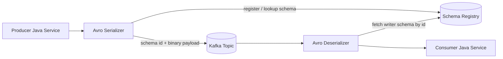
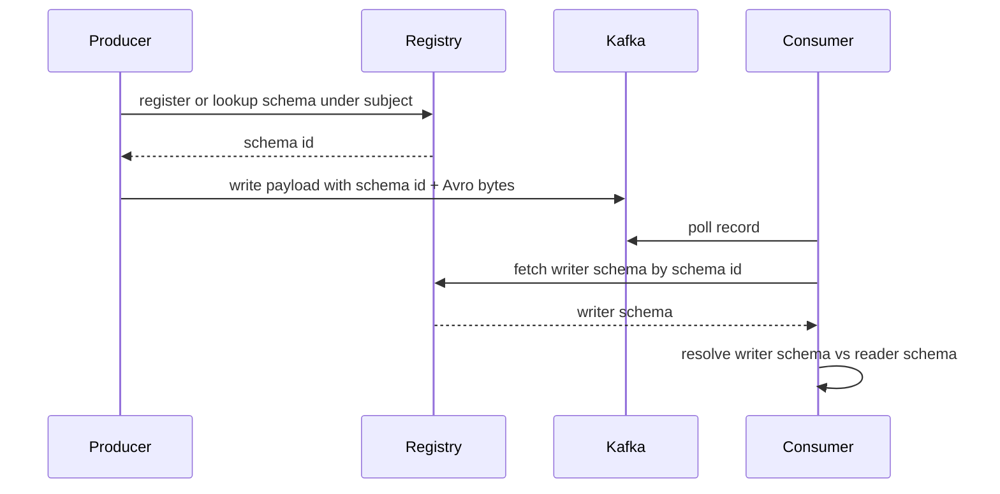
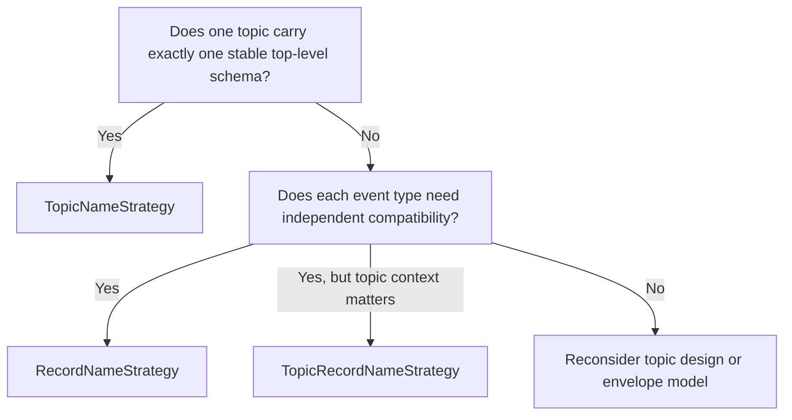
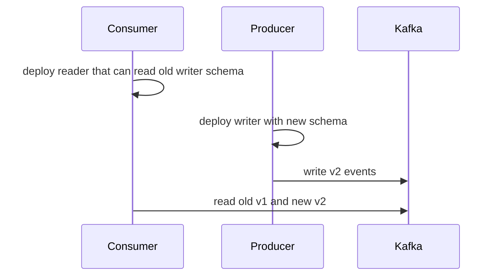
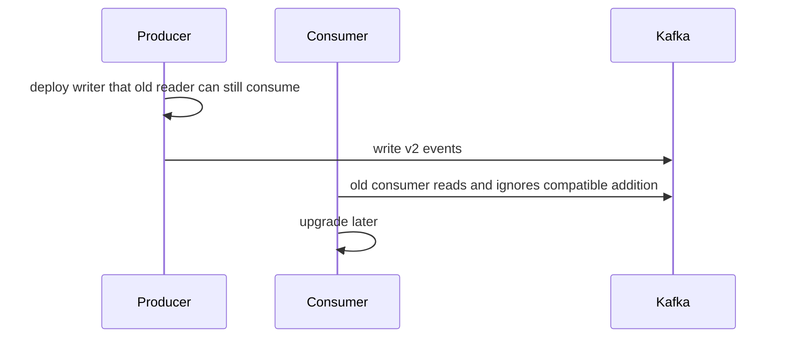
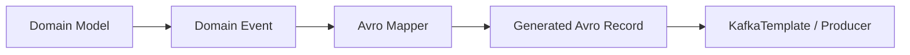
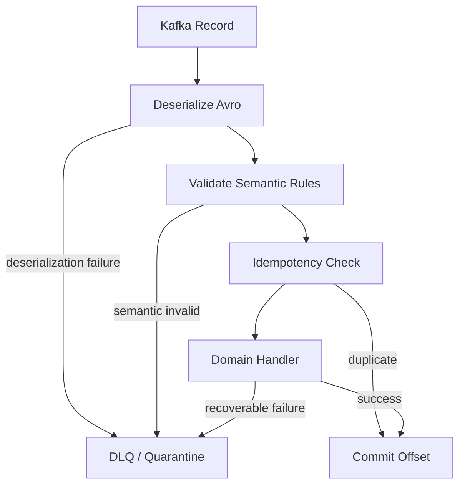
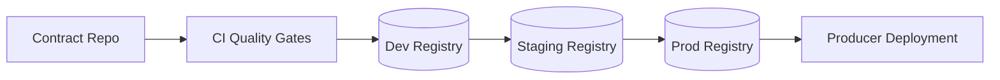

# Part 017 — Avro in Kafka, Schema Registry, and Data Lake Pipelines

Avro menjadi sangat kuat ketika dipakai bersama event streaming.

Tetapi banyak sistem produksi gagal bukan karena Avro-nya salah.

Mereka gagal karena tidak punya operating model untuk:

- siapa pemilik schema;
- bagaimana subject dinamai;
- bagaimana compatibility dicek;
- bagaimana event lama direplay;
- bagaimana payload invalid ditangani;
- bagaimana schema dipromosikan antar environment;
- bagaimana data lake membaca event yang ditulis bertahun-tahun lalu.

Avro di Kafka bukan hanya serialization choice.

Ia adalah kontrak evolusi antara waktu.

```text
Producer v1 writes event today.
Consumer v3 may read it next year.
Data lake may compact it next quarter.
A regulator may ask how its meaning changed two years later.
```

Kalau contract engineering-nya lemah, event stream berubah menjadi distributed landfill: banyak data, sedikit kepastian.

---

## 1. Mental Model: Kafka Payload Is Not Self-Explanatory

Kafka record minimal punya:

```text
topic
partition
offset
key
value
headers
timestamp
```

Tetapi `value` adalah byte array.

Tanpa contract system, byte array itu tidak punya makna operasional.

Avro memberi schema.

Schema Registry memberi identity, lookup, compatibility policy, dan lifecycle.

Producer/consumer SerDe menghubungkan byte array dengan schema identity.



Critical invariant:

> Kafka stores bytes. Contract infrastructure gives those bytes durable meaning.

---

## 2. What the Schema Registry Actually Solves

Schema Registry is often introduced as “where Avro schemas are stored”.

That is too shallow.

A production registry provides at least five functions:

| Function | What It Means | Failure If Missing |
|---|---|---|
| Schema identity | Stable schema ID/fingerprint | Consumers cannot know writer schema |
| Subject lifecycle | Group schema versions by logical contract | Compatibility checks happen against wrong history |
| Compatibility enforcement | Reject unsafe schema versions | Breaking changes reach production |
| SerDe coordination | Serializer embeds/uses schema identity | Payload cannot be decoded reliably |
| Governance evidence | History of schema versions and owners | No audit trail for data meaning changes |

Registry is not only storage.

It is contract memory.

---

## 3. Avro Payload on Kafka: The Practical Shape

A common Confluent-style Avro payload uses:

```text
magic byte
schema id
avro binary payload
```

Conceptually:

```text
[ 0 ][ schema-id ][ avro-bytes ]
```

Consumer deserializer extracts schema ID, fetches the writer schema, then resolves writer schema against the reader schema.



Key consequence:

> The writer schema must remain retrievable as long as historical data may be read.

If your retention, lake archive, replay, or legal hold can outlive registry retention, your architecture is broken.

---

## 4. Topic, Subject, Event Type, and Schema Are Different Things

Engineers often collapse these into one name.

That creates long-term pain.

| Concept | Example | Meaning |
|---|---|---|
| Topic | `case-events` | Kafka log / routing channel |
| Event type | `EnforcementCaseCreated` | Domain fact kind |
| Schema full name | `com.acme.case.v1.EnforcementCaseCreated` | Avro record identity |
| Subject | `case-events-value` or `com.acme.case.EnforcementCaseCreated` | Registry compatibility lineage |
| Java class | `EnforcementCaseCreated` | Runtime representation |
| Data product | `case_lifecycle_events` | Analytical/lake ownership boundary |

Do not design them accidentally.

They evolve at different rates.

---

## 5. Subject Naming Strategy

Subject naming controls what schema history a new schema is compared against.

That makes it one of the most important Avro/Kafka design decisions.

### 5.1 TopicNameStrategy

Typical shape:

```text
<topic>-key
<topic>-value
```

Example:

```text
case-events-value
```

All value schemas for the topic share one subject.

Good when:

- one topic carries one event envelope schema;
- compatibility should be enforced across every value in the topic;
- consumers subscribe by topic and expect a stable top-level shape.

Bad when:

- topic carries many unrelated event record types;
- each event type needs independent evolution;
- union/envelope becomes too broad and noisy.

### 5.2 RecordNameStrategy

Typical shape:

```text
<avro-fullname>
```

Example:

```text
com.acme.case.events.EnforcementCaseCreated
```

Each Avro record evolves independently.

Good when:

- many event types share one topic;
- event type is the compatibility boundary;
- consumers care about specific record types.

Bad when:

- the same record name is reused in different semantic contexts;
- topic-level constraints matter;
- governance wants topic owners to approve every schema under the topic.

### 5.3 TopicRecordNameStrategy

Typical shape:

```text
<topic>-<avro-fullname>
```

Example:

```text
case-events-com.acme.case.events.EnforcementCaseCreated
```

This combines topic and record identity.

Good when:

- same record name may appear in multiple topics with different lifecycle;
- topic context matters;
- you want event-type evolution but still scoped by topic.

Trade-off:

- more subjects;
- more registry metadata;
- more governance overhead.

### 5.4 Rule of Thumb

Use this decision tree:



Production default for enterprise multi-event topics:

> Prefer TopicRecordNameStrategy unless you have a strong reason not to.

It avoids accidental compatibility coupling while preserving topic context.

---

## 6. Compatibility Mode Is a Product Decision

Schema Registry compatibility modes are often configured by platform teams.

That is dangerous if domain teams do not understand the consequences.

Compatibility mode decides what changes are allowed.

| Mode | Simplified Meaning | Typical Use |
|---|---|---|
| BACKWARD | New reader can read old data | Consumers upgrade first or replay old data |
| FORWARD | Old reader can read new data | Producers upgrade first while old consumers remain |
| FULL | Both backward and forward | Stronger safety for mixed deployments |
| BACKWARD_TRANSITIVE | New reader can read all historical versions | Long replay/lake retention |
| FORWARD_TRANSITIVE | Old historical readers can read new data | Rare, strict legacy support |
| FULL_TRANSITIVE | All directions across all versions | Highest safety, highest evolution friction |
| NONE | No compatibility enforcement | Only for experiments, never default production |

For event streams, the practical default is often:

```text
BACKWARD_TRANSITIVE or FULL_TRANSITIVE
```

Why transitive?

Because Kafka replay rarely reads only the immediately previous version.

A new consumer may read data from v1, v2, v3, and v7 in the same replay.

Non-transitive compatibility can pass CI while still failing historical replay.

---

## 7. Producer and Consumer Upgrade Order

The safe upgrade order depends on compatibility direction.

### 7.1 Backward-Compatible Change

Example: producer adds a field with a default in reader schema discipline.

Flow:



Use when consumer can be upgraded before producer.

### 7.2 Forward-Compatible Change

Example: producer writes data that old consumer can ignore.

Flow:



Use when producer upgrade may precede consumer upgrade.

### 7.3 Full Compatibility

In distributed systems, mixed deployments happen.

Full compatibility protects both orders.

This is often worth the design discipline.

---

## 8. Event Envelope Design

There are two broad patterns.

### 8.1 Envelope Outside Avro

Kafka headers carry metadata:

```text
headers:
  eventType = EnforcementCaseCreated
  correlationId = ...
  causationId = ...
  tenantId = ...
  schemaVersion = ...
value:
  Avro domain payload
```

Pros:

- metadata available without decoding Avro payload;
- routing/filtering can inspect headers;
- domain payload stays clean.

Cons:

- headers may not survive all sinks/connectors consistently;
- lake ingestion may separate metadata from payload;
- validation must cover both headers and value.

### 8.2 Envelope Inside Avro

Top-level Avro record includes metadata and payload.

```json
{
  "type": "record",
  "name": "EventEnvelope",
  "namespace": "com.acme.platform.events",
  "fields": [
    {"name": "eventId", "type": {"type": "string", "logicalType": "uuid"}},
    {"name": "eventType", "type": "string"},
    {"name": "occurredAt", "type": {"type": "long", "logicalType": "timestamp-micros"}},
    {"name": "producer", "type": "string"},
    {"name": "payload", "type": [
      "com.acme.case.events.EnforcementCaseCreated",
      "com.acme.case.events.EnforcementCaseEscalated"
    ]}
  ]
}
```

Pros:

- complete event is self-contained;
- lake ingestion is easier;
- validation is unified.

Cons:

- union evolution can become painful;
- envelope subject can force unrelated event compatibility;
- generic consumers must handle wide union sets.

### 8.3 Recommended Hybrid

Use headers for transport/runtime concerns.

Use Avro envelope fields for durable business metadata.

```text
Kafka headers:
  traceparent
  retryCount
  sourceService
  validationStatus

Avro value:
  eventId
  eventType
  aggregateId
  occurredAt
  schemaSemanticVersion
  payload
```

Rule:

> Anything needed for long-term interpretation belongs in the Avro value, not only in headers.

---

## 9. Event Identity and Idempotency Contract

Every event payload should make idempotency possible.

Minimum fields:

| Field | Purpose |
|---|---|
| `eventId` | Deduplicate exact event |
| `eventType` | Route to semantic handler |
| `aggregateType` | Identify domain aggregate kind |
| `aggregateId` | Group event by entity |
| `occurredAt` | Business occurrence time |
| `publishedAt` | Producer publish time |
| `producer` | Source system identity |
| `correlationId` | Trace request/workflow |
| `causationId` | Link event to triggering command/event |

Example:

```json
{
  "type": "record",
  "name": "CaseEventMetadata",
  "namespace": "com.acme.case.events",
  "fields": [
    {"name": "eventId", "type": {"type": "string", "logicalType": "uuid"}},
    {"name": "eventType", "type": "string"},
    {"name": "aggregateType", "type": "string"},
    {"name": "aggregateId", "type": "string"},
    {"name": "occurredAt", "type": {"type": "long", "logicalType": "timestamp-micros"}},
    {"name": "publishedAt", "type": {"type": "long", "logicalType": "timestamp-micros"}},
    {"name": "producer", "type": "string"},
    {"name": "correlationId", "type": ["null", "string"], "default": null},
    {"name": "causationId", "type": ["null", "string"], "default": null}
  ]
}
```

Avoid relying only on Kafka offset for business identity.

Offset is a log position, not a domain identifier.

---

## 10. Java Producer Architecture

A production producer should not let generated Avro classes leak everywhere.

Use layers:

```text
Domain command/result
  -> domain event model
  -> Avro mapper
  -> Kafka record builder
  -> serializer
```



Example boundary:

```java
public final class CaseEventPublisher {
    private final KafkaProducer<String, SpecificRecord> producer;
    private final CaseEventAvroMapper mapper;

    public void publish(CaseCreated event) {
        EnforcementCaseCreated avro = mapper.toAvro(event);
        ProducerRecord<String, SpecificRecord> record = new ProducerRecord<>(
            "case-events",
            event.caseId(),
            avro
        );
        record.headers().add("eventType", "EnforcementCaseCreated".getBytes(StandardCharsets.UTF_8));
        producer.send(record, this::handleResult);
    }
}
```

Important:

- domain does not depend on Avro generated classes;
- mapper owns null/default/logical type conversion;
- producer wrapper owns Kafka metadata;
- serializer owns registry interaction.

---

## 11. Java Consumer Architecture

Consumer should separate:

- transport read;
- Avro deserialization;
- schema/error classification;
- idempotency;
- domain handling;
- offset commit.



Do not auto-commit before processing.

Do not swallow deserialization errors.

Do not let one poison record block the entire partition forever without an operational plan.

---

## 12. Deserialization Failure Taxonomy

Treat failures differently.

| Failure | Example | Action |
|---|---|---|
| Registry unavailable | Cannot fetch writer schema | Retry/backoff; do not DLQ immediately |
| Unknown schema ID | Registry lost schema or wrong cluster | Quarantine; platform incident |
| Avro decode failure | Bytes are not valid for writer schema | Quarantine; producer incident |
| Schema resolution failure | Reader cannot resolve writer | Breaking-change incident |
| Logical conversion failure | Decimal/time/UUID invalid | Quarantine; contract bug |
| Semantic validation failure | Status transition invalid | Business rejection/quarantine |
| Handler failure | DB timeout | Retry; not contract failure |

Contract errors and infrastructure errors need different dashboards.

A single `Exception` metric is useless.

---

## 13. Dead Letter Queue Design

DLQ is not a trash can.

DLQ is an investigation contract.

Minimum DLQ payload:

```json
{
  "sourceTopic": "case-events",
  "sourcePartition": 3,
  "sourceOffset": 1928831,
  "sourceTimestamp": "2026-07-03T10:11:12Z",
  "consumerGroup": "case-projection-v2",
  "failureCategory": "SCHEMA_RESOLUTION_FAILURE",
  "failureMessage": "Reader schema missing required field without default",
  "schemaId": 4102,
  "subject": "case-events-com.acme.case.events.EnforcementCaseCreated",
  "schemaVersion": 7,
  "eventType": "EnforcementCaseCreated",
  "eventId": "...",
  "correlationId": "...",
  "payloadBytesRef": "object-store://quarantine/...",
  "firstSeenAt": "2026-07-03T10:11:15Z"
}
```

Never assume the DLQ message can always contain decoded business payload.

If deserialization failed, decoded payload may not exist.

Store raw bytes safely.

---

## 14. Replay Safety

Replay is the real test of your Avro design.

A system is replay-safe if a new deployment can process old events without hidden manual fixes.

Replay hazards:

| Hazard | Why It Happens | Prevention |
|---|---|---|
| Missing old writer schema | Registry retention/migration lost it | Immutable registry backup/export |
| Non-transitive compatibility | Only previous version checked | Use transitive mode for replay topics |
| Semantic meaning changed | Same field now interpreted differently | Use semantic version and docs |
| Removed enum symbol | Old events contain removed symbol | Keep enum reader fallback/default strategy |
| Time precision changed | millis vs micros mismatch | Standardize logical types |
| Consumer side effects repeated | Handler not idempotent | Event ID dedupe and idempotent writes |
| Data lake schema flattening | Sink inferred latest schema only | Preserve writer schema or schema ID |

Replay test should be a CI/CD and pre-production practice.

Not a heroic incident activity.

---

## 15. Data Lake Pipeline Contracts

When Avro events are sent to S3/ADLS/GCS/warehouse, contract semantics can be lost.

Common anti-pattern:

```text
Kafka Avro event -> connector -> Parquet table with latest inferred schema
```

This often discards:

- writer schema ID;
- Avro schema version;
- event type;
- topic/partition/offset;
- original headers;
- raw payload reference;
- invalid payload evidence;
- compatibility history.

A lake pipeline should preserve operational lineage.

Recommended table metadata columns:

| Column | Type | Meaning |
|---|---|---|
| `_topic` | string | Kafka topic |
| `_partition` | int | Kafka partition |
| `_offset` | long | Kafka offset |
| `_timestamp` | timestamp | Kafka record timestamp |
| `_schema_id` | int | Registry schema ID |
| `_schema_subject` | string | Registry subject |
| `_schema_version` | int | Registry version if available |
| `_event_type` | string | Domain event type |
| `_ingested_at` | timestamp | Lake ingestion time |
| `_payload_valid` | boolean | Validation result |

This is not noise.

This is evidence.

---

## 16. Lake Schema Evolution: Do Not Flatten Too Early

Avro supports schema evolution at read time.

But many lake engines materialize columns into table schemas.

Once flattened, evolution rules change.

Example:

```text
Avro: add optional field with default -> safe
Parquet/Hive table: add column -> maybe safe
Downstream SQL: SELECT * assumptions -> maybe broken
Dashboard: expects no null -> broken
```

Contract engineering must cover downstream analytical consumers too.

Lake compatibility is not identical to Avro compatibility.

Define separate compatibility gates:

```text
Avro compatibility
  + lake table compatibility
  + SQL model compatibility
  + dashboard/report compatibility
```

---

## 17. Registry Promotion Across Environments

Avoid registering schemas ad hoc in production from arbitrary service startup.

Better operating model:

```text
contract repo
  -> CI lint
  -> compatibility check against dev registry
  -> publish artifact
  -> promote to staging registry
  -> integration test
  -> promote/register to prod registry
  -> deploy producer
```



Registration policy:

- local/dev can auto-register;
- staging can auto-register only from CI identity;
- production should register from promotion pipeline, not from random app runtime;
- app runtime may lookup schema but should not be the primary governance writer.

This keeps contract changes reviewable.

---

## 18. Auto-Register Schemas: Convenience vs Control

Many serializers can auto-register schemas.

Good for:

- local development;
- prototype environments;
- isolated integration tests.

Dangerous for:

- production;
- regulated domains;
- multi-team shared topics;
- environments with strict approval process.

Production recommendation:

```properties
auto.register.schemas=false
use.latest.version=false
```

Then explicitly bind the application artifact to the schema version it was tested with.

Reason:

> A running app should not silently create new production contracts.

---

## 19. Event Type Multiplexing

A single topic may carry many event types.

This is common for aggregate event streams.

Example:

```text
case-events
  EnforcementCaseCreated
  EnforcementCaseAssigned
  EnforcementCaseEscalated
  EnforcementCaseClosed
```

Benefits:

- ordering by aggregate key;
- easy subscription to lifecycle stream;
- fewer topics.

Costs:

- consumers must filter;
- schema governance is harder;
- topic retention applies to all event types;
- broad topic can become dumping ground.

Rules:

- use a stable aggregate key;
- keep event types semantically cohesive;
- avoid mixing operational telemetry with domain facts;
- avoid putting unrelated bounded contexts in one topic.

---

## 20. Key Schema Is a Contract Too

Teams often validate value schema and ignore key schema.

Kafka key determines partitioning and ordering.

A key change is a compatibility change.

Bad:

```text
v1 key = caseId
v2 key = tenantId + caseId
```

This can reorder aggregate events across partitions.

Key contract should define:

- type;
- encoding;
- partitioning semantics;
- stability guarantee;
- uniqueness expectation;
- migration path.

Recommended key wrapper:

```json
{
  "type": "record",
  "name": "CaseEventKey",
  "namespace": "com.acme.case.events",
  "fields": [
    {"name": "tenantId", "type": "string"},
    {"name": "caseId", "type": "string"}
  ]
}
```

But do not change key format casually.

A new key often means a new topic or carefully coordinated migration.

---

## 21. Schema Metadata and Governance Fields

Avro permits custom attributes as metadata that must not affect serialized data.

Use this for governance annotations.

Example:

```json
{
  "name": "complainantEmail",
  "type": ["null", "string"],
  "default": null,
  "doc": "Email address supplied by complainant.",
  "x-classification": "PII",
  "x-retention": "P7Y",
  "x-owner": "case-intake-team",
  "x-quality": {
    "requiredFor": ["consumer-notification"],
    "format": "email"
  }
}
```

Do not confuse metadata with validation.

If the rule must be enforced, implement a validation gate.

If the rule guides governance, metadata is useful.

---

## 22. Semantic Versioning for Events

Registry versions are not enough.

Registry version is storage sequence.

Semantic version communicates contract meaning.

Example:

```json
{
  "name": "schemaSemanticVersion",
  "type": "string",
  "default": "1.0.0"
}
```

Use cautiously.

You do not want business code branching on versions everywhere.

Better:

- use schema evolution to keep readers simple;
- use semantic version for audit and migration visibility;
- avoid long-lived conditional logic by version.

---

## 23. Contract CI for Avro/Kafka

Every schema PR should run:

| Gate | Purpose |
|---|---|
| Parse schema | Ensure valid Avro |
| Naming lint | Enforce namespace/type conventions |
| Documentation lint | Require `doc` on public fields |
| Logical type lint | Prevent raw long for timestamps unless approved |
| Nullable union lint | Enforce `null` first or team convention |
| Compatibility check | Compare against registry history |
| Example validation | Encode/decode golden events |
| Java generation | Ensure generated classes compile |
| Consumer fixture tests | Verify critical consumers can read |
| Lake projection test | Verify sink/table compatibility |

Compatibility check alone is not enough.

Avro can allow a change that still violates domain expectations.

---

## 24. Golden Event Fixtures

Keep canonical event examples in the contract repo.

```text
contracts/
  avro/
    case-events/
      EnforcementCaseCreated.avsc
      examples/
        v1-minimal.json
        v1-full.json
        v2-with-priority.json
        invalid-missing-case-id.json
```

Golden fixtures should cover:

- minimal valid payload;
- full valid payload;
- edge values;
- old version payloads;
- invalid examples;
- unknown enum cases where applicable;
- null/default combinations.

Tests should do:

```text
JSON fixture -> Avro encode -> Avro decode -> semantic assertion
```

This catches mapping bugs that schema compatibility cannot see.

---

## 25. Producer Contract Tests

Producer test should prove:

- emitted Avro record matches registered schema;
- required metadata exists;
- key is stable;
- event ID is unique;
- timestamp precision is correct;
- optional fields follow default/null policy;
- semantic invariants hold.

Example JUnit-ish skeleton:

```java
@Test
void publishes_case_created_with_stable_key_and_contract_metadata() {
    CaseCreated domainEvent = fixture.caseCreated();

    ProducerRecord<String, SpecificRecord> record = publisher.toRecord(domainEvent);

    assertThat(record.topic()).isEqualTo("case-events");
    assertThat(record.key()).isEqualTo(domainEvent.caseId());
    assertThat(record.value()).isInstanceOf(EnforcementCaseCreated.class);

    EnforcementCaseCreated avro = (EnforcementCaseCreated) record.value();
    assertThat(avro.getEventId()).isNotNull();
    assertThat(avro.getOccurredAt()).isGreaterThan(0L);
    assertThat(avro.getCaseId()).isEqualTo(domainEvent.caseId());
}
```

Test the mapping layer directly.

Do not only test Kafka integration.

---

## 26. Consumer Contract Tests

Consumer should test old payloads.

```java
@ParameterizedTest
@ValueSource(strings = {
    "fixtures/EnforcementCaseCreated-v1.avro",
    "fixtures/EnforcementCaseCreated-v2.avro",
    "fixtures/EnforcementCaseCreated-v3.avro"
})
void consumer_can_read_historical_case_created_events(String fixture) {
    EnforcementCaseCreated event = avroFixtureReader.read(fixture, EnforcementCaseCreated.class);

    CaseProjectionCommand command = mapper.toCommand(event);

    assertThat(command.caseId()).isNotBlank();
}
```

If you only test latest schema, you are not testing replay.

---

## 27. Schema Registry Availability

At runtime, deserializers may need registry access for schema IDs not cached locally.

Failure design:

| Situation | Recommended Behavior |
|---|---|
| Registry unavailable but schema cached | Continue processing |
| Registry unavailable and schema uncached | Retry/backoff, avoid committing offset |
| Registry returns not found | Quarantine and raise platform incident |
| Registry latency high | Monitor and cache aggressively |

Cache sizing matters.

A consumer group replaying diverse historical data may touch many schema IDs.

---

## 28. Multi-Region and Disaster Recovery

Schema registry is part of data-plane survivability.

If Kafka is replicated but schema registry is not, replicated data may be unreadable.

DR checklist:

- replicate/export schemas;
- preserve schema IDs if serializer format depends on IDs;
- preserve subject/version history;
- preserve compatibility settings;
- test consumer failover with historical records;
- document registry restore order before consumer start.

Kafka bytes without schema registry can become inert evidence.

---

## 29. Anti-Patterns

### 29.1 One Giant Union Envelope Forever

```json
{"name": "payload", "type": ["EventA", "EventB", "EventC", "EventD", "EventE"]}
```

Initially convenient.

Eventually painful.

Symptoms:

- every event addition modifies envelope schema;
- all consumers see noisy changes;
- compatibility history becomes tangled;
- generated Java classes become huge.

Prefer record-level subjects or topic-record strategy for large event families.

### 29.2 Reusing Record Name for Different Meaning

```text
com.acme.Event
```

Never use generic names for public contracts.

Full name should carry bounded context and semantic identity.

### 29.3 Deleting Registry History

Do not delete old schemas just because producers no longer write them.

Old data may still exist.

### 29.4 Treating DLQ as Success

Moving a bad event to DLQ is not resolution.

DLQ requires ownership, SLO, replay process, and closure status.

### 29.5 Using Latest Schema Blindly

Consumers should know their reader schema.

Fetching “latest” at runtime can make behavior change without deployment.

That is not controlled engineering.

---

## 30. Production Readiness Checklist

Before shipping an Avro/Kafka contract:

- [ ] Subject naming strategy documented.
- [ ] Compatibility mode selected intentionally.
- [ ] Key schema/semantics documented.
- [ ] Event metadata fields defined.
- [ ] Schema registered through CI/promotion pipeline.
- [ ] Producer test validates emitted record.
- [ ] Consumer test reads historical fixture.
- [ ] DLQ includes raw bytes reference and schema metadata.
- [ ] Registry backup/DR tested.
- [ ] Data lake preserves schema ID and Kafka lineage.
- [ ] Replay test executed against old versions.
- [ ] Owner and deprecation policy documented.

---

## 31. A Concrete Design: Regulatory Case Events

Topic:

```text
regulatory-case-events
```

Key:

```text
tenantId + caseId
```

Subject naming:

```text
TopicRecordNameStrategy
```

Event types:

```text
com.acme.regulatory.case.events.CaseOpened
com.acme.regulatory.case.events.CaseAssigned
com.acme.regulatory.case.events.EscalationRaised
com.acme.regulatory.case.events.DecisionRecorded
com.acme.regulatory.case.events.CaseClosed
```

Compatibility:

```text
FULL_TRANSITIVE for public lifecycle events
BACKWARD_TRANSITIVE for internal projection-only topics
```

Metadata:

```text
eventId
caseId
tenantId
correlationId
causationId
occurredAt
publishedAt
producer
schemaSemanticVersion
```

DLQ:

```text
regulatory-case-events.dlq
```

Lake table:

```text
bronze_regulatory_case_events
```

Preserved lineage:

```text
_topic, _partition, _offset, _schema_id, _event_type, _ingested_at
```

This design is not fancy.

It is defensible.

---

## 32. Mental Model Recap

Avro in Kafka is not just about efficient binary payloads.

It is about stable interpretation across time.

The production-grade model:

```text
Kafka topic = durable log
Avro schema = data shape and evolution rules
Schema registry = contract memory
Subject = compatibility lineage
Schema ID = writer schema identity
Consumer reader schema = current interpretation
DLQ = contract failure evidence
Data lake metadata = long-term lineage
```

If you remember only one thing:

> Do not ask “Can this schema serialize?” Ask “Can every expected reader interpret every still-existing writer payload under controlled evolution rules?”

That is the engineering question.

---

## References

- [Apache Avro 1.12.0 Specification](https://avro.apache.org/docs/1.12.0/specification/)
- [Confluent Schema Registry SerDes and Subject Name Strategy Documentation](https://docs.confluent.io/platform/current/schema-registry/fundamentals/serdes-develop/index.html)
- [Confluent Schema Evolution and Compatibility Documentation](https://docs.confluent.io/platform/current/schema-registry/fundamentals/schema-evolution.html)
- [Apache Kafka Documentation](https://kafka.apache.org/documentation/)
