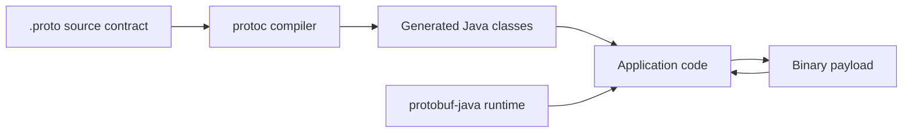
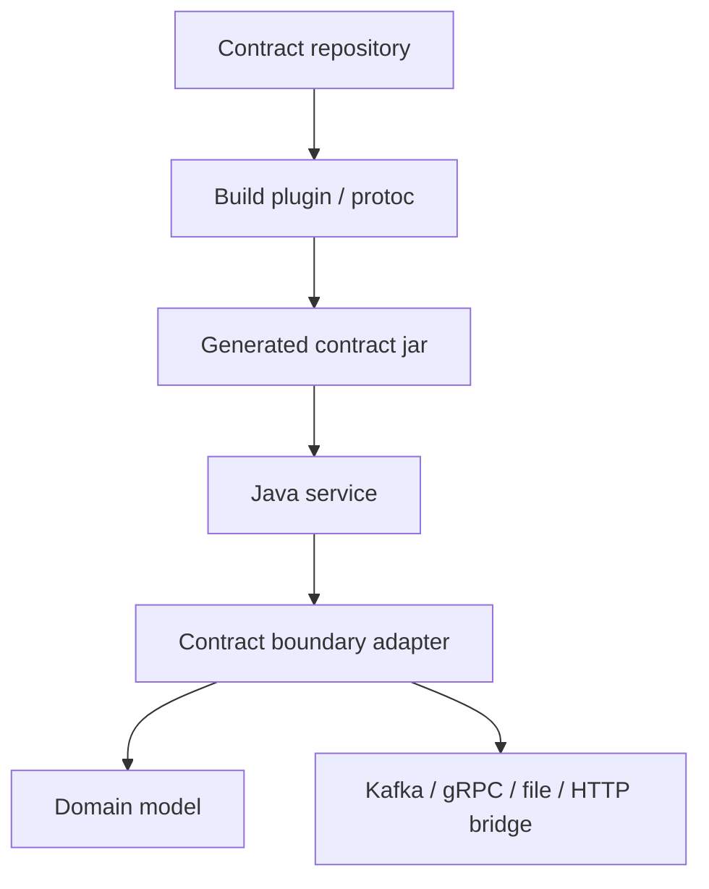
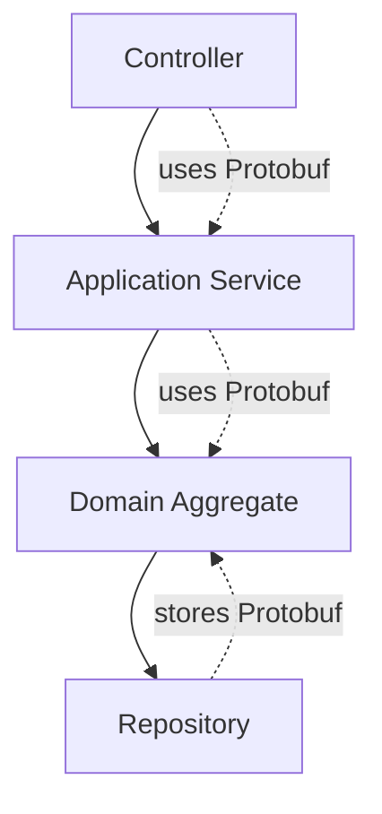
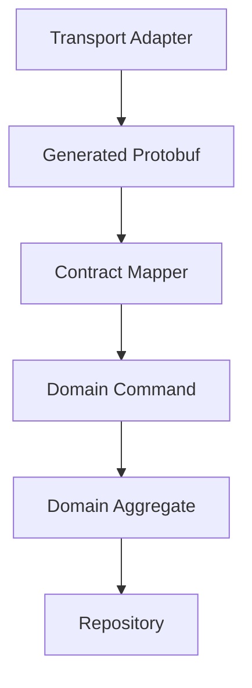
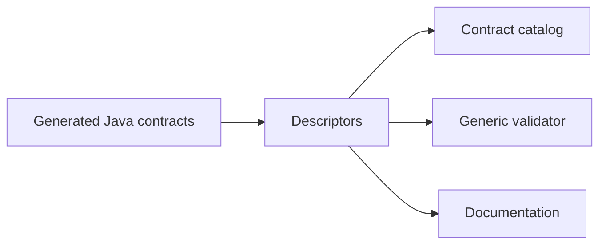
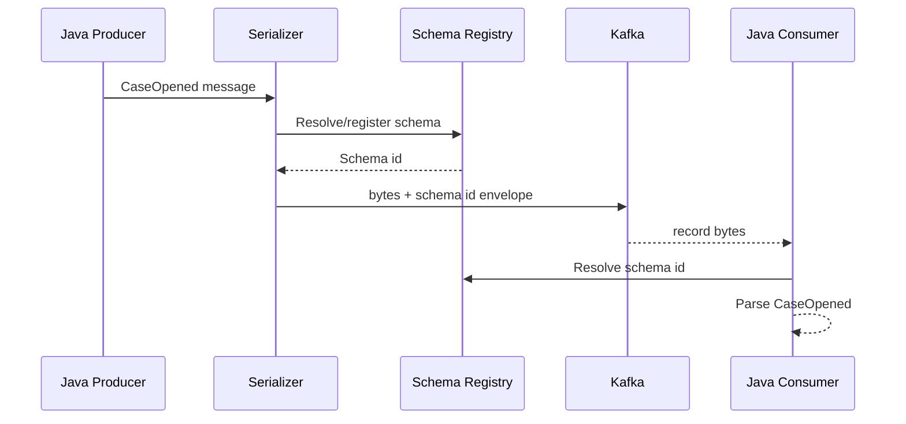

# Part 019 — Protobuf Java: Generated Code, Builders, and Runtime

Protobuf Java is not “a serializer library”.

It is a contract compiler plus a runtime model.

You write this:

```proto
syntax = "proto3";

package enforcement.case.v1;

option java_package = "com.acme.contract.enforcement.case.v1";
option java_multiple_files = true;

message CaseOpened {
  string case_id = 1;
  optional string external_reference = 2;
  CasePriority priority = 3;
  int64 opened_at_epoch_millis = 4;
}

enum CasePriority {
  CASE_PRIORITY_UNSPECIFIED = 0;
  CASE_PRIORITY_LOW = 1;
  CASE_PRIORITY_MEDIUM = 2;
  CASE_PRIORITY_HIGH = 3;
}
```

The Protobuf compiler turns it into Java classes, builders, parsers, descriptors, enum wrappers, default instances, and serialization logic.

The generated code is part of your system surface.

That means Protobuf Java design is not only about `.proto` syntax. It is about:

- build generation;
- package naming;
- generated source stability;
- builder lifecycle;
- field presence semantics;
- parser boundary;
- domain mapping;
- runtime version alignment;
- validation outside Protobuf;
- unknown field handling;
- binary vs JSON representation;
- integration with gRPC, Kafka, storage, and internal application layers.

This part is the Java production manual.

---

## 1. The Generated-Code Mental Model

The simplest mental model is:



But production systems need a stricter model:



The generated classes should usually live in a **contract artifact**, not be hand-written inside a service module.

Why?

Because generated code has different ownership from business code:

| Artifact | Owner | Change review |
|---|---:|---|
| `.proto` file | Contract/API/event owner | Compatibility + domain review |
| generated Java | Build pipeline | Not hand-edited |
| service adapter | Service team | Mapping and validation review |
| domain model | Domain team | Business invariant review |

A top-tier Java engineer does not treat generated Protobuf classes as domain entities.

Generated Protobuf classes are transport contract types.

---

## 2. Compiler Output: What Java Actually Gets

For each `.proto` file, Java generation creates code based on options and message definitions.

The important options are:

```proto
option java_package = "com.acme.contract.case.v1";
option java_multiple_files = true;
option java_outer_classname = "CaseEventsProto";
```

### `java_package`

Use `java_package` deliberately.

Do not rely blindly on the `.proto` `package`.

The `.proto` package is a Protobuf namespace. The Java package is a Java source namespace.

They often align, but they are not identical design dimensions.

Good pattern:

```proto
package enforcement.case.v1;

option java_package = "com.acme.contract.enforcement.case.v1";
option java_multiple_files = true;
```

This gives:

```text
Proto namespace: enforcement.case.v1
Java package:    com.acme.contract.enforcement.case.v1
```

Why this matters:

- `.proto` package affects type references across proto files;
- `java_package` affects imports, binary names, generated source layout, and Java dependency boundaries;
- changing `java_package` is a source/binary breaking change for Java consumers;
- changing `.proto` package can break Protobuf type references and `Any` type URLs.

### `java_multiple_files`

With `java_multiple_files = true`, each top-level message, enum, and service can be generated as separate Java files.

This is usually better for modern Java services because imports stay clean:

```java
import com.acme.contract.enforcement.case.v1.CaseOpened;
import com.acme.contract.enforcement.case.v1.CasePriority;
```

Without it, generated types may be nested under an outer wrapper class:

```java
import com.acme.contract.enforcement.case.v1.CaseEventsProto.CaseOpened;
```

For large enterprise contracts, prefer:

```proto
option java_multiple_files = true;
```

unless your organization has a strong legacy reason not to.

### `java_outer_classname`

Use it to avoid ugly or unstable outer class names.

Bad:

```proto
// file name: event.proto
// generated outer class may be Event
```

Better:

```proto
option java_outer_classname = "CaseEventProtos";
```

Even if `java_multiple_files = true`, the outer class may still contain descriptors and file-level artifacts.

---

## 3. Maven Build Shape

A production Java project should generate Protobuf code deterministically.

One possible Maven layout:

```text
contract-case-events/
  pom.xml
  src/main/proto/
    enforcement/case/v1/case_events.proto
    enforcement/common/v1/money.proto
  src/test/resources/fixtures/
    case-opened-v1.bin
    case-opened-v1.json
```

The generated artifact is then consumed by services:

```text
case-command-service/
  pom.xml
  src/main/java/
    ...
  dependencies:
    contract-case-events
```

Do not copy `.proto` files manually across services.

Publish the contract artifact.

A simplified Maven concept:

```xml
<dependencies>
  <dependency>
    <groupId>com.google.protobuf</groupId>
    <artifactId>protobuf-java</artifactId>
    <version>${protobuf.version}</version>
  </dependency>
</dependencies>

<build>
  <plugins>
    <!-- Use a protobuf/protoc build plugin selected by your organization. -->
    <!-- Pin protoc and protobuf-java versions deliberately. -->
  </plugins>
</build>
```

The important production rules are not plugin-specific:

1. pin `protoc` version;
2. pin `protobuf-java` runtime version;
3. generate code in CI exactly the same way as local builds;
4. fail the build if generated code is stale;
5. publish generated contracts as versioned artifacts;
6. keep generated code out of manual edits;
7. document runtime compatibility expectations.

---

## 4. Runtime Version Alignment

A common enterprise failure mode:

```text
Service A depends on generated code from protoc version X.
Service A runtime uses protobuf-java version Y.
A transitive dependency pulls another protobuf-java version Z.
Runtime behavior differs or fails.
```

Do not let this be accidental.

Use dependency management:

```xml
<dependencyManagement>
  <dependencies>
    <dependency>
      <groupId>com.google.protobuf</groupId>
      <artifactId>protobuf-bom</artifactId>
      <version>${protobuf.version}</version>
      <type>pom</type>
      <scope>import</scope>
    </dependency>
  </dependencies>
</dependencyManagement>
```

Then declare:

```xml
<dependency>
  <groupId>com.google.protobuf</groupId>
  <artifactId>protobuf-java</artifactId>
</dependency>
```

Also enforce with Maven Enforcer or Gradle constraints:

```xml
<requireUpperBoundDeps />
<dependencyConvergence />
```

### Contract Runtime Rule

Generated Protobuf classes and the runtime library are coupled.

Treat them like this:

```text
Generated code version + runtime version = one compatibility unit.
```

Not because every mismatch explodes immediately, but because subtle mismatches are the worst class of production defect.

They pass build, pass smoke tests, then fail in a strange edge path.

---

## 5. Generated Message Anatomy

For a message like:

```proto
message CaseOpened {
  string case_id = 1;
  optional string external_reference = 2;
  CasePriority priority = 3;
  int64 opened_at_epoch_millis = 4;
}
```

You typically get a final Java class with methods shaped like:

```java
CaseOpened event = CaseOpened.newBuilder()
    .setCaseId("CASE-2026-0001")
    .setExternalReference("PORTAL-991")
    .setPriority(CasePriority.CASE_PRIORITY_HIGH)
    .setOpenedAtEpochMillis(1783017600000L)
    .build();

String caseId = event.getCaseId();
boolean hasExternalReference = event.hasExternalReference();
byte[] bytes = event.toByteArray();
CaseOpened parsed = CaseOpened.parseFrom(bytes);
```

The important generated concepts:

| Generated concept | Purpose |
|---|---|
| message class | immutable representation after `build()` |
| builder class | mutable construction API |
| parser | decoding bytes into message |
| default instance | canonical empty/default instance |
| descriptor | runtime metadata about fields/types |
| enum class | generated Java enum-like API |
| unknown fields | preserved unrecognized wire data where supported |

The message object is not a domain aggregate.

It is a serialized contract object.

---

## 6. Builders: The Correct Mental Model

Generated messages are immutable.

Builders are mutable.

That separation matters for thread safety, data correctness, and accidental mutation.

Good:

```java
CaseOpened event = CaseOpened.newBuilder()
    .setCaseId(caseId)
    .setPriority(priority)
    .setOpenedAtEpochMillis(clock.millis())
    .build();

publish(event);
```

Dangerous:

```java
CaseOpened.Builder builder = CaseOpened.newBuilder();

for (Case domainCase : cases) {
    builder.setCaseId(domainCase.id());
    builder.setPriority(toProtoPriority(domainCase.priority()));
    publish(builder.build());
}
```

This can be okay if every field is overwritten correctly each iteration.

But in real systems, optional fields create bugs:

```java
CaseOpened.Builder builder = CaseOpened.newBuilder();

for (Case domainCase : cases) {
    builder.setCaseId(domainCase.id());

    if (domainCase.externalReference() != null) {
        builder.setExternalReference(domainCase.externalReference());
    }

    publish(builder.build());
}
```

If the first case has external reference and the second does not, the second can accidentally inherit the old value unless you clear it.

Correct:

```java
CaseOpened.Builder builder = CaseOpened.newBuilder();

for (Case domainCase : cases) {
    builder.clear();
    builder.setCaseId(domainCase.id());

    domainCase.externalReference()
        .ifPresentOrElse(
            builder::setExternalReference,
            builder::clearExternalReference
        );

    publish(builder.build());
}
```

Or better: create a fresh builder at the mapping boundary unless profiling proves builder reuse matters.

```java
private CaseOpened toProto(Case domainCase) {
    CaseOpened.Builder builder = CaseOpened.newBuilder()
        .setCaseId(domainCase.id().value())
        .setPriority(toProto(domainCase.priority()))
        .setOpenedAtEpochMillis(domainCase.openedAt().toEpochMilli());

    domainCase.externalReference()
        .ifPresent(builder::setExternalReference);

    return builder.build();
}
```

### Builder Rule

```text
Correctness first. Reuse builders only in hot paths with tests proving no state leakage.
```

---

## 7. Field Presence in Java

Presence is where many Java bugs start.

Proto3 originally used implicit presence for many scalar fields. That means the API may not tell you whether a scalar field was absent or explicitly set to the default value.

Example:

```proto
message UpdateCasePriority {
  string case_id = 1;
  int32 priority_score = 2;
}
```

In Java:

```java
int score = command.getPriorityScore();
```

If `score == 0`, what does it mean?

- field absent?
- explicitly set to zero?
- default priority?
- invalid client input?
- migration artifact?

For command/update semantics, this is dangerous.

Prefer explicit presence:

```proto
message UpdateCasePriority {
  string case_id = 1;
  optional int32 priority_score = 2;
}
```

Then Java can expose presence:

```java
if (command.hasPriorityScore()) {
    int score = command.getPriorityScore();
    updateScore(score);
} else {
    leaveScoreUnchanged();
}
```

### Presence Matrix

| Field kind | Java presence behavior | Design guidance |
|---|---|---|
| singular proto3 scalar without `optional` | usually implicit; default returned | avoid for patch/update intent |
| singular proto3 scalar with `optional` | explicit `hasX()` | use when absence matters |
| message field | explicit presence | good for nested optional structures |
| `oneof` | case method indicates chosen member | good for mutually exclusive variants |
| repeated field | no presence; empty list means no elements | do not use to distinguish absent vs empty |
| map field | no presence; empty map means no entries | same as repeated |

### Domain Mapping Rule

Never map Protobuf scalar defaults directly into domain decisions without checking whether absence matters.

Bad:

```java
caseAggregate.setRiskScore(command.getRiskScore());
```

Better:

```java
if (command.hasRiskScore()) {
    caseAggregate.setRiskScore(RiskScore.of(command.getRiskScore()));
}
```

---

## 8. Repeated Fields and Maps

Generated repeated fields behave like immutable lists on built messages:

```java
List<String> tags = event.getTagsList();
```

On builders, you mutate using generated methods:

```java
CaseTagged event = CaseTagged.newBuilder()
    .setCaseId(caseId)
    .addTags("fraud")
    .addTags("priority-review")
    .build();
```

For maps:

```proto
message CaseAttributesChanged {
  string case_id = 1;
  map<string, string> attributes = 2;
}
```

Java usage:

```java
CaseAttributesChanged event = CaseAttributesChanged.newBuilder()
    .setCaseId(caseId)
    .putAttributes("source", "portal")
    .putAttributes("jurisdiction", "ID")
    .build();
```

### Repeated/Map Design Rule

Repeated fields and maps are great for data.

They are poor for patch semantics unless paired with explicit operation type.

Bad patch contract:

```proto
message PatchCaseTags {
  string case_id = 1;
  repeated string tags = 2;
}
```

Ambiguous:

```text
Does empty tags mean remove all tags, set no tags, or leave unchanged?
```

Better:

```proto
message PatchCaseTags {
  string case_id = 1;
  oneof operation {
    ReplaceTags replace_tags = 2;
    AddTags add_tags = 3;
    RemoveTags remove_tags = 4;
  }
}

message ReplaceTags {
  repeated string tags = 1;
}

message AddTags {
  repeated string tags = 1;
}

message RemoveTags {
  repeated string tags = 1;
}
```

Then Java is clear:

```java
switch (patch.getOperationCase()) {
    case REPLACE_TAGS -> replaceTags(patch.getReplaceTags().getTagsList());
    case ADD_TAGS -> addTags(patch.getAddTags().getTagsList());
    case REMOVE_TAGS -> removeTags(patch.getRemoveTags().getTagsList());
    case OPERATION_NOT_SET -> reject("operation is required");
}
```

---

## 9. `oneof` Java Usage

A `oneof` compiles into a case discriminator plus getter methods.

```proto
message CaseActionRequested {
  string case_id = 1;

  oneof action {
    EscalateCase escalate = 2;
    AssignCase assign = 3;
    CloseCase close = 4;
  }
}
```

Java mapping:

```java
switch (request.getActionCase()) {
    case ESCALATE -> handleEscalation(request.getEscalate());
    case ASSIGN -> handleAssignment(request.getAssign());
    case CLOSE -> handleClose(request.getClose());
    case ACTION_NOT_SET -> throw new ContractViolation("action is required");
}
```

This is much better than:

```proto
message CaseActionRequested {
  string case_id = 1;
  EscalateCase escalate = 2;
  AssignCase assign = 3;
  CloseCase close = 4;
}
```

because the second model allows invalid states:

```text
escalate + assign + close all set
```

A contract should make invalid states hard or impossible.

---

## 10. Enums in Java

Protobuf enums are not ordinary Java enums from a contract perspective.

They are numeric wire values with generated symbolic names.

Always include an unspecified zero value:

```proto
enum EnforcementStage {
  ENFORCEMENT_STAGE_UNSPECIFIED = 0;
  ENFORCEMENT_STAGE_INTAKE = 1;
  ENFORCEMENT_STAGE_INVESTIGATION = 2;
  ENFORCEMENT_STAGE_DECISION = 3;
  ENFORCEMENT_STAGE_CLOSED = 4;
}
```

Java mapping should not silently accept `UNSPECIFIED` in business-required fields.

Bad:

```java
EnforcementStage stage = event.getStage();
caseAggregate.moveTo(stage.name());
```

Better:

```java
private Stage toDomainStage(EnforcementStage stage) {
    return switch (stage) {
        case ENFORCEMENT_STAGE_INTAKE -> Stage.INTAKE;
        case ENFORCEMENT_STAGE_INVESTIGATION -> Stage.INVESTIGATION;
        case ENFORCEMENT_STAGE_DECISION -> Stage.DECISION;
        case ENFORCEMENT_STAGE_CLOSED -> Stage.CLOSED;
        case ENFORCEMENT_STAGE_UNSPECIFIED,
             UNRECOGNIZED -> throw new ContractViolation("stage is required");
    };
}
```

Notice `UNRECOGNIZED`.

Java consumers must handle enum values newer than their generated code.

That is forward compatibility in action.

---

## 11. Parsing and Serialization Boundary

Binary serialization:

```java
byte[] payload = event.toByteArray();
CaseOpened parsed = CaseOpened.parseFrom(payload);
```

Stream parsing:

```java
try (InputStream in = source.openStream()) {
    CaseOpened parsed = CaseOpened.parseFrom(in);
}
```

Delimited parsing is useful when multiple messages are written to the same stream:

```java
event.writeDelimitedTo(outputStream);
CaseOpened parsed = CaseOpened.parseDelimitedFrom(inputStream);
```

### Boundary Parser Pattern

Do not parse deep inside business logic.

Bad:

```java
public void handle(byte[] payload) {
    CaseOpened event = CaseOpened.parseFrom(payload);
    aggregate.apply(event.getCaseId(), event.getPriority());
}
```

Better:

```java
public void handle(byte[] payload) {
    CaseOpened event = parser.parse(payload);
    validator.validate(event);
    CaseOpenedCommand command = mapper.toDomainCommand(event);
    applicationService.handle(command);
}
```

Use layers:

```mermaid
flowchart LR
    Bytes[byte[] / InputStream]
    Parse[Parse Protobuf]
    ContractValidate[Contract validation]
    Map[Map to domain command]
    Business[Business logic]
    Persist[Persist / publish]

    Bytes --> Parse --> ContractValidate --> Map --> Business --> Persist
```

Why this matters:

- parse errors are transport errors;
- contract validation errors are client/producer errors;
- semantic validation errors are business errors;
- persistence errors are infrastructure errors.

Do not collapse them into one exception category.

---

## 12. Error Taxonomy

A production Protobuf boundary needs precise error categories.

| Error category | Example | Handling |
|---|---|---|
| parse error | invalid binary payload | reject / DLQ |
| version/runtime error | incompatible generated/runtime version | fail deployment or startup |
| contract missing required semantic field | `case_id` empty | reject with contract violation |
| unknown enum | `UNRECOGNIZED` stage | reject, quarantine, or allow depending on policy |
| unsupported oneof case | new producer sends new action | forward-compatible fallback or quarantine |
| semantic rule violation | close reason invalid for stage | business validation error |
| authorization error | caller cannot perform action | security error |

Example parser wrapper:

```java
public final class ProtobufPayloadParser<T extends Message> {
    private final Parser<T> parser;

    public ProtobufPayloadParser(Parser<T> parser) {
        this.parser = Objects.requireNonNull(parser);
    }

    public T parse(byte[] payload) {
        try {
            return parser.parseFrom(payload);
        } catch (InvalidProtocolBufferException ex) {
            throw new ContractParseException("Invalid protobuf payload", ex);
        }
    }
}
```

Usage:

```java
var parser = new ProtobufPayloadParser<>(CaseOpened.parser());
CaseOpened event = parser.parse(record.value());
```

---

## 13. Validation: Protobuf Is Not Enough

Protobuf enforces structure.

It does not fully enforce domain invariants.

This schema:

```proto
message CaseOpened {
  string case_id = 1;
  int64 opened_at_epoch_millis = 2;
}
```

allows:

```text
case_id = ""
opened_at_epoch_millis = -1
```

Therefore, validation must sit above parsing.

Example:

```java
public final class CaseOpenedValidator {
    public List<Violation> validate(CaseOpened event) {
        List<Violation> violations = new ArrayList<>();

        if (event.getCaseId().isBlank()) {
            violations.add(Violation.required("case_id"));
        }

        if (event.getOpenedAtEpochMillis() <= 0) {
            violations.add(Violation.invalid("opened_at_epoch_millis", "must be positive epoch millis"));
        }

        if (event.getPriority() == CasePriority.CASE_PRIORITY_UNSPECIFIED
            || event.getPriority() == CasePriority.UNRECOGNIZED) {
            violations.add(Violation.invalid("priority", "must be a recognized non-unspecified priority"));
        }

        return violations;
    }
}
```

Top-tier rule:

```text
Protobuf says the payload is structurally readable.
Your contract validator says the payload is acceptable.
Your domain model says the command is meaningful.
```

Those are three different gates.

---

## 14. Mapping Generated Types to Domain Types

Do not leak generated Protobuf classes across all application layers.

Bad architecture:



This couples your domain to wire evolution.

Better:



Example mapper:

```java
public final class CaseOpenedMapper {
    public OpenCaseCommand toCommand(CaseOpened event) {
        return new OpenCaseCommand(
            CaseId.parse(event.getCaseId()),
            toPriority(event.getPriority()),
            Instant.ofEpochMilli(event.getOpenedAtEpochMillis()),
            event.hasExternalReference()
                ? Optional.of(ExternalReference.of(event.getExternalReference()))
                : Optional.empty()
        );
    }
}
```

Generated code belongs to the **contract adapter layer**.

Domain code should speak domain language.

---

## 15. ByteString, String, and Bytes

Use `bytes` for binary data:

```proto
message EvidenceAttached {
  string case_id = 1;
  string content_type = 2;
  bytes content_sha256 = 3;
}
```

Java:

```java
ByteString hash = event.getContentSha256();
byte[] hashBytes = hash.toByteArray();
```

Be careful: `toByteArray()` copies.

For large payloads, do not embed huge blobs in Protobuf events.

Bad:

```proto
message EvidenceAttached {
  string case_id = 1;
  bytes file_content = 2;
}
```

Better:

```proto
message EvidenceAttached {
  string case_id = 1;
  string object_uri = 2;
  string content_type = 3;
  bytes content_sha256 = 4;
  int64 size_bytes = 5;
}
```

Large binary objects should live in object storage, not in Kafka messages or RPC request bodies unless there is a very specific reason.

---

## 16. JSON Format Is a Separate Surface

Protobuf binary and Protobuf JSON mapping are not identical operational surfaces.

Binary Protobuf is field-number based.

JSON mapping is name based.

This matters for:

- field renames;
- enum names;
- default values;
- unknown fields;
- browser/client compatibility;
- logging and audit exports;
- API gateways;
- gRPC-JSON transcoding.

If your `.proto` is exposed through JSON, then field names become externally visible.

This change may be binary-compatible:

```proto
string case_id = 1;
```

to:

```proto
string enforcement_case_id = 1;
```

But it can break JSON clients.

Do not call a change safe until you know which representation your consumers use.

---

## 17. Unknown Fields

Unknown fields support forward compatibility for binary Protobuf.

Scenario:

1. producer v2 sends field `risk_score = 8`;
2. consumer v1 does not know field 8;
3. parser can still read known fields;
4. unknown field may be preserved in the message unknown field set.

Java has unknown field APIs, but business logic should rarely depend on them.

Unknown fields are for compatibility preservation, not product behavior.

Bad:

```java
UnknownFieldSet unknown = event.getUnknownFields();
// business logic branches on unknown field number 8
```

Better:

```text
If the field is business-relevant, update the contract and generated code.
```

Use unknown fields for:

- observability;
- compatibility diagnostics;
- forward compatibility in proxy/pass-through systems;
- drift detection.

---

## 18. Descriptors and Reflection

Generated classes expose descriptors.

Descriptors are useful for:

- generic validation;
- schema catalog indexing;
- dynamic payload inspection;
- documentation generation;
- observability labels;
- contract registry integration;
- building generic tools.

Example concept:

```java
Descriptors.Descriptor descriptor = CaseOpened.getDescriptor();

for (Descriptors.FieldDescriptor field : descriptor.getFields()) {
    System.out.printf("%s = %d%n", field.getName(), field.getNumber());
}
```

A contract platform can use descriptors to build a schema inventory:



But reflection should not replace clear generated APIs for normal business logic.

---

## 19. gRPC and Generated Services

Protobuf service definitions are often used with gRPC.

Example:

```proto
service CaseCommandService {
  rpc OpenCase(OpenCaseRequest) returns (OpenCaseResponse);
  rpc EscalateCase(EscalateCaseRequest) returns (EscalateCaseResponse);
}
```

In Java, gRPC tooling generates service base classes and stubs.

The key architecture rule remains:

```text
gRPC generated request/response classes are transport contracts, not domain models.
```

A service method should look conceptually like:

```java
@Override
public void openCase(OpenCaseRequest request,
                     StreamObserver<OpenCaseResponse> responseObserver) {
    try {
        validator.validateOrThrow(request);
        OpenCaseCommand command = mapper.toCommand(request);
        OpenCaseResult result = applicationService.openCase(command);
        responseObserver.onNext(mapper.toResponse(result));
        responseObserver.onCompleted();
    } catch (ContractViolation ex) {
        responseObserver.onError(statusMapper.toStatusRuntimeException(ex));
    }
}
```

Keep generated Protobuf at the boundary.

---

## 20. Kafka and Protobuf Java

For Kafka, Protobuf messages are often serialized using a registry-aware serializer.

Conceptual flow:



The important rule:

```text
Consumer runtime must know which generated type it expects, or use a deliberate dynamic/generic Protobuf path.
```

For most business services, generated types are better:

```java
public void consume(ConsumerRecord<String, CaseOpened> record) {
    CaseOpened event = record.value();
    validator.validateOrThrow(event);
    applicationService.handle(mapper.toCommand(event));
}
```

For platform tools, descriptors and dynamic messages may be appropriate.

---

## 21. DynamicMessage: Powerful, Dangerous

`DynamicMessage` lets Java process Protobuf payloads without compile-time generated classes, given descriptors.

Use cases:

- schema registry tooling;
- data catalog inspection;
- generic validation service;
- replay tools;
- audit pipeline;
- contract diff tools.

Avoid for normal service business logic unless you are intentionally building a generic platform component.

Why?

Generated code gives:

- type safety;
- IDE navigation;
- compile-time breakage;
- clearer mapping;
- easier tests;
- less reflection complexity.

Dynamic handling gives flexibility, but flexibility is not free.

---

## 22. Production Module Design

Recommended layout for a serious organization:

```text
contracts/
  enforcement-case-proto/
    src/main/proto/enforcement/case/v1/*.proto
    pom.xml
  enforcement-common-proto/
    src/main/proto/enforcement/common/v1/*.proto
    pom.xml

services/
  case-command-service/
    depends on enforcement-case-proto
  case-query-service/
    depends on enforcement-case-proto
  case-audit-service/
    depends on enforcement-case-proto
```

Avoid:

```text
case-command-service/src/main/proto/case.proto
case-query-service/src/main/proto/case.proto
case-audit-service/src/main/proto/case.proto
```

because copies drift.

A contract must be a shared artifact with one source of truth.

---

## 23. Testing Generated Protobuf Usage

You do not test generated code itself.

You test your usage of it.

### Mapping test

```java
@Test
void mapsCaseOpenedToDomainCommand() {
    CaseOpened event = CaseOpened.newBuilder()
        .setCaseId("CASE-1")
        .setPriority(CasePriority.CASE_PRIORITY_HIGH)
        .setOpenedAtEpochMillis(1783017600000L)
        .build();

    OpenCaseCommand command = mapper.toCommand(event);

    assertThat(command.caseId()).isEqualTo(CaseId.of("CASE-1"));
    assertThat(command.priority()).isEqualTo(Priority.HIGH);
}
```

### Presence test

```java
@Test
void distinguishesMissingOptionalFieldFromEmptyString() {
    CaseOpened absent = CaseOpened.newBuilder()
        .setCaseId("CASE-1")
        .build();

    CaseOpened empty = CaseOpened.newBuilder()
        .setCaseId("CASE-1")
        .setExternalReference("")
        .build();

    assertThat(absent.hasExternalReference()).isFalse();
    assertThat(empty.hasExternalReference()).isTrue();
}
```

### Golden binary compatibility test

Store a known v1 payload:

```text
src/test/resources/fixtures/case-opened-v1.bin
```

Then test:

```java
@Test
void canReadV1Payload() throws Exception {
    byte[] payload = readFixture("case-opened-v1.bin");
    CaseOpened event = CaseOpened.parseFrom(payload);

    assertThat(event.getCaseId()).isEqualTo("CASE-1");
}
```

Golden fixtures catch accidental schema evolution mistakes.

---

## 24. Anti-Patterns

### Anti-pattern 1: generated classes as domain model

```java
public class CaseAggregate {
    private CaseOpened openedEvent;
}
```

This couples domain lifetime to wire contract lifetime.

### Anti-pattern 2: ignoring `UNRECOGNIZED`

```java
switch (event.getPriority()) {
    case CASE_PRIORITY_HIGH -> escalate();
    default -> normal();
}
```

This silently treats future values as normal.

### Anti-pattern 3: no explicit presence for patch semantics

```proto
message PatchCase {
  string title = 1;
  int32 score = 2;
}
```

Cannot distinguish absent from default.

### Anti-pattern 4: embedding huge bytes

```proto
bytes pdf_document = 9;
```

This turns Protobuf into a blob container.

### Anti-pattern 5: letting transitive dependencies choose runtime version

```text
Service works locally but fails in production because dependency mediation selected another protobuf-java runtime.
```

Use dependency management.

### Anti-pattern 6: JSON bridge as internal architecture

```java
String json = JsonFormat.printer().print(event);
CaseOpened parsed = JsonFormat.parser().merge(json, builder).build();
```

Do not convert binary Protobuf to JSON and back inside normal processing unless you are at a real JSON boundary.

---

## 25. Production Checklist

Before approving a Java Protobuf contract/module, check:

- [ ] `.proto` has stable package naming.
- [ ] `java_package` is explicit.
- [ ] `java_multiple_files = true` is considered deliberately.
- [ ] `java_outer_classname` is stable.
- [ ] generated code is not hand-edited.
- [ ] `protoc` version is pinned.
- [ ] `protobuf-java` runtime is pinned.
- [ ] dependency convergence is enforced.
- [ ] generated contract artifact is published and versioned.
- [ ] services consume contract artifact, not copied `.proto` files.
- [ ] optional scalar fields are used where absence matters.
- [ ] enums handle `UNSPECIFIED` and `UNRECOGNIZED`.
- [ ] repeated/map fields are not used for ambiguous patch semantics.
- [ ] oneof is used for mutually exclusive variants.
- [ ] generated types are mapped at the boundary.
- [ ] domain model does not depend on generated Protobuf classes.
- [ ] parse errors, contract errors, and business errors are separated.
- [ ] golden binary fixtures exist for compatibility-sensitive contracts.
- [ ] runtime observability records parse/validation failure rates.

---

## 26. Mini Case Study: Case Action Command Boundary

### Contract

```proto
syntax = "proto3";

package enforcement.case.command.v1;

option java_package = "com.acme.contract.enforcement.case.command.v1";
option java_multiple_files = true;

message CaseActionCommand {
  string command_id = 1;
  string case_id = 2;
  int64 requested_at_epoch_millis = 3;

  oneof action {
    AssignCase assign = 10;
    EscalateCase escalate = 11;
    CloseCase close = 12;
  }
}

message AssignCase {
  string assignee_user_id = 1;
}

message EscalateCase {
  string target_queue = 1;
  optional string reason = 2;
}

message CloseCase {
  CaseClosureReason reason = 1;
  optional string explanation = 2;
}

enum CaseClosureReason {
  CASE_CLOSURE_REASON_UNSPECIFIED = 0;
  CASE_CLOSURE_REASON_NO_VIOLATION = 1;
  CASE_CLOSURE_REASON_ENFORCEMENT_ACTION_TAKEN = 2;
  CASE_CLOSURE_REASON_DUPLICATE = 3;
}
```

### Boundary handler

```java
public final class CaseActionBoundary {
    private final CaseActionValidator validator;
    private final CaseActionMapper mapper;
    private final CaseCommandApplicationService applicationService;

    public void handle(byte[] payload) {
        CaseActionCommand command = parse(payload);
        validator.validateOrThrow(command);
        DomainCaseAction action = mapper.toDomain(command);
        applicationService.handle(action);
    }

    private CaseActionCommand parse(byte[] payload) {
        try {
            return CaseActionCommand.parseFrom(payload);
        } catch (InvalidProtocolBufferException ex) {
            throw new ContractParseException("Invalid CaseActionCommand protobuf", ex);
        }
    }
}
```

### Validator

```java
public final class CaseActionValidator {
    public void validateOrThrow(CaseActionCommand command) {
        List<Violation> violations = new ArrayList<>();

        if (command.getCommandId().isBlank()) {
            violations.add(Violation.required("command_id"));
        }
        if (command.getCaseId().isBlank()) {
            violations.add(Violation.required("case_id"));
        }
        if (command.getRequestedAtEpochMillis() <= 0) {
            violations.add(Violation.invalid("requested_at_epoch_millis", "must be positive"));
        }

        switch (command.getActionCase()) {
            case ASSIGN -> validateAssign(command.getAssign(), violations);
            case ESCALATE -> validateEscalate(command.getEscalate(), violations);
            case CLOSE -> validateClose(command.getClose(), violations);
            case ACTION_NOT_SET -> violations.add(Violation.required("action"));
        }

        if (!violations.isEmpty()) {
            throw new ContractViolationException(violations);
        }
    }
}
```

This is what contract engineering means in Java:

```text
Generated type + runtime parser + explicit validation + domain mapping + operational error handling.
```

---

## 27. Exercises

1. Take one existing Java DTO in your system and model it as a Protobuf message. Identify every field where absence matters.
2. Generate Java classes and inspect the builder methods. Which fields have `hasX()`?
3. Write a mapper from generated Protobuf to a domain command. Make sure no generated type leaks into the domain layer.
4. Create a golden binary fixture. Then add a new optional field and prove the new code can still read the old fixture.
5. Add a new enum value and ensure Java consumers handle `UNRECOGNIZED` deliberately.
6. Inspect your dependency tree. Verify that only one intended `protobuf-java` runtime version is selected.

---

## 28. Key Takeaways

- Protobuf Java is generated-code engineering, not just serialization.
- `.proto` package and `java_package` are separate but related design dimensions.
- Generated messages are immutable; builders are mutable and can leak state if reused carelessly.
- Explicit presence is essential for update/patch semantics.
- Enums must handle `UNSPECIFIED` and `UNRECOGNIZED`.
- Protobuf validates structure, not all business invariants.
- Generated types should stay at contract boundaries.
- Runtime version alignment is a production concern.
- JSON mapping is a separate compatibility surface from binary Protobuf.
- Golden binary fixtures are cheap insurance against accidental evolution breakage.

---

## 29. References

- Protocol Buffers Java Generated Code Guide: `https://protobuf.dev/reference/java/java-generated/`
- Protocol Buffers Cross-Version Runtime Guarantee: `https://protobuf.dev/support/cross-version-runtime-guarantee/`
- Protocol Buffers Field Presence: `https://protobuf.dev/programming-guides/field_presence/`
- Protocol Buffers Proto Best Practices: `https://protobuf.dev/best-practices/dos-donts/`
- Protocol Buffers Encoding Guide: `https://protobuf.dev/programming-guides/encoding/`

---

Next: **Part 020 — Protobuf Evolution: Reserved Fields, Enums, and Editions**.
