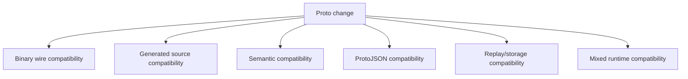
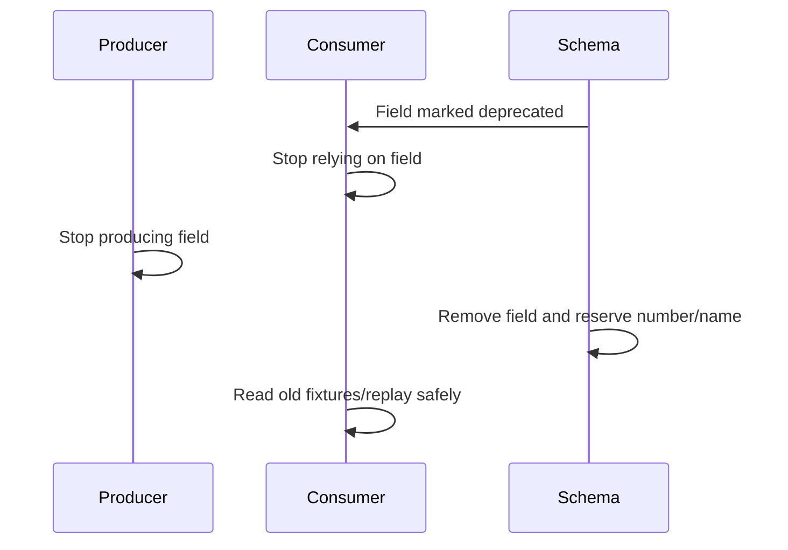
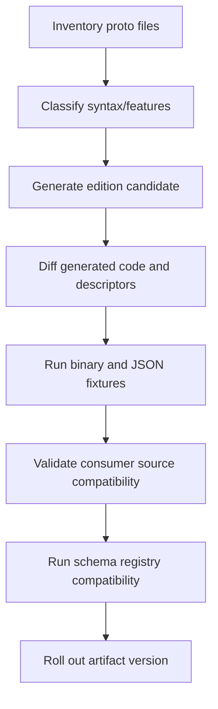
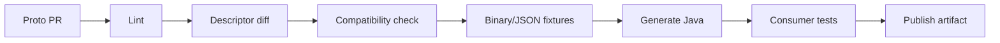

# Part 020 — Protobuf Evolution: Reserved Fields, Enums, and Editions

Protobuf is designed for evolution.

That does not mean every change is safe.

The dangerous misconception is:

```text
“If it compiles, the schema evolution is safe.”
```

No.

A Protobuf change can be:

- binary wire compatible but source incompatible;
- source compatible but semantically dangerous;
- safe for gRPC but unsafe for ProtoJSON;
- safe for new consumers but unsafe for old consumers;
- safe for Java but surprising in another language;
- safe for online RPC but dangerous for event replay;
- safe for one enum model but unsafe under closed enum behavior.

This part builds a production evolution framework.

The core rule:

```text
In Protobuf, field numbers are sacred.
Do not reuse them.
Reserve what you delete.
Treat names, JSON names, enum values, and presence as separate compatibility surfaces.
```

---

## 1. Compatibility Is Multi-Dimensional

Protobuf evolution has several compatibility dimensions.

| Dimension | Question |
|---|---|
| binary compatibility | Can old/new readers parse old/new binary payloads? |
| source compatibility | Does generated Java code still compile for consumers? |
| semantic compatibility | Does the meaning of the message remain safe? |
| JSON compatibility | Do JSON clients/gateways/log processors still work? |
| storage compatibility | Can persisted payloads be replayed? |
| registry compatibility | Does the schema registry accept the change? |
| operational compatibility | Can mixed versions run during deployment? |

A serious review asks all of them.



A change is production-safe only when it is safe for the consumers and representations you actually have.

---

## 2. The Protobuf Identity Rule

In Protobuf binary format, field numbers are more important than field names.

This field:

```proto
string case_id = 1;
```

is identified on the wire by field number `1` plus wire type.

If you later write:

```proto
string external_reference = 1;
```

you did not create a new field.

You reassigned the old wire identity to a new meaning.

That is data corruption.

The golden rule:

```text
Never reuse field numbers for a different meaning.
```

And because humans forget, enforce it in schema:

```proto
message CaseOpened {
  reserved 1;
  reserved "case_id";

  string enforcement_case_id = 2;
}
```

Reserved numbers prevent accidental reuse of numeric tags.

Reserved names prevent accidental reuse of source-level names.

---

## 3. Safe and Unsafe Change Matrix

This matrix is intentionally conservative.

| Change | Binary parse compatibility | Production judgment |
|---|---:|---|
| add new field with new number | usually safe | safe if old consumers can ignore it |
| remove field but reserve number/name | old payload readable by new code if field ignored | safe only after consumers no longer require it |
| remove field without reserve | parse may still work | unsafe long-term |
| rename field, same number | binary safe | unsafe for JSON/source consumers |
| change field number | unsafe | breaking |
| reuse old field number for new meaning | parse may work | catastrophic |
| change scalar type with same wire type | sometimes parse-compatible | semantically risky |
| change scalar type with different wire type | unsafe | breaking |
| add enum value | often binary safe | consumers must handle unknown/UNRECOGNIZED |
| remove enum value | risky | reserve number/name; migrate first |
| rename enum value | binary safe | JSON/source compatibility risk |
| change enum number | unsafe | breaking |
| move field into existing oneof | unsafe | presence/clearing semantics change |
| add new oneof alternative | usually safe | old consumers see unknown/NOT_SET depending path |
| change repeated to singular | unsafe | breaking semantics |
| change map value type | unsafe | breaking |
| change package | source/type identity risk | treat as breaking |
| change java_package | Java source/binary breaking | breaking for Java consumers |

The most dangerous changes are not always rejected by the compiler.

That is why you need review and compatibility gates.

---

## 4. Adding Fields

Adding a new field is the most common safe evolution.

Version 1:

```proto
message CaseOpened {
  string case_id = 1;
  int64 opened_at_epoch_millis = 2;
}
```

Version 2:

```proto
message CaseOpened {
  string case_id = 1;
  int64 opened_at_epoch_millis = 2;
  optional string external_reference = 3;
}
```

Old consumers ignore field 3 in binary Protobuf.

New consumers reading old payloads see `external_reference` absent.

This is usually safe.

But it is not automatically semantically safe.

Ask:

- Is the new field optional for all old producers?
- Does downstream analytics expect it?
- Does the field contain sensitive data?
- Does it require masking or retention policy?
- Do JSON clients see it?
- Does schema registry compatibility mode allow it?
- Can old services forward it without dropping unknown fields?

### Add Field Rule

```text
Adding a field is safe only if absence is a valid state.
```

If absence is not valid, you need a migration.

---

## 5. Removing Fields

Bad removal:

```proto
message CaseOpened {
  string case_id = 1;
  // int64 opened_at_epoch_millis = 2; removed
}
```

This leaves field number 2 available for accidental reuse.

Correct removal:

```proto
message CaseOpened {
  string case_id = 1;

  reserved 2;
  reserved "opened_at_epoch_millis";
}
```

But reserved syntax only prevents future reuse.

It does not solve migration.

You still need a lifecycle:



### Expand-Migrate-Contract for Removal

1. Mark field deprecated.
2. Add replacement field if needed.
3. Update consumers to use replacement or tolerate absence.
4. Update producers to populate replacement.
5. Monitor old field usage.
6. Stop producing old field.
7. Remove old field.
8. Reserve old number and name.
9. Keep golden fixtures to prove old payloads are still readable.

Example:

```proto
message CaseOpened {
  string case_id = 1;

  string region = 2 [deprecated = true];
  string jurisdiction_code = 3;
}
```

Later:

```proto
message CaseOpened {
  string case_id = 1;
  string jurisdiction_code = 3;

  reserved 2;
  reserved "region";
}
```

---

## 6. Renaming Fields

Binary Protobuf does not care about field names.

Version 1:

```proto
string case_id = 1;
```

Version 2:

```proto
string enforcement_case_id = 1;
```

Binary payloads can still parse because the field number is unchanged.

But do not call this safe too quickly.

It may break:

- Java source code using `getCaseId()`;
- generated code users in other languages;
- JSON mapping clients using `caseId`;
- logs and audit pipelines using JSON field names;
- documentation contracts;
- data catalog field lineage;
- metrics labels;
- dashboards.

### Rename Rule

```text
Renaming a Protobuf field is binary-compatible but externally dangerous.
Treat it as breaking unless every consumer uses binary generated code and is rebuilt together.
```

Safer path:

```proto
message CaseOpened {
  string case_id = 1 [deprecated = true];
  string enforcement_case_id = 2;
}
```

Then migrate consumers.

---

## 7. Changing Field Types

Changing a field type while keeping the same number is usually dangerous.

Bad:

```proto
// v1
int32 risk_score = 4;

// v2
string risk_score = 4;
```

Different wire types can make old/new readers skip or misread data.

Even same wire-type changes can be semantic traps.

Example:

```proto
// v1
int32 amount_cents = 5;

// v2
int64 amount_cents = 5;
```

This may appear compatible in some ranges, but old consumers can overflow or truncate business meaning.

Better:

```proto
int32 amount_cents = 5 [deprecated = true];
int64 amount_minor_units = 6;
```

Then migrate deliberately.

### Type Change Rule

```text
Do not change a field's type in place.
Add a new field, migrate, remove, reserve.
```

---

## 8. Required Fields and Presence

Proto2 had `required`.

Proto3 avoided required fields.

Editions model presence through features.

The architectural principle is stable:

```text
Wire-level required fields make distributed evolution harder.
```

A producer and consumer deployed at different times need overlap.

If a new reader requires a field that old producers do not send, mixed deployments fail.

Instead of wire-level required, prefer:

```proto
message OpenCaseRequest {
  string request_id = 1;
  string case_title = 2;
  optional string external_reference = 3;
}
```

Then enforce required business fields in validator:

```java
if (request.getRequestId().isBlank()) {
    violations.add(required("request_id"));
}

if (request.getCaseTitle().isBlank()) {
    violations.add(required("case_title"));
}
```

This gives you operational control over rollout, error mapping, and compatibility.

### Presence Evolution Trap

Changing from implicit presence to explicit presence can affect generated APIs and serialization behavior.

Example:

```proto
// before
int32 priority_score = 2;

// after
optional int32 priority_score = 2;
```

This may be conceptually beneficial, but it changes generated Java API and presence semantics.

Do it deliberately:

- inspect generated code change;
- update mappers;
- test absent vs zero;
- verify JSON behavior;
- run old/new binary fixtures.

---

## 9. Enum Evolution

Enums are a major source of subtle compatibility bugs.

Good enum shape:

```proto
enum EnforcementStage {
  ENFORCEMENT_STAGE_UNSPECIFIED = 0;
  ENFORCEMENT_STAGE_INTAKE = 1;
  ENFORCEMENT_STAGE_INVESTIGATION = 2;
  ENFORCEMENT_STAGE_DECISION = 3;
  ENFORCEMENT_STAGE_CLOSED = 4;
}
```

### Adding enum values

Adding a new value:

```proto
ENFORCEMENT_STAGE_APPEAL = 5;
```

is often wire-compatible.

But old Java consumers may see an unrecognized value.

Therefore consumers must not write:

```java
switch (stage) {
    case ENFORCEMENT_STAGE_INTAKE -> ...
    case ENFORCEMENT_STAGE_INVESTIGATION -> ...
    case ENFORCEMENT_STAGE_DECISION -> ...
    case ENFORCEMENT_STAGE_CLOSED -> ...
}
```

They need a deliberate fallback:

```java
switch (stage) {
    case ENFORCEMENT_STAGE_INTAKE -> handleIntake();
    case ENFORCEMENT_STAGE_INVESTIGATION -> handleInvestigation();
    case ENFORCEMENT_STAGE_DECISION -> handleDecision();
    case ENFORCEMENT_STAGE_CLOSED -> handleClosed();
    case ENFORCEMENT_STAGE_UNSPECIFIED,
         UNRECOGNIZED -> quarantine("Unknown enforcement stage: " + stage);
}
```

### Removing enum values

Do not just delete:

```proto
// removed ENFORCEMENT_STAGE_DECISION = 3;
```

Reserve:

```proto
enum EnforcementStage {
  ENFORCEMENT_STAGE_UNSPECIFIED = 0;
  ENFORCEMENT_STAGE_INTAKE = 1;
  ENFORCEMENT_STAGE_INVESTIGATION = 2;
  ENFORCEMENT_STAGE_CLOSED = 4;

  reserved 3;
  reserved "ENFORCEMENT_STAGE_DECISION";
}
```

### Renaming enum values

Binary-compatible, but JSON/source-breaking.

```proto
// v1
ENFORCEMENT_STAGE_DECISION = 3;

// v2
ENFORCEMENT_STAGE_ADJUDICATION = 3;
```

Binary value is still `3`.

But JSON representation and generated code names may change.

Treat as breaking if JSON, logs, dashboards, or source consumers rely on names.

---

## 10. Open vs Closed Enums

Enum behavior is not only syntax decoration.

Open enum behavior allows out-of-range numeric values to be represented directly in fields.

Closed enum behavior stores unrecognized values differently, often through unknown fields.

This matters when:

- proto2 and proto3 interact;
- Editions features configure enum behavior;
- services are written in multiple languages;
- unknown enum values must be preserved;
- old consumers receive new enum values.

Production guidance:

```text
For external or long-lived contracts, design consumers to tolerate unknown enum values explicitly.
```

In Java, that usually means handling `UNRECOGNIZED` and not mapping every default branch to business success.

---

## 11. `oneof` Evolution

`oneof` is excellent for mutually exclusive choices.

But evolving `oneof` needs discipline.

### Adding a new alternative

Version 1:

```proto
message CaseAction {
  oneof action {
    AssignCase assign = 1;
    CloseCase close = 2;
  }
}
```

Version 2:

```proto
message CaseAction {
  oneof action {
    AssignCase assign = 1;
    CloseCase close = 2;
    EscalateCase escalate = 3;
  }
}
```

Old consumers do not know field 3.

They may see no known action set.

Therefore old consumer logic must handle `ACTION_NOT_SET` safely.

Bad:

```java
if (action.hasAssign()) assign(action.getAssign());
else close(action.getClose());
```

Better:

```java
switch (action.getActionCase()) {
    case ASSIGN -> assign(action.getAssign());
    case CLOSE -> close(action.getClose());
    case ACTION_NOT_SET -> quarantine("Unknown or missing action");
}
```

### Moving existing fields into a oneof

This is dangerous.

Version 1:

```proto
message CaseAction {
  AssignCase assign = 1;
  CloseCase close = 2;
}
```

Version 2:

```proto
message CaseAction {
  oneof action {
    AssignCase assign = 1;
    CloseCase close = 2;
  }
}
```

The field numbers are the same, but semantics changed.

Previously both fields could be set.

Now setting one clears the other in generated APIs.

Treat this as breaking unless you prove all payloads and producers obeyed mutual exclusivity already.

### Removing oneof alternatives

Remove only through migration and reserve:

```proto
message CaseAction {
  oneof action {
    AssignCase assign = 1;
    CloseCase close = 2;
  }

  reserved 3;
  reserved "escalate";
}
```

---

## 12. Repeated and Map Evolution

Repeated fields are not lists in the abstract.

They are encoded as repeated field occurrences.

Changing singular to repeated or repeated to singular changes semantics.

Bad:

```proto
// v1
string tag = 4;

// v2
repeated string tag = 4;
```

Even if some readers parse something, your source API and business meaning changed.

Use a new field:

```proto
string tag = 4 [deprecated = true];
repeated string tags = 5;
```

Maps are syntactic sugar over repeated key/value entries.

Changing a map key type, value type, or meaning should be treated as breaking.

Better migration:

```proto
map<string, string> attributes = 10 [deprecated = true];
repeated CaseAttribute structured_attributes = 11;
```

---

## 13. Package, Type, and Java Package Evolution

Changing this:

```proto
package enforcement.case.v1;
option java_package = "com.acme.contract.enforcement.case.v1";
```

to this:

```proto
package enforcement.case.v2;
option java_package = "com.acme.contract.enforcement.case.v2";
```

is effectively a new contract type.

It affects:

- generated imports;
- type references;
- `Any` type URLs;
- descriptor identity;
- registry subject strategy;
- service method signatures;
- Java source compatibility;
- client stubs.

Do this only when you intentionally create a major version.

For additive evolution, keep package stable.

---

## 14. ProtoJSON Compatibility

Binary compatibility does not guarantee JSON compatibility.

ProtoJSON uses names.

This makes the following dangerous for JSON clients:

- field rename;
- enum rename;
- package/type changes for `Any`;
- changing JSON name;
- removing fields that clients send;
- adding fields to strict JSON parsers;
- changing default/presence behavior.

Example:

```proto
string case_id = 1;
```

Default JSON field name may appear as:

```json
{
  "caseId": "CASE-1"
}
```

If you rename the field:

```proto
string enforcement_case_id = 1;
```

JSON may become:

```json
{
  "enforcementCaseId": "CASE-1"
}
```

Binary readers may be fine.

JSON clients break.

### JSON Rule

```text
If Protobuf is exposed as JSON, field names and enum names become external contract.
```

---

## 15. Editions: What Changes Conceptually

Protobuf Editions replace the old choice of `syntax = "proto2"` and `syntax = "proto3"` with an edition number, such as:

```proto
edition = "2024";
```

The key concept:

```text
An edition is a bundle of default feature behaviors.
```

Instead of hardcoding all behavior into proto2/proto3 syntax, Editions let the language evolve incrementally through features.

Examples of feature areas include:

- field presence;
- enum openness/closedness;
- JSON format behavior;
- message encoding;
- repeated field encoding;
- symbol visibility.

This matters because future Protobuf evolution is increasingly feature-driven.

A senior engineer should think:

```text
What behavior does this file have?
Which feature controls that behavior?
What happens when generated code crosses syntax/edition boundaries?
```

not only:

```text
Is this proto2 or proto3?
```

---

## 16. Editions and Field Presence

In proto3, many scalar fields use implicit presence unless marked `optional`.

In Editions, feature settings can make explicit presence the default.

This is a major mental model shift.

Proto3 style:

```proto
syntax = "proto3";

message UpdateCase {
  int32 priority_score = 1;
  optional string external_reference = 2;
}
```

Editions style conceptually:

```proto
edition = "2024";

message UpdateCase {
  int32 priority_score = 1;
  string external_reference = 2;
}
```

The behavior depends on edition feature defaults and overrides.

The design benefit is clearer default behavior.

The migration risk is generated API changes and serialization behavior changes if you do not inspect feature settings.

### Migration Rule

```text
Do not migrate to Editions as a formatting exercise.
Migrate as a behavior-preserving contract change with generated-code diff, fixture tests, and consumer rollout.
```

---

## 17. Editions Migration Playbook

A safe Editions migration should look like this:



Detailed steps:

1. Inventory all `.proto` files.
2. Identify proto2/proto3 usage.
3. Identify required/optional/implicit presence fields.
4. Identify enum behavior assumptions.
5. Identify JSON-exposed contracts.
6. Generate Editions candidate using official tooling or controlled rewrite.
7. Diff descriptors, not only source text.
8. Diff generated Java API.
9. Run old binary fixtures through new generated code.
10. Run new binary fixtures through old consumers where required.
11. Run JSON fixtures if any JSON surface exists.
12. Validate registry compatibility.
13. Publish candidate artifact.
14. Roll through non-critical consumers first.
15. Monitor parse failures, unknown enum values, validation failures, and business reject rates.

---

## 18. Deprecation Is Not Removal

Protobuf supports marking fields as deprecated:

```proto
string old_region = 2 [deprecated = true];
```

This is a signal to generated code users and reviewers.

It does not remove the field.

It does not prevent use.

It does not migrate consumers.

It does not reserve the number.

A deprecated field still needs ownership.

Deprecation checklist:

- [ ] replacement field exists;
- [ ] migration rationale documented;
- [ ] consumers notified;
- [ ] producers dual-write if needed;
- [ ] dashboards track usage;
- [ ] removal date defined;
- [ ] golden fixtures kept;
- [ ] removal reserves number and name.

---

## 19. Unknown Fields and Replay Safety

Event streams make compatibility harder because old payloads live forever.

If you persist Protobuf binary events, every new consumer may read old messages.

If you replay an old topic, old payloads enter new code.

Therefore:

```text
Compatibility is not only producer-vs-consumer today.
It is new-code-vs-old-data forever.
```

Replay-safe checklist:

- [ ] new code can parse all historical golden fixtures;
- [ ] removed fields are tolerated;
- [ ] default/absence behavior is tested;
- [ ] enum unknown values are handled;
- [ ] oneof unknown/missing case is handled;
- [ ] DLQ strategy distinguishes parse failure from semantic rejection;
- [ ] old schema artifacts remain available;
- [ ] migrations do not require rewriting all history unless explicitly planned.

---

## 20. Contract Diff Semantics

A text diff is not enough.

This diff looks small:

```diff
- string case_id = 1;
+ string external_reference = 1;
```

But semantically it is catastrophic.

This diff looks big:

```diff
+ optional string external_reference = 42;
```

but it may be safe.

A Protobuf compatibility checker should compare:

- field numbers;
- field names;
- field types;
- labels/cardinality;
- oneof membership;
- enum numbers;
- enum names;
- reserved ranges;
- package/type identity;
- options affecting language generation;
- JSON names;
- feature settings for Editions;
- service method request/response types.

Text review is useful.

Descriptor-aware review is safer.

---

## 21. CI Quality Gates

A production Protobuf repository should enforce rules automatically.

Example policy gates:

| Gate | Purpose |
|---|---|
| formatting/lint | style consistency |
| reserved-on-remove | prevent tag/name reuse |
| no-field-number-change | prevent identity corruption |
| no-type-change-in-place | prevent unsafe reuse |
| enum-zero-unspecified | force default-safe enum design |
| no-required-for-distributed-contracts | avoid rollout lockstep |
| explicit-java-package | stable Java generation |
| generated-code-up-to-date | prevent stale artifacts |
| binary fixture tests | prove old payload readability |
| JSON fixture tests | prove external JSON stability |
| registry compatibility | enforce consumer compatibility mode |

Example conceptual pipeline:



---

## 22. Migration Playbooks

### Playbook A: Add optional field

Use when adding supplemental data.

```proto
optional string external_reference = 8;
```

Steps:

1. Add field with new number.
2. Keep it optional or semantically optional.
3. Update producer to populate if available.
4. Update consumers to tolerate absence.
5. Add tests for old payload without field.
6. Add metrics for field population rate if important.

### Playbook B: Replace field

Use when changing type/name/meaning.

```proto
string old_region = 2 [deprecated = true];
string jurisdiction_code = 9;
```

Steps:

1. Add replacement field.
2. Dual-write both fields.
3. Update consumers to prefer new field with fallback.
4. Monitor usage of old field.
5. Stop reading old field.
6. Stop writing old field.
7. Remove and reserve old number/name.

### Playbook C: Split field

Version 1:

```proto
string address = 4;
```

Version 2:

```proto
string address = 4 [deprecated = true];
PostalAddress postal_address = 10;
```

Do not mutate field 4 into `PostalAddress`.

### Playbook D: Add enum value

Steps:

1. Add new enum value at new number.
2. Update consumers to handle unknown/default before producers emit it.
3. Roll consumers first.
4. Roll producers.
5. Monitor `UNRECOGNIZED`/quarantine counts.

### Playbook E: Introduce oneof

If fields were previously mutually exclusive in practice but not modeled:

1. Add new oneof fields with new numbers.
2. Keep old fields deprecated.
3. Producers write both old and new during migration if needed.
4. Consumers prefer oneof but fallback to old fields.
5. Stop writing old fields.
6. Remove and reserve old fields.

Do not move old field numbers directly into oneof unless you have proven it is safe.

---

## 23. Case Study: Evolving Enforcement Event

### Version 1

```proto
message EnforcementDecisionRecorded {
  string case_id = 1;
  string decision = 2;
  int64 decided_at_epoch_millis = 3;
}
```

Problems:

- `decision` is free text;
- no decision ID;
- no actor;
- no controlled enum;
- no reason code;
- weak auditability.

### Version 2 — additive improvement

```proto
message EnforcementDecisionRecorded {
  string case_id = 1;
  string decision = 2 [deprecated = true];
  int64 decided_at_epoch_millis = 3;

  string decision_id = 4;
  EnforcementDecisionType decision_type = 5;
  string decided_by_user_id = 6;
  optional string reason_code = 7;
}

enum EnforcementDecisionType {
  ENFORCEMENT_DECISION_TYPE_UNSPECIFIED = 0;
  ENFORCEMENT_DECISION_TYPE_NO_ACTION = 1;
  ENFORCEMENT_DECISION_TYPE_WARNING = 2;
  ENFORCEMENT_DECISION_TYPE_FINE = 3;
  ENFORCEMENT_DECISION_TYPE_ESCALATED = 4;
}
```

### Consumer migration

```java
DecisionType decisionType;

if (event.getDecisionType() != EnforcementDecisionType.ENFORCEMENT_DECISION_TYPE_UNSPECIFIED
    && event.getDecisionType() != EnforcementDecisionType.UNRECOGNIZED) {
    decisionType = mapper.toDomain(event.getDecisionType());
} else {
    decisionType = legacyDecisionParser.parse(event.getDecision());
}
```

### Version 3 — removal after migration

```proto
message EnforcementDecisionRecorded {
  string case_id = 1;
  int64 decided_at_epoch_millis = 3;
  string decision_id = 4;
  EnforcementDecisionType decision_type = 5;
  string decided_by_user_id = 6;
  optional string reason_code = 7;

  reserved 2;
  reserved "decision";
}
```

This is contract evolution done correctly.

---

## 24. Human Review Checklist

For every Protobuf PR, reviewers should ask:

- Did any field number change?
- Was any field removed without reserving number and name?
- Was any field renamed? If yes, are JSON/source consumers affected?
- Was any field type changed in place?
- Was any enum value removed, renamed, or renumbered?
- Does every enum still have a safe zero value?
- Are new enum values safe for old consumers?
- Was a field moved into or out of `oneof`?
- Did `java_package`, package, or type name change?
- Did presence behavior change?
- Is the field semantically optional for old producers?
- Are old binary fixtures still readable?
- Are JSON fixtures still stable if JSON is exposed?
- Does schema registry compatibility agree with human judgment?
- Is deprecation accompanied by a migration plan?

---

## 25. Anti-Patterns

### Anti-pattern 1: reuse deleted field number

```proto
// old
string case_id = 1;

// new
string external_reference = 1;
```

This is wire-level identity corruption.

### Anti-pattern 2: rename and claim safe

```proto
string case_id = 1;
// renamed to
string enforcement_case_id = 1;
```

Binary may be fine. Java/JSON/source may not be.

### Anti-pattern 3: enum default with business meaning

```proto
enum Priority {
  HIGH = 0;
  MEDIUM = 1;
  LOW = 2;
}
```

Zero should be unspecified/unknown-style default, not real business meaning.

### Anti-pattern 4: required distributed rollout

```text
new consumer requires a field old producers cannot send
```

This forces lockstep deployment.

### Anti-pattern 5: Editions migration without behavior diff

```text
syntax = "proto3" -> edition = "2024"
```

This may not be a neutral text rewrite.

### Anti-pattern 6: source-only compatibility review

```text
“Java compiled, so the Protobuf change is safe.”
```

Not enough.

---

## 26. Production Readiness Checklist

Before shipping a Protobuf evolution:

- [ ] field numbers are unchanged for existing meanings;
- [ ] deleted fields have reserved numbers and names;
- [ ] no type changed in place;
- [ ] new fields have new numbers;
- [ ] added fields are safe when absent;
- [ ] removed fields have a migration path;
- [ ] renamed fields are reviewed for JSON/source impact;
- [ ] enum zero value remains unspecified;
- [ ] enum deleted values are reserved;
- [ ] Java consumers handle `UNRECOGNIZED`;
- [ ] `oneof` changes are reviewed as semantic changes;
- [ ] package and `java_package` changes are treated as major;
- [ ] binary fixtures from previous versions pass;
- [ ] JSON fixtures pass if applicable;
- [ ] schema registry compatibility passes;
- [ ] generated Java API diff is reviewed;
- [ ] rollout order is defined;
- [ ] observability exists for parse/validation/unknown enum failures;
- [ ] deprecation/removal dates are documented;
- [ ] old schema artifacts remain discoverable.

---

## 27. Exercises

1. Take a Protobuf message with at least 10 fields. Remove one field correctly using `reserved` number and name.
2. Rename a field and list every consumer type that might break despite binary compatibility.
3. Add a new enum value and update Java code to handle `UNRECOGNIZED` explicitly.
4. Write a descriptor-aware checklist that rejects field number reuse.
5. Build an expand-migrate-contract plan for changing `int32 amount_cents` to a decimal-safe money representation.
6. Create old and new binary fixtures and verify both versions can read what they must read.
7. Identify whether any of your Protobuf contracts are exposed through JSON. If yes, classify field names as external contract.
8. Pick one proto3 file and evaluate what an Editions migration would change in field presence behavior.

---

## 28. Key Takeaways

- Field numbers are the real binary identity of Protobuf fields.
- Never reuse deleted field numbers.
- Reserve deleted field numbers and names.
- Adding fields is safe only when absence is valid.
- Removing fields requires migration, not just deletion.
- Renaming is binary-compatible but often source/JSON-breaking.
- Changing field type in place is unsafe; add a new field instead.
- Enum evolution requires unknown-value handling.
- `oneof` evolution changes semantics and must be reviewed carefully.
- ProtoJSON is a separate compatibility surface.
- Editions shift Protobuf behavior into feature-controlled language evolution.
- Contract evolution must be tested against old data, new data, old consumers, and new consumers.

---

## 29. References

- Protocol Buffers Proto3 Language Specification: `https://protobuf.dev/reference/protobuf/proto3-spec/`
- Protocol Buffers Proto Best Practices: `https://protobuf.dev/best-practices/dos-donts/`
- Protocol Buffers Field Presence: `https://protobuf.dev/programming-guides/field_presence/`
- Protocol Buffers Enum Behavior: `https://protobuf.dev/programming-guides/enum/`
- Protobuf Editions Overview: `https://protobuf.dev/editions/overview/`
- Protobuf Editions Feature Settings: `https://protobuf.dev/editions/features/`
- Protocol Buffers Java Generated Code Guide: `https://protobuf.dev/reference/java/java-generated/`

---

Next: **Part 021 — Protobuf JSON Mapping, gRPC, and Cross-Language Contracts**.
