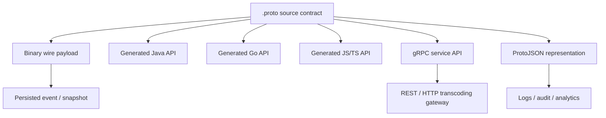
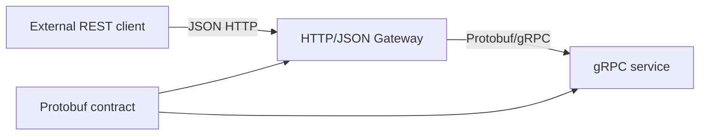
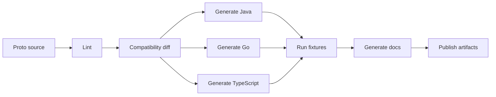

# Part 021 — Protobuf JSON Mapping, gRPC, and Cross-Language Contracts

Protobuf is often introduced as a binary serialization format.

That is only half true.

In production, Protobuf becomes a **contract system** for:

- binary RPC;
- cross-language generated clients;
- event payloads;
- storage snapshots;
- REST/JSON gateways;
- observability pipelines;
- API compatibility governance;
- typed service evolution.

The mistake is treating all of those surfaces as equivalent.

They are not.

A `.proto` file can be safe for binary gRPC and unsafe for ProtoJSON. It can be clean in Java and awkward in Go. It can be convenient for internal RPC and hostile to public REST consumers. It can compile in all languages and still encode a broken business contract.

The mental model:

```text
Protobuf schema is the source contract.
Binary wire format, ProtoJSON, generated Java, generated Go, gRPC, and REST gateways are projections.
Every projection has its own compatibility traps.
```

This part closes the Protobuf section by focusing on the surfaces that usually break production systems **after** the `.proto` compiles.

---

## 1. The Protobuf Contract Surface Is Bigger Than the `.proto` File

A `.proto` file defines messages and services, but production compatibility includes more than message syntax.



Each projection answers a different question:

| Projection | Main question |
|---|---|
| binary wire | Can machines exchange compact typed payloads? |
| generated Java | Can Java services build, parse, validate, and map safely? |
| generated Go/TS/Python | Can other teams consume the contract idiomatically? |
| gRPC service | What remote procedures exist and what are their request/response types? |
| ProtoJSON | How does the same Protobuf model look when represented as JSON? |
| REST gateway | How is RPC projected onto HTTP resource-style APIs? |
| logs/audit | Can humans and systems inspect payloads without binary tooling? |
| storage/replay | Can old payloads be decoded after schema evolution? |

A mature Protobuf review does not ask only:

```text
Does protoc generate code?
```

It asks:

```text
Which projections exist, and what compatibility surfaces do they expose?
```

---

## 2. ProtoJSON Is Not “Normal JSON”

ProtoJSON is a canonical JSON representation for Protobuf messages.

It is not arbitrary JSON Schema.

It cannot represent every JSON shape, and it intentionally reflects the Protobuf type system.

That creates several important consequences:

1. It is excellent for JSON representation of existing Protobuf messages.
2. It is poor as a general-purpose JSON contract language.
3. It should not be used to pretend a Protobuf API is a native REST/JSON API unless you accept the semantic mismatch.
4. Its compatibility behavior differs from binary Protobuf.

The official Protobuf documentation explicitly warns that ProtoJSON is a JSON representation of schemas expressible in the Protobuf schema language; it is not designed to represent arbitrary JSON Schema shapes.

Practical implication:

```text
Use JSON Schema/OpenAPI for native HTTP+JSON APIs.
Use Protobuf for typed binary RPC/events.
Use ProtoJSON only when you need a JSON projection of Protobuf.
```

---

## 3. ProtoJSON Naming Rules

Given this message:

```proto
syntax = "proto3";

package enforcement.case.v1;

message CaseOpened {
  string case_id = 1;
  string external_reference = 2;
  int64 opened_at_epoch_millis = 3;
}
```

The default ProtoJSON output uses lowerCamelCase field names:

```json
{
  "caseId": "CASE-001",
  "externalReference": "EXT-991",
  "openedAtEpochMillis": "1767225600000"
}
```

Notice the `int64` is represented as a string.

That is not a typo.

ProtoJSON represents 64-bit integer values as strings because many JSON runtimes, especially JavaScript, cannot safely represent all 64-bit integers as native JSON numbers.

### 3.1 `json_name` Is a Compatibility Surface

You can override JSON names:

```proto
message CaseOpened {
  string case_id = 1 [json_name = "case_id"];
}
```

This changes the JSON projection, not the binary wire identity.

That means you have two compatibility surfaces:

| Change | Binary impact | JSON impact |
|---|---:|---:|
| rename proto field only | usually safe for binary | can affect source code |
| change field number | breaking/corrupting | breaking/corrupting |
| change `json_name` | binary safe | JSON breaking |
| change type | depends | often breaking |

If any consumer uses ProtoJSON, `json_name` must be reviewed like a public API field name.

Bad practice:

```proto
message PaymentReceived {
  string payment_id = 1 [json_name = "id"];
}
```

Why bad?

Because `id` is too generic. It becomes confusing in logs, REST gateways, analytics, and support tooling.

Better:

```proto
message PaymentReceived {
  string payment_id = 1 [json_name = "paymentId"];
}
```

In most cases, do not override `json_name` unless you have a clear external compatibility reason.

---

## 4. ProtoJSON Scalar Mapping

The following mapping rules matter in production.

| Protobuf type | ProtoJSON representation | Design concern |
|---|---|---|
| `string` | JSON string | validate length/format outside Protobuf |
| `bool` | JSON boolean | straightforward |
| `int32`, `uint32`, `sint32` | JSON number | safe for most clients |
| `int64`, `uint64`, `sint64` | JSON string | surprises JSON consumers |
| `float`, `double` | JSON number or special strings | avoid for money/precision |
| `bytes` | base64 string | opaque to human readers |
| `enum` | enum name string by default | renames are JSON-breaking |
| `message` | JSON object | nested contract |
| `repeated` | JSON array | absent vs empty semantics matter |
| `map` | JSON object | keys become strings |

### 4.1 The `int64` Trap

Bad public JSON expectation:

```json
{
  "caseVersion": 9223372036854775807
}
```

ProtoJSON representation:

```json
{
  "caseVersion": "9223372036854775807"
}
```

If a REST client expects a number, it may fail.

Options:

| Option | Use when |
|---|---|
| accept ProtoJSON semantics | clients are Protobuf-aware |
| avoid exposing ProtoJSON externally | public API should be OpenAPI/JSON-native |
| use string IDs/versions deliberately | value is identity-like, not arithmetic |
| expose separate REST DTO | external JSON contract must be natural JSON |

The deeper rule:

```text
Do not expose ProtoJSON to consumers who expect normal REST JSON unless you have documented the mapping rules.
```

---

## 5. ProtoJSON and `null`

In JSON, `null` is a value.

In Protobuf, absence and default semantics depend on field presence.

ProtoJSON parsing generally accepts `null` for fields and treats it like field absence, but this does not mean your business contract should use `null` freely.

Example:

```json
{
  "caseId": null
}
```

This is not a good external contract.

It blurs three different meanings:

```text
missing       -> producer did not send the field
null          -> producer sent explicit null
empty string  -> producer sent empty value
```

For contract engineering, define the meaning explicitly.

| Situation | Preferred modeling |
|---|---|
| value is required | field plus semantic validation |
| value is optional | use explicit presence if important |
| value is intentionally cleared | model an explicit command/action |
| value is unknown | use documented enum/state |
| value is not applicable | model reason/status, not null |

---

## 6. Field Presence in ProtoJSON

Field presence is where ProtoJSON and Protobuf evolution often collide.

Consider:

```proto
message CaseAssignment {
  string assignee_id = 1;
}
```

In proto3 implicit presence, the Java API cannot always distinguish:

```text
assignee_id was absent
assignee_id was explicitly set to ""
```

With explicit presence:

```proto
message CaseAssignment {
  optional string assignee_id = 1;
}
```

Now generated APIs can expose `hasAssigneeId()`.

This matters for PATCH-like semantics.

Bad design:

```proto
message UpdateCaseRequest {
  string case_id = 1;
  string assignee_id = 2;
}
```

Ambiguous:

- absent means no change?
- empty string means clear?
- empty string means invalid?
- missing means invalid?

Better command-style design:

```proto
message UpdateCaseAssigneeRequest {
  string case_id = 1;
  oneof assignment_change {
    string assignee_id = 2;
    ClearAssignee clear_assignee = 3;
  }
}

message ClearAssignee {}
```

This is more verbose, but safer.

Contract clarity beats compactness.

---

## 7. Well-Known Types and JSON Semantics

Well-known types have special JSON mappings.

Examples:

```proto
import "google/protobuf/timestamp.proto";
import "google/protobuf/duration.proto";
import "google/protobuf/field_mask.proto";

message CaseSla {
  google.protobuf.Timestamp deadline = 1;
  google.protobuf.Duration allowed_duration = 2;
  google.protobuf.FieldMask updated_fields = 3;
}
```

ProtoJSON examples:

```json
{
  "deadline": "2026-07-03T10:15:30Z",
  "allowedDuration": "3600s",
  "updatedFields": "deadline,allowedDuration"
}
```

This is useful, but again not necessarily intuitive to generic JSON clients.

### 7.1 `Timestamp`

Use `google.protobuf.Timestamp` for instants.

Do not use `int64 epoch_millis` unless you have a very specific performance/storage reason.

Bad:

```proto
int64 created_at = 1;
```

Better:

```proto
google.protobuf.Timestamp created_at = 1;
```

Why?

- conveys time semantics;
- has standard JSON mapping;
- reduces unit ambiguity;
- works across languages;
- avoids milliseconds/seconds confusion.

### 7.2 `Duration`

Use `Duration` for elapsed time.

Bad:

```proto
int32 timeout = 1;
```

Better:

```proto
google.protobuf.Duration timeout = 1;
```

But still document semantic constraints:

```text
Minimum: 1 second
Maximum: 30 seconds
Meaning: request processing deadline, not network socket timeout
```

Protobuf type alone does not encode all business rules.

### 7.3 `FieldMask`

`FieldMask` is useful for partial update APIs.

Example:

```proto
message UpdateCaseRequest {
  string case_id = 1;
  CasePatch patch = 2;
  google.protobuf.FieldMask update_mask = 3;
}

message CasePatch {
  string priority = 1;
  string assignee_id = 2;
}
```

But it introduces risks:

- path names become compatibility surface;
- renames can break clients;
- validation must ensure paths are allowed;
- nested update semantics must be documented;
- clearing fields must be explicitly defined.

Use it carefully for admin/internal APIs.

For highly regulated workflows, command-specific APIs are often more defensible.

---

## 8. `Any` Is Not a Free Extension Mechanism

`google.protobuf.Any` can pack arbitrary Protobuf messages.

Example:

```proto
import "google/protobuf/any.proto";

message AuditEvent {
  string event_id = 1;
  string event_type = 2;
  google.protobuf.Any details = 3;
}
```

This looks flexible.

It is also dangerous.

Risks:

- type discovery becomes runtime concern;
- validators cannot easily enforce shape;
- JSON mapping requires type URLs;
- consumers need descriptors/type registry;
- compatibility becomes implicit;
- audit/search tooling becomes harder;
- schema registry governance is weakened.

Prefer explicit union where possible:

```proto
message AuditEvent {
  string event_id = 1;
  oneof details {
    CaseOpenedDetails case_opened = 2;
    CaseEscalatedDetails case_escalated = 3;
    CaseClosedDetails case_closed = 4;
  }
}
```

Use `Any` only when:

- plugin architecture is real;
- type registry is governed;
- accepted types are documented;
- unknown type behavior is defined;
- observability can decode payloads;
- security boundary is controlled.

---

## 9. Java ProtoJSON with `JsonFormat`

In Java, the common utility is `JsonFormat` from `protobuf-java-util`.

Example:

```java
import com.google.protobuf.util.JsonFormat;

CaseOpened event = CaseOpened.newBuilder()
    .setCaseId("CASE-001")
    .setExternalReference("EXT-991")
    .build();

String json = JsonFormat.printer()
    .includingDefaultValueFields()
    .print(event);
```

Parsing:

```java
CaseOpened.Builder builder = CaseOpened.newBuilder();

JsonFormat.parser()
    .ignoringUnknownFields()
    .merge(json, builder);

CaseOpened parsed = builder.build();
```

### 9.1 Be Careful with `includingDefaultValueFields()`

Including default values can change perceived semantics.

Without defaults:

```json
{
  "caseId": "CASE-001"
}
```

With defaults:

```json
{
  "caseId": "CASE-001",
  "externalReference": "",
  "priority": "PRIORITY_UNSPECIFIED"
}
```

For logs, defaults might help inspection.

For external API responses, defaults can mislead consumers into thinking a value was explicitly set.

Make this a platform-level choice.

Do not let every service configure JSON printing differently.

### 9.2 Unknown Fields in JSON Parsing

Binary Protobuf can preserve unknown fields in many runtimes.

ProtoJSON does not behave the same way.

If you parse with strict unknown-field rejection, forward compatibility can break.

If you parse with unknown-field ignoring, typo detection becomes weaker.

Policy matrix:

| Boundary | Unknown JSON field policy |
|---|---|
| public API ingress | reject unless explicit extension object exists |
| internal gateway | usually reject or warn |
| log decoding | ignore unknown fields |
| replay tooling | tolerate unknown fields if schema migration exists |
| partner API | reject with clear error model |

The rule:

```text
Unknown-field policy is a contract decision, not a parser option.
```

---

## 10. Type Registry for `Any`

When using `Any`, JSON parsing/printer often needs a type registry.

Example pattern:

```java
JsonFormat.TypeRegistry typeRegistry = JsonFormat.TypeRegistry.newBuilder()
    .add(CaseOpenedDetails.getDescriptor())
    .add(CaseClosedDetails.getDescriptor())
    .build();

String json = JsonFormat.printer()
    .usingTypeRegistry(typeRegistry)
    .print(auditEvent);
```

Governance implication:

```text
If you need a TypeRegistry, you need a contract registry.
```

Otherwise, every service ships a different view of supported types.

That creates runtime drift.

---

## 11. gRPC Is a Service Contract, Not Just Transport

gRPC commonly uses Protobuf as IDL and message interchange format.

A service definition looks like this:

```proto
syntax = "proto3";

package enforcement.case.v1;

option java_package = "com.example.contract.enforcement.case.v1";
option java_multiple_files = true;

service CaseCommandService {
  rpc OpenCase(OpenCaseRequest) returns (OpenCaseResponse);
  rpc EscalateCase(EscalateCaseRequest) returns (EscalateCaseResponse);
  rpc CloseCase(CloseCaseRequest) returns (CloseCaseResponse);
}
```

This file defines:

- service name;
- method names;
- request types;
- response types;
- package namespace;
- generated language bindings;
- RPC compatibility surface.

The dangerous misconception:

```text
gRPC is just faster REST.
```

No.

gRPC models procedures and streams. REST models resources and representations. They can overlap, but they are not the same abstraction.

---

## 12. gRPC Method Types

gRPC supports four method shapes.

```proto
service CaseService {
  rpc GetCase(GetCaseRequest) returns (GetCaseResponse);

  rpc WatchCaseEvents(WatchCaseEventsRequest) returns (stream CaseEvent);

  rpc UploadEvidence(stream UploadEvidenceChunk) returns (UploadEvidenceResponse);

  rpc Collaborate(stream CollaborationMessage) returns (stream CollaborationMessage);
}
```

| Shape | Meaning | Use case |
|---|---|---|
| unary | one request, one response | command/query |
| server streaming | one request, many responses | watch, export, long-running feed |
| client streaming | many requests, one response | upload, batch ingest |
| bidirectional streaming | many requests, many responses | collaborative/session protocols |

Do not use streaming because it looks advanced.

Use it when the business interaction is actually stream-shaped.

---

## 13. Request and Response Wrapper Pattern

Avoid RPC methods that use naked domain messages.

Bad:

```proto
service CaseCommandService {
  rpc OpenCase(Case) returns (Case);
}
```

Why bad?

- request semantics are unclear;
- response semantics are unclear;
- future metadata has nowhere to go;
- validation rules are mixed with domain shape;
- idempotency cannot be modeled cleanly;
- audit fields become awkward.

Better:

```proto
service CaseCommandService {
  rpc OpenCase(OpenCaseRequest) returns (OpenCaseResponse);
}

message OpenCaseRequest {
  string request_id = 1;
  string idempotency_key = 2;
  CaseIntake intake = 3;
}

message OpenCaseResponse {
  string case_id = 1;
  CaseStatus status = 2;
  google.protobuf.Timestamp opened_at = 3;
}
```

Wrapper messages give you evolution room.

They also separate:

```text
entity shape != operation input != operation output
```

That distinction is essential for production APIs.

---

## 14. Command, Query, and Event Messages Should Not Be the Same

A common anti-pattern:

```proto
message Case {
  string case_id = 1;
  string title = 2;
  string status = 3;
  string assignee_id = 4;
}

message CaseOpened {
  Case case = 1;
}

message OpenCaseRequest {
  Case case = 1;
}

message GetCaseResponse {
  Case case = 1;
}
```

This feels reusable.

It couples unrelated contracts.

Better:

```proto
message OpenCaseRequest {
  CaseIntake intake = 1;
}

message CaseOpenedEvent {
  string case_id = 1;
  CaseIntakeSnapshot intake = 2;
  google.protobuf.Timestamp occurred_at = 3;
}

message GetCaseResponse {
  CaseView case = 1;
}
```

Reason:

| Contract | Optimized for |
|---|---|
| command request | intent and validation |
| command response | outcome and correlation |
| event | immutable fact and replay |
| query response | read model and client display |
| storage snapshot | persistence/recovery |

One message rarely serves all contexts safely.

---

## 15. gRPC Error Model

gRPC has status codes.

But status code alone is not enough for production.

Bad:

```text
INVALID_ARGUMENT: invalid request
```

Better:

```text
INVALID_ARGUMENT
- violation: intake.reporter.email
- reason: INVALID_EMAIL
- message: reporter email is invalid
- correlation_id: req-123
```

A production error model should include:

- stable machine-readable reason code;
- field/path if applicable;
- human-safe message;
- correlation/request ID;
- retryability signal;
- domain state conflict details;
- documentation link if external;
- no sensitive data leakage.

### 15.1 Error Details Pattern

Many gRPC ecosystems use structured error details based on Google RPC status patterns.

Even if you do not adopt that exact model, the contract principle remains:

```text
Errors are contracts.
Treat them as versioned payloads.
```

Define error taxonomy centrally.

Example taxonomy:

| Category | gRPC status | Example reason |
|---|---|---|
| validation | `INVALID_ARGUMENT` | `REQUIRED_FIELD_MISSING` |
| not found | `NOT_FOUND` | `CASE_NOT_FOUND` |
| state conflict | `FAILED_PRECONDITION` | `CASE_ALREADY_CLOSED` |
| optimistic lock | `ABORTED` | `VERSION_CONFLICT` |
| authn | `UNAUTHENTICATED` | `TOKEN_EXPIRED` |
| authz | `PERMISSION_DENIED` | `INSUFFICIENT_ROLE` |
| rate limit | `RESOURCE_EXHAUSTED` | `RATE_LIMITED` |
| transient backend | `UNAVAILABLE` | `DATABASE_UNAVAILABLE` |

Never encode domain errors as arbitrary strings only.

---

## 16. Deadlines, Cancellation, and Idempotency Are Contract Concerns

gRPC supports deadlines and cancellation at runtime.

But your API contract must still define operation semantics.

Questions to answer:

1. If the client deadline expires, may the server still complete the command?
2. Can the client retry safely?
3. Is there an idempotency key?
4. Is response retrieval possible after timeout?
5. Are duplicate commands detectable?
6. Are partial side effects possible?

For commands that change state, include idempotency.

```proto
message OpenCaseRequest {
  string request_id = 1;
  string idempotency_key = 2;
  CaseIntake intake = 3;
}
```

Then define:

```text
For the same caller and idempotency_key, OpenCase returns the same case_id if the original request was accepted.
If the same key is reused with different intake content, the service returns FAILED_PRECONDITION.
```

That sentence is part of the contract.

The `.proto` alone is not enough.

---

## 17. Metadata Is Not a Dumping Ground

gRPC metadata can carry headers/trailers.

Use it for transport-level concerns:

- authorization token;
- correlation ID;
- tenant ID;
- request ID;
- trace context;
- locale;
- routing hints;
- response trailers.

Do not hide domain contract fields in metadata.

Bad:

```text
metadata: case-type = enforcement
```

Better:

```proto
message OpenCaseRequest {
  CaseType case_type = 1;
  CaseIntake intake = 2;
}
```

The rule:

```text
If business logic needs it, model it in the message.
If infrastructure needs it, metadata may be appropriate.
```

---

## 18. gRPC Gateway / REST Transcoding Risk

Many organizations expose gRPC services through REST/JSON gateways.

This can be useful.

It can also create a contract chimera.



The issue:

```text
A gRPC method is not automatically a good REST endpoint.
```

Example:

```proto
rpc EscalateCase(EscalateCaseRequest) returns (EscalateCaseResponse);
```

Possible REST projection:

```http
POST /v1/cases/{case_id}:escalate
```

This is RPC-style HTTP, not pure resource REST.

That may be fine for internal APIs.

For public APIs, be intentional.

### 18.1 REST Gateway Checklist

Before exposing gRPC via REST, answer:

- Are path names stable and meaningful?
- Are HTTP status codes mapped correctly?
- Are gRPC error details converted safely?
- Are `int64` values represented as strings?
- Are enum names exposed externally?
- Are field names lowerCamelCase or custom?
- Are unknown field policies documented?
- Are PATCH/update semantics clear?
- Are streaming methods unsupported or separately modeled?
- Are OpenAPI docs generated, reviewed, and tested?

If you cannot answer those, do not call the gateway “public API ready”.

---

## 19. Cross-Language Contract Design

Protobuf is language-neutral.

Generated APIs are not language-identical.

Every language has different conventions around:

- package/module naming;
- nullability;
- builders;
- presence;
- enum unknowns;
- maps;
- unsigned integers;
- byte arrays;
- timestamps;
- JSON conversion;
- generated file layout;
- runtime version compatibility.

A cross-language `.proto` must be designed for the least surprising common denominator.

---

## 20. Package and Language Options

Example:

```proto
syntax = "proto3";

package enforcement.case.v1;

option java_package = "com.example.contract.enforcement.case.v1";
option java_multiple_files = true;
option java_outer_classname = "CaseContractsProto";

option go_package = "github.com/example/contracts/enforcement/case/v1;casev1";
option csharp_namespace = "Example.Contracts.Enforcement.Case.V1";
```

`package` is the Protobuf namespace.

Language-specific options control generated code layout.

Do not assume `package` alone creates good generated code in every language.

### 20.1 Version in Package Namespace

For API-like contracts, package versioning is common:

```proto
package enforcement.case.v1;
```

But versioning is not a substitute for compatibility.

Do not create `v2` for every small change.

Use `v2` when:

- semantic model changes substantially;
- compatibility cannot be preserved;
- old and new consumers must coexist;
- migration period is planned;
- ownership and lifecycle are clear.

---

## 21. Naming Rules for Cross-Language Stability

Prefer simple, explicit names.

Good:

```proto
message CreateEnforcementCaseRequest {}
message CreateEnforcementCaseResponse {}
message EnforcementCaseOpenedEvent {}
```

Bad:

```proto
message Data {}
message Info {}
message Payload {}
message Event {}
message Response {}
```

Names show up in:

- generated Java classes;
- generated Go structs;
- generated TypeScript types;
- logs;
- documentation;
- error messages;
- descriptor registries;
- type URLs for `Any`;
- schema registry subjects.

A name that is tolerable in one service becomes chaos at platform scale.

---

## 22. Enum Design for Cross-Language Consumers

Always include an unspecified zero enum value.

```proto
enum CasePriority {
  CASE_PRIORITY_UNSPECIFIED = 0;
  CASE_PRIORITY_LOW = 1;
  CASE_PRIORITY_MEDIUM = 2;
  CASE_PRIORITY_HIGH = 3;
  CASE_PRIORITY_CRITICAL = 4;
}
```

Why?

- proto3 default enum numeric value is zero;
- zero should not accidentally mean a real business value;
- absent/unset/default must be distinguishable at semantic layer;
- generated languages differ in enum ergonomics.

Bad:

```proto
enum CasePriority {
  LOW = 0;
  MEDIUM = 1;
  HIGH = 2;
}
```

This makes absence equal to `LOW`.

That is a production bug disguised as a default.

### 22.1 Enum Names Should Be Globally Clear

Prefer prefixed enum values:

```proto
enum CaseStatus {
  CASE_STATUS_UNSPECIFIED = 0;
  CASE_STATUS_OPEN = 1;
  CASE_STATUS_ESCALATED = 2;
  CASE_STATUS_CLOSED = 3;
}
```

This avoids name collision and improves generated code clarity.

---

## 23. Map Fields Are Not Always Portable Semantics

Protobuf maps are convenient:

```proto
message CaseAttributes {
  map<string, string> attributes = 1;
}
```

But they can weaken contracts.

Risks:

- key set is not explicit;
- value type often becomes stringly-typed;
- validation moves out of schema;
- ordering is not meaningful;
- JSON representation looks like arbitrary object;
- consumers may depend on undocumented keys.

Use maps for truly dynamic key/value data.

Do not use maps to avoid schema design.

Bad:

```proto
message Case {
  map<string, string> data = 1;
}
```

Better:

```proto
message Case {
  string case_id = 1;
  CaseType case_type = 2;
  CasePriority priority = 3;
  repeated CaseAttribute custom_attributes = 4;
}

message CaseAttribute {
  string code = 1;
  string value = 2;
}
```

Even better, if attributes are governed:

```proto
message Case {
  string case_id = 1;
  Money disputed_amount = 2;
  Person complainant = 3;
  repeated EvidenceReference evidence = 4;
}
```

---

## 24. Bytes and Binary Attachments

`bytes` is useful for compact binary values.

```proto
message EvidenceChunk {
  string upload_id = 1;
  int32 sequence_number = 2;
  bytes content = 3;
}
```

But do not embed large files in ordinary request/response messages by default.

Consider:

- max message size;
- memory pressure;
- retries;
- partial failure;
- virus scanning;
- content type;
- checksums;
- resumable upload;
- audit storage;
- access control;
- retention.

For large attachments, prefer a dedicated upload protocol or streaming RPC with chunk metadata.

---

## 25. Cross-Language Numeric Traps

Numeric types are not equally friendly everywhere.

| Type | Risk |
|---|---|
| `int32` | usually safe |
| `int64` | JSON/JavaScript precision issue |
| `uint64` | awkward in Java and JSON |
| `float` | precision surprise |
| `double` | still bad for money |
| `fixed64` | specialized encoding semantics |

For monetary values, do not use floating point.

Good:

```proto
message Money {
  string currency_code = 1;
  int64 units = 2;
  int32 nanos = 3;
}
```

Or domain-specific decimal representation:

```proto
message DecimalAmount {
  string value = 1; // canonical decimal string, e.g. "1234.56"
  string currency_code = 2;
}
```

Pick one standard and enforce it.

---

## 26. Service Boundary Design

A good gRPC service is cohesive.

Bad service:

```proto
service CaseService {
  rpc OpenCase(OpenCaseRequest) returns (OpenCaseResponse);
  rpc CreateInvoice(CreateInvoiceRequest) returns (CreateInvoiceResponse);
  rpc SendEmail(SendEmailRequest) returns (SendEmailResponse);
  rpc RunReport(RunReportRequest) returns (RunReportResponse);
}
```

This is a utility bucket.

Better:

```proto
service CaseCommandService {
  rpc OpenCase(OpenCaseRequest) returns (OpenCaseResponse);
  rpc EscalateCase(EscalateCaseRequest) returns (EscalateCaseResponse);
  rpc CloseCase(CloseCaseRequest) returns (CloseCaseResponse);
}

service CaseQueryService {
  rpc GetCase(GetCaseRequest) returns (GetCaseResponse);
  rpc SearchCases(SearchCasesRequest) returns (SearchCasesResponse);
}

service CaseEvidenceService {
  rpc CreateEvidenceUpload(CreateEvidenceUploadRequest) returns (CreateEvidenceUploadResponse);
  rpc UploadEvidence(stream UploadEvidenceChunk) returns (UploadEvidenceResponse);
}
```

Separate services by interaction model and ownership.

---

## 27. Pagination in Protobuf APIs

Offset pagination is simple but unstable under changing datasets.

Better for many APIs:

```proto
message SearchCasesRequest {
  string query = 1;
  int32 page_size = 2;
  string page_token = 3;
}

message SearchCasesResponse {
  repeated CaseSummary cases = 1;
  string next_page_token = 2;
}
```

Contract rules:

```text
page_size max: 100
page_token is opaque
page_token expires after 15 minutes
sort order is stable by created_at desc, case_id desc
empty next_page_token means no more results
```

Again, `.proto` fields are not enough.

The behavioral contract matters.

---

## 28. Filtering and Query Contracts

Bad:

```proto
message SearchCasesRequest {
  string filter = 1;
}
```

This creates a mini-language with no schema.

Better for stable enterprise APIs:

```proto
message SearchCasesRequest {
  repeated CaseStatus statuses = 1;
  repeated CasePriority priorities = 2;
  DateRange opened_date_range = 3;
  int32 page_size = 4;
  string page_token = 5;
}

message DateRange {
  google.protobuf.Timestamp from_inclusive = 1;
  google.protobuf.Timestamp to_exclusive = 2;
}
```

Use string filter DSL only when:

- query language is formally specified;
- parser is versioned;
- security is reviewed;
- fields/operators are documented;
- examples are tested;
- error messages are stable.

---

## 29. Idempotent Commands

For state-changing operations, idempotency must be explicit.

```proto
message SubmitDecisionRequest {
  string case_id = 1;
  string idempotency_key = 2;
  DecisionInput decision = 3;
}
```

Server-side rules:

```text
Key scope: tenant_id + caller_id + method + idempotency_key
Retention: 24 hours
Same key, same payload: return original result
Same key, different payload: FAILED_PRECONDITION
Processing uncertainty: client may retry with same key
```

Do not bury this in wiki text only.

Include it in contract docs and generated API reference.

---

## 30. Event Contracts with Protobuf

Protobuf can be used for events.

But event contracts are not RPC contracts.

RPC response:

```proto
message EscalateCaseResponse {
  string case_id = 1;
  CaseStatus status = 2;
}
```

Event:

```proto
message CaseEscalatedEvent {
  string event_id = 1;
  string case_id = 2;
  CasePriority previous_priority = 3;
  CasePriority new_priority = 4;
  string reason_code = 5;
  google.protobuf.Timestamp occurred_at = 6;
}
```

Events should represent facts.

They need:

- event ID;
- event type;
- occurred time;
- producer identity;
- aggregate identity;
- version/revision;
- causation/correlation;
- immutable fact payload;
- replay-safe evolution.

Do not publish internal RPC requests as events.

---

## 31. Unknown Fields and Event Replay

Binary Protobuf can support unknown fields, but relying on that as your only evolution strategy is weak.

For event replay, ask:

1. Can a new consumer read old events?
2. Can an old consumer ignore new fields?
3. Are deleted fields reserved?
4. Are enum additions safe?
5. Are `oneof` changes safe?
6. Are ProtoJSON logs still readable?
7. Are descriptors available for old versions?
8. Can replay tooling decode historical payloads?

A production event platform should keep descriptor/schema history.

Without that, old binary payloads become archaeological artifacts.

---

## 32. Contract Documentation for Protobuf

Comments in `.proto` files matter.

Bad:

```proto
// case id
string case_id = 1;
```

Better:

```proto
// Stable internal identifier of the enforcement case.
// Format: CASE-[0-9]{12}
// Immutable after creation.
// Not the same as external_reference.
string case_id = 1;
```

For service method:

```proto
// Opens a new enforcement case from validated intake data.
//
// Idempotency:
// - idempotency_key is required.
// - same caller + same key + same payload returns the original case_id.
// - same caller + same key + different payload returns FAILED_PRECONDITION.
//
// Authorization:
// - caller must have CASE_CREATE permission for the tenant.
//
// Errors:
// - INVALID_ARGUMENT for validation failure.
// - PERMISSION_DENIED for missing permission.
// - ALREADY_EXISTS if external_reference is already linked to an open case.
rpc OpenCase(OpenCaseRequest) returns (OpenCaseResponse);
```

This is not decorative.

Generated docs, code review, and downstream teams depend on it.

---

## 33. Protobuf Linting Rules

A platform should lint `.proto` files.

Common rules:

- package must include domain and version;
- `java_package` required;
- `java_multiple_files = true` required;
- enum first value must be `*_UNSPECIFIED = 0`;
- field names must be snake_case;
- message names must be PascalCase;
- service names must end with `Service`;
- request/response wrappers required for RPCs;
- deleted field numbers must be reserved;
- no unapproved `Any`;
- no naked `map<string,string> data` fields;
- comments required for public fields;
- no `float/double` for money;
- `Timestamp` required for instants;
- package version must match repository path.

Example policy:

```yaml
protobuf:
  packageVersionRequired: true
  requireJavaPackage: true
  requireJavaMultipleFiles: true
  enumZeroSuffix: _UNSPECIFIED
  forbidAnyUnlessAnnotated: true
  forbidFloatForMoney: true
  requireRpcRequestResponseWrappers: true
  requireReservedOnDelete: true
```

---

## 34. Compatibility Test Matrix

For a serious Protobuf contract, test all relevant projections.

| Test | Purpose |
|---|---|
| old binary -> new reader | backward compatibility |
| new binary -> old reader | forward compatibility |
| old ProtoJSON -> new parser | JSON backward compatibility |
| new ProtoJSON -> old parser | JSON forward compatibility |
| generated Java compile | source compatibility |
| generated Go/TS compile | cross-language compatibility |
| gRPC mock client | service signature compatibility |
| REST gateway sample | transcoding compatibility |
| descriptor diff | schema review |
| replay fixture | storage/event safety |

Golden fixture layout:

```text
contracts/
  enforcement/case/v1/
    case_service.proto
    fixtures/
      v1.0.0/
        open-case-request.binary
        open-case-request.json
        case-opened-event.binary
        case-opened-event.json
      v1.1.0/
        ...
```

Contract evolution should be tested against real historical payloads.

Synthetic happy-path messages are not enough.

---

## 35. Cross-Language Build Pipeline

A production pipeline should generate and validate all supported language artifacts.



If a contract is advertised as cross-language, it must be built cross-language in CI.

Otherwise “cross-language” is a hope, not a guarantee.

---

## 36. Public API vs Internal RPC

Do not expose every internal gRPC contract externally.

Internal RPC can assume:

- generated clients;
- trusted network;
- controlled deployment;
- shared observability;
- consistent runtime versions;
- internal error taxonomy;
- binary Protobuf support.

Public API usually needs:

- stable HTTP semantics;
- OpenAPI documentation;
- human-readable JSON;
- explicit auth model;
- versioned error model;
- backward compatibility commitments;
- SDK strategy;
- rate limit documentation;
- deprecation policy;
- broader client diversity.

The decision framework:

| Need | Better default |
|---|---|
| internal low-latency typed service call | gRPC + Protobuf |
| browser/native public API | OpenAPI + JSON |
| internal async event | Avro or Protobuf, governed by registry |
| partner file exchange | JSON Schema/XSD/Avro depending context |
| legacy enterprise XML | XSD |
| analytics/lake ingestion | Avro/Parquet + schema governance |

---

## 37. Anti-Patterns

### 37.1 The Generic Payload Message

```proto
message GenericRequest {
  string type = 1;
  string payload = 2;
}
```

This defeats Protobuf.

Use explicit messages.

### 37.2 The Universal Metadata Map

```proto
map<string, string> metadata = 99;
```

Useful for infrastructure metadata, dangerous for business fields.

### 37.3 The Enum Rename Without JSON Review

Binary may survive.

ProtoJSON clients may break.

### 37.4 REST Gateway Without OpenAPI Review

Generated REST endpoints are not automatically good REST APIs.

### 37.5 One Message for Command, Response, Event, and View

This couples lifecycles and causes evolution pain.

### 37.6 No Descriptor History

Old binary payloads become unreadable or ambiguous.

### 37.7 Language Options Missing

Generated code becomes inconsistent across repos and teams.

---

## 38. Regulatory Case Management Example

Contract package:

```proto
syntax = "proto3";

package enforcement.case.v1;

option java_package = "com.acme.contract.enforcement.case.v1";
option java_multiple_files = true;
option go_package = "github.com/acme/contracts/enforcement/case/v1;casev1";

import "google/protobuf/timestamp.proto";

service CaseCommandService {
  rpc OpenCase(OpenCaseRequest) returns (OpenCaseResponse);
  rpc EscalateCase(EscalateCaseRequest) returns (EscalateCaseResponse);
}

message OpenCaseRequest {
  string request_id = 1;
  string idempotency_key = 2;
  CaseIntake intake = 3;
}

message OpenCaseResponse {
  string case_id = 1;
  CaseStatus status = 2;
  google.protobuf.Timestamp opened_at = 3;
}

message EscalateCaseRequest {
  string request_id = 1;
  string idempotency_key = 2;
  string case_id = 3;
  string expected_case_version = 4;
  EscalationReason reason = 5;
}

message EscalateCaseResponse {
  string case_id = 1;
  string new_case_version = 2;
  CaseStatus status = 3;
  google.protobuf.Timestamp escalated_at = 4;
}

message CaseIntake {
  string external_reference = 1;
  string reporter_id = 2;
  string title = 3;
  string narrative = 4;
  CasePriority priority = 5;
}

message EscalationReason {
  string reason_code = 1;
  string explanation = 2;
}

enum CaseStatus {
  CASE_STATUS_UNSPECIFIED = 0;
  CASE_STATUS_OPEN = 1;
  CASE_STATUS_ESCALATED = 2;
  CASE_STATUS_CLOSED = 3;
}

enum CasePriority {
  CASE_PRIORITY_UNSPECIFIED = 0;
  CASE_PRIORITY_LOW = 1;
  CASE_PRIORITY_MEDIUM = 2;
  CASE_PRIORITY_HIGH = 3;
  CASE_PRIORITY_CRITICAL = 4;
}
```

Event contract:

```proto
message CaseEscalatedEvent {
  string event_id = 1;
  string case_id = 2;
  string previous_case_version = 3;
  string new_case_version = 4;
  CasePriority previous_priority = 5;
  CasePriority new_priority = 6;
  EscalationReason reason = 7;
  google.protobuf.Timestamp occurred_at = 8;
  string correlation_id = 9;
  string causation_id = 10;
}
```

Notice the command request and event are different.

The request expresses intent.

The event expresses fact.

---

## 39. Review Checklist

Use this checklist before approving a Protobuf/gRPC contract.

### Message Model

- Are field numbers stable and non-reused?
- Are deleted fields reserved?
- Are names explicit and domain-specific?
- Are enums zero-defaulted to `UNSPECIFIED`?
- Are timestamps modeled with `Timestamp`?
- Is money modeled without floating point?
- Are maps used only for truly dynamic fields?
- Is `Any` avoided or governed?
- Are optional/presence semantics intentional?

### Service Model

- Are request/response wrappers used?
- Are command/query/event shapes separate?
- Is idempotency defined for state-changing methods?
- Are deadlines/retry semantics documented?
- Are errors structured and stable?
- Are metadata fields infrastructure-only?
- Are streaming methods justified?

### JSON/Gateway

- Are ProtoJSON mapping rules understood?
- Are `int64` string representations acceptable?
- Are enum names stable for JSON consumers?
- Is unknown-field policy explicit?
- Is REST transcoding reviewed as an HTTP API?
- Is OpenAPI generated/reviewed if exposed externally?

### Cross-Language

- Are language package options set?
- Does CI generate all supported languages?
- Are fixtures tested across languages?
- Are runtime versions aligned?
- Is descriptor history retained?

---

## 40. Exercises

### Exercise 1 — Find the Hidden JSON Break

Given:

```proto
enum RiskLevel {
  RISK_LEVEL_UNSPECIFIED = 0;
  RISK_LEVEL_LOW = 1;
  RISK_LEVEL_MEDIUM = 2;
  RISK_LEVEL_HIGH = 3;
}
```

A team renames `RISK_LEVEL_HIGH` to `RISK_LEVEL_SEVERE` but keeps numeric value `3`.

Questions:

1. Is binary compatibility preserved?
2. Is ProtoJSON compatibility preserved?
3. Is generated source compatibility preserved?
4. What migration strategy is safer?

Expected reasoning:

- Binary payloads using numeric value may still parse.
- JSON payloads using enum name can break.
- Source code referencing old enum name breaks.
- Better to add new value and deprecate old one only if semantic change is real; otherwise do not rename.

### Exercise 2 — Design a Safe Partial Update

Design a Protobuf request for updating case priority and assignee.

Avoid ambiguity between:

- no change;
- set value;
- clear value;
- invalid empty value.

Compare:

- `optional` fields;
- `FieldMask`;
- command-specific messages;
- `oneof` clear/set operations.

### Exercise 3 — Decide gRPC or OpenAPI

You need to expose case search to:

- internal Java services;
- external partner systems;
- browser UI;
- analytics batch pipeline.

Pick the contract format for each and explain why.

---

## 41. Production Heuristics

1. Treat ProtoJSON as a projection, not as native JSON design.
2. Treat enum names as public if JSON is exposed.
3. Use wrapper request/response messages for every RPC.
4. Do not reuse command messages as events.
5. Avoid `Any` unless you operate a real type registry.
6. Use `Timestamp` and `Duration` for time semantics.
7. Do not use floating point for money.
8. Do not hide business fields in metadata.
9. Generate every advertised language in CI.
10. Keep descriptor history for replay and audit.
11. Review REST gateways as real HTTP APIs, not generated afterthoughts.
12. Document behavior that `.proto` cannot express.

---

## 42. Part Summary

Protobuf becomes powerful when you understand its projections.

The `.proto` file is the source, but production systems experience it through:

- generated Java code;
- generated clients in other languages;
- binary wire payloads;
- ProtoJSON;
- gRPC services;
- REST gateways;
- event logs;
- descriptor registries;
- replay tooling.

A top-level engineer does not ask only:

```text
Is this Protobuf valid?
```

They ask:

```text
Which consumers exist, which representation do they see, and what will break when this evolves?
```

That is the difference between schema authorship and contract engineering.

---

## References

- Protocol Buffers — ProtoJSON Format: `https://protobuf.dev/programming-guides/json/`
- Protocol Buffers — Proto3 Language Guide: `https://protobuf.dev/programming-guides/proto3/`
- Protocol Buffers — Editions Language Guide: `https://protobuf.dev/programming-guides/editions/`
- Protocol Buffers — Java Generated Code Guide: `https://protobuf.dev/reference/java/java-generated/`
- Protocol Buffers — Encoding: `https://protobuf.dev/programming-guides/encoding/`
- Protocol Buffers — Well-Known Types: `https://protobuf.dev/reference/protobuf/google.protobuf/`
- gRPC — Introduction: `https://grpc.io/docs/what-is-grpc/introduction/`
- gRPC — Core Concepts: `https://grpc.io/docs/what-is-grpc/core-concepts/`
- gRPC Java Basics: `https://grpc.io/docs/languages/java/basics/`
