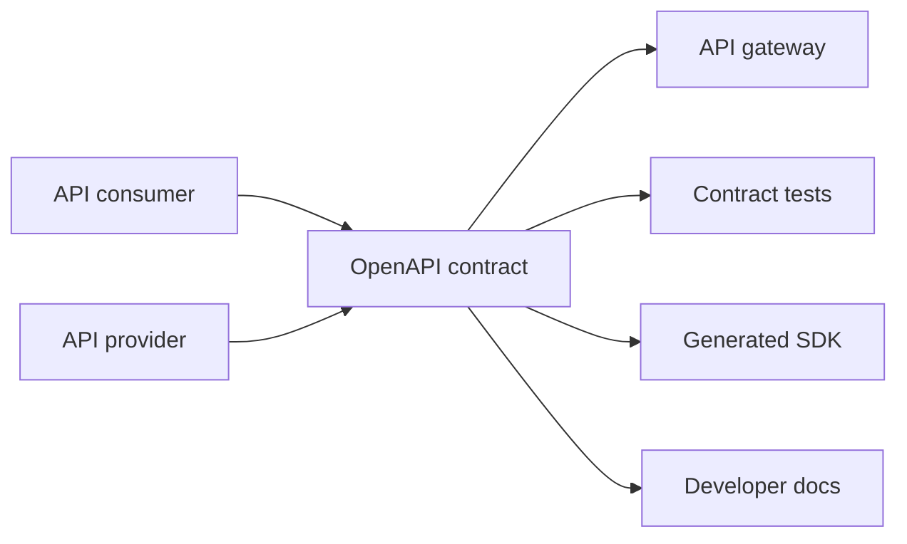
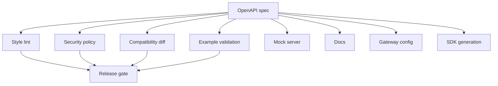

# Part 022 — OpenAPI Contract Model: Paths, Operations, Components, and Security

OpenAPI is not documentation.

OpenAPI is an executable contract description for HTTP APIs.

Documentation is one output.

A serious OpenAPI document can drive:

- design review;
- server stubs;
- client SDKs;
- mock servers;
- request validation;
- response validation;
- contract tests;
- security review;
- breaking-change detection;
- API catalogs;
- gateway policy;
- developer portals;
- governance gates.

The dangerous misconception:

```text
“We already have controllers, so we can generate OpenAPI later.”
```

That produces an API inventory, not necessarily an API contract.

A production OpenAPI contract must describe what the API **means**, not merely what the current code happens to accept.

This part builds the OpenAPI mental model from first principles:

```text
OpenAPI document = HTTP interaction contract + schema contract + security contract + examples + reusable components + operational semantics.
```

Implementation in Java comes later. First we need the model.

---

## 1. What OpenAPI Is For

OpenAPI describes HTTP APIs in a programming-language-agnostic way.

The contract answers:

- What endpoints exist?
- Which HTTP methods are supported?
- What path/query/header/cookie parameters exist?
- What request bodies are accepted?
- What response bodies can be returned?
- What status codes are meaningful?
- What media types are supported?
- What authentication and authorization schemes apply?
- What reusable schemas/components define payload shape?
- What examples illustrate valid interactions?
- What operation IDs allow generated clients to expose stable method names?

In production, OpenAPI sits at the boundary between provider and consumer.



The contract is not owned only by backend developers.

It is shared by:

- product/API design;
- backend implementation;
- frontend/mobile clients;
- partner integrators;
- platform/gateway team;
- security reviewers;
- QA automation;
- SRE/observability;
- compliance/audit stakeholders.

---

## 2. OpenAPI Document Anatomy

A minimal OpenAPI 3.x document:

```yaml
openapi: 3.2.0
info:
  title: Enforcement Case API
  version: 1.0.0
paths:
  /cases/{caseId}:
    get:
      operationId: getCase
      parameters:
        - name: caseId
          in: path
          required: true
          schema:
            type: string
      responses:
        '200':
          description: Case found
          content:
            application/json:
              schema:
                $ref: '#/components/schemas/Case'
        '404':
          description: Case not found
components:
  schemas:
    Case:
      type: object
      required:
        - caseId
        - status
      properties:
        caseId:
          type: string
        status:
          type: string
```

Major sections:

| Section | Purpose |
|---|---|
| `openapi` | specification version |
| `info` | API metadata |
| `servers` | base URLs/environments |
| `paths` | available endpoints and operations |
| `components` | reusable schemas, parameters, responses, security schemes, examples |
| `security` | global security requirements |
| `tags` | grouping/navigation |
| `externalDocs` | external documentation references |

OpenAPI is a graph of HTTP operations and reusable components.

---

## 3. `openapi` Version Is Not API Version

This is the OpenAPI Specification version:

```yaml
openapi: 3.2.0
```

This is your API version:

```yaml
info:
  version: 1.0.0
```

They are different.

Do not confuse:

| Field | Meaning |
|---|---|
| `openapi` | which OpenAPI spec syntax this document uses |
| `info.version` | version of your API description |
| URL `/v1` | API lifecycle/versioning strategy |
| schema version | payload model lifecycle |
| artifact version | package/release version in Maven/NPM/etc. |

Bad review comment:

```text
Change openapi: 3.2.0 to 2.0.0 because this is API v2.
```

That is wrong.

---

## 4. `info` Object

Example:

```yaml
info:
  title: Enforcement Case API
  summary: HTTP API for enforcement case intake, retrieval, and lifecycle commands.
  description: |
    Provides external and internal consumers with controlled access to case workflows.
    This API is contract-first and subject to backward compatibility review.
  version: 1.4.0
  contact:
    name: Case Platform Team
    email: case-platform@example.com
  license:
    name: Internal Use Only
```

`info` is not mere metadata.

It answers ownership and lifecycle questions.

Production checklist:

- Is the API title stable?
- Is the description consumer-oriented?
- Is versioning policy defined?
- Is ownership/contact explicit?
- Is license/internal status clear?
- Is API scope clear enough to prevent misuse?

---

## 5. Servers

`servers` defines base URLs.

```yaml
servers:
  - url: https://api.example.com/enforcement/v1
    description: Production
  - url: https://sandbox-api.example.com/enforcement/v1
    description: Sandbox
```

With variables:

```yaml
servers:
  - url: https://{environment}.api.example.com/enforcement/v1
    variables:
      environment:
        default: sandbox
        enum:
          - sandbox
          - staging
          - api
```

Use variables carefully.

Overly clever server variables make generated clients and documentation harder to reason about.

For internal APIs, you may omit environment-specific servers and let deployment config provide base URL.

For partner/public APIs, explicit server entries are more useful.

---

## 6. Paths Are Resource-Oriented Contract Anchors

Paths define addressable API resources/actions.

Good:

```yaml
paths:
  /cases:
    post: {}
    get: {}
  /cases/{caseId}:
    get: {}
  /cases/{caseId}/decisions:
    post: {}
```

Bad:

```yaml
paths:
  /doOpenCase: {}
  /getCaseById: {}
  /processCaseDecision: {}
```

Why?

OpenAPI describes HTTP APIs. HTTP consumers expect URI structure to carry resource meaning.

This does not mean every endpoint must be pure REST dogma.

Command-style APIs are sometimes necessary:

```yaml
paths:
  /cases/{caseId}:escalate:
    post: {}
```

But be intentional.

Do not accidentally create RPC-over-HTTP while claiming resource-oriented API design.

---

## 7. Path Templating

Example:

```yaml
/cases/{caseId}:
  get:
    parameters:
      - name: caseId
        in: path
        required: true
        schema:
          type: string
          pattern: '^CASE-[0-9]{12}$'
```

Rules:

- path template variables must have matching path parameters;
- path parameters are required;
- names must match exactly;
- path parameters should represent stable identifiers;
- avoid ambiguous path hierarchies.

Bad:

```yaml
/cases/{id}/events/{id}:
```

Better:

```yaml
/cases/{caseId}/events/{eventId}:
```

Names are part of generated code, docs, gateway logs, and consumer understanding.

---

## 8. Operations

An operation is one HTTP interaction under a path and method.

```yaml
paths:
  /cases/{caseId}:
    get:
      operationId: getCase
      summary: Get a case by ID
      description: Returns the current case view for a stable case identifier.
      tags:
        - Cases
      parameters: []
      responses: {}
```

Important fields:

| Field | Purpose |
|---|---|
| `operationId` | stable generated client method name |
| `summary` | short human-readable purpose |
| `description` | detailed behavior |
| `tags` | grouping/navigation |
| `parameters` | path/query/header/cookie inputs |
| `requestBody` | body payload |
| `responses` | status-code-specific outputs |
| `security` | operation-specific security |
| `deprecated` | lifecycle marker |

### 8.1 `operationId` Is a Public Contract

Bad:

```yaml
operationId: casesCaseIdGet
```

Better:

```yaml
operationId: getCase
```

Why?

Generated SDKs often use `operationId` as method names.

Changing it can break consumers even if the HTTP path does not change.

Treat `operationId` as stable.

---

## 9. HTTP Method Semantics

Use methods intentionally.

| Method | Typical meaning | Should be safe? | Should be idempotent? |
|---|---|---:|---:|
| `GET` | retrieve representation | yes | yes |
| `POST` | create or command | no | not necessarily |
| `PUT` | replace resource | no | yes |
| `PATCH` | partial update | no | not necessarily, unless designed |
| `DELETE` | delete/cancel/remove | no | often yes |

Bad:

```yaml
GET /cases/{caseId}/close
```

A `GET` should not mutate state.

Better:

```yaml
POST /cases/{caseId}:close
```

or

```yaml
POST /cases/{caseId}/closure-decisions
```

depending on domain model.

---

## 10. Parameters

OpenAPI parameters can be located in:

- `path`;
- `query`;
- `header`;
- `cookie`.

Example:

```yaml
parameters:
  - name: caseId
    in: path
    required: true
    description: Stable internal case identifier.
    schema:
      type: string
      pattern: '^CASE-[0-9]{12}$'
  - name: includeAuditTrail
    in: query
    required: false
    schema:
      type: boolean
      default: false
  - name: X-Correlation-Id
    in: header
    required: false
    schema:
      type: string
```

### 10.1 Parameter Design Rules

| Parameter type | Good use | Bad use |
|---|---|---|
| path | resource identity | filters/options |
| query | filtering, sorting, pagination, projection | secret data |
| header | protocol/context metadata | business fields |
| cookie | browser/session context | API business input |

Do not put core business data in headers just because it is convenient.

If domain logic depends on it, it probably belongs in the body or path/query model.

---

## 11. Query Parameter Complexity

Simple query:

```yaml
/cases:
  get:
    parameters:
      - name: status
        in: query
        schema:
          type: array
          items:
            $ref: '#/components/schemas/CaseStatus'
        style: form
        explode: true
```

This often serializes as:

```http
GET /cases?status=OPEN&status=ESCALATED
```

Complex query:

```http
GET /cases?filter=status:OPEN AND priority:HIGH AND openedAt>=2026-01-01
```

A filter DSL may be appropriate, but it is now a language.

If you expose it, define:

- grammar;
- supported fields;
- operators;
- escaping;
- error model;
- maximum complexity;
- security constraints;
- index/performance behavior.

Otherwise, model query fields explicitly.

---

## 12. Request Body

`requestBody` defines payload accepted by operations such as `POST`, `PUT`, and `PATCH`.

```yaml
requestBody:
  required: true
  content:
    application/json:
      schema:
        $ref: '#/components/schemas/OpenCaseRequest'
      examples:
        simple:
          value:
            externalReference: EXT-2026-0001
            title: Suspicious transaction report
            priority: HIGH
```

A request body can support multiple media types:

```yaml
requestBody:
  required: true
  content:
    application/json:
      schema:
        $ref: '#/components/schemas/OpenCaseRequest'
    application/xml:
      schema:
        $ref: '#/components/schemas/OpenCaseRequestXml'
```

Do not advertise media types you do not test.

Each media type is a separate contract surface.

---

## 13. Responses

Responses map HTTP status codes to response definitions.

```yaml
responses:
  '201':
    description: Case created
    headers:
      Location:
        description: URL of the created case resource.
        schema:
          type: string
    content:
      application/json:
        schema:
          $ref: '#/components/schemas/OpenCaseResponse'
  '400':
    $ref: '#/components/responses/BadRequest'
  '409':
    $ref: '#/components/responses/Conflict'
```

Do not define only `200`.

Error responses are part of the contract.

### 13.1 Status Code Discipline

| Status | Meaning in API contract |
|---|---|
| `200` | successful request with response body |
| `201` | resource created |
| `202` | accepted for async processing |
| `204` | success with no body |
| `400` | syntactically/semantically invalid request |
| `401` | authentication missing/invalid |
| `403` | authenticated but not authorized |
| `404` | resource not found or hidden |
| `409` | conflict with current state |
| `412` | precondition failed |
| `415` | unsupported media type |
| `422` | semantically unprocessable payload, if your API standard uses it |
| `429` | rate limit exceeded |
| `500` | unexpected server error |
| `503` | temporary unavailability |

Pick a standard and enforce it across APIs.

Random status code usage destroys client reliability.

---

## 14. Error Model

Bad error contract:

```yaml
'400':
  description: Bad request
```

Better:

```yaml
'400':
  description: Request validation failed
  content:
    application/json:
      schema:
        $ref: '#/components/schemas/Problem'
      examples:
        missingTitle:
          value:
            type: https://errors.example.com/validation
            title: Validation failed
            status: 400
            code: REQUIRED_FIELD_MISSING
            detail: title is required
            correlationId: 01J0ABCDEF123
            violations:
              - field: title
                code: REQUIRED_FIELD_MISSING
                message: title is required
```

Reusable schema:

```yaml
components:
  schemas:
    Problem:
      type: object
      required:
        - title
        - status
        - code
        - correlationId
      properties:
        type:
          type: string
          format: uri
        title:
          type: string
        status:
          type: integer
          format: int32
        code:
          type: string
        detail:
          type: string
        correlationId:
          type: string
        violations:
          type: array
          items:
            $ref: '#/components/schemas/Violation'
    Violation:
      type: object
      required:
        - code
        - message
      properties:
        field:
          type: string
        code:
          type: string
        message:
          type: string
```

The error model should be common across APIs.

Do not let each endpoint invent its own error shape.

---

## 15. Media Types

Media type is part of the contract.

Common:

```yaml
application/json
```

Versioned/custom:

```yaml
application/vnd.example.enforcement-case.v1+json
```

Multiple content types:

```yaml
content:
  application/json:
    schema:
      $ref: '#/components/schemas/Case'
  application/problem+json:
    schema:
      $ref: '#/components/schemas/Problem'
```

Design trade-off:

| Strategy | Pros | Cons |
|---|---|---|
| simple `application/json` | easy | versioning elsewhere |
| vendor media type | explicit representation contract | more client/gateway complexity |
| multiple media types | flexible | testing surface grows |

Do not multiply media types without operational need.

---

## 16. Components

`components` holds reusable definitions.

```yaml
components:
  schemas: {}
  responses: {}
  parameters: {}
  examples: {}
  requestBodies: {}
  headers: {}
  securitySchemes: {}
  links: {}
  callbacks: {}
  pathItems: {}
```

Use components for real reuse, not premature abstraction.

Good reuse:

- `Problem` error model;
- pagination parameters;
- correlation ID header;
- common security schemes;
- common domain value object like `Money`;
- shared response type like `Unauthorized`.

Bad reuse:

- one giant `BaseResponse` for everything;
- generic `Data` schema;
- shared request model across unrelated operations;
- common enum that should be context-specific;
- internal persistence model reused as API schema.

---

## 17. Schema Components

Example:

```yaml
components:
  schemas:
    Case:
      type: object
      required:
        - caseId
        - status
        - createdAt
      properties:
        caseId:
          type: string
          pattern: '^CASE-[0-9]{12}$'
        status:
          $ref: '#/components/schemas/CaseStatus'
        createdAt:
          type: string
          format: date-time
        priority:
          $ref: '#/components/schemas/CasePriority'
    CaseStatus:
      type: string
      enum:
        - OPEN
        - ESCALATED
        - CLOSED
```

A schema component should describe the API representation, not the database table.

Avoid leaking:

- internal surrogate IDs;
- database column names;
- internal status flags;
- implementation timestamps;
- soft-delete mechanics;
- optimistic lock details unless public;
- infrastructure metadata.

---

## 18. Request Schema vs Response Schema

Do not reuse the same schema for create request and response just because fields overlap.

Bad:

```yaml
OpenCaseRequest:
  $ref: '#/components/schemas/Case'
```

Better:

```yaml
OpenCaseRequest:
  type: object
  required:
    - externalReference
    - title
    - priority
  properties:
    externalReference:
      type: string
    title:
      type: string
    narrative:
      type: string
    priority:
      $ref: '#/components/schemas/CasePriority'

OpenCaseResponse:
  type: object
  required:
    - caseId
    - status
    - createdAt
  properties:
    caseId:
      type: string
    status:
      $ref: '#/components/schemas/CaseStatus'
    createdAt:
      type: string
      format: date-time
```

Reason:

```text
Input contract models intent.
Output contract models outcome.
Entity view models current representation.
They evolve differently.
```

---

## 19. Examples Are Contract Tests Waiting to Happen

Examples are not decoration.

They can be used for:

- documentation;
- mock server responses;
- generated tests;
- validation fixtures;
- onboarding;
- regression detection.

Example:

```yaml
components:
  examples:
    OpenCaseRequestExample:
      summary: Open a high-priority enforcement case
      value:
        externalReference: EXT-2026-0001
        title: Suspicious transaction report
        narrative: Reporter observed suspicious repeated transfers.
        priority: HIGH
```

A good example is:

- realistic;
- valid against schema;
- free of sensitive data;
- stable;
- named meaningfully;
- maintained in CI.

Bad example:

```yaml
value:
  foo: bar
```

That teaches nothing and tests nothing.

---

## 20. Security Schemes

OpenAPI security schemes define how an API is authenticated/authorized at protocol level.

Examples:

```yaml
components:
  securitySchemes:
    bearerAuth:
      type: http
      scheme: bearer
      bearerFormat: JWT
    apiKeyAuth:
      type: apiKey
      in: header
      name: X-API-Key
    oauth2:
      type: oauth2
      flows:
        authorizationCode:
          authorizationUrl: https://auth.example.com/oauth2/authorize
          tokenUrl: https://auth.example.com/oauth2/token
          scopes:
            cases:read: Read cases
            cases:write: Modify cases
```

Global security:

```yaml
security:
  - bearerAuth: []
```

Operation-level security:

```yaml
paths:
  /cases:
    get:
      security:
        - oauth2:
            - cases:read
```

Important distinction:

```text
OpenAPI security scheme describes authentication mechanism.
It does not fully describe authorization policy.
```

You still need behavior documentation:

```text
Caller must have CASE_VIEW permission for the tenant that owns the case.
```

---

## 21. Security Requirements Are OR-of-ANDs

OpenAPI security requirements can be subtle.

```yaml
security:
  - bearerAuth: []
  - apiKeyAuth: []
```

This usually means either bearer auth OR API key auth.

```yaml
security:
  - bearerAuth: []
    apiKeyAuth: []
```

This usually means bearer auth AND API key auth together.

Be explicit.

Accidental OR/AND mistakes can become security vulnerabilities.

---

## 22. Headers as Contract

Common headers:

```yaml
components:
  parameters:
    CorrelationIdHeader:
      name: X-Correlation-Id
      in: header
      required: false
      schema:
        type: string
      description: Optional caller-provided correlation ID for tracing.
```

Response headers:

```yaml
components:
  headers:
    RateLimitRemaining:
      description: Remaining requests in current rate limit window.
      schema:
        type: integer
```

Headers are not free text.

They need:

- name convention;
- required/optional semantics;
- propagation rules;
- sensitive-data classification;
- logging policy;
- gateway behavior;
- generated client support.

---

## 23. Pagination Contract

Example:

```yaml
paths:
  /cases:
    get:
      operationId: searchCases
      parameters:
        - name: pageSize
          in: query
          schema:
            type: integer
            minimum: 1
            maximum: 100
            default: 25
        - name: pageToken
          in: query
          schema:
            type: string
      responses:
        '200':
          description: Search results
          content:
            application/json:
              schema:
                $ref: '#/components/schemas/SearchCasesResponse'
components:
  schemas:
    SearchCasesResponse:
      type: object
      required:
        - items
      properties:
        items:
          type: array
          items:
            $ref: '#/components/schemas/CaseSummary'
        nextPageToken:
          type: string
```

Behavioral contract:

```text
- pageToken is opaque.
- pageToken expires after 15 minutes.
- Results are sorted by createdAt descending, caseId descending.
- Empty nextPageToken means no more results.
- pageSize above 100 is rejected with 400.
```

OpenAPI expresses shape.

You must document behavior.

---

## 24. Idempotency Contract

For create/command operations:

```yaml
components:
  parameters:
    IdempotencyKeyHeader:
      name: Idempotency-Key
      in: header
      required: true
      schema:
        type: string
        minLength: 8
        maxLength: 128
      description: Stable key used to safely retry the same command.
```

Operation:

```yaml
paths:
  /cases:
    post:
      operationId: openCase
      parameters:
        - $ref: '#/components/parameters/IdempotencyKeyHeader'
      requestBody:
        required: true
        content:
          application/json:
            schema:
              $ref: '#/components/schemas/OpenCaseRequest'
      responses:
        '201':
          description: Case created
        '409':
          description: Idempotency conflict or duplicate external reference
```

Behavior:

```text
Same Idempotency-Key + same authenticated caller + same request body returns the original result.
Same key with different request body returns 409.
```

This is a contract.

Not merely an implementation detail.

---

## 25. Deprecation

OpenAPI supports marking operations, parameters, and schemas as deprecated in several contexts.

Example:

```yaml
parameters:
  - name: legacyStatus
    in: query
    deprecated: true
    schema:
      type: string
```

Deprecation alone is weak.

Include lifecycle information:

```yaml
description: |
  Deprecated. Use status instead.
  This parameter will be removed no earlier than 2027-01-01.
```

A serious deprecation policy includes:

- replacement guidance;
- sunset date;
- consumer impact analysis;
- telemetry of usage;
- migration guide;
- support contact;
- enforcement plan.

---

## 26. Links and Workflow Hints

OpenAPI links can describe relationships between operations.

Example:

```yaml
responses:
  '201':
    description: Case created
    content:
      application/json:
        schema:
          $ref: '#/components/schemas/OpenCaseResponse'
    links:
      GetCreatedCase:
        operationId: getCase
        parameters:
          caseId: '$response.body#/caseId'
```

Links are useful for docs and workflow discovery.

Do not rely on links as the only source of business process definition.

For complex multi-call workflows, consider separate workflow documentation or Arazzo-style workflow descriptions.

---

## 27. Callbacks and Webhooks

OpenAPI can describe callbacks/webhooks-like interactions.

Example:

```yaml
callbacks:
  caseStatusChanged:
    '{$request.body#/callbackUrl}':
      post:
        requestBody:
          required: true
          content:
            application/json:
              schema:
                $ref: '#/components/schemas/CaseStatusChangedEvent'
        responses:
          '204':
            description: Event accepted
```

Use this carefully.

Callback contracts need:

- retry policy;
- signature/authentication;
- timeout;
- delivery guarantee;
- idempotency;
- event ordering;
- schema versioning;
- failure handling;
- replay support.

OpenAPI can describe the shape, but operational semantics must be explicit.

---

## 28. Tags

Tags group operations.

```yaml
tags:
  - name: Cases
    description: Case intake and retrieval operations.
  - name: Decisions
    description: Enforcement decision operations.
```

Good tags map to consumer mental model.

Bad tags map to implementation packages:

```yaml
tags:
  - name: CaseControllerImplV2
```

Tags appear in developer portals.

Design them like navigation, not source folders.

---

## 29. Extensions

OpenAPI allows specification extensions using `x-` fields.

Example:

```yaml
x-owner-team: case-platform
x-data-classification: confidential
x-rate-limit-tier: partner-standard
x-audit-event: CASE_OPENED
```

Extensions are powerful for governance.

Use them to encode platform metadata:

- owner team;
- lifecycle state;
- data classification;
- required gateway policy;
- audit category;
- PII fields;
- business capability;
- internal/external exposure;
- SLA tier.

But govern them.

Random extensions become invisible comments.

---

## 30. OpenAPI as Governance Artifact

A mature platform treats OpenAPI as policy input.



Quality gates should answer:

- Are operation IDs unique and stable?
- Are error responses standardized?
- Are security schemes present?
- Are undocumented `5xx` responses avoided?
- Are examples valid?
- Are schemas compatible with previous release?
- Are PII fields classified?
- Are pagination and idempotency patterns consistent?
- Are deprecated operations tracked?

---

## 31. Example: Production-Grade OpenAPI Skeleton

```yaml
openapi: 3.2.0
info:
  title: Enforcement Case API
  summary: API for enforcement case lifecycle operations.
  version: 1.0.0
servers:
  - url: https://api.example.com/enforcement/v1
    description: Production
security:
  - bearerAuth: []
tags:
  - name: Cases
    description: Case intake and retrieval.
paths:
  /cases:
    post:
      operationId: openCase
      summary: Open a new enforcement case
      tags:
        - Cases
      parameters:
        - $ref: '#/components/parameters/CorrelationIdHeader'
        - $ref: '#/components/parameters/IdempotencyKeyHeader'
      requestBody:
        required: true
        content:
          application/json:
            schema:
              $ref: '#/components/schemas/OpenCaseRequest'
            examples:
              highPriority:
                $ref: '#/components/examples/OpenCaseRequestHighPriority'
      responses:
        '201':
          description: Case opened
          headers:
            Location:
              description: URL of the created case resource.
              schema:
                type: string
          content:
            application/json:
              schema:
                $ref: '#/components/schemas/OpenCaseResponse'
        '400':
          $ref: '#/components/responses/BadRequest'
        '401':
          $ref: '#/components/responses/Unauthorized'
        '403':
          $ref: '#/components/responses/Forbidden'
        '409':
          $ref: '#/components/responses/Conflict'
components:
  securitySchemes:
    bearerAuth:
      type: http
      scheme: bearer
      bearerFormat: JWT
  parameters:
    CorrelationIdHeader:
      name: X-Correlation-Id
      in: header
      required: false
      schema:
        type: string
      description: Optional correlation ID for tracing.
    IdempotencyKeyHeader:
      name: Idempotency-Key
      in: header
      required: true
      schema:
        type: string
        minLength: 8
        maxLength: 128
      description: Stable key for safe retries of state-changing requests.
  schemas:
    OpenCaseRequest:
      type: object
      required:
        - externalReference
        - title
        - priority
      additionalProperties: false
      properties:
        externalReference:
          type: string
          minLength: 1
          maxLength: 100
        title:
          type: string
          minLength: 1
          maxLength: 200
        narrative:
          type: string
          maxLength: 10000
        priority:
          $ref: '#/components/schemas/CasePriority'
    OpenCaseResponse:
      type: object
      required:
        - caseId
        - status
        - createdAt
      additionalProperties: false
      properties:
        caseId:
          type: string
          pattern: '^CASE-[0-9]{12}$'
        status:
          $ref: '#/components/schemas/CaseStatus'
        createdAt:
          type: string
          format: date-time
    CasePriority:
      type: string
      enum:
        - LOW
        - MEDIUM
        - HIGH
        - CRITICAL
    CaseStatus:
      type: string
      enum:
        - OPEN
        - ESCALATED
        - CLOSED
    Problem:
      type: object
      required:
        - title
        - status
        - code
        - correlationId
      additionalProperties: false
      properties:
        type:
          type: string
          format: uri
        title:
          type: string
        status:
          type: integer
        code:
          type: string
        detail:
          type: string
        correlationId:
          type: string
        violations:
          type: array
          items:
            $ref: '#/components/schemas/Violation'
    Violation:
      type: object
      required:
        - code
        - message
      additionalProperties: false
      properties:
        field:
          type: string
        code:
          type: string
        message:
          type: string
  responses:
    BadRequest:
      description: Invalid request
      content:
        application/json:
          schema:
            $ref: '#/components/schemas/Problem'
    Unauthorized:
      description: Authentication required or invalid
      content:
        application/json:
          schema:
            $ref: '#/components/schemas/Problem'
    Forbidden:
      description: Caller is not authorized for this operation
      content:
        application/json:
          schema:
            $ref: '#/components/schemas/Problem'
    Conflict:
      description: Request conflicts with current resource state
      content:
        application/json:
          schema:
            $ref: '#/components/schemas/Problem'
  examples:
    OpenCaseRequestHighPriority:
      summary: High-priority suspicious transaction report
      value:
        externalReference: EXT-2026-0001
        title: Suspicious transaction report
        narrative: Reporter observed suspicious repeated transfers.
        priority: HIGH
```

This is still only a skeleton.

A real production API would add:

- `GET /cases/{caseId}`;
- search endpoint;
- lifecycle commands;
- detailed examples;
- rate limit headers;
- authorization descriptions;
- audit metadata extensions;
- compatibility policy;
- changelog.

---

## 32. Anti-Patterns

### 32.1 Controller-Dump OpenAPI

Generated from implementation after the fact.

Symptoms:

- operation IDs are ugly;
- schemas mirror Java classes;
- internal fields leak;
- error model inconsistent;
- security missing;
- examples absent;
- all responses are `200`;
- query semantics undocumented.

### 32.2 One Mega Schema

```yaml
CaseDto:
  properties:
    id: {}
    status: {}
    createdBy: {}
    deleted: {}
    internalLockVersion: {}
    uiColor: {}
    databaseShard: {}
```

This leaks implementation and mixes concerns.

### 32.3 Generic Response Wrapper Everywhere

```yaml
ApiResponse:
  properties:
    success:
      type: boolean
    data:
      type: object
    error:
      type: object
```

This destroys schema specificity and makes generated clients weak.

### 32.4 Security Only in Prose

```yaml
description: Requires auth.
```

Use `securitySchemes` and operation-level security.

### 32.5 No Error Schema

Clients cannot reliably handle failures.

### 32.6 No Examples

Mocks, tests, and docs become low-quality.

### 32.7 Path Names as Verbs Everywhere

The API becomes ad hoc RPC-over-HTTP without clear resource model.

---

## 33. Review Checklist

### Document Level

- Is `openapi` version correct?
- Is `info.version` meaningful?
- Is ownership/contact clear?
- Are servers appropriate for target consumers?
- Are tags consumer-oriented?

### Operation Level

- Is `operationId` stable and unique?
- Are method semantics correct?
- Are path parameters clear and non-ambiguous?
- Are query parameters bounded and documented?
- Are request bodies required only when appropriate?
- Are all meaningful responses documented?
- Are error responses standardized?

### Schema Level

- Are request/response schemas separated?
- Are required fields intentional?
- Is `additionalProperties` policy explicit?
- Are enums stable?
- Are date/time/money/ID formats clear?
- Are examples valid?
- Are sensitive fields classified?

### Security Level

- Are security schemes defined?
- Is global vs operation security correct?
- Are OAuth scopes meaningful?
- Are authorization rules documented?
- Are headers classified and safe to log?

### Governance Level

- Is breaking-change detection enabled?
- Are examples validated in CI?
- Are generated clients tested?
- Are deprecations tracked?
- Are extensions governed?

---

## 34. Exercises

### Exercise 1 — Fix the Controller Dump

Given:

```yaml
paths:
  /case/getById:
    post:
      operationId: caseControllerGetById
      requestBody:
        content:
          application/json:
            schema:
              type: object
      responses:
        '200':
          description: ok
```

Refactor it into a better OpenAPI contract.

Expected direction:

- use `GET /cases/{caseId}`;
- define path parameter;
- define `Case` response schema;
- define `404` response;
- define security;
- use stable `operationId: getCase`;
- add example.

### Exercise 2 — Design Error Responses

Create reusable responses for:

- validation failure;
- unauthorized;
- forbidden;
- not found;
- conflict;
- rate limited.

Use one shared `Problem` schema.

### Exercise 3 — Model Search Cases

Design `GET /cases` with:

- status filter;
- priority filter;
- opened date range;
- page size;
- page token;
- stable sort behavior.

Write both OpenAPI shape and behavioral rules.

---

## 35. Production Heuristics

1. Design OpenAPI before implementation when API compatibility matters.
2. Treat `operationId` as public API.
3. Separate request, response, and domain view schemas.
4. Standardize error payloads across all APIs.
5. Do not advertise media types you do not test.
6. Use examples as validation fixtures.
7. Put domain data in body/path/query, not arbitrary headers.
8. Use security schemes, not prose-only authentication notes.
9. Document behavior that schema cannot express.
10. Avoid leaking internal Java/database models.
11. Make pagination and idempotency explicit.
12. Run OpenAPI lint, compatibility diff, and example validation in CI.

---

## 36. Part Summary

OpenAPI is the contract model for HTTP APIs.

It describes more than payload shape.

It models:

- paths;
- operations;
- method semantics;
- parameters;
- request bodies;
- responses;
- media types;
- reusable components;
- examples;
- security schemes;
- lifecycle metadata;
- governance extensions.

The top-level engineering move is to stop seeing OpenAPI as generated docs and start seeing it as the API boundary artifact.

A generated OpenAPI file from controllers can be useful.

A designed OpenAPI contract can shape the whole engineering lifecycle.

That is the difference between API description and API engineering.

---

## References

- OpenAPI Specification v3.2.0: `https://spec.openapis.org/oas/v3.2.0.html`
- OpenAPI Specification v3.1.0: `https://spec.openapis.org/oas/v3.1.0.html`
- OpenAPI Initiative: `https://www.openapis.org/`
- JSON Schema Draft 2020-12: `https://json-schema.org/draft/2020-12`
- RFC 9110 — HTTP Semantics: `https://www.rfc-editor.org/rfc/rfc9110`
- RFC 9457 — Problem Details for HTTP APIs: `https://www.rfc-editor.org/rfc/rfc9457`
