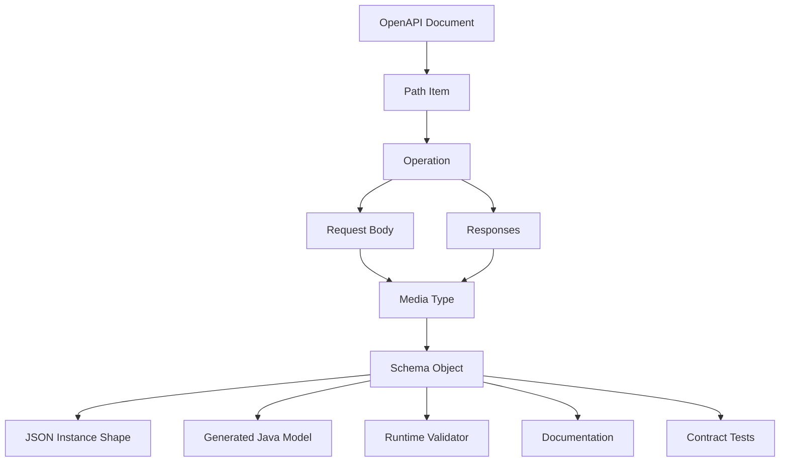
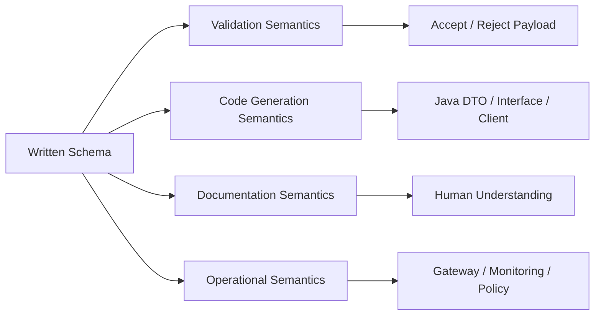
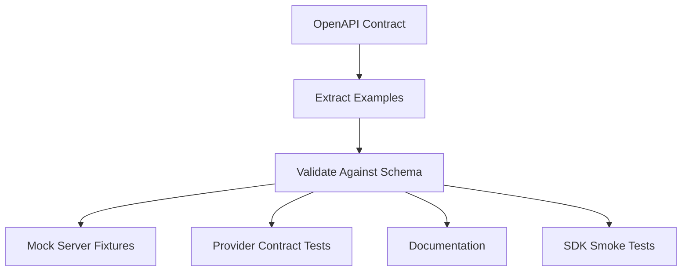
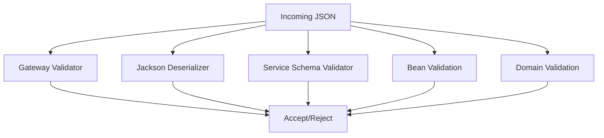
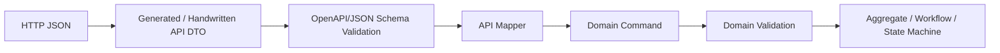

# Part 023 — OpenAPI Schema Object, JSON Schema, and Real-World Gaps

OpenAPI schemas look familiar if you already know JSON Schema.

That familiarity is useful.

It is also dangerous.

A production engineer must separate three things:

```text
JSON Schema = general-purpose JSON instance validation language
OpenAPI Schema Object = schema vocabulary embedded in an HTTP API contract
Java generated model = one possible code projection of that schema
```

They are related.

They are not the same artifact.

This part is about the gap between the specification you write, the validator you run, the generated Java code you compile, and the actual payloads your API exchanges in production.

That gap is where many API contract failures live.

---

## 1. The Core Problem

OpenAPI is often treated as a nicer syntax for DTO classes.

That is the wrong model.

An OpenAPI schema does not merely say:

```text
"Generate this Java class."
```

It says:

```text
"For this HTTP interaction, this JSON value is valid or invalid under these structural constraints."
```

Java code generation is downstream.

Validation is downstream.

Documentation is downstream.

Mocking is downstream.

The schema is upstream.

The production-grade question is not:

```text
Can the generator produce a class?
```

The better question is:

```text
Can every consumer, provider, test, validator, gateway, SDK, and operational tool interpret the schema the same way?
```

If not, your OpenAPI file is not a stable contract.

It is a partially executable document with hidden runtime disagreement.

---

## 2. OpenAPI Schema Object in One Mental Model

The OpenAPI Schema Object defines payload structure inside an API contract.

It can appear in:

- request bodies;
- response bodies;
- parameters;
- headers;
- examples;
- reusable `components/schemas`;
- callbacks;
- webhooks;
- links;
- media type objects.

At a high level:



The same schema influences multiple outputs.

This creates leverage.

It also creates blast radius.

A schema change can break:

- a server validator;
- a generated Java client;
- a TypeScript frontend client;
- a gateway policy;
- a mock server;
- a consumer contract test;
- a data lake ingestion job;
- a documentation portal;
- a partner integration.

The top 1% habit is to treat schema changes as distributed-system changes, not text edits.

---

## 3. OpenAPI 3.0 vs 3.1 vs 3.2: Why It Matters

OpenAPI versions differ in their relationship to JSON Schema.

This matters because real enterprises often have mixed tooling:

- old services still on OpenAPI 3.0.x;
- new services on OpenAPI 3.1;
- platform teams adopting OpenAPI 3.2;
- generators that lag the latest spec;
- validators that implement JSON Schema dialects differently;
- API gateway plugins that support only a subset.

### 3.0.x mental model

OpenAPI 3.0 used a schema dialect inspired by JSON Schema but not identical to modern JSON Schema.

Major implications:

- no native JSON Schema `null` type;
- uses `nullable: true`;
- `type` is not an array;
- several JSON Schema keywords are unsupported or behave differently;
- `$ref` sibling behavior is restricted by Reference Object semantics;
- tooling often has special OpenAPI-specific logic.

Example in OpenAPI 3.0:

```yaml
schema:
  type: string
  nullable: true
```

This means the value may be a string or explicit JSON `null`.

But this is not portable JSON Schema.

### 3.1 mental model

OpenAPI 3.1 aligned much more closely with JSON Schema 2020-12.

A nullable string becomes:

```yaml
schema:
  type:
    - string
    - 'null'
```

That is a real JSON Schema style.

This is a big improvement for validators, schema reuse, and external JSON Schema tooling.

### 3.2 mental model

OpenAPI 3.2 continues the OpenAPI line and its Schema Object is described as a superset of JSON Schema Draft 2020-12.

The practical engineering concern remains:

```text
Spec support is not equal to tooling support.
```

You can write a valid OpenAPI 3.2 document that some validators, generators, gateways, or documentation renderers do not fully support.

A production team needs a supported subset.

Not because the specification is weak.

Because your delivery pipeline is only as strong as the weakest semantic interpreter in it.

---

## 4. The Four Layers of Schema Semantics

When you write an OpenAPI schema, four layers interact:



A schema can be valid at one layer and problematic at another.

Example:

```yaml
PaymentInstrument:
  oneOf:
    - $ref: '#/components/schemas/CardPaymentInstrument'
    - $ref: '#/components/schemas/BankAccountPaymentInstrument'
```

This is structurally valid.

But it may still be weak if:

- both branches can validate the same payload;
- there is no stable tag field;
- the Java generator emits an awkward wrapper;
- the docs render it unclearly;
- the gateway validator does not support `oneOf` correctly;
- consumers do not know which subtype to construct;
- future subtypes will break old clients.

The schema is not only about validity.

It is about operational interpretability.

---

## 5. Required, Optional, Nullable, and Absent

This is the most common source of contract bugs.

In JSON payloads, these are different states:

```json
{}
```

```json
{ "middleName": null }
```

```json
{ "middleName": "" }
```

```json
{ "middleName": "Ann" }
```

They may mean different things:

| State | Possible Meaning |
|---|---|
| missing | not provided, not requested, unknown, no change |
| null | explicitly cleared, unknown, not applicable |
| empty string | provided but empty, bad input, legitimate empty value |
| non-empty string | known value |

OpenAPI schema must make this explicit.

### Optional but non-null when present

```yaml
CustomerPatch:
  type: object
  additionalProperties: false
  properties:
    middleName:
      type: string
      minLength: 1
```

Here:

- `middleName` may be absent;
- if present, it must be a non-empty string;
- explicit `null` is invalid;
- empty string is invalid.

This is often the right design for create requests where optional means "not supplied".

### Required but nullable

OpenAPI 3.1/3.2 style:

```yaml
CustomerProfile:
  type: object
  additionalProperties: false
  required:
    - customerId
    - middleName
  properties:
    customerId:
      type: string
    middleName:
      type:
        - string
        - 'null'
```

Here:

- `middleName` must be present;
- its value may be string or null.

This is useful when downstream systems need to distinguish "field omitted" from "known empty/unknown value".

### Optional and nullable

```yaml
CustomerPatch:
  type: object
  additionalProperties: false
  properties:
    middleName:
      type:
        - string
        - 'null'
```

This allows three states:

- missing;
- null;
- string.

This is expressive but dangerous unless the business semantics are explicit.

For PATCH-style APIs, this can mean:

- missing = do not change;
- null = clear value;
- string = set value.

That is legitimate.

But it must be documented and tested.

### Anti-pattern: optional-by-accident

```yaml
CustomerCreateRequest:
  type: object
  properties:
    customerId:
      type: string
    legalName:
      type: string
```

No `required` array.

This means both fields are optional.

Many teams accidentally publish this.

Generated Java code may still have fields, but validation does not require them.

A DTO class with fields is not equivalent to an OpenAPI schema with required properties.

---

## 6. Closed vs Open Objects

OpenAPI inherits the JSON object tension:

```text
Should unknown properties be allowed?
```

### Closed object

```yaml
CustomerCreateRequest:
  type: object
  additionalProperties: false
  required:
    - legalName
    - customerType
  properties:
    legalName:
      type: string
      minLength: 1
    customerType:
      type: string
      enum: [INDIVIDUAL, ORGANIZATION]
```

Good for:

- request bodies;
- command payloads;
- regulated inputs;
- generated SDK stability;
- validation precision;
- error reporting;
- security posture.

Risk:

- future producer additions may break strict consumers if the same schema is reused in responses/events.

### Open object

```yaml
Metadata:
  type: object
  additionalProperties:
    type: string
```

Good for:

- extension metadata;
- labels;
- non-critical key-value tags;
- observability attributes;
- partner-specific optional extensions.

Risk:

- weak contract;
- inconsistent value semantics;
- poor discoverability;
- hidden business fields;
- validation bypass.

### Production rule

Use closed objects for primary contract shapes.

Use open objects only for explicitly named extension surfaces.

Good pattern:

```yaml
CaseCreatedEvent:
  type: object
  additionalProperties: false
  required:
    - eventId
    - caseId
    - occurredAt
    - payload
  properties:
    eventId:
      type: string
      format: uuid
    caseId:
      type: string
    occurredAt:
      type: string
      format: date-time
    payload:
      $ref: '#/components/schemas/CaseCreatedPayload'
    extensions:
      type: object
      additionalProperties:
        type:
          - string
          - number
          - boolean
```

Unknown fields do not leak everywhere.

They are constrained to a deliberate extension zone.

---

## 7. `additionalProperties`, `unevaluatedProperties`, and Tooling Reality

OpenAPI 3.1/3.2 alignment with JSON Schema brings more expressive object control.

But teams must be careful with advanced JSON Schema keywords.

Example with composition:

```yaml
BaseCase:
  type: object
  required: [caseId]
  properties:
    caseId:
      type: string

EnforcementCase:
  allOf:
    - $ref: '#/components/schemas/BaseCase'
    - type: object
      required: [enforcementType]
      properties:
        enforcementType:
          type: string
          enum: [WARNING, PENALTY, SUSPENSION]
```

If you put `additionalProperties: false` inside `BaseCase`, it may reject properties introduced by the second `allOf` branch depending on validation semantics and dialect.

Modern JSON Schema offers `unevaluatedProperties` to close an object after composition has been evaluated.

Conceptually:

```yaml
EnforcementCase:
  allOf:
    - $ref: '#/components/schemas/BaseCase'
    - type: object
      required: [enforcementType]
      properties:
        enforcementType:
          type: string
  unevaluatedProperties: false
```

This is semantically cleaner.

But not every OpenAPI tool supports it equally.

The production decision is:

```text
Use the most expressive keyword your whole toolchain supports, not merely the most expressive keyword the spec allows.
```

When in doubt, test the schema through:

- your chosen validator;
- OpenAPI linter;
- server generator;
- client generator;
- mock server;
- documentation renderer;
- API gateway validator;
- consumer SDK build.

---

## 8. `oneOf`, `anyOf`, `allOf`, and `not`

Composition is powerful.

It is also the quickest way to create ambiguous contracts.

### `allOf`

`allOf` means the instance must satisfy every schema.

It is often misused to model inheritance.

```yaml
PenaltyCase:
  allOf:
    - $ref: '#/components/schemas/BaseCase'
    - type: object
      required: [penaltyAmount]
      properties:
        penaltyAmount:
          $ref: '#/components/schemas/Money'
```

This is valid as composition.

But do not assume every generator will produce clean Java inheritance.

Many generators flatten, wrap, or produce awkward models.

OpenAPI composition is validation composition first.

It is not Java inheritance.

### `oneOf`

`oneOf` means exactly one schema must match.

```yaml
PaymentMethod:
  oneOf:
    - $ref: '#/components/schemas/CardPaymentMethod'
    - $ref: '#/components/schemas/BankTransferPaymentMethod'
```

Danger:

If both branches are too permissive, the payload may match both, causing validation failure.

Bad:

```yaml
CardPaymentMethod:
  type: object
  properties:
    token:
      type: string

BankTransferPaymentMethod:
  type: object
  properties:
    token:
      type: string
```

A payload with `token` matches both.

Better:

```yaml
CardPaymentMethod:
  type: object
  additionalProperties: false
  required: [kind, cardToken]
  properties:
    kind:
      const: CARD
    cardToken:
      type: string

BankTransferPaymentMethod:
  type: object
  additionalProperties: false
  required: [kind, bankAccountToken]
  properties:
    kind:
      const: BANK_TRANSFER
    bankAccountToken:
      type: string
```

Now each branch has a stable tag.

### `anyOf`

`anyOf` means the instance must satisfy at least one schema.

This is useful when overlapping schemas are acceptable.

It is less useful for generated SDKs because it does not produce a single obvious runtime subtype.

Use sparingly in public APIs.

### `not`

`not` excludes a shape.

Example:

```yaml
NonEmptyObject:
  type: object
  not:
    maxProperties: 0
```

This can express useful rules, but many code generators ignore it.

For APIs, prefer positive structure where possible.

---

## 9. Discriminator: Useful, Overused, and Often Misunderstood

The OpenAPI Discriminator Object is often treated as magic polymorphism.

It is not magic.

It is a hint that identifies which schema branch should apply based on a property value.

Example:

```yaml
components:
  schemas:
    PaymentMethod:
      oneOf:
        - $ref: '#/components/schemas/CardPaymentMethod'
        - $ref: '#/components/schemas/BankTransferPaymentMethod'
      discriminator:
        propertyName: kind
        mapping:
          CARD: '#/components/schemas/CardPaymentMethod'
          BANK_TRANSFER: '#/components/schemas/BankTransferPaymentMethod'

    CardPaymentMethod:
      type: object
      additionalProperties: false
      required: [kind, cardToken]
      properties:
        kind:
          type: string
          enum: [CARD]
        cardToken:
          type: string

    BankTransferPaymentMethod:
      type: object
      additionalProperties: false
      required: [kind, bankAccountToken]
      properties:
        kind:
          type: string
          enum: [BANK_TRANSFER]
        bankAccountToken:
          type: string
```

Good discriminator design requires:

- a required tag field;
- stable tag values;
- unambiguous branch schemas;
- explicit mapping;
- tests for every subtype;
- generated client verification;
- consumer fallback strategy for unknown future tag values.

### Anti-pattern: discriminator without structural validation

```yaml
Animal:
  discriminator:
    propertyName: type
  oneOf:
    - $ref: '#/components/schemas/Dog'
    - $ref: '#/components/schemas/Cat'
```

If `Dog` and `Cat` do not require and constrain `type`, consumers may still receive ambiguous or invalid payloads.

Discriminator should complement structural constraints.

It should not replace them.

---

## 10. Enum Design in OpenAPI

Enums look harmless.

They are not.

```yaml
CaseStatus:
  type: string
  enum:
    - DRAFT
    - SUBMITTED
    - UNDER_REVIEW
    - CLOSED
```

This is strict.

Strict is good for request commands.

Strict can be dangerous for responses.

Why?

Because a server may add a new status:

```text
ESCALATED
```

Old generated clients may not know how to parse or handle it.

### Request enum rule

For command/request fields, strict enum is usually appropriate.

A client should not send unknown commands.

### Response enum rule

For response fields, consider future compatibility.

Options:

1. Use strict enum and treat new values as breaking changes.
2. Add an `UNKNOWN` value in generated-language ecosystems where this helps.
3. Use open string plus documentation and server-side validation.
4. Split machine control enum from display/status metadata.

Example open status field:

```yaml
CaseStatus:
  type: string
  description: >
    Current case status. Consumers must tolerate unknown future values and treat
    them as non-terminal unless documented otherwise.
  examples:
    - UNDER_REVIEW
```

This sacrifices schema strictness for evolution.

That can be correct for long-lived public APIs.

For internal regulated workflows, strictness may be better.

The decision depends on the contract lifecycle.

---

## 11. `format` Is Not Always Validation

Common OpenAPI schemas:

```yaml
createdAt:
  type: string
  format: date-time

caseId:
  type: string
  format: uuid

amount:
  type: string
  pattern: '^\\d{1,18}\\.\\d{2}$'
```

`format` communicates semantic intent.

But in JSON Schema 2020-12, `format` behavior has vocabulary nuance: it may be annotation or assertion depending on validator configuration.

In practice:

- one validator may reject invalid UUID;
- another may only annotate it;
- a generator may map it to `UUID`;
- a gateway may treat it as plain string;
- docs may display it as formatted text.

Therefore, for critical constraints, do not rely only on `format`.

Use explicit constraints where needed:

```yaml
caseId:
  type: string
  pattern: '^[0-9a-fA-F]{8}-[0-9a-fA-F]{4}-[1-5][0-9a-fA-F]{3}-[89abAB][0-9a-fA-F]{3}-[0-9a-fA-F]{12}$'
```

But do not overdo regex either.

Regex constraints can be unreadable, slow, and generator-hostile.

Production rule:

```text
Use format for semantic mapping.
Use pattern/min/max for validation-critical constraints.
Use domain validation for rules that are not structural.
```

---

## 12. Examples Are Contract Tests Waiting to Happen

OpenAPI examples are often treated as documentation snippets.

In production, examples should be executable fixtures.

Bad example:

```yaml
examples:
  default:
    value:
      id: 123
      name: test
```

Weaknesses:

- meaningless values;
- no edge cases;
- not linked to business scenario;
- may become stale;
- may not validate against schema.

Better:

```yaml
examples:
  individualCustomerCreated:
    summary: Individual customer with verified identity
    value:
      customerId: "cst_01J7W1E5HCGY2GHE8Z9A6QPC8K"
      customerType: "INDIVIDUAL"
      legalName: "Maya Santoso"
      identityStatus: "VERIFIED"
      createdAt: "2026-07-03T09:10:11Z"
```

Executable example policy:

- every example must validate;
- every request schema has at least one valid example;
- every common error has an example;
- examples include edge cases;
- examples are used in mock server tests;
- examples are used in docs;
- examples are versioned with the contract.

In a mature pipeline:



Examples are cheap contract assets.

Do not waste them.

---

## 13. Request Schema vs Response Schema

A common anti-pattern is reusing the same schema for create request, update request, internal entity, and response.

Bad:

```yaml
Customer:
  type: object
  properties:
    customerId:
      type: string
    legalName:
      type: string
    status:
      type: string
    createdAt:
      type: string
      format: date-time
```

Then:

```yaml
requestBody:
  content:
    application/json:
      schema:
        $ref: '#/components/schemas/Customer'
```

This accidentally allows clients to send server-managed fields:

- `customerId`;
- `status`;
- `createdAt`.

Better:

```yaml
CustomerCreateRequest:
  type: object
  additionalProperties: false
  required: [legalName, customerType]
  properties:
    legalName:
      type: string
      minLength: 1
    customerType:
      type: string
      enum: [INDIVIDUAL, ORGANIZATION]

CustomerResponse:
  type: object
  additionalProperties: false
  required: [customerId, legalName, customerType, status, createdAt]
  properties:
    customerId:
      type: string
    legalName:
      type: string
    customerType:
      type: string
      enum: [INDIVIDUAL, ORGANIZATION]
    status:
      type: string
    createdAt:
      type: string
      format: date-time
```

Contract models should follow interaction semantics.

Not database entity convenience.

---

## 14. PATCH and Partial Update Schemas

PATCH is where naive schema design fails.

Suppose you publish:

```yaml
CustomerPatchRequest:
  type: object
  properties:
    legalName:
      type: string
    email:
      type: string
      format: email
```

Question:

```text
What does missing email mean?
What does null email mean?
What does empty string email mean?
```

You need a clear policy.

### JSON Merge Patch style

```yaml
CustomerMergePatchRequest:
  type: object
  additionalProperties: false
  properties:
    legalName:
      type:
        - string
        - 'null'
    email:
      type:
        - string
        - 'null'
      format: email
```

Possible semantics:

- missing = no change;
- null = clear;
- value = replace.

This is compact.

But it makes explicit null meaningful.

### Command-style patch

```yaml
CustomerUpdateEmailRequest:
  type: object
  additionalProperties: false
  required: [email]
  properties:
    email:
      type: string
      format: email
```

And separate command:

```yaml
CustomerClearEmailRequest:
  type: object
  additionalProperties: false
  required: [reason]
  properties:
    reason:
      type: string
      minLength: 1
```

This is more verbose.

But it gives better auditability and intent.

For regulated workflows, command-style updates are often superior.

---

## 15. Error Model Schema Must Be First-Class

Many OpenAPI specs carefully model success responses but vaguely describe errors.

That is backwards.

Errors are part of the contract.

A strong error schema:

```yaml
ProblemDetail:
  type: object
  additionalProperties: false
  required:
    - type
    - title
    - status
    - traceId
  properties:
    type:
      type: string
      format: uri-reference
    title:
      type: string
    status:
      type: integer
      minimum: 100
      maximum: 599
    detail:
      type: string
    instance:
      type: string
      format: uri-reference
    traceId:
      type: string
    errors:
      type: array
      items:
        $ref: '#/components/schemas/FieldViolation'

FieldViolation:
  type: object
  additionalProperties: false
  required: [path, code, message]
  properties:
    path:
      type: string
      description: JSON Pointer or API-specific field path.
    code:
      type: string
      examples: [REQUIRED, INVALID_FORMAT, OUT_OF_RANGE]
    message:
      type: string
```

Then every error response references it:

```yaml
responses:
  '400':
    description: Invalid request payload.
    content:
      application/problem+json:
        schema:
          $ref: '#/components/schemas/ProblemDetail'
  '409':
    description: State conflict.
    content:
      application/problem+json:
        schema:
          $ref: '#/components/schemas/ProblemDetail'
```

A contract without error semantics is not production-ready.

---

## 16. Generator Limitations Are Contract Constraints

A schema can be valid and still a poor generator target.

Common generator pain:

| Schema Feature | Possible Java Codegen Problem |
|---|---|
| deep `allOf` chains | awkward inheritance or flattened duplicated fields |
| ambiguous `oneOf` | wrapper classes, `Object`, poor deserialization |
| `anyOf` | no clean Java type representation |
| map with heterogeneous values | `Map<String, Object>` leakage |
| `type: [string, null]` | different nullable handling per generator/library |
| free-form objects | weak generated models |
| recursive schemas | stack issues, awkward builders, serialization complexity |
| `additionalProperties: true` | silent acceptance of unknown business fields |
| advanced JSON Schema keywords | ignored by generator or validator |

Top-level rule:

```text
A public contract should be designed for semantic clarity first, and for generator compatibility second.
But generator incompatibility is not a minor inconvenience; it is a production constraint.
```

You should test generator output during contract review.

Not after merge.

---

## 17. Validation Mismatch: The Hidden Production Bug

Consider this contract:

```yaml
CaseSubmissionRequest:
  type: object
  additionalProperties: false
  required: [caseType, submittedAt]
  properties:
    caseType:
      type: string
      enum: [LICENSING, ENFORCEMENT]
    submittedAt:
      type: string
      format: date-time
```

Potential mismatch:

- OpenAPI validator accepts `submittedAt: "not-a-date"` if `format` is annotation only;
- generated Java model maps it to `OffsetDateTime` and fails parsing;
- controller receives a deserialization error before schema validation;
- error response does not match documented `400` schema;
- gateway accepts what service rejects;
- mock server accepts what provider rejects.

The same contract has five interpreters:



If these interpreters disagree, consumers see inconsistent behavior.

Production rule:

```text
Define validation order explicitly.
Test the same payload through the same path production uses.
```

---

## 18. Structural Validation vs Semantic Validation

OpenAPI schema is good at structural validation:

- field exists;
- type is correct;
- string length;
- number range;
- enum value;
- object shape;
- array cardinality;
- basic format;
- composition.

It is weak for domain semantics:

- customer must be eligible;
- date must be after license issuance date;
- status transition must be legal;
- amount must not exceed case penalty limit;
- user must own resource;
- escalation requires supervisor approval;
- case cannot close while appeal is pending.

Do not force all business rules into OpenAPI schema.

Layer them:

```text
OpenAPI Schema -> DTO Validation -> Domain Command Validation -> State Machine Invariants -> Authorization Policy
```

Example:

```yaml
EscalateCaseRequest:
  type: object
  additionalProperties: false
  required: [caseId, targetLevel, reason]
  properties:
    caseId:
      type: string
    targetLevel:
      type: string
      enum: [SUPERVISOR, LEGAL_REVIEW, EXECUTIVE_PANEL]
    reason:
      type: string
      minLength: 10
      maxLength: 2000
```

OpenAPI can require `reason`.

It cannot reliably prove that the case is legally eligible for escalation.

That belongs in domain validation.

---

## 19. Schema Reuse Without Semantic Corruption

Reuse is attractive.

Reuse is also a semantic trap.

Bad reuse:

```yaml
Address:
  type: object
  properties:
    line1:
      type: string
    city:
      type: string
    country:
      type: string
```

Used for:

- residential address;
- business address;
- mailing address;
- registered office;
- enforcement service address;
- billing address.

Same shape, different meaning.

If rules diverge later, the shared schema becomes a trap.

Better:

```yaml
AddressValue:
  type: object
  additionalProperties: false
  required: [line1, country]
  properties:
    line1:
      type: string
    line2:
      type: string
    city:
      type: string
    postalCode:
      type: string
    country:
      type: string
      minLength: 2
      maxLength: 2

RegisteredOfficeAddress:
  allOf:
    - $ref: '#/components/schemas/AddressValue'
  description: Official registered address used for legal notice.

MailingAddress:
  allOf:
    - $ref: '#/components/schemas/AddressValue'
  description: Address used for non-legal correspondence.
```

This retains shape reuse while keeping semantic names.

Schema names matter.

They are part of the contract language.

---

## 20. Money, Decimal, and Precision

Do not model money as floating point.

Bad:

```yaml
amount:
  type: number
  format: double
```

Why bad:

- binary floating point precision;
- cross-language mismatch;
- rounding ambiguity;
- regulatory audit risk;
- generated Java `Double` may be used;
- JSON number precision varies across ecosystems.

Better for many APIs:

```yaml
Money:
  type: object
  additionalProperties: false
  required: [currency, amount]
  properties:
    currency:
      type: string
      minLength: 3
      maxLength: 3
      pattern: '^[A-Z]{3}$'
      examples: [IDR, USD]
    amount:
      type: string
      pattern: '^-?\\d{1,18}(\\.\\d{1,4})?$'
      description: Decimal amount encoded as a string to preserve precision.
```

Java mapping:

```java
record Money(String currency, BigDecimal amount) {}
```

The contract says string.

The domain says `BigDecimal`.

Mapping is deliberate.

---

## 21. Time and Date-Time

Date-time is another hidden trap.

```yaml
createdAt:
  type: string
  format: date-time
```

This should usually mean an instant-like timestamp with offset information.

But producers may send:

```text
2026-07-03T10:15:30Z
2026-07-03T17:15:30+07:00
2026-07-03T10:15:30
2026-07-03
```

Only some are valid date-time strings.

Design rules:

| Concept | Contract Shape | Java Domain Type |
|---|---|---|
| event occurrence instant | string date-time | `Instant` or `OffsetDateTime` |
| business date | string date | `LocalDate` |
| local appointment time | date + local time + timezone | domain-specific value object |
| period | start/end object | `Interval` or custom type |

For regulatory events:

```yaml
DecisionTimestamp:
  type: string
  format: date-time
  description: Instant when the decision was recorded, including offset. Stored canonically as UTC.
```

Do not rely on `format` alone to explain time semantics.

Use descriptions and examples.

---

## 22. IDs and Identity Contracts

ID fields are often underdesigned.

```yaml
id:
  type: string
```

This is too vague.

Better:

```yaml
caseId:
  type: string
  pattern: '^case_[0-9A-HJKMNP-TV-Z]{26}$'
  description: Stable public case identifier. Not a database primary key.
  examples:
    - case_01J7W1E5HCGY2GHE8Z9A6QPC8K
```

Things to specify:

- public vs internal ID;
- stability guarantee;
- uniqueness scope;
- whether ID is guessable;
- whether ID contains semantics;
- whether ID can be reused;
- whether ID is safe to expose in URLs;
- whether ID survives migration;
- whether ID is tenant-scoped.

In Java, do not pass IDs as naked strings across domain boundaries forever.

Use value objects:

```java
public record CaseId(String value) {
    public CaseId {
        if (value == null || !value.matches("^case_[0-9A-HJKMNP-TV-Z]{26}$")) {
            throw new IllegalArgumentException("Invalid case id");
        }
    }
}
```

OpenAPI validates structure.

Domain object preserves meaning.

---

## 23. File Upload and Multipart Schema Gaps

OpenAPI can describe multipart requests.

Example:

```yaml
requestBody:
  required: true
  content:
    multipart/form-data:
      schema:
        type: object
        required: [metadata, document]
        properties:
          metadata:
            $ref: '#/components/schemas/DocumentUploadMetadata'
          document:
            type: string
            format: binary
```

But real production requirements go beyond schema:

- max file size;
- allowed content types;
- malware scan result;
- checksum;
- content-disposition filename policy;
- duplicate upload handling;
- storage lifecycle;
- encryption;
- retention;
- audit event;
- asynchronous processing status.

OpenAPI should document the boundary.

Domain workflow enforces the lifecycle.

Do not pretend `format: binary` solves document ingestion.

---

## 24. Links Between Schemas and HTTP Semantics

Schema alone cannot describe complete HTTP semantics.

Example:

```yaml
responses:
  '201':
    description: Case created.
    headers:
      Location:
        schema:
          type: string
          format: uri-reference
    content:
      application/json:
        schema:
          $ref: '#/components/schemas/CaseResponse'
```

Schema says the body shape.

HTTP contract also needs:

- status code meaning;
- location header;
- idempotency policy;
- cacheability;
- concurrency control;
- ETag behavior;
- retry semantics;
- rate limiting;
- authorization scope;
- error model.

OpenAPI supports many of these through operations, parameters, headers, responses, and extensions.

Do not overload payload schema to carry transport semantics.

---

## 25. `readOnly` and `writeOnly`

OpenAPI supports `readOnly` and `writeOnly` to indicate directionality.

Example:

```yaml
Customer:
  type: object
  required: [customerId, legalName]
  properties:
    customerId:
      type: string
      readOnly: true
    legalName:
      type: string
    password:
      type: string
      writeOnly: true
```

Useful, but not enough.

Many teams expect this to replace separate request/response schemas.

It usually should not.

`readOnly` and `writeOnly` can help documentation and some tooling.

But explicit schemas are clearer:

- `CustomerCreateRequest`;
- `CustomerResponse`;
- `CustomerUpdateRequest`;
- `CustomerSearchResult`.

Use `readOnly`/`writeOnly` as supporting metadata.

Do not use them to hide unclear schema boundaries.

---

## 26. Contract Lint Rules for OpenAPI Schema Objects

A strong platform team encodes schema design rules as policy.

Example rules:

```text
1. Every object schema must declare additionalProperties explicitly.
2. Request schemas must be closed unless explicitly approved.
3. Every required field must have type and description.
4. Money must not be type number format double.
5. Date-time fields must include examples with timezone/offset.
6. Public IDs must not be plain "id" without description.
7. Every oneOf must have a stable tag or documented discriminator strategy.
8. Response enums must declare evolution policy.
9. Error responses must use the standard ProblemDetail schema.
10. Examples must validate against their schemas.
11. No inline schemas for reusable domain concepts.
12. No Map<String,Object> equivalent except approved extension surfaces.
```

These are not style preferences.

They prevent production failure modes.

---

## 27. A Production-Grade Schema Example

```yaml
components:
  schemas:
    EnforcementCaseCreateRequest:
      type: object
      additionalProperties: false
      required:
        - subjectId
        - allegationType
        - receivedAt
        - source
      properties:
        subjectId:
          type: string
          pattern: '^subj_[0-9A-HJKMNP-TV-Z]{26}$'
          description: Stable public identifier of the regulated subject.
          examples:
            - subj_01J7W1E5HCGY2GHE8Z9A6QPC8K
        allegationType:
          type: string
          enum:
            - UNLICENSED_ACTIVITY
            - MISREPRESENTATION
            - LATE_REPORTING
          description: Allegation category accepted by the enforcement intake process.
        receivedAt:
          type: string
          format: date-time
          description: Instant when the authority received the allegation. Must include timezone offset.
          examples:
            - '2026-07-03T02:15:30Z'
        source:
          $ref: '#/components/schemas/CaseSource'
        narrative:
          type: string
          minLength: 20
          maxLength: 5000
        evidenceReferences:
          type: array
          maxItems: 100
          items:
            $ref: '#/components/schemas/EvidenceReference'

    CaseSource:
      type: object
      additionalProperties: false
      required: [sourceType]
      properties:
        sourceType:
          type: string
          enum: [PUBLIC_COMPLAINT, SUPERVISORY_FINDING, SYSTEM_ALERT]
        reporterId:
          type:
            - string
            - 'null'
          description: Reporter identifier when legally available.

    EvidenceReference:
      type: object
      additionalProperties: false
      required: [evidenceId, evidenceType]
      properties:
        evidenceId:
          type: string
          pattern: '^evd_[0-9A-HJKMNP-TV-Z]{26}$'
        evidenceType:
          type: string
          enum: [DOCUMENT, IMAGE, TRANSACTION, COMMUNICATION]
```

Why this is strong:

- request-specific schema;
- explicit closed objects;
- required fields reflect command invariants;
- IDs are typed by pattern and description;
- date-time example includes timezone;
- arrays are bounded;
- nullable field is intentional;
- evidence reference is reusable;
- no server-managed fields in create request.

What still belongs outside schema:

- whether `subjectId` exists;
- whether user may create case for the subject;
- whether allegation type is allowed for jurisdiction;
- whether evidence IDs are accessible;
- whether receivedAt is inside accepted reporting period;
- whether duplicate case detection applies.

---

## 28. Java Mapping Strategy

OpenAPI schema should not leak directly into the domain model.

Recommended boundary:



Java DTO:

```java
public record EnforcementCaseCreateRequestDto(
    String subjectId,
    String allegationType,
    OffsetDateTime receivedAt,
    CaseSourceDto source,
    String narrative,
    List<EvidenceReferenceDto> evidenceReferences
) {}
```

Domain command:

```java
public record CreateEnforcementCaseCommand(
    SubjectId subjectId,
    AllegationType allegationType,
    Instant receivedAt,
    CaseSource source,
    Optional<String> narrative,
    List<EvidenceId> evidenceIds
) {}
```

Do not let generated DTOs become domain objects.

They have different reasons to change.

---

## 29. Real-World Gap Checklist

Before approving an OpenAPI schema, ask:

```text
1. Is this a request schema, response schema, event-like schema, or reusable value schema?
2. Are required, optional, null, and missing states intentional?
3. Are unknown properties allowed or rejected intentionally?
4. Are enums safe for the expected evolution lifecycle?
5. Are polymorphic branches unambiguous?
6. Does the discriminator, if used, have real structural support?
7. Do all examples validate?
8. Does generator output look acceptable in Java and main consumer languages?
9. Does runtime validator behavior match gateway behavior?
10. Are format assertions configured consistently?
11. Are money, time, ID, and precision modeled safely?
12. Are error schemas first-class?
13. Are advanced JSON Schema keywords supported by the whole toolchain?
14. Are schema names semantically meaningful?
15. Is domain validation clearly separated from structural validation?
```

This checklist catches more real defects than most API style guides.

---

## 30. Common Anti-Patterns

### Anti-pattern 1: Entity schema reused everywhere

```text
Customer entity = create request = update request = response = database projection
```

Result:

- accidental writable fields;
- poor versioning;
- confusing nullability;
- response-only fields in requests;
- weak auditability.

### Anti-pattern 2: `type: object` with no properties

```yaml
metadata:
  type: object
```

Result:

- unbounded arbitrary JSON;
- no contract value;
- generator emits `Map<String, Object>`;
- security review becomes harder.

### Anti-pattern 3: `oneOf` without tag

Result:

- ambiguous validation;
- broken clients;
- unclear docs;
- runtime deserialization hacks.

### Anti-pattern 4: enum everywhere

Result:

- response evolution becomes breaking;
- generated clients fail on new values;
- external partners require emergency updates.

### Anti-pattern 5: trusting generated code as validation

Result:

- missing required fields may become null;
- format may not be checked;
- unknown fields may be ignored;
- error model becomes inconsistent.

---

## 31. Production Exercise

Take an existing OpenAPI schema in your service.

Choose one request schema and one response schema.

Review them using this table:

| Question | Answer |
|---|---|
| Is it request-specific or entity-shaped? | |
| Are all required fields intentional? | |
| Are nullable fields semantically documented? | |
| Is `additionalProperties` explicit? | |
| Are all examples valid? | |
| Are enums safe for evolution? | |
| Does generated Java output match expectations? | |
| Does runtime validator reject invalid examples? | |
| Does domain validation live outside schema? | |
| Is the error model linked? | |

Then create five invalid payloads:

1. missing required field;
2. explicit null where not allowed;
3. unknown property;
4. bad enum value;
5. invalid date-time.

Run them through:

- generated client;
- mock server;
- gateway if applicable;
- service deserialization;
- schema validator;
- controller error mapper.

Document every mismatch.

That is your real contract gap.

---

## 32. Key Takeaways

OpenAPI Schema Object is not merely a DTO generator input.

It is the structural contract for HTTP payloads.

JSON Schema alignment improves correctness, reuse, and validator interoperability, especially in OpenAPI 3.1/3.2.

But real-world production quality depends on your supported subset, validation path, generator behavior, examples, and governance.

The strongest OpenAPI schemas are:

- interaction-specific;
- explicit about nullability and absence;
- deliberate about unknown fields;
- conservative with polymorphism;
- clear about enum evolution;
- precise for money/time/identity;
- backed by executable examples;
- tested through the actual runtime path;
- separated from domain validation.

The top 1% engineering move is to treat every schema as a distributed agreement, not a YAML block.

---

## References

- OpenAPI Specification 3.2.0 — https://spec.openapis.org/oas/v3.2.0.html
- OpenAPI Specification 3.1.0 — https://spec.openapis.org/oas/v3.1.0.html
- JSON Schema Draft 2020-12 — https://json-schema.org/draft/2020-12
- OpenAPI Initiative: Migrating from OpenAPI 3.0 to 3.1.0 — https://www.openapis.org/blog/2021/02/16/migrating-from-openapi-3-0-to-3-1-0
- Swagger Documentation: OpenAPI 3.0 Data Types and Nullable — https://swagger.io/docs/specification/v3_0/data-models/data-types/
