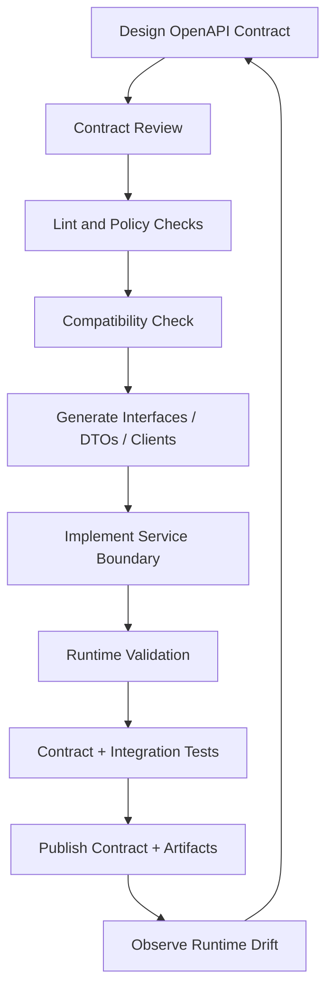
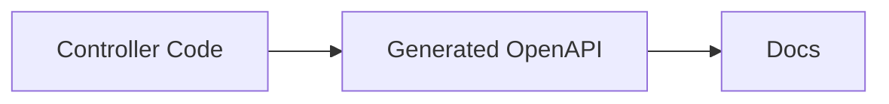
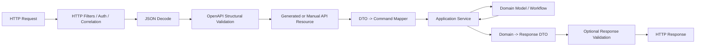
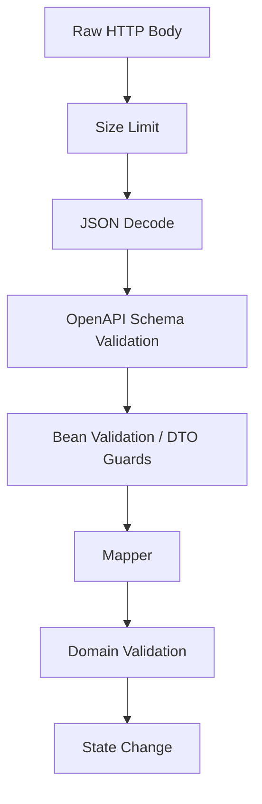
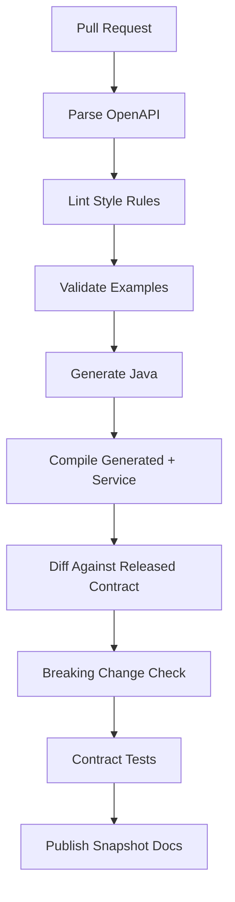
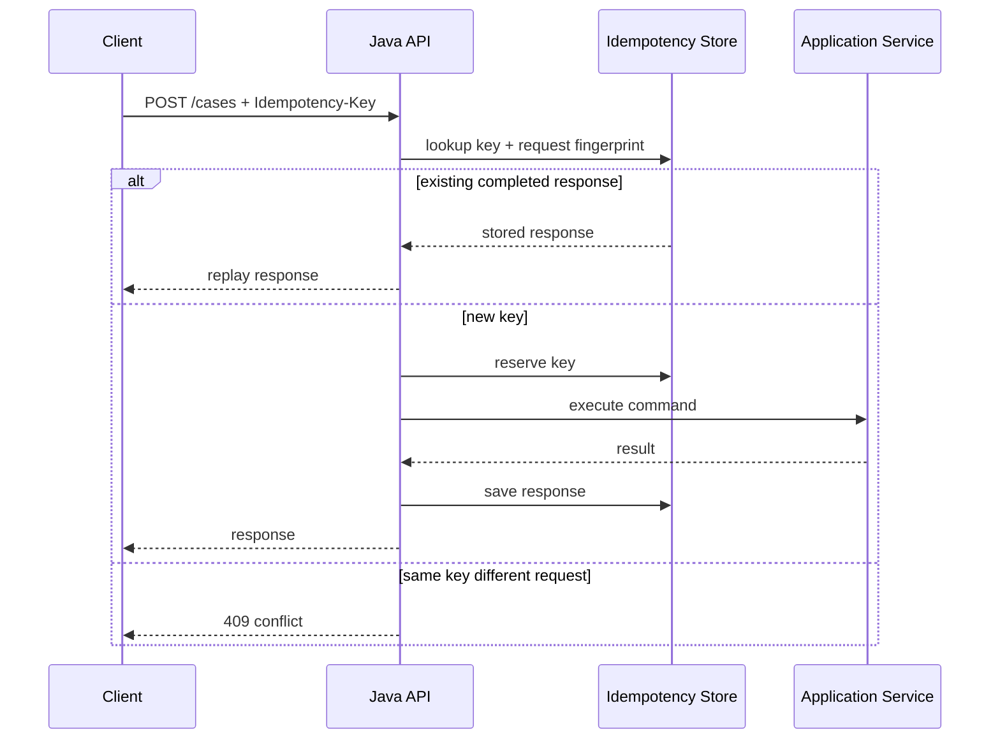
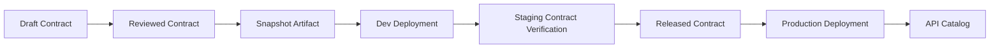

# Part 024 — OpenAPI-First Java API Implementation Workflow

OpenAPI-first does not mean:

```text
Write YAML, generate code, done.
```

That is a shallow process.

OpenAPI-first means the API contract is the first-class design artifact that controls implementation boundaries, validation, generated code, documentation, compatibility checks, and consumer integration.

The implementation must serve the contract.

Not the other way around.

This part shows a production-grade Java workflow.

The goal is not to worship code generation.

The goal is to create a delivery system where contract, implementation, tests, and runtime behavior stay aligned.

---

## 1. The OpenAPI-First Control Loop

A mature API-first workflow has a loop:



This loop is important.

Many teams do only this:



That is code-first documentation.

It can be useful.

But it is not API-first contract engineering.

---

## 2. What OpenAPI-First Should Produce

From one contract, you may produce:

- Java server interfaces;
- Java request/response DTOs;
- Java API clients;
- TypeScript clients;
- mock servers;
- request validators;
- response validators;
- documentation;
- contract tests;
- gateway configuration hints;
- SDK smoke tests;
- breaking-change reports;
- API catalog entries;
- conformance fixtures.

The OpenAPI file is not the final product.

It is the source for a delivery pipeline.

---

## 3. Recommended Repository Layout

For a single service:

```text
case-service/
  pom.xml
  api/
    openapi/
      case-service.openapi.yaml
      components/
        schemas/
        parameters/
        responses/
        examples/
    spectral.yaml
    compatibility-rules.yaml
  service/
    pom.xml
    src/main/java/com/acme/caseapi/
      adapter/http/
      application/
      domain/
      infrastructure/
    src/test/java/
  generated/
    pom.xml
    target/generated-sources/openapi/
  contract-tests/
    pom.xml
    src/test/resources/fixtures/
  docs/
```

For a platform contract repository:

```text
contracts/
  apis/
    case-service/
      v1/openapi.yaml
      v1/examples/
    enforcement-service/
      v1/openapi.yaml
  schemas/
    common/
      money.yaml
      problem-detail.yaml
      paging.yaml
  rules/
    api-style.yaml
    compatibility.yaml
  generators/
    java-server-config.yaml
    java-client-config.yaml
  .github/workflows/
    contract-ci.yaml
```

Key decision:

```text
Do you version and release contracts with service code, or as separate shared artifacts?
```

Both can work.

For small teams, same repo is simpler.

For many teams and external consumers, contract artifact publishing becomes more important.

---

## 4. Contract Source of Truth

There are three common sources of truth:

| Approach | Source of Truth | Strength | Weakness |
|---|---|---|---|
| code-first | Java annotations/controllers | fast for implementation | contract quality depends on code shape |
| spec-first | OpenAPI document | strong design/review boundary | requires discipline/tooling |
| hybrid | OpenAPI for external API, code annotations for internal docs | pragmatic | can drift if poorly governed |

For this series, the preferred production workflow is:

```text
OpenAPI contract is source of truth for external HTTP boundary.
Java domain model is source of truth for business invariants.
Mapping layer connects them deliberately.
```

Do not make generated DTOs your domain model.

Do not make database entities your API contract.

Do not let controller annotations silently redefine your public API.

---

## 5. OpenAPI-First Java Architecture

A clean Java service boundary:



The important separation:

| Layer | Owns |
|---|---|
| OpenAPI | HTTP boundary shape and interaction contract |
| DTO/generated model | serialization-facing data carrier |
| mapper | anti-corruption boundary |
| application service | use-case orchestration |
| domain model | business invariants and state transitions |
| infrastructure | persistence, messaging, remote calls |

If these boundaries collapse, every schema change becomes a domain change, and every domain refactor becomes an API breaking-change risk.

---

## 6. Generated Interfaces vs Generated Models

OpenAPI generators can produce many artifacts.

The most important design choice:

```text
Generate interface only, model only, both, or full server stub?
```

### Generate full server stub

Pros:

- quick bootstrap;
- consistent skeleton;
- useful for greenfield;
- helps new teams follow structure.

Cons:

- generated code may leak into application structure;
- upgrades can be painful;
- customization causes merge pain;
- generated controllers may invite business logic in wrong place.

### Generate interface + models

Pros:

- contract controls method signatures;
- implementation remains handwritten;
- generated code is replaceable;
- good balance for enterprise services.

Cons:

- still depends on generator quality;
- may produce awkward models for complex schemas.

### Generate models only

Pros:

- simple integration;
- controller style remains framework-native.

Cons:

- operation contract can drift from implementation;
- weaker API-first enforcement.

### Generate clients only

Pros:

- strong consumer experience;
- SDKs stay contract-aligned.

Cons:

- provider still needs validation and conformance tests.

Recommended default:

```text
Generate server interfaces + DTOs for provider boundary.
Generate clients for important consumers.
Keep implementation handwritten behind generated interfaces.
```

---

## 7. JAX-RS Style Workflow

A JAX-RS/OpenAPI-first workflow commonly generates an interface like:

```java
@Path("/cases")
public interface CasesApi {

    @POST
    @Consumes(MediaType.APPLICATION_JSON)
    @Produces(MediaType.APPLICATION_JSON)
    Response createCase(CreateCaseRequest request);

    @GET
    @Path("/{caseId}")
    @Produces(MediaType.APPLICATION_JSON)
    Response getCase(@PathParam("caseId") String caseId);
}
```

Then you implement it:

```java
public final class CasesResource implements CasesApi {
    private final CaseApplicationService service;
    private final CaseApiMapper mapper;

    public CasesResource(CaseApplicationService service, CaseApiMapper mapper) {
        this.service = service;
        this.mapper = mapper;
    }

    @Override
    public Response createCase(CreateCaseRequest request) {
        CreateCaseCommand command = mapper.toCommand(request);
        CaseResult result = service.createCase(command);
        CaseResponse response = mapper.toResponse(result);

        return Response.status(Response.Status.CREATED)
            .entity(response)
            .build();
    }

    @Override
    public Response getCase(String caseId) {
        CaseResult result = service.getCase(new CaseId(caseId));
        return Response.ok(mapper.toResponse(result)).build();
    }
}
```

Notice:

- generated interface is boundary;
- resource implementation is thin;
- mapping is explicit;
- domain command is not generated;
- response construction matches OpenAPI status codes.

---

## 8. Spring Style Workflow

In Spring, generation may produce an interface like:

```java
public interface CasesApi {

    ResponseEntity<CaseResponse> createCase(CreateCaseRequest request);

    ResponseEntity<CaseResponse> getCase(String caseId);
}
```

Controller implementation:

```java
@RestController
public final class CasesController implements CasesApi {
    private final CaseApplicationService service;
    private final CaseApiMapper mapper;

    public CasesController(CaseApplicationService service, CaseApiMapper mapper) {
        this.service = service;
        this.mapper = mapper;
    }

    @Override
    public ResponseEntity<CaseResponse> createCase(CreateCaseRequest request) {
        CreateCaseCommand command = mapper.toCommand(request);
        CaseResult result = service.createCase(command);
        return ResponseEntity.status(HttpStatus.CREATED).body(mapper.toResponse(result));
    }

    @Override
    public ResponseEntity<CaseResponse> getCase(String caseId) {
        CaseResult result = service.getCase(new CaseId(caseId));
        return ResponseEntity.ok(mapper.toResponse(result));
    }
}
```

The architectural rules remain the same.

Framework changes the adapter shape.

It should not change the contract-first model.

---

## 9. Maven Build Pipeline

A simplified Maven pipeline:

```xml
<plugin>
  <groupId>org.openapitools</groupId>
  <artifactId>openapi-generator-maven-plugin</artifactId>
  <version>${openapi.generator.version}</version>
  <executions>
    <execution>
      <id>generate-case-api</id>
      <phase>generate-sources</phase>
      <goals>
        <goal>generate</goal>
      </goals>
      <configuration>
        <inputSpec>${project.basedir}/api/openapi/case-service.openapi.yaml</inputSpec>
        <generatorName>jaxrs-spec</generatorName>
        <apiPackage>com.acme.caseapi.generated.api</apiPackage>
        <modelPackage>com.acme.caseapi.generated.model</modelPackage>
        <generateSupportingFiles>false</generateSupportingFiles>
        <configOptions>
          <interfaceOnly>true</interfaceOnly>
          <useTags>true</useTags>
          <dateLibrary>java8</dateLibrary>
        </configOptions>
      </configuration>
    </execution>
  </executions>
</plugin>
```

Do not copy this blindly.

Generator options vary by generator and version.

The principle is stable:

```text
Generation must be deterministic, pinned, reproducible, and CI-enforced.
```

Minimum build rules:

- pin generator version;
- commit contract source;
- do not hand-edit generated code;
- fail build if generated code is stale;
- keep generator config in source control;
- make generated package clearly separate;
- avoid business logic in generated package;
- run generator in CI;
- smoke-test generated clients if published.

---

## 10. Generated Code Boundary

Recommended package structure:

```text
com.acme.caseapi
  adapter.http
    CasesResource.java
    ProblemExceptionMapper.java
    RequestValidationFilter.java
  adapter.http.mapper
    CaseApiMapper.java
  generated.api
    CasesApi.java
  generated.model
    CreateCaseRequest.java
    CaseResponse.java
  application
    CaseApplicationService.java
  domain
    Case.java
    CaseId.java
    CaseStatus.java
```

Rules:

```text
Generated code may depend on framework and serialization libraries.
Domain code must not depend on generated code.
Application services should not expose generated DTOs.
Mappers are the only place that knows both generated DTOs and domain types.
```

This is the contract anti-corruption layer.

---

## 11. Mapping Layer Discipline

Generated DTO:

```java
public class CreateCaseRequest {
    private String subjectId;
    private String allegationType;
    private OffsetDateTime receivedAt;
    private String narrative;
}
```

Domain command:

```java
public record CreateCaseCommand(
    SubjectId subjectId,
    AllegationType allegationType,
    Instant receivedAt,
    Optional<String> narrative
) {}
```

Mapper:

```java
public final class CaseApiMapper {

    public CreateCaseCommand toCommand(CreateCaseRequest request) {
        return new CreateCaseCommand(
            new SubjectId(request.getSubjectId()),
            AllegationType.fromExternalCode(request.getAllegationType()),
            request.getReceivedAt().toInstant(),
            Optional.ofNullable(request.getNarrative())
        );
    }

    public CaseResponse toResponse(CaseResult result) {
        CaseResponse response = new CaseResponse();
        response.setCaseId(result.caseId().value());
        response.setStatus(result.status().externalCode());
        response.setCreatedAt(result.createdAt().atOffset(ZoneOffset.UTC));
        return response;
    }
}
```

The mapper is not boilerplate.

It is where external representation becomes internal meaning.

That is a high-value boundary.

---

## 12. Validation Strategy

Do not rely on one validation mechanism accidentally.

A deliberate validation stack:



Layer responsibilities:

| Layer | Rejects |
|---|---|
| HTTP/gateway | size, media type, auth, rate limit |
| JSON decoder | malformed JSON |
| OpenAPI validator | structural contract violations |
| Bean validation | simple Java object constraints if used |
| mapper | representation conversion failure |
| domain validation | business invariant violations |
| persistence | uniqueness/concurrency constraints |

The user should receive consistent problem responses from all layers.

Otherwise, your API contract says one thing and runtime says another.

---

## 13. Request Validation Placement

Request validation can happen in multiple places:

1. API gateway;
2. service filter/interceptor;
3. controller method argument validation;
4. manual validator call;
5. generated code hook.

Gateway validation is useful but insufficient.

Reasons:

- gateway may support only subset of OpenAPI/JSON Schema;
- internal calls may bypass gateway;
- deployment mismatch can occur;
- gateway error format may differ;
- service still needs protection in tests and local environments.

Recommended model:

```text
Gateway validation = early rejection and traffic protection.
Service validation = source-of-truth boundary enforcement.
```

If both exist, they must be tested for consistency.

---

## 14. Response Validation

Many teams validate requests but not responses.

That catches only consumer mistakes.

It does not catch provider contract violations.

Response validation is valuable for:

- test environments;
- staging;
- canary;
- sampled production;
- critical partner APIs;
- regression detection;
- generated-client safety.

Pattern:

```java
public final class ResponseContractValidator {
    private final OpenApiValidator validator;

    public void validate(String operationId, int status, String mediaType, String body) {
        ValidationResult result = validator.validateResponse(operationId, status, mediaType, body);
        if (!result.isValid()) {
            throw new ProviderContractViolationException(result.errors());
        }
    }
}
```

In production, full response validation may be expensive.

Options:

- validate all responses in tests;
- validate all responses in staging;
- sample responses in production;
- validate only high-risk operations;
- validate before release using golden fixtures.

Provider contract violations are bugs.

Treat them as such.

---

## 15. Error Mapping Must Be Contract-First

OpenAPI defines error responses.

Your Java exception handling must implement them.

Example problem schema:

```yaml
ProblemDetail:
  type: object
  additionalProperties: false
  required: [type, title, status, traceId]
  properties:
    type:
      type: string
    title:
      type: string
    status:
      type: integer
    detail:
      type: string
    traceId:
      type: string
    errors:
      type: array
      items:
        $ref: '#/components/schemas/FieldViolation'
```

JAX-RS exception mapper:

```java
@Provider
public final class ApiExceptionMapper implements ExceptionMapper<Throwable> {

    @Override
    public Response toResponse(Throwable exception) {
        ProblemDetail problem = switch (exception) {
            case ContractValidationException e -> problem(
                "https://errors.acme.com/invalid-request",
                "Invalid request",
                400,
                e.getMessage(),
                e.violations()
            );
            case DomainConflictException e -> problem(
                "https://errors.acme.com/conflict",
                "State conflict",
                409,
                e.getMessage(),
                List.of()
            );
            default -> problem(
                "https://errors.acme.com/internal-error",
                "Internal server error",
                500,
                "Unexpected error",
                List.of()
            );
        };

        return Response.status(problem.getStatus())
            .type("application/problem+json")
            .entity(problem)
            .build();
    }
}
```

The key is not this exact code.

The key is this invariant:

```text
Every documented error response must be produced by a controlled runtime path.
```

---

## 16. Operation IDs Are API Surface

`operationId` is often neglected.

It should not be.

Generated clients often use operation IDs for method names.

Bad:

```yaml
operationId: getUsingGET
```

Better:

```yaml
operationId: getCaseById
```

Rules:

- stable across non-breaking changes;
- unique globally within document;
- action-oriented;
- domain meaningful;
- not tied to Java method names unless deliberately;
- reviewed as public API surface.

Changing operation IDs can break generated clients even if the HTTP path is unchanged.

---

## 17. Tag Strategy

Tags influence generated API grouping and docs navigation.

Bad:

```yaml
tags:
  - controller
```

Better:

```yaml
tags:
  - Cases
```

Or for larger domains:

```yaml
tags:
  - Case Intake
  - Case Decisions
  - Case Evidence
  - Case Escalation
```

Tags should reflect consumer mental model.

Not internal package names.

---

## 18. Contract Review Checklist Before Implementation

Before writing implementation code, review:

```text
1. Are paths resource-oriented and stable?
2. Are operation IDs stable and meaningful?
3. Are request/response schemas separate where needed?
4. Are error responses specified for known failure modes?
5. Are security requirements explicit?
6. Are examples present and valid?
7. Are pagination/idempotency/concurrency headers modeled?
8. Are nullability and optionality intentional?
9. Are polymorphic schemas generator-safe?
10. Does generated Java compile cleanly?
11. Does generated client look usable?
12. Do gateway and service validators support the schema features?
13. Are compatibility rules defined for future changes?
```

Only after this review should implementation begin.

Otherwise, code momentum will make bad contracts expensive to change.

---

## 19. Contract Compatibility in CI

A minimal CI pipeline:



Breaking checks should catch:

- removed path;
- removed operation;
- changed method;
- removed response status;
- removed required response field;
- added required request field;
- narrowed enum request unexpectedly;
- changed field type;
- changed media type;
- changed auth requirement;
- renamed operation ID if clients depend on it;
- incompatible schema composition changes.

Not every diff is breaking.

Not every breaking change is forbidden.

But every breaking change must be deliberate, reviewed, versioned, and communicated.

---

## 20. Provider Contract Tests

Provider tests verify that implementation satisfies OpenAPI.

Test categories:

### Positive request tests

Use valid examples from OpenAPI.

```text
For every operation:
  Given a valid documented request example
  When sent to provider
  Then response status and body match OpenAPI contract
```

### Negative request tests

Use generated invalid payloads:

- missing required field;
- unknown field;
- wrong type;
- invalid enum;
- invalid format;
- too long string;
- too many array items.

Expected result:

- documented 400 response;
- standard error schema;
- useful field violation path.

### Response conformance tests

For each application use case:

- call API;
- capture response;
- validate against OpenAPI response schema.

### Error conformance tests

Trigger:

- not found;
- conflict;
- unauthorized;
- forbidden;
- validation error;
- rate limit if applicable.

Verify documented error response.

---

## 21. Consumer Contract Tests

Consumer tests verify that consumers use the API according to the contract.

For generated clients:

- compile generated client;
- run deserialization tests against examples;
- verify error response parsing;
- verify enum unknown behavior;
- verify date/time mapping;
- verify nullability semantics;
- verify pagination helpers if generated.

For manual consumers:

- mock provider from OpenAPI;
- test consumer against mock;
- ensure consumer sends valid requests;
- ensure consumer handles documented responses.

OpenAPI-first does not eliminate consumer contract testing.

It gives consumers a stronger baseline.

---

## 22. Mock Servers and Stubs

A mock server generated from OpenAPI is useful for:

- frontend development;
- consumer tests;
- partner onboarding;
- contract review;
- early integration;
- demo environments.

But mock servers can lie.

They often do not implement:

- real authorization;
- real state transitions;
- concurrency;
- side effects;
- pagination state;
- idempotency;
- domain validation;
- asynchronous processing.

So classify mocks:

| Mock Type | Purpose |
|---|---|
| static example mock | UI/dev bootstrap |
| schema-validating mock | consumer request validation |
| scenario mock | workflow simulation |
| provider contract test stub | controlled integration test |

Do not confuse static mocks with provider correctness.

---

## 23. Idempotency Implementation Workflow

If OpenAPI declares idempotency, Java must implement it.

Contract:

```yaml
parameters:
  - name: Idempotency-Key
    in: header
    required: true
    schema:
      type: string
      minLength: 16
      maxLength: 128
```

Implementation components:



OpenAPI models the header.

Runtime enforces the behavior.

A contract that documents idempotency but does not implement request fingerprinting is misleading.

---

## 24. Pagination Implementation Workflow

Contract:

```yaml
parameters:
  - name: pageSize
    in: query
    schema:
      type: integer
      minimum: 1
      maximum: 100
  - name: pageToken
    in: query
    schema:
      type: string
```

Response:

```yaml
CaseListResponse:
  type: object
  additionalProperties: false
  required: [items]
  properties:
    items:
      type: array
      items:
        $ref: '#/components/schemas/CaseSummary'
    nextPageToken:
      type:
        - string
        - 'null'
```

Implementation rules:

- enforce max page size;
- make token opaque;
- include stable ordering;
- handle deleted/inserted records;
- do not expose raw database offset for large datasets;
- test empty page;
- test last page;
- test invalid token;
- test authorization filtering.

OpenAPI describes shape.

Application code must preserve pagination invariants.

---

## 25. Security Requirements and Java Enforcement

OpenAPI security scheme:

```yaml
components:
  securitySchemes:
    OAuth2:
      type: oauth2
      flows:
        clientCredentials:
          tokenUrl: https://auth.example.com/oauth/token
          scopes:
            cases:write: Create and update cases
            cases:read: Read cases
```

Operation:

```yaml
security:
  - OAuth2:
      - cases:write
```

Runtime enforcement must map this to:

- authentication filter;
- token validation;
- scope check;
- tenant context;
- object-level authorization;
- audit log;
- error response.

OpenAPI can declare scopes.

It cannot prove object-level authorization.

For regulatory systems:

```text
Scope check is necessary but not sufficient.
```

You still need domain authorization:

```java
authorizationService.assertCanCreateCase(user, subjectId, jurisdiction);
```

---

## 26. Avoiding Drift

Drift happens when:

- implementation accepts fields not in schema;
- schema documents errors not returned by code;
- generated DTOs are stale;
- gateway validates old contract;
- docs publish a different artifact;
- clients are generated from unreleased spec;
- examples no longer match runtime;
- controller annotations override spec behavior;
- manual changes are made to generated code.

Drift prevention:

```text
1. Generate in CI.
2. Fail on stale generated code.
3. Validate examples.
4. Validate runtime responses in tests.
5. Publish contract artifact from CI only.
6. Pin generator version.
7. Attach contract version to service build.
8. Emit contract version in service metadata.
9. Monitor validation failures by operationId and schema version.
```

A service should be able to answer:

```text
Which exact OpenAPI contract version is this deployment serving?
```

---

## 27. Deployment and Contract Promotion

A serious contract lifecycle has environments:



Contract promotion rules:

- draft specs are not used by external consumers;
- snapshot specs can generate test clients;
- released specs are immutable;
- production service declares released contract version;
- compatibility is checked against last released version;
- breaking changes require new version or explicit migration plan.

---

## 28. Versioning Strategy in Java Implementation

Suppose you have `/v1/cases` and need `/v2/cases`.

Do not instantly fork the whole domain.

Recommended layering:

```text
V1 DTO -> V1 Mapper -> Shared Application Command -> Domain
V2 DTO -> V2 Mapper -> Shared Application Command -> Domain
```

Only fork application/domain behavior when semantics truly differ.

Example:

```text
v1 uses allegationType string.
v2 splits allegationType into category + subcategory.
```

Mapping:

```java
CreateCaseCommand fromV1(V1CreateCaseRequest request) {
    return new CreateCaseCommand(
        SubjectId.of(request.getSubjectId()),
        AllegationClassification.fromLegacyCode(request.getAllegationType()),
        request.getReceivedAt().toInstant()
    );
}

CreateCaseCommand fromV2(V2CreateCaseRequest request) {
    return new CreateCaseCommand(
        SubjectId.of(request.getSubjectId()),
        new AllegationClassification(request.getCategory(), request.getSubcategory()),
        request.getReceivedAt().toInstant()
    );
}
```

Version mappers.

Do not duplicate the whole business system unless the business capability diverged.

---

## 29. Handling Generated Client Publishing

If you publish Java clients:

- version client artifact with contract version;
- publish source and binary artifacts;
- document compatible service versions;
- include examples as tests;
- ensure error model is usable;
- avoid leaking generator internals into public API if possible;
- provide retry/idempotency guidance separately;
- test generated client against provider contract tests.

Maven artifact example:

```text
com.acme.contracts:case-service-client-java:1.4.0
com.acme.contracts:case-service-openapi:1.4.0
```

Keep contract artifact separate from implementation artifact.

Consumers should not need your service runtime dependency tree to call your API.

---

## 30. OpenAPI-First Is Not Enough

OpenAPI-first solves only the HTTP boundary.

A production service also needs:

- domain model;
- transaction boundary;
- concurrency control;
- idempotency;
- authorization;
- persistence mapping;
- event publication;
- observability;
- incident handling;
- migration strategy;
- deprecation process.

The contract is the front door.

The building still needs structure.

A weak team says:

```text
The spec validates, so the API is correct.
```

A strong team says:

```text
The spec defines the boundary; now every runtime path must preserve the contract and domain invariants.
```

---

## 31. Production Implementation Checklist

Use this before release:

```text
Contract source
[ ] OpenAPI file is versioned.
[ ] Spec validates under chosen OpenAPI version.
[ ] Lint rules pass.
[ ] Examples validate.
[ ] Breaking-change check passes or has approved exception.

Generation
[ ] Generator version is pinned.
[ ] Generated code is deterministic.
[ ] Generated code compiles in CI.
[ ] Generated package is isolated.
[ ] No generated code is hand-edited.

Implementation
[ ] Resource/controller implements generated interface or verified contract.
[ ] Generated DTOs do not leak into domain.
[ ] Mapping layer is explicit and tested.
[ ] Error mapper returns documented error schemas.
[ ] Security requirements are enforced.
[ ] Idempotency/pagination/concurrency semantics are implemented where documented.

Validation
[ ] Request validation is active.
[ ] Response validation runs in tests/staging.
[ ] Gateway and service validation behavior are compared if both exist.
[ ] Invalid payload fixtures produce documented errors.

Testing
[ ] Provider contract tests pass.
[ ] Consumer/client smoke tests pass.
[ ] Negative fixtures are tested.
[ ] Error scenarios are tested.
[ ] Generated clients parse examples.

Operations
[ ] Service exposes contract version.
[ ] Validation failures are observable by operationId.
[ ] Drift detection exists.
[ ] API catalog is updated from released artifact.
[ ] Deprecation/migration notes are published if needed.
```

---

## 32. Capstone Exercise for This Part

Build a minimal OpenAPI-first Java slice for `Case Intake`.

Contract operations:

```text
POST /cases
GET /cases/{caseId}
GET /cases
```

Required artifacts:

1. `case-service.openapi.yaml`;
2. generated server interface;
3. generated DTOs;
4. handwritten resource/controller;
5. mapper to domain commands;
6. standard problem error mapper;
7. request validation;
8. response validation in tests;
9. valid examples;
10. invalid fixture tests;
11. generated Java client smoke test;
12. CI steps for lint, generate, compile, validate examples, compatibility diff.

Acceptance criteria:

```text
A consumer can generate a client from the OpenAPI contract, call the service, parse success and error responses, and rely on the same examples used by documentation and tests.
```

That is the beginning of real OpenAPI-first engineering.

---

## 33. Key Takeaways

OpenAPI-first is not YAML-first.

It is contract-controlled delivery.

The contract should drive generated boundaries, validation, tests, docs, client artifacts, and compatibility gates.

Java implementation should keep generated code at the adapter edge.

Domain logic should live behind mapping and application services.

Validation should be layered deliberately.

Error handling should implement documented schemas.

CI should detect stale generation, invalid examples, and breaking changes.

The best implementation workflow makes drift difficult and contract conformance normal.

That is the difference between having an OpenAPI file and engineering an API contract.

---

## References

- OpenAPI Specification 3.2.0 — https://spec.openapis.org/oas/v3.2.0.html
- OpenAPI Generator: JAX-RS Spec Generator — https://openapi-generator.tech/docs/generators/jaxrs-spec/
- OpenAPI Generator Documentation — https://openapi-generator.tech/docs/installation
- Jakarta RESTful Web Services — https://jakarta.ee/specifications/restful-ws/
- JSON Schema Draft 2020-12 — https://json-schema.org/draft/2020-12
