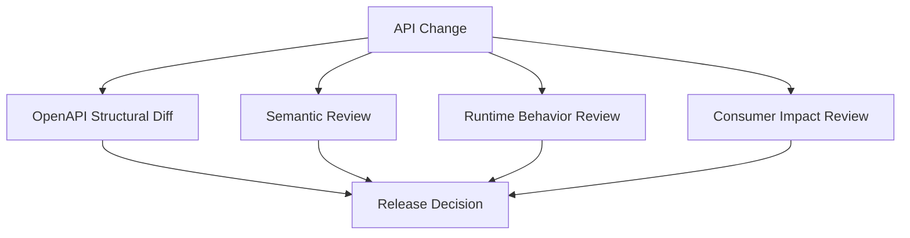
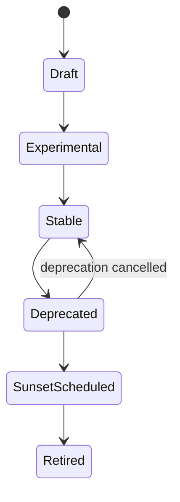
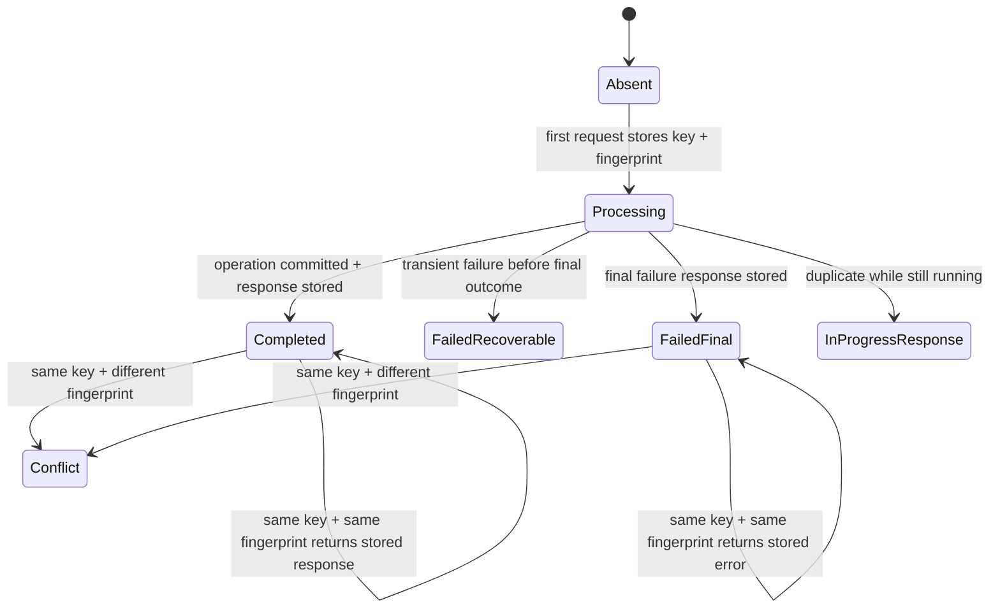
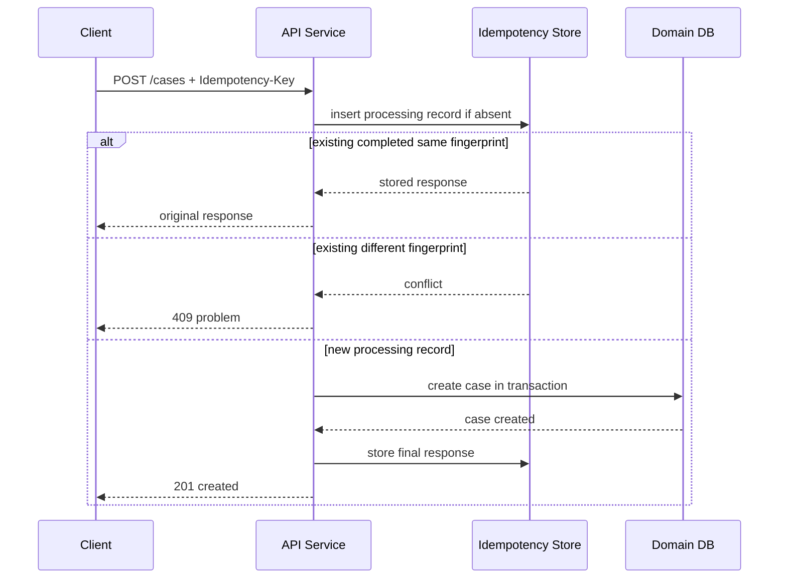

# Part 025 — OpenAPI Versioning, Error Model, Pagination, and Idempotency

A production HTTP API contract is not finished when the request and response body schemas are documented.

That is the easy part.

A serious API contract must answer four harder questions:

1. **How does the API evolve without breaking existing consumers?**
2. **How does the API fail in a way machines can understand?**
3. **How do consumers traverse large datasets safely and consistently?**
4. **How can clients retry side-effecting operations without creating duplicates?**

Those four questions map to four contract surfaces:

| Surface | Contract Concern | Failure When Ignored |
|---|---|---|
| Versioning | Change lifecycle and compatibility | Silent consumer breakage |
| Error model | Machine-readable failure semantics | String parsing, inconsistent handling |
| Pagination | Stable traversal through changing data | Missing, duplicated, or unbounded results |
| Idempotency | Safe retry for side effects | Duplicate orders, duplicate payments, duplicate cases |

This part closes the OpenAPI block by treating those surfaces as first-class contract design.

The theme is simple:

```text
An HTTP API contract describes behavior, not only shape.
```

OpenAPI gives us the vocabulary to describe much of that behavior. But OpenAPI alone will not save a bad design.

You still need discipline.

---

## 1. The Mental Model: API Contract = Protocol Boundary

An HTTP API is a protocol boundary between independently changing systems.

At that boundary, the provider and consumer cannot share assumptions through memory, source code, database schema, or deployment order.

They can only share:

- HTTP method
- URI shape
- headers
- query parameters
- request body
- response body
- status code
- media type
- authentication and authorization expectations
- error semantics
- retry rules
- pagination rules
- lifecycle/deprecation signals

A weak API contract says:

```text
POST /cases creates a case.
```

A strong API contract says:

```text
POST /cases creates a case exactly once per Idempotency-Key and payload fingerprint,
returns 201 on initial creation,
returns the original response for duplicate equivalent requests,
returns 409 if the same key is reused with a different payload,
returns application/problem+json for all structured errors,
and guarantees that created case IDs are globally unique, stable, and safe to use in later GET calls.
```

The difference is not documentation polish.

The difference is operational correctness.

---

## 2. Compatibility Is Not One Thing

Teams often ask:

```text
Is this change backward compatible?
```

That question is too small.

For HTTP APIs, compatibility has several dimensions:

| Compatibility Dimension | Meaning | Example |
|---|---|---|
| Wire compatibility | Existing HTTP clients can parse the response | Add optional JSON field |
| Source compatibility | Generated clients still compile | Changing enum names may break source |
| Behavioral compatibility | Existing client workflows still work | Changing default sort order can break pagination |
| Semantic compatibility | Same field still means the same thing | `status=OPEN` cannot suddenly mean `not archived` |
| Operational compatibility | Existing retry/cache/proxy behavior remains valid | Changing idempotency or cache headers can break clients |
| Security compatibility | Existing auth assumptions remain valid | Tightening scope may break legitimate clients |
| Observability compatibility | Existing logs/metrics/alerts still make sense | Changing error codes breaks dashboards |

A contract review must ask about all of them.

### 2.1 OpenAPI Diff Is Necessary but Not Sufficient

OpenAPI diff tools can detect obvious shape changes:

- removed path
- removed operation
- removed response code
- removed property
- changed schema type
- newly required field
- removed enum value
- changed parameter name

But diff tools cannot fully understand:

- behavior change
- validation strictness change
- authorization policy change
- changed default sort order
- changed idempotency scope
- changed error code taxonomy
- changed pagination consistency guarantee
- changed business meaning of a field

So treat OpenAPI diff as a gate, not as the whole review.



---

## 3. API Versioning: The Real Problem

Versioning is not about choosing `/v1` or an `Accept` header.

Versioning is about controlling change across independent release cycles.

A versioning strategy must answer:

- What changes are allowed without a new major version?
- What changes require a new operation or version?
- How long are old versions supported?
- How are deprecated operations announced?
- How do consumers discover migration instructions?
- How is compatibility checked in CI?
- How is runtime usage of old versions measured?
- How are emergency breaking changes handled?

If those questions are not answered, the version number is cosmetic.

---

## 4. Three Kinds of API Change

Classify every API change into one of three buckets.

### 4.1 Additive Change

An additive change expands the API without invalidating existing consumers.

Examples:

- add a new optional response field
- add a new optional request field
- add a new operation
- add a new response header that clients may ignore
- add a new enum value only if clients are designed for unknown values
- add a new filter parameter with default behavior unchanged

Additive changes are usually safe, but not automatically safe.

Adding an enum value can break generated clients that model enum as a closed Java enum.

Adding a response field can break strict clients that reject unknown fields.

Adding a filter parameter can break caches if caching rules are not correct.

### 4.2 Behavioral Change

A behavioral change keeps the shape but changes meaning.

Examples:

- change default sort order
- change timeout behavior
- change authorization rule
- change validation strictness
- change idempotency scope
- change status transition logic
- change interpretation of `status`
- change default page size
- change whether soft-deleted resources are visible

Behavioral changes are dangerous because OpenAPI diff may not catch them.

### 4.3 Breaking Structural Change

A breaking structural change invalidates existing consumers at the contract level.

Examples:

- remove operation
- remove field from response
- rename field
- change field type
- make optional request field required
- remove enum value
- change response media type
- change success status code in a way clients cannot handle
- change error payload format
- change authentication scheme

Breaking changes need explicit versioning, migration, and deprecation handling.

---

## 5. Safe and Unsafe Change Matrix for OpenAPI HTTP APIs

Use this table as a first-pass review tool.

| Change | Usually Safe? | Why |
|---|---:|---|
| Add optional response field | Yes | Tolerant clients ignore unknown fields |
| Add required response field | Usually yes | Consumers do not send it, but generated model constraints may matter |
| Add optional request field | Yes | Old clients unaffected |
| Add required request field | No | Old clients cannot call operation |
| Remove response field | No | Existing consumers may depend on it |
| Rename field | No | Equivalent to remove + add |
| Change field type | No | Parsing and semantics break |
| Widen numeric range | Maybe | Can overflow clients |
| Narrow numeric range | No | Existing valid requests may fail |
| Add enum value | Maybe | Safe only with unknown-value handling |
| Remove enum value | No | Existing state may become unrepresentable |
| Add operation | Yes | Existing clients unaffected |
| Remove operation | No | Existing clients break |
| Add optional query parameter | Usually yes | Default behavior must remain unchanged |
| Add required query parameter | No | Old clients fail |
| Change default sort | No | Pagination and client assumptions break |
| Add response status code | Maybe | Clients may not handle it |
| Remove documented response code | Maybe/no | Client error handling may depend on it |
| Change auth scope | Maybe/no | Can break legitimate access |
| Add stricter validation | Often no | Previously accepted requests fail |
| Relax validation | Usually yes | But may weaken invariants |

The word “usually” matters.

Production compatibility is empirical. It depends on real consumers, generated clients, validation behavior, and runtime traffic.

---

## 6. Versioning Strategy Options

There is no universal versioning strategy.

But there are bad reasons to choose one.

Do not choose URL versioning only because it is easy.

Do not choose media type versioning only because it feels pure.

Choose based on consumer ergonomics, gateway support, observability, caching, generated clients, and release governance.

### 6.1 URI Versioning

Example:

```http
GET /v1/cases/{caseId}
GET /v2/cases/{caseId}
```

Advantages:

- easy to see in logs
- easy to route in gateways
- easy to document
- easy for generated clients
- easy for external consumers

Disadvantages:

- can encourage duplicating the whole API
- coarse-grained
- URI represents version rather than only resource identity
- migrations may require endpoint proliferation

Use URI versioning when:

- API is public or partner-facing
- gateway routing needs simplicity
- client diversity is high
- observability and support need obvious version segmentation

### 6.2 Media Type Versioning

Example:

```http
Accept: application/vnd.company.case.v2+json
Content-Type: application/vnd.company.case.v2+json
```

Advantages:

- keeps resource URI stable
- version is tied to representation
- can support multiple representations on same resource

Disadvantages:

- harder for casual consumers
- harder for gateways if not configured well
- harder to test manually
- generated tooling support varies

Use media type versioning when representation versions matter independently from resource identity and clients are mature enough to manage headers correctly.

### 6.3 Header-Based Versioning

Example:

```http
X-API-Version: 2026-07-01
```

Advantages:

- simple to add
- keeps URI stable
- can support date-based compatibility windows

Disadvantages:

- non-standard conventions vary
- less visible than URI
- cache behavior must be carefully configured
- easy to forget in clients

### 6.4 Operation-Level Versioning

Example:

```http
POST /cases
POST /case-submissions
```

Instead of `/v2/cases`, you introduce a new operation representing a new capability.

This is often better when the new behavior is not merely a new version of the old behavior.

Example:

```text
Old operation: POST /cases
Meaning: Create a case directly.

New operation: POST /case-submissions
Meaning: Submit intake package for eligibility screening and possible case creation.
```

That is not v2.

That is a different workflow.

### 6.5 Capability-Based Evolution

Sometimes a new field is not enough. A client needs to know whether a server supports a capability.

Patterns:

- documented feature flags
- capability endpoint
- response metadata
- links/actions in response
- profile media type

Example:

```json
{
  "caseId": "CASE-2026-000123",
  "status": "UNDER_REVIEW",
  "availableActions": [
    "SUBMIT_EVIDENCE",
    "REQUEST_EXTENSION"
  ]
}
```

This avoids clients hardcoding workflow assumptions.

---

## 7. Recommended Practical Strategy

For most enterprise HTTP APIs, use this strategy:

```text
Major breaking changes: URI major version or new operation.
Minor additive changes: same version, compatibility-gated.
Representation-specific variants: media type or profile only when needed.
Deprecation: explicit lifecycle headers + documentation + telemetry.
Consumer migration: expand-migrate-contract, not big-bang cutover.
```

This is not theoretically pure.

It is operationally workable.

### 7.1 Version Only What Needs Versioning

Do not create `/v2` of the whole API because one operation changed.

Prefer:

```text
/v1/cases/{caseId}
/v1/case-submissions
```

instead of:

```text
/v1/*
/v2/*
```

unless the entire API model changed.

### 7.2 Avoid Versioning Internal Domain Concepts Through Public APIs

Bad:

```http
GET /v2/regulatory-case-aggregate-roots/{id}
```

Better:

```http
GET /cases/{caseId}
```

A public API should expose stable consumer language, not internal implementation language.

---

## 8. Version Lifecycle Model

A production API version needs lifecycle states.



| State | Meaning | Consumer Expectation |
|---|---|---|
| Draft | Not committed | Do not integrate except sandbox |
| Experimental | Available but may change | Limited consumers, explicit agreement |
| Stable | Supported | Compatibility guarantees apply |
| Deprecated | Still works, migration advised | Consumers should migrate |
| Sunset scheduled | Retirement date known | Consumers must migrate before date |
| Retired | Removed or blocked | No normal usage allowed |

### 8.1 OpenAPI Extension for Lifecycle

OpenAPI has a built-in `deprecated: true` flag for operations, parameters, and schema properties. But production governance often needs more metadata.

Use vendor extensions for lifecycle policy.

```yaml
paths:
  /v1/legacy-cases/{caseId}:
    get:
      operationId: getLegacyCase
      deprecated: true
      x-lifecycle:
        state: deprecated
        deprecatedSince: "2026-03-01"
        sunsetAt: "2026-12-31T23:59:59Z"
        replacementOperationId: getCase
        migrationGuide: "https://developer.example.com/migrations/legacy-cases"
```

The extension should feed:

- documentation portal
- runtime warnings
- API gateway policy
- consumer notification
- deprecation dashboards
- CI checks

### 8.2 Runtime Deprecation Signals

At runtime, responses can communicate deprecation and sunset information through HTTP headers.

Example:

```http
Deprecation: @1775001600
Sunset: Thu, 31 Dec 2026 23:59:59 GMT
Link: <https://developer.example.com/migrations/legacy-cases>; rel="deprecation"; type="text/html"
```

Design note:

- `Deprecation` tells the consumer the resource is or will be deprecated.
- `Sunset` tells the consumer when the resource is expected to become unavailable.
- `Link` gives migration information.

Do not rely on documentation only. Runtime headers make real usage visible and actionable.

---

## 9. Error Model: Do Not Return Random JSON

A weak API returns errors like this:

```json
{
  "error": "Invalid request"
}
```

This is not a contract.

It is a string.

A production error model must support:

- machine-readable type
- stable error code
- human-readable summary
- field-level validation details
- correlation ID
- retryability
- business rule classification
- authorization failure semantics
- idempotency conflict semantics
- localization strategy if needed
- safe logging and redaction

### 9.1 Use Problem Details as the Base Envelope

RFC 9457 defines Problem Details for HTTP APIs and obsoletes RFC 7807. The media type is commonly:

```http
Content-Type: application/problem+json
```

Base fields:

| Field | Meaning |
|---|---|
| `type` | URI identifying the problem type |
| `title` | Short human-readable summary |
| `status` | HTTP status code |
| `detail` | Human-readable detail for this occurrence |
| `instance` | URI/reference for this occurrence |

Extend it carefully.

Example:

```json
{
  "type": "https://api.example.com/problems/validation-failed",
  "title": "Validation failed",
  "status": 400,
  "detail": "The request body contains invalid fields.",
  "instance": "urn:trace:01J1Z9V1Q3HQF5R9GJ8E7ZK7B2",
  "errorCode": "CASE_REQUEST_INVALID",
  "correlationId": "01J1Z9V1Q3HQF5R9GJ8E7ZK7B2",
  "retryable": false,
  "violations": [
    {
      "path": "/applicant/dateOfBirth",
      "code": "DATE_IN_FUTURE",
      "message": "dateOfBirth must not be in the future"
    }
  ]
}
```

### 9.2 HTTP Status Code Is Not Enough

`400` tells the client the request is bad.

It does not tell the client what to do.

Use layers:

```text
HTTP status: broad protocol outcome
Problem type: stable class of problem
Error code: stable product/domain code
Violation code: field-level validation reason
```

Example:

| HTTP Status | Problem Type | Error Code | Meaning |
|---:|---|---|---|
| 400 | validation-failed | CASE_REQUEST_INVALID | Body failed validation |
| 401 | authentication-required | AUTH_REQUIRED | Missing/invalid authentication |
| 403 | access-denied | CASE_ACCESS_DENIED | Authenticated but not allowed |
| 404 | resource-not-found | CASE_NOT_FOUND | Case does not exist or is hidden |
| 409 | state-conflict | CASE_STATE_CONFLICT | Operation conflicts with current state |
| 409 | idempotency-conflict | IDEMPOTENCY_KEY_REUSED | Key reused with different payload |
| 412 | precondition-failed | ETAG_MISMATCH | Optimistic concurrency check failed |
| 422 | semantic-validation-failed | CASE_RULE_VIOLATION | Structurally valid but semantically invalid |
| 429 | rate-limited | RATE_LIMITED | Client exceeded rate limit |
| 500 | internal-error | INTERNAL_ERROR | Unexpected provider failure |
| 503 | temporarily-unavailable | SERVICE_UNAVAILABLE | Retry later may work |

### 9.3 Keep Error Codes Stable

Error codes become part of the API contract.

Once consumers automate behavior based on an error code, changing it is a breaking change.

Bad:

```text
INVALID_CASE_REQUEST
BAD_CASE_REQUEST
CASE_INVALID
CASE_REQUEST_INVALID_V2
```

Better:

```text
CASE_REQUEST_INVALID
CASE_STATE_CONFLICT
CASE_NOT_FOUND
CASE_ACCESS_DENIED
```

Do not encode mutable message wording into error codes.

### 9.4 Separate Validation Errors from Business Rule Errors

A validation error means the request does not satisfy the contract shape or simple field rules.

A business rule error means the request is structurally valid but cannot be accepted under current domain state.

Example:

```text
Validation error:
- dateOfBirth is not a valid date
- amount has more than 2 decimal places
- required field missing

Business rule error:
- case cannot be closed while evidence review is pending
- applicant is not eligible for expedited review
- enforcement action requires supervisor approval
```

OpenAPI/JSON Schema can catch the first category.

Domain services catch the second category.

Do not pretend JSON Schema can encode all business semantics.

### 9.5 Error Payload OpenAPI Component

```yaml
components:
  schemas:
    Problem:
      type: object
      required:
        - type
        - title
        - status
        - errorCode
        - correlationId
      properties:
        type:
          type: string
          format: uri
          example: "https://api.example.com/problems/validation-failed"
        title:
          type: string
          example: "Validation failed"
        status:
          type: integer
          minimum: 100
          maximum: 599
          example: 400
        detail:
          type: string
        instance:
          type: string
        errorCode:
          type: string
          pattern: "^[A-Z0-9_]+$"
          example: "CASE_REQUEST_INVALID"
        correlationId:
          type: string
          example: "01J1Z9V1Q3HQF5R9GJ8E7ZK7B2"
        retryable:
          type: boolean
          default: false
        violations:
          type: array
          items:
            $ref: "#/components/schemas/Violation"

    Violation:
      type: object
      required:
        - path
        - code
        - message
      properties:
        path:
          type: string
          description: JSON Pointer to the invalid field.
          example: "/applicant/dateOfBirth"
        code:
          type: string
          example: "DATE_IN_FUTURE"
        message:
          type: string
          example: "dateOfBirth must not be in the future"
```

### 9.6 Common Error Responses as Reusable Components

```yaml
components:
  responses:
    BadRequest:
      description: Request is invalid.
      content:
        application/problem+json:
          schema:
            $ref: "#/components/schemas/Problem"

    Unauthorized:
      description: Authentication is required or invalid.
      content:
        application/problem+json:
          schema:
            $ref: "#/components/schemas/Problem"

    Forbidden:
      description: Caller is authenticated but not authorized for the operation.
      content:
        application/problem+json:
          schema:
            $ref: "#/components/schemas/Problem"

    Conflict:
      description: Request conflicts with current resource state.
      content:
        application/problem+json:
          schema:
            $ref: "#/components/schemas/Problem"
```

Then reference them:

```yaml
paths:
  /cases/{caseId}/close:
    post:
      operationId: closeCase
      responses:
        "200":
          description: Case closed.
        "400":
          $ref: "#/components/responses/BadRequest"
        "401":
          $ref: "#/components/responses/Unauthorized"
        "403":
          $ref: "#/components/responses/Forbidden"
        "404":
          $ref: "#/components/responses/NotFound"
        "409":
          $ref: "#/components/responses/Conflict"
```

---

## 10. Pagination: A Contract for Traversal, Not a UI Convenience

Pagination is not just about reducing payload size.

Pagination is a consistency contract for traversing a dataset that may change while the client is reading it.

A bad pagination design causes:

- missing records
- duplicate records
- unstable pages
- unbounded queries
- expensive count operations
- inconsistent client caches
- broken backfills
- operational load spikes

### 10.1 The Four Pagination Styles

| Style | Example | Best For | Main Risk |
|---|---|---|---|
| Offset/limit | `?offset=100&limit=50` | Small, stable datasets | Missing/duplicates under mutation; expensive deep offset |
| Page/size | `?page=3&size=50` | Human UI pages | Same as offset; page number illusion |
| Cursor | `?pageToken=abc` | APIs and changing datasets | Token design complexity |
| Keyset/seek | `?afterId=CASE-123&limit=50` | Ordered datasets | Needs stable sort key |

### 10.2 Offset Pagination

Example:

```http
GET /cases?offset=100&limit=50
```

This is easy to understand.

It is also often wrong for large or changing datasets.

Problem:

```text
Client reads offset=0 limit=50.
A new row is inserted at the front.
Client reads offset=50 limit=50.
One record is skipped or duplicated depending on sort order.
```

Offset pagination can be acceptable when:

- dataset is small
- data is mostly static
- query is for UI browsing, not reliable export
- exact consistency is not required

Do not use offset pagination for regulatory exports, financial reconciliation, event backfills, or audit-grade traversal.

### 10.3 Page Number Pagination

Example:

```http
GET /cases?page=3&pageSize=50
```

Page number pagination is offset pagination with friendlier syntax.

It is useful for user interfaces.

It is weak for machine integration.

Do not expose page number pagination as the primary integration mechanism for large mutable resources.

### 10.4 Cursor Pagination

Example:

```http
GET /cases?pageSize=50
GET /cases?pageSize=50&pageToken=eyJzb3J0S2V5Ijoi..."
```

The server returns a token that captures the next traversal position.

Example response:

```json
{
  "items": [
    {
      "caseId": "CASE-2026-000123",
      "status": "UNDER_REVIEW"
    }
  ],
  "nextPageToken": "eyJzb3J0S2V5IjoiMjAyNi0wNy0wM1QwODowMDowMFo6Q0FTRS0yMDI2LTAwMDEyMyJ9"
}
```

Cursor pagination is better for APIs because the server owns traversal semantics.

### 10.5 Keyset Pagination

Example:

```http
GET /cases?createdAfter=2026-07-01T00:00:00Z&afterCaseId=CASE-2026-000123&limit=50
```

Keyset pagination uses stable ordered keys.

Typical sort key:

```text
(createdAt ASC, caseId ASC)
```

The next page starts after the last item from the previous page.

This avoids deep offset scans and is stable if the sort key is immutable.

---

## 11. Pagination Invariants

A production pagination contract must state its invariants.

Example invariants:

```text
1. Results are ordered by createdAt ascending, then caseId ascending.
2. createdAt and caseId are immutable after creation.
3. nextPageToken is opaque to clients.
4. nextPageToken expires after 24 hours.
5. pageSize must be between 1 and 200.
6. If no next page exists, nextPageToken is omitted or null.
7. The server may return fewer items than requested.
8. The server never returns more items than requested.
9. The client must not parse or modify pageToken.
10. The same pageToken with same filters returns the same traversal position, subject to token expiry.
```

This is more useful than merely saying:

```text
The endpoint supports pagination.
```

### 11.1 Cursor Token Must Be Opaque

Bad:

```http
GET /cases?next=createdAt:2026-07-03T08:00:00Z,caseId:CASE-123
```

Better:

```http
GET /cases?pageToken=eyJ2IjoxLCJzb3J0Ijpb...]
```

The client must not depend on token internals.

The server may encode:

- version
- sort key
- filter hash
- tenant ID
- expiry time
- direction
- signature

### 11.2 Token Should Bind to Filter Context

A token created for one query must not be reusable for a different query.

Bad:

```text
GET /cases?status=OPEN -> token T
GET /cases?status=CLOSED&pageToken=T -> accepted
```

Better:

```text
Token contains hash of original filters.
Server rejects token if filters differ.
```

Return:

```json
{
  "type": "https://api.example.com/problems/invalid-page-token",
  "title": "Invalid page token",
  "status": 400,
  "errorCode": "PAGE_TOKEN_INVALID",
  "detail": "The page token does not match the supplied query parameters."
}
```

### 11.3 OpenAPI Component for Cursor Pagination

```yaml
components:
  parameters:
    PageSize:
      name: pageSize
      in: query
      required: false
      schema:
        type: integer
        minimum: 1
        maximum: 200
        default: 50
      description: Maximum number of items to return. The server may return fewer.

    PageToken:
      name: pageToken
      in: query
      required: false
      schema:
        type: string
        minLength: 1
      description: Opaque token returned by the previous response. Clients must not parse it.

  schemas:
    CaseListResponse:
      type: object
      required:
        - items
      properties:
        items:
          type: array
          items:
            $ref: "#/components/schemas/CaseSummary"
        nextPageToken:
          type:
            - string
            - "null"
          description: Opaque token for the next page. Null or absent means no next page.
```

### 11.4 Avoid Total Count by Default

Consumers often ask for:

```json
{
  "total": 9876543,
  "items": []
}
```

Total counts can be expensive and misleading in mutable datasets.

Use one of these strategies:

| Strategy | Meaning |
|---|---|
| No total | Default for integration APIs |
| Approximate total | Useful for UI hints, clearly marked approximate |
| Snapshot total | Only if traversal snapshot is defined |
| Separate count endpoint | Explicitly expensive operation |

Do not add `total` casually.

It becomes a performance and consistency promise.

---

## 12. Idempotency: Safe Retry for Side Effects

HTTP method semantics help, but they are not enough.

`GET` should be safe.

`PUT` and `DELETE` are generally idempotent by method semantics.

`POST` is not inherently idempotent.

But many critical operations are `POST`:

- create payment
- submit order
- create regulatory case
- upload evidence package
- trigger workflow transition
- submit enforcement decision

Clients need to retry when networks fail.

Without idempotency, retry can duplicate side effects.

### 12.1 Idempotency Is Not Deduplication After the Fact

Weak design:

```text
If duplicate case appears, merge it manually later.
```

Strong design:

```text
The API prevents duplicate side effects at the boundary.
```

### 12.2 Idempotency-Key Contract

A common pattern is an `Idempotency-Key` request header for side-effecting operations.

Example:

```http
POST /cases
Idempotency-Key: "01J1Z9XM6C2BA7Z7CR1NXJ9E6R"
Content-Type: application/json

{
  "applicantId": "APP-123",
  "caseType": "BENEFIT_REVIEW"
}
```

Contract behavior:

| Scenario | Response |
|---|---|
| First request with key and payload | Execute operation; store result |
| Retry with same key and same payload | Return original result |
| Same key with different payload | Return conflict |
| Same key while original request still processing | Return processing/in-progress or wait, depending policy |
| Key expired | Treat according to documented retention policy |

### 12.3 Idempotency Scope

The key is not globally meaningful by itself.

Define scope explicitly.

Common scope:

```text
tenantId + authenticated clientId + operationId + idempotencyKey
```

Optionally include:

- user ID
- resource type
- region
- environment

Do not let client A collide with client B by using the same key.

### 12.4 Payload Fingerprint

The server should bind the key to a fingerprint of the effective request.

Fingerprint input should include:

- canonical request body
- operation ID
- relevant query parameters
- relevant headers
- authenticated principal/client identity

Do not include volatile headers like trace ID.

Pseudo-code:

```java
record IdempotencyScope(
    String tenantId,
    String clientId,
    String operationId,
    String idempotencyKey
) {}

record IdempotencyRecord(
    IdempotencyScope scope,
    String requestFingerprint,
    int responseStatus,
    String responseBody,
    Instant createdAt,
    Instant expiresAt,
    IdempotencyState state
) {}
```

### 12.5 State Machine



The hard case is timeout after side effect but before response.

The idempotency store must represent operation outcome, not merely request arrival.

### 12.6 OpenAPI Header Component

```yaml
components:
  parameters:
    IdempotencyKey:
      name: Idempotency-Key
      in: header
      required: true
      schema:
        type: string
        minLength: 1
        maxLength: 255
      description: >
        Client-generated opaque key used to make retries safe for this operation.
        The key is scoped to the authenticated client, tenant, and operation.
        Reusing the same key with a different effective request returns 409.
```

Use it only on operations where the server implements the behavior.

Do not document `Idempotency-Key` unless it is actually enforced.

### 12.7 Idempotent Create Operation

```yaml
paths:
  /cases:
    post:
      operationId: createCase
      summary: Create a case
      parameters:
        - $ref: "#/components/parameters/IdempotencyKey"
      requestBody:
        required: true
        content:
          application/json:
            schema:
              $ref: "#/components/schemas/CreateCaseRequest"
      responses:
        "201":
          description: Case created.
          headers:
            Location:
              schema:
                type: string
              description: URI of the created case.
          content:
            application/json:
              schema:
                $ref: "#/components/schemas/Case"
        "200":
          description: Duplicate equivalent request; original result returned.
          content:
            application/json:
              schema:
                $ref: "#/components/schemas/Case"
        "409":
          description: Idempotency key conflict or domain state conflict.
          content:
            application/problem+json:
              schema:
                $ref: "#/components/schemas/Problem"
```

### 12.8 Idempotency and Database Transactions

A reliable implementation usually needs the idempotency record and domain mutation coordinated.

Simplified flow:



Implementation choices:

| Approach | Pros | Cons |
|---|---|---|
| Same database transaction | Strong consistency | Coupled to domain DB |
| Dedicated idempotency store + outbox | Scalable | More complex recovery |
| Gateway-level cache only | Easy | Unsafe for domain side effects unless integrated |
| Redis only | Fast | Requires careful durability and failover semantics |

For high-value operations, do not rely only on volatile cache.

### 12.9 Idempotency Retention

The contract must define how long keys are remembered.

Example:

```text
Idempotency keys are retained for 24 hours after the first request.
After expiration, a reused key may be treated as a new request.
```

Retention is a product and risk decision.

Longer retention reduces duplicate risk but increases storage and privacy concerns.

Shorter retention reduces storage but weakens retry safety.

---

## 13. Optimistic Concurrency Is a Different Contract

Do not confuse idempotency with optimistic concurrency.

| Mechanism | Solves | Example |
|---|---|---|
| Idempotency-Key | Duplicate retries | Retry `POST /cases` safely |
| ETag / If-Match | Lost updates | Update only if resource version matches |
| Business unique key | Natural duplicate prevention | One active case per applicant/type |

For update operations, use preconditions.

Example:

```http
GET /cases/CASE-123
ETag: "case-version-17"

PATCH /cases/CASE-123
If-Match: "case-version-17"
```

If the resource changed:

```http
HTTP/1.1 412 Precondition Failed
Content-Type: application/problem+json
```

```json
{
  "type": "https://api.example.com/problems/precondition-failed",
  "title": "Resource version mismatch",
  "status": 412,
  "errorCode": "CASE_VERSION_MISMATCH",
  "retryable": false
}
```

---

## 14. Java Boundary Implementation Pattern

A clean Java implementation separates concerns:

```text
HTTP adapter
  -> generated OpenAPI DTO
  -> request validator
  -> idempotency guard
  -> application command
  -> domain service
  -> response mapper
  -> Problem mapper
```

### 14.1 Idempotency Guard Sketch

```java
public final class IdempotencyGuard {
    private final IdempotencyRepository repository;
    private final RequestFingerprinter fingerprinter;

    public <T> HttpResponse<T> execute(
            IdempotencyContext context,
            Object effectiveRequest,
            Supplier<HttpResponse<T>> operation
    ) {
        String fingerprint = fingerprinter.fingerprint(context, effectiveRequest);

        IdempotencyDecision decision = repository.tryBegin(context.scope(), fingerprint);

        return switch (decision.kind()) {
            case RETURN_STORED -> decision.storedResponse().toHttpResponse();
            case CONFLICT -> throw new ProblemException(
                    Problems.idempotencyConflict(context.idempotencyKey())
            );
            case IN_PROGRESS -> throw new ProblemException(
                    Problems.idempotencyInProgress(context.idempotencyKey())
            );
            case EXECUTE -> {
                try {
                    HttpResponse<T> response = operation.get();
                    repository.complete(context.scope(), fingerprint, StoredResponse.from(response));
                    yield response;
                } catch (RuntimeException ex) {
                    repository.completeWithFinalErrorIfAppropriate(context.scope(), fingerprint, ex);
                    throw ex;
                }
            }
        };
    }
}
```

The exact code depends on your framework.

The invariant does not:

```text
The domain side effect and stored idempotency outcome must not diverge silently.
```

### 14.2 Problem Mapper Sketch

```java
public final class ProblemMapper {
    public Problem toProblem(Throwable throwable, TraceContext trace) {
        if (throwable instanceof ValidationException ex) {
            return Problem.validationFailed(trace.correlationId(), ex.violations());
        }
        if (throwable instanceof AccessDeniedException) {
            return Problem.accessDenied(trace.correlationId());
        }
        if (throwable instanceof StateConflictException ex) {
            return Problem.stateConflict(trace.correlationId(), ex.code(), ex.message());
        }
        return Problem.internalError(trace.correlationId());
    }
}
```

Do not leak stack traces, SQL errors, internal table names, or authorization internals into external problem details.

---

## 15. Contract Tests for Versioning, Errors, Pagination, and Idempotency

Shape tests are not enough.

Add behavior tests.

### 15.1 Error Contract Tests

Test that every failure path returns:

- correct HTTP status
- `application/problem+json`
- stable `type`
- stable `errorCode`
- `correlationId`
- safe `detail`
- field-level `violations` when applicable

### 15.2 Pagination Contract Tests

Test:

- default page size
- max page size
- invalid page token
- expired page token
- token reused with different filters
- stable ordering
- no duplicate across pages under controlled inserts

### 15.3 Idempotency Contract Tests

Test:

- first request executes
- duplicate equivalent request returns stored result
- same key with different payload returns 409
- missing key returns 400 if key is required
- duplicate while processing returns documented response
- expired key behavior matches documentation

### 15.4 Versioning Contract Tests

Test:

- deprecated operations still behave as documented
- lifecycle metadata is present
- old generated clients still pass compatibility suite
- new optional fields do not break old consumers
- operation IDs remain stable unless intentionally changed

---

## 16. OpenAPI Governance Rules

Use policy-as-code for these rules:

```text
1. Every operation must have operationId.
2. Every operation must document 4xx and 5xx problem responses.
3. Every side-effecting POST must declare whether Idempotency-Key is required, optional, or unsupported.
4. Every paginated list operation must use shared pagination parameters.
5. Every paginated response must state ordering invariants.
6. Every deprecated operation must include replacement and sunset metadata.
7. Every enum exposed to external clients must define unknown-value strategy.
8. Every error response must use application/problem+json.
9. Every breaking change must have migration plan.
10. Every operation must define authorization scope.
```

The goal is not bureaucracy.

The goal is to make failure modes visible before they reach production.

---

## 17. Production Anti-Patterns

### Anti-Pattern 1: Error String as API Contract

```json
{
  "message": "Oops something went wrong"
}
```

This forces consumers to parse text.

### Anti-Pattern 2: Page Number for Integration Backfills

```http
GET /cases?page=9312
```

This is fragile and often expensive.

### Anti-Pattern 3: Documented Idempotency Without Enforcement

Putting `Idempotency-Key` in OpenAPI without implementation is worse than omitting it.

It creates false safety.

### Anti-Pattern 4: Breaking Change Hidden as Bug Fix

```text
We fixed validation, now old requests fail.
```

Maybe it was a bug fix.

It is still a breaking change for consumers.

### Anti-Pattern 5: Global `/v2` for One Changed Operation

This multiplies maintenance cost and confuses consumers.

### Anti-Pattern 6: Enum as Permanent Closed Set

If external clients generate Java enums, adding enum values can break them unless unknown handling is designed.

---

## 18. Review Checklist

Before approving an OpenAPI change, ask:

```text
Versioning
[ ] Is this change additive, behavioral, or breaking?
[ ] Has OpenAPI diff been run?
[ ] Has semantic compatibility been reviewed?
[ ] Does this require new operation/version?
[ ] Is lifecycle metadata updated?
[ ] Are deprecated operations measured at runtime?

Error Model
[ ] Are all errors application/problem+json?
[ ] Are error codes stable and documented?
[ ] Are validation violations machine-readable?
[ ] Are internal details redacted?
[ ] Are retryable errors explicitly marked?

Pagination
[ ] Is ordering stable and documented?
[ ] Is page token opaque?
[ ] Is page size bounded?
[ ] Are token expiry and invalid token behavior documented?
[ ] Is total count avoided or clearly defined?

Idempotency
[ ] Is Idempotency-Key required for side-effecting POST?
[ ] Is scope defined?
[ ] Is payload fingerprint defined?
[ ] Is duplicate behavior documented?
[ ] Is conflict behavior documented?
[ ] Is retention period documented?
[ ] Is implementation durable enough for business risk?
```

---

## 19. Capstone Exercise

Design an OpenAPI contract for:

```text
POST /case-submissions
```

Requirements:

1. Must be retry-safe.
2. Must return Problem Details errors.
3. Must support duplicate retry with same response.
4. Must reject same idempotency key with different payload.
5. Must support later retrieval by `submissionId`.
6. Must document lifecycle and authorization scope.
7. Must include correlation ID.
8. Must use generated Java DTOs only at boundary.

Then implement contract tests for:

- validation failure
- semantic business failure
- duplicate equivalent idempotency key
- reused key with different payload
- unauthorized request
- forbidden request
- internal error redaction

The exercise is successful when a client can retry safely without knowing the provider's internal transaction model.

---

## 20. Final Mental Model

Versioning, errors, pagination, and idempotency are often treated as API “details”.

They are not details.

They are the parts of the contract that decide whether the API survives real production usage.

A strong API contract does not merely say:

```text
Here is the JSON shape.
```

It says:

```text
Here is how this boundary changes, fails, traverses data, and handles retries.
```

That is the difference between an API specification and an engineering contract.

---

## References

- OpenAPI Specification 3.2.0 — https://spec.openapis.org/oas/v3.2.0.html
- RFC 9457, Problem Details for HTTP APIs — https://www.rfc-editor.org/rfc/rfc9457.html
- RFC 9110, HTTP Semantics — https://www.rfc-editor.org/rfc/rfc9110.html
- RFC 8594, The Sunset HTTP Header Field — https://www.rfc-editor.org/rfc/rfc8594.html
- RFC 9745, The Deprecation HTTP Response Header Field — https://www.rfc-editor.org/rfc/rfc9745.html
- IETF draft, Idempotency-Key HTTP Header Field — https://datatracker.ietf.org/doc/draft-ietf-httpapi-idempotency-key-header/
- JSON:API Cursor Pagination Profile — https://jsonapi.org/profiles/ethanresnick/cursor-pagination/
