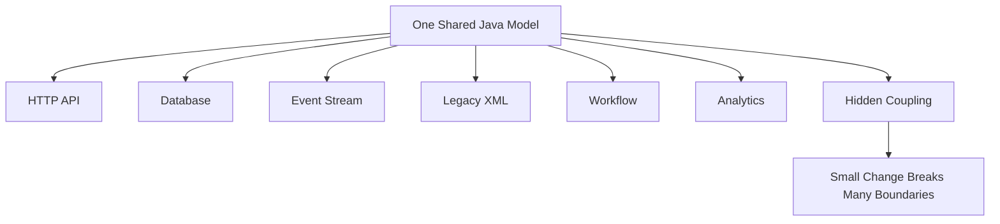
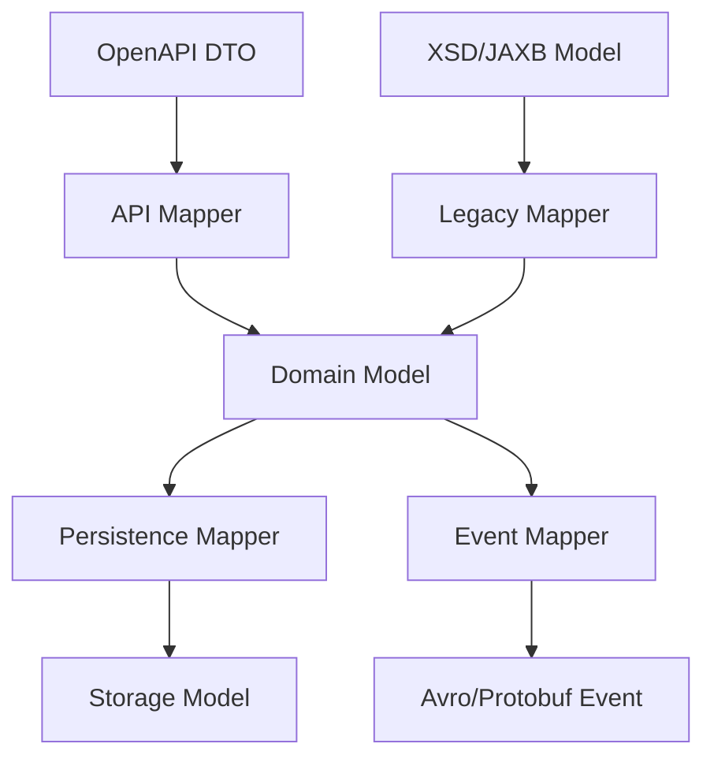
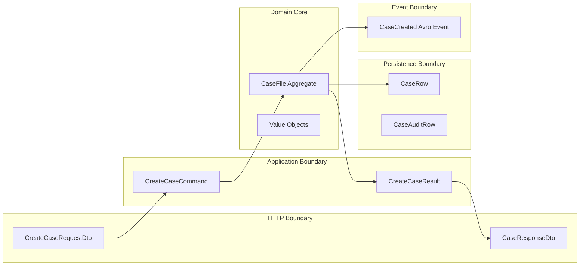
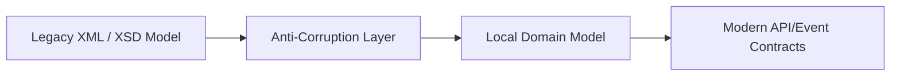
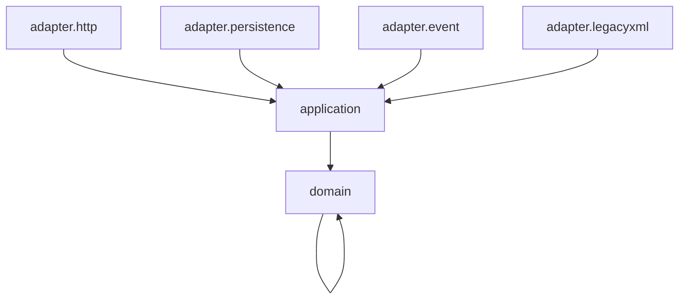

# Part 026 — Canonical Model vs Transport Model vs Storage Model

One of the fastest ways to damage a system is to use one model everywhere.

It starts innocently:

```text
We already have a Case class. Let us reuse it for API, database, events, and workflow.
```

Then the class grows.

It gets JSON annotations.

Then JPA annotations.

Then Avro defaults.

Then Protobuf compatibility hacks.

Then UI-only fields.

Then database-only fields.

Then workflow-only fields.

Then a field that is required by one API but optional in another.

Then a field that must never be exposed externally but is accidentally serialized.

Now the model is not a model.

It is a junk drawer.

This part explains how to separate:

- canonical model
- transport model
- storage model
- domain model
- event model
- integration model
- generated contract model
- read model
- command model

The point is not architectural ceremony.

The point is to keep invariants clear.

---

## 1. The Core Problem

Different boundaries need different truths.

A database row cares about persistence.

An API response cares about consumer representation.

A domain aggregate cares about behavior and invariants.

An event cares about historical fact.

A workflow variable cares about process execution.

A generated OpenAPI DTO cares about wire compatibility.

An Avro schema cares about reader/writer schema resolution.

A Protobuf message cares about field numbers and binary compatibility.

An XSD contract cares about XML namespace, element structure, and validation.

Trying to force all of those into one Java class creates hidden coupling.



A production-grade system instead makes model boundaries explicit.



The mapping cost is real.

The coupling cost of not mapping is larger.

---

## 2. Definitions That Actually Help

### 2.1 Domain Model

The domain model represents business concepts and invariants.

It should answer:

```text
What is true in the business?
What operations are allowed?
What state transitions are valid?
What must never happen?
```

Example:

```java
public final class CaseFile {
    private final CaseId id;
    private CaseStatus status;
    private final ApplicantId applicantId;
    private final List<EvidenceItem> evidenceItems;

    public void close(Decision decision, OfficerId officerId, Instant now) {
        if (status != CaseStatus.UNDER_REVIEW) {
            throw new CaseStateConflict("Only cases under review can be closed");
        }
        if (evidenceItems.isEmpty()) {
            throw new CaseRuleViolation("Case cannot be closed without evidence");
        }
        this.status = CaseStatus.CLOSED;
        // record domain event internally
    }
}
```

Notice what is absent:

- no JSON annotation
- no JPA annotation
- no Avro annotation
- no OpenAPI annotation
- no database column name
- no transport-specific null hacks

The domain model should not know how it is serialized.

### 2.2 Transport Model

The transport model is the shape exposed at a communication boundary.

Examples:

- OpenAPI request DTO
- OpenAPI response DTO
- XSD/JAXB generated class
- Protobuf message
- GraphQL input/output type
- JSON Schema-validated payload

It should answer:

```text
What can cross this boundary?
What is required on the wire?
What can clients ignore?
What is compatibility-safe?
```

Example OpenAPI DTO generated from contract:

```java
public class CreateCaseRequestDto {
    private String applicantId;
    private String caseType;
    private String priority;
    private String externalReference;

    // generated getters/setters omitted
}
```

This object is not your domain aggregate.

It is a boundary object.

### 2.3 Storage Model

The storage model represents persistence shape.

It should answer:

```text
How is data stored, indexed, joined, partitioned, queried, and migrated?
```

Example:

```java
public record CaseRow(
    UUID id,
    String caseNumber,
    String applicantId,
    String statusCode,
    String priorityCode,
    Instant createdAt,
    Instant updatedAt,
    long version
) {}
```

Storage model concerns:

- primary key
- foreign key
- version column
- index-friendly shape
- normalized vs denormalized columns
- enum code storage
- audit columns
- soft-delete marker
- migration compatibility

The storage model should not leak directly into external contracts.

### 2.4 Event Model

An event model represents a historical fact that other systems may consume.

It should answer:

```text
What happened?
When did it happen?
Who/what caused it?
What minimum data is needed by consumers?
How can this fact be replayed later?
```

Example:

```json
{
  "eventId": "01J1ZB9NN7C0ZTY4Y4XHYJMAQJ",
  "eventType": "CaseCreated",
  "occurredAt": "2026-07-03T08:15:30Z",
  "caseId": "CASE-2026-000123",
  "applicantId": "APP-123",
  "caseType": "BENEFIT_REVIEW"
}
```

An event is not a database row.

An event is not always the whole aggregate.

An event is a contract with time.

### 2.5 Canonical Model

“Canonical model” is the most abused term in integration architecture.

It can mean two very different things.

#### Useful Meaning

A canonical model is a stable shared vocabulary for a bounded integration context.

Example:

```text
Within the enforcement platform, CaseId, PartyId, EvidenceId, DecisionId, and Money are represented consistently across contracts.
```

This is useful.

#### Dangerous Meaning

A canonical model is one enterprise-wide object model that every system must use.

Example:

```text
Every system must send and store the canonical EnterpriseCase object with 350 fields.
```

This usually fails.

Why?

Because every boundary has different semantics, lifecycle, ownership, and volatility.

A giant canonical object becomes the shared database of integration.

---

## 3. Model Types in a Production System

A serious Java system may have many model types.

| Model Type | Purpose | Owner | Should Be Generated? |
|---|---|---|---|
| Domain aggregate | Enforce business invariants | Domain/application team | No |
| Command object | Internal use case input | Application layer | Usually no |
| Query/read model | Efficient read response | Application/read side | Maybe |
| OpenAPI request DTO | HTTP boundary input | API contract | Often yes |
| OpenAPI response DTO | HTTP boundary output | API contract | Often yes |
| JSON Schema payload | Flexible JSON validation boundary | Contract/platform | Maybe |
| Avro event | Stream contract | Event producer with consumer governance | Yes |
| Protobuf message | RPC/binary contract | Service contract | Yes |
| XSD/JAXB class | XML integration boundary | XML contract | Yes |
| Persistence row/entity | Database storage | Service owner | Sometimes |
| Analytics model | BI/lake consumption | Data platform | Maybe |
| Workflow variable DTO | BPM/workflow execution | Process owner | Maybe |

The top 1% skill is not memorizing these names.

The skill is knowing which invariants belong where.

---

## 4. Why One Model Fails

### 4.1 Different Optionality

OpenAPI create request:

```text
applicantId required
caseType required
priority optional
```

OpenAPI response:

```text
caseId required
status required
createdAt required
assignedOfficer optional
```

Database row:

```text
id required
version required
created_by required
created_at required
updated_at required
```

Domain aggregate:

```text
status cannot be null
caseNumber must exist after creation
assignedOfficer may be absent depending on status
```

Avro event:

```text
new fields require defaults for compatibility
```

Protobuf message:

```text
field presence and default values behave differently depending on syntax/edition
```

There is no single optionality rule that fits all boundaries.

### 4.2 Different Versioning Rules

OpenAPI compatibility says:

```text
Do not remove response fields if consumers may depend on them.
```

Avro compatibility says:

```text
Reader/writer schema resolution decides whether old/new consumers can read old/new data.
```

Protobuf compatibility says:

```text
Field numbers are the durable identity. Do not reuse removed field numbers.
```

Database migration says:

```text
Expand, backfill, dual-read/write, contract.
```

A single Java class cannot encode all versioning semantics safely.

### 4.3 Different Security Requirements

Storage model may contain:

```text
internal notes
risk score
fraud signal
supervisor comments
PII fields
```

External response should expose only:

```text
caseId
status
public timeline
allowed actions
```

If you serialize storage/domain objects directly, data leakage is one annotation mistake away.

### 4.4 Different Performance Requirements

Domain aggregate may load full state.

List API response needs only summary fields.

Analytics pipeline wants denormalized facts.

Workflow engine wants minimal variables.

Database storage wants normalized/indexed shape.

One model either underfetches, overfetches, or leaks.

### 4.5 Different Ownership

A database table is owned by a service.

A public API is owned by provider and consumers.

An event is owned by producer but constrained by consumers.

An analytics model may be owned by data platform.

A workflow variable may be owned by process team.

One class cannot represent multiple ownership boundaries without turning every change into a negotiation.

---

## 5. The Correct Rule: Models Are Boundary-Specific

Use this invariant:

```text
A model should be optimized for the boundary it belongs to.
```

Then connect models through explicit mapping.



This looks like more code.

It is also more control.

---

## 6. Canonical Model: Use Carefully

The phrase “canonical model” is attractive because it promises consistency.

But consistency has levels.

### 6.1 Good Canonicalization: Value Types

Canonicalize stable primitives and value objects.

Examples:

| Concept | Canonical Decision |
|---|---|
| Timestamp | UTC instant string in ISO-8601 format at API boundary |
| Money | amount as decimal string + ISO 4217 currency |
| Identifier | stable opaque ID, not database sequence exposed blindly |
| Country | ISO country code if business supports it |
| Language | BCP 47 language tag if needed |
| Decimal precision | explicitly bounded by domain |
| Case status | controlled vocabulary with unknown-value strategy |

Example Java value object:

```java
public record Money(BigDecimal amount, Currency currency) {
    public Money {
        Objects.requireNonNull(amount, "amount");
        Objects.requireNonNull(currency, "currency");
        if (amount.scale() > 2) {
            throw new IllegalArgumentException("Money scale must be <= 2");
        }
    }
}
```

Canonical value types reduce ambiguity.

### 6.2 Good Canonicalization: Shared Vocabulary

A bounded context can define shared language:

```text
Case
Party
Evidence
Decision
Violation
EnforcementAction
Appeal
```

But each boundary still gets its own representation.

```text
Case domain aggregate != Case API response != CaseCreated event != case table row
```

### 6.3 Bad Canonicalization: One Giant Enterprise Object

Bad:

```json
{
  "enterpriseCase": {
    "caseId": "...",
    "legacyCaseId": "...",
    "caseType": "...",
    "appealInfo": {},
    "paymentInfo": {},
    "workflowInfo": {},
    "analyticsInfo": {},
    "uiInfo": {},
    "migrationInfo": {},
    "deprecatedField1": "...",
    "deprecatedField2": "..."
  }
}
```

This object becomes:

- too large to understand
- too stable to improve
- too generic to validate strongly
- too sensitive to expose safely
- too coupled to change independently

Do not confuse shared vocabulary with shared payload.

---

## 7. Transport Model Design

A transport model should be designed for the consumer use case.

### 7.1 Request Models Should Match Commands, Not Tables

Bad request:

```json
{
  "id": null,
  "status": "NEW",
  "version": 0,
  "createdAt": null,
  "updatedAt": null,
  "createdBy": null,
  "applicantId": "APP-123",
  "caseType": "BENEFIT_REVIEW"
}
```

This exposes storage lifecycle fields.

Better:

```json
{
  "applicantId": "APP-123",
  "caseType": "BENEFIT_REVIEW",
  "externalReference": "PORTAL-REQ-987"
}
```

The server owns:

- ID generation
- initial status
- audit fields
- version
- timestamps

### 7.2 Response Models Should Match Consumer Decisions

A list endpoint should not return the full aggregate.

Bad:

```http
GET /cases
```

Returns 200 fields per case.

Better:

```json
{
  "items": [
    {
      "caseId": "CASE-2026-000123",
      "caseType": "BENEFIT_REVIEW",
      "status": "UNDER_REVIEW",
      "createdAt": "2026-07-03T08:15:30Z",
      "availableActions": ["SUBMIT_EVIDENCE"]
    }
  ],
  "nextPageToken": "..."
}
```

This model serves the list use case.

Detailed data belongs to:

```http
GET /cases/{caseId}
```

### 7.3 Transport Models Need Stability

Once external consumers depend on a field, it becomes expensive to remove.

Therefore:

- expose fewer fields
- name fields carefully
- avoid internal implementation terms
- define enum evolution strategy
- avoid returning fields “just in case”
- avoid exposing database IDs unless intentionally stable

---

## 8. Storage Model Design

Storage models are optimized for persistence and queries.

### 8.1 Database Row Is Not the Domain

A database row may be an implementation detail.

Example:

```sql
CREATE TABLE regulatory_case (
    id UUID PRIMARY KEY,
    case_number TEXT NOT NULL UNIQUE,
    applicant_id TEXT NOT NULL,
    case_type_code TEXT NOT NULL,
    status_code TEXT NOT NULL,
    priority_code TEXT NOT NULL,
    created_at TIMESTAMPTZ NOT NULL,
    updated_at TIMESTAMPTZ NOT NULL,
    version BIGINT NOT NULL,
    deleted_at TIMESTAMPTZ NULL
);
```

This schema includes persistence concerns:

- primary key
- unique constraint
- code columns
- timestamps
- optimistic lock version
- soft delete

The API should not have to mirror this.

### 8.2 Storage Model Can Be More Normalized Than Domain

Domain object:

```text
CaseFile contains applicant snapshot and evidence items.
```

Storage may split:

```text
regulatory_case
case_party
case_evidence
case_status_history
case_audit_log
```

The domain aggregate can be reconstructed from multiple rows.

### 8.3 Storage Model Can Be More Denormalized Than Domain

For read performance, you may store:

```text
case_search_projection
case_dashboard_projection
case_timeline_projection
```

These are read models, not domain truth.

---

## 9. Event Model Design

Events should not blindly serialize domain aggregates.

### 9.1 Event as Fact

Good event name:

```text
CaseCreated
EvidenceSubmitted
CaseAssigned
DecisionIssued
CaseClosed
```

Weak event name:

```text
CaseUpdated
```

`CaseUpdated` hides meaning.

Consumers cannot know what changed without diffing payloads.

### 9.2 Event Payload Should Be Sufficient, Not Maximal

Bad:

```text
Publish entire Case aggregate on every change.
```

This increases coupling and data leakage.

Better:

```json
{
  "eventId": "01J1Z...",
  "eventType": "EvidenceSubmitted",
  "occurredAt": "2026-07-03T08:45:00Z",
  "caseId": "CASE-2026-000123",
  "evidenceId": "EVD-456",
  "submittedBy": "PARTY-789",
  "channel": "PORTAL"
}
```

### 9.3 Event Schema Is a Long-Term Contract

Events may be replayed years later.

Therefore event schemas need:

- stable event type
- stable field names
- compatibility discipline
- default values for Avro additions
- reserved field numbers for Protobuf removals
- PII classification
- retention policy
- replay semantics

---

## 10. Command Model vs Request DTO

A request DTO is external.

A command object is internal.

They may look similar, but they are not the same.

Example request DTO:

```java
public class CreateCaseRequestDto {
    public String applicantId;
    public String caseType;
    public String priority;
    public String externalReference;
}
```

Internal command:

```java
public record CreateCaseCommand(
    ApplicantId applicantId,
    CaseType caseType,
    Priority priority,
    Optional<ExternalReference> externalReference,
    OfficerId requestedBy,
    TenantId tenantId,
    Instant receivedAt
) {}
```

The command includes trusted context that should not come from the client body:

- authenticated actor
- tenant
- received time
- authorization scope
- request correlation ID

Never trust the client to send fields the server must derive.

---

## 11. Mapping as an Architectural Boundary

Mapping is not boilerplate.

Mapping is where you enforce boundary translation.

### 11.1 API Request to Command

```java
public final class CaseApiMapper {
    public CreateCaseCommand toCommand(
            CreateCaseRequestDto dto,
            RequestContext context
    ) {
        return new CreateCaseCommand(
            ApplicantId.parse(dto.getApplicantId()),
            CaseType.parse(dto.getCaseType()),
            dto.getPriority() == null
                ? Priority.NORMAL
                : Priority.parse(dto.getPriority()),
            Optional.ofNullable(dto.getExternalReference()).map(ExternalReference::new),
            context.actorId(),
            context.tenantId(),
            context.receivedAt()
        );
    }
}
```

Boundary rules belong here:

- string to value object
- default assignment
- trusted context injection
- request field normalization
- rejection of unsupported combinations

### 11.2 Domain to Response DTO

```java
public CaseResponseDto toResponse(CaseFile caseFile, ActionPolicy actions) {
    CaseResponseDto dto = new CaseResponseDto();
    dto.setCaseId(caseFile.id().value());
    dto.setStatus(caseFile.status().externalCode());
    dto.setCaseType(caseFile.caseType().externalCode());
    dto.setCreatedAt(caseFile.createdAt().toString());
    dto.setAvailableActions(actions.availableActionsFor(caseFile));
    return dto;
}
```

Do not expose every domain field.

Expose the representation the consumer needs.

### 11.3 Domain to Event

```java
public CaseCreatedEvent toEvent(CaseFile caseFile, DomainEventMetadata metadata) {
    return CaseCreatedEvent.newBuilder()
        .setEventId(metadata.eventId().value())
        .setOccurredAt(metadata.occurredAt())
        .setCaseId(caseFile.id().value())
        .setApplicantId(caseFile.applicantId().value())
        .setCaseType(caseFile.caseType().externalCode())
        .build();
}
```

Event mapping should be deliberate.

Do not publish internal object graphs accidentally.

### 11.4 Storage Row to Domain

```java
public CaseFile toDomain(CaseRow row, List<EvidenceRow> evidenceRows) {
    return CaseFile.rehydrate(
        new CaseId(row.caseNumber()),
        new ApplicantId(row.applicantId()),
        CaseType.fromCode(row.caseTypeCode()),
        CaseStatus.fromCode(row.statusCode()),
        evidenceRows.stream().map(this::toEvidenceItem).toList(),
        row.version()
    );
}
```

Rehydration should rebuild domain invariants.

If the database contains invalid data, fail loudly or route to repair workflow.

---

## 12. Anti-Corruption Layer

An anti-corruption layer protects your domain from external models.

It translates foreign language into local language.

Example:

```text
Legacy XML says: <ComplaintCategory>99</ComplaintCategory>
Local domain says: CaseType.OTHER_REGULATORY_COMPLAINT
```

Do not spread legacy codes throughout your domain.

Centralize translation.



### 12.1 ACL Responsibilities

- translate names
- translate codes
- normalize dates
- validate missing legacy fields
- map old status values to current workflow states
- preserve raw payload for audit if needed
- quarantine untranslatable records
- emit structured errors

### 12.2 ACL Should Not Become Dumping Ground

Bad ACL:

```text
10,000-line mapper with every integration rule in one class.
```

Better ACL structure:

```text
legacy-case-adapter/
  xsd-generated/
  mapper/
    LegacyCaseMapper.java
    LegacyPartyMapper.java
    LegacyEvidenceMapper.java
  code/
    LegacyStatusTranslator.java
    LegacyCategoryTranslator.java
  validation/
    LegacyCaseSemanticValidator.java
  quarantine/
    LegacyPayloadQuarantineService.java
```

---

## 13. Package Structure in Java

A clean Java module layout makes boundaries visible.

```text
case-service/
  src/main/java/com/example/caseapp/
    domain/
      CaseFile.java
      CaseStatus.java
      CaseType.java
      EvidenceItem.java
      value/
        CaseId.java
        ApplicantId.java
    application/
      command/
        CreateCaseCommand.java
        CloseCaseCommand.java
      service/
        CaseApplicationService.java
      port/
        CaseRepository.java
        CaseEventPublisher.java
    adapter/
      http/
        generated/          # OpenAPI generated DTO/interfaces
        mapper/
          CaseApiMapper.java
        resource/
          CaseResource.java
        error/
          ProblemMapper.java
      persistence/
        row/
          CaseRow.java
          EvidenceRow.java
        mapper/
          CasePersistenceMapper.java
        repository/
          JdbcCaseRepository.java
      event/
        avro/               # Avro generated classes
        mapper/
          CaseEventMapper.java
        publisher/
          KafkaCaseEventPublisher.java
      legacyxml/
        generated/          # JAXB generated classes
        mapper/
          LegacyCaseMapper.java
```

Dependencies should point inward:



Domain must not depend on adapters.

---

## 14. Generated Models: Keep Them at the Edge

Generated models are useful.

They are also dangerous if allowed into the core.

Generated code may change because:

- generator version changed
- schema changed
- naming option changed
- validation option changed
- runtime dependency changed
- nullable handling changed
- enum representation changed

Therefore:

```text
Generated models live at the boundary.
Domain models live in the core.
Mapping connects them.
```

### 14.1 Bad Dependency

```text
Domain service accepts CreateCaseRequestDto.
```

Now your domain depends on OpenAPI.

### 14.2 Good Dependency

```text
HTTP adapter accepts CreateCaseRequestDto.
HTTP mapper converts it to CreateCaseCommand.
Application service accepts CreateCaseCommand.
```

This keeps OpenAPI changes away from domain code.

---

## 15. Canonical Type Library

A good compromise is a canonical type library, not a canonical object model.

Example module:

```text
contract-types/
  Money.schema.json
  Money.avsc
  money.proto
  common-openapi.yaml
  java/
    Money.java
    ExternalReference.java
    CorrelationId.java
```

Use it for stable low-level concepts:

- money
- timestamp
- correlation ID
- tenant ID
- pagination metadata
- problem details
- audit metadata

Do not use it for giant domain aggregates.

### 15.1 Contract Type Example: Money

OpenAPI:

```yaml
Money:
  type: object
  required:
    - amount
    - currency
  properties:
    amount:
      type: string
      pattern: "^-?\\d+\\.\\d{2}$"
      example: "123.45"
    currency:
      type: string
      minLength: 3
      maxLength: 3
      example: "USD"
```

Avro:

```json
{
  "type": "record",
  "name": "Money",
  "namespace": "com.example.contract.common",
  "fields": [
    { "name": "amount", "type": { "type": "bytes", "logicalType": "decimal", "precision": 18, "scale": 2 } },
    { "name": "currency", "type": "string" }
  ]
}
```

Protobuf:

```proto
message Money {
  string amount = 1;
  string currency = 2;
}
```

The representation differs by format, but the semantic contract is shared.

---

## 16. Case Study: Regulatory Case Management

Suppose the platform supports:

- external case intake API
- internal case workflow
- Kafka events
- PostgreSQL storage
- legacy XML import
- reporting lake

The same business concept appears in several models.

### 16.1 OpenAPI Create Request

```json
{
  "applicantId": "APP-123",
  "caseType": "BENEFIT_REVIEW",
  "externalReference": "PORTAL-REQ-987"
}
```

Purpose:

```text
Consumer asks the platform to create a case.
```

### 16.2 Domain Aggregate

```text
CaseFile
- id
- applicantId
- caseType
- status
- evidenceItems
- assignedOfficer
- decision
- state transition methods
```

Purpose:

```text
Enforce lifecycle invariants.
```

### 16.3 Storage Rows

```text
regulatory_case
case_evidence
case_assignment
case_decision
case_audit_log
```

Purpose:

```text
Persist and query data efficiently.
```

### 16.4 Avro Event

```text
CaseCreated
- eventId
- occurredAt
- caseId
- applicantId
- caseType
- sourceChannel
```

Purpose:

```text
Notify downstream systems of a historical fact.
```

### 16.5 Legacy XML Model

```xml
<LegacyComplaint>
  <ComplaintNo>LC-7788</ComplaintNo>
  <Category>99</Category>
  <ReceivedDate>03/07/2026</ReceivedDate>
</LegacyComplaint>
```

Purpose:

```text
Import old-system data into modern domain language.
```

### 16.6 Reporting Model

```text
case_daily_snapshot
- snapshot_date
- case_id
- status
- age_days
- region
- assigned_team
```

Purpose:

```text
Support dashboard and regulatory reporting.
```

Trying to make all of these one class is a category error.

---

## 17. Mapping Failure Modes

Mapping creates a place to catch failure.

Common failure modes:

| Failure | Example | Handling |
|---|---|---|
| Unknown code | Legacy category `99X` | Quarantine or map to `UNKNOWN` with warning |
| Invalid date | `31/02/2026` | Reject payload with structured validation error |
| Precision loss | BigDecimal to double | Never use double for money |
| Missing required field | no applicant ID | Reject at boundary |
| Unsupported enum | new external status | Preserve raw value, map to unknown, alert |
| Timezone ambiguity | local date-time without zone | Require explicit zone or map by source policy |
| ID collision | external reference not unique | Scope by source system/tenant |
| PII leakage | internal notes in response | Response mapper must whitelist fields |

Mapping is not just transformation.

Mapping is controlled semantic translation.

---

## 18. Testing Model Boundaries

Test each mapper as a contract boundary.

### 18.1 API Mapper Tests

```text
[ ] Required request fields become value objects.
[ ] Defaults are assigned consistently.
[ ] Client cannot override server-owned fields.
[ ] Unknown enum values are handled according to policy.
[ ] Invalid values produce structured errors.
```

### 18.2 Persistence Mapper Tests

```text
[ ] Row rehydrates valid aggregate.
[ ] Invalid persisted status is detected.
[ ] Version is preserved.
[ ] Soft-deleted rows are filtered by repository policy.
[ ] Decimal/time values round-trip safely.
```

### 18.3 Event Mapper Tests

```text
[ ] Event contains stable identifiers.
[ ] Event does not expose internal-only fields.
[ ] Event time is source-of-truth occurrence time.
[ ] Event schema defaults are respected.
[ ] Generated event passes schema validation.
```

### 18.4 Legacy Mapper Tests

```text
[ ] Known legacy codes translate correctly.
[ ] Unknown codes are quarantined or mapped safely.
[ ] Date formats are parsed by source-specific rule.
[ ] Raw payload reference is preserved for audit.
[ ] Mapping errors are observable.
```

---

## 19. Model Boundary Decision Framework

When introducing a new model, ask:

```text
1. Who owns this model?
2. Who consumes it?
3. Is it internal or external?
4. What compatibility rules apply?
5. Is it generated or handwritten?
6. What invariant does it enforce?
7. What invariant does it intentionally not enforce?
8. Can it contain sensitive data?
9. How long must it remain readable?
10. What happens if a field is removed, renamed, or retyped?
```

If two models have different answers, they should probably be separate.

---

## 20. Practical Heuristics

### Heuristic 1: Generated Models Do Not Enter the Domain

Generated DTOs stay in adapters.

### Heuristic 2: Database Rows Do Not Leave the Service

Never return database entities directly from API controllers.

### Heuristic 3: Events Are Facts, Not CRUD Snapshots by Default

Name events by business occurrence.

### Heuristic 4: Canonicalize Value Types, Not Whole Enterprise Objects

Shared `Money` is good.

Shared `EnterpriseCaseWithEverything` is dangerous.

### Heuristic 5: Mapping Is Where You Pay for Decoupling

Do not remove mapping just because it feels repetitive.

### Heuristic 6: Whitelist External Responses

Never serialize internal objects and hope annotations hide sensitive fields.

### Heuristic 7: Keep Storage Migration Independent from API Evolution

Database schema can change without forcing API contract change.

API contract can evolve without forcing immediate database shape change.

### Heuristic 8: Preserve Raw External Payloads When Audit Matters

For regulatory-grade imports, keep raw payload reference/hash so mapping decisions are defensible.

---

## 21. Production Checklist

```text
Model Inventory
[ ] Domain models are handwritten and annotation-light.
[ ] Generated contract models stay at boundaries.
[ ] Storage models are not exposed externally.
[ ] Event models are explicit and versioned.
[ ] Legacy models are isolated behind ACL.

Mapping
[ ] Request-to-command mapping injects trusted context.
[ ] Domain-to-response mapping whitelists fields.
[ ] Domain-to-event mapping avoids internal leakage.
[ ] Storage-to-domain mapping revalidates invariants.
[ ] Mapping failures are observable and testable.

Canonicalization
[ ] Shared value types are standardized.
[ ] Giant enterprise canonical object is avoided.
[ ] Controlled vocabularies have ownership.
[ ] Unknown-value strategy is defined.

Security
[ ] PII fields are classified.
[ ] Sensitive internal fields cannot accidentally serialize.
[ ] Audit data is separated from public response data.
[ ] Raw legacy payload retention follows policy.

Evolution
[ ] API model can evolve independently from DB schema.
[ ] Event schema compatibility is checked.
[ ] Protobuf field numbers are stable.
[ ] Avro defaults and aliases are reviewed.
[ ] Mapping tests cover old and new contract versions.
```

---

## 22. Exercise

Take a domain concept:

```text
EnforcementAction
```

Design separate models for:

1. `CreateEnforcementActionRequest` OpenAPI DTO
2. `EnforcementAction` domain aggregate/entity
3. `enforcement_action` PostgreSQL row
4. `EnforcementActionCreated` Avro event
5. `EnforcementActionMessage` Protobuf RPC message
6. legacy XSD import model
7. dashboard read model

For each model, write:

```text
Purpose:
Owner:
Consumers:
Required fields:
Optional fields:
Forbidden fields:
Versioning rules:
Security classification:
Mapping rules:
Failure modes:
```

Then answer:

```text
Which fields are shared by all models?
Which fields exist only in storage?
Which fields exist only in API response?
Which fields exist only in event history?
Which fields must never cross the external boundary?
```

This exercise forces the central insight:

```text
A concept can be shared without sharing one physical model.
```

---

## 23. Final Mental Model

Do not ask:

```text
Can we reuse the same Java class?
```

Ask:

```text
Do these boundaries have the same owner, lifecycle, compatibility rule, security policy, and invariant set?
```

If the answer is no, separate the models.

Use mapping deliberately.

A top-tier data contract engineer is not someone who avoids DTOs.

A top-tier data contract engineer knows which representation belongs to which boundary, which invariants live there, and how to evolve each one without corrupting the others.

That is the essence of contract engineering across XSD, JSON Schema, Avro, Protobuf, OpenAPI, Java, and storage.

---

## References

- OpenAPI Specification 3.2.0 — https://spec.openapis.org/oas/v3.2.0.html
- Apache Avro 1.12.0 Specification — https://avro.apache.org/docs/1.12.0/specification/
- Protocol Buffers Language Guide — https://protobuf.dev/programming-guides/proto3/
- Protocol Buffers Editions Overview — https://protobuf.dev/editions/overview/
- JSON Schema Draft 2020-12 — https://json-schema.org/draft/2020-12
- W3C XML Schema 1.1 — https://www.w3.org/TR/xmlschema11-1/
