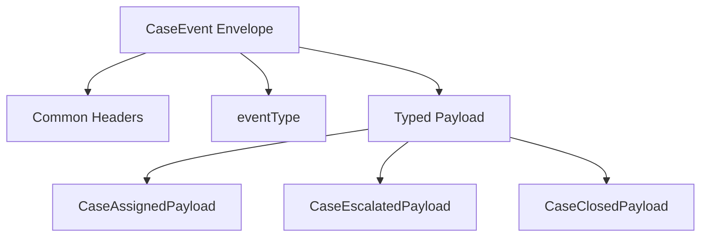
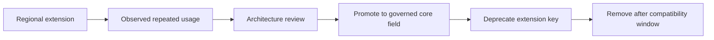
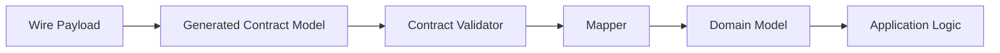

# Part 027 — Contract Composition, Polymorphism, and Extension Patterns

Most contract failures do not happen because engineers cannot write schemas.

They happen because engineers model variation badly.

A field looks common, so it is moved into a base type.

A special case appears, so the base type gets another optional field.

Another subtype appears, so more fields become optional.

Then validation becomes meaningless.

```text
Everything is optional.
Everything is allowed.
Nothing is trustworthy.
```

This part is about composition and polymorphism across:

- XSD
- JSON Schema
- Avro
- Protobuf
- OpenAPI
- Java generated models
- Java domain models
- event payloads
- API request/response DTOs

The point is not to memorize every keyword.

The point is to design variation so the system can evolve without becoming ambiguous.

---

## 1. The Core Mental Model

A data contract has three structural forces:

```text
Commonality     what is shared
Variation       what differs
Extension       what can be added later
```

Bad contracts confuse these three.

Good contracts separate them.

### 1.1 Commonality

Commonality is the part every valid instance must have.

Example:

```json
{
  "caseId": "CASE-2026-000123",
  "eventId": "EVT-2026-000999",
  "occurredAt": "2026-07-03T10:15:30Z",
  "eventType": "CASE_ESCALATED"
}
```

These fields may belong to a common envelope.

### 1.2 Variation

Variation is the part that depends on type.

A `CASE_ESCALATED` event has escalation reason.

A `CASE_ASSIGNED` event has assignee.

A `CASE_CLOSED` event has closure reason.

These are not optional fields on one giant object.

They are variants.

### 1.3 Extension

Extension is controlled future growth.

Not every future field should be allowed anywhere.

A production contract needs explicit extension points.

```json
{
  "extensions": {
    "regulator.regionCode": "APAC-ID",
    "risk.overrideReason": "MANUAL_REVIEW"
  }
}
```

An extension object is not a garbage bin.

It is a governed escape hatch.

---

## 2. Product Types and Sum Types

Most data shapes can be reduced to two concepts.

### 2.1 Product type

A product type combines fields.

```text
CaseHeader = caseId + tenantId + createdAt + status
```

In Java, this is like a record or class.

```java
public record CaseHeader(
    String caseId,
    String tenantId,
    Instant createdAt,
    CaseStatus status
) {}
```

In schema languages, this appears as:

- XSD `complexType` with sequence
- JSON Schema object with properties
- Avro record
- Protobuf message
- OpenAPI schema object

### 2.2 Sum type

A sum type means one of several alternatives.

```text
CaseEventPayload = Assigned | Escalated | Closed | Reopened
```

In Java 17+, this maps well to sealed interfaces.

```java
public sealed interface CaseEventPayload
    permits CaseAssigned, CaseEscalated, CaseClosed, CaseReopened {
}
```

In contract formats, sum types are expressed differently:

| Format | Sum-type mechanism | Production caution |
|---|---|---|
| XSD | `xs:choice`, substitution group, type substitution | Powerful but easy to make unreadable |
| JSON Schema | `oneOf`, `anyOf`, discriminator-like property by convention | Requires careful exclusivity |
| Avro | union | Defaults and branch ordering matter |
| Protobuf | `oneof` | Field presence and tag reservation matter |
| OpenAPI | `oneOf` + discriminator | Generator behavior varies |

The core design question is simple:

```text
Is this object a set of fields, or one of several known shapes?
```

If it is one of several known shapes, do not fake it using many nullable fields.

---

## 3. The Giant Nullable Object Anti-Pattern

A common failure pattern looks like this:

```json
{
  "eventType": "CASE_ESCALATED",
  "assigneeId": null,
  "escalationReason": "HIGH_RISK",
  "closureReason": null,
  "reopenReason": null,
  "sanctionCode": null,
  "appealDeadline": null
}
```

The schema usually says:

```json
{
  "type": "object",
  "properties": {
    "eventType": { "type": "string" },
    "assigneeId": { "type": ["string", "null"] },
    "escalationReason": { "type": ["string", "null"] },
    "closureReason": { "type": ["string", "null"] },
    "reopenReason": { "type": ["string", "null"] }
  }
}
```

This is not a contract.

It is a bag of maybe-fields.

The hidden rules live somewhere else:

```text
If eventType = CASE_ESCALATED, escalationReason is required.
If eventType = CASE_ASSIGNED, assigneeId is required.
If eventType = CASE_CLOSED, closureReason is required.
```

When the schema does not encode these invariants, every consumer re-implements them differently.

### Better model

```json
{
  "caseId": "CASE-2026-000123",
  "eventType": "CASE_ESCALATED",
  "payload": {
    "escalationReason": "HIGH_RISK",
    "escalatedBy": "user-123"
  }
}
```

The envelope carries common fields.

The payload carries variant-specific fields.

---

## 4. Envelope + Typed Payload Pattern

This is the most useful pattern for event contracts.



### Shape

```json
{
  "eventId": "EVT-001",
  "caseId": "CASE-001",
  "eventType": "CASE_ESCALATED",
  "occurredAt": "2026-07-03T10:15:30Z",
  "producer": "case-service",
  "payload": {
    "escalationReason": "HIGH_RISK",
    "targetQueue": "senior-review"
  }
}
```

### Why this works

It separates:

- routing fields
- audit fields
- trace fields
- variant-specific business facts

A stream processor can route by `eventType` without parsing every payload detail.

A consumer that handles only `CASE_ASSIGNED` can ignore other payload shapes.

A schema registry can evaluate compatibility of envelope and payload separately if subjects are split.

---

## 5. JSON Schema Pattern: Tagged Union

JSON Schema does not have a built-in discriminator keyword like OpenAPI.

But it can model tagged unions using `oneOf`, `const`, and `required`.

```json
{
  "$id": "https://contracts.example.com/case-event.schema.json",
  "$schema": "https://json-schema.org/draft/2020-12/schema",
  "type": "object",
  "required": ["eventId", "caseId", "eventType", "occurredAt", "payload"],
  "properties": {
    "eventId": { "type": "string" },
    "caseId": { "type": "string" },
    "occurredAt": { "type": "string", "format": "date-time" },
    "eventType": {
      "enum": ["CASE_ASSIGNED", "CASE_ESCALATED", "CASE_CLOSED"]
    },
    "payload": { "type": "object" }
  },
  "oneOf": [
    {
      "properties": {
        "eventType": { "const": "CASE_ASSIGNED" },
        "payload": { "$ref": "#/$defs/CaseAssignedPayload" }
      }
    },
    {
      "properties": {
        "eventType": { "const": "CASE_ESCALATED" },
        "payload": { "$ref": "#/$defs/CaseEscalatedPayload" }
      }
    },
    {
      "properties": {
        "eventType": { "const": "CASE_CLOSED" },
        "payload": { "$ref": "#/$defs/CaseClosedPayload" }
      }
    }
  ],
  "$defs": {
    "CaseAssignedPayload": {
      "type": "object",
      "required": ["assigneeId"],
      "properties": {
        "assigneeId": { "type": "string" },
        "assignmentReason": { "type": "string" }
      },
      "additionalProperties": false
    },
    "CaseEscalatedPayload": {
      "type": "object",
      "required": ["escalationReason", "targetQueue"],
      "properties": {
        "escalationReason": { "type": "string" },
        "targetQueue": { "type": "string" }
      },
      "additionalProperties": false
    },
    "CaseClosedPayload": {
      "type": "object",
      "required": ["closureReason"],
      "properties": {
        "closureReason": { "type": "string" },
        "closedBy" : { "type": "string" }
      },
      "additionalProperties": false
    }
  },
  "additionalProperties": false
}
```

### Key invariant

`oneOf` should mean exactly one branch is valid.

If multiple branches can validate the same instance, the schema is ambiguous.

### Common mistake

```json
{
  "oneOf": [
    { "$ref": "#/$defs/CaseAssignedPayload" },
    { "$ref": "#/$defs/CaseEscalatedPayload" }
  ]
}
```

This is weak if payloads are structurally similar.

Always bind the tag to the payload.

---

## 6. JSON Schema Pattern: Closed Core + Extension Object

Sometimes a contract needs strict core fields but limited extension.

Do not use global `additionalProperties: true`.

Use a named extension object.

```json
{
  "type": "object",
  "required": ["caseId", "status"],
  "properties": {
    "caseId": { "type": "string" },
    "status": { "type": "string" },
    "extensions": {
      "type": "object",
      "propertyNames": {
        "pattern": "^[a-z][a-z0-9.-]*$"
      },
      "additionalProperties": {
        "type": ["string", "number", "boolean", "null"]
      }
    }
  },
  "additionalProperties": false
}
```

This creates a clear rule:

```text
Core contract is closed.
Extensions are open but isolated.
```

### Why isolation matters

If extensions are mixed into the root object, future core fields may collide with extension keys.

```json
{
  "caseId": "CASE-1",
  "status": "OPEN",
  "riskScore": 80
}
```

Is `riskScore` a governed field?

Or a regional extension?

Or a producer bug?

You cannot tell.

With an extension object, the answer is explicit.

---

## 7. XSD Pattern: Sequence, Choice, and Extension Points

XSD has mature tools for composition.

The danger is that XSD lets you build very elaborate structures that humans struggle to reason about.

### Product type with `xs:sequence`

```xml
<xs:complexType name="CaseHeaderType">
  <xs:sequence>
    <xs:element name="caseId" type="xs:string"/>
    <xs:element name="tenantId" type="xs:string"/>
    <xs:element name="createdAt" type="xs:dateTime"/>
    <xs:element name="status" type="tns:CaseStatusType"/>
  </xs:sequence>
</xs:complexType>
```

### Sum type with `xs:choice`

```xml
<xs:complexType name="CaseEventPayloadType">
  <xs:choice>
    <xs:element name="caseAssigned" type="tns:CaseAssignedPayloadType"/>
    <xs:element name="caseEscalated" type="tns:CaseEscalatedPayloadType"/>
    <xs:element name="caseClosed" type="tns:CaseClosedPayloadType"/>
  </xs:choice>
</xs:complexType>
```

This is clear.

Only one payload variant is present.

### Extension point with `xs:any`

```xml
<xs:complexType name="CaseRecordType">
  <xs:sequence>
    <xs:element name="caseId" type="xs:string"/>
    <xs:element name="status" type="tns:CaseStatusType"/>
    <xs:element name="extensions" minOccurs="0">
      <xs:complexType>
        <xs:sequence>
          <xs:any namespace="##other" processContents="lax" minOccurs="0" maxOccurs="unbounded"/>
        </xs:sequence>
      </xs:complexType>
    </xs:element>
  </xs:sequence>
</xs:complexType>
```

Use `xs:any` carefully.

It is a power tool.

It can preserve compatibility.

It can also destroy validation if it becomes the place where all real data goes.

---

## 8. XSD Pattern: Type Extension vs Element Choice

XSD supports type derivation.

```xml
<xs:complexType name="BaseCaseEventType">
  <xs:sequence>
    <xs:element name="eventId" type="xs:string"/>
    <xs:element name="caseId" type="xs:string"/>
    <xs:element name="occurredAt" type="xs:dateTime"/>
  </xs:sequence>
</xs:complexType>

<xs:complexType name="CaseEscalatedEventType">
  <xs:complexContent>
    <xs:extension base="tns:BaseCaseEventType">
      <xs:sequence>
        <xs:element name="escalationReason" type="xs:string"/>
        <xs:element name="targetQueue" type="xs:string"/>
      </xs:sequence>
    </xs:extension>
  </xs:complexContent>
</xs:complexType>
```

This looks like object-oriented inheritance.

But contract inheritance is not the same as domain inheritance.

### When type extension is acceptable

Use type extension when:

- the base type is stable
- the base fields are truly universal
- generated Java classes remain manageable
- consumers understand the inheritance model
- future variants will not need to remove base fields

### When element choice is better

Use explicit `xs:choice` when:

- variants are business alternatives
- consumers process each variant differently
- payload structure changes independently
- generated Java inheritance would confuse application code

Production rule:

```text
Prefer explicit alternatives over clever inheritance unless the inheritance is part of the external contract language.
```

---

## 9. Avro Pattern: Record Composition and Union Discipline

Avro has no inheritance model like Java.

It has records and unions.

### Envelope

```json
{
  "type": "record",
  "name": "CaseEvent",
  "namespace": "com.example.contract.caseevent.v1",
  "fields": [
    { "name": "eventId", "type": "string" },
    { "name": "caseId", "type": "string" },
    { "name": "occurredAt", "type": { "type": "long", "logicalType": "timestamp-millis" } },
    { "name": "eventType", "type": "string" },
    {
      "name": "payload",
      "type": [
        "com.example.contract.caseevent.v1.CaseAssignedPayload",
        "com.example.contract.caseevent.v1.CaseEscalatedPayload",
        "com.example.contract.caseevent.v1.CaseClosedPayload"
      ]
    }
  ]
}
```

### Payload records

```json
{
  "type": "record",
  "name": "CaseEscalatedPayload",
  "namespace": "com.example.contract.caseevent.v1",
  "fields": [
    { "name": "escalationReason", "type": "string" },
    { "name": "targetQueue", "type": "string" }
  ]
}
```

### Avro caution

Avro union branch selection can surprise teams when the generated Java API is not wrapped behind a mapping boundary.

Do not leak Avro union handling into domain logic.

```java
public sealed interface CaseEventPayload
    permits CaseAssignedPayloadModel, CaseEscalatedPayloadModel, CaseClosedPayloadModel {
}
```

Keep Avro representation at the boundary.

---

## 10. Protobuf Pattern: `oneof` for True Alternatives

Protobuf has a first-class `oneof` construct.

```proto
syntax = "proto3";

package caseevent.v1;

message CaseEvent {
  string event_id = 1;
  string case_id = 2;
  int64 occurred_at_epoch_millis = 3;

  oneof payload {
    CaseAssignedPayload assigned = 10;
    CaseEscalatedPayload escalated = 11;
    CaseClosedPayload closed = 12;
  }
}

message CaseAssignedPayload {
  string assignee_id = 1;
  string assignment_reason = 2;
}

message CaseEscalatedPayload {
  string escalation_reason = 1;
  string target_queue = 2;
}

message CaseClosedPayload {
  string closure_reason = 1;
  string closed_by = 2;
}
```

### Why `oneof` is powerful

It enforces that only one alternative is set.

The generated Java API gives a case enum.

```java
switch (event.getPayloadCase()) {
    case ASSIGNED -> handleAssigned(event.getAssigned());
    case ESCALATED -> handleEscalated(event.getEscalated());
    case CLOSED -> handleClosed(event.getClosed());
    case PAYLOAD_NOT_SET -> reject(event);
}
```

### Compatibility caution

Never reuse field numbers.

When removing a variant, reserve the number and name.

```proto
message CaseEvent {
  reserved 13;
  reserved "old_reopened";

  oneof payload {
    CaseAssignedPayload assigned = 10;
    CaseEscalatedPayload escalated = 11;
    CaseClosedPayload closed = 12;
  }
}
```

The wire format depends on field numbers.

A reused tag is a data corruption risk.

---

## 11. OpenAPI Pattern: `oneOf` with Discriminator

OpenAPI supports schema composition and a discriminator mechanism.

For external HTTP contracts, the goal is not only validation.

The goal is also readable documentation and useful client generation.

```yaml
components:
  schemas:
    CaseEvent:
      type: object
      required:
        - eventId
        - caseId
        - eventType
        - payload
      properties:
        eventId:
          type: string
        caseId:
          type: string
        eventType:
          type: string
          enum:
            - CASE_ASSIGNED
            - CASE_ESCALATED
            - CASE_CLOSED
        payload:
          oneOf:
            - $ref: '#/components/schemas/CaseAssignedPayload'
            - $ref: '#/components/schemas/CaseEscalatedPayload'
            - $ref: '#/components/schemas/CaseClosedPayload'
          discriminator:
            propertyName: payloadType
            mapping:
              CASE_ASSIGNED: '#/components/schemas/CaseAssignedPayload'
              CASE_ESCALATED: '#/components/schemas/CaseEscalatedPayload'
              CASE_CLOSED: '#/components/schemas/CaseClosedPayload'
```

### Discriminator design caution

The discriminator property must actually exist in the payload shape if clients and generators expect it there.

A cleaner alternative is sometimes to put the discriminator at the same object level as the `oneOf` branches.

```yaml
components:
  schemas:
    CaseAssignedEvent:
      type: object
      required: [eventType, assigneeId]
      properties:
        eventType:
          type: string
          const: CASE_ASSIGNED
        assigneeId:
          type: string
```

Then the top-level schema is:

```yaml
components:
  schemas:
    CaseEvent:
      oneOf:
        - $ref: '#/components/schemas/CaseAssignedEvent'
        - $ref: '#/components/schemas/CaseEscalatedEvent'
        - $ref: '#/components/schemas/CaseClosedEvent'
      discriminator:
        propertyName: eventType
```

This is often easier for client generators.

But it duplicates common fields unless you compose carefully.

---

## 12. The `allOf` Inheritance Trap

Many OpenAPI documents use `allOf` as if it were Java inheritance.

```yaml
CaseEscalatedEvent:
  allOf:
    - $ref: '#/components/schemas/BaseEvent'
    - type: object
      required: [escalationReason]
      properties:
        escalationReason:
          type: string
```

This is valid composition.

But it is not automatically safe inheritance.

### Problems

- generators may produce unexpected class hierarchies
- validation errors can be confusing
- required fields can be spread across multiple schemas
- discriminator support varies
- field collision may be hard to detect
- consumers may not understand which schema owns which field

### Safer rule

Use `allOf` for composition of stable reusable fragments.

Do not use it to simulate complex object-oriented inheritance across your API surface.

Good usage:

```yaml
AuditFields:
  type: object
  required: [createdAt, createdBy]
  properties:
    createdAt:
      type: string
      format: date-time
    createdBy:
      type: string

CaseRecord:
  allOf:
    - $ref: '#/components/schemas/AuditFields'
    - type: object
      required: [caseId, status]
      properties:
        caseId:
          type: string
        status:
          type: string
```

Bad usage:

```text
A 6-level inheritance tree of API DTOs.
```

---

## 13. Extension Object Pattern

Extension is necessary in enterprise systems.

Regulators change forms.

Regions add fields.

Partners require identifiers.

Legacy systems produce extra metadata.

The question is not whether extension exists.

The question is whether extension is governed.

### Recommended structure

```json
{
  "caseId": "CASE-1",
  "status": "OPEN",
  "extensions": {
    "id.regulator.formVersion": "2026.07",
    "id.region.officeCode": "JKT-01"
  }
}
```

### Extension rules

Every extension system needs rules:

| Rule | Why it matters |
|---|---|
| Namespaced key | Prevents collision |
| Primitive values by default | Keeps parsing simple |
| Size limit | Prevents payload abuse |
| Allowlist by producer | Prevents hidden schema drift |
| Sensitive data classification | Prevents PII leakage |
| Promotion path | Lets common extensions become core fields |
| Observability | Shows extension usage |

### Promotion path



Without a promotion path, the extension object becomes a shadow schema.

---

## 14. Metadata Bag Anti-Pattern

This looks flexible:

```json
{
  "caseId": "CASE-1",
  "metadata": {
    "anything": "goes here"
  }
}
```

But after one year:

```json
{
  "metadata": {
    "riskScore": "80",
    "risk_score": 80,
    "RiskScore": "HIGH",
    "regulatoryRegion": "ID",
    "region": "Indonesia",
    "office": "JKT-01",
    "pii.nationalId": "..."
  }
}
```

The bag now contains business truth.

No one owns it.

No one validates it.

No one knows which fields are safe to delete.

### Better

Use named extension domains.

```json
{
  "extensions": {
    "risk": {
      "score": 80,
      "rating": "HIGH"
    },
    "regional": {
      "officeCode": "JKT-01"
    }
  }
}
```

Then govern each extension namespace.

---

## 15. Capability Object Pattern

Sometimes the variation is not type.

It is capability.

Example:

```json
{
  "caseId": "CASE-1",
  "allowedActions": {
    "assign": true,
    "escalate": true,
    "close": false,
    "appeal": false
  }
}
```

This is not polymorphism.

It is a capability contract.

Useful for UI/API responses.

Bad if it replaces server-side authorization.

### Production rule

Capabilities can guide clients.

They must not be trusted as authorization proof.

---

## 16. State-Specific Shape Pattern

Sometimes a resource has state-dependent fields.

A `CLOSED` case has closure details.

An `OPEN` case does not.

Bad model:

```json
{
  "caseId": "CASE-1",
  "status": "OPEN",
  "closureReason": null,
  "closedAt": null,
  "closedBy": null
}
```

Better model:

```json
{
  "caseId": "CASE-1",
  "status": "CLOSED",
  "closure": {
    "reason": "NO_VIOLATION",
    "closedAt": "2026-07-03T10:15:30Z",
    "closedBy": "user-123"
  }
}
```

Even better when state shapes are strongly different:

```text
OpenCase | SuspendedCase | ClosedCase
```

But be careful.

State machines evolve.

If every state becomes a separate schema, every small lifecycle change becomes a contract migration.

Use separate state shapes only when the external representation truly changes by state.

---

## 17. Command Contract Pattern

Commands should be explicit.

Bad command:

```json
{
  "caseId": "CASE-1",
  "action": "UPDATE",
  "status": "ESCALATED",
  "assigneeId": null,
  "reason": "HIGH_RISK"
}
```

Better commands:

```json
{
  "caseId": "CASE-1",
  "commandType": "ESCALATE_CASE",
  "reason": "HIGH_RISK",
  "targetQueue": "senior-review"
}
```

```json
{
  "caseId": "CASE-1",
  "commandType": "ASSIGN_CASE",
  "assigneeId": "user-123",
  "reason": "SPECIALIST_REVIEW"
}
```

Commands are not patches.

Commands represent intent.

That means command polymorphism should usually be explicit.

---

## 18. Query Response Pattern

Read models can be more tolerant than command models.

A command should be strict.

A query response may support additive optional fields.

```text
Command contract: strict, intentional, fail fast
Query contract: stable, consumer-friendly, additive evolution
Event contract: immutable fact, replay-safe, compatibility-critical
```

Do not use the same shape for all three.

---

## 19. Java Implementation: Generated Model Boundary

A generated model is not your domain model.



Generated classes are shaped by schema mechanics.

Domain classes are shaped by business invariants.

Keep them separate.

### Package layout

```text
com.example.caseapp
  contract
    openapi.generated
    protobuf.generated
    avro.generated
    xml.generated
  boundary
    mapper
    validator
  domain
    model
    command
    event
  application
    service
```

### Mapper example

```java
public final class CaseEventMapper {

    public DomainCaseEvent toDomain(CaseEventDto dto) {
        return switch (dto.eventType()) {
            case CASE_ASSIGNED -> new DomainCaseAssigned(
                dto.caseId(),
                dto.payload().assigneeId(),
                dto.occurredAt()
            );
            case CASE_ESCALATED -> new DomainCaseEscalated(
                dto.caseId(),
                dto.payload().escalationReason(),
                dto.payload().targetQueue(),
                dto.occurredAt()
            );
            case CASE_CLOSED -> new DomainCaseClosed(
                dto.caseId(),
                dto.payload().closureReason(),
                dto.occurredAt()
            );
        };
    }
}
```

This mapper is not boilerplate.

It is a semantic firewall.

---

## 20. Java 17+ Sealed Types for Domain Polymorphism

Java sealed interfaces are useful for internal domain variants.

```java
public sealed interface CaseCommand
    permits AssignCaseCommand, EscalateCaseCommand, CloseCaseCommand {

    CaseId caseId();
}

public record AssignCaseCommand(
    CaseId caseId,
    UserId assigneeId,
    AssignmentReason reason
) implements CaseCommand {}

public record EscalateCaseCommand(
    CaseId caseId,
    EscalationReason reason,
    QueueId targetQueue
) implements CaseCommand {}

public record CloseCaseCommand(
    CaseId caseId,
    ClosureReason reason
) implements CaseCommand {}
```

This is good domain modeling.

But do not expose Java sealed type mechanics as your external contract.

The external contract should be expressed in XSD, JSON Schema, Avro, Protobuf, or OpenAPI.

---

## 21. Jackson Polymorphism Caution

Jackson supports annotations such as `@JsonTypeInfo`.

They are convenient.

They are not a replacement for external contract design.

Bad pattern:

```java
@JsonTypeInfo(use = JsonTypeInfo.Id.CLASS)
public sealed interface CasePayload {}
```

This leaks Java class names into JSON.

A consumer should not receive:

```json
{
  "@class": "com.example.internal.domain.CaseEscalatedPayload"
}
```

Good pattern:

```json
{
  "payloadType": "CASE_ESCALATED"
}
```

The discriminator is a business-level contract value.

Not an implementation class name.

---

## 22. Compatibility Rules for Variants

Variant evolution has different rules than field evolution.

| Change | Usually safe? | Risk |
|---|---:|---|
| Add optional field to existing variant | Usually | Consumer may reject closed schemas |
| Add required field to existing variant | No | Old producers cannot populate it |
| Add new variant | Sometimes | Old consumers may not understand it |
| Remove variant | No | Historical data/replay may contain it |
| Rename variant tag | No | Routing and deserialization break |
| Split variant into two | Risky | Consumers need migration logic |
| Merge two variants | Risky | Semantics may be lost |
| Move field from variant to envelope | Risky | Old consumers expect old location |
| Move field from envelope to variant | Risky | Common routing may break |

### Add new variant safely

Adding a variant is not always backward compatible.

Old consumers may fail on unknown variant.

Safe rollout requires:

1. consumer capability check
2. tolerant unknown handling
3. producer gating
4. observability
5. replay strategy
6. documented fallback behavior

---

## 23. Unknown Variant Pattern

For business events, unknown variants need a policy.

Options:

| Policy | Behavior | Use case |
|---|---|---|
| Reject | Fail validation | Commands, security-sensitive input |
| Quarantine | Store for triage | Events from external parties |
| Ignore | Skip processing | Optional notifications |
| Preserve | Store raw payload | Audit/event sourcing |
| Fallback | Process as generic event | UI timeline/activity feed |

Example Java event consumer:

```java
switch (event.type()) {
    case CASE_ASSIGNED -> assignedHandler.handle(event);
    case CASE_ESCALATED -> escalatedHandler.handle(event);
    case CASE_CLOSED -> closedHandler.handle(event);
    default -> unknownEventHandler.quarantine(event);
}
```

Do not silently drop unknown variants unless the contract explicitly says it is safe.

---

## 24. Extension vs Variant Decision

A new fact can be modeled as:

- new field
- new nested object
- new extension key
- new variant
- new endpoint
- new event type
- new resource

Decision table:

| Situation | Prefer |
|---|---|
| Same semantic object, additive detail | New optional field |
| Group of related optional details | New nested object |
| Region/partner-specific experimental data | Extension object |
| Different business meaning | New variant |
| Different lifecycle or authorization | New endpoint/resource |
| Different immutable fact | New event type |
| Different bounded context | New contract/module |

The key question:

```text
Will consumers need different logic?
```

If yes, it is probably a variant.

If no, it may be a field.

---

## 25. Polymorphism in Event Streams

Event stream polymorphism is especially dangerous.

A topic can contain:

1. one event type only
2. many event types with common envelope
3. many unrelated messages

### Preferred for enterprise events

```text
Topic: case.lifecycle.events.v1
Envelope: common
Payload: typed event variant
```

Avoid dumping unrelated events into one topic.

```text
Topic: everything.events
```

That topic becomes a landfill.

### Subject strategy

For schema registries, decide whether subject identity is:

- topic-level
- event-type-level
- record-name-level
- envelope-level plus payload-level

Each choice changes compatibility behavior.

---

## 26. Polymorphism in HTTP APIs

HTTP APIs often expose polymorphic resources.

Example:

```text
GET /cases/{caseId}/activities
```

The response may contain assignment, escalation, comment, decision, closure, and document upload activities.

This is a good place for `oneOf`.

```yaml
Activity:
  oneOf:
    - $ref: '#/components/schemas/AssignmentActivity'
    - $ref: '#/components/schemas/EscalationActivity'
    - $ref: '#/components/schemas/DecisionActivity'
    - $ref: '#/components/schemas/ClosureActivity'
  discriminator:
    propertyName: activityType
```

But command endpoints should avoid ambiguous polymorphic update blobs.

Prefer explicit endpoints:

```text
POST /cases/{caseId}/assignments
POST /cases/{caseId}/escalations
POST /cases/{caseId}/closure
```

This improves authorization, validation, audit, and idempotency.

---

## 27. Polymorphism in XML Integrations

Legacy XML integrations often use:

- choice
- substitution groups
- type extension
- namespace extension
- `xsi:type`

Use `xsi:type` carefully.

It can make payloads depend on runtime type declarations that are harder for consumers to understand.

For B2B or regulator-facing XML, explicit element names are usually clearer.

Prefer:

```xml
<caseEscalated>
  <escalationReason>HIGH_RISK</escalationReason>
</caseEscalated>
```

Over:

```xml
<caseEventPayload xsi:type="CaseEscalatedPayloadType">
  <escalationReason>HIGH_RISK</escalationReason>
</caseEventPayload>
```

Unless the ecosystem already standardizes on type substitution.

---

## 28. Design Smells

### Smell 1: `type` field with no validation

```json
{
  "type": "ESCALATED",
  "payload": {}
}
```

If the schema does not connect `type` to payload shape, the type field is decorative.

### Smell 2: all fields nullable

```json
{
  "assigneeId": null,
  "closureReason": null,
  "appealReason": null
}
```

This usually means missing variants.

### Smell 3: extension object contains core business truth

If every consumer reads `extensions.risk.score`, then `risk.score` is no longer an extension.

Promote it.

### Smell 4: Java inheritance dictates wire contract

External contracts should not be accidental projections of Java class hierarchies.

### Smell 5: generator output becomes domain model

Generated models are boundary artifacts.

Domain models are semantic artifacts.

---

## 29. Production Design Checklist

Before approving a polymorphic contract, answer:

1. What are the stable common fields?
2. Which fields are truly variant-specific?
3. Is variation modeled as explicit alternatives?
4. Is the discriminator stable and business-level?
5. Can two branches validate the same instance?
6. What happens when a new variant appears?
7. What happens when an old consumer receives the new variant?
8. Are unknown variants rejected, ignored, preserved, or quarantined?
9. Are extension fields namespaced?
10. Is extension usage observable?
11. Can extension fields be promoted into core fields?
12. Are generated models isolated from domain logic?
13. Is there a compatibility test for adding fields?
14. Is there a compatibility test for adding variants?
15. Is there a replay test for historical payloads?

---

## 30. Capstone Example: Case Action Contract

Suppose we need to support these actions:

- assign case
- escalate case
- suspend case
- reopen case
- close case

Bad API:

```text
POST /cases/{id}/actions
```

With body:

```json
{
  "actionType": "ESCALATE",
  "assigneeId": null,
  "targetQueue": "senior-review",
  "closureReason": null,
  "suspensionUntil": null,
  "comment": "High risk case"
}
```

Better API design:

```text
POST /cases/{id}/assignments
POST /cases/{id}/escalations
POST /cases/{id}/suspensions
POST /cases/{id}/reopenings
POST /cases/{id}/closure
```

Events can still use a common envelope:

```text
CaseLifecycleEvent = envelope + typed payload
```

Commands are explicit.

Events are polymorphic facts.

Read models can aggregate multiple activity types.

This separation keeps the system understandable.

---

## 31. The Rule of Least Polymorphism

Do not use polymorphism because it feels elegant.

Use polymorphism when consumers need to distinguish alternatives.

Use simple fields when the shape is stable.

Use nested objects when fields belong together.

Use extension objects when growth is real but not yet core.

Use new contracts when semantics diverge.

```text
Polymorphism is a tool for controlled variation.
It is not a license to make every object abstract.
```

---

## 32. What Top Engineers Notice

A strong contract engineer sees these questions early:

```text
What is common?
What varies?
What must be closed?
What may be extended?
Who breaks when a new variant appears?
Can old data still be replayed?
Does the schema encode the invariant or merely document it?
```

That is the difference between schema writing and contract engineering.

---

## 33. Practical Exercises

### Exercise 1

Take an existing API object with many nullable fields.

Refactor it into:

- envelope
- common fields
- typed payload variants
- extension object

### Exercise 2

For each variant, define:

- required fields
- optional fields
- allowed extension fields
- unknown variant policy
- compatibility rule

### Exercise 3

Implement Java sealed domain types and map them from generated OpenAPI or Protobuf models.

Do not let generated models leak into application services.

### Exercise 4

Create a compatibility test that proves:

- old payloads are still readable
- new optional fields do not break consumers
- unknown variants are quarantined
- extension keys are namespaced

---

## 34. Summary

Composition and polymorphism are where data contracts either become clean or collapse.

The production rules are:

- model shared fields explicitly
- model alternatives explicitly
- avoid giant nullable objects
- use extension objects deliberately
- treat `allOf` as composition, not magical inheritance
- use `oneOf`/`oneof`/union/choice only when variation is real
- isolate generated contract models from domain models
- define unknown variant behavior
- test variant evolution, not only field evolution

In the next part, we will focus on a deceptively small topic that causes massive production pain: enums, reference data, code lists, and controlled vocabularies.
