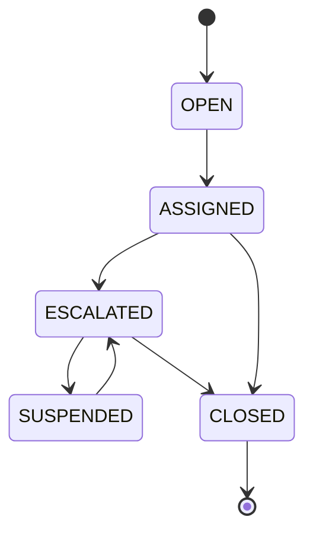
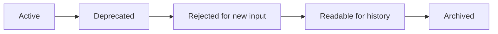
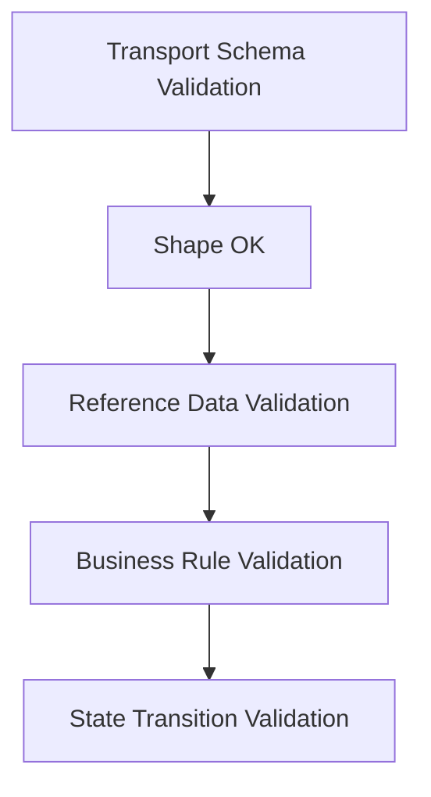

# Part 028 — Enums, Reference Data, Code Lists, and Controlled Vocabularies

Enums look simple.

That is why they are dangerous.

A contract starts with:

```json
{
  "status": "OPEN"
}
```

Then someone adds:

```text
SUSPENDED
UNDER_REVIEW
PENDING_EXTERNAL_RESPONSE
PENDING_REGULATOR_CONFIRMATION
CLOSED_NO_VIOLATION
CLOSED_WITH_SANCTION
CLOSED_DUPLICATE
```

Then a new regulator introduces a new violation category.

Then a partner sends a value you have never seen.

Then old consumers fail because they generated Java enums that cannot parse the new value.

Then event replay fails because a symbol was removed.

This part is about knowing when to use enums, when to use reference data, and how to model controlled vocabularies without breaking systems.

---

## 1. The Core Distinction

Not every list of values is an enum.

There are at least five different things people call enums:

| Concept | Meaning | Example | Contract strategy |
|---|---|---|---|
| Technical enum | Small closed set controlled by protocol | `ASC`, `DESC` | Hard enum is fine |
| Domain lifecycle state | State machine value | `OPEN`, `ESCALATED`, `CLOSED` | Enum plus transition rules |
| Business classification | Business category that changes | `HIGH_RISK`, `LOW_RISK` | Usually reference data |
| Regulatory code list | External authority owns values | violation codes | External versioned code list |
| Display label | Human-readable text | `Closed with Sanction` | Never use as stable code |

The mistake is treating all of them as the same.

---

## 2. The Enum Decision Question

Before adding an enum to a contract, ask:

```text
Can a new value appear without changing the meaning of the field?
```

If yes, it may not be a hard enum.

Ask a second question:

```text
Will old consumers be able to behave safely when they receive a new value?
```

If no, the enum is a compatibility hazard.

---

## 3. Closed vs Open Vocabulary

### Closed vocabulary

A closed vocabulary means all valid values are known and controlled by the contract owner.

Example:

```text
sortDirection = ASC | DESC
```

A new value like `RANDOM` would change semantics.

Hard enum is good.

### Open vocabulary

An open vocabulary means known values exist, but more values may appear.

Example:

```text
violationCode = AML_001 | AML_002 | FRAUD_010 | ...
```

New values are normal.

Hard enum is risky.

### Controlled open vocabulary

A controlled open vocabulary has values governed by a registry.

Example:

```text
RegulatorViolationCodeList version 2026.07
```

The schema may validate shape.

A reference data service validates membership.

---

## 4. Enum as Type vs Enum as Data

A technical enum is part of the type system.

```java
public enum SortDirection {
    ASC,
    DESC
}
```

A code list value is data.

```java
public record ViolationCode(String value) {}
```

If the list is owned outside your deployable codebase, do not bake it deeply into generated Java enums.

Use a value object and validate against reference data.

---

## 5. State Is Not Just an Enum

Case status is often modeled as an enum.

```java
public enum CaseStatus {
    OPEN,
    ASSIGNED,
    ESCALATED,
    SUSPENDED,
    CLOSED
}
```

This is incomplete.

A state enum only tells what states exist.

It does not tell which transitions are legal.



The contract can expose status.

But the application must enforce transition invariants.

```text
Enum defines vocabulary.
State machine defines behavior.
```

Do not confuse them.

---

## 6. Cross-Format Enum Semantics

Enums behave differently across formats.

| Format | Enum mechanism | Compatibility risk |
|---|---|---|
| XSD | restriction with enumeration facets | New value fails validation for old schema |
| JSON Schema | `enum` or `const` | New value fails validation if schema is closed |
| Avro | enum symbols | Removed/unknown symbols require careful default handling |
| Protobuf | numeric enum values | Unknown values can survive differently by language/runtime |
| OpenAPI | Schema `enum` | Generated Java clients often create strict enums |
| Java | `enum` | Unknown wire value can throw or map poorly |

A top engineer does not ask only:

```text
Can the schema express the enum?
```

They ask:

```text
How do old consumers behave when a new value appears?
```

---

## 7. XSD Enum Pattern

XSD enumeration is strict.

```xml
<xs:simpleType name="CaseStatusType">
  <xs:restriction base="xs:string">
    <xs:enumeration value="OPEN"/>
    <xs:enumeration value="ASSIGNED"/>
    <xs:enumeration value="ESCALATED"/>
    <xs:enumeration value="CLOSED"/>
  </xs:restriction>
</xs:simpleType>
```

This is good for closed vocabularies.

It is dangerous for externally controlled code lists.

### For regulatory code lists

Prefer a code object:

```xml
<xs:complexType name="ViolationCodeType">
  <xs:sequence>
    <xs:element name="code" type="xs:string"/>
    <xs:element name="scheme" type="xs:string"/>
    <xs:element name="schemeVersion" type="xs:string" minOccurs="0"/>
  </xs:sequence>
</xs:complexType>
```

Example XML:

```xml
<violationCode>
  <code>AML-2026-017</code>
  <scheme>REGULATOR-ID-VIOLATION-CODES</scheme>
  <schemeVersion>2026.07</schemeVersion>
</violationCode>
```

Now XSD validates structure.

Reference data validates membership.

---

## 8. JSON Schema Enum Pattern

For closed technical enums:

```json
{
  "type": "string",
  "enum": ["ASC", "DESC"]
}
```

For variant tags:

```json
{
  "const": "CASE_ESCALATED"
}
```

For open controlled vocabularies:

```json
{
  "type": "object",
  "required": ["code", "scheme"],
  "properties": {
    "code": {
      "type": "string",
      "pattern": "^[A-Z0-9][A-Z0-9._-]{1,63}$"
    },
    "scheme": {
      "type": "string"
    },
    "schemeVersion": {
      "type": "string"
    },
    "displayName": {
      "type": "string",
      "readOnly": true
    }
  },
  "additionalProperties": false
}
```

### Important distinction

The schema checks:

- field exists
- value is string
- value matches format
- scheme exists

The reference data service checks:

- code exists in scheme
- code is active
- code is valid for date
- code is valid for jurisdiction
- code is allowed for this producer/consumer

Do not force JSON Schema to do reference data management.

---

## 9. Avro Enum Pattern

Avro supports enum schemas.

```json
{
  "type": "enum",
  "name": "CaseStatus",
  "symbols": ["OPEN", "ASSIGNED", "ESCALATED", "CLOSED"]
}
```

This is compact and clear.

But event streams replay old data.

Data can live longer than code.

### Avro enum evolution caution

Adding enum symbols may break old readers that do not know the new symbol.

Removing symbols can break replay of historical data.

If a symbol is seen by a reader that cannot resolve it, the reader needs a default or the read fails depending on resolution rules and schema design.

### Production rule

Use Avro enums for stable closed protocol values.

For external/regulatory code lists, use a record:

```json
{
  "type": "record",
  "name": "CodeValue",
  "fields": [
    { "name": "code", "type": "string" },
    { "name": "scheme", "type": "string" },
    { "name": "schemeVersion", "type": ["null", "string"], "default": null }
  ]
}
```

This avoids regenerating code every time a regulator adds a code.

---

## 10. Protobuf Enum Pattern

Protobuf enums are numeric on the wire.

```proto
syntax = "proto3";

package casecontract.v1;

enum CaseStatus {
  CASE_STATUS_UNSPECIFIED = 0;
  CASE_STATUS_OPEN = 1;
  CASE_STATUS_ASSIGNED = 2;
  CASE_STATUS_ESCALATED = 3;
  CASE_STATUS_CLOSED = 4;
}
```

### Why zero matters

In proto3, the default enum value is the first value.

Therefore the first value should be an unspecified value.

```proto
CASE_STATUS_UNSPECIFIED = 0;
```

Do not make `OPEN = 0` unless `OPEN` truly means missing/default.

### Reserved enum values

When deleting enum values, reserve numbers and names.

```proto
enum CaseStatus {
  reserved 5;
  reserved "CASE_STATUS_PENDING_LEGACY";

  CASE_STATUS_UNSPECIFIED = 0;
  CASE_STATUS_OPEN = 1;
  CASE_STATUS_ASSIGNED = 2;
  CASE_STATUS_ESCALATED = 3;
  CASE_STATUS_CLOSED = 4;
}
```

Reusing enum numbers can corrupt meaning.

---

## 11. OpenAPI Enum Pattern

OpenAPI schema can define enum values.

```yaml
CaseStatus:
  type: string
  enum:
    - OPEN
    - ASSIGNED
    - ESCALATED
    - CLOSED
```

This is useful for documentation and generated clients.

But strict generated enum clients can break when a new value appears.

### Safer open vocabulary model

```yaml
ViolationCode:
  type: object
  required:
    - code
    - scheme
  properties:
    code:
      type: string
      pattern: '^[A-Z0-9][A-Z0-9._-]{1,63}$'
    scheme:
      type: string
      example: REGULATOR-ID-VIOLATION-CODES
    schemeVersion:
      type: string
      example: '2026.07'
    displayName:
      type: string
      readOnly: true
```

For public APIs, document whether unknown values may appear.

If unknown values may appear, avoid generating clients that throw on unknown enum values.

---

## 12. Java Enum Pitfall

Java enums are strict.

```java
public enum CaseStatus {
    OPEN,
    ASSIGNED,
    ESCALATED,
    CLOSED
}
```

Deserialization usually fails on unknown values unless configured otherwise.

That can be good for commands.

It can be bad for event consumers or read models.

### Safer representation for open vocabularies

```java
public record CodeValue(
    String code,
    String scheme,
    Optional<String> schemeVersion
) {
    public CodeValue {
        if (code == null || code.isBlank()) {
            throw new IllegalArgumentException("code is required");
        }
        if (scheme == null || scheme.isBlank()) {
            throw new IllegalArgumentException("scheme is required");
        }
    }
}
```

Use Java enums when the vocabulary is truly closed.

Use value objects when the vocabulary is externally governed.

---

## 13. Unknown Value Handling

Every enum-like field needs an unknown value policy.

| Boundary | Recommended behavior |
|---|---|
| Command input | Reject unknown values |
| Public query response consumer | Preserve or display fallback |
| Internal event consumer | Quarantine or preserve |
| Audit storage | Preserve raw value |
| Analytics pipeline | Route to unknown bucket |
| UI | Show safe fallback label |
| Workflow transition | Reject unless explicitly mapped |

### Example UI fallback

```java
public String displayStatus(String rawStatus) {
    return switch (rawStatus) {
        case "OPEN" -> "Open";
        case "ASSIGNED" -> "Assigned";
        case "ESCALATED" -> "Escalated";
        case "CLOSED" -> "Closed";
        default -> "Unknown status: " + rawStatus;
    };
}
```

For user-facing applications, unknown does not have to crash the page.

For business commands, unknown may need to fail immediately.

---

## 14. `UNKNOWN` vs `UNSPECIFIED`

These are not the same.

| Value | Meaning |
|---|---|
| `UNSPECIFIED` | Sender did not provide a meaningful value |
| `UNKNOWN` | Sender provided a value that receiver does not understand |
| `OTHER` | Sender selected a known catch-all category |
| `NOT_APPLICABLE` | Field does not apply to this case |
| `PENDING` | Value exists later but is not decided yet |

Do not collapse these into one value.

Bad:

```text
UNKNOWN
```

Used for:

- missing
- invalid
- future value
- not applicable
- not loaded
- pending user input

This destroys semantics.

Better:

```text
UNSPECIFIED
UNRECOGNIZED
NOT_APPLICABLE
PENDING_DETERMINATION
OTHER
```

Use only the values that match your domain.

---

## 15. Display Labels Are Not Codes

Never use display text as the stable contract value.

Bad:

```json
{
  "caseStatus": "Closed with Sanction"
}
```

Better:

```json
{
  "caseStatus": "CLOSED_WITH_SANCTION",
  "caseStatusLabel": "Closed with sanction"
}
```

Best for multi-language systems:

```json
{
  "caseStatus": {
    "code": "CLOSED_WITH_SANCTION",
    "scheme": "CASE_STATUS",
    "displayName": "Closed with sanction"
  }
}
```

Display labels change.

Codes should be stable.

---

## 16. Reference Data as a Product

Reference data should be treated as a product, not a spreadsheet.

A production reference data system needs:

- code
- scheme
- version
- display name
- description
- active period
- deprecation status
- jurisdiction
- owner
- source authority
- mapping to legacy codes
- audit history
- change approval

Example table:

```sql
create table reference_code (
    scheme text not null,
    code text not null,
    version text not null,
    display_name text not null,
    description text,
    jurisdiction text,
    valid_from date not null,
    valid_to date,
    deprecated boolean not null default false,
    replacement_code text,
    owner text not null,
    created_at timestamptz not null default now(),
    primary key (scheme, code, version)
);
```

This is not just database design.

It affects contract design.

---

## 17. Code List Contract Shape

A robust code list value shape:

```json
{
  "code": "AML-2026-017",
  "scheme": "REGULATOR-ID-VIOLATION-CODES",
  "schemeVersion": "2026.07",
  "displayName": "Suspicious transaction reporting failure",
  "authority": "ID-FINANCIAL-REGULATOR"
}
```

Fields:

| Field | Purpose |
|---|---|
| `code` | Stable machine value |
| `scheme` | Which vocabulary this belongs to |
| `schemeVersion` | Which version was used |
| `displayName` | Human-readable label, usually output-only |
| `authority` | Who owns the meaning |

For commands, clients may send only:

```json
{
  "code": "AML-2026-017",
  "scheme": "REGULATOR-ID-VIOLATION-CODES"
}
```

The server resolves version and label.

---

## 18. Versioned Reference Data

Reference data changes over time.

A code may be valid in July but invalid in December.

A contract should clarify validation time.

Questions:

1. Validate against current code list?
2. Validate against event occurrence date?
3. Validate against case filing date?
4. Validate against regulation effective date?
5. Preserve old values for historical cases?

For regulatory systems, this matters.

A violation code valid at decision time may later be retired.

Historical records must remain readable.

---

## 19. Effective-Dated Validation

Example reference lookup:

```java
public interface ReferenceDataService {
    boolean isValid(
        String scheme,
        String code,
        LocalDate effectiveDate,
        Jurisdiction jurisdiction
    );
}
```

Use effective date intentionally.

```java
if (!referenceData.isValid(
        "REGULATOR-ID-VIOLATION-CODES",
        command.violationCode().code(),
        command.decisionDate(),
        command.jurisdiction())) {
    throw new InvalidCodeException(command.violationCode());
}
```

Do not validate historical facts using only today's reference data.

---

## 20. Enum Evolution Matrix

| Change | Closed enum | Open code list |
|---|---:|---:|
| Add value | Breaking for strict old consumers | Normal |
| Remove value | Breaking for historical data | Deprecate, do not delete historical meaning |
| Rename value | Breaking | Add new code, deprecate old code |
| Change label | Usually safe | Safe if code stable |
| Change meaning | Dangerous | New code required |
| Merge values | Dangerous | Mapping table required |
| Split value | Dangerous | New codes plus migration rule |
| Reuse old code | Never | Never |

Rule:

```text
Codes are identifiers of meaning.
If meaning changes, create a new code.
```

---

## 21. Enum Deprecation Pattern

Do not delete values abruptly.

Use lifecycle states.



### Contract behavior

| Lifecycle | Input allowed? | Output allowed? | Historical read? |
|---|---:|---:|---:|
| Active | Yes | Yes | Yes |
| Deprecated | Maybe with warning | Yes | Yes |
| Rejected for new input | No | Yes | Yes |
| Archived | No | Maybe | Yes |

Deleting old values is rarely safe.

---

## 22. Mapping External Codes to Internal Values

External authority code:

```text
REG-ID-AML-017
```

Internal risk category:

```text
AML_REPORTING_FAILURE
```

Do not pretend they are the same.

Use mapping.

```sql
create table code_mapping (
    source_scheme text not null,
    source_code text not null,
    target_scheme text not null,
    target_code text not null,
    valid_from date not null,
    valid_to date,
    mapping_confidence text not null,
    primary key (source_scheme, source_code, target_scheme, target_code, valid_from)
);
```

Mapping is domain logic.

It deserves tests, ownership, and audit.

---

## 23. Contract Boundary: Where to Validate Code Lists

Validation layers:



Schema validation answers:

```text
Does the payload have a code field of the right shape?
```

Reference data validation answers:

```text
Is this code known and active under this scheme/date/jurisdiction?
```

Business validation answers:

```text
Is this code allowed for this case type and process step?
```

State validation answers:

```text
Is this transition allowed now?
```

Keep these separate.

---

## 24. Java Pattern: Closed Enum with Unknown Preservation

Sometimes you want the convenience of enum handling but also preserve unknown raw values.

```java
public final class EnumValue<E extends Enum<E>> {
    private final E known;
    private final String raw;

    private EnumValue(E known, String raw) {
        this.known = known;
        this.raw = raw;
    }

    public static <E extends Enum<E>> EnumValue<E> known(E value) {
        return new EnumValue<>(value, value.name());
    }

    public static <E extends Enum<E>> EnumValue<E> unknown(String raw) {
        return new EnumValue<>(null, raw);
    }

    public boolean isKnown() {
        return known != null;
    }

    public Optional<E> known() {
        return Optional.ofNullable(known);
    }

    public String raw() {
        return raw;
    }
}
```

This is useful for read models and event consumers.

It is usually not appropriate for strict command validation.

---

## 25. Java Pattern: Reference Data Value Object

```java
public record ReferenceCode(
    String scheme,
    String code,
    Optional<String> schemeVersion
) {
    public ReferenceCode {
        if (scheme == null || scheme.isBlank()) {
            throw new IllegalArgumentException("scheme is required");
        }
        if (code == null || code.isBlank()) {
            throw new IllegalArgumentException("code is required");
        }
        if (!code.matches("^[A-Z0-9][A-Z0-9._-]{1,63}$")) {
            throw new IllegalArgumentException("invalid code syntax: " + code);
        }
    }
}
```

Then validation becomes explicit:

```java
public final class ViolationCodeValidator {
    private final ReferenceDataService referenceDataService;

    public void validate(ReferenceCode code, LocalDate effectiveDate, String jurisdiction) {
        if (!referenceDataService.exists(code.scheme(), code.code(), effectiveDate, jurisdiction)) {
            throw new InvalidReferenceCodeException(code);
        }
    }
}
```

This separates structural validity from membership validity.

---

## 26. Event Sourcing and Enum History

Event-sourced systems must preserve old meanings.

If an old event says:

```json
{
  "decisionType": "MANUAL_ESCALATION_LEGACY"
}
```

The system must still read it.

Even if no new command can produce that value.

Therefore:

- never delete historical code meanings
- never reuse code names
- keep mapping tables versioned
- keep generated deserializers tolerant where replay matters
- test replay with old fixtures

Replay is the ultimate compatibility test.

---

## 27. Analytics and Enum Cardinality

Analytics teams often want stable dimensions.

If a contract field is a free string, cardinality may explode.

```text
HIGH
High
high
H
High Risk
HIGH_RISK
```

Use controlled vocabularies for analytical dimensions.

But do not force all controlled vocabularies into hard schema enums.

A reference data-backed code gives both:

- stable analytics dimension
- evolvable vocabulary

---

## 28. API Documentation Strategy

For public or cross-team APIs, document enum policy explicitly.

Example:

```yaml
RiskCategory:
  type: string
  description: |
    Current known risk categories. Clients must tolerate unknown values
    because new regulatory categories may be introduced without a major API version.
  examples:
    - LOW
    - MEDIUM
    - HIGH
```

If using a strict enum:

```yaml
SortDirection:
  type: string
  description: Closed protocol enum. Unknown values are invalid.
  enum:
    - ASC
    - DESC
```

Documentation should state whether new values may appear.

---

## 29. Contract Tests for Enum Evolution

Test scenarios:

1. old consumer receives new enum value
2. new consumer reads old enum value
3. deprecated value appears in historical event
4. command with deprecated value is rejected
5. command with unknown value is rejected
6. query response with unknown value is rendered safely
7. reference data version is missing
8. code valid today but invalid at effective date
9. code valid in one jurisdiction but invalid in another
10. mapping from external to internal code changes over time

Example test name:

```java
@Test
void oldConsumerShouldQuarantineUnknownLifecycleEventType() {
    // arrange payload with eventType introduced after this consumer version
    // assert quarantine, not silent drop
}
```

---

## 30. CI Policy for Code Lists

Reference data changes need quality gates.

Checks:

- no duplicate code in same scheme/version
- no code reuse after deletion
- deprecation has replacement or rationale
- display names are present
- effective dates do not overlap incorrectly
- jurisdiction is valid
- mappings are complete
- generated documentation updated
- owners approved changes
- historical fixture replay still passes

Reference data changes can break systems just like schema changes.

Treat them as contract changes.

---

## 31. Anti-Patterns

### Anti-pattern 1: Everything as Java enum

```java
public enum ViolationCode {
    AML_001,
    AML_002,
    AML_003
}
```

Bad when regulator can add values independently.

### Anti-pattern 2: Everything as string

```json
{
  "status": "whatever"
}
```

Bad when only specific values are meaningful.

### Anti-pattern 3: Display label as code

```json
{
  "status": "Under Manual Review"
}
```

Bad because labels change.

### Anti-pattern 4: Reusing old values

```text
CLOSED used to mean resolved.
Now CLOSED means archived.
```

Bad because historical data changes meaning.

### Anti-pattern 5: Hard enum for partner-specific codes

Bad because every partner update becomes a platform deployment.

---

## 32. Decision Matrix

| Value type | Recommended contract shape |
|---|---|
| Protocol option | Hard enum |
| Variant discriminator | Hard enum or `const` per variant |
| Lifecycle state | Enum plus state machine documentation/tests |
| Workflow action | Usually command-specific type or enum |
| Regulatory code | Code object with scheme/version |
| Partner code | Code object with source system |
| UI label | Output-only text, never stable identifier |
| Analytics dimension | Controlled vocabulary, often reference data-backed |
| Security role/permission | Usually governed string/permission registry, not casual enum |

---

## 33. Regulatory Case Management Example

A case has:

- lifecycle status
- violation codes
- risk rating
- sanction type
- region code
- enforcement channel

Do not model all of them the same way.

### Suggested design

| Field | Type | Reason |
|---|---|---|
| `caseStatus` | hard enum + state machine | platform-controlled lifecycle |
| `violationCode` | reference code object | regulator-controlled list |
| `riskRating` | controlled vocabulary | may evolve by risk model version |
| `sanctionType` | reference code object | legal/regulatory meaning |
| `regionCode` | reference code object | org/regional master data |
| `enforcementChannel` | hard enum if stable | internal channel options |

Example JSON:

```json
{
  "caseId": "CASE-2026-000123",
  "caseStatus": "ESCALATED",
  "violationCode": {
    "code": "AML-2026-017",
    "scheme": "REGULATOR-ID-VIOLATION-CODES",
    "schemeVersion": "2026.07"
  },
  "riskRating": {
    "code": "HIGH",
    "scheme": "CASE_RISK_RATING",
    "schemeVersion": "risk-model-2026.2"
  },
  "regionCode": {
    "code": "JKT-01",
    "scheme": "REGIONAL_OFFICE"
  }
}
```

This is more verbose than raw strings.

It is also more defensible.

---

## 34. Production Checklist

Before approving an enum-like field:

1. Is this vocabulary closed or open?
2. Who owns the values?
3. Can values be added without redeploying all consumers?
4. Can old consumers tolerate new values?
5. Is there a safe unknown policy?
6. Are display labels separated from codes?
7. Is there an `UNSPECIFIED` value where needed?
8. Are deprecated values still readable?
9. Is historical replay protected?
10. Are deleted Protobuf enum numbers reserved?
11. Are Avro enum changes tested with old readers?
12. Are OpenAPI generated clients tolerant where needed?
13. Is reference data effective-dated?
14. Is jurisdiction part of validation?
15. Is there an owner and approval flow for code list changes?

---

## 35. Summary

Enums are not just lists.

They are compatibility decisions.

Use hard enums for small, closed, protocol-level values.

Use state machines for lifecycle behavior.

Use reference data for externally governed or frequently changing vocabularies.

Use code objects when meaning depends on scheme, version, jurisdiction, or authority.

Preserve unknown values where replay and forward compatibility matter.

Reject unknown values where command safety matters.

The top-level rule:

```text
Do not encode volatile business governance as rigid generated enums.
Do not encode strict protocol invariants as casual strings.
```

The next part will go deeper into nullability, optionality, defaults, absence, and how these concepts differ across XSD, JSON Schema, Avro, Protobuf, and OpenAPI.
