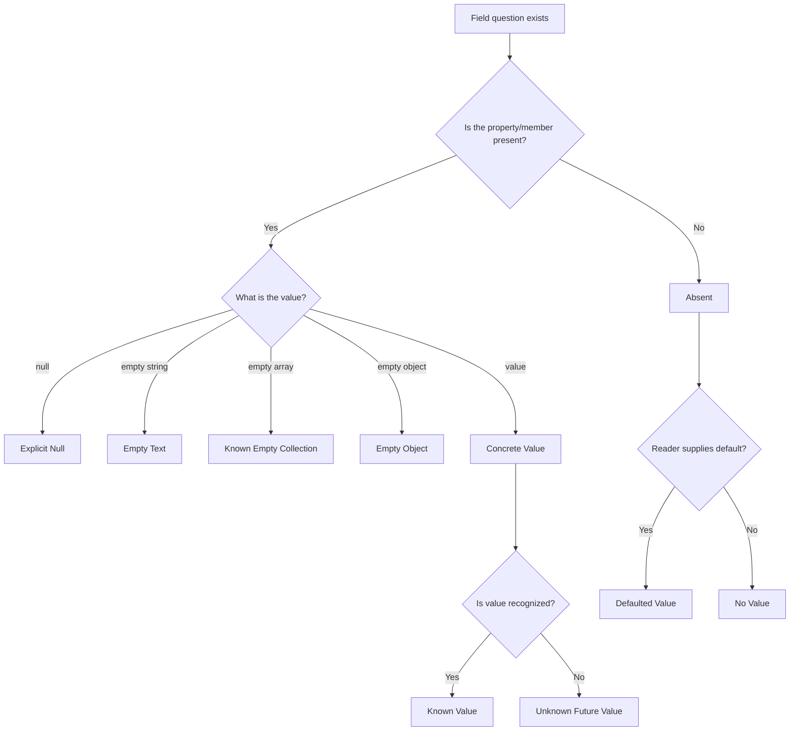
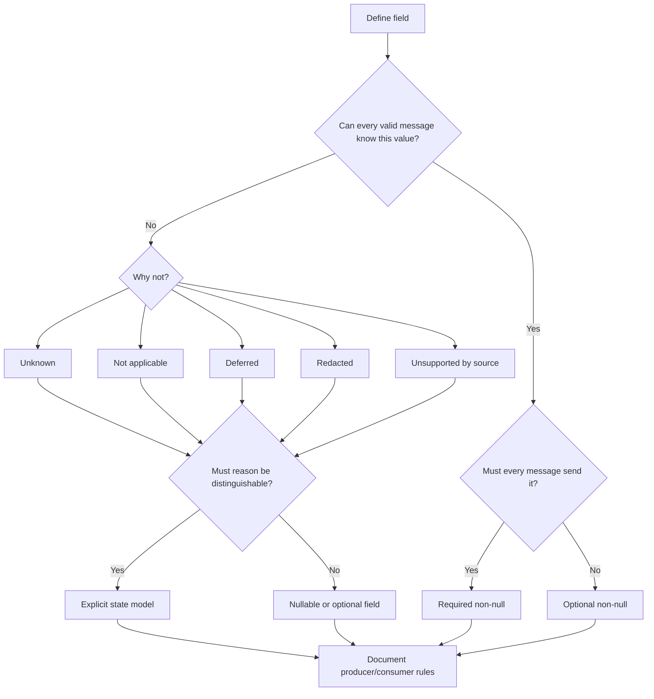
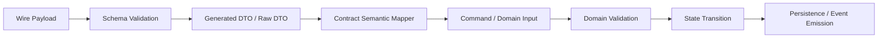

# Part 029 — Nullability, Optionality, Defaults, and Absence

Most production contract failures are not caused by complicated schemas.

They are caused by one question that looked trivial:

> Is this field required?

That question is incomplete.

A better question is:

> What are all possible states of this field, who may produce each state, who may consume each state, and what does each state mean over time?

This part is about the semantics behind `required`, `optional`, `nullable`, `default`, `missing`, `empty`, `unknown`, and `not applicable`.

Do not treat these as syntax.

Treat them as system states.

---

## 1. The Core Model

A contract field is not simply present or absent.

In production, a field can usually be in one of these states:

| State | Example | Meaning |
|---|---:|---|
| Absent | field not sent | Producer did not include the field. |
| Present with value | `"status": "OPEN"` | Producer knows and asserts a value. |
| Present with `null` | `"assignedOfficerId": null` | Producer explicitly asserts no value, unknown value, cleared value, or not applicable depending on contract. |
| Present empty string | `"comment": ""` | Producer asserts an empty textual value. This is not the same as null. |
| Present empty array | `"violations": []` | Producer asserts known empty collection. |
| Present empty object | `"metadata": {}` | Producer asserts empty structured object. |
| Defaulted | omitted but reader supplies default | Consumer sees a value not physically sent by writer. |
| Unknown | `"status": "PENDING_REGULATOR_REVIEW"` not recognized by old consumer | Producer asserts a valid value from a newer vocabulary. |
| Invalid | wrong type or invalid value | Payload violates contract. |
| Not applicable | field semantically not relevant | Domain says the question does not apply. |
| Redacted | value intentionally hidden | Security/privacy policy suppresses value. |
| Deferred | value will be known later | Workflow has not reached the state where the value exists. |
| Computed | value derived, not authored | Producer may omit because consumer can derive, or producer may include for convenience. |

If your contract only says `required: false`, it does not explain most of this table.

That is the problem.

---

## 2. The Field-State Lattice

For contract design, use a field-state lattice.



The key distinction:

- **Presence** answers whether a field/member was transmitted.
- **Nullability** answers whether `null` is a valid transmitted value.
- **Defaulting** answers whether a reader may synthesize a value.
- **Business meaning** answers what the value means.
- **Compatibility** answers whether old/new producers and consumers survive change.

A good contract names these separately.

A weak contract mixes them.

---

## 3. The Three Questions Every Field Must Answer

For every field in a production contract, ask these three questions.

### 3.1 Can the producer omit it?

This is optionality.

Examples:

- a legacy producer does not know the field yet
- a create command does not require the client to specify it
- a response intentionally suppresses a field for security
- a stream event omits fields that did not change
- a patch document only sends changed fields

### 3.2 Can the producer explicitly send null?

This is nullability.

Examples:

- `assignedOfficerId: null` means unassigned
- `closedAt: null` means not closed yet
- `reason: null` means no reason was supplied
- `dateOfBirth: null` may be forbidden because the value is sensitive, not unknown

### 3.3 If absent, may the consumer substitute a value?

This is defaulting.

Examples:

- missing Avro reader field receives a default
- UI defaults status to `DRAFT`
- database default creates `created_at`
- Java model defaults boolean to `false`
- Protobuf implicit scalar presence returns zero/false/empty string

These three questions are independent.

A field can be optional but not nullable.

A field can be required and nullable.

A field can be absent on the wire but defaulted by the reader.

A field can be present but semantically unknown.

---

## 4. The Most Dangerous Mistake: Treating Null as Missing

Consider this JSON payload:

```json
{
  "caseId": "CASE-2026-000123",
  "assignedOfficerId": null
}
```

And this payload:

```json
{
  "caseId": "CASE-2026-000123"
}
```

They are not necessarily equivalent.

Possible meanings:

| Payload | Possible meaning |
|---|---|
| field absent | Old producer does not support the field. |
| field absent | Producer did not request update to this field. |
| field absent | Producer is not authorized to see this field. |
| field absent | Producer forgot to map the field. |
| field null | Case is intentionally unassigned. |
| field null | Client requests clearing assignment. |
| field null | Source system knows there is no assignment. |
| field null | Source system cannot resolve assignment. |

Without a contract-level semantic rule, consumers guess.

When consumers guess, systems drift.

---

## 5. XSD Semantics

In XSD, optionality and nullability are different mechanisms.

### 5.1 `minOccurs`

`minOccurs="0"` means the element may be absent.

```xml
<xs:element name="assignedOfficerId" type="xs:string" minOccurs="0"/>
```

This permits:

```xml
<Case>
  <caseId>CASE-2026-000123</caseId>
</Case>
```

It does not automatically permit an explicit nil element.

### 5.2 `nillable`

`nillable="true"` means an element may appear with `xsi:nil="true"`.

```xml
<xs:element name="assignedOfficerId" type="xs:string" minOccurs="0" nillable="true"/>
```

This permits:

```xml
<assignedOfficerId xsi:nil="true" xmlns:xsi="http://www.w3.org/2001/XMLSchema-instance"/>
```

Now the field has two no-value states:

1. element absent
2. element present and nil

Do not enable both unless you have a reason.

### 5.3 Empty Element Is Not Nil

This:

```xml
<assignedOfficerId/>
```

is not the same as:

```xml
<assignedOfficerId xsi:nil="true"/>
```

For `xs:string`, an empty element may mean empty string.

For a numeric type, an empty element is invalid.

For a complex type, an empty element can mean a present object with no child content, if the type allows it.

### 5.4 Attribute Optionality

Attributes have `use`.

```xml
<xs:attribute name="schemaVersion" type="xs:string" use="required"/>
<xs:attribute name="sourceSystem" type="xs:string" use="optional"/>
```

An attribute cannot be `xsi:nil` in the same way an element can.

If you need nil semantics, use an element or an explicit status/value pair.

### 5.5 XSD Defaults

XSD supports `default` and `fixed` values.

```xml
<xs:element name="priority" type="PriorityCode" default="NORMAL" minOccurs="0"/>
```

But defaulting in XML validation/binding has operational caveats:

- not all pipelines materialize defaults into application objects the same way
- defaults can hide missing-data bugs
- defaults may be applied after validation but before binding depending on processor behavior
- generated Java classes may not clearly distinguish missing from defaulted

For production contracts, prefer explicit defaults in documentation and consumer code over invisible schema defaults unless the processor behavior is tested.

### 5.6 XSD Decision Table

| Desired semantic | XSD shape |
|---|---|
| Field must appear and must have value | `minOccurs="1"`, `nillable="false"` |
| Field may be omitted | `minOccurs="0"` |
| Field may explicitly be nil | `nillable="true"` |
| Field may be omitted or nil | `minOccurs="0" nillable="true"` — use carefully |
| Field value defaulted by schema | `default="..."` — test processor behavior |
| Field cannot vary from value | `fixed="..."` |

---

## 6. JSON Schema Semantics

JSON Schema separates property presence from value validation.

### 6.1 `required` Controls Presence

```json
{
  "type": "object",
  "required": ["caseId"],
  "properties": {
    "caseId": { "type": "string" },
    "assignedOfficerId": { "type": "string" }
  }
}
```

`caseId` must be present.

`assignedOfficerId` may be absent.

The `properties` keyword validates a property if it exists.

It does not require the property to exist.

### 6.2 `null` Is a Type

This allows string or null:

```json
{
  "type": ["string", "null"]
}
```

This allows only string:

```json
{
  "type": "string"
}
```

So these are different:

```json
{
  "properties": {
    "assignedOfficerId": { "type": "string" }
  }
}
```

and:

```json
{
  "properties": {
    "assignedOfficerId": { "type": ["string", "null"] }
  }
}
```

The first permits absence but rejects explicit null.

The second permits absence and explicit null.

### 6.3 Required and Nullable

This field must be present, but may be null:

```json
{
  "type": "object",
  "required": ["closedAt"],
  "properties": {
    "closedAt": {
      "type": ["string", "null"],
      "format": "date-time"
    }
  }
}
```

That is often useful in response contracts:

```json
{
  "caseId": "CASE-2026-000123",
  "status": "OPEN",
  "closedAt": null
}
```

The consumer can rely on the field being present, even when the value is not yet known.

### 6.4 `default` Is Not a Validation Assertion

In JSON Schema, `default` is annotation-oriented.

This schema:

```json
{
  "type": "object",
  "properties": {
    "priority": {
      "type": "string",
      "default": "NORMAL"
    }
  }
}
```

Does not require validators to modify the instance.

Do not assume this input:

```json
{}
```

becomes:

```json
{ "priority": "NORMAL" }
```

If your Java service depends on a default, apply it explicitly in mapping or command handling.

### 6.5 Empty String Is a Value

This accepts empty string:

```json
{ "type": "string" }
```

This rejects it:

```json
{
  "type": "string",
  "minLength": 1
}
```

For human-entered text, decide whether empty string means:

- intentionally blank
- user did not answer
- validation bug
- whitespace-only error
- value redacted

Do not let UI form behavior define your enterprise contract semantics by accident.

### 6.6 Empty Array Is a Value

This says `violations` must be present and may be empty:

```json
{
  "type": "object",
  "required": ["violations"],
  "properties": {
    "violations": {
      "type": "array",
      "items": { "$ref": "#/$defs/Violation" }
    }
  }
}
```

This says at least one violation is required:

```json
{
  "type": "array",
  "minItems": 1
}
```

Use empty arrays when the producer knows the collection and it is empty.

Use absence when the producer did not include or cannot know the collection.

### 6.7 JSON Schema Decision Table

| Desired semantic | JSON Schema shape |
|---|---|
| Property required and non-null | add to `required`, type excludes `null` |
| Property optional and non-null if present | omit from `required`, type excludes `null` |
| Property required but nullable | add to `required`, type includes `null` |
| Property optional and nullable | omit from `required`, type includes `null` |
| Empty string forbidden | `minLength: 1`, optionally trim in semantic layer |
| Empty array forbidden | `minItems: 1` |
| Default documented | `default`, but apply default in application code |

---

## 7. OpenAPI Semantics

OpenAPI adds HTTP API semantics around JSON Schema-like schemas.

### 7.1 Request vs Response Fields

A field can be optional in a request and required in a response.

Create request:

```yaml
type: object
required:
  - subject
properties:
  subject:
    type: string
  priority:
    type: string
    enum: [LOW, NORMAL, HIGH]
```

Response:

```yaml
type: object
required:
  - caseId
  - subject
  - priority
  - status
properties:
  caseId:
    type: string
  subject:
    type: string
  priority:
    type: string
    enum: [LOW, NORMAL, HIGH]
  status:
    type: string
    enum: [OPEN, CLOSED]
```

The server may default `priority` when omitted by the client.

But once the resource is returned, the response contract should usually include the resolved value.

### 7.2 OpenAPI 3.0 `nullable` vs JSON Schema Null Type

Older OpenAPI 3.0 documents commonly used:

```yaml
type: string
nullable: true
```

OpenAPI 3.1+ aligns more directly with JSON Schema, so nullability is modeled with `null` as a type:

```yaml
type:
  - string
  - 'null'
```

When maintaining mixed OpenAPI versions, be explicit about which dialect your tools support.

Generator behavior around nullability is one of the most common sources of Java DTO mismatch.

### 7.3 PATCH Is Not PUT

For update contracts, absence is operation-specific.

PUT often means full replacement:

```json
{
  "subject": "Late filing investigation",
  "assignedOfficerId": null
}
```

PATCH often means partial modification:

```json
{
  "assignedOfficerId": null
}
```

In a merge-patch-style contract:

- absent means leave unchanged
- null means remove or clear
- value means replace

In a command-style contract, prefer explicit operation fields:

```json
{
  "operation": "CLEAR_ASSIGNMENT",
  "caseId": "CASE-2026-000123",
  "reason": "Officer transferred"
}
```

This is more auditable than overloading null.

### 7.4 API Error Payloads Should Preserve Field State

A validation error should distinguish:

```json
{
  "code": "FIELD_REQUIRED",
  "path": "/assignedOfficerId",
  "message": "assignedOfficerId is required."
}
```

from:

```json
{
  "code": "FIELD_NULL_NOT_ALLOWED",
  "path": "/assignedOfficerId",
  "message": "assignedOfficerId must not be null."
}
```

and:

```json
{
  "code": "FIELD_EMPTY_NOT_ALLOWED",
  "path": "/assignedOfficerId",
  "message": "assignedOfficerId must not be empty."
}
```

A generic `INVALID_REQUEST` loses the diagnostic signal you need for contract enforcement.

---

## 8. Avro Semantics

Avro does not work like JSON objects where arbitrary fields may be omitted from an instance.

Avro is schema-driven.

A writer writes data according to a writer schema.

A reader reads data according to a reader schema.

Compatibility is determined by schema resolution.

### 8.1 Nullable Field

A nullable Avro field is commonly modeled as a union:

```json
{
  "name": "assignedOfficerId",
  "type": ["null", "string"],
  "default": null
}
```

The order matters because defaults for union fields correspond to the first matching branch.

The common convention is:

```json
"type": ["null", "string"],
"default": null
```

### 8.2 Non-Nullable Required Field

```json
{
  "name": "caseId",
  "type": "string"
}
```

A record encoded with this schema includes the value as part of the record structure.

There is no JSON-style optional property omission inside the encoded Avro record.

### 8.3 Adding a Field Safely

If a new reader expects a new field, old writer data will not contain it.

So the new field needs a default for backward compatibility:

```json
{
  "name": "priority",
  "type": "string",
  "default": "NORMAL"
}
```

or:

```json
{
  "name": "assignedOfficerId",
  "type": ["null", "string"],
  "default": null
}
```

The default is used during schema resolution when the writer schema lacks the field.

It is not necessarily a value physically written by old producers.

### 8.4 Default Is Reader-Time Compatibility Mechanism

This is subtle.

Avro defaults are most important when reading data written with older schemas.

They do not mean producers may forget to set business-required values.

So this is wrong as an engineering rule:

> The Avro field has a default, so the producer does not need to think about it.

A better rule:

> The Avro field has a default so new readers can read old data during schema evolution.

### 8.5 Avro Decision Table

| Desired semantic | Avro shape |
|---|---|
| Required non-null field | plain type, no `null` union |
| Nullable field | union with `null`, usually `default: null` |
| Add backward-compatible field | provide default in new reader schema |
| Represent known empty collection | array with zero items |
| Represent absent collection | use nullable union or evolution default, depending semantics |
| Avoid stringly decimal/time | use logical types where appropriate |

---

## 9. Protobuf Semantics

Protobuf has a different trap: default values can hide absence.

### 9.1 Implicit Presence

In proto3 implicit presence, accessing a missing scalar field returns its default value.

Examples:

- missing string -> `""`
- missing bool -> `false`
- missing int32 -> `0`
- missing enum -> first enum value, which must be zero

That means this question is dangerous:

> Is `priority == PRIORITY_UNSPECIFIED` because the producer sent it, or because it was absent?

Under implicit presence, you may not know.

### 9.2 Explicit Presence with `optional`

Use `optional` when absence matters.

```proto
syntax = "proto3";

message CaseAssignment {
  string case_id = 1;
  optional string assigned_officer_id = 2;
}
```

Generated Java APIs can expose `hasAssignedOfficerId()` for explicit presence fields.

### 9.3 Message Fields Have Presence

```proto
message CaseRecord {
  string case_id = 1;
  Assignment assignment = 2;
}

message Assignment {
  string officer_id = 1;
}
```

A message field can generally distinguish unset from set.

This is often better than a scalar when the field has lifecycle or metadata.

### 9.4 `oneof` for Clear Semantics

If you need to distinguish assigned vs unassigned vs unknown, use an explicit state model.

```proto
message AssignmentState {
  oneof state {
    Assigned assigned = 1;
    Unassigned unassigned = 2;
    AssignmentUnknown unknown = 3;
  }
}

message Assigned {
  string officer_id = 1;
}

message Unassigned {
  string reason = 1;
}

message AssignmentUnknown {
  string source_system = 1;
}
```

This is verbose.

It is also clear.

For regulatory systems, clear beats clever.

### 9.5 Wrapper Types Are Not a Complete Domain Model

Wrapper types can represent nullable scalar-like values, but they do not explain the business reason for absence.

A wrapper can tell you:

> value present or not present

It cannot tell you:

> not applicable, redacted, unknown, deferred, cleared by command, or unsupported by source system

Use wrappers for technical presence.

Use explicit state messages for business semantics.

### 9.6 Protobuf Decision Table

| Desired semantic | Protobuf shape |
|---|---|
| Scalar where absence does not matter | normal proto3 scalar |
| Scalar where absence matters | `optional` scalar or message wrapper |
| Business state variants | `oneof` with named messages |
| Unknown future enum value safe handling | zero `*_UNSPECIFIED`, reserved deleted numbers, handle unrecognized values in Java |
| Nullable JSON-style API field | be careful with ProtoJSON; test mapping |
| Clear vs not provided | explicit presence or command message |

---

## 10. Java Semantics

Java has its own traps.

### 10.1 Primitive Types Lose Absence

```java
public record CaseRequest(
    String caseId,
    boolean expedited
) {}
```

If `expedited` is missing in JSON and the mapper defaults it to `false`, the service cannot distinguish:

- client explicitly sent `false`
- client omitted the field
- mapper defaulted the field

Use wrapper types at boundary when absence matters:

```java
public record CaseRequest(
    String caseId,
    Boolean expedited
) {}
```

But do not stop there.

`Boolean` gives technical nullability, not business semantics.

### 10.2 `Optional` Is Usually Bad for DTO Fields

`Optional<T>` is useful for return values and APIs where absence is part of method contract.

For serialized DTO fields, it often creates friction with frameworks, reflection, JSON binding, generated code, validation, and schema generation.

Prefer:

```java
public record CreateCaseRequest(
    String subject,
    String priority
) {}
```

plus explicit mapper logic:

```java
Priority resolvedPriority = request.priority() == null
    ? Priority.NORMAL
    : Priority.parse(request.priority());
```

For patch semantics, use an explicit tri-state abstraction in application code.

### 10.3 Tri-State Patch Value

A patch field needs at least three states:

1. absent — do not change
2. null — clear value
3. value — set value

A Java boundary model can represent this explicitly:

```java
public sealed interface PatchField<T>
    permits PatchField.Absent, PatchField.NullValue, PatchField.Value {

    record Absent<T>() implements PatchField<T> {}
    record NullValue<T>() implements PatchField<T> {}
    record Value<T>(T value) implements PatchField<T> {}
}
```

Then a patch command becomes:

```java
public record UpdateAssignmentPatch(
    String caseId,
    PatchField<String> assignedOfficerId
) {}
```

This is more honest than pretending `String assignedOfficerId` is enough.

### 10.4 Bean Validation Is Not the Full Contract

```java
public record CreateCaseRequest(
    @NotBlank String subject,
    @NotNull Priority priority
) {}
```

Bean Validation is useful.

But it usually cannot express all schema-level and protocol-level semantics:

- JSON property absent vs present null
- Protobuf implicit presence
- Avro reader/writer defaults
- XSD nil vs absent
- OpenAPI request/response differences
- oneOf discriminator semantics
- cross-field lifecycle rules

Use Bean Validation as an application guard, not as the only contract.

---

## 11. Database Semantics

Database `NULL` is not the same as contract null.

A nullable database column can mean:

- unknown
- not applicable
- not yet assigned
- legacy missing value
- intentionally cleared
- redacted before storage
- migration not complete

If those meanings matter, do not encode all of them as SQL `NULL`.

Use explicit columns or state tables.

Bad:

```sql
assigned_officer_id text null
```

Better for simple cases:

```sql
assignment_status text not null,
assigned_officer_id text null,
assignment_reason text null
```

Better for lifecycle-heavy domains:

```sql
case_assignment (
  case_id text not null,
  assignment_state text not null,
  officer_id text null,
  reason_code text null,
  effective_from timestamptz not null,
  effective_to timestamptz null,
  decided_by text not null,
  decision_event_id text not null
)
```

In regulatory systems, state usually deserves a model.

---

## 12. Defaults: Four Different Kinds

The word `default` is overloaded.

### 12.1 Schema Default

Defined in XSD, JSON Schema annotation, Avro schema, or OpenAPI schema.

Purpose varies by format.

### 12.2 Application Default

Applied by Java service code.

Example:

```java
Priority priority = request.priority() == null
    ? Priority.NORMAL
    : request.priority();
```

This is visible in code and tests.

### 12.3 Storage Default

Applied by database.

Example:

```sql
created_at timestamptz not null default now()
```

Useful for audit timestamps, but be careful when application and database clocks differ.

### 12.4 UI Default

Applied by frontend or user interface.

This should not be the only default source for critical behavior.

If a batch job or API client bypasses the UI, the backend still needs a rule.

### 12.5 Default Decision Matrix

| Default kind | Good for | Dangerous when |
|---|---|---|
| Schema default | compatibility metadata, documentation, Avro reader evolution | people assume validator mutates payload |
| Application default | business behavior | scattered in multiple services |
| Storage default | audit technical fields | domain defaults hidden from API contract |
| UI default | user convenience | backend relies on UI-only behavior |

---

## 13. Create, Replace, Patch, and Event Semantics

The same field can have different rules by message type.

### 13.1 Create Command

```json
{
  "subject": "Late filing investigation"
}
```

`priority` may be omitted because the server chooses default.

### 13.2 Replace Command

```json
{
  "subject": "Late filing investigation",
  "priority": "NORMAL",
  "assignedOfficerId": null
}
```

All replaceable fields should be present.

Null may mean clear.

### 13.3 Patch Command

```json
{
  "assignedOfficerId": null
}
```

Absent means unchanged.

Null means clear.

Value means set.

### 13.4 Event

```json
{
  "eventType": "CASE_ASSIGNMENT_CLEARED",
  "caseId": "CASE-2026-000123",
  "previousOfficerId": "OFF-931",
  "clearedBy": "USR-884",
  "reasonCode": "OFFICER_TRANSFERRED"
}
```

Events should usually be explicit about what happened.

Do not emit vague entity snapshots where consumers must infer whether null means cleared, unknown, or not loaded.

---

## 14. Compatibility Matrix

| Change | XSD | JSON Schema/OpenAPI | Avro | Protobuf | Risk |
|---|---|---|---|---|---|
| Add optional non-null field | usually safe | usually safe | safe if default exists for readers | safe if new tag | Low |
| Add required field | breaking for old producers | breaking for old producers | breaking unless reader default handles old data | may be okay on wire but semantically breaking | High |
| Make optional field required | breaking | breaking | may break readers/producers depending resolution | semantically breaking | High |
| Allow null where not allowed before | usually non-breaking for producer, may break consumers | may break consumers not expecting null | union change requires compatibility check | presence/model dependent | Medium |
| Disallow null previously allowed | breaking for existing producers | breaking | breaking if data contains null | breaking semantically | High |
| Add default | may change behavior | annotation only in JSON Schema | can improve backward compatibility | no proto3 field default customization | Medium |
| Remove default | can break old data reads | maybe docs-only | dangerous | N/A or semantic | Medium/High |
| Treat empty string as invalid | breaking | breaking | semantic | semantic | Medium/High |
| Collapse unknown/not-applicable into null | may validate but loses meaning | may validate but loses meaning | may validate but loses meaning | may validate but loses meaning | High |

The rule:

> Syntax compatibility is not enough. Semantic compatibility is the real contract.

---

## 15. Decision Framework

Use this sequence for every important field.



If the reason matters to business, compliance, audit, or incident triage, model it explicitly.

---

## 16. Recommended Field Semantic Patterns

### 16.1 Required Immutable Identity

Use for resource IDs after creation.

```yaml
caseId:
  type: string
  minLength: 1
```

Rules:

- required in responses
- absent in create request if server generates it
- never nullable
- never empty
- opaque to consumers

### 16.2 Optional Input With Server Default

```yaml
priority:
  type: string
  enum: [LOW, NORMAL, HIGH]
  default: NORMAL
```

Rules:

- optional in create request
- required in response
- default applied by service, not assumed from schema only
- default decision logged if relevant

### 16.3 Explicit Lifecycle State

Bad:

```json
{ "closedAt": null }
```

Better:

```json
{
  "closure": {
    "state": "NOT_CLOSED"
  }
}
```

or:

```json
{
  "closure": {
    "state": "CLOSED",
    "closedAt": "2026-07-03T09:10:11Z",
    "reasonCode": "NO_VIOLATION_FOUND"
  }
}
```

Use explicit state when the absence is a workflow fact.

### 16.4 Redacted Value

Bad:

```json
{ "reporterName": null }
```

Better:

```json
{
  "reporterName": {
    "visibility": "REDACTED",
    "redactionReason": "PRIVACY_POLICY"
  }
}
```

Security nulls should not look like missing data.

### 16.5 Unknown Future Value

For vocabularies, prefer explicit unknown-handling.

```json
{
  "status": "PENDING_REGULATOR_CONFIRMATION"
}
```

Old consumers should not crash.

They should:

- preserve the value if forwarding
- display fallback label
- avoid invalid state transitions
- emit telemetry
- fail closed only when required

---

## 17. Java Boundary Architecture

A production service should separate these layers:



Do not let generated DTO nullability leak into your domain model.

A generated class tells you what the wire shape can carry.

It does not tell you what the business operation means.

---

## 18. Contract Lint Rules

A serious contract repository should reject ambiguous no-value design.

Example policy:

```yaml
rules:
  no_ambiguous_nullable:
    description: Nullable fields must document null semantics.
    appliesTo:
      - openapi
      - json_schema
      - avro
    requireExtension: x-null-semantics

  no_optional_required_confusion:
    description: Optional request fields with defaults must define default owner.
    requireExtension: x-default-owner
    allowedValues:
      - service
      - database
      - ui
      - reader_schema

  no_empty_string_identity:
    description: ID fields must reject empty strings.
    fieldNamePattern: ".*(Id|ID)$"
    require:
      minLength: 1

  patch_fields_must_define_absence:
    description: Patch schemas must define absent/null/value semantics.
    pathPattern: ".*Patch.*"
    requireExtension: x-patch-semantics
```

Example OpenAPI extension:

```yaml
assignedOfficerId:
  type:
    - string
    - 'null'
  x-null-semantics: "null means explicitly unassigned; absence means unchanged in PATCH requests"
  x-default-owner: none
```

Extensions are not magic.

They make review and automation possible.

---

## 19. Anti-Patterns

### 19.1 Everything Nullable

```yaml
properties:
  caseId:
    type: [string, 'null']
  status:
    type: [string, 'null']
  createdAt:
    type: [string, 'null']
```

This is not flexible.

It is an absence of design.

### 19.2 Required Means Business Required Everywhere

A field may be required in response but optional in create request.

Do not reuse one schema for every operation if lifecycle semantics differ.

### 19.3 Null Means Clear in Every Context

Null may mean clear in PATCH.

Null may mean not closed in response.

Null may mean unknown in event.

Null may mean redacted in query result.

One field name does not imply one null semantic across all message types.

### 19.4 Default Hidden in Generated Code

Generated Java classes may initialize fields.

That does not mean the producer intentionally supplied the value.

### 19.5 Avro Default Used as Business Default Without Tests

Avro default is often used during schema resolution.

If your business process depends on it, write compatibility and replay tests.

### 19.6 Protobuf Zero Value Treated as Real Value

`0`, `false`, and empty string may be defaults, not producer assertions.

Use explicit presence if the difference matters.

---

## 20. Regulatory Case Management Example

Suppose we model assignment.

Weak model:

```json
{
  "caseId": "CASE-2026-000123",
  "assignedOfficerId": null
}
```

Questions unanswered:

- Is the case unassigned?
- Was assignment cleared?
- Is the officer hidden from this consumer?
- Is the source system too old?
- Is this a partial response?
- Is this a patch command?
- Is this field not applicable for this case type?

Better response model:

```json
{
  "caseId": "CASE-2026-000123",
  "assignment": {
    "state": "UNASSIGNED",
    "reasonCode": "OFFICER_TRANSFERRED",
    "effectiveAt": "2026-07-03T09:10:11Z"
  }
}
```

Better assigned model:

```json
{
  "caseId": "CASE-2026-000123",
  "assignment": {
    "state": "ASSIGNED",
    "officerId": "OFF-931",
    "assignedAt": "2026-07-03T09:10:11Z",
    "assignedBy": "USR-884"
  }
}
```

Better redacted model:

```json
{
  "caseId": "CASE-2026-000123",
  "assignment": {
    "state": "REDACTED",
    "redactionReason": "ROLE_NOT_AUTHORIZED"
  }
}
```

Now consumers can reason.

Auditors can reason.

Incident responders can reason.

---

## 21. Production Checklist

For every important contract field, answer:

- Is the field required in each operation?
- May the field be omitted?
- May the field be explicitly null/nil/unset?
- Does absence differ from null?
- Does empty string differ from null?
- Does empty array differ from absence?
- Who applies defaults?
- Are defaults visible in tests?
- Can old producers omit this field safely?
- Can old consumers tolerate this field safely?
- Does Java generated code preserve presence?
- Does database storage preserve meaning?
- Does event replay preserve meaning?
- Does logging/telemetry preserve the distinction?
- Does the error model distinguish missing/null/empty/invalid?
- Does documentation define business semantics, not only schema syntax?

If you cannot answer these, the field is not production-ready.

---

## 22. Review Questions

1. Why is `required` not the opposite of `nullable`?
2. Why is JSON Schema `default` dangerous if treated as a mutating rule?
3. Why does Protobuf implicit presence create ambiguity for scalar fields?
4. Why does Avro need defaults for backward-compatible field addition?
5. Why should PATCH contracts define absent/null/value separately?
6. Why is database `NULL` not enough for regulatory-grade state?
7. When should you model absence as an explicit state object?
8. What should validation error payloads distinguish?

---

## 23. Exercises

### Exercise 1 — Classify Field States

Take this field:

```text
case.closedAt
```

Define meanings for:

- absent
- null
- empty string
- valid timestamp
- redacted
- not applicable

Then decide which of those states should be valid in:

- create request
- update request
- case response
- case event
- case search index

### Exercise 2 — Convert Nullable Field to State Model

Start with:

```json
{
  "assignedOfficerId": null
}
```

Design a better contract using explicit assignment states.

Include JSON Schema and Java domain model.

### Exercise 3 — Add a Field Safely in Avro

Given an old Avro schema without `priority`, add `priority` safely.

Define:

- schema change
- default value
- compatibility mode
- replay test
- downstream behavior

### Exercise 4 — Protobuf Presence Test

Create a proto3 message with:

- normal scalar string
- optional scalar string
- message field
- oneof state

Write Java tests showing which fields support `hasX()` semantics.

---

## 24. Key Takeaways

Nullability is not optionality.

Optionality is not defaulting.

Defaulting is not business meaning.

Absence is not always unknown.

Null is not always clear.

Empty is not always invalid.

Generated Java code is not a domain model.

A production-grade data contract makes no-value states explicit enough that producers, consumers, validators, storage, replay, audit, and humans reach the same conclusion.

That is the bar.

---

## 25. References

- JSON Schema Draft 2020-12: https://json-schema.org/draft/2020-12
- JSON Schema Validation Vocabulary 2020-12: https://json-schema.org/draft/2020-12/json-schema-validation
- OpenAPI Specification 3.2.0: https://spec.openapis.org/oas/v3.2.0.html
- Apache Avro 1.12.0 Specification: https://avro.apache.org/docs/1.12.0/specification/
- Protocol Buffers Proto3 Language Guide: https://protobuf.dev/programming-guides/proto3/
- Protocol Buffers Field Presence: https://protobuf.dev/programming-guides/field_presence/
- W3C XML Schema 1.1 Structures: https://www.w3.org/TR/xmlschema11-1/
