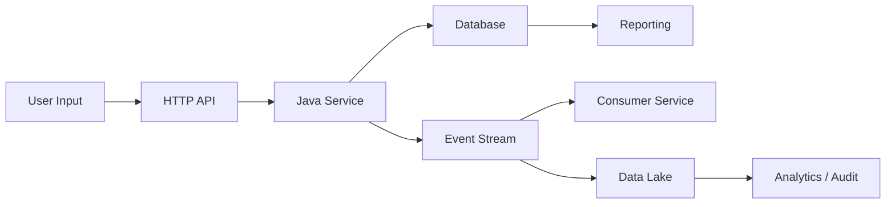
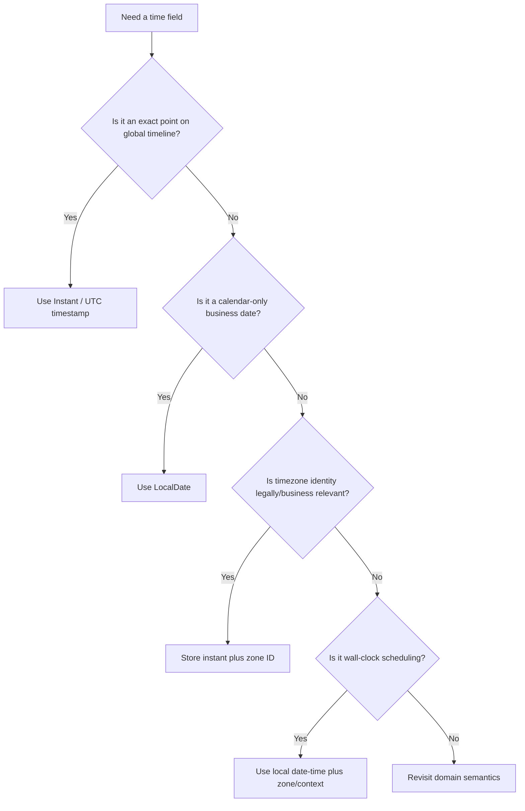

# Part 030 — Time, Money, Identity, and Precision Contracts

Some fields are more dangerous than others.

`name` can be messy.

`comment` can be long.

`status` can evolve.

But four categories silently destroy systems when modeled poorly:

1. time
2. money
3. identity
4. numeric precision

These fields look primitive.

They are not primitive.

They encode policy.

They encode authority.

They encode auditability.

They encode legal meaning.

A top-tier engineer does not ask:

> Should this be a string or a number?

They ask:

> What real-world invariant must survive API calls, events, storage, replay, analytics, time zones, language runtimes, and future migrations?

---

## 1. Why These Fields Deserve Special Treatment

Time, money, identity, and precision cross almost every boundary:



If the contract is weak at the edge, every downstream system compensates differently.

That creates:

- off-by-one-day bugs
- timezone drift
- duplicate resources
- non-idempotent retries
- money rounding loss
- broken reconciliation
- impossible audit trails
- unsafe migrations
- JavaScript integer truncation
- event replay mismatch
- inconsistent regulatory evidence

The solution is not simply “use ISO date” or “use BigDecimal”.

The solution is a contract-level value design.

---

## 2. Time Is Not One Thing

The word `timestamp` is overloaded.

A time field may mean:

| Concept | Example | Meaning |
|---|---:|---|
| Instant | `2026-07-03T09:10:11Z` | Exact point on global timeline. |
| Offset date-time | `2026-07-03T16:10:11+07:00` | Local representation with numeric offset. |
| Zoned date-time | `2026-07-03T16:10:11[Asia/Jakarta]` | Local representation with time-zone rules. |
| Local date | `2026-07-03` | Calendar date without time of day. |
| Local time | `09:00:00` | Time of day without date/timezone. |
| Local date-time | `2026-07-03T09:00:00` | Wall-clock date/time without timezone. Dangerous across systems. |
| Business effective date | `2026-07-01` | Rule becomes effective for business/regulatory purposes. |
| Processing time | ingestion timestamp | When the system processed the event. |
| Event occurrence time | violation observed time | When domain event happened. |
| Record creation time | DB `created_at` | When row was created. |
| Decision time | enforcement decision timestamp | When authorized decision was made. |
| Valid time | period in real world | When fact is true in domain. |
| Transaction time | period in database/system | When system knew the fact. |

A single `createdAt` field cannot cover all of these.

---

## 3. Time Contract Decision Tree



This tree prevents the lazy default:

> Just use timestamp.

---

## 4. Instant Fields

Use an instant for machine events and audit facts that occur at a precise point on the global timeline.

Examples:

- `receivedAt`
- `ingestedAt`
- `decisionRecordedAt`
- `eventPublishedAt`
- `paymentCapturedAt`
- `caseClosedAt`

JSON/OpenAPI shape:

```yaml
closedAt:
  type: string
  format: date-time
  description: "UTC instant when the case was closed. Must include timezone offset. Canonical form is UTC Z."
  example: "2026-07-03T09:10:11Z"
```

Java model:

```java
public record CaseClosure(
    Instant closedAt,
    String closedBy,
    String reasonCode
) {}
```

Database:

```sql
closed_at timestamptz not null
```

Rules:

- serialize with offset, preferably canonical UTC `Z`
- never use server-local timezone as implicit context
- do not store as formatted string in database if the database supports timestamp with timezone semantics
- define precision: seconds, milliseconds, microseconds, or nanoseconds
- do not compare string timestamps lexically unless canonical format is enforced

---

## 5. Local Date Fields

Use local date for calendar dates that are not instants.

Examples:

- birth date
- filing date
- license effective date
- due date by local jurisdiction
- reporting period start date
- business date

JSON/OpenAPI shape:

```yaml
filingDate:
  type: string
  format: date
  description: "Local calendar date on which the filing was submitted in the filing jurisdiction."
  example: "2026-07-03"
```

Java model:

```java
public record FilingInfo(
    LocalDate filingDate,
    String jurisdictionCode
) {}
```

Database:

```sql
filing_date date not null,
jurisdiction_code text not null
```

Rules:

- do not convert local date to midnight UTC
- do not store birth date as timestamp
- do not attach arbitrary timezone just to satisfy a timestamp type
- always define the business calendar context when jurisdiction matters

A due date is not an instant until you define the cutoff rule.

For example:

```text
Due date: 2026-07-03
Cutoff: 23:59:59 in Asia/Jakarta, excluding official holidays
```

That is a policy, not just a field type.

---

## 6. Local Date-Time Fields

A local date-time without timezone is dangerous across distributed systems.

```json
{
  "inspectionScheduledAt": "2026-07-03T09:00:00"
}
```

Where is 09:00?

Jakarta?

UTC?

The regulated entity's local office?

The inspector's calendar?

The regulator's jurisdiction?

If you use local date-time, include context:

```json
{
  "inspectionSchedule": {
    "localDateTime": "2026-07-03T09:00:00",
    "timeZone": "Asia/Jakarta",
    "jurisdictionCode": "ID-JK"
  }
}
```

Java model:

```java
public record LocalSchedule(
    LocalDateTime localDateTime,
    ZoneId timeZone,
    String jurisdictionCode
) {}
```

Rules:

- local date-time must not travel alone
- include zone ID when actual future occurrence matters
- include jurisdiction/calendar rule when legal due dates matter
- convert to `Instant` only when the rule is resolved

---

## 7. Time Zone: Offset Is Not Zone

`+07:00` is an offset.

`Asia/Jakarta` is a time zone identifier.

An offset tells you the numeric difference from UTC at one moment.

A zone ID tells you the rule set used to resolve local times over time.

For historical/future scheduling, zone identity may matter.

Example:

```json
{
  "scheduledStart": {
    "localDateTime": "2026-07-03T09:00:00",
    "zoneId": "Asia/Jakarta"
  }
}
```

If the event has already happened and you only need exact ordering, store the resolved instant:

```json
{
  "inspectionStartedAt": "2026-07-03T02:00:00Z"
}
```

For regulatory audit, sometimes store both:

```json
{
  "inspectionStartedAt": "2026-07-03T02:00:00Z",
  "localObservedAt": "2026-07-03T09:00:00",
  "zoneId": "Asia/Jakarta"
}
```

This lets humans reconstruct what was seen locally while machines compare global time.

---

## 8. Time Precision

Define precision explicitly.

| Precision | Use case |
|---|---|
| date | business calendar day |
| second | coarse audit/event time |
| millisecond | common API/event precision |
| microsecond | database/event log precision in some stacks |
| nanosecond | JVM can represent, many systems cannot preserve |

Danger:

```text
Java Instant supports nanoseconds.
PostgreSQL often stores microsecond precision.
JSON clients may send milliseconds.
Avro logical type may be millis or micros.
Protobuf Timestamp supports seconds+nanos.
```

If your system compares exact values after roundtrip, precision mismatch can break tests and idempotency.

Contract rule example:

```yaml
occurredAt:
  type: string
  format: date-time
  x-time-semantics:
    kind: instant
    canonicalTimezone: UTC
    precision: milliseconds
    truncateInboundTo: milliseconds
    rejectHigherPrecision: false
```

Application rule:

```java
Instant normalized = instant.truncatedTo(ChronoUnit.MILLIS);
```

But be careful: truncation is a policy.

Document it.

---

## 9. Time in XSD, JSON Schema, Avro, Protobuf, OpenAPI

### 9.1 XSD

XSD has temporal datatypes such as `xs:date`, `xs:dateTime`, and `xs:time`.

Example:

```xml
<xs:element name="closedAt" type="xs:dateTime"/>
<xs:element name="filingDate" type="xs:date"/>
```

Contract rule still matters:

- does `xs:dateTime` require timezone?
- what precision is allowed?
- is canonical UTC required?
- is local date interpreted by jurisdiction?

Schema type alone does not answer all business semantics.

### 9.2 JSON Schema

JSON Schema commonly uses string with `format`.

```json
{
  "type": "string",
  "format": "date-time"
}
```

But `format` behavior depends on validator vocabulary/configuration.

Do not assume every validator enforces it unless tested.

Use additional constraints and semantic validation when needed.

### 9.3 OpenAPI

OpenAPI schemas commonly use:

```yaml
type: string
format: date-time
```

or:

```yaml
type: string
format: date
```

But API contracts should also define:

- timezone requirement
- precision
- canonical serialization
- whether null is allowed
- whether field is server-generated
- whether client may supply it

### 9.4 Avro

Avro has logical types for date/time/timestamp concepts.

Examples:

```json
{
  "name": "closedAt",
  "type": {
    "type": "long",
    "logicalType": "timestamp-millis"
  }
}
```

```json
{
  "name": "filingDate",
  "type": {
    "type": "int",
    "logicalType": "date"
  }
}
```

Rules:

- choose millis vs micros deliberately
- do not mix local timestamp and instant timestamp carelessly
- test Java logical type conversions
- ensure data lake readers preserve logical metadata

### 9.5 Protobuf

Protobuf provides well-known types such as `google.protobuf.Timestamp`.

```proto
import "google/protobuf/timestamp.proto";

message CaseClosed {
  string case_id = 1;
  google.protobuf.Timestamp closed_at = 2;
}
```

For local dates, many teams define their own message or use `google.type.Date` where available in their ecosystem.

Example custom date:

```proto
message LocalDate {
  int32 year = 1;
  int32 month = 2;
  int32 day = 3;
}
```

Do not encode local date as midnight timestamp.

That creates timezone bugs.

---

## 10. Money Is Not a Floating-Point Number

Money has at least these dimensions:

- amount
- currency
- scale
- rounding rule
- jurisdiction
- tax inclusion/exclusion
- effective date
- source authority
- calculation trace

Bad:

```json
{
  "penaltyAmount": 1250.1
}
```

Better:

```json
{
  "penalty": {
    "amount": "1250.10",
    "currency": "USD"
  }
}
```

Why string?

Because many JSON consumers parse numbers as binary floating-point.

A decimal string preserves exact decimal representation across languages.

Java model:

```java
public record Money(
    BigDecimal amount,
    Currency currency
) {
    public Money {
        Objects.requireNonNull(amount);
        Objects.requireNonNull(currency);
        amount = amount.setScale(currency.getDefaultFractionDigits(), RoundingMode.UNNECESSARY);
    }
}
```

But even this is not enough for all domains.

Some currencies have unusual minor units.

Some calculations require more internal precision than display precision.

Some regulatory fines use formula-specific rounding.

So the contract must define the rule.

---

## 11. Money Contract Shapes

### 11.1 Decimal String Shape

OpenAPI/JSON Schema:

```yaml
Money:
  type: object
  required:
    - amount
    - currency
  properties:
    amount:
      type: string
      pattern: "^-?[0-9]+\\.[0-9]{2}$"
      description: "Exact decimal amount as string. No thousands separator."
      example: "1250.10"
    currency:
      type: string
      minLength: 3
      maxLength: 3
      pattern: "^[A-Z]{3}$"
      example: "USD"
```

Pros:

- exact in JSON
- safe across JavaScript, Java, Go, Python, .NET
- easy to inspect
- no binary floating-point loss

Cons:

- requires parsing
- schema pattern must match currency scale policy
- consumers may still treat it as text incorrectly

### 11.2 Minor Unit Integer Shape

```json
{
  "amountMinor": 125010,
  "currency": "USD"
}
```

This means 1250.10 USD if USD has 2 decimal minor units.

Pros:

- exact integer arithmetic
- good for payment ledgers
- compact

Cons:

- currency scale matters
- not all business calculations fit display minor units
- JavaScript integer safety can become an issue for large values
- redenomination or special currency behavior needs governance

### 11.3 Decimal Logical Type Shape in Avro

Avro decimal logical type:

```json
{
  "name": "penaltyAmount",
  "type": {
    "type": "bytes",
    "logicalType": "decimal",
    "precision": 18,
    "scale": 2
  }
}
```

Include currency separately:

```json
{
  "name": "currency",
  "type": "string"
}
```

Rules:

- precision is total digits
- scale is digits to right of decimal point
- Java maps naturally to `BigDecimal` when conversion is configured
- default values and fixed/bytes behavior must be tested

### 11.4 Protobuf Money Shape

Protobuf has no universal built-in decimal scalar.

Use an explicit message.

Decimal string:

```proto
message Money {
  string amount = 1;   // exact decimal string, e.g. "1250.10"
  string currency = 2; // ISO-like uppercase code by contract policy
}
```

Units/nanos style:

```proto
message MoneyAmount {
  string currency = 1;
  int64 units = 2;
  int32 nanos = 3;
}
```

Use one style consistently.

Do not use `double` for money.

---

## 12. Rounding Is Part of the Contract

Rounding is not an implementation detail.

Example:

```text
basePenalty = 1000.00
multiplier = 1.125
```

Possible results:

- 1125.00
- 1125
- 1125.0
- 1125.000
- 1125.01 depending intermediate rounding

Contract extension:

```yaml
PenaltyCalculation:
  type: object
  required:
    - baseAmount
    - multiplier
    - finalAmount
    - roundingMode
  properties:
    baseAmount:
      $ref: '#/components/schemas/Money'
    multiplier:
      type: string
      pattern: "^[0-9]+(\\.[0-9]+)?$"
    finalAmount:
      $ref: '#/components/schemas/Money'
    roundingMode:
      type: string
      enum: [HALF_UP, HALF_EVEN, DOWN, UP]
    roundingScale:
      type: integer
      minimum: 0
```

Java:

```java
BigDecimal finalAmount = base
    .multiply(multiplier)
    .setScale(2, RoundingMode.HALF_UP);
```

For regulatory defensibility, store calculation inputs and rule version.

```json
{
  "penaltyCalculation": {
    "ruleVersion": "SANCTION_RULES_2026_01",
    "baseAmount": { "amount": "1000.00", "currency": "USD" },
    "multiplier": "1.125",
    "roundingMode": "HALF_UP",
    "roundingScale": 2,
    "finalAmount": { "amount": "1125.00", "currency": "USD" }
  }
}
```

---

## 13. Numeric Precision Beyond Money

Precision bugs are not limited to money.

Examples:

- risk score
- probability
- weight
- distance
- percentage
- tax rate
- interest rate
- threshold
- measurement reading
- duration
- count
- sequence number
- version number

For every numeric field define:

- integer or decimal
- signed or unsigned semantics
- minimum/maximum
- scale
- precision
- unit
- rounding
- overflow policy
- serialization shape
- Java type
- database type
- cross-language safety

### 13.1 Bad Numeric Contract

```yaml
riskScore:
  type: number
```

What is the range?

Can it be 0?

Can it be 1?

Can it be 100?

How many decimals?

What does it mean?

### 13.2 Better Numeric Contract

```yaml
riskScore:
  type: string
  pattern: "^(0(\\.[0-9]{1,4})?|1(\\.0000?)?)$"
  description: "Risk probability from 0 to 1 inclusive, exact decimal string, max 4 fractional digits."
  example: "0.8750"
```

Or if integer score:

```yaml
riskScore:
  type: integer
  minimum: 0
  maximum: 1000
  description: "Integer risk score. Higher means greater enforcement priority."
```

Do not leave numeric semantics to consumer interpretation.

---

## 14. JavaScript Integer Safety and JSON APIs

JSON itself does not define int32/int64.

Many JavaScript environments represent numbers as IEEE-754 double precision values.

That means large integers can lose precision.

Dangerous JSON:

```json
{
  "ledgerEntryId": 9223372036854775807
}
```

Safer:

```json
{
  "ledgerEntryId": "9223372036854775807"
}
```

Contract rule:

```yaml
ledgerEntryId:
  type: string
  pattern: "^[0-9]{1,19}$"
  description: "Decimal string representation of 64-bit ledger entry identifier."
```

For public APIs, prefer opaque string IDs.

For internal binary Protobuf, `int64` may be fine, but be aware of ProtoJSON mapping.

---

## 15. Identity Is Not Just ID Type

An ID field has semantics.

Examples:

| ID type | Purpose |
|---|---|
| Resource ID | Identifies API resource. |
| Business key | Identifies real-world/business entity. |
| Surrogate key | Internal database identity. |
| Correlation ID | Connects operations across services. |
| Causation ID | Points to command/event that caused another event. |
| Idempotency key | Deduplicates retries. |
| External reference | ID assigned by partner/source system. |
| Natural key | Meaningful key from domain data. |
| Trace ID | Observability/distributed tracing. |
| Version ID | Distinguishes revisions of same logical entity. |

Never use one ID field for all of these.

---

## 16. Opaque Public IDs

A public API resource ID should usually be opaque.

Good:

```json
{
  "caseId": "CASE-2026-000123"
}
```

or:

```json
{
  "caseId": "01J1Z9S3M8Q6D7E8F9G0H1J2K3"
}
```

Bad:

```json
{
  "caseId": 982371
}
```

if that number is your database primary key and consumers start relying on ordering, gaps, or meaning.

Rules:

- do not expose internal DB primary keys unless deliberately accepted
- do not encode mutable business state into ID
- do not let consumers parse ID structure unless contract explicitly allows it
- document case sensitivity
- document max length
- document allowed characters
- document uniqueness scope

OpenAPI shape:

```yaml
caseId:
  type: string
  minLength: 1
  maxLength: 64
  pattern: "^[A-Z0-9][A-Z0-9_-]{0,63}$"
  description: "Opaque case resource identifier. Consumers must not parse structure."
```

---

## 17. Business Keys vs Resource IDs

A regulated entity may have:

```json
{
  "entityId": "ENT-88421",
  "registrationNumber": "REG-2026-77891",
  "taxIdentifier": "...",
  "externalRegistryId": "EXT-ABC-991"
}
```

These are not interchangeable.

| Field | Authority | Mutability | Scope |
|---|---|---|---|
| `entityId` | your platform | usually immutable | internal/global resource |
| `registrationNumber` | regulator registry | may change/correct | jurisdiction |
| `taxIdentifier` | tax authority | sensitive | jurisdiction/legal entity |
| `externalRegistryId` | partner/source | may be reused or corrected | source system |

Contract design must name authority and scope.

Example:

```json
{
  "externalReferences": [
    {
      "sourceSystem": "NATIONAL_REGISTRY",
      "referenceType": "REGISTRATION_NUMBER",
      "value": "REG-2026-77891",
      "validFrom": "2026-01-01"
    }
  ]
}
```

This is more resilient than adding endless top-level ID fields.

---

## 18. Correlation and Causation IDs

Correlation ID answers:

> Which larger flow does this belong to?

Causation ID answers:

> Which command/event caused this event?

Example event envelope:

```json
{
  "eventId": "EVT-01J1Z9S3M8Q6D7E8F9G0H1J2K3",
  "eventType": "CASE_ESCALATED",
  "occurredAt": "2026-07-03T09:10:11Z",
  "correlationId": "COR-01J1Z8ABCDEF",
  "causationId": "CMD-01J1Z8XYZ123",
  "subjectId": "CASE-2026-000123"
}
```

Rules:

- `eventId` uniquely identifies this event
- `subjectId` identifies the aggregate/resource affected
- `correlationId` groups a workflow/request chain
- `causationId` points to the immediate predecessor command/event
- trace ID is for observability, not necessarily business correlation

Do not overload trace ID as business correlation ID unless your organization has explicitly chosen that policy.

---

## 19. Idempotency Key

An idempotency key identifies a retryable command attempt.

Example HTTP request:

```http
POST /cases
Idempotency-Key: idem-01J1Z9S3M8Q6D7E8F9G0H1J2K3
```

Body:

```json
{
  "subject": "Late filing investigation",
  "regulatedEntityId": "ENT-88421"
}
```

Server behavior:

- first request processes command
- duplicate request with same key and same semantic body returns same result
- duplicate request with same key but different body is rejected
- key expires after documented window

Contract metadata:

```yaml
parameters:
  - name: Idempotency-Key
    in: header
    required: true
    schema:
      type: string
      minLength: 16
      maxLength: 128
    description: "Unique key for safe retry of this command within the documented retention window."
```

Idempotency is not just an HTTP header.

It requires storage, replay behavior, conflict detection, and audit.

---

## 20. Identity in XSD, JSON Schema, Avro, Protobuf, OpenAPI

### 20.1 XSD

XSD supports `xs:ID` and identity constraints, but enterprise XML contracts often prefer explicit typed string IDs because cross-document/global semantics are domain-specific.

```xml
<xs:simpleType name="CaseIdType">
  <xs:restriction base="xs:string">
    <xs:minLength value="1"/>
    <xs:maxLength value="64"/>
    <xs:pattern value="[A-Z0-9][A-Z0-9_-]{0,63}"/>
  </xs:restriction>
</xs:simpleType>
```

### 20.2 JSON Schema/OpenAPI

Use string constraints.

```json
{
  "type": "string",
  "minLength": 1,
  "maxLength": 64,
  "pattern": "^[A-Z0-9][A-Z0-9_-]{0,63}$"
}
```

Avoid vague `format: uuid` unless UUID is actually part of the contract.

If ID is opaque, say so.

### 20.3 Avro

Avro string IDs:

```json
{
  "name": "caseId",
  "type": "string"
}
```

Avro logical UUID:

```json
{
  "name": "requestId",
  "type": {
    "type": "string",
    "logicalType": "uuid"
  }
}
```

Use logical UUID only when UUID syntax is a true contract invariant.

### 20.4 Protobuf

Protobuf string ID:

```proto
message CaseReference {
  string case_id = 1;
}
```

Rules:

- document allowed format in comments and external docs
- validate at boundary
- avoid `int64` public IDs if JSON interop is expected
- avoid changing ID type after consumers depend on it

---

## 21. Version and Revision Identity

A resource ID identifies a logical resource.

A version ID identifies a particular revision.

Example:

```json
{
  "caseId": "CASE-2026-000123",
  "version": 17,
  "etag": "W/\"case-CASE-2026-000123-v17\"",
  "lastModifiedAt": "2026-07-03T09:10:11Z"
}
```

Rules:

- resource ID remains stable
- version increments on state change
- ETag or version supports optimistic concurrency
- event sequence supports replay ordering
- audit revision identifies exact evidence state

Do not use `updatedAt` as the only concurrency token.

Timestamp precision and clock behavior can betray you.

---

## 22. Sequence Numbers

Sequence numbers are not timestamps.

They express order within a scope.

Example:

```json
{
  "caseId": "CASE-2026-000123",
  "caseVersion": 18,
  "eventSequence": 42
}
```

Define scope:

| Sequence | Scope |
|---|---|
| `caseVersion` | per case aggregate |
| `eventSequence` | per event stream/partition/aggregate |
| `globalSequence` | entire system or log |
| `registryVersion` | reference data registry |

Rules:

- define whether sequence is gapless
- define whether sequence starts at 0 or 1
- define concurrency behavior
- define replay behavior
- define type and max value

Never let consumers infer global ordering from a per-aggregate sequence.

---

## 23. Contract Value Object Pattern

For important values, create contract value objects.

```yaml
components:
  schemas:
    CaseId:
      type: string
      minLength: 1
      maxLength: 64
      pattern: "^[A-Z0-9][A-Z0-9_-]{0,63}$"
      description: "Opaque case identifier."

    InstantMillis:
      type: string
      format: date-time
      description: "UTC instant serialized with millisecond precision."
      example: "2026-07-03T09:10:11.123Z"

    Money:
      type: object
      required: [amount, currency]
      properties:
        amount:
          type: string
          pattern: "^-?[0-9]+\\.[0-9]{2}$"
        currency:
          type: string
          pattern: "^[A-Z]{3}$"
```

Java:

```java
public record CaseId(String value) {
    public CaseId {
        if (value == null || !value.matches("^[A-Z0-9][A-Z0-9_-]{0,63}$")) {
            throw new IllegalArgumentException("Invalid case id");
        }
    }
}

public record InstantMillis(Instant value) {
    public InstantMillis {
        Objects.requireNonNull(value);
        value = value.truncatedTo(ChronoUnit.MILLIS);
    }
}
```

Do not spread raw strings everywhere for important fields.

---

## 24. Storage Mapping

### 24.1 Time

PostgreSQL examples:

```sql
closed_at timestamptz not null,
filing_date date not null,
scheduled_local_at timestamp without time zone null,
scheduled_zone_id text null
```

Rules:

- use `timestamptz` for instants
- use `date` for local dates
- use timestamp without timezone only when paired with zone/context for scheduling
- avoid storing canonical JSON timestamps as text unless you have a deliberate reason

### 24.2 Money

```sql
amount numeric(18, 2) not null,
currency char(3) not null
```

or ledger minor units:

```sql
amount_minor bigint not null,
currency char(3) not null
```

Rules:

- never use floating-point for money
- enforce scale
- preserve calculation rule version
- store currency with amount

### 24.3 Identity

```sql
case_id text primary key,
external_registry_id text null,
source_system text null,
version bigint not null
```

Rules:

- distinguish internal and external IDs
- enforce uniqueness scope
- do not expose surrogate keys accidentally
- store idempotency keys with request fingerprint

---

## 25. Event Contract Example

A regulatory sanction event:

```json
{
  "eventId": "EVT-01J1Z9S3M8Q6D7E8F9G0H1J2K3",
  "eventType": "SANCTION_IMPOSED",
  "eventVersion": 1,
  "occurredAt": "2026-07-03T09:10:11.123Z",
  "recordedAt": "2026-07-03T09:10:12.004Z",
  "correlationId": "COR-01J1Z8ABCDEF",
  "causationId": "CMD-01J1Z8XYZ123",
  "caseId": "CASE-2026-000123",
  "caseVersion": 18,
  "sanction": {
    "sanctionId": "SAN-2026-000077",
    "amount": {
      "amount": "1250.10",
      "currency": "USD"
    },
    "calculationRuleVersion": "SANCTION_RULES_2026_01",
    "effectiveDate": "2026-07-10"
  }
}
```

Notice the separation:

- `occurredAt` — domain occurrence time
- `recordedAt` — system recording time
- `effectiveDate` — legal/business date
- `eventId` — unique event identity
- `caseId` — subject identity
- `caseVersion` — aggregate revision
- `correlationId` — workflow identity
- `causationId` — causal identity
- `amount` — decimal string money
- `currency` — separate required field
- `calculationRuleVersion` — audit rule identity

This is not verbosity.

This is defensibility.

---

## 26. Cross-Format Mapping Table

| Concept | JSON/OpenAPI | Avro | Protobuf | Java | PostgreSQL |
|---|---|---|---|---|---|
| Instant | string `date-time` | `long` + `timestamp-millis/micros` | `google.protobuf.Timestamp` | `Instant` | `timestamptz` |
| Local date | string `date` | `int` + `date` | custom/google date message | `LocalDate` | `date` |
| Local schedule | object with local datetime + zone | record | message | `LocalDateTime` + `ZoneId` | timestamp + zone text |
| Money | object amount string + currency | decimal logical + currency | message string/int units | `BigDecimal` + `Currency` | `numeric` + currency |
| Public ID | constrained string | string/uuid logical | string | value object | text/uuid |
| Large int for JSON | string | long | int64 but ProtoJSON caveat | `Long`/`BigInteger` | bigint/numeric |
| Decimal ratio | string decimal | decimal logical | string decimal/message | `BigDecimal` | numeric |
| Version | integer/string depending range | long | int64/string | `long`/value object | bigint |

Use this table as a starting point, not as blind template.

The domain decides the invariant.

The format implements it.

---

## 27. Validation Strategy

### 27.1 Schema Validation

Schema validation should catch:

- missing required field
- wrong basic type
- invalid pattern
- length violation
- numeric range violation
- invalid date string shape where supported

### 27.2 Semantic Validation

Application validation should catch:

- due date before filing date
- amount currency mismatch
- money scale invalid for currency policy
- timestamp precision not accepted
- local date invalid under jurisdiction calendar
- ID not known or not visible to caller
- idempotency key conflict
- stale version

### 27.3 Persistence Validation

Database constraints should catch:

- null where impossible
- unique identity violation
- invalid numeric precision/scale
- foreign key integrity where applicable
- version concurrency violation

### 27.4 Observability

Metrics should track:

- invalid timestamp format
- non-canonical timezone input
- precision truncation count
- money scale rejection
- ID parse failure
- idempotency replay hit
- idempotency conflict
- stale version rejection

A contract field is not production-grade until it is observable.

---

## 28. Contract Lint Rules

Example policy:

```yaml
rules:
  no_floating_money:
    description: Money fields must not use float/double/JSON number without explicit approval.
    fieldNamePattern: ".*(amount|price|fee|penalty|balance).*"
    forbiddenTypes:
      - number
      - double
      - float

  timestamp_must_define_semantics:
    description: Time fields must define kind and precision.
    fieldNamePattern: ".*(At|Timestamp|Time)$"
    requireExtension: x-time-semantics

  date_must_not_be_timestamp:
    description: Calendar dates should use date type, not date-time.
    fieldNamePattern: ".*(Date)$"
    preferredFormat: date

  id_must_be_opaque_or_declared:
    description: ID fields must define authority, scope, and parseability.
    fieldNamePattern: ".*(Id|ID)$"
    requireExtensions:
      - x-id-authority
      - x-id-scope
      - x-id-opaque

  decimal_must_define_precision:
    description: Decimal fields must define precision, scale, and rounding.
    fieldNamePattern: ".*(rate|ratio|amount|score|percentage).*"
    requireExtension: x-decimal-semantics
```

Example extension:

```yaml
penaltyAmount:
  $ref: '#/components/schemas/Money'
  x-money-semantics:
    roundingMode: HALF_UP
    scale: 2
    ruleVersionField: calculationRuleVersion
```

---

## 29. Anti-Patterns

### 29.1 Date as Timestamp at Midnight

```json
{
  "filingDate": "2026-07-03T00:00:00Z"
}
```

This is not a local filing date.

It is an instant.

For users west/east of UTC, rendering may show a different calendar day.

### 29.2 Money as Double

```java
record Penalty(double amount, String currency) {}
```

This will eventually fail reconciliation.

### 29.3 ID as Database Auto Increment in Public API

```json
{
  "caseId": 12345
}
```

Consumers may infer ordering, volume, gaps, or internal implementation.

### 29.4 Generic `timestamp` Field

```json
{
  "timestamp": "2026-07-03T09:10:11Z"
}
```

Timestamp of what?

Occurrence?

Processing?

Recording?

Publishing?

Decision?

Name the semantic.

### 29.5 Numeric Without Unit

```json
{
  "duration": 30
}
```

30 what?

Seconds?

Minutes?

Days?

Business days?

Calendar days?

### 29.6 Reusing Correlation ID as Resource ID

Correlation IDs are flow identifiers.

Resource IDs identify resources.

Mixing them confuses audit and idempotency.

---

## 30. Production Checklist

For every time field:

- Is it instant, local date, local time, local date-time, or schedule?
- Is timezone/zone ID required?
- What precision is accepted?
- Is canonical serialization required?
- Who generates the value?
- Can clients supply it?
- Is it occurrence time, processing time, or recording time?
- How is it stored?
- How is it compared?

For every money field:

- Is amount exact decimal?
- Is currency required?
- What scale is allowed?
- What rounding mode applies?
- Is rule version captured?
- Is amount tax-inclusive/exclusive?
- Is it display amount, ledger amount, or calculation intermediate?
- Is negative allowed?

For every identity field:

- What authority issues it?
- What scope is it unique in?
- Is it opaque?
- Is it stable?
- Can it be reused?
- Is it sensitive?
- Is it external or internal?
- Can clients generate it?
- Is it used for idempotency, correlation, causation, resource lookup, or versioning?

For every numeric field:

- What is the unit?
- What is range?
- What precision/scale?
- What rounding?
- What overflow behavior?
- Is JSON numeric representation safe?
- What Java type maps to it?
- What database type preserves it?

---

## 31. Review Questions

1. Why is a local date not the same as midnight UTC?
2. Why is offset not the same as zone ID?
3. Why should money not be represented as floating-point?
4. Why might decimal string be safer than JSON number for public APIs?
5. Why are correlation ID and causation ID different?
6. Why is `updatedAt` a weak concurrency token?
7. Why must numeric fields define unit and precision?
8. Why should public IDs often be opaque?
9. Why does schema validation not replace semantic validation?
10. Why should regulatory calculations store rule version?

---

## 32. Exercises

### Exercise 1 — Time Field Classification

Classify these fields:

- `createdAt`
- `occurredAt`
- `recordedAt`
- `effectiveDate`
- `dueDate`
- `scheduledInspectionAt`
- `lastModifiedAt`

For each, decide:

- Java type
- JSON/OpenAPI shape
- database type
- precision
- timezone rule
- producer authority

### Exercise 2 — Money Contract

Design a `PenaltyAmount` schema that includes:

- amount
- currency
- rounding mode
- calculation rule version
- tax inclusion flag
- final vs intermediate amount distinction

Then map it to Java and PostgreSQL.

### Exercise 3 — Identity Model

For a case management system, define:

- case ID
- case version
- event ID
- command ID
- idempotency key
- correlation ID
- causation ID
- external registry reference

Explain uniqueness scope and authority for each.

### Exercise 4 — Precision Roundtrip Test

Create a test matrix showing roundtrip behavior across:

- JSON API
- Java `Instant`
- PostgreSQL timestamp
- Avro timestamp-millis
- Protobuf Timestamp

Define where precision is preserved, truncated, or rejected.

---

## 33. Key Takeaways

Time fields require semantic naming.

Money fields require exactness.

Identity fields require authority and scope.

Numeric fields require unit, range, and precision.

Java type selection is downstream from contract semantics, not the starting point.

A contract is production-grade when the same value survives transport, Java runtime, storage, event replay, analytics, audit, and migration without changing meaning.

That is the standard.

---

## 34. References

- JSON Schema Draft 2020-12: https://json-schema.org/draft/2020-12
- JSON Schema Validation Vocabulary 2020-12: https://json-schema.org/draft/2020-12/json-schema-validation
- OpenAPI Specification 3.2.0: https://spec.openapis.org/oas/v3.2.0.html
- Apache Avro 1.12.0 Specification: https://avro.apache.org/docs/1.12.0/specification/
- Protocol Buffers Proto3 Language Guide: https://protobuf.dev/programming-guides/proto3/
- Protocol Buffers Well-Known Types: https://protobuf.dev/reference/protobuf/google.protobuf/
- Protocol Buffers ProtoJSON Format: https://protobuf.dev/programming-guides/json/
- W3C XML Schema 1.1 Datatypes: https://www.w3.org/TR/xmlschema11-2/
