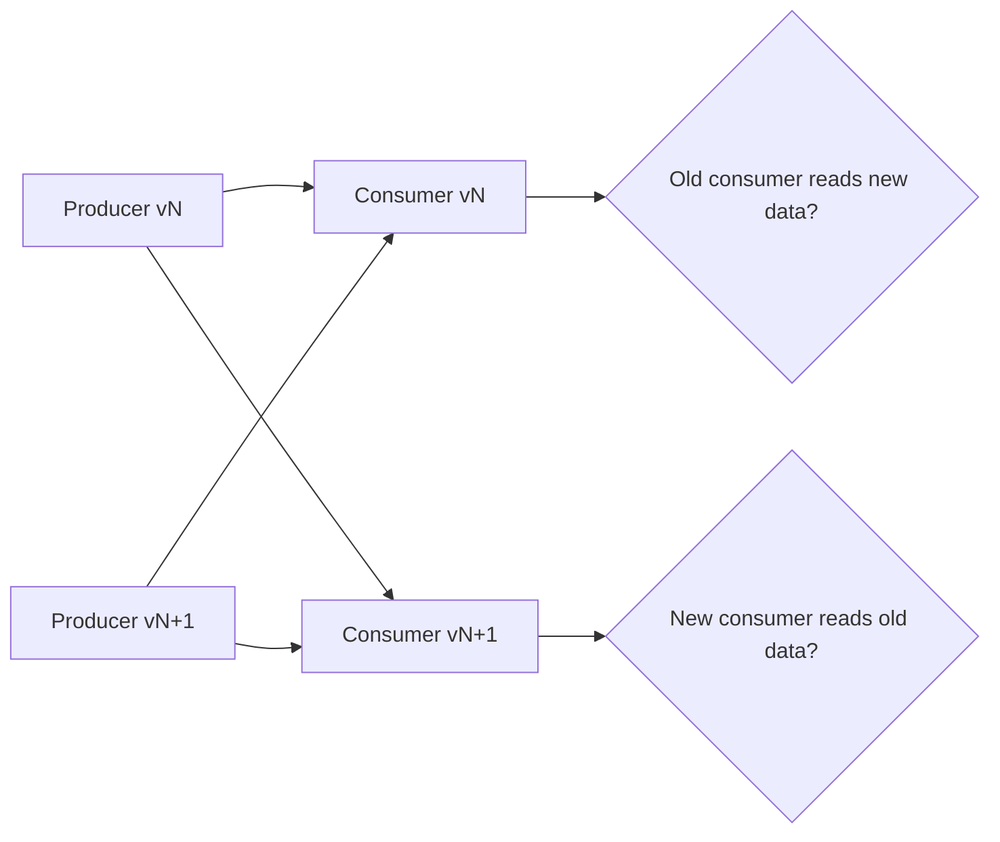
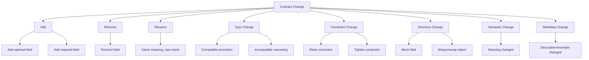
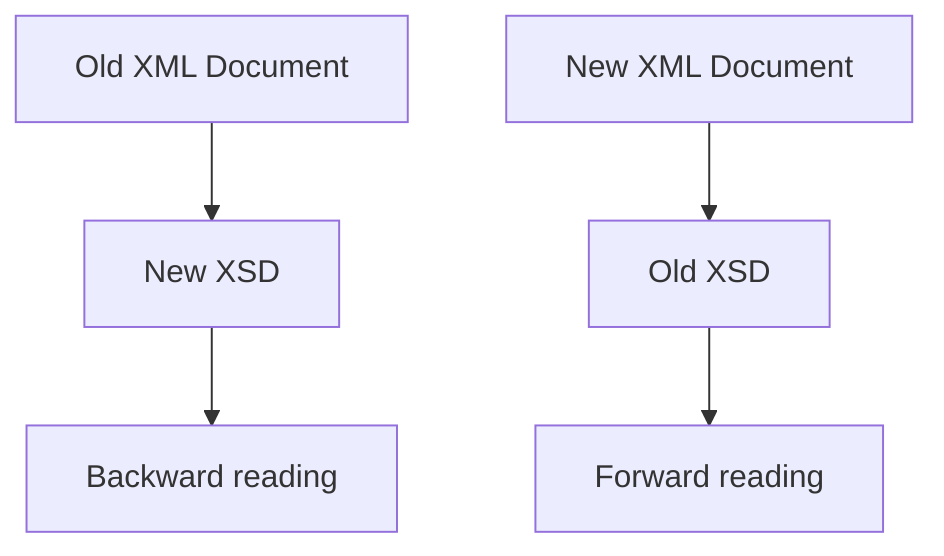
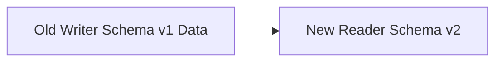
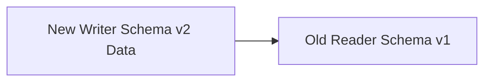
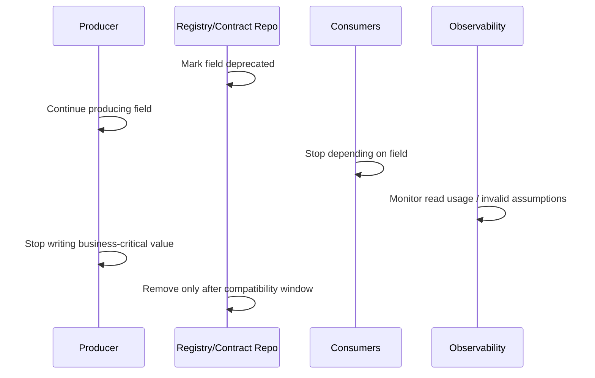
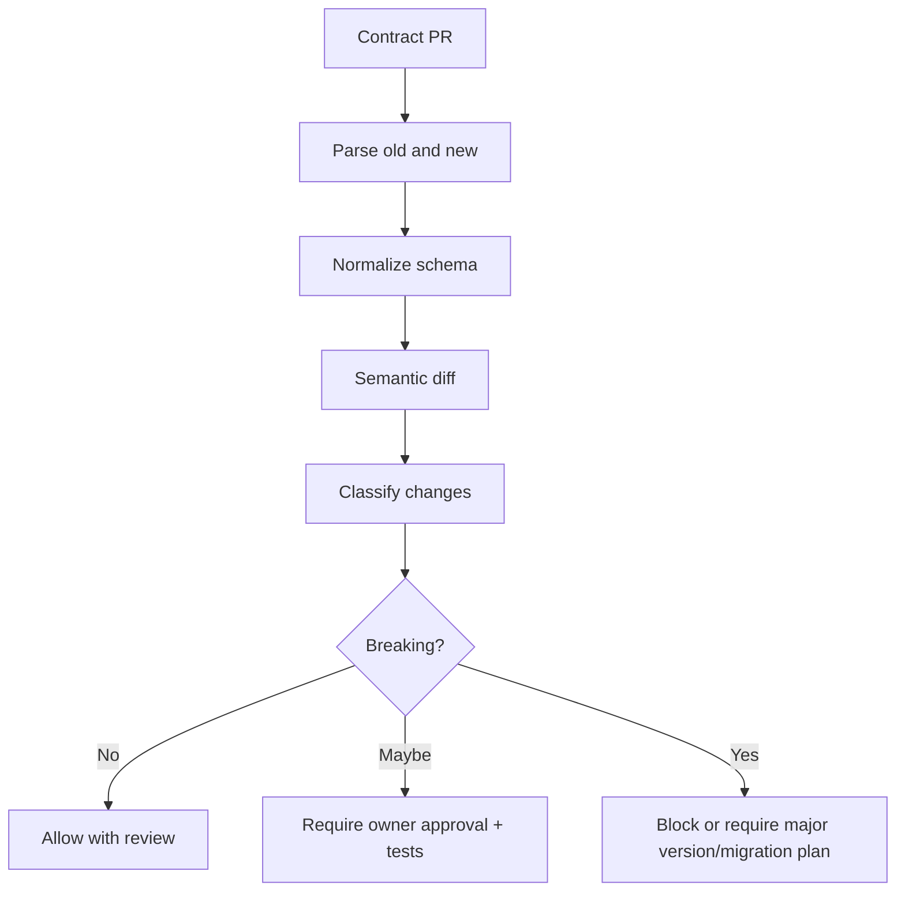
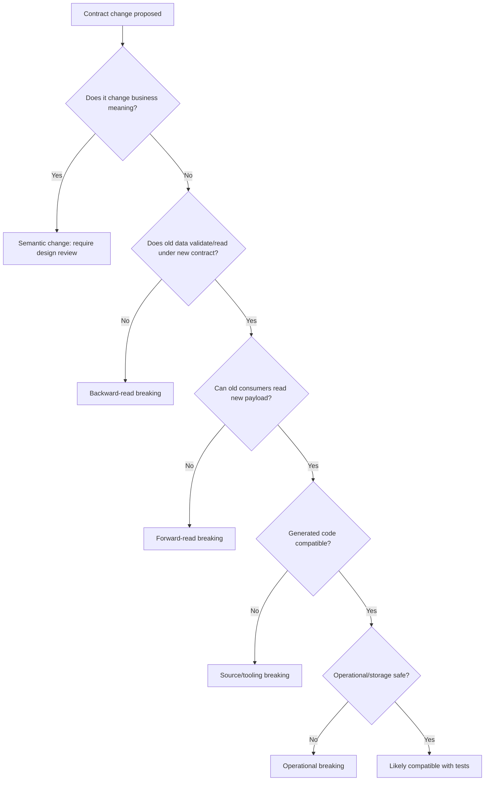

# Part 031 — Compatibility Matrix Across XSD, JSON Schema, Avro, Protobuf, OpenAPI

> Goal: setelah bagian ini, kamu tidak lagi menilai perubahan contract dengan feeling seperti “cuma tambah field”. Kamu akan punya matrix mental yang bisa dipakai saat review PR, desain migration, approval schema registry, dan incident analysis.

Compatibility adalah kemampuan dua versi contract hidup berdampingan tanpa merusak producer, consumer, stored data, replay, generated client, validator, dan operational tooling.

Di production system, compatibility bukan hanya soal schema parser menerima dokumen. Compatibility adalah gabungan dari:

1. **Syntax compatibility** — dokumen/spec masih valid menurut format.
2. **Validation compatibility** — data versi lama/baru masih lolos validator yang tepat.
3. **Serialization compatibility** — binary/text payload masih bisa dibaca.
4. **Semantic compatibility** — arti field tidak berubah diam-diam.
5. **Generated-code compatibility** — Java code hasil generator tidak pecah compile/runtime.
6. **Storage/replay compatibility** — data lama masih bisa dibaca setelah deploy baru.
7. **Operational compatibility** — DLQ, dashboards, schema registry, API gateway, mock server, dan test suite masih bekerja.
8. **Consumer-behavior compatibility** — consumer lama tidak salah mengambil keputusan karena payload baru.

Bagian ini menyatukan seluruh format yang sudah dibahas sebelumnya:

- **XSD** untuk XML document contracts.
- **JSON Schema** untuk JSON validation contracts.
- **Avro** untuk event, stream, dan data-file contracts.
- **Protobuf** untuk binary message dan RPC/event contracts.
- **OpenAPI** untuk HTTP API contracts.

Kita akan memakai cara berpikir yang sama: perubahan contract selalu dilihat dari arah producer dan consumer.



Dua pertanyaan wajib:

- **Backward compatible?** New reader/consumer bisa membaca old data/payload.
- **Forward compatible?** Old reader/consumer bisa membaca new data/payload.

Namun istilah ini sering tertukar antara API, schema registry, dan serialization library. Karena itu dalam review engineering, lebih aman menulis eksplisit:

> “Can consumer version X read producer version Y?”

Bukan hanya: “This is backward compatible.”

---

## 1. Core Mental Model: Contract Change Is a Distributed Deployment Problem

Contract change tidak pernah terjadi di satu tempat. Bahkan jika hanya satu repository berubah, blast radius-nya menyebar.

Contoh sederhana: menambah field `riskScore` pada `CaseOpenedEvent`.

Kelihatannya aman. Tetapi efeknya tergantung format:

- Di **JSON** dengan strict validator `additionalProperties: false`, consumer lama bisa reject field baru.
- Di **Avro**, field baru aman untuk reader lama karena reader mengabaikan field yang tidak dikenal, tetapi reader baru yang membaca data lama butuh default.
- Di **Protobuf**, field baru dengan tag baru biasanya aman di binary wire, tetapi JSON mapping dan strict gateway bisa bermasalah.
- Di **OpenAPI**, response field baru biasanya aman untuk tolerant client, tetapi generated client yang diserialisasi ulang atau snapshot test bisa pecah.
- Di **XSD**, element baru bisa breaking jika content model sequence tidak memperbolehkan extension.

Jadi matrix compatibility selalu harus menyebut:

1. Format.
2. Direction.
3. Runtime behavior.
4. Validator strictness.
5. Generated-code behavior.
6. Stored-data/replay behavior.

---

## 2. Compatibility Vocabulary yang Dipakai Seri Ini

Kita pakai vocabulary berikut secara konsisten.

| Term | Makna praktis |
|---|---|
| Producer | Komponen yang menulis/mengirim payload. Bisa API server, Kafka producer, batch exporter, XML sender. |
| Consumer | Komponen yang membaca/menerima payload. Bisa API client, Kafka consumer, batch importer, XML receiver. |
| Writer schema | Schema yang dipakai ketika data ditulis. Istilah sangat penting di Avro. |
| Reader schema | Schema yang dipakai ketika data dibaca. Istilah sangat penting di Avro. |
| Old consumer reads new producer | Forward-read scenario. Ini menguji apakah consumer lama tahan terhadap data baru. |
| New consumer reads old producer/data | Backward-read scenario. Ini menguji apakah deployment consumer baru aman sebelum semua producer upgrade. |
| Full compatibility | Dua arah aman: old consumer membaca new payload dan new consumer membaca old payload. |
| Transitive compatibility | Compatibility bukan hanya terhadap versi terakhir, tetapi terhadap semua versi historis yang masih mungkin direplay/dibaca. |
| Breaking syntax change | Spec/schema tidak valid atau tooling tidak bisa parse. |
| Breaking wire change | Payload tidak bisa dibaca pada level encoding/serialization. |
| Breaking validation change | Data yang sebelumnya valid menjadi invalid, atau data baru direject validator lama. |
| Breaking semantic change | Data masih parse/valid, tetapi artinya berubah. Ini paling berbahaya karena tidak selalu terdeteksi otomatis. |

---

## 3. The Universal Change Categories

Hampir semua perubahan contract jatuh ke kategori berikut.



At high level:

| Change type | Default assumption |
|---|---|
| Add optional field | Often safe, but not universally. |
| Add required field | Usually breaking for old data/new consumers. |
| Remove field | Usually breaking for consumers that depend on it. |
| Rename field | Usually breaking unless aliasing/mapping exists. |
| Type widening | Sometimes safe. Must be format-specific. |
| Type narrowing | Usually breaking. |
| Relax validation | Often safe for producer, risky for consumer semantics. |
| Tighten validation | Breaking for existing producers/data. |
| Reorder fields | Safe in some formats, breaking in XSD sequence, irrelevant in JSON object, unsafe in positional/binary assumptions. |
| Change default | Semantically dangerous. |
| Change enum values | Format-specific, often dangerous. |
| Change meaning without changing shape | Always dangerous, rarely detected automatically. |

---

## 4. Matrix Legend

A single “safe/breaking” label is too crude. Kita pakai label berikut.

| Label | Meaning |
|---|---|
| ✅ Usually safe | Aman jika consumer tolerant dan semantic tidak berubah. Tetap perlu test. |
| ⚠️ Conditionally safe | Aman hanya dengan syarat tertentu. Harus eksplisit di review. |
| ❌ Usually breaking | Anggap breaking kecuali ada adapter/migration/aliasing. |
| 🧨 Semantically dangerous | Tooling mungkin lolos, tapi behavior bisnis bisa salah. |
| 🧪 Test required | Tidak bisa diputuskan dari schema saja; perlu generated-code/runtime test. |

---

# 5. Universal Compatibility Matrix

Matrix ini adalah ringkasan lintas format. Setelah matrix, kita bedah per format.

## 5.1 Add Field

| Change | XSD | JSON Schema | Avro | Protobuf | OpenAPI |
|---|---:|---:|---:|---:|---:|
| Add optional field | ⚠️ | ⚠️ | ✅ | ✅ | ⚠️ |
| Add required field | ❌ | ❌ | ❌ for old data unless default | ⚠️ presence-dependent | ❌ for requests, ⚠️ for responses |
| Add field with default | ⚠️ | ⚠️ annotation only unless applied by app | ✅ if default valid | ⚠️ default semantics not same as Avro | ⚠️ |
| Add unknown extension field | ⚠️ if wildcard exists | ⚠️ if open object allowed | ✅ ignored by old reader | ✅ binary usually safe | ⚠️ depends on client tolerance |

Interpretasi:

- “Optional field” bukan berarti sama di semua format.
- JSON Schema tidak otomatis mengisi default; `default` adalah annotation kecuali aplikasi memprosesnya.
- Avro default sangat penting untuk reader schema ketika membaca old data.
- Protobuf default value tidak membedakan absent vs default kecuali presence tersedia.
- OpenAPI response field baru idealnya aman, tetapi generated client, strict deserializer, dan snapshot tests sering membuatnya tidak aman.

## 5.2 Remove Field

| Change | XSD | JSON Schema | Avro | Protobuf | OpenAPI |
|---|---:|---:|---:|---:|---:|
| Remove optional field | ⚠️ | ⚠️ | ⚠️ | ⚠️ | ⚠️ |
| Remove required field | ❌ | ❌ | ❌ for readers expecting it | ⚠️ if field no longer used, reserve tag | ❌ |
| Deprecate field but keep it | ✅ | ✅ | ✅ | ✅ | ✅ |
| Stop populating field but keep schema | 🧨 | 🧨 | 🧨 | 🧨 | 🧨 |

Removal almost always needs a deprecation window. Yang paling aman adalah:

1. Mark deprecated.
2. Stop new consumers from depending on it.
3. Observe usage.
4. Keep reading it.
5. Only remove after compatibility window.

## 5.3 Rename Field

| Change | XSD | JSON Schema | Avro | Protobuf | OpenAPI |
|---|---:|---:|---:|---:|---:|
| Rename without alias | ❌ | ❌ | ❌ | ❌ if tag changed or JSON name relied on | ❌ |
| Rename with alias/mapping | ⚠️ | app-level only | ⚠️ Avro aliases help resolution | ⚠️ binary tag can survive if field number same | app-level only |
| Keep old + add new | ⚠️ | ⚠️ | ⚠️ | ⚠️ | ⚠️ |

Rename is not a rename. Dalam distributed system, rename adalah:

```text
add new field + dual write + migrate consumers + deprecate old field + remove later
```

Rename yang hanya mengubah nama di contract biasanya breaking.

## 5.4 Type Change

| Change | XSD | JSON Schema | Avro | Protobuf | OpenAPI |
|---|---:|---:|---:|---:|---:|
| int → long | ⚠️ | ⚠️ | ✅ type promotion possible | ⚠️ depends wire type/range | ⚠️ |
| long → int | ❌ | ❌ | ❌ | ❌ | ❌ |
| string → enum | ❌ tighter | ❌ tighter | ❌ | ❌ | ❌ |
| enum → string | ⚠️ relaxes validation, semantic risk | ⚠️ | ❌/⚠️ depends representation | ❌ wire type change if enum to string | ⚠️ |
| string → object | ❌ | ❌ | ❌ | ❌ | ❌ |
| object → string | ❌ | ❌ | ❌ | ❌ | ❌ |
| numeric → string | ❌/⚠️ | ❌/⚠️ | ❌ | ❌ | ❌ |
| nullable → non-nullable | ❌ | ❌ | ❌ | ⚠️ presence-dependent | ❌ |
| non-nullable → nullable | ⚠️ | ⚠️ | ⚠️ union/default discipline | ⚠️ | ⚠️ |

Type changes are rarely safe. Banyak “widening” yang terlihat aman tetapi tidak aman secara semantic.

Contoh:

```text
riskScore: integer 0..100
```

Diubah menjadi:

```text
riskScore: number 0..1
```

Schema sama-sama numeric-ish, tetapi semantic berubah total. Ini breaking walaupun parser menerima.

## 5.5 Constraint Change

| Change | XSD | JSON Schema | Avro | Protobuf | OpenAPI |
|---|---:|---:|---:|---:|---:|
| Relax min/max | ⚠️ | ⚠️ | app-level | app-level | ⚠️ |
| Tighten min/max | ❌ | ❌ | app-level breaking | app-level breaking | ❌ |
| Relax regex | ⚠️ | ⚠️ | app-level | app-level | ⚠️ |
| Tighten regex | ❌ | ❌ | app-level breaking | app-level breaking | ❌ |
| Add maxLength | ❌ | ❌ | app-level | app-level | ❌ |
| Remove maxLength | ⚠️ | ⚠️ | app-level | app-level | ⚠️ consumer storage risk |
| Add required | ❌ | ❌ | ❌ unless default strategy | ⚠️ presence-dependent | ❌ |
| Remove required | ✅/⚠️ | ✅/⚠️ | ⚠️ | ⚠️ | ⚠️ |

Relaxing constraints can still break downstream systems. Example: increasing `caseReference` length from 32 to 128 might be schema-safe but database/storage unsafe if consumer column remains `VARCHAR(32)`.

## 5.6 Enum Change

| Change | XSD | JSON Schema | Avro | Protobuf | OpenAPI |
|---|---:|---:|---:|---:|---:|
| Add enum value | ⚠️ old validators reject | ⚠️ old validators reject | ⚠️ old reader needs default strategy | ⚠️ unknown enum handling matters | ⚠️ generated client risk |
| Remove enum value | ❌ for old data | ❌ for old data | ❌ | ❌ reserve/deprecate first | ❌ |
| Rename enum value | ❌ | ❌ | ❌ | ❌ | ❌ |
| Reorder enum values | ✅ lexical for XSD | ✅ JSON value-based | ⚠️ Avro default/order concerns | ❌ if numeric values changed | ✅ if string-based |
| Change enum meaning | 🧨 | 🧨 | 🧨 | 🧨 | 🧨 |

Enum evolution is harder than most teams expect. Adding an enum value is safe only if every old consumer has an unknown-value policy.

---

# 6. XSD Compatibility Matrix

XSD is strict by default. XML Schema validates an XML document against a declared structure, type system, namespace model, and occurrence constraints. That strictness is why XSD is powerful for enterprise boundaries, but also why evolution must be deliberate.

## 6.1 XSD Safe and Unsafe Changes

| Change | Compatibility | Notes |
|---|---:|---|
| Add optional element at end of `xs:sequence` | ⚠️ | Usually safe for new schema reading old docs, but old schema rejects new docs unless wildcard/versioning exists. |
| Add optional element in middle of `xs:sequence` | ❌/⚠️ | Sequence order changes can break validation. |
| Add required element | ❌ | Old documents invalid under new schema. |
| Remove optional element | ⚠️ | New docs may omit it, but old consumers may expect it semantically. |
| Remove required element | ❌ | Old consumers/schema expectations break. |
| Change element type to wider type | ⚠️ | Depends on derivation and consumer binding. |
| Change element type to narrower type | ❌ | Existing valid docs can become invalid. |
| Add enumeration value | ⚠️ | Old schema rejects new value. |
| Remove enumeration value | ❌ | Existing docs invalid. |
| Add attribute optional | ⚠️ | Old schema rejects unless wildcard/open attribute policy exists. |
| Add attribute required | ❌ | Existing docs invalid under new schema. |
| Change namespace URI | ❌ | Effectively a new vocabulary. |
| Add new namespace with extension point | ✅/⚠️ | Safe if consumers preserve/ignore extension. |
| Use `xs:any` extension point | ⚠️ | Can enable forward compatibility, but weakens governance. |
| Reorder elements in sequence | ❌ | XML sequence is order-sensitive. |
| Change `minOccurs` 1 → 0 | ⚠️ | New docs can omit field; old consumers may fail semantically. |
| Change `minOccurs` 0 → 1 | ❌ | Old docs invalid. |
| Change `maxOccurs` 1 → unbounded | ⚠️ | New payload shape may break old binding/code. |
| Change `maxOccurs` unbounded → 1 | ❌ | Existing docs invalid. |

## 6.2 XSD Compatibility Rule of Thumb

XSD compatibility depends on which schema validates which document:



- If **new XSD validates old XML**, deployment of new consumer is safer.
- If **old XSD validates new XML**, old consumer survives new producer.

Strict XSD often fails the second condition unless you planned an extension point.

## 6.3 XSD Evolution Pattern

For enterprise XML contracts, use this default strategy:

```text
v1 namespace stays frozen.
v2 namespace introduced for breaking vocabulary changes.
minor-compatible additions require explicit extension points or tolerant processing.
```

Example:

```xml
<case:CaseOpened xmlns:case="urn:example:case:v1">
  <case:caseId>CASE-001</case:caseId>
  <case:receivedAt>2026-07-03T10:00:00Z</case:receivedAt>
  <case:extension>
    <risk:RiskAssessment xmlns:risk="urn:example:risk:v1">
      <risk:riskLevel>HIGH</risk:riskLevel>
    </risk:RiskAssessment>
  </case:extension>
</case:CaseOpened>
```

The extension point is not a trash bag. It must have governance:

- allowed namespaces,
- allowed owning team,
- validation policy,
- documentation,
- observability,
- compatibility tests.

## 6.4 XSD Generated Java Risk

XSD may remain compatible while generated Java code changes painfully.

Example risks:

- `maxOccurs="unbounded"` changes field from scalar to `List<T>`.
- optional element may become nullable field.
- substitution group may generate inheritance-like structure.
- namespace/package mapping changes Java package.
- type rename changes generated class name.
- enum value addition changes generated enum and may break exhaustive switch.

Compatibility review must include generated API diff, not only XSD diff.

---

# 7. JSON Schema Compatibility Matrix

JSON Schema is a validation language. It does not define transport, binary encoding, or code generation semantics by itself. Compatibility depends heavily on validator strictness and object openness.

## 7.1 JSON Schema Safe and Unsafe Changes

| Change | Compatibility | Notes |
|---|---:|---|
| Add optional property when object is open | ✅/⚠️ | Old consumers may ignore it; strict app deserializers may fail. |
| Add optional property when old schema has `additionalProperties: false` | ❌ for old validator | Old validator rejects unknown property. |
| Add required property | ❌ | Old instances invalid under new schema. |
| Remove property from `required` | ✅/⚠️ | Validation relaxes; semantic consumers may still need it. |
| Add property to `required` | ❌ | Tightening. |
| Add `additionalProperties: false` | ❌ | Tightening; old instances with extra fields invalid. |
| Remove `additionalProperties: false` | ⚠️ | Relaxing validation but may allow garbage. |
| Add enum value | ⚠️ | Old validators reject. |
| Remove enum value | ❌ | Old data invalid. |
| Add `minimum`/`maxLength`/`pattern` | ❌ | Tightening. |
| Remove `minimum`/`maxLength`/`pattern` | ⚠️ | Relaxing but downstream may still assume. |
| Change type from `integer` to `number` | ⚠️ | Widening; precision/consumer risk. |
| Change type from `number` to `integer` | ❌ | Tightening. |
| Change `type: string` to `type: ["string", "null"]` | ⚠️ | Allows null; consumers must handle. |
| Change nullable to non-nullable | ❌ | Existing null data invalid. |
| Add `oneOf` variant | ⚠️ | Old validators reject unless schema open; consumer switch may fail. |
| Change `$id` | ❌/⚠️ | Reference identity changes; resolver/cache may break. |
| Move schema without preserving `$id` | ❌/⚠️ | External `$ref` may break. |

## 7.2 JSON Schema Object Openness

The single most important JSON compatibility switch is object openness.

```json
{
  "type": "object",
  "required": ["caseId"],
  "properties": {
    "caseId": { "type": "string" }
  },
  "additionalProperties": false
}
```

This is a **closed object**. It is good for ingress command validation, where rejecting unexpected data can prevent accidental misuse.

But for events and responses, closed objects can harm forward compatibility. A new producer adding `riskLevel` can break old consumers that validate strictly.

Production heuristic:

| Boundary | Recommended object policy |
|---|---|
| Public command request | Often closed; reject unknown fields. |
| Internal event consumed by many services | Usually open or extension-aware; observe unknown fields. |
| API response | Usually tolerant clients; contract may document fields strictly but clients should ignore unknown. |
| Regulatory filing payload | Often closed; change via versioned schema. |
| Analytics payload | Often append-friendly; preserve unknown fields if possible. |

## 7.3 JSON Schema `default` Trap

This schema does not require validators to mutate the instance:

```json
{
  "type": "object",
  "properties": {
    "priority": {
      "type": "string",
      "default": "NORMAL"
    }
  }
}
```

`default` is usually annotation. If application code expects the validator to fill it, compatibility behavior differs by library/configuration.

Safer pattern:

- Use `default` for documentation and generation hints.
- Apply defaults explicitly in mapper/factory layer.
- Test defaulting behavior as application logic.

## 7.4 JSON Schema Compatibility Needs Instance Fixtures

Schema diff alone is insufficient. A robust compatibility test uses fixtures:

```text
fixtures/
  v1/valid/case-opened-minimal.json
  v1/valid/case-opened-full.json
  v1/invalid/missing-case-id.json
  v2/valid/case-opened-with-risk.json
```

Tests:

- New schema validates old valid fixtures.
- Old schema behavior against new fixtures is understood.
- Previously invalid fixtures remain invalid unless intentionally relaxed.
- Error codes and paths are stable enough for clients/operators.

---

# 8. Avro Compatibility Matrix

Avro is unique because it explicitly resolves writer schema and reader schema. This makes schema evolution systematic, but only if you follow its rules.

## 8.1 Avro Safe and Unsafe Changes

| Change | Compatibility | Notes |
|---|---:|---|
| Add field with default | ✅ for new reader reading old data | Reader uses default if writer lacks field. |
| Add field without default | ❌ for new reader reading old data | Old data has no value. |
| Remove field | ✅/⚠️ if readers do not require it | Reader ignores writer fields not in reader schema. Semantics still matter. |
| Rename field without alias | ❌ | Reader cannot match writer field. |
| Rename field with alias | ⚠️ | Avro aliases can support resolution; test implementation. |
| Change int → long | ✅ | Type promotion allowed. |
| Change long → int | ❌ | Narrowing unsafe. |
| Change int → double | ✅/⚠️ | Promotion possible but semantic/precision risk. |
| Change string → bytes | ❌ generally | Different type semantics. |
| Add enum symbol | ⚠️ | Reader behavior depends on defaults and symbol handling. |
| Remove enum symbol | ❌ for old data | Old data may contain removed symbol. |
| Add union branch | ⚠️ | Resolution can become complex; reader must know branch. |
| Remove union branch | ❌ | Old data may contain removed branch. |
| Reorder fields | ✅ | Field matching by name, not position. |
| Reorder union branches | ⚠️ | Binary encoding uses branch index; schema resolution matters. Avoid casual reorder. |
| Change namespace/name | ❌ unless alias | Fullname identity matters. |
| Change logical type only | ⚠️/🧨 | Underlying type may parse, semantics may break. |
| Change decimal precision/scale | ❌/⚠️ | Can break values or business meaning. |

## 8.2 Avro Direction Matters

Avro compatibility is easiest to reason with concrete pairs.

```text
Writer schema = schema embedded/registered when data was produced.
Reader schema = schema used by consuming application now.
```

Scenario A: New consumer reads old data.



Adding a field in v2 is safe only if v2 provides a default:

```json
{
  "name": "riskLevel",
  "type": "string",
  "default": "UNKNOWN"
}
```

Scenario B: Old consumer reads new data.



Old reader ignores fields it does not know, assuming schema registry/serializer resolves correctly.

## 8.3 Avro Default Discipline

Bad:

```json
{
  "name": "riskLevel",
  "type": ["null", "string"]
}
```

This is incomplete for evolution if old data lacks the field and reader expects it. Safer:

```json
{
  "name": "riskLevel",
  "type": ["null", "string"],
  "default": null
}
```

But this is only technically safe. Business semantics still need meaning:

| Default | Meaning |
|---|---|
| `null` | Unknown / not provided / not applicable? Ambiguous unless documented. |
| `"UNKNOWN"` | Explicit unknown value; can be counted. |
| `"NORMAL"` | Dangerous if old data was never assessed. |

## 8.4 Avro Registry Compatibility Modes

Common modes:

| Mode | Practical meaning |
|---|---|
| BACKWARD | New schema can read data written by previous schema. |
| FORWARD | Previous schema can read data written by new schema. |
| FULL | Both backward and forward for previous schema. |
| BACKWARD_TRANSITIVE | New schema can read data from all previous versions. |
| FORWARD_TRANSITIVE | All previous schemas can read data from new schema. |
| FULL_TRANSITIVE | Both directions across all historical versions. |

For long-lived event topics with replay, transitive compatibility is usually safer than latest-only compatibility.

---

# 9. Protobuf Compatibility Matrix

Protobuf compatibility is centered on field numbers, wire types, and presence semantics. Field names matter for source code and JSON mapping; field numbers matter for binary compatibility.

## 9.1 Protobuf Safe and Unsafe Changes

| Change | Binary compatibility | JSON/source compatibility | Notes |
|---|---:|---:|---|
| Add new field with new number | ✅ | ⚠️ | Binary old readers ignore unknown fields; JSON strict clients may not. |
| Remove field and reserve number/name | ⚠️ | ⚠️ | Binary old data may still contain field. New code no longer exposes it. |
| Reuse old field number | ❌ | ❌ | One of the worst Protobuf mistakes. |
| Change field number | ❌ | ❌ | Equivalent to remove + add. |
| Rename field keeping number | ✅ binary | ⚠️ JSON/source | Binary OK; JSON name and generated API change. |
| Change type same wire type | ⚠️/❌ | ❌ | Sometimes parseable but semantic corruption risk. Avoid. |
| Change type different wire type | ❌ | ❌ | Deserialization breaks or value ignored. |
| Add enum value | ⚠️ | ⚠️ | Unknown enum handling varies by language/version/use. |
| Remove enum value | ❌/⚠️ | ❌ | Old data may contain it; reserve/deprecate. |
| Reorder enum values without explicit numbers | ❌ | ❌ | Numeric value changes. |
| Add field to `oneof` | ⚠️ | ⚠️ | Consumer switch handling needed. |
| Move existing field into `oneof` | ❌/🧨 | ❌ | Presence and clearing semantics change. |
| Change repeated ↔ singular | ❌/⚠️ | ❌ | Not generally safe. |
| Change map representation | ❌/⚠️ | ❌ | Map compiles to repeated entry; still avoid migrations without bridge. |

## 9.2 Protobuf Golden Rule

Never reuse a field number.

Bad:

```proto
message CaseOpened {
  string case_id = 1;
  string obsolete_owner = 2;
}

// Later
message CaseOpened {
  string case_id = 1;
  string risk_level = 2; // BAD: old data may decode owner as risk_level
}
```

Good:

```proto
message CaseOpened {
  string case_id = 1;

  reserved 2;
  reserved "obsolete_owner";

  string risk_level = 3;
}
```

## 9.3 Protobuf Rename Is Binary-Compatible but Not Contract-Neutral

Changing:

```proto
string officer_id = 4;
```

to:

```proto
string assigned_officer_id = 4;
```

Binary data still uses field number 4. But this can break:

- Java generated method names,
- JSON field name,
- documentation,
- mapping code,
- clients using reflection/descriptors,
- dashboards based on field names.

So rename may be binary-safe but source/API-breaking.

## 9.4 Protobuf Unknown Fields Are Not a Business Strategy

Binary Protobuf can preserve/ignore unknown fields depending on runtime behavior, but relying on unknown fields for business-critical forward compatibility is fragile.

A robust consumer must define explicit policy:

- Ignore unknown fields for passive readers.
- Reject unknown fields at strict command boundaries if needed.
- Observe unknown field count for drift detection.
- Never make authorization or enforcement decisions based on unknown data.

---

# 10. OpenAPI Compatibility Matrix

OpenAPI describes HTTP APIs. Compatibility involves schema, method semantics, status codes, headers, auth, caching, pagination, idempotency, generated clients, and documentation.

## 10.1 OpenAPI Request Compatibility

Request compatibility is stricter than response compatibility.

| Change to request | Compatibility | Notes |
|---|---:|---|
| Add optional request field | ⚠️ | Existing clients unaffected; server must not require it. |
| Add required request field | ❌ | Existing clients fail. |
| Remove optional request field | ⚠️ | Clients may still send it; server should ignore/deprecate first. |
| Remove required request field | ❌/⚠️ | Server relaxes, but generated clients and validation docs change. |
| Tighten request validation | ❌ | Existing valid clients can fail. |
| Relax request validation | ⚠️ | More inputs accepted; downstream invariants may break. |
| Add optional query parameter | ✅/⚠️ | Usually safe. Avoid changing default behavior. |
| Add required query/header parameter | ❌ | Existing clients fail. |
| Change auth requirement | ❌/🧨 | Operational/security impact. |
| Change media type | ❌ | Clients may not send/accept it. |
| Add new media type | ✅/⚠️ | Safe if old media type remains. |

## 10.2 OpenAPI Response Compatibility

| Change to response | Compatibility | Notes |
|---|---:|---|
| Add response property | ⚠️ | Tolerant clients OK; strict/generated clients may fail. |
| Remove response property | ❌ | Clients may depend on it. |
| Make response property nullable | ⚠️ | Existing clients may not handle null. |
| Make nullable property non-nullable | ⚠️ | Stronger promise, but old data path may violate. |
| Add enum value | ⚠️ | Client switch may fail. |
| Remove enum value | ❌ | Old data/history may still contain it. |
| Add status code | ⚠️ | Clients must handle status class/generic errors. |
| Change status code for same outcome | ❌/🧨 | Client behavior can change. |
| Change error model | ❌ | Error handling clients break. |
| Add response header | ✅ | Usually safe. |
| Remove response header | ⚠️/❌ | Breaks caching, pagination, trace, rate-limit clients. |

## 10.3 OpenAPI Operation Compatibility

| Change | Compatibility | Notes |
|---|---:|---|
| Add new path/operation | ✅ | Safe if no route ambiguity. |
| Remove path/operation | ❌ | Breaking. Use deprecation/sunset first. |
| Change HTTP method | ❌ | Breaking semantic and client code. |
| Change path parameter name | ❌ | Codegen and routing break. |
| Change path structure | ❌ | New endpoint. |
| Add optional operation behavior | ⚠️ | Must not change default outcome. |
| Change default sort/filter/pagination | 🧨 | Often silent semantic breaking. |
| Change idempotency semantics | 🧨 | Retry safety changes. |
| Change security scheme | ❌/🧨 | Auth/security break. |

## 10.4 OpenAPI Generated Client Risk

Even changes considered HTTP-compatible can break generated clients:

- enum value addition breaks exhaustive switch,
- nullable change changes type signatures,
- required change changes constructor/builder,
- `oneOf` changes generated model hierarchy,
- schema name change changes class name,
- operationId change changes method name,
- response status mapping changes exception handling.

OpenAPI compatibility gate must include:

```text
spec diff + generated client compile + representative consumer tests
```

---

# 11. Cross-Format Change Playbook

## 11.1 Add Field Playbook

For a new field `riskLevel`:

| Format | Safe playbook |
|---|---|
| XSD | Add at extension point or new optional element in compatible location; old schema behavior must be known. |
| JSON Schema | Add optional property; decide open/closed object; add fixture tests. |
| Avro | Add field with explicit default; test old data with new reader. |
| Protobuf | Add new field number; never reuse tag; document presence/default semantics. |
| OpenAPI | Add optional request field or response field; generated clients must tolerate. |

Java mapper rule:

```java
// Contract DTO may be nullable/optional/defaulted.
// Domain model must have explicit invariant.
RiskLevel riskLevel = switch (dto.getRiskLevel()) {
    case null -> RiskLevel.UNKNOWN;
    case "LOW" -> RiskLevel.LOW;
    case "MEDIUM" -> RiskLevel.MEDIUM;
    case "HIGH" -> RiskLevel.HIGH;
    default -> RiskLevel.UNKNOWN_EXTERNAL_VALUE;
};
```

Do not let generated DTO defaults leak into domain decisions.

## 11.2 Remove Field Playbook

Never remove immediately.



Per format:

| Format | Removal rule |
|---|---|
| XSD | Prefer new namespace for structural removal. |
| JSON Schema | Remove from required first; keep property documented deprecated. |
| Avro | Ensure readers no longer require it; historical data still contains it. |
| Protobuf | Delete field only with reserved number/name. |
| OpenAPI | Mark deprecated; publish sunset; keep server tolerant. |

## 11.3 Rename Field Playbook

Rename is migrate-not-edit.

```text
v1: officerId
v2: officerId + assignedOfficerId, both populated
v3: assignedOfficerId required for new clients, officerId deprecated
v4: officerId removed only after safe window
```

Avoid alias illusions:

- Avro aliases can help schema resolution, but not all generated code semantics.
- Protobuf same tag with new name preserves binary but breaks JSON/source clients.
- OpenAPI/JSON Schema have no universal alias semantics.
- XSD namespace/type/element rename can cascade into generated classes.

## 11.4 Enum Addition Playbook

Adding enum value requires consumer readiness.

Before adding:

- Does every consumer have unknown-value handling?
- Does Java code use exhaustive switch without default?
- Does DB column/check constraint allow value?
- Does UI have fallback label?
- Does reporting pipeline bucket unknown values?
- Does DLQ policy treat unknown enum as warning or fatal?

Java pattern:

```java
public enum ExternalRiskLevel {
    LOW,
    MEDIUM,
    HIGH,
    UNKNOWN,
    UNRECOGNIZED
}
```

Domain model may still use stricter states internally, but contract boundary must survive external vocabulary evolution.

## 11.5 Constraint Tightening Playbook

Constraint tightening is breaking unless data proves otherwise.

Example:

```text
caseReference maxLength 64 -> maxLength 32
```

Required checks:

1. Existing production data has no values > 32.
2. Existing producers cannot send > 32.
3. Queued/retry/DLQ payloads are clean.
4. Batch files in transit are clean.
5. Consumer storage already supports new invariant.
6. Error contract is documented.
7. Rollback behavior is safe.

---

# 12. Contract Diff Classification

A contract diff tool should classify changes, not only show text diff.



Classification examples:

```json
{
  "changeType": "FIELD_ADDED",
  "path": "/CaseOpened/riskLevel",
  "format": "avro",
  "compatibility": "BACKWARD_SAFE_FORWARD_SAFE_WITH_OLD_READER_IGNORES_FIELD",
  "conditions": [
    "field has default",
    "default is semantically safe",
    "all consumers tolerate unknown field"
  ],
  "risk": "conditional"
}
```

## 12.1 Diff Tool False Positives

Text diff can over-report:

- field reorder in Avro record may be safe,
- JSON object property order irrelevant,
- description/example changes may not affect runtime,
- whitespace/formatting irrelevant,
- `$defs` refactoring may preserve same semantics.

## 12.2 Diff Tool False Negatives

Semantic break can be invisible:

- description changes meaning,
- enum value reused with new meaning,
- default changed from `UNKNOWN` to `NORMAL`,
- timestamp interpreted as local time instead of UTC,
- `amount` currency assumption changed,
- status lifecycle transition changed.

Automated gates must be backed by human review for semantic changes.

---

# 13. Compatibility Review Checklist

Use this checklist in every contract PR.

## 13.1 Basic Change Identification

- What contract changed?
- What format?
- Is it API, event, file, RPC, XML, or internal payload?
- Is it producer-side, consumer-side, or shared artifact?
- Is this an add, remove, rename, type change, constraint change, enum change, or semantic change?
- Is there any generated Java code impact?

## 13.2 Directional Compatibility

- Can new consumer read old data?
- Can old consumer read new data?
- Are historical payloads replayed?
- Are DLQ payloads replayed?
- Are long-running workflows storing old payloads?
- Are batch files processed days/weeks later?

## 13.3 Consumer Impact

- Which consumers exist?
- Which consumers are unknown/external?
- Do consumers validate strictly?
- Do consumers ignore unknown fields?
- Do generated clients break?
- Do consumers use exhaustive enum switches?
- Do dashboards depend on field name/value?

## 13.4 Data Impact

- Does old data satisfy new schema?
- Does new data satisfy old schema?
- Is default semantically correct?
- Is null/absence behavior explicit?
- Are database constraints aligned?
- Are warehouse schemas aligned?

## 13.5 Operational Impact

- Does schema registry allow this change?
- Does CI diff classify it correctly?
- Are examples updated?
- Are mock servers updated?
- Are contract tests updated?
- Are validation error codes stable?
- Are observability dashboards updated?

## 13.6 Governance Impact

- Is this minor, major, or patch?
- Is deprecation required?
- Is consumer approval required?
- Is a migration plan attached?
- Is rollback possible?
- Is there audit evidence for regulatory systems?

---

# 14. Production Patterns by Boundary

## 14.1 Public HTTP API

Default rules:

- Never add required request field without new version or migration.
- Never remove response field without deprecation.
- Avoid changing operationId casually if clients are generated.
- Add enum values only with unknown-handling guidance.
- Use Problem Details or stable error envelope.
- Publish deprecation/sunset timelines.

## 14.2 Internal Kafka Event

Default rules:

- Prefer append-only events.
- Add fields with defaults for Avro.
- Add new Protobuf tags, never reuse.
- Use event version or schema registry ID.
- Keep replay compatibility transitive if topics are retained/replayed.
- Treat enum additions as consumer readiness projects.

## 14.3 XML Integration

Default rules:

- Freeze namespace for compatible changes only.
- Use new namespace for breaking changes.
- Add extension points deliberately.
- Validate securely.
- Keep sample fixtures for partner versions.
- Test generated Java binding compatibility.

## 14.4 Batch/File Contract

Default rules:

- Files may arrive late; compatibility windows are longer.
- Include schema/version metadata in file manifest.
- Preserve reader support for old file versions.
- Avoid changing column meaning.
- Use additive columns carefully; CSV positional formats are fragile.
- Use Avro/Parquet-style schema evolution when possible.

## 14.5 Regulatory Case Management

Default rules:

- Never silently change meaning of status, violation code, sanction type, or decision outcome.
- Use effective-dated code lists.
- Preserve auditability of old contract versions.
- Keep decision payloads readable for legal retention period.
- Separate operational event schema from legal record schema.

---

# 15. Worked Example: `CaseOpenedEvent` Evolution

## 15.1 Version 1

Avro:

```json
{
  "type": "record",
  "name": "CaseOpenedEvent",
  "namespace": "com.example.caseevent",
  "fields": [
    { "name": "eventId", "type": "string" },
    { "name": "caseId", "type": "string" },
    { "name": "openedAt", "type": { "type": "long", "logicalType": "timestamp-millis" } },
    { "name": "source", "type": "string" }
  ]
}
```

## 15.2 Add `riskLevel`

Bad:

```json
{ "name": "riskLevel", "type": "string" }
```

Why bad:

- New reader cannot read old data without default.
- String allows uncontrolled values.
- Default semantics missing.

Better:

```json
{
  "name": "riskLevel",
  "type": {
    "type": "enum",
    "name": "RiskLevel",
    "symbols": ["UNKNOWN", "LOW", "MEDIUM", "HIGH"]
  },
  "default": "UNKNOWN",
  "doc": "Risk level assessed at intake time. UNKNOWN means risk was not assessed in the producing system."
}
```

But still ask:

- Can old consumers ignore it?
- Can reporting handle UNKNOWN?
- Is `UNKNOWN` legally distinct from `LOW`?
- Should this be in event or separate `RiskAssessedEvent`?

## 15.3 Add `assignedOfficerId`

This may not belong in `CaseOpenedEvent` if assignment occurs after opening. A contract change can reveal a domain modeling problem.

Better event design:

```text
CaseOpenedEvent
CaseAssignedEvent
RiskAssessedEvent
```

Compatibility is not only shape; it is temporal truth.

---

# 16. Compatibility Anti-Patterns

## 16.1 “It’s Optional, So It’s Safe”

Optional can still break:

- old strict JSON validator rejects unknown field,
- old generated client fails unknown enum,
- old DB sink cannot store longer value,
- old UI renders blank incorrectly,
- old business rule treats absence as false.

## 16.2 “We Only Changed the Description”

If description changes the business meaning, it is a semantic contract change.

Example:

```text
status=CLOSED means case completed.
```

changed to:

```text
status=CLOSED means case completed or administratively withdrawn.
```

That is breaking. Analytics, SLAs, compliance reporting, and enforcement lifecycle may change.

## 16.3 “Generated Code Will Handle It”

Generators handle syntax. They do not guarantee:

- correct domain mapping,
- safe defaults,
- business invariant preservation,
- backward/forward compatibility,
- old data replay,
- consumer behavior.

## 16.4 “Schema Registry Approved It, So It’s Safe”

Schema registry compatibility checks are necessary, not sufficient. They usually cannot detect semantic breaks.

## 16.5 “Internal API Means We Can Break It”

Internal does not mean single deployment unit. In microservices, internal contracts often have more consumers than public APIs, less documentation, and weaker governance.

---

# 17. Java Implementation: Compatibility Test Harness

A practical Java contract project should have a compatibility test harness.

## 17.1 Test Dimensions

```text
contract-tests/
  avro/
    CaseOpenedEventCompatibilityTest.java
  protobuf/
    CaseOpenedBinaryCompatibilityTest.java
  openapi/
    CaseApiCompatibilityTest.java
  jsonschema/
    CaseCommandValidationCompatibilityTest.java
  xsd/
    CaseXmlCompatibilityTest.java
```

## 17.2 Avro Compatibility Test Sketch

```java
@Test
void v2ReaderCanReadV1Data() throws Exception {
    Schema writerV1 = loadAvro("case-opened-v1.avsc");
    Schema readerV2 = loadAvro("case-opened-v2.avsc");

    byte[] oldPayload = encodeWithSchema(writerV1, Map.of(
        "eventId", "evt-001",
        "caseId", "CASE-001",
        "openedAt", Instant.parse("2026-07-03T10:00:00Z").toEpochMilli(),
        "source", "PORTAL"
    ));

    GenericRecord decoded = decodeWithWriterAndReader(oldPayload, writerV1, readerV2);

    assertThat(decoded.get("riskLevel").toString()).isEqualTo("UNKNOWN");
}
```

## 17.3 Protobuf Compatibility Test Sketch

```java
@Test
void oldBinaryStillParsesAfterAddingField() throws Exception {
    byte[] v1Payload = loadBytes("case-opened-v1.bin");

    CaseOpenedV2 parsed = CaseOpenedV2.parseFrom(v1Payload);

    assertThat(parsed.getCaseId()).isEqualTo("CASE-001");
    assertThat(parsed.hasRiskLevel()).isFalse();
}
```

## 17.4 JSON Schema Fixture Test Sketch

```java
@Test
void v2SchemaStillAcceptsV1MinimalPayload() {
    JsonNode schema = loadJson("case-command-v2.schema.json");
    JsonNode payload = loadJson("fixtures/v1/create-case-minimal.json");

    ValidationResult result = validator.validate(schema, payload);

    assertThat(result.isValid()).isTrue();
}
```

## 17.5 OpenAPI Generated Client Compile Test

```text
1. Generate client from old spec.
2. Run old consumer test against new provider mock/server.
3. Generate client from new spec.
4. Compile representative consumer code.
5. Run serialization/deserialization snapshots.
```

This catches breakage that pure OpenAPI diff misses.

---

# 18. Decision Framework

When reviewing a contract change, classify it with this decision tree.



If any branch is breaking, the answer is not always “reject”. The answer may be:

- introduce new major version,
- use expand-migrate-contract,
- add adapter,
- keep dual-read/dual-write,
- introduce new event type,
- create new namespace,
- add compatibility window,
- require consumer opt-in.

---

# 19. Production Readiness Checklist

A contract change is production-ready only if these are true:

- [ ] Change type classified.
- [ ] Backward-read behavior known.
- [ ] Forward-read behavior known.
- [ ] Semantic impact documented.
- [ ] Consumer list checked.
- [ ] Unknown consumer risk considered.
- [ ] Old data/replay considered.
- [ ] DLQ/retry payload considered.
- [ ] Generated Java code diff reviewed.
- [ ] Validation fixtures updated.
- [ ] Schema registry compatibility checked if applicable.
- [ ] OpenAPI/client compatibility checked if applicable.
- [ ] XSD namespace/version policy followed if applicable.
- [ ] Protobuf reserved fields applied if removing fields.
- [ ] Avro defaults tested if adding fields.
- [ ] JSON object openness/strictness understood.
- [ ] Enum unknown handling verified.
- [ ] Storage/reporting impact checked.
- [ ] Observability updated.
- [ ] Migration/deprecation plan attached if needed.
- [ ] Rollback plan exists.

---

# 20. Key Takeaways

1. Compatibility is directional. Always ask: **which consumer version reads which producer/data version?**
2. “Add optional field” is not universally safe.
3. XSD is strict and namespace-sensitive; extension points must be designed upfront.
4. JSON Schema compatibility depends heavily on open vs closed object policy.
5. Avro has formal reader/writer resolution; defaults are critical.
6. Protobuf compatibility is mostly about field numbers, wire types, and presence.
7. OpenAPI compatibility includes HTTP semantics, generated clients, status codes, auth, and error model.
8. Enum changes are almost always more dangerous than they look.
9. Semantic compatibility cannot be fully automated.
10. Production-grade contract evolution needs tests, governance, observability, and migration playbooks.

---

# References

- JSON Schema Specification — https://json-schema.org/specification
- OpenAPI Specification 3.2.0 — https://spec.openapis.org/oas/v3.2.0.html
- Apache Avro 1.12.0 Specification — https://avro.apache.org/docs/1.12.0/specification/
- Protocol Buffers Language Guide proto3 — https://protobuf.dev/programming-guides/proto3/
- Protocol Buffers Best Practices — https://protobuf.dev/best-practices/dos-donts/
- W3C XML Schema 1.1 Part 1: Structures — https://www.w3.org/TR/xmlschema11-1/
- W3C XML Schema 1.1 Part 2: Datatypes — https://www.w3.org/TR/xmlschema11-2/
