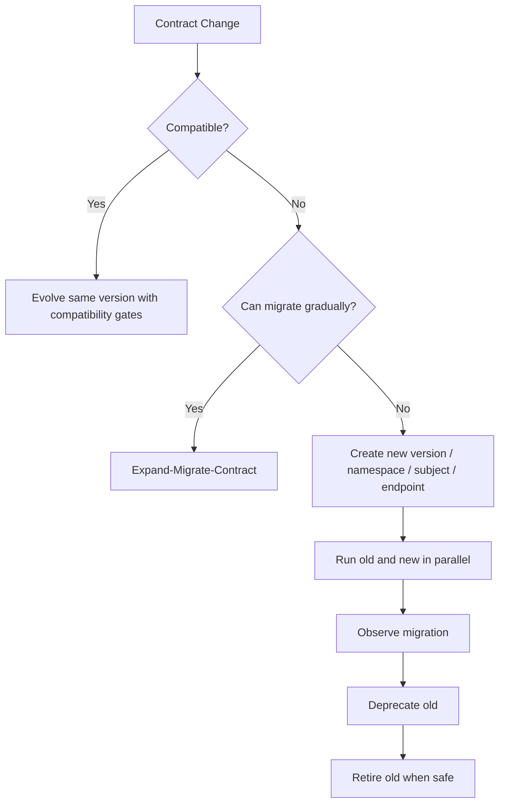
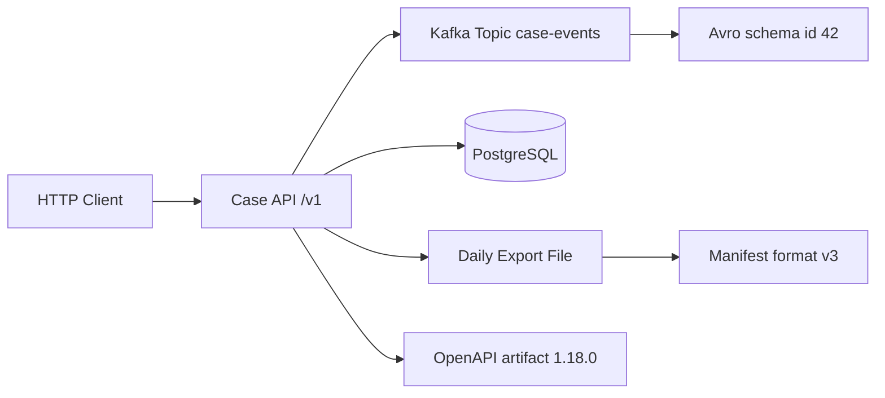
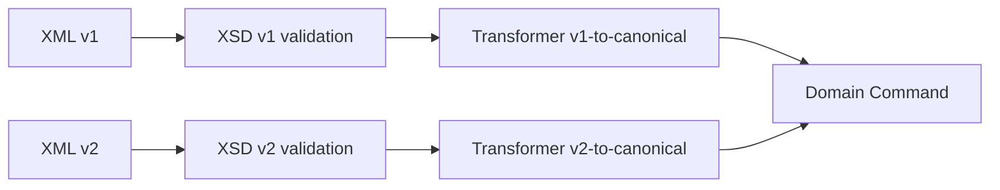
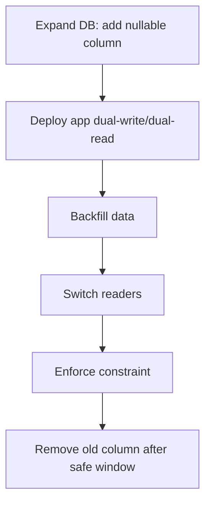
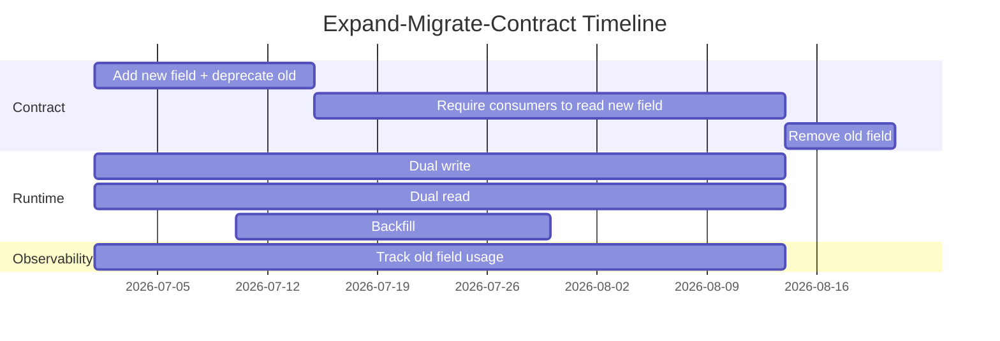
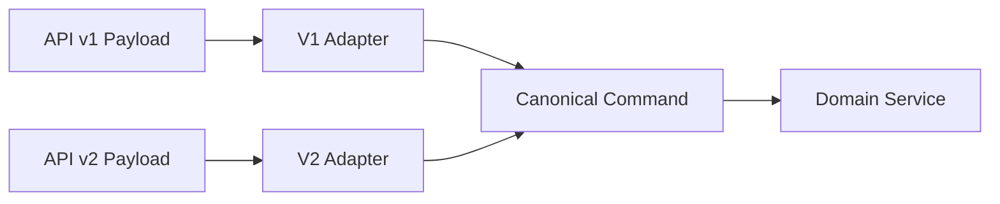
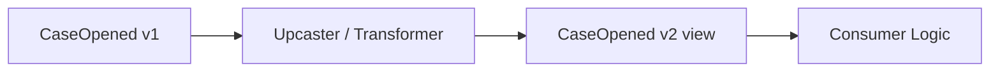

# Part 032 — Versioning Strategies for APIs, Events, Files, and Batch Contracts

> Goal: setelah bagian ini, kamu bisa memilih strategi versioning yang tepat untuk HTTP API, event stream, XML integration, Protobuf/gRPC, Avro topic, JSON Schema package, file export, dan batch ingestion. Kamu juga akan tahu kapan versioning justru menutupi desain evolusi yang buruk.

Versioning adalah mekanisme mengelola perubahan contract agar producer dan consumer bisa bergerak pada kecepatan berbeda tanpa merusak sistem.

Tetapi versioning sering disalahgunakan. Banyak tim memakai `/v2` sebagai tempat membuang perubahan yang sebenarnya bisa diselesaikan dengan compatibility discipline. Sebaliknya, banyak tim terlalu takut membuat versi baru sehingga menyelundupkan breaking semantic change ke versi lama.

Versi bukan tujuan. Versi adalah alat koordinasi.



Di production-grade platform, versioning harus menjawab:

1. **Where is the version declared?** URL, header, media type, namespace, schema ID, package, filename, manifest, topic, subject, artifact version.
2. **What does the version mean?** Syntax version, semantic version, compatibility group, lifecycle generation, release artifact, registry revision.
3. **Who chooses the version?** Client, server, producer, registry, build pipeline, gateway, file sender, batch scheduler.
4. **How long do old versions live?** Days, months, years, legal retention period.
5. **How are old versions tested?** Fixtures, replay, generated clients, compatibility matrix.
6. **How are versions deprecated?** Header, docs, registry status, dashboard, alert, sunset date.
7. **What is the migration path?** Dual-write, dual-read, adapter, transformer, bridge schema, new topic, new endpoint.

---

# 1. Versioning Is Not One Thing

A contract can have multiple versions at once.

Consider an API response that emits an event and writes a file:



Possible versions:

| Layer | Version example | Meaning |
|---|---|---|
| API URL | `/v1/cases` | Major API compatibility group. |
| OpenAPI artifact | `case-api-contract:1.18.0` | Released spec artifact. |
| Response schema | `CaseResponse` revision | Object shape/version inside OpenAPI. |
| Event topic | `case-events` or `case-events-v2` | Stream compatibility group. |
| Avro subject | `case-events-value` | Registry subject for value schema. |
| Avro schema ID | `42` | Concrete registered schema identity. |
| Protobuf package | `com.example.case.v1` | Generated code/package compatibility group. |
| XML namespace | `urn:example:case:v1` | XML vocabulary identity. |
| File format | `case_export_v3` | Batch layout compatibility group. |
| Maven artifact | `case-contracts:2.4.1` | Build-time dependency version. |
| Domain concept | `CaseLifecyclePolicy 2026-07` | Business rule/effective-date version. |

Confusing these is dangerous. A Maven artifact version bump does not mean a breaking API version. A schema ID increment does not necessarily mean a semantic version change. A URL `/v2` does not guarantee better compatibility.

---

# 2. Versioning Decision Framework

Before selecting a versioning strategy, answer these questions.

## 2.1 Boundary Type

| Boundary | Key versioning concern |
|---|---|
| Public HTTP API | Client-controlled upgrade, documentation, deprecation, long support windows. |
| Internal HTTP API | Faster migration, but still distributed deployment. |
| Kafka/event stream | Replay, schema registry compatibility, unknown consumers. |
| gRPC/Protobuf | Binary compatibility, field numbers, generated client code. |
| XML integration | Namespace identity, partner contracts, strict validation. |
| JSON Schema validation | Schema URI identity, catalog, artifact version, validator behavior. |
| Batch/file interface | Late arrival, file manifests, positional layout, regulatory retention. |
| Database contract | Schema migration, read/write compatibility, application deployment sequencing. |

## 2.2 Consumer Control

| Consumer type | Versioning implication |
|---|---|
| Same deployable unit | May not need public versioning, but still needs migration. |
| Same organization, different team | Need compatibility gate and communication. |
| Unknown internal consumers | Treat like external. |
| External partner/customer | Need explicit version, deprecation window, support policy. |
| Regulator/legal archive | Need long-term readability and audit evidence. |
| Data lake/analytics | Need schema history and replay-safe evolution. |

## 2.3 Data Lifetime

| Data lifetime | Strategy implication |
|---|---|
| Request/response only | Shorter compatibility window possible. |
| Queue retry for hours/days | Consumers must read older payloads. |
| Kafka retained for weeks/months | Transitive compatibility matters. |
| Event store forever | Never lose old schema/reader. |
| Legal documents retained for years | Versioned schema and renderer/parser must be archived. |
| Batch files may arrive late | Maintain old importers longer. |

## 2.4 Change Type

| Change | Usually requires new major version? |
|---|---:|
| Add optional response field | No. |
| Add optional event field with safe default | No. |
| Add required request field | Usually yes or staged migration. |
| Remove public field | Usually yes or long deprecation. |
| Rename public field | Usually yes or expand-migrate-contract. |
| Change field meaning | Yes. |
| Change enum meaning | Yes. |
| Add enum value | Not necessarily, but requires unknown handling. |
| Change auth model | Often yes. |
| Change pagination semantics | Often yes. |
| Change file column order | Yes for positional files. |
| Change XML namespace | Yes, effectively a new vocabulary. |

---

# 3. Semantic Versioning for Contract Artifacts

Semantic Versioning can be useful for contract artifacts, but only if you define what major/minor/patch means.

Recommended meaning:

| Version part | Contract meaning |
|---|---|
| MAJOR | Breaking change for at least one supported consumer scenario. |
| MINOR | Backward-compatible feature/addition. |
| PATCH | Documentation, examples, non-runtime metadata, bugfix that does not change valid data set or generated API materially. |

Example Maven artifact:

```xml
<dependency>
  <groupId>com.example.contracts</groupId>
  <artifactId>case-events-avro</artifactId>
  <version>2.7.0</version>
</dependency>
```

But artifact SemVer alone is insufficient because:

- schema registry may assign schema ID per registration,
- OpenAPI `/v1` may have many minor artifact versions,
- generated Java clients may break on minor changes if policy is weak,
- semantic change can hide behind patch version if governance fails.

Use SemVer for **release artifacts**, not as the only compatibility proof.

---

# 4. HTTP API Versioning Strategies

HTTP API versioning is the most visible versioning problem, but also the most over-debated. The right answer depends on consumer control, cache behavior, tooling, gateway, and support policy.

## 4.1 URL Path Versioning

Example:

```http
GET /v1/cases/CASE-001
GET /v2/cases/CASE-001
```

Pros:

- Simple and explicit.
- Easy to route in gateways.
- Easy to document.
- Easy for humans and logs.
- Works with basic clients.

Cons:

- Encourages coarse major versions.
- Can duplicate whole API surface.
- Can make minor evolution awkward.
- URL version may imply resource identity changed when only representation changed.

Use when:

- external clients need clear major version boundary,
- gateway routing is important,
- support windows are long,
- breaking changes are rare but explicit.

Do not use `/v2` for every additive change.

## 4.2 Header-Based Versioning

Example:

```http
GET /cases/CASE-001
API-Version: 2026-07-01
```

Pros:

- Keeps resource URL stable.
- Can support negotiated behavior.
- Allows version policy independent of path.

Cons:

- Less visible.
- Harder to test manually.
- Cache/proxy behavior must include vary rules.
- Documentation and support can be more confusing.

Use when:

- clients are sophisticated,
- API gateway supports it well,
- representation behavior changes without resource path change,
- version negotiation is intentionally part of platform.

## 4.3 Media Type Versioning

Example:

```http
Accept: application/vnd.example.case.v1+json
Content-Type: application/vnd.example.case-command.v1+json
```

Pros:

- Semantically precise: version representation, not resource.
- Aligns with HTTP content negotiation.
- Good for multiple representations.

Cons:

- More complex for clients.
- Tooling support varies.
- Debugging is less obvious.
- Some gateways/SDKs handle it poorly.

Use when:

- representation versioning is central,
- clients already handle content negotiation,
- you have strong API platform governance.

## 4.4 Query Parameter Versioning

Example:

```http
GET /cases/CASE-001?version=2
```

Pros:

- Easy to test in browser.
- No custom header needed.

Cons:

- Often semantically weak.
- Can interact poorly with caching.
- Looks like filtering, not contract selection.
- Easy to misuse for behavior flags.

Generally avoid for major contract versioning. It can be acceptable for preview fields or reporting exports if documented carefully.

## 4.5 Date-Based API Versioning

Example:

```http
API-Version: 2026-07-01
```

Pros:

- Clear release date.
- Works for platforms that roll many incremental changes.
- Avoids arbitrary major numbers.

Cons:

- Needs strong compatibility semantics.
- Many dates can become hard to support.
- Clients may not understand what changed.

Use when:

- API platform has formal changelog,
- clients pin a date,
- server can emulate old behavior for supported dates.

## 4.6 Recommended API Strategy for Enterprise Java Systems

For most enterprise Java APIs:

```text
Major version in URL for breaking compatibility groups.
Minor/patch evolution in OpenAPI artifact and changelog.
Deprecation and sunset through headers/docs.
Generated client compatibility tested in CI.
```

Example:

```text
/v1/cases            OpenAPI artifact 1.24.0
/v2/cases            OpenAPI artifact 2.0.0
```

Within `/v1`, allow:

- additive response fields,
- optional request fields,
- new operations,
- new enum values only with unknown handling policy,
- documentation/example improvements,
- non-breaking validation clarifications.

Require `/v2` or staged migration for:

- required request field addition,
- field removal,
- rename,
- type change,
- behavior change,
- auth model change,
- pagination semantic change,
- error envelope change.

---

# 5. OpenAPI Artifact Versioning

OpenAPI document version appears in multiple places:

```yaml
openapi: 3.2.0
info:
  title: Case Management API
  version: 1.24.0
```

Important distinction:

- `openapi: 3.2.0` is the **OpenAPI specification version**.
- `info.version: 1.24.0` is your **API document/artifact version**.

Do not confuse them.

Recommended repo layout:

```text
contracts/
  openapi/
    case-api/
      v1/
        openapi.yaml
        examples/
        changelog.md
      v2/
        openapi.yaml
        examples/
        changelog.md
```

Recommended artifact publication:

```text
com.example.contracts:case-api-openapi:1.24.0
com.example.clients:case-api-client-java:1.24.0
```

But do not assume generated client minor version is source-compatible unless tested.

## 5.1 API Lifecycle Metadata

OpenAPI supports `deprecated: true` on operations/parameters/schema elements in many contexts. Use it, but do not rely on it alone.

A production lifecycle should include:

- deprecated flag,
- changelog entry,
- replacement guidance,
- metrics dashboard,
- owner contact,
- sunset date if known,
- compatibility notes,
- client migration guide.

Example:

```yaml
paths:
  /v1/cases/{caseId}/legacy-status:
    get:
      deprecated: true
      summary: Get legacy case status
      description: >
        Deprecated. Use GET /v1/cases/{caseId} and read lifecycle.status.
        This operation will be supported until 2027-01-31.
```

---

# 6. Event Versioning Strategies

Event versioning is different from API versioning because events live longer and are often replayed.

## 6.1 Version in Topic Name

Example:

```text
case-events-v1
case-events-v2
```

Pros:

- Clear isolation.
- Old and new consumers can run independently.
- Breaking changes do not poison old topic.
- Easy ACL/routing separation.

Cons:

- Duplicates producer logic.
- Requires dual publishing or migration.
- Consumers must switch topics.
- Ordering across versions can be hard.

Use when:

- event meaning changes materially,
- partitioning key changes,
- envelope changes,
- serialization format changes,
- retention/replay guarantees differ,
- consumer populations need long parallel support.

## 6.2 Version in Event Type

Example:

```json
{
  "eventType": "case.opened.v2",
  "eventId": "evt-001",
  "occurredAt": "2026-07-03T10:00:00Z",
  "payload": { }
}
```

Pros:

- Same topic can carry multiple event versions/types.
- Consumers can branch by type.
- Useful with event envelope.

Cons:

- Topic becomes heterogeneous.
- Consumers must filter correctly.
- Schema registry subject strategy must handle it.
- DLQ/replay tooling more complex.

Use when:

- topic is an event bus category,
- envelope is stable,
- consumers select event types intentionally,
- schema registry strategy supports record-name subjects.

## 6.3 Version in Schema Registry

Example:

```text
subject: case-events-value
versions: 1, 2, 3, 4
schema id: 42
```

Pros:

- Formal compatibility checks.
- Producers/consumers negotiate via schema ID.
- Good for Avro/Protobuf/JSON Schema with registry.

Cons:

- Schema version is not business event version.
- Registry compatibility may not catch semantic breaks.
- Subject strategy can become a governance bottleneck.

Use when:

- format supports schema resolution,
- replay compatibility matters,
- CI/CD integrates with registry.

## 6.4 Version in Payload Field

Example:

```json
{
  "schemaVersion": "1.2.0",
  "caseId": "CASE-001"
}
```

Pros:

- Self-describing payload.
- Useful for JSON events without registry.
- Helps DLQ/manual inspection.

Cons:

- Can drift from actual schema.
- Requires application-level enforcement.
- Not enough for binary formats by itself.

Use as supplemental metadata, not the only governance mechanism.

## 6.5 Recommended Event Strategy

For enterprise event streams:

```text
Stable topic for compatible evolution.
New topic or event type for breaking semantic changes.
Schema registry for Avro/Protobuf/JSON Schema compatibility.
Event envelope includes eventType, eventVersion or schema metadata, eventId, occurredAt, producer, correlationId.
Transitive compatibility for replayed topics.
```

Example envelope:

```json
{
  "eventId": "evt-01J0R7H6M4",
  "eventType": "case.opened",
  "eventVersion": "1.3.0",
  "occurredAt": "2026-07-03T10:00:00Z",
  "producer": "case-intake-service",
  "correlationId": "corr-123",
  "causationId": "cmd-456",
  "payload": {
    "caseId": "CASE-001"
  }
}
```

For Avro, envelope may be part of schema. For Protobuf, envelope may be a wrapper message. For Kafka with registry, schema ID may be in wire framing rather than payload.

---

# 7. Avro Subject and Schema Versioning

Avro versioning is usually handled through schema registry subjects and compatibility modes.

## 7.1 Subject Naming Strategies

Common patterns:

| Strategy | Example | Pros | Cons |
|---|---|---|---|
| Topic name | `case-events-value` | Simple; one schema lineage per topic value. | Bad for heterogeneous topics. |
| Record name | `com.example.CaseOpenedEvent` | Good for event-type evolution. | Many subjects; topic compatibility less obvious. |
| Topic + record name | `case-events-com.example.CaseOpenedEvent` | Good isolation. | More complex governance. |

Choose based on topic design.

If one topic contains many event types, topic-name strategy can force unrelated schemas into one compatibility lineage. That becomes painful.

## 7.2 Avro Schema Version Is Not Artifact Version

Registry version:

```text
subject=case-events-value
version=17
schemaId=1042
```

Maven artifact:

```text
case-events-contracts:2.8.0
```

Event semantic version:

```text
eventVersion=1.3.0
```

These are related but not identical.

Recommended metadata mapping:

```yaml
contract:
  artifact: com.example.contracts:case-events-avro:2.8.0
  registrySubject: case-events-com.example.caseevent.CaseOpenedEvent
  compatibility: FULL_TRANSITIVE
  eventType: case.opened
  eventVersion: 1.3.0
```

## 7.3 Avro Compatibility Mode Selection

| Use case | Recommended mode |
|---|---|
| Short-lived internal stream, no replay | BACKWARD or FULL may be enough. |
| Kafka topic retained for replay | BACKWARD_TRANSITIVE or FULL_TRANSITIVE. |
| Event-sourced domain log | FULL_TRANSITIVE plus explicit upcasters/readers. |
| Data lake ingestion | BACKWARD_TRANSITIVE often needed for old files. |
| Partner event feed | FULL_TRANSITIVE or explicit major-version topic. |

Transitive modes cost discipline, but save you when old data reappears.

---

# 8. Protobuf/gRPC Versioning Strategies

Protobuf has two identities:

1. `.proto` source/package identity.
2. Binary field-number identity.

## 8.1 Package Versioning

Example:

```proto
syntax = "proto3";

package com.example.case.v1;

option java_package = "com.example.case.contract.v1";
option java_multiple_files = true;
```

For breaking changes:

```proto
package com.example.case.v2;
option java_package = "com.example.case.contract.v2";
```

Pros:

- Clear generated-code separation.
- v1 and v2 can coexist in same process.
- Good for gRPC clients and server parallel support.

Cons:

- Duplicate service/message definitions.
- Migration requires adapters.
- Long support can grow codebase.

Use package versioning for major/breaking changes.

## 8.2 Field-Level Evolution Within Same Message

For compatible changes:

```proto
message CaseOpened {
  string case_id = 1;
  google.protobuf.Timestamp opened_at = 2;

  optional string risk_level = 3;
}
```

Rules:

- Add new fields with new numbers.
- Do not change field numbers.
- Do not reuse deleted numbers.
- Reserve deleted numbers and names.
- Prefer explicit enum numeric values.
- Avoid changing JSON names casually.

## 8.3 gRPC Service Versioning

Option A: version package.

```proto
package com.example.case.v1;
service CaseService { }

package com.example.case.v2;
service CaseService { }
```

Option B: version service name.

```proto
service CaseServiceV1 { }
service CaseServiceV2 { }
```

Usually package versioning is cleaner because messages and services share a namespace.

## 8.4 RPC Method Evolution

Avoid changing request/response message meaning in place for breaking behavior.

Instead of:

```proto
rpc SearchCases(SearchCasesRequest) returns (SearchCasesResponse);
```

with changed semantics, prefer:

```proto
rpc SearchCases(SearchCasesRequest) returns (SearchCasesResponse);
rpc SearchCasesV2(SearchCasesV2Request) returns (SearchCasesV2Response);
```

or new package/service for major version.

## 8.5 Editions Versioning

Protobuf Editions introduce edition-level feature behavior. Treat Edition changes as platform-level contract changes:

- pin compiler/runtime versions,
- generate compatibility test outputs,
- do not mix edition migration with business schema change,
- update lint rules,
- verify Java generated API changes,
- roll out incrementally.

---

# 9. XSD/XML Versioning Strategies

XML versioning is usually namespace-driven.

## 9.1 Namespace Versioning

Example:

```xml
xmlns:case="urn:example:case:v1"
```

Breaking change:

```xml
xmlns:case="urn:example:case:v2"
```

Pros:

- Clear vocabulary identity.
- Validators distinguish versions precisely.
- Java binding packages can separate versions.

Cons:

- Namespace proliferation.
- Requires transformation/adapters.
- Minor additions may require careful design.

Use namespace versioning for breaking vocabulary changes.

## 9.2 Version Attribute

Example:

```xml
<case:CaseReport schemaVersion="1.4" xmlns:case="urn:example:case:v1">
```

Pros:

- Useful for minor revision tracking.
- Helps logging/audit.
- Can drive validation routing.

Cons:

- Does not change XML vocabulary identity.
- Can drift from actual schema.
- Not enough for structural breaking changes.

Use as supplemental metadata inside a stable namespace.

## 9.3 XML Versioning Rule

Recommended:

```text
Namespace major version for breaking changes.
Schema artifact minor/patch for compatible additions/documentation.
schemaVersion attribute for document-level traceability.
Transformation pipeline for v1 -> v2 migration.
```

## 9.4 XML Transformation Strategy

When supporting v1 and v2:



Do not let every downstream service parse every XML version. Centralize version-specific parsing at the boundary.

---

# 10. JSON Schema Versioning Strategies

JSON Schema versioning depends on `$id`, `$schema`, artifact version, and cataloging.

## 10.1 `$schema` Is Dialect, Not Your Contract Version

Example:

```json
{
  "$schema": "https://json-schema.org/draft/2020-12/schema",
  "$id": "https://contracts.example.com/case/create-case-command/1.3.0/schema.json"
}
```

- `$schema` declares the JSON Schema dialect/metaschema.
- `$id` identifies the schema resource.
- Your version can be encoded in `$id`, artifact metadata, or both.

Do not use `$schema` for business contract versioning.

## 10.2 Version in `$id`

Example:

```json
{
  "$id": "https://contracts.example.com/case/create-case-command/v1/schema.json"
}
```

or:

```json
{
  "$id": "https://contracts.example.com/case/create-case-command/1.4.0/schema.json"
}
```

Pros:

- Stable reference identity.
- Works with schema catalog/resolver.
- Clear offline artifact mapping.

Cons:

- Changing `$id` can break `$ref` resolution.
- Too many patch-level IDs can create noise.

Recommended:

```text
Major compatibility group in stable path.
Artifact version in package metadata.
Specific immutable release URI for published versions.
```

Example:

```text
https://contracts.example.com/case/create-case-command/v1/schema.json
https://contracts.example.com/releases/case/create-case-command/1.4.0/schema.json
```

## 10.3 Schema Catalog

A schema catalog maps logical IDs to local files/artifacts.

```yaml
schemas:
  create-case-command-v1:
    id: https://contracts.example.com/case/create-case-command/v1/schema.json
    artifact: com.example.contracts:create-case-command-jsonschema:1.4.0
    file: schemas/create-case-command.schema.json
    compatibility: backward
```

Runtime validators should resolve through a controlled catalog, not random network calls.

---

# 11. File and Batch Contract Versioning

Batch/file contracts have different failure modes:

- files can arrive late,
- files may be manually edited,
- file names may drive routing,
- column order may matter,
- partner systems may be slow to upgrade,
- reprocessing old files is common,
- audit retention may be years.

## 11.1 Version in Filename

Example:

```text
case_export_v3_20260703.csv
```

Pros:

- Easy routing.
- Human-visible.
- Works without opening file.

Cons:

- Filename can lie.
- Manual renames break routing.
- Not enough for validation.

Use for routing, not as sole source of truth.

## 11.2 Version in Header Row

CSV example:

```csv
# format=case-export; version=3; generatedAt=2026-07-03T10:00:00Z
case_id,status,opened_at,risk_level
CASE-001,OPEN,2026-07-03T10:00:00Z,HIGH
```

Pros:

- Self-describing.
- Useful in archived file.

Cons:

- Some CSV tools dislike comments.
- Still needs strict parser.

## 11.3 Version in Manifest

Better for serious batch:

```json
{
  "fileName": "case_export_20260703_0001.csv",
  "format": "case-export",
  "formatVersion": "3.1.0",
  "schemaUri": "https://contracts.example.com/files/case-export/v3/schema.json",
  "recordCount": 50000,
  "sha256": "...",
  "generatedAt": "2026-07-03T10:00:00Z",
  "producer": "case-reporting-service"
}
```

Pros:

- Supports validation before ingestion.
- Enables integrity checks.
- Good for audit.
- Can reference schema artifact.

Cons:

- Requires two-file protocol.
- Must keep manifest and data consistent.

Recommended for enterprise batch interfaces.

## 11.4 Positional vs Named File Formats

CSV without header is fragile:

```csv
CASE-001,OPEN,2026-07-03T10:00:00Z
```

Adding a column in the middle is breaking.

CSV with header is better:

```csv
case_id,status,opened_at,risk_level
CASE-001,OPEN,2026-07-03T10:00:00Z,HIGH
```

But consumers may still parse by position. Governance must state:

```text
Consumers must map by header name, not column position.
New columns may be appended only.
Required columns may not be removed within major version.
Column meaning may not change within major version.
```

## 11.5 Batch Versioning Strategy

Recommended:

```text
Major format version in manifest and/or filename.
Schema URI in manifest.
Header names for delimited files.
Append-only columns within major version.
New major version for column reorder/removal/meaning change.
Importer supports old versions for defined retention window.
```

---

# 12. Database Schema Versioning Is Not Data Contract Versioning

Database migrations are contracts too, but they are not the same as API/event contracts.

A database migration version:

```text
V202607031015__add_case_risk_level.sql
```

means the database structure changed. It does not mean external contracts changed.

However database changes can break contract compatibility:

- API field added but DB column missing.
- Contract maxLength increased but DB column too small.
- Enum value added but DB check constraint rejects it.
- New nullable contract field mapped to non-null DB column.
- Old event replay cannot insert into new schema.

Use expand-migrate-contract for DB-backed contract changes:



---

# 13. Expand-Migrate-Contract Versioning Pattern

This is the most important migration pattern.

## 13.1 Problem

You need to rename `ownerId` to `assignedOfficerId`.

Bad approach:

```text
Change field name in schema.
Deploy.
Hope consumers update.
```

Good approach:

```text
Expand: add assignedOfficerId while keeping ownerId.
Migrate: dual-write, dual-read, update consumers.
Contract: remove ownerId only after safe window.
```

## 13.2 Timeline



## 13.3 Java Mapper During Migration

```java
public AssignedOfficerId mapAssignedOfficer(CaseDto dto) {
    if (dto.assignedOfficerId() != null && !dto.assignedOfficerId().isBlank()) {
        return new AssignedOfficerId(dto.assignedOfficerId());
    }

    if (dto.ownerId() != null && !dto.ownerId().isBlank()) {
        migrationMetrics.increment("case.ownerId.fallback.used");
        return new AssignedOfficerId(dto.ownerId());
    }

    return AssignedOfficerId.unassigned();
}
```

The fallback is observable. Without metrics, you do not know when it is safe to contract.

---

# 14. Parallel Version Support

Sometimes you must support v1 and v2 simultaneously.

## 14.1 Adapter Pattern



Rule:

> Version-specific code belongs at the boundary. Domain service should not be polluted with v1/v2 branches unless the business process itself differs.

## 14.2 Transformer Pattern for Events



For event-sourced systems, old events may never be physically rewritten. Instead, readers upcast old event versions to the current in-memory representation.

## 14.3 Branching Anti-Pattern

Bad:

```java
if (version.equals("v1")) {
    // old logic
} else if (version.equals("v2")) {
    // new logic
} else if (version.equals("v3")) {
    // slightly different logic
}
```

This spreads version logic everywhere.

Better:

```java
ContractAdapter adapter = adapterRegistry.forVersion(version);
DomainCommand command = adapter.toCommand(payload);
domainService.handle(command);
```

---

# 15. Deprecation, Sunset, and Retirement

Versioning without retirement becomes archaeology.

## 15.1 Deprecation States

| State | Meaning |
|---|---|
| Active | Fully supported. |
| Deprecated | Should not be used for new integrations. Existing consumers still supported. |
| Sunset scheduled | Retirement date announced. |
| Read-only / limited support | Only critical fixes. |
| Retired | No longer available. |
| Archived | Schema/docs retained for audit/replay only. |

## 15.2 Deprecation Metadata

For each deprecated contract element:

```yaml
deprecation:
  deprecatedSince: 2026-07-03
  replacement: /v1/cases/{caseId}
  reason: legacy status model cannot represent reopened cases
  sunsetDate: 2027-01-31
  owner: case-platform-team
  migrationGuide: docs/migrations/legacy-status.md
```

## 15.3 Runtime Deprecation Signals

For HTTP:

```http
Deprecation: @1751328000
Sunset: Sat, 31 Jan 2027 23:59:59 GMT
Link: <https://docs.example.com/migrations/legacy-status>; rel="deprecation"
```

For events:

```json
{
  "eventType": "case.legacy-status-changed",
  "eventVersion": "1.0.0",
  "deprecated": true,
  "replacementEventType": "case.lifecycle-transitioned"
}
```

For schema registry/catalog:

```yaml
status: deprecated
replacementSubject: case-events-com.example.caseevent.CaseLifecycleTransitioned
sunsetDate: 2027-01-31
```

## 15.4 Retirement Gate

Do not retire until:

- no known active consumers,
- usage metrics zero for agreed window,
- external notice period complete,
- legal/regulatory constraints checked,
- replay/retention strategy defined,
- rollback plan unnecessary or documented,
- docs archived.

---

# 16. Version Negotiation

Version negotiation means producer/server and consumer/client agree on version dynamically.

## 16.1 HTTP Negotiation

Client sends:

```http
Accept: application/vnd.example.case.v2+json
```

Server responds:

```http
Content-Type: application/vnd.example.case.v2+json
```

Use when representation negotiation matters. Avoid if clients are simple and path versioning is enough.

## 16.2 Event Consumer Negotiation

Event systems rarely negotiate at runtime. Instead, consumers subscribe to topics/types and use schema registry.

Practical equivalent:

- consumer declares supported event types/versions,
- schema registry compatibility ensures readability,
- DLQ handles unsupported versions,
- contract catalog tracks support matrix.

Example support matrix:

| Consumer | Event | Supported versions |
|---|---|---|
| `case-search-indexer` | `case.opened` | `1.x`, `2.x` |
| `sla-calculator` | `case.opened` | `1.x` |
| `risk-engine` | `risk.assessed` | `1.x` |

## 16.3 Batch Negotiation

Batch negotiation usually happens out-of-band:

- partner onboarding form,
- SFTP directory per version,
- manifest version,
- scheduled cutover date,
- test file certification.

Do not assume batch senders can upgrade quickly.

---

# 17. Contract Catalog as Version Control Plane

A contract catalog is the system of record for contract versions.

## 17.1 Catalog Entry

```yaml
id: case-api-v1
kind: openapi
owner: case-platform-team
status: active
artifact:
  groupId: com.example.contracts
  artifactId: case-api-openapi
  version: 1.24.0
runtime:
  basePath: /v1
  gateway: internal-api-gateway
compatibility:
  major: 1
  policy: additive-compatible
lifecycle:
  createdAt: 2025-05-01
  deprecatedAt: null
  sunsetAt: null
consumers:
  - enforcement-ui
  - case-reporting-service
links:
  spec: https://contracts.example.com/case-api/v1/openapi.yaml
  changelog: https://contracts.example.com/case-api/v1/changelog
```

## 17.2 Why Catalog Matters

Without catalog:

- version policy lives in tribal memory,
- consumers are unknown,
- old versions linger forever,
- breaking changes are discovered in incidents,
- compliance evidence is weak.

With catalog:

- ownership is explicit,
- lifecycle is visible,
- compatibility policy is encoded,
- consumers can be traced,
- deprecation can be managed.

---

# 18. Versioning Anti-Patterns

## 18.1 `/v2` as Garbage Bin

Creating `/v2` without migration and governance only duplicates complexity.

Bad signs:

- `/v1` and `/v2` both actively changing,
- no sunset plan,
- unclear feature parity,
- clients mix versions randomly,
- bug fixes applied inconsistently.

## 18.2 Hidden Versioning Through Flags

Example:

```http
GET /cases/CASE-001?newStatusModel=true
```

This is versioning disguised as a flag. It can be acceptable for preview/beta, but dangerous as long-term contract strategy.

## 18.3 Semantic Change Without Version Change

Example:

```text
status=CLOSED used to mean final.
Now CLOSED can be reopened.
```

This must be versioned or migrated. The shape did not change, but the contract did.

## 18.4 Version Per Field

Adding `fieldVersion` everywhere is usually a symptom of weak model boundaries.

Better:

- version the containing contract,
- use effective-dated reference data for controlled vocabularies,
- use separate event types for separate facts.

## 18.5 Never Retiring Versions

Every supported version costs:

- tests,
- security review,
- documentation,
- runtime branches,
- incident playbooks,
- support knowledge,
- compliance evidence.

Support windows must be explicit.

---

# 19. Case Study: Regulatory Case Platform Versioning

Assume a regulatory case platform with:

- public/partner intake API,
- internal case command API,
- Kafka events,
- XML filing to regulator,
- daily enforcement export,
- data lake ingestion,
- long-term audit retention.

## 19.1 Contract Inventory

| Contract | Format | Version strategy |
|---|---|---|
| Partner intake API | OpenAPI | `/v1`, `/v2` for major; artifact SemVer for minor. |
| Internal command API | OpenAPI/JSON Schema | Same major path; stricter CI; shorter support window. |
| Case lifecycle events | Avro | Schema registry subject, FULL_TRANSITIVE, eventVersion in envelope. |
| Risk engine RPC | Protobuf/gRPC | Package version for major; field-number evolution for minor. |
| Regulator XML filing | XSD | Namespace major version; schemaVersion attribute; transformer. |
| Daily CSV export | CSV + manifest | formatVersion in manifest; append-only columns within major. |
| Data lake objects | Avro/Parquet | Schema registry/catalog; transitive read support. |

## 19.2 Example Change: New `REOPENED` Status

This is not “just add enum”. It affects lifecycle semantics.

Impact:

- OpenAPI response enum adds value.
- Java clients with exhaustive switch may fail.
- UI status color/label must update.
- SLA calculator must decide whether reopened case resets clock.
- XML filing may need regulator approval.
- CSV export consumers may reject unknown status.
- Data lake reports must update metrics.

Versioning decision:

| Boundary | Decision |
|---|---|
| Internal event | Add new lifecycle event `case.reopened`, avoid overloading `status`. |
| OpenAPI | Add enum only after clients have unknown handling; document semantics. |
| XML regulator filing | If regulator schema lacks status, create new namespace or extension per regulator process. |
| CSV | Major version if consumers cannot tolerate unknown enum. |
| Analytics | Effective-dated metric definition. |

## 19.3 Example Change: Replace `ownerId` with `assignedOfficerId`

Versioning decision:

- HTTP API: expand-migrate-contract inside `/v1` if compatible window possible; `/v2` if public clients cannot migrate safely.
- Avro event: add `assignedOfficerId` with default/null; keep `ownerId` deprecated; later new event version if removing.
- Protobuf: add new field number; deprecate old; reserve old only after deletion.
- XSD: add optional element or extension; new namespace if structural meaning changes.
- CSV: append new column; keep old column; remove only in next major file format.

---

# 20. Java Project Layout for Versioned Contracts

Recommended multi-module layout:

```text
case-contracts/
  pom.xml
  openapi/
    case-api-v1/
    case-api-v2/
  json-schema/
    create-case-command-v1/
  avro/
    case-events/
  protobuf/
    case-rpc-v1/
    case-rpc-v2/
  xsd/
    regulator-filing-v1/
    regulator-filing-v2/
  batch/
    case-export-v3/
  compatibility-tests/
  catalog/
    contracts.yaml
```

Generated code should preserve version boundaries:

```text
com.example.contract.caseapi.v1
com.example.contract.caseapi.v2
com.example.contract.caseevents.v1
com.example.contract.caserpc.v1
com.example.contract.regulator.v1
```

Do not generate v1 and v2 classes into the same package.

## 20.1 Adapter Package Layout

```text
case-service/
  src/main/java/com/example/caseapp/api/v1/CaseApiV1Resource.java
  src/main/java/com/example/caseapp/api/v1/CaseApiV1Mapper.java
  src/main/java/com/example/caseapp/api/v2/CaseApiV2Resource.java
  src/main/java/com/example/caseapp/api/v2/CaseApiV2Mapper.java
  src/main/java/com/example/caseapp/domain/CaseService.java
```

Boundary version logic stays in adapter packages.

---

# 21. CI/CD Versioning Gates

A versioning strategy must be enforced.

## 21.1 Pull Request Checks

For every contract PR:

```text
1. Parse contract.
2. Validate style/lint.
3. Compare against previous version.
4. Classify change as patch/minor/major.
5. Verify artifact version bump matches classification.
6. Run compatibility tests.
7. Generate Java code.
8. Compile representative consumers.
9. Validate examples/fixtures.
10. Update catalog/changelog.
```

## 21.2 Version Bump Enforcement

Example policy:

```yaml
rules:
  - if: breakingChange == true
    require:
      - majorVersionBump
      - migrationPlan
      - ownerApproval
  - if: additiveChange == true
    require:
      - minorVersionBump
      - examplesUpdated
      - compatibilityTests
  - if: docsOnly == true
    require:
      - patchVersionBump
```

## 21.3 Changelog Format

```markdown
# Changelog — Case API v1

## 1.24.0 — 2026-07-03

### Added
- Added optional `riskLevel` to `CaseResponse`.

### Compatibility
- Backward compatible for tolerant response clients.
- Java generated client adds nullable property.
- Consumers must treat unknown risk level as `UNKNOWN`.

### Migration
- No migration required.
```

---

# 22. Operational Observability for Versions

You cannot manage versions you cannot see.

## 22.1 Metrics

Track:

- request count by API version,
- event count by event type/version,
- schema ID usage by topic,
- file format version ingestion count,
- deprecated endpoint usage,
- unknown enum values,
- validation failures by schema version,
- adapter fallback usage,
- old field read/write usage.

Example metric labels:

```text
contract_validation_failures_total{
  contract="case-api",
  version="v1",
  field="riskLevel",
  reason="unknown_enum"
}
```

## 22.2 Logs

Log contract version at boundary:

```json
{
  "message": "contract payload accepted",
  "contract": "case-intake-api",
  "contractVersion": "v1",
  "schemaVersion": "1.24.0",
  "consumerId": "partner-abc",
  "correlationId": "corr-123"
}
```

## 22.3 Dashboards

Minimum dashboards:

- active consumers by version,
- deprecated version usage,
- validation failure trend,
- schema ID distribution,
- event version distribution,
- DLQ by contract version,
- batch ingestion by format version.

---

# 23. Versioning Governance Model

## 23.1 Ownership

Every versioned contract needs:

- owner team,
- technical steward,
- business owner if semantics regulated,
- support contact,
- consumer registry,
- lifecycle state.

## 23.2 Approval Levels

| Change | Approval |
|---|---|
| Docs/example patch | Owner review. |
| Add optional field | Owner + CI compatibility. |
| Add enum value | Owner + impacted consumer review. |
| Tighten validation | Owner + migration evidence. |
| Remove field | Architecture/governance review. |
| Change meaning | Architecture + business/regulatory approval. |
| New major version | Architecture + migration plan + support policy. |

## 23.3 Exception Process

Sometimes you must break compatibility urgently, for example security/legal reasons.

Exception record should include:

- reason,
- affected consumers,
- blast radius,
- mitigation,
- timeline,
- rollback/forward plan,
- approval,
- post-incident review.

---

# 24. Decision Matrix: Which Versioning Strategy Should I Use?

| Scenario | Recommended strategy |
|---|---|
| Add optional response field to public API | Same URL major; minor OpenAPI artifact bump. |
| Add required field to API request | New major API version or staged expand-migrate-contract. |
| Remove API operation | Deprecate + sunset + later remove in new major. |
| Add field to Avro event | Same subject if default and compatibility pass. |
| Break Avro event structure | New event type/topic/subject major. |
| Add Protobuf field | Same message; new tag. |
| Remove Protobuf field | Deprecate, then delete with reserved tag/name. |
| Change Protobuf service semantics | New method or package version. |
| Add XML optional element | Same namespace only if validation strategy supports it. |
| Break XML structure | New namespace. |
| Add CSV column | Append column; same major only if consumers map by header. |
| Reorder CSV columns | New major file format. |
| Change enum meaning | New semantic version/major, migration required. |
| Change business lifecycle state machine | Treat as semantic contract major change. |

---

# 25. Practical Checklist Before Creating a New Major Version

Before creating `/v2`, `v2` namespace, `case-events-v2`, or `com.example.v2`, ask:

- Is the change truly breaking?
- Could additive evolution solve it?
- Could expand-migrate-contract solve it?
- Do we know all consumers?
- Can we support v1 and v2 simultaneously?
- Is there a migration guide?
- Is there a sunset plan for v1?
- Will v2 duplicate too much code?
- Are domain semantics clearer in v2, or are we just moving mess?
- Are generated packages isolated?
- Are tests duplicated for v1/v2?
- Are operational dashboards version-aware?
- Is there data migration or replay impact?
- Are legal/regulatory records still readable?

If you cannot support two versions, do not create two versions casually.

---

# 26. Key Takeaways

1. Versioning is coordination, not decoration.
2. A contract can have URL version, artifact version, schema registry version, event version, package version, and business-rule version at the same time.
3. Use major versions for breaking compatibility groups, not every change.
4. API path versioning is simple and pragmatic for enterprise systems, but minor changes should be handled via compatibility discipline.
5. Event versioning must account for replay and unknown consumers.
6. Avro subject/version/schema ID are not the same as business event version.
7. Protobuf major versioning often belongs in package/service boundaries; compatible evolution happens through new field numbers.
8. XSD breaking changes usually imply a new namespace.
9. Batch/file contracts need manifest-level versioning because files arrive late and live long.
10. Deprecation without observability is guesswork.
11. Retirement must be planned; otherwise every version becomes permanent debt.
12. Version-specific logic belongs at system boundaries, not deep in domain services.

---

# References

- OpenAPI Specification 3.2.0 — https://spec.openapis.org/oas/v3.2.0.html
- JSON Schema Specification — https://json-schema.org/specification
- Apache Avro 1.12.0 Specification — https://avro.apache.org/docs/1.12.0/specification/
- Protocol Buffers Language Guide proto3 — https://protobuf.dev/programming-guides/proto3/
- Protocol Buffers Best Practices — https://protobuf.dev/best-practices/dos-donts/
- W3C XML Schema 1.1 Part 1: Structures — https://www.w3.org/TR/xmlschema11-1/
- W3C XML Schema 1.1 Part 2: Datatypes — https://www.w3.org/TR/xmlschema11-2/
- RFC 9457 Problem Details for HTTP APIs — https://www.rfc-editor.org/rfc/rfc9457
- RFC 8594 The Sunset HTTP Header Field — https://www.rfc-editor.org/rfc/rfc8594
