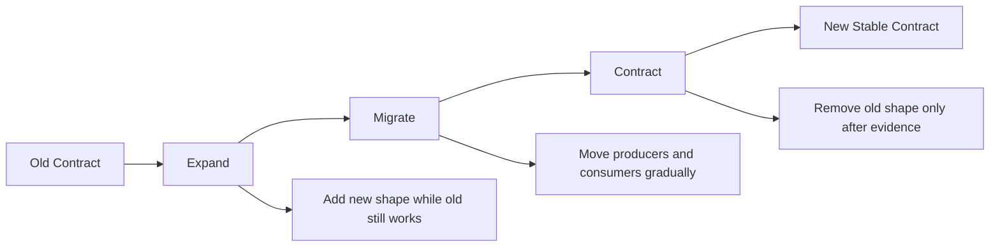
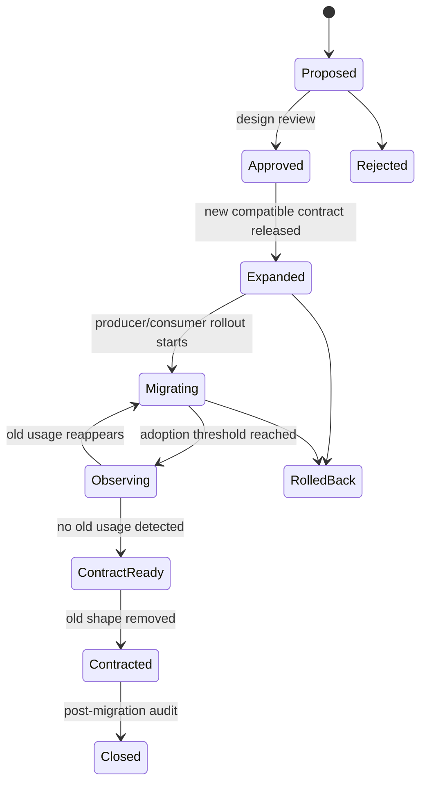
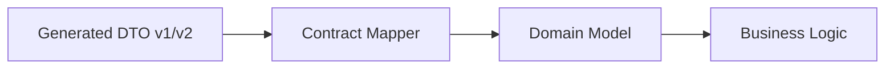
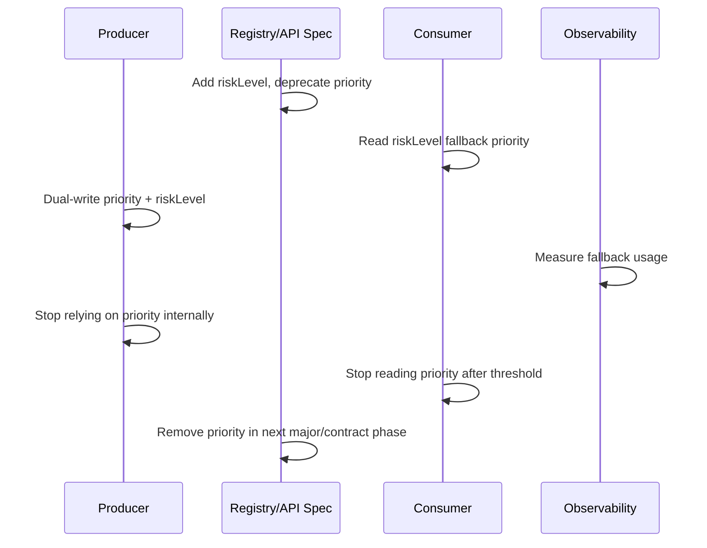
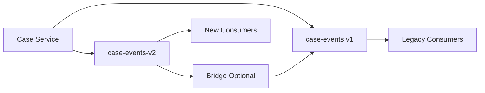
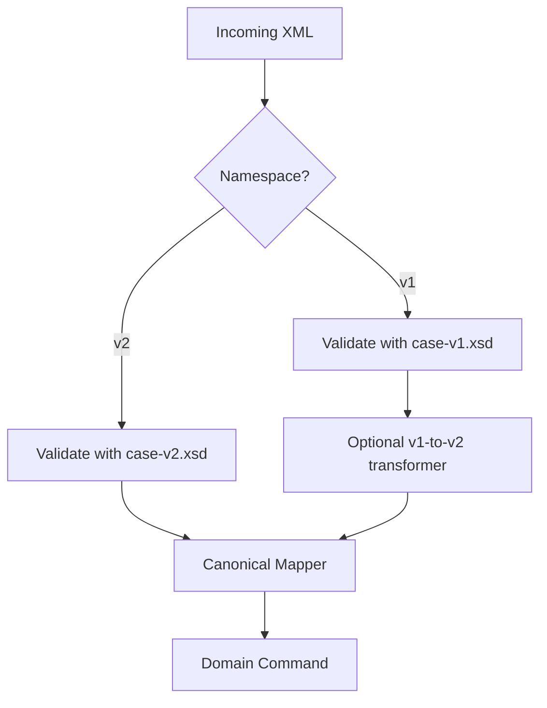
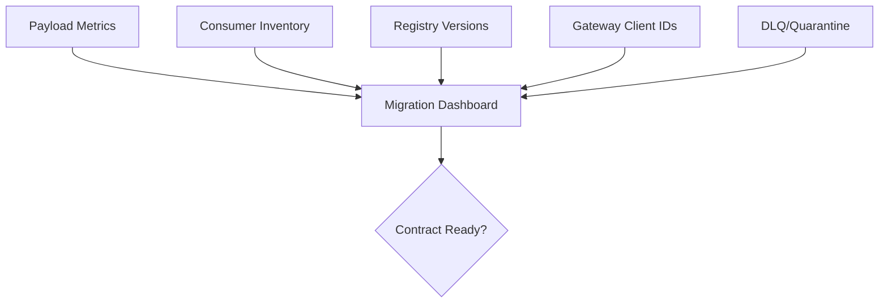
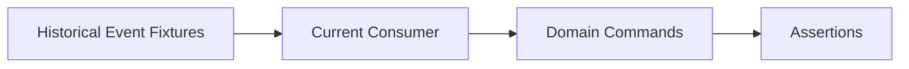

# Part 033 — Migration Playbooks: Expand Contract, Migrate, Contract

> Goal: setelah bagian ini, kamu bisa menjalankan perubahan contract secara aman di sistem enterprise: add field, rename field, remove field, split object, change type, migrate enum, version event, replace API response, dan mengubah schema tanpa memaksa semua producer/consumer deploy pada saat yang sama.

Contract migration bukan sekadar mengganti file schema.

Contract migration adalah **distributed change protocol**.

Dalam sistem microservices, tidak ada satu tombol deploy yang bisa membuat semua client, server, producer, consumer, batch job, cached payload, replayed events, generated clients, dan reporting pipeline berubah secara atomik.

Karena itu, perubahan contract harus didesain seperti ini:



Pola ini sering disebut:

- **Expand**: tambahkan struktur baru tanpa menghancurkan struktur lama.
- **Migrate**: pindahkan producer dan consumer ke struktur baru secara bertahap.
- **Contract**: hapus struktur lama setelah bukti observability menunjukkan aman.

Prinsipnya sederhana:

> Never remove the old capability before the new capability is known to be consumed correctly.

---

# 1. Mental Model: Contract Migration Is a Protocol

Bayangkan kamu ingin mengganti field `priority` menjadi `riskLevel`.

Versi naif:

```json
{
  "caseId": "CASE-1001",
  "priority": "HIGH"
}
```

Menjadi:

```json
{
  "caseId": "CASE-1001",
  "riskLevel": "HIGH"
}
```

Kelihatannya kecil. Tetapi di production, field `priority` mungkin digunakan oleh:

- frontend list sorting,
- SLA calculator,
- assignment engine,
- escalation worker,
- Kafka consumer,
- data warehouse ingestion,
- report harian,
- audit export,
- machine learning feature pipeline,
- external regulator API client,
- old mobile client,
- cached JSON snapshot,
- replayed historical event.

Kalau kamu langsung mengganti nama field, kamu tidak melakukan refactor. Kamu melakukan **distributed breaking change**.

Contract migration harus menjawab:

| Pertanyaan | Kenapa penting |
|---|---|
| Siapa producer lama? | Masih bisa mengirim shape lama. |
| Siapa producer baru? | Mulai mengirim shape baru. |
| Siapa consumer lama? | Masih membaca shape lama. |
| Siapa consumer baru? | Bisa membaca shape baru. |
| Ada data lama? | Replay dan historical query masih membawa schema lama. |
| Ada generated client? | Rename field bisa menjadi compile-time/runtime break. |
| Ada cache? | Cache lama bisa hidup lebih lama dari deploy. |
| Ada batch/file? | File lama mungkin diproses ulang berbulan-bulan kemudian. |
| Ada audit/legal retention? | Payload lama tidak boleh hilang atau diinterpretasikan ulang sembarangan. |

---

# 2. The Three Phases

## 2.1 Expand

Expand berarti membuat contract baru **lebih permisif** dan/atau **lebih kaya**, tetapi tetap mendukung bentuk lama.

Contoh:

```json
{
  "caseId": "CASE-1001",
  "priority": "HIGH",
  "riskLevel": "HIGH"
}
```

Pada fase expand:

- field baru ditambahkan,
- field lama tetap ada,
- consumer baru boleh membaca field baru,
- consumer lama tetap membaca field lama,
- producer bisa dual-write,
- validator menerima kedua bentuk,
- observability mulai mengukur adoption.

## 2.2 Migrate

Migrate berarti memindahkan traffic dan dependency.

Pada fase ini:

- consumer mulai membaca `riskLevel`, fallback ke `priority`,
- producer mulai mengisi `riskLevel`,
- downstream dashboard mengukur persentase payload dengan field baru,
- compatibility tests memastikan old/new tetap aman,
- dokumentasi menandai field lama deprecated,
- contract catalog menampilkan migration state.

## 2.3 Contract

Contract berarti menghapus bentuk lama.

Tetapi contract hanya boleh dilakukan setelah ada bukti:

- tidak ada consumer aktif membaca field lama,
- tidak ada producer aktif mengirim field lama saja,
- replay historical event sudah punya strategi,
- batch/file lama sudah masuk policy,
- generated client lama sudah tidak dipakai,
- external client sudah melewati deprecation window,
- alert tidak menunjukkan invalid payload,
- exception process sudah selesai.

---

# 3. Migration State Machine

Perubahan contract sebaiknya punya state eksplisit.



State ini bukan birokrasi. State ini membantu engineer menjawab pertanyaan kritis:

> Perubahan ini sedang aman di tahap mana?

Tanpa state machine, banyak organisasi punya puluhan field deprecated yang tidak pernah benar-benar dihapus, atau lebih buruk: field dihapus tanpa bukti bahwa consumer sudah selesai migrasi.

---

# 4. Contract Migration Invariants

Sebelum masuk playbook, tetapkan invariant.

## 4.1 Compatibility invariant

Selama fase expand dan migrate:

> New consumers must tolerate old payloads, and old consumers must tolerate new payloads.

Tidak selalu sempurna, terutama untuk generated client strict. Tetapi harus menjadi target design.

## 4.2 Observability invariant

Tidak boleh contract sebelum ada data.

Minimal ukur:

- producer version,
- consumer version,
- payload schema version,
- field presence ratio,
- validation failure count,
- unknown field count,
- fallback usage count,
- DLQ/quarantine rate,
- endpoint usage by client ID,
- event schema ID consumption.

## 4.3 Replay invariant

Event dan file lama tidak hilang hanya karena schema berubah.

Jika sistem mendukung replay:

> A consumer deployed today must either read historical payloads correctly or explicitly route them through a migration adapter.

## 4.4 Generated-code invariant

Generated model bukan domain truth.

Jika rename field mengubah generated method dari `getPriority()` menjadi `getRiskLevel()`, migration tidak boleh memaksa seluruh domain code ikut retak.

Gunakan mapping boundary.



## 4.5 Audit invariant

Untuk sistem regulasi, finance, enforcement, healthcare, dan legal:

> Do not silently reinterpret historical payloads as if they were created under the new contract.

Migrasi boleh menambah derived representation, tetapi original payload dan original schema identity harus tetap bisa ditelusuri.

---

# 5. Migration Evidence Matrix

Setiap migration sebaiknya punya evidence matrix.

| Evidence | Example | Required before contract? |
|---|---|---|
| Schema compatibility check | Avro backward/full check passed | Yes |
| Consumer adoption | 100% active consumers support new field | Yes |
| Producer adoption | 99.9% payload emits new field for 14 days | Usually |
| Fallback usage | `priority_fallback_used=0` for 30 days | Yes |
| External client notice | deprecation notice sent | Yes |
| Replay strategy | old events tested against current consumer | Yes |
| Batch strategy | old files archived or adapter exists | Yes |
| DLQ status | no migration-related DLQ spike | Yes |
| Rollback plan | old field can be restored or adapter can be enabled | Yes |
| Owner approval | domain/platform owner sign-off | Yes |

---

# 6. Playbook A — Add Optional Field

Ini perubahan yang terlihat paling aman, tetapi tetap punya jebakan.

## 6.1 Scenario

Tambah `assignedTeamId` ke `CaseCreated` event.

Old:

```json
{
  "caseId": "CASE-1001",
  "createdAt": "2026-07-03T10:15:30Z"
}
```

New:

```json
{
  "caseId": "CASE-1001",
  "createdAt": "2026-07-03T10:15:30Z",
  "assignedTeamId": "TEAM-ENFORCEMENT-01"
}
```

## 6.2 Expand

- Tambahkan field sebagai optional.
- Jangan jadikan `required` di JSON Schema/OpenAPI.
- Di Avro, tambahkan field dengan default.
- Di Protobuf, tambahkan field number baru.
- Di XSD, gunakan `minOccurs="0"`.
- Di Java, mapping domain harus punya fallback.

Avro example:

```json
{
  "name": "assignedTeamId",
  "type": ["null", "string"],
  "default": null,
  "doc": "Team assigned at case creation time, if known."
}
```

Protobuf example:

```proto
message CaseCreated {
  string case_id = 1;
  google.protobuf.Timestamp created_at = 2;
  optional string assigned_team_id = 3;
}
```

XSD example:

```xml
<xs:element name="assignedTeamId" type="xs:string" minOccurs="0"/>
```

## 6.3 Migrate

- Deploy consumers that tolerate absence.
- Deploy producers that gradually emit field.
- Add metrics:

```text
contract.field_present{contract="CaseCreated", field="assignedTeamId"}
contract.field_absent{contract="CaseCreated", field="assignedTeamId"}
```

- Add tests with old fixture and new fixture.

## 6.4 Contract

Usually no contract phase is needed. Adding optional field may remain stable.

But if the business later wants this field required, that is a separate migration.

## 6.5 Hidden danger

Adding optional field can still break:

| Failure | Cause |
|---|---|
| Strict JSON consumer rejects unknown field | Consumer configured closed object. |
| Generated client fails deserialization | Unknown field not tolerated. |
| Database ingestion fails | Column mapping assumes fixed fields. |
| Old XML consumer fails | XSD sequence strict ordering. |
| Event size increases | Header/payload limit exceeded. |

---

# 7. Playbook B — Make Optional Field Required

Ini sering dianggap kecil, padahal hampir selalu breaking.

## 7.1 Scenario

`assignedTeamId` awalnya optional. Sekarang semua case harus punya team.

## 7.2 Why it is breaking

Old payloads still exist:

```json
{
  "caseId": "CASE-1001"
}
```

Jika schema baru mewajibkan `assignedTeamId`, maka:

- replay old event gagal,
- cached response lama invalid,
- batch file lama invalid,
- consumer test lama gagal,
- external client yang belum mengirim field baru rusak.

## 7.3 Expand

Tambahkan field optional dulu jika belum ada.

```json
{
  "required": ["caseId"],
  "properties": {
    "caseId": { "type": "string" },
    "assignedTeamId": { "type": "string" }
  }
}
```

## 7.4 Migrate

Migrate producer agar selalu mengirim field.

Consumer logic:

```java
String assignedTeamId = Optional.ofNullable(dto.assignedTeamId())
    .orElseGet(() -> assignmentPolicy.resolveLegacyTeam(dto.caseId()));
```

Track fallback:

```text
contract.fallback_used{field="assignedTeamId", reason="legacy_absent"}
```

## 7.5 Contract

Setelah evidence cukup:

```json
{
  "required": ["caseId", "assignedTeamId"]
}
```

Untuk event dengan replay lama, hati-hati. Kamu mungkin tidak boleh menjadikan field required pada subject yang sama jika historical data tetap harus dibaca tanpa adapter.

Better alternatives:

- keep schema permissive but enforce requiredness at business command boundary,
- create new event type,
- create new topic,
- use event version envelope,
- use migration adapter during replay.

## 7.6 Rule

> Requiredness belongs to the narrowest safe boundary.

Untuk create command, required boleh ketat. Untuk historical event, requiredness harus mempertimbangkan data lama.

---

# 8. Playbook C — Rename Field

Rename adalah remove + add. Treat it as breaking.

## 8.1 Scenario

`priority` diganti menjadi `riskLevel`.

## 8.2 Expand

Tambahkan field baru, pertahankan field lama.

```json
{
  "caseId": "CASE-1001",
  "priority": "HIGH",
  "riskLevel": "HIGH"
}
```

Schema:

```yaml
type: object
required:
  - caseId
properties:
  caseId:
    type: string
  priority:
    type: string
    deprecated: true
    description: "Deprecated. Use riskLevel."
  riskLevel:
    type: string
```

## 8.3 Mapper pattern

Do not spread fallback everywhere.

Bad:

```java
var risk = dto.getRiskLevel() != null ? dto.getRiskLevel() : dto.getPriority();
```

Repeated across services, this becomes inconsistent.

Better:

```java
public final class CaseRiskMapper {
    public RiskLevel extractRiskLevel(CaseDto dto) {
        if (dto.getRiskLevel() != null) {
            return RiskLevel.parse(dto.getRiskLevel());
        }
        if (dto.getPriority() != null) {
            return LegacyPriorityMapper.toRiskLevel(dto.getPriority());
        }
        return RiskLevel.UNASSESSED;
    }
}
```

## 8.4 Migrate

Sequence:

1. Release schema with both fields.
2. Release consumers reading new field with fallback to old.
3. Release producers dual-writing both fields.
4. Switch producers to make new field authoritative.
5. Observe old-field reads.
6. Notify external consumers.
7. Remove old field only when safe.



## 8.5 Contract

Only remove `priority` when:

- fallback metric is zero,
- no old client version calls endpoint,
- old event replay path exists,
- contract test fixtures updated,
- generated clients updated,
- docs mark removal date.

## 8.6 Format-specific notes

| Format | Rename strategy |
|---|---|
| JSON Schema/OpenAPI | Add new property, deprecate old, dual-read, later remove. |
| Avro | Use aliases carefully, but do not rely on aliases as the only migration control. |
| Protobuf | Never reuse old field number. Add new field number; reserve old when removed. |
| XSD | Add new element optional; old element deprecated; watch sequence/order. |
| File/batch | Add new column, keep old column, update manifest, later remove old column by file version. |

---

# 9. Playbook D — Remove Field

Removing field is safe only when no one needs it and historical data strategy exists.

## 9.1 Scenario

Remove `legacyOfficerCode` from `CaseAssignment`.

## 9.2 Expand

Do not remove first. Mark deprecated.

OpenAPI:

```yaml
legacyOfficerCode:
  type: string
  deprecated: true
  description: "Deprecated. Use assignedOfficer.id. Removal planned after 2026-12-31."
```

Protobuf:

```proto
message CaseAssignment {
  string case_id = 1;
  string legacy_officer_code = 2 [deprecated = true];
  Officer assigned_officer = 3;
}
```

## 9.3 Migrate

- Consumers stop reading old field.
- Producers stop setting it if allowed.
- Analytics updates queries.
- Batch export stops relying on column.
- Logs and dashboards track usage.

## 9.4 Contract

When removed:

Protobuf:

```proto
message CaseAssignment {
  string case_id = 1;
  reserved 2;
  reserved "legacy_officer_code";
  Officer assigned_officer = 3;
}
```

JSON/OpenAPI:

- remove from schema only in compatible major boundary or after lifecycle window.

Avro:

- removing a field can be compatible in certain reader/writer directions if defaults and compatibility mode allow it, but generated code and business logic may still break.

XSD:

- removing an element usually breaks instance validation for documents that still contain it.

## 9.5 Removal checklist

```text
[ ] Field marked deprecated in contract
[ ] Contract catalog has removal target
[ ] Owners identified
[ ] Producer usage = 0 or old payload strategy exists
[ ] Consumer reads = 0
[ ] Data warehouse dependency cleared
[ ] Batch/file dependency cleared
[ ] Search index dependency cleared
[ ] Reports updated
[ ] Replay tested
[ ] Rollback path documented
[ ] Old field reserved if Protobuf
```

---

# 10. Playbook E — Change Field Type

Type change can be deceptively dangerous.

## 10.1 Scenario

Change `amount` from string to decimal.

Old:

```json
{
  "penaltyAmount": "1250000.00"
}
```

New:

```json
{
  "penaltyAmount": 1250000.00
}
```

This looks cleaner but may lose precision depending on parser/language.

## 10.2 Preferred strategy

Do not mutate the type in place.

Add a new field with precise semantics:

```json
{
  "penaltyAmount": "1250000.00",
  "penaltyMoney": {
    "currency": "IDR",
    "amount": "1250000.00"
  }
}
```

## 10.3 Expand

- Add `penaltyMoney`.
- Keep `penaltyAmount` deprecated.
- Producer dual-writes.
- Consumer reads new object with fallback.

## 10.4 Migrate

Mapper:

```java
public Money extractPenalty(CasePenaltyDto dto) {
    if (dto.penaltyMoney() != null) {
        return new Money(
            Currency.getInstance(dto.penaltyMoney().currency()),
            new BigDecimal(dto.penaltyMoney().amount())
        );
    }
    if (dto.penaltyAmount() != null) {
        return new Money(Currency.getInstance("IDR"), new BigDecimal(dto.penaltyAmount()));
    }
    return Money.zero("IDR");
}
```

## 10.5 Contract

Remove old field later.

## 10.6 Type change matrix

| Change | Usually safe? | Notes |
|---|---:|---|
| string → int | No | Old non-numeric values break. |
| int → long | Sometimes | Avro has type promotion rules; Java/generator may still differ. |
| number → string | Often breaking semantically | Consumers expecting numeric operations fail. |
| string → object | Breaking | Add new object instead. |
| enum → string | Wire may be easier, semantics become weaker. |
| timestamp string → object | Breaking | Add new field. |
| decimal string → JSON number | Dangerous | Precision loss risk. |

---

# 11. Playbook F — Split One Object into Multiple Objects

## 11.1 Scenario

Old `Case` object contains everything:

```json
{
  "caseId": "CASE-1001",
  "subjectName": "PT Example",
  "subjectTaxId": "01.234.567.8-999.000",
  "violationCode": "AML-001",
  "assignedOfficerId": "OFF-123",
  "slaDueAt": "2026-07-10T00:00:00Z"
}
```

New design separates:

```json
{
  "caseId": "CASE-1001",
  "subject": {
    "name": "PT Example",
    "taxId": "01.234.567.8-999.000"
  },
  "violation": {
    "code": "AML-001"
  },
  "assignment": {
    "officerId": "OFF-123"
  },
  "sla": {
    "dueAt": "2026-07-10T00:00:00Z"
  }
}
```

## 11.2 Expand

Support both flat and nested for a transition.

```json
{
  "caseId": "CASE-1001",
  "subjectName": "PT Example",
  "subjectTaxId": "01.234.567.8-999.000",
  "subject": {
    "name": "PT Example",
    "taxId": "01.234.567.8-999.000"
  }
}
```

## 11.3 Migrate

- Consumers read nested with flat fallback.
- Producers dual-write.
- Documentation marks flat fields deprecated.
- Query/report logic migrates.

## 11.4 Contract

Remove flat fields only after long evidence.

For public APIs, prefer new endpoint/media type if restructure is large.

```text
GET /v1/cases/{id}   -> old flat-ish compatibility response
GET /v2/cases/{id}   -> new compositional response
```

## 11.5 Design rule

> If a restructure changes the user's mental model, not just field placement, consider a new contract boundary.

---

# 12. Playbook G — Enum to Reference Data

## 12.1 Scenario

Old enum:

```java
public enum SanctionType {
    WARNING,
    FINE,
    LICENSE_SUSPENSION
}
```

New regulator adds codes frequently. A hard-coded enum causes redeploy for every code-list update.

## 12.2 Expand

Add `sanctionCode` with reference metadata.

```json
{
  "sanctionType": "FINE",
  "sanctionCode": "SANCTION_FINE",
  "sanctionCodeListVersion": "2026-07"
}
```

## 12.3 Migrate

- Consumer reads `sanctionCode` first.
- UI resolves label from reference data service.
- Analytics maps old enum to code.
- Unknown code policy is explicit.

Java domain:

```java
public record ControlledCode(
    String code,
    String codeList,
    String version
) {}
```

## 12.4 Contract

Old enum can remain for compatibility, but business logic should stop depending on it.

## 12.5 Rule

> Use enum only for protocol-stable values. Use reference data for business/regulatory values that change outside deploy cadence.

---

# 13. Playbook H — Event Topic Migration

Sometimes same-topic evolution is not enough.

## 13.1 Scenario

`case-events` currently carries many event types with loose envelope. You want new strongly typed event stream.

Old:

```json
{
  "eventType": "CASE_STATUS_CHANGED",
  "payload": {
    "caseId": "CASE-1001",
    "status": "UNDER_REVIEW"
  }
}
```

New Avro/Protobuf event:

```json
{
  "eventId": "EVT-001",
  "eventType": "case.status-changed.v2",
  "occurredAt": "2026-07-03T10:15:30Z",
  "subject": "case/CASE-1001",
  "data": {
    "caseId": "CASE-1001",
    "previousStatus": "RECEIVED",
    "newStatus": "UNDER_REVIEW",
    "reasonCode": "INITIAL_TRIAGE"
  }
}
```

## 13.2 Expand

- Create new topic: `case-events-v2`.
- Keep old topic running.
- Build bridge from old to new or new to old if needed.
- Add envelope with schema identity.



## 13.3 Migrate

Migration sequence:

1. New consumers subscribe to v2.
2. Producer dual-publishes.
3. Reconciliation job compares v1/v2 payload counts.
4. Legacy consumers migrate.
5. Alerts track lag and mismatch.
6. Old topic stops receiving new events.
7. Old topic retention/archive policy begins.

## 13.4 Contract

Do not delete old topic until:

- retention obligations satisfied,
- replay policy is clear,
- consumer group inventory is zero,
- no regulatory/audit dependency remains.

## 13.5 Dual-publish danger

Dual-publishing can create inconsistency.

Mitigate with:

- same transaction/outbox row,
- deterministic event ID,
- idempotent consumers,
- reconciliation,
- versioned envelope,
- clear source-of-truth topic.

---

# 14. Playbook I — API Version Migration

## 14.1 Scenario

`GET /v1/cases/{id}` returns a flat response. `GET /v2/cases/{id}` returns expanded domain aggregates.

## 14.2 Expand

- Create v2 endpoint.
- Keep v1 endpoint.
- Generate v2 clients.
- Publish migration guide.
- Add response headers to v1.

```http
Deprecation: true
Sunset: Wed, 31 Dec 2026 23:59:59 GMT
Link: </docs/migration/case-api-v2>; rel="deprecation"
```

## 14.3 Migrate

- Track client ID usage.
- Send notices to high-volume clients.
- Add v2 parity tests.
- Add canary consumers.
- Compare business outputs between v1 and v2.

## 14.4 Contract

Retire v1 only after:

- clients migrated,
- legal notice window complete,
- old traffic blocked in lower env first,
- gateway rules updated,
- rollback path defined.

## 14.5 Avoid version explosion

Do not create `/v2` for every field addition.

Use new major version when:

- semantic model changes,
- required inputs change,
- response shape is fundamentally different,
- authorization model changes,
- pagination semantics change,
- error model changes incompatibly,
- old and new cannot be cleanly represented in one compatible contract.

---

# 15. Playbook J — XSD Namespace Migration

## 15.1 Scenario

Old namespace:

```xml
xmlns="https://regulator.example.gov/case/v1"
```

New namespace:

```xml
xmlns="https://regulator.example.gov/case/v2"
```

## 15.2 Expand

- Publish v2 XSD.
- Keep v1 XSD available forever or for defined retention.
- Validator supports both namespaces.
- Build transformation v1 → v2 if needed.



## 15.3 Migrate

- External parties start sending v2.
- v1 payloads still accepted.
- Metrics by namespace.
- Contract catalog shows support window.

## 15.4 Contract

Reject v1 only after formal deprecation period.

In regulated integrations, old namespace may need to remain readable for years for audit/replay.

---

# 16. Playbook K — Batch/File Contract Migration

Batch contract migration is slower than API migration.

## 16.1 Scenario

Daily CSV export adds a new column and later removes an old column.

Old:

```csv
case_id,status,priority
CASE-1001,UNDER_REVIEW,HIGH
```

New:

```csv
case_id,status,risk_level,risk_score
CASE-1001,UNDER_REVIEW,HIGH,92
```

## 16.2 Expand

- Add columns to the end when possible.
- Version manifest.
- Keep old columns.
- Include schema hash.

Manifest:

```json
{
  "fileType": "case-status-export",
  "contractVersion": "1.3.0",
  "generatedAt": "2026-07-03T00:00:00Z",
  "columns": [
    { "name": "case_id", "type": "string", "required": true },
    { "name": "status", "type": "string", "required": true },
    { "name": "priority", "type": "string", "deprecated": true },
    { "name": "risk_level", "type": "string", "required": false },
    { "name": "risk_score", "type": "integer", "required": false }
  ]
}
```

## 16.3 Migrate

- Consumers update parser by manifest, not by blind column index.
- Producer emits both old and new.
- Downstream confirms new columns loaded.

## 16.4 Contract

Remove old column only in major file version.

```text
case-status-export-v2-20260703.csv
case-status-export-v2-20260703.manifest.json
```

## 16.5 Rule

> File contracts should be self-describing enough to survive delayed processing.

---

# 17. Java Implementation Patterns

## 17.1 Dual-read mapper

```java
public final class CaseDtoMapper {
    public Case map(CaseResponseDto dto) {
        RiskLevel riskLevel = firstNonNull(
            parseRiskLevel(dto.getRiskLevel()),
            LegacyPriorityMapper.tryMap(dto.getPriority()),
            RiskLevel.UNASSESSED
        );

        return new Case(
            CaseId.of(dto.getCaseId()),
            riskLevel
        );
    }

    private <T> T firstNonNull(T a, T b, T c) {
        if (a != null) return a;
        if (b != null) return b;
        return c;
    }
}
```

## 17.2 Dual-write adapter

```java
public final class CaseResponseAssembler {
    public CaseResponseDto toDto(Case c, ContractMode mode) {
        var dto = new CaseResponseDto();
        dto.setCaseId(c.id().value());

        if (mode.writeLegacyPriority()) {
            dto.setPriority(LegacyPriorityMapper.fromRiskLevel(c.riskLevel()));
        }

        if (mode.writeRiskLevel()) {
            dto.setRiskLevel(c.riskLevel().code());
        }

        return dto;
    }
}
```

## 17.3 Contract mode from config

```java
public record ContractMode(
    boolean writeLegacyPriority,
    boolean writeRiskLevel,
    boolean acceptLegacyPriority
) {}
```

Use feature flags carefully. Feature flags do not replace schema compatibility. They only control rollout.

## 17.4 Centralized migration policy

```java
public interface ContractMigrationPolicy {
    boolean acceptLegacyField(String contractName, String fieldName);
    boolean emitLegacyField(String contractName, String fieldName);
    boolean rejectAfterSunset(String contractName);
}
```

## 17.5 Avoid business logic contamination

Bad:

```java
if (dto.getRiskLevel() != null) {
   // new logic
} else if (dto.getPriority() != null) {
   // old logic
}
```

Business logic should not know migration shape. The mapper should normalize.

---

# 18. Observability for Migration

You cannot safely contract what you cannot observe.

## 18.1 Metrics

```text
contract_payload_total{contract="CaseResponse", version="1.4.0"}
contract_field_present_total{field="riskLevel"}
contract_field_present_total{field="priority"}
contract_legacy_fallback_total{field="priority"}
contract_validation_failed_total{reason="missing_required"}
contract_unknown_field_total{field="legacyOfficerCode"}
contract_deprecated_field_emitted_total{field="priority"}
contract_deprecated_field_read_total{field="priority"}
```

## 18.2 Logs

Log structured migration events:

```json
{
  "event": "contract.legacyFallbackUsed",
  "contract": "CaseResponse",
  "field": "priority",
  "replacement": "riskLevel",
  "producer": "case-service",
  "consumer": "escalation-service",
  "correlationId": "CORR-123"
}
```

## 18.3 Dashboard



Dashboard should answer:

- which contract is migrating,
- which old fields are still emitted,
- which consumers still fallback,
- which client IDs still use old API,
- which schema versions are active,
- whether invalid payloads increased,
- whether replay was tested.

---

# 19. Rollback Strategy

Migration without rollback is gambling.

## 19.1 Expand phase rollback

Usually easy:

- stop emitting new field,
- keep accepting old field,
- do not remove schema support.

## 19.2 Migrate phase rollback

Harder:

- consumers may now depend on new field,
- producers may stop filling old field,
- analytics may switch to new column.

Mitigation:

- keep dual-write until adoption stable,
- keep fallback read path longer than write migration,
- keep adapters versioned,
- use deterministic transformation.

## 19.3 Contract phase rollback

Hardest.

After removal, rollback often means:

- republishing old schema,
- restoring old field,
- rolling back generated clients,
- replaying or repairing payloads,
- re-enabling old endpoint/topic.

Therefore contract phase requires strongest evidence.

---

# 20. Testing Strategy

## 20.1 Fixture matrix

For every migration:

```text
fixtures/
  case-response/
    v1-priority-only.json
    v1-priority-and-risk-level.json
    v2-risk-level-only.json
    invalid-missing-case-id.json
    invalid-bad-risk-level.json
```

## 20.2 Consumer tests

A current consumer should read:

- oldest supported payload,
- expanded payload,
- newest payload,
- payload with deprecated field,
- payload without deprecated field,
- payload with unknown extension field.

## 20.3 Producer tests

A current producer should emit:

- schema-valid payload,
- new field when enabled,
- legacy field when dual-write enabled,
- no legacy field after contract mode.

## 20.4 Replay tests

For event-driven systems:



Replay tests catch the most expensive migration failures.

---

# 21. Migration Decision Table

| Change | Same contract? | Expand-Migrate-Contract? | New version? |
|---|---:|---:|---:|
| Add optional field | Usually yes | Sometimes | Rarely |
| Add required field | No direct change | Yes | Sometimes |
| Rename field | No direct change | Yes | Sometimes |
| Remove field | No direct change | Yes | Sometimes |
| Widen numeric type | Maybe | Yes | Rarely |
| Narrow numeric type | No | Yes | Often |
| Enum add | Depends on consumers | Yes | Sometimes |
| Enum remove | No | Yes | Sometimes |
| Object restructure | Usually no | Yes | Often |
| Change identity semantics | No | Yes | Often |
| Change pagination semantics | No | Yes | Often |
| Change authorization model | No | Yes | Often |
| Split topic | No | Yes | Yes |
| XSD namespace major change | No | Yes | Yes |

---

# 22. Regulatory Case Management Example

## 22.1 Problem

A case-management platform has old field:

```json
{
  "caseId": "CASE-1001",
  "priority": "HIGH"
}
```

New risk model requires:

```json
{
  "caseId": "CASE-1001",
  "riskAssessment": {
    "riskLevel": "HIGH",
    "riskScore": 92,
    "modelVersion": "risk-model-2026-07",
    "assessedAt": "2026-07-03T10:15:30Z"
  }
}
```

This is not a rename. It is a semantic migration from human priority to computed risk assessment.

## 22.2 Expand contract

```json
{
  "caseId": "CASE-1001",
  "priority": "HIGH",
  "riskAssessment": {
    "riskLevel": "HIGH",
    "riskScore": 92,
    "modelVersion": "risk-model-2026-07",
    "assessedAt": "2026-07-03T10:15:30Z"
  }
}
```

## 22.3 Migrate consumers

| Consumer | Old dependency | New dependency |
|---|---|---|
| SLA engine | `priority` | `riskAssessment.riskLevel` |
| Assignment engine | `priority` | `riskAssessment.riskScore` |
| Dashboard | `priority` | `riskAssessment.riskLevel` |
| Audit export | `priority` | both old and new during transition |
| Analytics | `priority` | risk model dimensions |

## 22.4 Contract old field

Only after:

- old priority no longer used for assignment,
- audit export includes risk model version,
- risk model explanation is persisted,
- historical reports either preserve priority or map explicitly,
- legal review accepts semantic transition.

## 22.5 Key lesson

> Some migrations are not structural. They are semantic and evidentiary.

A field rename can be handled with dual-read. A domain meaning change needs governance.

---

# 23. Common Anti-Patterns

## 23.1 Big bang contract replacement

```text
Release schema v2, deploy everyone, hope nothing breaks.
```

This fails because distributed systems do not deploy atomically.

## 23.2 Deprecated forever

Field marked deprecated but never measured or removed.

This creates contract debt.

## 23.3 Version bump without migration

Creating `/v2` does not migrate clients. It only creates another thing to maintain.

## 23.4 Compatibility check as false confidence

Avro or OpenAPI diff passes, but semantic meaning changed.

Example:

```text
status = CLOSED used to mean administratively closed.
status = CLOSED now means legally final.
```

No schema diff will catch this unless policy and examples encode it.

## 23.5 Mapper sprawl

Every service implements its own fallback logic.

This causes inconsistent migration semantics.

## 23.6 Removing support before replay test

Current consumer can read new events but fails on old replay.

This is common in event-sourced or audit-heavy systems.

---

# 24. Production Migration Checklist

```text
Design
[ ] Change classified: add / remove / rename / type / semantic / restructure
[ ] Contract owner assigned
[ ] Consumer inventory known
[ ] Producer inventory known
[ ] Historical data strategy known
[ ] Replay strategy known
[ ] Batch/file strategy known
[ ] External clients identified

Expand
[ ] New shape added compatibly
[ ] Old shape still accepted/emitted where needed
[ ] Deprecated markers added
[ ] Examples updated
[ ] Generated code boundary reviewed
[ ] Compatibility gate passed
[ ] Security/privacy impact reviewed

Migrate
[ ] Consumers deployed with dual-read/fallback
[ ] Producers deployed with dual-write
[ ] Metrics added
[ ] Dashboard created
[ ] Alerts added
[ ] Old usage tracked
[ ] External notice sent
[ ] Replay tests passed

Contract
[ ] Old usage below threshold for required window
[ ] Fallback usage zero
[ ] DLQ stable
[ ] Batch/file dependencies cleared
[ ] Generated clients updated
[ ] Protobuf fields reserved if removed
[ ] Registry/spec version released
[ ] Rollback plan approved
[ ] Post-migration audit logged
```

---

# 25. Exercises

## Exercise 1 — Rename without breaking

You have OpenAPI response:

```json
{
  "customerId": "C-1",
  "riskCategory": "HIGH"
}
```

The domain team wants `riskLevel` instead of `riskCategory`.

Design:

1. expand schema,
2. Java mapper,
3. migration metrics,
4. contract criteria.

## Exercise 2 — Avro required field migration

An Avro event lacks `jurisdictionCode`. New consumers need it.

Design a migration that handles:

- historical events,
- new producer rollout,
- schema registry compatibility,
- replay,
- default value risk.

## Exercise 3 — Protobuf field removal

A field `string old_status = 7;` is no longer used.

Write the migration plan including:

- deprecation,
- consumer inventory,
- field reservation,
- unknown field behavior,
- JSON mapping risk.

## Exercise 4 — Batch file v2

A CSV file changes from flat officer fields to nested JSON column.

Design:

- manifest,
- versioning,
- compatibility window,
- parser strategy,
- test fixtures.

---

# 26. Summary

Expand-Migrate-Contract is the default migration protocol for production contract evolution.

The core idea:

1. **Expand** before requiring.
2. **Migrate** with dual-read/dual-write and evidence.
3. **Contract** only after old usage is gone or explicitly supported through adapters.

The strongest contract engineers do not ask only:

> Is this schema change valid?

They ask:

> Can every real producer, consumer, replay job, batch process, generated client, and audit path survive this transition at different deployment times?

That is the difference between schema editing and contract engineering.

---

# References

- Apache Avro 1.12.0 Specification — schema resolution, defaults, names, aliases, logical types.
- Confluent Schema Registry documentation — schema evolution and compatibility modes.
- OpenAPI Specification 3.2.0 — HTTP API contract model and Schema Object.
- Protocol Buffers documentation — field numbers, reserved fields, generated-code semantics, compatibility guidance.
- JSON Schema Draft 2020-12 — schema identity, reference model, applicator/validation semantics.
