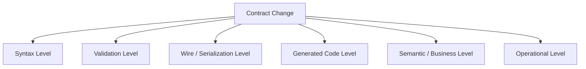
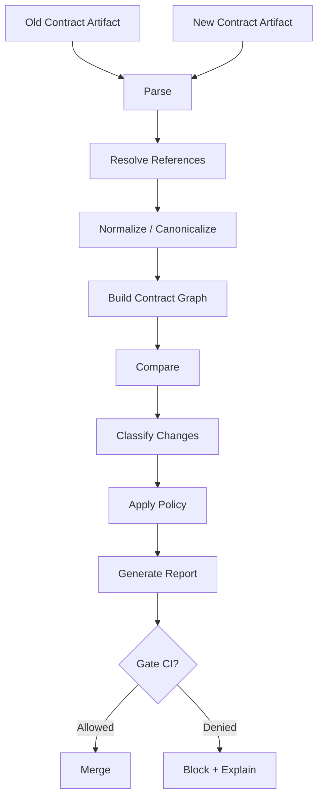
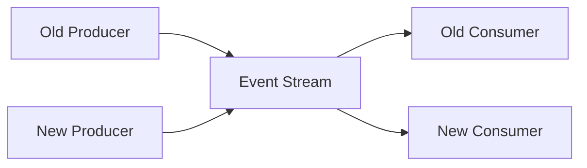
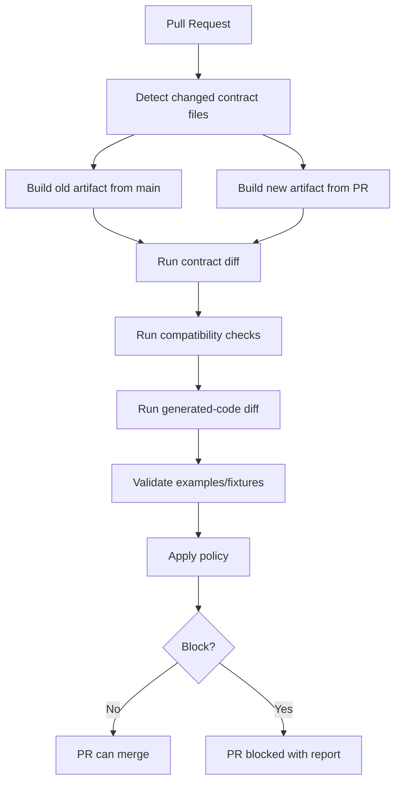
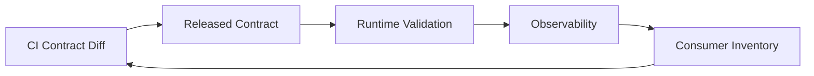
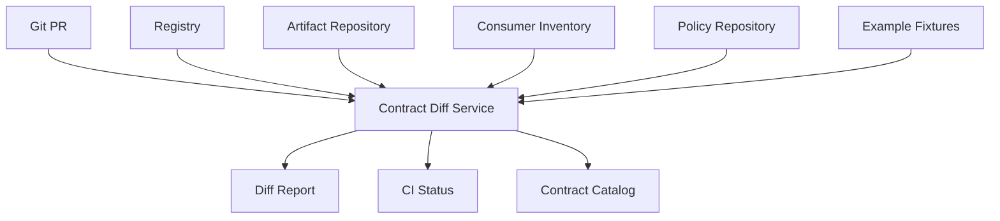

# Part 034 — Breaking Change Detection and Contract Diffing

> Goal: setelah bagian ini, kamu bisa membangun quality gate untuk mendeteksi breaking change pada OpenAPI, JSON Schema, Avro, Protobuf, XSD, generated Java artifacts, file contracts, dan semantic contract policy. Kamu juga akan memahami batasan diff tool: apa yang bisa ditangkap otomatis, apa yang harus direview manusia, dan bagaimana mengurangi false positive/false negative.

Breaking change detection adalah usaha menjawab pertanyaan ini:

> Jika contract baru dirilis, siapa yang bisa rusak, bagaimana rusaknya, dan apakah perubahan itu boleh masuk ke main branch?

Diffing bukan sekadar membandingkan dua file.

Diffing contract production-grade harus memahami:

- schema reference resolution,
- format-specific compatibility rules,
- wire/binary compatibility,
- validation compatibility,
- generated-code compatibility,
- runtime deserialization compatibility,
- semantic compatibility,
- operational compatibility,
- governance policy.

Jika kamu hanya menjalankan `git diff`, kamu akan melihat teks berubah. Tetapi kamu tidak tahu apakah consumer rusak.

---

# 1. The Five Levels of Contract Compatibility

Breaking change bisa terjadi di beberapa level.



## 1.1 Syntax-level compatibility

Apakah contract file masih valid?

Examples:

- OpenAPI YAML parseable.
- JSON Schema valid against metaschema.
- Avro schema JSON valid.
- `.proto` compiles.
- XSD validates as schema.

Syntax valid does not mean safe.

## 1.2 Validation-level compatibility

Apakah payload yang dulu valid masih valid?

Example:

```json
// old valid payload
{
  "caseId": "CASE-1"
}
```

New schema adds required field:

```json
{
  "required": ["caseId", "riskLevel"]
}
```

Old payload now invalid. That is breaking for old data and old producers.

## 1.3 Wire-level compatibility

Apakah serialized bytes/messages masih bisa dibaca?

Relevant for:

- Avro binary with writer/reader schema,
- Protobuf wire format,
- XML namespace/schema validation,
- Kafka payload with registry schema ID,
- file encoding and column order.

## 1.4 Generated-code compatibility

Apakah generated Java/Kotlin/TypeScript client/server code masih compile and behave?

Example:

```java
caseDto.getPriority()
```

If OpenAPI field `priority` is renamed to `riskLevel`, generated getter changes. Even if JSON runtime accepts both fields, generated client code may break.

## 1.5 Semantic compatibility

Apakah meaning berubah?

Example:

```text
status = CLOSED
```

Old meaning: case is administratively closed.

New meaning: case is legally final and cannot be appealed.

Schema diff may show no change. Business compatibility is broken.

## 1.6 Operational compatibility

Apakah change aman saat rollout parsial?

Example:

- old consumer strict rejects unknown field,
- old gateway blocks new header,
- data warehouse column missing,
- dashboard assumes enum set fixed,
- replay job cannot parse new schema,
- old file parser uses column index.

---

# 2. Why Simple Text Diff Fails

Consider two OpenAPI snippets.

Old:

```yaml
CaseResponse:
  type: object
  required:
    - caseId
  properties:
    caseId:
      type: string
    priority:
      type: string
```

New:

```yaml
CaseResponse:
  type: object
  required:
    - caseId
    - riskLevel
  properties:
    caseId:
      type: string
    riskLevel:
      type: string
```

A text diff says:

```diff
- priority
+ riskLevel
+ required riskLevel
```

A contract diff should say:

```text
BREAKING:
- Removed response property: priority
- Added required response property: riskLevel
- Possible rename detected: priority -> riskLevel, but no compatibility bridge declared
- Generated Java getter getPriority() removed
- Old response fixtures missing riskLevel now invalid
```

Contract diff is semantic interpretation of structural change.

---

# 3. The Diffing Pipeline

Production diffing should use a pipeline.



## 3.1 Parse

Parse format-specific syntax:

| Format | Parser concern |
|---|---|
| OpenAPI | YAML/JSON, references, components, operation IDs. |
| JSON Schema | dialect, `$id`, `$ref`, anchors, vocabularies. |
| Avro | schema JSON, names, namespaces, aliases, logical types. |
| Protobuf | `.proto` compiler, imports, package/options, descriptors. |
| XSD | namespaces, imports/includes, type definitions, element declarations. |
| CSV/file | manifest, column order, type declarations. |

## 3.2 Resolve references

Diffing unresolved `$ref` often creates false results.

Example:

```yaml
schema:
  $ref: ./common.yaml#/components/schemas/CaseId
```

If `CaseId` changed, the endpoint changed even when endpoint file did not.

## 3.3 Normalize

Normalize equivalent representations.

Examples:

```yaml
nullable: true      # OpenAPI 3.0 style
```

versus:

```yaml
type:
  - string
  - "null"        # JSON Schema style
```

In OpenAPI 3.1/3.2 context, diff tool must understand the target version and schema semantics.

## 3.4 Build graph

Contract is a graph, not flat text.

```mermaid
flowchart LR
    API[GET /cases/{id}] --> RES[200 Response]
    RES --> CASE[CaseResponse]
    CASE --> ID[CaseId]
    CASE --> RISK[RiskAssessment]
    RISK --> CODE[RiskLevelCode]
```

If `RiskLevelCode` changes, every operation that references it is affected.

## 3.5 Classify

Classify change:

- safe,
- potentially breaking,
- breaking,
- semantically suspicious,
- requires manual approval,
- requires migration playbook,
- requires major version.

## 3.6 Apply policy

Not all breaking changes are forbidden. Some are allowed with explicit version bump, migration ticket, or exception approval.

---

# 4. Change Classification Model

Use a structured change model.

```json
{
  "changeId": "OAS-RESP-REQ-001",
  "contract": "case-api",
  "location": "GET /cases/{caseId} 200 application/json CaseResponse.riskLevel",
  "changeType": "response.required_property_added",
  "severity": "breaking",
  "direction": "consumer-breaking",
  "evidence": {
    "oldRequired": ["caseId"],
    "newRequired": ["caseId", "riskLevel"]
  },
  "recommendation": "Add riskLevel as optional first; migrate consumers; require only in next major version or command boundary."
}
```

This is better than printing raw diff because CI, dashboards, and reviewers can reason about it.

---

# 5. Direction Matters: Producer vs Consumer Breaking

A change can break producers, consumers, or both.

## 5.1 Request schema

For API request:

- adding required request field breaks clients/producers,
- removing required request field is usually not producer-breaking,
- narrowing allowed enum breaks clients sending old values,
- widening allowed enum may break server logic if not ready.

## 5.2 Response schema

For API response:

- removing response field breaks clients/consumers,
- adding response field should be safe only if clients tolerate unknown fields,
- adding required response field is not necessarily consumer-breaking by validation, but may break generated expectations depending on usage,
- changing type breaks consumers.

## 5.3 Event schema

For event:

- producer writes with writer schema,
- consumer reads with reader schema,
- compatibility direction depends on deployment order and registry mode.



A safe event change must consider all four combinations.

---

# 6. OpenAPI Diffing

OpenAPI diffing must evaluate operations, parameters, request bodies, responses, media types, schemas, security, headers, and examples.

## 6.1 Operation-level changes

| Change | Classification | Why |
|---|---|---|
| Remove path | Breaking | Clients calling it fail. |
| Remove method | Breaking | Clients calling it fail. |
| Add path | Safe | Unless it conflicts with routing. |
| Change operationId | Potentially breaking | Generated clients may rename method. |
| Change server URL | Potentially breaking | Deployment/client config impact. |
| Add required security | Breaking | Existing clients may be unauthorized. |
| Remove security | Potentially risky | Security regression. |

## 6.2 Parameter changes

| Change | Request impact |
|---|---|
| Add optional query parameter | Usually safe. |
| Add required query parameter | Breaking. |
| Remove optional query parameter | Potentially breaking for clients using it. |
| Change path parameter name | Breaking for generated clients and docs. |
| Narrow schema pattern/min/max | Breaking for clients sending values previously valid. |
| Widen allowed values | Usually producer-safe, may be server/business risky. |

Example breaking diff:

```yaml
parameters:
  - name: jurisdictionCode
    in: query
    required: true
    schema:
      type: string
```

If this parameter did not exist before, clients break.

## 6.3 Request body changes

| Change | Classification |
|---|---|
| Add required request property | Breaking |
| Remove required request property | Usually safe for clients, but may break server assumptions |
| Remove accepted media type | Breaking |
| Add new accepted media type | Safe |
| Tighten string pattern | Breaking |
| Reduce max length | Breaking |
| Increase max length | Usually safe for clients, risky for storage |

## 6.4 Response changes

| Change | Classification |
|---|---|
| Remove response property | Breaking |
| Change property type | Breaking |
| Add response property | Usually safe only if unknown properties tolerated |
| Remove response status code | Breaking if clients handle it |
| Add error status code | Potentially breaking semantically |
| Change error payload model | Breaking for error handlers |
| Remove response header | Breaking if clients depend on it |

## 6.5 Security changes

Security changes are contract changes.

| Change | Classification |
|---|---|
| Add OAuth scope | Breaking |
| Remove OAuth scope requirement | Security review required |
| Change auth scheme | Breaking |
| Add object-level authorization requirement | Breaking/semantic |
| Change rate limit headers | Potentially breaking |

## 6.6 OpenAPI diff report example

```text
[BREAKING] GET /cases/{caseId} removed response property CaseResponse.priority
[BREAKING] POST /cases request body added required property jurisdictionCode
[POTENTIALLY_BREAKING] GET /cases added enum value status=REOPENED
[SECURITY_REVIEW] GET /cases/{caseId} removed oauth scope case:read:sensitive
[GENERATED_CODE] operationId changed from getCase to retrieveCase
```

---

# 7. JSON Schema Diffing

JSON Schema diffing is harder than it looks because schemas are not just object definitions. They are validation programs.

## 7.1 Important concepts

A diff must consider:

- `$id`, `$ref`, `$defs`, `$anchor`, dynamic refs,
- dialect and vocabulary,
- `type`, `required`, `properties`, `additionalProperties`,
- `unevaluatedProperties`,
- `oneOf`, `anyOf`, `allOf`, `not`,
- conditional schemas `if`/`then`/`else`,
- dependent schemas,
- annotations vs assertions,
- format assertion policy.

## 7.2 Common breaking changes

| Change | Why breaking |
|---|---|
| Add required property | Old payload invalid. |
| Remove allowed type | Old payload invalid. |
| Narrow enum | Old payload invalid. |
| Add `additionalProperties: false` | Unknown extension fields invalid. |
| Tighten pattern | Old strings may fail. |
| Reduce maxLength | Old values may fail. |
| Increase minLength | Old values may fail. |
| Change `oneOf` branches | Old variants may fail or become ambiguous. |
| Change `$ref` target | Affects all referencing schemas. |

## 7.3 Open vs closed object diff

Old:

```json
{
  "type": "object",
  "properties": {
    "caseId": { "type": "string" }
  }
}
```

New:

```json
{
  "type": "object",
  "properties": {
    "caseId": { "type": "string" }
  },
  "additionalProperties": false
}
```

This is breaking because old payloads with extension fields are now invalid.

## 7.4 Composition diff

Old:

```json
{
  "oneOf": [
    { "$ref": "#/$defs/ManualCase" },
    { "$ref": "#/$defs/AutomatedCase" }
  ]
}
```

New:

```json
{
  "oneOf": [
    { "$ref": "#/$defs/ManualCase" }
  ]
}
```

Removed variant: breaking.

But adding a variant can also break naive codegen if generated sealed type or enum does not tolerate unknown variants.

## 7.5 Format caveat

`format` may be annotation or assertion depending on validator configuration and vocabulary. Diff policy must explicitly say whether format changes block CI.

Example:

```json
{ "type": "string", "format": "email" }
```

If format assertion is enabled, this is stricter than plain string.

---

# 8. Avro Diffing

Avro compatibility is based on reader/writer schema resolution.

## 8.1 Diff is not enough

For Avro, asking “what changed?” is weaker than asking:

> Can reader schema R read data written with writer schema W?

## 8.2 Common changes

| Change | Compatibility note |
|---|---|
| Add field with default | Usually backward-compatible. |
| Add field without default | Often breaking for old data/new reader. |
| Remove field | Direction-dependent. |
| Rename field with alias | Can be compatible in reader/writer resolution, but generated code and business logic still need review. |
| Change type int → long | Type promotion may allow it. |
| Change string → int | Breaking. |
| Add enum symbol | Direction-dependent; old readers may fail on new symbol. |
| Remove enum symbol | Breaking for data containing old symbol. |
| Change namespace/name | Breaking unless aliases are managed. |
| Change logical type | Potentially breaking semantically and in Java conversion. |

## 8.3 Compatibility modes

Schema registry usually evaluates compatibility modes such as:

- backward,
- backward transitive,
- forward,
- forward transitive,
- full,
- full transitive,
- none.

The gate must match deployment reality.

If consumers upgrade first, backward compatibility is usually relevant.

If producers upgrade first, forward compatibility matters.

If deployment order is not controlled, full/transitive is safer.

## 8.4 Avro report example

```text
[BREAKING] Field jurisdictionCode added without default in record CaseCreated
[WARNING] Field priority renamed to riskLevel with alias; verify generated Java usage
[BREAKING] Enum symbol REOPENED added; old readers may fail under forward compatibility
[SEMANTIC_REVIEW] logicalType changed from timestamp-millis to timestamp-micros
```

## 8.5 Java-specific checks

Avro diff should also inspect generated Java impact:

- generated getter/setter removal,
- enum symbol removal,
- logical type conversion change,
- `Utf8` vs `String` setting,
- nullable union builder API,
- package/class rename,
- default value materialization.

---

# 9. Protobuf Diffing

Protobuf diffing must be field-number aware.

## 9.1 The field number is the contract

This is safe:

```proto
string risk_level = 5;
```

Renaming the source field name while keeping number may preserve wire compatibility but break JSON mapping and generated code.

This is dangerous:

```proto
// old
string priority = 5;

// new
string risk_level = 6;
```

Field number changed. Old data at field 5 is no longer read as risk level.

## 9.2 Common Protobuf changes

| Change | Classification |
|---|---|
| Add new field number | Usually wire-safe. |
| Reuse old field number | Breaking/dangerous. |
| Change field number | Breaking. |
| Remove field without reserving number/name | Dangerous. |
| Change scalar type | Often breaking or lossy. |
| Change singular to repeated | Breaking/unsafe. |
| Move field into `oneof` | Often breaking semantically. |
| Add enum value | Wire-safe but application may not handle it. |
| Remove enum value | Breaking for code/business. |
| Rename field | Wire-safe, JSON/generated-code breaking. |
| Rename package/message | Generated-code/API breaking. |

## 9.3 Reserved check

When a field is removed:

```proto
message CaseEvent {
  reserved 7;
  reserved "old_status";
}
```

Diff gate should block removal unless field number/name is reserved or exception approved.

## 9.4 Enum check

Old:

```proto
enum CaseStatus {
  CASE_STATUS_UNSPECIFIED = 0;
  CASE_STATUS_RECEIVED = 1;
  CASE_STATUS_CLOSED = 2;
}
```

New:

```proto
enum CaseStatus {
  CASE_STATUS_UNSPECIFIED = 0;
  CASE_STATUS_RECEIVED = 1;
  reserved 2;
  reserved "CASE_STATUS_CLOSED";
}
```

Good: removed value is reserved.

But business compatibility still needs migration if old data contains value `2`.

## 9.5 ProtoJSON caveat

Changing field names can break JSON clients even when binary compatibility survives.

Example:

```proto
string risk_level = 5 [json_name = "riskLevel"];
```

If JSON field name changes, REST gateway clients may break.

## 9.6 Protobuf report example

```text
[BREAKING] Field number changed: priority 5 -> risk_level 6
[BLOCKED] Removed field old_status=7 without reserved number
[WARNING] Field name changed for field 5; binary wire-compatible but JSON/generated-code breaking
[WARNING] Enum value CASE_STATUS_REOPENED added; ensure unknown enum handling
[SEMANTIC_REVIEW] Field moved into oneof: appealDetails
```

---

# 10. XSD Diffing

XSD diffing must understand XML namespaces, elements, attributes, types, occurrence constraints, substitution groups, and identity constraints.

## 10.1 Common XSD changes

| Change | Classification |
|---|---|
| Remove global element | Breaking. |
| Rename element | Breaking. |
| Change namespace | Major breaking unless multi-namespace support exists. |
| Add optional element at safe extension point | Usually safe. |
| Add required element | Breaking. |
| Change `minOccurs` 0 → 1 | Breaking. |
| Change `maxOccurs` unbounded → 1 | Breaking. |
| Restrict simple type enumeration | Breaking. |
| Add enumeration | Potentially breaking for codegen/business. |
| Change type base | Potentially breaking. |
| Remove attribute | Breaking if consumers expect it. |
| Add required attribute | Breaking. |
| Change sequence order | Breaking for XML instance validation. |

## 10.2 Sequence ordering trap

Old:

```xml
<xs:sequence>
  <xs:element name="caseId" type="xs:string"/>
  <xs:element name="status" type="xs:string"/>
</xs:sequence>
```

New:

```xml
<xs:sequence>
  <xs:element name="caseId" type="xs:string"/>
  <xs:element name="priority" type="xs:string" minOccurs="0"/>
  <xs:element name="status" type="xs:string"/>
</xs:sequence>
```

Even optional insertion can affect generated code and strict instance ordering expectations.

## 10.3 Namespace diff

If namespace changes from:

```text
https://example.gov/case/v1
```

To:

```text
https://example.gov/case/v2
```

Treat as major contract version. Validator must explicitly support both if old documents remain valid.

## 10.4 Identity constraints

Adding `xs:key`, `xs:unique`, or `xs:keyref` can break old documents that used to validate.

Diff tool must classify identity-constraint tightening as breaking.

---

# 11. File and Batch Contract Diffing

File contracts often fail because teams diff only filenames, not layout.

## 11.1 CSV diff rules

| Change | Classification |
|---|---|
| Add column at end | Usually safe if parser uses header. Breaking if index-based. |
| Add column in middle | Breaking for index-based parser. |
| Remove column | Breaking. |
| Rename column | Breaking. |
| Change delimiter | Breaking. |
| Change encoding | Breaking. |
| Change date format | Breaking. |
| Change decimal separator | Breaking. |
| Change null marker | Breaking. |
| Change sort/order guarantee | Semantic/operational breaking. |

## 11.2 Manifest-based diff

Use manifest:

```json
{
  "fileType": "case-export",
  "contractVersion": "2.0.0",
  "encoding": "UTF-8",
  "delimiter": ",",
  "columns": [
    { "name": "case_id", "type": "string", "required": true },
    { "name": "status", "type": "string", "required": true },
    { "name": "risk_level", "type": "string", "required": false }
  ]
}
```

Diff manifest, not sample file only.

## 11.3 Batch semantic checks

Also diff:

- delivery schedule,
- partitioning scheme,
- deduplication key,
- sort order,
- header/trailer records,
- checksum algorithm,
- compression format,
- retention period,
- replay convention.

---

# 12. Generated Java Compatibility Diff

Contract diff should include generated-code impact.

## 12.1 What to compare

Generate old and new Java artifacts, then inspect public API:

- class names,
- package names,
- method names,
- constructor signatures,
- builder methods,
- enum constants,
- annotations,
- nullability annotations,
- validation annotations,
- serialization annotations.

## 12.2 Example

Old generated API:

```java
public class CaseResponse {
    public String getPriority();
}
```

New:

```java
public class CaseResponse {
    public String getRiskLevel();
}
```

Report:

```text
[GENERATED_CODE_BREAKING] Method removed: CaseResponse.getPriority()
[GENERATED_CODE_ADDED] Method added: CaseResponse.getRiskLevel()
[RECOMMENDATION] Use expand-migrate-contract. Keep priority during transition.
```

## 12.3 Why this matters

Schema compatibility can pass while generated code breaks.

Example:

- Protobuf field rename keeps wire number but changes Java getter.
- OpenAPI operationId rename changes client method name.
- Avro namespace/name change changes generated class package.
- XSD type rename changes JAXB/Jakarta binding class.

---

# 13. Semantic Diffing

Some changes cannot be proven automatically.

## 13.1 Semantic risk signals

Flag manual review when:

- description changes contain words like “now means”, “must”, “shall”, “deprecated”, “legal”, “final”, “effective”, “jurisdiction”, “authorization”,
- enum descriptions change,
- examples change but schema does not,
- status lifecycle changes,
- monetary rounding changes,
- timezone meaning changes,
- ID semantics change,
- default value changes,
- validation moved from soft to hard,
- authorization scope changes.

## 13.2 Example

Old description:

```yaml
status:
  description: Current operational status of the case.
```

New:

```yaml
status:
  description: Legally binding final status of the case.
```

Schema unchanged. Semantics changed.

Report:

```text
[SEMANTIC_REVIEW] Field Case.status description changed from operational status to legally binding final status.
```

## 13.3 Semantic examples as tests

Use examples to encode meaning.

```json
{
  "caseId": "CASE-1001",
  "status": "CLOSED",
  "appealAllowed": true
}
```

If new rules say closed cases cannot be appealed, example tests catch mismatch.

---

# 14. Policy-as-Code

Compatibility rules should live as code.

## 14.1 Policy document

```yaml
contractPolicy:
  openapi:
    removedResponseProperty: block
    addedRequiredRequestProperty: block
    operationIdChanged: warn
    oauthScopeAdded: block
    enumValueAdded: review
  protobuf:
    fieldNumberChanged: block
    removedFieldWithoutReserved: block
    fieldNameChanged: warn
    enumValueAdded: review
  avro:
    compatibilityMode: BACKWARD_TRANSITIVE
    fieldAddedWithoutDefault: block
    enumSymbolAdded: review
  jsonSchema:
    addRequired: block
    closeOpenObject: block
    tightenPattern: block
    formatChanged: review
  xsd:
    namespaceChanged: block
    minOccursIncreased: block
    sequenceOrderChanged: review
```

## 14.2 Exception policy

Exceptions should require:

- owner,
- reason,
- affected consumers,
- migration plan,
- rollback plan,
- expiration date,
- approval evidence.

```yaml
exceptions:
  - changeId: OAS-RESP-REMOVE-001
    contract: case-api
    location: CaseResponse.legacyOfficerCode
    approvedBy: platform-architecture-board
    reason: removed after 180-day deprecation window
    expiresAt: 2026-12-31
```

---

# 15. CI/CD Integration

## 15.1 Pull request gate



## 15.2 Maven lifecycle idea

```xml
<profile>
  <id>contract-check</id>
  <build>
    <plugins>
      <plugin>
        <groupId>com.example.contract</groupId>
        <artifactId>contract-diff-maven-plugin</artifactId>
        <version>${contract.platform.version}</version>
        <executions>
          <execution>
            <goals>
              <goal>diff</goal>
              <goal>compatibility-check</goal>
              <goal>validate-examples</goal>
            </goals>
          </execution>
        </executions>
      </plugin>
    </plugins>
  </build>
</profile>
```

## 15.3 Report in PR comment

```markdown
## Contract Compatibility Report

Contract: `case-api`
Old version: `1.17.0`
New version: `1.18.0-SNAPSHOT`

### Blocking changes

- `POST /cases` added required request property `jurisdictionCode`.
- `CaseResponse.priority` removed from 200 response.

### Warnings

- `CaseStatus` added enum value `REOPENED`.
- `operationId` changed from `getCase` to `retrieveCase`.

### Required action

Use Expand-Migrate-Contract or bump major version with approved migration plan.
```

---

# 16. False Positives and False Negatives

## 16.1 False positive

Tool says breaking, but actual consumers are unaffected.

Example:

- removed response field that no client uses.
- endpoint internal only.
- enum value added but all consumers tolerate unknown.

Response:

- allow exception with evidence,
- do not disable rule globally.

## 16.2 False negative

Tool says safe, but production breaks.

Example:

- semantic meaning changed,
- default value changed,
- generated code changed,
- old clients are strict unknown-field rejectors,
- file parser uses column index,
- authorization behavior changed.

Response:

- add semantic review heuristics,
- validate examples,
- include generated-code diff,
- maintain consumer inventory,
- add runtime observability.

## 16.3 Principle

> Diff tools are decision-support systems, not architecture substitutes.

---

# 17. Consumer Inventory

Breaking-change detection is stronger when it knows consumers.

## 17.1 Consumer registry

```yaml
consumers:
  - name: escalation-service
    contract: case-events
    versions:
      - schema: CaseStatusChanged v3
    tolerance:
      unknownFields: true
      unknownEnumValues: false
    owner: enforcement-platform

  - name: external-regulator-client
    contract: case-api
    versions:
      - openapi: 1.12.0
    tolerance:
      unknownFields: false
    owner: external-integration
```

## 17.2 Impact report

```text
Removing field CaseResponse.priority affects:
- escalation-service: reads field in version 2.4.1
- dashboard-service: no usage detected in 30 days
- external-regulator-client: unknown usage; manual approval required
```

Without consumer inventory, all impact analysis is guesswork.

---

# 18. Runtime Drift Detection

CI diff protects source code. Runtime drift detection protects actual traffic.

## 18.1 Drift examples

- producer emits payload not matching registered schema,
- API response differs from OpenAPI,
- consumer receives unknown enum value,
- file column appears before manifest update,
- external client sends old field after deprecation,
- generated client manually patched.

## 18.2 Runtime metrics

```text
contract_runtime_violation_total{contract="case-api", direction="response"}
contract_unknown_field_total{field="priority"}
contract_unknown_enum_total{field="status", value="REOPENED"}
contract_schema_id_seen_total{topic="case-events", schemaId="42"}
contract_deprecated_usage_total{field="legacyOfficerCode"}
```

## 18.3 Feedback loop



---

# 19. Contract Diff Severity Scale

A practical severity scale:

| Severity | Meaning | CI action |
|---|---|---|
| Info | Additive or documentation-only | Allow |
| Warning | Possibly generated-code or semantic concern | Allow with review |
| Review Required | Human decision needed | Block until approved |
| Breaking | Known compatibility violation | Block |
| Critical | Data corruption/security/legal risk | Block + architecture review |

Examples:

| Change | Severity |
|---|---|
| Add optional response field | Info/Warning |
| Add required request field | Breaking |
| Remove OAuth scope | Critical/security review |
| Protobuf field number reused | Critical |
| Avro field added without default | Breaking |
| XSD namespace changed | Breaking |
| Status description changed legally | Review/Critical |
| Money decimal precision reduced | Critical |

---

# 20. Building a Contract Diff Service

For platform teams, diffing becomes a service.

## 20.1 Architecture



## 20.2 Components

| Component | Responsibility |
|---|---|
| Parser adapters | OpenAPI, JSON Schema, Avro, Protobuf, XSD, file manifests. |
| Reference resolver | Resolve `$ref`, imports, includes, proto imports. |
| Canonical model | Normalize contract into internal graph. |
| Format-specific rules | Detect known compatibility rules. |
| Policy engine | Apply organization-specific gate. |
| Consumer inventory | Attach impact analysis. |
| Fixture validator | Validate old/new examples. |
| Report generator | PR comments, HTML, JSON, SARIF. |
| Audit log | Store evidence for governance. |

## 20.3 Internal canonical model

```java
public sealed interface ContractNode permits ApiOperationNode, SchemaNode, FieldNode, EnumNode {
    ContractPath path();
    Map<String, String> annotations();
}

public record FieldNode(
    ContractPath path,
    String name,
    String type,
    boolean required,
    boolean nullable,
    boolean deprecated,
    Map<String, String> annotations
) implements ContractNode {}
```

## 20.4 Change model

```java
public record ContractChange(
    String id,
    ContractPath path,
    ChangeType type,
    Severity severity,
    Direction direction,
    String explanation,
    String recommendation
) {}
```

## 20.5 Rule example

```java
public final class RequiredPropertyAddedRule implements CompatibilityRule {
    @Override
    public Optional<ContractChange> evaluate(FieldNode oldField, FieldNode newField) {
        if (!oldField.required() && newField.required()) {
            return Optional.of(new ContractChange(
                "SCHEMA-REQ-ADDED",
                newField.path(),
                ChangeType.REQUIRED_ADDED,
                Severity.BREAKING,
                Direction.PRODUCER_BREAKING,
                "A previously optional field is now required.",
                "Use expand-migrate-contract before making the field required."
            ));
        }
        return Optional.empty();
    }
}
```

---

# 21. Approval Workflow

Not every blocked diff means “never”. It means “not without governance”.

## 21.1 Approval record

```json
{
  "changeId": "SCHEMA-REQ-ADDED",
  "contract": "case-intake-api",
  "location": "CreateCaseRequest.jurisdictionCode",
  "severity": "breaking",
  "approved": true,
  "approvedBy": "architecture-board",
  "approvalDate": "2026-07-03",
  "migrationPlan": "MIG-2026-0712",
  "sunsetDate": "2026-12-31",
  "rollbackPlan": "Restore optional validation and reject at business rule layer only."
}
```

## 21.2 Review checklist

```text
[ ] Is the change structurally breaking?
[ ] Is the change semantically breaking?
[ ] Does it affect generated clients?
[ ] Does it affect old data replay?
[ ] Does it affect external clients?
[ ] Does it affect authorization/privacy?
[ ] Does a migration playbook exist?
[ ] Is rollback possible?
[ ] Is observability in place?
[ ] Is deprecation/sunset communicated?
```

---

# 22. Anti-Patterns

## 22.1 Diff only latest version

Checking only old latest vs new latest misses transitive breaks.

If consumers may be on older versions, use transitive checks.

## 22.2 Ignore generated code

Schema looks compatible but generated client breaks.

## 22.3 Treat all additions as safe

Adding enum value, response property, XML element, or Protobuf field can break strict consumers.

## 22.4 Trust examples without schema

Examples catch meaning, schema catches structure. You need both.

## 22.5 Allow manual override without expiry

Permanent exceptions become hidden policy corruption.

## 22.6 No consumer inventory

Without consumer inventory, severity is theoretical.

## 22.7 No runtime validation

CI passes but deployed service emits drifted payload.

---

# 23. Production Checklist

```text
Diff Engine
[ ] Parses all supported formats
[ ] Resolves references/imports/includes
[ ] Normalizes equivalent schema forms
[ ] Builds contract dependency graph
[ ] Classifies format-specific changes
[ ] Supports direction: producer/consumer/both
[ ] Supports transitive compatibility
[ ] Diffs generated Java artifacts
[ ] Validates examples and fixtures
[ ] Emits structured machine-readable report

Policy
[ ] Rules defined per format
[ ] Severity model agreed
[ ] Exceptions require expiry
[ ] Major-version rules defined
[ ] Security/privacy changes flagged
[ ] Semantic review triggers defined

CI/CD
[ ] PR gate compares main vs branch
[ ] Release gate compares previous release vs new release
[ ] Registry compatibility checked
[ ] Contract catalog updated
[ ] PR comment generated
[ ] Audit evidence stored

Runtime
[ ] Validation metrics emitted
[ ] Unknown fields/enums tracked
[ ] Deprecated usage tracked
[ ] Schema IDs observed
[ ] Drift alerts configured
[ ] Consumer inventory updated
```

---

# 24. Exercises

## Exercise 1 — OpenAPI diff classification

Old request schema:

```yaml
required:
  - caseType
properties:
  caseType:
    type: string
  description:
    type: string
```

New request schema:

```yaml
required:
  - caseType
  - jurisdictionCode
properties:
  caseType:
    type: string
  description:
    type: string
  jurisdictionCode:
    type: string
```

Classify the change and write the recommended migration.

## Exercise 2 — Avro compatibility

Old field:

```json
{ "name": "riskScore", "type": "int" }
```

New field:

```json
{ "name": "riskScore", "type": "long" }
```

Analyze:

- schema resolution,
- Java generated impact,
- semantic risk,
- test fixtures.

## Exercise 3 — Protobuf reserved rule

Old:

```proto
string officer_code = 7;
```

New removes it.

Write the diff rule that blocks removal unless `reserved 7;` and `reserved "officer_code";` exist.

## Exercise 4 — Semantic diff

A field description changes from:

```text
Status used for operational workflow routing.
```

To:

```text
Status used as legally final enforcement decision state.
```

Design a semantic review rule and required approval workflow.

---

# 25. Summary

Breaking-change detection is not simple file comparison.

A mature contract diff system must combine:

1. syntax validation,
2. reference resolution,
3. format-specific compatibility,
4. generated-code impact,
5. fixture validation,
6. policy-as-code,
7. consumer inventory,
8. semantic review,
9. runtime drift detection.

The key mental model:

> A breaking change is not defined only by what changed. It is defined by who depends on the old behavior and whether the migration protocol protects them.

Diff tools help enforce engineering discipline. But the discipline itself is architectural: clear ownership, compatibility rules, observability, migration playbooks, and evidence-based release decisions.

---

# References

- Apache Avro 1.12.0 Specification — schema resolution and compatibility-relevant schema rules.
- Confluent Schema Registry documentation — compatibility modes and schema evolution behavior.
- OpenAPI Specification 3.2.0 — OpenAPI document model and Schema Object semantics.
- Protocol Buffers documentation — field numbers, wire format, reserved fields, JSON mapping, and evolution best practices.
- JSON Schema Draft 2020-12 — dialects, vocabularies, references, validation, and applicator semantics.
- W3C XML Schema 1.1 — XML schema structures, datatypes, namespaces, and validation semantics.
