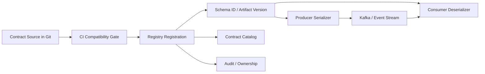
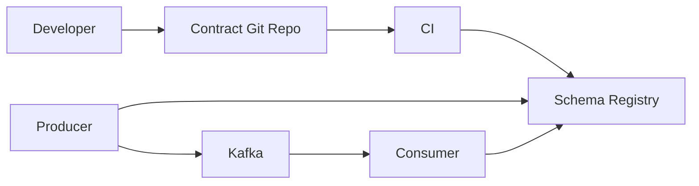
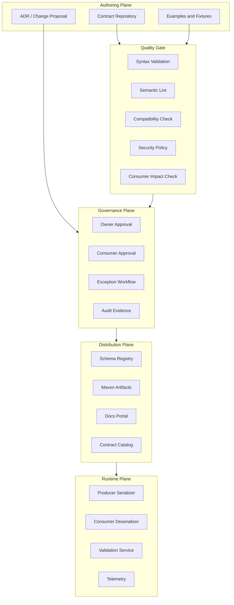
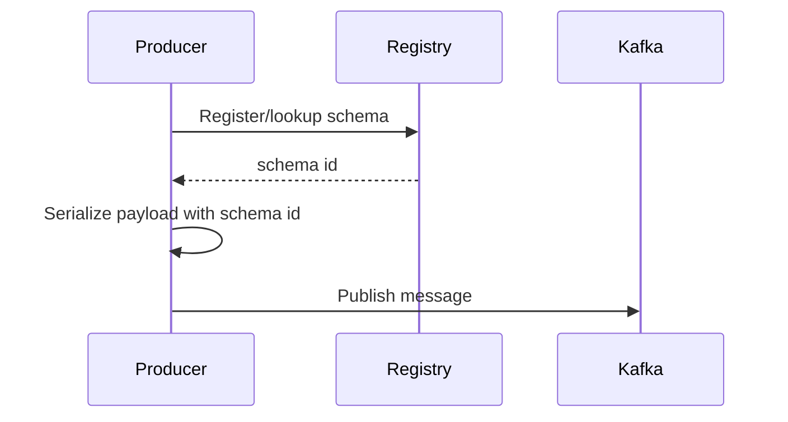
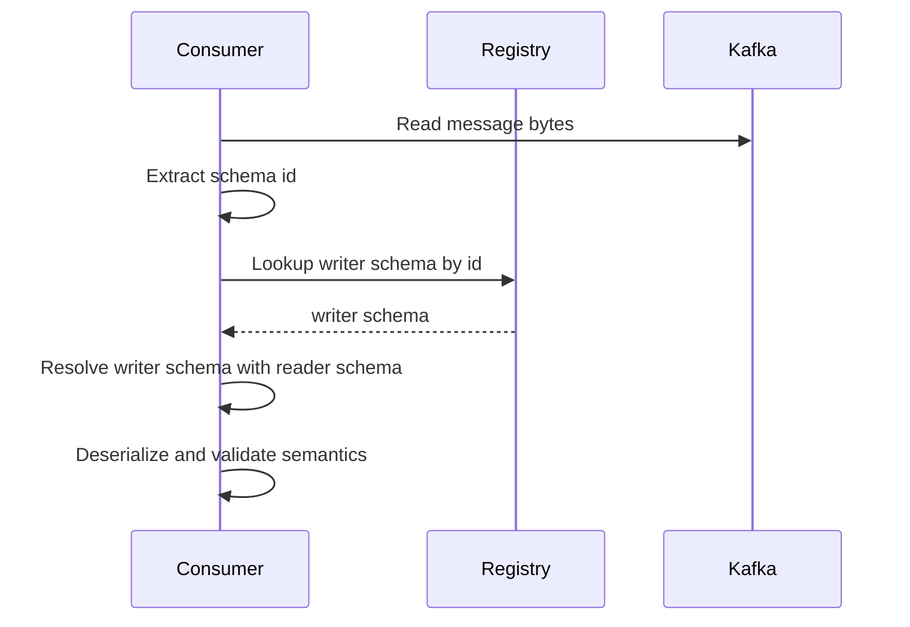
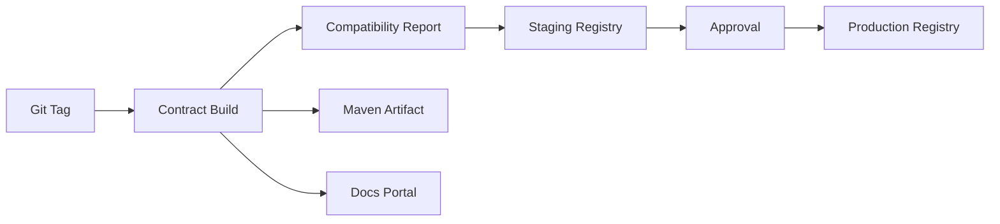
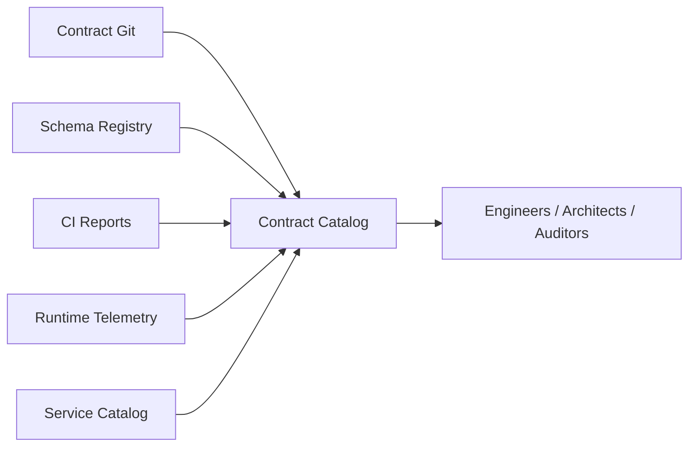
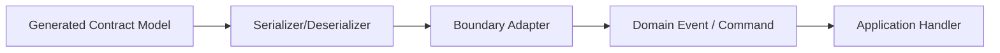
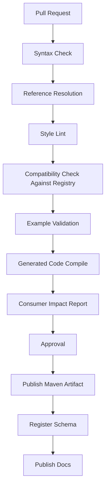

# Part 035 — Schema Registry Architecture and Subject Governance

> Goal: setelah bagian ini, kamu bisa mendesain schema registry sebagai control plane kontrak data, bukan sekadar tempat menyimpan schema. Kamu akan memahami registry identity, subject naming, compatibility mode, ownership, approval, environment promotion, client-runtime behavior, security, audit, dan failure model untuk platform kontrak enterprise.

Schema registry sering disalahpahami sebagai “database untuk schema”. Itu terlalu sempit.

Dalam sistem produksi, schema registry adalah **control plane untuk kontrak data runtime**.

Ia menjawab pertanyaan seperti:

- schema apa yang valid untuk topic/event/API/file tertentu,
- versi mana yang boleh diproduksi,
- versi mana yang masih boleh dikonsumsi,
- apakah perubahan schema aman,
- siapa owner schema,
- service mana saja yang terdampak,
- aturan compatibility apa yang berlaku,
- bagaimana schema dipromosikan dari dev ke staging ke production,
- bagaimana runtime serializer/deserializer menemukan schema yang benar,
- bagaimana audit trail perubahan kontrak dipertahankan.

Di sistem kecil, contract bisa berupa file di repo.

Di sistem enterprise, contract perlu tiga lapisan:

1. **Source of truth** — biasanya Git repository.
2. **Distribution plane** — artifact repository, Maven package, generated client, documentation portal.
3. **Runtime control plane** — schema registry, compatibility gate, schema ID resolution, producer/consumer enforcement.

Registry berada terutama di lapisan ketiga.

Ia bukan pengganti Git. Registry adalah mekanisme runtime dan governance.

---

## 1. Mental Model: Registry sebagai Control Plane

Bayangkan event stream tanpa registry.

Producer mengirim payload binary Avro ke Kafka. Consumer menerima bytes. Jika consumer tidak tahu writer schema, bytes itu tidak bermakna. Jika producer mengubah schema tanpa aturan, consumer bisa gagal deserialize, salah membaca default, atau lebih buruk: berhasil membaca tetapi salah makna.

Schema registry menyelesaikan masalah ini dengan membuat schema menjadi artifact yang bisa diidentifikasi, divalidasi, dan dikontrol.



Registry yang matang memiliki beberapa responsibility:

| Responsibility | Penjelasan |
|---|---|
| Identity | Memberi identitas stabil untuk schema/artifact. |
| Versioning | Menyimpan versi schema dalam subject/artifact. |
| Compatibility | Mencegah perubahan yang melanggar aturan evolusi. |
| Lookup | Menyediakan lookup schema oleh serializer/deserializer. |
| Governance | Menyimpan ownership, metadata, lifecycle, approval, dan policy. |
| Distribution | Menjadi endpoint untuk schema consumers dan tooling. |
| Audit | Merekam siapa mengubah apa, kapan, dan kenapa. |

Registry yang hanya menyimpan text schema tanpa aturan compatibility bukan registry governance. Itu file server.

---

## 2. Core Concepts: Schema, Subject, Artifact, Version, ID

Istilah tiap registry bisa berbeda, tetapi mental model-nya mirip.

### 2.1 Schema

Schema adalah definisi struktur data:

- Avro `.avsc`,
- Protobuf `.proto`,
- JSON Schema `.json`,
- OpenAPI `.yaml`,
- AsyncAPI `.yaml`,
- XSD `.xsd`.

Schema menjelaskan shape, type, constraint, naming, dan sebagian semantics data.

Namun schema saja tidak cukup. Kita perlu tahu schema itu berlaku untuk apa.

### 2.2 Subject atau Artifact

**Subject** adalah namespace governance tempat versi schema didaftarkan.

Dalam Confluent Schema Registry, istilah umum yang sering dipakai adalah subject. Dalam Apicurio Registry, konsep yang sering terlihat adalah artifact, group, dan version.

Jangan terlalu terikat istilah vendor. Yang penting adalah pertanyaan ini:

> Dalam registry, schema ini menjadi versi baru dari “kontrak apa”?

Contoh subject:

```text
case-events-value
case-events-key
regulatory.CaseOpened
regulatory.case-management.CaseOpened-value
public-api.case-management.v1.openapi
```

Subject yang buruk:

```text
schema1
case
payload
new-schema
service-a
```

Kenapa buruk? Karena tidak menjawab boundary.

### 2.3 Version

Version adalah urutan evolusi schema di dalam subject/artifact.

Contoh:

```text
subject: regulatory.CaseOpened
version: 1, 2, 3, 4
```

Version registry bukan selalu sama dengan semantic version Git artifact.

Registry version menjawab:

> Ini versi ke berapa dari schema yang teregistrasi dalam subject ini?

Sedangkan artifact version seperti Maven `1.4.2` menjawab:

> Ini release package ke berapa yang dikonsumsi build system?

Jangan campur keduanya tanpa aturan.

### 2.4 Schema ID

Schema ID adalah identifier yang dipakai runtime serializer/deserializer untuk menemukan schema.

Dalam event streaming, producer bisa menulis schema ID ke payload envelope/wire format. Consumer membaca ID, mengambil writer schema dari registry, lalu melakukan deserialization.

Schema ID menjawab:

> Bytes ini ditulis memakai schema mana?

Schema ID bukan business version. Jangan expose schema ID sebagai API version publik.

### 2.5 Fingerprint

Fingerprint/hash adalah identitas content-based.

Ia berguna untuk:

- deduplication,
- integrity check,
- reproducibility,
- supply-chain verification,
- detecting accidental rewrite.

Namun fingerprint tidak menggantikan subject/version. Dua subject berbeda bisa memakai schema yang identik tetapi memiliki lifecycle dan owner berbeda.

---

## 3. Registry Architecture: Minimal sampai Enterprise

### 3.1 Minimal Registry

Arsitektur paling sederhana:



Ini cukup untuk tim kecil, tetapi biasanya belum cukup untuk enterprise.

Kelemahan:

- ownership tidak jelas,
- approval tidak formal,
- environment promotion rawan manual,
- tidak ada catalog consumer impact,
- tidak ada exception process,
- registry bisa menjadi bypass terhadap Git,
- metadata governance minim.

### 3.2 Enterprise Registry Control Plane

Arsitektur enterprise memisahkan authoring, validation, approval, publishing, registry, catalog, dan runtime lookup.



Kunci enterprise architecture:

- Git adalah source of truth.
- Registry adalah runtime distribution/control plane.
- CI adalah policy enforcement.
- Catalog adalah discovery dan impact analysis.
- Runtime telemetry membuktikan contract benar-benar dipakai.

---

## 4. Registry untuk Format Berbeda

Tidak semua format cocok diperlakukan sama.

| Format | Registry Use Case | Runtime Lookup | Compatibility Style |
|---|---|---|---|
| Avro | Kafka event, file, data lake | Sangat umum via schema ID | Reader/writer schema resolution. |
| Protobuf | gRPC/event binary | Umum pada event streaming; gRPC biasanya via generated code | Field number/wire compatibility. |
| JSON Schema | JSON event/API/file validation | Bisa runtime; sering untuk validation service | Validation compatibility dan semantic policy. |
| OpenAPI | HTTP API contract/catalog | Jarang per-request runtime lookup | API compatibility, docs, generated clients. |
| AsyncAPI | Event API documentation/governance | Biasanya design/catalog level | Channel/message compatibility. |
| XSD | XML message/file contract | Bisa runtime validator | Namespace/type/element compatibility. |

Kesalahan umum: memaksa semua format memakai satu lifecycle.

Avro event schema membutuhkan runtime ID lookup. OpenAPI biasanya membutuhkan generated client/server, documentation, dan gateway validation. XSD mungkin lebih dekat ke B2B/legacy integration dan batch file validation.

Governance-nya bisa sama. Runtime behavior-nya berbeda.

---

## 5. Subject Naming Strategy

Subject naming adalah keputusan arsitektur.

Ia menentukan:

- unit compatibility,
- unit ownership,
- unit lifecycle,
- unit deployment,
- consumer expectation,
- schema reuse boundary,
- blast radius perubahan.

Subject yang salah akan memaksa governance yang salah.

### 5.1 Topic-Based Subject

Contoh:

```text
case-events-value
case-events-key
```

Biasanya dipakai untuk event streaming dengan subject per Kafka topic key/value.

Kelebihan:

- sederhana,
- mudah dipahami,
- cocok jika satu topic punya satu message family,
- producer/consumer config mudah.

Kelemahan:

- jika satu topic berisi banyak event type, compatibility menjadi kacau,
- semua event dalam topic bisa terikat satu compatibility lifecycle,
- reuse schema lintas topic tidak otomatis jelas,
- perubahan satu event type bisa terikat subject topic yang terlalu besar.

Cocok untuk:

- topic homogen,
- compacted topic state entity,
- command topic per aggregate,
- CDC-like stream dengan shape stabil.

Tidak cocok untuk:

- event bus besar berisi banyak event type,
- polymorphic topic tanpa envelope yang jelas,
- domain event stream dengan puluhan message variants.

### 5.2 Record-Based Subject

Contoh:

```text
com.company.regulatory.CaseOpened
com.company.regulatory.CaseEscalated
com.company.regulatory.EnforcementActionIssued
```

Kelebihan:

- compatibility mengikuti record type,
- cocok untuk multi-topic reuse,
- event type menjadi unit governance,
- blast radius lebih kecil.

Kelemahan:

- perlu subject resolution lebih matang,
- registry lebih banyak subject,
- consumer perlu tahu type mapping,
- topic-level policy perlu dipisah dari schema-level policy.

Cocok untuk:

- domain event library,
- multi-event topic,
- canonical events,
- enterprise-wide message catalog.

### 5.3 Topic-Record-Based Subject

Contoh:

```text
case-events-com.company.regulatory.CaseOpened
case-events-com.company.regulatory.CaseEscalated
```

Kelebihan:

- mengikat event type ke topic,
- menghindari collision antar topic,
- tetap lebih spesifik dari topic-only.

Kelemahan:

- schema yang sama di topic berbeda bisa menjadi subject berbeda,
- lifecycle reuse menjadi lebih sulit,
- promotion dan consumer inventory lebih kompleks.

Cocok untuk:

- topic ownership kuat,
- organisasi yang ingin compatibility per topic+record,
- platform yang belum siap record-global lifecycle.

### 5.4 API-Based Subject

Untuk OpenAPI:

```text
api.case-management.v1.openapi
api.enforcement.v1.openapi
```

Untuk JSON Schema payload API:

```text
api.case-management.v1.CreateCaseRequest
api.case-management.v1.CaseResponse
```

Subject sebaiknya mengikuti public API boundary, bukan internal controller class.

### 5.5 File/Batch Subject

Untuk batch:

```text
file.regulatory.case-import.v1.row
file.regulatory.case-import.v1.manifest
file.regulatory.enforcement-export.v2.record
```

Batch contract sering memerlukan dua kontrak:

- manifest contract,
- row/record contract.

Jangan hanya versioning row schema. Manifest adalah bagian dari contract karena berisi delimiter, encoding, timezone, generation time, source, sequence, checksum, dan schema reference.

---

## 6. Subject Naming Decision Matrix

| Pertanyaan | Jika Ya | Strategy yang Cenderung Cocok |
|---|---|---|
| Topic hanya punya satu value shape? | Ya | Topic-based. |
| Topic berisi banyak event type? | Ya | Record-based atau topic-record-based. |
| Schema dipakai ulang lintas topic? | Ya | Record-based. |
| Topic ownership lebih penting dari type reuse? | Ya | Topic-record-based. |
| API contract punya lifecycle publik? | Ya | API-based subject. |
| File batch punya manifest dan record? | Ya | Separate manifest/record subjects. |
| Consumer perlu subscribe berdasarkan event type? | Ya | Record-based dengan event catalog. |
| Ada compliance/audit per message type? | Ya | Subject harus sejajar dengan auditable message type. |

Rule of thumb:

> Unit subject harus mengikuti unit compatibility yang ingin kamu enforce.

Jika compatibility perlu per event type, subject jangan per topic besar.

Jika compatibility perlu per API version, subject jangan per endpoint class.

Jika compatibility perlu per file type, subject jangan per job name yang berubah-ubah.

---

## 7. Compatibility Modes

Compatibility mode adalah aturan registry untuk menerima atau menolak schema baru.

Mode umum:

| Mode | Arti Umum |
|---|---|
| BACKWARD | Consumer dengan schema baru bisa membaca data lama. |
| FORWARD | Consumer lama bisa membaca data dari producer baru. |
| FULL | Backward dan forward untuk versi terakhir. |
| BACKWARD_TRANSITIVE | Schema baru backward-compatible dengan semua versi lama. |
| FORWARD_TRANSITIVE | Schema baru forward-compatible dengan semua versi lama. |
| FULL_TRANSITIVE | Backward dan forward dengan semua versi lama. |
| NONE | Tidak ada compatibility enforcement. |

Jangan memilih compatibility mode karena “default”. Pilih berdasarkan lifecycle.

### 7.1 Event Stream dengan Replay Panjang

Jika Kafka topic disimpan lama dan consumer bisa replay dari awal, gunakan transitive compatibility.

Kenapa?

Consumer baru mungkin membaca event dari versi schema sangat lama.

Jika hanya kompatibel dengan versi terakhir, replay historis bisa gagal.

### 7.2 Event Stream dengan Retention Pendek

Jika retention pendek dan deployment terkoordinasi, non-transitive bisa cukup.

Namun ini harus dibuktikan dengan:

- retention policy,
- consumer lag SLA,
- replay requirement,
- DLQ retention,
- recovery procedure.

### 7.3 Public API

Public API biasanya tidak cukup dengan compatibility check struktural. Ia butuh semantic compatibility:

- status code tidak berubah sembarang,
- error type stabil,
- pagination stable,
- required request field tidak bertambah,
- response field tidak berubah makna,
- auth scope tidak tiba-tiba lebih ketat tanpa deprecation.

Registry compatibility harus dilengkapi API diff.

### 7.4 Internal Command

Command sering boleh lebih ketat dari event.

Command menggambarkan intent saat ini. Event menggambarkan historical fact.

Command schema bisa dipensiunkan lebih cepat jika producer/consumer terkontrol.

Event schema harus mempertimbangkan replay.

---

## 8. Compatibility Policy per Contract Class

Gunakan class-based policy.

```yaml
contractClasses:
  domain-event:
    compatibility: FULL_TRANSITIVE
    requireExamples: true
    allowAdditionalFields: true
    enumPolicy: open-or-reference-data
    retentionAware: true

  command:
    compatibility: BACKWARD
    requireIdempotencyKey: true
    allowRequiredFieldAddition: false

  public-api:
    compatibility: semantic-api-diff
    requireDeprecationNotice: true
    requireProblemDetails: true
    requireExamples: true

  batch-file:
    compatibility: BACKWARD_TRANSITIVE
    requireManifestSchema: true
    requireChecksum: true

  reference-data:
    compatibility: append-only-or-effective-dated
    requireOwnerApproval: true
```

Policy seperti ini lebih baik daripada satu global mode untuk semua kontrak.

---

## 9. Registry Metadata Model

Schema tanpa metadata sulit dikelola.

Metadata minimal:

```yaml
subject: regulatory.case.CaseOpened
format: AVRO
ownerTeam: enforcement-platform
businessOwner: regulatory-operations
classification: internal-confidential
containsPii: false
lifecycle: active
compatibility: FULL_TRANSITIVE
introducedIn: 2026.07.03
producerServices:
  - case-command-service
consumerServices:
  - case-read-model-service
  - audit-ledger-service
retentionClass: long-replay
domain: regulatory-case-management
changePolicy: consumer-impact-required
links:
  adr: docs/adr/ADR-014-case-opened-event.md
  runbook: docs/runbooks/case-event-contract.md
```

Metadata tambahan untuk field-level governance:

```yaml
fields:
  caseId:
    classification: public-identifier
    required: true
    owner: case-platform
  openedByUserId:
    classification: personal-data
    piiCategory: user-identifier
    masking: hash-in-logs
  receivedAt:
    classification: operational
    timezonePolicy: instant-utc
```

Registry vendor mungkin tidak mendukung semua metadata secara native. Simpan metadata di contract catalog atau sidecar YAML jika perlu.

Yang penting adalah metadata bisa divalidasi, dicari, dan diaudit.

---

## 10. Registry as Runtime Dependency

Schema registry sering menjadi runtime dependency untuk producer/consumer.

Ini membawa failure mode.

### 10.1 Producer Path

Producer biasanya melakukan:

1. load schema,
2. register atau lookup schema ID,
3. serialize payload dengan schema ID,
4. publish bytes.



Jika registry down, apakah producer boleh tetap publish?

Jawaban bergantung pada design.

Pilihan:

| Strategy | Behavior | Risiko |
|---|---|---|
| Fail closed | Producer gagal jika registry tidak tersedia | Availability turun, contract safety tinggi. |
| Cache schema ID | Producer memakai cached ID | Aman jika schema sudah pernah registered. |
| Pre-register at deploy | Runtime tidak auto-register | Lebih stabil, butuh release discipline. |
| Auto-register in production | Producer register saat runtime | Mudah, tapi governance rawan bypass. |

Production-grade default:

> Pre-register schema via CI/CD; runtime producer hanya lookup/cache, bukan membuat schema baru sembarangan.

### 10.2 Consumer Path

Consumer biasanya:

1. membaca schema ID dari message,
2. lookup writer schema,
3. resolve dengan reader schema,
4. deserialize,
5. map ke domain/event handler.



Consumer harus punya cache. Jika setiap message lookup registry, latency dan failure surface akan buruk.

### 10.3 Cache Policy

Cache policy harus jelas:

```yaml
registryClient:
  cache:
    schemaByIdMaxEntries: 10000
    subjectVersionMaxEntries: 5000
    ttl: 6h
  startup:
    prefetchKnownSchemas: true
    failIfRequiredSchemaMissing: true
  runtime:
    failOnUnknownSchemaId: true
    emitMetricOnCacheMiss: true
```

Jangan diam-diam fallback ke “best effort parse” ketika schema tidak ditemukan. Unknown schema ID adalah incident, bukan warning biasa.

---

## 11. Auto-Registration Policy

Auto-registration nyaman saat development. Berbahaya di production.

### 11.1 Development

Boleh:

```yaml
autoRegisterSchemas: true
useLatestVersion: false
```

Tujuannya mempercepat eksperimen lokal.

### 11.2 CI/Staging

Sebaiknya:

```yaml
autoRegisterSchemas: false
registerViaPipeline: true
compatibilityCheckRequired: true
```

CI melakukan registrasi setelah quality gate.

### 11.3 Production

Default enterprise:

```yaml
autoRegisterSchemas: false
useLatestVersion: false
schemaPinnedByBuild: true
```

Producer tidak boleh tiba-tiba membuat schema baru di production hanya karena deploy membawa file baru.

Registration harus punya:

- PR,
- review,
- compatibility report,
- owner approval,
- release note,
- audit trace.

---

## 12. Environment Promotion

Ada dua strategi besar.

### 12.1 Independent Registration per Environment

Schema didaftarkan ulang di dev, staging, production.

Kelebihan:

- sederhana,
- registry environment terisolasi,
- tidak perlu menyalin internal ID antar environment.

Kelemahan:

- schema ID bisa berbeda antar environment,
- sulit melakukan exact runtime reproduction,
- perlu memastikan content sama.

Cocok jika schema ID tidak dimasukkan ke artifact release lintas environment.

### 12.2 Promoted Artifact

Schema yang sudah lulus quality gate dipromosikan sebagai release artifact.



Kelebihan:

- traceability kuat,
- release reproducible,
- audit friendly,
- contract artifact sejajar dengan service release.

Kelemahan:

- pipeline lebih kompleks,
- perlu promotion tooling,
- perlu environment mapping.

Enterprise regulated systems sebaiknya memakai promoted artifact model.

---

## 13. Registry Promotion Record

Setiap promotion harus menghasilkan evidence.

```json
{
  "promotionId": "contract-prom-2026-07-03-001",
  "subject": "regulatory.case.CaseOpened",
  "format": "AVRO",
  "sourceGitCommit": "8c2ad...",
  "sourceArtifact": "com.company.contracts:case-events-avro:1.6.0",
  "registryEnvironment": "production",
  "schemaVersion": 8,
  "compatibilityMode": "FULL_TRANSITIVE",
  "compatibilityReport": "passed",
  "approvedBy": ["enforcement-platform", "audit-platform"],
  "changeTicket": "ARCH-1421",
  "deprecationNotice": null,
  "timestamp": "2026-07-03T10:15:30Z"
}
```

Tujuannya bukan birokrasi. Tujuannya agar ketika ada incident, kita bisa menjawab:

- schema apa yang berubah,
- siapa yang menyetujui,
- apakah compatibility gate lulus,
- service mana yang terdampak,
- bagaimana rollback dilakukan.

---

## 14. Ownership Model

Subject tanpa owner akan menjadi orphan contract.

Minimal ownership:

| Role | Responsibility |
|---|---|
| Contract Owner | Menjaga correctness dan lifecycle subject. |
| Producer Owner | Menjamin producer mengirim payload sesuai contract. |
| Consumer Owner | Menyatakan impact terhadap consumer. |
| Platform Owner | Menjaga registry, tooling, CI, policy. |
| Data Governance Owner | Menjaga classification, retention, PII, lineage. |
| Security Owner | Review sensitive data, abuse case, parser risk. |

Owner bukan cuma nama tim di YAML. Owner harus punya aksi:

- approve perubahan,
- menerima alert validation failure,
- memutuskan deprecation,
- menyelesaikan compatibility exception,
- menulis migration guide.

---

## 15. Consumer Inventory

Registry harus tahu siapa consumer.

Tanpa consumer inventory, compatibility review buta.

Sumber inventory:

- static declaration di repo,
- service catalog,
- Kafka consumer group observation,
- API gateway access logs,
- registry client telemetry,
- build dependency graph,
- subscription manifest.

Contoh subscription manifest:

```yaml
service: case-read-model-service
team: case-platform
consumes:
  - subject: regulatory.case.CaseOpened
    format: AVRO
    minVersion: 3
    purpose: build-case-read-model
    criticality: high
  - subject: regulatory.case.CaseEscalated
    format: AVRO
    minVersion: 2
    purpose: escalation-dashboard
    criticality: high
```

Consumer inventory memungkinkan:

- impact report per PR,
- owner notification,
- migration readiness tracking,
- deprecation enforcement,
- incident blast radius analysis.

---

## 16. Registry Security Model

Schema registry bukan public anonymous service.

Ia berisi sensitive architecture metadata:

- domain model,
- internal API shape,
- event names,
- field names,
- PII hints,
- service topology,
- business workflows.

Security controls:

| Control | Penjelasan |
|---|---|
| AuthN | Service identity untuk registry access. |
| AuthZ | Read/write permission per group/subject/environment. |
| TLS | Registry traffic terenkripsi. |
| Audit log | Semua registration/update/delete dicatat. |
| Write restriction | Production registration hanya via CI identity. |
| Secret isolation | Registry credentials tidak disimpan di schema repo. |
| Field classification | Sensitive fields terdeteksi dan dipolicy-kan. |
| Rate limit | Mencegah registry abuse dan accidental flood. |

Policy production:

```yaml
permissions:
  production:
    read:
      - all-runtime-services
      - contract-ci
    write:
      - contract-release-pipeline
    delete:
      - platform-admin-only
    compatibilityOverride:
      - architecture-review-board
```

Jangan beri service runtime permission untuk mengubah compatibility mode.

---

## 17. Multi-Tenant Registry

Enterprise biasanya punya banyak domain:

- customer,
- account,
- billing,
- enforcement,
- reporting,
- audit,
- external integration.

Registry multi-tenant perlu boundary.

Contoh group/namespace:

```text
regulatory.case-management.*
regulatory.enforcement.*
public-api.case-management.*
analytics.case-reporting.*
external.partner-bank.*
```

Boundary yang baik mengikuti:

- business domain,
- data sensitivity,
- ownership,
- release cadence,
- runtime platform,
- regulatory requirement.

Boundary yang buruk mengikuti:

- nama squad sementara,
- nama repo lama,
- nama database,
- nama Jira project.

---

## 18. Schema Registry dan Contract Catalog

Registry dan catalog berbeda.

| Artifact | Primary User | Fungsi |
|---|---|---|
| Registry | Runtime service/tooling | Lookup schema, compatibility, registration. |
| Catalog | Engineer/architect/governance | Discover, impact analysis, docs, ownership. |

Registry API biasanya terlalu rendah untuk manusia.

Catalog harus menjawab:

- kontrak apa saja di domain enforcement,
- siapa owner `CaseEscalated`,
- service mana yang memproduksi `CaseOpened`,
- consumer mana yang masih memakai schema lama,
- field mana yang mengandung PII,
- contract mana yang deprecated,
- breaking change apa yang sedang pending.

Catalog bisa dibangun dari:

- registry metadata,
- Git metadata,
- CI report,
- service catalog,
- runtime telemetry,
- API gateway/Kafka observation.



---

## 19. Registry Failure Modes

Schema registry incident bisa menghentikan event platform.

### 19.1 Registry Down at Startup

Jika service butuh prefetch schema saat startup, registry down bisa membuat service gagal start.

Mitigation:

- warm cache,
- local schema bundle,
- startup backoff,
- readiness not liveness failure,
- canary deploy registry dependency.

### 19.2 Registry Down at Runtime

Jika cache sudah cukup, service bisa tetap memproses schema yang dikenal.

Mitigation:

- schema-by-id cache,
- circuit breaker,
- metrics for cache miss,
- fail closed for unknown schema ID,
- runbook untuk registry outage.

### 19.3 Incompatible Schema Registered

Ini governance failure.

Mitigation:

- write access only via CI,
- compatibility mode locked,
- transitive checks,
- consumer impact approval,
- rollback/remediation playbook.

### 19.4 Schema Deleted or Mutated

Production schema harus append-only secara efektif.

Mitigation:

- disable deletion for normal users,
- immutable versions,
- audit log,
- backup,
- registry export,
- disaster recovery drills.

### 19.5 Consumer Uses Latest Schema Blindly

Consumer yang otomatis memakai latest schema bisa berubah behavior tanpa deploy.

Mitigation:

- pin reader schema by application version,
- generated artifact dependency,
- no `useLatest` in production unless explicitly designed,
- compatibility tests.

---

## 20. Java Runtime Integration Pattern

### 20.1 Recommended Boundary



Jangan bocorkan generated Avro/Protobuf model ke domain core.

Registry adalah boundary concern.

Application logic harus menerima domain event yang sudah:

- deserialized,
- validated structurally,
- validated semantically minimal,
- mapped ke domain type,
- diberi metadata schema version/subject.

### 20.2 Schema Metadata in Message Context

```java
public record ContractMetadata(
    String subject,
    int schemaVersion,
    int schemaId,
    String format,
    String fingerprint,
    Instant observedAt
) {}

public record ContractEnvelope<T>(
    T payload,
    ContractMetadata contract,
    Map<String, String> headers
) {}
```

Handler bisa memakai metadata untuk:

- observability,
- audit,
- conditional migration,
- replay diagnosis,
- unknown version alert.

Namun business logic jangan bercabang sembarang berdasarkan schema version kecuali bagian migration window yang eksplisit.

---

## 21. Registry Registration Pipeline

Pipeline ideal:



Quality gate minimal:

- schema valid,
- references resolvable,
- examples valid,
- generated Java compiles,
- compatibility mode passes,
- forbidden patterns rejected,
- metadata complete,
- security classification present,
- owner approval recorded.

---

## 22. Subject Governance Checklist

Sebelum membuat subject baru, jawab:

1. Apa boundary subject ini?
2. Apakah subject mengikuti event type, topic, API, file, atau domain?
3. Siapa owner kontrak?
4. Siapa producer pertama?
5. Siapa consumer pertama?
6. Apakah replay historis diperlukan?
7. Apa compatibility mode?
8. Apakah transitive compatibility wajib?
9. Apakah schema mengandung PII?
10. Apakah field classification lengkap?
11. Apakah examples tersedia?
12. Apakah generated Java artifact dibutuhkan?
13. Apakah subject perlu masuk contract catalog?
14. Apakah deprecation policy sudah jelas?
15. Apakah registry permission sudah benar?

Jika tidak bisa menjawab, subject belum siap production.

---

## 23. Anti-Patterns

### 23.1 Subject per Service Class

```text
com.company.case.service.internal.CaseDto
```

Ini membuat internal implementation menjadi public contract.

### 23.2 One Giant Subject for All Events

```text
enterprise-events-value
```

Compatibility menjadi terlalu luas. Satu perubahan kecil bisa mengikat seluruh event bus.

### 23.3 Auto-Register in Production

Ini memungkinkan deployment bypass governance.

### 23.4 Compatibility NONE by Default

`NONE` bukan strategi. Itu pelepasan tanggung jawab.

Gunakan hanya untuk:

- sandbox,
- experimental topic,
- contract yang tidak punya consumer production,
- migration sementara dengan exception tertulis.

### 23.5 Registry as Source of Truth Without Git

Jika schema dibuat langsung di registry UI, audit engineering lemah:

- tidak ada PR review,
- tidak ada diff history yang nyaman,
- tidak ada test fixtures,
- sulit membangun generated artifacts,
- sulit mereproduksi release.

### 23.6 Reusing Subject Because Schema Looks Similar

Dua payload yang strukturnya mirip belum tentu satu contract.

Jika lifecycle, owner, semantics, dan consumer berbeda, subject sebaiknya berbeda.

---

## 24. Practical Example: Regulatory Case Events

Misal kita punya event stream:

- `CaseOpened`,
- `CaseAssigned`,
- `CaseEscalated`,
- `ViolationRecorded`,
- `EnforcementActionIssued`,
- `CaseClosed`.

Topic:

```text
regulatory.case-events
```

Ada dua opsi.

### Opsi A: Topic-Based

```text
regulatory.case-events-value
```

Cocok jika satu envelope schema menampung semua variants dengan stabil.

Risiko: compatibility semua event type berada dalam satu subject.

### Opsi B: Record-Based

```text
regulatory.case.CaseOpened
regulatory.case.CaseAssigned
regulatory.case.CaseEscalated
regulatory.case.ViolationRecorded
regulatory.case.EnforcementActionIssued
regulatory.case.CaseClosed
```

Cocok jika tiap event type punya lifecycle sendiri.

Untuk domain enforcement yang regulated, opsi B lebih audit-friendly.

Event envelope bisa membawa type dan schema reference:

```json
{
  "eventId": "01J0...",
  "eventType": "regulatory.case.CaseEscalated",
  "schemaSubject": "regulatory.case.CaseEscalated",
  "schemaVersion": 4,
  "occurredAt": "2026-07-03T10:00:00Z",
  "payload": {
    "caseId": "CASE-2026-000123",
    "escalationLevel": "REGIONAL_SUPERVISOR",
    "reasonCode": "SLA_BREACH"
  }
}
```

Dalam Avro binary, schema ID biasanya tidak harus muncul sebagai JSON field karena wire format bisa menyimpannya. Namun metadata tetap bisa tersedia di headers/log/context untuk observability.

---

## 25. Compatibility Exception Process

Kadang breaking change dibutuhkan.

Contoh:

- field salah makna dan harus diperbaiki,
- data type lama corrupt,
- regulator mengubah mandatory reporting format,
- security membutuhkan penghapusan field sensitive,
- event stream perlu dipisah.

Exception harus eksplisit.

```yaml
exception:
  subject: regulatory.case.EnforcementActionIssued
  changeType: breaking
  reason: regulator-mandated-field-removal
  approvedBy:
    - architecture-review-board
    - compliance-office
    - consumer-owner.audit-ledger-service
  migrationPlan: docs/migrations/EA-ISSUED-v3-to-v4.md
  effectiveDate: 2026-09-01
  rollbackPlan: docs/runbooks/rollback-ea-issued-v4.md
  telemetryRequired:
    - consumer-readiness-dashboard
    - old-version-consumption-zero-for-14-days
```

Exception tanpa migration plan adalah risk acceptance yang buruk.

---

## 26. Registry Metrics

Minimal metrics:

| Metric | Tujuan |
|---|---|
| registry.lookup.latency | Detect registry slowness. |
| registry.lookup.errors | Detect outage/permission issue. |
| schema.cache.hit.rate | Validate cache effectiveness. |
| schema.cache.miss.count | Detect new/unknown schema. |
| payload.deserialization.failures | Detect incompatible payload/runtime bug. |
| payload.validation.failures | Detect contract violations. |
| schema.version.observed | Track active versions in runtime. |
| subject.version.produced | Track producer rollout. |
| deprecated.schema.usage | Enforce deprecation window. |
| unknown.schema.id | Incident signal. |

Log structured event:

```json
{
  "event": "contract.validation.failed",
  "subject": "regulatory.case.CaseEscalated",
  "schemaVersion": 4,
  "producer": "case-command-service",
  "consumer": "case-read-model-service",
  "reason": "missing_required_field",
  "field": "/reasonCode",
  "messageId": "...",
  "correlationId": "..."
}
```

---

## 27. Registry Disaster Recovery

Registry is critical infrastructure.

DR plan:

- regular export of schemas and metadata,
- backup underlying storage,
- immutable schema artifacts in Maven/object storage,
- restore drill,
- region failover plan,
- local cache fallback for known schemas,
- registry compatibility config backup,
- audit log backup.

Test scenario:

1. Kill registry.
2. Restart consumer with warm cache.
3. Restart consumer with cold cache.
4. Publish message with known schema.
5. Publish message requiring unknown schema.
6. Restore registry from backup.
7. Verify schema IDs/versions and metadata.

If you never test cold-cache behavior, you do not know your registry availability risk.

---

## 28. Production Readiness Checklist

Schema registry setup is production-ready when:

- Git remains source of truth.
- Runtime registry is not manually mutated.
- Production registration only via CI/CD identity.
- Compatibility mode is configured per subject class.
- Transitive compatibility is used for long-retention/replay event streams.
- Subject naming strategy is documented.
- Owner metadata is required.
- Consumer inventory exists.
- Contract catalog exposes subject, owner, lifecycle, versions, and consumers.
- Registry credentials are rotated and scoped.
- Schema lookup is cached.
- Unknown schema ID fails closed.
- Auto-registration is disabled in production.
- Registry outage runbook exists.
- Backup/restore has been tested.
- Deprecated schema usage is observable.
- Compatibility exceptions require approval and migration plan.

---

## 29. What Top Engineers Do Differently

Average implementation:

> Install schema registry, enable Avro serializer, set compatibility to BACKWARD, done.

Production-grade implementation:

> Define subject governance, lifecycle classes, transitive policy by replay need, Git-to-registry promotion, metadata ownership, consumer inventory, registry security, runtime cache, observability, exception workflow, and audit evidence.

The difference is not tooling. The difference is **operating model**.

Schema registry is not just infrastructure. It is where distributed data compatibility becomes enforceable.

---

## 30. References

- Confluent Schema Registry — Schema Evolution and Compatibility: https://docs.confluent.io/platform/current/schema-registry/fundamentals/schema-evolution.html
- Confluent Developer — Understanding Schema Subjects: https://developer.confluent.io/courses/schema-registry/schema-subjects/
- Apicurio Registry — Content Rules: https://www.apicur.io/registry/docs/apicurio-registry/3.3.x/getting-started/assembly-intro-to-registry-rules.html
- Apache Avro 1.12.0 Specification: https://avro.apache.org/docs/1.12.0/specification/
- Protocol Buffers Documentation: https://protobuf.dev/
- JSON Schema Draft 2020-12: https://json-schema.org/draft/2020-12
- OpenAPI Specification 3.2.0: https://spec.openapis.org/oas/v3.2.0.html
