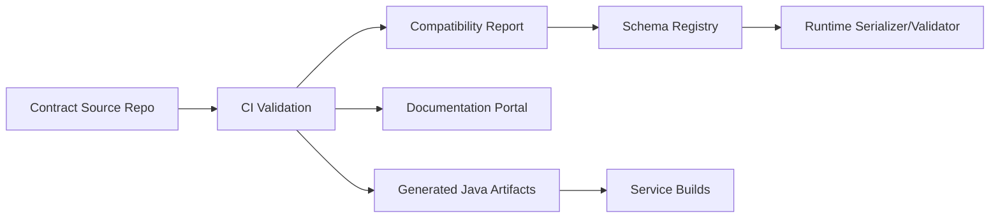
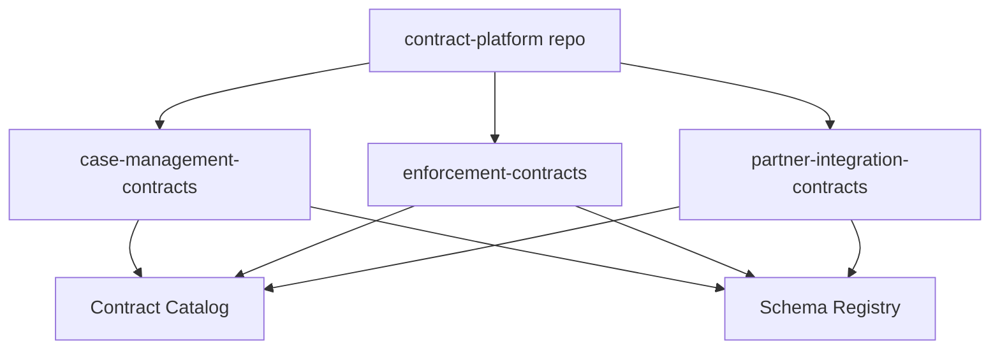
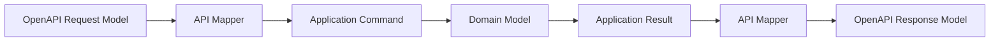
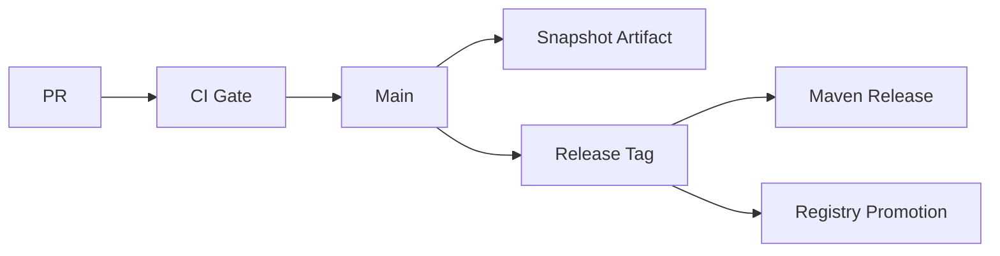
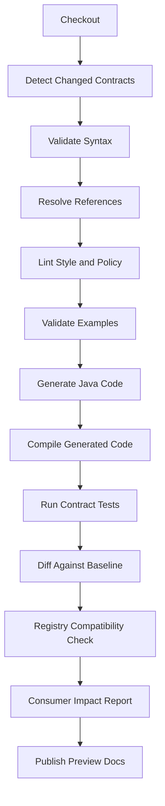
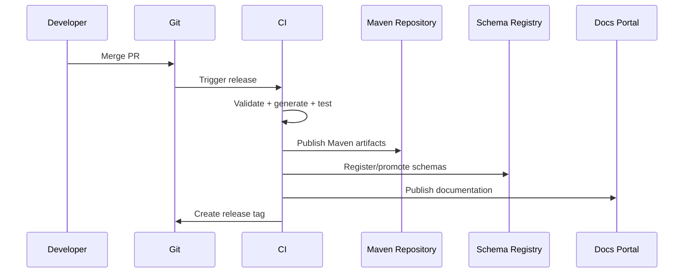

# Part 036 — Contract Repository Design: Monorepo, Polyrepo, and Artifact Publishing

> Goal: setelah bagian ini, kamu bisa mendesain repository kontrak data yang scalable untuk Java enterprise: kapan memakai monorepo, polyrepo, hybrid repo; bagaimana layout contract source; bagaimana publish generated Java artifacts; bagaimana mengatur dependency, semantic version, CI gates, documentation, registry promotion, dan ownership.

Contract engineering sering gagal bukan karena XSD, JSON Schema, Avro, Protobuf, atau OpenAPI-nya sulit.

Ia gagal karena **kontrak tidak memiliki rumah yang benar**.

Gejalanya:

- schema tersebar di repo service tanpa catalog,
- generated code di-commit tanpa sumber jelas,
- API spec dihasilkan dari controller setelah implementasi selesai,
- Avro schema diubah langsung di registry,
- Protobuf package berubah mengikuti nama module Java,
- OpenAPI copy-paste di banyak repo,
- consumer tidak tahu contract version mana yang dipakai,
- breaking change lolos karena tidak ada baseline diff,
- artifact dependency tidak sinkron dengan registry version.

Repository design bukan urusan administrasi. Repository design menentukan apakah contract bisa:

- direview,
- dites,
- dipublish,
- didokumentasikan,
- dipromosikan,
- diaudit,
- dikonsumsi lintas service,
- dimigrasikan tanpa downtime.

---

## 1. Mental Model: Contract Source vs Generated Artifact vs Runtime Registry

Ada tiga benda yang sering dicampur:

| Benda | Contoh | Fungsi |
|---|---|---|
| Contract source | `.avsc`, `.proto`, `.schema.json`, `.yaml`, `.xsd` | Source of truth untuk desain kontrak. |
| Generated artifact | Java classes, interfaces, DTOs, clients | Convenience artifact untuk build/runtime. |
| Runtime registry entry | subject/version/schema ID | Runtime lookup dan compatibility enforcement. |

Jangan menjadikan generated artifact sebagai source of truth.

Jangan menjadikan registry sebagai tempat authoring utama.

Jangan menjadikan service implementation sebagai contract authority.

Flow yang sehat:



Contract source adalah awal. Generated code dan registry adalah output terkontrol.

---

## 2. Repository Topology Options

Ada tiga pola utama:

1. Monorepo kontrak.
2. Polyrepo kontrak per domain/service.
3. Hybrid: platform contract repo + domain contract repos.

Tidak ada satu jawaban universal. Yang benar tergantung pada ownership, scale, coupling, release cadence, dan governance.

---

## 3. Option A: Central Contract Monorepo

Semua kontrak enterprise berada dalam satu repository.

Contoh:

```text
enterprise-contracts/
  domains/
    case-management/
    enforcement/
    billing/
    customer/
  platform/
    shared-types/
    lint-rules/
    generator-config/
  docs/
  tools/
```

### Kelebihan

- discovery mudah,
- satu CI policy konsisten,
- shared type governance mudah,
- global compatibility analysis lebih mudah,
- documentation portal mudah dibangun,
- audit trail terkonsolidasi,
- ideal untuk regulated environment.

### Kekurangan

- PR bisa ramai,
- ownership perlu CODEOWNERS kuat,
- build bisa lambat jika tidak modular,
- domain teams bisa merasa bottleneck,
- branching/release strategy harus disiplin,
- large repo tooling perlu caching.

### Cocok untuk

- organisasi dengan governance kuat,
- platform kontrak enterprise,
- banyak shared contracts,
- regulated/audited systems,
- event catalog lintas domain,
- kontrak yang perlu impact analysis luas.

### Tidak cocok jika

- tim sangat independen dengan lifecycle sangat berbeda,
- kontrak jarang shared,
- platform governance belum matang,
- repo tooling tidak mendukung partial build.

---

## 4. Option B: Contract Polyrepo

Setiap domain atau service memiliki repo kontraknya sendiri.

Contoh:

```text
case-management-contracts/
enforcement-contracts/
billing-contracts/
partner-bank-contracts/
```

### Kelebihan

- ownership lokal jelas,
- release cadence independen,
- repo kecil,
- CI cepat,
- domain autonomy tinggi.

### Kekurangan

- discovery sulit,
- governance policy bisa drift,
- shared type duplication,
- breaking-change detection lintas repo lebih sulit,
- documentation portal butuh aggregation,
- dependency graph lebih kompleks,
- sulit memastikan style konsisten.

### Cocok untuk

- organisasi domain-oriented yang matang,
- kontrak jarang shared,
- tim punya platform tooling standar,
- catalog aggregator tersedia.

### Tidak cocok jika

- belum ada contract catalog,
- belum ada standard CI template,
- banyak shared types,
- regulasi menuntut audit terpadu.

---

## 5. Option C: Hybrid Contract Architecture

Pola paling realistis untuk enterprise besar.

```text
contract-platform/
  lint-rules/
  shared-types/
  generator-config/
  ci-templates/
  documentation-theme/
  compatibility-engine/

case-management-contracts/
  openapi/
  events/
  json-schema/
  xsd/

enforcement-contracts/
  openapi/
  events/
  protobuf/

partner-integration-contracts/
  xsd/
  openapi/
  batch/
```

Platform repo menyediakan:

- shared types,
- policy-as-code,
- generator config,
- Maven parent/BOM,
- CI templates,
- documentation templates,
- compatibility tool wrappers.

Domain repo menyediakan:

- domain-specific API/event/file contracts,
- examples,
- migration guide,
- owner metadata,
- release notes.

Hybrid memberi governance tanpa mematikan autonomy.



---

## 6. Decision Matrix: Monorepo vs Polyrepo vs Hybrid

| Factor | Monorepo | Polyrepo | Hybrid |
|---|---:|---:|---:|
| Global discovery | Strong | Weak unless catalog exists | Strong with catalog |
| Domain autonomy | Medium | Strong | Strong |
| Governance consistency | Strong | Weak unless templates enforced | Strong |
| Build complexity | Medium-high | Low per repo | Medium |
| Cross-domain impact analysis | Strong | Hard | Medium-strong |
| Shared type management | Strong | Hard | Strong |
| Regulated audit | Strong | Medium | Strong |
| Team scale | Good with tooling | Good with platform maturity | Best for large orgs |

Rule of thumb:

> Jika belum punya contract catalog dan CI template yang kuat, polyrepo akan cepat menjadi schema sprawl.

---

## 7. Repository Layout Principles

Layout harus membuat pertanyaan penting mudah dijawab:

- kontrak ini milik domain mana,
- formatnya apa,
- version-nya apa,
- siapa owner-nya,
- examples-nya di mana,
- migration guide-nya di mana,
- generated artifact-nya apa,
- registry subject-nya apa,
- compatibility policy-nya apa.

### 7.1 Recommended Domain Repo Layout

```text
case-management-contracts/
  README.md
  catalog.yaml
  pom.xml
  .github/
    workflows/
      contract-ci.yml
  docs/
    adr/
    migrations/
    runbooks/
  openapi/
    case-management-api/
      v1/
        openapi.yaml
        examples/
        changelog.md
        policy.yaml
  events/
    avro/
      case-opened/
        schema.avsc
        examples/
        policy.yaml
      case-escalated/
        schema.avsc
        examples/
        policy.yaml
    protobuf/
      case-lifecycle/
        src/main/proto/company/regulatory/case/v1/case_events.proto
        policy.yaml
  json-schema/
    commands/
      create-case-request.schema.json
      update-case-command.schema.json
  xsd/
    partner-intake/
      v1/
        case-intake.xsd
        examples/
        policy.yaml
  batch/
    case-import/
      v1/
        manifest.schema.json
        row.schema.json
        examples/
  generated/
    README.md
```

Catatan penting:

- `generated/` biasanya tidak menyimpan hasil generated code permanen kecuali ada alasan khusus.
- Source schema punya examples dekat dengan schema.
- Policy dekat dengan contract agar review lokal jelas.
- `catalog.yaml` menghubungkan semua artifact ke owner dan registry subject.

---

## 8. Catalog File

`catalog.yaml` adalah index human/tool-friendly.

```yaml
repository: case-management-contracts
domain: regulatory-case-management
ownerTeam: case-platform
businessOwner: regulatory-operations

contracts:
  - id: case-management-api-v1
    type: openapi
    path: openapi/case-management-api/v1/openapi.yaml
    lifecycle: active
    visibility: internal
    ownerTeam: case-platform
    artifact:
      groupId: com.company.contracts.case
      artifactId: case-management-api-contract
      versionStrategy: semver

  - id: case-opened-event
    type: avro
    path: events/avro/case-opened/schema.avsc
    registry:
      subject: regulatory.case.CaseOpened
      compatibility: FULL_TRANSITIVE
    artifact:
      groupId: com.company.contracts.case
      artifactId: case-events-avro
    lifecycle: active
    classification: internal

  - id: partner-case-intake-v1
    type: xsd
    path: xsd/partner-intake/v1/case-intake.xsd
    namespace: urn:company:regulatory:partner-intake:v1
    lifecycle: active
    classification: confidential
```

Catalog file menjadi input untuk:

- CI,
- documentation generator,
- registry promotion,
- contract catalog portal,
- ownership reports,
- audit evidence.

---

## 9. Policy File per Contract

Contoh `policy.yaml`:

```yaml
contractId: case-opened-event
format: avro
contractClass: domain-event
compatibility: FULL_TRANSITIVE
ownerTeam: case-platform
approval:
  required:
    - owner-team
    - platform-contract-review
classification:
  containsPii: false
  sensitivity: internal
examples:
  required: true
  minimumValidExamples: 2
  minimumInvalidExamples: 2
runtime:
  registrySubject: regulatory.case.CaseOpened
  autoRegisterInProduction: false
  allowUseLatestInProduction: false
evolution:
  allowFieldRemoval: false
  allowRequiredFieldAddition: false
  allowEnumRemoval: false
```

Policy dekat dengan schema membuat review lebih lokal. Global policy tetap bisa override atau enforce minimum.

---

## 10. Artifact Publishing Strategy

Contract source harus menghasilkan artifacts yang bisa dikonsumsi service.

Jenis artifact:

| Artifact | Konsumen | Isi |
|---|---|---|
| Source artifact | Tooling, registry pipeline | Raw schema/spec. |
| Java model artifact | Java services | Generated Avro/Protobuf/OpenAPI models. |
| API client artifact | Java consumers | Generated HTTP client. |
| API server stub artifact | Provider service | Generated interface/delegate. |
| Validator artifact | Runtime validation layer | Compiled schema/validator wrapper. |
| Documentation artifact | Portal | Rendered docs/spec examples. |
| BOM artifact | Build management | Version alignment. |

Jangan publish satu giant artifact berisi semua generated classes jika consumer hanya butuh sebagian kecil.

Artifact boundary harus mengikuti consumption boundary.

---

## 11. Maven Module Layout

Contoh multi-module Maven:

```text
case-management-contracts/
  pom.xml
  modules/
    case-management-openapi-source/
    case-management-openapi-java-client/
    case-management-openapi-jaxrs-api/
    case-events-avro-source/
    case-events-avro-java/
    case-events-protobuf-source/
    case-events-protobuf-java/
    case-json-schema-source/
    case-json-schema-validator-java/
    case-contract-bom/
```

Parent `pom.xml`:

```xml
<project>
  <modelVersion>4.0.0</modelVersion>
  <groupId>com.company.contracts.case</groupId>
  <artifactId>case-management-contracts-parent</artifactId>
  <version>1.8.0-SNAPSHOT</version>
  <packaging>pom</packaging>

  <modules>
    <module>modules/case-events-avro-java</module>
    <module>modules/case-management-openapi-jaxrs-api</module>
    <module>modules/case-contract-bom</module>
  </modules>
</project>
```

BOM:

```xml
<dependencyManagement>
  <dependencies>
    <dependency>
      <groupId>com.company.contracts.case</groupId>
      <artifactId>case-events-avro-java</artifactId>
      <version>${project.version}</version>
    </dependency>
    <dependency>
      <groupId>com.company.contracts.case</groupId>
      <artifactId>case-management-openapi-jaxrs-api</artifactId>
      <version>${project.version}</version>
    </dependency>
  </dependencies>
</dependencyManagement>
```

Service consumption:

```xml
<dependencyManagement>
  <dependencies>
    <dependency>
      <groupId>com.company.contracts.case</groupId>
      <artifactId>case-contract-bom</artifactId>
      <version>1.8.0</version>
      <type>pom</type>
      <scope>import</scope>
    </dependency>
  </dependencies>
</dependencyManagement>
```

BOM mengurangi version mismatch antar generated artifacts.

---

## 12. Generated Code Policy

Generated code adalah output, bukan desain.

Policy:

- jangan edit generated code manual,
- jangan meletakkan business logic di generated models,
- jangan expose generated type sampai domain core,
- jangan commit generated code jika build bisa generate deterministically,
- commit generated code hanya jika ada alasan distribusi/tooling yang jelas,
- selalu compile generated code di CI,
- selalu test generated code dengan examples.

Generated Java artifacts harus punya package stabil.

Contoh buruk:

```text
com.company.casecommandservice.generated
```

Kenapa buruk? Karena package mengikuti service implementation.

Contoh baik:

```text
com.company.contracts.regulatory.caseevents.v1
com.company.contracts.regulatory.casemanagement.api.v1
```

Package harus mengikuti contract namespace/version, bukan nama service.

---

## 13. OpenAPI Artifact Strategy

Untuk OpenAPI-first Java, pisahkan minimal:

1. source spec artifact,
2. server interface artifact,
3. client artifact,
4. documentation artifact.

```text
case-management-api-contract      # contains openapi.yaml
case-management-api-jaxrs         # generated JAX-RS interfaces/models
case-management-api-client-java    # generated Java client
case-management-api-docs          # rendered docs
```

Kenapa pisah?

- Provider tidak selalu butuh generated client.
- Consumer tidak butuh server interfaces.
- Docs bisa release bersama spec.
- Source spec bisa dipakai tooling lain.

Jangan jadikan generated OpenAPI model sebagai JPA entity.

Jangan jadikan generated API model sebagai domain aggregate.

Mapping tetap wajib:



---

## 14. Avro Artifact Strategy

Untuk Avro:

```text
case-events-avro-source
case-events-avro-java
case-events-avro-test-fixtures
```

Generated Java artifact berisi:

- SpecificRecord classes,
- schema resources,
- helper untuk schema loading,
- maybe logical type conversions,
- no business handler.

Test fixtures berisi:

- valid historical payloads,
- invalid payloads,
- old schema examples,
- replay fixtures,
- compatibility matrix.

Konsumsi service:

```xml
<dependency>
  <groupId>com.company.contracts.case</groupId>
  <artifactId>case-events-avro-java</artifactId>
</dependency>
```

Producer/consumer tetap memakai registry runtime untuk schema ID. Maven artifact memberi reader schema dan generated classes.

---

## 15. Protobuf Artifact Strategy

Untuk Protobuf:

```text
case-events-protobuf-source
case-events-protobuf-java
case-grpc-api-java
```

Pisahkan message-only dari service/gRPC jika perlu.

Contoh:

```proto
syntax = "proto3";

package company.regulatory.case.v1;

option java_package = "com.company.contracts.regulatory.case.v1";
option java_multiple_files = true;

message CaseOpened {
  string case_id = 1;
  string intake_channel = 2;
}
```

Rules:

- `package` Protobuf stabil dan domain-oriented.
- `java_package` stabil dan contract-oriented.
- Field numbers tidak mengikuti urutan visual semata.
- Deleted field numbers/names harus reserved.
- Generated Java artifact harus dikompilasi terhadap runtime Protobuf versi yang dikelola BOM.

---

## 16. JSON Schema Artifact Strategy

JSON Schema artifact bisa berupa:

```text
case-json-schema-source
case-json-schema-bundle
case-json-schema-validator-java
```

`source` berisi schema modular.

`bundle` berisi schema yang sudah di-bundle untuk runtime.

`validator-java` berisi wrapper:

```java
public interface ContractValidator<T> {
    ValidationResult validateJson(String json);
    ValidationResult validateNode(JsonNode node);
    String schemaId();
}
```

Kenapa perlu validator artifact?

Agar service tidak mengulang:

- schema loading,
- resolver config,
- custom format validators,
- error mapping,
- cache policy,
- metric labels.

---

## 17. XSD Artifact Strategy

Untuk XSD:

```text
partner-intake-xsd-source
partner-intake-jaxb-java
partner-intake-xml-validator
```

XSD artifact harus menyertakan:

- `.xsd`,
- imported schemas,
- catalog resolver config jika perlu,
- sample XML valid/invalid,
- JAXB generated classes jika digunakan,
- secure parser configuration wrapper.

Jangan mengandalkan external internet URL saat runtime validation. Semua dependency XSD harus dipaketkan atau diselesaikan via internal catalog.

---

## 18. Versioning Strategy

Ada beberapa versi:

| Version | Contoh | Fungsi |
|---|---|---|
| Contract semantic version | `1.8.0` | Release artifact. |
| Registry version | `subject version 12` | Urutan registry subject. |
| API version | `/v1` | Public compatibility boundary. |
| Package/namespace version | `case.v1` | Code and wire namespace. |
| Schema ID | `1042` | Runtime schema lookup. |
| Git tag | `case-contracts-1.8.0` | Source snapshot. |

Jangan menyamakan semuanya.

### 18.1 Semantic Version for Artifacts

Gunakan semver untuk Maven artifacts:

- MAJOR: breaking contract artifact/API namespace change,
- MINOR: backward-compatible additions,
- PATCH: documentation/example/generator bugfix yang tidak mengubah contract semantics.

Namun hati-hati: contract compatibility tidak selalu sama dengan semver.

Menambah optional response field di OpenAPI mungkin MINOR. Menambah optional event field Avro dengan default mungkin MINOR. Mengubah semantic makna field tanpa shape change adalah breaking walau diff tool tidak melihat.

### 18.2 API Major Version

API major version biasanya lebih lambat berubah daripada Maven artifact version.

```text
/v1/cases
artifact version: 1.8.0, 1.9.0, 1.10.0
```

Jangan membuat `/v2` hanya karena menambah optional response field.

### 18.3 Protobuf Package Version

Protobuf package version seperti `v1` biasanya major compatibility boundary.

```proto
package company.regulatory.case.v1;
```

Membuat `v2` berarti long-lived migration cost.

---

## 19. Branching and Release Model

### 19.1 Trunk-Based Contract Development

Cocok jika:

- CI kuat,
- compatibility gates otomatis,
- release artifact sering,
- deprecation discipline baik.

Flow:



### 19.2 Release Branches

Cocok untuk public/external partner contract yang butuh patch support lama.

```text
main
release/v1
release/v2
```

Risiko: backport dan divergence.

Gunakan hanya jika benar-benar butuh long-term support.

---

## 20. CI Pipeline Design

CI contract repo harus lebih dari compile.



### 20.1 Changed Contract Detection

Jangan build semua jika repo besar.

Gunakan dependency graph:

```yaml
contractGraph:
  case-opened-event:
    dependsOn:
      - shared-types/money.avsc
      - shared-types/identity.avsc
    produces:
      - case-events-avro-java
```

Jika shared type berubah, semua dependent contracts harus dites.

### 20.2 Example Validation

Every contract must have examples.

```text
examples/
  valid/
    minimal.json
    full.json
    historical-v1.json
  invalid/
    missing-required-field.json
    invalid-enum.json
    wrong-time-format.json
```

Examples bukan dokumentasi tambahan. Examples adalah executable specification.

### 20.3 Generated Code Compile

Jika schema valid tetapi generated Java tidak compile, contract tidak siap.

Penyebab umum:

- reserved Java keyword,
- duplicate class name,
- invalid package config,
- generator bug,
- inline schema name collision,
- incompatible runtime library version.

### 20.4 Diff Against Baseline

Baseline bisa berasal dari:

- latest release tag,
- latest production registry version,
- declared previous artifact version.

CI harus jelas membandingkan terhadap apa.

---

## 21. Artifact Publishing Pipeline

Release pipeline:



Order bisa berbeda, tetapi prinsipnya:

- jangan register production schema jika artifact publish gagal,
- jangan publish artifact jika compatibility gate gagal,
- jangan tag release jika docs/catalog gagal untuk contract publik,
- semua output harus traceable ke commit yang sama.

---

## 22. Snapshot vs Release Artifacts

Snapshot berguna untuk integration testing.

Production harus pakai release artifact immutable.

Policy:

```yaml
artifacts:
  snapshots:
    allowedIn:
      - local
      - dev
      - ephemeral-test
    forbiddenIn:
      - staging
      - production
  releases:
    immutable: true
    requireGitTag: true
    requireCompatibilityReport: true
```

Jika staging memakai snapshot, kamu tidak bisa membuktikan apa yang diuji sama dengan apa yang diproduksi.

---

## 23. Dependency Management for Services

Service harus tahu contract artifact version yang digunakan.

Contoh:

```xml
<dependency>
  <groupId>com.company.contracts.case</groupId>
  <artifactId>case-events-avro-java</artifactId>
  <version>1.8.0</version>
</dependency>
```

Better dengan BOM:

```xml
<dependencyManagement>
  <dependencies>
    <dependency>
      <groupId>com.company.contracts.case</groupId>
      <artifactId>case-contract-bom</artifactId>
      <version>1.8.0</version>
      <type>pom</type>
      <scope>import</scope>
    </dependency>
  </dependencies>
</dependencyManagement>
```

Service catalog dapat membaca dependency ini untuk consumer inventory.

---

## 24. Avoid Dependency Hell

Contract artifacts bisa menyebabkan dependency hell jika:

- generated OpenAPI client membawa HTTP client library besar,
- Protobuf runtime version tidak selaras,
- Avro version berbeda antar service,
- generated code punya transitive dependencies yang tidak perlu,
- all-contracts artifact terlalu besar.

Mitigation:

- publish minimal artifacts,
- gunakan BOM,
- shade hanya jika benar-benar perlu,
- keep generated model dependencies thin,
- pisahkan client artifact dari model artifact,
- test dependency convergence,
- publish dependency report.

---

## 25. Documentation Publishing

Contract repo harus menghasilkan docs otomatis.

Docs minimal:

- API docs dari OpenAPI,
- event catalog dari Avro/Protobuf/AsyncAPI,
- schema docs dari JSON Schema/XSD,
- examples,
- changelog,
- compatibility report,
- migration guide,
- owner metadata,
- deprecation status.

Docs harus bisa menjawab:

> Jika saya consumer baru, bagaimana memakai contract ini dengan benar?

Docs bukan PDF statis yang dibuat manual setelah release. Docs adalah output pipeline.

---

## 26. CODEOWNERS and Review Routing

Contoh `.github/CODEOWNERS`:

```text
/openapi/case-management-api/ @case-platform @api-governance
/events/avro/case-opened/ @case-platform @event-platform
/xsd/partner-intake/ @partner-integration @security-review
/platform/shared-types/ @contract-platform @architecture-board
```

Review routing harus mengikuti risk:

- public API → API governance,
- event used by many consumers → event platform + consumer owners,
- PII fields → security/data governance,
- shared type → architecture/platform,
- breaking change → formal exception approval.

---

## 27. Contract ADRs

Setiap perubahan besar perlu ADR singkat.

Template:

```md
# ADR-017: Split EnforcementActionIssued into Proposed and Finalized Events

## Status
Accepted

## Context
Consumers need to distinguish draft enforcement action from legally final action.

## Decision
Introduce two new event types:
- EnforcementActionProposed
- EnforcementActionFinalized

Deprecate EnforcementActionIssued after all consumers migrate.

## Consequences
- Producers dual-publish during migration window.
- Audit ledger consumes both old and new events.
- Old subject remains active until 2026-10-01.

## Compatibility
Breaking semantic change avoided through expand-migrate-contract.
```

ADR membuat contract evolution defensible.

---

## 28. Contract Changelog

Changelog harus machine-readable dan human-readable.

```yaml
changes:
  - version: 1.8.0
    date: 2026-07-03
    type: minor
    compatibility: backward
    summary: Add escalationReasonDetails to CaseEscalated
    subjects:
      - regulatory.case.CaseEscalated
    migration: none

  - version: 2.0.0
    date: 2026-09-01
    type: major
    compatibility: breaking
    summary: Split EnforcementActionIssued event
    migrationGuide: docs/migrations/enforcement-action-v2.md
```

Changelog yang baik menjelaskan semantic impact, bukan hanya “updated schema”.

---

## 29. Contract Repository Anti-Patterns

### 29.1 Schema Hidden Inside Service Repo

Ini bisa diterima untuk private internal DTO yang tidak dikonsumsi lintas service.

Tetapi jika schema menjadi integration contract, menyembunyikannya di service repo membuat consumer bergantung pada implementation repo.

### 29.2 Generated Code Committed Without Source

Jika source schema hilang, generated code tidak bisa menjadi contract yang sehat.

### 29.3 One Artifact for Everything

```text
enterprise-contracts-java.jar
```

Masalah:

- semua service menarik dependency besar,
- version conflict meningkat,
- blast radius release besar,
- sulit mengetahui consumer contract spesifik.

### 29.4 No Examples

Schema tanpa examples sulit direview. Banyak kesalahan semantics baru terlihat di payload konkret.

### 29.5 Artifact Version Not Linked to Registry Version

Jika Maven artifact `1.8.0` tidak tahu registry subject/version mana yang didaftarkan, debugging production menjadi sulit.

### 29.6 Manual Docs

Docs manual akan drift.

Contract docs harus dihasilkan dari source + metadata + examples.

---

## 30. Practical Case Study: Case Management Contract Repo

### 30.1 Repo Layout

```text
case-management-contracts/
  catalog.yaml
  pom.xml
  docs/
    adr/
    migrations/
  openapi/
    case-management-api/v1/openapi.yaml
  events/
    avro/
      case-opened/schema.avsc
      case-escalated/schema.avsc
      case-closed/schema.avsc
  json-schema/
    commands/create-case-command.schema.json
  batch/
    case-import/v1/manifest.schema.json
    case-import/v1/row.schema.json
  modules/
    case-api-jaxrs/
    case-api-client-java/
    case-events-avro-java/
    case-json-schema-validator-java/
    case-contract-bom/
```

### 30.2 CI Stages

```yaml
stages:
  - validate-source
  - validate-examples
  - generate-java
  - compile-java
  - diff-baseline
  - registry-compatibility-check
  - publish-preview-docs
  - release-artifacts
  - promote-registry
  - publish-docs
```

### 30.3 Release Output

```text
com.company.contracts.case:case-api-jaxrs:1.8.0
com.company.contracts.case:case-api-client-java:1.8.0
com.company.contracts.case:case-events-avro-java:1.8.0
com.company.contracts.case:case-json-schema-validator-java:1.8.0
com.company.contracts.case:case-contract-bom:1.8.0
```

Registry promotion:

```yaml
registered:
  - subject: regulatory.case.CaseOpened
    version: 6
    artifactVersion: 1.8.0
  - subject: regulatory.case.CaseEscalated
    version: 4
    artifactVersion: 1.8.0
```

---

## 31. Production Readiness Checklist

Contract repository is production-ready when:

- contract source is in Git,
- generated artifacts are deterministic,
- schema examples are required,
- CI validates syntax and references,
- CI compiles generated Java,
- CI runs compatibility checks,
- baseline is explicit,
- owner metadata is required,
- CODEOWNERS routes review correctly,
- release artifacts are immutable,
- snapshot artifacts are forbidden in production,
- registry promotion is tied to release commit,
- docs are generated automatically,
- changelog is maintained,
- ADR exists for major contract decisions,
- dependency BOM is available for Java consumers,
- contract catalog aggregates repo metadata,
- service dependency graph can identify consumers,
- security/data classification is part of metadata,
- generated model is not used as domain model.

---

## 32. What Top Engineers Do Differently

Average approach:

> Put schema files wherever convenient, generate code locally, publish a jar if someone asks.

Production-grade approach:

> Treat contract source as a governed product. Separate source, generated artifact, registry entry, documentation, and runtime metadata. Make every contract change reviewable, testable, publishable, observable, and auditable.

The repository is not just storage.

It is the **manufacturing line** for contract artifacts.

If the manufacturing line is weak, every downstream system inherits ambiguity.

---

## 33. References

- OpenAPI Generator — Plugins: https://openapi-generator.tech/docs/plugins/
- OpenAPI Generator — Java Generator: https://openapi-generator.tech/docs/generators/java/
- OpenAPI Generator — JAX-RS Spec Generator: https://openapi-generator.tech/docs/generators/jaxrs-spec/
- JSON Schema Draft 2020-12: https://json-schema.org/draft/2020-12
- OpenAPI Specification 3.2.0: https://spec.openapis.org/oas/v3.2.0.html
- Apache Avro 1.12.0 Specification: https://avro.apache.org/docs/1.12.0/specification/
- Protocol Buffers Java Generated Code Guide: https://protobuf.dev/reference/java/java-generated/
- Confluent Schema Registry Compatibility: https://docs.confluent.io/platform/current/schema-registry/fundamentals/schema-evolution.html
