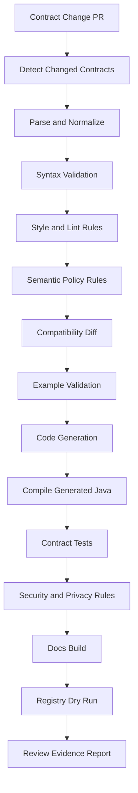
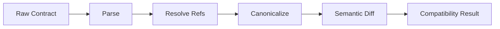
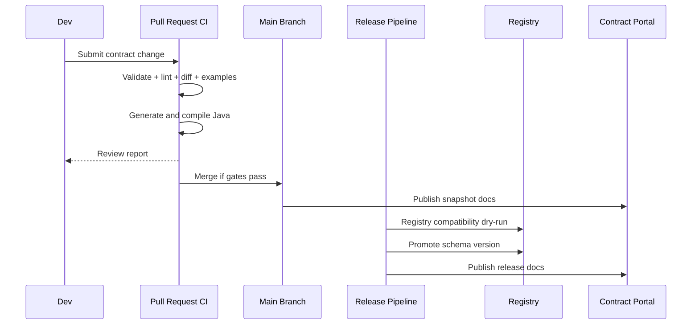

# Part 037 — Contract CI, Policy-as-Code, and Quality Gates

> Goal: setelah bagian ini, kamu bisa membangun pipeline CI untuk kontrak data yang tidak hanya mengecek file valid atau tidak, tetapi juga mengecek compatibility, semantic correctness, security posture, ownership, generated-code stability, example validity, documentation readiness, dan deployment safety.

Contract CI bukan sekadar menjalankan `mvn test`.

Contract CI adalah **control plane untuk perubahan protokol**.

Setiap perubahan XSD, JSON Schema, Avro, Protobuf, dan OpenAPI adalah perubahan cara sistem berbicara. Kalau CI hanya mengecek YAML parseable atau `.proto` bisa dikompilasi, maka CI hanya menjaga syntax. Production incident biasanya muncul bukan dari syntax error, tetapi dari perubahan yang terlihat kecil:

- field baru dibuat `required`,
- enum value lama dihapus,
- Protobuf tag number dipakai ulang,
- OpenAPI response example tidak cocok dengan schema,
- Avro field ditambahkan tanpa default,
- XSD namespace berubah tanpa migration window,
- JSON Schema menutup object dengan `additionalProperties: false` saat consumer masih mengirim metadata,
- generated Java model berubah sehingga service lain gagal compile,
- schema registry compatibility mode tidak sama dengan aturan repo,
- dokumentasi berubah tetapi example tidak pernah divalidasi,
- privacy metadata hilang dari field sensitif.

CI yang benar harus memperlakukan kontrak sebagai artifact produksi, bukan file konfigurasi.

---

## 1. Mental Model: Contract CI adalah Assembly Line

Bayangkan contract repository seperti pabrik kecil.

Input-nya adalah source contract:

- `*.openapi.yaml`,
- `*.schema.json`,
- `*.avsc`,
- `*.proto`,
- `*.xsd`,
- example payload,
- catalog metadata,
- ownership metadata,
- compatibility baseline.

Output-nya adalah artifact yang bisa dipercaya:

- generated Java classes,
- generated interfaces,
- documentation,
- compatibility report,
- registry promotion plan,
- changelog,
- dependency coordinates,
- validation package,
- policy evidence.

Pipeline-nya harus seperti ini:



Kalau salah satu step gagal, PR tidak boleh merge kecuali ada exception yang eksplisit dan auditable.

Prinsipnya sederhana:

> Source contract boleh berubah cepat. Published contract harus berubah dengan bukti.

---

## 2. Tiga Jenis Pemeriksaan: Validity, Quality, Compatibility

Banyak tim mencampur semua gate menjadi satu kata: “validation”. Itu terlalu kasar.

Pisahkan menjadi tiga lapis.

### 2.1 Validity

Validity menjawab:

> Apakah contract ini valid menurut format teknisnya?

Contoh:

- OpenAPI document valid terhadap OAS.
- JSON Schema valid terhadap metaschema.
- Avro schema parseable menurut Avro spec.
- Protobuf file bisa dikompilasi oleh `protoc`.
- XSD valid sebagai XML Schema.

Validity mencegah file rusak.

Validity tidak membuktikan contract bagus.

### 2.2 Quality

Quality menjawab:

> Apakah contract ini mengikuti engineering standard organisasi?

Contoh:

- Semua operation OpenAPI punya `operationId`.
- Semua error response memakai shared `Problem` schema.
- Semua field timestamp memakai `format: date-time` atau logical type yang disetujui.
- Semua Protobuf enum memiliki `*_UNSPECIFIED = 0`.
- Semua Avro nullable union menaruh `null` sebagai branch pertama jika default-nya `null`.
- Semua schema punya owner.
- Semua public field punya description.
- Semua PII field punya classification.

Quality menjaga keterbacaan, konsistensi, dan maintainability.

### 2.3 Compatibility

Compatibility menjawab:

> Apakah perubahan ini aman untuk producer dan consumer yang sudah ada?

Contoh:

- Avro field baru punya default sehingga old records tetap bisa dibaca.
- Protobuf field number tidak berubah.
- OpenAPI response tidak menghapus property yang sudah dikonsumsi client.
- JSON Schema tidak membuat property lama menjadi invalid.
- XSD tidak mengganti namespace tanpa version migration.

Compatibility menjaga distributed system tetap hidup saat deployment tidak serentak.

---

## 3. Gate Matrix untuk Multi-Format Contract Repository

Gunakan matrix seperti ini sebagai baseline.

| Gate | XSD | JSON Schema | Avro | Protobuf | OpenAPI |
|---|---:|---:|---:|---:|---:|
| Parse syntax | wajib | wajib | wajib | wajib | wajib |
| Validate against spec/metaschema | wajib | wajib | wajib | wajib via compiler | wajib |
| Lint style | wajib | wajib | wajib | wajib | wajib |
| Compatibility diff | wajib | wajib | wajib | wajib | wajib |
| Example validation | wajib | wajib | wajib | disarankan | wajib |
| Generated Java compile | jika generate | jika generate | wajib jika SpecificRecord | wajib | wajib jika OpenAPI-first |
| Security rule | wajib | wajib | wajib | wajib | wajib |
| Privacy classification | wajib untuk public/business data | wajib | wajib | wajib | wajib |
| Documentation build | wajib | wajib | wajib | wajib | wajib |
| Registry dry run | optional | jika registry | wajib jika event | jika registry | jika API catalog |

Rule penting:

> Gate yang tidak deterministic jangan dijadikan hard blocker. Jadikan warning atau manual-review evidence.

Contoh non-deterministic gate:

- AI-generated review,
- heuristic naming suggestion,
- generated prose quality,
- consumer usage inference dari telemetry yang belum lengkap.

Contoh deterministic gate:

- Protobuf tag number reused,
- Avro field added without default under backward compatibility,
- OpenAPI operation missing response code,
- JSON Schema example invalid,
- XSD parse failed,
- PII field has no classification.

---

## 4. Policy-as-Code: Jangan Simpan Aturan di Kepala Architect

Kalau aturan contract hanya hidup di dokumen, aturan itu akan dilanggar.

Aturan harus executable.

Contoh `contract-policy.yaml`:

```yaml
policyVersion: 1
organization: acme-regulatory-platform

defaults:
  compatibility: backward_transitive
  severityOnUnknownOwner: error
  severityOnMissingDescription: warning
  requireExamples: true
  requirePrivacyClassification: true

formats:
  openapi:
    allowedVersions:
      - "3.1.0"
      - "3.2.0"
    requireOperationId: true
    requireProblemDetails: true
    requireIdempotencyKeyFor:
      - POST /cases
      - POST /cases/{caseId}/actions
    forbiddenPatterns:
      - path: $.paths[*][*].responses.default
        reason: "Default response hides error contract. Use explicit 4xx/5xx responses."

  protobuf:
    requireEnumUnspecifiedZero: true
    forbidRequiredFields: true
    requireReservedOnDelete: true
    packageVersioning: major_suffix

  avro:
    compatibility: backward_transitive
    requireNamespace: true
    requireFieldDoc: true
    requireDefaultForAddedFields: true
    forbidAnonymousRecords: true

  jsonSchema:
    dialect: "https://json-schema.org/draft/2020-12/schema"
    requireId: true
    requireAdditionalPropertiesDecision: true
    maxOneOfBranches: 20

  xsd:
    requireTargetNamespace: true
    forbidChameleonSchemas: true
    requireSecureParserTests: true

privacy:
  requiredForPaths:
    - "$..customerId"
    - "$..person.*"
    - "$..email"
    - "$..phoneNumber"
  allowedClassifications:
    - public
    - internal
    - confidential
    - restricted
    - pii
    - sensitive_pii
```

Policy file seperti ini harus menjadi input CI.

Jangan hardcode semua aturan di script shell.

Kenapa?

Karena policy berubah lebih sering daripada engine. Regulator menambah field sensitif. Platform team menambah rule. API council memperbarui pagination style. Kalau policy tersembunyi di script, review-nya buruk.

---

## 5. Repository Layout untuk CI yang Bisa Diskalakan

Contoh layout:

```text
contracts/
  catalog.yaml
  policy/
    contract-policy.yaml
    openapi-rules.yaml
    protobuf-rules.yaml
    privacy-taxonomy.yaml
  openapi/
    case-api/
      v1/
        openapi.yaml
        examples/
          create-case-request.valid.json
          create-case-response.valid.json
          create-case-request.invalid-missing-subject.json
  json-schema/
    common/
      money.schema.json
      problem.schema.json
    case-intake/
      case-intake.schema.json
      examples/
  avro/
    enforcement-events/
      case-created.avsc
      case-escalated.avsc
      examples/
  protobuf/
    case-command/v1/
      case_command.proto
      buf.yaml
      buf.gen.yaml
  xsd/
    legacy-intake/v1/
      intake.xsd
      examples/
  baselines/
    main/
      openapi/
      avro/
      protobuf/
      json-schema/
      xsd/
  generated/
    java/
      # generated only in CI or generated artifact module
  docs/
```

CI harus bisa menjawab:

1. Contract mana yang berubah?
2. Format apa?
3. Baseline apa?
4. Owner siapa?
5. Consumer terdampak siapa?
6. Gate apa yang relevan?
7. Evidence apa yang harus dipublish?

Jangan jalankan semua gate untuk semua file kalau repo membesar. Gunakan change detection.

---

## 6. Change Detection: Mulai dari Scope Kecil

Pseudo workflow:

```bash
git diff --name-only origin/main...HEAD > changed-files.txt

contract-ci detect \
  --changed-files changed-files.txt \
  --catalog contracts/catalog.yaml \
  --out build/contract-change-set.json
```

Contoh output:

```json
{
  "changes": [
    {
      "contractId": "case-api",
      "format": "openapi",
      "path": "contracts/openapi/case-api/v1/openapi.yaml",
      "changeType": "modified",
      "owner": "team-case-platform",
      "baseline": "origin/main:contracts/openapi/case-api/v1/openapi.yaml"
    },
    {
      "contractId": "case-created-event",
      "format": "avro",
      "path": "contracts/avro/enforcement-events/case-created.avsc",
      "changeType": "modified",
      "owner": "team-enforcement-events",
      "baseline": "origin/main:contracts/avro/enforcement-events/case-created.avsc"
    }
  ]
}
```

Change detection mencegah pipeline lambat dan membuat report fokus.

---

## 7. Parse and Normalize: Jangan Diff Raw YAML

Raw textual diff buruk untuk contract.

Contoh OpenAPI YAML:

```yaml
components:
  schemas:
    Case:
      type: object
      properties:
        id:
          type: string
```

Bisa diubah menjadi JSON dengan urutan key berbeda tanpa perubahan makna.

Maka CI perlu normalize:

- resolve local refs,
- sort keys untuk canonical representation,
- remove comments,
- normalize line endings,
- normalize URI,
- optionally bundle external refs,
- preserve semantic identity.

Pipeline:



Untuk Protobuf, canonical representation bisa berupa descriptor set atau Buf image.

Untuk Avro, canonical form penting karena Avro punya parsing canonical form untuk fingerprinting, tetapi governance diff tetap perlu melihat semantic field changes, bukan hanya fingerprint berubah.

Untuk XSD, normalization jauh lebih sulit karena namespace, import/include, type derivation, substitution group, dan wildcard bisa memengaruhi validitas instance. Jangan mengandalkan XML textual diff.

---

## 8. OpenAPI Gate: Lint, Semantic Policy, Example Validation

OpenAPI CI minimal:

1. parse document,
2. validate OAS structure,
3. lint style,
4. check semantic policy,
5. validate examples,
6. run breaking change diff,
7. generate Java server/client if relevant,
8. compile generated code,
9. publish docs preview.

### 8.1 Spectral Ruleset Example

Contoh `.spectral.yaml`:

```yaml
extends:
  - spectral:oas

rules:
  acme-operation-id-required:
    description: Every operation must have stable operationId.
    severity: error
    given: $.paths[*][*]
    then:
      field: operationId
      function: truthy

  acme-no-inline-error-schema:
    description: Error responses must use shared Problem schema.
    severity: error
    given: $.paths[*][*].responses[?(@property.match(/^(4|5)/))].content.application~1json.schema
    then:
      field: $ref
      function: pattern
      functionOptions:
        match: "#/components/schemas/Problem"

  acme-operation-summary:
    description: Operation should have summary for docs.
    severity: warn
    given: $.paths[*][*]
    then:
      field: summary
      function: truthy
```

Lint rule menjaga readability dan consistency.

Tetapi lint rule tidak cukup untuk compatibility.

### 8.2 OpenAPI Semantic Policy

Contoh custom rule:

```yaml
rules:
  acme-idempotency-for-case-actions:
    description: Mutating case action endpoints must require Idempotency-Key.
    severity: error
    match:
      pathRegex: "^/cases/\\{caseId\\}/actions"
      methods: [post]
    assert:
      requiredHeader:
        name: Idempotency-Key
        schema:
          type: string
          minLength: 16
```

Ini bukan rule OAS standar. Ini policy organisasi.

### 8.3 OpenAPI Example Validation

Setiap example harus dibuktikan cocok dengan schema.

Contoh error yang harus ditangkap CI:

```yaml
components:
  schemas:
    CaseStatus:
      type: string
      enum: [OPEN, CLOSED]
```

Example:

```json
{
  "status": "ESCALATED"
}
```

Kalau example tidak divalidasi, dokumentasi menjadi kebohongan.

---

## 9. JSON Schema Gate: Dialect, Refs, Examples, Complexity

JSON Schema CI minimal:

1. validate schema terhadap metaschema,
2. verify `$schema` memakai dialect yang disetujui,
3. verify `$id` stable,
4. resolve refs offline,
5. validate examples,
6. check compatibility policy,
7. check complexity guard,
8. generate validation package atau docs.

Contoh schema policy:

```json
{
  "$schema": "https://json-schema.org/draft/2020-12/schema",
  "$id": "https://contracts.acme.internal/schemas/case-intake/v1/case-intake.schema.json",
  "type": "object",
  "required": ["caseId", "receivedAt"],
  "properties": {
    "caseId": { "type": "string", "minLength": 1 },
    "receivedAt": { "type": "string", "format": "date-time" }
  },
  "unevaluatedProperties": false
}
```

CI checks:

- `$schema` must be present.
- `$id` must be absolute and stable.
- Local refs must resolve.
- External refs must come from approved catalog.
- Examples under `examples/valid` must pass.
- Examples under `examples/invalid` must fail.
- `unevaluatedProperties: false` must be intentional, not accidental.
- `format` must be configured according to org decision: annotation only atau assertion.

### 9.1 Invalid Fixture is as Important as Valid Fixture

Valid fixtures prove happy path.

Invalid fixtures prove boundary.

Example layout:

```text
examples/
  valid/
    minimal.json
    full.json
  invalid/
    missing-case-id.json
    invalid-date-time.json
    unexpected-property.json
```

CI harus menjalankan dua jenis test:

```text
valid fixture must validate
invalid fixture must not validate
```

Kalau invalid fixture tiba-tiba valid setelah schema berubah, mungkin constraint melemah tanpa review.

---

## 10. Avro Gate: Compatibility is Not Optional

Avro CI minimal:

1. parse `.avsc`,
2. validate naming and namespace,
3. check field documentation,
4. check logical type usage,
5. check backward/forward/full compatibility against baseline,
6. validate example JSON or binary fixture,
7. generate SpecificRecord if used,
8. compile generated Java,
9. registry dry run.

Contoh Avro anti-pattern:

```json
{
  "type": "record",
  "name": "CaseCreated",
  "namespace": "com.acme.case.events",
  "fields": [
    { "name": "caseId", "type": "string" },
    { "name": "priority", "type": "string" }
  ]
}
```

Kemudian field baru ditambahkan:

```json
{ "name": "jurisdiction", "type": "string" }
```

Ini terlihat aman, tetapi untuk backward compatibility Avro field baru biasanya perlu default agar reader schema baru bisa membaca data lama.

Safe version:

```json
{ "name": "jurisdiction", "type": "string", "default": "UNKNOWN" }
```

Untuk nullable:

```json
{ "name": "jurisdiction", "type": ["null", "string"], "default": null }
```

CI rule:

```yaml
avroRules:
  addedFieldRequiresDefault: error
  nullableUnionRequiresNullDefault: error
  enumSymbolRemoval: error
  namespaceChange: error
  logicalTypeRequiredForDecimal: error
```

### 10.1 Registry Dry Run

Jangan menunggu deployment untuk tahu registry akan menolak schema.

CI harus melakukan dry run:

```bash
contract-ci registry-check \
  --registry-url "$SCHEMA_REGISTRY_URL" \
  --subject case-created-value \
  --schema contracts/avro/enforcement-events/case-created.avsc \
  --compatibility backward_transitive \
  --dry-run
```

Kalau registry production tidak boleh diakses dari PR, gunakan staging registry atau local compatibility engine dengan baseline yang ditarik dari registry.

---

## 11. Protobuf Gate: Descriptor-Aware, Not Text-Aware

Protobuf CI minimal:

1. compile `.proto`,
2. lint package/message/field naming,
3. enforce enum zero value,
4. detect breaking changes via descriptor comparison,
5. prevent tag reuse,
6. require `reserved` on delete,
7. generate Java code,
8. compile generated code,
9. optionally run gRPC stub compatibility tests.

Text diff buruk untuk Protobuf.

Ini perubahan yang terlihat kecil:

```proto
message CaseCommand {
  string case_id = 1;
  string action = 2;
}
```

Menjadi:

```proto
message CaseCommand {
  string case_id = 1;
  int32 action = 2;
}
```

Nama field sama. Tag sama. Tipe berubah. Ini breaking.

Perubahan lebih berbahaya:

```proto
message CaseCommand {
  string case_id = 1;
  reserved 2;
  reserved "action";
  string action_type = 3;
}
```

Ini lebih aman karena tag lama tidak dipakai ulang.

CI rule:

```yaml
protobufRules:
  forbidTagReuse: error
  requireReservedOnDelete: error
  fieldTypeChange: error
  packageChange: error
  javaPackageChange: warning
  enumZeroUnspecified: error
  enumValueDeleteWithoutReserved: error
```

### 11.1 Buf Example

Contoh `buf.yaml`:

```yaml
version: v2
lint:
  use:
    - STANDARD
breaking:
  use:
    - FILE
```

Contoh CI:

```bash
buf lint contracts/protobuf
buf breaking contracts/protobuf --against '.git#branch=main,subdir=contracts/protobuf'
```

Rule set harus dipilih sesuai risk. `FILE` lebih strict daripada beberapa mode lain karena menganggap perubahan file-level tertentu sebagai breaking.

---

## 12. XSD Gate: Compile, Validate, Secure Parser, Namespace Discipline

XSD CI minimal:

1. validate `.xsd` syntax,
2. resolve import/include,
3. enforce target namespace,
4. forbid chameleon schema jika tidak disetujui,
5. validate example XML,
6. validate invalid XML fixtures,
7. generate Java binding jika digunakan,
8. compile generated Java,
9. run secure parser tests.

Contoh XML security test harus ada untuk schema boundary:

```xml
<!DOCTYPE foo [
  <!ENTITY xxe SYSTEM "file:///etc/passwd">
]>
<intake>&xxe;</intake>
```

CI expectation:

```text
parser rejects DTD/external entity before business validation
```

Jangan hanya menguji XML valid.

Uji parser abuse.

---

## 13. Generated Java Gate: Generated Code Harus Bisa Dikompilasi

Kalau contract dipublish bersama generated Java artifact, CI wajib compile generated output.

Minimal module:

```text
build/generated-sources/
  openapi/
  avro/
  protobuf/
  xsd/

modules/
  contract-models/
    pom.xml
    src/generated/java/...
```

CI steps:

```bash
mvn -pl contract-models -am clean verify
```

Yang perlu dites:

- generated code compile,
- no duplicate classes,
- no dependency conflict,
- Java version compatible,
- generated package stable,
- no domain logic inside generated class,
- serialization round-trip works,
- mapping layer compiles.

Contoh smoke test Avro:

```java
@Test
void caseCreatedSpecificRecordRoundTrip() throws Exception {
    CaseCreated event = CaseCreated.newBuilder()
        .setCaseId("CASE-001")
        .setOccurredAt(Instant.parse("2026-07-03T10:15:30Z"))
        .setPriority("HIGH")
        .build();

    byte[] bytes = AvroTestSupport.serialize(event, CaseCreated.getClassSchema());
    CaseCreated decoded = AvroTestSupport.deserialize(bytes, CaseCreated.getClassSchema());

    assertEquals("CASE-001", decoded.getCaseId().toString());
}
```

Contoh smoke test Protobuf:

```java
@Test
void caseCommandRoundTripPreservesKnownFields() throws Exception {
    CaseCommand command = CaseCommand.newBuilder()
        .setCaseId("CASE-001")
        .setActionType("ESCALATE")
        .build();

    byte[] bytes = command.toByteArray();
    CaseCommand decoded = CaseCommand.parseFrom(bytes);

    assertEquals("CASE-001", decoded.getCaseId());
    assertEquals("ESCALATE", decoded.getActionType());
}
```

Contoh OpenAPI generated interface smoke:

```java
@Test
void generatedCreateCaseRequestHasStableFields() {
    CreateCaseRequest request = new CreateCaseRequest()
        .subjectId("SUBJ-001")
        .caseType("CONSUMER_COMPLAINT");

    assertEquals("SUBJ-001", request.getSubjectId());
}
```

Smoke test bukan business test. Ia menjaga generated artifact tidak rusak.

---

## 14. Security and Privacy Gates

Contract adalah tempat terbaik untuk mendeteksi data risk lebih awal.

Security gates:

- max payload size documented,
- no recursive schema without depth limit,
- XML parser secure config tested,
- OpenAPI auth scheme present,
- sensitive endpoint has security requirement,
- file upload uses content type and size constraints,
- object maps have bounded keys/value types,
- JSON Schema regex reviewed for catastrophic backtracking,
- Protobuf `Any` usage requires allowlist,
- Avro bytes fields require semantic description.

Privacy gates:

- PII fields classified,
- retention metadata present for regulated payload,
- masking policy declared,
- audit fields separated from business payload,
- field-level purpose documented,
- restricted fields not exposed in public API,
- examples do not contain realistic sensitive data.

Contoh field metadata via vendor extension:

```yaml
components:
  schemas:
    Person:
      type: object
      properties:
        nationalId:
          type: string
          x-data-classification: sensitive_pii
          x-masking: last4
          x-retention-category: regulatory-case-file
```

Contoh JSON Schema annotation:

```json
{
  "type": "string",
  "x-data-classification": "pii",
  "x-masking": "email-local-part"
}
```

CI rule:

```text
Any field path matching /nationalId|email|phone|dateOfBirth/ must declare x-data-classification.
```

Ini bukan sempurna. Tapi jauh lebih baik daripada menunggu privacy review manual di akhir.

---

## 15. Contract Documentation Gate

Documentation harus build dari contract source.

CI harus gagal jika:

- documentation generator gagal,
- broken `$ref`,
- operation tanpa summary,
- schema tanpa description untuk public field,
- example invalid,
- changelog kosong untuk breaking change,
- deprecation metadata tidak lengkap.

Artifact docs:

```text
build/docs/
  index.html
  openapi/case-api.html
  avro/case-created.html
  protobuf/case-command.html
  json-schema/case-intake.html
  xsd/legacy-intake.html
  compatibility-report.html
  change-summary.json
```

Docs bukan kosmetik. Docs adalah bagian dari consumer onboarding.

---

## 16. Compatibility Report yang Bisa Dibaca Reviewer

CI harus menghasilkan report seperti ini:

```markdown
# Contract Compatibility Report

Contract: case-created-event
Format: Avro
Owner: team-enforcement-events
Compatibility Mode: BACKWARD_TRANSITIVE
Baseline: main@8f13a2c
Candidate: PR-142

## Result
FAILED

## Breaking Changes

1. Field `jurisdiction` added without default.
   - Impact: new reader cannot read old messages.
   - Recommendation: add default or make field nullable with default null.

2. Enum symbol `LOW` removed from `Priority`.
   - Impact: old data containing LOW cannot be decoded by new reader.
   - Recommendation: keep symbol and deprecate semantically.

## Warnings

1. Field `caseType` has no `doc`.
2. Example `case-created-full.json` missing new field `jurisdiction`.
```

Report harus actionable.

Jangan membuat reviewer membaca 3.000 baris log CI.

---

## 17. Severity Model: Error, Warning, Info, Waiver

Tidak semua rule harus memblokir merge.

| Severity | Meaning | Merge behavior |
|---|---|---|
| error | Unsafe atau melanggar invariant wajib | Block |
| warning | Risk atau quality issue | Allow with reviewer visibility |
| info | Advisory | Allow |
| waiver-required | Bisa dilanggar hanya dengan approval eksplisit | Block sampai waiver ada |

Contoh:

```yaml
waivers:
  - ruleId: openapi-breaking-response-field-removed
    contractId: case-api
    path: /cases/{caseId}
    reason: "Field was never released to external consumers. Internal beta only."
    approvedBy:
      - api-governance-board
      - team-case-platform
    expiresOn: 2026-09-30
    evidence:
      - consumer-inventory-report-2026-07-03
```

Waiver harus expiring.

Waiver permanen adalah policy decay.

---

## 18. CI Pipeline Example: GitHub Actions Style

Contoh sederhana:

```yaml
name: contract-ci

on:
  pull_request:
    paths:
      - "contracts/**"
      - ".github/workflows/contract-ci.yml"

jobs:
  detect:
    runs-on: ubuntu-latest
    outputs:
      change_set: ${{ steps.detect.outputs.change_set }}
    steps:
      - uses: actions/checkout@v4
        with:
          fetch-depth: 0
      - name: Detect changed contracts
        id: detect
        run: |
          contract-ci detect \
            --base origin/main \
            --head HEAD \
            --catalog contracts/catalog.yaml \
            --out build/change-set.json
          echo "change_set=build/change-set.json" >> "$GITHUB_OUTPUT"

  validate:
    runs-on: ubuntu-latest
    needs: detect
    steps:
      - uses: actions/checkout@v4
        with:
          fetch-depth: 0
      - name: Validate contracts
        run: |
          contract-ci validate \
            --change-set build/change-set.json \
            --policy contracts/policy/contract-policy.yaml \
            --out build/reports

  generate-java:
    runs-on: ubuntu-latest
    needs: validate
    steps:
      - uses: actions/checkout@v4
      - name: Generate Java artifacts
        run: |
          mvn -pl contract-artifacts -am clean verify

  docs:
    runs-on: ubuntu-latest
    needs: validate
    steps:
      - uses: actions/checkout@v4
      - name: Build contract docs
        run: |
          contract-docs build --source contracts --out build/docs
```

Di enterprise setup, biasanya job dipisah:

- lint cepat,
- compatibility medium,
- generated Java compile medium,
- integration registry dry-run slower,
- docs preview.

---

## 19. Local Developer Workflow

CI bagus tapi feedback terlalu lambat kalau developer baru tahu error setelah push.

Sediakan command lokal:

```bash
make contract-check
make contract-format
make contract-diff BASE=origin/main
make contract-docs-preview
```

Contoh `Makefile`:

```makefile
contract-check:
	contract-ci validate \
		--base origin/main \
		--policy contracts/policy/contract-policy.yaml \
		--out build/reports

contract-diff:
	contract-ci diff \
		--base $(BASE) \
		--head HEAD \
		--out build/compatibility-report.md

contract-docs-preview:
	contract-docs serve --source contracts --port 8088
```

Developer experience penting. Kalau policy terasa seperti jebakan, tim akan mencari jalan pintas.

---

## 20. Quality Gate per Stage: PR, Merge, Release, Deploy

Tidak semua gate harus berjalan di PR.

| Stage | Gate utama | Tujuan |
|---|---|---|
| Local | format, lint, quick examples | feedback cepat |
| PR | validity, lint, compatibility, generated compile | mencegah perubahan buruk masuk main |
| Merge to main | publish snapshot docs/artifact | main selalu usable |
| Release | semantic version, changelog, registry dry run, signed artifact | artifact resmi |
| Deploy | registry promotion, runtime smoke, consumer readiness | aman dipakai runtime |

Contoh:



---

## 21. Registry Promotion Gate

Registry changes should be controlled.

Bad pattern:

```text
service starts -> auto-registers schema in production registry
```

This is convenient but dangerous.

Better pattern:

```text
contract PR -> CI checks -> release artifact -> registry promotion pipeline -> service deploy uses approved schema
```

Auto-registration can be allowed in local/dev only.

Production should prefer approved schema registration.

Policy:

```yaml
environments:
  local:
    autoRegisterSchemas: true
  dev:
    autoRegisterSchemas: true
  staging:
    autoRegisterSchemas: false
    requirePromotionRecord: true
  prod:
    autoRegisterSchemas: false
    requirePromotionRecord: true
    requireSignedArtifact: true
```

---

## 22. Consumer Impact Gate

Compatibility checker tells you if the schema is theoretically safe.

Consumer inventory tells you if the change is operationally safe.

Example catalog:

```yaml
contracts:
  - id: case-created-event
    format: avro
    subject: case-created-value
    owners:
      - team-enforcement-events
    consumers:
      - service: case-read-model
        team: team-case-query
        criticality: high
        consumesSince: "1.4.0"
      - service: regulatory-reporting
        team: team-reporting
        criticality: critical
        consumesSince: "1.2.0"
```

CI can enrich report:

```markdown
## Impacted Consumers

| Consumer | Team | Criticality | Required Action |
|---|---|---:|---|
| case-read-model | team-case-query | high | No action, backward compatible |
| regulatory-reporting | team-reporting | critical | Review required due semantic field change |
```

A backward-compatible change can still need consumer review if semantics changed.

Example:

- field `priority` remains string,
- enum remains open,
- but meaning of `HIGH` changes from “SLA 24h” to “SLA 4h”.

No schema diff detects that.

Policy-as-code cannot replace semantic review.

It can force semantic review to happen.

---

## 23. Contract CI Anti-Patterns

### Anti-pattern 1: “Generate OpenAPI from code, then lint it”

This catches formatting issues after design already leaked from implementation.

Better:

- OpenAPI source is reviewed.
- Java implementation conforms.
- Generated docs are output, not source.

### Anti-pattern 2: “Schema Registry compatibility is enough”

Registry compatibility is necessary but not sufficient.

It will not catch:

- bad field names,
- missing privacy classification,
- invalid examples,
- generated Java compile break,
- domain semantic break,
- missing documentation,
- consumer SLA change.

### Anti-pattern 3: “All rules are errors”

Too many blockers make teams bypass CI.

Separate error/warning/info.

### Anti-pattern 4: “Manual exception in chat”

If exception is not in repo, it is not auditable.

### Anti-pattern 5: “Only validate valid examples”

Invalid fixtures are required to prove constraints still exist.

### Anti-pattern 6: “Generated code committed without source trace”

Generated artifact must include:

- source contract ID,
- source version,
- generator version,
- generation timestamp or reproducible build metadata,
- commit hash.

---

## 24. Production Readiness Checklist

Use this checklist before declaring contract CI production-ready.

### Validity

- [ ] OpenAPI documents validate against allowed OAS versions.
- [ ] JSON Schemas validate against allowed dialect/metaschema.
- [ ] Avro schemas parse and enforce namespace/naming rules.
- [ ] Protobuf files compile and descriptor baseline is stored.
- [ ] XSD files compile and imports/includes resolve offline.

### Quality

- [ ] Lint rules exist per format.
- [ ] Naming conventions are executable.
- [ ] Required metadata is checked: owner, domain, lifecycle, visibility.
- [ ] Examples are required for public contracts.
- [ ] Documentation build is part of CI.

### Compatibility

- [ ] Baseline contract source is available.
- [ ] Semantic diff runs per format.
- [ ] Compatibility mode is declared per contract.
- [ ] Breaking changes block merge unless waiver exists.
- [ ] Waivers are auditable and expiring.

### Java Implementation

- [ ] Generated Java code compiles.
- [ ] Generator version is pinned.
- [ ] Generated models are separated from domain models.
- [ ] Smoke tests cover serialization/deserialization.

### Security and Privacy

- [ ] Sensitive fields require classification.
- [ ] Examples are scanned for realistic PII.
- [ ] XML parser security tests exist.
- [ ] Regex and recursive schema risks are checked.
- [ ] Auth/security scheme policy exists for OpenAPI.

### Operations

- [ ] Registry dry-run exists.
- [ ] Release pipeline promotes approved schema only.
- [ ] Consumer inventory is linked.
- [ ] CI publishes compatibility report.
- [ ] Runtime telemetry can be correlated with contract version.

---

## 25. Capstone Exercise

Design CI for this change:

> `CaseCreated` Avro event adds `jurisdiction`, OpenAPI `GET /cases/{caseId}` adds `jurisdiction`, Protobuf `CaseCommand` adds `jurisdiction_code`, and JSON Schema intake payload makes `receivedAt` required.

Answer:

1. Which changes are syntax-valid?
2. Which changes are backward compatible?
3. Which examples must be added?
4. Which generated Java artifacts must compile?
5. Which consumers must approve?
6. Which registry subjects are affected?
7. Which changes require migration playbook?
8. Which changes require documentation update?
9. Which fields require reference data/code-list governance?
10. Which runtime metrics should be added?

Expected reasoning:

- Avro added field needs default.
- OpenAPI added response field is usually backward-compatible for tolerant clients, but generated strict clients may need review.
- Protobuf added field with new tag is wire-compatible.
- JSON Schema making `receivedAt` required is breaking for producers that omit it.
- Cross-format semantic consistency must be checked: `jurisdiction`, `jurisdiction_code`, and reference data must mean the same thing.

---

## 26. Final Mental Model

Contract CI is not a build script.

It is a **risk filter**.

A good contract CI pipeline answers six questions:

1. Is the contract valid?
2. Is it consistent with engineering standards?
3. Is it compatible with existing producers and consumers?
4. Is generated Java code stable?
5. Is security/privacy risk visible?
6. Is there enough evidence for human review?

The top 1% engineer does not ask, “Can I parse this schema?”

They ask:

> Can this contract evolve safely while dozens of independently deployed systems continue to operate?

That is the bar.

---

## References

- OpenAPI Specification 3.2.0 — Schema Object and OAS document model.
- JSON Schema Draft 2020-12 — validation vocabulary, metaschema, dialect model.
- Apache Avro 1.12.0 Specification — schema model and schema resolution.
- Protocol Buffers documentation — proto3 language guide and best practices for reserved fields/tags.
- Confluent Schema Registry documentation — compatibility modes and schema evolution.
- Apicurio Registry documentation — artifact validity, compatibility, and integrity rules.
- Stoplight Spectral documentation — OpenAPI/JSON/YAML linting and rulesets.
- Buf documentation — Protobuf linting and breaking change detection.
