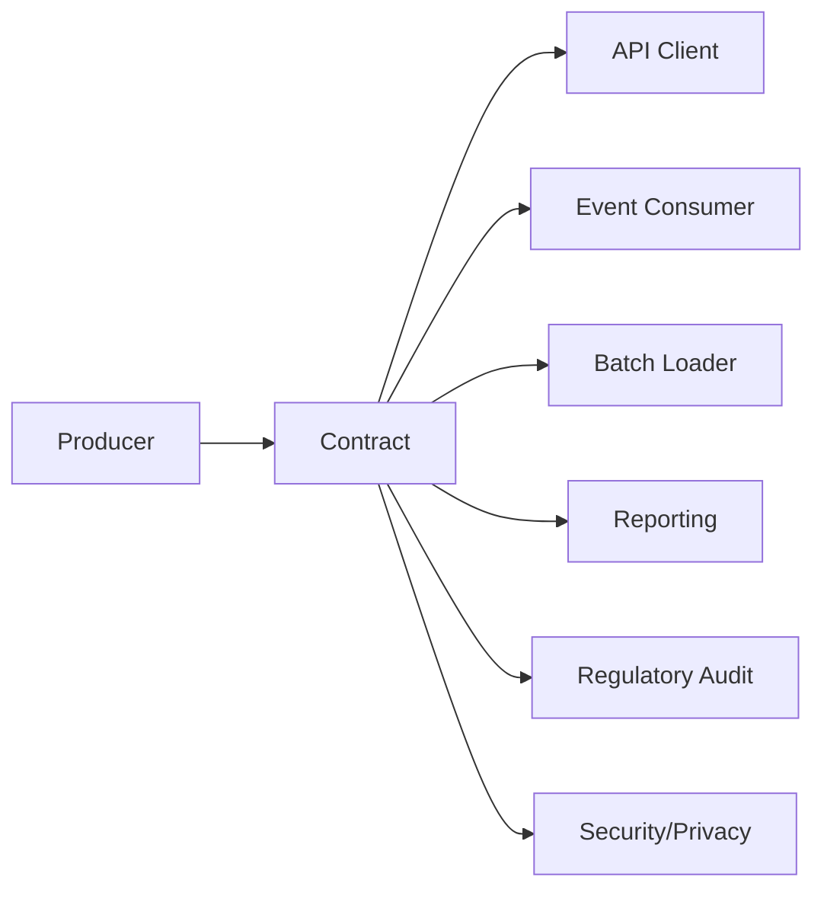
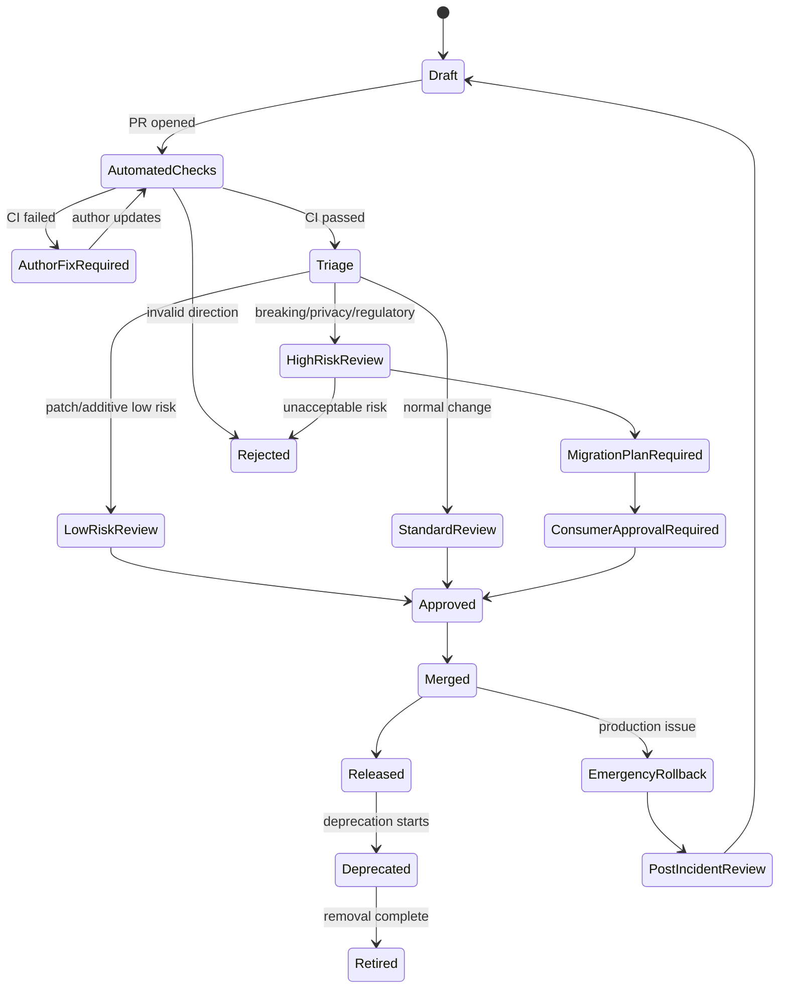
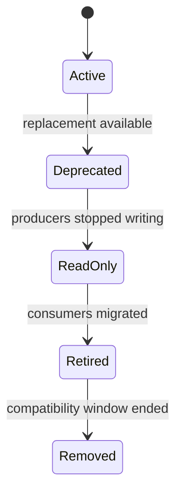
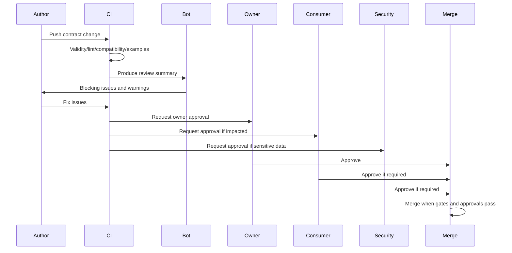

# Part 038 — Contract Review Process and Engineering Governance

> Goal: setelah bagian ini, kamu bisa mendesain review process untuk data contract yang efektif, tidak birokratis, tetapi tetap kuat untuk production, compliance, audit, dan multi-team distributed system.

Contract review bukan meeting formalitas.

Contract review adalah proses untuk menjawab:

> Apakah perubahan cara sistem berbicara ini aman, jelas, evolvable, dapat diaudit, dan dapat dioperasikan?

Jika contract CI adalah mesin filter otomatis, contract review adalah tempat manusia menilai hal yang tidak bisa diputuskan oleh mesin:

- Apakah nama field mencerminkan domain dengan benar?
- Apakah semantics berubah walau type tidak berubah?
- Apakah field baru membuka data sensitif?
- Apakah consumer punya cukup waktu migrasi?
- Apakah deprecation window realistis?
- Apakah error model cukup membantu operasi?
- Apakah perubahan ini defensible di audit/regulatory context?
- Apakah contract ini memperkuat platform atau membuat hutang lintas-service?

Governance yang buruk membuat engineer lambat.

Governance yang baik membuat engineer aman bergerak cepat.

---

## 1. Mental Model: Contract Change adalah Protocol Change

Class Java bisa diubah dan dideploy bersama service.

Contract tidak begitu.

Contract hidup di antara sistem:



Begitu contract dipublish, ia menjadi janji.

Janji ini mungkin dipakai oleh:

- service yang kamu tidak deploy,
- client yang kamu tidak tahu jadwal releasenya,
- data pipeline yang replay data lama,
- regulator yang membaca export dua tahun kemudian,
- audit system yang menyimpan evidence,
- generated code yang dikompilasi di repo lain,
- dashboard yang mengasumsikan field semantics tertentu.

Maka contract review harus melihat tiga horizon:

| Horizon | Pertanyaan |
|---|---|
| Sekarang | Apakah perubahan ini valid dan implementable? |
| Deployment window | Apakah producer/consumer bisa rollout tanpa downtime? |
| Masa depan | Apakah contract ini masih bisa berevolusi tanpa rewrite besar? |

---

## 2. Tujuan Governance: Guardrail, Bukan Gatekeeping

Governance yang sehat memiliki ciri:

- aturan jelas,
- owner jelas,
- exception jelas,
- automation kuat,
- review fokus pada risk,
- approval berdasarkan evidence,
- audit trail otomatis,
- decision record searchable,
- consumer impact terlihat.

Governance yang buruk memiliki ciri:

- semua perubahan harus meeting,
- reviewer tidak punya checklist,
- keputusan tersebar di chat,
- exception tidak tercatat,
- approval berdasarkan senioritas, bukan evidence,
- breaking change disetujui karena “urgent”,
- policy berubah tanpa versioning,
- tim tidak tahu kenapa PR ditolak.

Rule utama:

> Governance harus membuat jalur aman menjadi jalur termudah.

---

## 3. Contract Change Classes

Tidak semua perubahan butuh proses yang sama.

Klasifikasikan dulu.

| Class | Contoh | Default process |
|---|---|---|
| Patch documentation | typo, description, example comment | CI + owner approval |
| Non-breaking additive | optional field, new endpoint, new enum with unknown strategy | CI + owner approval + consumer visibility |
| Risky additive | new PII field, new event type, new public API | CI + owner + security/privacy/domain review |
| Behavioral semantic change | same field, changed meaning | architecture/domain review required |
| Breaking technical change | remove field, change type, make field required | migration playbook + consumer approval |
| Deprecation | mark field/endpoint/event as deprecated | deprecation record + timeline + consumer notification |
| Emergency change | production incident mitigation | expedited approval + retrospective evidence |
| External standard update | regulator changes code list/schema | domain + compliance + migration review |

CI can infer some classes, but not all.

Example:

```yaml
changeClassification:
  technical: non_breaking_additive
  semantic: regulatory_meaning_change
  privacy: pii_added
  operational: replay_required
```

A change can be technically backward-compatible but governance-critical.

---

## 4. Review State Machine

A production-grade contract change should have explicit states.



State machine ini penting karena review bukan hanya “approved/not approved”.

Ada kondisi antara:

- butuh migration plan,
- butuh consumer approval,
- butuh waiver,
- butuh security review,
- butuh domain clarification,
- butuh documentation update,
- butuh rollout sequencing.

---

## 5. Roles in Contract Governance

Minimal roles:

| Role | Responsibility |
|---|---|
| Contract author | Mengusulkan perubahan, menulis rationale, memperbaiki CI failure |
| Contract owner | Menjaga kualitas dan lifecycle contract |
| Producer owner | Menjamin producer bisa menghasilkan payload sesuai contract |
| Consumer owner | Menilai impact terhadap consumer yang ada |
| Domain reviewer | Memastikan semantics domain benar |
| Platform reviewer | Memastikan policy, registry, tooling, generated artifact aman |
| Security/privacy reviewer | Menilai exposure, classification, retention, masking |
| Architecture reviewer | Menilai cross-system impact dan long-term evolution |
| Release manager | Mengatur promotion, rollout, deprecation, rollback |
| Auditor/compliance observer | Tidak selalu approval, tapi butuh evidence untuk regulated system |

Jangan membuat semua role wajib untuk semua PR.

Gunakan risk-based routing.

---

## 6. Review Routing Rules

Contoh `review-routing.yaml`:

```yaml
routingVersion: 1

rules:
  - id: docs-only
    when:
      changeClass: documentation_patch
    requiredApprovals:
      - contract-owner

  - id: additive-non-sensitive
    when:
      compatibility: backward
      privacyImpact: none
      semanticImpact: none
    requiredApprovals:
      - contract-owner
    notify:
      - registered-consumers

  - id: pii-added
    when:
      privacyImpact: pii_added
    requiredApprovals:
      - contract-owner
      - security-privacy
      - domain-owner

  - id: breaking-change
    when:
      compatibility: breaking
    requiredApprovals:
      - contract-owner
      - architecture-reviewer
      - impacted-consumer-owners
    requiredArtifacts:
      - migration-playbook
      - deprecation-plan
      - rollback-plan

  - id: regulatory-code-list-change
    when:
      domainImpact: regulatory_reference_data_change
    requiredApprovals:
      - domain-owner
      - compliance-owner
      - contract-owner
```

Routing rules harus executable sebisa mungkin.

CI dapat membaca change report, catalog, privacy taxonomy, dan consumer inventory untuk menentukan reviewer.

---

## 7. Contract Proposal Template

Setiap non-trivial contract change perlu proposal singkat.

Bukan dokumen 20 halaman.

Template yang cukup:

```md
# Contract Change Proposal

## Summary
What changes?

## Motivation
Why is this needed?

## Contract IDs
- case-api
- case-created-event

## Change Classification
- Technical: additive / breaking / documentation
- Semantic: none / meaning change / regulatory change
- Privacy: none / PII added / sensitivity increased
- Operational: none / migration required / replay required

## Before
Current schema/API/event shape.

## After
Proposed schema/API/event shape.

## Compatibility Analysis
Backward/forward/full impact by format.

## Consumer Impact
Known consumers and expected action.

## Migration Plan
Expand-migrate-contract steps if needed.

## Rollback Plan
How to revert safely?

## Examples
Valid and invalid examples.

## Observability
Metrics/log fields/traces needed.

## Security and Privacy
Classification, masking, retention, auth impact.

## Alternatives Considered
Why not another design?

## Decision Needed
What exactly should reviewers approve?
```

Proposal memaksa author menjelaskan intent.

CI menjelaskan mechanics.

Reviewers menilai risk.

---

## 8. Architecture Decision Record for Contract Changes

Untuk perubahan besar, simpan ADR.

Contoh:

```md
# ADR-0142: Introduce Jurisdiction Code in Case Contracts

## Status
Accepted

## Context
Case handling differs by jurisdiction. Current contracts infer jurisdiction from office location, which is incorrect for cross-border enforcement cases.

## Decision
Add `jurisdictionCode` to:

- OpenAPI Case representation
- Avro CaseCreated event
- Protobuf CaseCommand
- JSON Schema case intake payload

The field will use ISO-like internal code list managed by reference-data service.

## Consequences
Positive:
- Reporting can group cases by legal jurisdiction.
- Escalation rules no longer infer jurisdiction indirectly.

Negative:
- Producers need mapping from intake source to jurisdiction code.
- Old events need default `UNKNOWN` during replay.

## Migration
Expand:
- Add optional/defaulted field everywhere.

Migrate:
- Producers start emitting real value.
- Consumers update read models.

Contract:
- Make value mandatory only after telemetry shows >99.9% populated for 60 days.
```

ADR bukan dekorasi. ADR adalah memory organisasi.

---

## 9. Review Checklist: Domain Semantics

Domain review menjawab:

- Apakah nama field benar?
- Apakah field ini mewakili fakta, command, status, atau derivation?
- Apakah field terlalu spesifik untuk satu consumer?
- Apakah field akan tetap benar saat proses berubah?
- Apakah ada source of truth jelas?
- Apakah cardinality benar?
- Apakah enum benar-benar closed?
- Apakah reference data lebih tepat daripada enum?
- Apakah `UNKNOWN`, `OTHER`, `NOT_APPLICABLE`, dan `UNSPECIFIED` dibedakan?
- Apakah timestamp merepresentasikan business time atau system time?
- Apakah status merepresentasikan state atau event?

Contoh buruk:

```json
{
  "status": "DONE"
}
```

Pertanyaan reviewer:

- Done apa?
- Done oleh siapa?
- Done pada state machine mana?
- Apakah terminal?
- Apakah bisa reopened?
- Apakah ini business status atau technical processing status?

Lebih baik:

```json
{
  "caseLifecycleStatus": "CLOSED",
  "closureReasonCode": "NO_VIOLATION_FOUND",
  "closedAt": "2026-07-03T10:15:30Z"
}
```

---

## 10. Review Checklist: Compatibility and Evolution

Compatibility review menjawab:

- Apakah old consumer bisa membaca new payload?
- Apakah new consumer bisa membaca old payload?
- Apakah old producer masih diterima?
- Apakah new producer akan merusak old consumer?
- Apakah generated code berubah secara breaking?
- Apakah registry compatibility mode sesuai?
- Apakah field baru punya default/optional strategy?
- Apakah enum removal dihindari?
- Apakah Protobuf tag number reserved?
- Apakah XSD namespace/versioning benar?
- Apakah OpenAPI change memengaruhi clients generated dari versi lama?
- Apakah JSON Schema constraint makin ketat?

Contoh review comment yang bagus:

> `jurisdiction` ditambahkan ke Avro event tanpa default. Ini membuat reader schema baru gagal membaca event lama. Tambahkan default `"UNKNOWN"` atau gunakan nullable union dengan default `null`, lalu jelaskan kapan field menjadi mandatory secara semantic.

Review comment yang buruk:

> Ini kayaknya breaking. Tolong cek lagi.

Review harus spesifik, evidence-based, dan actionable.

---

## 11. Review Checklist: Runtime Operations

Contract yang bagus tetap bisa gagal di operasi.

Operational review menjawab:

- Apakah invalid payload akan ditolak atau dikarantina?
- Apakah error response machine-readable?
- Apakah DLQ payload menyimpan contract version?
- Apakah replay data lama tetap bisa diproses?
- Apakah consumer bisa tolerate unknown fields?
- Apakah metrics bisa membedakan schema version?
- Apakah trace/log memuat correlation ID?
- Apakah deployment order aman?
- Apakah rollout butuh feature flag?
- Apakah rollback akan menghasilkan mixed-version data?

Contoh minimal observability field untuk event:

```json
{
  "eventId": "evt_01J...",
  "eventType": "CaseCreated",
  "eventVersion": "1.4.0",
  "schemaId": "100294",
  "occurredAt": "2026-07-03T10:15:30Z",
  "correlationId": "corr_01J...",
  "causationId": "cmd_01J..."
}
```

Review harus memastikan contract bisa di-debug saat production incident.

---

## 12. Review Checklist: Security and Privacy

Security/privacy review menjawab:

- Apakah field baru mengandung PII?
- Apakah classification ada?
- Apakah masking policy jelas?
- Apakah field boleh keluar dari boundary internal?
- Apakah example memakai synthetic data?
- Apakah contract menambah attack surface?
- Apakah XML parser aman?
- Apakah JSON Schema recursive refs bisa dipakai untuk payload bomb?
- Apakah regex rentan catastrophic backtracking?
- Apakah file upload contract membatasi media type/size?
- Apakah auth/security scheme jelas di OpenAPI?
- Apakah `additionalProperties` membuka arbitrary data exfiltration?
- Apakah Protobuf `Any` dibatasi allowlist?

Contoh review issue:

```yaml
nationalId:
  type: string
```

Reviewer harus meminta:

```yaml
nationalId:
  type: string
  x-data-classification: sensitive_pii
  x-masking: last4
  x-retention-category: regulatory-case-file
  description: Government-issued identifier used only for enforcement identity matching.
```

---

## 13. Review Checklist: Java Implementation

Java review menjawab:

- Apakah generated model dipisah dari domain model?
- Apakah mapper eksplisit?
- Apakah null/absence/default semantics dipertahankan?
- Apakah `BigDecimal` dipakai untuk money/decimal?
- Apakah `Instant`/`LocalDate` dipilih sesuai semantics?
- Apakah generated code package stable?
- Apakah generator version pinned?
- Apakah binary compatibility dijaga untuk shared artifact?
- Apakah validation error dipetakan ke error model yang stabil?
- Apakah consumer tests memakai contract artifact yang benar?

Contoh anti-pattern:

```java
// Bad: generated OpenAPI DTO leaks into domain service.
public CaseDecision decide(CreateCaseRequest request) {
    return decisionEngine.decide(request);
}
```

Better:

```java
public CaseDecision decide(CreateCaseRequest request) {
    CaseIntakeCommand command = mapper.toCommand(request);
    return decisionEngine.decide(command);
}
```

Generated DTO adalah boundary artifact.

Domain model adalah business artifact.

Jangan disatukan.

---

## 14. Consumer Impact Analysis

Consumer impact harus berbasis inventory, bukan ingatan.

Catalog example:

```yaml
contracts:
  - id: case-api
    visibility: internal
    owner: team-case-platform
    consumers:
      - id: case-portal
        owner: team-frontend
        consumption: generated-client
        criticality: high
      - id: regulatory-mobile-app
        owner: team-mobile
        consumption: manual-http
        criticality: critical

  - id: case-created-event
    owner: team-enforcement-events
    subject: case-created-value
    consumers:
      - id: case-read-model
        owner: team-query
        consumption: avro-specific-record
        criticality: high
      - id: reporting-pipeline
        owner: team-reporting
        consumption: lake-ingestion
        criticality: critical
```

Impact report:

```markdown
# Consumer Impact

Change: remove `priority` from CaseCreated event

Known Consumers:

| Consumer | Consumption Mode | Criticality | Risk | Approval |
|---|---|---:|---|---|
| case-read-model | Avro SpecificRecord | high | compile/runtime break | required |
| reporting-pipeline | lake ingestion | critical | historical query break | required |

Conclusion: breaking change. Must use deprecation + replacement field + migration window.
```

Consumer approval bukan berarti setiap consumer boleh veto selamanya.

Artinya contract owner harus tahu siapa terdampak dan rencana apa yang membuat perubahan aman.

---

## 15. Approval Matrix

Contoh matrix:

| Change type | Contract owner | Consumer owner | Domain | Security/privacy | Architecture | Compliance |
|---|---:|---:|---:|---:|---:|---:|
| Documentation only | wajib | tidak | tidak | tidak | tidak | tidak |
| Add optional non-sensitive field | wajib | notify | optional | tidak | tidak | tidak |
| Add PII field | wajib | notify | wajib | wajib | optional | optional |
| Add public endpoint | wajib | notify | wajib | wajib | optional | optional |
| Remove field | wajib | wajib | optional | optional | wajib | optional |
| Change field meaning | wajib | wajib | wajib | optional | wajib | optional |
| Regulatory code list update | wajib | notify | wajib | optional | optional | wajib |
| Emergency incident fix | wajib | after-the-fact | as needed | as needed | as needed | as needed |

Approval matrix harus dikodekan di routing policy jika memungkinkan.

---

## 16. Deprecation Policy

Deprecation bukan komentar `deprecated: true`.

Deprecation adalah lifecycle.

Minimal metadata:

```yaml
x-deprecation:
  deprecatedSince: "2026-07-03"
  replacement: "jurisdictionCode"
  reason: "officeCode did not represent legal jurisdiction for cross-border cases."
  earliestRemoval: "2027-01-03"
  owner: "team-case-platform"
  migrationGuide: "docs/migrations/office-code-to-jurisdiction-code.md"
```

State machine:



Rules:

- Do not deprecate without replacement or rationale.
- Do not remove while telemetry shows active usage.
- Do not remove from event history if replay matters.
- Do not remove enum symbols casually.
- Do not reuse removed Protobuf tag numbers.
- Do not remove public API field without migration window.

---

## 17. Exception and Waiver Process

Sometimes breaking changes are necessary.

Examples:

- legal requirement,
- security vulnerability,
- corrupted public contract,
- incorrect data exposure,
- retired beta contract,
- consumer inventory proves no active consumer,
- incident mitigation.

Exception process:

```yaml
waiver:
  id: CW-2026-014
  contractId: case-api
  ruleId: openapi-breaking-field-removal
  requestedBy: team-case-platform
  reason: "Field exposed sensitive internal risk score and must be removed."
  impact:
    knownConsumers:
      - case-portal
      - risk-dashboard
    mitigation: "Consumers already migrated to riskBand."
  approvals:
    - contract-owner
    - security-privacy
    - architecture-reviewer
  expiresOn: "2026-08-31"
  followUp:
    - "Add regression rule forbidding internalRiskScore in public APIs."
```

Waiver tanpa expiry adalah technical debt yang berpura-pura menjadi decision.

Emergency waiver harus diikuti post-review.

---

## 18. Audit Evidence Model

Untuk regulated systems, review process harus menghasilkan evidence.

Evidence minimal:

| Evidence | Purpose |
|---|---|
| PR diff | Apa yang berubah |
| CI report | Validity, lint, compatibility, generated compile |
| Review comments | Pertanyaan dan resolusi |
| Approval record | Siapa menyetujui apa |
| ADR/proposal | Mengapa perubahan dilakukan |
| Consumer impact report | Siapa terdampak |
| Migration plan | Bagaimana rollout dilakukan |
| Deprecation record | Kapan dan bagaimana field/endpoint retired |
| Registry promotion record | Schema version mana yang dipublish |
| Release artifact hash | Artifact mana yang digunakan |
| Runtime telemetry | Apakah rollout sukses |

Audit trail harus searchable berdasarkan:

- contract ID,
- version,
- field path,
- PR number,
- owner,
- date,
- change type,
- approval,
- incident ID.

Data contract yang tidak bisa dijelaskan enam bulan kemudian bukan data contract. Itu hanya file schema.

---

## 19. Review Bot Output

Review bot harus membantu manusia.

Contoh comment:

```markdown
## Contract Review Summary

Contract: case-api
Change Class: Risky Additive
Compatibility: Backward compatible with warnings
Privacy Impact: PII added
Required Reviewers:
- team-case-platform: contract owner
- security-privacy: PII field added
- domain-case: new field semantics

### Changes
- Added `nationalId` to `CreateCaseRequest`
- Added `jurisdictionCode` to `Case`
- Added `409 Conflict` response to `POST /cases`

### Blocking Issues
1. `nationalId` missing `x-data-classification`.
2. Valid example missing `jurisdictionCode`.

### Warnings
1. `jurisdictionCode` references no code list.
2. `409` response has no example.

### Suggested Actions
- Add classification and masking metadata to `nationalId`.
- Link `jurisdictionCode` to reference-data catalog.
- Add valid and invalid examples.
```

Good bot output is short, structured, and actionable.

Bad bot output dumps raw logs.

---

## 20. Governance Workflow in Pull Request

Recommended PR flow:



The PR should contain:

- contract diff,
- compatibility report,
- examples,
- generated artifact diff if committed,
- docs preview link,
- migration plan if needed,
- consumer impact,
- waiver if applicable.

---

## 21. CODEOWNERS and Ownership Boundaries

Use ownership metadata in both repo and catalog.

Example CODEOWNERS:

```text
/contracts/openapi/case-api/ @team-case-platform @api-governance
/contracts/avro/enforcement-events/ @team-enforcement-events @stream-platform
/contracts/protobuf/case-command/ @team-case-platform @grpc-platform
/contracts/xsd/legacy-intake/ @team-legacy-integration @xml-platform
/contracts/policy/ @platform-architecture @security-privacy
```

Catalog ownership:

```yaml
contracts:
  - id: case-api
    owners:
      primary: team-case-platform
      platform: api-governance
      domain: domain-case-management
    escalation:
      slack: "#case-platform"
      email: "case-platform@example.invalid"
```

Do not rely only on CODEOWNERS.

CODEOWNERS knows paths.

Catalog knows contract semantics.

---

## 22. Governance Metrics

Measure governance health.

Useful metrics:

- number of contract changes per week,
- percentage of breaking changes,
- waivers created,
- waivers expired unresolved,
- average review cycles per change class,
- CI failure categories,
- invalid examples caught,
- consumer approvals required,
- deprecated fields with active usage,
- registry promotion failures,
- contract incidents,
- undocumented fields trend,
- PII fields without classification prevented.

Dangerous metrics:

- “number of reviews completed” without quality,
- “average approval time” without risk class,
- “lines of schema changed” as productivity,
- “zero waivers” as success if teams are bypassing process.

Governance metrics should reveal risk, not punish engineers.

---

## 23. Human Review Patterns That Work

### Pattern 1: Ask for invariant

Instead of:

> Why do you need this field?

Ask:

> What invariant does this field preserve or expose?

### Pattern 2: Ask for consumer behavior

Instead of:

> Is this backward-compatible?

Ask:

> What happens if old consumer receives this payload, and what happens if new consumer reads old data?

### Pattern 3: Ask for deletion story

Instead of:

> Can we add it quickly?

Ask:

> If this field becomes wrong later, how will we deprecate or replace it?

### Pattern 4: Ask for observability

Instead of:

> Looks good.

Ask:

> How will we know if producers are sending invalid or unknown values?

### Pattern 5: Ask for examples

Instead of debating abstract schema, ask for payloads.

Examples expose hidden ambiguity.

---

## 24. Review Anti-Patterns

### Anti-pattern 1: Architecture board reviews every field

This does not scale.

Architecture review should handle high-risk patterns, not every typo.

### Anti-pattern 2: Rubber-stamp owner approval

If owner approval never catches issues, it is ceremonial.

### Anti-pattern 3: Semantic decisions in chat only

Chat is useful for discussion. Final decision belongs in PR/ADR/catalog.

### Anti-pattern 4: Consumer approval after merge

Too late. Consumer impact must be visible before merge.

### Anti-pattern 5: No expiry on deprecation

Deprecation without lifecycle becomes permanent clutter.

### Anti-pattern 6: Governance by tribal knowledge

If only one senior engineer knows the rule, the rule does not exist.

### Anti-pattern 7: Treating all breaking changes as forbidden

Some breaking changes are necessary. The process must support them safely.

---

## 25. Practical Review Example

Change proposal:

```diff
 components:
   schemas:
     Case:
       type: object
       properties:
         caseId:
           type: string
+        riskScore:
+          type: number
+          format: double
```

Poor review:

> Add description.

Better review:

> `riskScore` looks like internal decisioning data. Before exposing it in `Case`, clarify whether this is public API or internal API. If retained, add classification, precision semantics, valid range, source of truth, whether score is stable or recalculated, and whether consumers may make automated decisions from it. Consider exposing `riskBand` as controlled vocabulary instead of raw score.

This review finds the real issue: domain, privacy, and consumer misuse.

---

## 26. Regulatory Case Management Example

Suppose we add enforcement escalation data.

Bad payload:

```json
{
  "escalated": true,
  "level": "HIGH"
}
```

Review questions:

- Who escalated it?
- When?
- Why?
- Under what rule?
- Is escalation reversible?
- Is `HIGH` severity, priority, legal risk, or operational queue?
- Does this become audit evidence?
- Does this expose enforcement strategy externally?

Better contract:

```json
{
  "escalation": {
    "status": "ESCALATED",
    "escalationLevelCode": "LEGAL_REVIEW_REQUIRED",
    "escalatedAt": "2026-07-03T10:15:30Z",
    "escalatedByActorId": "usr_01J...",
    "triggeringRuleId": "rule_enforcement_014",
    "reasonCode": "REPEAT_VIOLATION_PATTERN"
  }
}
```

Governance decision:

- `escalationLevelCode` comes from reference-data catalog.
- `triggeringRuleId` is internal-only unless public transparency requires disclosure.
- `escalatedByActorId` is sensitive operational data.
- `reasonCode` must be stable enough for reporting.
- Event replay must preserve historical rule ID even if rule definition changes.

This is why schema review needs domain thinking.

---

## 27. Production Readiness Checklist

### Process

- [ ] Change classes are defined.
- [ ] Review routing is automated.
- [ ] Approval matrix exists.
- [ ] Waiver process exists.
- [ ] Deprecation lifecycle exists.
- [ ] Emergency process exists.

### Evidence

- [ ] PR includes compatibility report.
- [ ] PR includes valid and invalid examples.
- [ ] Breaking changes require migration playbook.
- [ ] Sensitive data changes require privacy review.
- [ ] ADR exists for high-impact changes.
- [ ] Consumer impact report exists.

### Ownership

- [ ] Each contract has primary owner.
- [ ] Each contract has platform/category owner when needed.
- [ ] Consumers are inventoried.
- [ ] Escalation contact exists.
- [ ] Ownership is represented in catalog and CODEOWNERS.

### Technical

- [ ] CI gates enforce validity, quality, compatibility.
- [ ] Generated Java artifacts compile.
- [ ] Registry promotion is controlled.
- [ ] Documentation preview is available.
- [ ] Runtime telemetry maps to contract version.

### Governance Health

- [ ] Metrics track waivers, breaking changes, deprecations, review cycles.
- [ ] Waivers expire.
- [ ] Deprecated fields have usage telemetry.
- [ ] Review comments are actionable.
- [ ] Policy changes are versioned.

---

## 28. Capstone Exercise

You receive this PR:

- OpenAPI `Case` removes `officeCode` and adds `jurisdictionCode`.
- Avro `CaseCreated` adds `jurisdictionCode` with default `UNKNOWN`.
- Protobuf `CaseCommand` renames `office_code = 4` to `jurisdiction_code = 4`.
- JSON Schema intake makes `jurisdictionCode` required.
- XSD legacy intake adds optional `JurisdictionCode`.

Review it.

Questions:

1. Which changes are technically breaking?
2. Which changes are semantically risky?
3. Which consumers need approval?
4. Is the Protobuf rename safe?
5. Is `UNKNOWN` acceptable as default?
6. Should `jurisdictionCode` be enum or reference data?
7. What migration phases are needed?
8. What telemetry proves readiness to make field mandatory?
9. What documentation must be updated?
10. What evidence is needed for audit?

Expected direction:

- Removing `officeCode` from OpenAPI is breaking unless deprecated first.
- Avro add with default is technically safer, but `UNKNOWN` must have domain meaning.
- Protobuf same tag with renamed field preserves binary compatibility but may break JSON mapping and generated code users.
- JSON Schema making field required is breaking for existing producers.
- XSD optional addition is generally safer but namespace/versioning still matters.
- Migration should use expand-migrate-contract.
- Consumer inventory and telemetry are mandatory before removal.

---

## 29. Final Mental Model

Governance is not the opposite of speed.

Bad governance slows everyone down.

Good governance lets teams move quickly because the dangerous paths are visible, automated, and reviewable.

A top-tier contract review process has four properties:

1. **Risk-based** — small changes stay small; dangerous changes get scrutiny.
2. **Evidence-based** — decisions use CI reports, examples, consumer impact, and migration plans.
3. **Auditable** — decisions survive memory loss, turnover, and regulatory inspection.
4. **Operational** — review includes deployment, rollback, telemetry, and replay safety.

The final test:

> Six months after a contract change, can a new engineer explain what changed, why it changed, who approved it, which systems were affected, and how production safety was proven?

If yes, you have governance.

If no, you only have approvals.

---

## References

- OpenAPI Specification 3.2.0 — interface description, Schema Object, security schemes, extensions, and deprecation fields.
- JSON Schema Draft 2020-12 — dialect, validation vocabulary, annotation/assertion model.
- Apache Avro 1.12.0 Specification — schema resolution and compatibility-relevant schema semantics.
- Protocol Buffers documentation — proto3 language guide, field numbers, reserved fields, enum guidance, and JSON mapping implications.
- Confluent Schema Registry documentation — compatibility modes and registry-controlled evolution.
- Apicurio Registry documentation — validity, compatibility, and integrity rules for artifacts.
- Buf documentation — Protobuf linting and breaking change detection workflow.
