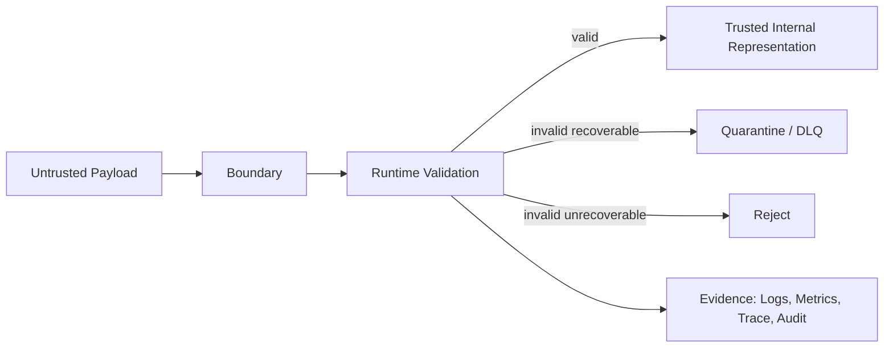
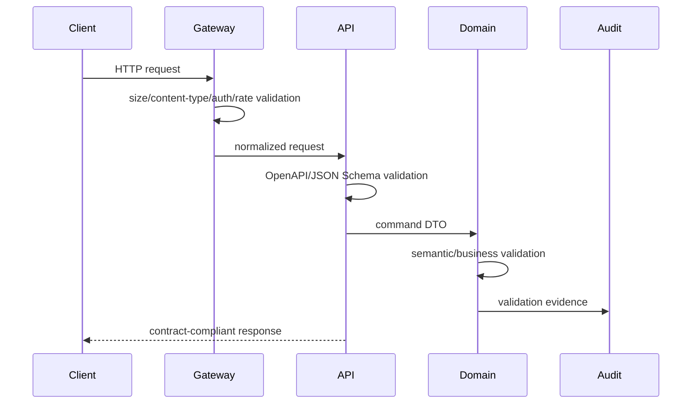
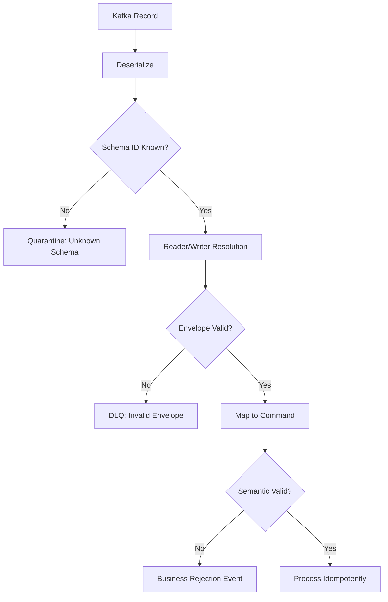
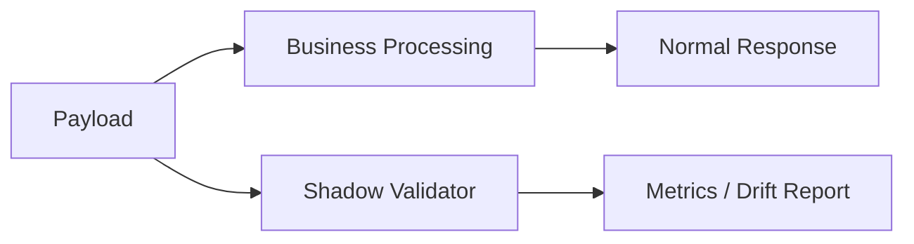
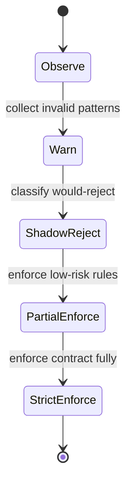
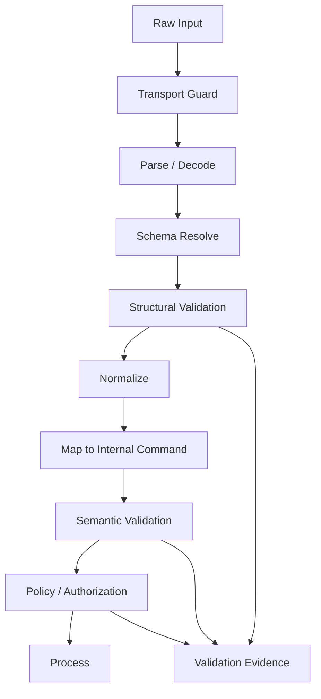
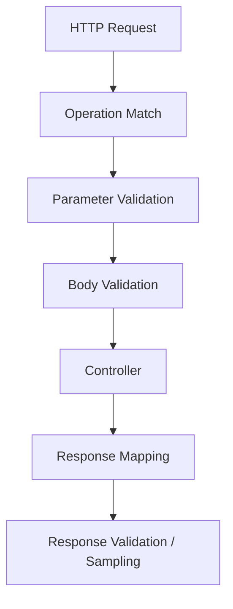
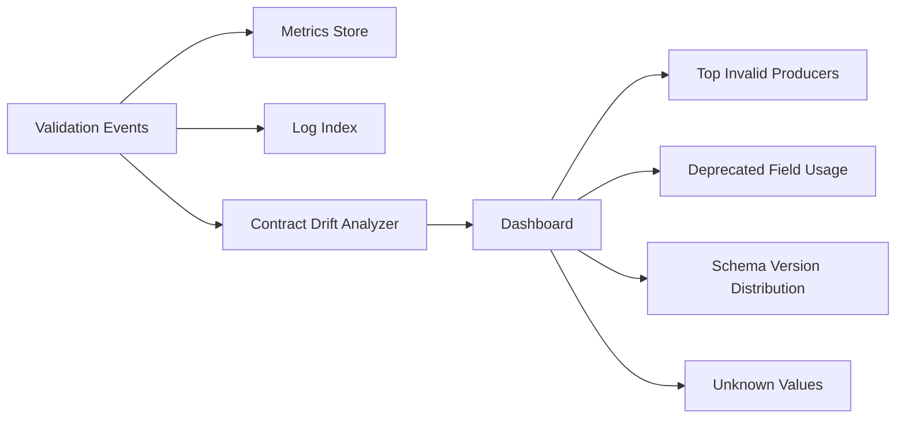
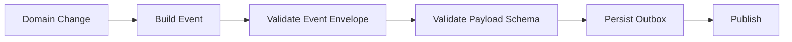
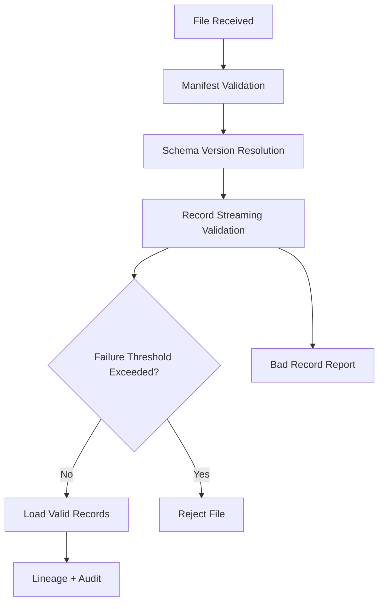

# Part 039 — Runtime Validation Patterns at System Boundaries

Runtime validation adalah titik di mana kontrak berhenti menjadi dokumen dan mulai menjadi **mekanisme pertahanan sistem**.

Pada level dasar, validasi sering dipahami sebagai “cek field required” atau “cek tipe data”. Itu terlalu dangkal. Di sistem produksi, runtime validation adalah bagian dari protokol komunikasi antar sistem. Ia menjawab pertanyaan yang lebih penting:

> Ketika data masuk atau keluar dari boundary sistem, apa yang harus dipercaya, apa yang harus dibuktikan, apa yang harus ditolak, apa yang boleh dikarantina, dan bukti apa yang harus ditinggalkan untuk operasi, audit, dan debugging?

Bagian ini membahas pola runtime validation untuk Java system yang memakai XSD, JSON Schema, Avro, Protobuf, dan OpenAPI. Fokusnya bukan hanya library, tetapi **placement, failure mode, observability, performance, security, dan operating model**.

---

## 1. Core Mental Model

Runtime validation adalah enforcement dari kontrak pada boundary.

Kontrak mendefinisikan shape dan sebagian invariant data. Runtime validation memutuskan apakah payload konkret boleh melewati boundary tertentu.



Boundary adalah lokasi di mana asumsi berubah. Sebelum boundary, payload tidak dipercaya. Setelah boundary, sistem boleh membuat asumsi terbatas bahwa data memenuhi kontrak struktural yang telah disepakati.

Hal penting: validasi tidak membuat data “benar secara bisnis”. Validasi hanya membuktikan bahwa data cukup sesuai untuk diproses oleh tahap berikutnya.

---

## 2. Validation Is Not One Thing

Di sistem enterprise, validasi punya beberapa lapisan. Jangan campur semuanya ke satu schema.

| Layer | Pertanyaan | Contoh | Tempat yang Cocok |
|---|---|---|---|
| Syntactic validation | Payload bisa diparse? | JSON valid, XML well-formed, Avro binary readable | Parser/deserializer |
| Structural validation | Shape sesuai contract? | required field, type, enum, object shape | XSD/JSON Schema/OpenAPI/Avro/Protobuf |
| Semantic validation | Meaning valid? | `endDate >= startDate`, amount non-negative | Application service/domain service |
| Referential validation | Referensi ada dan aktif? | `customerId` exists, violation code active | Service/database/reference-data lookup |
| Authorization validation | Caller boleh melakukan ini? | user can update case | Security/policy layer |
| Temporal validation | Valid pada waktu tertentu? | code list effective at event time | Domain policy engine |
| Operational validation | Aman diproses sekarang? | payload size, rate, schema version enabled | Gateway/consumer guard |

Kesalahan yang sering terjadi: semua aturan bisnis dimasukkan ke schema. Akibatnya schema menjadi rapuh, sulit berevolusi, dan tidak bisa menjelaskan dependensi eksternal seperti database, authorization, atau reference data yang effective-dated.

Rule of thumb:

> Schema should validate shape and local invariants. Application policy validates meaning, authority, and timing.

---

## 3. Boundary Taxonomy

Runtime validation harus ditempatkan berdasarkan boundary, bukan berdasarkan teknologi.

### 3.1 Public HTTP API Boundary

Public API menerima input dari caller yang tidak sepenuhnya dipercaya. Validasi minimal:

- request body sesuai OpenAPI/JSON Schema
- parameter path/query/header valid
- content type sesuai
- payload size limit
- authentication dan authorization
- idempotency key jika operasi retryable
- error response sesuai contract
- response validation minimal untuk mencegah provider drift



### 3.2 Internal Synchronous API Boundary

Internal API sering dianggap trusted. Ini asumsi berbahaya. Internal caller juga bisa salah versi, salah deploy, atau membawa data korup dari upstream.

Bedanya, internal API bisa memakai policy yang lebih murah:

- strict ingress validation pada endpoint penting
- response validation sampling
- validation relaxed pada high-throughput path tertentu
- compatibility telemetry untuk drift detection

### 3.3 Message/Event Consumer Boundary

Event consumer tidak mengontrol kapan payload dikirim. Ia menerima data lama saat replay, data baru dari producer yang berevolusi, dan kadang data korup dari poison message.

Validasi minimal:

- deserialization berdasarkan schema ID atau schema version
- compatibility terhadap reader schema
- envelope validation
- idempotency/deduplication key
- event time sanity
- DLQ/quarantine policy
- replay-safe handling



### 3.4 File/Batch Ingestion Boundary

Batch contract berbeda dari API contract. Satu file bisa berisi ribuan sampai jutaan record. Validasi harus menghindari pola all-or-nothing yang merusak operasi.

Validasi minimal:

- manifest validation
- file naming/version validation
- schema validation per row/record
- checksum dan record count
- reject threshold
- bad-record sample
- quarantine partition
- lineage metadata

### 3.5 External Provider Boundary

Ketika sistem memanggil provider eksternal, response provider juga harus divalidasi. Banyak incident terjadi bukan karena request kita salah, tetapi karena provider berubah diam-diam.

Pola yang sehat:

- validate critical response fields
- tolerate unknown fields
- reject impossible values
- record provider contract drift
- fallback berdasarkan domain policy
- jangan langsung map response external ke domain entity

### 3.6 Database Boundary

Database constraint adalah runtime validation juga. Ia bukan pengganti contract validation, tetapi defense layer tambahan.

Contoh:

- NOT NULL untuk invariant storage
- CHECK constraint untuk invariant lokal
- foreign key untuk referential integrity
- unique constraint untuk idempotency/business key
- JSONB check/validation untuk semi-structured storage jika diperlukan

Namun jangan jadikan database sebagai satu-satunya validator untuk API/event. Error database biasanya terlalu terlambat, terlalu teknis, dan tidak cukup informatif untuk consumer.

---

## 4. Validation Placement Pattern

### 4.1 Validate at Ingress

Ingress validation mencegah data buruk masuk ke sistem.

Gunakan untuk:

- public API
- command endpoint
- external callback
- event consumer
- batch import
- UI-submitted command

Keuntungan:

- fail early
- error dekat dengan sumber masalah
- mengurangi data corruption
- memudahkan audit

Risiko:

- latency bertambah
- validasi terlalu strict bisa memblokir evolution
- duplicate validation jika boundary bertingkat

### 4.2 Validate at Egress

Egress validation mencegah sistem mengirim response/event yang melanggar kontrak.

Gunakan untuk:

- public API response
- event producer
- external provider request
- regulatory report export
- generated file

Keuntungan:

- mencegah provider drift
- menangkap mapping bug
- melindungi consumer

Risiko:

- jika dilakukan penuh di hot path, latency bisa naik
- jika response invalid setelah side effect terjadi, rollback bisa sulit
- harus jelas apakah invalid egress berarti 500, quarantine, atau stop publish

### 4.3 Validate at Persistence Boundary

Persistence validation menjaga storage invariant.

Gunakan untuk:

- database constraint
- event store append validation
- outbox table contract validation
- document store schema validation

Keuntungan:

- defense in depth
- mencegah corrupt state permanen
- memastikan invariant tetap hidup meskipun bug melewati service layer

Risiko:

- error sering rendah kualitasnya
- terlalu banyak logic di DB membuat deployment schema sulit
- schema database tidak selalu sama dengan transport contract

### 4.4 Validate in Shadow Mode

Shadow validation menjalankan validator tanpa memblokir traffic.

Gunakan saat:

- memperkenalkan validator baru ke sistem lama
- menaikkan strictness
- migrasi schema
- memvalidasi egress sebelum enforcement
- mengukur blast radius



Shadow mode bagus untuk transisi, tetapi jangan berhenti di sana selamanya. Shadow validation tanpa enforcement bisa berubah menjadi noise generator.

### 4.5 Validate by Sampling

Sampling cocok untuk egress response atau high-throughput internal event stream.

Gunakan saat:

- validation cost tinggi
- payload besar
- traffic sangat besar
- kontrak relatif stabil
- sudah ada ingress validation yang kuat

Sampling harus didesain dengan jelas:

- sample rate per endpoint/topic/schema version
- always validate new version
- always validate high-risk operation
- always validate after deploy
- increase sample when error rate rises

### 4.6 Progressive Hardening

Jangan langsung mengubah validator dari permissive menjadi strict pada sistem lama.

Tahapan sehat:



Progressive hardening membuat kontrak menjadi alat modernisasi, bukan bom waktu.

---

## 5. Reject, Quarantine, or Accept-With-Warning

Tidak semua payload invalid harus diperlakukan sama.

| Strategy | Kapan Dipakai | Efek |
|---|---|---|
| Reject | Caller bisa memperbaiki dan retry | Public API request invalid |
| Quarantine | Payload perlu investigasi/replay | Event/file invalid |
| DLQ | Consumer gagal memproses message | Poison event |
| Accept-with-warning | Data masih aman diproses tapi ada drift | Unknown optional field, deprecated field |
| Business rejection | Shape valid tapi policy menolak | Case action tidak boleh dilakukan |
| Normalize | Perbedaan representasi bisa diperbaiki deterministik | trim whitespace, casing normalization |

Kesalahan desain umum: semua error validasi dikembalikan sebagai `400 Bad Request`. Itu masuk akal untuk HTTP request, tetapi buruk untuk event stream, batch ingestion, dan external provider response.

---

## 6. Validation Pipeline Architecture

Runtime validation sebaiknya punya pipeline eksplisit.



### 6.1 Transport Guard

Transport guard adalah validasi murah sebelum parsing.

Contoh:

- max body size
- content type allowlist
- charset allowlist
- compression bomb guard
- header sanity
- rate limit
- authentication presence

Tujuannya mencegah parser dipakai sebagai attack surface.

### 6.2 Parser/Decoder

Parser membuktikan payload bisa dibaca.

- JSON: valid JSON
- XML: well-formed XML dengan secure parser config
- Avro: binary decode dengan writer schema
- Protobuf: parse binary message
- OpenAPI: parse request parameters/body sesuai media type

Parser error berbeda dari validation error. Parser error berarti payload tidak bisa masuk ke level contract validation.

### 6.3 Schema Resolution

Schema resolution menentukan kontrak mana yang dipakai untuk validasi.

Sumber resolusi:

- explicit schema version header
- schema ID dari registry
- content type media parameter
- endpoint operation ID
- topic + subject naming strategy
- file manifest
- namespace/package name

Anti-pattern:

- menentukan schema hanya dari filename tanpa manifest
- memakai latest schema untuk semua historical event
- auto-register schema dari runtime production consumer
- fallback diam-diam ke schema permissive

### 6.4 Structural Validation

Structural validation membuktikan payload sesuai schema.

Contoh:

- JSON Schema validator
- XSD validator
- OpenAPI request validator
- Avro reader/writer resolution
- Protobuf parser + custom generated validation

### 6.5 Normalization

Normalization mengubah representasi tanpa mengubah meaning.

Contoh:

- trim whitespace untuk field tertentu
- canonicalize currency code uppercase
- normalize timezone representation
- parse decimal string ke `BigDecimal`
- map legacy code alias ke canonical code

Normalization harus deterministic dan tercatat. Jangan sembunyikan perubahan meaning sebagai normalization.

### 6.6 Mapping to Internal Model

Generated transport model tidak boleh langsung menjadi domain model.

```java
public final class CaseIntakeMapper {
    public RegisterCaseCommand toCommand(CaseIntakeRequest request) {
        return new RegisterCaseCommand(
            new ExternalCaseId(request.caseId()),
            PartyMapper.toParty(request.reportedParty()),
            ViolationMapper.toViolation(request.allegedViolation()),
            request.receivedAt()
        );
    }
}
```

Mapper adalah tempat boundary berubah: dari untrusted/transport representation menjadi internal command.

### 6.7 Semantic and Policy Validation

Semantic validation harus eksplisit.

```java
public interface CommandValidator<T> {
    ValidationResult validate(T command, ValidationContext context);
}
```

Contoh rule:

- case received date cannot be in the future
- alleged violation code must be active at received date
- enforcement action must be allowed for current case state
- sanction amount must be within legal limit
- caller must have jurisdiction

Schema tidak cukup untuk aturan seperti ini.

---

## 7. Java Runtime Validation Building Blocks

### 7.1 Common Validation Result Model

Jangan biarkan setiap validator mengembalikan error shape berbeda.

```java
public record ValidationIssue(
    String code,
    String path,
    String message,
    Severity severity,
    String contractId,
    String contractVersion,
    Map<String, Object> attributes
) {}

public record ValidationResult(
    boolean valid,
    List<ValidationIssue> issues
) {
    public static ValidationResult ok() {
        return new ValidationResult(true, List.of());
    }
}
```

Field penting:

- `code`: machine-readable error code
- `path`: JSON Pointer/XPath/field path
- `contractId`: kontrak yang dipakai
- `contractVersion`: versi kontrak
- `severity`: error/warning/info
- `attributes`: metadata tambahan, bukan message parsing

### 7.2 Boundary Validator Interface

```java
public interface BoundaryValidator<I> {
    ValidationResult validate(I input, BoundaryValidationContext context);
}

public record BoundaryValidationContext(
    String boundaryName,
    String operation,
    String producer,
    String consumer,
    String correlationId,
    Instant receivedAt,
    EnforcementMode enforcementMode
) {}

public enum EnforcementMode {
    OFF,
    SHADOW,
    WARN,
    ENFORCE
}
```

Interface seperti ini membuat validator bisa dipakai lintas HTTP, event, batch, dan external provider integration.

### 7.3 Contract Resolver

```java
public interface ContractResolver {
    ResolvedContract resolve(ContractLookup lookup);
}

public record ContractLookup(
    String boundary,
    String operation,
    Optional<String> schemaId,
    Optional<String> schemaVersion,
    Optional<String> contentType
) {}

public record ResolvedContract(
    String id,
    String version,
    ContractFormat format,
    Object compiledSchema
) {}
```

Kontrak harus di-resolve deterministik. Jika schema tidak ditemukan, itu error operasional, bukan alasan memakai latest schema sembarangan.

### 7.4 Validation Policy

Validator harus dipisahkan dari policy enforcement.

```java
public interface ValidationPolicy {
    ValidationDecision decide(ValidationResult result, BoundaryValidationContext context);
}

public sealed interface ValidationDecision {
    record Accept() implements ValidationDecision {}
    record AcceptWithWarning(List<ValidationIssue> issues) implements ValidationDecision {}
    record Reject(List<ValidationIssue> issues) implements ValidationDecision {}
    record Quarantine(List<ValidationIssue> issues) implements ValidationDecision {}
}
```

Dengan pola ini, schema yang sama bisa dipakai dalam mode berbeda:

- local developer: enforce
- staging: enforce + verbose
- production initial rollout: shadow
- production stable: enforce
- emergency: warn only untuk subset rule tertentu

---

## 8. Format-Specific Runtime Patterns

## 8.1 XSD Runtime Validation

XSD paling kuat untuk XML document contracts, terutama enterprise/legacy/regulatory integration.

Runtime pattern:

1. secure XML parser config
2. XSD schema compiled once
3. validate raw XML before binding
4. bind to generated class or domain DTO
5. map validation errors to stable error code

### Secure XML Baseline

XML parser harus diasumsikan berbahaya jika menerima input eksternal.

Guard:

- disable DTD
- disable external entity
- disable external schema loading kecuali allowlisted
- set entity expansion limit
- set max payload size
- avoid unbounded DOM for huge document

```java
SAXParserFactory factory = SAXParserFactory.newInstance();
factory.setNamespaceAware(true);
factory.setFeature("http://apache.org/xml/features/disallow-doctype-decl", true);
factory.setFeature("http://xml.org/sax/features/external-general-entities", false);
factory.setFeature("http://xml.org/sax/features/external-parameter-entities", false);
```

### XSD Runtime Anti-Patterns

- compile `SchemaFactory` schema on every request
- validate after JAXB binding only
- allow external entity resolution from internet
- treat all XSD errors as generic `Invalid XML`
- use namespace wildcard without governance
- mix schema validation and business validation inside parser handler

---

## 8.2 JSON Schema Runtime Validation

JSON Schema cocok untuk JSON payload, event payload, configuration, dan semi-structured contracts.

Runtime pattern:

1. parse JSON safely
2. resolve schema by `$id` or boundary operation
3. compile/cache validator
4. validate structural constraints
5. map validation errors to stable API/problem format
6. run semantic validation separately

### Important Runtime Details

Draft 2020-12 membawa model vocabulary/dialect. Artinya validator harus tahu dialect schema yang dipakai. Jangan campur Draft-07, 2019-09, dan 2020-12 tanpa resolver yang jelas.

Design guard:

- every production schema must declare `$schema`
- every published schema must have stable `$id`
- no network fetch during request validation
- external refs must be resolved from local artifact/cache
- recursive/dynamic refs must be reviewed for performance
- regex patterns must be tested for catastrophic backtracking

### Error Mapping

Schema validator sering mengembalikan error teknis seperti:

```text
$.reportedParty.birthDate: string [2024-99-01] does not match format date
```

API sebaiknya mengembalikan stable error:

```json
{
  "type": "https://errors.example.com/contract-validation",
  "title": "Request does not match contract",
  "status": 400,
  "detail": "One or more fields are invalid.",
  "errors": [
    {
      "code": "FIELD_FORMAT_INVALID",
      "path": "/reportedParty/birthDate",
      "expected": "date",
      "contract": "case-intake-request@1.4.0"
    }
  ]
}
```

Jangan expose raw validator internals sebagai public contract.

---

## 8.3 OpenAPI Runtime Validation

OpenAPI validation lebih dari body JSON Schema. Ia mencakup:

- path parameter
- query parameter
- header
- cookie
- request body
- response body
- content type
- status code
- security requirement documentation

Runtime pattern:



### Operation Matching Is Validation

Sebelum body divalidasi, request harus cocok dengan operation:

- method
- path template
- path parameter extraction
- content type
- accept negotiation

Jika operation matching salah, validasi body bisa menyesatkan.

### Response Validation

Response validation penting untuk provider drift.

Namun ada mode:

| Mode | Use Case |
|---|---|
| Full response validation | staging, canary, low-volume critical API |
| Sampling | high-volume production API |
| Shadow response validation | rollout awal |
| Contract tests only | hot path sangat sensitif |

Jangan validasi response setelah streaming body besar selesai tanpa desain backpressure.

---

## 8.4 Avro Runtime Validation

Avro validation sering terjadi melalui deserialization dan reader/writer schema resolution.

Runtime pattern untuk event consumer:

1. read schema ID from payload/header
2. fetch writer schema from registry/cache
3. use reader schema from consumer application
4. perform schema resolution
5. decode to SpecificRecord/GenericRecord
6. validate envelope and semantic fields
7. process idempotently

### What Avro Automatically Validates

Avro decode membuktikan:

- binary payload cocok dengan writer schema
- reader schema bisa resolve terhadap writer schema
- required reader fields punya default atau ada di writer
- union branch bisa dipilih
- enum symbol bisa di-resolve jika kompatibel

### What Avro Does Not Solve

Avro tidak otomatis membuktikan:

- business meaning valid
- event ordering valid
- reference data active
- idempotency benar
- amount dalam legal range
- event bukan duplicate
- topic benar untuk aggregate type

### Avro Runtime Anti-Patterns

- assume schema registry compatibility means business compatibility
- use latest schema to decode all historical records
- ignore schema ID metrics
- put domain validation in deserializer
- publish event before validating generated payload
- accept GenericRecord deep in domain layer

---

## 8.5 Protobuf Runtime Validation

Protobuf parser memastikan payload bisa dibaca sebagai message type tertentu. Tetapi banyak constraint tidak ada di `.proto`.

Runtime pattern:

1. parse binary message
2. inspect field presence when needed
3. preserve unknown fields if forwarding
4. validate required-by-business fields manually
5. validate enum unknown/unrecognized behavior
6. map to internal command

### Protobuf Presence Trap

Proto3 default values bisa membuat absence tidak terlihat untuk scalar field tanpa explicit presence.

Contoh masalah:

- `amount = 0` bisa berarti absent atau benar-benar zero
- `status = UNKNOWN` bisa berarti default, unsupported value, atau value sengaja unknown
- empty string bisa berarti absent, redacted, atau invalid

Karena itu, runtime validation harus memahami presence strategy dari schema design.

### Protobuf Unknown Fields

Unknown fields membantu forward compatibility dalam binary Protobuf. Tetapi jika payload diubah ke ProtoJSON, unknown fields bisa hilang atau gagal diparse tergantung mapping/tooling.

Pola aman:

- binary Protobuf untuk internal/gRPC/event jika butuh forward compatibility
- ProtoJSON hanya untuk integration yang sadar akan risiko mapping
- jangan gunakan JSON gateway sebagai satu-satunya compatibility path

---

## 9. Enforcement Mode Matrix

Setiap boundary harus punya enforcement mode yang eksplisit.

| Boundary | Default Mode | Catatan |
|---|---|---|
| Public command API ingress | ENFORCE | Reject invalid request |
| Public query API ingress | ENFORCE | Mostly parameter validation |
| Public API response | SAMPLE/SHADOW then ENFORCE | Hindari latency tinggi |
| Internal API ingress | ENFORCE for critical, WARN for legacy | Berdasarkan maturity |
| Event producer egress | ENFORCE | Jangan publish invalid event |
| Event consumer ingress | ENFORCE + DLQ | Jangan crash-loop terus-menerus |
| Batch import | ENFORCE with threshold/quarantine | Per-record report |
| External provider response | WARN/QUARANTINE/FALLBACK | Tergantung criticality |
| Database write | ENFORCE | Constraint/invariant |

---

## 10. Validation Error Taxonomy

Tanpa taxonomy, error validation menjadi noise.

| Code | Meaning | Example |
|---|---|---|
| `PAYLOAD_PARSE_ERROR` | Tidak bisa diparse | malformed JSON/XML |
| `CONTRACT_NOT_FOUND` | Schema tidak ditemukan | unknown schema ID |
| `CONTRACT_VERSION_DISABLED` | Version belum boleh dipakai | deprecated schema |
| `REQUIRED_FIELD_MISSING` | Field required tidak ada | `/caseId` missing |
| `FIELD_TYPE_INVALID` | Tipe salah | amount string instead of number |
| `FIELD_FORMAT_INVALID` | Format salah | invalid date |
| `ENUM_VALUE_UNSUPPORTED` | Value tidak dikenal | sanction type unknown |
| `CONSTRAINT_VIOLATED` | Rule lokal dilanggar | min/max/pattern |
| `SEMANTIC_RULE_FAILED` | Meaning tidak valid | end before start |
| `REFERENCE_NOT_FOUND` | Reference invalid | violation code inactive |
| `AUTHORIZATION_RULE_FAILED` | Caller tidak berhak | wrong jurisdiction |
| `CONTRACT_DRIFT_DETECTED` | Provider berbeda dari expected | response missing field |

Error code harus stabil. Message boleh berubah, code jangan gampang berubah.

---

## 11. Observability for Runtime Validation

Runtime validation tanpa observability hanya menjadi exception generator.

### 11.1 Metrics

Minimal metrics:

- validation attempts by boundary/operation/schema version
- validation failures by error code
- rejected payload count
- quarantined payload count
- shadow validation failures
- schema version distribution
- unknown field rate
- deprecated field usage
- response validation failure rate
- validation latency percentile
- schema resolver cache hit ratio

### 11.2 Logs

Log harus menyimpan evidence tanpa membocorkan sensitive data.

Log fields:

- correlation ID
- boundary name
- operation/topic/file
- contract ID/version
- producer/consumer
- error code
- sanitized path
- payload hash
- enforcement mode
- decision

Jangan log full payload PII kecuali policy mengizinkan dan storage aman.

### 11.3 Traces

Tambahkan span/event:

- `contract.resolve`
- `contract.validate`
- `contract.enforce`
- `contract.quarantine`

Trace berguna untuk menjawab: latency naik karena validation, schema registry, parser, atau semantic lookup?

### 11.4 Drift Dashboard

Dashboard yang berguna:



---

## 12. Security Failure Modes

Runtime validation bisa menjadi security control, tetapi validator juga bisa menjadi attack surface.

### 12.1 Payload Size and Shape Attack

Attack:

- huge JSON body
- deeply nested object
- giant arrays
- XML entity expansion
- compression bomb
- repeated Protobuf fields sangat besar

Defense:

- request body limit
- parser depth limit
- array item limit in schema
- max string length
- max file size
- streaming parser for large batch
- reject compressed payload above ratio threshold

### 12.2 Reference Resolution Attack

Attack:

- schema `$ref` ke remote URL
- XML external schema fetch
- recursive/dynamic refs dengan biaya tinggi
- schema registry dependency outage

Defense:

- no network fetch in request path
- local schema catalog
- registry cache
- allowlist resolver
- precompile schema
- deployment-time resolution check

### 12.3 Regex and Pattern Attack

Schema pattern bisa memicu catastrophic backtracking.

Defense:

- lint regex
- benchmark regex with adversarial input
- prefer simple anchored patterns
- avoid nested quantifiers
- timeout validation if library supports it

### 12.4 Unknown Field Abuse

Unknown fields kadang dipakai untuk menyelundupkan data.

Policy harus jelas:

- public API: often closed object for command payload
- internal event: allow unknown for compatibility but do not persist blindly
- extension object: allow only namespaced keys
- audit: record unknown field rate

---

## 13. Performance Engineering

Validation yang benar tapi terlalu mahal akan dimatikan saat incident. Maka desain performance sejak awal.

### 13.1 Cache Compiled Schemas

Schema compilation mahal. Compile once, reuse many.

```java
public final class CompiledContractCache {
    private final ConcurrentHashMap<ContractKey, ResolvedContract> cache = new ConcurrentHashMap<>();

    public ResolvedContract getOrLoad(ContractKey key) {
        return cache.computeIfAbsent(key, this::loadAndCompile);
    }
}
```

Perhatikan thread-safety library validator. Tidak semua validator object aman dipakai bersama.

### 13.2 Avoid Double Parsing

Anti-pattern:

1. parse JSON untuk validation
2. parse JSON lagi untuk controller DTO
3. parse lagi untuk logging

Lebih baik:

- parse once to tree/node if acceptable
- validate parsed representation
- bind/map from same representation
- log hash/sanitized subset

### 13.3 Validate Close to Payload

Validasi setelah payload menjadi domain object bisa kehilangan informasi:

- unknown field hilang
- absence berubah menjadi default
- enum unknown berubah jadi null
- order/duplicate fields hilang

Validasi struktural sebaiknya dilakukan sebelum mapping agresif.

### 13.4 Hot Path Strategy

Untuk high-throughput path:

- ingress validation enforce
- egress validation sample
- schema cache warmup
- no network dependency in validation path
- pre-generated serializers
- bounded error collection
- avoid collect-all untuk payload sangat besar

### 13.5 Benchmark Validation

Benchmark minimal:

- small valid payload
- large valid payload
- invalid early payload
- invalid late payload
- deeply nested payload
- many errors payload
- schema with `$ref`/composition
- cold cache vs warm cache

---

## 14. Runtime Validation in Event-Driven Systems

Event-driven validation punya tantangan unik.

### 14.1 Producer-Side Validation

Producer harus memvalidasi event sebelum publish.

Jika event invalid sudah masuk Kafka, kesalahan menyebar ke banyak consumer dan replay.

Producer egress guard:



### 14.2 Consumer-Side Validation

Consumer tetap harus validasi karena producer bisa salah, schema bisa berubah, replay bisa membawa historical data.

Consumer decision:

| Failure | Decision |
|---|---|
| Unknown schema ID | quarantine |
| Schema incompatible | quarantine + alert |
| Envelope invalid | DLQ |
| Duplicate event | ignore/idempotent success |
| Business state conflict | retry or business rejection |
| Reference temporarily unavailable | retry/backoff |
| Permanent semantic invalid | rejection event/quarantine |

### 14.3 DLQ Is Not a Trash Can

DLQ harus punya contract juga.

DLQ record minimal:

- original topic/partition/offset
- original key
- original headers
- payload hash
- error code
- validator version
- contract ID/version
- failure timestamp
- retry count
- sanitized diagnostic

DLQ tanpa metadata membuat replay sulit dan audit lemah.

---

## 15. Runtime Validation for Batch/File Contracts

Batch ingestion membutuhkan strategi granular.



### 15.1 Threshold Policy

Contoh:

- reject file if manifest invalid
- reject file if schema version unsupported
- reject file if checksum mismatch
- allow up to 0.1% bad records for non-critical optional feed
- reject on first bad record for regulatory submission

Threshold adalah business/operational policy, bukan schema policy.

### 15.2 Bad Record Report

Report harus machine-readable:

```json
{
  "fileId": "CASE_INTAKE_2026_07_03_001",
  "contract": "case-intake-batch@2.1.0",
  "validRecordCount": 9987,
  "invalidRecordCount": 13,
  "errors": [
    {
      "line": 421,
      "recordId": "R-421",
      "code": "FIELD_FORMAT_INVALID",
      "path": "/receivedDate"
    }
  ]
}
```

---

## 16. Contract Drift Detection

Drift terjadi ketika runtime payload berbeda dari contract yang diasumsikan.

Jenis drift:

- producer sends undocumented field
- provider omits documented field
- enum value appears before contract update
- field format changes silently
- schema version distribution berubah mendadak
- deprecated field masih dipakai
- consumer relies on field not guaranteed

Drift detection memakai kombinasi:

- ingress validation warning
- egress validation sampling
- schema version telemetry
- unknown field telemetry
- contract test failure
- runtime payload profiling

---

## 17. Regulatory Case Management Example

Bayangkan endpoint:

```http
POST /cases/intake
Content-Type: application/json
Idempotency-Key: 018fc7d5-5dc2-7ca2-9c55-7a1788e68f2f
```

Payload:

```json
{
  "externalReportId": "REP-2026-000981",
  "receivedAt": "2026-07-03T09:15:00+07:00",
  "reportedParty": {
    "partyType": "LEGAL_ENTITY",
    "registrationNumber": "ID-998812"
  },
  "allegedViolation": {
    "code": "AML_REPORTING_DELAY",
    "occurredOn": "2026-06-30"
  }
}
```

Runtime validation layers:

1. transport guard: body size, content type, auth
2. OpenAPI operation match: `POST /cases/intake`
3. JSON Schema structural validation
4. idempotency key format validation
5. mapping to `RegisterCaseCommand`
6. semantic validation: `receivedAt` not future
7. reference validation: violation code active on `occurredOn`
8. authorization: caller jurisdiction covers reported party
9. state/action validation: duplicate report handling
10. audit evidence persisted

Invalid scenarios:

| Scenario | Layer | Decision |
|---|---|---|
| malformed JSON | parser | reject 400 |
| missing `externalReportId` | schema | reject 400 |
| future `receivedAt` | semantic | reject 422 or business error |
| inactive violation code | reference policy | reject/hold depending regulation |
| unauthorized jurisdiction | authorization | reject 403 |
| duplicate idempotency key same payload | idempotency | return previous result |
| duplicate idempotency key different payload | idempotency | reject conflict |

---

## 18. Anti-Patterns

### 18.1 Validation Only in Controller Annotation

Annotations are useful, but insufficient for contract engineering. They do not cover schema versioning, event stream, registry, drift, egress validation, or multi-format compatibility.

### 18.2 Treating Generated Model as Trusted Domain Model

Generated model is transport representation. It may encode nullability/defaults incorrectly for domain semantics.

### 18.3 Latest Schema Validation

Validating historical events with latest schema can break replay and hide actual compatibility problems.

### 18.4 Schema Registry as Runtime Crutch

Registry should not be a blocking dependency for every message if cache can avoid it. Production consumers need cache, fallback, and clear outage behavior.

### 18.5 Validation Without Error Taxonomy

Human-readable messages alone are not enough. Operations need stable codes and metrics.

### 18.6 DLQ Without Replay Plan

If invalid events cannot be diagnosed, fixed, and replayed, DLQ becomes a silent data-loss mechanism.

---

## 19. Production Readiness Checklist

### Contract Resolution

- [ ] Every boundary has deterministic contract resolution.
- [ ] No network schema fetch happens inside request path unless explicitly approved.
- [ ] Schema cache warmup exists for critical contracts.
- [ ] Unknown schema version behavior is defined.

### Enforcement Policy

- [ ] Boundary has enforcement mode: off/shadow/warn/enforce.
- [ ] Reject/quarantine/DLQ decision is documented.
- [ ] Progressive hardening plan exists for legacy boundary.
- [ ] Emergency relaxation requires audit trail.

### Error Model

- [ ] Stable machine-readable error codes exist.
- [ ] Error path uses consistent notation.
- [ ] Public errors do not leak sensitive internals.
- [ ] Validation evidence includes contract ID/version.

### Observability

- [ ] Validation metrics by boundary/operation/schema version.
- [ ] Shadow validation failures visible.
- [ ] Deprecated field usage tracked.
- [ ] Unknown field/value rate tracked.
- [ ] Validation latency measured.

### Security

- [ ] Payload size/depth limits configured.
- [ ] XML parser hardened.
- [ ] Remote schema resolution disabled or allowlisted.
- [ ] Regex patterns reviewed.
- [ ] Sensitive payload logging controlled.

### Performance

- [ ] Schemas compiled/cached.
- [ ] Validation benchmark exists.
- [ ] Egress validation strategy chosen.
- [ ] High-throughput path avoids double parsing.

### Operations

- [ ] DLQ/quarantine includes replay metadata.
- [ ] Runbook exists for validation spike.
- [ ] Ownership exists for each contract.
- [ ] Contract change tied to deployment evidence.

---

## 20. Practical Lab

Build a Java boundary validation module with these interfaces:

- `ContractResolver`
- `BoundaryValidator`
- `ValidationPolicy`
- `ValidationEventPublisher`
- `QuarantineWriter`

Implement three boundaries:

1. OpenAPI/JSON Schema HTTP request validation for `POST /cases/intake`
2. Avro event consumer validation for `case.registered.v1`
3. XSD XML file ingestion validation for regulatory legacy report

For each boundary, implement:

- enforce mode
- shadow mode
- error taxonomy
- metrics
- sanitized logging
- invalid fixture tests
- replay/quarantine strategy

Expected learning outcome:

> You should be able to explain not only whether a payload is valid, but where validation happens, which contract was used, what failure mode applies, how operations can detect it, and how the system recovers.

---

## 21. Key Takeaways

Runtime validation is not a library call. It is a boundary control.

A production-grade validation architecture has these properties:

1. Every boundary has an explicit trust transition.
2. Structural validation is separated from semantic/business validation.
3. Contract resolution is deterministic.
4. Enforcement policy is explicit and observable.
5. Invalid payloads have different outcomes: reject, quarantine, DLQ, warn, or business rejection.
6. Generated models do not leak into domain core.
7. Validation has error taxonomy, metrics, logs, traces, and audit evidence.
8. Performance and security are designed up front.
9. Event and batch validation have replay/quarantine semantics.
10. Runtime validation supports evolution, not just rejection.

Top engineers do not ask only, “Does this payload match the schema?”

They ask:

> At this boundary, under this version, for this producer/consumer relationship, what must be proven before this data is allowed to affect system state?

That question is the heart of runtime contract enforcement.

---

## References

- JSON Schema Draft 2020-12: https://json-schema.org/draft/2020-12
- OpenAPI Specification 3.2.0: https://spec.openapis.org/oas/v3.2.0.html
- Apache Avro 1.12.0 Specification: https://avro.apache.org/docs/1.12.0/specification/
- Protocol Buffers Encoding: https://protobuf.dev/programming-guides/encoding/
- Protocol Buffers Field Presence: https://protobuf.dev/programming-guides/field_presence/
- OWASP XML External Entity Prevention Cheat Sheet: https://cheatsheetseries.owasp.org/cheatsheets/XML_External_Entity_Prevention_Cheat_Sheet.html
