# Part 040 — Contract Testing: Provider, Consumer, and Pact-Style Workflows

Contract testing menjawab pertanyaan yang tidak bisa dijawab hanya oleh schema validation:

> Apakah dua sistem yang berubah secara independen masih memiliki pemahaman yang sama tentang interaksi yang benar-benar mereka gunakan?

Schema validation memeriksa shape payload. Contract testing memeriksa **ekspektasi interaksi**: request, response, status code, header, content type, field penting, error behavior, provider state, dan kadang event yang harus dipublish.

Bagian ini membahas provider contract testing, consumer contract testing, Pact-style consumer-driven workflow, generated stubs, CI gate, async event contract testing, dan bagaimana menggabungkannya dengan OpenAPI, JSON Schema, Avro, Protobuf, serta Java service implementation.

---

## 1. Core Mental Model

Contract test bukan pengganti unit test, integration test, end-to-end test, atau schema compatibility check. Ia mengisi celah yang berbeda.

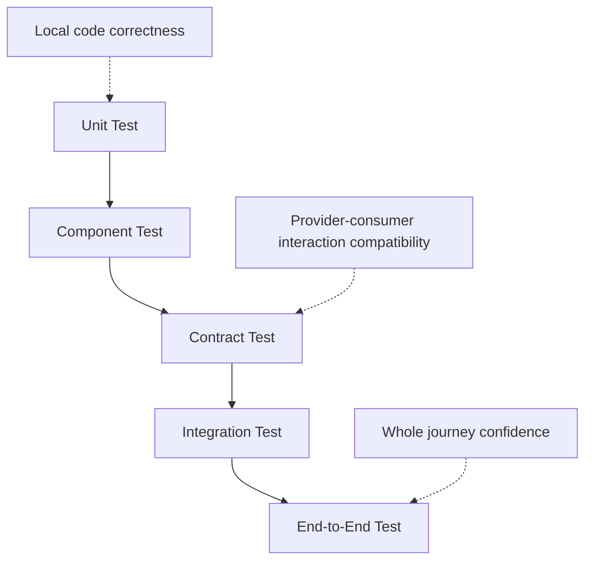

Contract test idealnya cepat, deterministic, bisa jalan di CI, dan tidak membutuhkan seluruh ecosystem hidup.

---

## 2. What Contract Testing Is and Is Not

### 2.1 Contract Testing Is

Contract testing adalah testing terhadap agreement antar sistem.

Untuk HTTP API, agreement bisa mencakup:

- method dan path
- request headers
- query/path parameters
- request body shape
- response status
- response headers
- response body fields yang dipakai consumer
- error behavior
- provider state/setup

Untuk event stream, agreement bisa mencakup:

- topic/subject
- key format
- event envelope
- payload schema
- required semantic fields
- event type
- idempotency/deduplication fields
- ordering/causation fields

### 2.2 Contract Testing Is Not

| Bukan | Kenapa |
|---|---|
| Full E2E test | Contract test tidak memvalidasi seluruh journey production |
| Pure schema validation | Contract test memeriksa interaction behavior, bukan hanya shape |
| Snapshot test biasa | Contract test harus punya semantics dan ownership |
| Generated client compile test saja | Compile berhasil tidak berarti provider behavior sesuai |
| Mock yang dibuat sembarangan | Mock harus berasal dari kontrak yang diverifikasi provider |
| Load test | Contract test bukan untuk throughput |
| Security test penuh | Bisa membantu, tapi bukan pengganti threat testing |

---

## 3. The Problem Contract Testing Solves

Tanpa contract test, microservice sering rusak dengan pola seperti ini:

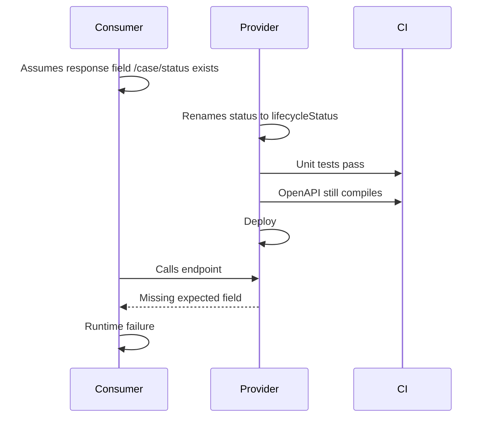

Provider test bisa lulus karena provider tidak tahu field mana yang dipakai consumer. Consumer test bisa lulus karena consumer memakai mock lokal yang sudah basi. Contract testing menghubungkan keduanya.

---

## 4. Contract Testing Strategies

Ada beberapa model.

| Strategy | Contract Source | Cocok Untuk | Risiko |
|---|---|---|---|
| Provider-driven | Provider publishes OpenAPI/schema/stub | API platform, public API, strong provider ownership | Consumer expectation bisa tidak terlihat |
| Consumer-driven | Consumer writes expectations, provider verifies | Microservice internal, many independent consumers | Contract sprawl jika tidak govern |
| Bi-directional | Provider spec + consumer tests dibandingkan | Enterprise API governance | Butuh tooling dan discipline |
| Schema compatibility | Schema registry/diff check | Events, data pipeline | Tidak membuktikan behavior |
| Example-based stubs | Examples generate mocks | Developer productivity | Bisa brittle kalau examples buruk |

Top-level rule:

> Use provider-owned specs to define what is allowed. Use consumer-driven contracts to prove what is actually relied upon.

---

## 5. Provider Contract Testing

Provider contract test membuktikan provider implementation memenuhi kontrak yang dipublikasikan.

### 5.1 OpenAPI Provider Contract Test

Provider punya `openapi.yaml`. Test menembakkan request ke provider test instance dan memastikan response sesuai spec.

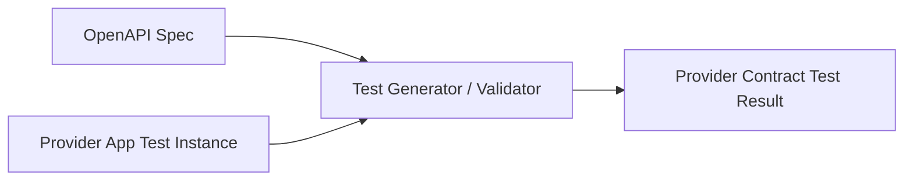

Cocok untuk:

- public API
- platform API
- API yang punya clear provider ownership
- gateway-level validation
- generated documentation

Yang harus diuji:

- happy path
- validation error path
- auth error path
- not found path
- conflict/idempotency path
- pagination path
- deprecation headers if applicable

### 5.2 Provider State

Provider test butuh state.

Contoh endpoint:

```http
GET /cases/{caseId}
```

Expected response tergantung case state:

- case exists and open
- case exists and escalated
- case exists and closed
- case not found
- caller lacks jurisdiction

Provider contract test harus punya fixture state yang eksplisit.

```java
@BeforeEach
void setupProviderState() {
    repository.save(CaseFixture.openCase("CASE-001"));
}
```

Jangan bergantung pada database shared/staging yang berubah-ubah.

### 5.3 Provider Contract Test Anti-Patterns

- hanya test 200 OK
- tidak test error response contract
- test memakai real external dependency
- test data global dan flaky
- OpenAPI spec tidak sama dengan deployed implementation
- response validation dimatikan karena terlalu banyak false positive
- generated model digunakan sebagai domain fixture

---

## 6. Consumer Contract Testing

Consumer contract test membuktikan client code consumer bekerja terhadap provider behavior yang diharapkan.

### 6.1 Consumer-Side Flow

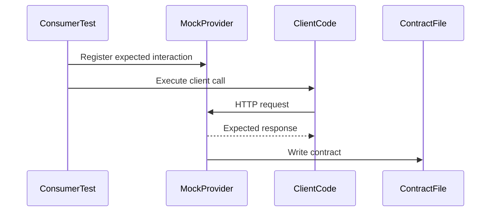

Consumer test tidak memanggil provider asli. Ia memakai mock yang merekam expectation sebagai contract.

### 6.2 What Consumer Should Assert

Consumer test harus assert behavior consumer, bukan semua field provider.

Contoh consumer hanya butuh:

- `caseId`
- `status`
- `assignedUnit`

Jangan assert seluruh response jika consumer tidak memakai semuanya. Semakin banyak field yang tidak dipakai masuk contract, semakin rapuh evolution provider.

### 6.3 Consumer Contract Example

Pseudo-code:

```java
@Test
void shouldLoadOpenCaseForEscalationDashboard() {
    provider.expectInteraction(
        request(GET, "/cases/CASE-001"),
        response(200)
            .header("Content-Type", "application/json")
            .body(jsonObject()
                .string("caseId", "CASE-001")
                .string("status", "OPEN")
                .string("assignedUnit", "AML_ENFORCEMENT"))
    );

    CaseSummary summary = client.getCase("CASE-001");

    assertThat(summary.caseId()).isEqualTo("CASE-001");
    assertThat(summary.status()).isEqualTo(CaseStatus.OPEN);
}
```

Kontrak yang dihasilkan mewakili kebutuhan consumer terhadap provider.

---

## 7. Pact-Style Consumer-Driven Contract Workflow

Pact adalah salah satu pendekatan consumer-driven contract testing yang populer. Mental modelnya:

1. Consumer menulis test terhadap mock provider.
2. Test menghasilkan pact/contract file.
3. Contract dipublish ke broker/repository.
4. Provider mengambil contract dan memverifikasi terhadap provider implementation.
5. Deployment gate memeriksa apakah versi consumer/provider aman dipakai bersama.

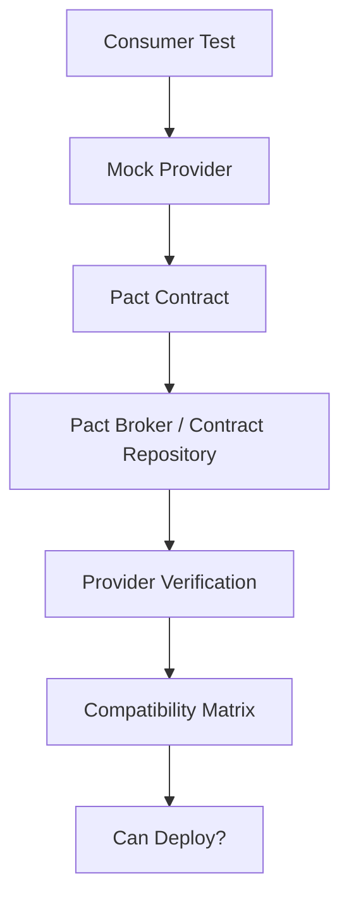

### 7.1 Why Consumer-Driven?

Consumer tahu apa yang ia gunakan. Provider sering tidak tahu semua field/path/error behavior yang diam-diam menjadi dependency consumer.

Consumer-driven contract membuat dependency itu eksplisit.

### 7.2 Provider Verification

Provider verification menjalankan contract dari consumer terhadap provider test instance.

Jika consumer expects:

```http
GET /cases/CASE-001 -> 200 with status OPEN
```

Provider verifier harus menyiapkan state `case CASE-001 exists and is OPEN`, lalu menembakkan request ke provider.

### 7.3 Provider State Handler

Provider state adalah jembatan antara expectation dan fixture.

```java
void providerState(String state) {
    switch (state) {
        case "case CASE-001 exists and is OPEN" ->
            caseRepository.save(CaseFixture.openCase("CASE-001"));
        case "case CASE-404 does not exist" ->
            caseRepository.delete("CASE-404");
        default -> throw new IllegalArgumentException("Unknown provider state: " + state);
    }
}
```

Provider state harus:

- deterministic
- idempotent
- isolated per test
- not depend on production data
- not call external systems unnecessarily

### 7.4 Pact-Style Failure Meaning

Jika provider verification gagal, artinya provider implementation tidak memenuhi expectation consumer tertentu.

Failure harus dibaca seperti ini:

| Failure | Kemungkinan Penyebab |
|---|---|
| request mismatch | consumer expectation outdated or provider path changed |
| status mismatch | behavior changed |
| missing field | provider breaking consumer field dependency |
| type mismatch | contract/schema drift |
| provider state setup fails | fixture/model changed |
| auth/header mismatch | client-provider protocol mismatch |

Jangan langsung “fix test”. Cari apakah contract memang masih valid.

---

## 8. Spring Cloud Contract-Style Workflow

Spring Cloud Contract cenderung provider/producer-side contract workflow. Producer menulis contract, lalu tooling menghasilkan:

- provider tests
- stubs untuk consumer

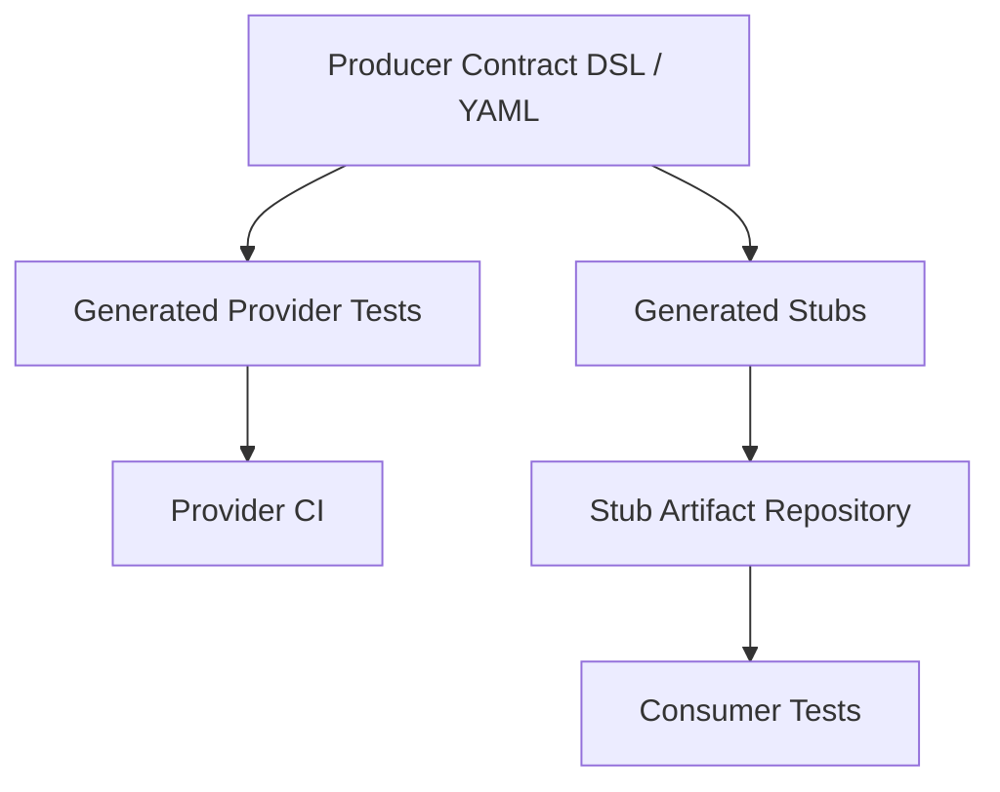

Cocok untuk Java/Spring ecosystem yang ingin producer mengontrol API contract dan consumer memakai generated stubs.

Kelebihan:

- provider punya strong ownership
- stubs reusable
- CI provider bisa enforce contract
- consumer tidak perlu mock manual

Risiko:

- consumer-specific assumptions bisa tidak tertangkap
- contract bisa terlalu provider-centric
- generated stubs bisa membuat false confidence jika consumer memakai behavior di luar stub

---

## 9. OpenAPI + Contract Testing

OpenAPI dan contract testing saling melengkapi.

OpenAPI menjawab:

- operation apa yang tersedia?
- schema apa yang allowed?
- status code apa yang didokumentasikan?
- security scheme apa yang diperlukan?

Contract test menjawab:

- apakah provider benar-benar memenuhi spec?
- apakah consumer dependency tetap dipenuhi?
- apakah behavior error path sesuai?
- apakah deployed provider bisa melayani deployed consumer?

### 9.1 Provider OpenAPI Contract Test

Flow:

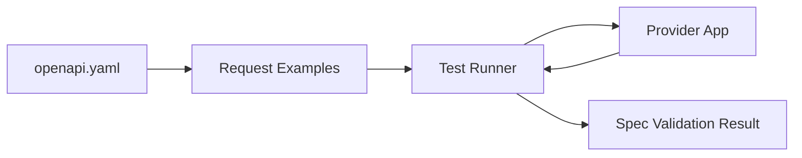

Test source bisa berasal dari:

- examples di OpenAPI
- generated test cases
- curated contract fixtures
- consumer interaction logs yang disanitasi

### 9.2 Consumer Expectations vs OpenAPI Spec

Consumer-driven contract bisa dibandingkan dengan OpenAPI spec.

Jika consumer expects field yang tidak ada di OpenAPI, ada dua kemungkinan:

1. consumer bergantung pada undocumented behavior
2. OpenAPI spec tertinggal dari implementation

Keduanya harus diperbaiki.

---

## 10. Schema Compatibility vs Contract Testing

Untuk event schema, banyak tim menganggap schema registry compatibility cukup. Tidak cukup.

Schema compatibility membuktikan payload bisa dibaca secara structural.

Contract testing membuktikan consumer expectation terhadap event behavior.

Contoh Avro event:

```json
{
  "type": "record",
  "name": "CaseStatusChanged",
  "fields": [
    { "name": "caseId", "type": "string" },
    { "name": "previousStatus", "type": "string" },
    { "name": "newStatus", "type": "string" },
    { "name": "changedAt", "type": { "type": "long", "logicalType": "timestamp-millis" } }
  ]
}
```

Schema compatible change bisa tetap break consumer secara behavior:

- event tidak lagi dipublish untuk transition tertentu
- `newStatus` value baru muncul tanpa consumer fallback
- `changedAt` berubah dari event time ke processing time
- key berubah dari `caseId` ke `tenantId`
- ordering guarantee berubah

Maka event contract test perlu menguji contoh interaction/event production, bukan hanya schema diff.

---

## 11. Async/Event Contract Testing

Async contract testing lebih sulit karena tidak ada request-response langsung.

### 11.1 Producer Event Contract Test

Producer test membuktikan domain action menghasilkan event sesuai contract.

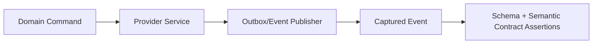

Example:

```java
@Test
void shouldPublishCaseEscalatedEventWhenRiskScoreExceedsThreshold() {
    service.updateRiskScore("CASE-001", 95);

    PublishedEvent event = outbox.singleEventOfType("case.escalated");

    assertThat(event.key()).isEqualTo("CASE-001");
    assertThat(event.type()).isEqualTo("case.escalated.v1");
    assertThat(event.payload().get("caseId")).isEqualTo("CASE-001");
    assertThat(event.payload().get("reason")).isEqualTo("HIGH_RISK_SCORE");
}
```

### 11.2 Consumer Event Contract Test

Consumer test membuktikan consumer bisa memproses event shape/semantics yang disepakati.

```java
@Test
void shouldCreateEscalationTaskFromCaseEscalatedEvent() {
    Event event = EventFixture.caseEscalated("CASE-001", "HIGH_RISK_SCORE");

    consumer.handle(event);

    assertThat(taskRepository.findByCaseId("CASE-001"))
        .hasTaskType("ESCALATION_REVIEW");
}
```

### 11.3 Async Contract Contents

Async contract harus mencakup:

- topic/channel
- key
- headers
- event type
- schema ID/version
- envelope fields
- payload fields
- semantic trigger
- ordering/idempotency notes
- sample payloads

---

## 12. Generated Stubs and Mock Servers

Generated stub membantu consumer test tanpa provider asli.

Sources:

- OpenAPI examples
- Spring Cloud Contract stubs
- Pact mock interactions
- WireMock mappings
- manually curated fixtures

### 12.1 Good Stub Properties

- derived from verified contract
- versioned with provider contract
- deterministic
- fast to start
- supports common error paths
- does not require production data
- includes realistic headers/status/content type

### 12.2 Bad Stub Smells

- mock response copied manually from old production response
- stub accepts anything
- stub always returns 200
- stub has no version
- stub not verified by provider
- consumer tests assert implementation detail not contract

---

## 13. Contract Test Data Design

Contract test data harus kecil tapi bermakna.

### 13.1 Use Minimal Meaningful Examples

Jangan gunakan giant fixture 500 lines jika consumer hanya butuh 5 fields.

Good example:

```json
{
  "caseId": "CASE-001",
  "status": "OPEN",
  "assignedUnit": "AML_ENFORCEMENT"
}
```

Bad example:

```json
{
  "caseId": "CASE-001",
  "status": "OPEN",
  "assignedUnit": "AML_ENFORCEMENT",
  "createdBy": "...",
  "lastModifiedBy": "...",
  "allInternalNotes": [ ... ],
  "allAuditEntries": [ ... ],
  "debugMetadata": { ... }
}
```

### 13.2 Prefer Matchers Over Exact Values

Exact value cocok untuk identifiers dan enum tertentu. Untuk timestamp, generated ID, amount precision, gunakan matcher.

Contoh intent:

- `caseId` matches `^CASE-[0-9]{3}$`
- `changedAt` is ISO timestamp
- `amount` is decimal string with 2 fraction digits
- `status` is one of known statuses

### 13.3 Test Error Paths

Contract tidak lengkap tanpa error.

Minimal error path:

- validation error
- not found
- unauthorized/forbidden
- conflict/idempotency conflict
- rate/limit if part of API behavior
- provider unavailable fallback if consumer handles it

---

## 14. CI/CD Contract Gate

Contract test harus menjadi gate yang jelas.

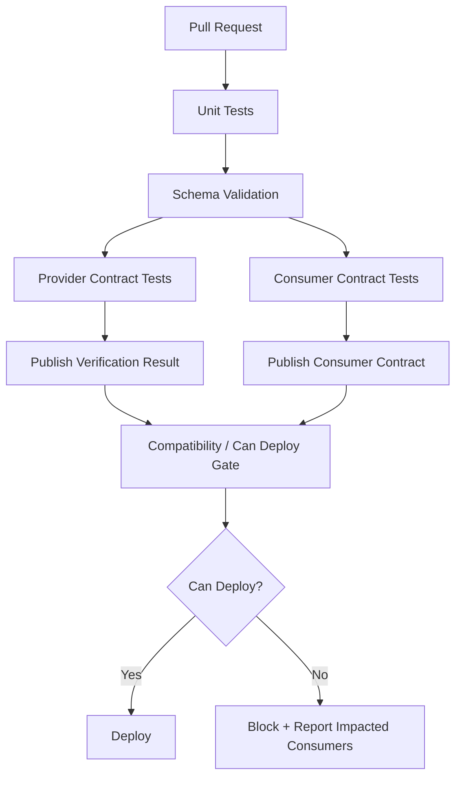

### 14.1 Pull Request Gate

On PR:

- validate contract syntax
- run unit/component tests
- run provider contract tests for changed API/event
- run consumer contract tests for changed clients
- run compatibility diff
- generate report of impacted consumers

### 14.2 Main Branch Gate

On merge:

- publish contract artifact
- publish stubs
- publish provider verification result
- update compatibility matrix
- update documentation/catalog

### 14.3 Deployment Gate

Before deploy:

- check provider version compatible with active consumer versions
- check consumer version compatible with active provider version
- block if unverified breaking pair
- allow override only with documented waiver

---

## 15. Version Selection and Compatibility Matrix

A mature contract platform tracks versions.

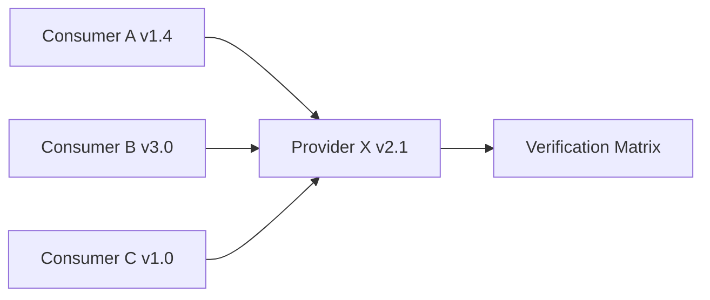

Matrix example:

| Consumer | Provider | Verified? | Result |
|---|---|---:|---|
| case-dashboard 1.4.2 | case-api 2.1.0 | yes | pass |
| enforcement-engine 3.0.1 | case-api 2.1.0 | yes | pass |
| reporting-job 1.0.8 | case-api 2.1.0 | no | block or warn |

Without version selection, teams either test too much or test the wrong combinations.

---

## 16. Provider State Explosion

Provider state can explode.

Bad state names:

- `test1`
- `happy path`
- `case exists`
- `valid data`

Good state names:

- `case CASE-001 exists with status OPEN and jurisdiction AML`
- `case CASE-002 exists with status CLOSED`
- `case CASE-404 does not exist`
- `caller has no jurisdiction over CASE-003`

Provider state should describe domain precondition, not technical setup.

### 16.1 State Fixture Pattern

```java
public final class CaseProviderStates {
    public void openCaseInAmlJurisdiction() {
        resetDatabase();
        insertJurisdiction("AML");
        insertCase("CASE-001", "OPEN", "AML");
    }

    public void closedCase() {
        resetDatabase();
        insertCase("CASE-002", "CLOSED", "AML");
    }
}
```

Keep provider state setup boring, deterministic, and local.

---

## 17. Combining Contract Tests with Runtime Validation

Contract tests and runtime validation reinforce each other.

| Runtime Validation | Contract Testing |
|---|---|
| Checks actual payload at runtime | Checks expected interaction before deploy |
| Produces operational evidence | Produces CI evidence |
| Handles unknown/invalid data | Prevents known incompatible changes |
| Can be shadow/sampled | Should be deterministic/enforced in CI |
| Boundary-focused | Provider-consumer relationship focused |

Mature systems use both.

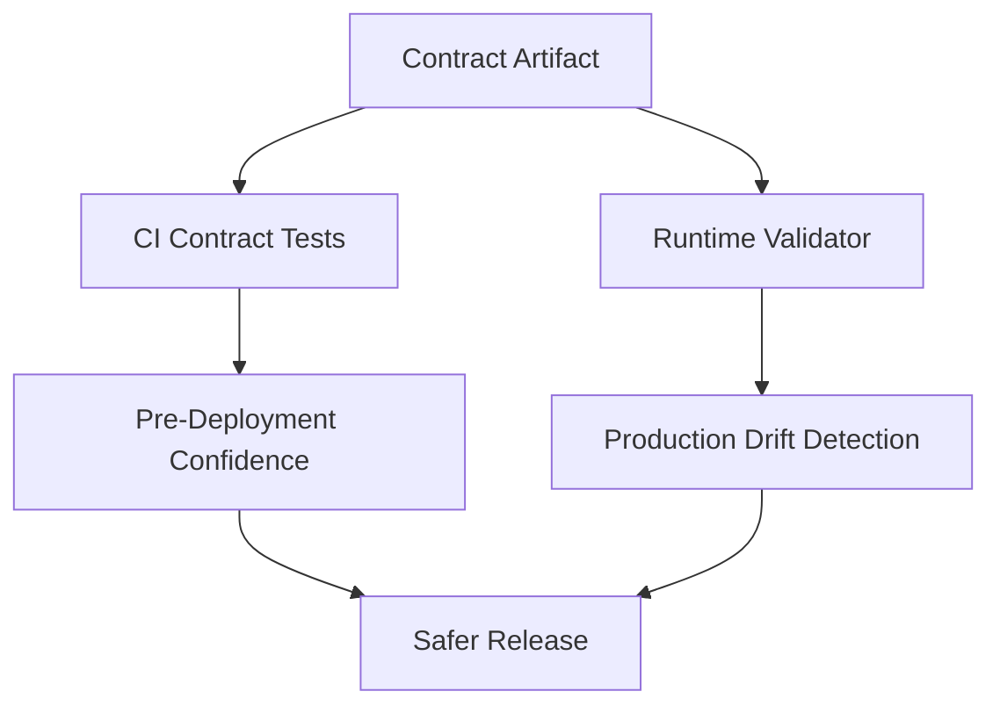

---

## 18. Java Implementation Architecture

### 18.1 Contract Test Module Layout

Example repository layout:

```text
case-api/
  api-contract/
    openapi/case-api.yaml
    examples/
  provider-service/
    src/main/java/...
    src/test/java/.../ProviderContractTest.java
  consumer-contracts/
    pact/
  stubs/
  pom.xml
```

For consumer:

```text
case-dashboard/
  client-case-api/
    src/main/java/.../CaseApiClient.java
    src/test/java/.../CaseApiConsumerContractTest.java
  pom.xml
```

### 18.2 Keep Client Mapping Explicit

Consumer test should test the client adapter boundary.

```java
public final class CaseApiClient {
    private final HttpClient http;
    private final URI baseUrl;

    public CaseSummary getCase(String caseId) {
        HttpResponse<String> response = http.send(buildRequest(caseId));
        if (response.statusCode() == 404) {
            throw new CaseNotFoundException(caseId);
        }
        if (response.statusCode() != 200) {
            throw new ProviderException(response.statusCode());
        }
        return mapper.toCaseSummary(response.body());
    }
}
```

Contract test ensures the adapter understands provider response.

### 18.3 Do Not Mock the Client You Want to Test

Bad:

```java
when(caseApiClient.getCase("CASE-001")).thenReturn(summary);
```

This tests nothing about provider contract.

Good:

- mock HTTP provider
- execute real client code
- assert client output
- generate/verify contract

---

## 19. Handling Authentication and Authorization

Contract tests should not depend on real identity provider unless explicitly needed.

Common pattern:

- use test token generator
- use fake JWT signed by test key
- stub auth service
- inject security context in provider test
- assert required auth headers exist

Do not hide auth behavior completely. If endpoint requires `Authorization` header and tenant header, contract should include it.

### 19.1 Object-Level Authorization

Contract test can include forbidden case:

```text
Given caller has jurisdiction AML
When GET /cases/CASE-SEC where case belongs to TAX
Then response is 403 with Problem Details body
```

This does not replace security testing, but prevents accidental removal of important contract behavior.

---

## 20. Contract Tests for Idempotency

Idempotency is an interaction contract.

Test cases:

1. same idempotency key + same payload returns same result
2. same idempotency key + different payload returns conflict
3. missing key for idempotent-required operation returns validation error
4. retry after timeout returns existing result if operation committed

Pseudo-test:

```java
@Test
void sameIdempotencyKeyWithDifferentPayloadShouldReturnConflict() {
    String key = "018fc7d5-5dc2-7ca2-9c55-7a1788e68f2f";

    client.registerCase(key, requestA);

    Problem problem = assertThrows(ConflictException.class,
        () -> client.registerCase(key, requestB)).problem();

    assertThat(problem.code()).isEqualTo("IDEMPOTENCY_KEY_REUSED_WITH_DIFFERENT_PAYLOAD");
}
```

Many APIs document idempotency but never contract-test it.

---

## 21. Contract Tests for Pagination

Pagination bugs are common because tests only check first page.

Test cases:

- empty result
- first page with next cursor
- last page without next cursor
- invalid cursor
- stable ordering
- limit boundary

Consumer expectation should specify cursor fields it uses, not internal database pagination details.

---

## 22. Contract Tests for Error Model

Error contract is part of API contract.

If you use Problem Details style response, contract-test:

- `type`
- `title`
- `status`
- stable domain error code extension
- field errors path
- correlation/request ID header
- content type

Example:

```json
{
  "type": "https://errors.example.com/contract-validation",
  "title": "Request does not match contract",
  "status": 400,
  "code": "CONTRACT_VALIDATION_FAILED",
  "errors": [
    {
      "code": "REQUIRED_FIELD_MISSING",
      "path": "/externalReportId"
    }
  ]
}
```

Do not contract-test localized human message unless localization is part of contract.

---

## 23. Avoiding Brittle Contracts

Brittle contract symptoms:

- exact timestamp asserted
- generated UUID asserted
- entire response body asserted when consumer uses 3 fields
- array ordering asserted without ordering guarantee
- internal debug fields asserted
- provider implementation detail asserted
- fixture has unrelated fields

Use matchers and minimal expectations.

### 23.1 Minimal Contract Principle

> A consumer contract should include what the consumer needs, not everything the provider happens to return.

But beware: too minimal can miss important behavior. Include fields that affect consumer decisions.

---

## 24. Contract Testing for Backward Compatibility

Backward compatibility means new provider works with old consumers.

Test approach:

- keep contracts from currently deployed consumer versions
- provider verifies against all relevant active consumer contracts
- do not only verify latest consumer
- deployment gate checks active matrix

Forward compatibility means new consumer works with current provider.

Test approach:

- consumer verifies against current provider stub/contract
- can-deploy check ensures provider version exists that satisfies consumer expectations

---

## 25. Contract Testing and Deprecation

Deprecation needs evidence.

Before removing a field/endpoint:

1. mark deprecated in contract
2. publish deprecation notice
3. track runtime usage
4. verify no active consumer contract requires it
5. verify no runtime traffic uses it
6. remove after policy window
7. keep compatibility evidence

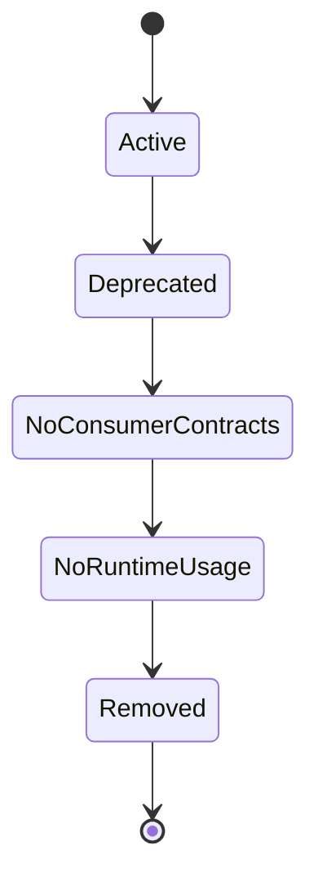

Contract testing gives evidence for step 4. Runtime validation/telemetry gives evidence for step 5.

---

## 26. Regulatory Case Management Example

Services:

- `case-api`: provider of case data
- `case-dashboard`: consumer for UI
- `enforcement-engine`: consumer for workflow decisions
- `reporting-job`: consumer for regulatory report generation

Endpoint:

```http
GET /cases/{caseId}
```

### Dashboard Consumer Contract

Needs:

- `caseId`
- `status`
- `assignedUnit`
- `riskLevel`

It does not care about full evidence trail.

### Enforcement Engine Consumer Contract

Needs:

- `caseId`
- `status`
- `currentStage`
- `allowedActions`
- `version`

It cares about optimistic concurrency and state transition.

### Reporting Job Consumer Contract

Needs:

- `caseId`
- `status`
- `openedAt`
- `closedAt`
- `violationCodes`
- `sanctionSummary`

It cares about stable regulatory semantics.

If provider removes `allowedActions`, dashboard still works, but enforcement engine breaks. Contract testing should reveal exactly which consumer is impacted.

---

## 27. Contract Test Review Checklist

### Consumer Contract

- [ ] Does it test real client adapter code?
- [ ] Does it include only fields consumer uses?
- [ ] Does it include important error paths?
- [ ] Does it avoid provider implementation detail?
- [ ] Does it use matchers for dynamic fields?
- [ ] Does it document provider state clearly?
- [ ] Does it publish contract with consumer version?

### Provider Verification

- [ ] Does it verify all active consumer contracts?
- [ ] Are provider states deterministic?
- [ ] Does it isolate database state per test?
- [ ] Does it avoid real external dependencies?
- [ ] Does it verify headers/content type/status/body?
- [ ] Does failure report impacted consumer?

### OpenAPI/Schema Integration

- [ ] Are consumer expectations valid against OpenAPI?
- [ ] Are examples valid against schema?
- [ ] Are generated stubs verified by provider?
- [ ] Is schema compatibility checked separately?
- [ ] Are error models contract-tested?

### CI/CD

- [ ] Contract tests run on PR.
- [ ] Contract artifacts are versioned.
- [ ] Verification results are published.
- [ ] Deployment gate uses active version matrix.
- [ ] Waiver process exists for emergency release.

---

## 28. Failure Triage Playbook

### 28.1 Provider Verification Fails

Ask:

1. Which consumer contract failed?
2. Is consumer version still active?
3. Is provider state setup correct?
4. Did provider intentionally change behavior?
5. Is the change breaking according to contract policy?
6. Is there a migration/deprecation plan?

Decision:

- fix provider if accidental break
- update contract if consumer expectation obsolete
- coordinate migration if intentional break
- remove stale contract only if consumer version inactive

### 28.2 Consumer Contract Test Fails

Ask:

1. Did client code change?
2. Did expected provider behavior change?
3. Is mock/stub outdated?
4. Is OpenAPI/provider contract updated?
5. Is consumer relying on undocumented behavior?

### 28.3 Can-Deploy Fails

Ask:

1. Which version pair is incompatible?
2. Is incompatible consumer deployed?
3. Can deployment order solve it?
4. Is expand-migrate-contract needed?
5. Is waiver acceptable?

---

## 29. Practical Lab

Build a contract testing workflow for a Java regulatory case platform.

### Services

- `case-api` provider
- `case-dashboard` consumer
- `enforcement-engine` consumer

### Tasks

1. Write OpenAPI contract for `GET /cases/{caseId}` and `POST /cases/intake`.
2. Add provider contract test for happy path and error path.
3. Add consumer contract test for dashboard client.
4. Add consumer contract test for enforcement engine client.
5. Publish contract artifacts locally.
6. Simulate provider breaking change: rename `status` to `lifecycleStatus`.
7. Verify which consumer breaks.
8. Implement expand migration: return both fields temporarily.
9. Add runtime metric for deprecated `status` usage.
10. Remove old field only after consumer contract and telemetry allow it.

Expected learning outcome:

> You should be able to prove whether a provider and consumer are compatible before deployment, identify exactly which expectation would break, and connect contract testing evidence with runtime validation evidence.

---

## 30. Key Takeaways

Contract testing is the discipline of testing assumptions between independently deployable systems.

A production-grade contract testing practice has these properties:

1. Provider specs define allowed behavior.
2. Consumer contracts reveal behavior actually depended upon.
3. Provider verification tests active consumer expectations.
4. Generated stubs are derived from verified contracts.
5. Schema compatibility and contract testing are both needed.
6. Error paths, idempotency, pagination, and auth behavior are first-class contracts.
7. Provider states are deterministic and domain-named.
8. CI publishes contract artifacts and verification results.
9. Deployment gates use active version compatibility matrix.
10. Deprecation requires both contract evidence and runtime evidence.

Top engineers do not use contract tests as another checkbox. They use them as a **release safety system**.

The real question is not:

> Did my tests pass?

The real question is:

> Can this provider version and this consumer version safely communicate in production, under the interactions they actually rely on?

That is the engineering value of contract testing.

---

## References

- Pact Documentation: https://docs.pact.io/
- Pact Consumer Tests: https://docs.pact.io/consumer
- Spring Cloud Contract Reference Documentation: https://docs.spring.io/spring-cloud-contract/docs/current/reference/htmlsingle/
- Spring Cloud Contract Project: https://spring.io/projects/spring-cloud-contract
- OpenAPI Specification 3.2.0: https://spec.openapis.org/oas/v3.2.0.html
- JSON Schema Draft 2020-12: https://json-schema.org/draft/2020-12
- Apache Avro 1.12.0 Specification: https://avro.apache.org/docs/1.12.0/specification/
- Protocol Buffers Documentation: https://protobuf.dev/
