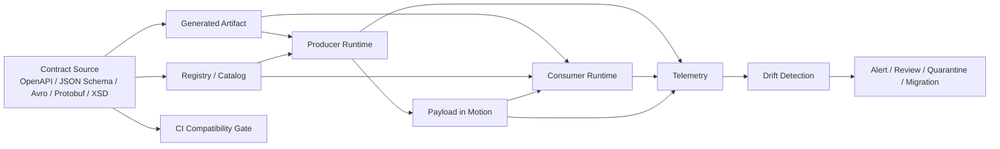
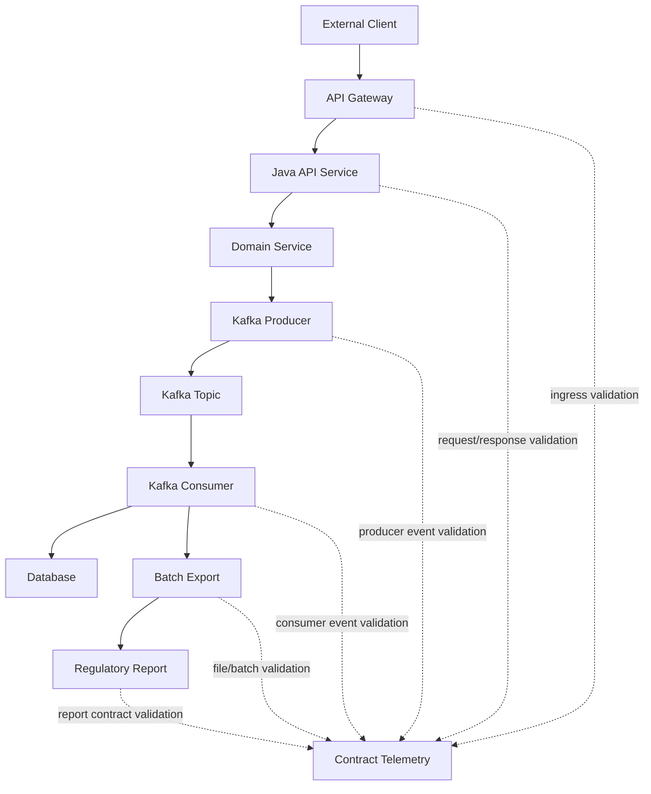
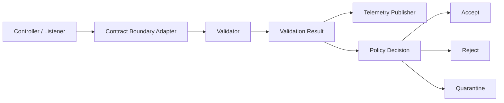
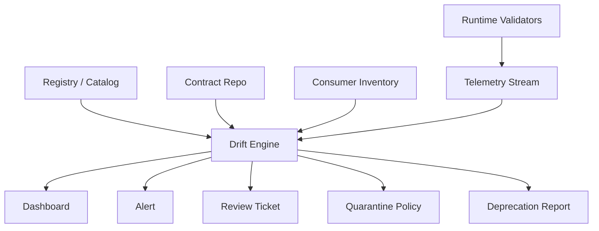
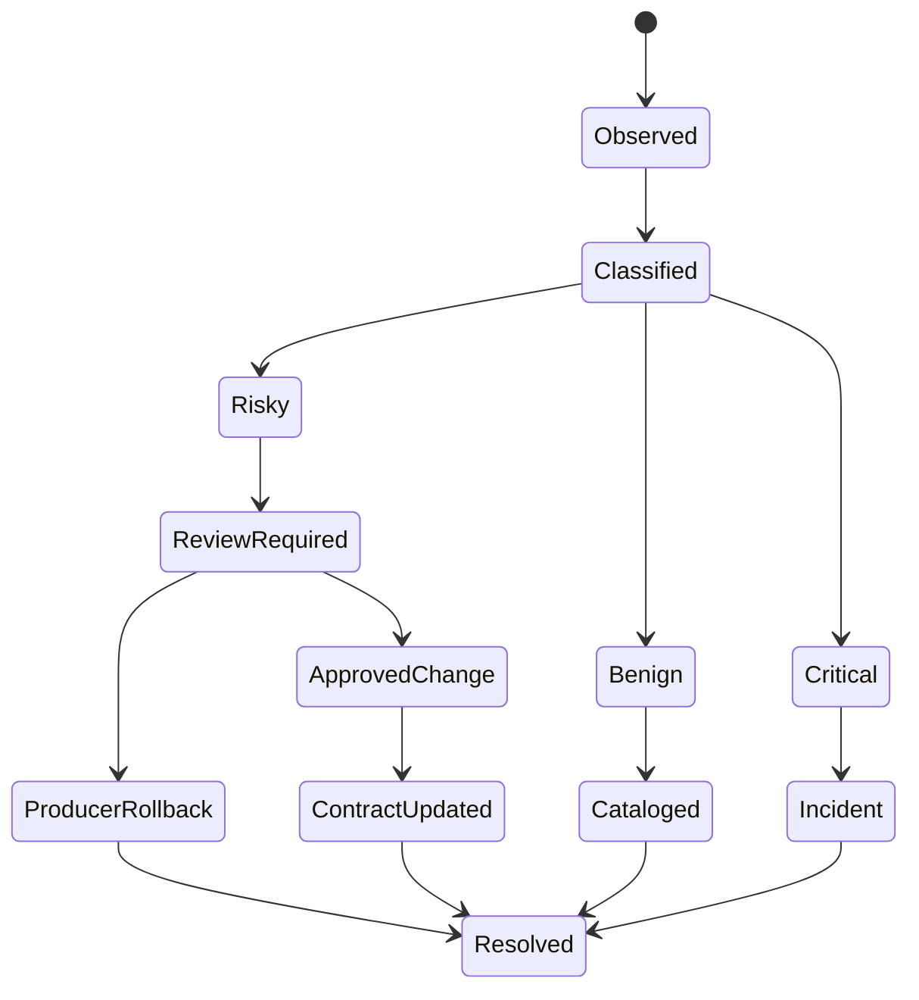
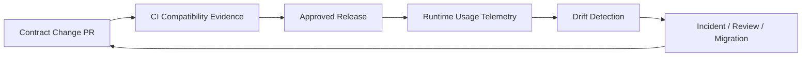

# Part 041 — Contract Observability, Telemetry, and Drift Detection

Pada bagian sebelumnya kita membahas runtime validation dan contract testing. Dua hal itu membuat kontrak bisa **dicegah** agar tidak rusak. Namun di sistem produksi yang kompleks, prevention saja tidak cukup.

Kita juga perlu tahu:

- producer mana yang mulai mengirim field baru tanpa review
- consumer mana yang masih membaca versi lama
- payload mana yang valid secara schema tapi tidak masuk akal secara domain
- schema version mana yang paling banyak gagal
- endpoint mana yang mulai menerima request dengan shape yang berbeda dari OpenAPI
- event mana yang diam-diam berubah distribusi datanya
- field sensitif mana yang muncul di payload yang seharusnya tidak membawa PII
- validasi mana yang terlalu mahal dan mulai menaikkan latency
- drift mana yang masih aman, mana yang harus menjadi incident

Inilah area **contract observability**.

Observability kontrak bukan sekadar menambahkan log ketika validasi gagal. Ia adalah kemampuan untuk memahami runtime behavior dari data contract sebagai protokol hidup antar sistem.

---

## 1. Mental Model: Contract Is a Runtime Protocol

Schema file terlihat statis. Runtime-nya tidak.

Satu kontrak hidup di beberapa tempat sekaligus:



Kontrak yang benar bukan hanya yang tersimpan di repo. Kontrak yang benar adalah gabungan dari:

1. **declared contract** — file schema/spec yang disetujui
2. **generated contract** — Java class, client, validator, serializer yang dihasilkan
3. **enforced contract** — aturan yang benar-benar dijalankan di runtime
4. **observed contract** — bentuk data yang benar-benar lewat di produksi
5. **consumed contract** — subset field yang benar-benar dipakai oleh consumer
6. **governed contract** — aturan lifecycle, ownership, dan compatibility yang mengikat perubahan

Drift terjadi ketika salah satu layer ini tidak sinkron.

Contoh sederhana:

- OpenAPI bilang `caseStatus` hanya `OPEN | UNDER_REVIEW | CLOSED`.
- Runtime mulai menerima `ESCALATED`.
- Java enum lama gagal deserialize.
- Gateway tidak menolak karena validator tidak aktif untuk response.
- Log hanya menunjukkan `500 Internal Server Error`.
- Tim platform tidak tahu bahwa ini sebenarnya **contract drift**.

Tanpa observability kontrak, masalah seperti ini terlihat seperti random application error.

---

## 2. Apa Itu Contract Observability?

Contract observability adalah kemampuan untuk menjawab pertanyaan operasional berikut secara cepat dan berbasis evidence:

| Pertanyaan | Contoh jawaban yang harus bisa diberikan sistem |
|---|---|
| Kontrak mana yang gagal? | `enforcement.case-intake.v2` field `/applicant/nationalId` invalid |
| Siapa producer-nya? | `case-intake-api` version `2.14.7` di cluster `prod-jkt-1` |
| Siapa consumer terdampak? | `case-risk-scoring`, `case-assignment`, `regulatory-reporting` |
| Apakah breaking atau non-breaking? | Breaking untuk consumer yang masih memakai enum closed set |
| Berapa banyak payload gagal? | 2.8% dari traffic endpoint `/cases` dalam 10 menit terakhir |
| Apakah ini schema drift atau data quality issue? | Schema valid, semantic invalid: `decisionDate` sebelum `submittedDate` |
| Apakah ada PII leak? | Field `/metadata/debugPayload/customerEmail` muncul pada 41 event |
| Apakah perlu rollback? | Tidak, route ke quarantine dan enable forward-compatible enum parser |

Observability kontrak punya tiga sinyal utama:

1. **metrics** — angka agregat untuk dashboard dan alert
2. **logs/events** — detail terstruktur untuk investigasi
3. **traces** — korelasi lintas service untuk memahami impact journey

OpenTelemetry menyediakan model umum untuk traces, metrics, logs, resources, dan semantic conventions. Untuk kontrak, kita memakai prinsip yang sama: atribut harus konsisten, rendah cardinality, dan bisa dikorelasikan lintas service.

---

## 3. Contract Telemetry Signal Model

Setiap validasi kontrak sebaiknya menghasilkan `ContractValidationResult` internal.

Bukan hanya boolean.

```java
public enum ContractValidationOutcome {
    ACCEPTED,
    ACCEPTED_WITH_WARNING,
    REJECTED,
    QUARANTINED,
    SKIPPED,
    SHADOW_FAILED
}

public enum ContractFailureCategory {
    PARSE_ERROR,
    SCHEMA_VIOLATION,
    COMPATIBILITY_VIOLATION,
    SEMANTIC_VIOLATION,
    REFERENTIAL_VIOLATION,
    TEMPORAL_VIOLATION,
    SECURITY_VIOLATION,
    PRIVACY_VIOLATION,
    UNKNOWN_FIELD,
    UNKNOWN_ENUM_VALUE,
    GENERATED_MODEL_MISMATCH,
    VALIDATOR_RUNTIME_ERROR
}

public record ContractValidationResult(
    String contractId,
    String contractVersion,
    String schemaFormat,
    String boundary,
    String direction,
    ContractValidationOutcome outcome,
    List<ContractViolation> violations,
    long validationDurationNanos,
    String payloadFingerprint,
    String correlationId,
    String producerService,
    String consumerService
) {}

public record ContractViolation(
    ContractFailureCategory category,
    String pointer,
    String rule,
    String message,
    String severity
) {}
```

Model ini menjadi sumber untuk metric, log, trace attribute, DLQ envelope, dan drift engine.

---

## 4. Boundary yang Harus Diobservasi

Jangan mengukur kontrak hanya di API gateway. Drift bisa muncul di semua boundary.



Minimal boundary observability:

| Boundary | Yang diamati |
|---|---|
| HTTP ingress | request body, parameter, header, auth claims, idempotency key |
| HTTP egress | response body, status code, error model, pagination header |
| Event producer | event type, schema ID, subject, key, envelope, payload version |
| Event consumer | schema resolution, unknown field, unknown enum, semantic invariant |
| Batch/file ingestion | manifest version, row error, record count, checksum, rejected rows |
| Batch/file export | schema version, column order, delimiter, encoding, null marker |
| DB boundary | generated DTO to persistence mapping mismatch, precision truncation |
| Integration adapter | legacy XML/XSD mismatch, namespace version, external code list |
| Reporting pipeline | regulatory field completeness, effective date, controlled vocabulary |

---

## 5. Core Metrics untuk Contract Observability

Metric harus menjawab dua hal:

1. Apakah kontrak sedang sehat?
2. Jika tidak, boundary mana yang rusak?

### 5.1 Counter Metrics

| Metric | Labels yang disarankan | Tujuan |
|---|---|---|
| `contract_validation_total` | `contract_id`, `version`, `format`, `boundary`, `direction`, `outcome` | Total validasi per outcome |
| `contract_violation_total` | `contract_id`, `category`, `rule`, `severity` | Jumlah violation per kategori |
| `contract_unknown_field_total` | `contract_id`, `field_group`, `producer` | Deteksi field drift |
| `contract_unknown_enum_total` | `contract_id`, `enum_name`, `producer` | Deteksi enum drift |
| `contract_quarantine_total` | `contract_id`, `category`, `source` | Payload masuk quarantine |
| `contract_schema_resolution_failure_total` | `subject`, `schema_id`, `consumer` | Avro/Protobuf schema resolution failure |
| `contract_generated_model_mismatch_total` | `artifact`, `runtime_version` | Generated/runtime mismatch |

Jangan menjadikan full JSON pointer sebagai label metric jika cardinality-nya tinggi. Gunakan `field_group` atau rule ID. Detail pointer masuk structured log.

### 5.2 Histogram Metrics

| Metric | Tujuan |
|---|---|
| `contract_validation_duration_seconds` | Mengukur overhead validasi |
| `contract_payload_size_bytes` | Menemukan payload yang membesar diam-diam |
| `contract_violation_count_per_payload` | Mengetahui severity payload invalid |
| `contract_quarantine_age_seconds` | Mengukur backlog quarantine |
| `contract_replay_duration_seconds` | Mengukur durasi replay dari quarantine/DLQ |

### 5.3 Gauge Metrics

| Metric | Tujuan |
|---|---|
| `contract_active_versions` | Jumlah versi kontrak yang masih aktif di runtime |
| `contract_consumer_lag_by_version` | Lag consumer per schema version |
| `contract_quarantine_backlog` | Payload invalid yang belum selesai ditangani |
| `contract_deprecated_version_traffic_ratio` | Traffic yang masih memakai versi deprecated |
| `contract_registry_unavailable` | Status registry availability dari perspektif service |

---

## 6. Metric Naming dan Label Discipline

Metric yang buruk bisa merusak observability backend.

Anti-pattern:

```text
contract_error_user_628391_payload_missing_national_id_total
```

Masalah:

- user ID masuk metric name
- cardinality meledak
- PII leak
- tidak bisa dibuat dashboard generik

Lebih baik:

```text
contract_violation_total{
  contract_id="case-intake-command",
  version="2.3.0",
  format="json-schema",
  boundary="http-ingress",
  direction="request",
  category="schema_violation",
  rule="required-field",
  severity="error"
}
```

Detail seperti `/applicant/nationalId`, correlation ID, payload fingerprint, dan masked sample masuk log, bukan label metric.

### 6.1 Label Cardinality Rule

Gunakan label untuk nilai yang:

- jumlahnya terbatas
- stabil
- berguna untuk agregasi
- tidak mengandung PII
- tidak berubah per request

Hindari label untuk:

- user ID
- case ID
- email
- phone number
- raw JSON pointer dengan dynamic array index
- full error message
- payload hash jika sangat banyak
- stack trace

---

## 7. Structured Logs untuk Contract Violation

Setiap violation penting harus menghasilkan log terstruktur.

Contoh:

```json
{
  "eventType": "contract.validation.failed",
  "severity": "WARN",
  "timestamp": "2026-07-03T10:15:30.123Z",
  "service": "case-intake-api",
  "environment": "prod",
  "contract": {
    "id": "case-intake-command",
    "version": "2.3.0",
    "format": "json-schema",
    "artifact": "com.acme.contracts:case-intake-contract:2.3.0"
  },
  "boundary": {
    "type": "http-ingress",
    "direction": "request",
    "operation": "POST /cases"
  },
  "producer": {
    "service": "public-portal",
    "version": "1.41.0"
  },
  "consumer": {
    "service": "case-intake-api",
    "version": "2.14.7"
  },
  "outcome": "REJECTED",
  "violations": [
    {
      "category": "SCHEMA_VIOLATION",
      "pointer": "/applicant/nationalId",
      "rule": "required",
      "severity": "ERROR",
      "message": "Required field is missing"
    }
  ],
  "correlationId": "corr-01HX...",
  "traceId": "0af7651916cd43dd8448eb211c80319c",
  "payloadFingerprint": "sha256:7c1e...",
  "payloadSamplePolicy": "redacted"
}
```

Catatan penting:

- jangan log raw payload secara default
- gunakan pointer dan rule ID
- gunakan fingerprint untuk korelasi
- gunakan redacted sample hanya untuk field yang aman
- gunakan trace ID untuk menelusuri journey
- gunakan contract artifact coordinate agar bisa direproduksi

---

## 8. Trace Design untuk Contract Validation

Trace membantu menjawab: **validasi kontrak ini terjadi di mana dalam user journey?**

Contoh span:

```text
Span: contract.validate
Attributes:
  contract.id = case-intake-command
  contract.version = 2.3.0
  contract.format = json-schema
  contract.boundary = http-ingress
  contract.direction = request
  contract.outcome = rejected
  contract.violation.count = 1
  contract.violation.category = schema_violation
  contract.validation.mode = enforcing
  contract.validation.duration_ms = 2.8
```

Trace tidak boleh diisi full payload. Trace adalah korelasi, bukan storage payload.

### 8.1 Kapan Membuat Span?

Buat span eksplisit ketika:

- validasi mahal
- validasi memanggil resolver/registry
- validasi dapat memutus request
- validasi dilakukan di async consumer
- validation result mempengaruhi routing ke DLQ/quarantine
- butuh debugging cross-service

Tidak perlu membuat span untuk validasi trivial yang sangat sering jika overhead terlalu besar. Dalam kasus itu, cukup metric dan sampled log.

---

## 9. Java Instrumentation Pattern

Kita ingin validasi menghasilkan telemetry tanpa mengotori business logic.



### 9.1 Contract Validator Interface

```java
public interface ContractValidator<T> {
    ContractValidationResult validate(ContractValidationRequest<T> request);
}

public record ContractValidationRequest<T>(
    String contractId,
    String contractVersion,
    String schemaFormat,
    String boundary,
    String direction,
    T payload,
    Map<String, String> context
) {}
```

### 9.2 Telemetry Decorator

```java
public final class TelemetryContractValidator<T> implements ContractValidator<T> {
    private final ContractValidator<T> delegate;
    private final ContractTelemetry telemetry;
    private final Clock clock;

    public TelemetryContractValidator(
            ContractValidator<T> delegate,
            ContractTelemetry telemetry,
            Clock clock
    ) {
        this.delegate = delegate;
        this.telemetry = telemetry;
        this.clock = clock;
    }

    @Override
    public ContractValidationResult validate(ContractValidationRequest<T> request) {
        long start = System.nanoTime();
        ContractValidationResult result;

        try {
            result = delegate.validate(request);
        } catch (RuntimeException ex) {
            result = ContractValidationResultFactory.runtimeError(request, ex);
        }

        long duration = System.nanoTime() - start;
        result = ContractValidationResultFactory.withDuration(result, duration);
        telemetry.record(result);
        return result;
    }
}
```

### 9.3 Telemetry Publisher

```java
public interface ContractTelemetry {
    void record(ContractValidationResult result);
}

public final class CompositeContractTelemetry implements ContractTelemetry {
    private final List<ContractTelemetry> delegates;

    public CompositeContractTelemetry(List<ContractTelemetry> delegates) {
        this.delegates = List.copyOf(delegates);
    }

    @Override
    public void record(ContractValidationResult result) {
        for (ContractTelemetry delegate : delegates) {
            try {
                delegate.record(result);
            } catch (RuntimeException ignored) {
                // Telemetry must not break business flow.
                // Count this through a separate internal meter if possible.
            }
        }
    }
}
```

Rule penting: **telemetry failure must not become contract failure**. Jika backend metrics down, sistem tidak boleh mulai menolak request valid.

---

## 10. OpenTelemetry Attribute Model untuk Contract

OpenTelemetry semantic conventions punya banyak atribut standar untuk HTTP, messaging, database, dan service metadata. Contract-specific attribute biasanya perlu ditambahkan sebagai custom attributes.

Gunakan prefix konsisten, misalnya `contract.*`.

| Attribute | Contoh | Catatan |
|---|---|---|
| `contract.id` | `case-intake-command` | Stabil, low-cardinality |
| `contract.version` | `2.3.0` | Boleh jadi label/span attribute |
| `contract.format` | `json-schema` | `openapi`, `avro`, `protobuf`, `xsd` |
| `contract.boundary` | `http-ingress` | Boundary logical |
| `contract.direction` | `request` | `request`, `response`, `produce`, `consume`, `import`, `export` |
| `contract.outcome` | `rejected` | Jangan pakai free text |
| `contract.validation.mode` | `enforcing` | `enforcing`, `shadow`, `sampled`, `disabled` |
| `contract.violation.count` | `3` | Numeric |
| `contract.violation.category` | `schema_violation` | Untuk top category saja |
| `contract.schema.subject` | `case-events-value` | Untuk registry-backed schema |
| `contract.schema.id` | `1042` | Untuk Avro/Protobuf/JSON Schema registry |

Hindari:

- `contract.payload.raw`
- `contract.payload.email`
- `contract.case.id` sebagai span attribute yang selalu unik
- `contract.error.message` dengan text bebas panjang

---

## 11. Drift Detection: Jenis-Jenis Drift

Drift bukan satu jenis masalah. Klasifikasi yang tepat menentukan response yang tepat.

### 11.1 Schema Drift

Payload tidak lagi sesuai declared schema.

Contoh:

- field required hilang
- tipe berubah dari string ke number
- field baru muncul di closed object
- enum value baru muncul
- Avro writer schema tidak compatible dengan reader
- Protobuf field number digunakan ulang
- XSD namespace salah

### 11.2 Semantic Drift

Payload valid secara schema, tapi maknanya berubah.

Contoh:

```json
{
  "submittedDate": "2026-07-03",
  "decisionDate": "2026-06-10"
}
```

Schema bisa saja menerima dua date. Domain invariant menolak karena decision date tidak boleh sebelum submitted date.

### 11.3 Distribution Drift

Shape valid dan semantic valid, tetapi distribusi data berubah drastis.

Contoh:

- 99% case tiba-tiba memiliki `riskScore = 0`
- `channel = MOBILE` naik dari 20% ke 95% dalam 30 menit
- payload size rata-rata naik 10x
- field optional yang biasanya 80% populated turun menjadi 5%

Distribution drift sering menunjukkan upstream bug, feature flag salah, bot traffic, atau mapping change.

### 11.4 Consumer Usage Drift

Declared contract besar, tapi consumer hanya memakai subset tertentu. Drift terjadi ketika subset yang dipakai berubah.

Contoh:

- consumer baru mulai memakai `legacyRiskCode`
- field itu sudah deprecated
- compatibility gate tidak tahu karena tidak ada consumer usage telemetry

### 11.5 Registry Drift

Runtime memakai schema yang tidak sama dengan registry/catalog.

Contoh:

- service memakai generated artifact lama
- registry subject menunjuk versi baru
- compatibility mode berubah manual
- schema auto-registration membuat versi tidak direview

### 11.6 Generated Model Drift

Generated Java model tidak sinkron dengan schema source.

Contoh:

- `.proto` berubah tapi generated Java belum dipublish
- OpenAPI generated client versi lama masih dipakai
- Avro SpecificRecord artifact tidak cocok dengan schema ID di registry
- JAXB class dibuat dari XSD lama

### 11.7 Policy Drift

Aturan governance berubah tetapi runtime enforcement belum mengikuti.

Contoh:

- field diklasifikasikan sebagai PII tetapi logger masih mencetak raw value
- enum sudah dipindah ke reference data tetapi validator masih hardcoded
- endpoint deprecated tapi gateway tidak mengirim warning header

---

## 12. Drift Detection Architecture



Komponen minimal:

1. **Telemetry collector** — menerima validation result, violation event, schema usage event
2. **Contract catalog** — tahu contract ID, version, owner, format, status
3. **Runtime usage store** — menyimpan agregat penggunaan per service/version/operation
4. **Drift engine** — membandingkan observed behavior dengan declared/governed contract
5. **Alert router** — mengirim alert ke owner yang benar
6. **Triage UI/report** — membantu engineer melihat sample, impact, producer, consumer
7. **Quarantine integration** — untuk payload yang perlu ditahan

---

## 13. Observed Schema Inference: Useful but Dangerous

Kadang kita ingin membangun “observed schema” dari payload produksi.

Contoh output:

```json
{
  "caseId": { "types": ["string"], "presence": 1.0 },
  "riskScore": { "types": ["number", "null"], "presence": 0.92 },
  "legacyCode": { "types": ["string"], "presence": 0.03 }
}
```

Ini berguna untuk:

- menemukan field yang tidak pernah dipakai
- menemukan field baru yang muncul tanpa review
- melihat optionality aktual
- mendeteksi drift pada enum values
- membantu migration planning

Namun observed schema tidak boleh otomatis menjadi declared schema.

Observed schema adalah evidence, bukan contract.

Anti-pattern:

```text
Payload produksi memiliki field X, jadi schema resmi kita update otomatis.
```

Masalah:

- payload bisa hasil bug
- payload bisa mengandung PII leak
- payload bisa dari producer tidak resmi
- payload bisa melanggar domain policy
- perubahan otomatis melewati review

Gunakan observed schema untuk alert dan review, bukan auto-approval.

---

## 14. Contract Drift Severity Model

Tidak semua drift harus menjadi incident.

| Severity | Contoh | Response |
|---|---|---|
| Info | Field optional baru muncul di open extension object | Record sebagai observed change |
| Warning | Deprecated version masih dipakai 5% traffic | Notify owner, migration report |
| Error | Required field hilang dari 3% request | Alert owner, reject/quarantine |
| Critical | PII leak ke event publik | Incident, block producer, quarantine |
| Critical | Protobuf field number reused | Stop deployment, rollback, schema repair |

Severity ditentukan oleh kombinasi:

- boundary criticality
- data sensitivity
- traffic volume
- consumer impact
- regulatory impact
- reversibility
- runtime enforcement mode
- apakah ada workaround forward-compatible

---

## 15. SLIs dan SLOs untuk Contract Health

Contract platform bisa punya SLO sendiri.

### 15.1 Contoh SLIs

| SLI | Definisi |
|---|---|
| Validation success ratio | valid payload / total validated payload |
| Rejection ratio | rejected payload / total payload |
| Unknown enum ratio | payload dengan unknown enum / total payload |
| Deprecated version traffic ratio | traffic versi deprecated / total traffic |
| Quarantine resolution time | waktu dari quarantine sampai resolved |
| Schema registry availability | registry successful lookup / total lookup |
| Validation latency overhead | p95 validation duration |
| Drift detection delay | waktu dari first observed drift sampai alert |
| Contract artifact freshness | runtime artifact version lag terhadap catalog approved version |

### 15.2 Contoh SLO

```text
For critical case-intake contracts:
- 99.95% of payloads must pass syntactic contract validation per rolling 30 days.
- p95 validation overhead must remain below 10 ms for HTTP ingress.
- Critical contract drift must alert within 5 minutes.
- PII contract violations must have zero tolerated occurrence.
- Quarantined critical records must be triaged within 4 business hours.
```

SLO bukan hanya untuk platform reliability. Ia adalah governance enforcement.

---

## 16. Dashboard Design

Dashboard contract harus memisahkan **platform view**, **domain owner view**, dan **consumer impact view**.

### 16.1 Platform View

- total validations per format
- validation latency p50/p95/p99
- registry lookup latency
- registry error rate
- top failing contracts
- top violation categories
- quarantine backlog
- telemetry ingestion lag

### 16.2 Domain Owner View

- contract health per domain
- active versions
- deprecated traffic
- producer list
- consumer list
- top invalid fields
- unknown enum values
- pending drift reviews
- migration progress

### 16.3 Consumer Impact View

- impacted consumers by contract version
- consumer still on deprecated artifact
- validation failures by consumer
- schema resolution failure
- replay backlog
- failed contract tests linked to runtime errors

### 16.4 Regulatory View

Untuk sistem regulasi/enforcement:

- missing mandatory regulatory fields
- invalid code list values
- case decision invariant violations
- PII leak violations
- report export contract failures
- audit evidence completeness
- SLA breach for quarantine handling

---

## 17. Alert Design

Alert buruk menciptakan noise. Alert baik menciptakan action.

### 17.1 Alert yang Baik

```text
Alert: Contract drift detected
Contract: case-event-envelope v3.1.0
Boundary: kafka-consume
Consumer: enforcement-projection-service
Category: UNKNOWN_ENUM_VALUE
Field: /eventType
Observed value group: new-value
First seen: 2026-07-03T10:11:12Z
Rate: 124 events / 5 minutes
Impacted consumers: 3
Recommended action: check producer release case-workflow-service 4.8.0; verify approved enum change CR-9271
```

Alert harus membawa:

- contract ID/version
- boundary
- category
- first seen
- rate
- producer/consumer
- recent deployment correlation jika ada
- suggested owner
- runbook link

### 17.2 Alert Anti-Pattern

```text
500 errors increased.
```

Terlalu umum. Engineer harus menggali manual.

Lebih baik:

```text
HTTP 500 increased because OpenAPI response contract validation failed for GET /cases/{id}; field /decision/authorityCode violates controlled vocabulary AUTHORITY_CODE_2026Q3.
```

---

## 18. Runbook: Unknown Field Drift

Unknown field drift umum terjadi pada JSON/OpenAPI/Avro/Protobuf.

### 18.1 State Machine



### 18.2 Decision Questions

1. Apakah field berada di extension object yang memang diizinkan?
2. Apakah field mengandung PII/sensitive data?
3. Apakah consumer lama akan menolak payload?
4. Apakah field berasal dari producer resmi?
5. Apakah ada approved contract change?
6. Apakah observed field muncul setelah deployment tertentu?
7. Apakah field muncul pada semua traffic atau subset?
8. Apakah harus ditambahkan ke contract atau diblokir?

---

## 19. Runbook: Unknown Enum Drift

Unknown enum drift lebih berbahaya daripada unknown field karena enum sering masuk switch/case logic.

### 19.1 Triage

| Pertanyaan | Kenapa penting |
|---|---|
| Apakah enum closed atau open? | Closed enum harus menolak value baru |
| Apakah Java memakai enum hardcoded? | Unknown value bisa throw exception |
| Apakah Protobuf enum punya `UNRECOGNIZED` handling? | Consumer bisa survive atau crash |
| Apakah Avro enum reader punya default? | Tanpa default, resolution bisa gagal |
| Apakah value berasal dari code list resmi? | Regulatory validity |
| Apakah value baru punya semantic action? | Business decision impact |

### 19.2 Policy

- closed regulatory enum: reject/quarantine unknown value
- open operational enum: accept with warning dan route to fallback
- deprecated enum: warn dan count usage
- security-sensitive enum: reject by default
- workflow-state enum: jangan accept unknown jika mempengaruhi state machine

---

## 20. Sampling Strategy

Validasi dan logging 100% payload bisa mahal atau berisiko privasi.

Gunakan mode:

| Mode | Kapan dipakai |
|---|---|
| Enforcing 100% | Boundary kritikal, regulatory, payment, security |
| Shadow 100% | Migrasi validator baru, belum ingin reject |
| Sampled validation | Traffic tinggi, validation mahal, non-critical |
| Error-only log | Hanya log detail saat violation |
| Reservoir sample | Untuk observed schema/distribution drift |
| Canary enforcement | Enforce pada subset producer/consumer |

Sampling tidak boleh menyembunyikan critical violation seperti PII leak, schema registry failure, atau replay corruption.

---

## 21. Privacy dan Security dalam Contract Telemetry

Contract telemetry sering sangat sensitif karena menyentuh payload boundary.

### 21.1 Jangan Simpan Raw Payload secara Default

Raw payload hanya boleh disimpan jika:

- ada alasan operasional jelas
- retention pendek
- access control kuat
- field sensitive dimasking
- audit access tersedia
- legal/compliance menyetujui

### 21.2 Gunakan Payload Fingerprint

```java
public final class PayloadFingerprint {
    public static String sha256CanonicalJson(byte[] canonicalPayload) {
        MessageDigest digest = MessageDigest.getInstance("SHA-256");
        byte[] hash = digest.digest(canonicalPayload);
        return "sha256:" + HexFormat.of().formatHex(hash);
    }
}
```

Fingerprint membantu korelasi tanpa menyimpan payload.

### 21.3 Redaction Rule Harus Contract-Aware

Redaction sebaiknya berdasarkan metadata kontrak:

```yaml
fields:
  /applicant/nationalId:
    classification: pii.high
    telemetry: never-log
  /applicant/email:
    classification: pii.medium
    telemetry: mask
  /caseType:
    classification: public.operational
    telemetry: allow
```

---

## 22. Contract Usage Telemetry

Selain validasi payload, kita perlu tahu siapa memakai kontrak apa.

Contoh event usage:

```json
{
  "eventType": "contract.runtime.usage",
  "service": "case-assignment-service",
  "serviceVersion": "3.9.1",
  "contractId": "case-event-envelope",
  "contractVersion": "3.1.0",
  "artifact": "com.acme.contracts:case-events-protobuf:3.1.0",
  "format": "protobuf",
  "boundary": "kafka-consume",
  "environment": "prod",
  "timestamp": "2026-07-03T10:15:30Z"
}
```

Ini berguna untuk:

- consumer inventory otomatis
- deprecation tracking
- impact analysis
- migration dashboard
- “can I remove this field?” decision
- audit trail

Tanpa usage telemetry, tim kontrak sering bergantung pada asumsi dan spreadsheet manual.

---

## 23. Field Usage Telemetry

Field usage lebih sulit karena instrumentasi bisa mahal dan intrusive.

Pendekatan yang mungkin:

1. **Static analysis** — scan penggunaan generated getter di codebase
2. **Runtime access tracking** — wrapper model yang mencatat field access
3. **Mapper-level tracking** — catat field yang dipetakan dari DTO ke domain
4. **Consumer-declared usage** — consumer mendeklarasikan field dependency di manifest
5. **Query/report lineage** — field usage dari analytics pipeline

Contoh manifest:

```yaml
consumer: case-risk-scoring
contract: case-event-envelope
versionRange: "3.x"
usedFields:
  - /caseId
  - /eventId
  - /eventType
  - /occurredAt
  - /payload/violationCodes
  - /payload/riskSignals
```

Field usage telemetry tidak harus sempurna. Bahkan inventory kasar lebih baik daripada tidak ada sama sekali.

---

## 24. Drift Detection Rules as Code

Drift engine bisa memakai policy YAML.

```yaml
contract: case-event-envelope
rules:
  - id: unknown-field-outside-extension
    when:
      category: UNKNOWN_FIELD
      pointerNotPrefix: /extensions
    severity: error
    action: alert-owner

  - id: unknown-enum-case-status
    when:
      category: UNKNOWN_ENUM_VALUE
      pointer: /payload/caseStatus
    severity: critical
    action: quarantine

  - id: deprecated-version-traffic
    when:
      metric: contract_deprecated_version_traffic_ratio
      greaterThan: 0.05
      window: 7d
    severity: warning
    action: create-migration-ticket

  - id: pii-in-telemetry
    when:
      category: PRIVACY_VIOLATION
    severity: critical
    action: incident
```

Policy harus versioned bersama contract repo.

---

## 25. Case Study: Enforcement Case Event Drift

Misalkan ada event:

```json
{
  "eventId": "evt_01J...",
  "eventType": "CASE_ESCALATED",
  "caseId": "case_123",
  "occurredAt": "2026-07-03T10:15:30Z",
  "payload": {
    "escalationLevel": "NATIONAL_AUTHORITY",
    "reasonCode": "SYSTEMIC_RISK"
  }
}
```

Declared enum `eventType` hanya:

```text
CASE_CREATED
CASE_UPDATED
CASE_CLOSED
```

Runtime observation:

```text
contract_unknown_enum_total{contract_id="case-event-envelope", enum_name="eventType", producer="case-workflow-service"} increased from 0 to 2,400/hour
```

Triage menemukan:

- producer `case-workflow-service` release `4.8.0`
- contract change CR belum approved
- consumer `regulatory-reporting` memakai closed switch-case
- consumer `case-notification` ignore unknown event
- impact high karena reporting pipeline gagal

Action:

1. Stop further rollout producer.
2. Quarantine `CASE_ESCALATED` events instead of losing them.
3. Patch reporting consumer with unknown-event fallback.
4. Review event taxonomy.
5. Approve contract v3.2.0 if event is valid domain addition.
6. Replay quarantined events after consumer readiness.

Tanpa observability kontrak, ini akan terlihat sebagai “reporting pipeline failure”. Dengan observability, akar masalahnya jelas: enum drift tanpa approved contract.

---

## 26. Contract Telemetry Storage Model

Tidak semua data observability masuk sistem yang sama.

| Data | Storage yang cocok |
|---|---|
| High-volume metrics | Time-series DB / metrics backend |
| Violation events | Log/search backend atau event store |
| Payload fingerprint | Violation event store |
| Raw payload sample | Secure quarantine storage, bukan log biasa |
| Contract usage | Catalog DB / warehouse |
| Drift review decision | Workflow/case-management DB |
| Dashboard aggregate | Metrics + catalog join |
| Audit evidence | Immutable audit store / regulated archive |

Pisahkan log observability dari quarantine payload. Banyak organisasi salah menyimpan invalid payload di log biasa dan akhirnya membuat data leak sekunder.

---

## 27. Contract Observability and Registry Integration

Runtime validation harus melaporkan registry metadata:

- registry URL logical name, bukan secret URL
- subject/artifact ID
- schema ID/global ID
- schema version
- compatibility mode saat deploy
- cache hit/miss
- registry lookup latency
- registry unavailable count
- auto-registration status

Contoh telemetry:

```json
{
  "eventType": "contract.registry.lookup",
  "service": "case-event-consumer",
  "registry": "central-schema-registry-prod",
  "subject": "case-events-value",
  "schemaId": 1042,
  "version": 17,
  "cacheHit": true,
  "durationMs": 1.7,
  "outcome": "SUCCESS"
}
```

Registry outage tidak selalu harus menghentikan service jika schema sudah cached. Tetapi cache behavior harus observable.

---

## 28. Performance Considerations

Contract validation bisa menjadi bottleneck jika salah desain.

### 28.1 Optimization Checklist

- compile schema once, reuse validator
- cache resolver result
- avoid network lookup per request
- avoid full object mapping hanya untuk validasi raw JSON
- cap payload size before parsing
- cap violation count per payload
- use fail-fast for high-throughput non-debug paths
- use collect-all for operator-facing validation
- separate syntactic validation from semantic enrichment
- benchmark validator with realistic payload
- expose p95/p99 validation latency

### 28.2 Jangan Mengorbankan Correctness secara Buta

Matikan validasi 100% sering terlihat sebagai solusi latency, tetapi bisa mengubah data-quality problem menjadi incident downstream.

Lebih baik:

- canary validation
- sampling dengan high-risk route 100%
- shadow mode
- async semantic validation
- precompiled schema
- faster parser
- validator warmup
- payload size limit

---

## 29. Linking CI Evidence and Runtime Evidence

Kontrak yang baik punya loop tertutup:



Contoh link:

- runtime error menunjuk commit contract
- commit contract menunjuk approval review
- approval review menunjuk impacted consumer list
- runtime telemetry menunjuk actual migration progress
- deprecation ticket menunjuk remaining deprecated traffic

Ini sangat penting untuk sistem regulasi karena audit bertanya bukan hanya “apa yang terjadi”, tetapi “kenapa perubahan ini dianggap aman”.

---

## 30. Anti-Patterns

### 30.1 Only Logging Exceptions

Exception log tanpa contract ID tidak cukup.

```text
JsonMappingException: Cannot deserialize value
```

Lebih baik:

```text
contract.id=case-command contract.version=2.3.0 category=UNKNOWN_ENUM_VALUE pointer=/status producer=portal
```

### 30.2 Raw Payload in Logs

Raw payload bisa memuat PII, secrets, atau regulated data. Simpan hanya di quarantine store dengan access control.

### 30.3 High-Cardinality Metrics

Jangan masukkan case ID, user ID, trace ID, atau raw pointer dinamis sebagai label.

### 30.4 No Runtime Usage Inventory

Tanpa usage inventory, field removal dan deprecation menjadi tebakan.

### 30.5 Drift Alert Without Owner

Alert tanpa owner hanya menjadi noise.

### 30.6 Treating Drift as Always Bad

Drift bisa menjadi signal bahwa sistem sedang berevolusi. Yang penting adalah klasifikasi, impact, dan response.

---

## 31. Production Checklist

Sebelum mengklaim contract observability production-ready, pastikan:

- [ ] setiap boundary kritikal menghasilkan validation result
- [ ] metrics punya label low-cardinality
- [ ] structured logs punya contract ID/version/boundary/outcome
- [ ] raw payload tidak masuk log default
- [ ] trace attribute tidak mengandung PII
- [ ] registry lookup/cache telemetry tersedia
- [ ] unknown field dan unknown enum dihitung
- [ ] deprecated version traffic terukur
- [ ] quarantine backlog terukur
- [ ] validation latency terukur
- [ ] drift severity model terdokumentasi
- [ ] alert punya owner dan runbook
- [ ] consumer usage inventory tersedia
- [ ] contract catalog terhubung dengan runtime telemetry
- [ ] evidence bisa dipakai untuk audit dan migration planning

---

## 32. Exercises

### Exercise 1 — Design Metrics

Ambil satu OpenAPI endpoint `POST /cases`. Desain metric berikut:

- validation total
- violation total
- validation duration
- deprecated client version traffic
- unknown enum count

Pastikan label tidak high-cardinality.

### Exercise 2 — Build Drift Rule

Buat policy rule untuk:

- field baru hanya boleh muncul di `/extensions`
- `caseStatus` unknown harus quarantine
- traffic kontrak deprecated > 10% selama 7 hari harus membuat migration ticket

### Exercise 3 — Design Dashboard

Desain dashboard untuk domain owner `Enforcement Case Management` dengan panel:

- top failing contracts
- top producer causing violation
- active contract versions
- deprecated traffic
- quarantine backlog
- unknown enum values

### Exercise 4 — Trace a Contract Failure

Simulasikan request invalid yang gagal di gateway, diterjemahkan ke Problem Details, lalu tidak pernah masuk Kafka. Tentukan trace/span/log/metric yang harus muncul.

---

## 33. Key Takeaways

1. Kontrak produksi harus diamati sebagai runtime protocol, bukan hanya file schema.
2. Metrics menjawab “berapa banyak dan di mana”; logs menjawab “apa detailnya”; traces menjawab “dalam journey mana”.
3. Drift punya banyak jenis: schema, semantic, distribution, consumer usage, registry, generated model, dan policy drift.
4. Raw payload bukan observability data biasa; gunakan fingerprint, redaction, dan quarantine store.
5. Contract observability harus terhubung ke catalog, registry, CI evidence, dan owner routing.
6. Tanpa runtime usage telemetry, deprecation dan field removal hanyalah spekulasi.
7. Drift detection yang baik bukan sekadar alert; ia menghasilkan decision workflow.

---

## 34. References

- OpenTelemetry Documentation — Semantic Conventions, traces, metrics, logs, resources.
- JSON Schema Draft 2020-12 — validation and schema vocabulary model.
- OpenAPI Specification 3.2.0 — HTTP API contract model.
- Apache Avro 1.12.0 Specification — schema resolution, names, logical types.
- Protocol Buffers Documentation — field presence, unknown fields, generated code, Editions.
- CloudEvents Specification — common event metadata model for event identification and routing.
- Confluent Schema Registry Documentation — schema evolution, compatibility modes, data contracts, and DLQ rule actions.
