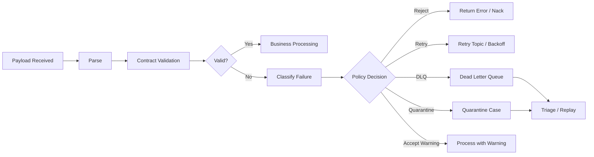
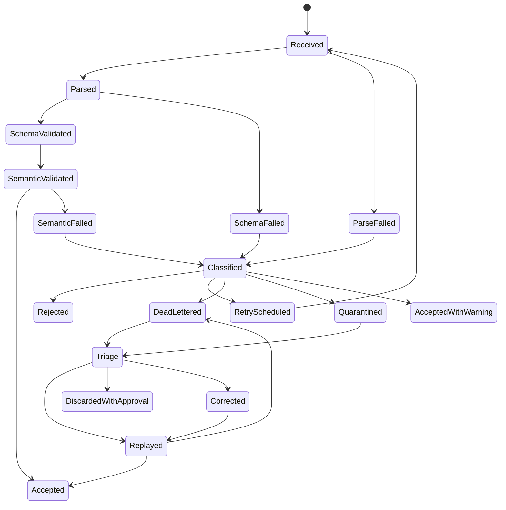
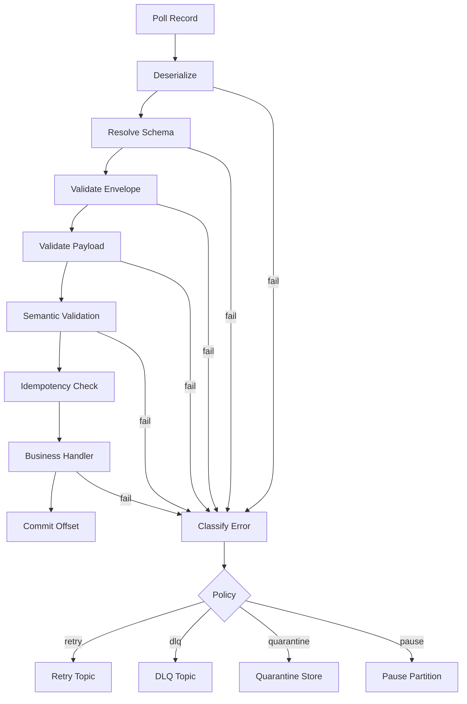
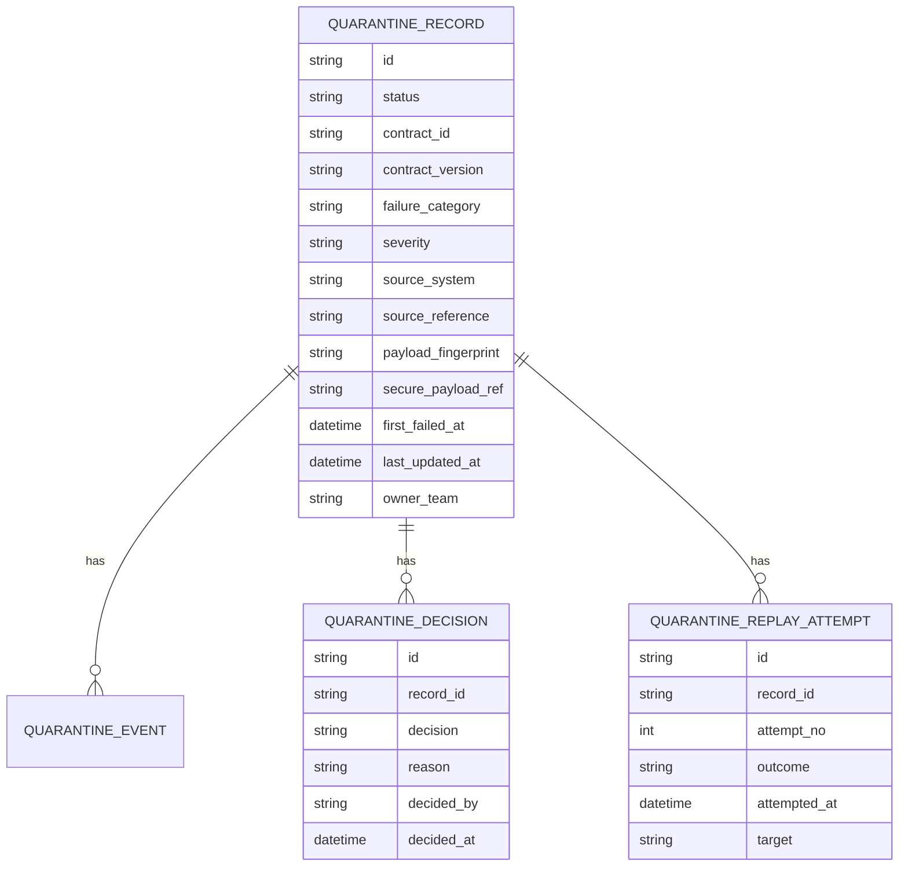
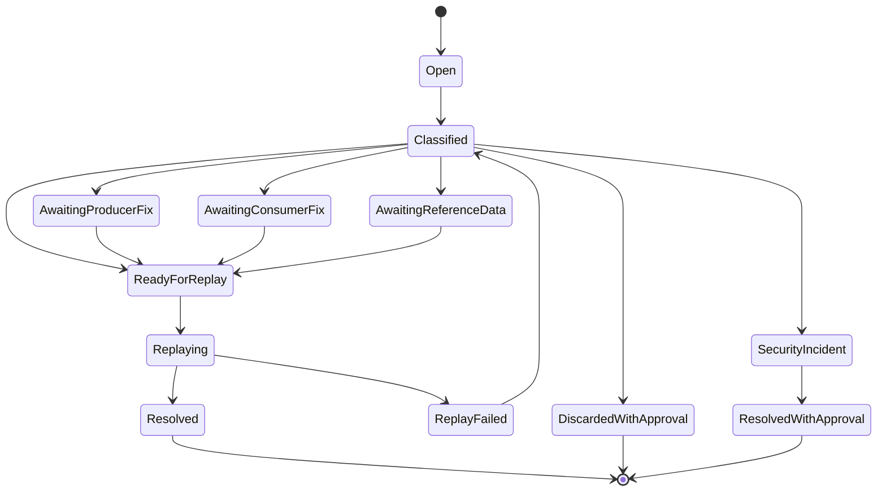
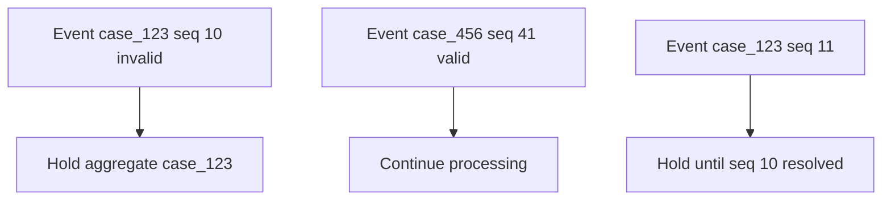
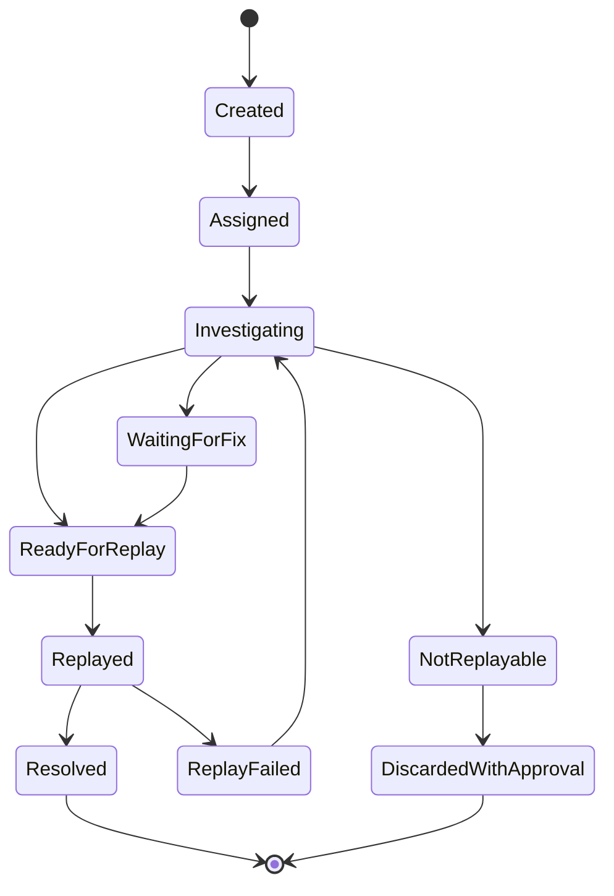

# Part 042 — Contract Error Handling, Dead Letter, and Quarantine Design

Runtime validation tanpa error handling yang baik hanya memindahkan masalah dari “data rusak” menjadi “sistem berhenti”.

Sistem produksi butuh jawaban untuk pertanyaan berikut:

- payload invalid harus ditolak atau diterima dengan warning?
- message event invalid harus di-retry, di-DLQ, atau di-quarantine?
- apakah error bersifat transient atau permanent?
- apakah payload boleh direplay setelah schema diperbaiki?
- bagaimana menjaga ordering Kafka jika satu message rusak?
- bagaimana operator tahu field mana yang rusak?
- siapa yang boleh melihat raw payload invalid?
- bagaimana bukti audit disimpan?
- kapan DLQ menjadi incident?
- bagaimana mencegah poison message loop?

Bagian ini membahas desain error handling kontrak secara production-grade: taxonomy, policy, HTTP error model, Kafka DLQ, quarantine workflow, replay safety, Java implementation, security/privacy, dan operational triage.

---

## 1. Mental Model: Invalid Data Is a First-Class Domain Event

Kesalahan kontrak bukan sekadar exception.

Kesalahan kontrak adalah fakta operasional bahwa dua sistem tidak lagi sepakat tentang data yang dipertukarkan.



Jika invalid payload hanya menjadi log, data hilang secara operasional. Jika invalid payload langsung membuat consumer crash, sistem kehilangan availability. Jika semua invalid payload masuk DLQ tanpa metadata, operator tidak bisa memperbaiki.

Desain yang baik membuat invalid data bisa:

- diklasifikasikan
- diamankan
- ditelusuri
- ditriage
- diperbaiki jika mungkin
- direplay dengan aman
- diaudit

---

## 2. Error Taxonomy

Langkah pertama adalah membedakan jenis error.

| Category | Contoh | Biasanya retry? | Biasanya DLQ/quarantine? |
|---|---|---:|---:|
| Parse error | JSON malformed, Avro binary corrupt, XML invalid | Tidak | Ya |
| Schema violation | required field missing, wrong type | Tidak | Ya |
| Compatibility violation | writer schema tidak cocok reader schema | Tidak langsung | Ya / hold |
| Unknown field | closed schema menerima field baru | Tidak | Tergantung policy |
| Unknown enum | value baru tidak dikenali | Tidak | Sering ya |
| Semantic violation | `decisionDate < submittedDate` | Tidak | Quarantine |
| Referential violation | `authorityCode` tidak ada di reference data | Kadang | Quarantine/retry |
| Temporal violation | event terlambat, effective date belum aktif | Kadang | Retry/hold/quarantine |
| Security violation | signature invalid, forbidden field | Tidak | Reject + incident |
| Privacy violation | PII muncul di event publik | Tidak | Quarantine + incident |
| Duplicate/idempotency | event sudah diproses | Tidak | Ignore/audit |
| Transient infrastructure | registry timeout, DB down | Ya | Retry, bukan DLQ dulu |
| Poison message | message selalu membuat consumer gagal | Tidak setelah threshold | DLQ/quarantine |
| Runtime bug | NullPointerException di consumer | Tidak sebagai data error | Incident, mungkin pause consumer |

Error taxonomy memengaruhi routing. Jangan semua error masuk kategori “failed”.

---

## 3. Reject, Retry, DLQ, Quarantine: Jangan Dicampur

Empat mekanisme ini sering disamakan, padahal berbeda.

### 3.1 Reject

Reject berarti payload tidak diterima sebagai input valid.

Cocok untuk:

- HTTP request invalid
- unauthorized field
- parse error dari external client
- schema violation yang jelas
- command yang belum diproses

Contoh HTTP:

```http
HTTP/1.1 400 Bad Request
Content-Type: application/problem+json
```

### 3.2 Retry

Retry hanya untuk error yang mungkin berhasil jika dicoba lagi.

Cocok untuk:

- registry sementara unavailable
- reference data service timeout
- database transient failure
- network issue
- consumer dependency down

Tidak cocok untuk:

- malformed JSON
- missing required field
- unknown enum closed set
- invalid signature
- Protobuf field number reuse

Retry error permanent hanya menghasilkan traffic storm.

### 3.3 Dead Letter Queue

DLQ adalah tempat untuk message yang gagal diproses setelah policy retry atau karena error permanent. DLQ biasanya topic/queue teknis.

Cocok untuk:

- Kafka consumer tidak bisa memproses message
- deserialization failure
- schema validation failure
- poison message
- transformation failure
- connector sink failure

DLQ harus punya metadata cukup agar message bisa diinvestigasi dan direplay.

### 3.4 Quarantine

Quarantine adalah workflow operasional/domain untuk data bermasalah yang perlu review, koreksi, approval, atau evidence.

Cocok untuk:

- data regulasi invalid tapi tidak boleh hilang
- PII leak harus diamankan
- case command invalid dari upstream resmi
- event penting gagal semantic validation
- batch record invalid yang perlu koreksi manual
- data harus dipertahankan untuk audit

DLQ adalah mekanisme teknis. Quarantine adalah proses operasional.

Seringnya: DLQ adalah input ke quarantine workflow.

---

## 4. Failure Classification State Machine



State machine ini penting karena error handling adalah lifecycle, bukan `catch(Exception e)`.

---

## 5. HTTP Contract Error Handling

Untuk synchronous HTTP APIs, client harus mendapatkan error yang actionable.

Gunakan error model konsisten seperti Problem Details.

### 5.1 Contract Validation Problem

```json
{
  "type": "https://errors.acme.internal/contracts/schema-violation",
  "title": "Request body violates contract",
  "status": 400,
  "detail": "The request body does not match contract case-intake-command v2.3.0.",
  "instance": "/cases/requests/req_01J...",
  "contractId": "case-intake-command",
  "contractVersion": "2.3.0",
  "correlationId": "corr_01J...",
  "violations": [
    {
      "pointer": "/applicant/nationalId",
      "rule": "required",
      "message": "Required field is missing"
    }
  ]
}
```

### 5.2 Status Code Mapping

| Failure | Status |
|---|---:|
| Malformed JSON/XML | 400 |
| Schema validation error | 400 |
| Semantic command invalid | 422 |
| Unsupported media type | 415 |
| Unsupported API version | 400 / 406 |
| Auth/security violation | 401 / 403 |
| Duplicate idempotency key with conflicting payload | 409 |
| Reference data unavailable | 503 |
| Registry unavailable | 503 if required for processing |
| Payload too large | 413 |

Jangan memakai `500` untuk client contract violation. `500` berarti server gagal, bukan client mengirim payload invalid.

### 5.3 Java Exception Mapping

```java
public final class ContractViolationException extends RuntimeException {
    private final ContractValidationResult result;

    public ContractViolationException(ContractValidationResult result) {
        super("Contract validation failed: " + result.contractId());
        this.result = result;
    }

    public ContractValidationResult result() {
        return result;
    }
}
```

JAX-RS-style mapper:

```java
@Provider
public final class ContractViolationExceptionMapper
        implements ExceptionMapper<ContractViolationException> {

    @Override
    public Response toResponse(ContractViolationException exception) {
        ContractValidationResult result = exception.result();

        ContractProblem problem = ContractProblem.from(result);

        return Response.status(problem.status())
                .type("application/problem+json")
                .entity(problem)
                .build();
    }
}
```

Spring-style mapper:

```java
@RestControllerAdvice
public final class ContractExceptionHandler {

    @ExceptionHandler(ContractViolationException.class)
    public ResponseEntity<ContractProblem> handle(ContractViolationException ex) {
        ContractProblem problem = ContractProblem.from(ex.result());
        return ResponseEntity
                .status(problem.status())
                .contentType(MediaType.valueOf("application/problem+json"))
                .body(problem);
    }
}
```

---

## 6. Async/Event Contract Error Handling

Event-driven systems berbeda dari HTTP:

- producer mungkin sudah sukses publish
- consumer gagal jauh setelah producer selesai
- tidak ada response langsung ke caller
- retry bisa mengganggu ordering
- satu poison message bisa memblokir partition
- payload invalid tidak boleh hilang
- replay harus idempotent

### 6.1 Consumer Processing Pipeline



### 6.2 Retry Topics

Gunakan retry topic untuk transient failure.

Contoh topic:

```text
case-events.main
case-events.retry.1m
case-events.retry.10m
case-events.retry.1h
case-events.dlq
```

Metadata retry:

```json
{
  "retryAttempt": 2,
  "firstFailureAt": "2026-07-03T10:15:30Z",
  "lastFailureAt": "2026-07-03T10:27:30Z",
  "nextEligibleAt": "2026-07-03T10:37:30Z",
  "failureCategory": "REFERENTIAL_VIOLATION",
  "failureReason": "authority-code-service unavailable"
}
```

Retry topic harus memiliki limit. Infinite retry adalah distributed denial-of-service terhadap diri sendiri.

---

## 7. DLQ Message Envelope

DLQ tanpa metadata hampir tidak berguna.

Minimal DLQ envelope:

```json
{
  "dlqId": "dlq_01J...",
  "failedAt": "2026-07-03T10:15:30Z",
  "source": {
    "system": "kafka",
    "topic": "case-events.main",
    "partition": 12,
    "offset": 9348841,
    "key": "case_123"
  },
  "consumer": {
    "service": "case-projection-service",
    "version": "3.9.1",
    "groupId": "case-projection-prod"
  },
  "producer": {
    "service": "case-workflow-service",
    "version": "4.8.0"
  },
  "contract": {
    "id": "case-event-envelope",
    "version": "3.1.0",
    "format": "protobuf",
    "schemaSubject": "case-events-value",
    "schemaId": "1042"
  },
  "failure": {
    "category": "UNKNOWN_ENUM_VALUE",
    "severity": "ERROR",
    "pointer": "/eventType",
    "rule": "closed-enum",
    "message": "Unknown event type CASE_ESCALATED"
  },
  "correlation": {
    "traceId": "0af7651916cd43dd8448eb211c80319c",
    "correlationId": "corr_01J...",
    "causationId": "cmd_01J..."
  },
  "payload": {
    "encoding": "base64",
    "contentType": "application/x-protobuf",
    "fingerprint": "sha256:7c1e...",
    "storageRef": "secure://contract-quarantine/prod/dlq_01J..."
  },
  "replay": {
    "allowed": true,
    "attempts": 0,
    "maxAttempts": 3,
    "requiresApproval": true
  }
}
```

### 7.1 Simpan Raw Payload atau Reference?

Untuk payload sensitif, DLQ topic sebaiknya tidak menyimpan raw payload lengkap. Simpan reference ke secure storage.

| Approach | Kelebihan | Risiko |
|---|---|---|
| Raw payload in DLQ | Mudah replay | PII leak, topic retention risk |
| Redacted payload in DLQ | Aman untuk observability | Tidak cukup untuk replay |
| Secure storage reference | Lebih aman dan auditable | Lebih kompleks |
| Payload fingerprint only | Aman | Tidak bisa replay langsung |

Untuk regulatory/PII-heavy systems, pilih secure storage reference + access audit.

---

## 8. DLQ Topic Design

### 8.1 Naming

Contoh:

```text
<domain>.<stream>.dlq
case.events.dlq
enforcement.commands.dlq
reporting.exports.dlq
```

Atau per consumer:

```text
case.events.case-projection-service.dlq
case.events.reporting-service.dlq
```

Trade-off:

| Strategy | Kelebihan | Kekurangan |
|---|---|---|
| Shared DLQ per stream | Sederhana, mudah monitor | Perlu metadata consumer kuat |
| DLQ per consumer | Ownership jelas | Banyak topic |
| DLQ per category | Triage mudah | Routing kompleks |
| DLQ per criticality | Incident handling mudah | Bisa membingungkan producer |

### 8.2 Partitioning

Pertanyaan penting: apakah DLQ perlu preserve key/partition?

Jika replay harus menjaga ordering per aggregate, gunakan key yang sama dengan event asli.

Namun DLQ triage sering lebih mudah jika partition berdasarkan category atau consumer. Pilih berdasarkan replay requirement.

Untuk event sourcing atau case lifecycle, ordering per `caseId` sering sangat penting.

### 8.3 Retention

DLQ retention harus lebih lama dari topic normal jika butuh investigasi.

Namun jangan membuat DLQ menjadi archive permanen tanpa governance.

Retensi harus mempertimbangkan:

- data sensitivity
- regulatory retention
- replay window
- storage cost
- legal hold
- right-to-erasure constraint jika berlaku
- audit policy

---

## 9. Quarantine Domain Model

Quarantine bukan hanya topic. Ia sebaiknya dimodelkan sebagai case/work item.



### 9.1 Quarantine Status



Status harus menjelaskan mengapa record tertahan.

---

## 10. Replay Safety

Replay adalah bagian paling berbahaya dari DLQ/quarantine.

Jika replay tidak idempotent, data bisa digandakan atau state machine bisa bergerak dua kali.

### 10.1 Replay Preconditions

Sebelum replay:

- contract yang diperlukan sudah approved
- consumer sudah support payload
- producer bug sudah dipahami
- reference data sudah tersedia
- idempotency key ada
- duplicate detection aktif
- ordering impact dianalisis
- replay target jelas
- operator approval tercatat
- replay window aman

### 10.2 Replay Envelope

Replay harus menandai bahwa message adalah replay.

```json
{
  "replay": {
    "isReplay": true,
    "replayId": "replay_01J...",
    "sourceDlqId": "dlq_01J...",
    "originalTopic": "case-events.main",
    "originalPartition": 12,
    "originalOffset": 9348841,
    "approvedBy": "alice@example.internal",
    "approvedAt": "2026-07-03T12:00:00Z",
    "reason": "Consumer updated to support CASE_ESCALATED"
  }
}
```

### 10.3 Idempotency Store

```java
public interface ProcessedMessageStore {
    boolean alreadyProcessed(String idempotencyKey);
    void markProcessed(String idempotencyKey, Instant processedAt);
}
```

Consumer pattern:

```java
public void handle(EventEnvelope event) {
    String key = event.idempotencyKey();

    if (processedMessageStore.alreadyProcessed(key)) {
        telemetry.recordDuplicate(event);
        return;
    }

    domainHandler.handle(event);
    processedMessageStore.markProcessed(key, clock.instant());
}
```

Untuk DB-backed consumers, idempotency mark dan business state change harus transactional jika memungkinkan.

---

## 11. Ordering Problems

Dalam Kafka, satu invalid message di partition bisa memblokir event berikutnya jika consumer tidak commit offset.

Pilihan:

### 11.1 Stop Partition

Cocok jika ordering mutlak.

Kelebihan:

- menjaga order
- tidak melompati event penting

Kekurangan:

- availability turun
- lag naik
- satu poison message bisa stop aggregate/partition

### 11.2 DLQ and Continue

Cocok jika ordering tidak mutlak atau message invalid tidak boleh memblokir.

Kelebihan:

- consumer tetap jalan
- throughput terjaga

Kekurangan:

- state bisa tidak lengkap
- replay kemudian bisa out-of-order

### 11.3 Per-Aggregate Hold

Cocok untuk domain seperti case lifecycle.

Jika event untuk `case_123` invalid, tahan event berikutnya untuk `case_123`, tapi aggregate lain tetap diproses.

Lebih kompleks, tetapi sering benar untuk sistem stateful.



---

## 12. Batch/File Contract Error Handling

Batch berbeda dari stream.

Pertanyaan utama:

- apakah satu row invalid membatalkan seluruh file?
- apakah file partial boleh diterima?
- bagaimana error row dilaporkan?
- apakah row invalid bisa diperbaiki dan di-resubmit?
- apakah checksum berubah setelah koreksi?

### 12.1 Batch Validation Result

```json
{
  "batchId": "batch_20260703_001",
  "contractId": "monthly-enforcement-report",
  "contractVersion": "2026.3",
  "fileName": "enforcement-report-2026-06.csv",
  "recordCount": 100000,
  "validCount": 99940,
  "invalidCount": 60,
  "outcome": "ACCEPTED_WITH_REJECTED_ROWS",
  "errorReportRef": "secure://batch-errors/batch_20260703_001/errors.csv"
}
```

### 12.2 Batch Policy

| Policy | Kapan dipakai |
|---|---|
| All-or-nothing | Regulatory report final, financial settlement |
| Partial accept with reject file | Large ingestion with independent rows |
| Threshold accept | Terima jika invalid < 0.1% dan bukan critical |
| Quarantine file | Sensitive or systemic error |
| Manual approval | External agency data correction |

---

## 13. Security and Privacy Failure Handling

Security/privacy violation tidak boleh diperlakukan seperti schema violation biasa.

Contoh:

- payload mengandung `ssn` di topic public
- field encrypted datang plaintext
- signature invalid
- tenant ID mismatch
- field forbidden muncul di command
- access scope tidak sesuai operation

Policy:

- jangan retry blindly
- jangan log raw payload
- quarantine secure
- alert security/privacy owner
- record incident evidence
- block producer jika perlu
- rotate credential jika ada indikasi leak

---

## 14. Java Error Classifier

```java
public interface ContractErrorClassifier {
    ContractErrorDecision classify(ContractValidationResult result, ProcessingContext context);
}

public record ContractErrorDecision(
    ContractErrorAction action,
    String reason,
    String severity,
    boolean replayAllowed,
    boolean approvalRequired
) {}

public enum ContractErrorAction {
    ACCEPT_WITH_WARNING,
    REJECT,
    RETRY,
    DEAD_LETTER,
    QUARANTINE,
    PAUSE_PARTITION,
    INCIDENT
}
```

Rule-based classifier:

```java
public final class DefaultContractErrorClassifier implements ContractErrorClassifier {

    @Override
    public ContractErrorDecision classify(
            ContractValidationResult result,
            ProcessingContext context
    ) {
        if (result.hasCategory(ContractFailureCategory.PRIVACY_VIOLATION)) {
            return new ContractErrorDecision(
                    ContractErrorAction.INCIDENT,
                    "Privacy violation requires incident handling",
                    "CRITICAL",
                    false,
                    true
            );
        }

        if (result.hasCategory(ContractFailureCategory.SECURITY_VIOLATION)) {
            return new ContractErrorDecision(
                    ContractErrorAction.REJECT,
                    "Security violation is not retryable",
                    "CRITICAL",
                    false,
                    false
            );
        }

        if (result.hasCategory(ContractFailureCategory.SCHEMA_VIOLATION)) {
            return new ContractErrorDecision(
                    ContractErrorAction.DEAD_LETTER,
                    "Schema violation is normally permanent",
                    "ERROR",
                    true,
                    true
            );
        }

        if (result.hasCategory(ContractFailureCategory.REFERENTIAL_VIOLATION)
                && context.referenceDataServiceUnavailable()) {
            return new ContractErrorDecision(
                    ContractErrorAction.RETRY,
                    "Reference data dependency unavailable",
                    "WARN",
                    true,
                    false
            );
        }

        return new ContractErrorDecision(
                ContractErrorAction.QUARANTINE,
                "Default contract failure route",
                "ERROR",
                true,
                true
        );
    }
}
```

---

## 15. Kafka Listener Error Handling Pattern

Pseudo-code:

```java
public void onMessage(ConsumerRecord<String, byte[]> record) {
    ProcessingContext context = ProcessingContext.from(record);

    try {
        EventEnvelope event = deserializer.deserialize(record);
        ContractValidationResult validation = validator.validate(
                ContractValidationRequest.forKafkaConsume(event, context)
        );

        if (!validation.isAccepted()) {
            ContractErrorDecision decision = classifier.classify(validation, context);
            routeFailure(record, validation, decision, context);
            return;
        }

        handler.handle(event);
        offsetManager.commit(record);

    } catch (TransientDependencyException ex) {
        retryPublisher.publish(record, ex, context);
        offsetManager.commit(record);

    } catch (Exception ex) {
        ContractValidationResult runtimeFailure = ContractValidationResultFactory.runtimeError(record, ex);
        ContractErrorDecision decision = classifier.classify(runtimeFailure, context);
        routeFailure(record, runtimeFailure, decision, context);
    }
}
```

`routeFailure` harus eksplisit:

```java
private void routeFailure(
        ConsumerRecord<String, byte[]> record,
        ContractValidationResult validation,
        ContractErrorDecision decision,
        ProcessingContext context
) {
    switch (decision.action()) {
        case REJECT -> offsetManager.commit(record); // for async consume, reject means do not process and move on after evidence
        case RETRY -> retryPublisher.publish(record, validation, context);
        case DEAD_LETTER -> dlqPublisher.publish(record, validation, decision, context);
        case QUARANTINE -> quarantineService.open(record, validation, decision, context);
        case PAUSE_PARTITION -> partitionController.pause(record.topic(), record.partition(), validation);
        case INCIDENT -> incidentService.raise(record, validation, decision, context);
        case ACCEPT_WITH_WARNING -> {
            telemetry.recordWarning(validation);
            handler.handleWithWarning(record, validation);
        }
    }

    if (decision.action() != ContractErrorAction.PAUSE_PARTITION) {
        offsetManager.commit(record);
    }
}
```

Offset commit policy harus sangat hati-hati. Commit setelah DLQ publish harus dilakukan hanya jika DLQ publish sukses, agar message tidak hilang.

---

## 16. Transactional Considerations

Untuk Kafka:

- publish DLQ dan commit offset harus atomic secara desain sejauh mungkin
- jika memakai Kafka transactions, producer/consumer transaction boundary perlu diuji
- jika tidak atomic, gunakan idempotent DLQ key dan retry-safe DLQ publisher
- jangan commit offset sebelum evidence tersimpan

Rule praktis:

```text
Never acknowledge/commit a failed message until its failure evidence is durably recorded.
```

---

## 17. Poison Message Handling

Poison message adalah message yang selalu membuat processing gagal.

Tanda-tanda:

- failure berulang untuk offset yang sama
- retry count meningkat tanpa perubahan category
- consumer lag stuck
- p95 processing latency naik
- same payload fingerprint gagal di banyak consumer

Policy:

1. classify as permanent after threshold
2. route to DLQ/quarantine
3. commit offset only after durable recording
4. alert owner
5. block replay until root cause clear

---

## 18. Dead Letter Is Not a Trash Bin

DLQ harus diperlakukan sebagai controlled failure store.

Setiap DLQ record harus punya lifecycle:



DLQ tanpa owner, SLA, dan triage dashboard akan menjadi kuburan data.

---

## 19. Quarantine Workflow untuk Regulatory Systems

Dalam sistem enforcement/regulatory, invalid payload sering tidak boleh dibuang.

Contoh command:

```json
{
  "commandType": "ESCALATE_CASE",
  "caseId": "case_123",
  "authorityCode": "AUTH-OLD-999",
  "reasonCode": "SYSTEMIC_RISK",
  "requestedBy": "officer_77"
}
```

Error:

```text
authorityCode AUTH-OLD-999 tidak valid untuk effective date 2026-07-03
```

Response yang benar mungkin bukan reject permanen. Bisa jadi reference data belum sinkron.

Quarantine record:

- status: `AWAITING_REFERENCE_DATA`
- owner: `regulatory-reference-data-team`
- replay allowed: yes
- approval required: no jika reference data fix otomatis
- SLA: 4 business hours

Jika ternyata code tidak sah:

- status: `DISCARDED_WITH_APPROVAL`
- decision by authorized officer
- evidence retained

---

## 20. Error Report Design untuk Operator

Operator tidak butuh stack trace. Mereka butuh error yang bisa ditindaklanjuti.

Contoh table UI:

| Field | Value |
|---|---|
| Quarantine ID | `qr_01J...` |
| Contract | `case-escalation-command v2.4.0` |
| Failure | `REFERENTIAL_VIOLATION` |
| Pointer | `/authorityCode` |
| Observed | `AUTH-OLD-999` masked/allowed |
| Expected | valid authority code for effective date |
| Source | `case-portal` v1.41.0 |
| Impact | case escalation not applied |
| Recommended action | verify reference data table `authority_code` |
| Replay allowed | yes |

---

## 21. Contract Error Codes

Gunakan error code stabil.

```yaml
errors:
  CONTRACT_PARSE_ERROR:
    category: PARSE_ERROR
    retryable: false
  CONTRACT_REQUIRED_FIELD_MISSING:
    category: SCHEMA_VIOLATION
    retryable: false
  CONTRACT_UNKNOWN_ENUM_VALUE:
    category: UNKNOWN_ENUM_VALUE
    retryable: false
  CONTRACT_REFERENCE_DATA_UNAVAILABLE:
    category: REFERENTIAL_VIOLATION
    retryable: true
  CONTRACT_PII_POLICY_VIOLATION:
    category: PRIVACY_VIOLATION
    retryable: false
    incident: true
```

Error code stabil lebih berguna daripada message string.

---

## 22. Contract Error Envelope as CloudEvent-like Metadata

CloudEvents menstandarkan metadata umum untuk event identification dan routing. Untuk DLQ/quarantine, kita bisa mengadopsi prinsip serupa: metadata stabil di envelope, payload di data/ref.

Contoh:

```json
{
  "specversion": "1.0",
  "type": "com.acme.contract.validation.failed",
  "source": "kafka://prod/case-events.main/12/9348841",
  "id": "dlq_01J...",
  "time": "2026-07-03T10:15:30Z",
  "subject": "case_123",
  "datacontenttype": "application/json",
  "data": {
    "contractId": "case-event-envelope",
    "contractVersion": "3.1.0",
    "failureCategory": "UNKNOWN_ENUM_VALUE",
    "pointer": "/eventType",
    "originalPayloadRef": "secure://contract-quarantine/prod/dlq_01J..."
  }
}
```

Jangan memaksakan CloudEvents jika platform tidak memakainya, tetapi prinsip metadata/payload separation tetap berguna.

---

## 23. Governance: Siapa Owner DLQ?

DLQ ownership harus jelas.

| Failure | Primary owner | Supporting owner |
|---|---|---|
| Producer sends invalid schema | Producer team | Contract platform |
| Consumer cannot deserialize new valid schema | Consumer team | Contract owner |
| Registry unavailable | Platform team | Service owner |
| Reference data missing | Reference data owner | Domain owner |
| PII leak | Security/privacy owner | Producer team |
| Unknown enum approved but consumer old | Consumer team | Migration owner |
| Batch file invalid from agency | Integration owner | Business operations |

Tanpa ownership, DLQ backlog akan menumpuk.

---

## 24. DLQ and Quarantine Metrics

Minimal metrics:

| Metric | Tujuan |
|---|---|
| `contract_dlq_total` | Total routed to DLQ |
| `contract_dlq_publish_failure_total` | DLQ publish itself failed |
| `contract_quarantine_open_total` | Open quarantine records |
| `contract_quarantine_age_seconds` | Age/backlog SLA |
| `contract_replay_total` | Replay attempts/outcomes |
| `contract_replay_failure_total` | Replay failed |
| `contract_retry_total` | Retry attempts by category |
| `contract_poison_message_total` | Poison message count |
| `contract_discard_with_approval_total` | Records discarded after approval |

Alert examples:

```text
Critical: contract_quarantine_open_total{severity="critical"} > 0 for 5 minutes
Warning: contract_quarantine_age_seconds p95 > 4h
Critical: contract_dlq_publish_failure_total > 0
Warning: deprecated contract version causing DLQ > 1% traffic
```

---

## 25. Anti-Patterns

### 25.1 Retry Everything

Permanent validation errors will never succeed through retry.

### 25.2 DLQ Without Original Metadata

If DLQ loses topic, partition, offset, key, schema ID, and contract version, replay becomes guesswork.

### 25.3 Commit Offset Before DLQ Publish

This can lose message forever.

### 25.4 Raw Payload in Ordinary Logs

Creates privacy and security risk.

### 25.5 Manual Replay Without Idempotency

Can duplicate side effects.

### 25.6 Treat Quarantine as Engineering-Only

Many quarantined records need business/domain decision.

### 25.7 No SLA for DLQ

DLQ becomes a permanent garbage heap.

### 25.8 Ignore Ordering Impact

DLQ-and-continue can corrupt projections if event order matters.

---

## 26. Production Checklist

Before declaring DLQ/quarantine production-ready:

- [ ] error taxonomy defined
- [ ] retryable vs non-retryable rules documented
- [ ] HTTP error mapping consistent
- [ ] DLQ envelope includes source topic/partition/offset/key
- [ ] DLQ includes contract ID/version/schema ID
- [ ] DLQ publish failure is observable
- [ ] offset commit happens only after failure evidence is durable
- [ ] raw payload storage policy defined
- [ ] sensitive payload uses secure reference, not raw DLQ body
- [ ] quarantine workflow has owner and SLA
- [ ] replay requires idempotency key
- [ ] replay attempts are audited
- [ ] ordering policy documented
- [ ] poison message handling exists
- [ ] security/privacy violations escalate differently
- [ ] metrics and alerts exist
- [ ] discard requires approval for regulated data
- [ ] runbooks exist for top failure categories

---

## 27. Exercises

### Exercise 1 — Classify Errors

Untuk setiap error berikut, tentukan action: reject, retry, DLQ, quarantine, pause partition, atau incident.

1. JSON malformed dari public API client.
2. Kafka consumer gagal karena Schema Registry timeout.
3. Event memiliki enum baru `CASE_ESCALATED` yang belum dikenal consumer.
4. Payload mengandung `nationalId` di topic analytics public.
5. Batch file memiliki 20 row invalid dari 2 juta row.
6. Event sequence 10 untuk `case_123` invalid, sequence 11 sudah tiba.

### Exercise 2 — Design DLQ Envelope

Buat DLQ envelope untuk event Avro `case-status-changed` yang gagal karena enum unknown. Sertakan schema subject, schema ID, topic, partition, offset, producer, consumer, correlation ID, dan replay metadata.

### Exercise 3 — Build Quarantine State Machine

Desain state machine quarantine untuk command `ESCALATE_CASE` yang gagal karena `authorityCode` tidak valid.

### Exercise 4 — Replay Safety Review

Tentukan precondition replay untuk payload yang sudah masuk DLQ selama 3 hari dan consumer sudah diperbaiki.

---

## 28. Key Takeaways

1. Contract failure harus diperlakukan sebagai lifecycle, bukan exception tunggal.
2. Retry hanya untuk transient error; permanent validation error harus DLQ/quarantine/reject.
3. DLQ adalah mekanisme teknis; quarantine adalah workflow operasional/domain.
4. Jangan commit offset sebelum failure evidence tersimpan durable.
5. Replay tanpa idempotency adalah sumber korupsi state.
6. Ordering policy harus diputuskan eksplisit, terutama untuk aggregate lifecycle seperti case management.
7. Security dan privacy violation harus punya jalur escalation berbeda dari schema violation biasa.
8. DLQ tanpa owner, SLA, metrics, dan replay policy hanya menjadi tempat sampah data.

---

## 29. References

- Confluent Kafka Connect Configuration — `errors.deadletterqueue.topic.name` for failed sink connector records.
- Confluent Data Contracts for Schema Registry — rule actions including DLQ behavior for validation failures.
- Confluent Schema Registry Documentation — schema evolution and compatibility modes.
- CloudEvents Specification — common event metadata for event identification and routing.
- OpenAPI Specification 3.2.0 — HTTP API contract and response model.
- RFC 9457 — Problem Details for HTTP APIs.
- Apache Avro 1.12.0 Specification — schema resolution and serialization behavior.
- Protocol Buffers Documentation — unknown fields, field presence, reserved fields, and compatibility guidance.
