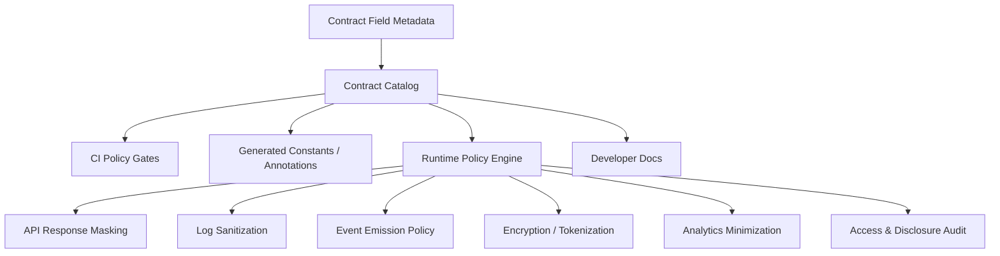
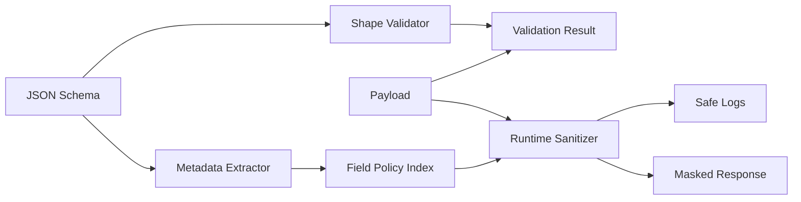
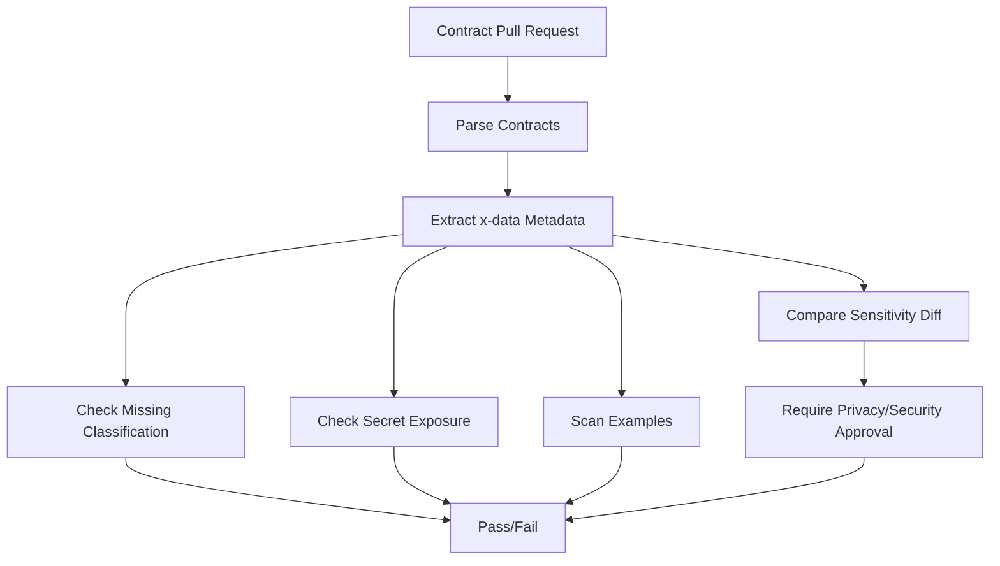
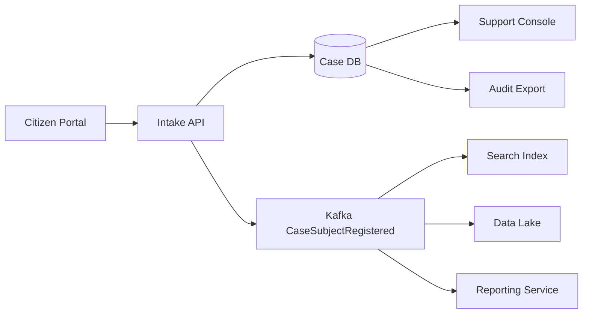

# Part 043 — Sensitive Data Contracts, PII Classification, and Masking

Data contract engineering becomes dangerous when it treats every field as merely a type.

A field is not only this:

```yaml
nationalId:
  type: string
```

A production-grade contract needs to answer harder questions:

- Is this field personal data?
- Is it directly identifying, indirectly identifying, sensitive, confidential, regulated, or operationally secret?
- May it appear in logs?
- May it appear in traces?
- May it be emitted to Kafka?
- May it be copied to a data lake?
- May it be exposed to a support agent?
- May it be returned to the same user, another department, a regulator, or a downstream automated decision system?
- How long may it be retained?
- Should it be masked, hashed, tokenized, encrypted, or redacted?
- Is the value itself sensitive, or only sensitive in combination with other fields?

That is the real subject of this part.

We are no longer designing only shape. We are designing **data handling obligations**.

A top-tier engineer does not say, “the schema validates.” A top-tier engineer asks:

> If this contract is valid, is the system also allowed to store, log, emit, expose, index, search, replay, and analyze this data?

That is a different standard.

---

## 1. The mental model: a sensitive data contract is a policy surface

A normal contract says:

```text
This field exists.
This field has this type.
This field is required.
This field follows this format.
```

A sensitive data contract says:

```text
This field exists.
This field has this type.
This field has this business meaning.
This field has this sensitivity.
This field may be used for these purposes.
This field may be seen by these roles.
This field may be retained for this long.
This field may be logged only in this representation.
This field may be emitted only to these consumers.
This field must be encrypted/tokenized/masked before crossing this boundary.
```

The shape contract protects interoperability.

The sensitivity contract protects people, institutions, evidence, auditability, and legal defensibility.

In a regulatory case-management system, a `caseId` may look harmless. But combined with a `subjectType`, `violationCode`, `riskScore`, `assignedInvestigator`, and `enforcementOutcome`, it may reveal something highly sensitive about an individual or organization.

The point is simple:

> Sensitivity is not always local to one field. Sometimes it emerges from the combination of fields, context, purpose, and audience.

---

## 2. What this part is not

This is not a legal compliance guide.

This is an engineering handbook section for building systems where contracts carry privacy and confidentiality semantics in a way that can be reviewed, tested, enforced, audited, and evolved.

We will focus on engineering mechanisms:

- field-level classification;
- schema extensions;
- masking policy;
- logging policy;
- retention metadata;
- encryption/tokenization hints;
- Java enforcement boundaries;
- CI checks;
- registry/catalog governance;
- runtime observability;
- contract review workflow.

Laws and regulations vary by jurisdiction and business domain. The engineering design should allow those rules to be encoded, reviewed, changed, and evidenced.

---

## 3. Classification vocabulary

Before we annotate contracts, we need a vocabulary.

A weak vocabulary creates weak enforcement. If every important field is simply called `PII`, engineering teams cannot make good decisions. An email address, national ID, risk score, authentication token, internal investigation note, and system correlation ID should not all be treated identically.

Use a classification model like this.

| Category | Meaning | Examples | Engineering implication |
|---|---|---|---|
| `PUBLIC` | Safe for public disclosure | public product code, public office address | may appear in docs/examples/logs |
| `INTERNAL` | Internal but not sensitive | internal workflow status, service owner | avoid public exposure, usually loggable |
| `CONFIDENTIAL` | Business-sensitive | pricing rule, investigation queue, internal score | restricted access, avoid broad logs |
| `PII_DIRECT` | Direct personal identifier | name, national ID, email, phone | mask in logs, restrict exposure |
| `PII_INDIRECT` | Can identify when combined | date of birth, address fragment, employer | assess combination risk |
| `SENSITIVE_PERSONAL` | Highly sensitive personal data | health, biometric, financial hardship, criminal allegation | strict access, minimization, audit |
| `SECRET` | Credential or cryptographic secret | token, API key, password, private key | never log, never expose, rotate |
| `REGULATED_EVIDENCE` | Evidence used in regulated decision | inspection finding, case note, enforcement document | immutable audit, retention, chain of custody |
| `DERIVED_DECISION_DATA` | Derived data influencing decisions | risk score, eligibility flag, sanction recommendation | explainability, lineage, access control |
| `TELEMETRY_SENSITIVE` | Observability data that leaks business/user info | trace baggage, query params, payload fingerprint | sanitize before export |

This is intentionally more precise than “PII yes/no.”

A boolean flag cannot model real-world handling obligations.

---

## 4. Classification is not the same as masking

Many teams confuse these concepts:

```text
classification = what the data is
masking        = one handling control
```

A field can be classified without being masked in every context. A national ID may be fully visible to a verified case officer in a secure internal case detail screen, partially masked in a support console, hashed in analytics, tokenized in events, and fully redacted in logs.

That means the contract should not say only:

```yaml
x-masked: true
```

It should say something closer to:

```yaml
x-data:
  classification: PII_DIRECT
  subjectCategory: PERSON
  allowedPurposes:
    - CASE_INVESTIGATION
    - REGULATORY_REPORTING
  logging:
    policy: REDACT
  display:
    defaultMask: LAST_4
  storage:
    encryption: FIELD_LEVEL
  retention:
    policy: CASE_RETENTION_STANDARD
```

Masking is an output rendering decision. Classification is a semantic property of the field.

Keep them separate.

---

## 5. The policy stack

A sensitive data contract should feed multiple control points.



A contract is useful only if the metadata is consumed.

Metadata that lives in OpenAPI but is ignored by runtime is documentation, not control.

The goal is a closed loop:

1. Contract declares sensitivity.
2. CI checks the declaration.
3. Generated artifacts expose it to code.
4. Runtime policy enforces it.
5. Logs/metrics prove it.
6. Review process changes it intentionally.

---

## 6. Contract annotation pattern

Most contract languages do not provide a universal built-in privacy classification model. The practical solution is to use controlled vendor extensions or metadata conventions.

The key is consistency across formats.

Use one internal vocabulary and map it into each schema language.

### 6.1 Internal canonical metadata

Define one canonical metadata shape.

```yaml
classification: PII_DIRECT
subjectCategory: PERSON
confidentiality: RESTRICTED
purpose:
  allowed:
    - CASE_INTAKE
    - CASE_INVESTIGATION
retention:
  policy: CASE_FILE_RETENTION_7Y
logging:
  policy: REDACT
  reason: direct_identifier
masking:
  default: LAST_4
  supportView: PARTIAL
  publicView: REDACT
storage:
  encryption: FIELD_LEVEL
  tokenization: REQUIRED_FOR_ANALYTICS
lineage:
  sourceSystem: citizen-portal
  sourceField: applicant.nationalIdentifier
access:
  minRole: CASE_OFFICER
  elevatedRole: SUPERVISOR
```

Then project this metadata into OpenAPI, JSON Schema, Avro, Protobuf, and XSD.

---

## 7. OpenAPI sensitive data metadata

OpenAPI supports specification extensions using `x-` fields. This makes it a natural place to attach field-level policy.

```yaml
components:
  schemas:
    CaseSubject:
      type: object
      required:
        - subjectId
        - fullName
      properties:
        subjectId:
          type: string
          format: uuid
          description: Stable public identifier for the case subject.
          x-data:
            classification: PII_INDIRECT
            confidentiality: CONFIDENTIAL
            logging:
              policy: HASH
              algorithm: HMAC_SHA256
            access:
              minRole: CASE_VIEWER
        fullName:
          type: string
          minLength: 1
          maxLength: 200
          x-data:
            classification: PII_DIRECT
            subjectCategory: PERSON
            logging:
              policy: REDACT
            masking:
              default: INITIALS
              supportView: PARTIAL
            retention:
              policy: CASE_FILE_RETENTION_7Y
        nationalId:
          type: string
          minLength: 8
          maxLength: 32
          x-data:
            classification: SENSITIVE_PERSONAL
            logging:
              policy: NEVER
            storage:
              encryption: FIELD_LEVEL
              tokenization: REQUIRED
            access:
              minRole: CASE_OFFICER
              reasonRequired: true
```

Do not overfit this only to documentation. Use it as a source for:

- API documentation warnings;
- generated Java constants;
- response masking tests;
- static checks that examples do not contain realistic secrets;
- runtime audit decisions;
- field-level authorization checks.

### OpenAPI pitfall

OpenAPI `security` describes authentication/authorization schemes at the operation level. It does not automatically enforce object-level authorization, field-level access, masking, or purpose limitation. Those must be enforced by application code, gateway policy, service policy, or data-access policy.

A contract can document the intended policy, but runtime must enforce it.

---

## 8. JSON Schema sensitive metadata

JSON Schema allows unknown keywords as annotations if your processing pipeline supports them. Use a disciplined `x-data` or organization-specific vocabulary.

```json
{
  "$schema": "https://json-schema.org/draft/2020-12/schema",
  "$id": "https://contracts.example.gov/case/case-subject.schema.json",
  "title": "CaseSubject",
  "type": "object",
  "required": ["subjectId", "fullName"],
  "properties": {
    "subjectId": {
      "type": "string",
      "format": "uuid",
      "x-data": {
        "classification": "PII_INDIRECT",
        "logging": { "policy": "HASH" },
        "retention": { "policy": "CASE_FILE_RETENTION_7Y" }
      }
    },
    "fullName": {
      "type": "string",
      "minLength": 1,
      "maxLength": 200,
      "x-data": {
        "classification": "PII_DIRECT",
        "logging": { "policy": "REDACT" },
        "masking": { "default": "INITIALS" }
      }
    }
  },
  "additionalProperties": false
}
```

JSON Schema validation usually checks shape. Your privacy metadata needs a separate processor.

Recommended architecture:



Do not assume the JSON Schema library will understand `x-data`.

---

## 9. Avro sensitive metadata

Avro fields can carry additional attributes. Use them carefully because many tools preserve unknown attributes, but some pipelines may drop them during conversion.

```json
{
  "type": "record",
  "name": "CaseSubjectRegistered",
  "namespace": "gov.example.case.events.v1",
  "fields": [
    {
      "name": "caseId",
      "type": "string",
      "doc": "Public case identifier.",
      "x-data": {
        "classification": "PII_INDIRECT",
        "logging": { "policy": "HASH" }
      }
    },
    {
      "name": "fullName",
      "type": "string",
      "doc": "Legal name of the case subject.",
      "x-data": {
        "classification": "PII_DIRECT",
        "logging": { "policy": "REDACT" },
        "masking": { "default": "INITIALS" }
      }
    },
    {
      "name": "nationalIdToken",
      "type": ["null", "string"],
      "default": null,
      "doc": "Tokenized national ID. Raw value must not be emitted.",
      "x-data": {
        "classification": "SENSITIVE_PERSONAL",
        "tokenized": true,
        "logging": { "policy": "NEVER" }
      }
    }
  ]
}
```

### Avro event rule

For event streams, prefer **data minimization at source**.

Bad:

```text
Emit raw national ID to Kafka, rely on consumers to behave.
```

Better:

```text
Tokenize before emission. Emit only the token plus metadata required for authorized correlation.
```

Events are easy to copy, replay, retain, and fan out. That makes raw sensitive data in events much more dangerous than raw sensitive data in a request-response boundary.

### Schema Registry implication

Registry metadata must be treated as part of governance:

- reject new fields without `x-data.classification`;
- reject `classification: SECRET` in event schemas;
- reject raw direct identifiers in broad fan-out topics;
- require explicit waiver for sensitive personal data;
- require consumer inventory before publishing high-sensitivity fields.

---

## 10. Protobuf sensitive metadata

Protobuf supports custom options, which can be used for field policy. This is stronger than ad hoc comments because options are visible to code generators and descriptor processors.

Example conceptual `.proto`:

```proto
syntax = "proto3";

package gov.example.case.v1;

import "google/protobuf/descriptor.proto";

extend google.protobuf.FieldOptions {
  DataPolicy data_policy = 70001;
}

message DataPolicy {
  string classification = 1;
  string logging_policy = 2;
  string masking_policy = 3;
  string retention_policy = 4;
  bool field_level_encryption = 5;
}

message CaseSubject {
  string subject_id = 1 [(data_policy) = {
    classification: "PII_INDIRECT",
    logging_policy: "HASH",
    retention_policy: "CASE_FILE_RETENTION_7Y"
  }];

  string full_name = 2 [(data_policy) = {
    classification: "PII_DIRECT",
    logging_policy: "REDACT",
    masking_policy: "INITIALS"
  }];

  string national_id_token = 3 [(data_policy) = {
    classification: "SENSITIVE_PERSONAL",
    logging_policy: "NEVER",
    field_level_encryption: true
  }];
}
```

Custom options support descriptor-driven governance:

- fail build if sensitive fields lack policy;
- generate Java `FieldPolicyIndex`;
- generate docs;
- enforce logging sanitization;
- enforce gateway redaction for JSON transcoding.

### Protobuf caveat

Protobuf binary field names are not on the wire, but names matter for generated code, JSON mapping, descriptors, documentation, logs, and developer comprehension. Do not rely on “binary format hides names” as a privacy control.

---

## 11. XSD sensitive metadata

XSD can use `xs:annotation` and `xs:appinfo` to attach machine-readable metadata.

```xml
<xs:element name="NationalIdToken" type="xs:string" minOccurs="0">
  <xs:annotation>
    <xs:documentation>Tokenized national identifier. Raw value must not be transported.</xs:documentation>
    <xs:appinfo>
      <data:policy xmlns:data="https://contracts.example.gov/policy/data">
        <data:classification>SENSITIVE_PERSONAL</data:classification>
        <data:loggingPolicy>NEVER</data:loggingPolicy>
        <data:storageEncryption>FIELD_LEVEL</data:storageEncryption>
        <data:retentionPolicy>CASE_FILE_RETENTION_7Y</data:retentionPolicy>
      </data:policy>
    </xs:appinfo>
  </xs:annotation>
</xs:element>
```

For XML-based enterprise integrations, this is often critical because XML messages frequently cross legacy middleware, batch gateways, document stores, and external partner systems.

### XSD rule

Never use XML comments as the only policy carrier.

Bad:

```xml
<!-- sensitive, do not log -->
<xs:element name="NationalId" type="xs:string"/>
```

Better:

```xml
<xs:annotation>
  <xs:appinfo>
    <data:policy>...</data:policy>
  </xs:appinfo>
</xs:annotation>
```

Comments are for humans. `appinfo` can be consumed by tools.

---

## 12. Java representation of field policy

Once contracts carry metadata, Java code needs a representation.

```java
public enum DataClassification {
    PUBLIC,
    INTERNAL,
    CONFIDENTIAL,
    PII_DIRECT,
    PII_INDIRECT,
    SENSITIVE_PERSONAL,
    SECRET,
    REGULATED_EVIDENCE,
    DERIVED_DECISION_DATA,
    TELEMETRY_SENSITIVE
}

public enum LoggingPolicy {
    ALLOW,
    HASH,
    PARTIAL_MASK,
    REDACT,
    NEVER
}

public record FieldPolicy(
    String contractName,
    String schemaVersion,
    String jsonPointer,
    String fieldName,
    DataClassification classification,
    LoggingPolicy loggingPolicy,
    String maskingPolicy,
    String retentionPolicy,
    boolean fieldLevelEncryptionRequired,
    boolean tokenizationRequired
) {}
```

The key is the `jsonPointer` or equivalent field path.

Examples:

```text
/caseId
/subject/fullName
/subject/nationalIdToken
/evidence/items/0/documentHash
```

For Avro and Protobuf, use a canonical logical field path:

```text
gov.example.case.events.v1.CaseSubjectRegistered.fullName
gov.example.case.v1.CaseSubject.national_id_token
```

Do not bind policy only to generated Java class names. Generated class names can change. Contract identity should be stable.

---

## 13. Runtime policy index

A service should load a policy index at startup.

```java
public interface FieldPolicyIndex {
    Optional<FieldPolicy> findByPath(String contractId, String fieldPath);
    List<FieldPolicy> findByClassification(DataClassification classification);
    boolean hasSensitiveFields(String contractId);
}
```

A basic in-memory implementation is usually enough at first.

```java
public final class InMemoryFieldPolicyIndex implements FieldPolicyIndex {
    private final Map<String, FieldPolicy> byContractAndPath;

    public InMemoryFieldPolicyIndex(List<FieldPolicy> policies) {
        this.byContractAndPath = policies.stream()
            .collect(java.util.stream.Collectors.toUnmodifiableMap(
                p -> p.contractName() + "#" + p.jsonPointer(),
                p -> p
            ));
    }

    @Override
    public Optional<FieldPolicy> findByPath(String contractId, String fieldPath) {
        return Optional.ofNullable(byContractAndPath.get(contractId + "#" + fieldPath));
    }

    @Override
    public List<FieldPolicy> findByClassification(DataClassification classification) {
        return byContractAndPath.values().stream()
            .filter(p -> p.classification() == classification)
            .toList();
    }

    @Override
    public boolean hasSensitiveFields(String contractId) {
        return byContractAndPath.values().stream()
            .anyMatch(p -> p.contractName().equals(contractId)
                && p.classification() != DataClassification.PUBLIC
                && p.classification() != DataClassification.INTERNAL);
    }
}
```

This index can drive:

- safe logging;
- API response masking;
- audit trail enrichment;
- Kafka event emission checks;
- export approval;
- support-console rendering;
- data lake minimization;
- test fixture generation.

---

## 14. Logging policy

Logging is one of the easiest ways to leak sensitive data.

A contract-level logging policy should define what happens to each field before it reaches logs, traces, metrics, or error reports.

| Policy | Meaning | Example output |
|---|---|---|
| `ALLOW` | Value may be logged | `status=OPEN` |
| `HASH` | Deterministic hash for correlation | `subjectIdHash=6d7f...` |
| `PARTIAL_MASK` | Partial value shown | `phone=******7890` |
| `REDACT` | Value replaced | `fullName=[REDACTED]` |
| `NEVER` | Field must be removed entirely | no key emitted |

### Logging sanitizer

```java
public final class PayloadSanitizer {
    private final FieldPolicyIndex policyIndex;
    private final HashService hashService;

    public PayloadSanitizer(FieldPolicyIndex policyIndex, HashService hashService) {
        this.policyIndex = policyIndex;
        this.hashService = hashService;
    }

    public Object sanitize(String contractId, String path, Object value) {
        FieldPolicy policy = policyIndex.findByPath(contractId, path)
            .orElse(null);

        if (policy == null) {
            return "[UNCLASSIFIED]";
        }

        return switch (policy.loggingPolicy()) {
            case ALLOW -> value;
            case HASH -> hashService.hmacSha256(String.valueOf(value));
            case PARTIAL_MASK -> partialMask(String.valueOf(value));
            case REDACT -> "[REDACTED]";
            case NEVER -> null;
        };
    }

    private String partialMask(String raw) {
        if (raw == null || raw.length() <= 4) {
            return "****";
        }
        return "*".repeat(raw.length() - 4) + raw.substring(raw.length() - 4);
    }
}
```

Notice the default behavior:

```java
return "[UNCLASSIFIED]";
```

In mature systems, unclassified fields should not be freely logged. Treat missing classification as a policy defect.

---

## 15. Hashing is not anonymization by default

Hashing is often misused.

```text
email -> SHA-256(email)
```

This may still be reversible by dictionary attack because email addresses and phone numbers have predictable structure.

Prefer keyed hashing when correlation is needed:

```text
HMAC-SHA256(secretKey, canonicalValue)
```

Even then, treat the hash as sensitive if it can be used as a stable cross-system identifier.

A deterministic hash can become a tracking key.

Contract metadata should distinguish:

```yaml
logging:
  policy: HASH
  algorithm: HMAC_SHA256
  keyScope: LOG_CORRELATION_ONLY
  stableAcrossSystems: false
```

If downstream analytics receives stable hashed IDs, that is still a privacy-relevant design decision.

---

## 16. Masking patterns

| Pattern | Use when | Example |
|---|---|---|
| Full redaction | Value is not needed | `[REDACTED]` |
| Partial mask | Human needs limited recognition | `******1234` |
| Initials | Name recognition without full disclosure | `J. D.` |
| Tokenization | System needs stable join without raw value | `tok_nid_7F2...` |
| HMAC hash | Logs need correlation | `hmac:6d7f...` |
| Field-level encryption | Storage needs raw recovery by authorized flow | ciphertext |
| Format-preserving token | Legacy integration requires same shape | token matching old format |
| Generalization | Analytics needs aggregate | age band instead of date of birth |
| Suppression | Analytics does not need the field | field removed |

### Bad masking policy

```yaml
masking: true
```

This is underspecified.

### Better masking policy

```yaml
masking:
  default: REDACT
  supportConsole: LAST_4
  caseOfficer: FULL_WITH_REASON
  exportedReport: REDACT
  analytics: TOKENIZE
```

Masking is context-dependent. Encode the context.

---

## 17. Access policy and field-level authorization

A data contract can express minimum access expectations.

```yaml
x-data:
  classification: SENSITIVE_PERSONAL
  access:
    minRole: CASE_OFFICER
    reasonRequired: true
    auditAccess: true
    fieldLevelPermission: case.subject.national-id.read
```

Runtime should enforce this through a field rendering layer, not scattered `if` statements.

```java
public interface FieldAccessPolicy {
    boolean canView(UserContext user, FieldPolicy fieldPolicy, AccessPurpose purpose);
}

public final class DefaultFieldAccessPolicy implements FieldAccessPolicy {
    @Override
    public boolean canView(UserContext user, FieldPolicy fieldPolicy, AccessPurpose purpose) {
        if (fieldPolicy.classification() == DataClassification.SECRET) {
            return false;
        }

        if (fieldPolicy.classification() == DataClassification.SENSITIVE_PERSONAL) {
            return user.hasPermission("case.sensitive.read")
                && purpose == AccessPurpose.CASE_INVESTIGATION
                && user.hasActiveReasonCode();
        }

        return user.hasRole("CASE_VIEWER");
    }
}
```

The key invariant:

> API handler code should not decide ad hoc which sensitive fields are shown. It should delegate to a consistent field policy layer.

---

## 18. Purpose limitation as engineering policy

Access control answers:

```text
Who may see it?
```

Purpose limitation answers:

```text
Why may they use it?
```

A user may be allowed to see a national ID for case investigation, but not for debugging a frontend issue, exporting test data, or building an analytics dashboard.

Contract metadata should include purpose.

```yaml
x-data:
  classification: SENSITIVE_PERSONAL
  allowedPurposes:
    - CASE_INVESTIGATION
    - LEGAL_REVIEW
    - REGULATORY_REPORTING
  disallowedPurposes:
    - DEBUGGING
    - TRAINING_DATASET
    - DEMO_DATA
```

Then runtime and workflow systems can record purpose in audit logs.

```java
public record DataAccessAuditEvent(
    String userId,
    String contractId,
    String fieldPath,
    String classification,
    String purpose,
    String caseId,
    String reasonCode,
    java.time.Instant accessedAt
) {}
```

Without purpose, audit trails become weak evidence.

---

## 19. Retention metadata

Retention cannot be an afterthought.

A field may be valid to store today but invalid to retain forever.

Example:

```yaml
x-data:
  classification: REGULATED_EVIDENCE
  retention:
    policy: CASE_FILE_RETENTION_7Y
    trigger: CASE_CLOSED
    actionAfterExpiry: ARCHIVE_OR_DELETE_BY_POLICY
```

Retention should be represented at multiple levels:

- field-level retention;
- record-level retention;
- event-topic retention;
- object-store retention;
- search-index retention;
- log retention;
- trace retention;
- backup retention;
- analytics retention.

### Retention trap

Many teams delete from the primary database but forget:

- Kafka compacted topics;
- DLQ topics;
- S3/object-store raw dumps;
- search indexes;
- logs;
- traces;
- screenshots;
- exported CSV files;
- BI extracts;
- test fixtures;
- local developer dumps.

A contract metadata model should make downstream retention visible.

```yaml
x-data:
  downstreamPropagation:
    kafka: DISALLOWED_RAW
    dataLake: TOKENIZED_ONLY
    logs: REDACT
    traces: REDACT
    searchIndex: MASKED_ONLY
```

---

## 20. Contract examples must not leak secrets

Examples are part of the contract surface.

Bad:

```yaml
example:
  nationalId: "3174091201010001"
  email: "john.smith@gmail.com"
  token: "eyJhbGciOiJIUzI1NiIsInR5cCI6IkpXVCJ9..."
```

Better:

```yaml
example:
  nationalIdToken: "tok_nid_example_000000"
  email: "person@example.invalid"
  token: "[REDACTED]"
```

CI should scan examples for:

- realistic emails;
- phone numbers;
- national IDs;
- JWT-like strings;
- API keys;
- private keys;
- real names;
- real addresses;
- production hostnames;
- account numbers;
- secrets in comments.

Example policy:

```yaml
contractPolicies:
  examples:
    forbidRealisticSecrets: true
    forbidProductionHostnames: true
    allowedEmailDomains:
      - example.com
      - example.invalid
    requireSyntheticMarker: true
```

---

## 21. CI gates for sensitive data contracts

A contract CI pipeline should reject unsafe changes before runtime.



Recommended gates:

| Gate | Failure condition |
|---|---|
| Missing classification | New externally visible field has no classification |
| Raw secret ban | Contract contains password/token/API key payload field unless approved |
| Event minimization | Broad event topic contains direct identifier |
| Example scan | Example contains realistic personal data or secrets |
| Sensitivity escalation | Field changes from `INTERNAL` to `PII_DIRECT` without review |
| Logging policy missing | Sensitive field lacks logging policy |
| Retention missing | Sensitive field lacks retention policy |
| Access missing | High-sensitivity field lacks access policy |
| Generated constants | Policy index cannot be generated |
| Documentation warning | Sensitive fields not marked in docs |

### Sensitivity diff

A sensitivity diff should be reviewed like an API breaking change.

```diff
 fullName:
   type: string
   x-data:
-    classification: INTERNAL
+    classification: PII_DIRECT
+    logging:
+      policy: REDACT
```

This is not a minor documentation change. It changes the obligations of every service that touches the field.

---

## 22. Registry and catalog design

A contract catalog should expose sensitive data metadata as first-class information.

Example catalog entry:

```yaml
contractId: case-subject-api.v1
format: openapi
owner: case-platform
containsSensitiveData: true
highestClassification: SENSITIVE_PERSONAL
fields:
  - path: /components/schemas/CaseSubject/properties/fullName
    logicalPath: CaseSubject.fullName
    classification: PII_DIRECT
    loggingPolicy: REDACT
    retentionPolicy: CASE_FILE_RETENTION_7Y
  - path: /components/schemas/CaseSubject/properties/nationalIdToken
    logicalPath: CaseSubject.nationalIdToken
    classification: SENSITIVE_PERSONAL
    loggingPolicy: NEVER
    tokenized: true
consumers:
  - case-portal
  - enforcement-service
  - reporting-service
approvals:
  - privacy-office
  - security-architecture
  - data-owner
```

This enables queries like:

```text
Show all contracts containing SENSITIVE_PERSONAL fields.
Show all Kafka topics carrying direct identifiers.
Show all APIs exposing national identifier tokens.
Show all consumers of REGULATED_EVIDENCE.
Show all fields with retention policy CASE_FILE_RETENTION_7Y.
```

If you cannot answer those questions quickly, your governance is probably spreadsheet-based and fragile.

---

## 23. Data lineage and propagation

Sensitive data risk increases when data propagates.



A contract field should carry lineage metadata:

```yaml
x-data:
  source:
    system: citizen-portal
    field: applicant.nationalIdentifier
  propagation:
    kafka: TOKENIZED_ONLY
    dataLake: HASHED_ONLY
    searchIndex: DISALLOWED
    supportConsole: MASKED
    auditExport: FULL_WITH_APPROVAL
```

This is not perfect. But it forces architecture review to talk about propagation explicitly.

---

## 24. Sensitive data in error responses

Error responses are contracts too.

Bad:

```json
{
  "type": "validation-error",
  "message": "Invalid nationalId 3174091201010001 for applicant John Smith"
}
```

Better:

```json
{
  "type": "https://errors.example.gov/validation-error",
  "title": "Validation failed",
  "status": 400,
  "detail": "One or more fields failed validation.",
  "errors": [
    {
      "path": "/nationalIdToken",
      "code": "INVALID_FORMAT",
      "message": "The value does not match the required format."
    }
  ],
  "correlationId": "01JZ3J7PNX8V8V3K9W0R9H59R8"
}
```

Rules:

- include field path, not raw value;
- include stable error code;
- include correlation ID;
- do not echo sensitive input;
- do not include internal policy names unless safe;
- do not expose whether a secret/national ID exists in another system unless authorized.

---

## 25. Sensitive data in DLQ and quarantine

DLQ topics often become privacy landmines.

They are easy to forget, often retained longer than primary topics, and frequently viewed by engineers during incident response.

A DLQ envelope should avoid copying raw payload by default for high-sensitivity contracts.

```json
{
  "dlqId": "01JZ3K3S5FM5HG1Q2JRSN9J6CV",
  "sourceTopic": "case-subject-registered.v1",
  "sourceOffset": 9328182,
  "contractId": "case-subject-registered.avro.v1",
  "schemaId": 441,
  "failureCode": "SCHEMA_VALIDATION_FAILED",
  "payloadHandling": "REDACTED",
  "payloadHash": "hmac-sha256:...",
  "fieldErrors": [
    {
      "path": "fullName",
      "code": "MAX_LENGTH_EXCEEDED",
      "valuePolicy": "REDACTED"
    }
  ],
  "createdAt": "2026-07-03T10:15:30Z"
}
```

If raw payload is required for replay, store it in a restricted quarantine store with:

- encryption;
- short retention;
- access approval;
- purpose logging;
- replay audit;
- masking in UI;
- explicit deletion workflow.

---

## 26. Search index and analytics minimization

Search indexes are often more exposed than source databases. They may include denormalized documents, autocomplete fields, logs, and replicas.

Contract metadata should tell indexers what to do.

```yaml
x-data:
  search:
    index: false
    reason: direct_identifier
```

or:

```yaml
x-data:
  search:
    index: true
    representation: TOKENIZED
    searchableBy:
      - CASE_OFFICER
```

Analytics should usually receive minimized data:

```yaml
x-data:
  analytics:
    allowed: true
    representation: GENERALIZED
    transformations:
      - birthDate -> ageBand
      - address -> regionCode
      - nationalId -> null
      - fullName -> null
```

Do not send raw production data to analytics because “data scientists might need it.” Make the need explicit.

---

## 27. Field-level encryption hints

A contract should not expose cryptographic implementation details unnecessarily, but it can express encryption requirements.

```yaml
x-data:
  storage:
    encryption: FIELD_LEVEL
    keyDomain: CASE_SUBJECT
    decryptPermission: case.subject.decrypt
    rotateOnPolicy: true
```

Keep a boundary:

- contract says what protection is required;
- platform security defines how encryption is implemented;
- runtime verifies the field is stored/emitted in the right representation.

Avoid embedding raw key names, KMS aliases, or secret material in public contracts.

---

## 28. Data minimization by contract design

The safest sensitive field is the one you never collect, never store, and never emit.

Before adding a sensitive field, require a design note:

```yaml
x-data:
  minimization:
    collectionJustification: Required for statutory identity verification.
    alternativeConsidered: Token-only identity proofing result.
    rawValueRequired: false
    emittedRaw: false
```

Contract review should ask:

1. Is this field necessary?
2. Can we use a token instead?
3. Can we use a derived flag instead?
4. Can we reduce precision?
5. Can we reduce retention?
6. Can we restrict propagation?
7. Can we avoid putting it in events?
8. Can we avoid indexing it?
9. Can we avoid logging it?
10. Can we avoid exposing it in support tools?

Top engineers remove sensitive data from architecture, not only mask it.

---

## 29. Regulatory case-management example

Consider a case intake API.

```yaml
CaseIntakeRequest:
  type: object
  required:
    - intakeId
    - subject
    - allegation
  properties:
    intakeId:
      type: string
      format: uuid
      x-data:
        classification: INTERNAL
        logging:
          policy: ALLOW
    subject:
      $ref: '#/components/schemas/CaseSubject'
    allegation:
      $ref: '#/components/schemas/AllegationSummary'

CaseSubject:
  type: object
  required:
    - subjectType
    - fullName
  properties:
    subjectType:
      type: string
      enum: [PERSON, ORGANIZATION]
      x-data:
        classification: INTERNAL
        logging:
          policy: ALLOW
    fullName:
      type: string
      x-data:
        classification: PII_DIRECT
        logging:
          policy: REDACT
        masking:
          default: INITIALS
    dateOfBirth:
      type: string
      format: date
      x-data:
        classification: PII_INDIRECT
        logging:
          policy: REDACT
        analytics:
          representation: AGE_BAND
    nationalIdToken:
      type: string
      x-data:
        classification: SENSITIVE_PERSONAL
        logging:
          policy: NEVER
        storage:
          encryption: FIELD_LEVEL
        access:
          minRole: CASE_OFFICER
          reasonRequired: true

AllegationSummary:
  type: object
  required:
    - violationCode
    - narrative
  properties:
    violationCode:
      type: string
      x-data:
        classification: REGULATED_EVIDENCE
        logging:
          policy: HASH
    narrative:
      type: string
      maxLength: 5000
      x-data:
        classification: REGULATED_EVIDENCE
        logging:
          policy: REDACT
        retention:
          policy: CASE_FILE_RETENTION_7Y
```

Notice that `narrative` may contain unstructured personal data even if the field name does not say `name`, `email`, or `id`.

Free-text fields require extra caution.

---

## 30. Free-text fields are high risk

Free-text fields break neat classification.

A case note field can contain:

- names;
- addresses;
- medical information;
- financial hardship;
- allegations;
- credentials copied by mistake;
- internal opinions;
- privileged legal analysis;
- evidence summaries.

Therefore, free-text fields should default to higher classification.

```yaml
caseNote:
  type: string
  maxLength: 10000
  x-data:
    classification: REGULATED_EVIDENCE
    mayContain:
      - PII_DIRECT
      - SENSITIVE_PERSONAL
    logging:
      policy: REDACT
    search:
      index: true
      representation: RESTRICTED_INDEX
    retention:
      policy: CASE_FILE_RETENTION_7Y
```

Do not classify free text as `INTERNAL` because the schema cannot prove what humans will type into it.

---

## 31. Unknown fields and maps

Open-ended objects are useful for extensibility but risky for privacy.

Bad:

```yaml
metadata:
  type: object
  additionalProperties: true
```

This allows arbitrary keys and arbitrary values, including secrets and personal data.

Better:

```yaml
metadata:
  type: object
  additionalProperties:
    type: string
    maxLength: 200
  propertyNames:
    pattern: '^[a-z][a-z0-9_]{0,63}$'
  x-data:
    classification: INTERNAL
    disallowSensitiveValues: true
    logging:
      policy: HASH_VALUES
```

Best for regulated systems:

```yaml
metadata:
  type: object
  additionalProperties: false
  properties:
    sourceChannel:
      type: string
      enum: [PORTAL, OFFICE, PARTNER]
    intakePriority:
      type: string
      enum: [NORMAL, URGENT]
```

Open maps should require governance approval.

---

## 32. Generated documentation

Sensitive fields should be visible in documentation, but raw policies should not expose implementation secrets.

Good documentation table:

| Field | Classification | Logging | Masking | Retention |
|---|---|---|---|---|
| `fullName` | Direct personal identifier | Redacted | Initials by default | Case file retention |
| `nationalIdToken` | Sensitive personal data | Never logged | Not displayed by default | Case file retention |
| `caseNote` | Regulated evidence | Redacted | Role-based | Case file retention |

Avoid documenting:

- KMS key aliases;
- tokenization secrets;
- internal permission names if public;
- exact detection regexes for secrets;
- privileged operational bypasses.

---

## 33. Testing sensitive data contracts

Testing should prove that policy is not decorative.

### Unit tests

```java
@Test
void fullNameIsRedactedInLogs() {
    Object sanitized = sanitizer.sanitize(
        "case-intake.v1",
        "/subject/fullName",
        "Jane Doe"
    );

    assertThat(sanitized).isEqualTo("[REDACTED]");
}
```

### Contract tests

- every external field has classification;
- sensitive fields have logging policy;
- sensitive fields have retention policy;
- examples are synthetic;
- event schemas do not contain disallowed raw sensitive fields;
- OpenAPI responses apply field-level masking;
- DLQ payloads redact values;
- generated docs show classification warnings.

### Integration tests

Send a request with sensitive values, force validation failure, then assert:

- raw values do not appear in application logs;
- raw values do not appear in error response;
- raw values do not appear in traces;
- raw values do not appear in DLQ;
- audit event is emitted when field is viewed.

This is much stronger than a checklist.

---

## 34. Anti-patterns

### Anti-pattern 1: `pii: true`

Too coarse. It cannot drive policy.

### Anti-pattern 2: policy only in Confluence

Documentation that is not machine-readable cannot reliably protect runtime behavior.

### Anti-pattern 3: logging entire request/response bodies

This eventually leaks sensitive data.

### Anti-pattern 4: events as database replication

Publishing full database rows to Kafka spreads sensitive data everywhere.

### Anti-pattern 5: examples with realistic data

Contract examples are copied into tests, demos, logs, and documentation.

### Anti-pattern 6: generated DTOs used directly in logs

Generated `toString()` or serializer output may leak fields.

### Anti-pattern 7: treating hashed identifiers as harmless

Stable hashes can still enable tracking and correlation.

### Anti-pattern 8: open metadata bag

`Map<String, String> metadata` becomes a backdoor for unclassified data.

### Anti-pattern 9: no owner for classification changes

A sensitivity downgrade should require review.

### Anti-pattern 10: raw sensitive data in DLQ

Incident-handling infrastructure becomes a shadow data store.

---

## 35. Production readiness checklist

A contract is not ready if these are unanswered.

### Field metadata

- [ ] Every externally visible field has classification.
- [ ] Sensitive fields have logging policy.
- [ ] Sensitive fields have masking policy.
- [ ] Sensitive fields have retention policy.
- [ ] High-sensitivity fields have access policy.
- [ ] Free-text fields are classified conservatively.
- [ ] Open maps are restricted or approved.
- [ ] Examples are synthetic and secret-free.

### Runtime enforcement

- [ ] Logs sanitize based on contract metadata.
- [ ] Error responses do not echo sensitive values.
- [ ] API responses apply field-level masking.
- [ ] Events minimize sensitive data before publication.
- [ ] DLQ/quarantine policy is sensitivity-aware.
- [ ] Search indexing respects field metadata.
- [ ] Analytics exports apply minimization.
- [ ] Audit logs record sensitive field access.

### Governance

- [ ] Classification vocabulary is controlled.
- [ ] Sensitivity diffs require owner review.
- [ ] Privacy/security approval is required for high-sensitivity fields.
- [ ] Contract catalog can answer propagation questions.
- [ ] Retention policy maps to actual stores.
- [ ] Waivers expire.
- [ ] Policy changes are versioned.

---

## 36. Exercises

### Exercise 1 — Classify a case intake schema

Take an existing intake request schema. Add `x-data` metadata to every field.

For each field, decide:

- classification;
- logging policy;
- masking policy;
- retention policy;
- access policy;
- analytics representation;
- event propagation rule.

### Exercise 2 — Build a policy extractor

Write a Java or build-time tool that reads OpenAPI/JSON Schema and emits:

```json
{
  "contractId": "case-intake.v1",
  "fields": [
    {
      "path": "/subject/fullName",
      "classification": "PII_DIRECT",
      "loggingPolicy": "REDACT"
    }
  ]
}
```

### Exercise 3 — Add CI gates

Fail the build when:

- new fields have no classification;
- sensitive fields have no logging policy;
- examples contain secrets;
- event schemas contain raw direct identifiers.

### Exercise 4 — Runtime proof

Create an integration test that proves a sensitive value does not appear in:

- API error response;
- application logs;
- tracing attributes;
- DLQ message;
- support-console response for low-privilege user.

---

## 37. The core invariant

The invariant for this part is:

> A data contract is incomplete until it describes not only what data looks like, but how that data is allowed to be handled.

For production-grade Java systems, field-level sensitivity metadata should not be ornamental. It should drive CI, code generation, runtime masking, logging sanitation, event minimization, retention, access control, audit, and review.

If a sensitive field can enter your system without classification, travel without minimization, fail without redaction, appear in logs, land in DLQ, reach analytics, and persist forever, the contract did not protect the system.

It only described the payload.

---

## References

- NIST Privacy Framework: https://www.nist.gov/privacy-framework
- OpenAPI Specification 3.2.0: https://spec.openapis.org/oas/v3.2.0.html
- JSON Schema Draft 2020-12: https://json-schema.org/draft/2020-12
- Apache Avro 1.12.0 Specification: https://avro.apache.org/docs/1.12.0/specification/
- Protocol Buffers Documentation: https://protobuf.dev/
- OWASP API Security Top 10 2023: https://owasp.org/API-Security/editions/2023/en/0x11-t10/
