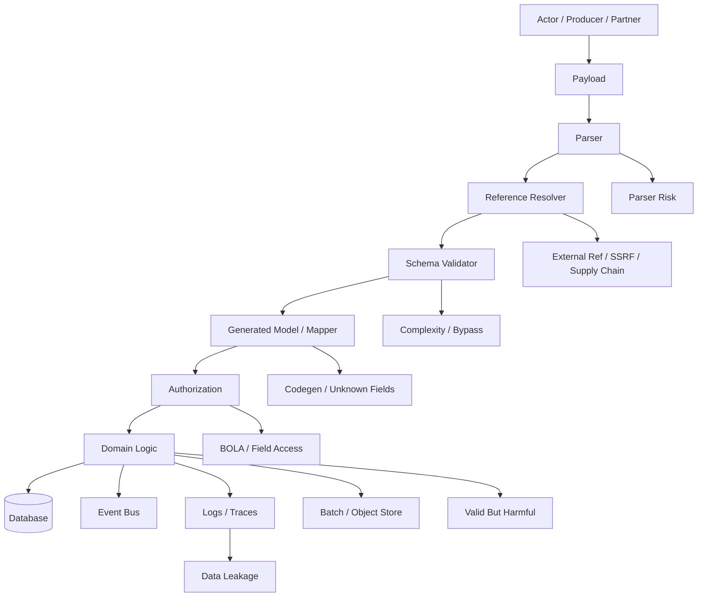
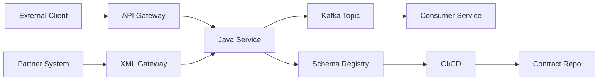
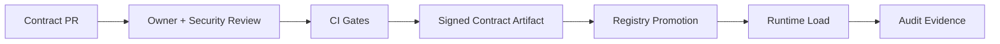
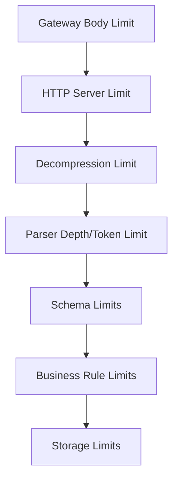
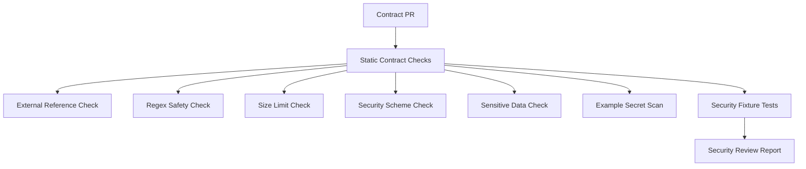
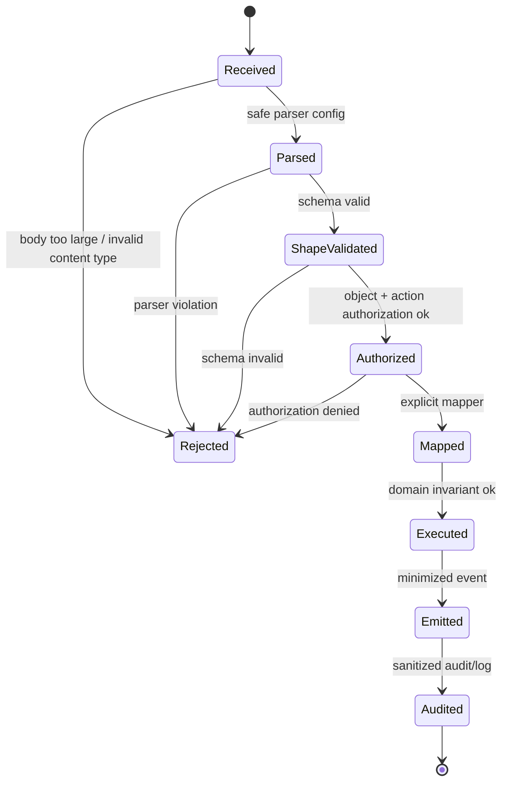

# Part 044 — Contract Security Threat Modeling and Abuse Cases

A contract is not automatically safe because it is strict.

A strict schema can still be dangerous.

It can be dangerous because:

- the parser is unsafe;
- the validator fetches external references;
- the schema is recursive enough to exhaust memory;
- the regex causes catastrophic backtracking;
- the payload is valid but enormous;
- the generated code exposes unsafe defaults;
- the API contract documents authentication but not object authorization;
- the event contract accepts unknown fields that change behavior later;
- the OpenAPI schema allows polymorphic payload confusion;
- the XML contract allows entities, includes, imports, or external resources;
- the validation boundary is in the wrong place;
- the contract is trusted because it came from “internal” systems.

This part is about treating contracts as attack surfaces.

A top-tier engineer asks:

> How can a valid contract be abused?

That question matters more than “does the schema validate?”

---

## 1. The core mental model

A data contract is a protocol boundary.

Every protocol boundary has adversarial properties:

```text
shape      -> what the payload may look like
meaning    -> what the payload is allowed to mean
authority  -> who is allowed to perform the operation
resources  -> how much CPU, memory, IO, and storage the payload may consume
side effect -> what the payload causes after validation
visibility -> where the payload may be logged, traced, indexed, or replayed
```

A schema validator mostly helps with shape.

Security requires the rest.

---

## 2. The false sense of safety

This is a common production mistake:

```java
validator.validate(payload);
service.process(payload);
```

The hidden assumption is:

```text
valid == safe
```

That assumption is false.

A payload can be valid and still:

- refer to another user’s object;
- contain a valid but unauthorized `caseId`;
- use a valid enum value in an invalid workflow state;
- include a valid but oversized array;
- include a valid recursive object graph;
- include valid free text with script content;
- include valid URLs that trigger SSRF in downstream processors;
- include valid XML that abuses parser configuration;
- include valid Protobuf unknown fields that are preserved and later interpreted;
- include valid Avro schema metadata that bypasses consumer expectations.

Schema validation is necessary. It is not sufficient.

---

## 3. Threat modeling vocabulary

For contract security, use a concrete vocabulary.

| Term | Meaning |
|---|---|
| Asset | What must be protected: data, decision, resource, system capacity, audit integrity |
| Actor | External user, partner, service, insider, compromised consumer, malicious producer |
| Entry point | API, message topic, batch file, XML gateway, registry, generated artifact |
| Trust boundary | Where data crosses from less-trusted to more-trusted context |
| Abuse case | How a valid or invalid payload can cause harm |
| Control | Validation, authorization, size limit, parser hardening, registry rule, policy gate |
| Invariant | A rule that must hold across implementation changes |
| Evidence | Logs, metrics, audit event, CI report proving the control ran |

Threat modeling is not a meeting ritual. It is how we derive contract requirements.

---

## 4. Contract attack surface map



The contract is only one layer. The security posture emerges from all layers together.

---

## 5. Abuse case format

Use a repeatable abuse case template.

```yaml
abuseCaseId: CONTRACT-XML-XXE-001
title: XML payload triggers external entity resolution
entryPoint: Partner XML intake endpoint
actor: Malicious or compromised partner
payloadClass: XML
precondition:
  - XML parser allows DTD or external entity resolution
attack:
  - Submit XML with external entity referencing local file or internal URL
impact:
  - File disclosure
  - SSRF
  - Port scanning
  - Service instability
controls:
  - Disable DTD
  - Disable external entities
  - Use secure processing
  - Reject DOCTYPE
  - Use schema catalog instead of network imports
evidence:
  - Parser configuration test
  - Security regression fixture
  - Runtime metric for rejected DOCTYPE
```

This format is more useful than vague statements like “validate XML securely.”

---

## 6. Trust boundaries in contract systems

Contracts cross many boundaries.



Do not treat these as equally trusted.

Typical trust levels:

| Source | Trust level | Required controls |
|---|---:|---|
| Public API client | Low | auth, rate limit, schema validation, authZ, size limits |
| Partner system | Medium-low | mTLS, schema validation, replay control, partner-specific policy |
| Internal service | Medium | schema validation, authN/authZ, producer identity, compatibility |
| Kafka topic | Medium | schema ID verification, ACLs, DLQ policy, payload size control |
| Contract repo | Medium-high | review, CI, signed releases, owner approval |
| Schema registry | High but not absolute | auth, compatibility rules, audit, availability controls |

“Internal” is not a security property. Internal systems fail, get compromised, and drift.

---

## 7. XML/XSD threat model

XML remains common in enterprise and government integrations. It is expressive, mature, and dangerous when parser configuration is weak.

### 7.1 Main XML abuse cases

| Abuse case | How it works | Control |
|---|---|---|
| XXE | External entity reads file or calls internal URL | disable DTD/external entities |
| Billion laughs/entity expansion | Entity expansion exhausts memory/CPU | disable DTD, entity expansion limits |
| External schema import | Validator fetches network resource | offline catalog, deny network |
| XPath injection | User input becomes XPath expression | parameterize or avoid dynamic XPath |
| XSLT injection | Untrusted stylesheet or extension functions | never run untrusted XSLT unrestricted |
| Oversized document | Valid but huge XML | size and depth limits |
| Deep nesting | Parser stack/memory exhaustion | depth limit |
| Wildcard abuse | `xs:any` carries unexpected content | strict namespace/processContents policy |
| Free-text abuse | Script/content injection into downstream UI | output encoding, content validation |

### 7.2 Java XML parser hardening

A hardened XML parser factory should be explicit.

```java
import javax.xml.XMLConstants;
import javax.xml.parsers.DocumentBuilderFactory;

public final class SecureXml {
    public static DocumentBuilderFactory secureDocumentBuilderFactory() throws Exception {
        DocumentBuilderFactory factory = DocumentBuilderFactory.newInstance();
        factory.setNamespaceAware(true);
        factory.setFeature("http://apache.org/xml/features/disallow-doctype-decl", true);
        factory.setFeature("http://xml.org/sax/features/external-general-entities", false);
        factory.setFeature("http://xml.org/sax/features/external-parameter-entities", false);
        factory.setFeature("http://apache.org/xml/features/nonvalidating/load-external-dtd", false);
        factory.setXIncludeAware(false);
        factory.setExpandEntityReferences(false);
        factory.setFeature(XMLConstants.FEATURE_SECURE_PROCESSING, true);
        factory.setAttribute(XMLConstants.ACCESS_EXTERNAL_DTD, "");
        factory.setAttribute(XMLConstants.ACCESS_EXTERNAL_SCHEMA, "");
        return factory;
    }
}
```

The exact feature support can vary by parser implementation, so this must be tested in your runtime, not only copied from a cheat sheet.

### 7.3 Secure schema resolution

Never allow runtime validation to fetch arbitrary schemas from the network.

Bad:

```text
payload references schemaLocation=https://attacker.example/schema.xsd
validator fetches it
```

Better:

```text
validator ignores external schemaLocation
schema is loaded from trusted local catalog by contract ID/version
network access is denied
```

Use a resolver that maps approved namespace/version to local artifact.

```java
public final class DenyNetworkResourceResolver implements org.w3c.dom.ls.LSResourceResolver {
    private final Map<String, org.w3c.dom.ls.LSInput> approved;

    public DenyNetworkResourceResolver(Map<String, org.w3c.dom.ls.LSInput> approved) {
        this.approved = Map.copyOf(approved);
    }

    @Override
    public org.w3c.dom.ls.LSInput resolveResource(
        String type,
        String namespaceURI,
        String publicId,
        String systemId,
        String baseURI
    ) {
        String key = namespaceURI + "#" + systemId;
        org.w3c.dom.ls.LSInput input = approved.get(key);
        if (input == null) {
            throw new SecurityException("External or unapproved XML schema reference denied: " + key);
        }
        return input;
    }
}
```

### 7.4 XSD wildcard policy

`xs:any` can be useful for extensibility. It can also become an injection point.

Dangerous:

```xml
<xs:any minOccurs="0" maxOccurs="unbounded" processContents="skip"/>
```

Safer:

```xml
<xs:any namespace="##other" minOccurs="0" maxOccurs="10" processContents="strict"/>
```

Review questions:

- Which namespaces are allowed?
- Are extensions validated?
- Is extension count bounded?
- Is extension depth bounded?
- Are extension elements logged safely?
- Are extension elements ignored or preserved?
- Can extension content influence domain behavior?

If extension content can change behavior, it is no longer “just metadata.”

---

## 8. JSON Schema threat model

JSON Schema is often used for external APIs, events, config, and document stores.

### 8.1 Main JSON Schema abuse cases

| Abuse case | Description | Control |
|---|---|---|
| External `$ref` SSRF | Validator resolves remote URI | offline resolver, deny network |
| Recursive schema exhaustion | Complex recursion consumes resources | recursion/depth limits |
| Regex DoS | `pattern` causes catastrophic backtracking | safe regex policy, timeouts |
| Large arrays | Valid payload has millions of items | `maxItems`, body limit |
| Huge strings | Valid payload contains huge text/blob | `maxLength`, content size limit |
| Ambiguous `oneOf` | Payload matches multiple branches | discriminator/tagged union |
| Open object injection | `additionalProperties: true` allows unexpected fields | close object or constrain map |
| Unknown metadata | `metadata` carries secret or script | classify and restrict |
| Format confusion | `format` treated as annotation not assertion | explicit validator setting |
| Numeric precision abuse | large number overflows Java type | range and precision constraints |

### 8.2 Deny external reference resolution

A production validator should not fetch schemas over the network during request processing.

```java
public final class ContractSchemaResolver {
    private final Map<String, String> schemasById;

    public ContractSchemaResolver(Map<String, String> schemasById) {
        this.schemasById = Map.copyOf(schemasById);
    }

    public String resolve(String uri) {
        String schema = schemasById.get(uri);
        if (schema == null) {
            throw new SecurityException("Unapproved JSON Schema reference: " + uri);
        }
        return schema;
    }
}
```

CI should also reject unexpected remote references.

```yaml
jsonSchemaPolicy:
  externalReferences:
    allowNetwork: false
    allowedSchemes:
      - https
    allowedHosts:
      - contracts.example.gov
    runtimeResolution: OFFLINE_ONLY
```

Even if the URI is `https`, runtime fetching creates availability, latency, SSRF, and supply-chain risk.

### 8.3 Regex policy

Regex in contracts should be treated as executable logic.

Bad:

```json
{ "pattern": "^(a+)+$" }
```

Better:

```json
{ "pattern": "^[A-Z0-9_-]{1,64}$" }
```

Review regex for:

- nested quantifiers;
- catastrophic backtracking;
- unbounded repetitions;
- ambiguous alternation;
- missing anchors;
- Unicode confusion;
- overly broad character classes.

Use allowlisted patterns for common identifiers when possible.

### 8.4 Size limits belong in the contract

Validation should not be the first place the system discovers a payload is too large.

Use multiple layers:

```text
API gateway body size limit
HTTP server request size limit
JSON parser nesting limit
schema maxLength/maxItems/maxProperties
service business limits
storage limits
```

Example:

```json
{
  "type": "object",
  "required": ["items"],
  "properties": {
    "items": {
      "type": "array",
      "minItems": 1,
      "maxItems": 100,
      "items": { "$ref": "#/$defs/CaseEvidenceItem" }
    }
  },
  "$defs": {
    "CaseEvidenceItem": {
      "type": "object",
      "required": ["description"],
      "properties": {
        "description": {
          "type": "string",
          "minLength": 1,
          "maxLength": 2000
        }
      },
      "additionalProperties": false
    }
  }
}
```

No external request should be allowed to submit unbounded strings, arrays, maps, or nested objects.

---

## 9. Avro threat model

Avro is common in Kafka and data pipelines. The security risk is not only the payload; it is also the relationship between payload, schema ID, registry, and consumer.

### 9.1 Main Avro abuse cases

| Abuse case | Description | Control |
|---|---|---|
| Untrusted schema | Consumer accepts writer schema from attacker | registry-only schema ID, ACLs |
| Schema spoofing | Payload claims schema ID it should not use | producer identity + subject check |
| Compatibility bypass | Direct registry write bypasses CI | registry auth + CI promotion |
| Huge records/arrays/maps | Valid Avro consumes resources | schema limits + broker limits |
| Union confusion | Consumer mishandles unexpected branch | disciplined union policy |
| Logical type mismatch | Decimal/timestamp misinterpreted | compatibility checks + tests |
| Sensitive data fanout | Raw PII in broad topic | minimization + topic policy |
| DLQ leakage | Invalid records stored raw | redacted DLQ/quarantine |

### 9.2 Registry-bound deserialization

The consumer should trust only schema IDs registered under approved subjects.

Conceptual policy:

```yaml
avroRuntimePolicy:
  allowedSubjects:
    - case-subject-registered-value
  requireSchemaRegistry: true
  rejectUnknownSchemaId: true
  rejectUnapprovedSubject: true
  maxRecordBytes: 1048576
  maxArrayItems: 1000
```

The identity of the schema matters.

A payload that is valid Avro but not valid for the approved subject should be rejected.

### 9.3 Producer identity matters

Kafka ACLs and schema registry controls should align.

```text
producer service identity -> allowed topics -> allowed subjects -> allowed schemas
```

If any producer can write any schema to any subject, the registry is not governance. It is storage.

### 9.4 Avro schema metadata risk

Do not let schema metadata drive behavior unless it comes from trusted, reviewed schemas.

Example danger:

```json
{
  "name": "callbackUrl",
  "type": "string",
  "x-processing": {
    "fetch": true
  }
}
```

If downstream tools execute behavior from schema metadata, then schema metadata is code-like. Review it with the same seriousness.

---

## 10. Protobuf threat model

Protobuf is compact and strongly structured, but it has its own failure modes.

### 10.1 Main Protobuf abuse cases

| Abuse case | Description | Control |
|---|---|---|
| Unknown field preservation | Data hidden from current code survives to future code | unknown-field policy |
| Field number reuse | Old data interpreted as new meaning | reserve deleted tags/names |
| Large message | Valid message exhausts memory | message size limits |
| Recursive message | Deep nesting exhausts stack/memory | depth limits |
| `Any` misuse | Arbitrary type injection | TypeRegistry allowlist |
| ProtoJSON confusion | JSON mapping changes compatibility semantics | explicit JSON policy |
| Enum unknowns | Unknown values mishandled | default branch + `UNRECOGNIZED` handling |
| Wrapper/presence confusion | missing vs default conflated | presence-aware contract design |

### 10.2 Unknown fields

Unknown fields are useful for compatibility. They can also preserve data the current service does not understand.

Policy decision:

```yaml
protobufPolicy:
  unknownFields:
    externalApi: REJECT_OR_DROP
    internalEvent: PRESERVE_WITH_AUDIT
    securitySensitiveMessage: DROP
```

If a service is an authorization boundary, preserving unknown fields across that boundary can be risky. A downstream service might later understand those fields and act on them.

### 10.3 `Any` allowlist

`google.protobuf.Any` is powerful and dangerous.

Bad:

```proto
message ActionEnvelope {
  google.protobuf.Any payload = 1;
}
```

Better:

```proto
message ActionEnvelope {
  string action_type = 1;
  oneof payload {
    AssignCaseCommand assign_case = 10;
    EscalateCaseCommand escalate_case = 11;
    CloseCaseCommand close_case = 12;
  }
}
```

If `Any` is unavoidable, use a strict type allowlist.

```java
public final class AnyPolicy {
    private final Set<String> allowedTypeUrls = Set.of(
        "type.googleapis.com/gov.example.case.v1.AssignCaseCommand",
        "type.googleapis.com/gov.example.case.v1.EscalateCaseCommand"
    );

    public void assertAllowed(com.google.protobuf.Any any) {
        if (!allowedTypeUrls.contains(any.getTypeUrl())) {
            throw new SecurityException("Unapproved protobuf Any type: " + any.getTypeUrl());
        }
    }
}
```

Never unpack arbitrary `Any` payloads by reflection from untrusted inputs.

### 10.4 Field number reuse

Deleted fields must reserve their numbers and names.

```proto
message CaseSubject {
  reserved 4, 7;
  reserved "legacy_national_id", "old_risk_score";

  string subject_id = 1;
  string full_name = 2;
}
```

Without reservation, old bytes can be interpreted as new semantics.

That is both compatibility and security risk.

---

## 11. OpenAPI threat model

OpenAPI describes APIs. It does not enforce APIs.

This distinction is critical.

### 11.1 Main OpenAPI abuse cases

| Abuse case | Description | Control |
|---|---|---|
| BOLA/IDOR | User changes object ID to access another object | object-level authorization |
| Missing field-level auth | Sensitive response field returned to wrong role | response masking policy |
| Auth documented but not enforced | Spec says OAuth, code forgets check | integration/security tests |
| Overbroad scopes | One scope grants too much | operation-specific scopes |
| Unbounded request body | Valid large request causes DoS | gateway/server/schema limits |
| Mass assignment | Extra fields mapped into domain object | closed schema + explicit mapper |
| Polymorphic confusion | Discriminator/oneOf mismatch | tagged union + tests |
| Error leakage | Error response echoes sensitive input | safe error contract |
| Example secret leakage | Examples contain real secrets | CI secret scan |
| File upload abuse | Content type/size not constrained | media type, size, scanning policy |

### 11.2 Security scheme is not authorization logic

OpenAPI can describe security schemes:

```yaml
security:
  - oauth2:
      - case.read
```

That does not prove the service checks:

```text
Does this user have access to this specific caseId?
```

Object-level authorization must be modeled and tested separately.

Example contract extension:

```yaml
paths:
  /cases/{caseId}:
    get:
      operationId: getCase
      x-authorization:
        object: CASE
        objectIdParameter: caseId
        action: READ
        fieldPolicy: CASE_DETAIL_VIEW
      security:
        - oauth2:
            - case.read
```

Runtime invariant:

```text
For every operation with objectIdParameter, service must call object authorization before returning data.
```

### 11.3 Mass assignment

Mass assignment happens when external input maps too directly into internal/domain models.

Bad:

```java
CaseEntity entity = objectMapper.readValue(requestBody, CaseEntity.class);
caseRepository.save(entity);
```

If `CaseEntity` has fields like `status`, `assignedOfficerId`, `riskScore`, or `approvalState`, the client may set fields it should not control.

Better:

```java
CaseIntakeRequest request = parseAndValidate(requestBody);
CreateCaseCommand command = mapper.toCreateCaseCommand(request);
caseApplicationService.createCase(command);
```

The mapper should explicitly copy allowed fields.

Closed schemas help, but they do not replace explicit mapping.

---

## 12. Code generation threat model

Generated code is supply-chain code.

Risks:

- generator version changes behavior;
- generated model exposes unsafe `toString()`;
- generated model accepts unknown fields;
- generator creates nullable Java fields unexpectedly;
- generated API interface omits security enforcement;
- generated client logs request/response bodies;
- generated deserializer permits extra fields;
- generated code is committed and modified manually;
- generator templates are customized without review;
- plugin downloads executable dependencies from untrusted sources.

Controls:

```yaml
codegenPolicy:
  pinGeneratorVersion: true
  verifyPluginChecksum: true
  generatedCodeReadOnly: true
  forbidGeneratedToStringInLogs: true
  compileGeneratedArtifacts: true
  runStaticAnalysis: true
  requireTemplateReview: true
```

Do not treat codegen as harmless automation. It shapes runtime behavior.

---

## 13. Contract supply-chain security

Contracts move through repositories, registries, build systems, artifact repositories, and runtime loaders.

Threats:

- malicious contract PR;
- compromised generator plugin;
- registry write by unauthorized actor;
- artifact substitution;
- stale generated client;
- environment promotion bypass;
- schema ID collision/lookup confusion;
- runtime downloading schema from attacker-controlled URL.

Controls:

- signed tags/releases;
- CODEOWNERS;
- required review;
- compatibility gates;
- registry ACLs;
- immutable artifacts;
- checksum verification;
- dependency pinning;
- environment promotion workflow;
- runtime allowlist;
- audit logs.



---

## 14. Validation bypass patterns

Validation bypass is rarely obvious.

Common bypasses:

| Bypass | Example | Fix |
|---|---|---|
| Alternate content type | Send XML to JSON endpoint | strict media type |
| Charset confusion | unusual charset changes parsing | normalize and restrict |
| Compressed payload | small compressed, huge decompressed | decompressed size limit |
| Partial validation | validate outer envelope only | validate payload too |
| Wrong schema version | use old permissive schema | version pinning |
| Deserialization before validation | object mapper accepts extra fields first | parse safely, validate, map explicitly |
| Separate path | async/job endpoint skips validation | shared boundary component |
| Internal bypass | trusted service endpoint skips checks | zero-trust internal boundary |
| Generated mock drift | mock accepts invalid payload | contract-driven stubs |

The invariant:

> Every ingress path must have an explicit validation and authorization story.

---

## 15. Parser and payload resource limits

Contracts should define resource expectations.

```yaml
x-limits:
  maxBodyBytes: 1048576
  maxDepth: 16
  maxProperties: 200
  maxArrayItems: 1000
  maxStringLength: 10000
  maxBatchRecords: 5000
  maxDecompressedBytes: 10485760
```

Runtime should enforce them at multiple layers.



Do not rely on schema limits alone. The parser may consume resources before schema validation runs.

---

## 16. Unknown fields policy

Unknown fields are a compatibility tool. They are also a security decision.

### JSON/OpenAPI

```yaml
additionalProperties: false
```

This is strict, but can reduce evolvability. A balanced pattern is:

```yaml
extension:
  type: object
  additionalProperties:
    type: string
    maxLength: 200
  x-extension-policy:
    allowedKeysRegistry: case-extension-key-registry
    disallowSensitiveValues: true
```

### Protobuf

Unknown field preservation may be desirable inside trusted compatibility paths but dangerous across authorization boundaries.

### Avro

Reader/writer schema resolution ignores some writer fields if reader does not know them. That can be safe for compatibility, but it also means data may move through a service without being inspected.

### Rule

```text
Unknown fields may be tolerated for compatibility, but they must not influence authorization, workflow, financial, regulatory, or security decisions unless explicitly modeled.
```

---

## 17. Polymorphism security

Polymorphic contracts are convenient and risky.

Bad pattern:

```json
{
  "type": "object",
  "properties": {
    "actionType": { "type": "string" },
    "payload": { "type": "object" }
  }
}
```

This accepts any payload for any action type.

Better pattern:

```json
{
  "oneOf": [
    { "$ref": "#/$defs/AssignCaseAction" },
    { "$ref": "#/$defs/EscalateCaseAction" },
    { "$ref": "#/$defs/CloseCaseAction" }
  ],
  "$defs": {
    "AssignCaseAction": {
      "type": "object",
      "required": ["actionType", "payload"],
      "properties": {
        "actionType": { "const": "ASSIGN_CASE" },
        "payload": { "$ref": "#/$defs/AssignCasePayload" }
      },
      "additionalProperties": false
    }
  }
}
```

Security questions:

- Can a low-privilege user submit a high-privilege action type?
- Is action type validated before authorization?
- Are all variants covered by authorization tests?
- Can payload fields override envelope fields?
- Are unknown variants rejected or quarantined?
- Can an old consumer ignore a new dangerous variant?

Polymorphism is not only a modeling problem. It is an authorization problem.

---

## 18. File and batch contract security

Batch contracts are often weaker than API contracts. That is dangerous because batch files can contain more data.

Threats:

- huge files;
- zip bombs;
- formula injection in CSV;
- malicious filenames;
- path traversal;
- inconsistent row schema;
- mixed encodings;
- duplicate keys;
- replayed file;
- partial load;
- raw sensitive data in rejected rows;
- missing manifest;
- weak checksum.

A batch contract should include a manifest.

```yaml
batchContract:
  fileType: CASE_EVIDENCE_IMPORT
  version: 1.0.0
  maxFileBytes: 104857600
  maxRows: 100000
  encoding: UTF-8
  compression:
    allowed: [gzip]
    maxDecompressedBytes: 1073741824
  checksum:
    algorithm: SHA-256
    required: true
  replayProtection:
    fileIdRequired: true
    rejectDuplicateFileId: true
  rowSchema:
    contractId: case-evidence-row.v1
  quarantine:
    rawRowRetentionDays: 7
    maskSensitiveFields: true
```

Batch validation should be streaming where possible. Do not load huge files into memory before validation.

---

## 19. Event contract abuse cases

Event-driven systems create unique risks.

| Abuse case | Example | Control |
|---|---|---|
| Unauthorized producer | writes fake case-closed event | producer ACL + event signature/identity |
| Replay | old valid event reprocessed | event ID + idempotency + replay window |
| Out-of-order event | case closed before created | state-machine guard |
| Poison event | valid but crashes consumer | DLQ + classifier + patch |
| Sensitive fanout | PII emitted to broad topic | minimization + topic policy |
| Schema downgrade | old schema bypasses required field | compatibility + version policy |
| Consumer drift | consumer ignores new critical field | consumer readiness + observability |

Contract-level controls:

```yaml
x-event-policy:
  producerIdentities:
    - case-service
  replayProtection:
    eventIdRequired: true
    idempotencyWindow: P30D
  ordering:
    key: caseId
  sensitivity:
    maxClassification: CONFIDENTIAL
    rawPIIAllowed: false
  consumers:
    inventoryRequired: true
```

Events are not just data. They are facts that trigger side effects.

---

## 20. Authorization is part of the contract story

A contract that exposes `caseId` creates an authorization obligation.

```yaml
parameters:
  - name: caseId
    in: path
    required: true
    schema:
      type: string
      format: uuid
    x-object:
      type: CASE
      authorizationRequired: true
```

A test should assert every object-bearing operation calls authorization.

Example conceptual test:

```java
@Test
void getCaseRequiresObjectAuthorization() {
    given(authz.canReadCase("user-a", CASE_B)).willReturn(false);

    HttpResponse response = client.get("/cases/" + CASE_B);

    assertThat(response.statusCode()).isEqualTo(403);
    verify(authz).canReadCase("user-a", CASE_B);
}
```

BOLA is not prevented by UUIDs. It is prevented by object-level authorization.

---

## 21. Safe error contracts

Security-sensitive validation errors should be useful without leaking.

Bad:

```json
{
  "error": "User 123 is not allowed to access case 9f2a... belonging to Jane Doe"
}
```

Better:

```json
{
  "type": "https://errors.example.gov/access-denied",
  "title": "Access denied",
  "status": 403,
  "detail": "You are not allowed to access this resource.",
  "correlationId": "01JZ3MZ78RGD4V3D8TZ75HVPFW"
}
```

For validation:

```json
{
  "type": "https://errors.example.gov/validation-error",
  "title": "Validation failed",
  "status": 400,
  "errors": [
    {
      "path": "/subject/nationalIdToken",
      "code": "INVALID_FORMAT"
    }
  ],
  "correlationId": "01JZ3N0QS8H9RQ0BK31XZA1H12"
}
```

Do not echo raw sensitive values.

---

## 22. Security contract tests

Security controls should have fixtures.

### XML fixtures

- payload with `DOCTYPE`;
- payload with external entity;
- payload with entity expansion;
- payload with external schema location;
- deeply nested payload;
- oversized text node.

### JSON fixtures

- external `$ref`;
- huge array;
- huge string;
- regex worst-case input;
- ambiguous `oneOf`;
- unknown properties;
- compressed huge body.

### Avro fixtures

- unknown schema ID;
- unapproved subject;
- unexpected union branch;
- oversized array/map;
- sensitive raw field in event.

### Protobuf fixtures

- unknown `Any` type;
- reused field number regression;
- large message;
- unknown enum;
- unknown fields across boundary.

### OpenAPI fixtures

- object ID belonging to another user;
- extra mass-assignment field;
- missing auth scope;
- low-privilege user requesting sensitive field;
- invalid content type;
- huge multipart upload.

Security fixtures should live beside contracts.

```text
contracts/
  openapi/
    case-api.yaml
    security-fixtures/
      bola-get-other-user-case.http
      mass-assignment-status.json
      oversized-request.json
  xsd/
    case-intake.xsd
    security-fixtures/
      doctype.xml
      external-entity.xml
```

---

## 23. CI security gates

A strong contract CI should include security gates.



Recommended gates:

| Gate | Failure condition |
|---|---|
| External references | runtime schema fetch from non-allowlisted host |
| Missing limits | array/string/map lacks max bounds at external boundary |
| Regex risk | unsafe pattern detected |
| OpenAPI auth | external operation lacks security requirement or explicit public marker |
| Object auth | path/body object ID lacks authorization metadata |
| Sensitive response | sensitive field returned by public operation |
| Example secret | examples contain token/key/realistic PII |
| XML DTD | XML fixture with DOCTYPE is accepted |
| Protobuf Any | unallowlisted `Any` type is accepted |
| Avro registry | unapproved schema ID is accepted |

The CI report should be reviewable by engineers, not only security teams.

---

## 24. Runtime telemetry for contract security

Controls need evidence.

Emit metrics like:

```text
contract.validation.rejected.total{reason="external_ref"}
contract.validation.rejected.total{reason="payload_too_large"}
contract.validation.rejected.total{reason="doctype_denied"}
contract.security.authz.denied.total{object="CASE"}
contract.security.unknown_field.total{contract="case-command.v1"}
contract.security.schema_id_rejected.total{subject="case-events"}
contract.security.sensitive_field_redacted.total{field="fullName"}
```

But do not put sensitive values into labels.

Bad metric label:

```text
field_value="Jane Doe"
```

Good:

```text
field="fullName"
classification="PII_DIRECT"
policy="REDACT"
```

Telemetry is part of the contract enforcement proof.

---

## 25. Incident playbooks

### Playbook: sensitive data leaked to logs

1. Identify contract and field path.
2. Stop further leakage by changing logging policy or disabling body logging.
3. Rotate affected credentials if secrets were leaked.
4. Determine retention and log sinks.
5. Purge or restrict access where possible.
6. Add regression test.
7. Add CI rule if classification/logging policy was missing.
8. Update catalog evidence.

### Playbook: invalid payload causing service instability

1. Capture sanitized payload fingerprint.
2. Identify contract, schema version, validator path.
3. Determine whether parser, validator, mapper, or domain logic failed.
4. Add size/depth/complexity limit.
5. Add malicious fixture.
6. Deploy runtime guard.
7. Backfill contract lint rule.

### Playbook: BOLA contract gap

1. Identify operation and object identifier.
2. Add `x-authorization` metadata.
3. Add service authorization check.
4. Add negative integration test.
5. Review similar operations.
6. Add CI rule requiring object auth metadata for object ID parameters.

---

## 26. Security review checklist

For every externally visible contract, ask:

### Parser and validation

- [ ] Is the parser hardened?
- [ ] Are external references denied or allowlisted?
- [ ] Are DTD/external entities disabled for XML?
- [ ] Are request body limits enforced before parsing?
- [ ] Are depth, array, string, and map limits present?
- [ ] Are regex patterns safe?
- [ ] Are all ingress paths validated?

### Authorization

- [ ] Does every object identifier have object-level authorization?
- [ ] Are field-level sensitive responses protected?
- [ ] Are operation scopes specific?
- [ ] Are workflow state transitions authorized?
- [ ] Are internal service calls authenticated and authorized?

### Data leakage

- [ ] Do errors avoid raw sensitive values?
- [ ] Are logs sanitized by field policy?
- [ ] Are traces/metrics free of sensitive values?
- [ ] Are DLQ/quarantine stores restricted?
- [ ] Are examples synthetic?

### Evolution and compatibility

- [ ] Are Protobuf deleted fields reserved?
- [ ] Are Avro schema changes registry-checked?
- [ ] Are unknown fields handled intentionally?
- [ ] Are new enum/action variants authorized?
- [ ] Are old versions prevented from bypassing new controls?

### Supply chain

- [ ] Are generator versions pinned?
- [ ] Are contract artifacts immutable?
- [ ] Are registry writes audited?
- [ ] Are templates reviewed?
- [ ] Are runtime schemas loaded only from trusted artifacts?

---

## 27. Case study: secure enforcement action command

Suppose we design a command API:

```yaml
POST /cases/{caseId}/actions
```

The request supports multiple action types.

```yaml
CaseActionRequest:
  oneOf:
    - $ref: '#/components/schemas/AssignCaseAction'
    - $ref: '#/components/schemas/EscalateCaseAction'
    - $ref: '#/components/schemas/CloseCaseAction'
  x-authorization:
    object: CASE
    objectIdParameter: caseId
    actionDerivedFromField: actionType
```

Threats:

- user submits action for case they cannot access;
- user submits `CLOSE_CASE` when only allowed to comment;
- user submits payload for one action with `actionType` of another;
- user includes extra field `approvedBySupervisor: true`;
- user sends huge note body;
- error response leaks investigation data;
- event emitted with raw sensitive note.

Controls:

```yaml
AssignCaseAction:
  type: object
  required: [actionType, payload]
  properties:
    actionType:
      const: ASSIGN_CASE
    payload:
      type: object
      required: [assigneeId]
      properties:
        assigneeId:
          type: string
          format: uuid
      additionalProperties: false
  additionalProperties: false

EscalateCaseAction:
  type: object
  required: [actionType, payload]
  properties:
    actionType:
      const: ESCALATE_CASE
    payload:
      type: object
      required: [reasonCode, note]
      properties:
        reasonCode:
          type: string
          enum: [HIGH_RISK, LEGAL_REVIEW, SUPERVISOR_REVIEW]
        note:
          type: string
          minLength: 1
          maxLength: 2000
          x-data:
            classification: REGULATED_EVIDENCE
            logging:
              policy: REDACT
      additionalProperties: false
  additionalProperties: false
```

Runtime order:

```text
1. authenticate
2. parse with size/depth limits
3. validate media type
4. validate schema
5. determine action type
6. authorize object access
7. authorize action in current workflow state
8. map explicitly to command
9. execute domain logic
10. emit minimized event
11. log sanitized audit
```

Do not run domain logic before authorization.

---

## 28. The secure contract state machine



This state machine is the security posture.

The schema is only one transition.

---

## 29. High-signal questions for senior engineers

Ask these during design review:

1. What is the most harmful valid payload?
2. What is the most expensive valid payload?
3. What is the most sensitive valid payload?
4. What fields influence authorization?
5. What fields influence workflow state?
6. What fields can be ignored safely?
7. What unknown fields are preserved?
8. What happens if an old producer sends this?
9. What happens if a new producer sends this to an old consumer?
10. What happens if the registry is unavailable?
11. What happens if the schema resolver sees a remote reference?
12. What happens if the payload reaches logs by exception path?
13. What happens if this event is replayed next year?
14. What happens if this contract is used by generated clients in another language?
15. What evidence proves enforcement happened?

These questions reveal design quality quickly.

---

## 30. Anti-patterns

### Anti-pattern 1: “It is internal, so no validation needed”

Internal traffic can be compromised, malformed, stale, or produced by a buggy deployment.

### Anti-pattern 2: “OpenAPI security means we are secure”

OpenAPI documents security schemes. It does not enforce authorization.

### Anti-pattern 3: Runtime network schema resolution

Fetching schemas during request processing creates SSRF, availability, latency, and supply-chain risk.

### Anti-pattern 4: Unbounded schema

No `maxLength`, no `maxItems`, no `maxProperties`, no body limit.

### Anti-pattern 5: `payload: object`

Generic payload object without variant validation or authorization.

### Anti-pattern 6: Protobuf field number reuse

Old data can become new meaning.

### Anti-pattern 7: Raw payload logging on validation error

Attackers can intentionally place sensitive or malicious content into logs.

### Anti-pattern 8: DLQ as unrestricted raw-data warehouse

DLQs often bypass normal application access controls.

### Anti-pattern 9: Codegen without security review

Generated code defines runtime behavior. Treat it as supply chain.

### Anti-pattern 10: Security review only at release

Contract changes should be reviewed at PR time, before code and consumers depend on them.

---

## 31. Production readiness checklist

A contract is not security-ready unless these are true:

- [ ] Parser is hardened for the format.
- [ ] External references are denied or allowlisted.
- [ ] Payload size limits exist before parser and in schema.
- [ ] Arrays, maps, strings, and nesting are bounded.
- [ ] Regex patterns are reviewed.
- [ ] Polymorphism uses tagged variants.
- [ ] Unknown fields policy is explicit.
- [ ] Object-level authorization is modeled and tested.
- [ ] Sensitive fields have masking/logging policy.
- [ ] Error responses do not echo raw values.
- [ ] DLQ/quarantine handling is safe.
- [ ] Generated code version is pinned.
- [ ] Schema registry writes are controlled.
- [ ] Security fixtures exist.
- [ ] Runtime metrics prove controls are firing.
- [ ] Incident playbook exists.

---

## 32. Exercises

### Exercise 1 — Threat model an OpenAPI operation

Pick one operation with path parameter `{caseId}`.

Create abuse cases for:

- accessing another user’s case;
- mass assignment;
- oversized request;
- sensitive error leakage;
- workflow action bypass.

Add contract metadata and tests for each.

### Exercise 2 — Build an external-reference linter

Write a CI check that fails when:

- JSON Schema contains remote `$ref` outside allowlist;
- XSD contains network `schemaLocation`;
- OpenAPI references external files not packaged in the artifact.

### Exercise 3 — Add malicious fixtures

Create fixtures for:

- XML DOCTYPE;
- JSON huge array;
- ambiguous `oneOf`;
- Protobuf unapproved `Any`;
- Avro unknown schema ID;
- OpenAPI object ID authorization failure.

Run them in CI.

### Exercise 4 — Secure generated model logging

Find every generated DTO/model in a Java service. Prove that sensitive fields are not emitted through:

- `toString()`;
- structured logs;
- exception messages;
- request/response logging middleware;
- tracing attributes.

---

## 33. The core invariant

The invariant for this part is:

> A contract is secure only when its parser, resolver, validator, mapper, authorization, runtime limits, logging, registry, generated code, and operational evidence are designed as one boundary.

Validation alone is not enough.

A schema can reject malformed payloads while accepting harmful valid payloads.

A secure contract engineering practice asks:

```text
What can this contract cause?
Who can cause it?
How much can it consume?
What can it reveal?
What can it bypass?
What does it preserve?
What does it emit?
What evidence proves control?
```

That is the difference between using schemas and engineering contracts.

---

## References

- OWASP API Security Top 10 2023: https://owasp.org/API-Security/editions/2023/en/0x11-t10/
- OWASP XML External Entity Prevention Cheat Sheet: https://cheatsheetseries.owasp.org/cheatsheets/XML_External_Entity_Prevention_Cheat_Sheet.html
- OWASP XML Security Cheat Sheet: https://cheatsheetseries.owasp.org/cheatsheets/XML_Security_Cheat_Sheet.html
- OpenAPI Specification 3.2.0: https://spec.openapis.org/oas/v3.2.0.html
- JSON Schema Draft 2020-12: https://json-schema.org/draft/2020-12
- Apache Avro 1.12.0 Specification: https://avro.apache.org/docs/1.12.0/specification/
- Protocol Buffers Proto Best Practices: https://protobuf.dev/best-practices/dos-donts/
- Protocol Buffers Language Guide proto3: https://protobuf.dev/programming-guides/proto3/
