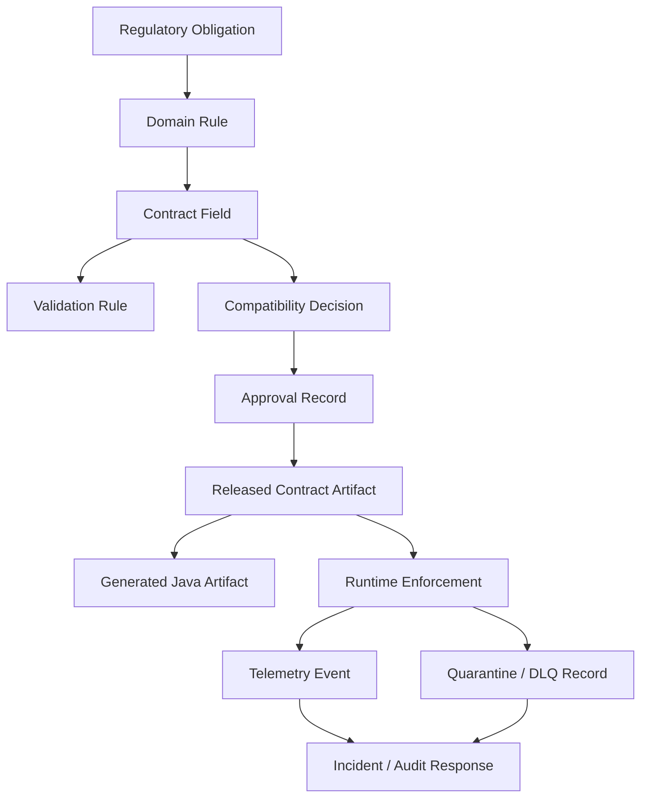
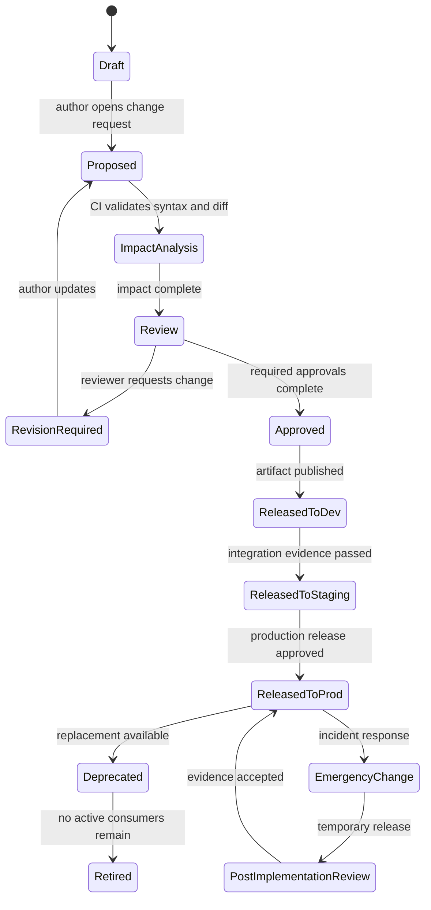
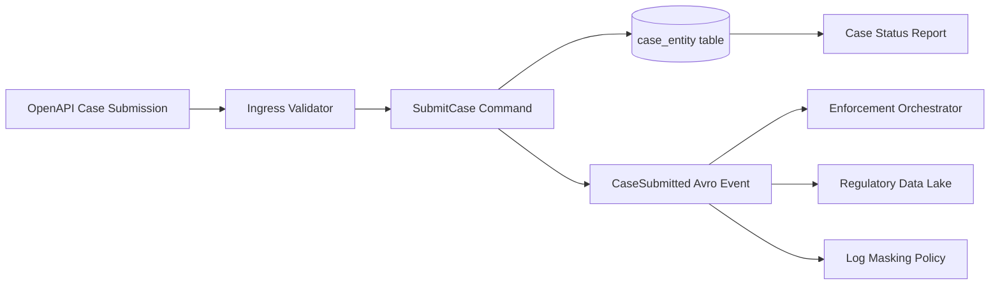
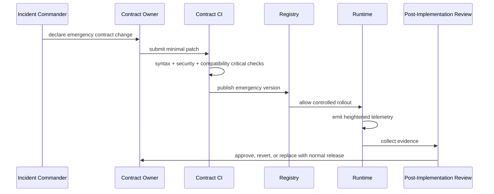

# Part 045 — Regulatory-Grade Contract Auditability and Defensibility

A production data contract is not only a schema.

In a regulated system, a data contract is also an evidence-bearing artifact.

It must answer uncomfortable questions months or years after the original engineer has moved on:

- who changed this contract?
- why was the change necessary?
- who approved it?
- which consumers were affected?
- what compatibility policy was applied?
- what examples proved the change?
- which runtime systems used this version?
- which payloads were accepted, rejected, quarantined, replayed, or corrected?
- whether sensitive fields were classified before release?
- whether the system can reproduce the exact validation decision made at the time?

If the answer is “check the Git history”, the system is not regulatory-grade.

Git history is useful.

It is not enough.

A top-tier contract platform makes contract evolution **explainable, attributable, reproducible, and operationally observable**.

That is the difference between a schema repository and a defensible contract control system.

---

## 1. The core mental model

Regulatory-grade contract engineering is about preserving the chain of reasoning from business obligation to runtime enforcement.

```text
obligation
  -> domain rule
  -> contract field
  -> validation rule
  -> compatibility decision
  -> approval evidence
  -> released artifact
  -> runtime enforcement
  -> observed payload behavior
  -> incident / exception / audit response
```

A contract is defensible when this chain can be reconstructed.

Not vaguely.

Precisely.

For a particular version.

For a particular environment.

For a particular request, event, file, or decision.

---

## 2. Auditability vs defensibility vs observability

These terms are related but not identical.

| Capability | Question it answers | Example |
|---|---|---|
| Auditability | What happened? | Contract `case-intake.v7` was approved by the case-platform owner on 2026-07-03. |
| Traceability | How is it connected? | Field `regulatedEntity.licenseNumber` maps to intake rule `INTAKE-KYC-004`, OpenAPI schema path, Java validator, and downstream event field. |
| Reproducibility | Can we re-run the same decision? | Given the same schema version, validator version, and policy config, payload X still fails with error `CASE-INTAKE-422-017`. |
| Defensibility | Can we justify the decision? | The field was made required only after all active consumers were migrated and evidence showed no legacy producer still omitted it. |
| Observability | What is happening now? | Invalid payload rate for `CaseSubmitted.v3` increased after producer `portal-api` deployed build `2026.07.03.5`. |

A common mistake is to implement observability and call it auditability.

Metrics show behavior.

They do not automatically prove why a change was approved.

Another mistake is to implement approvals and call it defensibility.

An approval without impact analysis, test evidence, and runtime adoption evidence is just a checkbox.

---

## 3. Regulatory-grade invariants

A regulatory-grade contract system must maintain these invariants.

### 3.1 Contract versions are immutable

Once a contract version is released, its bytes must not change.

Bad:

```text
case-intake-v1.json was edited in place to fix a typo.
```

Good:

```text
case-intake-v1.json remains unchanged.
case-intake-v2.json fixes the typo.
A compatibility decision explains why this is non-breaking or breaking.
```

Why this matters:

- old payload validation decisions depend on old schema bytes;
- generated clients depend on old schema bytes;
- replay processing depends on old schema bytes;
- audit response needs exact historical evidence;
- consumers need stable references.

### 3.2 Contract artifacts have stable identity

A contract version needs more than a filename.

Use a stable identity tuple:

```text
contract_id
contract_kind
namespace_or_group
major_version
minor_version
patch_version
artifact_digest
registry_subject
registry_version
release_environment
```

Example:

```yaml
contractId: case-intake-api
kind: openapi
ownerTeam: case-platform
artifactVersion: 3.4.1
artifactDigest: sha256:2f8a9...
registrySubject: api.case-intake.openapi
registryVersion: 17
releasedTo:
  - dev
  - staging
  - prod
```

The digest matters because two files can have the same semantic version but different bytes if governance is weak.

### 3.3 Every meaningful change is attributable

A meaningful change includes:

- field added;
- field removed;
- field renamed;
- type changed;
- constraint tightened;
- enum changed;
- validation vocabulary changed;
- security metadata changed;
- classification metadata changed;
- example changed;
- generated package changed;
- subject naming changed;
- registry compatibility mode changed;
- default value changed;
- nullability changed;
- deprecation marker changed.

Attribution should capture:

```text
author
reviewer
approver
owning team
consumer representative
security reviewer
privacy reviewer
architecture reviewer
release manager
```

Not every change needs every role.

But the routing rule must be explicit.

### 3.4 Compatibility decisions are recorded

A compatibility check result is not just pass/fail.

Record the decision:

```yaml
compatibilityDecision:
  level: backward-compatible
  checker: contract-diff-service
  checkerVersion: 2.7.0
  oldArtifactDigest: sha256:old...
  newArtifactDigest: sha256:new...
  result: pass
  warnings:
    - field `casePriority` added as optional
    - consumers should ignore unknown enum value `ESCALATED_REVIEW`
  reviewerOverride: false
```

If there is an override, record it explicitly:

```yaml
compatibilityDecision:
  level: breaking
  result: fail
  override: true
  overrideReason: Legacy endpoint is internal, has one registered consumer, and consumer signed migration readiness record MIG-2026-117.
  overrideApprover: architecture-board
  expiryDate: 2026-08-31
```

An override without expiry becomes permanent technical debt.

### 3.5 Runtime decisions are reproducible

When a payload is rejected, quarantined, masked, or accepted with warning, store enough metadata to reconstruct the decision.

Minimum runtime evidence:

```yaml
contractId: case-submitted-event
contractVersion: 4.2.0
artifactDigest: sha256:...
registrySubject: events.case.CaseSubmitted-value
registryVersion: 22
validatorName: java-json-schema-validator
validatorVersion: 1.3.8
policyVersion: contract-policy-2026.07.03
validationMode: strict
payloadFingerprint: sha256:payload-canonical-form
producer: case-intake-service
consumer: case-orchestrator
correlationId: c-01J...
causationId: command-01J...
decision: rejected
errorCodes:
  - CASE_SUBMITTED_REQUIRED_FIELD_MISSING
```

Do not store sensitive payload by default.

Store fingerprints, paths, safe excerpts, and classified error details.

---

## 4. Evidence graph

The strongest model is not a flat audit log.

It is an evidence graph.



This graph allows the platform to answer:

> Show every released contract field that captures regulated entity identity and every runtime rejection caused by that field in production between two dates.

That is a very different capability from:

> Search the repository for `licenseNumber`.

---

## 5. Contract lifecycle state machine

A defensible contract platform treats contract change as a lifecycle.



The important part is not the diagram.

The important part is that each transition has required evidence.

Example transition rules:

| Transition | Required evidence |
|---|---|
| Draft -> Proposed | schema validity, owner assigned, change rationale |
| Proposed -> ImpactAnalysis | semantic diff generated, examples updated |
| ImpactAnalysis -> Review | consumer impact matrix, compatibility result |
| Review -> Approved | owner approval, consumer approval if breaking, security/privacy approval if sensitive |
| Approved -> ReleasedToDev | artifact published, generated Java compiles |
| ReleasedToStaging -> ReleasedToProd | integration tests, runtime validation in shadow/strict mode, release note |
| ReleasedToProd -> Deprecated | successor contract, migration guide, deprecation date |
| Deprecated -> Retired | consumer inventory shows no active usage |

---

## 6. The minimum defensible contract record

A contract catalog entry should not only contain a description.

It should contain operationally useful evidence.

```yaml
contractId: case-intake-api
kind: openapi
businessCapability: case-intake
ownerTeam: case-platform
steward: case-domain-architecture
criticality: high
regulatoryImpact: true
containsSensitiveData: true
classification:
  highestFieldClassification: pii-confidential
  regulatedDataCategories:
    - regulated-entity-identity
    - complainant-contact
lifecycle:
  state: released
  releasedAt: 2026-07-03T10:15:30Z
  deprecation: null
artifact:
  repository: contracts/case-intake/openapi.yaml
  version: 3.4.1
  digest: sha256:...
  registrySubject: api.case-intake.openapi
compatibility:
  mode: backward
  lastCheckResult: pass
  breakingChangeRequires:
    - owner-approval
    - consumer-approval
    - architecture-approval
runtime:
  validationMode: strict-ingress-shadow-egress
  telemetryNamespace: contract.case_intake
  quarantineQueue: contract.case-intake.quarantine
consumers:
  - service: case-portal
    environment: prod
    contact: team-case-portal
  - service: enforcement-orchestrator
    environment: prod
    contact: team-enforcement
references:
  obligations:
    - REG-INTAKE-001
    - REG-IDENTITY-007
  adrs:
    - ADR-2026-014
```

This record should be machine-readable.

Humans need a portal.

Automation needs structured metadata.

---

## 7. Traceability matrix

A traceability matrix connects business intent to technical enforcement.

Example:

| Obligation | Domain rule | Contract artifact | Field/path | Validation | Runtime evidence |
|---|---|---|---|---|---|
| REG-INTAKE-001 | Every submitted case must identify submitting channel | OpenAPI `case-intake-api` v3.4.1 | `/components/schemas/CaseSubmission/properties/channel` | required + enum | validation metric `missing_channel` |
| REG-IDENTITY-007 | Regulated entity must have a stable identifier | JSON Schema `regulated-entity` v2.1.0 | `/licenseNumber` | pattern + reference lookup | quarantine code `INVALID_LICENSE_NUMBER` |
| REG-DECISION-003 | Enforcement decision must be explainable | Avro `DecisionRecorded` v4 | `decisionBasis[]` | min items + code list | audit event `DECISION_BASIS_CAPTURED` |
| REG-PRIVACY-002 | Complainant contact must be protected | OpenAPI + event schemas | `complainant.email`, `complainant.phone` | classification metadata | masking policy `PII_CONTACT_MASK_V2` |

The matrix must be updated when contracts change.

If not, the system drifts from its regulatory intent.

---

## 8. Audit event model

Every contract lifecycle transition should emit an audit event.

Example JSON event:

```json
{
  "eventId": "01J1Y8V7X2ZKZ3N5M2W8Y6R4TQ",
  "eventType": "CONTRACT_APPROVED",
  "occurredAt": "2026-07-03T10:15:30Z",
  "actor": {
    "actorId": "user:ari",
    "actorType": "human",
    "team": "case-platform"
  },
  "contract": {
    "contractId": "case-intake-api",
    "kind": "openapi",
    "version": "3.4.1",
    "digest": "sha256:2f8a9...",
    "registrySubject": "api.case-intake.openapi"
  },
  "change": {
    "changeRequestId": "CR-2026-117",
    "classification": "backward-compatible",
    "summary": "Add optional casePriority field for triage workflow",
    "rationale": "Needed to support risk-based intake routing without changing existing consumers."
  },
  "evidence": {
    "compatibilityCheckId": "COMPAT-2026-117",
    "ciRunId": "CI-982711",
    "approvalIds": ["APP-1001", "APP-1002"],
    "exampleValidationReportId": "EXAMPLE-VAL-551"
  }
}
```

This event should be immutable.

It should not contain raw sensitive payloads.

It should be queryable by contract, actor, change request, field, obligation, and release.

---

## 9. Audit log vs audit ledger

A normal application log is not enough.

| Property | Application log | Audit ledger |
|---|---|---|
| Purpose | Debugging | Accountability |
| Retention | Often short | Policy-defined, usually longer |
| Mutation | May be rotated/deleted | Append-only by design |
| Query model | Text search | Structured evidence queries |
| Sensitivity | May accidentally contain data | Designed classification policy |
| Integrity | Best effort | Integrity checked |
| Ownership | App team | Platform/compliance/security shared |

For contract governance, prefer an append-only audit ledger model.

This does not necessarily require blockchain.

It requires disciplined immutability, access control, retention, hashing, and evidence reconstruction.

---

## 10. Artifact integrity

A defensible contract system tracks artifact integrity.

At minimum:

- canonical artifact bytes;
- digest algorithm;
- digest value;
- build tool version;
- generator version;
- generated artifact digest;
- source commit;
- CI run;
- publishing timestamp;
- registry version;
- repository tag.

Example:

```yaml
source:
  commit: 9f31ab7
  repository: git@example.com:contracts/platform-contracts.git
  path: contracts/case-intake/openapi.yaml
build:
  ciRun: github-actions/827361
  toolchain:
    openapiGenerator: 7.14.0
    maven: 3.9.10
    java: 21.0.7
artifact:
  sourceDigest: sha256:source...
  normalizedDigest: sha256:normalized...
  generatedJavaDigest: sha256:generated...
  publishedMavenCoordinate: com.example.contracts:case-intake-api-contract:3.4.1
```

Why track generated artifact digest?

Because generated code is often what production services actually compile against.

If schema bytes are stable but generator versions differ, generated behavior may differ.

---

## 11. Reproducible validation decisions

Validation is not reproducible unless you store the full validation context.

A validation decision depends on:

```text
payload canonicalization
schema version
schema resolver behavior
external references
validator implementation
validator configuration
custom format validators
custom semantic validators
feature flags
policy version
time-dependent reference data
runtime mode
```

Example problem:

```text
2026-07-03: payload passes because code list version v12 contains SANCTION_WARNING.
2026-09-01: replay fails because code list version v13 removed SANCTION_WARNING.
```

The payload did not change.

The validation context changed.

Therefore runtime evidence must include code list version and policy version.

```yaml
validationContext:
  schemaDigest: sha256:...
  validatorVersion: 1.8.2
  policyVersion: contract-policy-2026.07.03
  codeListVersions:
    sanction-type: 12
    violation-code: 45
  referenceDataSnapshot: refdata-snapshot-2026-07-03T00:00Z
```

---

## 12. Field-level lineage

Regulatory systems often need field-level lineage.

Example field:

```text
CaseSubmission.regulatedEntity.licenseNumber
```

Lineage should answer:

- where does it enter the system?
- which schema validates it?
- which service stores it?
- which event publishes it?
- which downstream reports use it?
- how is it masked in logs?
- which retention policy applies?
- which role can see it?
- which incidents referenced it?

A simplified lineage graph:



A contract platform does not need to be a full data catalog.

But it must integrate with one, or at least expose enough metadata to build lineage.

---

## 13. Approval routing rules

Approvals should be deterministic.

Do not rely on tribal knowledge.

Example routing policy:

```yaml
rules:
  - when:
      changeType: breaking
    require:
      - contract-owner
      - all-active-consumers
      - architecture-reviewer
  - when:
      fieldsAddedWithClassification: pii-confidential
    require:
      - privacy-reviewer
      - security-reviewer
  - when:
      contractKind: protobuf
      fieldNumberReused: true
    reject: true
  - when:
      contractKind: avro
      enumSymbolRemoved: true
    require:
      - architecture-reviewer
      - data-platform-owner
  - when:
      xsdNamespaceChanged: true
    require:
      - legacy-integration-owner
      - enterprise-architecture
```

The strongest governance systems produce review routing from machine-readable metadata.

Human judgment remains important.

But human judgment should start from complete facts.

---

## 14. Defensible change request template

Every significant contract change should have a structured proposal.

```markdown
# Contract Change Request

## Contract
- Contract ID:
- Kind:
- Current version:
- Proposed version:
- Owner:

## Summary
One paragraph.

## Business rationale
Why does this change exist?

## Regulatory / compliance relevance
Which obligations, policies, or controls are affected?

## Change classification
- Additive
- Constraint tightening
- Constraint loosening
- Breaking
- Security/privacy relevant
- Deprecation

## Compatibility result
Attach automated diff and result.

## Consumer impact
List active consumers, expected impact, migration readiness.

## Runtime plan
Validation mode, rollout plan, metrics, alerts, rollback.

## Data sensitivity
New/changed fields with classification and masking policy.

## Migration plan
Expand, migrate, contract phases.

## Test evidence
Examples, provider tests, consumer tests, replay tests, negative fixtures.

## Approval
Required roles and approval state.
```

This template prevents the worst failure mode:

> “Small schema change” with no visible blast radius.

---

## 15. Java implementation pattern: audit event writer

Keep audit event writing separate from business processing.

```java
public interface ContractAuditPublisher {
    void publish(ContractAuditEvent event);
}

public record ContractAuditEvent(
        String eventId,
        String eventType,
        Instant occurredAt,
        Actor actor,
        ContractRef contract,
        ChangeRef change,
        EvidenceRef evidence,
        Map<String, String> attributes
) {}

public record ContractRef(
        String contractId,
        String kind,
        String version,
        String digest,
        String registrySubject,
        Integer registryVersion
) {}
```

A production implementation should:

- assign deterministic event types;
- validate audit event schema before writing;
- avoid raw sensitive payload;
- write append-only;
- include correlation IDs;
- tolerate temporary downstream outage;
- expose delivery failure metrics;
- prevent business release if audit write is mandatory and fails.

For low-risk telemetry, async best-effort may be acceptable.

For approval and release evidence, best-effort is not acceptable.

---

## 16. Append-only audit storage model

A simple relational model can work.

```sql
CREATE TABLE contract_audit_event (
    event_id              VARCHAR(64) PRIMARY KEY,
    event_type            VARCHAR(128) NOT NULL,
    occurred_at           TIMESTAMPTZ NOT NULL,
    actor_id              VARCHAR(256) NOT NULL,
    actor_type            VARCHAR(64) NOT NULL,
    contract_id           VARCHAR(256) NOT NULL,
    contract_kind         VARCHAR(64) NOT NULL,
    contract_version      VARCHAR(64),
    artifact_digest       VARCHAR(128),
    change_request_id     VARCHAR(128),
    evidence_json         JSONB NOT NULL,
    attributes_json       JSONB NOT NULL,
    previous_event_hash   VARCHAR(128),
    event_hash            VARCHAR(128) NOT NULL,
    inserted_at           TIMESTAMPTZ NOT NULL DEFAULT now()
);

CREATE INDEX idx_contract_audit_contract
ON contract_audit_event(contract_id, contract_version, occurred_at);

CREATE INDEX idx_contract_audit_change
ON contract_audit_event(change_request_id);
```

The hash chain is optional but useful:

```text
event_hash = SHA-256(previous_event_hash + canonical_event_json)
```

This does not make the database magically tamper-proof.

It makes tampering detectable if hashes are periodically anchored elsewhere.

---

## 17. Runtime evidence event

Validation decisions should produce structured evidence.

```java
public record ContractValidationDecision(
        String decisionId,
        String contractId,
        String contractVersion,
        String artifactDigest,
        String validationMode,
        String producer,
        String consumer,
        String payloadFingerprint,
        Instant occurredAt,
        ValidationOutcome outcome,
        List<ContractValidationError> errors,
        Map<String, String> context
) {}

enum ValidationOutcome {
    ACCEPTED,
    ACCEPTED_WITH_WARNING,
    REJECTED,
    QUARANTINED,
    SKIPPED_BY_POLICY
}
```

Do not make validation errors free-form strings only.

Use stable error codes:

```java
public record ContractValidationError(
        String code,
        String pointer,
        String messageTemplate,
        String severity,
        String classification
) {}
```

Why stable codes?

Because audits, dashboards, and alert rules need durable identifiers.

---

## 18. Evidence for consumer impact

Breaking change approval must include consumer impact evidence.

Consumer inventory should be built from multiple signals:

```text
registry lookups
Maven dependency graph
service catalog declarations
runtime telemetry
API gateway logs
event consumer group metadata
contract test participants
manual owner registration
```

No single source is complete.

A defensible platform uses a confidence score.

Example:

```yaml
consumerImpact:
  contractId: case-submitted-event
  proposedVersion: 5.0.0
  activeConsumers:
    - service: enforcement-orchestrator
      confidence: high
      evidence:
        - kafka-consumer-group-active
        - maven-dependency-present
        - telemetry-seen-last-7-days
    - service: reporting-pipeline
      confidence: medium
      evidence:
        - telemetry-seen-last-30-days
        - owner-registration
  unknownConsumerRisk: medium
  approvalRequiredFrom:
    - enforcement-orchestrator-owner
    - reporting-platform-owner
```

If unknown consumer risk is high, do not retire the old contract quickly.

---

## 19. Defensible deprecation

Deprecation is not a comment.

A defensible deprecation has:

- replacement contract;
- deprecation date;
- sunset date if applicable;
- migration guide;
- consumer list;
- communication evidence;
- runtime usage evidence;
- exception handling;
- final retirement approval.

Example:

```yaml
deprecation:
  deprecated: true
  deprecatedAt: 2026-07-03
  replacement: case-intake-api:4.0.0
  sunsetAt: 2026-10-01
  reason: v3 does not capture decision basis required by updated enforcement workflow.
  migrationGuide: MIG-CASE-INTAKE-V3-V4
  activeConsumerThresholdForRetirement: 0
```

For HTTP APIs, align deprecation signals across:

- OpenAPI `deprecated: true`;
- response headers if used by your platform;
- developer portal;
- release notes;
- runtime telemetry;
- support process.

---

## 20. Emergency changes

Emergency changes are not a governance bypass.

They are a different governance path.

Emergency path:



Emergency changes require:

- incident ID;
- temporary approver;
- reduced but explicit checks;
- short expiry;
- post-implementation review;
- cleanup task.

Without this, emergency changes become hidden permanent policy.

---

## 21. What to retain

Retention must balance auditability and privacy.

Retain:

- contract artifact bytes;
- normalized artifact bytes;
- artifact digests;
- compatibility reports;
- review comments if policy requires;
- approval records;
- release records;
- generated artifact metadata;
- runtime decision metadata;
- validation error codes and paths;
- payload fingerprints;
- masked/safe samples if approved;
- incident linkage;
- deprecation/retirement records.

Avoid retaining by default:

- full raw payloads;
- secrets;
- authentication tokens;
- unmasked PII;
- unrestricted stack traces containing payloads;
- unbounded DLQ records with sensitive data;
- arbitrary reviewer attachments.

Auditability must not become a data hoarding excuse.

---

## 22. Privacy-aware audit design

Audit systems often become the least governed data store.

That is dangerous.

Apply these rules:

1. Classify audit fields.
2. Store identifiers instead of raw payloads where possible.
3. Use payload fingerprints for correlation.
4. Store JSON Pointer paths, not full values, for validation errors.
5. Mask safe excerpts.
6. Apply retention by event type.
7. Restrict query access by purpose.
8. Log audit access.
9. Separate operational debug logs from audit evidence.
10. Build deletion/redaction workflows where legally required.

Example validation error evidence:

```json
{
  "code": "REQUIRED_FIELD_MISSING",
  "pointer": "/regulatedEntity/licenseNumber",
  "message": "Required field is missing",
  "valueStored": false,
  "fieldClassification": "regulated-entity-identifier"
}
```

This is usually enough.

You rarely need to store the license number itself.

---

## 23. Contract evidence API

A mature platform exposes evidence through an internal API.

Example endpoints:

```text
GET /contracts/{contractId}/versions/{version}/evidence
GET /contracts/{contractId}/versions/{version}/compatibility-report
GET /contracts/{contractId}/versions/{version}/approvals
GET /contracts/{contractId}/versions/{version}/runtime-usage
GET /contracts/{contractId}/fields/{fieldPath}/lineage
GET /change-requests/{changeRequestId}/evidence
GET /validation-decisions/{decisionId}
```

This enables:

- audit response;
- architecture review;
- incident investigation;
- deprecation planning;
- consumer migration;
- compliance reporting;
- platform governance dashboard.

Do not hide evidence only inside CI logs.

CI logs expire, are hard to query, and are not domain-aware.

---

## 24. Defensible dashboards

Dashboards should show evidence quality, not only activity.

Useful metrics:

```text
contracts_without_owner
contracts_without_consumer_inventory
released_contracts_without_digest
breaking_changes_without_approval
manual_overrides_by_team
compatibility_check_failures_by_format
runtime_validation_failure_rate
unknown_consumer_risk
contract_versions_used_in_prod
deprecated_contracts_still_used
sensitive_fields_without_classification
contract_changes_without_examples
quarantined_payloads_by_contract
```

Bad vanity metrics:

```text
total_number_of_schemas
number_of_contract_commits
number_of_generated_classes
number_of_review_comments
```

A large number of schemas does not mean governance maturity.

---

## 25. Common failure modes

### 25.1 Mutable released schemas

A released schema is edited in place.

Impact:

- historical validation cannot be reproduced;
- generated artifacts become untrustworthy;
- registry and Git disagree;
- consumers debug ghost changes.

Mitigation:

- immutable release branch/tag;
- digest checks;
- registry immutability;
- CI gate preventing overwrite.

### 25.2 Auto-registration in production

A producer registers a new schema at runtime.

Impact:

- governance bypass;
- unreviewed sensitive fields;
- accidental breaking changes;
- consumer failure during deserialization.

Mitigation:

- disable auto-registration in production;
- require pre-registration and approval;
- alert on unexpected schema ID.

### 25.3 Missing consumer inventory

A contract is changed because no known consumer objected.

Impact:

- hidden consumer breaks;
- batch pipeline fails days later;
- data lake silently drops fields.

Mitigation:

- combine registry, telemetry, service catalog, dependency graph;
- use confidence score;
- require deprecation windows.

### 25.4 Audit logs contain raw PII

Validation errors log full payloads.

Impact:

- audit store becomes sensitive data store;
- access controls insufficient;
- breach impact increases.

Mitigation:

- field classification;
- pointer-only errors;
- safe excerpts;
- retention by classification.

### 25.5 Approvals without evidence

A reviewer approves because the diff “looks small”.

Impact:

- no defensible rationale;
- hidden semantic breaking change;
- compliance issue.

Mitigation:

- structured change request;
- compatibility report;
- example validation;
- consumer impact matrix.

---

## 26. Production checklist

Before releasing a regulated contract version, verify:

- [ ] Contract version is immutable.
- [ ] Artifact digest is recorded.
- [ ] Owner and steward are assigned.
- [ ] Change request exists.
- [ ] Business rationale is recorded.
- [ ] Regulatory obligations are linked where relevant.
- [ ] Compatibility result is attached.
- [ ] Consumer impact analysis is complete.
- [ ] Security review is complete where needed.
- [ ] Privacy classification is complete where needed.
- [ ] Examples validate.
- [ ] Negative fixtures validate expected failures.
- [ ] Generated Java artifacts compile.
- [ ] Runtime validation mode is defined.
- [ ] Rollback path is defined.
- [ ] Telemetry exists.
- [ ] Quarantine/DLQ behavior is defined.
- [ ] Release evidence is stored.
- [ ] Deprecation impact is understood.

---

## 27. The practical operating principle

A regulatory-grade contract platform does not try to make every change slow.

It tries to make every change explainable.

Fast changes are fine when evidence is complete.

Slow changes are still dangerous when evidence is missing.

The goal is not bureaucracy.

The goal is controlled evolution of protocols that carry legal, financial, operational, or personal-data consequences.

---

## 28. References

- [OpenAPI Specification 3.2.0](https://spec.openapis.org/oas/v3.2.0.html)
- [JSON Schema Draft 2020-12](https://json-schema.org/draft/2020-12)
- [Apache Avro 1.12.0 Specification](https://avro.apache.org/docs/1.12.0/specification/)
- [Protocol Buffers Field Presence](https://protobuf.dev/programming-guides/field_presence/)
- [Protocol Buffers Editions Overview](https://protobuf.dev/editions/overview/)
- [NIST Privacy Engineering Program](https://www.nist.gov/privacy-engineering)
- [NIST Privacy Framework](https://www.nist.gov/privacy-framework)
- [NIST SP 800-53 Rev. 5](https://csrc.nist.gov/pubs/sp/800/53/r5/upd1/final)
- [NIST SP 800-218 Secure Software Development Framework](https://csrc.nist.gov/pubs/sp/800/218/final)

---

## 29. Closing mental model

In ordinary systems, contracts describe data.

In serious systems, contracts govern data.

In regulated systems, contracts must also defend decisions.

That means every important contract change needs:

```text
identity + immutability + rationale + compatibility + approval + runtime evidence + traceability
```

Without those, you do not have a defensible data contract program.

You have files.
