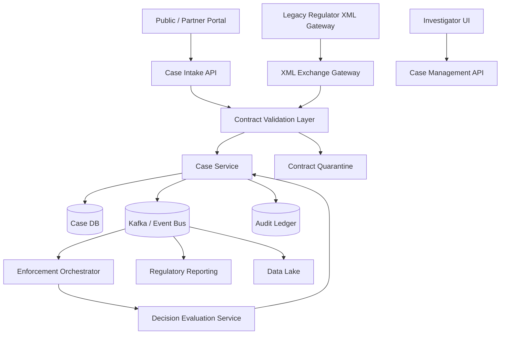
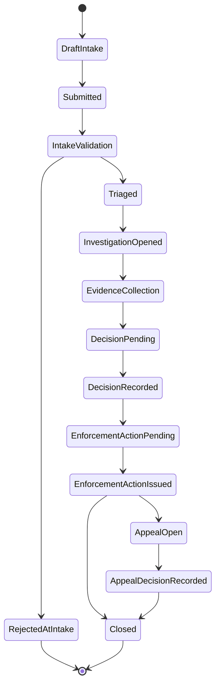
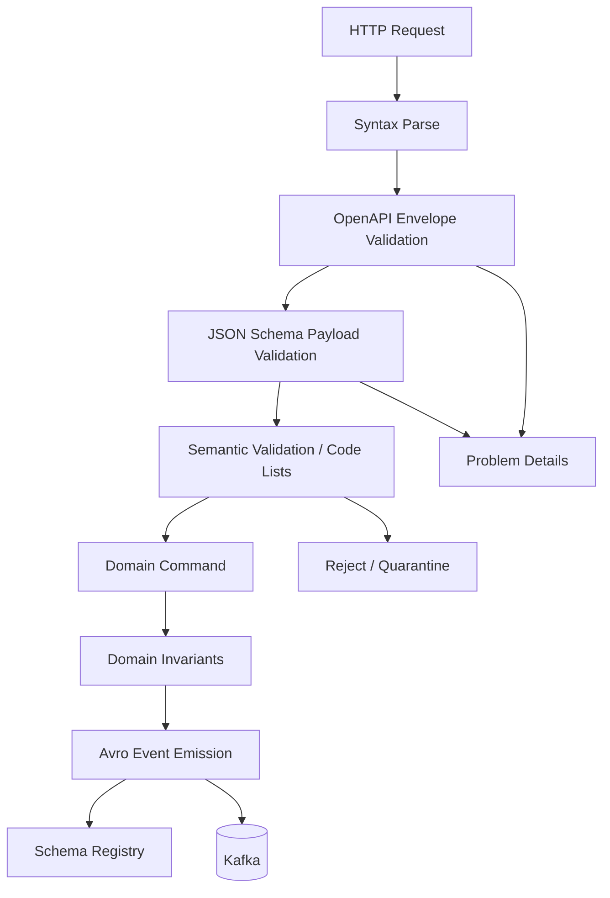
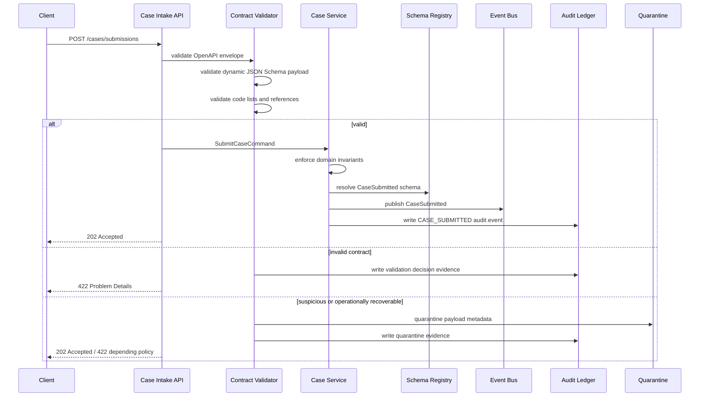
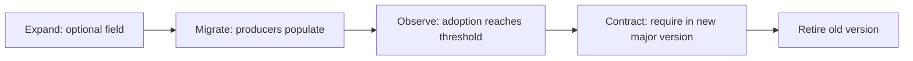
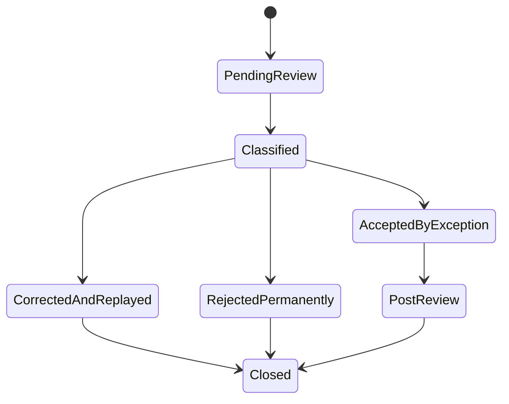
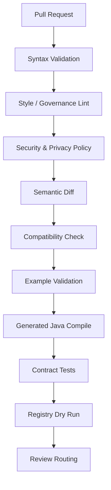
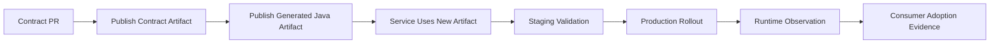

# Part 046 — Case Study: Regulatory Case Management Contract Platform

This part turns the previous 45 parts into a concrete platform design.

The domain: regulatory case management.

The goal: build a contract architecture for a system that handles case intake, triage, investigation, enforcement, decisions, sanctions, appeals, reporting, and audit.

The important point is not the exact domain names.

The important point is the contract thinking.

A regulatory case platform is a perfect stress test because it has:

- external submissions;
- legacy XML exchange;
- internal APIs;
- asynchronous events;
- document-heavy workflows;
- sensitive personal and organizational data;
- long-running case lifecycle;
- strict auditability;
- evolving rules;
- multiple consumers;
- reporting and analytics;
- legal defensibility requirements;
- cross-team ownership.

This is where contract engineering stops being a library choice and becomes architecture.

---

## 1. System context

The platform receives reports, complaints, filings, referrals, and regulatory signals.

It turns them into cases.

Cases move through lifecycle states.

At each stage, the platform emits events, exposes APIs, validates documents, records decisions, and preserves audit evidence.



At first glance this looks like ordinary microservice architecture.

The contract view is different.

It asks:

- what is the contract at each boundary?
- who owns it?
- how does it evolve?
- how is it validated?
- how is evidence stored?
- how is compatibility enforced?
- how is a rejected payload explained?
- how does a field move from API to event to report?

---

## 2. Boundary-to-contract map

Each boundary needs a contract format that fits its purpose.

| Boundary | Contract format | Why |
|---|---|---|
| Public/partner HTTP API | OpenAPI | Human-readable API contract, generated clients, request/response documentation, gateway integration. |
| Dynamic intake form payload | JSON Schema | Flexible validation of semi-structured form sections and jurisdiction-specific payloads. |
| Legacy regulator exchange | XSD | XML namespace governance, strict validation, legacy integration compatibility. |
| Internal high-volume events | Avro | Schema evolution, compact binary format, Kafka registry integration, reader/writer resolution. |
| Internal RPC decision service | Protobuf/gRPC | Strong service contract, compact binary RPC, cross-language compatibility. |
| Audit/event evidence | JSON Schema or Avro | Structured audit payloads, validation, searchable metadata, long-term evolution. |
| Batch reporting manifest | JSON Schema | Explicit file set contract, counts, digests, schema versions, reporting period. |

A top-tier engineer does not force one format everywhere.

The right architecture is multi-format but governed by one contract operating model.

---

## 3. Core domain model

Simplified entities:

```text
Case
CaseParty
RegulatedEntity
Complainant
Allegation
Violation
EvidenceItem
InvestigationActivity
Decision
Sanction
Appeal
CaseNote
CaseDocument
AuditRecord
```

Core lifecycle:



Do not expose this entire state machine as a generic update endpoint.

State transitions are commands.

Commands need contracts.

Events record facts.

Facts need contracts.

---

## 4. Contract inventory

Initial contract inventory:

| Contract ID | Kind | Owner | Boundary | Criticality |
|---|---|---|---|---|
| `case-intake-api` | OpenAPI | case-platform | external HTTP | high |
| `case-intake-form-schema` | JSON Schema | case-platform + policy team | dynamic intake payload | high |
| `legacy-case-exchange-xsd` | XSD | integration-platform | XML exchange | high |
| `case-submitted-event` | Avro | case-platform | Kafka event | high |
| `case-status-changed-event` | Avro | case-platform | Kafka event | high |
| `decision-recorded-event` | Avro | decision-platform | Kafka event | high |
| `decision-evaluation-service` | Protobuf | decision-platform | internal gRPC | medium/high |
| `case-audit-event` | JSON Schema/Avro | audit-platform | audit ledger | high |
| `case-reporting-manifest` | JSON Schema | reporting-platform | batch reports | medium/high |

This inventory is not documentation only.

It drives CI ownership, review routing, registry subjects, runtime enforcement, and audit queries.

---

## 5. Repository layout

A contract repository can be organized by capability and format.

```text
contracts/
  case-intake/
    openapi/
      case-intake-api.yaml
      examples/
      policies/
    json-schema/
      case-intake-form.schema.json
      regulated-entity.schema.json
      complainant.schema.json
  case-lifecycle/
    avro/
      CaseSubmitted.avsc
      CaseStatusChanged.avsc
      InvestigationOpened.avsc
  decision/
    proto/
      decision_evaluation_service.proto
    avro/
      DecisionRecorded.avsc
  legacy-exchange/
    xsd/
      regulator-case-exchange-v1.xsd
      common-types-v1.xsd
  audit/
    json-schema/
      case-audit-event.schema.json
  reporting/
    json-schema/
      case-reporting-manifest.schema.json
catalog/
  contracts.yaml
policy/
  contract-policy.yaml
adr/
  ADR-2026-001-contract-format-selection.md
  ADR-2026-002-case-event-envelope.md
```

The catalog ties everything together.

```yaml
contracts:
  - id: case-intake-api
    kind: openapi
    ownerTeam: case-platform
    path: contracts/case-intake/openapi/case-intake-api.yaml
    runtimeValidation: strict-ingress
    compatibilityMode: backward
    registrySubject: api.case-intake.openapi
    sensitivity: contains-pii
  - id: case-submitted-event
    kind: avro
    ownerTeam: case-platform
    path: contracts/case-lifecycle/avro/CaseSubmitted.avsc
    registrySubject: events.case.CaseSubmitted-value
    compatibilityMode: backward-transitive
    sensitivity: contains-pii
```

---

## 6. OpenAPI: Case Intake API

The external intake API receives case submissions.

A simplified operation:

```yaml
paths:
  /cases/submissions:
    post:
      operationId: submitCase
      summary: Submit a new regulatory case intake package
      tags:
        - Case Intake
      parameters:
        - name: Idempotency-Key
          in: header
          required: true
          schema:
            type: string
            minLength: 16
            maxLength: 128
      requestBody:
        required: true
        content:
          application/json:
            schema:
              $ref: '#/components/schemas/CaseSubmissionRequest'
            examples:
              validConsumerComplaint:
                $ref: './examples/valid-consumer-complaint.yaml'
      responses:
        '202':
          description: Submission accepted for asynchronous processing
          content:
            application/json:
              schema:
                $ref: '#/components/schemas/CaseSubmissionAcceptedResponse'
        '400':
          description: Malformed request
          content:
            application/problem+json:
              schema:
                $ref: '#/components/schemas/Problem'
        '422':
          description: Request shape is valid but failed contract or business validation
          content:
            application/problem+json:
              schema:
                $ref: '#/components/schemas/Problem'
```

Key design choices:

- `POST` is idempotent through `Idempotency-Key`;
- response is `202` because case creation may trigger async validation;
- `400` is syntax/protocol-level;
- `422` is semantic/contract-level;
- error response uses a stable `Problem` model;
- request schema does not expose database structure;
- fields have classification metadata via extensions where your platform supports it.

Example request schema:

```yaml
components:
  schemas:
    CaseSubmissionRequest:
      type: object
      required:
        - submissionId
        - channel
        - submittedAt
        - submitter
        - caseType
        - payload
      properties:
        submissionId:
          type: string
          description: Client-generated stable submission identifier.
          minLength: 10
          maxLength: 80
        channel:
          type: string
          enum:
            - PUBLIC_PORTAL
            - PARTNER_API
            - LEGACY_XML_GATEWAY
        submittedAt:
          type: string
          format: date-time
        submitter:
          $ref: '#/components/schemas/Submitter'
        caseType:
          type: string
          enum:
            - CONSUMER_COMPLAINT
            - MARKET_CONDUCT
            - LICENSE_VIOLATION
            - REFERRAL
        payload:
          type: object
          description: Case-type-specific payload validated by JSON Schema.
          additionalProperties: true
```

Notice the `payload` field.

OpenAPI validates the stable envelope.

JSON Schema validates the dynamic payload.

This avoids stuffing every jurisdiction-specific form into one giant OpenAPI schema.

---

## 7. JSON Schema: dynamic intake payload

Example JSON Schema for a market conduct case:

```json
{
  "$schema": "https://json-schema.org/draft/2020-12/schema",
  "$id": "https://contracts.example.com/case-intake/market-conduct/1.0.0/schema",
  "title": "MarketConductIntakePayload",
  "type": "object",
  "required": ["regulatedEntity", "allegations", "evidenceSummary"],
  "properties": {
    "regulatedEntity": {
      "$ref": "https://contracts.example.com/common/regulated-entity/2.1.0/schema"
    },
    "allegations": {
      "type": "array",
      "minItems": 1,
      "items": {
        "$ref": "#/$defs/allegation"
      }
    },
    "evidenceSummary": {
      "type": "string",
      "minLength": 20,
      "maxLength": 5000
    }
  },
  "unevaluatedProperties": false,
  "$defs": {
    "allegation": {
      "type": "object",
      "required": ["violationCode", "description"],
      "properties": {
        "violationCode": {
          "type": "string",
          "pattern": "^[A-Z0-9_]{3,64}$"
        },
        "description": {
          "type": "string",
          "minLength": 10,
          "maxLength": 2000
        }
      },
      "unevaluatedProperties": false
    }
  }
}
```

Design decisions:

- use `$id` with version;
- use shared regulated entity schema;
- keep dynamic payload closed unless extension is intentional;
- use code-list lookup for `violationCode` outside pure JSON Schema;
- store validation result with schema digest and reference-data version.

---

## 8. XSD: legacy case exchange

Legacy regulator systems may require XML.

Example skeleton:

```xml
<?xml version="1.0" encoding="UTF-8"?>
<xs:schema
    xmlns:xs="http://www.w3.org/2001/XMLSchema"
    xmlns:case="urn:example:regulator:case-exchange:v1"
    targetNamespace="urn:example:regulator:case-exchange:v1"
    elementFormDefault="qualified">

  <xs:element name="CaseExchange" type="case:CaseExchangeType"/>

  <xs:complexType name="CaseExchangeType">
    <xs:sequence>
      <xs:element name="Header" type="case:ExchangeHeaderType"/>
      <xs:element name="Case" type="case:CaseType"/>
    </xs:sequence>
    <xs:attribute name="schemaVersion" type="xs:string" use="required" fixed="1.0"/>
  </xs:complexType>

  <xs:complexType name="CaseType">
    <xs:sequence>
      <xs:element name="CaseReference" type="xs:string"/>
      <xs:element name="CaseType" type="case:CaseTypeCode"/>
      <xs:element name="RegulatedEntity" type="case:RegulatedEntityType"/>
      <xs:element name="Allegation" type="case:AllegationType" minOccurs="1" maxOccurs="unbounded"/>
    </xs:sequence>
  </xs:complexType>

  <xs:simpleType name="CaseTypeCode">
    <xs:restriction base="xs:string">
      <xs:enumeration value="CONSUMER_COMPLAINT"/>
      <xs:enumeration value="MARKET_CONDUCT"/>
      <xs:enumeration value="LICENSE_VIOLATION"/>
      <xs:enumeration value="REFERRAL"/>
    </xs:restriction>
  </xs:simpleType>

</xs:schema>
```

XSD is not the internal domain model.

It is an integration contract for a legacy XML boundary.

Map it explicitly.

Do not let JAXB-generated classes become your case domain model.

---

## 9. Avro: case submitted event

When intake is accepted, emit an event.

Event facts should be stable and replayable.

```json
{
  "type": "record",
  "name": "CaseSubmitted",
  "namespace": "com.example.contracts.case.v1",
  "fields": [
    { "name": "eventId", "type": "string" },
    { "name": "occurredAt", "type": { "type": "long", "logicalType": "timestamp-millis" } },
    { "name": "caseId", "type": "string" },
    { "name": "submissionId", "type": "string" },
    { "name": "caseType", "type": "string" },
    { "name": "channel", "type": "string" },
    {
      "name": "regulatedEntity",
      "type": {
        "type": "record",
        "name": "RegulatedEntitySnapshot",
        "fields": [
          { "name": "entityId", "type": "string" },
          { "name": "displayName", "type": "string" },
          { "name": "licenseNumber", "type": ["null", "string"], "default": null }
        ]
      }
    },
    {
      "name": "correlationId",
      "type": "string"
    },
    {
      "name": "causationId",
      "type": ["null", "string"],
      "default": null
    }
  ]
}
```

Design decisions:

- event records a fact, not a command;
- event has event ID and occurrence time;
- event contains a snapshot, not lazy references only;
- nullable field uses Avro union with default;
- identity fields are strings because public ID design is explicit;
- event does not embed entire intake payload by default;
- sensitive fields need classification metadata in catalog/policy.

---

## 10. Protobuf: decision evaluation service

Decision evaluation may be an internal gRPC service.

Example `.proto`:

```proto
syntax = "proto3";

package example.decision.v1;

option java_package = "com.example.contracts.decision.v1";
option java_multiple_files = true;

service DecisionEvaluationService {
  rpc EvaluateDecision(EvaluateDecisionRequest) returns (EvaluateDecisionResponse);
}

message EvaluateDecisionRequest {
  string case_id = 1;
  string case_type = 2;
  repeated Allegation allegations = 3;
  repeated EvidenceSummary evidence = 4;
  optional string policy_version = 5;
}

message Allegation {
  string violation_code = 1;
  string description = 2;
}

message EvidenceSummary {
  string evidence_id = 1;
  string evidence_type = 2;
  string summary = 3;
}

message EvaluateDecisionResponse {
  string evaluation_id = 1;
  Recommendation recommendation = 2;
  repeated DecisionBasis basis = 3;
}

enum Recommendation {
  RECOMMENDATION_UNSPECIFIED = 0;
  NO_ACTION = 1;
  WARNING = 2;
  FORMAL_INVESTIGATION = 3;
  ENFORCEMENT_ACTION = 4;
}

message DecisionBasis {
  string rule_id = 1;
  string explanation = 2;
}
```

Design decisions:

- use explicit package version;
- reserve field numbers when removing fields;
- use `optional` where presence matters;
- keep enum zero value unspecified;
- do not use gRPC response as audit record directly;
- store decision basis as an event and audit record.

---

## 11. Audit event contract

Every significant lifecycle event creates audit evidence.

Example JSON Schema shape:

```json
{
  "$schema": "https://json-schema.org/draft/2020-12/schema",
  "$id": "https://contracts.example.com/audit/case-audit-event/1.0.0/schema",
  "type": "object",
  "required": ["eventId", "eventType", "occurredAt", "actor", "caseId", "evidence"],
  "properties": {
    "eventId": { "type": "string" },
    "eventType": {
      "type": "string",
      "enum": [
        "CASE_SUBMITTED",
        "CASE_TRIAGED",
        "INVESTIGATION_OPENED",
        "DECISION_RECORDED",
        "ENFORCEMENT_ACTION_ISSUED",
        "CASE_CLOSED"
      ]
    },
    "occurredAt": { "type": "string", "format": "date-time" },
    "caseId": { "type": "string" },
    "actor": {
      "type": "object",
      "required": ["actorId", "actorType"],
      "properties": {
        "actorId": { "type": "string" },
        "actorType": { "type": "string", "enum": ["HUMAN", "SYSTEM", "BATCH"] }
      },
      "unevaluatedProperties": false
    },
    "evidence": {
      "type": "object",
      "required": ["source", "contractRefs"],
      "properties": {
        "source": { "type": "string" },
        "contractRefs": {
          "type": "array",
          "items": {
            "type": "object",
            "required": ["contractId", "version", "digest"],
            "properties": {
              "contractId": { "type": "string" },
              "version": { "type": "string" },
              "digest": { "type": "string" }
            }
          }
        }
      }
    }
  },
  "unevaluatedProperties": false
}
```

The audit event references contract versions.

That makes future evidence reconstruction possible.

---

## 12. Validation architecture

Validation should happen at boundaries.



Separate validation layers:

| Layer | Responsibility |
|---|---|
| Syntax parse | Is the payload parseable? |
| OpenAPI validation | Is HTTP envelope and stable API shape valid? |
| JSON Schema validation | Is dynamic payload shape valid? |
| Semantic validation | Are code lists, references, and business preconditions valid? |
| Domain invariant check | Can the command change domain state? |
| Event serialization | Does emitted event match registry schema? |
| Audit validation | Does audit evidence match audit contract? |

Do not mix all validation into one “validator service”.

The layers have different failure semantics.

---

## 13. Java module layout

A production Java implementation might use modules like this:

```text
case-platform/
  pom.xml
  contract-artifacts/
    case-intake-openapi-generated/
    case-events-avro-generated/
    decision-proto-generated/
    legacy-xsd-generated/
  case-intake-service/
    src/main/java/com/example/caseintake/api
    src/main/java/com/example/caseintake/mapper
    src/main/java/com/example/caseintake/validation
    src/main/java/com/example/caseintake/domain
    src/main/java/com/example/caseintake/events
  case-service/
  decision-client/
  audit-client/
  contract-runtime/
    src/main/java/com/example/contracts/runtime
  contract-test-fixtures/
```

Rules:

1. Generated classes stay in generated modules.
2. Domain model is handwritten.
3. Mappers are explicit.
4. Validators are boundary-owned.
5. Event publishers require schema registry metadata.
6. Audit client is shared but contract-aware.
7. Tests include compatibility fixtures.

Example mapper boundary:

```java
public final class CaseSubmissionMapper {

    public SubmitCaseCommand toCommand(
            CaseSubmissionRequest request,
            ValidatedDynamicPayload payload,
            RequestContext context
    ) {
        return new SubmitCaseCommand(
                new SubmissionId(request.getSubmissionId()),
                new IdempotencyKey(context.idempotencyKey()),
                CaseType.fromCode(request.getCaseType()),
                SubmitterMapper.toDomain(request.getSubmitter()),
                payload.toDomainPayload(),
                context.correlationId()
        );
    }
}
```

Never let generated OpenAPI models flow all the way into domain state.

---

## 14. Event envelope strategy

For Avro/Kafka events, use either envelope or header-based metadata.

Envelope example:

```json
{
  "type": "record",
  "name": "CaseEventEnvelope",
  "namespace": "com.example.contracts.case.v1",
  "fields": [
    { "name": "eventId", "type": "string" },
    { "name": "eventType", "type": "string" },
    { "name": "occurredAt", "type": { "type": "long", "logicalType": "timestamp-millis" } },
    { "name": "producer", "type": "string" },
    { "name": "schemaVersion", "type": "string" },
    { "name": "correlationId", "type": "string" },
    { "name": "causationId", "type": ["null", "string"], "default": null },
    { "name": "payload", "type": "bytes" }
  ]
}
```

But many Avro/Kafka platforms prefer each event type as its own subject, with metadata in headers.

Either can work.

Choose based on:

- registry capabilities;
- consumer tooling;
- topic design;
- replay needs;
- cross-language support;
- data lake ingestion;
- DLQ handling.

Do not mix randomly.

Write an ADR.

---

## 15. Registry subjects

Example subject naming:

```yaml
subjects:
  events.case.CaseSubmitted-value:
    contractId: case-submitted-event
    compatibility: BACKWARD_TRANSITIVE
  events.case.CaseStatusChanged-value:
    contractId: case-status-changed-event
    compatibility: BACKWARD_TRANSITIVE
  events.decision.DecisionRecorded-value:
    contractId: decision-recorded-event
    compatibility: BACKWARD_TRANSITIVE
  api.case-intake.openapi:
    contractId: case-intake-api
    compatibility: custom-openapi-backward
```

Do not let subject names be accidental output from serializers.

Subject naming is governance.

---

## 16. Code-list design

Regulatory platforms are code-list heavy.

Examples:

```text
case type
submission channel
violation code
sanction type
decision outcome
investigation activity type
regulated entity category
jurisdiction
appeal reason
closure reason
```

Design rule:

- stable technical enums are okay in schemas;
- volatile regulatory lists should be external reference data;
- payloads carry code and code-list version where needed;
- validators resolve against effective-dated code lists;
- generated Java `enum` should not be used for volatile lists.

Example:

```json
{
  "violationCode": "MC_CONDUCT_017",
  "violationCodeListVersion": "2026.07"
}
```

Why version the code list?

Because replay and audit depend on what was valid at the time.

---

## 17. Case ID and correlation model

Use distinct identifiers.

| ID | Meaning |
|---|---|
| `caseId` | Stable public/internal case identity. |
| `submissionId` | Client submission identity. |
| `eventId` | Unique event identity. |
| `commandId` | Unique command identity. |
| `correlationId` | Groups related work. |
| `causationId` | Points to triggering command/event. |
| `idempotencyKey` | Prevents duplicate side effects. |
| `auditEventId` | Unique audit evidence identity. |

Do not reuse one ID for all purposes.

It makes tracing look simpler until you need to explain causality.

---

## 18. Contract-driven case submission flow



The decision between reject and quarantine is policy.

For public API input, reject invalid submissions clearly.

For internal events, quarantine may preserve flow while isolating poison messages.

---

## 19. Compatibility policy

Compatibility policy by contract type:

```yaml
compatibilityPolicy:
  openapi:
    externalApis: backward-compatible-only
    breakingChanges: require-major-version-and-consumer-plan
  jsonSchema:
    intakePayloads: backward-compatible-with-explicit-migration
    dynamicReferences: restricted
  avro:
    caseEvents: BACKWARD_TRANSITIVE
    decisionEvents: BACKWARD_TRANSITIVE
  protobuf:
    decisionGrpc: no-field-number-reuse
    breakingChanges: package-version-bump-required
  xsd:
    legacyExchange: namespace-major-version-for-breaking-change
```

Examples:

| Change | Contract | Safe? | Reason |
|---|---|---|---|
| Add optional `casePriority` to OpenAPI response | OpenAPI | Usually safe | Consumers should ignore unknown fields, but generated strict clients may break. Check. |
| Add required `riskCategory` to intake request | OpenAPI | Breaking | Existing clients cannot send it. Use expand-migrate-contract. |
| Add Avro field with default | Avro | Usually backward-compatible | Old data can be read by new schema if default works. |
| Remove Protobuf field and reuse field number | Protobuf | Dangerous | Old binary data can be misinterpreted. Reserve instead. |
| Add XSD required element in existing sequence | XSD | Breaking | Existing XML documents fail validation. |
| Remove enum symbol from generated Java enum | Many | Dangerous | Existing data may become unreadable. |

---

## 20. Example migration: add case priority

Business wants `casePriority` for triage.

Bad approach:

```text
Add required field to API and event.
Deploy.
Tell consumers to fix errors.
```

Good approach:

### Phase 1 — Expand

- Add optional `casePriority` to OpenAPI request.
- Add nullable/defaulted `casePriority` to Avro event.
- Add code-list values.
- Add storage column nullable.
- Add runtime telemetry for missing priority.
- Keep old behavior when missing.

### Phase 2 — Migrate

- Update clients to send priority.
- Update case portal UI.
- Update partner API guide.
- Monitor percentage of submissions with priority.
- Backfill where possible.
- Notify consumers.

### Phase 3 — Contract

- When evidence shows all active clients send it, make it required in next major API version.
- Keep old version until sunset.
- For events, consider whether required semantics are needed at all.
- Document migration evidence.

Diagram:



---

## 21. Reporting and batch contracts

Regulatory reporting often uses batch files.

Do not rely on filenames alone.

Use a manifest contract.

```json
{
  "$schema": "https://json-schema.org/draft/2020-12/schema",
  "$id": "https://contracts.example.com/reporting/case-reporting-manifest/1.0.0/schema",
  "type": "object",
  "required": ["reportId", "reportingPeriod", "files", "recordCounts", "schemaVersions"],
  "properties": {
    "reportId": { "type": "string" },
    "reportingPeriod": {
      "type": "object",
      "required": ["from", "to"],
      "properties": {
        "from": { "type": "string", "format": "date" },
        "to": { "type": "string", "format": "date" }
      }
    },
    "files": {
      "type": "array",
      "items": {
        "type": "object",
        "required": ["name", "digest", "recordCount"],
        "properties": {
          "name": { "type": "string" },
          "digest": { "type": "string" },
          "recordCount": { "type": "integer", "minimum": 0 }
        }
      }
    },
    "schemaVersions": {
      "type": "object",
      "additionalProperties": { "type": "string" }
    },
    "recordCounts": {
      "type": "object",
      "additionalProperties": { "type": "integer", "minimum": 0 }
    }
  },
  "unevaluatedProperties": false
}
```

Manifest contracts are essential for auditability.

They tell you what was submitted, with what schema, for what period, and with what digest.

---

## 22. Observability model

Every validation and contract usage event should produce telemetry.

Core metrics:

```text
contract_validation_total{contract_id, version, outcome}
contract_validation_error_total{contract_id, error_code, pointer}
contract_runtime_usage_total{contract_id, version, producer, consumer}
contract_quarantine_total{contract_id, reason}
contract_unknown_field_total{contract_id, field_path}
contract_deprecated_usage_total{contract_id, version, consumer}
contract_schema_resolution_failure_total{contract_id, registry_subject}
```

Core trace attributes:

```text
contract.id
contract.version
contract.kind
contract.digest
contract.registry.subject
contract.registry.version
contract.validation.mode
contract.validation.outcome
```

Do not put raw PII in metric labels.

Metric cardinality and privacy both matter.

---

## 23. Audit evidence for case decisions

A decision must be explainable.

Decision recorded event:

```json
{
  "eventId": "01J...",
  "eventType": "DecisionRecorded",
  "caseId": "CASE-2026-000123",
  "occurredAt": 1783082400000,
  "decision": "FORMAL_INVESTIGATION",
  "decisionBasis": [
    {
      "ruleId": "RULE-MC-017",
      "explanation": "Multiple market conduct allegations with supporting evidence."
    }
  ],
  "policyVersion": "decision-policy-2026.07",
  "correlationId": "corr-01J..."
}
```

Audit record should link:

```text
decision event
input evidence summaries
policy version
contract version
actor or system identity
case state before/after
approval if required
```

Without this, the system can tell you what decision was made but not why it was defensible.

---

## 24. Quarantine design

Contract quarantine record:

```yaml
quarantineId: Q-2026-000881
source: partner-api
contractId: case-intake-api
contractVersion: 3.4.1
artifactDigest: sha256:...
outcome: quarantined
reasonCode: INVALID_DYNAMIC_PAYLOAD
payloadFingerprint: sha256:...
errorSummary:
  - code: REQUIRED_FIELD_MISSING
    pointer: /regulatedEntity/licenseNumber
    classification: regulated-entity-identifier
rawPayloadStored: false
safeExcerptStored: true
correlationId: c-01J...
createdAt: 2026-07-03T12:10:00Z
reviewState: pending
```

Quarantine workflow:



Accepted-by-exception must be rare and heavily audited.

---

## 25. Security and privacy overlay

Sensitive fields in this platform include:

```text
complainant.name
complainant.email
complainant.phone
regulatedEntity.licenseNumber
caseNarrative.freeText
evidenceSummary
internalNotes
decisionBasis
```

Contract policy should require:

- classification metadata;
- masking rules;
- log exclusion;
- search indexing policy;
- access role;
- retention category;
- data lake handling;
- DLQ/quarantine handling;
- generated documentation visibility.

Example policy fragment:

```yaml
fieldPolicies:
  - match: "**/complainant/email"
    classification: pii-contact
    logPolicy: never-raw
    maskPolicy: email-partial
    searchIndex: false
  - match: "**/caseNarrative"
    classification: free-text-sensitive
    logPolicy: never-raw
    searchIndex: restricted
    maxLength: 10000
```

Free text is especially dangerous.

It can contain anything.

Treat it as high-risk unless proven otherwise.

---

## 26. Contract CI pipeline

Pipeline for every pull request:



PR output should include:

```text
change classification
compatibility result
affected fields
affected consumers
security/privacy findings
example validation result
generated artifact impact
required reviewers
release note draft
```

Make the review easy to do correctly.

---

## 27. Local developer workflow

Developers need fast feedback.

Commands:

```bash
./mvnw -pl contract-checks verify
./mvnw -pl contract-artifacts/case-events-avro-generated test
./mvnw -pl case-intake-service test
./scripts/contract-diff.sh case-intake-api main HEAD
./scripts/validate-examples.sh case-intake-api
```

Local checks should not require production registry access.

Use a local registry, fixture schema catalog, or registry mock.

If governance only works in CI, developers will hate it and bypass it.

---

## 28. Production rollout model

Contract release is separate from service release.



This separation matters.

A schema can be approved before every service uses it.

A service can deploy support for a schema before producers start sending it.

Compatibility gives you room to sequence changes safely.

---

## 29. Incident example

Incident:

```text
Reporting pipeline fails reading CaseSubmitted events after new enum value ESCALATED_REVIEW is emitted.
```

Investigation path:

1. Find failing contract: `case-submitted-event`.
2. Identify version: producer emitted schema registry version 28.
3. Check diff: enum value added.
4. Check policy: enum value addition allowed only if consumers handle unknown values.
5. Check consumer tests: reporting pipeline did not run unknown enum fixture.
6. Check review: data-platform owner not required due to bad routing rule.
7. Mitigate: stop emitting new value or route to compatibility shim.
8. Fix: add unknown enum handling and CI fixture.
9. Governance update: require data-platform review for enum changes on reporting-used events.

The schema was syntactically valid.

The platform failed because governance and tests did not model the real consumer risk.

---

## 30. Anti-patterns in this case study

### 30.1 One giant case DTO

Bad:

```text
CaseDto used by API, DB, event, workflow, reporting, and UI.
```

Impact:

- accidental coupling;
- impossible compatibility reasoning;
- overexposed sensitive fields;
- generated model leaks;
- every change has huge blast radius.

### 30.2 Runtime auto-registration

Bad:

```text
Case service registers Avro schema when it starts in production.
```

Impact:

- unreviewed schema enters production;
- CI compatibility can be bypassed;
- registry becomes source of surprise.

### 30.3 Free-text everywhere

Bad:

```json
{
  "notes": "anything"
}
```

Impact:

- hidden PII;
- unsearchable semantics;
- poor validation;
- weak reporting;
- audit ambiguity.

### 30.4 Enum for volatile regulatory code lists

Bad:

```java
enum ViolationCode { A, B, C }
```

Impact:

- frequent redeploys;
- old data unreadable;
- partner mismatch;
- generated clients break.

### 30.5 Audit afterthought

Bad:

```text
We will add audit logs later.
```

Impact:

- decision basis lost;
- field lineage incomplete;
- validation context missing;
- defensibility impossible.

---

## 31. What “good” looks like

A strong implementation can answer these questions quickly:

- Which contract version accepted this case submission?
- Which JSON Schema validated the dynamic payload?
- Which code-list version validated the violation code?
- Which service emitted the `CaseSubmitted` event?
- Which consumers read this event version?
- Which contract field maps to the regulatory entity license number?
- Which reports include that field?
- Which sensitive fields are stored in quarantine?
- Which deprecated API versions are still used?
- Which breaking changes were approved in the last quarter?
- Which fields lack classification metadata?
- Which producer started emitting invalid payloads after deployment?
- Can we replay this event with the original reader/writer schema pair?
- Can we reproduce why a decision was made?

If the platform cannot answer these, the contracts are not operationally mature.

---

## 32. Capstone exercises

Use this case study to design and implement:

1. An OpenAPI contract for case submission.
2. A JSON Schema for one dynamic case payload.
3. An Avro schema for `CaseSubmitted`.
4. A Protobuf service for decision evaluation.
5. An XSD for legacy case exchange.
6. A contract catalog file tying them together.
7. A compatibility matrix for one proposed change.
8. A CI pipeline that validates syntax, lint, examples, compatibility, and generated Java compile.
9. A runtime validation decision record.
10. A quarantine workflow state machine.
11. A field-level lineage record for `regulatedEntity.licenseNumber`.
12. A migration plan to add `casePriority`.
13. A policy rule that blocks unclassified sensitive fields.
14. A provider/consumer contract test for case submission.
15. An audit evidence query for a specific decision.

Do not implement everything at once.

Implement the smallest vertical slice:

```text
OpenAPI submit endpoint
  -> JSON Schema dynamic payload validation
  -> domain command
  -> Avro CaseSubmitted event
  -> audit event
  -> validation telemetry
  -> contract CI gate
```

Then expand.

---

## 33. References

- [OpenAPI Specification 3.2.0](https://spec.openapis.org/oas/v3.2.0.html)
- [JSON Schema Draft 2020-12](https://json-schema.org/draft/2020-12)
- [Apache Avro 1.12.0 Specification](https://avro.apache.org/docs/1.12.0/specification/)
- [Protocol Buffers Field Presence](https://protobuf.dev/programming-guides/field_presence/)
- [Protocol Buffers Editions Overview](https://protobuf.dev/editions/overview/)
- [NIST Privacy Framework](https://www.nist.gov/privacy-framework)
- [NIST SP 800-218 Secure Software Development Framework](https://csrc.nist.gov/pubs/sp/800/218/final)

---

## 34. Closing mental model

A regulatory case management platform is not just workflow plus database tables.

It is a network of contracts.

Every boundary has a language.

Every language has compatibility rules.

Every compatibility rule has operational consequences.

Every important decision needs evidence.

That is the practical meaning of data contract engineering at enterprise level.
