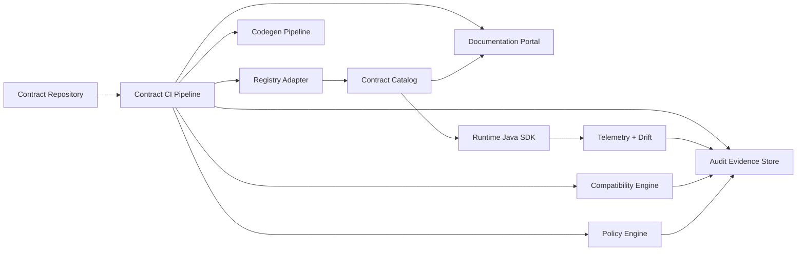
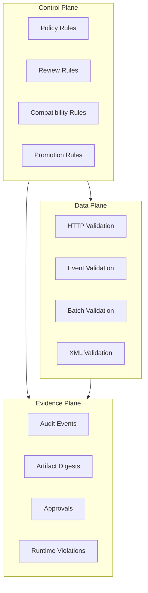
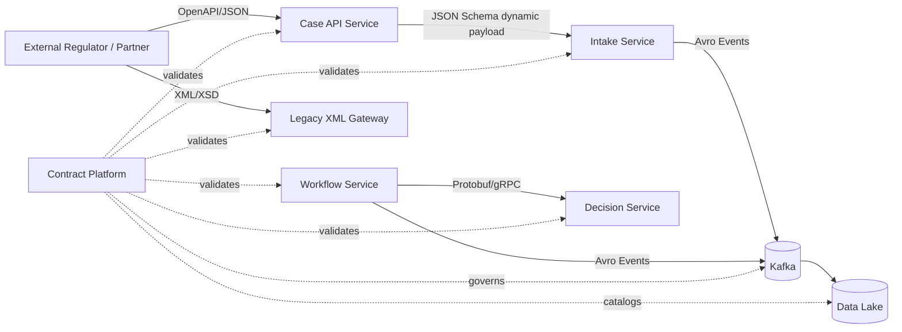
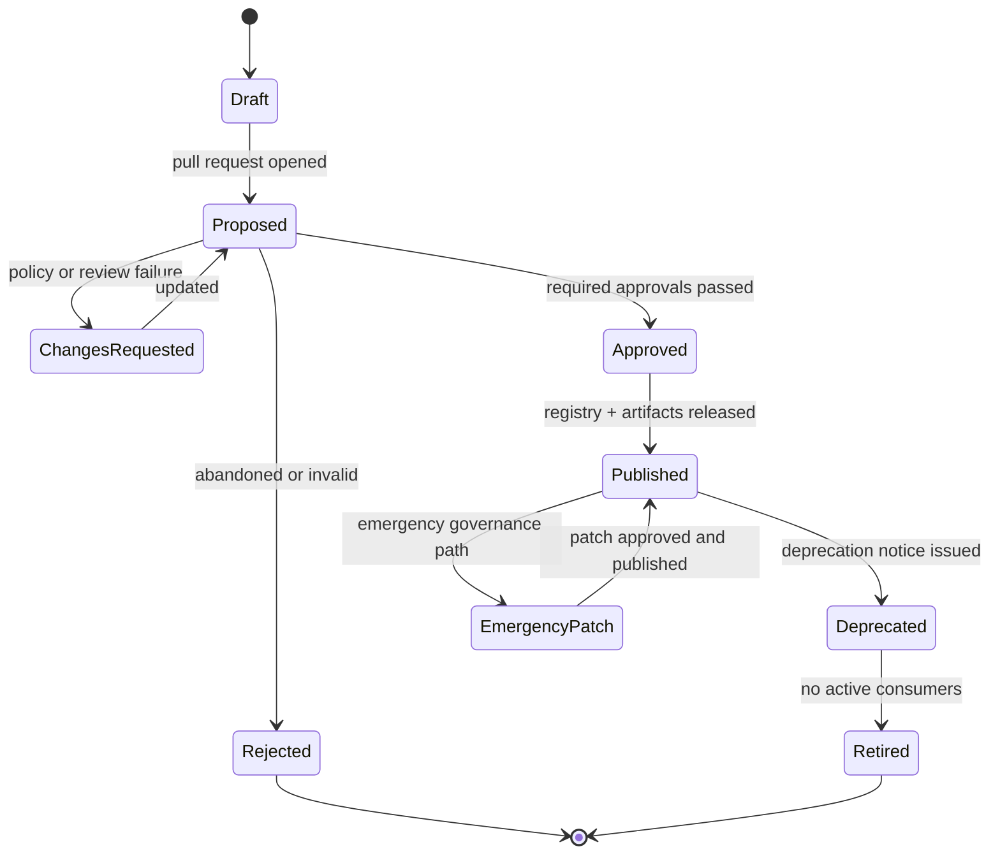
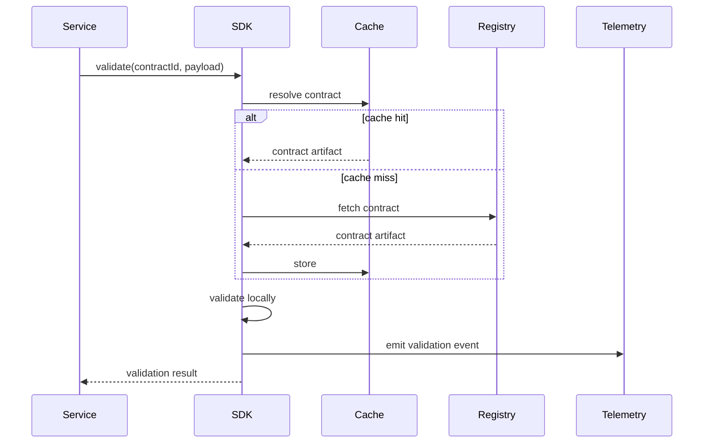
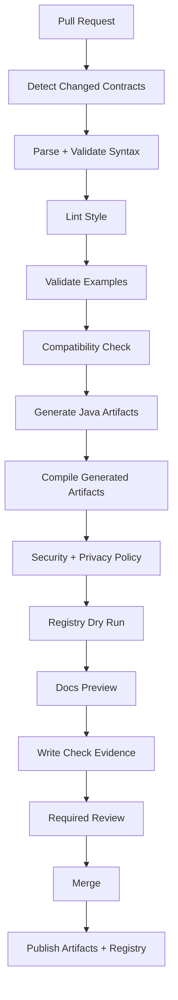
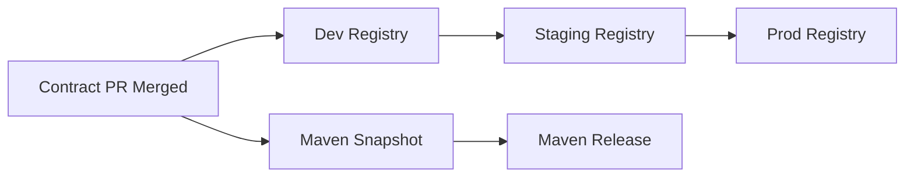
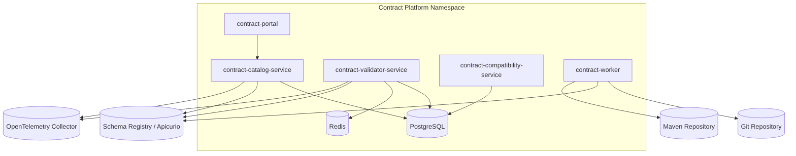

# Part 047 — Building a Contract Platform from Scratch

A contract platform is not a schema registry with a nicer UI.

A schema registry stores contract artifacts.

A contract platform controls the lifecycle of data protocols across teams, services, environments, releases, incidents, audits, and migrations.

That distinction matters.

If the platform only stores schemas, teams still need to solve ownership, compatibility, validation, code generation, documentation, approval, observability, drift detection, security classification, and rollback by themselves.

That is not platform engineering.

That is shared storage.

A real contract platform gives every service a repeatable path from design to runtime enforcement.

It answers questions like:

- who owns this contract?
- which services produce it?
- which services consume it?
- what version is deployed in production?
- is this proposed change backward compatible?
- does the generated Java artifact compile?
- does the example payload validate?
- does this field contain personal data?
- does this event have a replay-safe schema?
- does this API have a stable error model?
- can this contract be deprecated safely?
- what evidence proves this change was reviewed?
- which running workloads are violating the declared contract?

This chapter builds that platform from scratch.

The goal is not to create a huge enterprise tool on day one.

The goal is to design a platform architecture with the right seams.

Start small.

Keep the invariants strong.

Make each layer replaceable.

---

## 1. What you are building

You are building a **Java-based contract platform** that supports:

1. OpenAPI contracts for HTTP APIs.
2. JSON Schema contracts for JSON payloads and dynamic sections.
3. Avro contracts for Kafka events and data lake ingestion.
4. Protobuf contracts for gRPC and binary service-to-service messages.
5. XSD contracts for XML exchange and legacy enterprise integration.
6. Contract repository workflow.
7. Compatibility checking.
8. Contract linting.
9. Example validation.
10. Generated Java artifact publishing.
11. Registry integration.
12. Runtime validation SDK.
13. Contract documentation portal.
14. Review workflow.
15. Audit evidence.
16. Runtime telemetry.
17. Drift detection.
18. Quarantine and replay support.

This sounds large.

It becomes manageable if you treat the platform as a set of bounded components.



The contract repository is the source of proposed change.

The registry is the source of approved runtime identity.

The catalog is the source of discoverability.

The CI pipeline is the enforcement layer.

The SDK is the runtime integration layer.

The audit store is the evidence layer.

The documentation portal is the human interface.

---

## 2. Platform mental model: control plane, data plane, evidence plane

Think like distributed systems.

A contract platform has three planes.

### 2.1 Control plane

The control plane decides what is allowed.

It contains:

- ownership rules
- compatibility rules
- lint rules
- approval rules
- privacy rules
- security rules
- promotion rules
- deprecation rules
- registry publishing rules

The control plane is exercised mostly in CI and governance workflows.

### 2.2 Data plane

The data plane enforces contracts while systems are running.

It contains:

- HTTP request validation
- HTTP response validation
- Kafka producer validation
- Kafka consumer validation
- batch/file validation
- XML validation
- Protobuf parsing and semantic validation
- generated Java model usage
- quarantine and DLQ handling

The data plane must be fast, safe, observable, and predictable.

### 2.3 Evidence plane

The evidence plane proves what happened.

It contains:

- contract versions
- artifact digests
- approval history
- compatibility check results
- validation reports
- generated artifact coordinates
- registry IDs
- deployment environment mapping
- runtime violation events
- deprecation notices
- exception approvals

For regulatory systems, the evidence plane is not optional.

Without evidence, governance is just ceremony.



---

## 3. Non-negotiable platform invariants

Before discussing tools, define invariants.

These are rules the platform must never violate.

### 3.1 Every contract has a stable identity

A contract must have a stable logical identity independent of file path.

Bad:

```text
schemas/case-event.avsc
```

Better:

```text
contractId: regulatory.case.event.CaseLifecycleEvent
format: avro
namespace: com.acme.regulatory.case.event
```

File paths change.

Logical contract identity should not change casually.

### 3.2 Every contract version is immutable

Once approved and published, a contract version must not be edited in place.

If content changes, version changes.

If content changes but version does not change, your evidence becomes untrustworthy.

### 3.3 Every published artifact has a digest

The platform should compute a cryptographic digest for canonicalized contract content.

Example:

```text
sha256:3b6951d9c4e8f1e0c8a2...
```

This makes contract evidence reproducible.

### 3.4 Every runtime validation result is attributable

A validation result must say:

- contract ID
- contract version
- artifact digest
- environment
- producer or provider
- consumer or caller where known
- validation mode
- violation category
- decision

A log that says `Invalid payload` is not an engineering signal.

It is noise.

### 3.5 Generated code is not the domain model

Generated OpenAPI, Avro, Protobuf, or JAXB classes are boundary models.

They may be used at the integration boundary.

They should not become your core domain model.

### 3.6 Compatibility is format-specific and policy-specific

There is no universal compatibility rule.

Adding a field may be safe in one format and dangerous in another.

Making a field required may be safe for a new endpoint but breaking for existing consumers.

Changing enum values may be syntactically safe but operationally breaking.

### 3.7 Runtime validation must be deployable in modes

A production platform needs modes:

- disabled
- shadow
- sample
- warn
- reject
- quarantine
- strict

You do not want a new validator rollout to become a global outage.

---

## 4. System boundary view

A platform should not force every system to use the same transport.

It should standardize lifecycle and evidence, not erase architectural differences.



The platform does not replace API gateway, Kafka, workflow engine, or data lake.

It provides a consistent contract lifecycle across them.

---

## 5. Reference architecture

A minimal production platform has these services/modules:

| Component | Responsibility | Runtime Critical? |
|---|---|---:|
| Contract repository | Source-controlled contract definitions | No |
| Contract catalog | Queryable metadata and ownership | Yes for discovery, no for hot path |
| Registry adapter | Publish and resolve schemas from registry backends | Sometimes |
| Compatibility engine | Detect breaking changes | No runtime hot path |
| Policy engine | Enforce org rules | No runtime hot path |
| Codegen pipeline | Generate Java artifacts | Build-time |
| Validator service | Central validation API for non-Java consumers or batch | Sometimes |
| Runtime Java SDK | Local validation and registry lookup | Yes |
| Documentation portal | Human contract documentation | No hot path |
| Telemetry collector | Runtime validation events and drift signals | Yes for observability |
| Audit evidence store | Immutable evidence | Yes for defensibility |

A strong platform keeps runtime hot paths local where possible.

Do not require every request or event to synchronously call a central validator service.

Central services fail.

Network calls add latency.

Validation should usually happen in-process with cached schemas.

Use central validator service for:

- batch validation
- partner payload validation
- debugging
- CI example validation
- one-off replay validation
- non-Java clients without local SDK

---

## 6. Repository architecture

A contract platform begins with repository discipline.

Example layout:

```text
contracts/
  catalog.yaml
  policies/
    default-policy.yaml
    regulatory-policy.yaml
    pii-classification.yaml
  openapi/
    case-api/
      v1/
        openapi.yaml
        examples/
          create-case-request.valid.json
          create-case-response.valid.json
        changelog.md
        owners.yaml
  json-schema/
    intake/
      case-intake-payload/
        1.0.0/
          schema.json
          examples/
            valid-minimal.json
            valid-full.json
            invalid-missing-applicant.json
  avro/
    case-events/
      CaseLifecycleEvent/
        1.0.0/
          schema.avsc
          examples/
            case-created.json
  proto/
    decision/
      v1/
        decision_service.proto
        examples/
          evaluate_request.json
  xsd/
    partner-exchange/
      case-submission/
        2026-01/
          case-submission.xsd
          examples/
            valid-case-submission.xml
  adr/
    0001-contract-platform-scope.md
  docs/
    style-guide.md
    compatibility-policy.md
```

The repository is not just files.

It is a reviewable contract change surface.

### 6.1 The catalog file

A `catalog.yaml` gives the platform stable metadata.

```yaml
contracts:
  - contractId: regulatory.case.api.CaseApi
    format: openapi
    ownerTeam: case-platform
    lifecycle: active
    criticality: high
    source:
      path: openapi/case-api/v1/openapi.yaml
    runtime:
      service: case-api
      environmentPromotion: dev-to-staging-to-prod
    consumers:
      - portal-ui
      - partner-gateway
      - reporting-ingestion
    dataClassification:
      maxLevel: restricted
    compatibility:
      policy: http-api-backward-compatible

  - contractId: regulatory.case.event.CaseLifecycleEvent
    format: avro
    ownerTeam: case-platform
    lifecycle: active
    source:
      path: avro/case-events/CaseLifecycleEvent/1.0.0/schema.avsc
    registry:
      subject: regulatory.case.event.CaseLifecycleEvent-value
      compatibility: FULL_TRANSITIVE
    consumers:
      - workflow-service
      - reporting-ingestion
      - audit-indexer
```

This catalog lets the platform reason about a contract without guessing from file names.

### 6.2 Owners file

```yaml
ownerTeam: case-platform
primaryMaintainers:
  - alice@example.com
  - bob@example.com
approvers:
  architecture:
    - platform-architecture@example.com
  security:
    - appsec@example.com
  privacy:
    - privacy-engineering@example.com
  dataGovernance:
    - data-governance@example.com
consumerApprovalRequiredFor:
  - breaking
  - semantic-risk
  - sensitive-data-added
```

Ownership must be explicit.

A contract without an owner becomes a shared liability.

---

## 7. Contract identity model

Define identity as data.

A simple identity model:

```java
public record ContractIdentity(
    String contractId,
    ContractFormat format,
    String namespace,
    String name
) {}

public enum ContractFormat {
    OPENAPI,
    JSON_SCHEMA,
    AVRO,
    PROTOBUF,
    XSD
}
```

A version model:

```java
public record ContractVersion(
    ContractIdentity identity,
    String semanticVersion,
    String artifactDigest,
    String registrySubject,
    Integer registryVersion,
    String registryId,
    LifecycleState lifecycleState
) {}

public enum LifecycleState {
    DRAFT,
    PROPOSED,
    APPROVED,
    PUBLISHED,
    DEPRECATED,
    RETIRED,
    REJECTED
}
```

Do not use only registry ID as contract identity.

Registry IDs are implementation details.

Logical identity should survive a registry migration.

---

## 8. Data model for the platform

A relational model is enough for the core platform catalog.

You do not need a graph database at the beginning.

### 8.1 Core tables

```sql
CREATE TABLE contract_artifact (
    id BIGSERIAL PRIMARY KEY,
    contract_id TEXT NOT NULL,
    format TEXT NOT NULL,
    name TEXT NOT NULL,
    namespace TEXT,
    semantic_version TEXT NOT NULL,
    lifecycle_state TEXT NOT NULL,
    artifact_digest TEXT NOT NULL,
    canonical_content BYTEA NOT NULL,
    source_repository TEXT NOT NULL,
    source_path TEXT NOT NULL,
    source_commit_sha TEXT NOT NULL,
    created_at TIMESTAMPTZ NOT NULL DEFAULT now(),
    created_by TEXT NOT NULL,
    UNIQUE(contract_id, semantic_version),
    UNIQUE(artifact_digest)
);

CREATE TABLE contract_registry_binding (
    id BIGSERIAL PRIMARY KEY,
    contract_artifact_id BIGINT NOT NULL REFERENCES contract_artifact(id),
    registry_type TEXT NOT NULL,
    registry_url TEXT NOT NULL,
    registry_subject TEXT,
    registry_artifact_id TEXT,
    registry_version TEXT,
    registry_global_id TEXT,
    environment TEXT NOT NULL,
    created_at TIMESTAMPTZ NOT NULL DEFAULT now(),
    UNIQUE(registry_type, registry_url, environment, registry_subject, registry_version)
);

CREATE TABLE contract_consumer_binding (
    id BIGSERIAL PRIMARY KEY,
    contract_id TEXT NOT NULL,
    consumer_service TEXT NOT NULL,
    usage_type TEXT NOT NULL,
    environment TEXT NOT NULL,
    first_seen_at TIMESTAMPTZ NOT NULL DEFAULT now(),
    last_seen_at TIMESTAMPTZ NOT NULL DEFAULT now(),
    evidence_source TEXT NOT NULL
);
```

### 8.2 Evidence tables

```sql
CREATE TABLE contract_review_event (
    id BIGSERIAL PRIMARY KEY,
    contract_id TEXT NOT NULL,
    semantic_version TEXT NOT NULL,
    event_type TEXT NOT NULL,
    actor TEXT NOT NULL,
    decision TEXT,
    reason TEXT,
    source_commit_sha TEXT NOT NULL,
    evidence_json JSONB NOT NULL,
    created_at TIMESTAMPTZ NOT NULL DEFAULT now()
);

CREATE TABLE contract_check_result (
    id BIGSERIAL PRIMARY KEY,
    contract_id TEXT NOT NULL,
    proposed_version TEXT NOT NULL,
    base_version TEXT,
    check_type TEXT NOT NULL,
    status TEXT NOT NULL,
    severity TEXT NOT NULL,
    result_json JSONB NOT NULL,
    created_at TIMESTAMPTZ NOT NULL DEFAULT now()
);

CREATE TABLE runtime_validation_event (
    id BIGSERIAL PRIMARY KEY,
    observed_at TIMESTAMPTZ NOT NULL,
    environment TEXT NOT NULL,
    service_name TEXT NOT NULL,
    boundary TEXT NOT NULL,
    contract_id TEXT NOT NULL,
    contract_version TEXT,
    artifact_digest TEXT,
    validation_mode TEXT NOT NULL,
    decision TEXT NOT NULL,
    violation_code TEXT,
    violation_hash TEXT,
    trace_id TEXT,
    correlation_id TEXT,
    payload_fingerprint TEXT,
    attributes JSONB NOT NULL
);
```

Keep raw payloads out of the core evidence store unless there is a deliberate quarantine policy.

Store fingerprints and structured violation metadata by default.

---

## 9. Contract lifecycle state machine

A contract platform needs a formal lifecycle.



Each transition should create evidence.

Example evidence event:

```json
{
  "contractId": "regulatory.case.event.CaseLifecycleEvent",
  "from": "PROPOSED",
  "to": "APPROVED",
  "actor": "architecture-reviewer@example.com",
  "reason": "Backward compatible Avro field addition with default value.",
  "checks": [
    "avro-compatibility-full-transitive",
    "example-validation",
    "pii-classification",
    "generated-java-compile"
  ],
  "commitSha": "b3a7c9...",
  "artifactDigest": "sha256:..."
}
```

---

## 10. Compatibility engine design

A compatibility engine answers one question:

> Given a base contract, a proposed contract, a declared compatibility policy, and known consumers, is this change allowed?

This is not just `diff`.

It is policy-aware protocol reasoning.

### 10.1 Interface

```java
public interface CompatibilityChecker {
    CompatibilityReport check(CompatibilityRequest request);

    ContractFormat supportedFormat();
}

public record CompatibilityRequest(
    ContractArtifact baseArtifact,
    ContractArtifact proposedArtifact,
    CompatibilityPolicy policy,
    List<ConsumerBinding> knownConsumers,
    Map<String, Object> context
) {}

public record CompatibilityReport(
    CompatibilityStatus status,
    List<CompatibilityFinding> findings,
    Map<String, Object> evidence
) {}

public enum CompatibilityStatus {
    COMPATIBLE,
    COMPATIBLE_WITH_WARNINGS,
    INCOMPATIBLE,
    UNKNOWN_REQUIRES_REVIEW
}
```

### 10.2 Format-specific checkers

```text
compatibility-engine/
  src/main/java/
    com/acme/contracts/compat/
      CompatibilityChecker.java
      CompatibilityReport.java
      openapi/OpenApiCompatibilityChecker.java
      jsonschema/JsonSchemaCompatibilityChecker.java
      avro/AvroCompatibilityChecker.java
      protobuf/ProtobufCompatibilityChecker.java
      xsd/XsdCompatibilityChecker.java
      semantic/SemanticRuleChecker.java
```

Each checker has different semantics.

### 10.3 Avro checker

Avro compatibility should reason using reader/writer schema resolution.

A simple rule table:

| Change | Usually safe? | Notes |
|---|---:|---|
| Add field with default | Yes | Existing data can be read by new readers |
| Add field without default | Risky | Old data may fail for new readers |
| Remove field | Depends | Safe for new readers if field is ignored; may break old readers |
| Rename field with alias | Often safe | Requires alias discipline |
| Change int to long | Often safe | Type promotion rules matter |
| Change string to int | No | Not compatible |
| Remove enum symbol | Dangerous | Old data may contain removed symbol |

### 10.4 Protobuf checker

Protobuf compatibility must be field-number-aware.

Bad diffing:

```text
field name changed from case_id to case_reference -> breaking
```

Better diffing:

```text
field number 1 retained, wire type retained, JSON name changed -> binary compatible but ProtoJSON/client-source risk
```

Protobuf checker must detect:

- field number reuse
- deleted field not reserved
- type changes that alter wire type
- enum value number reuse
- oneof migration risk
- map/repeated changes
- package/name changes that affect generated Java imports
- JSON mapping changes if ProtoJSON is used
- edition feature changes

### 10.5 OpenAPI checker

OpenAPI checker must separate:

- request compatibility
- response compatibility
- source compatibility for generated clients
- semantic compatibility
- security compatibility

Adding a response field may be safe for tolerant clients.

Adding a required request field is breaking.

Removing a response property may break consumers.

Changing error model is usually breaking.

Changing pagination semantics may be breaking even if the schema diff passes.

### 10.6 JSON Schema checker

JSON Schema compatibility is subtle because it is constraint-based.

A new schema can be:

- more permissive
- more restrictive
- structurally different
- semantically equivalent
- equivalent only under a subset of payloads

Rules to detect:

- adding a required property makes the schema stricter
- removing a required property makes the schema looser
- changing `additionalProperties` from true to false is restrictive
- narrowing enum values is restrictive
- widening enum values can break Java generated enum consumers
- changing `oneOf` variant rules may break validation

### 10.7 XSD checker

XSD checker must reason about:

- namespace changes
- element cardinality
- type restriction/extension
- enumeration changes
- import/include changes
- global element identity
- generated JAXB class changes
- wildcard extension behavior

XML compatibility is often affected by namespace strategy more than field-level diff.

---

## 11. Policy engine

A policy engine converts organizational rules into build decisions.

Example policy:

```yaml
policyId: regulatory-high-criticality-contract-policy
rules:
  - id: no-unclassified-fields
    severity: error
    appliesTo:
      criticality: high
    condition: field.dataClassification is missing

  - id: no-breaking-change-without-major-version
    severity: error
    condition: compatibility.status == INCOMPATIBLE and version.bump != MAJOR

  - id: pii-field-requires-privacy-approval
    severity: error
    condition: addedField.dataClassification in [pii, sensitive, restricted]
    requiredApproval: privacy

  - id: examples-required
    severity: error
    condition: examples.valid.count < 1

  - id: no-auto-registration-in-prod
    severity: error
    condition: environment == prod and registry.autoRegister == true
```

The policy engine should produce actionable findings.

Bad:

```text
Policy failed.
```

Good:

```text
ERROR no-unclassified-fields
Field /applicant/dateOfBirth has no dataClassification.
Add x-data-classification: pii or justify why classification is not required.
```

---

## 12. Canonicalization and digesting

Digesting raw files is not enough.

Whitespace, property ordering, generated descriptions, or bundled references can create meaningless digest changes.

The platform should define canonicalization per format.

### 12.1 JSON Schema and OpenAPI

Canonicalization can include:

- parse YAML/JSON to object model
- resolve stable ordering of object keys
- remove non-semantic fields where policy allows
- preserve `$id`, `$schema`, `$ref`, examples, and extension metadata
- serialize to canonical JSON
- compute SHA-256 digest

### 12.2 Avro

Avro has a parsing canonical form concept.

Use format-aware canonicalization where possible.

### 12.3 Protobuf

Protobuf canonicalization should consider descriptor sets.

For platform checks, compile `.proto` into a descriptor set and digest both:

- source content digest
- descriptor digest

This catches semantic changes that formatting-only diff would miss.

### 12.4 XSD

XSD canonicalization is harder.

At minimum:

- normalize XML
- resolve include/import graph
- compute digest of root schema and dependency graph
- preserve namespace and schema location metadata

---

## 13. Registry adapter

Do not couple platform logic directly to one registry vendor.

Create an abstraction.

```java
public interface ContractRegistry {
    RegistryPublishResult publish(RegistryPublishRequest request);

    Optional<ResolvedContract> resolve(ResolveContractRequest request);

    CompatibilityReport dryRunCompatibility(RegistryCompatibilityRequest request);

    List<RegistryVersion> listVersions(String subjectOrArtifactId);
}
```

Possible backends:

- Confluent Schema Registry for Avro/JSON Schema/Protobuf in Kafka ecosystems.
- Apicurio Registry for multi-format artifact registry and rules.
- Internal artifact store for XSD/OpenAPI/JSON Schema.
- Maven repository for generated Java artifacts.

The registry adapter should support dry-run publication.

You want CI to ask:

> Would this publish pass registry compatibility rules?

before merge.

---

## 14. Code generation pipeline

Generated artifacts create a critical safety check.

If generated code does not compile, the contract is not production-ready.

### 14.1 Generated artifacts by format

| Format | Generated artifact | Usage |
|---|---|---|
| OpenAPI | Java API interfaces, DTOs, clients, mock server | HTTP boundary |
| Avro | SpecificRecord classes | Kafka/event boundary |
| Protobuf | Java message classes and gRPC stubs | gRPC/binary boundary |
| XSD | JAXB/Jakarta XML Binding classes | XML boundary |
| JSON Schema | Validators, optional DTOs, documentation | Dynamic JSON boundary |

### 14.2 Artifact coordinates

Generated Java artifacts should have stable Maven coordinates.

```xml
<dependency>
  <groupId>com.acme.contracts</groupId>
  <artifactId>regulatory-case-events-avro</artifactId>
  <version>1.4.0</version>
</dependency>
```

For a multi-format platform:

```text
com.acme.contracts:case-api-openapi-models:1.2.0
com.acme.contracts:case-events-avro:1.4.0
com.acme.contracts:decision-proto:2.0.0
com.acme.contracts:partner-exchange-xsd:2026.01.0
```

### 14.3 Generated code boundary rule

Generated code belongs in adapter packages.

Example:

```text
case-service/
  src/main/java/com/acme/case/domain/
    Case.java
    CaseDecision.java
  src/main/java/com/acme/case/application/
    CreateCaseCommand.java
  src/main/java/com/acme/case/adapter/http/
    CaseResource.java
    OpenApiCaseMapper.java
  src/main/java/com/acme/case/adapter/event/
    CaseEventPublisher.java
    AvroCaseEventMapper.java
  src/main/java/com/acme/case/adapter/grpc/
    DecisionClient.java
    ProtoDecisionMapper.java
```

The domain model should not import generated packages.

Enforce this with architecture tests.

```java
@ArchTest
static final ArchRule domain_must_not_depend_on_generated_contracts =
    noClasses()
        .that().resideInAPackage("..domain..")
        .should().dependOnClassesThat()
        .resideInAnyPackage(
            "..generated.openapi..",
            "..generated.avro..",
            "..generated.proto..",
            "..generated.xml.."
        );
```

---

## 15. Runtime Java SDK

The runtime SDK is how services use the platform safely.

It should be boring.

Boring is good.

### 15.1 SDK responsibilities

The SDK should provide:

- contract resolution
- local cache
- validation
- violation classification
- telemetry emission
- fail-open/fail-closed policy
- registry fallback behavior
- payload fingerprinting
- feature flags for validation modes

### 15.2 SDK API

```java
public interface ContractValidator {
    ValidationResult validate(ValidationRequest request);
}

public record ValidationRequest(
    String contractId,
    String contractVersion,
    BoundaryType boundaryType,
    byte[] payload,
    String contentType,
    ValidationMode mode,
    Map<String, String> attributes
) {}

public enum BoundaryType {
    HTTP_REQUEST,
    HTTP_RESPONSE,
    EVENT_PRODUCE,
    EVENT_CONSUME,
    BATCH_FILE,
    XML_EXCHANGE,
    GRPC_REQUEST,
    GRPC_RESPONSE
}

public enum ValidationMode {
    DISABLED,
    SHADOW,
    SAMPLE,
    WARN,
    REJECT,
    QUARANTINE
}
```

### 15.3 Validation result

```java
public record ValidationResult(
    boolean valid,
    ValidationDecision decision,
    List<Violation> violations,
    String contractId,
    String contractVersion,
    String artifactDigest,
    String violationHash
) {}

public enum ValidationDecision {
    ACCEPT,
    ACCEPT_WITH_WARNING,
    REJECT,
    QUARANTINE,
    ERROR_FAIL_OPEN,
    ERROR_FAIL_CLOSED
}
```

### 15.4 Registry/cache behavior



Runtime validation should not block on telemetry.

Telemetry emission should be async and bounded.

---

## 16. Validator service

A central validator service is useful, but it should not be the only validation path.

### 16.1 Use cases

Use central validator for:

- CI example validation
- partner payload pre-check
- batch file validation
- support debugging
- quarantine replay
- contract portal interactive validation
- non-Java clients

### 16.2 API sketch

```yaml
openapi: 3.2.0
info:
  title: Contract Validator API
  version: 1.0.0
paths:
  /validations:
    post:
      operationId: validatePayload
      requestBody:
        required: true
        content:
          application/json:
            schema:
              $ref: '#/components/schemas/ValidationRequest'
      responses:
        '200':
          description: Validation completed
          content:
            application/json:
              schema:
                $ref: '#/components/schemas/ValidationResult'
components:
  schemas:
    ValidationRequest:
      type: object
      required: [contractId, payloadEncoding, payload]
      properties:
        contractId:
          type: string
        contractVersion:
          type: string
        payloadEncoding:
          type: string
          enum: [json, xml, avro-json, protobuf-json, binary]
        payload:
          type: string
          description: Base64 encoded payload or JSON string depending on encoding.
```

### 16.3 Service implementation modules

```text
contract-validator-service/
  contract-validator-api/
  contract-validator-core/
  contract-validator-jsonschema/
  contract-validator-openapi/
  contract-validator-avro/
  contract-validator-protobuf/
  contract-validator-xsd/
  contract-validator-observability/
```

Keep validators modular.

You will update JSON Schema and OpenAPI validators more often than XSD validators.

---

## 17. Documentation portal

A contract portal is not just Swagger UI.

It should show operational metadata.

For each contract:

- contract ID
- title
- description
- owner
- lifecycle state
- latest version
- compatibility policy
- registry subject
- generated artifact coordinates
- known producers
- known consumers
- data classification summary
- examples
- changelog
- deprecation notices
- runtime violation trend
- approval history
- related ADRs

### 17.1 Portal page structure

```text
Contract: regulatory.case.event.CaseLifecycleEvent

Overview
  Purpose
  Owner
  Criticality
  Lifecycle

Versions
  1.0.0 published
  1.1.0 published
  1.2.0 deprecated

Runtime usage
  Producers
  Consumers
  Environments

Compatibility
  Policy
  Latest diff
  Breaking change history

Data protection
  PII fields
  Masking policy
  Retention notes

Artifacts
  Schema file
  Registry binding
  Maven artifact
  Generated docs

Evidence
  Approvals
  CI checks
  Runtime validation metrics
```

A strong portal reduces tribal knowledge.

It also makes architecture review less painful.

---

## 18. CI pipeline architecture

A contract PR should run deterministic checks.



### 18.1 CI output should be reviewable

Bad CI output:

```text
Build failed.
```

Good CI output:

```text
Contract compatibility failed: regulatory.case.api.CaseApi
Change: POST /cases request schema adds required property /applicant/nationalId
Impact: Existing clients that do not send nationalId will fail validation.
Suggested migration: add property as optional, deploy readers, monitor adoption, then make required in v2.
Severity: breaking
Policy: http-api-backward-compatible
```

The platform should generate these findings automatically.

---

## 19. Review bot

A review bot helps humans focus on decisions, not mechanical diffing.

Example PR comment:

```text
Contract Platform Review Summary

Changed contracts:
1. regulatory.case.event.CaseLifecycleEvent 1.3.0 -> 1.4.0
   Format: Avro
   Compatibility: COMPATIBLE_WITH_WARNINGS
   Findings:
   - Added optional field enforcementRegion with default null.
   - Added enum symbol ADMINISTRATIVE_REVIEW.
   - Consumer reporting-ingestion has not declared unknown enum policy.

Required approvals:
- case-platform owner: required
- data-governance: required due to new controlled vocabulary value
- privacy: not required
- security: not required

Generated artifacts:
- com.acme.contracts:case-events-avro:1.4.0-SNAPSHOT compiled successfully.
```

The bot should not approve architecture by itself.

It should reduce cognitive load.

---

## 20. Environment promotion

Do not publish directly to production registry from a developer laptop.

Promotion path:



Rules:

1. Dev can accept draft versions.
2. Staging requires full CI pass.
3. Production requires approved release tag.
4. Production versions are immutable.
5. Registry compatibility is stricter in production.
6. Runtime services should pin or declare allowed versions.

---

## 21. Multi-format publishing strategy

Each format has a different publish target.

| Format | Publish target | Runtime lookup |
|---|---|---|
| OpenAPI | Contract catalog, docs portal, generated Java artifact | API gateway/service config |
| JSON Schema | Registry/catalog, validator bundle artifact | SDK resolver |
| Avro | Schema registry + generated Java artifact | Kafka serializer/deserializer |
| Protobuf | Descriptor artifact + generated Java artifact + optional registry | gRPC/protobuf runtime |
| XSD | Catalog + XML schema artifact + generated binding artifact | XML validator/JAXB adapter |

Avoid pretending every format has the same lifecycle.

Normalize metadata.

Do not normalize away protocol semantics.

---

## 22. Runtime enforcement patterns

### 22.1 HTTP API enforcement

At API ingress:

1. authenticate caller
2. apply request size limits
3. parse payload safely
4. validate request schema
5. map to command
6. apply business invariants
7. execute use case
8. map domain result to response
9. validate response in shadow/sample mode
10. emit telemetry

### 22.2 Event producer enforcement

Before publish:

1. map domain event to event contract
2. validate event envelope
3. validate payload schema
4. resolve schema ID
5. serialize
6. publish
7. emit telemetry

### 22.3 Event consumer enforcement

On consume:

1. deserialize using writer schema
2. validate envelope
3. classify contract version
4. handle unknown fields/enum values according to policy
5. map to application event
6. reject/quarantine if required
7. emit telemetry

### 22.4 Batch/file enforcement

For batch:

1. validate manifest
2. validate file-level metadata
3. validate each record or sample according to policy
4. summarize error categories
5. quarantine invalid records or whole file
6. produce evidence report

---

## 23. Drift detection

A contract platform should detect that reality differs from declared contracts.

Drift examples:

- service emits event version not declared in catalog
- payload contains unknown fields not documented
- enum values appear before contract approval
- consumer reads deprecated schema version
- API returns undocumented status code
- DLQ contains repeated validation violations for same field
- production registry contains subject not in source control
- generated artifact version differs from deployed service version

Drift detector input sources:

- runtime SDK telemetry
- API gateway logs
- Kafka headers
- schema registry audit log
- CI publishing events
- deployment metadata
- service catalog

Drift detector output:

- warning
- alert
- governance issue
- automatic quarantine rule
- deprecation blocker
- incident ticket

---

## 24. Platform API design

You can expose internal APIs for automation.

### 24.1 Contract catalog API

```http
GET /contracts
GET /contracts/{contractId}
GET /contracts/{contractId}/versions
GET /contracts/{contractId}/consumers
GET /contracts/{contractId}/runtime-usage
```

### 24.2 Compatibility API

```http
POST /compatibility-checks
GET /compatibility-checks/{checkId}
```

### 24.3 Validation API

```http
POST /validations
POST /validations:batch
```

### 24.4 Evidence API

```http
GET /contracts/{contractId}/evidence
GET /contracts/{contractId}/versions/{version}/evidence
```

Keep APIs boring and auditable.

---

## 25. Kubernetes deployment sketch



Deployment notes:

- catalog service can be highly available
- validator service should scale horizontally
- compatibility service is mostly CI workload
- worker handles publishing and evidence processing
- PostgreSQL stores metadata and evidence
- object storage can store canonical artifacts
- Redis can cache resolved schemas
- OpenTelemetry collector receives telemetry

---

## 26. Failure modes and mitigations

| Failure mode | Impact | Mitigation |
|---|---|---|
| Registry outage | services cannot fetch new schemas | local cache, pinned artifacts, fail policy |
| Bad contract published | consumer failures | staged promotion, compatibility gates, rollback path |
| Validator too strict | production rejection spike | shadow rollout, feature flags, sampling |
| Codegen upgrade changes models | build failures | pinned generator versions, generated artifact tests |
| Unknown enum causes crash | consumer incident | unknown policy, open vocabulary, Java fallback |
| Schema drift unnoticed | silent data corruption | runtime telemetry, drift alerts |
| PII logged in violation | privacy breach | payload fingerprinting, masking, quarantine controls |
| CI false positive | blocked delivery | waiver process, rule severity tuning |
| CI false negative | breaking change released | consumer tests, runtime canary, telemetry |

A platform is judged by how it fails.

---

## 27. Step-by-step build plan

Do not build everything at once.

Build in slices.

### Slice 1 — Contract repository and catalog

Deliver:

- repository layout
- `catalog.yaml`
- ownership metadata
- simple catalog parser
- docs generator

Invariant:

- every contract has identity, owner, lifecycle, format

### Slice 2 — Syntax validation and linting

Deliver:

- OpenAPI parser
- JSON Schema parser
- Avro parser
- Protobuf compiler check
- XSD parser
- lint output

Invariant:

- invalid contract cannot merge

### Slice 3 — Example validation

Deliver:

- valid/invalid examples
- CI example validator
- error report

Invariant:

- documented examples must validate

### Slice 4 — Compatibility check

Deliver:

- base/proposed diff
- format-specific compatibility rules
- policy result

Invariant:

- breaking change cannot merge unnoticed

### Slice 5 — Generated Java artifacts

Deliver:

- generator pipeline
- generated source compile
- Maven artifact publication
- dependency coordinates in catalog

Invariant:

- published contract has buildable Java artifact where applicable

### Slice 6 — Registry integration

Deliver:

- registry dry-run
- publish to dev/staging/prod
- registry binding table

Invariant:

- approved runtime contracts are discoverable

### Slice 7 — Runtime SDK

Deliver:

- local resolver
- validator integration
- telemetry event
- validation mode flags

Invariant:

- services can enforce contracts without central hot-path dependency

### Slice 8 — Observability and drift

Deliver:

- telemetry collector
- dashboard
- drift rules
- alert routing

Invariant:

- contract reality can be compared against contract declaration

### Slice 9 — Audit and governance

Deliver:

- review evidence
- approval events
- lifecycle state machine
- exception workflow

Invariant:

- critical changes are defensible after the fact

---

## 28. Minimal viable platform backlog

If you only have a small team, start here:

1. Contract repo layout.
2. Catalog metadata.
3. OpenAPI lint + example validation.
4. Avro compatibility check.
5. Protobuf field-number reuse check.
6. Generated Java compile check.
7. Contract documentation portal.
8. Runtime validation telemetry for one service.
9. Consumer inventory.
10. Breaking-change review bot.

This gives immediate value without pretending you have solved everything.

---

## 29. Production anti-patterns

### 29.1 Registry as the only source of truth

The registry knows what was published.

It may not know why, who approved it, what service owns it, what consumers exist, or whether examples validate.

### 29.2 Auto-registering schemas in production

Auto-registration is convenient in development.

In production, it can turn runtime behavior into uncontrolled contract governance.

### 29.3 Generated models inside domain layer

This couples business logic to transport formats.

Every schema evolution becomes domain churn.

### 29.4 Compatibility without consumer inventory

A change cannot be judged accurately if you do not know who consumes the contract.

### 29.5 Documentation without runtime telemetry

Docs say what should happen.

Telemetry says what is happening.

You need both.

### 29.6 Validation without rollout modes

Strict validation everywhere on day one is a migration hazard.

Use shadow mode and staged enforcement.

### 29.7 One schema format for everything

OpenAPI is not Avro.

Avro is not Protobuf.

JSON Schema is not XSD.

XSD is not a data lake contract.

The platform should support multiple protocol languages correctly.

---

## 30. Engineering checklist

Before calling the contract platform production-ready, confirm:

- every contract has stable identity
- every contract has owner
- every contract has lifecycle state
- every published version is immutable
- every published version has digest
- every contract has examples
- examples are validated in CI
- compatibility check exists for each supported format
- generated Java artifacts compile
- generated artifacts are versioned
- registry dry-run exists
- registry publishing is controlled by CI
- production auto-registration is disabled
- runtime SDK has cache and fallback policy
- validation modes are configurable
- telemetry is emitted
- drift detection exists
- sensitive fields are classified
- approval evidence is stored
- deprecation path exists
- exception process exists
- rollback procedure exists

---

## 31. Exercises

### Exercise 1 — Build the catalog model

Create Java records for:

- `ContractIdentity`
- `ContractArtifact`
- `ContractVersion`
- `ContractOwner`
- `ContractConsumer`
- `CompatibilityPolicy`

Then parse a `catalog.yaml` file into these records.

### Exercise 2 — Implement a simple Avro compatibility gate

Given two Avro schemas, detect:

- field added without default
- enum symbol removed
- field type changed from string to int
- field renamed without alias

Return a structured report.

### Exercise 3 — Implement runtime validation telemetry

Create a `ValidationEvent` record.

Emit it for every validation result.

Include:

- service name
- contract ID
- version
- decision
- violation code
- trace ID
- correlation ID
- payload fingerprint

### Exercise 4 — Design a review bot comment

Given a contract diff, produce a Markdown PR comment explaining:

- what changed
- risk level
- impacted consumers
- required approvals
- suggested migration

### Exercise 5 — Add a generated-code compile gate

Pick one format:

- OpenAPI
- Avro
- Protobuf
- XSD

Generate Java code in CI and fail the build if generated code does not compile.

---

## 32. Final mental model

A contract platform is a protocol operating system.

It manages identity.

It manages versioning.

It manages compatibility.

It manages validation.

It manages evidence.

It manages human review.

It manages runtime truth.

The registry is only one component.

The real platform is the set of guarantees that prevent data boundaries from becoming accidental, invisible, and ungoverned.

---

## 33. References

- [OpenAPI Specification 3.2.0](https://spec.openapis.org/oas/v3.2.0.html)
- [JSON Schema Draft 2020-12](https://json-schema.org/draft/2020-12)
- [Apache Avro 1.12.0 Specification](https://avro.apache.org/docs/1.12.0/specification/)
- [Apache Avro 1.12.0 Java Getting Started](https://avro.apache.org/docs/1.12.0/getting-started-java/)
- [Protocol Buffers Overview](https://protobuf.dev/overview/)
- [Protocol Buffers Editions Overview](https://protobuf.dev/editions/overview/)
- [OpenAPI Generator Documentation](https://openapi-generator.tech/docs/)
- [NIST SP 800-218 Secure Software Development Framework](https://csrc.nist.gov/pubs/sp/800/218/final)
