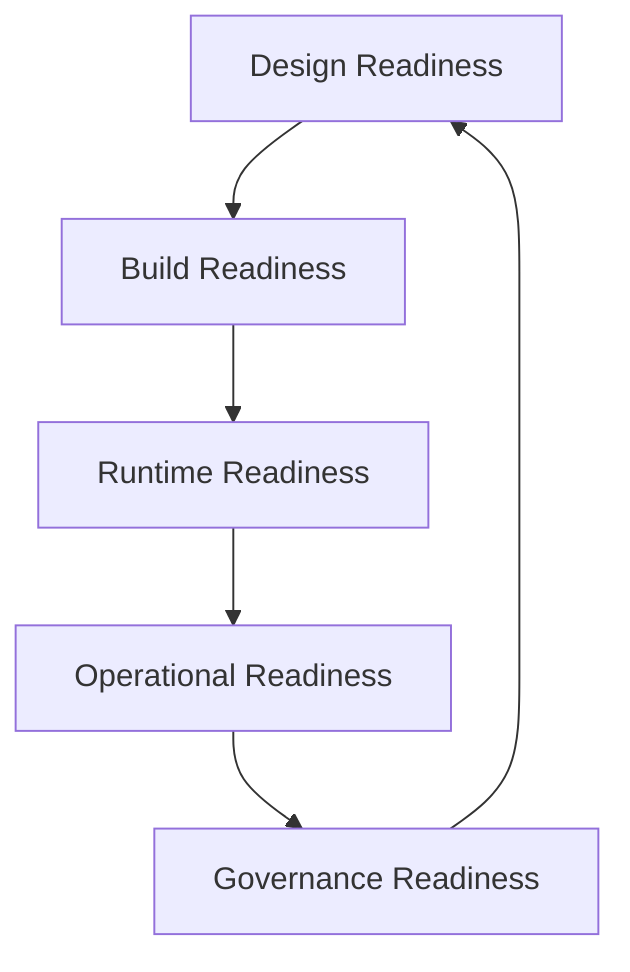
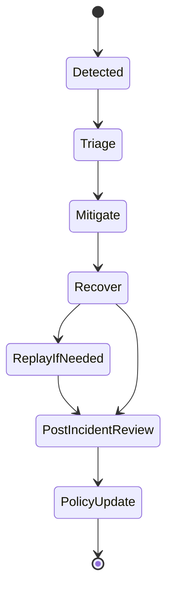
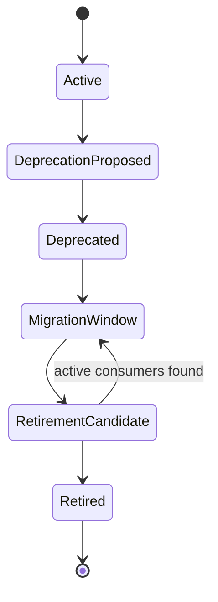

# Part 048 — Production Readiness Checklist and Operating Model

Production readiness is not a checklist you run one hour before launch.

It is the operating model that decides whether a contract can survive real change.

A contract is production-ready when it can be:

- understood
- generated
- validated
- evolved
- monitored
- rolled back
- audited
- deprecated
- defended

Most failures in data contracts are not caused by missing syntax.

They are caused by missing ownership, weak migration discipline, invisible consumers, unclear compatibility policy, unsafe runtime enforcement, poor telemetry, and undocumented exceptions.

This chapter gives you a readiness model you can apply to any contract platform.

Use it as an internal engineering handbook checklist.

Do not use it as a ritual.

Every item should connect to a failure mode.

---

## 1. Readiness mental model

Production readiness has five layers.



### 1.1 Design readiness

The contract expresses a correct boundary.

It has clear semantics, ownership, compatibility policy, versioning strategy, examples, and data classification.

### 1.2 Build readiness

The contract can be parsed, linted, diffed, generated, compiled, packaged, and published automatically.

### 1.3 Runtime readiness

The contract can be enforced safely in production with validation modes, caching, fallback behavior, telemetry, and quarantine strategy.

### 1.4 Operational readiness

The team can diagnose failures, roll back, replay, deprecate, migrate, and respond to incidents.

### 1.5 Governance readiness

The organization can prove who approved changes, what was checked, who was impacted, what exceptions were granted, and when deprecated versions can be retired.

---

## 2. Production readiness scorecard

Use a simple scorecard.

| Level | Meaning | Launch decision |
|---|---|---|
| 0 | Not ready | Do not launch |
| 1 | Prototype | Internal development only |
| 2 | Controlled beta | Limited consumers, shadow validation |
| 3 | Production minimum | Can launch with active monitoring |
| 4 | Production mature | Safe for broad reuse |
| 5 | Regulatory-grade | Strong evidence, auditability, and lifecycle control |

A high-criticality regulatory contract should not launch below level 4.

A public API or compliance-relevant event should target level 5.

---

## 3. Readiness gate overview

```mermaid
flowchart LR
  DesignGate[Design Gate]
  ContractGate[Contract Quality Gate]
  CompatibilityGate[Compatibility Gate]
  SecurityGate[Security + Privacy Gate]
  BuildGate[Generated Artifact Gate]
  RuntimeGate[Runtime Enforcement Gate]
  OpsGate[Operational Readiness Gate]
  Launch[Production Launch]

  DesignGate --> ContractGate
  ContractGate --> CompatibilityGate
  CompatibilityGate --> SecurityGate
  SecurityGate --> BuildGate
  BuildGate --> RuntimeGate
  RuntimeGate --> OpsGate
  OpsGate --> Launch
```



A mature organization does not allow teams to bypass gates silently.

It allows exceptions, but exceptions must be explicit, time-bound, owned, and visible.

---

## 4. Gate 1 — Design readiness

A contract must pass design readiness before implementation starts.

### 4.1 Required questions

Ask:

1. What boundary does this contract define?
2. Who owns the producer/provider side?
3. Who are the known consumers?
4. What is the lifecycle state?
5. Is this API, event, file, XML exchange, or RPC contract?
6. Why was this format selected?
7. What compatibility policy applies?
8. What versioning strategy applies?
9. What fields are sensitive?
10. What examples prove intended usage?
11. What semantic invariants cannot be expressed by the schema?
12. What happens when validation fails?
13. What is the migration path for future changes?
14. What observability is required?
15. What evidence must be retained?

If the team cannot answer these, the contract is not ready.

### 4.2 Design checklist

- [ ] Contract purpose is documented.
- [ ] Contract boundary is explicit.
- [ ] Owner team is declared.
- [ ] Known producers/providers are declared.
- [ ] Known consumers are declared or discovery plan exists.
- [ ] Format choice is justified.
- [ ] Versioning strategy is documented.
- [ ] Compatibility policy is documented.
- [ ] Error handling model is documented.
- [ ] Nullability and absence semantics are documented.
- [ ] Enum/reference data strategy is documented.
- [ ] Time/money/identity/precision semantics are documented.
- [ ] Sensitive fields are classified.
- [ ] Required examples exist.
- [ ] Semantic invariants are documented.
- [ ] Deprecation path exists.

### 4.3 Common design failures

| Failure | Consequence |
|---|---|
| No owner | No one approves changes or fixes incidents |
| No consumer inventory | Compatibility is guessed |
| No versioning policy | Every change becomes negotiation |
| Generated models used as domain model | Schema evolution leaks everywhere |
| No unknown-value policy | Consumers crash on enum expansion |
| No privacy classification | Logs and DLQs leak sensitive data |
| No error model | Clients build fragile behavior |

---

## 5. Gate 2 — Contract quality readiness

This gate checks whether the contract artifact is structurally sound.

### 5.1 OpenAPI checklist

- [ ] Valid OpenAPI version is declared.
- [ ] `info.title` and `info.version` exist.
- [ ] Servers are environment-neutral or clearly parameterized.
- [ ] Operation IDs are stable.
- [ ] Request bodies are explicit.
- [ ] Response schemas exist for success and error cases.
- [ ] Error model is standardized.
- [ ] Status codes are documented.
- [ ] Security schemes are declared.
- [ ] Pagination style is documented.
- [ ] Idempotency behavior is documented where relevant.
- [ ] Examples validate.
- [ ] Deprecated operations are marked.
- [ ] Extensions are namespaced.

### 5.2 JSON Schema checklist

- [ ] `$schema` is declared.
- [ ] `$id` is stable and resolvable.
- [ ] Reusable definitions live in `$defs`.
- [ ] `required` is intentional.
- [ ] `additionalProperties` or `unevaluatedProperties` policy is explicit.
- [ ] Nullability is explicit.
- [ ] `oneOf`/`anyOf`/`allOf` usage has examples.
- [ ] Format assertions are not assumed unless configured.
- [ ] Custom formats are documented.
- [ ] Schema references work offline in CI.
- [ ] Valid and invalid examples exist.

### 5.3 Avro checklist

- [ ] `namespace` is stable.
- [ ] Record name is stable.
- [ ] Field names are stable.
- [ ] Nullable unions place `null` consistently according to team policy.
- [ ] Defaults exist where evolution requires them.
- [ ] Logical types are used for decimal/time/UUID where appropriate.
- [ ] Enums have evolution policy.
- [ ] Aliases are used for renames.
- [ ] Schema passes registry compatibility mode.
- [ ] Generated SpecificRecord compiles.
- [ ] Example records validate.

### 5.4 Protobuf checklist

- [ ] Package name is stable.
- [ ] Java package options are declared.
- [ ] Field numbers are never reused.
- [ ] Deleted fields are reserved.
- [ ] Deleted enum numbers/names are reserved.
- [ ] Enum zero value is meaningful and safe.
- [ ] Presence behavior is understood.
- [ ] `oneof` changes are reviewed carefully.
- [ ] `Any` usage is justified and governed.
- [ ] ProtoJSON exposure is documented if used.
- [ ] Generated Java code compiles.
- [ ] Descriptor set can be produced.

### 5.5 XSD checklist

- [ ] Target namespace is stable.
- [ ] Namespace versioning strategy is documented.
- [ ] Global elements/types are intentionally designed.
- [ ] Import/include graph is controlled.
- [ ] Cardinality is intentional.
- [ ] Enumerations have evolution strategy.
- [ ] Extension points are documented.
- [ ] XML parser security settings are documented.
- [ ] JAXB/Jakarta XML Binding generated code compiles.
- [ ] Valid and invalid XML examples exist.

---

## 6. Gate 3 — Compatibility readiness

A production contract must have compatibility rules.

A team saying “we will be careful” is not a compatibility strategy.

### 6.1 Compatibility checklist

- [ ] Base version is identified.
- [ ] Proposed version is identified.
- [ ] Compatibility policy is declared.
- [ ] Format-specific compatibility check runs.
- [ ] Known consumers are included in impact analysis.
- [ ] Breaking changes are classified.
- [ ] Semantic risks are documented.
- [ ] Required migration path exists.
- [ ] Rollback behavior is known.
- [ ] Deprecation notice is prepared where needed.
- [ ] Compatibility evidence is stored.

### 6.2 Compatibility decision matrix

| Decision | Meaning | Required action |
|---|---|---|
| Compatible | Safe under declared policy | Normal review |
| Compatible with warning | Mechanically safe but operationally risky | Owner review and monitoring |
| Incompatible | Breaking under declared policy | Major version or migration playbook |
| Unknown | Tool cannot decide | Architecture review |
| Waived | Known risk accepted | Time-bound exception |

### 6.3 High-risk changes

Treat these as high-risk even if a tool says they are acceptable:

- making optional field required
- removing response field used by consumers
- renaming fields
- changing numeric precision
- changing timestamp semantics
- narrowing enum/reference data values
- changing error response shape
- changing pagination semantics
- changing idempotency behavior
- moving a field between nested objects
- changing Protobuf field number or wire type
- changing Avro union/default behavior
- changing XSD namespace

### 6.4 Expand–migrate–contract readiness

For risky changes, require:

- expand phase design
- producer rollout plan
- consumer rollout plan
- telemetry proving adoption
- contract phase criteria
- rollback strategy
- sunset/deprecation communication
- evidence retention

---

## 7. Gate 4 — Security and privacy readiness

Contracts expose data and behavior.

They are part of your attack surface.

### 7.1 Sensitive data checklist

- [ ] Every field has classification or inherited classification.
- [ ] PII fields are identified.
- [ ] Secret fields are prohibited unless explicitly justified.
- [ ] Masking policy exists for logs.
- [ ] DLQ/quarantine storage policy exists.
- [ ] Retention policy exists.
- [ ] Access policy exists.
- [ ] Examples do not contain real personal data.
- [ ] Test fixtures are synthetic.
- [ ] Data minimization is reviewed.
- [ ] Purpose of collection is documented for sensitive fields.

### 7.2 Parser and validator security checklist

- [ ] XML external entity resolution is disabled.
- [ ] XML DTD policy is explicit.
- [ ] JSON Schema remote reference resolution is controlled.
- [ ] Regex complexity is reviewed.
- [ ] Payload size limits exist.
- [ ] Nesting depth limits exist.
- [ ] Array length limits exist.
- [ ] Unknown fields policy exists.
- [ ] Protobuf `Any` type resolution is allowlisted.
- [ ] Code generation dependencies are pinned.
- [ ] Generated code is not manually edited.
- [ ] Validator failures do not leak sensitive payloads.

### 7.3 API security checklist

- [ ] Authentication is declared.
- [ ] Authorization is not assumed from schema validation.
- [ ] Object-level authorization is handled.
- [ ] Mass assignment risks are reviewed.
- [ ] Hidden/admin fields cannot be client-controlled.
- [ ] Request schema is not the persistence entity.
- [ ] Error messages do not leak internals.
- [ ] Rate and size limits exist.

---

## 8. Gate 5 — Build and artifact readiness

A contract that cannot be built is not production-ready.

### 8.1 Build checklist

- [ ] Contract parses successfully.
- [ ] Contract lints successfully or warnings are accepted.
- [ ] Examples validate.
- [ ] Compatibility check passes.
- [ ] Generated Java code compiles.
- [ ] Generated artifact has Maven coordinates.
- [ ] Artifact version matches contract versioning policy.
- [ ] Artifact digest is recorded.
- [ ] Registry dry-run passes.
- [ ] Documentation preview is generated.
- [ ] CI check results are stored.

### 8.2 Artifact checklist

- [ ] Artifact is immutable after release.
- [ ] Artifact has changelog.
- [ ] Artifact has source commit SHA.
- [ ] Artifact has generated timestamp.
- [ ] Artifact has generator version.
- [ ] Artifact has dependency metadata.
- [ ] Artifact is published to correct repository.
- [ ] Artifact can be consumed by a sample Java project.

### 8.3 Generator upgrade checklist

Generator upgrades can be breaking even when schema does not change.

Before upgrading:

- [ ] Generate code before and after upgrade.
- [ ] Compare public Java API.
- [ ] Compile sample consumers.
- [ ] Run serialization compatibility tests.
- [ ] Review dependency changes.
- [ ] Check runtime library compatibility.
- [ ] Publish migration notes.

---

## 9. Gate 6 — Runtime enforcement readiness

Runtime enforcement is where contracts meet production.

### 9.1 Validation mode checklist

- [ ] Validation mode is configurable by contract.
- [ ] Validation mode is configurable by environment.
- [ ] Supported modes include shadow/warn/reject/quarantine.
- [ ] Rollout can start in shadow mode.
- [ ] Strict mode requires explicit approval.
- [ ] Sampling is supported for high-volume paths.
- [ ] Fail-open/fail-closed behavior is documented.
- [ ] Emergency disable path exists.

### 9.2 Resolver/cache checklist

- [ ] Runtime resolver can fetch contract by ID/version.
- [ ] Resolved contracts are cached locally.
- [ ] Cache TTL is documented.
- [ ] Startup preload is supported for critical contracts.
- [ ] Registry outage behavior is documented.
- [ ] Service can continue with pinned artifact if registry is down.
- [ ] Cache metrics exist.

### 9.3 Performance checklist

- [ ] Validation latency is measured.
- [ ] Serialization/deserialization overhead is measured.
- [ ] CPU overhead is measured.
- [ ] Memory overhead is measured.
- [ ] Schema compilation/cache cost is measured.
- [ ] Large payload behavior is tested.
- [ ] Worst-case invalid payload behavior is tested.
- [ ] Sampling strategy exists for very high-volume events.

### 9.4 Quarantine checklist

- [ ] Invalid payload decision policy exists.
- [ ] Quarantine payload storage is protected.
- [ ] Sensitive fields are masked or encrypted.
- [ ] Replay tooling exists.
- [ ] Replay is idempotent.
- [ ] Quarantine ownership is defined.
- [ ] Quarantine age alert exists.
- [ ] Poison message handling exists.

---

## 10. Gate 7 — Observability readiness

If a contract fails in production and no one can see it, the platform has failed.

### 10.1 Metrics checklist

Track:

- validation attempts by contract
- validation failures by contract
- validation failure rate
- decision count by mode
- violation code count
- unknown field count
- unknown enum count
- schema resolution latency
- registry lookup failure count
- cache hit ratio
- DLQ/quarantine count
- deprecated version usage count
- consumer usage count
- drift finding count

### 10.2 Logs checklist

Logs should include:

- contract ID
- contract version
- artifact digest
- service name
- environment
- boundary type
- decision
- violation code
- violation path where safe
- trace ID
- correlation ID
- payload fingerprint

Logs should not include raw sensitive payload by default.

### 10.3 Traces checklist

Traces should show:

- validation span
- registry resolution span where applicable
- serialization/deserialization span
- quarantine span
- publish/consume span

### 10.4 Dashboard checklist

Dashboards should answer:

1. Which contracts are failing validation today?
2. Which services produce invalid payloads?
3. Which consumers still use deprecated versions?
4. Which fields cause most validation errors?
5. Did validation failures increase after deployment?
6. Is the registry healthy?
7. Are drift findings increasing?
8. Are quarantined records aging?

---

## 11. Gate 8 — Operational readiness

A team must be able to operate the contract after launch.

### 11.1 Runbook checklist

Create runbooks for:

- validation failure spike
- registry outage
- bad schema published
- generated artifact broken
- consumer cannot deserialize event
- API clients fail due to contract change
- DLQ/quarantine backlog growing
- sensitive data found in logs or quarantine
- deprecated version still used
- schema drift detected

### 11.2 Rollback checklist

- [ ] Can service rollback use previous contract version?
- [ ] Can registry version be pinned?
- [ ] Can validation mode be reduced from reject to warn?
- [ ] Can bad producer be disabled?
- [ ] Can consumer tolerate old and new versions?
- [ ] Can quarantined payloads be replayed after fix?
- [ ] Is rollback evidence captured?

### 11.3 On-call checklist

On-call should know:

- where contract dashboard lives
- where registry dashboard lives
- how to identify latest published version
- how to inspect compatibility result
- how to disable strict validation safely
- how to find producers/consumers
- how to replay quarantined payloads
- how to escalate privacy/security issue

---

## 12. Operating model

A platform without operating model becomes shelfware.

Define roles.

### 12.1 Roles

| Role | Responsibility |
|---|---|
| Contract owner | Owns contract semantics and lifecycle |
| Producer/provider owner | Owns emitted/provided data correctness |
| Consumer owner | Declares usage and validates compatibility impact |
| Platform team | Owns tooling, registry integration, SDK, CI gates |
| Architecture reviewer | Reviews boundary, compatibility, evolution design |
| Security reviewer | Reviews abuse cases, parser safety, generated-code risk |
| Privacy/data governance reviewer | Reviews sensitive data and retention |
| SRE/on-call | Operates runtime health and incidents |
| Release manager | Coordinates version promotion and launch |

### 12.2 RACI example

| Activity | Contract Owner | Platform | Consumer | Security | Privacy | SRE |
|---|---|---|---|---|---|---|
| Define new contract | A/R | C | C | C | C | I |
| Run CI checks | I | A/R | I | I | I | I |
| Approve compatibility | A/R | C | C | I | I | I |
| Approve sensitive field | C | I | I | C | A/R | I |
| Publish to registry | A | R | I | I | I | I |
| Runtime validation incident | C | C | C | C | C | A/R |
| Deprecate version | A/R | C | C | I | I | C |

Legend:

- R = responsible
- A = accountable
- C = consulted
- I = informed

### 12.3 Review cadence

Recommended cadence:

- weekly contract review office hours
- monthly deprecated version review
- monthly drift review
- quarterly compatibility policy review
- quarterly generator/tooling upgrade review
- semiannual security/parser hardening review

---

## 13. Change classification operating model

Not every change needs the same review weight.

### 13.1 Change classes

| Class | Description | Example | Review |
|---|---|---|---|
| Documentation-only | No protocol semantics changed | description update | owner |
| Compatible additive | Safe additive change | optional response field | owner + CI |
| Compatible with risk | Mechanically compatible but behavior risk | enum value added | owner + consumer/data review |
| Breaking | Existing consumers may fail | required request field added | architecture + migration |
| Sensitive data | Adds or changes sensitive field | national ID added | privacy/security |
| Security surface | Auth, authorization, parser, generated code risk | new upload endpoint | security |
| Emergency | Production incident patch | rollback schema | incident commander + after-review |

### 13.2 Decision rules

- Documentation-only changes can merge after owner approval and CI pass.
- Compatible additive changes require owner approval and automated compatibility pass.
- Compatible-with-risk changes require human review and monitoring plan.
- Breaking changes require migration playbook or major version.
- Sensitive data changes require privacy/data governance approval.
- Security surface changes require security review.
- Emergency changes require retrospective evidence.

---

## 14. Incident response model

Contracts fail in production.

Prepare for it.

### 14.1 Incident severity

| Severity | Example | Response |
|---|---|---|
| SEV1 | Critical API rejects most production requests due to validator/config error | immediate incident response, rollback/disable strict validation |
| SEV2 | Major event consumer cannot deserialize critical event | producer pause or schema rollback, replay plan |
| SEV3 | Validation failures increasing but business flow continues | investigate, fix producer, monitor |
| SEV4 | Deprecated version still used | track and follow up |

### 14.2 Incident flow



### 14.3 Incident runbook: validation spike

1. Identify contract ID.
2. Identify producing service or provider.
3. Identify validation mode.
4. Check recent deployments.
5. Check recent contract publication.
6. Compare violation paths.
7. Determine whether failure is contract, producer, consumer, or validator issue.
8. If validator rollout caused false rejection, reduce mode to warn/shadow.
9. If producer emitted bad payloads, stop producer or patch mapper.
10. If payloads were quarantined, plan replay.
11. Create incident evidence.
12. Add regression fixture.

### 14.4 Incident runbook: schema registry outage

1. Confirm registry health.
2. Check service cache hit ratio.
3. Confirm whether services can use pinned artifacts.
4. Disable auto-refresh if causing cascading failures.
5. Avoid publishing new schemas during outage.
6. Switch to fail-open or fail-closed according to criticality policy.
7. Record impacted services.
8. After recovery, verify cache consistency.

### 14.5 Incident runbook: bad schema published

1. Identify artifact digest and registry version.
2. Identify consumers that resolved it.
3. Stop further promotion.
4. Publish patch version if registry allows.
5. Pin services to previous known-good version where possible.
6. Reduce strict validation if needed.
7. Replay/quarantine invalid data.
8. Preserve evidence.
9. Add compatibility rule to prevent recurrence.

---

## 15. Deprecation operating model

Deprecation is a process, not a flag.

### 15.1 Deprecation states



### 15.2 Deprecation checklist

- [ ] Replacement contract exists.
- [ ] Deprecation reason is documented.
- [ ] Known consumers are identified.
- [ ] Consumer migration guide exists.
- [ ] Runtime telemetry tracks old version usage.
- [ ] Sunset date is communicated.
- [ ] Support policy is documented.
- [ ] Retirement criteria are explicit.
- [ ] Exception path exists.
- [ ] Final retirement evidence is stored.

### 15.3 Retirement criteria

A contract version can be retired when:

- no production consumers observed for agreed period
- no batch/replay dependencies remain
- data lake/backfill dependencies are reviewed
- legal/regulatory retention requirements are satisfied
- replacement version is stable
- owner approves retirement
- platform evidence is stored

---

## 16. Exception and waiver model

Real organizations need exceptions.

Bad exceptions are invisible and permanent.

Good exceptions are explicit and expiring.

### 16.1 Waiver fields

```yaml
waiverId: CW-2026-0042
contractId: regulatory.case.event.CaseLifecycleEvent
version: 1.8.0
ruleId: no-new-enum-without-consumer-policy
requestedBy: case-platform
approvedBy: architecture-review
reason: Emergency regulatory code list update required before consumer policy migration.
risk: Reporting consumer may classify new enum as UNKNOWN for up to 7 days.
mitigation: Runtime unknown enum dashboard and daily review.
expiresAt: 2026-07-10T00:00:00Z
followUpIssue: ENG-99231
```

### 16.2 Waiver checklist

- [ ] Rule being waived is identified.
- [ ] Reason is explicit.
- [ ] Risk is explicit.
- [ ] Mitigation exists.
- [ ] Owner exists.
- [ ] Expiration date exists.
- [ ] Follow-up issue exists.
- [ ] Waiver appears in dashboard.
- [ ] Waiver is included in audit evidence.

---

## 17. SLOs and SLIs for contract platform

A contract platform should have service-level indicators.

### 17.1 Platform SLIs

| SLI | Description |
|---|---|
| Registry availability | Percentage of successful registry read/write operations |
| Contract resolution latency | Time to resolve contract by ID/version |
| Validation latency | Time spent validating payload |
| CI check duration | Time from PR open/update to contract check result |
| False positive rate | Percentage of blocked changes later waived as safe |
| Runtime validation failure rate | Invalid payload rate by contract |
| Drift detection delay | Time from drift occurrence to detection |
| Quarantine replay success | Percentage of quarantined records replayed successfully |
| Deprecated usage | Active usage of deprecated contract versions |

### 17.2 Example SLOs

For a mature platform:

- 99.9% successful contract registry reads during business-critical windows.
- p95 local validation latency below service-specific budget.
- p95 contract CI checks complete within a few minutes for ordinary changes.
- 100% published production contracts have owner, digest, version, and evidence.
- 0 high-criticality contracts with unclassified sensitive fields.
- 0 retired contract versions observed in production traffic.

Tune these to your organization.

Do not copy numbers blindly.

---

## 18. Documentation readiness

Documentation must serve both humans and machines.

### 18.1 Required documentation per contract

- purpose
- owner
- lifecycle state
- version history
- compatibility policy
- known producers/providers
- known consumers
- examples
- error model
- sensitive field classification
- migration guide
- deprecation policy
- generated artifact coordinates
- registry binding
- runtime dashboard link
- ADR links

### 18.2 Documentation anti-patterns

- generated docs without examples
- examples that do not validate
- no changelog
- no consumer impact notes
- no error model
- stale owner metadata
- docs that hide lifecycle state
- deprecation flag without migration guide

---

## 19. Performance readiness

Validation can be expensive if done carelessly.

### 19.1 Performance checklist

- [ ] Schema compilation is cached.
- [ ] Remote references are resolved before runtime or cached.
- [ ] Validator objects are reused safely.
- [ ] Payload size limits exist.
- [ ] Validation budget is defined.
- [ ] High-volume paths use sampling or optimized validation.
- [ ] Large arrays are tested.
- [ ] Deep nesting is tested.
- [ ] Regex-heavy schemas are tested.
- [ ] XML parser settings are hardened and measured.
- [ ] Protobuf parsing overhead is benchmarked.
- [ ] Avro serializer/deserializer path is benchmarked.

### 19.2 Benchmark dimensions

Measure:

- valid payload latency
- invalid payload latency
- first validation after cold start
- validation after cache warmup
- large payload behavior
- high-cardinality error behavior
- CPU usage
- allocation rate
- memory pressure
- telemetry overhead

---

## 20. Registry operations readiness

The registry is not the whole platform, but it is a critical component.

### 20.1 Registry checklist

- [ ] Registry backend is selected.
- [ ] Supported formats are documented.
- [ ] Subject/artifact naming policy exists.
- [ ] Compatibility modes are configured.
- [ ] Production auto-registration policy is disabled or tightly controlled.
- [ ] Authentication exists.
- [ ] Authorization exists.
- [ ] Audit logging exists.
- [ ] Backup/restore is tested.
- [ ] Environment promotion is defined.
- [ ] Registry outage runbook exists.
- [ ] Registry metrics are collected.

### 20.2 Subject naming checklist

- [ ] Naming strategy includes domain and contract identity.
- [ ] Topic-derived names are intentional, not accidental.
- [ ] Key/value subject strategy is documented for Kafka.
- [ ] Protobuf package/service naming is stable.
- [ ] XSD namespace and registry artifact identity are mapped.
- [ ] OpenAPI document identity is stable.

---

## 21. Release readiness

Before a contract release, answer:

1. What is being released?
2. What services will use it?
3. Is the change compatible?
4. Is generated code released?
5. Is registry publishing complete?
6. Are deployment dependencies understood?
7. Are consumers ready?
8. Is runtime validation mode configured?
9. Is monitoring in place?
10. Is rollback possible?

### 21.1 Release checklist

- [ ] Release version is final.
- [ ] Changelog is complete.
- [ ] CI checks pass.
- [ ] Required approvals exist.
- [ ] Generated artifacts are published.
- [ ] Registry version is published.
- [ ] Documentation portal updated.
- [ ] Runtime dashboard updated.
- [ ] Consumer migration notes delivered.
- [ ] Rollback path documented.
- [ ] Launch owner assigned.

---

## 22. Consumer readiness

Do not only check providers.

Consumers are where compatibility assumptions become real.

### 22.1 Consumer checklist

- [ ] Consumer declares contract usage.
- [ ] Consumer test uses published contract artifact.
- [ ] Consumer handles unknown fields where relevant.
- [ ] Consumer handles unknown enum/reference data values.
- [ ] Consumer has deserialization failure policy.
- [ ] Consumer has replay/idempotency policy for events.
- [ ] Consumer can tolerate additive response fields.
- [ ] Consumer does not parse error messages as strings.
- [ ] Consumer does not depend on undocumented fields.
- [ ] Consumer is monitored after rollout.

### 22.2 Consumer anti-patterns

- strict JSON parser failing on additive response fields
- generated enum with no unknown fallback
- string matching on error message text
- assuming event ordering not guaranteed by contract
- treating optional field as always present
- ignoring schema version in events
- bypassing generated client and hand-parsing payloads

---

## 23. Provider/producer readiness

### 23.1 Provider checklist

- [ ] Provider validates incoming requests where applicable.
- [ ] Provider validates outgoing responses at least in shadow/sample mode.
- [ ] Provider maps generated model to domain model explicitly.
- [ ] Provider never exposes persistence entity directly.
- [ ] Provider emits declared error model.
- [ ] Provider emits declared schema version.
- [ ] Provider has contract tests.
- [ ] Provider has runtime validation telemetry.
- [ ] Provider can roll back to previous contract version.

### 23.2 Producer checklist for events

- [ ] Producer uses approved schema.
- [ ] Producer declares schema ID/version.
- [ ] Producer validates event before publish.
- [ ] Producer uses stable event envelope.
- [ ] Producer handles publish failure safely.
- [ ] Producer supports replay/idempotency where needed.
- [ ] Producer emits correlation/causation IDs.
- [ ] Producer does not leak sensitive fields into metadata.

---

## 24. Regulatory-grade readiness

For regulatory or enforcement systems, add stricter requirements.

### 24.1 Evidence checklist

- [ ] Contract proposal evidence exists.
- [ ] Compatibility result evidence exists.
- [ ] Approval evidence exists.
- [ ] Artifact digest exists.
- [ ] Registry binding evidence exists.
- [ ] Generated artifact evidence exists.
- [ ] Runtime validation decision evidence exists.
- [ ] Exception/waiver evidence exists.
- [ ] Deprecation evidence exists.
- [ ] Retention policy is defined.

### 24.2 Defensibility questions

Can you prove:

1. Which contract version was active on a given date?
2. Which schema validated a specific payload?
3. Which service emitted an invalid event?
4. Which reviewer approved a sensitive field?
5. Which consumers were notified before deprecation?
6. Which compatibility checks ran before release?
7. Why a payload was rejected or quarantined?
8. Whether a deprecated version was still used?

If not, the platform is not regulatory-grade.

---

## 25. Maturity model

### Level 0 — Ad hoc

- schemas live in random repos
- no ownership
- no compatibility checks
- no registry discipline
- no runtime telemetry

### Level 1 — Standardized files

- shared repository layout
- basic linting
- owner metadata
- manual review

### Level 2 — Automated checks

- syntax validation
- example validation
- compatibility checks
- generated-code compile
- docs preview

### Level 3 — Runtime integration

- registry integration
- Java SDK
- runtime validation modes
- validation telemetry
- DLQ/quarantine process

### Level 4 — Managed lifecycle

- consumer inventory
- deprecation process
- drift detection
- release gates
- incident runbooks
- waiver process

### Level 5 — Regulatory-grade platform

- immutable evidence
- artifact digests
- reproducible validation decisions
- sensitive data governance
- audit-ready lifecycle
- mature operating rhythm

---

## 26. Production readiness review template

Use this template for launch reviews.

```md
# Contract Production Readiness Review

## Contract identity
- Contract ID:
- Format:
- Version:
- Owner:
- Criticality:
- Lifecycle state:

## Boundary
- Producer/provider:
- Consumers:
- Transport:
- Runtime systems:

## Compatibility
- Base version:
- Proposed version:
- Compatibility result:
- High-risk changes:
- Migration required:

## Security and privacy
- Sensitive fields:
- Masking policy:
- Retention policy:
- Abuse cases reviewed:

## Build and artifact
- CI status:
- Generated artifact:
- Registry binding:
- Documentation:

## Runtime
- Validation mode:
- Resolver/cache policy:
- Telemetry:
- Dashboard:
- Quarantine/DLQ:

## Operations
- Runbook:
- Rollback:
- On-call:
- Deprecation plan:

## Decision
- Launch approved:
- Required follow-ups:
- Expiration for exceptions:
```

---

## 27. Capstone readiness exercise

Take the regulatory case-management platform from Part 046.

Review these contracts:

1. `CaseApi` OpenAPI contract.
2. `CaseIntakePayload` JSON Schema contract.
3. `CaseLifecycleEvent` Avro contract.
4. `DecisionService` Protobuf contract.
5. `PartnerCaseSubmission` XSD contract.

For each one, produce:

- production readiness score
- missing evidence
- compatibility risk
- runtime validation mode
- observability plan
- rollback plan
- owner and review path

Then create a combined launch decision.

A real platform launch is only as strong as its weakest critical contract.

---

## 28. Final production checklist

A contract is production-ready when all of this is true:

- [ ] It has a stable identity.
- [ ] It has an owner.
- [ ] It has a lifecycle state.
- [ ] It has a versioning strategy.
- [ ] It has a compatibility policy.
- [ ] It has valid examples.
- [ ] It has sensitive data classification.
- [ ] It has generated artifacts where applicable.
- [ ] Generated artifacts compile.
- [ ] It is published immutably.
- [ ] It has registry/catalog binding.
- [ ] It has documentation.
- [ ] It has consumer inventory.
- [ ] It has runtime validation strategy.
- [ ] It has telemetry.
- [ ] It has failure handling.
- [ ] It has rollback plan.
- [ ] It has deprecation plan.
- [ ] It has evidence.
- [ ] It has an operating owner after launch.

That is the difference between a schema and an engineered contract.

---

## 29. Closing mental model

Production readiness is not about preventing all change.

It is about making change safe.

Safe change requires identity.

Identity requires versioning.

Versioning requires compatibility.

Compatibility requires consumer knowledge.

Consumer knowledge requires runtime telemetry.

Runtime telemetry requires instrumentation.

Instrumentation requires platform support.

Platform support requires ownership.

Ownership requires operating model.

That chain is the discipline of data contract engineering.

---

## 30. References

- [OpenAPI Specification 3.2.0](https://spec.openapis.org/oas/v3.2.0.html)
- [JSON Schema Draft 2020-12](https://json-schema.org/draft/2020-12)
- [Apache Avro 1.12.0 Specification](https://avro.apache.org/docs/1.12.0/specification/)
- [Protocol Buffers Overview](https://protobuf.dev/overview/)
- [Protocol Buffers Editions Overview](https://protobuf.dev/editions/overview/)
- [NIST Privacy Framework](https://www.nist.gov/privacy-framework)
- [NIST SP 800-218 Secure Software Development Framework](https://csrc.nist.gov/pubs/sp/800/218/final)
- [OWASP API Security Top 10 2023](https://owasp.org/API-Security/editions/2023/en/0x11-t10/)
- [OpenTelemetry Semantic Conventions](https://opentelemetry.io/docs/concepts/semantic-conventions/)
