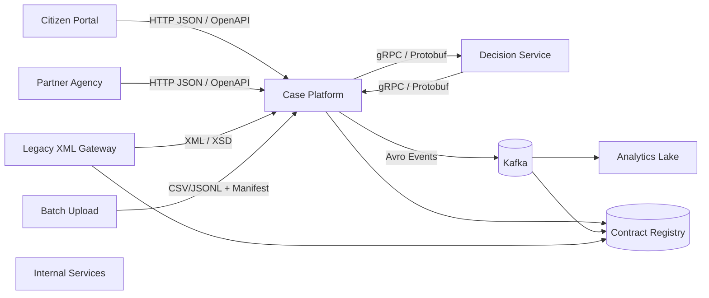
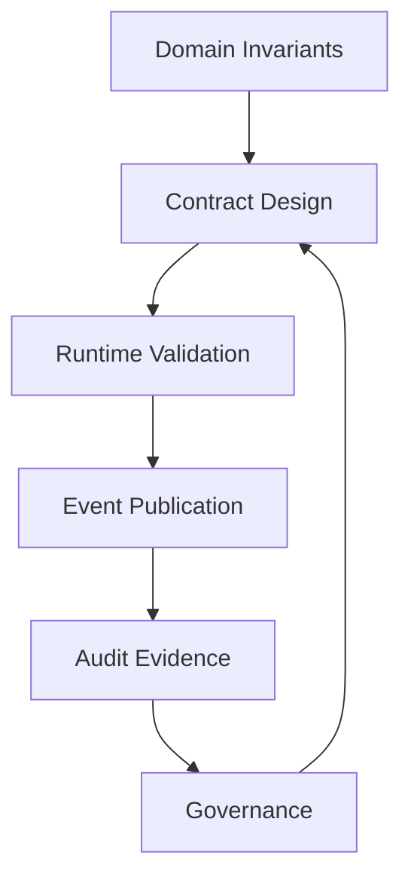
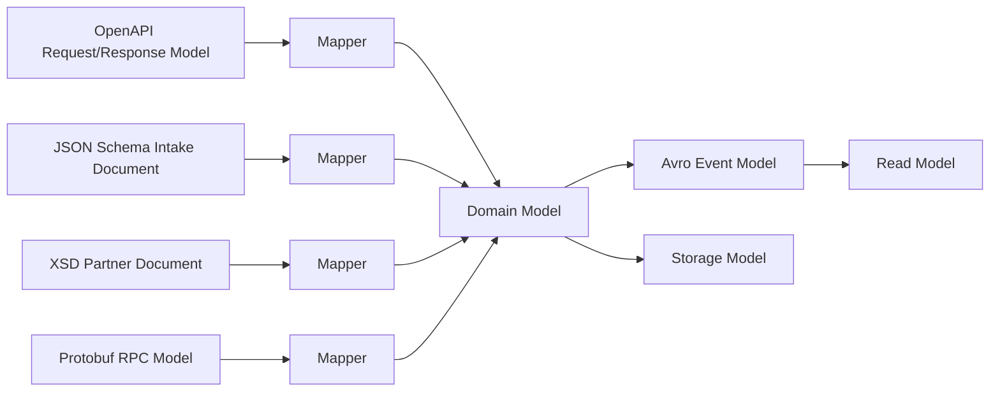
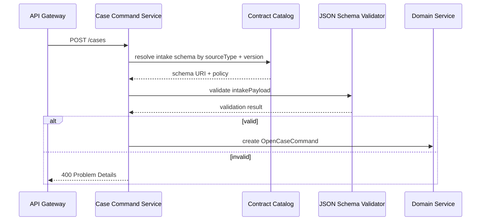
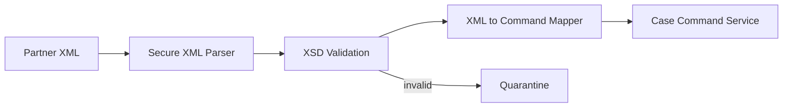
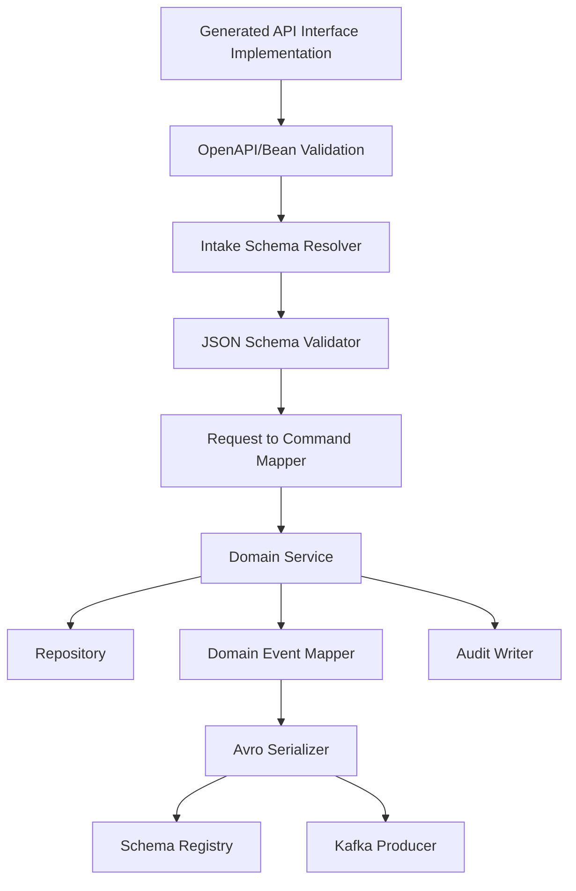
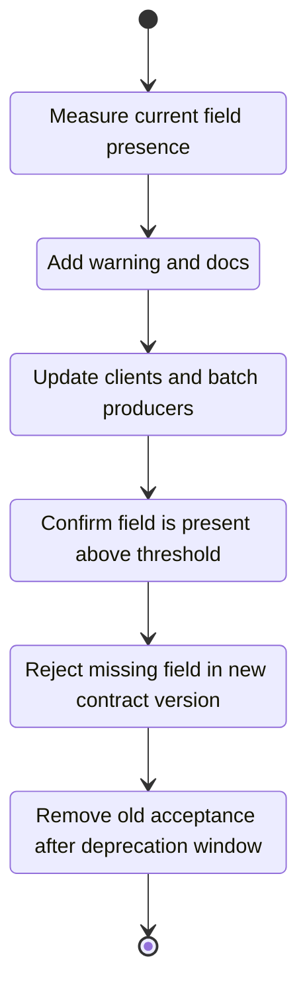

# Part 049 — Capstone: Designing a Multi-Format Enterprise Contract System

This chapter is the capstone.

We will design a multi-format enterprise contract system from first principles.

Not a demo.

Not a toy schema repository.

Not a collection of generated DTOs.

We will design a system that can support:

- public HTTP APIs
- partner XML exchange
- internal Kafka event streams
- gRPC service-to-service calls
- dynamic intake forms
- batch files
- schema registry governance
- CI compatibility checks
- Java runtime validation
- quarantine workflows
- observability
- audit evidence
- zero-downtime migration

The domain is a regulatory case-management platform.

That choice is intentional. Regulatory systems force us to deal with facts that many tutorials avoid:

- data has legal meaning
- decisions need traceability
- workflow state matters
- reference data changes
- payloads may contain sensitive information
- partner systems are slow to migrate
- schema changes can invalidate evidence
- batch, event, API, and document flows coexist
- correctness is not only technical correctness

This is where contract engineering becomes real engineering.

---

## 1. Problem statement

We are building a platform called `RegCase`.

It manages the lifecycle of enforcement cases.

A case may start from:

- citizen complaint
- regulator inspection
- partner agency referral
- automated surveillance signal
- legacy XML import
- batch upload

A case goes through stages:

- intake
- triage
- investigation
- evidence collection
- violation assessment
- enforcement decision
- appeal
- closure

The platform exposes and consumes several contract surfaces.



The platform has one core requirement:

> Every payload crossing a system boundary must have an explicit contract, an owner, a compatibility policy, a validation strategy, and runtime evidence.

That is the spine of the design.

---

## 2. The contract surfaces

We need several formats because the world is not uniform.

Using only one format would simplify tooling but damage architecture.

| Surface | Format | Reason |
|---|---:|---|
| Public HTTP APIs | OpenAPI | Human-readable API contract, docs, generated clients, gateway validation |
| Dynamic intake payloads | JSON Schema | Fine-grained validation for JSON documents and form-like data |
| Legacy agency exchange | XSD | Existing XML ecosystem, namespace versioning, partner compatibility |
| Kafka events | Avro | Compact binary events, schema registry, reader/writer schema evolution |
| Internal decision calls | Protobuf/gRPC | Strong service interface, fast binary RPC, cross-language support |
| Batch import | Manifest + JSON Schema/XSD/CSV profile | File-level contract, row-level validation, replay evidence |
| Audit evidence | JSON Schema / Avro | Queryable evidence envelope plus immutable event history |

The mistake is to fight this diversity.

The correct move is to control it.

---

## 3. System invariants

Before writing any schema, define invariants.

A schema without invariants is only shape validation.

For `RegCase`, the invariants are:

1. A case has one stable public identifier.
2. A case has exactly one current lifecycle state.
3. Every state transition has an actor, timestamp, reason, and source command.
4. Every enforcement decision is linked to evidence snapshots.
5. Every external payload has a contract version.
6. Every event has a schema identity and event identity.
7. Every sensitive field has a classification.
8. Every breaking change has migration evidence.
9. Every rejected payload is either safely discarded or recoverably quarantined.
10. Every generated model is isolated from the domain model.

These invariants drive the contracts.



---

## 4. Model separation

The system uses several models.

Do not merge them.



The domain model is not generated.

The generated models are boundary artifacts.

A good package layout makes this obvious.

```text
regcase-platform/
  contract/
    openapi/
    json-schema/
    xsd/
    avro/
    protobuf/
    catalog/
    policy/
  services/
    case-command-service/
      src/main/java/com/acme/regcase/casecommand/
        api/generated/          # generated OpenAPI types
        api/mapper/             # generated -> domain
        domain/model/           # handwritten domain model
        domain/service/
        persistence/entity/     # DB model
        event/generated/        # generated Avro types
        event/publisher/
        validation/
    decision-service/
      src/main/proto/
      src/main/java/...
  platform/
    contract-validator-service/
    contract-catalog-service/
    compatibility-checker/
    schema-registry-adapter/
```

If your generated classes leak into domain code, your contract boundary has failed.

---

## 5. Contract catalog

The catalog is the index of truth.

It does not replace the schemas.

It describes ownership, lifecycle, classification, compatibility, and runtime policy.

```yaml
contracts:
  - id: regcase.case-command-api
    format: openapi
    path: openapi/case-command-api/openapi.yaml
    ownerTeam: case-platform
    domain: enforcement-case
    lifecycle: stable
    compatibilityPolicy: backward-compatible
    runtimeValidation:
      ingress: strict
      egress: shadow
    dataClassification:
      default: internal
      containsPii: true
    consumers:
      - citizen-portal
      - partner-api-gateway

  - id: regcase.case-event.case-opened
    format: avro
    path: avro/case/CaseOpened.avsc
    ownerTeam: case-platform
    subject: regcase.case-event.case-opened-value
    compatibilityPolicy: backward-transitive
    runtimeValidation:
      producer: strict
      consumer: strict
    consumers:
      - analytics-lake
      - notification-service
      - audit-service

  - id: regcase.partner-referral.v1
    format: xsd
    path: xsd/partner-referral/v1/partner-referral.xsd
    ownerTeam: integration-platform
    namespace: urn:acme:regcase:partner-referral:v1
    compatibilityPolicy: namespace-major-version
    runtimeValidation:
      ingress: strict
      quarantineOnFailure: true
```

A contract platform should answer these questions quickly:

- Who owns this contract?
- What systems produce it?
- What systems consume it?
- What compatibility policy applies?
- What runtime validation mode applies?
- Does it contain PII?
- What is the latest production-approved version?
- Which version was used for this payload?
- Which changes are pending approval?

Without a catalog, your contract platform becomes a file dump.

---

## 6. Public HTTP contract with OpenAPI

The public API uses OpenAPI.

The command to open a case is an HTTP operation.

It is not the domain aggregate itself.

```yaml
openapi: 3.2.0
info:
  title: RegCase Case Command API
  version: 1.0.0
paths:
  /cases:
    post:
      operationId: openCase
      summary: Open a regulatory case
      parameters:
        - name: Idempotency-Key
          in: header
          required: true
          schema:
            type: string
            minLength: 16
            maxLength: 128
      requestBody:
        required: true
        content:
          application/json:
            schema:
              $ref: '#/components/schemas/OpenCaseRequest'
      responses:
        '202':
          description: Case accepted for processing
          content:
            application/json:
              schema:
                $ref: '#/components/schemas/OpenCaseAcceptedResponse'
        '400':
          description: Invalid request
          content:
            application/problem+json:
              schema:
                $ref: '#/components/schemas/Problem'
components:
  schemas:
    OpenCaseRequest:
      type: object
      required:
        - sourceType
        - allegation
        - receivedAt
      properties:
        sourceType:
          type: string
          enum:
            - CITIZEN_COMPLAINT
            - INSPECTION_FINDING
            - PARTNER_REFERRAL
            - SURVEILLANCE_SIGNAL
        allegation:
          $ref: '#/components/schemas/AllegationSummary'
        receivedAt:
          type: string
          format: date-time
        intakePayload:
          type: object
          description: Dynamic source-specific intake payload validated by JSON Schema.
          additionalProperties: true
    AllegationSummary:
      type: object
      required:
        - description
      properties:
        description:
          type: string
          minLength: 20
          maxLength: 4000
        suspectedViolationCode:
          type: string
          maxLength: 64
    OpenCaseAcceptedResponse:
      type: object
      required:
        - caseId
        - commandId
        - acceptedAt
      properties:
        caseId:
          type: string
        commandId:
          type: string
        acceptedAt:
          type: string
          format: date-time
    Problem:
      type: object
      required:
        - type
        - title
        - status
      properties:
        type:
          type: string
        title:
          type: string
        status:
          type: integer
        detail:
          type: string
        errors:
          type: array
          items:
            type: object
            properties:
              path:
                type: string
              code:
                type: string
              message:
                type: string
```

Design notes:

- `Idempotency-Key` is a contract, not just a header.
- `202 Accepted` communicates asynchronous processing.
- `intakePayload` is intentionally dynamic, but not ungoverned.
- `application/problem+json` is the error envelope.
- The API does not expose DB IDs.
- The API does not expose internal workflow transitions.

OpenAPI describes the HTTP surface.

It should not carry every domain rule.

Some validation belongs to JSON Schema.

Some belongs to domain logic.

---

## 7. Dynamic intake contract with JSON Schema

Different sources submit different intake data.

A citizen complaint and a surveillance signal do not have the same shape.

We use JSON Schema for source-specific intake documents.

```json
{
  "$schema": "https://json-schema.org/draft/2020-12/schema",
  "$id": "https://contracts.acme.example/regcase/intake/citizen-complaint/1.0.0/schema.json",
  "title": "CitizenComplaintIntake",
  "type": "object",
  "required": ["complainant", "incident", "consent"],
  "additionalProperties": false,
  "properties": {
    "complainant": {
      "type": "object",
      "required": ["contactPreference"],
      "additionalProperties": false,
      "properties": {
        "fullName": {
          "type": "string",
          "minLength": 1,
          "x-data-classification": "pii.direct"
        },
        "email": {
          "type": "string",
          "format": "email",
          "x-data-classification": "pii.contact"
        },
        "contactPreference": {
          "type": "string",
          "enum": ["EMAIL", "PHONE", "NONE"]
        }
      }
    },
    "incident": {
      "type": "object",
      "required": ["description", "occurredOn"],
      "additionalProperties": false,
      "properties": {
        "description": {
          "type": "string",
          "minLength": 20,
          "maxLength": 4000
        },
        "occurredOn": {
          "type": "string",
          "format": "date"
        },
        "location": {
          "type": "string",
          "maxLength": 500
        }
      }
    },
    "consent": {
      "type": "object",
      "required": ["canContact", "canShareWithPartnerAgency"],
      "additionalProperties": false,
      "properties": {
        "canContact": { "type": "boolean" },
        "canShareWithPartnerAgency": { "type": "boolean" }
      }
    }
  }
}
```

Design notes:

- The schema is closed with `additionalProperties: false`.
- PII classification is attached at field level.
- Source-specific data is validated independently from the OpenAPI wrapper.
- The `$id` is stable and globally meaningful.
- Schema version is an artifact version, not an endpoint version.

Runtime flow:



Do not validate dynamic intake with ad hoc `Map<String, Object>` checks scattered across services.

Centralize resolution.

Localize business validation.

---

## 8. Partner XML contract with XSD

Some partner agencies still send XML.

Do not force them through JSON if the integration contract is already XML-native.

Use XSD and wrap the integration in a gateway.

```xml
<xs:schema
    xmlns:xs="http://www.w3.org/2001/XMLSchema"
    targetNamespace="urn:acme:regcase:partner-referral:v1"
    xmlns="urn:acme:regcase:partner-referral:v1"
    elementFormDefault="qualified">

  <xs:element name="PartnerReferral" type="PartnerReferralType"/>

  <xs:complexType name="PartnerReferralType">
    <xs:sequence>
      <xs:element name="ReferralId" type="ExternalReferenceType"/>
      <xs:element name="AgencyCode" type="AgencyCodeType"/>
      <xs:element name="ReceivedAt" type="xs:dateTime"/>
      <xs:element name="Allegation" type="AllegationType"/>
      <xs:element name="EvidenceSummary" type="EvidenceSummaryType" minOccurs="0"/>
      <xs:any namespace="##other" processContents="lax" minOccurs="0" maxOccurs="unbounded"/>
    </xs:sequence>
    <xs:attribute name="schemaVersion" type="xs:string" use="required" fixed="1.0"/>
  </xs:complexType>

  <xs:simpleType name="ExternalReferenceType">
    <xs:restriction base="xs:string">
      <xs:minLength value="1"/>
      <xs:maxLength value="128"/>
    </xs:restriction>
  </xs:simpleType>

  <xs:simpleType name="AgencyCodeType">
    <xs:restriction base="xs:string">
      <xs:pattern value="[A-Z0-9_]{2,32}"/>
    </xs:restriction>
  </xs:simpleType>

  <xs:complexType name="AllegationType">
    <xs:sequence>
      <xs:element name="Description" type="xs:string"/>
      <xs:element name="SuspectedViolationCode" type="xs:string" minOccurs="0"/>
    </xs:sequence>
  </xs:complexType>

  <xs:complexType name="EvidenceSummaryType">
    <xs:sequence>
      <xs:element name="DocumentCount" type="xs:nonNegativeInteger"/>
      <xs:element name="Notes" type="xs:string" minOccurs="0"/>
    </xs:sequence>
  </xs:complexType>
</xs:schema>
```

Design notes:

- The XML namespace carries the major version.
- `schemaVersion` gives runtime evidence.
- `xs:any` is allowed only at a controlled extension point.
- The XML gateway maps XML into an internal command.
- XSD validation happens before domain processing.

The XML gateway is an anti-corruption layer.



Never let partner XML types become your domain model.

---

## 9. Event contract with Avro

When a case is opened, the service emits an event.

Events are facts.

They are not commands.

They are not database rows.

They are not API responses.

```json
{
  "type": "record",
  "name": "CaseOpened",
  "namespace": "com.acme.regcase.event.case.v1",
  "doc": "Emitted after a regulatory case has been accepted and opened.",
  "fields": [
    { "name": "eventId", "type": { "type": "string", "logicalType": "uuid" } },
    { "name": "eventType", "type": "string", "default": "CASE_OPENED" },
    { "name": "occurredAt", "type": { "type": "long", "logicalType": "timestamp-millis" } },
    { "name": "caseId", "type": "string" },
    { "name": "commandId", "type": { "type": "string", "logicalType": "uuid" } },
    { "name": "sourceType", "type": { "type": "enum", "name": "CaseSourceType", "symbols": ["CITIZEN_COMPLAINT", "INSPECTION_FINDING", "PARTNER_REFERRAL", "SURVEILLANCE_SIGNAL", "UNKNOWN"] } },
    { "name": "schemaVersion", "type": "string", "default": "1.0.0" },
    { "name": "actor", "type": ["null", "string"], "default": null },
    { "name": "sensitiveDataClasses", "type": { "type": "array", "items": "string" }, "default": [] }
  ]
}
```

Design notes:

- The event uses immutable identifiers.
- It includes `commandId` for causality.
- It includes `occurredAt`, not only publish time.
- The enum has an `UNKNOWN` value.
- New fields must have defaults.
- The event is optimized for evolution and replay.

Subject naming:

```text
regcase.case-event.case-opened-value
```

Compatibility policy:

```text
BACKWARD_TRANSITIVE
```

Why backward transitive?

Because new consumers may read historical events using the latest reader schema.

If your event stream is replayable, compatibility must consider history, not only the last deployed version.

---

## 10. Internal RPC contract with Protobuf

The case service calls a decision service.

This is synchronous and internal.

Use gRPC/Protobuf.

```proto
edition = "2023";

package acme.regcase.decision.v1;

option java_package = "com.acme.regcase.decision.v1";
option java_multiple_files = true;

service DecisionAssessmentService {
  rpc AssessViolation(AssessViolationRequest) returns (AssessViolationResponse);
}

message AssessViolationRequest {
  string case_id = 1;
  string allegation_summary = 2;
  repeated EvidenceSignal evidence_signals = 3;
  string requested_by = 4;
  int64 requested_at_epoch_millis = 5;
}

message EvidenceSignal {
  string signal_type = 1;
  double confidence = 2;
  map<string, string> attributes = 3;
}

message AssessViolationResponse {
  string assessment_id = 1;
  AssessmentOutcome outcome = 2;
  repeated string matched_violation_codes = 3;
  string rationale = 4;
}

enum AssessmentOutcome {
  ASSESSMENT_OUTCOME_UNSPECIFIED = 0;
  NO_VIOLATION_INDICATED = 1;
  POSSIBLE_VIOLATION = 2;
  LIKELY_VIOLATION = 3;
}
```

Design notes:

- Field numbers are permanent.
- Enum zero value is unspecified.
- `java_package` is explicit.
- Generated classes remain at the RPC boundary.
- The response contains rationale, not only a boolean.
- Internal RPC still needs compatibility policy.

Do not assume internal means ungoverned.

Internal contracts break systems too.

---

## 11. Batch contract

Batch payloads need two levels of contract:

1. file manifest contract
2. row/document payload contract

Example manifest:

```json
{
  "contractId": "regcase.batch.partner-referral-upload",
  "contractVersion": "1.0.0",
  "batchId": "batch-2026-07-03-001",
  "producer": "agency-abc",
  "producedAt": "2026-07-03T10:15:30Z",
  "payloadFormat": "jsonl",
  "payloadSchemaId": "https://contracts.acme.example/regcase/batch/partner-referral-row/1.0.0/schema.json",
  "recordCount": 25000,
  "checksum": "sha256:..."
}
```

The manifest protects the file-level invariants:

- who produced it
- when it was produced
- which schema applies
- how many records are expected
- what checksum proves integrity
- whether replay is safe

The row schema protects payload shape.

Batch error handling must be explicit:

| Failure | Action |
|---|---|
| Invalid manifest | Reject batch |
| Checksum mismatch | Reject batch |
| Unknown schema | Reject batch |
| 1 invalid row out of 25,000 | Quarantine row or reject based on policy |
| Too many invalid rows | Reject batch |
| Duplicate batch ID | Idempotent no-op or conflict |

Batch systems fail when validation results are not reproducible.

Store validation evidence.

---

## 12. Java service boundary architecture

The Java command service should look like this.



A simple Java boundary design:

```java
public final class OpenCaseApplicationService {
    private final IntakeSchemaResolver schemaResolver;
    private final JsonContractValidator jsonValidator;
    private final OpenCaseMapper mapper;
    private final CaseDomainService domainService;
    private final CaseEventPublisher eventPublisher;
    private final AuditEvidenceWriter auditEvidenceWriter;

    public OpenCaseAcceptedResponse openCase(
            OpenCaseRequestDto request,
            RequestContext context
    ) {
        ContractRef intakeContract = schemaResolver.resolve(
                request.getSourceType(),
                request.getIntakeContractVersion()
        );

        ValidationResult result = jsonValidator.validate(
                intakeContract,
                request.getIntakePayload()
        );

        if (!result.isValid()) {
            auditEvidenceWriter.writeRejectedPayload(context, intakeContract, result);
            throw ContractViolationException.from(result);
        }

        OpenCaseCommand command = mapper.toCommand(request, context, intakeContract);
        CaseOpened domainEvent = domainService.openCase(command);

        eventPublisher.publish(domainEvent);
        auditEvidenceWriter.writeAcceptedPayload(context, intakeContract, domainEvent);

        return mapper.toAcceptedResponse(domainEvent);
    }
}
```

Notice the direction:

1. resolve contract
2. validate boundary payload
3. map to command
4. execute domain logic
5. publish event
6. write audit evidence

Validation does not replace domain logic.

It protects the boundary before domain logic runs.

---

## 13. Compatibility policy matrix

The capstone platform uses explicit policies.

| Contract | Policy | Reason |
|---|---|---|
| Public OpenAPI | Backward compatible within major version | External clients cannot update instantly |
| JSON Schema intake | Backward compatible for published source type | Stored intake payloads may be revalidated |
| XSD partner XML | Namespace major version | Partner migration is slow and formal |
| Avro events | Backward transitive | Consumers replay old events |
| Protobuf RPC | Backward compatible with reserved fields | Internal clients deploy independently |
| Batch manifest | Strict major version | Reproducible ingestion and audit evidence |

Compatibility is not one rule.

It is format + lifecycle + consumer reality.

---

## 14. CI/CD pipeline

Every contract change goes through a pipeline.

```mermaid
flowchart LR
  PR[Pull Request]
  Syntax[Syntax Validation]
  Lint[Style and Naming Lint]
  Policy[Policy-as-Code]
  Diff[Semantic Diff]
  Compat[Compatibility Check]
  Examples[Example Validation]
  Codegen[Generated Java Compile]
  Security[Security/PII Scan]
  Review[Owner + Consumer Review]
  Publish[Publish Artifact]
  Promote[Promote to Registry]

  PR --> Syntax --> Lint --> Policy --> Diff --> Compat --> Examples --> Codegen --> Security --> Review --> Publish --> Promote
```



Minimum quality gates:

- schema parses successfully
- schema has owner metadata
- schema has compatibility policy
- examples validate
- generated Java compiles
- no forbidden field names
- sensitive fields have classification
- references resolve offline
- Protobuf removed fields are reserved
- Avro added fields have defaults
- OpenAPI operations have error responses
- JSON Schema object openness is explicit
- XSD namespace strategy is explicit
- compatibility check passes or waiver exists

The pipeline should fail loudly.

But it should explain why.

Bad gate output:

```text
compatibility check failed
```

Good gate output:

```text
Breaking change detected in avro/case/CaseOpened.avsc
Field removed: actor
Risk: old consumers compiled against previous schema may expect this field.
Policy: BACKWARD_TRANSITIVE
Suggested migration:
  1. Keep actor as nullable with default null.
  2. Mark field deprecated in doc.
  3. Remove only in next major event subject.
```

A gate that cannot teach will be bypassed.

---

## 15. Runtime validation policy

Not every boundary validates the same way.

| Boundary | Validation mode | Failure action |
|---|---|---|
| Public API ingress | Strict | Reject with Problem Details |
| Public API egress | Shadow then strict | Alert first, later fail build/runtime |
| Partner XML ingress | Strict | Quarantine payload |
| Kafka producer | Strict | Stop publish and alert |
| Kafka consumer | Strict for owned topics, tolerant for external topics | DLQ or quarantine |
| Batch manifest | Strict | Reject batch |
| Batch rows | Policy-based | Quarantine row or reject batch |
| gRPC request | Strict at client and server boundary | Return structured error |

Runtime validation is a control system.

Too strict in the wrong place causes outages.

Too loose in the wrong place corrupts data.

---

## 16. Observability model

Every validation event emits telemetry.

Recommended fields:

```text
contract.id
contract.version
contract.format
contract.owner_team
contract.compatibility_policy
validation.mode
validation.result
validation.error_count
validation.error_code
payload.size_bytes
payload.fingerprint
producer.service
consumer.service
boundary.name
trace.id
correlation.id
case.id
contains_pii
```

A dashboard should answer:

- Which contracts fail most often?
- Which producers send invalid payloads?
- Which consumers still use old versions?
- Which fields are frequently unknown?
- Which schemas are registered but unused?
- Which contracts contain sensitive data?
- Which runtime rejects are business-critical?
- Which compatibility waivers are still active?

Contract observability closes the loop between design and runtime reality.

---

## 17. Quarantine design

Invalid payloads are not all equal.

Some are attacker traffic.

Some are partner mistakes.

Some are our regression.

Some are legitimate new data that our contract failed to anticipate.

The quarantine envelope:

```json
{
  "quarantineId": "q-01J...",
  "receivedAt": "2026-07-03T10:15:30Z",
  "boundary": "partner-referral-xml-gateway",
  "producer": "agency-abc",
  "contractId": "regcase.partner-referral.v1",
  "contractVersion": "1.0.0",
  "validationMode": "strict",
  "failureCategory": "SCHEMA_VALIDATION_FAILED",
  "errorSummary": [
    {
      "path": "/PartnerReferral/ReceivedAt",
      "code": "INVALID_DATE_TIME",
      "message": "ReceivedAt is not a valid xs:dateTime"
    }
  ],
  "payloadRef": "encrypted-object-store://...",
  "payloadFingerprint": "sha256:...",
  "classification": "confidential.pii",
  "status": "PENDING_TRIAGE"
}
```

Rules:

- Store sensitive payloads encrypted.
- Do not log raw payloads.
- Deduplicate repeated invalid payloads.
- Link quarantine to contract version.
- Provide replay after fix.
- Track triage decision.
- Preserve evidence.

Quarantine is not a trash bin.

It is a controlled recovery workflow.

---

## 18. Migration scenario: make `suspectedViolationCode` required

The business wants `suspectedViolationCode` to become mandatory.

Weak approach:

1. add `required`
2. deploy
3. break clients

Production approach:



Step-by-step:

1. Measure current presence rate.
2. Add documentation and warning telemetry.
3. Add soft validation warning.
4. Notify consumers/producers.
5. Add new schema version where field is required.
6. Allow both versions temporarily.
7. Migrate clients.
8. Monitor old-version usage.
9. Enforce new version for new producers.
10. Deprecate old version.
11. Archive evidence.

For OpenAPI:

- add requirement only in next major API contract or via new operation/media type

For JSON Schema:

- publish `1.1.0` with warning first, then `2.0.0` if requirement breaks old payloads

For Avro:

- do not make an existing optional field required in a replay-sensitive event stream

For Protobuf:

- Protobuf does not express `required` in proto3-style design; enforce semantic requirement in service validation

For XSD:

- changing `minOccurs="0"` to `minOccurs="1"` breaks old documents; use namespace major version

This is the kind of reasoning that separates contract engineering from schema editing.

---

## 19. Failure modes and design responses

| Failure mode | Design response |
|---|---|
| Generated DTO becomes domain model | Mapper boundary and package rules |
| Schema registry unavailable | Cache schemas and define fail-open/fail-closed policy per boundary |
| Unknown Avro schema ID | Quarantine message, do not guess |
| Protobuf field number reused | CI breaking check and reserved field policy |
| JSON Schema external ref unavailable | Offline schema bundle and resolver cache |
| XSD XXE vulnerability | Secure parser configuration and disallow external entities |
| OpenAPI docs drift from runtime | Contract-first generation and provider tests |
| Sensitive data logged in validation error | Redacted error model and field classification index |
| Enum value added and old consumer crashes | Unknown-value strategy and reference data pattern |
| Batch replay produces different validation result | Store schema version, digest, and validation engine version |

Every failure mode should map to a control.

If there is no control, there is no production readiness.

---

## 20. Capstone implementation roadmap

Build the platform in this order.

### Milestone 1 — Contract repository

Deliver:

- repo structure
- catalog format
- naming convention
- owners
- CI syntax validation
- example validation

Do not start with a UI.

Start with executable contracts.

### Milestone 2 — Compatibility checks

Deliver:

- OpenAPI diff
- JSON Schema diff
- Avro compatibility check
- Protobuf breaking check
- XSD policy check
- waiver model

### Milestone 3 — Artifact publishing

Deliver:

- Maven artifacts
- generated Java artifacts
- schema bundle artifacts
- catalog artifact
- changelog

### Milestone 4 — Runtime SDK

Deliver:

- contract resolver
- schema cache
- JSON validator
- XML validator
- registry adapter
- telemetry emitter
- error model

### Milestone 5 — Validator service

Deliver:

- centralized validation API
- batch validation
- quarantine integration
- audit evidence writer

### Milestone 6 — Observability and drift

Deliver:

- metrics
- logs
- traces
- dashboards
- drift reports
- unused contract detection

### Milestone 7 — Governance workflow

Deliver:

- review state machine
- approval rules
- consumer impact report
- exception process
- deprecation tracker

### Milestone 8 — Production hardening

Deliver:

- SLOs
- DR plan
- registry backup
- security testing
- parser hardening
- incident runbooks

---

## 21. Capstone exercises

### Exercise 1 — Add a new source type

Add `ANONYMOUS_TIP` as a new case source.

Produce:

- OpenAPI change
- JSON Schema for source-specific payload
- Avro event impact assessment
- Protobuf decision service impact assessment
- compatibility classification
- migration plan
- runtime validation rule
- observability dashboard change

### Exercise 2 — Deprecate an enum value

Deprecate `SURVEILLANCE_SIGNAL` and replace it with two values:

- `AUTOMATED_MARKET_SIGNAL`
- `AUTOMATED_RISK_SIGNAL`

Produce:

- enum migration strategy
- unknown-value policy
- reference data alternative
- event replay impact
- client migration plan
- deprecation evidence

### Exercise 3 — Introduce a partner XML v2

Add mandatory `AgencyOfficerId` to partner referral XML.

Produce:

- XSD v2 namespace
- gateway routing policy
- dual-version parser
- partner migration evidence
- quarantine rule
- deprecation window

### Exercise 4 — Build a compatibility gate

Implement a CI job that blocks unsafe changes.

It must detect:

- removed OpenAPI response field
- Avro field without default
- Protobuf reused field number
- JSON Schema new required property
- XSD optional-to-required change

### Exercise 5 — Design audit evidence

For every accepted or rejected payload, store:

- contract ID
- contract version
- schema digest
- validation engine version
- validation result
- payload fingerprint
- boundary
- producer
- timestamp
- actor/system
- trace ID

Explain how an auditor can reproduce the validation decision.

---

## 22. Final capstone checklist

A multi-format contract system is ready when:

- every contract has a stable ID
- every contract has an owner
- every contract has a compatibility policy
- every contract has runtime validation policy
- every contract has example payloads
- every contract has generated artifact strategy
- every contract has observability labels
- every sensitive field has classification
- every breaking change is detected or waived
- every waiver expires
- every runtime failure is routed
- every invalid payload is either rejected or quarantined
- every schema can be resolved offline
- every generated model is isolated
- every migration has evidence
- every deprecated contract has a sunset plan

The capstone is not the schema.

The capstone is the system around the schema.

---

## 23. What you should now be able to do

After completing this capstone, you should be able to:

- choose the correct contract format for each boundary
- design a contract catalog
- separate canonical, transport, storage, and domain models
- build OpenAPI, JSON Schema, XSD, Avro, and Protobuf contracts together
- reason about compatibility across formats
- design Java boundary validation
- build schema registry governance
- build contract CI/CD gates
- design runtime validation and quarantine
- produce audit evidence
- execute zero-downtime contract migrations
- evaluate contract platform readiness

This is the practical standard.

A strong engineer can write schemas.

A top engineer can operate the contract system that keeps schemas safe under change.

---

## References

- OpenAPI Specification 3.2.0 — https://spec.openapis.org/oas/v3.2.0.html
- JSON Schema Draft 2020-12 — https://json-schema.org/draft/2020-12
- Apache Avro 1.12.0 Specification — https://avro.apache.org/docs/1.12.0/specification/
- Protocol Buffers Documentation — https://protobuf.dev/overview/
- Protocol Buffers Editions Overview — https://protobuf.dev/editions/overview/
