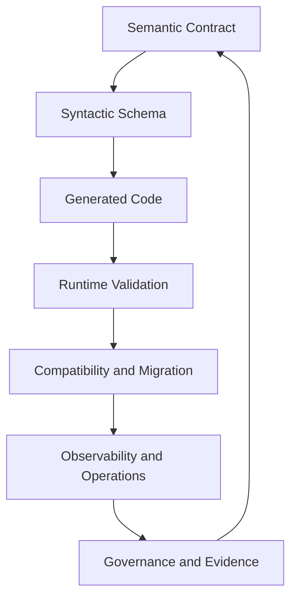
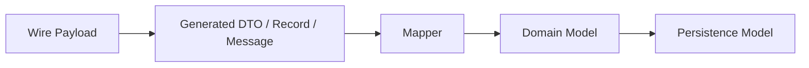
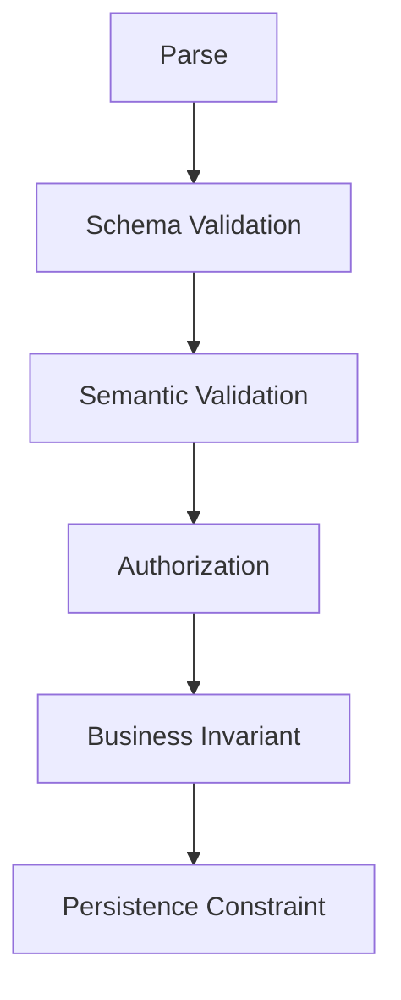
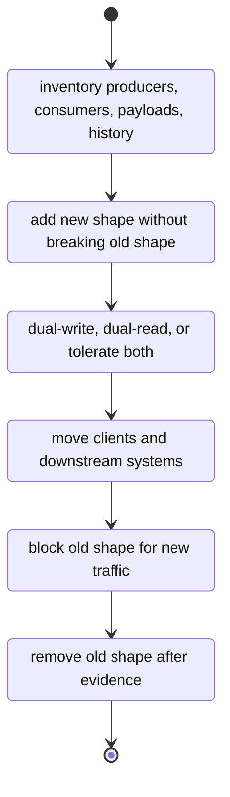
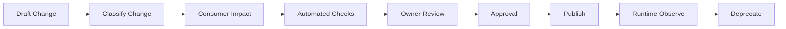
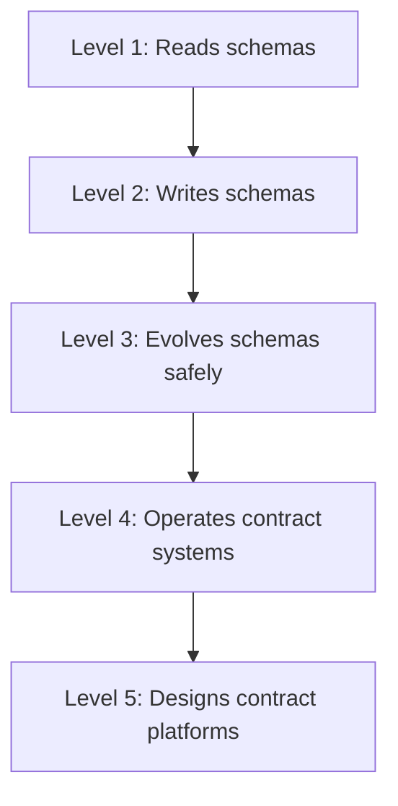
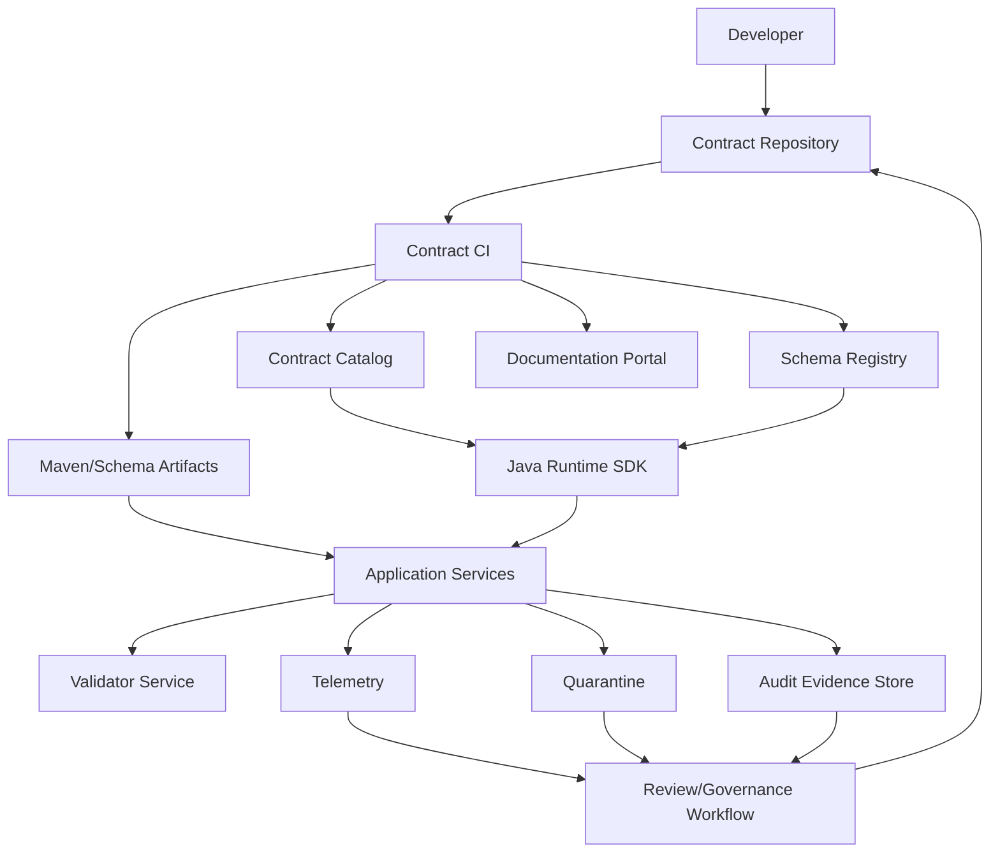

# Part 050 — Final Synthesis: Top 1% Contract Engineering Playbook

This is the final chapter of the series.

The goal is not to memorize XSD, JSON Schema, Avro, Protobuf, and OpenAPI.

The goal is to think like an engineer who can protect system boundaries under continuous change.

Most teams treat data contracts as files.

Strong teams treat them as APIs.

Elite teams treat them as distributed protocols with ownership, compatibility, runtime evidence, and operational consequences.

That is the level we are targeting.

---

## 1. The core idea

A data contract is not a schema.

A schema is one artifact inside a contract system.

A real data contract includes:

- shape
- meaning
- ownership
- compatibility policy
- validation policy
- version identity
- examples
- generated artifacts
- runtime enforcement
- observability
- security classification
- migration strategy
- audit evidence
- deprecation path

If a schema has no owner, it is a file.

If it has no compatibility policy, it is a liability.

If it has no runtime evidence, it is a hope.

If it has no migration plan, it is a future incident.

---

## 2. The top-level mental model

Think in layers.



Most engineers live in the `Shape` and `Code` layers.

Top engineers operate the whole loop.

---

## 3. The one-page decision framework

Use this when choosing a contract technology.

| Boundary | Default choice | Why |
|---|---|---|
| Public HTTP API | OpenAPI | API surface, documentation, client/server generation, gateway validation |
| Internal HTTP API | OpenAPI | Same reason, with stronger internal automation |
| Dynamic JSON document | JSON Schema | Fine-grained JSON validation and reusable schema fragments |
| Legacy XML exchange | XSD | XML namespace, partner compatibility, enterprise document validation |
| Kafka event stream | Avro | Binary event evolution, schema registry, reader/writer schema resolution |
| gRPC/internal RPC | Protobuf | Strong service contract, compact wire format, generated clients |
| Batch file | Manifest + payload schema | File-level evidence plus row/document validation |
| Reference data | Code list / reference data service | Avoid hard-coded enum churn |
| Audit evidence | JSON/Avro with immutable metadata | Queryability, replay, and defensibility |

Do not ask, “Which schema format is best?”

Ask:

- What boundary is this?
- Who produces the data?
- Who consumes the data?
- How independently do they deploy?
- Does history need replay?
- Does the payload need legal evidence?
- Is the format human-facing or machine-facing?
- Is code generation required?
- Is unknown data allowed?
- What happens when validation fails?

The correct answer depends on the boundary.

---

## 4. Format-specific memory hooks

### 4.1 XSD

Think:

> XML document contract with namespace discipline.

Use XSD when:

- partner systems already exchange XML
- namespaces matter
- document-style validation matters
- enterprise legacy integration is real
- schema evolution is controlled by major namespace versions

Watch out for:

- XXE and unsafe parsing
- namespace chaos
- generated JAXB model leaking into domain code
- optional-to-required changes
- unrestricted wildcard extension
- enum rigidity

### 4.2 JSON Schema

Think:

> JSON validation language with dialect, vocabulary, reference, and evaluation semantics.

Use JSON Schema when:

- JSON payloads need strict validation
- schemas are reused outside HTTP APIs
- dynamic documents exist
- form-like payloads vary by source/type
- validation error quality matters

Watch out for:

- confusing `null` with missing
- uncontrolled `additionalProperties`
- expensive or recursive references
- validator dialect mismatch
- treating `format` as always assertive
- semantic rules hidden in schema keywords

### 4.3 Avro

Think:

> Event and data pipeline schema with reader/writer resolution.

Use Avro when:

- Kafka/event streams need schema registry integration
- replay matters
- binary compactness matters
- producers and consumers evolve independently
- data lake ingestion uses schema identity

Watch out for:

- fields added without defaults
- enum changes without unknown strategy
- union ordering confusion
- SpecificRecord leaking into domain code
- subject naming mistakes
- compatibility mode chosen without replay reasoning

### 4.4 Protobuf

Think:

> Numbered-field binary protocol for RPC and cross-language contracts.

Use Protobuf when:

- gRPC is used
- field-number stability matters
- compact wire format matters
- generated clients are expected
- cross-language internal APIs exist

Watch out for:

- field number reuse
- enum zero-value mistakes
- JSON mapping assumptions
- unknown field behavior differences
- `Any` abuse
- generated runtime mismatch

### 4.5 OpenAPI

Think:

> HTTP API interface description.

Use OpenAPI when:

- humans and machines need to understand an HTTP API
- generated clients/servers are useful
- API gateway validation is needed
- documentation and examples matter
- API lifecycle needs governance

Watch out for:

- generator-specific behavior
- `oneOf`/discriminator misuse
- nullable mismatch between 3.0 and 3.1+
- examples drifting from schema
- generated DTOs becoming domain objects
- hidden breaking changes in response payloads

---

## 5. The compatibility discipline

Compatibility is about whether independently deployed systems continue to work.

It is not about whether a schema parser accepts the new file.

The important question:

> Can existing producers, existing consumers, historical payloads, generated code, validators, and operational workflows survive this change?

### 5.1 Compatibility dimensions

| Dimension | Question |
|---|---|
| Syntactic | Does the schema still parse? |
| Structural | Does the payload shape remain acceptable? |
| Semantic | Does the meaning remain stable? |
| Binary/wire | Does encoded data remain readable? |
| Generated code | Does downstream code still compile/run? |
| Runtime validation | Will old payloads be rejected? |
| Replay | Can historical data still be consumed? |
| Operational | Can teams migrate safely? |
| Regulatory | Can past decisions still be explained? |

A change can be syntactically valid and operationally dangerous.

### 5.2 Safe-change heuristics

Usually safer:

- add optional response field
- add nullable Avro field with default
- add Protobuf field with new number
- add JSON object property when object is open or consumer tolerant
- add new OpenAPI endpoint
- add new XSD optional element at extension point
- add new reference data value if consumers handle unknowns

Usually dangerous:

- remove field
- rename field
- change type
- make optional field required
- reuse Protobuf field number
- remove Avro default
- narrow enum without migration
- close previously open JSON object
- change meaning while keeping name
- change timestamp semantics
- change monetary precision

The most dangerous change is semantic drift with no schema change.

Example:

```text
field: caseStatus
old meaning: current lifecycle status
new meaning: current visible status after permission filtering
```

The schema did not change.

The contract broke.

---

## 6. The generated-code rule

Generated code is an adapter.

It is not your domain.

The boundary should look like this:



Bad:

```java
public void decide(CaseOpenedAvro event) {
    // domain logic directly depends on generated Avro type
}
```

Better:

```java
public void decide(CaseOpenedEvent event) {
    // domain logic depends on stable domain event abstraction
}
```

Mapper:

```java
final class CaseOpenedAvroMapper {
    CaseOpenedEvent toDomain(com.acme.regcase.event.case.v1.CaseOpened source) {
        return new CaseOpenedEvent(
                EventId.of(source.getEventId().toString()),
                CaseId.of(source.getCaseId()),
                Instant.ofEpochMilli(source.getOccurredAt()),
                CaseSourceType.fromWire(source.getSourceType().name())
        );
    }
}
```

This gives you:

- insulation from generator changes
- controlled null/default handling
- explicit semantic mapping
- testable boundary conversion
- protection against contract churn

The mapper is not boilerplate.

It is where wire semantics become domain semantics.

---

## 7. The validation rule

Validation has layers.



Do not confuse them.

| Layer | Example |
|---|---|
| Parse | Is the payload valid JSON/XML/binary? |
| Schema | Does it match JSON Schema/XSD/Avro/Protobuf/OpenAPI shape? |
| Semantic | Is `closedAt` after `openedAt`? |
| Authorization | Is this actor allowed to change this case? |
| Business invariant | Can a closed case be reopened? |
| Persistence | Is the unique constraint satisfied? |

Schema validation is necessary.

It is not sufficient.

A top engineer knows exactly where each rule belongs.

---

## 8. The migration playbook

Most contract migrations should follow this pattern:



### 8.1 Expand

Add capability without breaking old systems.

Examples:

- add new optional field
- add new event type
- add new endpoint
- add new Protobuf field number
- add new XSD namespace v2 alongside v1

### 8.2 Dual run

Support both old and new forms.

Examples:

- read old field and new field
- write both fields temporarily
- accept v1 and v2 documents
- publish old and new event during migration window

### 8.3 Migrate

Move consumers/producers with evidence.

Evidence:

- usage metrics
- version adoption dashboard
- consumer approval
- runtime validation reports
- replay tests
- batch validation reports

### 8.4 Enforce

Reject old shape only when safe.

Enforcement should be:

- staged
- observable
- reversible where possible
- communicated
- tied to policy

### 8.5 Contract

Remove old behavior only after deprecation window.

Store evidence.

A migration without evidence is a risky memory.

---

## 9. The governance model

Governance should make safe change easy and dangerous change visible.

It should not create ceremony for its own sake.

A good governance workflow:



### 9.1 Review questions

Every meaningful contract review should ask:

- What boundary does this affect?
- Who owns it?
- Who consumes it?
- Is it backward compatible?
- Does it affect generated code?
- Does it affect historical replay?
- Does it change semantics?
- Does it add sensitive data?
- Does it require migration?
- Does it need a deprecation plan?
- What telemetry will prove safety?
- What is the rollback path?

### 9.2 Approval matrix

| Change type | Required approval |
|---|---|
| docs-only | owner team |
| additive non-sensitive field | owner team + CI pass |
| sensitive field addition | owner + security/privacy |
| semantic meaning change | owner + consumers + architecture |
| breaking change | owner + consumers + architecture + migration plan |
| emergency change | incident commander + post-review |

A review process that cannot distinguish these is too blunt.

---

## 10. Runtime enforcement strategy

A contract that is only checked in CI is incomplete.

Runtime enforcement catches reality.

| Boundary | Enforcement |
|---|---|
| API ingress | strict validation |
| API egress | shadow first, strict later |
| event producer | strict before publish |
| event consumer | strict or tolerant based on ownership |
| XML partner gateway | strict with quarantine |
| batch import | strict manifest, policy-based row handling |
| internal RPC | client/server validation plus domain checks |

Do not turn on strict validation everywhere without thinking.

A good runtime policy answers:

- What is the blast radius of reject?
- Can the producer retry safely?
- Is the payload recoverable?
- Is the producer external?
- Is this traffic user-facing?
- Is this validation newly introduced?
- Is there a quarantine path?
- Is there a rollback switch?

Runtime validation is a throttle, not a hammer.

---

## 11. Observability playbook

You need telemetry that connects schema design to runtime behavior.

Minimum metrics:

```text
contract.validation.total
contract.validation.failed
contract.validation.failure_rate
contract.validation.error_count
contract.version.usage
contract.deprecated_version.usage
contract.unknown_field.count
contract.schema_resolution.failure
contract.registry.lookup.latency
contract.quarantine.created
contract.dlq.created
contract.compatibility.waiver.active
```

Minimum log fields:

```text
contract.id
contract.version
contract.format
boundary.name
producer.service
consumer.service
validation.result
validation.error.code
payload.fingerprint
trace.id
correlation.id
classification
```

Minimum dashboards:

- invalid payloads by producer
- contract version adoption
- deprecated version usage
- registry health
- top validation failures
- quarantine queue age
- active waivers
- sensitive contract inventory
- unknown enum/value frequency

Observability should expose drift.

If reality differs from the schema, the contract system should show it.

---

## 12. Security and privacy rules

Contracts describe data.

Data creates risk.

Contract engineering must include security and privacy.

Rules:

1. Every sensitive field must be classified.
2. Validation errors must be redacted.
3. Raw payloads must not be logged.
4. XML parsers must be hardened.
5. External references must be controlled.
6. Schema resolution must support offline mode.
7. Code generation must be pinned and reviewed.
8. Unknown fields must not become mass-assignment vectors.
9. Batch payloads must have checksums.
10. Quarantine storage must be access-controlled and encrypted.
11. Audit evidence must preserve integrity without leaking secrets.
12. Contract changes that add sensitive data need security/privacy review.

Threat model the contract layer.

Attackers love parsers, validators, generated code, and forgotten extension points.

---

## 13. Top anti-patterns

### 13.1 “We use code-first, so we do not need contracts”

Code-first still produces a contract.

It is just implicit and usually uncontrolled.

### 13.2 “The schema registry solves compatibility”

The registry can check some compatibility rules.

It cannot understand all semantics, generated code, rollout safety, consumer behavior, or regulatory meaning.

### 13.3 “JSON is flexible, so we can change it later”

JSON is flexible for producers.

That flexibility often becomes pain for consumers.

### 13.4 “Internal APIs do not need governance”

Internal systems deploy independently.

Independent deployment creates compatibility problems.

### 13.5 “Generated models are convenient, use them everywhere”

Convenience creates coupling.

Coupling turns schema changes into domain changes.

### 13.6 “Enums are simple”

Enums are simple until the business changes vocabulary.

Then they become compatibility landmines.

### 13.7 “Validation failure is just a 400”

Validation failure is an operational signal.

It may indicate attack, client bug, producer drift, data quality issue, or contract defect.

### 13.8 “Backward compatible means safe”

Backward compatible at schema level may still be semantically unsafe.

### 13.9 “Deprecation means documentation note”

Deprecation means telemetry, communication, migration, enforcement, and evidence.

### 13.10 “A canonical model will simplify everything”

A canonical model can help integration.

A universal model across API, event, DB, workflow, analytics, and UI usually becomes a distributed monolith.

---

## 14. The field guide: how to reason about any contract change

When reviewing a contract change, walk this sequence.

### Step 1 — Identify the boundary

Is it API, event, RPC, XML, batch, storage, analytics, or audit?

### Step 2 — Identify producers and consumers

List actual systems.

Not theoretical systems.

### Step 3 — Identify lifecycle

Is the contract experimental, internal, public, regulated, deprecated, or frozen?

### Step 4 — Identify compatibility expectation

Backward, forward, full, transitive, none, namespace-major, or major-version only.

### Step 5 — Identify generated-code impact

Will downstream code compile?

Will runtime parsing still work?

### Step 6 — Identify historical-data impact

Can old payloads be re-read?

Can events be replayed?

Can audit evidence be reproduced?

### Step 7 — Identify semantic impact

Did the meaning change?

Did units, precision, time semantics, status meaning, or lifecycle behavior change?

### Step 8 — Identify security/privacy impact

Any new sensitive fields?

Any new extension point?

Any parser or reference risk?

### Step 9 — Identify migration path

Can the change follow expand–migrate–contract?

### Step 10 — Identify observability

How will you know the change is safe in production?

This sequence should become muscle memory.

---

## 15. Production checklist

Use this before approving a contract for production.

### 15.1 Identity

- contract ID exists
- version exists
- owner exists
- format exists
- lifecycle exists
- repository path exists
- artifact coordinates exist
- registry subject/artifact ID exists when relevant

### 15.2 Design

- boundary is clear
- semantics are documented
- examples exist
- nullability is intentional
- optionality is intentional
- defaults are intentional
- enum strategy is intentional
- extension points are controlled
- time/money/ID semantics are explicit

### 15.3 Compatibility

- compatibility policy exists
- CI compatibility check exists
- generated-code impact is known
- historical replay impact is known
- migration path exists for breaking changes
- waiver exists only when justified
- waiver has expiry

### 15.4 Runtime

- validation mode is defined
- failure action is defined
- schema resolver is configured
- cache behavior is defined
- registry outage behavior is defined
- error model is redacted
- quarantine/DLQ path exists
- replay path exists

### 15.5 Observability

- validation metrics exist
- version usage metrics exist
- failure logs are structured
- trace correlation exists
- dashboards exist
- alerts exist
- deprecated usage is visible

### 15.6 Security/privacy

- sensitive fields are classified
- logging policy exists
- retention policy exists
- parser hardening exists
- codegen toolchain is pinned
- external references are controlled
- access to quarantine is restricted

### 15.7 Governance

- review route is defined
- owners approved
- consumers approved when needed
- ADR exists for major decisions
- changelog exists
- deprecation/sunset exists when relevant
- audit evidence is stored

A contract that fails this checklist may still work today.

It is not ready for sustained change.

---

## 16. Skill progression after this series

You can think about mastery in five levels.



### Level 1 — Reads schemas

You understand the syntax of OpenAPI, JSON Schema, XSD, Avro, and Protobuf.

### Level 2 — Writes schemas

You can model payloads correctly and generate Java code.

### Level 3 — Evolves schemas safely

You understand compatibility, versioning, and migration.

### Level 4 — Operates contract systems

You manage runtime validation, observability, registry operations, and incident response.

### Level 5 — Designs contract platforms

You build governance, tooling, CI/CD, evidence, and operating models across many teams.

Top 1% is Level 5.

Not because Level 5 knows more keywords.

Because Level 5 can make many teams move safely.

---

## 17. What to practice next

The most effective practice is not reading more syntax.

It is designing change.

Practice these scenarios:

1. Add a field to an Avro event consumed by five services.
2. Rename an OpenAPI response field without breaking mobile clients.
3. Replace a JSON enum with reference data.
4. Introduce XSD v2 while accepting v1 for six months.
5. Add Protobuf field presence to an existing RPC contract.
6. Validate historical batch files with the exact old schema.
7. Build a contract CI gate that produces actionable review comments.
8. Design a quarantine workflow for invalid partner payloads.
9. Build a dashboard showing deprecated contract usage.
10. Explain to an auditor why a payload was accepted two years ago.

If you can do these, you are no longer only a schema user.

You are a contract engineer.

---

## 18. A compact operating doctrine

Use this doctrine in real projects.

1. Contracts are boundaries.
2. Boundaries need owners.
3. Owners need policies.
4. Policies need automation.
5. Automation needs runtime evidence.
6. Runtime evidence needs observability.
7. Observability reveals drift.
8. Drift drives migration.
9. Migration needs evidence.
10. Evidence creates defensibility.

That loop is the discipline.

---

## 19. Final architecture reference

The complete contract platform looks like this.



This is the destination.

Each schema format is only one component.

The platform is the system of controls around them.

---

## 20. Final exam

Design a contract change review for this change:

> The regulator now requires all enforcement decisions to include a `legalBasis` field containing one or more legal instrument references. This field must be visible in public API responses, included in audit evidence, emitted in decision events, and available to analytics. Existing historical decisions do not have this field.

A good answer should cover:

- OpenAPI response evolution
- Avro event evolution
- audit evidence contract
- historical data handling
- nullability/absence semantics
- generated Java model impact
- analytics schema impact
- migration plan
- compatibility assessment
- runtime validation mode
- observability
- deprecation if old response shape exists
- regulatory defensibility

A weak answer says:

> Add `legalBasis` as a required field.

A strong answer says:

> Add `legalBasis` as optional or nullable in compatible surfaces, backfill where possible, expose warning telemetry for missing values, create a new major contract where it becomes mandatory for new decisions, preserve historical absence semantics, update audit evidence, migrate analytics, validate new decisions strictly, and store evidence of the policy transition.

That is the difference.

---

## 21. Closing synthesis

The deeper lesson is simple:

Systems do not fail because schemas are hard to write.

They fail because change is hard to coordinate.

Data contracts are one of the main coordination mechanisms in distributed systems.

They sit between teams, services, languages, storage engines, regulators, partners, auditors, and users.

Treat them casually and they become invisible coupling.

Treat them seriously and they become a platform for safe change.

You now have the mental model, patterns, implementation strategy, governance model, and production playbook to build that platform.

This completes the series.

---

## 22. Series completion

This is the final part of:

```text
learn-java-data-contract-engineering
```

Completed parts:

```text
Part 001 through Part 050
```

The series is complete.

---

## References

- OpenAPI Specification 3.2.0 — https://spec.openapis.org/oas/v3.2.0.html
- JSON Schema Draft 2020-12 — https://json-schema.org/draft/2020-12
- Apache Avro 1.12.0 Specification — https://avro.apache.org/docs/1.12.0/specification/
- Protocol Buffers Documentation — https://protobuf.dev/overview/
- Protocol Buffers Editions Overview — https://protobuf.dev/editions/overview/
