# Part 001 — Pipeline Mental Model

> Data pipeline bukan hanya proses mengambil data dari A, mengubahnya, lalu menaruhnya ke B. Dalam sistem produksi, data pipeline adalah **sistem kebenaran terdistribusi**: ia menentukan fakta apa yang bergerak, kapan fakta itu dianggap valid, bagaimana fakta itu bisa diulang, bagaimana kesalahan dibatasi, dan bagaimana output dapat dipertanggungjawabkan.

Bagian pertama ini sengaja tidak langsung masuk ke Kafka, Flink, Spark, Airflow, atau library Java tertentu. Tool berubah. Semantics dan failure mode bertahan lebih lama.

Kita mulai dari model mental yang bisa dipakai untuk mendesain, mengimplementasikan, mereview, dan mengoperasikan pipeline di level engineering handbook internal.

---

## 1. Masalah Sebenarnya yang Diselesaikan Data Pipeline

Pipeline sering didefinisikan terlalu dangkal:

> Extract data, transform it, load it somewhere.

Definisi itu benar, tapi tidak cukup untuk sistem yang harus reliable.

Definisi yang lebih berguna:

> Data pipeline adalah mekanisme terkontrol untuk memindahkan, menafsirkan, memvalidasi, memperkaya, mengagregasi, menyimpan, dan menerbitkan fakta dari satu boundary sistem ke boundary lain dengan semantic guarantee yang eksplisit.

Ada lima hal penting dalam definisi ini:

1. **Fakta**, bukan sekadar row/message/file.
2. **Boundary**, karena setiap source dan sink punya failure model sendiri.
3. **Interpretasi**, karena data mentah tidak otomatis bermakna.
4. **Guarantee**, karena pipeline tanpa guarantee hanya script yang kebetulan berjalan.
5. **Kontrol**, karena produksi butuh replay, audit, observability, dan recovery.

Pipeline yang buruk biasanya tidak gagal karena tidak bisa membaca file atau mengirim message. Pipeline gagal karena tim tidak bisa menjawab pertanyaan seperti:

- Apakah output ini lengkap?
- Apakah record yang sama bisa diproses dua kali?
- Jika job gagal setelah menulis sebagian output, apa yang terjadi?
- Jika schema berubah, consumer mana yang rusak?
- Jika data terlambat dua jam, apakah hasil agregasi berubah?
- Jika source mengirim koreksi, apakah output historis ikut dikoreksi?
- Jika pipeline di-replay dari awal, apakah hasilnya sama?
- Jika regulator meminta bukti, apakah kita bisa menjelaskan asal-usul angka tersebut?

Di level top engineer, pipeline bukan dipikirkan dari API, tetapi dari **invariant**.

---

## 2. Pipeline sebagai Sistem Kebenaran Terdistribusi

Sebuah aplikasi request-response biasanya menjawab pertanyaan:

> Apa respons untuk request ini sekarang?

Pipeline menjawab pertanyaan yang lebih sulit:

> Bagaimana kumpulan fakta yang berubah dari waktu ke waktu ditransformasikan menjadi state atau output yang benar, walaupun input bisa terlambat, duplikat, out-of-order, parsial, atau berubah skemanya?

Perhatikan perbedaannya.

Pada request-response:

```text
request -> validate -> execute -> response
```

Pada pipeline:

```text
source history -> interpretation -> transformation -> materialization -> serving/reuse
```

Pipeline selalu berurusan dengan **history**. Bahkan saat terlihat real-time, ia tetap memproses urutan fakta. Karena itu, pertanyaan pentingnya bukan hanya “apa data sekarang?”, tetapi:

- Fakta apa yang pernah terjadi?
- Dalam urutan apa fakta itu harus dianggap terjadi?
- Apakah fakta lama bisa dikoreksi?
- Apakah output merupakan snapshot, delta, event, aggregate, atau materialized view?
- Apakah hasil bisa direproduksi dari input yang sama?

Mental model ini sangat penting untuk Java engineer karena banyak pipeline Java production-grade berbentuk campuran:

- service Java membaca Kafka lalu menulis Postgres;
- Debezium membaca outbox table lalu publish event;
- Kafka Streams membangun materialized view;
- Flink melakukan enrichment dan windowing;
- Spark job melakukan backfill historis;
- Airflow mengorkestrasi job Java batch;
- Temporal mengelola workflow data yang butuh retry dan compensation;
- API internal menyajikan hasil pipeline ke sistem operasional.

Jika semuanya dianggap “ETL”, design-nya akan kacau.

---

## 3. Peta Besar Pipeline

Pipeline minimal punya empat elemen:

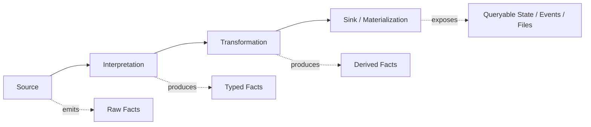

Namun dalam produksi, versi lengkapnya seperti ini:

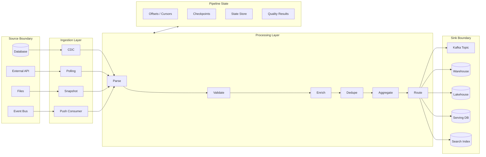

Yang sering dilupakan adalah kotak **Pipeline State**. Padahal di situlah guarantee hidup:

- Offset menentukan record mana yang sudah dibaca.
- Cursor menentukan halaman API mana yang sudah selesai.
- Checkpoint menentukan state mana yang aman untuk recovery.
- State store menyimpan memori lintas record.
- Quality result menentukan apakah output boleh diterbitkan.

Pipeline tanpa state eksplisit mudah terlihat sederhana, tetapi sering tidak bisa di-recover dengan benar.

---

## 4. Vocabulary yang Harus Presisi

Top engineer biasanya keras soal bahasa karena bahasa yang kabur menghasilkan design yang kabur.

### 4.1 Data

**Data** adalah representasi. Bisa row, JSON, Avro record, Protobuf message, CSV line, Parquet row group, atau object Java.

Data belum tentu fakta. Data bisa salah, telat, parsial, duplikat, atau tidak lagi berlaku.

### 4.2 Event

**Event** adalah pernyataan bahwa sesuatu terjadi.

Contoh:

```json
{
  "eventId": "evt-893",
  "type": "CaseEscalated",
  "caseId": "CASE-1001",
  "occurredAt": "2026-07-04T09:30:00Z",
  "reason": "SLA_BREACH"
}
```

Event yang baik menyatakan fakta masa lalu. Namanya biasanya past tense:

- `CaseCreated`
- `CaseEscalated`
- `PaymentCaptured`
- `CustomerAddressChanged`

Event yang buruk sering berupa instruksi samar:

- `UpdateCase`
- `SyncCustomer`
- `ProcessData`

Instruksi seperti itu lebih cocok disebut command atau job request.

### 4.3 Record

**Record** adalah unit fisik yang diproses pipeline.

Satu record bisa membawa event, state snapshot, command, correction, atau metadata.

Di Kafka, record/event secara konseptual punya key, value, timestamp, dan headers. Dalam file ingestion, record bisa berupa line CSV. Dalam database ingestion, record bisa berupa row atau change event.

### 4.4 Message

**Message** adalah unit komunikasi antar komponen. Message bisa membawa event, command, atau document.

Jangan menganggap semua message adalah event.

### 4.5 Fact

**Fact** adalah klaim domain yang dianggap benar oleh pipeline pada titik tertentu.

Contoh:

> Case `CASE-1001` escalated at `2026-07-04T09:30:00Z` because SLA was breached.

Pipeline yang matang membedakan:

- fact created;
- fact corrected;
- fact retracted;
- fact superseded;
- fact observed late;
- fact invalid/quarantined.

### 4.6 State

**State** adalah hasil akumulasi fakta.

Contoh:

```text
Case current status = ESCALATED
Case assigned team = Enforcement L2
Case SLA remaining = -2 hours
```

State biasanya mudah dipakai, tetapi sulit diaudit jika tidak tahu event/fact pembentuknya.

### 4.7 Materialized View

**Materialized view** adalah state turunan yang disimpan agar query cepat atau integrasi mudah.

Contoh:

- table `case_current_status`;
- Elasticsearch index `cases_search`;
- Redis cache `case_dashboard_summary`;
- Iceberg table `gold_case_sla_daily`.

Materialized view harus dianggap disposable jika bisa dibangun ulang dari source of truth. Jika tidak bisa dibangun ulang, ia diam-diam berubah menjadi source of truth baru.

### 4.8 Dataset

**Dataset** adalah kumpulan record dengan boundary yang didefinisikan:

- topic;
- table;
- file partition;
- API response set;
- object storage prefix;
- materialized view;
- CDC stream.

Dataset production-grade perlu metadata:

- owner;
- schema;
- freshness SLA;
- retention;
- quality rules;
- lineage;
- access policy;
- recovery mechanism.

---

## 5. Source of Truth vs Source of Events vs Source of Query

Salah satu sumber kerusakan arsitektur pipeline adalah mencampur tiga konsep ini.

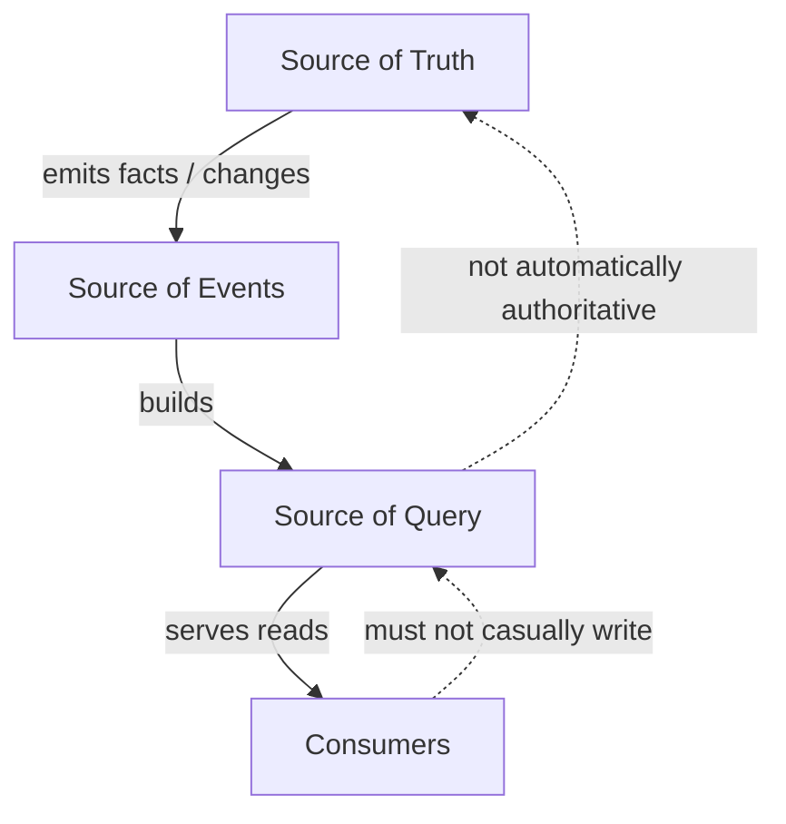

### Source of Truth

Tempat otoritatif untuk fakta domain.

Contoh:

- operational Postgres untuk case management;
- ledger system untuk transaksi finansial;
- registry resmi untuk identitas legal;
- CRM untuk master customer tertentu.

### Source of Events

Tempat fakta atau perubahan disusun sebagai stream/log.

Contoh:

- Kafka topic dari outbox;
- CDC stream dari database;
- event store;
- append-only audit table.

Source of events belum tentu source of truth, tetapi ia sering menjadi basis replay.

### Source of Query

Tempat data dioptimalkan untuk dibaca.

Contoh:

- Elasticsearch;
- Redis;
- reporting warehouse;
- dashboard table;
- materialized projection.

Source of query tidak boleh diberi otoritas domain hanya karena mudah di-query.

### Rule Praktis

Jika ada perbedaan antara source of truth dan source of query, harus ada jawaban eksplisit:

- Mana yang menang?
- Bagaimana reconciliation dilakukan?
- Seberapa lama drift boleh terjadi?
- Apakah query source bisa dibangun ulang?
- Apakah user boleh mengambil keputusan enforcement dari query source tersebut?

Untuk domain regulatory/enforcement, ini bukan detail teknis. Ini menyentuh defensibility.

---

## 6. Pipeline Bukan Hanya DAG

Banyak orang melihat pipeline sebagai DAG:

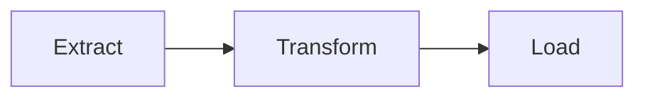

DAG berguna, tetapi tidak cukup.

DAG menjawab:

> Task mana harus berjalan sebelum task lain?

Pipeline correctness menjawab:

> Apakah output tetap benar ketika input duplikat, terlambat, out-of-order, retry, partial failure, schema drift, dan replay terjadi?

DAG adalah model dependency. Pipeline adalah model fakta, state, dan failure.

Contoh DAG bisa hijau semua, tetapi output tetap salah:

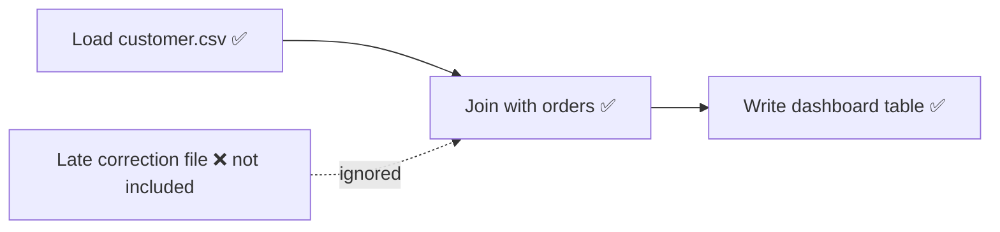

Airflow sukses. Dashboard salah.

Inilah alasan seri ini membedakan **control-flow** dan **dataflow** sejak awal.

---

## 7. Lifecycle Sebuah Record

Untuk memahami pipeline, ikuti hidup satu record.

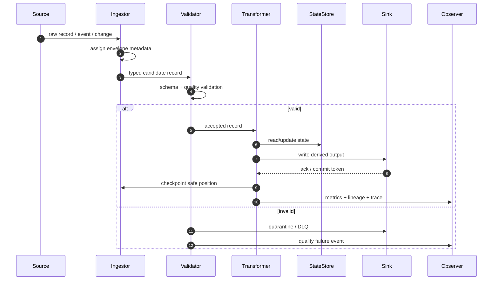

Record production-grade melewati fase:

1. **Observation** — source melihat sesuatu.
2. **Capture** — pipeline mengambil representasinya.
3. **Envelope** — metadata pipeline ditambahkan.
4. **Parse** — bytes/text menjadi type.
5. **Validate** — schema dan quality rules diuji.
6. **Interpret** — record diberi makna domain.
7. **Transform** — fakta diubah/diturunkan.
8. **State Interaction** — dedupe, join, aggregate, lookup.
9. **Materialize** — output ditulis ke sink.
10. **Commit/Checkpoint** — posisi aman disimpan.
11. **Observe** — log, metric, trace, lineage, audit.

Jika pipeline gagal, tanyakan: gagal di fase mana?

Kegagalan parse berbeda dari kegagalan sink. Kegagalan sink berbeda dari kegagalan commit offset. Kegagalan quality berbeda dari data loss.

---

## 8. Envelope: Unit Desain Paling Penting

Di Java pipeline, jangan mendesain hanya `T input -> R output`. Itu terlalu miskin.

Minimal gunakan envelope:

```java
public record PipelineRecord<K, V>(
    K key,
    V value,
    RecordMetadata metadata
) {}

public record RecordMetadata(
    String recordId,
    String sourceSystem,
    String sourceDataset,
    String schemaName,
    int schemaVersion,
    Instant observedAt,
    Instant occurredAt,
    Instant ingestedAt,
    Map<String, String> headers,
    TraceContext traceContext
) {}

public record TraceContext(
    String traceId,
    String spanId,
    String correlationId,
    String causationId
) {}
```

Kenapa envelope penting?

Karena banyak kebutuhan produksi tidak berada di payload domain:

- deduplication key;
- source offset;
- schema version;
- trace ID;
- tenant ID;
- source file path;
- partition;
- ingestion timestamp;
- quality status;
- replay batch ID;
- data classification;
- lineage.

Payload domain menjawab “apa fakta bisnisnya?”. Envelope menjawab “bagaimana fakta ini masuk, diproses, dan dipertanggungjawabkan?”.

---

## 9. Boundary Thinking

Pipeline selalu melintasi boundary. Boundary adalah tempat semantics berubah.

Contoh:

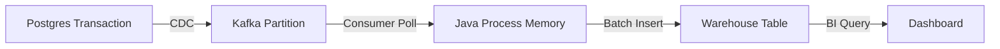

Setiap boundary punya pertanyaan:

### Postgres Transaction -> CDC

- Apakah transaction order dipertahankan?
- Apakah snapshot dan streaming phase konsisten?
- Apakah delete direpresentasikan sebagai tombstone?
- Apakah schema migration menghasilkan event kompatibel?

### Kafka -> Java Process

- Apakah offset commit dilakukan sebelum atau sesudah sink write?
- Apa yang terjadi saat rebalance?
- Apakah processing idempotent?
- Apakah partition key menjaga ordering yang dibutuhkan?

### Java Process -> Warehouse

- Apakah write atomic per batch?
- Apakah upsert supported?
- Apakah partial write bisa dideteksi?
- Apakah retry menghasilkan duplicate?

### Warehouse -> Dashboard

- Apakah dashboard membaca snapshot konsisten?
- Apakah angka bisa berubah setelah late data datang?
- Apakah user tahu freshness data?

Boundary thinking memaksa kita untuk tidak percaya pada “pipeline berhasil” sebelum tahu semantics di tiap perpindahan.

---

## 10. Invariant Dasar Pipeline

Invariant adalah properti yang harus tetap benar walaupun sistem mengalami variasi dan kegagalan.

### 10.1 Completeness

Semua data yang seharusnya masuk benar-benar masuk.

Pertanyaan:

- Bagaimana tahu tidak ada file hilang?
- Bagaimana tahu tidak ada Kafka partition tertinggal?
- Bagaimana tahu tidak ada halaman API yang terlewat?
- Bagaimana tahu semua change dari CDC sudah terbaca?

Completeness bukan “job sukses”. Completeness harus dibuktikan.

Contoh mekanisme:

- manifest file;
- source count reconciliation;
- high watermark;
- offset lag;
- checksum;
- ledger balancing;
- partition coverage report.

### 10.2 Correctness

Output sesuai rule bisnis dan technical contract.

Pertanyaan:

- Transform deterministic atau tergantung waktu sekarang?
- Join menggunakan key benar?
- Late event mengubah hasil?
- Rounding/precision konsisten?
- Null handling eksplisit?

### 10.3 Freshness

Output cukup baru untuk use case.

Freshness berbeda dari latency.

- **Latency**: waktu record diproses.
- **Freshness**: seberapa tertinggal output dari realitas/source.

Pipeline bisa latency rendah tetapi freshness buruk jika source polling terlambat.

### 10.4 Idempotency

Memproses input yang sama lebih dari sekali tidak merusak output.

Contoh sink idempotent:

```sql
INSERT INTO case_projection(case_id, version, status, updated_at)
VALUES (?, ?, ?, ?)
ON CONFLICT (case_id)
DO UPDATE SET
  status = EXCLUDED.status,
  version = EXCLUDED.version,
  updated_at = EXCLUDED.updated_at
WHERE case_projection.version < EXCLUDED.version;
```

Idempotency bukan fitur framework. Ia adalah properti desain.

### 10.5 Replayability

Pipeline bisa dijalankan ulang dari input historis untuk menghasilkan output yang benar.

Replay butuh:

- input history tersedia;
- transform version diketahui;
- external side effect dikontrol;
- output bisa diganti atau ditulis dengan run ID berbeda;
- dependency lookup historis tersedia atau disnapshot.

### 10.6 Determinism

Input sama + transform version sama + reference data sama menghasilkan output sama.

Hal yang merusak determinism:

- `Instant.now()` di tengah transform tanpa injection;
- random UUID sebagai business key;
- lookup API eksternal tanpa snapshot;
- order iteration tidak stabil;
- floating point untuk monetary aggregation;
- timezone default JVM;
- parallel reduce non-associative.

### 10.7 Auditability

Output bisa dijelaskan:

- berasal dari input mana;
- diproses oleh versi transform apa;
- kapan diproses;
- rule apa yang diterapkan;
- record mana yang ditolak;
- siapa/apa yang memicu replay;
- mengapa hasil berubah.

Untuk sistem regulatory, auditability sering sama pentingnya dengan correctness.

---

## 11. Pipeline Semantics: Yang Harus Dinyatakan Eksplisit

Setiap pipeline harus punya semantic contract.

Template sederhana:

```yaml
pipeline: case-sla-breach-detector
owner: enforcement-platform
source:
  type: kafka-topic
  name: case-events-v1
  ordering: per-case-id
  retention: 30d
inputSemantics:
  duplicateHandling: dedupe-by-event-id
  lateEventHandling: accept-until-7d
  invalidRecordHandling: quarantine
  schemaCompatibility: backward
processingSemantics:
  delivery: effectively-once
  state: keyed-by-case-id
  timeModel: event-time
  deterministic: true
sink:
  type: kafka-topic
  name: case-sla-breach-events-v1
  idempotencyKey: breach-id
slo:
  freshnessP95: 2m
  completeness: 99.99%
  quarantineAlertThreshold: 0.1%
replay:
  supported: true
  maxWindow: 30d
  outputMode: replace-by-run-id
```

Kontrak seperti ini jauh lebih berguna daripada diagram arsitektur indah tanpa semantics.

---

## 12. Delivery Semantics: Jangan Tertipu Nama

Empat istilah sering muncul:

- at-most-once;
- at-least-once;
- exactly-once;
- effectively-once.

### At-most-once

Record diproses nol atau satu kali. Bisa hilang, tidak boleh duplikat.

Biasanya terjadi jika offset/ack dilakukan sebelum side effect selesai.

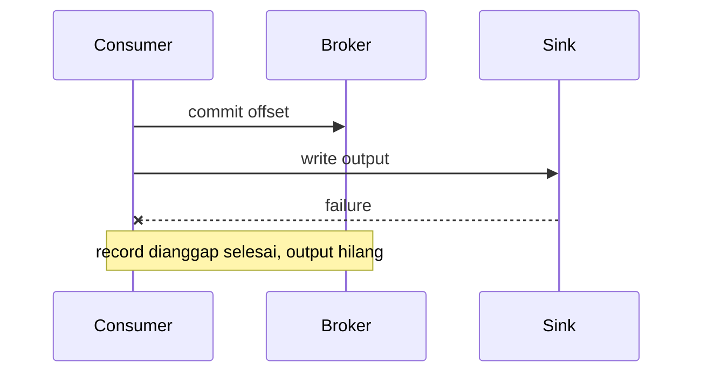

Cocok hanya untuk data yang loss-tolerant, misalnya metric sampling tertentu.

### At-least-once

Record diproses satu kali atau lebih. Tidak hilang, bisa duplikat.

Biasanya offset/ack dilakukan setelah side effect selesai.

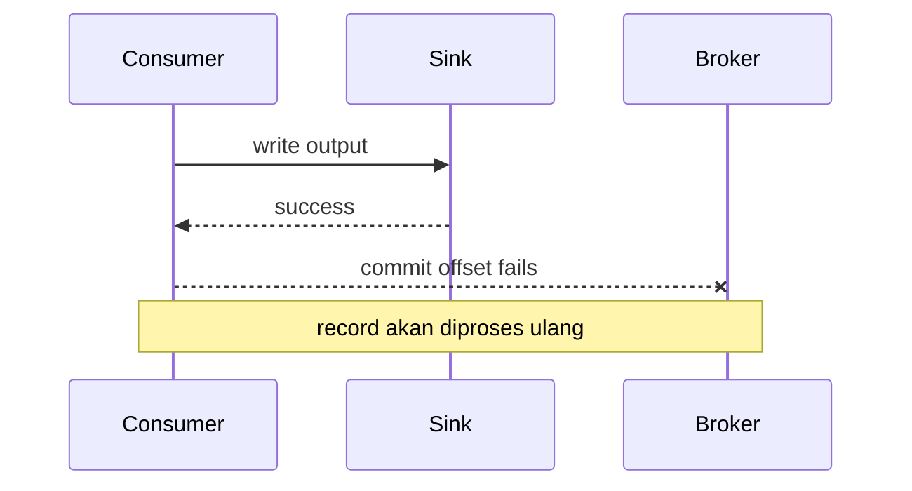

Ini default realistis banyak pipeline.

### Exactly-once

Sering disalahpahami sebagai “tidak mungkin duplikat di seluruh dunia”. Lebih tepat:

> Dalam boundary tertentu, framework menyelaraskan read-process-write dan state sehingga efek akhirnya setara dengan satu kali pemrosesan.

Exactly-once tidak otomatis berlaku ke:

- API eksternal;
- email;
- payment gateway;
- RDBMS tanpa transaksi yang kompatibel;
- sink non-idempotent;
- manual script di luar framework;
- consumer downstream yang salah desain.

### Effectively-once

Efek akhirnya seperti satu kali, dicapai dengan kombinasi:

- at-least-once delivery;
- idempotent sink;
- dedupe key;
- transactional boundary;
- compare-and-swap;
- deterministic transform;
- replay discipline.

Untuk banyak sistem Java, effectively-once lebih jujur dan lebih berguna daripada mengklaim exactly-once secara global.

---

## 13. Time: Bagian yang Sering Menghancurkan Pipeline

Pipeline punya banyak waktu:

```text
occurredAt    = waktu kejadian bisnis terjadi
observedAt    = waktu source melihat kejadian
committedAt   = waktu transaksi source commit
capturedAt    = waktu CDC/poller menangkap
publishedAt   = waktu event masuk broker
processedAt   = waktu pipeline memproses
materializedAt= waktu output ditulis
queriedAt     = waktu consumer membaca
```

Jangan hanya punya `created_at`.

Contoh masalah:

- Case breach terjadi jam 09:00, tapi event baru masuk jam 11:00.
- Dashboard harian dihitung berdasarkan processing time, bukan event time.
- Correction datang dua hari kemudian.
- Timezone source lokal, sink UTC.
- Daylight Saving Time mengubah boundary harian.

Untuk regulatory/enforcement pipeline, waktu adalah evidence. Salah memilih time axis bisa menghasilkan keputusan salah.

---

## 14. Bounded vs Unbounded Data

Data bounded punya akhir yang jelas:

- file harian;
- snapshot table;
- batch export;
- historical backfill range.

Data unbounded tidak punya akhir natural:

- Kafka topic aktif;
- CDC stream;
- IoT event;
- user activity stream;
- operational event stream.

Namun bounded/unbounded bukan berarti batch/streaming secara mutlak.

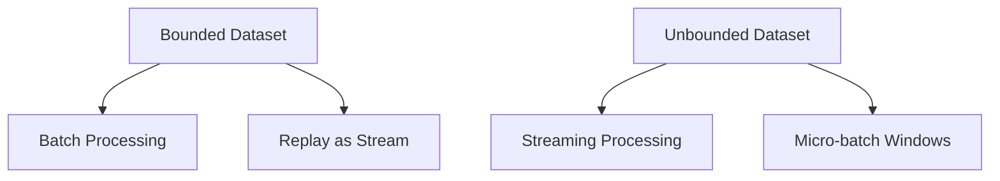

Flink secara eksplisit mendukung bounded dan unbounded streams. Beam juga memodelkan `PCollection` sebagai bounded atau unbounded. Kafka menyimpan event stream durably sehingga data bisa diproses real-time maupun retrospectively.

Prinsipnya:

> Batch dan streaming bukan dua dunia terpisah. Keduanya adalah strategi eksekusi terhadap data yang punya boundary waktu berbeda.

---

## 15. Pipeline Output: Jangan Semua Disebut “Table”

Output pipeline bisa berupa:

### 15.1 Event Output

Pipeline menerbitkan fakta baru.

```text
CaseSlaBreached
CaseRiskScoreUpdated
CustomerSegmentChanged
```

Cocok untuk downstream event-driven systems.

### 15.2 State Output

Pipeline menyimpan current state.

```text
case_id | current_status | assigned_team | latest_risk_score
```

Cocok untuk query cepat.

### 15.3 Aggregate Output

Pipeline membuat ringkasan.

```text
date | region | breach_count | avg_resolution_hours
```

Cocok untuk analytics.

### 15.4 Audit Output

Pipeline menyimpan evidence.

```text
input_record_id | rule_version | decision | reason | processed_at
```

Cocok untuk compliance.

### 15.5 Quality Output

Pipeline menyimpan hasil validasi.

```text
dataset | rule | failed_count | sample_record_ids | severity
```

Cocok untuk governance dan alerting.

Desain sink berbeda untuk setiap jenis output. Jangan memaksa satu table melayani semua kebutuhan.

---

## 16. Java-Specific Mental Model

Java sering dipakai dalam pipeline karena ekosistemnya kuat untuk:

- Kafka producer/consumer;
- Kafka Streams;
- Flink DataStream;
- Beam Java SDK;
- Spark Java API;
- Spring Batch;
- custom ingestion services;
- enterprise integration;
- high-throughput low-latency systems;
- strong typing and mature observability tooling.

Namun Java juga membawa risiko:

- object mutation tersembunyi;
- serialization tidak deterministic;
- timezone default;
- thread pool starvation;
- blocking IO di stream processor;
- GC pressure saat record besar;
- accidental shared state;
- retry tanpa idempotency;
- DTO/domain model tercampur;
- overuse framework annotation tanpa semantic clarity.

Pipeline Java yang baik biasanya punya separation ini:

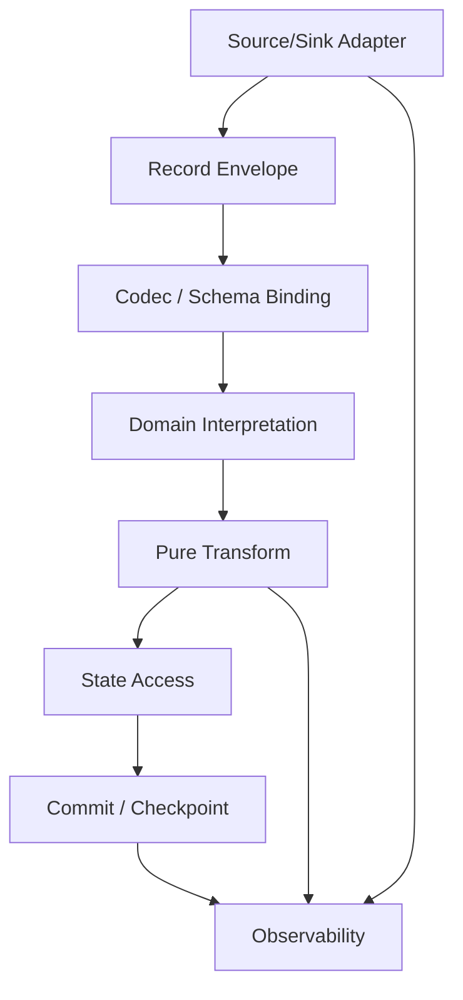

### Rule Penting

Keep transformation as pure as possible.

```java
public interface Transformer<I, O> {
    O transform(I input, TransformContext context);
}
```

`TransformContext` boleh membawa deterministic dependencies:

- transform version;
- business calendar snapshot;
- reference data snapshot;
- processing configuration;
- injected clock;
- feature flag snapshot.

Jangan biarkan transform langsung:

- query API eksternal sembarangan;
- membaca current time tanpa kontrol;
- menulis database;
- mengirim email;
- mutate global cache;
- bergantung pada urutan HashMap.

Semakin murni transform, semakin mudah test, replay, debug, dan audit.

---

## 17. Pipeline sebagai Ledger of Decisions

Untuk kasus enforcement/regulatory, pipeline sering tidak hanya menghitung angka. Ia membantu keputusan:

- case mana yang harus dieskalasi;
- SLA mana yang breached;
- entitas mana yang high-risk;
- bukti mana yang kurang;
- notifikasi mana yang harus dikirim;
- laporan mana yang harus dikirim ke regulator.

Dalam konteks ini, pipeline harus dipikirkan seperti **ledger of decisions**.

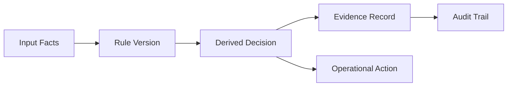

Setiap decision output harus bisa menjawab:

- input facts apa yang digunakan;
- rule version apa yang berlaku;
- reference data versi apa yang dipakai;
- time axis apa yang digunakan;
- siapa owner rule;
- apakah decision final atau provisional;
- apakah decision berubah karena correction;
- apakah action sudah dilakukan;
- apakah action idempotent.

Ini membuat pipeline jauh lebih kuat daripada sekadar job transform.

---

## 18. Failure-First Design

Jangan mulai desain pipeline dari happy path.

Mulai dari failure table:

| Failure | Contoh | Dampak | Design Response |
|---|---|---|---|
| Duplicate input | Kafka redelivery | Double count | Dedupe key, idempotent sink |
| Lost input | Poll cursor salah | Missing output | Reconciliation, checkpoint discipline |
| Out-of-order | Event status datang terbalik | State mundur | Version check, event-time ordering |
| Late data | Correction setelah aggregate publish | Dashboard berubah | Watermark, correction pipeline |
| Partial sink write | Batch insert setengah sukses | Inconsistent output | Transaction, staging table, atomic swap |
| Schema drift | Field rename | Parser gagal | Compatibility rules, schema registry |
| Poison record | Bad payload | Consumer stuck | DLQ/quarantine |
| Slow sink | Warehouse throttling | Lag naik | Backpressure, buffer, retry budget |
| Bad reference data | Lookup stale | Enrichment salah | Reference snapshot version |
| Replay side effect | Email terkirim ulang | User impact | Side-effect isolation, idempotency key |

Failure-first design mengubah pertanyaan dari:

> Bagaimana membuat ini jalan?

menjadi:

> Saat ini gagal dengan cara yang wajar, apakah output tetap aman dan bisa diperbaiki?

---

## 19. Data Pipeline Design Review Template

Gunakan template ini saat review desain pipeline.

### 19.1 Purpose

- Problem bisnis apa yang diselesaikan?
- Output dipakai untuk apa?
- Apakah output operational, analytical, audit, ML, atau integration?
- Apa konsekuensi jika output salah?

### 19.2 Source

- Source of truth-nya apa?
- Data ditangkap via snapshot, poll, CDC, event, atau file?
- Apa ordering guarantee source?
- Apa retention source?
- Bagaimana completeness dibuktikan?

### 19.3 Input Contract

- Schema apa yang diterima?
- Compatibility policy apa?
- Field mana mandatory?
- Bagaimana null/missing value diperlakukan?
- Bagaimana invalid record ditangani?

### 19.4 Processing

- Transform deterministic?
- Stateful atau stateless?
- Keying strategy apa?
- Time model apa?
- Late data policy apa?
- Dedupe strategy apa?

### 19.5 Sink

- Output berupa event, state, aggregate, file, atau audit log?
- Sink idempotent?
- Write atomic?
- Partial failure terdeteksi?
- Output bisa dibangun ulang?

### 19.6 Operations

- Metric utama apa?
- Alert threshold apa?
- Runbook failure apa?
- Replay bagaimana dilakukan?
- Backfill bagaimana dilakukan?
- Owner siapa?

### 19.7 Governance

- Data sensitif apa yang lewat?
- Retention policy apa?
- Lineage dicatat?
- Audit evidence cukup?
- Access control sesuai classification?

---

## 20. Pattern Awal: Minimal Production-Grade Java Pipeline Skeleton

Ini bukan framework final, hanya skeleton mental.

```java
public interface Source<K, V> extends AutoCloseable {
    PollResult<K, V> poll(Duration timeout) throws SourceException;
}

public record PollResult<K, V>(
    List<PipelineRecord<K, V>> records,
    SourcePosition position
) {}

public interface Processor<K, I, O> {
    List<PipelineRecord<K, O>> process(PipelineRecord<K, I> input) throws ProcessingException;
}

public interface Sink<K, V> extends AutoCloseable {
    SinkWriteResult write(List<PipelineRecord<K, V>> records) throws SinkException;
}

public interface CheckpointStore {
    Optional<SourcePosition> load(String pipelineId);
    void save(String pipelineId, SourcePosition position, CheckpointMetadata metadata);
}
```

Runner sederhana:

```java
public final class PipelineRunner<K, I, O> {
    private final String pipelineId;
    private final Source<K, I> source;
    private final Processor<K, I, O> processor;
    private final Sink<K, O> sink;
    private final CheckpointStore checkpointStore;
    private final PipelineObserver observer;

    public void runOnce() {
        PollResult<K, I> batch = source.poll(Duration.ofSeconds(1));
        if (batch.records().isEmpty()) {
            return;
        }

        List<PipelineRecord<K, O>> outputs = new ArrayList<>();

        for (PipelineRecord<K, I> input : batch.records()) {
            try {
                outputs.addAll(processor.process(input));
            } catch (ProcessingException ex) {
                observer.recordProcessingFailure(input, ex);
                // Production decision: fail batch, skip to quarantine, or route to DLQ.
                throw ex;
            }
        }

        SinkWriteResult result = sink.write(outputs);

        if (result.success()) {
            checkpointStore.save(
                pipelineId,
                batch.position(),
                new CheckpointMetadata(Instant.now(), outputs.size())
            );
        }
    }
}
```

Yang penting bukan class-nya, tetapi urutan semantic:

```text
read -> process -> write -> checkpoint
```

Untuk at-least-once, checkpoint dilakukan setelah sink write sukses. Agar aman, sink harus idempotent.

Jika checkpoint dilakukan sebelum sink write, kita berisiko at-most-once dan data loss.

---

## 21. Anti-Pattern yang Harus Dikenali Sejak Awal

### 21.1 “It’s Just a Script”

Script boleh untuk eksplorasi. Untuk produksi, script tanpa contract, checkpoint, observability, dan replay plan akan menjadi liability.

### 21.2 “DAG Succeeded, Therefore Data Is Correct”

Task success hanya berarti task selesai menurut executor. Ia tidak membuktikan completeness atau correctness.

### 21.3 “Exactly-Once Solves Everything”

Exactly-once biasanya scoped. Jika sink eksternal tidak ikut dalam boundary transaksi, duplikasi/partial effect tetap mungkin.

### 21.4 “Current State Is Enough”

Current state tanpa event history membuat audit dan replay sulit.

### 21.5 “Let Dashboard Handle It”

Business logic di dashboard sering tidak versioned, tidak tested, tidak lineage-aware, dan sulit diaudit.

### 21.6 “We Can Backfill Later”

Backfill yang tidak dirancang sejak awal sering gagal karena transform tidak deterministic, input tidak retained, dan side effect tidak idempotent.

### 21.7 “Schema Change Is Small”

Perubahan field kecil bisa memecahkan consumer, aggregate, report, ML feature, dan regulatory extract.

---

## 22. Heuristik Desain Cepat

Gunakan rule ini ketika memilih pendekatan:

| Kondisi | Arah Desain |
|---|---|
| Data kecil, harian, source stabil | Batch job + manifest + reconciliation |
| Data real-time, ordering per entity penting | Kafka topic keyed by entity + stateful processor |
| Transform butuh window/event time | Flink/Beam/Kafka Streams, bukan cron script |
| External API lambat/rate-limited | Poller dengan cursor, retry budget, backpressure |
| Output harus audit-grade | Append-only evidence + versioned transform |
| Output bisa berubah karena late correction | Correction pipeline + bitemporal model |
| Sink tidak idempotent | Tambahkan idempotency layer atau isolate side effect |
| Banyak consumer beda kebutuhan | Event log + derived materialized views |
| Banyak pipeline saling tergantung | Orchestration + lineage + asset graph |

---

## 23. Latihan Mental Model

Bayangkan pipeline:

> Ambil perubahan case dari database operasional, deteksi SLA breach, kirim event escalation, simpan dashboard summary, dan buat audit trail.

Jangan mulai dari tool. Jawab dulu:

1. Apa source of truth?
2. Apakah perubahan case ditangkap via CDC, outbox, polling, atau direct publish?
3. Apa key ordering-nya? `caseId`?
4. Apakah SLA breach dihitung berdasarkan event time atau processing time?
5. Bagaimana jika status case berubah sebelum event lama datang?
6. Bagaimana jika breach event terkirim dua kali?
7. Apakah escalation action idempotent?
8. Apakah dashboard bisa berbeda dari audit trail?
9. Bagaimana replay dilakukan untuk 90 hari terakhir?
10. Apakah rule SLA versioned?

Jika pertanyaan ini belum bisa dijawab, implementasi belum siap.

---

## 24. Ringkasan Mental Model

Simpan model ini:

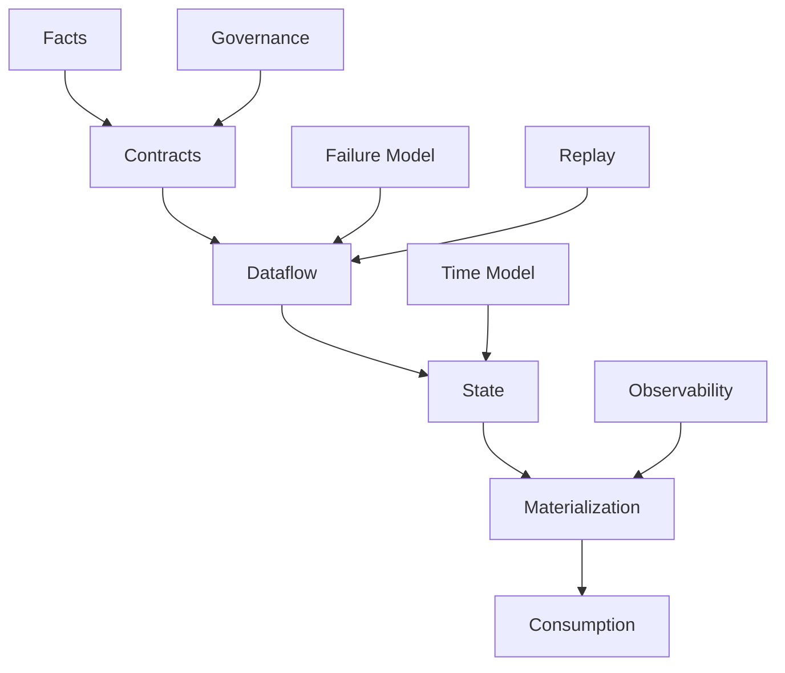

Pipeline production-grade adalah kombinasi dari:

- fakta yang jelas;
- contract yang eksplisit;
- dataflow yang benar;
- state yang bisa dipulihkan;
- sink yang idempotent;
- time model yang tepat;
- failure handling yang disengaja;
- observability yang cukup;
- replay yang aman;
- governance yang sesuai risiko.

Jika satu bagian hilang, pipeline mungkin tetap berjalan, tetapi tidak bisa dipercaya.

---

## 25. Checklist Part 001

Sebelum lanjut ke Part 002, pastikan bisa menjelaskan:

- Perbedaan data, record, message, event, fact, state, dan materialized view.
- Mengapa pipeline adalah distributed correctness system.
- Mengapa DAG success tidak sama dengan data correctness.
- Perbedaan source of truth, source of events, dan source of query.
- Apa saja invariant dasar pipeline.
- Mengapa envelope penting di Java pipeline.
- Mengapa idempotency dan replayability harus didesain sejak awal.
- Mengapa time model harus eksplisit.
- Mengapa exactly-once tidak boleh diklaim secara global tanpa boundary.

---

## 26. Referensi Resmi yang Relevan

- Apache Kafka Introduction — event streaming, events, topics, partitions, APIs: https://kafka.apache.org/intro/
- Apache Beam Programming Guide — `Pipeline`, `PCollection`, `PTransform`, bounded/unbounded data: https://beam.apache.org/documentation/programming-guide/
- Apache Flink Overview — bounded/unbounded streams, stateful computation, event-time, late data: https://flink.apache.org/
- Apache Airflow DAGs — DAG loading and dependency modeling: https://airflow.apache.org/docs/apache-airflow/stable/core-concepts/dags.html

---

## 27. Apa yang Berikutnya

Part 002 akan membedah **dataflow vs control-flow**.

Kita akan pisahkan secara tegas:

- stream graph vs workflow DAG;
- operator vs task;
- data dependency vs execution dependency;
- continuous processing vs scheduled orchestration;
- Kafka/Flink/Beam/Spark vs Airflow/Temporal;
- kenapa salah mencampur dua model ini menghasilkan pipeline yang rapuh.
