# Part 002 — Dataflow vs Control-Flow

> Salah satu kesalahan arsitektur data pipeline paling mahal adalah memperlakukan semua dependency sebagai DAG task. Padahal ada dua model berbeda: **dataflow** dan **control-flow**. Dataflow menjelaskan bagaimana data bergerak dan berubah. Control-flow menjelaskan kapan pekerjaan dijalankan dan bagaimana urutan eksekusinya dikendalikan.

Jika dua hal ini dicampur, sistem terlihat rapi di diagram, tetapi failure handling, replay, correctness, dan operasinya menjadi rapuh.

Bagian ini membangun batas konseptual yang akan dipakai di seluruh seri.

---

## 1. Definisi Singkat

### Dataflow

Dataflow adalah model yang menjelaskan:

- data apa yang masuk;
- transform apa yang diterapkan;
- state apa yang dibaca/diubah;
- output apa yang dihasilkan;
- bagaimana event/record bergerak antar operator;
- semantics ordering, time, window, dan checkpoint.

Contoh tools/model:

- Kafka Streams topology;
- Flink job graph;
- Beam pipeline graph;
- Spark logical/physical plan;
- custom Java pipeline runner;
- SQL query plan;
- CDC stream transformation.

### Control-flow

Control-flow adalah model yang menjelaskan:

- task mana dijalankan dulu;
- kapan job dijadwalkan;
- apa yang dilakukan saat task gagal;
- dependency antar pekerjaan;
- retry, timeout, sensor, approval, compensation;
- trigger manual/scheduled/event-based.

Contoh tools/model:

- Airflow DAG;
- Temporal workflow;
- Kubernetes CronJob;
- Jenkins pipeline;
- Argo Workflows;
- Step Functions;
- custom scheduler/orchestrator.

### Perbedaan Inti

```text
Dataflow     = bagaimana data berubah.
Control-flow = bagaimana pekerjaan dikendalikan.
```

Keduanya perlu. Tetapi mereka tidak sama.

---

## 2. Analogi: Conveyor Belt vs Supervisor

Bayangkan pabrik.

**Dataflow** seperti conveyor belt dan mesin produksi:

```text
raw material -> cut -> inspect -> assemble -> package
```

**Control-flow** seperti supervisor operasi:

```text
start shift -> check machine ready -> run batch -> inspect report -> close shift
```

Supervisor tidak memotong bahan. Conveyor tidak membuat jadwal shift.

Dalam data platform:

- Flink/Kafka Streams memproses record demi record.
- Airflow menjadwalkan atau mengorkestrasi job.
- Temporal menjaga workflow tahan gagal untuk langkah bisnis/data yang durasinya panjang.
- Kubernetes menjalankan container.
- Kafka menyimpan log event.

Jika Airflow dipaksa melakukan record-level transformation, ia menjadi lambat dan rapuh. Jika Flink dipaksa menjadi business workflow approval engine, job graph menjadi sulit dikelola.

---

## 3. Diagram Perbedaan

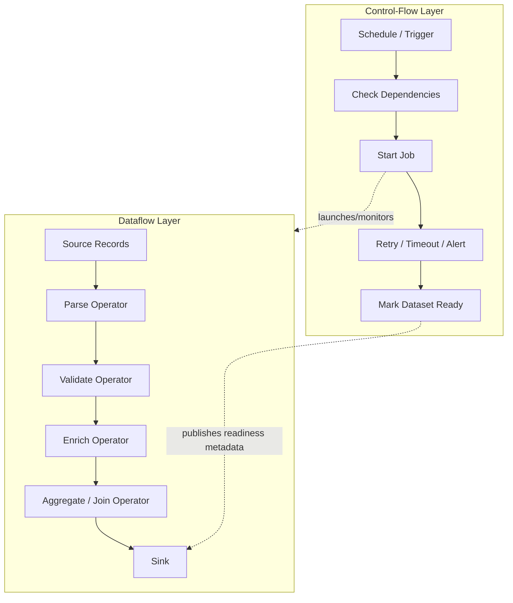

Control-flow boleh meluncurkan dataflow. Control-flow boleh memonitor dataflow. Control-flow boleh menandai dataset siap.

Tetapi control-flow tidak otomatis memahami record-level correctness.

---

## 4. Mengapa Ini Penting di Sistem Java

Java engineer sering membangun pipeline dalam beberapa bentuk:

1. Aplikasi Spring Boot consumer membaca Kafka dan menulis database.
2. Flink Java job melakukan stream processing.
3. Beam Java pipeline dijalankan di runner tertentu.
4. Spark Java job untuk batch transform.
5. CLI Java dijalankan Airflow/Kubernetes.
6. Temporal workflow memanggil activity Java untuk export/import.
7. Scheduler internal menjalankan task pipeline.

Kesalahan umum:

- semua dianggap “job”; 
- semua retry dianggap sama;
- semua dependency dianggap `task A >> task B`;
- semua success dianggap data valid;
- offset/checkpoint disamakan dengan DAG status;
- record-level failure disembunyikan sebagai task failure;
- task retry menyebabkan side effect duplikat;
- scheduler dipakai sebagai dedupe mechanism.

Di produksi, model yang salah menghasilkan runbook yang salah.

---

## 5. Unit Semantics: Job, Task, Operator, Record

Bahasa harus presisi.

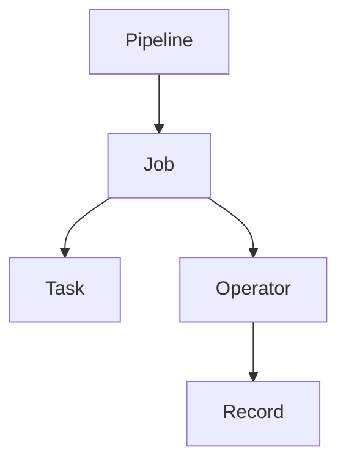

Namun mapping-nya tergantung konteks.

### Pipeline

End-to-end movement/transformation dari source ke output.

Contoh:

```text
case-events -> SLA breach detection -> escalation-events + dashboard projection
```

### Job

Eksekusi pipeline atau bagian pipeline pada runtime tertentu.

Contoh:

- Flink job continuous;
- Spark batch job;
- Java CLI job;
- Kafka Streams application;
- Beam pipeline execution.

### Task

Unit kerja orchestration/control-flow.

Contoh Airflow tasks:

- run Java jar;
- wait for S3 prefix;
- validate row count;
- publish dataset marker;
- trigger downstream DAG.

### Operator

Unit transform dalam dataflow.

Contoh:

- map;
- filter;
- flatMap;
- join;
- aggregate;
- window;
- dedupe;
- enrich;
- sink writer.

### Record

Unit data yang melewati operator.

Kesalahan fatal: membuat satu Airflow task per record. Itu bukan skala yang tepat. Scheduler bukan stream processor.

---

## 6. Data Dependency vs Execution Dependency

### Data Dependency

Output B membutuhkan data dari A.

```text
customer_enriched_orders depends on customers and orders
```

### Execution Dependency

Task B harus dijalankan setelah task A.

```text
run transform after extraction finishes
```

Keduanya sering berhubungan, tetapi tidak identik.

Contoh:

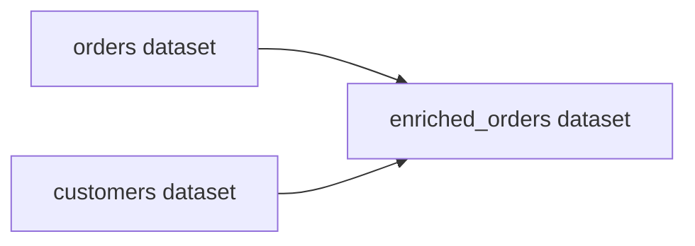

Itu data dependency.

Control-flow-nya bisa berbeda:

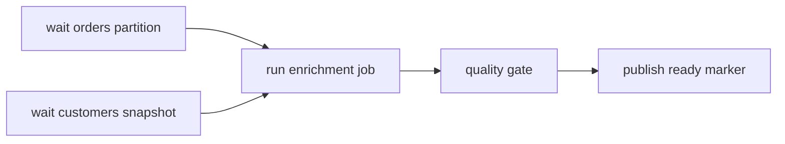

Data dependency menjelaskan kebenaran output. Execution dependency menjelaskan cara menjalankan pekerjaan.

Pipeline yang matang melacak keduanya.

---

## 7. DAG Tidak Selalu Dataflow

Airflow DAG adalah dependency graph task. Ia bukan record-level dataflow graph.

Contoh DAG:

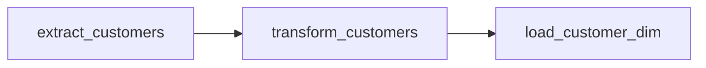

DAG ini tidak menjelaskan:

- schema record;
- transformation logic;
- dedupe rule;
- late data policy;
- event-time semantics;
- checkpoint;
- key partitioning;
- windowing;
- state store;
- idempotency sink.

Sebaliknya, Flink graph/Kafka Streams topology menjelaskan operator dataflow, tetapi tidak selalu menjelaskan:

- kapan deployment dilakukan;
- siapa approve backfill;
- dependency antar dataset eksternal;
- release calendar;
- manual remediation workflow;
- cross-pipeline business process.

Masing-masing punya tempat.

---

## 8. Stream Graph vs Workflow DAG

### Stream Graph

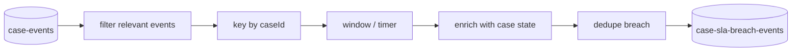

Karakteristik:

- berjalan terus;
- memproses record individual;
- punya state;
- perlu checkpoint;
- ordering dan event-time penting;
- failure recovery harus menjaga state consistency;
- scale via partition/key/operator parallelism.

### Workflow DAG

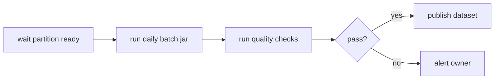

Karakteristik:

- mengatur langkah pekerjaan;
- task biasanya coarse-grained;
- retry task-level;
- state workflow berupa status task dan metadata;
- cocok untuk scheduled batch, dependency, approval, remediation;
- bukan untuk record-level processing.

---

## 9. Operator vs Task: Failure Semantics Berbeda

### Operator Failure

Contoh operator `parseCaseEvent` gagal pada satu record.

Pilihan:

- fail seluruh job;
- skip record;
- route ke DLQ;
- quarantine dataset partition;
- apply fallback parser;
- emit quality event.

Failure ini membutuhkan keputusan data semantics.

### Task Failure

Contoh Airflow task `run_case_transform_jar` exit code 1.

Pilihan:

- retry task;
- mark failed;
- trigger alert;
- skip downstream;
- run cleanup;
- wait manual intervention.

Failure ini membutuhkan keputusan orchestration semantics.

### Kenapa Tidak Sama

Jika satu bad record membuat Java jar exit, Airflow hanya tahu task gagal. Ia tidak tahu apakah:

- satu record invalid;
- sink unavailable;
- source missing;
- schema incompatible;
- transform bug;
- duplicate key;
- out-of-memory;
- permission denied.

Karena itu, dataflow harus melaporkan failure secara structured, bukan hanya exit code.

Contoh structured failure output:

```json
{
  "pipelineId": "case-sla-pipeline",
  "runId": "2026-07-04T00:00:00Z",
  "status": "FAILED_QUALITY_GATE",
  "inputRecords": 1000000,
  "validRecords": 999100,
  "invalidRecords": 900,
  "invalidRate": 0.0009,
  "threshold": 0.0005,
  "failureClass": "DATA_QUALITY",
  "sampleInvalidRecordIds": ["r-12", "r-98", "r-101"]
}
```

Control-flow bisa mengambil keputusan lebih baik berdasarkan status ini.

---

## 10. Control-Flow yang Baik Tidak Menyembunyikan Data Semantics

Control-flow harus menjalankan dan mengoordinasikan, bukan menebak correctness.

Buruk:

```text
if task exit code == 0, publish dataset
```

Lebih baik:

```text
if task exit code == 0
and quality report passed
and reconciliation passed
and output manifest complete
and lineage emitted
then publish dataset
```

Dalam bentuk diagram:

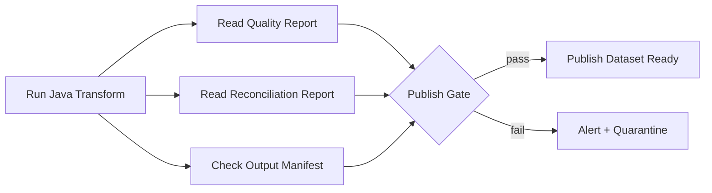

Dataset readiness harus berdasarkan evidence, bukan sekadar task success.

---

## 11. Java Design: Pisahkan Runner, Transform, Orchestrator Adapter

Struktur yang disarankan:

```text
pipeline-core/
  RecordEnvelope
  Transform
  Validator
  SinkWriter
  Checkpoint

pipeline-job/
  Main.java
  ConfigLoader
  JobRunner
  QualityReportWriter
  ManifestWriter

orchestration/
  airflow-dag.py
  temporal-workflow/
  k8s-cronjob.yaml
```

Java transform tidak boleh tahu detail Airflow. Airflow tidak boleh tahu detail business transform per record.

### Interface Core

```java
public interface DataTransform<I, O> {
    O apply(I input, TransformContext context);
}
```

### Job Runner

```java
public final class BatchJobRunner<I, O> {
    private final SourceReader<I> source;
    private final DataTransform<I, O> transform;
    private final SinkWriter<O> sink;
    private final QualityReporter qualityReporter;
    private final ManifestWriter manifestWriter;

    public JobResult run(JobConfig config) {
        JobMetrics metrics = new JobMetrics();

        try (RecordCursor<I> cursor = source.open(config.input())) {
            while (cursor.hasNext()) {
                I input = cursor.next();
                O output = transform.apply(input, config.transformContext());
                sink.write(output);
                metrics.incrementProcessed();
            }

            sink.commit();
            QualityReport quality = qualityReporter.write(metrics);
            OutputManifest manifest = manifestWriter.write(sink.outputDescriptor());

            return JobResult.success(quality, manifest);
        } catch (Exception e) {
            return JobResult.failure(e, metrics.snapshot());
        }
    }
}
```

### Orchestrator Adapter

Orchestrator cukup memanggil job dan membaca result artifact.

```bash
java -jar case-transform.jar \
  --input s3://landing/cases/dt=2026-07-04/ \
  --output s3://silver/cases/dt=2026-07-04/ \
  --run-id scheduled__2026-07-04
```

Output artifact:

```text
/_quality/report.json
/_manifest/manifest.json
/_lineage/openlineage.json
/_run/result.json
```

Airflow/Temporal/Kubernetes membaca artifact itu untuk keputusan lanjutan.

---

## 12. Model Layering Production-Grade

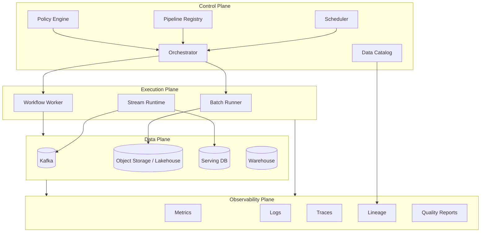

Key separation:

- **Control plane**: metadata, schedule, policy, orchestration.
- **Execution plane**: actual compute.
- **Data plane**: storage/log/sink/source.
- **Observability plane**: evidence, metrics, lineage, quality.

Platform yang matang tidak menaruh semua tanggung jawab dalam satu Airflow DAG atau satu Java service.

---

## 13. Continuous vs Scheduled Execution

### Scheduled Batch

```text
Every day 01:00 -> process yesterday partition
```

Cocok untuk:

- report harian;
- cost-sensitive workload;
- source hanya tersedia periodik;
- large historical aggregation;
- regulatory reporting dengan cutoff.

Risiko:

- late data;
- rerun complexity;
- long feedback loop;
- hidden partial output;
- dependency miss.

### Continuous Streaming

```text
For every event -> process now
```

Cocok untuk:

- alerting;
- fraud/risk detection;
- operational projection;
- low-latency enrichment;
- CDC-driven sync.

Risiko:

- state growth;
- checkpoint tuning;
- poison record blocking;
- rebalancing;
- sink backpressure;
- semantic complexity around time.

### Micro-Batch

```text
Every N seconds/minutes -> process newly arrived data
```

Cocok untuk:

- near-real-time analytics;
- systems where sink prefers batches;
- easier operational model than pure streaming;
- incremental lakehouse writes.

Risiko:

- ambiguous semantics;
- small-file problem;
- duplicate batch writes;
- watermark/cutoff confusion.

---

## 14. Choosing the Right Model

| Requirement | Better Fit | Why |
|---|---|---|
| Record-level low latency | Dataflow stream | Needs continuous processing |
| Daily report after all sources ready | Control-flow DAG + batch dataflow | Needs dependency orchestration |
| Long-running business workflow with compensation | Durable workflow | Needs stateful control-flow |
| Stateful event-time windowing | Flink/Beam/Kafka Streams | Needs time/state semantics |
| Simple file movement with validation | Batch job + orchestrator | Coarse-grained task enough |
| Backfill 3 years of history | Batch/lakehouse engine | Throughput and partition control |
| External API polling | Control-flow + ingestion state | Cursor/rate-limit/retry control |
| CDC projection | Stream dataflow | Change events continuous |
| Human approval before publish | Workflow/control-flow | Human step is not data operator |

Rule sederhana:

> Jika keputusan dibuat per record/event, pikirkan dataflow. Jika keputusan dibuat per job/run/task/human step, pikirkan control-flow.

---

## 15. Hybrid Pattern: Orchestrated Dataflow

Banyak pipeline produksi adalah hybrid.

Contoh batch:

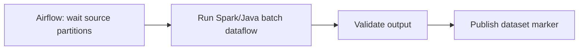

Contoh streaming:

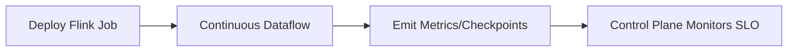

Contoh CDC + backfill:

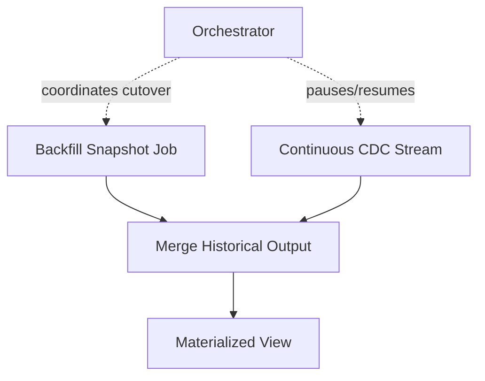

Kuncinya: orchestration mengatur lifecycle, dataflow menjaga record semantics.

---

## 16. Workflow Engine vs Stream Processor

Temporal dan Flink sama-sama stateful, tetapi state yang disimpan berbeda.

### Workflow Engine State

- status workflow;
- activity attempts;
- timers;
- signals;
- compensation path;
- human/external wait;
- deterministic workflow history.

### Stream Processor State

- keyed aggregation;
- window state;
- dedupe state;
- join state;
- timer per key;
- operator snapshot;
- watermark progress.

Jangan gunakan workflow engine untuk menghitung jutaan record per detik. Jangan gunakan stream processor untuk model approval multi-hari dengan human signal dan compensation kompleks.

---

## 17. Example: SLA Breach Detection

### Salah: Semua di Airflow

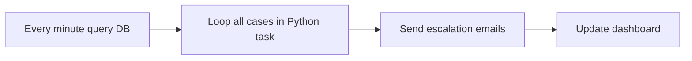

Masalah:

- task retry bisa mengirim email ulang;
- per-record state tidak jelas;
- query DB berat;
- no event-time model;
- difficult dedupe;
- Airflow scheduler jadi processing engine;
- audit trail lemah.

### Lebih Baik: Dataflow + Control-Flow Terpisah

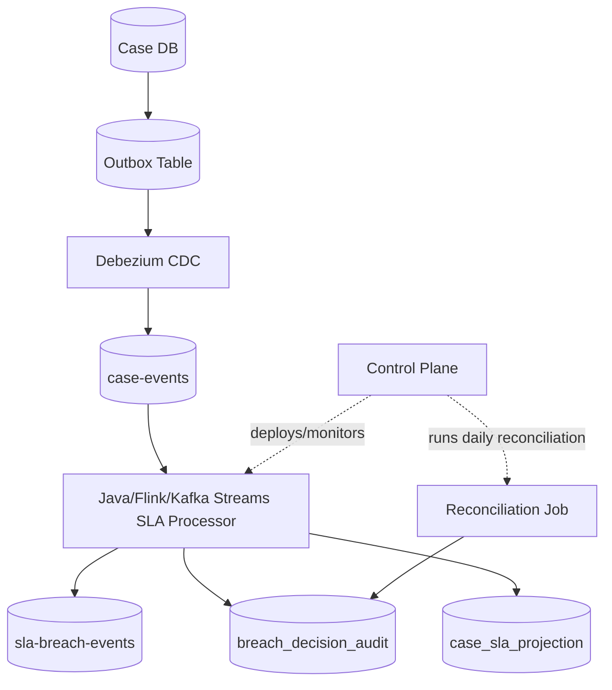

Dataflow menangani event-level correctness. Control-flow menangani deployment, reconciliation, backfill, monitoring, dan operational routines.

---

## 18. Example: Regulatory Daily Report

### Dataflow

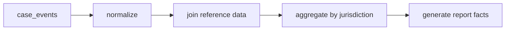

### Control-flow

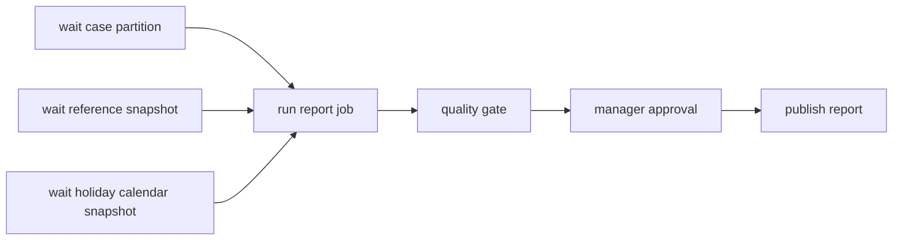

Di sini, manager approval bukan operator dataflow. Ia bagian control-flow.

Reference snapshot bukan sekadar dependency task. Ia bagian data correctness karena transform harus tahu versi reference data yang digunakan.

---

## 19. Common Design Smells

### 19.1 One Giant DAG Does Everything

Gejala:

- DAG berisi ratusan task;
- transform logic tersebar di operator Python/Bash;
- tidak ada library Java reusable;
- sulit test lokal;
- rerun subset berbahaya;
- data contract tidak jelas.

Perbaikan:

- pindahkan transform ke versioned Java job/library;
- DAG hanya orchestrate;
- outputkan manifest, quality report, lineage;
- gunakan dataset/asset boundary.

### 19.2 Stream Processor with Hidden Workflow Logic

Gejala:

- Flink job menunggu human approval;
- Kafka consumer menyimpan banyak status workflow multi-hari;
- retry bisnis bercampur retry teknis;
- timer digunakan untuk semua jenis business process.

Perbaikan:

- pisahkan event derivation dari workflow decision;
- gunakan workflow engine untuk long-running process;
- stream processor emit decision events.

### 19.3 Scheduler as Data Quality Engine

Gejala:

- Airflow task `check_data` berisi logic kompleks;
- quality result tidak disimpan sebagai dataset;
- tidak ada sample failed records;
- downstream hanya tahu pass/fail.

Perbaikan:

- quality check hasilkan structured report;
- simpan failed records/quarantine;
- publish metrics dan lineage;
- jadikan quality gate sebagai policy, bukan script tersembunyi.

### 19.4 Job Retry as Idempotency Strategy

Gejala:

- “Kalau gagal, retry saja.”
- Tidak ada idempotency key.
- Sink append-only tanpa run ID.
- External side effect bisa berulang.

Perbaikan:

- desain idempotent write;
- staging + atomic publish;
- run ID;
- output partition overwrite terkontrol;
- side-effect isolation.

---

## 20. Design Pattern: Dataflow Emits Evidence, Control-Flow Acts on Evidence

Pattern ini sangat kuat.

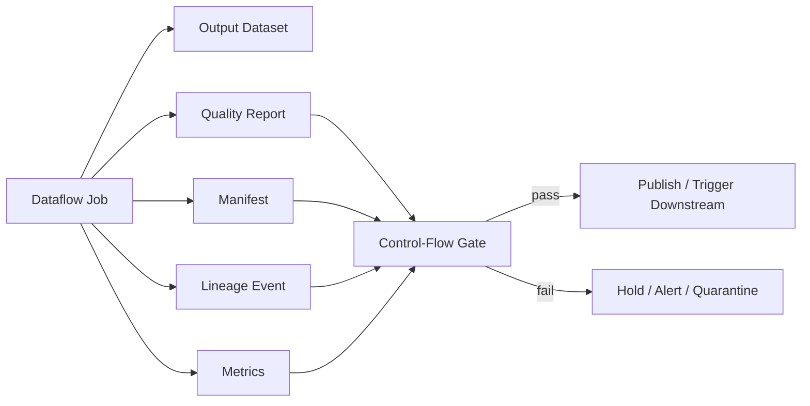

Dataflow tidak hanya menghasilkan data. Ia menghasilkan evidence.

Control-flow tidak hanya melihat exit code. Ia membaca evidence.

### Java Result Model

```java
public record PipelineRunResult(
    String pipelineId,
    String runId,
    RunStatus status,
    OutputManifest manifest,
    QualityReport qualityReport,
    LineageReport lineageReport,
    Map<String, MetricValue> metrics,
    Optional<FailureSummary> failure
) {}

public enum RunStatus {
    SUCCESS,
    SUCCESS_WITH_WARNINGS,
    FAILED_INPUT_CONTRACT,
    FAILED_QUALITY_GATE,
    FAILED_SINK_WRITE,
    FAILED_INTERNAL_ERROR
}
```

Control-flow layer bisa membuat policy:

```java
public final class PublishPolicy {
    public PublishDecision evaluate(PipelineRunResult result) {
        if (result.status() != RunStatus.SUCCESS) {
            return PublishDecision.hold("run did not succeed");
        }
        if (!result.qualityReport().passed()) {
            return PublishDecision.hold("quality gate failed");
        }
        if (!result.manifest().complete()) {
            return PublishDecision.hold("manifest incomplete");
        }
        return PublishDecision.publish();
    }
}
```

Ini jauh lebih defensible daripada `exit 0`.

---

## 21. Granularity: Seberapa Besar Satu Task?

Task terlalu besar:

```text
run_everything
```

Masalah:

- failure tidak jelas;
- rerun mahal;
- observability buruk;
- dependency tidak eksplisit.

Task terlalu kecil:

```text
process_record_1
process_record_2
process_record_3
...
```

Masalah:

- scheduler overload;
- overhead besar;
- retry semantics kacau;
- record-level state hilang.

Granularity yang baik:

- task mewakili boundary operasional;
- dataflow engine menangani record-level work;
- task menghasilkan artifact/evidence;
- task bisa di-rerun secara aman;
- task punya owner dan runbook.

Contoh task boundary yang baik:

- `extract_case_snapshot_partition`;
- `run_case_normalization_job`;
- `validate_case_silver_partition`;
- `publish_case_silver_dataset`;
- `run_daily_reconciliation`.

---

## 22. Dependency Graph untuk Dataset, Bukan Hanya Job

Pipeline matang melacak dataset graph.

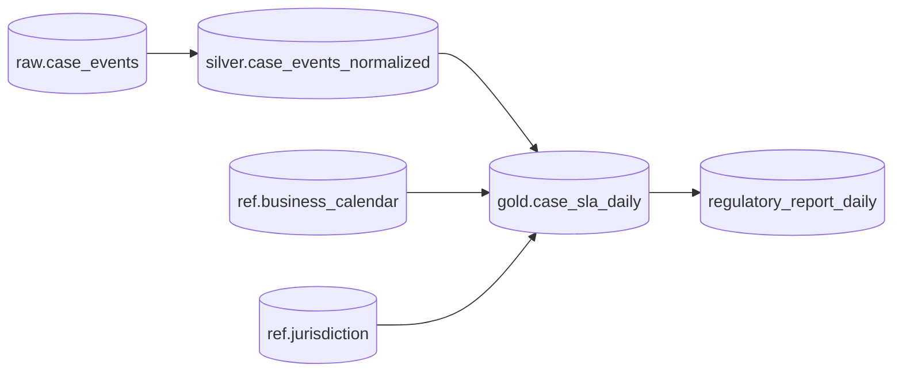

Job graph bisa berubah, tetapi dataset graph lebih stabil.

Kenapa penting:

- impact analysis schema change;
- lineage;
- rerun scope;
- freshness propagation;
- access governance;
- ownership;
- deprecation;
- compliance evidence.

Control-flow yang hanya tahu task dependency tidak cukup untuk menjawab “dataset apa terdampak jika field `jurisdiction_code` berubah?”

---

## 23. Control-Flow State vs Data State

### Control-Flow State

```json
{
  "dagRunId": "scheduled__2026-07-04",
  "task": "run_case_report",
  "status": "success",
  "attempt": 2,
  "startedAt": "2026-07-04T01:00:00Z",
  "endedAt": "2026-07-04T01:08:00Z"
}
```

### Data State

```json
{
  "dataset": "gold.case_sla_daily",
  "partition": "dt=2026-07-03",
  "inputEventMaxTime": "2026-07-03T23:59:59Z",
  "sourceOffsetRange": {
    "case-events-0": [1200, 1999],
    "case-events-1": [2200, 2999]
  },
  "recordCount": 438992,
  "checksum": "...",
  "qualityStatus": "passed"
}
```

Task success tanpa data state tidak cukup. Data state tanpa control-flow state juga sulit dioperasikan.

Production platform butuh keduanya.

---

## 24. Failure Propagation

Control-flow failure propagation:

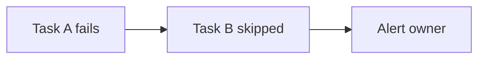

Dataflow failure propagation:

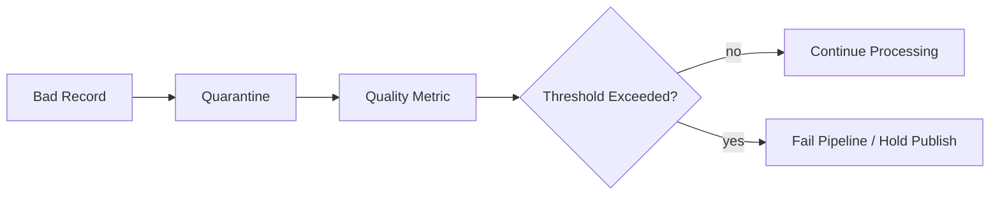

Kedua propagation model harus dirancang.

Pertanyaan design:

- Apakah satu bad record menghentikan semua pipeline?
- Apakah 0.01% invalid masih acceptable?
- Apakah invalid record boleh ditunda?
- Apakah downstream boleh menerima partial output?
- Apakah output publish harus atomic?
- Apakah old output tetap dipakai saat new run gagal?

---

## 25. Atomic Publish Pattern untuk Batch Dataflow

Masalah: job menulis output parsial lalu gagal. Downstream membaca data setengah jadi.

Pattern:

```mermaid
flowchart LR
    A[Write to staging path/table] --> B[Validate]
    B --> C{Pass?}
    C -->|yes| D[Atomic publish marker / swap]
    C -->|no| E[Keep staging quarantined]
    D --> F[Downstream reads only published version]
```

Contoh path:

```text
s3://lake/gold/case_sla_daily/_staging/run_id=abc123/...
s3://lake/gold/case_sla_daily/dt=2026-07-03/...
s3://lake/gold/case_sla_daily/_published/dt=2026-07-03.json
```

Control-flow melakukan publish hanya setelah dataflow menghasilkan manifest dan quality report valid.

---

## 26. Continuous Publish Pattern untuk Streaming

Streaming tidak punya “job selesai” natural. Jadi readiness berbeda.

```mermaid
flowchart LR
    K[(Kafka Input)] --> SP[Stream Processor]
    SP --> SINK[(Projection)]
    SP --> MET[Metrics]
    SP --> CKPT[Checkpoints]
    MET --> SLO[SLO Monitor]
    CKPT --> SLO
    SLO --> ALERT[Alert / Auto-remediation]
```

Untuk streaming, control-flow tidak menunggu selesai. Ia memonitor:

- consumer lag;
- watermark delay;
- checkpoint duration/failure;
- processing latency;
- error rate;
- DLQ rate;
- sink write latency;
- state size;
- restart count.

Readiness bisa berarti:

- job running;
- caught up within lag threshold;
- checkpoint healthy;
- output freshness within SLO;
- DLQ below threshold.

---

## 27. Backfill: Tempat Dataflow dan Control-Flow Bertemu

Backfill adalah operasi control-flow yang menjalankan dataflow historis.

```mermaid
flowchart TB
    PLAN[Backfill Plan] --> SPLIT[Split by partitions/time ranges]
    SPLIT --> RUN1[Run dataflow partition 1]
    SPLIT --> RUN2[Run dataflow partition 2]
    SPLIT --> RUN3[Run dataflow partition 3]
    RUN1 --> VALIDATE[Validate all outputs]
    RUN2 --> VALIDATE
    RUN3 --> VALIDATE
    VALIDATE --> CUTOVER[Cutover / Publish]
```

Backfill yang benar perlu:

- immutable input atau snapshot;
- transform version pinning;
- isolated output path/table;
- idempotent writes;
- progress tracking;
- retry per partition;
- validation before cutover;
- lineage marking bahwa output berasal dari backfill run.

Jangan menjalankan backfill dengan path yang sama seperti streaming tanpa strategi merge/cutover.

---

## 28. Control-Flow Retry vs Dataflow Retry

### Control-Flow Retry

Retry seluruh task/job.

Cocok untuk:

- transient infrastructure failure;
- temporary sink outage;
- network failure;
- container preemption.

Berbahaya jika:

- task punya side effect non-idempotent;
- output parsial tidak dibersihkan;
- source cursor sudah maju;
- external API mutation sudah terjadi.

### Dataflow Retry

Retry record/batch/operator-level operation.

Cocok untuk:

- transient sink write;
- API enrichment timeout;
- temporary serialization issue? biasanya tidak;
- throttled request.

Berbahaya jika:

- retry tidak punya budget;
- poison record ikut di-retry selamanya;
- ordering tertahan;
- thread pool habis;
- retry storm ke downstream.

Design bagus punya dua level retry dengan batas jelas.

---

## 29. Where to Put Business Logic?

Rule:

> Business transformation logic harus berada di dataflow code yang versioned, tested, observable, dan replayable. Control-flow hanya memilih kapan dan versi mana dijalankan.

Buruk:

```python
# Airflow task
if case['priority'] == 'HIGH' and overdue(case):
    send_escalation(case)
```

Lebih baik:

```java
public final class SlaBreachRule implements DataTransform<CaseEvent, Optional<SlaBreachEvent>> {
    @Override
    public Optional<SlaBreachEvent> apply(CaseEvent event, TransformContext ctx) {
        SlaPolicy policy = ctx.referenceData().slaPolicyFor(event.caseType());
        return policy.evaluate(event, ctx.clock()).toEventIfBreached();
    }
}
```

Lalu orchestration:

```text
run sla-breach-job --rule-version 2026.07.0 --reference-snapshot ref-891
```

Dengan ini, rule bisa diuji, direplay, dan diaudit.

---

## 30. Dataflow Contract untuk Control-Flow

Setiap Java dataflow job yang dijalankan orchestrator sebaiknya punya contract CLI/API.

Input:

```yaml
pipelineId: case-normalization
runId: scheduled__2026-07-04
input:
  dataset: raw.case_events
  partition: dt=2026-07-03
output:
  dataset: silver.case_events_normalized
  mode: staging
transform:
  version: 1.8.2
quality:
  profile: strict
```

Output:

```yaml
status: SUCCESS
outputManifest: s3://.../_manifest.json
qualityReport: s3://.../_quality.json
lineageEvent: s3://.../_lineage.json
metrics:
  inputRecords: 1000000
  outputRecords: 999980
  invalidRecords: 20
  durationSeconds: 412
```

Exit code tetap digunakan, tetapi bukan satu-satunya signal.

---

## 31. Mermaid Model: Complete Interaction

```mermaid
sequenceDiagram
    autonumber
    participant CF as Control-Flow Orchestrator
    participant REG as Pipeline Registry
    participant JOB as Java Dataflow Job
    participant SRC as Source Dataset
    participant SINK as Staging Output
    participant OBS as Observability/Lineage
    participant CAT as Catalog

    CF->>REG: resolve pipeline version + policy
    CF->>JOB: start run with input/output/runId
    JOB->>SRC: read partition / stream range
    JOB->>JOB: transform + validate + reconcile
    JOB->>SINK: write staging output
    JOB->>OBS: emit metrics + lineage + quality
    JOB-->>CF: structured run result
    CF->>CF: evaluate publish policy
    alt pass
        CF->>CAT: mark dataset version ready
        CF->>SINK: publish / commit marker
    else fail
        CF->>CAT: mark failed version
        CF->>OBS: alert owner
    end
```

Ini model produksi yang jauh lebih kuat daripada `task A >> task B`.

---

## 32. Testing Implication

### Dataflow Tests

Test:

- transform correctness;
- schema compatibility;
- dedupe;
- late events;
- out-of-order events;
- idempotent sink;
- replay determinism;
- state migration;
- quality rule behavior.

### Control-Flow Tests

Test:

- dependency resolution;
- retry policy;
- timeout;
- failure branch;
- publish gate;
- parameter rendering;
- backfill partition planning;
- alert routing;
- manual approval path.

Jangan test Airflow DAG untuk membuktikan business transform benar. Jangan test Flink operator untuk membuktikan approval workflow benar.

---

## 33. Observability Implication

### Dataflow Metrics

- records in/out;
- invalid records;
- duplicate records;
- processing latency;
- event-time lag;
- watermark delay;
- checkpoint duration;
- state size;
- sink latency;
- DLQ rate;
- join miss rate;
- reconciliation delta.

### Control-Flow Metrics

- task duration;
- retries;
- queue delay;
- schedule delay;
- dependency wait time;
- success/failure count;
- SLA miss per run;
- manual intervention time.

Observability harus memisahkan dua layer. Kalau tidak, dashboard pipeline akan misleading.

---

## 34. Review Checklist: Dataflow vs Control-Flow

Gunakan checklist ini saat membaca desain pipeline.

### Dataflow Clarity

- Apa source record-nya?
- Apa output record/state-nya?
- Apa transform operator utamanya?
- Stateful atau stateless?
- Keying strategy apa?
- Time model apa?
- Late data policy apa?
- Dedupe rule apa?
- Sink idempotent?
- Checkpoint/offset di mana?

### Control-Flow Clarity

- Apa trigger-nya?
- Apa task boundary-nya?
- Apa dependency-nya?
- Apa retry policy-nya?
- Apa timeout-nya?
- Apa publish gate-nya?
- Apa failure branch-nya?
- Apa backfill/rerun strategy-nya?
- Apa owner dan alert route-nya?

### Boundary Between Them

- Apakah business logic tersembunyi di orchestrator?
- Apakah scheduler melakukan record-level processing?
- Apakah dataflow menghasilkan structured run result?
- Apakah control-flow membaca quality/manifest/lineage?
- Apakah retry task aman terhadap side effect?
- Apakah streaming job dimonitor sebagai continuous system, bukan task selesai?

---

## 35. Practical Decision Matrix

| Scenario | Dataflow Responsibility | Control-Flow Responsibility |
|---|---|---|
| Kafka event enrichment | parse, validate, lookup, emit enriched event | deploy, monitor SLO, restart policy |
| Daily warehouse load | transform partition, write staging, quality report | schedule, wait dependencies, publish gate |
| CDC projection | consume changes, order per key, update projection | deploy, monitor lag, coordinate backfill |
| Regulatory report | aggregate facts, produce report dataset | cutoff schedule, approval, publish report |
| Backfill | deterministic transform per range | plan ranges, parallelize, validate, cutover |
| Data quality failure | classify invalid records, produce report | block publish, alert owner, open incident |
| Schema migration | support compatible readers/writers | coordinate rollout and downstream readiness |

---

## 36. Small Java Example: Structured Result Artifact

```java
public final class JobMain {
    public static void main(String[] args) {
        JobConfig config = JobConfig.parse(args);
        PipelineRunResult result;

        try {
            result = new CaseNormalizationJob(config).run();
        } catch (Exception e) {
            result = PipelineRunResult.internalFailure(config.pipelineId(), config.runId(), e);
        }

        ResultArtifactWriter.write(config.resultPath(), result);

        if (!result.isSuccessfulForOrchestrator()) {
            System.exit(2);
        }
    }
}
```

`isSuccessfulForOrchestrator()` tidak harus sama dengan “semua record valid”. Bisa ada status `SUCCESS_WITH_WARNINGS` yang masih publishable jika threshold terpenuhi.

```java
public boolean isSuccessfulForOrchestrator() {
    return switch (status) {
        case SUCCESS -> true;
        case SUCCESS_WITH_WARNINGS -> qualityReport.publishable();
        default -> false;
    };
}
```

Orchestrator membaca artifact untuk detail, bukan parsing log.

---

## 37. Anti-Corruption Boundary Antara Orchestrator dan Job

Jangan biarkan orchestrator tahu terlalu banyak detail internal job.

Buruk:

```python
# DAG tahu struktur row dan business rule
if row['case_status'] == 'OPEN' and row['sla_due_at'] < now:
    ...
```

Baik:

```text
DAG passes:
- input dataset
- output target
- run id
- transform version
- policy profile

Job returns:
- status
- manifest
- quality report
- lineage
- metrics
```

Ini mirip anti-corruption layer di domain-driven design: orchestrator bicara dalam contract operasional, job bicara dalam semantics data.

---

## 38. Apa yang Harus Disimpan Setelah Run?

Minimal artifact:

```text
_run/result.json
_manifest/output-manifest.json
_quality/quality-report.json
_lineage/lineage-event.json
_metrics/metrics.json
_logs/application.log reference
_config/effective-config.json
```

Kenapa `effective-config` penting?

Karena config runtime sering berasal dari banyak tempat:

- default;
- environment variable;
- CLI args;
- config server;
- feature flag;
- secret reference;
- orchestrator parameter.

Tanpa effective config, replay sering tidak identik.

---

## 39. Mental Model Ringkas

```mermaid
flowchart TB
    Q1{Is the question about records/events/state?}
    Q2{Is the question about jobs/tasks/schedules?}

    Q1 -->|yes| DF[Dataflow Model]
    Q2 -->|yes| CF[Control-Flow Model]

    DF --> DFC[Correctness: ordering, time, state, idempotency]
    CF --> CFC[Operations: trigger, retry, dependency, publish]

    DFC --> HYB[Production Pipeline]
    CFC --> HYB
```

Kalimat yang harus diingat:

> Dataflow menjaga kebenaran data. Control-flow menjaga kebenaran eksekusi. Production pipeline butuh keduanya, tetapi gagal jika tanggung jawabnya dicampur sembarangan.

---

## 40. Checklist Part 002

Sebelum lanjut ke Part 003, pastikan bisa menjelaskan:

- Perbedaan dataflow dan control-flow.
- Perbedaan DAG task dan stream/dataflow operator.
- Mengapa Airflow DAG success tidak membuktikan data correctness.
- Mengapa stream processor bukan workflow engine.
- Apa bedanya data dependency dan execution dependency.
- Mengapa dataflow harus mengeluarkan evidence artifact.
- Mengapa control-flow harus membuat publish decision berdasarkan quality/manifest/lineage.
- Bagaimana memisahkan Java transform code, job runner, dan orchestrator adapter.
- Bagaimana retry task-level berbeda dari retry record-level.
- Bagaimana backfill mempertemukan dataflow dan control-flow.

---

## 41. Referensi Resmi yang Relevan

- Apache Airflow DAGs — DAG as task dependency/control-flow model: https://airflow.apache.org/docs/apache-airflow/stable/core-concepts/dags.html
- Apache Beam Programming Guide — `Pipeline`, `PCollection`, `PTransform`, runner-based data processing model: https://beam.apache.org/documentation/programming-guide/
- Apache Flink Overview — stateful computation over bounded and unbounded data streams: https://flink.apache.org/
- Apache Kafka Introduction — event streaming, durable logs, topics, partitions, Streams API: https://kafka.apache.org/intro/

---

## 42. Apa yang Berikutnya

Part 003 akan masuk ke **pipeline invariants**.

Kita akan membahas completeness, correctness, freshness, idempotency, replayability, determinism, auditability, and recoverability sebagai properti formal yang harus dirancang, bukan sekadar harapan.
