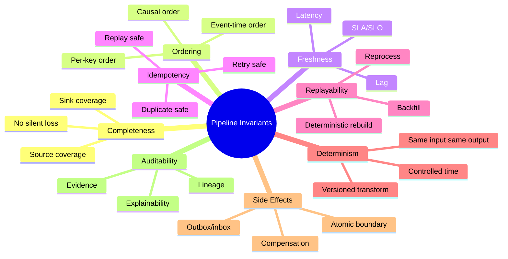
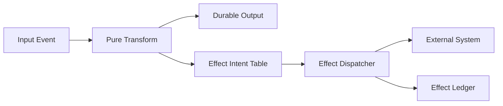
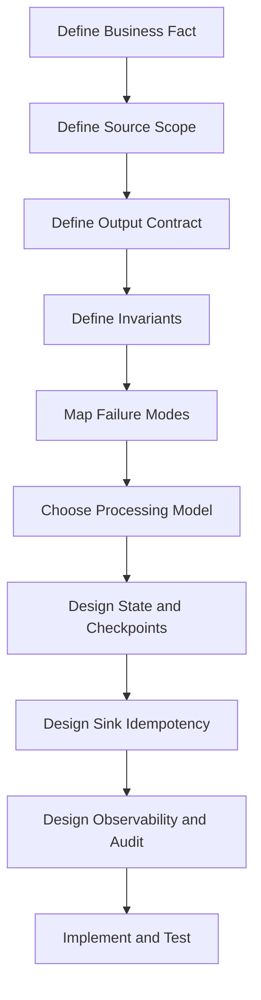

# Part 003 — Pipeline Invariants

> Pipeline yang reliable bukan pipeline yang “tidak pernah error”. Pipeline yang reliable adalah pipeline yang punya **invariant eksplisit**: aturan kebenaran yang tetap dijaga walaupun data terlambat, source berubah, worker restart, job di-retry, sink timeout, atau operator manusia melakukan backfill.

Bagian ini adalah fondasi desain. Kita tidak akan mulai dari tool, karena Kafka, Flink, Spark, Beam, Debezium, Airflow, Temporal, database, dan object storage semuanya hanya cara implementasi. Yang lebih fundamental adalah pertanyaan:

> Dalam kondisi gagal, apa yang tetap harus benar?

Itulah invariant.

Di production-grade data pipeline, invariant lebih penting daripada “best practice”. Best practice sering berubah tergantung stack. Invariant adalah kontrak kebenaran yang bisa kamu bawa lintas stack.

---

## 1. Mengapa Invariant Lebih Penting daripada Pattern

Pattern menjawab:

> Biasanya orang membangun pipeline seperti apa?

Invariant menjawab:

> Properti apa yang tidak boleh rusak?

Contoh sederhana:

```text
Source DB -> Kafka -> Stream Processor -> Reporting Table
```

Pattern yang terlihat:

- CDC ingestion
- Kafka topic
- stream processing
- materialized view
- reporting sink

Namun invariant yang sebenarnya menentukan kualitas sistem:

- setiap perubahan penting dari source harus masuk ke Kafka;
- event untuk entity yang sama harus diproses dalam urutan yang dapat dijelaskan;
- duplicate event tidak boleh menggandakan saldo, hitungan, atau status;
- transformasi harus bisa diulang tanpa hasil yang berubah secara liar;
- output harus punya jejak lineage ke input;
- jika pipeline gagal di tengah, recovery tidak boleh menghasilkan state yang mustahil;
- jika source mengirim koreksi, hasil downstream harus punya strategi koreksi.

Top engineer tidak hanya berkata, “pakai Kafka biar reliable”. Ia bertanya:

> Reliable terhadap invariant yang mana?

Kafka menyimpan event secara durable dan memberi model offset. Flink memberi stateful stream processing dan checkpoint. Beam memberi model bounded/unbounded dan event-time. Debezium membaca perubahan database. Tetapi tidak ada tool yang otomatis menjawab seluruh invariant bisnismu.

---

## 2. Apa Itu Pipeline Invariant

Dalam konteks pipeline:

> Invariant adalah pernyataan kebenaran yang harus tetap berlaku pada seluruh lifecycle data, termasuk saat retry, replay, partial failure, late arrival, schema evolution, dan operasi manual.

Invariant harus bisa diuji, diobservasi, atau minimal diaudit. Kalau tidak bisa, ia masih berupa harapan.

Contoh invariant buruk:

```text
Pipeline harus cepat.
```

Terlalu kabur.

Contoh invariant yang lebih baik:

```text
Untuk setiap approved_case_event yang diterima sebelum watermark T,
reporting.case_status_current harus berisi status final terbaru untuk case_id tersebut
maksimal 5 menit setelah event diterima, kecuali event masuk quarantine karena gagal validasi kontrak.
```

Invariant ini punya beberapa dimensi:

- input yang dimaksud jelas;
- batas waktu jelas;
- output jelas;
- pengecualian jelas;
- bisa dimonitor;
- bisa diuji lewat replay.

---

## 3. Daftar Invariant Inti Pipeline

Seri ini memakai delapan invariant utama.



Kedelapannya:

1. **Completeness** — data yang seharusnya diproses benar-benar sampai dan tercakup.
2. **Ordering** — urutan yang penting bagi makna bisnis tidak rusak diam-diam.
3. **Freshness** — output cukup baru untuk use case-nya.
4. **Idempotency** — retry/duplicate/replay tidak menghasilkan efek ganda yang salah.
5. **Replayability** — pipeline bisa diulang untuk recovery, backfill, migrasi, atau audit.
6. **Determinism** — input dan versi logic yang sama menghasilkan output yang sama.
7. **Bounded side effects** — efek eksternal dikendalikan agar partial failure tidak merusak state.
8. **Auditability** — output bisa dijelaskan: dari mana asalnya, versi apa yang dipakai, kapan berubah.

Kedelapan invariant ini saling terkait. Contoh: replayability tanpa idempotency bisa merusak sink; freshness tanpa completeness bisa menghasilkan angka cepat tetapi salah; ordering tanpa watermark bisa salah saat late events.

---

## 4. Invariant #1 — Completeness

### 4.1 Makna Completeness

Completeness berarti:

> Semua input yang berada dalam scope pipeline tercakup dalam output atau punya status terminal yang eksplisit.

Status terminal bisa berupa:

- successfully processed;
- skipped by rule;
- quarantined;
- dead-lettered;
- superseded;
- ignored because out of scope;
- failed after retry budget exhausted.

Yang tidak boleh terjadi adalah **silent loss**.

Silent loss adalah kondisi paling berbahaya karena sistem tampak sehat, tetapi data hilang.

### 4.2 Contoh Completeness Invariant

Untuk pipeline ingestion file:

```text
Setiap file yang muncul di landing bucket dengan manifest valid harus berada pada salah satu status:
RECEIVED, VALIDATED, PROCESSED, QUARANTINED, atau FAILED_TERMINAL.
Tidak boleh ada file yang tidak tercatat di ingestion ledger lebih dari 2 menit setelah manifest diterima.
```

Untuk CDC pipeline:

```text
Setiap committed transaction dari source database yang mengubah tabel enforcement_case harus muncul sebagai event downstream atau tercatat sebagai skipped berdasarkan filter eksplisit.
```

Untuk API ingestion:

```text
Untuk setiap cursor window yang berhasil di-fetch, seluruh item di halaman tersebut harus dipersist sebagai raw record sebelum transformasi downstream dimulai.
```

### 4.3 Completeness vs Success Count

Banyak tim mengira completeness berarti jumlah sukses tinggi. Itu keliru.

```text
processed_success = 99.9%
```

Angka ini tidak menjawab:

- 0.1% yang gagal itu data apa?
- apakah ada source partition yang tidak terbaca?
- apakah ada page API yang ter-skip?
- apakah ada Kafka consumer group yang tertinggal?
- apakah ada file yang tidak terdeteksi?
- apakah output sink punya jumlah yang sesuai?

Completeness harus dilihat dari **coverage**.

```text
Completeness = scoped input - explicitly terminal records = 0 unknown records
```

Yang dikejar bukan “semua sukses”, tetapi “tidak ada unknown”.

### 4.4 Java Design: Processing Ledger

Untuk pipeline penting, buat ledger.

```java
public enum ProcessingStatus {
    RECEIVED,
    VALIDATED,
    PROCESSING,
    PROCESSED,
    QUARANTINED,
    FAILED_RETRYABLE,
    FAILED_TERMINAL,
    SKIPPED_OUT_OF_SCOPE
}

public record ProcessingLedgerEntry(
        String pipelineName,
        String runId,
        String sourceId,
        String recordKey,
        String inputFingerprint,
        ProcessingStatus status,
        int attempt,
        Instant firstSeenAt,
        Instant updatedAt,
        String errorCode,
        String errorMessage
) {}
```

Ledger bukan sekadar log. Log bersifat naratif. Ledger adalah state machine kecil untuk coverage.

Minimal ledger harus menjawab:

- record/file/batch mana yang masuk scope;
- status terakhirnya apa;
- berapa kali dicoba;
- error terminalnya apa;
- transform version mana yang memprosesnya;
- sink write id mana yang dibuat.

### 4.5 Failure Mode Completeness

| Failure | Gejala | Akar Masalah | Mitigasi |
|---|---|---|---|
| File dibaca saat belum selesai ditulis | record parse error acak | tidak ada atomic publish protocol | manifest atau atomic rename |
| API page ter-skip | jumlah downstream kurang | cursor disimpan sebelum page dipersist | persist raw page dulu, baru advance cursor |
| Kafka commit terlalu cepat | event hilang setelah crash | offset commit sebelum sink durable | commit setelah sink acknowledged |
| Filter diam-diam salah | data dianggap tidak ada | rule tidak diaudit | explicit skip ledger |
| CDC snapshot tidak konsisten | row hilang/duplikat | snapshot dan stream tidak disambung benar | snapshot+offset boundary yang jelas |

---

## 5. Invariant #2 — Ordering

### 5.1 Makna Ordering

Ordering berarti:

> Pipeline menjaga urutan yang diperlukan untuk mempertahankan makna data.

Tidak semua data butuh global ordering. Global ordering mahal dan sering tidak perlu. Yang penting adalah menemukan **ordering scope**.

Jenis ordering:

1. **Per-key ordering** — event untuk `case_id=123` diproses sesuai urutan.
2. **Causal ordering** — event B yang bergantung pada event A tidak boleh diterapkan sebelum A.
3. **Event-time ordering** — agregasi berdasarkan waktu kejadian, bukan waktu diterima.
4. **Transaction ordering** — perubahan dalam transaksi source tetap konsisten.
5. **Correction ordering** — koreksi historis punya aturan menang terhadap event lama.

### 5.2 Ordering Tidak Sama dengan Sorting

Sorting adalah operasi teknis. Ordering adalah invariant semantik.

Contoh:

```text
CASE_CREATED at 10:00
CASE_ESCALATED at 10:05
CASE_CLOSED at 10:10
```

Jika pipeline memproses `CASE_CLOSED` sebelum `CASE_CREATED`, output bisa mustahil:

```text
case_status = CLOSED
case_created_at = null
```

Masalahnya bukan hanya urutan array. Masalahnya adalah state domain menjadi tidak valid.

### 5.3 Java Design: Versioned Event Application

Untuk entity pipeline, hindari update buta.

Buruk:

```java
caseProjection.setStatus(event.status());
repository.save(caseProjection);
```

Lebih baik:

```java
public record CaseEvent(
        String eventId,
        String caseId,
        long aggregateVersion,
        Instant eventTime,
        CaseEventType type,
        JsonNode payload
) {}

public final class CaseProjectionUpdater {
    public CaseProjection apply(CaseProjection current, CaseEvent event) {
        if (event.aggregateVersion() <= current.lastAppliedVersion()) {
            return current; // duplicate or older event
        }

        if (event.aggregateVersion() != current.lastAppliedVersion() + 1) {
            throw new GapDetectedException(
                    current.caseId(),
                    current.lastAppliedVersion(),
                    event.aggregateVersion()
            );
        }

        return switch (event.type()) {
            case CASE_CREATED -> current.created(event);
            case CASE_ESCALATED -> current.escalated(event);
            case CASE_CLOSED -> current.closed(event);
            case CASE_REOPENED -> current.reopened(event);
        };
    }
}
```

Di sini ordering invariant dimodelkan sebagai aturan:

```text
next_event.version == current.lastAppliedVersion + 1
```

Jika gap terjadi, jangan asal lanjut. Masukkan ke holding area atau trigger replay.

### 5.4 Partition Key dan Ordering

Di Kafka-style system, ordering biasanya dijamin per partition, bukan global. Maka pemilihan key sangat kritis.

```text
Good key for case lifecycle: case_id
Bad key for case lifecycle: random UUID
Bad key for lifecycle order: event_type
```

Jika semua event untuk satu case harus urut, partition key harus stabil berdasarkan `case_id`.

Namun ada trade-off:

- key terlalu sempit bisa menyebabkan hot partition;
- key terlalu acak merusak order;
- key berdasarkan event type memecah lifecycle entity;
- key berdasarkan tenant bisa menjaga tenant order tapi bisa membuat satu tenant besar menjadi bottleneck.

### 5.5 Ordering Review Question

Pertanyaan review:

```text
Urutan apa yang benar-benar diperlukan?
```

Bukan:

```text
Apakah sistem menjamin ordering?
```

Karena jawaban yang benar hampir selalu:

```text
Tergantung scope ordering-nya.
```

---

## 6. Invariant #3 — Freshness

### 6.1 Makna Freshness

Freshness berarti:

> Output pipeline cukup baru dibandingkan kebutuhan bisnisnya.

Freshness bukan hanya latency teknis. Ada beberapa jam:

```text
event_time       = kapan kejadian bisnis terjadi
ingestion_time   = kapan pipeline menerima data
processing_time  = kapan worker memproses data
publish_time     = kapan output tersedia
observed_time    = kapan user/system melihat output
```

Freshness yang baik harus menyebut jam mana yang dipakai.

Contoh buruk:

```text
Pipeline harus real-time.
```

Contoh baik:

```text
95% CASE_ESCALATED events harus tersedia di case_risk_dashboard
maksimal 60 detik sejak ingestion_time, dan 99% maksimal 5 menit,
kecuali source CDC lag melebihi 2 menit.
```

### 6.2 Freshness vs Completeness

Freshness sering trade-off dengan completeness.

Misal agregasi harian:

```text
Total enforcement actions per region per day
```

Jika output diterbitkan jam 00:01, fresh tetapi mungkin belum complete karena ada late events. Jika menunggu 24 jam, complete tetapi stale.

Solusinya bukan memilih salah satu secara dogmatis. Solusinya mendefinisikan state output:

```text
PRELIMINARY -> CORRECTED -> FINAL
```

atau:

```text
as_of_watermark = 2026-07-04T10:00:00Z
completeness_confidence = 99.5%
```

### 6.3 Lag Metrics yang Perlu Dibedakan

| Metric | Makna | Contoh |
|---|---|---|
| Source lag | source belum mengeluarkan perubahan | Debezium tertinggal dari WAL |
| Broker lag | consumer belum membaca message | Kafka consumer lag |
| Processing lag | worker lambat memproses | queue internal penuh |
| Watermark lag | event-time progress tertinggal | late/out-of-order events |
| Sink lag | output belum commit | warehouse write lambat |
| Visibility lag | output commit tapi belum terlihat user | cache/report refresh |

Jika semua disebut “lag”, debugging akan lambat.

### 6.4 Java Design: Freshness Stamp

Setiap output penting sebaiknya punya metadata freshness.

```java
public record OutputFreshness(
        Instant maxEventTimeIncluded,
        Instant maxIngestionTimeIncluded,
        Instant producedAt,
        Duration eventTimeLag,
        Duration ingestionLag,
        String sourceCursor,
        String pipelineRunId
) {}
```

Untuk reporting table:

```sql
CREATE TABLE report_case_status_current (
    case_id TEXT PRIMARY KEY,
    status TEXT NOT NULL,
    last_event_time TIMESTAMPTZ NOT NULL,
    last_event_id TEXT NOT NULL,
    pipeline_produced_at TIMESTAMPTZ NOT NULL,
    source_cursor TEXT NOT NULL,
    transform_version TEXT NOT NULL
);
```

Freshness tanpa metadata hanya klaim.

---

## 7. Invariant #4 — Idempotency

### 7.1 Makna Idempotency

Idempotency berarti:

> Operasi yang sama dapat dijalankan lebih dari sekali tanpa mengubah hasil akhir secara salah.

Dalam pipeline, duplicate bukan edge case. Duplicate adalah normal consequence dari retry, rebalance, timeout, reconnect, replay, dan operator manual.

Jika desainmu tidak duplicate-safe, pipeline-mu belum production-grade.

### 7.2 Idempotency Scope

Idempotency harus didefinisikan per boundary:

| Boundary | Pertanyaan |
|---|---|
| Source read | Jika source dibaca ulang, apakah raw record dobel? |
| Transform | Jika transform dijalankan ulang, apakah output sama? |
| Sink write | Jika write diulang, apakah row/event/side effect dobel? |
| Notification | Jika alert dikirim ulang, apakah user menerima spam? |
| External API | Jika call timeout tapi berhasil di server, apakah retry aman? |

### 7.3 Idempotency Key

Idempotency membutuhkan key stabil.

Pilihan key:

- source event ID;
- database transaction ID + row primary key + operation sequence;
- file path + line number + file checksum;
- API cursor + item ID + version;
- business entity ID + version;
- deterministic hash dari canonical payload.

Key buruk:

- random UUID dibuat saat processing;
- timestamp processing;
- auto-increment sink tanpa natural key;
- hash payload mentah yang berubah karena field non-semantik.

### 7.4 Java Design: Idempotent Sink

```java
public interface IdempotentSink<T> {
    SinkResult write(IdempotencyKey key, T value) throws SinkException;
}

public record IdempotencyKey(
        String namespace,
        String naturalKey,
        String version,
        String fingerprint
) {}

public enum SinkResult {
    INSERTED,
    UPDATED,
    ALREADY_APPLIED,
    REJECTED_STALE,
    REJECTED_CONFLICT
}
```

Implementation ke PostgreSQL-style sink:

```sql
CREATE TABLE pipeline_applied_event (
    namespace TEXT NOT NULL,
    natural_key TEXT NOT NULL,
    version TEXT NOT NULL,
    fingerprint TEXT NOT NULL,
    applied_at TIMESTAMPTZ NOT NULL DEFAULT now(),
    PRIMARY KEY (namespace, natural_key, version)
);
```

Pseudocode:

```java
public SinkResult write(IdempotencyKey key, CaseProjection projection) {
    try {
        appliedEventRepository.insert(key);
        projectionRepository.upsert(projection);
        return SinkResult.INSERTED;
    } catch (DuplicateKeyException duplicate) {
        AppliedEvent existing = appliedEventRepository.get(key.namespace(), key.naturalKey(), key.version());
        if (existing.fingerprint().equals(key.fingerprint())) {
            return SinkResult.ALREADY_APPLIED;
        }
        return SinkResult.REJECTED_CONFLICT;
    }
}
```

Perhatikan: duplicate dengan fingerprint sama aman. Duplicate dengan key sama tapi fingerprint beda adalah konflik serius.

### 7.5 Idempotent Bukan Selalu “Do Nothing”

Kadang event yang sama harus menghasilkan output yang sama, bukan sekadar diabaikan.

Contoh:

- rebuild materialized view;
- recompute aggregate;
- replay ke sink baru;
- re-run correction pipeline.

Maka idempotency perlu dipahami sebagai:

```text
same semantic operation -> same final state
```

bukan selalu:

```text
second call -> skip
```

---

## 8. Invariant #5 — Replayability

### 8.1 Makna Replayability

Replayability berarti:

> Pipeline dapat memproses ulang data historis untuk menghasilkan output yang dapat dijelaskan.

Replay dibutuhkan untuk:

- recovery setelah bug;
- backfill data lama;
- migrasi schema;
- rebuild projection;
- audit/regulatory evidence;
- melatih ulang model;
- mengisi sink baru;
- memperbaiki transform logic.

Pipeline yang tidak bisa replay biasanya akan berubah menjadi kumpulan patch manual.

### 8.2 Replay Source

Untuk replay, kamu perlu sumber yang cukup durable.

Kemungkinan sumber:

- raw landing files;
- Kafka topic dengan retention cukup;
- compacted changelog;
- database snapshot;
- CDC log;
- object storage bronze layer;
- event store;
- audit table;
- immutable append-only ledger.

Jika source hanya API yang mengembalikan current state, replay historis mungkin mustahil.

### 8.3 Replay Boundary

Replay harus punya boundary jelas:

```text
Replay what?
From where?
To where?
Using which transform version?
With which side effects enabled?
With which correction rules?
```

Contoh replay spec:

```yaml
replayId: replay-20260704-case-status-v3
source:
  type: kafka
  topic: case.lifecycle.events.v1
  fromOffset: 12500000
  toOffset: 15300000
transform:
  name: case-status-projection
  version: 3.2.1
sink:
  table: report_case_status_current_shadow
sideEffects:
  sendNotifications: false
  callExternalApi: false
validation:
  compareWith: report_case_status_current
  tolerance: zero-for-status
```

### 8.4 Java Design: Replay Mode

Pipeline harus tahu mode eksekusinya.

```java
public enum ExecutionMode {
    LIVE,
    BACKFILL,
    REPLAY,
    DRY_RUN,
    SHADOW
}

public record PipelineExecutionContext(
        String pipelineName,
        String runId,
        ExecutionMode mode,
        String transformVersion,
        boolean sideEffectsEnabled,
        Instant startedAt
) {}
```

Gunakan context ini di boundary side effect:

```java
public final class AlertPublisher {
    public void publish(PipelineExecutionContext context, Alert alert) {
        if (!context.sideEffectsEnabled()) {
            audit.info("alert suppressed in mode {} for {}", context.mode(), alert.alertId());
            return;
        }
        notificationClient.send(alert);
    }
}
```

Replay yang mengirim email/notifikasi eksternal tanpa kontrol adalah insiden.

### 8.5 Replayability Anti-Patterns

| Anti-pattern | Dampak |
|---|---|
| Transform membaca `Instant.now()` langsung | replay menghasilkan output berbeda |
| Sink hanya insert append tanpa idempotency | replay menggandakan data |
| Raw input tidak disimpan | tidak bisa audit ulang |
| Schema lama tidak bisa dibaca | data historis tidak bisa diproses |
| External API dipanggil saat replay | side effect tidak terkendali |
| Offset range tidak dicatat | replay tidak bisa direproduksi |

---

## 9. Invariant #6 — Determinism

### 9.1 Makna Determinism

Determinism berarti:

> Dengan input, konfigurasi, transform version, dan reference data version yang sama, pipeline menghasilkan output yang sama.

Determinism bukan berarti output tidak pernah berubah. Output boleh berubah jika:

- input berubah;
- logic version berubah;
- reference data version berubah;
- correction policy berubah;
- window/watermark policy berubah.

Yang tidak boleh adalah output berubah tanpa penyebab yang bisa dijelaskan.

### 9.2 Sumber Non-Determinism

| Sumber | Contoh | Mitigasi |
|---|---|---|
| Current time | `Instant.now()` di transform | inject clock dari event/context |
| Random value | UUID random untuk output key | deterministic ID dari input |
| External lookup mutable | lookup current exchange rate | versioned reference data |
| Race condition | parallel update aggregate | per-key serialization atau commutative aggregation |
| Floating point | aggregate financial amount pakai double | BigDecimal + rounding policy |
| Unordered collection | output tergantung HashMap iteration | explicit sorting |
| Config drift | job lama dan baru beda config | config snapshot per run |

### 9.3 Java Design: Deterministic Transform

Buruk:

```java
public CaseRiskOutput transform(CaseEvent event) {
    return new CaseRiskOutput(
            UUID.randomUUID().toString(),
            event.caseId(),
            Instant.now(),
            riskClient.currentScore(event.caseId())
    );
}
```

Lebih baik:

```java
public record TransformContext(
        String transformVersion,
        Instant processingCutoff,
        ReferenceDataSnapshot referenceData,
        Clock clockForMetadataOnly
) {}

public CaseRiskOutput transform(CaseEvent event, TransformContext context) {
    RiskScore score = context.referenceData().riskScoreFor(event.caseId(), event.eventTime());

    return new CaseRiskOutput(
            deterministicOutputId(event),
            event.caseId(),
            event.eventTime(),
            score.value(),
            context.transformVersion(),
            context.referenceData().version()
    );
}

private String deterministicOutputId(CaseEvent event) {
    return "case-risk:" + event.caseId() + ":" + event.aggregateVersion();
}
```

Kuncinya:

- output ID deterministik;
- waktu bisnis berasal dari event;
- reference data versi eksplisit;
- transform version disimpan.

### 9.4 Determinism vs Parallelism

Parallelism sering mengancam determinism.

Contoh aggregate:

```text
sum(amount)
```

Secara matematis komutatif. Namun jika memakai floating point, urutan penjumlahan bisa mengubah hasil kecil. Untuk uang, jangan pakai `double`. Gunakan `BigDecimal` atau integer minor unit.

Contoh lain:

```text
first event wins
```

Jika “first” berarti processing time, parallelism bisa membuat hasil berbeda antar run. Definisikan first berdasarkan:

- event time;
- sequence number;
- source offset;
- deterministic tie-breaker.

---

## 10. Invariant #7 — Bounded Side Effects

### 10.1 Makna Bounded Side Effects

Pipeline sering tidak hanya menulis data. Ia bisa:

- mengirim email;
- memanggil external API;
- membuka case;
- membuat ticket;
- update search index;
- menghapus data;
- trigger workflow;
- mengirim alert.

Side effect berbahaya karena tidak selalu bisa di-replay atau di-rollback.

Bounded side effects berarti:

> Efek eksternal pipeline dibatasi, diberi idempotency key, dicatat, dan dipisahkan dari transformasi murni sebisa mungkin.

### 10.2 Pisahkan Pure Transform dan Effect

Desain yang buruk:

```java
public void process(Event event) {
    Output output = transform(event);
    repository.save(output);
    emailClient.send(output.email());
    kafkaProducer.send(output.event());
}
```

Jika `emailClient.send` berhasil tapi `kafkaProducer.send` gagal, recovery menjadi ambigu.

Desain lebih baik:



Transform menghasilkan **effect intent**, bukan langsung melakukan effect.

```java
public record EffectIntent(
        String effectId,
        String effectType,
        String idempotencyKey,
        JsonNode payload,
        String sourceEventId,
        String transformVersion
) {}
```

Dispatcher memproses intent dengan ledger:

```java
public enum EffectStatus {
    PENDING,
    SENT,
    CONFIRMED,
    FAILED_RETRYABLE,
    FAILED_TERMINAL,
    SUPPRESSED
}
```

### 10.3 Side Effect Rules

Rule umum:

1. Pure transform boleh replay kapan saja.
2. Sink data harus idempotent.
3. External side effect harus punya effect ledger.
4. Replay/backfill default-nya tidak mengirim side effect eksternal.
5. Side effect yang irreversible harus dipisah dari hot path.
6. Setiap external call harus punya timeout, retry budget, dan idempotency key jika sistem tujuan mendukung.

### 10.4 Compensation Bukan Rollback

Di sistem terdistribusi, rollback sering tidak mungkin. Yang mungkin adalah compensation.

Contoh:

- email salah tidak bisa “di-unemail”; kirim koreksi;
- ticket salah tidak bisa hilang dari audit; close dengan reason;
- payment/refund harus entry baru, bukan delete transaksi lama.

Untuk pipeline regulated, jangan hapus jejak. Buat event koreksi.

---

## 11. Invariant #8 — Auditability

### 11.1 Makna Auditability

Auditability berarti:

> Output pipeline bisa dijelaskan secara faktual: input apa yang berkontribusi, logic versi apa yang dipakai, kapan diproses, siapa/apa yang memicu, dan bagaimana error ditangani.

Auditability penting bukan hanya untuk regulator. Ia juga mempercepat debugging.

### 11.2 Pertanyaan Audit

Pipeline production-grade harus bisa menjawab:

- Dari input mana row ini berasal?
- Event mana yang terakhir mengubah output ini?
- Transform version apa yang menghasilkan output?
- Schema version apa yang dipakai?
- Reference data version mana yang dipakai?
- Apakah output ini hasil live processing, replay, atau backfill?
- Apakah ada data yang di-quarantine?
- Apakah ada late correction setelah output awal?
- Siapa yang menjalankan rerun?
- Apakah hasil rerun sama dengan hasil lama?

### 11.3 Java Metadata untuk Audit

```java
public record AuditMetadata(
        String sourceSystem,
        String sourceRecordId,
        String sourceOffset,
        String sourceTransactionId,
        String pipelineName,
        String pipelineRunId,
        String transformVersion,
        String schemaVersion,
        String referenceDataVersion,
        ExecutionMode executionMode,
        Instant eventTime,
        Instant ingestedAt,
        Instant processedAt
) {}
```

Simpan metadata ini di output penting atau side table.

Untuk high-volume data, metadata bisa disimpan sebagai:

- columns utama untuk field yang sering dicari;
- JSON metadata untuk detail tambahan;
- lineage table untuk many-to-many input-output;
- OpenLineage-style event untuk dataset-level lineage;
- immutable audit log untuk perubahan penting.

### 11.4 Auditability vs Observability

Observability menjawab:

> Sistem sedang sehat atau tidak?

Auditability menjawab:

> Mengapa output ini seperti ini?

Keduanya berbeda.

Metric `records_processed_total` tidak cukup untuk audit. Log “processed successfully” juga tidak cukup. Audit membutuhkan relasi input-output dan versi logic.

---

## 12. Composite Invariants: Ketika Invariant Saling Bertabrakan

Dalam sistem nyata, invariant sering trade-off.

### 12.1 Freshness vs Completeness

Dashboard real-time ingin cepat. Finance report ingin lengkap.

Solusi:

- output bertingkat: preliminary/final;
- watermark metadata;
- correction pipeline;
- SLA berbeda per use case;
- expose freshness dan completeness confidence.

### 12.2 Ordering vs Throughput

Per-key ordering menjaga lifecycle entity. Tetapi global ordering membunuh throughput.

Solusi:

- per-key ordering;
- partition key sesuai aggregate;
- commutative aggregation jika memungkinkan;
- holdback buffer hanya untuk key yang bermasalah;
- detect gap, bukan serialize seluruh dunia.

### 12.3 Replayability vs Cost

Menyimpan raw input selamanya mahal.

Solusi:

- retention tiering;
- compacted representation;
- raw immutable bronze untuk domain penting;
- archive cold storage;
- replay window berdasarkan regulatory dan bisnis;
- transform output snapshot untuk mempercepat rebuild.

### 12.4 Determinism vs Mutable Reference Data

Transform sering butuh lookup data yang berubah.

Solusi:

- versioned reference data;
- effective-dated lookup;
- snapshot reference per run;
- store reference version in output;
- rerun with explicit reference snapshot.

---

## 13. Invariant-First Pipeline Design Process

Gunakan proses berikut sebelum menulis implementasi.



### 13.1 Step 1 — Define Business Fact

Jangan mulai dari tabel atau topic. Mulai dari fakta.

Contoh:

```text
A case was escalated from level L1 to L2 at time T by actor A for reason R.
```

Ini berbeda dari:

```text
row in case_status table changed
```

Row change adalah representasi teknis. Business fact adalah makna.

### 13.2 Step 2 — Define Source Scope

Tentukan input yang termasuk scope:

- tabel mana;
- event type mana;
- tenant mana;
- time range mana;
- status mana;
- source system mana;
- schema version mana.

Tanpa source scope, completeness tidak bisa diukur.

### 13.3 Step 3 — Define Output Contract

Tentukan output:

- bentuk data;
- semantic meaning;
- key uniqueness;
- freshness expectation;
- correction behavior;
- consumer assumption;
- retention;
- ownership.

### 13.4 Step 4 — Define Invariants

Minimal jawab:

```text
Completeness: apa yang tidak boleh hilang?
Ordering: urutan apa yang harus dijaga?
Freshness: seberapa cepat output harus terlihat?
Idempotency: duplicate/retry aman di mana?
Replayability: dari mana dan sampai mana bisa replay?
Determinism: apa yang membuat hasil bisa berubah?
Side effects: efek eksternal apa yang harus dibatasi?
Auditability: bukti apa yang harus tersedia?
```

### 13.5 Step 5 — Map Failure Modes

Untuk setiap invariant, tulis failure mode.

Contoh:

```text
Invariant: every approved case event updates reporting projection exactly once semantically.
Failure modes:
- duplicate Kafka delivery
- consumer crash after DB write before offset commit
- DB timeout after successful commit
- event schema missing status field
- out-of-order event version
- replay to same table
```

Kemudian desain mitigasi.

---

## 14. Implementation Skeleton: Invariant-Aware Java Pipeline

Berikut skeleton sederhana yang akan kita kembangkan di part berikutnya.

```java
public interface Pipeline<I, O> {
    void run(PipelineExecutionContext context);
}

public interface Source<I> {
    List<SourceRecord<I>> poll(SourceCursor cursor, int maxRecords);
}

public interface Transformer<I, O> {
    List<TransformResult<O>> transform(SourceRecord<I> input, TransformContext context);
}

public interface Sink<O> {
    SinkResult write(OutputRecord<O> output, PipelineExecutionContext context);
}

public interface CheckpointStore {
    Optional<SourceCursor> load(String pipelineName);
    void save(String pipelineName, SourceCursor cursor, CheckpointMetadata metadata);
}
```

Record envelope:

```java
public record SourceRecord<T>(
        String sourceSystem,
        String sourceRecordId,
        String sourceCursor,
        String partitionKey,
        Instant eventTime,
        Instant ingestedAt,
        String schemaVersion,
        T payload,
        Map<String, String> headers
) {}
```

Output envelope:

```java
public record OutputRecord<T>(
        String outputKey,
        String outputVersion,
        String fingerprint,
        T payload,
        AuditMetadata audit
) {}
```

Runner dengan urutan aman:

```java
public final class InvariantAwarePipeline<I, O> implements Pipeline<I, O> {
    private final Source<I> source;
    private final Transformer<I, O> transformer;
    private final Sink<O> sink;
    private final CheckpointStore checkpoints;
    private final ProcessingLedger ledger;

    @Override
    public void run(PipelineExecutionContext context) {
        SourceCursor cursor = checkpoints.load(context.pipelineName()).orElse(SourceCursor.initial());

        while (true) {
            List<SourceRecord<I>> records = source.poll(cursor, 500);
            if (records.isEmpty()) {
                return;
            }

            for (SourceRecord<I> input : records) {
                ledger.received(context, input);

                try {
                    List<TransformResult<O>> outputs = transformer.transform(input, context.toTransformContext());

                    for (TransformResult<O> output : outputs) {
                        sink.write(output.toOutputRecord(input, context), context);
                    }

                    ledger.processed(context, input);
                    cursor = cursor.advanceTo(input.sourceCursor());
                } catch (RetryablePipelineException retryable) {
                    ledger.failedRetryable(context, input, retryable);
                    throw retryable;
                } catch (NonRetryablePipelineException terminal) {
                    ledger.quarantined(context, input, terminal);
                    cursor = cursor.advanceTo(input.sourceCursor());
                }
            }

            checkpoints.save(context.pipelineName(), cursor, CheckpointMetadata.from(context));
        }
    }
}
```

Ini belum sempurna. Namun ada prinsip penting:

- ledger mencatat coverage;
- sink harus idempotent;
- checkpoint tidak maju sebelum record punya terminal status;
- non-retryable masuk quarantine agar tidak memblokir seluruh stream;
- retryable menghentikan loop agar tidak melompati data yang belum jelas.

---

## 15. Testing Invariants, Bukan Hanya Code Path

Testing pipeline production-grade harus menyerang invariant.

### 15.1 Completeness Test

```java
@Test
void everyInputRecordMustReachTerminalStatus() {
    PipelineRunResult result = harness.runWithInputs(List.of(validA, invalidB, validC));

    assertThat(result.ledgerStatus(validA)).isEqualTo(PROCESSED);
    assertThat(result.ledgerStatus(invalidB)).isEqualTo(QUARANTINED);
    assertThat(result.ledgerStatus(validC)).isEqualTo(PROCESSED);
    assertThat(result.unknownRecords()).isEmpty();
}
```

### 15.2 Idempotency Test

```java
@Test
void duplicateInputMustNotDuplicateSinkEffect() {
    harness.runWithInputs(List.of(eventA));
    harness.runWithInputs(List.of(eventA));

    assertThat(sink.rowsFor(eventA.caseId())).hasSize(1);
    assertThat(effectLedger.effectsFor(eventA.eventId())).hasSize(1);
}
```

### 15.3 Replay Determinism Test

```java
@Test
void sameInputAndTransformVersionMustProduceSameOutput() {
    List<OutputRecord<CaseProjection>> first = harness.runReplay(inputs, transformV3);
    List<OutputRecord<CaseProjection>> second = harness.runReplay(inputs, transformV3);

    assertThat(second).isEqualTo(first);
}
```

### 15.4 Ordering Test

```java
@Test
void outOfOrderAggregateVersionMustBeHeldOrRejected() {
    CaseEvent v2 = eventVersion(2);

    PipelineRunResult result = harness.runWithInputs(List.of(v2));

    assertThat(result.holdingArea()).contains(v2);
    assertThat(result.sinkRows()).isEmpty();
}
```

---

## 16. Operational Metrics Mapped to Invariants

Jangan membuat metrics acak. Map metric ke invariant.

| Invariant | Metric |
|---|---|
| Completeness | input_received_total, terminal_status_total, unknown_record_count |
| Ordering | gap_detected_total, out_of_order_total, holding_area_size |
| Freshness | ingestion_lag_seconds, watermark_lag_seconds, sink_visibility_lag_seconds |
| Idempotency | duplicate_detected_total, idempotent_replay_total, conflict_detected_total |
| Replayability | replay_runs_total, replay_input_count, replay_diff_count |
| Determinism | replay_hash_mismatch_total, output_fingerprint_change_total |
| Side effects | effect_pending_count, effect_duplicate_suppressed_total, effect_failed_total |
| Auditability | output_without_lineage_count, unknown_transform_version_count |

Metric yang bagus punya tindakan jelas.

Jika `unknown_record_count > 0`, operator tahu ada data yang belum terminal. Jika `output_without_lineage_count > 0`, itu bug audit.

---

## 17. Production Review Checklist

Gunakan checklist ini saat review desain pipeline.

### 17.1 Scope and Contract

- Apa business fact yang dipindahkan atau diturunkan?
- Apa source-of-truth-nya?
- Apa input scope eksplisit?
- Apa output contract eksplisit?
- Siapa consumer output?
- Apakah output preliminary, final, atau correctable?

### 17.2 Completeness

- Bagaimana mendeteksi silent loss?
- Apakah semua input punya terminal status?
- Apakah skip/quarantine dicatat eksplisit?
- Apakah source cursor disimpan setelah raw data durable?
- Apakah ada reconciliation source-to-sink?

### 17.3 Ordering

- Ordering scope apa yang diperlukan?
- Apakah partition key sesuai aggregate?
- Apa yang terjadi jika event out-of-order?
- Apa yang terjadi jika ada gap versi?
- Apakah late event dikoreksi atau diabaikan?

### 17.4 Freshness

- Freshness dihitung dari event time, ingestion time, atau processing time?
- Apa SLO p95/p99?
- Apa behavior saat lag melebihi SLO?
- Apakah output membawa watermark/as-of metadata?

### 17.5 Idempotency

- Apa idempotency key?
- Apakah sink write duplicate-safe?
- Apa yang terjadi jika timeout setelah commit berhasil?
- Apakah replay ke sink yang sama aman?
- Apakah fingerprint konflik dideteksi?

### 17.6 Replayability and Determinism

- Dari mana replay dilakukan?
- Apakah retention cukup?
- Apakah transform version disimpan?
- Apakah reference data versioned?
- Apakah output bisa dibandingkan antar run?
- Apakah side effect dimatikan saat replay?

### 17.7 Auditability

- Apakah output punya source lineage?
- Apakah schema version disimpan?
- Apakah run ID disimpan?
- Apakah quarantine bisa ditelusuri?
- Apakah operator action tercatat?

---

## 18. Mental Model Final

Jangan desain pipeline dari diagram ini:

```text
A -> B -> C
```

Desain dari pertanyaan ini:

```text
What must remain true when A, B, or C fails independently?
```

Sebuah pipeline production-grade adalah gabungan dari:

- data movement;
- semantic transformation;
- state transition;
- failure containment;
- replay mechanism;
- audit evidence;
- operational control.

Tools hanya membantu. Invariant yang membuat sistem bisa dipercaya.

---

## 19. Ringkasan

Kita sudah membangun delapan invariant inti:

1. **Completeness** — tidak ada data hilang diam-diam.
2. **Ordering** — urutan yang bermakna tetap terjaga sesuai scope.
3. **Freshness** — output cukup baru dan freshness-nya terukur.
4. **Idempotency** — retry, duplicate, dan replay aman.
5. **Replayability** — pipeline bisa diproses ulang dengan boundary jelas.
6. **Determinism** — hasil bisa direproduksi untuk input dan versi yang sama.
7. **Bounded side effects** — efek eksternal dikendalikan dan diaudit.
8. **Auditability** — output bisa dijelaskan secara faktual.

Mulai part berikutnya, kita akan membedah taxonomy pipeline: batch, streaming, CDC, request-driven, reverse ETL, dan materialization. Tujuannya bukan hafal kategori, tetapi tahu konsekuensi desain masing-masing terhadap invariant di atas.

---

## References

- Apache Kafka Documentation — event streaming, topics, producers, consumers, and processing guarantees: https://kafka.apache.org/documentation/
- Apache Flink Documentation — event time and watermarks: https://nightlies.apache.org/flink/flink-docs-stable/docs/concepts/time/
- Apache Beam Programming Guide — bounded and unbounded PCollections: https://beam.apache.org/documentation/programming-guide/
- Debezium Documentation — change data capture features and snapshots: https://debezium.io/documentation/reference/stable/features.html
