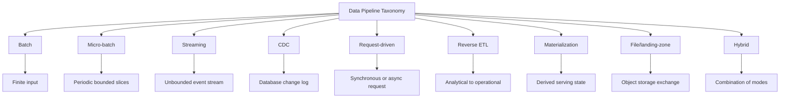
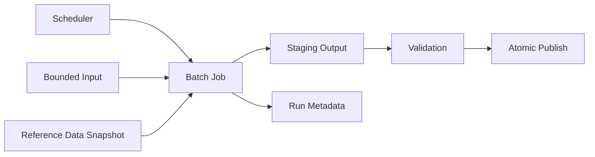
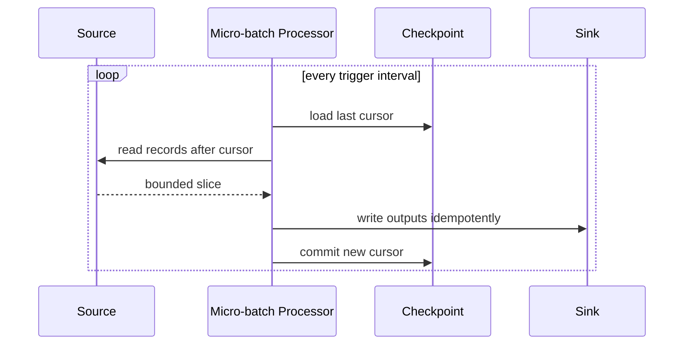
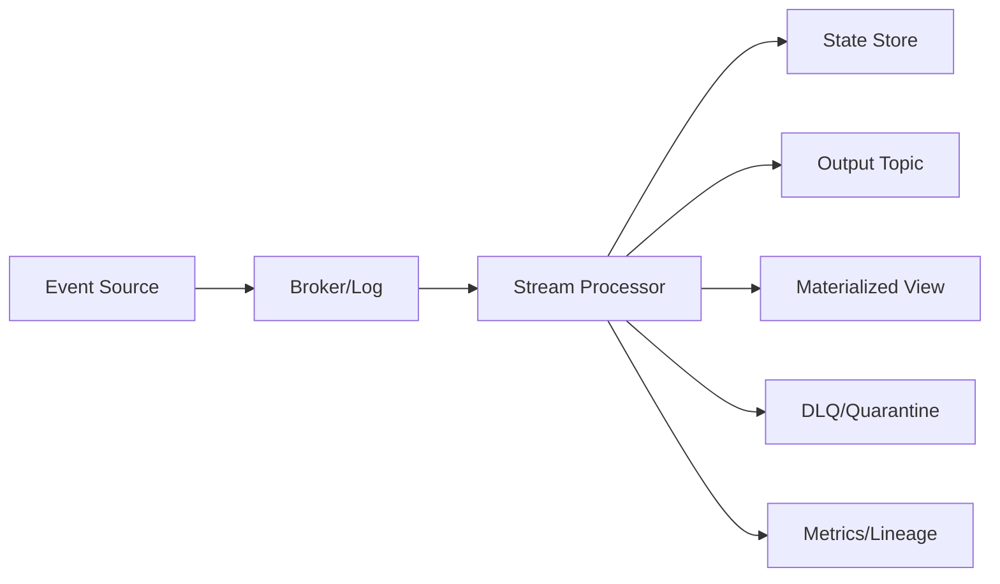
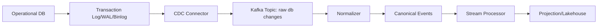
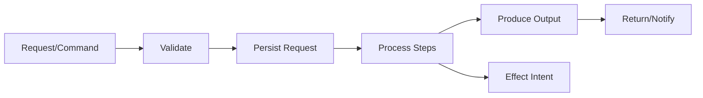
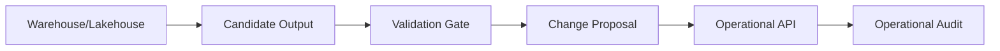
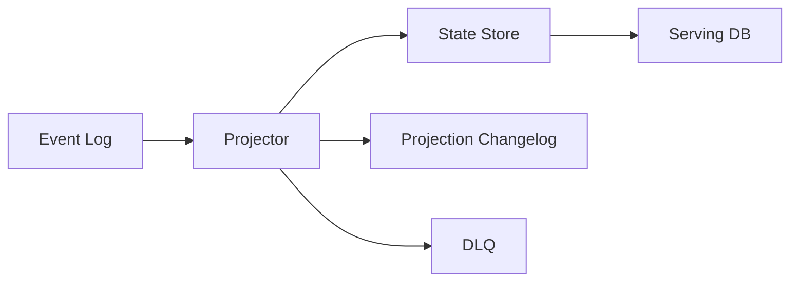
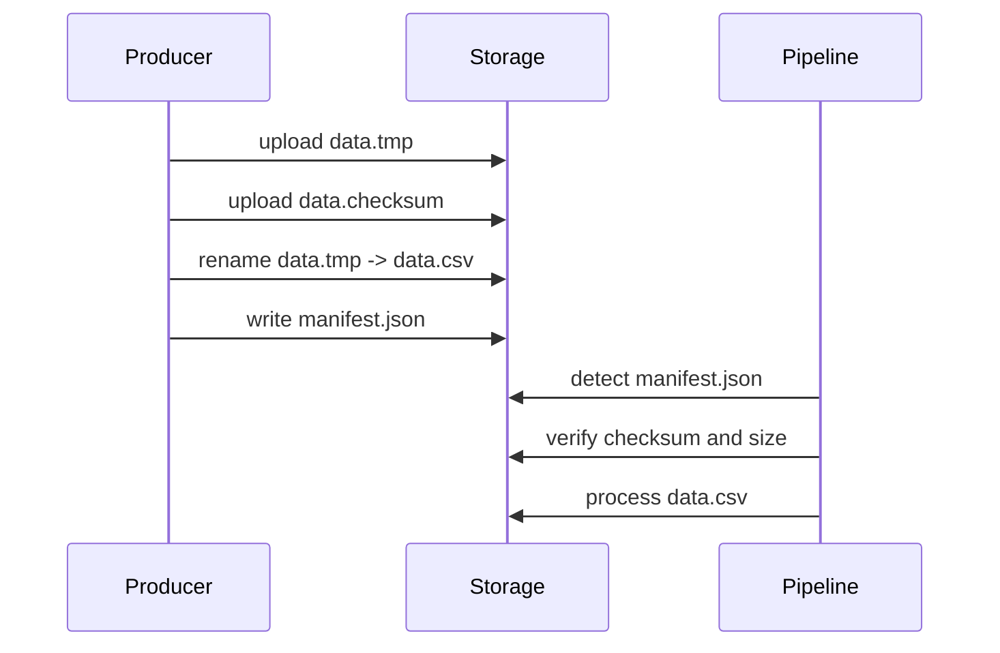
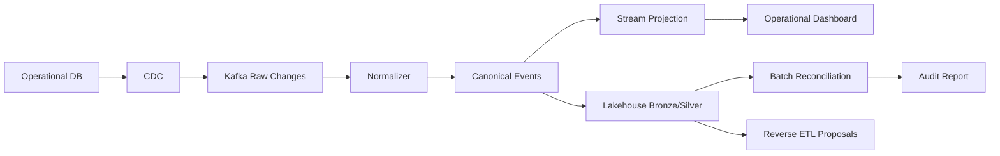

# Part 004 — Batch, Streaming, CDC, and Request-Driven Pipeline Taxonomy

> Banyak engineer memilih pipeline style berdasarkan tool yang sedang populer. Engineer yang lebih matang memilih berdasarkan bentuk data, invariant, failure mode, freshness, replay requirement, dan konsekuensi operasional.

Bagian ini membangun taxonomy pipeline. Tujuannya bukan membuat label akademis, tetapi membangun kemampuan memilih arsitektur yang tepat:

- kapan batch lebih benar daripada streaming;
- kapan streaming diperlukan;
- kapan CDC lebih aman daripada polling;
- kapan request-driven lebih sederhana;
- kapan orchestration DAG cukup;
- kapan stream processor dibutuhkan;
- kapan materialized view harus dipisah dari event transport;
- kapan reverse ETL menjadi integration risk;
- kapan hybrid architecture tidak bisa dihindari.

Kita akan melihat setiap tipe pipeline dari sisi:

1. model input;
2. model waktu;
3. state dan checkpoint;
4. delivery semantics;
5. replay/backfill;
6. failure mode;
7. Java implementation pattern;
8. kapan cocok dan kapan berbahaya.

---

## 1. Kesalahan Umum: Mengira Semua Pipeline adalah ETL

Banyak sistem digambar seperti ini:

```text
Extract -> Transform -> Load
```

Model ini berguna, tetapi terlalu kasar. Ia menyembunyikan pertanyaan penting:

- Apakah input finite atau infinite?
- Apakah source punya log perubahan?
- Apakah output harus real-time atau periodic?
- Apakah transform stateless atau stateful?
- Apakah output append-only atau mutable projection?
- Apakah data bisa dikoreksi setelah dipublish?
- Apakah pipeline bisa replay?
- Apakah sink mendukung transaksi/idempotency?
- Apakah ada side effect eksternal?

Lebih baik mulai dari taxonomy yang eksplisit.



---

## 2. Core Axis: Bounded vs Unbounded

Axis pertama adalah boundedness.

### 2.1 Bounded Data

Bounded data punya ukuran atau akhir yang diketahui.

Contoh:

- file CSV bulan Juni 2026;
- snapshot tabel per tanggal tertentu;
- export harian dari vendor;
- backfill range `2025-01-01` sampai `2025-12-31`;
- list customer hasil query finite.

Batch pipeline biasanya memproses bounded data.

### 2.2 Unbounded Data

Unbounded data terus bertumbuh.

Contoh:

- Kafka topic event transaksi;
- CDC stream dari database;
- telemetry IoT;
- clickstream;
- audit event;
- queue event operasional.

Streaming pipeline memproses unbounded data secara kontinu.

### 2.3 Boundedness Bukan Sekadar Ukuran

Data 10 TB bisa bounded. Data 1 KB/detik bisa unbounded.

Yang menentukan bukan volume, tetapi apakah koleksi datanya punya akhir alami saat diproses.

```text
Bounded   = dapat diproses sebagai finite collection
Unbounded = harus diproses sebagai data yang terus datang
```

Apache Beam memakai model bounded/unbounded untuk `PCollection`; bounded bisa diproses batch, sedangkan unbounded harus diproses streaming karena seluruh koleksi tidak pernah tersedia sekaligus. Apache Flink juga memosisikan dirinya sebagai engine untuk stateful computations atas bounded dan unbounded streams.

---

## 3. Core Axis: State vs Stateless

Pipeline stateless:

```text
output = f(single input record)
```

Contoh:

- parse JSON;
- normalize field;
- mask PII;
- map code ke label dari static enum;
- validate schema.

Pipeline stateful:

```text
output = f(input record, previous records, timers, reference state)
```

Contoh:

- dedupe;
- sessionization;
- rolling aggregate;
- current status projection;
- fraud/risk detection;
- SLA breach detection;
- join stream dengan reference table;
- detect missing event sequence.

State mengubah desain secara radikal.

Jika pipeline stateful, kamu harus memikirkan:

- state key;
- state lifecycle;
- state TTL;
- snapshot/checkpoint;
- restore;
- schema evolution of state;
- memory/storage cost;
- hot key;
- exactly/effectively-once boundary.

---

## 4. Core Axis: Push vs Pull

### 4.1 Pull Pipeline

Pipeline menarik data dari source.

Contoh:

- query database tiap 5 menit;
- fetch API page by page;
- scan object storage prefix;
- read file batch.

Kelebihan:

- sederhana;
- mudah dikontrol;
- cocok untuk source yang tidak bisa push;
- mudah dijadwalkan.

Kekurangan:

- freshness terbatas polling interval;
- risk missing update jika cursor buruk;
- beban source bisa tinggi;
- sulit menangkap delete;
- ordering sering lemah.

### 4.2 Push Pipeline

Source mendorong event ke pipeline.

Contoh:

- Kafka producer;
- webhook;
- queue message;
- CDC connector;
- event bus.

Kelebihan:

- freshness lebih baik;
- natural untuk event-driven;
- source dapat publish fakta saat terjadi;
- lebih mudah decouple producer/consumer.

Kekurangan:

- retry dan dedupe lebih kompleks;
- backpressure harus dirancang;
- schema evolution harus disiplin;
- poison message bisa memblokir stream;
- observability lebih penting.

---

## 5. Core Axis: Snapshot vs Change Log

Snapshot menjawab:

```text
Apa state saat ini?
```

Change log menjawab:

```text
Perubahan apa yang terjadi dari waktu ke waktu?
```

Contoh snapshot:

```text
case_id=123, status=CLOSED
```

Contoh change log:

```text
10:00 CASE_CREATED
10:05 CASE_ESCALATED
10:10 CASE_CLOSED
```

Snapshot bagus untuk current state. Change log bagus untuk history, replay, audit, dan downstream derivation.

Masalah umum: mencoba membuat audit pipeline dari snapshot-only source. Itu sering mustahil tanpa loss of history.

---

## 6. Batch Pipeline

### 6.1 Definisi

Batch pipeline memproses data bounded dalam satu run finite.

```text
Input finite -> process -> output -> finish
```

Contoh:

- nightly warehouse load;
- monthly regulatory report;
- historical backfill;
- daily reconciliation;
- export/import vendor;
- rebuilding index dari snapshot.

### 6.2 Mental Model Batch

Batch adalah fungsi atas dataset.

```text
Output_D = Transform(Input_D, Config, ReferenceData)
```

Karena input finite, batch cocok untuk:

- full scan;
- global sort;
- exact aggregate;
- reconciliation;
- recompute total;
- expensive validation;
- historical correction.

### 6.3 Batch Architecture



### 6.4 Java Implementation Pattern

Simple batch skeleton:

```java
public interface BatchSource<T> {
    Stream<T> read(BatchReadSpec spec);
}

public interface BatchTransform<I, O> {
    O apply(I input, BatchContext context);
}

public interface BatchSink<O> {
    void write(Stream<O> outputs, BatchWriteSpec spec);
    void publish(BatchPublishSpec spec);
}

public record BatchContext(
        String runId,
        String transformVersion,
        Instant dataIntervalStart,
        Instant dataIntervalEnd,
        String referenceDataVersion
) {}
```

Batch job dengan staging:

```java
public final class BatchPipeline<I, O> {
    private final BatchSource<I> source;
    private final BatchTransform<I, O> transform;
    private final BatchSink<O> sink;
    private final BatchValidator<O> validator;

    public void run(BatchContext context) {
        BatchWriteSpec staging = BatchWriteSpec.staging(context.runId());

        Stream<O> outputs = source.read(BatchReadSpec.forInterval(
                        context.dataIntervalStart(),
                        context.dataIntervalEnd()
                ))
                .map(input -> transform.apply(input, context));

        sink.write(outputs, staging);

        ValidationResult result = validator.validate(staging);
        if (!result.passed()) {
            throw new BatchValidationException(result);
        }

        sink.publish(BatchPublishSpec.atomicSwap(staging, context));
    }
}
```

Prinsip penting:

- tulis ke staging dulu;
- validasi sebelum publish;
- publish atomic jika bisa;
- run metadata wajib;
- output harus bisa dibedakan per run.

### 6.5 Batch Failure Mode

| Failure | Contoh | Mitigasi |
|---|---|---|
| Partial output visible | job gagal setelah tulis 40% | staging + atomic publish |
| Duplicate run | scheduler retry | run ID + idempotent publish |
| Reference data berubah saat run | hasil tidak reproducible | snapshot reference data |
| Input berubah saat scan | inconsistent snapshot | snapshot isolation atau extract boundary |
| Backfill overwrite live | data terbaru tertimpa | versioned output atau merge policy |

### 6.6 Kapan Batch Tepat

Batch tepat jika:

- data punya interval alami;
- freshness menit/jam/hari cukup;
- butuh global consistency;
- butuh heavy aggregation;
- replay/backfill besar;
- output report periodik;
- biaya streaming tidak sepadan.

Batch berbahaya jika:

- action harus real-time;
- source update cepat dan ordering penting;
- consumer menganggap data selalu current;
- batch window terlalu lama untuk bisnis;
- partial publish tidak dikontrol.

---

## 7. Micro-Batch Pipeline

### 7.1 Definisi

Micro-batch memproses data dalam potongan kecil berkala.

```text
Every N seconds/minutes:
  read new slice -> process -> commit -> next slice
```

Contoh:

- Spark Structured Streaming micro-batch;
- polling database setiap 1 menit;
- ingest API updated_since cursor;
- process files landing setiap 30 detik.

### 7.2 Mental Model

Micro-batch adalah kompromi antara batch dan streaming.

Ia terlihat streaming dari sisi consumer karena output sering diperbarui, tetapi engine memproses slice bounded.



### 7.3 Java Cursor Pattern

```java
public record IncrementalCursor(
        Instant highWatermark,
        String tieBreakerId
) {}

public interface IncrementalSource<T> {
    List<T> readAfter(IncrementalCursor cursor, int limit);
}
```

Query pattern:

```sql
SELECT *
FROM case_event
WHERE (updated_at, id) > (:last_updated_at, :last_id)
ORDER BY updated_at, id
LIMIT :limit;
```

Jangan hanya pakai `updated_at > last_updated_at`. Jika banyak row punya timestamp sama, record bisa ter-skip. Gunakan tie-breaker.

### 7.4 Micro-Batch Failure Mode

| Failure | Penyebab | Mitigasi |
|---|---|---|
| Cursor maju terlalu cepat | checkpoint sebelum sink commit | commit cursor setelah sink durable |
| Row ter-skip | timestamp tie | composite cursor |
| Row berubah saat dibaca | no snapshot | read committed dengan overlap atau versioning |
| Duplicate akibat overlap | intentional overlap | idempotent sink |
| Source overload | polling terlalu agresif | adaptive interval/backoff |

### 7.5 Kapan Micro-Batch Tepat

Micro-batch tepat jika:

- near-real-time cukup;
- source tidak menyediakan stream;
- transform lebih mudah dalam bounded slice;
- operational simplicity lebih penting dari latency rendah;
- sink lebih efisien batch write;
- exact event-time streaming tidak diperlukan.

Micro-batch berbahaya jika:

- event ordering per record sangat kritis;
- duplicate tidak bisa diterima dan sink tidak idempotent;
- cursor source tidak reliable;
- source delete harus ditangkap tapi tidak ada tombstone;
- latency sub-second diperlukan.

---

## 8. Streaming Pipeline

### 8.1 Definisi

Streaming pipeline memproses unbounded event stream secara kontinu.

```text
Input events keep arriving -> process continuously -> output continuously
```

Contoh:

- Kafka topic to Kafka topic;
- Kafka to materialized view;
- Flink job untuk SLA breach detection;
- Kafka Streams enrichment;
- fraud detection;
- operational alerting;
- real-time projection.

### 8.2 Mental Model Streaming

Streaming bukan “batch yang lebih sering”. Streaming adalah model komputasi berbeda karena input tidak pernah selesai.

Konsekuensinya:

- tidak ada “end of dataset”;
- completeness harus relatif terhadap watermark/cursor;
- state harus dibatasi;
- late events harus punya policy;
- checkpoint menjadi bagian inti;
- sink idempotency wajib;
- deployment upgrade harus mempertahankan state.

### 8.3 Streaming Architecture



### 8.4 Java Streaming Loop: Low-Level Pattern

Sebelum memakai framework, pahami loop dasarnya.

```java
while (running) {
    List<Event> events = consumer.poll(Duration.ofMillis(500));

    for (Event event : events) {
        try {
            List<Output> outputs = processor.process(event);
            sink.writeAll(outputs);
            offsetTracker.markProcessed(event.offset());
        } catch (NonRetryableException e) {
            dlq.publish(event, e);
            offsetTracker.markProcessed(event.offset());
        } catch (RetryableException e) {
            consumer.pause(event.partition());
            retryScheduler.schedule(event, e);
            break;
        }
    }

    checkpointStore.commit(offsetTracker.committableOffsets());
}
```

Loop ini menyembunyikan banyak detail:

- commit strategy;
- rebalance;
- partial failure;
- per-partition ordering;
- retry lane;
- backpressure;
- poison event;
- graceful shutdown.

Framework seperti Kafka Streams dan Flink mengelola banyak aspek ini, tetapi mental model-nya tetap penting.

### 8.5 Stateless vs Stateful Streaming

Stateless streaming:

```text
Event -> validate -> enrich static -> publish
```

Stateful streaming:

```text
Event + state -> update state -> maybe emit output
```

Stateful example:

```java
public final class CaseSlaDetector {
    private final KeyValueState<String, CaseSlaState> state;

    public List<SlaAlert> onEvent(CaseEvent event) {
        CaseSlaState current = state.getOrDefault(event.caseId(), CaseSlaState.empty(event.caseId()));
        CaseSlaState next = current.apply(event);
        state.put(event.caseId(), next);

        if (next.isBreached() && !current.isBreached()) {
            return List.of(SlaAlert.from(next));
        }
        return List.of();
    }
}
```

State harus checkpointed. Jika tidak, restart akan kehilangan konteks.

### 8.6 Streaming Failure Mode

| Failure | Dampak | Mitigasi |
|---|---|---|
| Duplicate delivery | double count | idempotent sink/dedupe state |
| Rebalance saat processing | record diproses ulang | commit discipline |
| Poison record | partition stuck | DLQ/quarantine policy |
| Late event | window salah | watermark + late event handling |
| Hot key | satu partition lambat | key design, salting, split state |
| State corruption | output salah terus | checkpoint, savepoint, validation |
| Sink timeout ambiguity | tidak tahu write berhasil | idempotency key + read-after-write/retry |

### 8.7 Kapan Streaming Tepat

Streaming tepat jika:

- output harus low-latency;
- input naturally event stream;
- state harus diperbarui kontinu;
- alerting/action harus cepat;
- consumer butuh perubahan, bukan snapshot periodik;
- replay dari log memungkinkan.

Streaming berbahaya jika:

- tim belum siap operasional;
- state semantics tidak jelas;
- sink tidak idempotent;
- schema governance lemah;
- business sebenarnya cukup batch;
- late correction tidak dipikirkan.

---

## 9. CDC Pipeline

### 9.1 Definisi

CDC, atau Change Data Capture, menangkap perubahan dari database source dan mengirimkannya sebagai stream event.

Secara konseptual:

```text
Database transaction log -> CDC connector -> change events -> downstream pipeline
```

Debezium adalah contoh platform open source CDC yang membaca perubahan database dan mengubahnya menjadi event stream. Connector CDC umumnya mendukung snapshot awal lalu streaming perubahan berikutnya, dengan offset/checkpoint agar dapat resume.

### 9.2 CDC Bukan Domain Event

Ini penting.

CDC event biasanya berarti:

```text
row X changed from before to after
```

Domain event berarti:

```text
case was escalated because risk score exceeded threshold
```

CDC event adalah fakta teknis dari database. Domain event adalah fakta bisnis.

CDC sangat berguna, tetapi jangan otomatis menganggap CDC sama dengan event-driven domain modeling.

### 9.3 CDC Architecture



### 9.4 CDC Event Envelope

Generic CDC envelope:

```java
public record CdcEvent<T>(
        String sourceDatabase,
        String sourceTable,
        String primaryKey,
        CdcOperation operation,
        T before,
        T after,
        String transactionId,
        long transactionOrder,
        String sourceOffset,
        Instant sourceCommitTime,
        Instant capturedAt,
        String schemaVersion
) {}

public enum CdcOperation {
    CREATE,
    UPDATE,
    DELETE,
    READ_SNAPSHOT
}
```

Fields penting:

- `operation` untuk create/update/delete/snapshot read;
- `before` dan `after` untuk detect perubahan;
- `transactionId` untuk transaction boundary;
- `transactionOrder` untuk ordering dalam transaksi;
- `sourceOffset` untuk resume/replay;
- `sourceCommitTime` untuk event-time teknis.

### 9.5 Snapshot + Stream Problem

CDC sering butuh initial snapshot. Masalahnya source database tetap menerima write saat snapshot berjalan.

Pertanyaan correctness:

```text
Bagaimana memastikan data snapshot dan event perubahan setelah snapshot tidak meninggalkan gap atau double apply yang salah?
```

Connector matang mengelola boundary snapshot dan log offset. Tetapi downstream tetap harus idempotent karena snapshot record dan update stream bisa berinteraksi.

### 9.6 CDC Delete Semantics

Delete sering diabaikan.

Pertanyaan:

- apakah delete menjadi tombstone?
- apakah downstream harus hard delete atau soft delete?
- apakah delete boleh menghapus audit history?
- apakah log-compacted topic membutuhkan tombstone?
- apakah reporting perlu menunjukkan inactive state?

Untuk regulated systems, delete jarang berarti hilang total. Lebih sering:

```text
record marked deleted at time T by source event E
```

### 9.7 CDC Failure Mode

| Failure | Dampak | Mitigasi |
|---|---|---|
| Schema change source | connector/event break | schema registry + compatibility policy |
| Missing primary key | upsert/dedupe sulit | enforce key or synthetic stable key |
| Transaction reorder | invalid downstream state | transaction metadata/order |
| Snapshot duplicate | duplicate state | idempotent consumer |
| Connector lag | stale downstream | lag monitoring |
| Source log retention too short | connector cannot resume | monitor offset lag + retention sizing |
| DB write pattern noisy | too many low-value changes | filter/normalize downstream |

### 9.8 Kapan CDC Tepat

CDC tepat jika:

- source tidak menerbitkan domain events;
- butuh capture database changes near-real-time;
- ingin mengurangi polling load;
- butuh delete/update capture;
- ingin bootstrap materialized view;
- source DB adalah operational truth.

CDC berbahaya jika:

- schema database sering berubah tanpa contract;
- row changes tidak merepresentasikan business facts;
- downstream terlalu bergantung pada internal table design;
- source DB tidak punya stable key;
- tidak ada ownership jelas antara DB team dan data consumer.

---

## 10. Request-Driven Pipeline

### 10.1 Definisi

Request-driven pipeline berjalan sebagai respons terhadap request eksplisit, bukan jadwal atau stream kontinu.

Contoh:

- user upload file lalu sistem memprosesnya;
- API request memicu enrichment pipeline;
- admin klik “recalculate case risk”;
- service menerima command lalu menghasilkan output data;
- webhook menerima event lalu menjalankan mini-pipeline.

### 10.2 Mental Model

Request-driven pipeline dekat dengan aplikasi biasa, tetapi tetap punya pipeline semantics jika prosesnya multi-step, durable, dan data-oriented.



### 10.3 Synchronous vs Asynchronous

Synchronous:

```text
client waits until processing finishes
```

Asynchronous:

```text
client submits request -> receives job id -> pipeline runs -> client polls/subscribes result
```

Synchronous cocok jika:

- cepat;
- bounded kecil;
- no heavy side effects;
- user butuh immediate response.

Asynchronous cocok jika:

- proses lama;
- butuh retry;
- butuh audit;
- ada external side effects;
- output besar;
- failure harus recoverable.

### 10.4 Java Design: Durable Request Pipeline

```java
public record PipelineCommand(
        String commandId,
        String requestedBy,
        String commandType,
        JsonNode payload,
        Instant requestedAt
) {}

public enum CommandStatus {
    ACCEPTED,
    VALIDATED,
    RUNNING,
    COMPLETED,
    FAILED_RETRYABLE,
    FAILED_TERMINAL,
    CANCELLED
}
```

Handler:

```java
public final class RecalculateRiskCommandHandler {
    public CommandAccepted handle(PipelineCommand command) {
        commandRepository.insert(command, CommandStatus.ACCEPTED);
        workQueue.enqueue(command.commandId());
        return new CommandAccepted(command.commandId());
    }
}
```

Worker:

```java
public final class RecalculateRiskWorker {
    public void process(String commandId) {
        PipelineCommand command = commandRepository.load(commandId);
        commandRepository.markRunning(commandId);

        try {
            RiskOutput output = riskPipeline.recalculate(command);
            outputRepository.upsert(output);
            commandRepository.markCompleted(commandId);
        } catch (RetryableException e) {
            commandRepository.markRetryableFailure(commandId, e);
            throw e;
        } catch (ValidationException e) {
            commandRepository.markTerminalFailure(commandId, e);
        }
    }
}
```

### 10.5 Request-Driven Failure Mode

| Failure | Dampak | Mitigasi |
|---|---|---|
| Client retries request | duplicate job | command id/idempotency key |
| Server crashes after accepting | lost request | persist before enqueue or transactional outbox |
| Long request timeout | ambiguous status | async job status |
| User triggers duplicate recalculation | conflicting output | command dedupe/lock per entity |
| Side effect happens twice | duplicate notification/action | effect ledger |

### 10.6 Kapan Request-Driven Tepat

Request-driven tepat jika:

- pipeline dipicu user/system command;
- scope kecil atau jelas;
- butuh immediate or job-level status;
- ada authorization/audit per request;
- output terkait action spesifik.

Request-driven berbahaya jika:

- volume tinggi seperti stream tetapi dipaksa lewat API sync;
- long-running task tidak durable;
- idempotency command tidak ada;
- proses berat berjalan di request thread;
- retry client bisa menggandakan side effect.

---

## 11. Reverse ETL Pipeline

### 11.1 Definisi

Reverse ETL memindahkan data dari analytical/warehouse/lakehouse system kembali ke operational tools.

Contoh:

- sync customer segment dari warehouse ke CRM;
- push risk score ke case management;
- update marketing audience;
- send eligibility flag ke operational database;
- sync enforcement priority to workflow tool.

### 11.2 Mengapa Reverse ETL Berisiko

Reverse ETL terlihat sederhana:

```text
Warehouse -> Operational System
```

Tetapi secara arsitektur ia membalik arah truth.

Operational system biasanya source-of-truth untuk action. Warehouse biasanya derived/analytical. Jika warehouse menulis kembali ke operational system, harus jelas:

- apakah data itu recommendation atau command?
- siapa owner field target?
- apakah user bisa override?
- bagaimana conflict diselesaikan?
- apakah stale analytical data boleh mengubah operation?
- bagaimana audit dilakukan?

### 11.3 Safe Reverse ETL Pattern



Jangan langsung update operational DB jika bisa dihindari. Gunakan API/command boundary milik operational system.

### 11.4 Java Design: Proposal not Mutation

```java
public record OperationalChangeProposal(
        String proposalId,
        String targetSystem,
        String targetEntityId,
        String proposedField,
        JsonNode proposedValue,
        String reason,
        String sourceDatasetVersion,
        String pipelineRunId,
        Instant proposedAt
) {}
```

Operational system bisa menerima proposal dan memutuskan:

- accept;
- reject;
- require human approval;
- merge;
- ignore due to stale version.

### 11.5 Reverse ETL Failure Mode

| Failure | Dampak | Mitigasi |
|---|---|---|
| Stale warehouse data overwrites operational truth | wrong action | version check + operational API validation |
| No owner boundary | field ping-pong | ownership contract |
| Bulk update error | large blast radius | dry run + staged rollout |
| No audit reason | indefensible change | proposal + reason + lineage |
| Duplicate sync | repeated external update | idempotency key |

---

## 12. Materialization Pipeline

### 12.1 Definisi

Materialization pipeline membangun derived serving state dari input events/data.

Contoh:

- current case status table;
- search index;
- read model CQRS;
- aggregate dashboard table;
- feature store;
- cache projection;
- denormalized API serving table.

### 12.2 Mental Model

Materialized view adalah hasil dari fungsi atas log/snapshot.

```text
ViewState = fold(events, initialState, applyFunction)
```

Untuk entity lifecycle:

```java
CaseProjection next = eventsForCase.stream()
        .sorted(byAggregateVersion())
        .reduce(CaseProjection.empty(caseId), CaseProjection::apply, unsupportedCombiner());
```

Dalam streaming, fold dilakukan incremental.

### 12.3 Materialization Architecture



### 12.4 Materialized View Invariants

- view key uniqueness jelas;
- apply function idempotent;
- ordering scope jelas;
- rebuild possible from source;
- output versioned;
- correction behavior jelas;
- stale view detectable.

### 12.5 Java Projector Pattern

```java
public interface Projector<E, S> {
    S initial(String key);
    S apply(S current, E event);
}

public final class CaseStatusProjector implements Projector<CaseEvent, CaseStatusView> {
    @Override
    public CaseStatusView initial(String caseId) {
        return CaseStatusView.empty(caseId);
    }

    @Override
    public CaseStatusView apply(CaseStatusView current, CaseEvent event) {
        if (event.aggregateVersion() <= current.lastAppliedVersion()) {
            return current;
        }
        if (event.aggregateVersion() != current.lastAppliedVersion() + 1) {
            throw new GapDetectedException(event.caseId());
        }
        return current.apply(event);
    }
}
```

### 12.6 Kapan Materialization Tepat

Materialization tepat jika:

- read query mahal jika dihitung on-demand;
- consumer butuh low-latency read;
- source normalized terlalu kompleks;
- output adalah derived state;
- rebuild dari log/snapshot mungkin.

Materialization berbahaya jika:

- source tidak replayable;
- projection logic berubah tanpa versioning;
- stale view tidak terdeteksi;
- consumer menganggap projection sebagai source-of-truth utama;
- correction tidak dipikirkan.

---

## 13. File/Landing-Zone Pipeline

### 13.1 Definisi

File pipeline memproses file yang dipublish ke file system/object storage/landing zone.

Contoh:

- vendor drops CSV;
- nightly XML export;
- Parquet files in object storage;
- regulatory submission package;
- partner integration via SFTP.

### 13.2 File Pipeline Problem

File tampak mudah, tetapi punya failure mode klasik:

- file dibaca saat masih ditulis;
- file sama dikirim ulang;
- nama file berubah tapi isi sama;
- isi berubah tapi nama sama;
- manifest hilang;
- partial upload;
- encoding/line ending mismatch;
- schema drift;
- late file;
- retraction/correction file.

### 13.3 Safe File Publish Protocol

Gunakan manifest atau atomic rename.



Manifest example:

```json
{
  "fileId": "vendor-cases-20260704-001",
  "fileName": "cases-2026-07-04.csv",
  "recordCount": 120034,
  "sha256": "...",
  "schemaVersion": "case-export-v3",
  "producedAt": "2026-07-04T01:00:00Z"
}
```

### 13.4 Java File Ingestion Pattern

```java
public record FileManifest(
        String fileId,
        String fileName,
        long recordCount,
        String sha256,
        String schemaVersion,
        Instant producedAt
) {}

public final class FileIngestionService {
    public void ingest(FileManifest manifest) {
        if (ledger.alreadyProcessed(manifest.fileId(), manifest.sha256())) {
            return;
        }

        storage.verifyChecksum(manifest.fileName(), manifest.sha256());
        long actualCount = parser.countRecords(manifest.fileName());

        if (actualCount != manifest.recordCount()) {
            throw new FileCompletenessException(manifest.fileId());
        }

        ledger.markValidated(manifest.fileId());
        parser.streamRecords(manifest.fileName())
                .forEach(record -> rawStore.persist(manifest, record));
        ledger.markProcessed(manifest.fileId());
    }
}
```

---

## 14. Hybrid Pipeline

### 14.1 Definisi

Hybrid pipeline menggabungkan beberapa mode.

Contoh umum:

```text
CDC -> Kafka -> Stream Processor -> Lakehouse -> Batch Reconciliation -> Reverse ETL
```

atau:

```text
File Landing -> Batch Parse -> Kafka Publish -> Streaming Projection
```

Hybrid bukan tanda desain buruk. Banyak sistem production memang hybrid karena kebutuhan berbeda.

### 14.2 Hybrid Architecture Example



### 14.3 Hybrid Design Risk

Hybrid pipeline berisiko jika boundary semantics tidak jelas.

Pertanyaan penting:

- apa source-of-truth untuk setiap output?
- apakah stream dan batch menghasilkan angka yang sama?
- apakah batch memperbaiki stream atau hanya audit?
- jika hasil stream dan batch beda, siapa menang?
- apakah replay stream mempengaruhi reverse ETL?
- apakah data lake menyimpan raw immutable input?

### 14.4 Lambda vs Kappa, Tanpa Dogma

Dua istilah yang sering muncul:

- **Lambda architecture**: batch layer + speed layer + serving layer.
- **Kappa architecture**: satu log/event stream sebagai basis, reprocessing lewat replay log.

Jangan memilih berdasarkan jargon.

Pilih berdasarkan:

- apakah log retention cukup untuk replay penuh?
- apakah batch recompute tetap dibutuhkan untuk correction?
- apakah transform streaming dan batch bisa disatukan?
- apakah tim mampu mengoperasikan dua logic path?
- apakah cost replay dari log masuk akal?

Dalam banyak sistem nyata, bentuknya bukan lambda atau kappa murni, tetapi pragmatic hybrid.

---

## 15. Decision Matrix

| Requirement | Bias Toward |
|---|---|
| Monthly report, exact aggregate | Batch |
| Near-real-time dashboard | Streaming or micro-batch |
| Capture DB changes including delete | CDC |
| User-triggered recalculation | Request-driven async |
| Search/read model from events | Materialization |
| Partner sends files | File pipeline |
| Warehouse segment pushed to CRM | Reverse ETL with proposal/validation |
| Historical correction and audit | Batch + replayable raw store |
| Low-latency SLA breach alert | Stateful streaming |
| Source only supports REST pagination | Micro-batch pull |
| Need full rebuild of derived state | Batch replay or log replay |

---

## 16. Mapping Taxonomy to Invariants

| Pipeline Type | Completeness | Ordering | Freshness | Idempotency | Replayability | Determinism |
|---|---|---|---|---|---|---|
| Batch | high via finite scope | controllable | lower | run-level needed | strong if input retained | strong if versioned |
| Micro-batch | cursor-dependent | moderate | medium | required | medium | good with snapshots |
| Streaming | watermark/offset relative | per-key critical | high | mandatory | strong if log retained | harder with state/time |
| CDC | log/snapshot dependent | transaction/key critical | high | mandatory | offset/log dependent | depends on source metadata |
| Request-driven | command ledger | per-command/entity | variable | command idempotency | command history dependent | manageable |
| Reverse ETL | dataset diff dependent | usually less central | medium | mandatory | often weak unless staged | depends on source version |
| Materialization | source coverage | critical per key | high/medium | mandatory | must rebuild | critical |
| File pipeline | manifest dependent | file/order dependent | low/medium | file id/checksum | strong if files retained | strong if immutable |

---

## 17. Anti-Pattern Taxonomy

### 17.1 Batch Disguised as Streaming

Tanda:

- cron setiap 10 detik;
- query source besar berulang;
- duplicate banyak;
- DB source panas;
- freshness tetap buruk.

Solusi:

- gunakan CDC atau event stream;
- gunakan cursor yang benar;
- naikkan interval dan set expectation;
- pindahkan ke materialized changelog.

### 17.2 Streaming Disguised as Batch

Tanda:

- bisnis butuh alert cepat;
- report periodik selalu terlambat;
- user membuat workaround manual;
- batch window semakin sering sampai tidak stabil.

Solusi:

- gunakan stream processor;
- define event contract;
- mulai dari projection kecil;
- gunakan batch untuk reconciliation.

### 17.3 CDC Treated as Domain Events

Tanda:

- downstream tahu nama tabel internal;
- perubahan kolom merusak banyak consumer;
- event `UPDATE` tidak jelas maknanya;
- business event harus direkonstruksi dari diff row.

Solusi:

- normalizer layer;
- canonical event;
- outbox untuk domain event baru;
- contract antara DB owner dan consumer.

### 17.4 Reverse ETL Mutating Truth Directly

Tanda:

- warehouse job update operational DB langsung;
- tidak ada approval;
- tidak ada version check;
- stale score menimpa keputusan user.

Solusi:

- operational API boundary;
- proposal model;
- validation gate;
- audit reason;
- idempotency key.

### 17.5 Materialized View Without Rebuild Path

Tanda:

- projection rusak tidak bisa diperbaiki;
- manual SQL patch;
- tidak ada source log;
- transform bug butuh edit row satu-satu.

Solusi:

- retain event/source input;
- projector deterministic;
- rebuild command;
- shadow table compare;
- publish after validation.

---

## 18. Practical Java Selection Guide

### 18.1 Plain Java Service

Gunakan plain Java service jika:

- pipeline kecil;
- source/sink custom;
- logic request-driven;
- butuh tight domain integration;
- throughput masih manageable;
- state sederhana dan bisa disimpan di DB.

Hindari jika:

- stateful streaming kompleks;
- event-time windowing berat;
- exactly/effectively-once state management perlu framework;
- parallelism/distributed checkpointing sulit.

### 18.2 Kafka Consumer/Producer Java

Gunakan jika:

- butuh consume/publish event;
- transform mostly stateless;
- state bisa disimpan eksternal;
- ingin kontrol penuh;
- topology sederhana.

Hindari untuk complex windowing/stateful joins kecuali siap membangun banyak hal sendiri.

### 18.3 Kafka Streams

Gunakan jika:

- Kafka-in/Kafka-out;
- stream-table join;
- state store lokal;
- materialized view;
- topology relatif Kafka-centric;
- ingin library embedded di JVM app.

### 18.4 Flink Java

Gunakan jika:

- stateful streaming serius;
- event-time/windowing kompleks;
- high throughput;
- checkpoint/savepoint penting;
- async enrichment;
- stream joins;
- bounded + unbounded processing.

### 18.5 Beam Java

Gunakan jika:

- ingin model portable batch/stream;
- pipeline logic ingin runner-agnostic;
- transform reusable;
- tim siap dengan Beam abstraction.

### 18.6 Spark Java

Gunakan jika:

- batch/lakehouse heavy;
- data besar di object storage;
- SQL/DataFrame-centric;
- batch analytics;
- micro-batch structured streaming cukup.

### 18.7 Airflow/Orchestrator

Gunakan untuk:

- scheduling;
- dependency DAG;
- batch coordination;
- triggering jobs;
- sensors;
- operational retries at task level.

Jangan gunakan Airflow task sebagai record-level stream processor.

### 18.8 Temporal/Durable Workflow

Gunakan jika:

- pipeline request-driven long-running;
- banyak external calls;
- butuh durable retry;
- butuh compensation;
- workflow state lebih penting daripada record throughput.

---

## 19. Case Study: Regulatory Enforcement Lifecycle

Kita gunakan domain enforcement lifecycle untuk melihat taxonomy.

### 19.1 Use Case A — Current Case Dashboard

Requirement:

- status case harus update dalam 1 menit;
- event lifecycle harus urut per case;
- duplicate tidak boleh menggandakan alert;
- replay harus bisa rebuild projection.

Pilihan:

```text
Outbox/CDC -> Kafka -> Stateful stream projector -> Dashboard table
```

Bukan batch nightly.

### 19.2 Use Case B — Monthly Regulatory Report

Requirement:

- angka harus complete;
- koreksi historis harus masuk;
- output harus bisa diaudit;
- freshness harian/bulanan cukup.

Pilihan:

```text
Lakehouse raw/silver -> Batch report generation -> Validation -> Published report
```

Bukan streaming-only dashboard.

### 19.3 Use Case C — Vendor Case Import

Requirement:

- vendor kirim file;
- record count harus cocok;
- file bisa dikirim ulang;
- invalid row harus quarantine.

Pilihan:

```text
Landing zone + manifest -> Batch parser -> Raw store -> Validation -> Canonical events
```

### 19.4 Use Case D — Recalculate Risk on Demand

Requirement:

- investigator klik recalculate;
- proses bisa 2 menit;
- harus ada audit siapa memicu;
- retry aman.

Pilihan:

```text
Async request-driven durable command -> risk pipeline -> proposal/output
```

### 19.5 Use Case E — Push Risk Segment Back to Case System

Requirement:

- analytical model menghasilkan priority suggestion;
- operational user bisa accept/reject;
- stale data tidak boleh overwrite keputusan terbaru.

Pilihan:

```text
Warehouse output -> validation -> change proposal -> operational API -> audit
```

Bukan direct DB update.

---

## 20. Final Mental Model

Taxonomy bukan label. Taxonomy adalah cara memprediksi konsekuensi.

Pertanyaan utama:

```text
Apakah data finite atau infinite?
Apakah source mengirim state atau change?
Apakah pipeline push atau pull?
Apakah transform stateless atau stateful?
Apakah output harus fresh atau complete?
Apakah replay dibutuhkan?
Apakah side effect aman?
Apakah output menjadi serving state atau audit/report?
```

Jika pertanyaan ini dijawab, tool choice menjadi lebih mudah.

---

## 21. Ringkasan

Kita sudah membedah tipe pipeline utama:

1. **Batch** — finite input, strong consistency, good for reports/backfill/reconciliation.
2. **Micro-batch** — bounded slices, compromise between simplicity and freshness.
3. **Streaming** — unbounded events, continuous processing, state/checkpoint/watermark critical.
4. **CDC** — database change log, powerful but not automatically domain events.
5. **Request-driven** — command-triggered, often durable async workflow.
6. **Reverse ETL** — analytical-to-operational, high governance risk.
7. **Materialization** — derived serving state, must be rebuildable.
8. **File pipeline** — landing-zone protocol, manifest, checksum, idempotency.
9. **Hybrid** — realistic combination, needs clear semantic boundaries.

Part berikutnya akan membahas **Source-Transform-Sink Contract** sebagai kontrak semantik. Kita akan membongkar kenapa `source -> transform -> sink` bukan template dangkal, tetapi boundary contract yang menentukan correctness, ownership, dan recovery.

---

## References

- Apache Beam Programming Guide — bounded and unbounded PCollections: https://beam.apache.org/documentation/programming-guide/
- Apache Beam Basics — bounded vs unbounded data model: https://beam.apache.org/documentation/basics/
- Apache Flink — stateful computations over bounded and unbounded streams: https://flink.apache.org/
- Apache Flink Documentation — event time and watermarks: https://nightlies.apache.org/flink/flink-docs-stable/docs/concepts/time/
- Apache Kafka Documentation — event streaming, topics, producers, consumers, and processing guarantees: https://kafka.apache.org/documentation/
- Debezium Documentation — CDC features and snapshots: https://debezium.io/documentation/reference/stable/features.html
