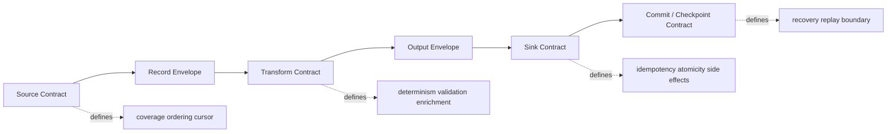
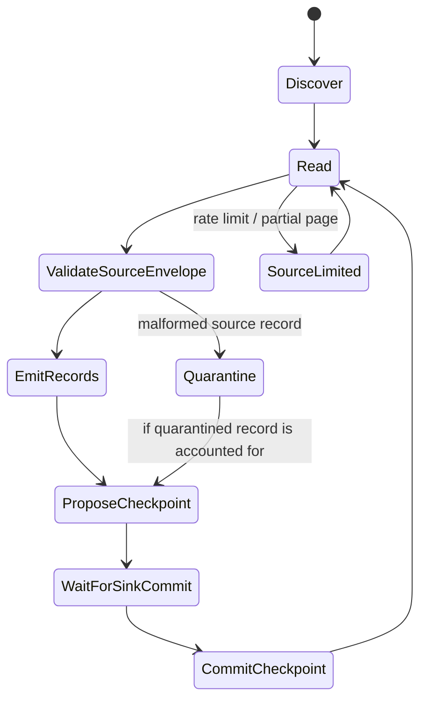
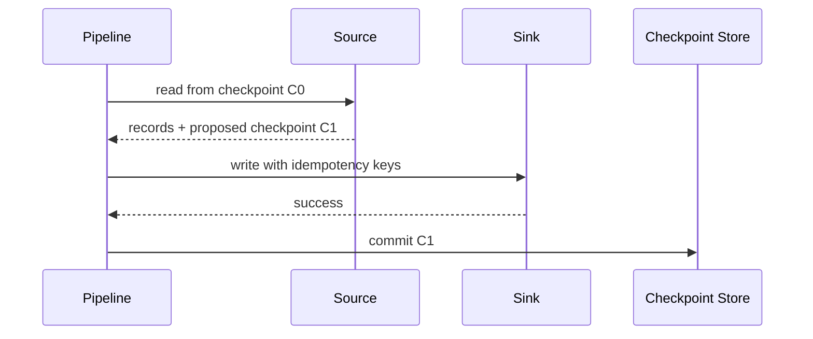
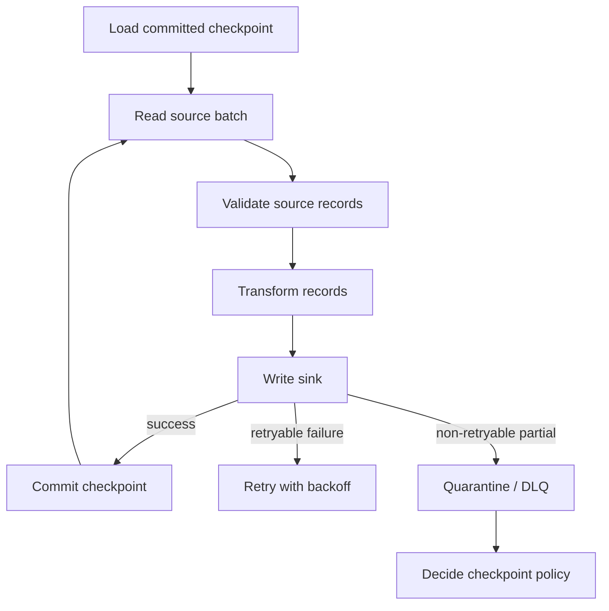
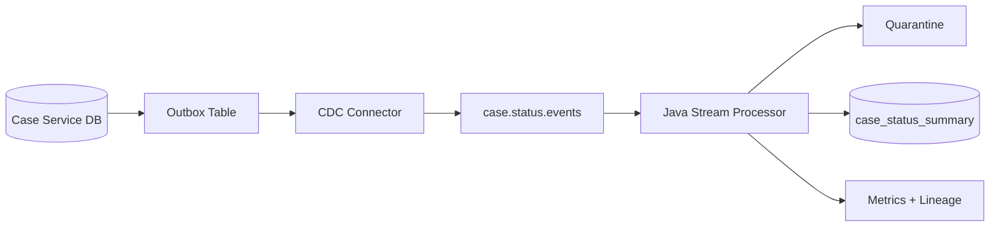

# Part 005 — Source-Transform-Sink Contract

> Pipeline production-grade bukan rangkaian “ambil data, ubah data, simpan data”. Pipeline production-grade adalah rantai kontrak: **source berjanji apa yang bisa dibaca**, **transform berjanji bagaimana input menjadi output**, dan **sink berjanji bagaimana output diterapkan tanpa merusak invariant**.

Part ini membongkar pola paling sering disederhanakan: `Source -> Transform -> Sink`.

Di level junior, ini terlihat seperti template ETL.

```text
Extract -> Transform -> Load
```

Di level production, ini adalah distributed correctness boundary.

```text
Source Contract -> Transformation Contract -> Sink Contract -> Operational Contract
```

Perbedaannya besar. Template hanya menjawab “kode diletakkan di mana”. Kontrak menjawab:

- data apa yang dianggap eligible untuk dibaca;
- bagaimana posisi baca dipulihkan setelah crash;
- metadata apa yang wajib ikut bersama payload;
- transformasi mana yang deterministic dan mana yang butuh external lookup;
- output mana yang idempotent dan mana yang punya side effect berbahaya;
- kapan checkpoint boleh di-commit;
- bagaimana downstream tahu bahwa data lengkap, parsial, terlambat, atau dikoreksi;
- siapa pemilik failure jika source, transform, atau sink berubah perilaku.

Di sistem nyata, bug pipeline jarang muncul karena engineer tidak tahu cara menulis mapper. Bug muncul karena boundary contract tidak eksplisit.

---

## 1. Masalah Utama: Pipeline Sering Dibangun sebagai Kode, Bukan Kontrak

Bentuk paling umum pipeline internal:

```java
List<Row> rows = source.fetch();
List<Event> events = rows.stream().map(mapper::toEvent).toList();
sink.write(events);
```

Untuk demo, itu cukup.

Untuk production, kode ini menyembunyikan pertanyaan yang jauh lebih penting:

- Apakah `fetch()` membaca snapshot konsisten atau hasil bergerak?
- Apakah `rows` punya ordering stabil?
- Apakah `mapper` pure function atau memanggil service eksternal?
- Apakah `sink.write()` atomic untuk semua event atau sebagian bisa berhasil?
- Jika proses crash setelah `sink.write()` tetapi sebelum checkpoint, apa yang terjadi?
- Jika pipeline di-retry, apakah output akan duplicate?
- Jika schema source berubah, siapa yang mendeteksi?
- Jika satu row poison, apakah seluruh batch berhenti?
- Jika source lambat, apakah sink ikut idle atau pipeline menumpuk memory?

Pipeline production tidak boleh mengandalkan jawaban implisit. Ia harus memaksa jawaban tersebut muncul di desain.

Mental model yang lebih tepat:



Source-transform-sink bukan hanya struktur kode. Ia adalah cara memecah tanggung jawab agar failure dapat dipahami.

---

## 2. Tiga Boundary yang Harus Dipisahkan

Pipeline memiliki tiga boundary utama.

| Boundary | Pertanyaan inti | Contoh risiko |
|---|---|---|
| Source boundary | Apa yang dibaca, dari mana, dalam urutan apa, dan dengan cursor apa? | data hilang karena cursor maju terlalu cepat |
| Transform boundary | Bagaimana input diubah menjadi output, validasi apa yang berlaku, dan apakah hasil deterministic? | output berbeda saat replay |
| Sink boundary | Bagaimana output diterapkan, apakah atomic/idempotent, dan kapan boleh checkpoint? | duplicate write atau partial commit |

Kesalahan umum adalah mencampur ketiganya dalam satu class besar:

```java
public final class CasePipelineJob {
    public void run() {
        var rows = jdbc.query("select * from cases where updated_at > ?", lastCursor);
        for (var row : rows) {
            var risk = riskService.score(row);        // transform + external call
            var event = mapper.toEvent(row, risk);    // transform
            kafka.send("case-events", event);         // sink
            cursorRepository.save(row.updatedAt());   // checkpoint
        }
    }
}
```

Kode ini terlihat sederhana, tetapi failure boundary-nya kabur:

- Bila `riskService.score()` timeout, apakah cursor tetap maju?
- Bila `kafka.send()` berhasil tetapi `cursorRepository.save()` gagal, apakah event akan dikirim ulang?
- Bila dua row punya `updated_at` sama, apakah cursor timestamp cukup aman?
- Bila mapper berubah versi, apakah replay menghasilkan event yang sama?
- Bila Kafka menerima duplicate, apakah consumer downstream tahan?

Top engineer tidak langsung menambahkan retry. Ia memisahkan kontrak.

---

## 3. Source Contract

Source contract mendefinisikan janji source kepada pipeline.

Secara minimal, source contract harus menjawab:

1. **Identity**: record dibedakan berdasarkan apa?
2. **Coverage**: subset data apa yang eligible dibaca?
3. **Ordering**: urutan apa yang bisa dijamin?
4. **Cursor/checkpoint**: posisi baca direpresentasikan dengan apa?
5. **Consistency**: pembacaan berbasis snapshot, log, cursor, atau best-effort polling?
6. **Completeness**: bagaimana tahu batch/window sudah lengkap?
7. **Change semantics**: data adalah insert-only, update, delete, correction, atau event?
8. **Schema/version**: bentuk payload dan versinya apa?
9. **Error behavior**: source bisa timeout, partial response, truncated response, rate limited, atau inconsistent?

Contoh source contract untuk API:

```text
Source: Case Management API /cases/updates
Identity: caseUpdateId
Coverage: all updates visible to integration service account
Ordering: monotonically increasing updateSequence per tenant
Cursor: tenantId + updateSequence
Consistency: API returns committed updates only
Completeness: page response includes hasMore=false for cursor window
Change semantics: append-only case update events
Failure: HTTP 429, 5xx, network timeout, duplicated page possible
```

Contoh source contract untuk database polling:

```text
Source: PostgreSQL cases table
Identity: case_id + version
Coverage: rows where updated_at > cursor.updated_at OR tie-breaker condition
Ordering: updated_at ASC, case_id ASC, version ASC
Cursor: updated_at + case_id + version
Consistency: transaction-level snapshot per query
Change semantics: latest-row state, not complete event history
Failure: snapshot may miss intermediate updates if row changes multiple times between polls
```

Poin penting: polling table latest-state bukan event stream. Bila row berubah dari `OPEN -> ESCALATED -> CLOSED` di antara dua polling, pipeline mungkin hanya melihat `CLOSED`. Itu bukan bug implementasi. Itu konsekuensi source contract.

---

## 4. Source Contract dalam Java

Kita bisa membuat interface source yang memaksa metadata dan checkpoint menjadi first-class.

```java
public interface PipelineSource<C extends Checkpoint, R> {
    SourceBatch<C, R> read(C checkpoint, ReadDemand demand) throws SourceException;
}

public record SourceBatch<C extends Checkpoint, R>(
        List<SourceRecord<R>> records,
        C proposedCheckpoint,
        SourceCompleteness completeness
) {}

public record SourceRecord<R>(
        RecordIdentity identity,
        R payload,
        SourceMetadata metadata
) {}

public sealed interface Checkpoint permits OffsetCheckpoint, CursorCheckpoint, SnapshotCheckpoint {}

public record CursorCheckpoint(Map<String, String> values) implements Checkpoint {}

public enum SourceCompleteness {
    COMPLETE_FOR_REQUESTED_RANGE,
    PARTIAL_MORE_AVAILABLE,
    PARTIAL_SOURCE_LIMITED,
    UNKNOWN
}
```

Desain ini sengaja tidak mengembalikan `List<R>` saja. Kenapa?

Karena payload tanpa metadata tidak cukup untuk operasi production. Pipeline butuh tahu:

- identitas record;
- cursor source;
- waktu source;
- waktu ingestion;
- schema version;
- tenant atau partition domain;
- apakah batch lengkap;
- checkpoint apa yang boleh dipakai setelah sink berhasil.

`proposedCheckpoint` bukan checkpoint final. Ia baru boleh di-commit setelah sink boundary selesai sesuai aturan.

---

## 5. Source Contract Bukan Hanya Reader

Reader yang baik tidak cukup. Source contract juga harus mendefinisikan lifecycle.



Beberapa aturan penting:

- Source boleh mengusulkan checkpoint, tetapi tidak boleh meng-commit sendiri jika sink belum sukses.
- Source harus membedakan “tidak ada data” dari “tidak bisa membaca data”.
- Source harus melaporkan partial read secara eksplisit.
- Source harus punya strategi untuk record rusak: stop, quarantine, skip with evidence, atau dead-letter.
- Source harus menyimpan cukup metadata untuk audit dan replay.

---

## 6. Transform Contract

Transform contract mendefinisikan janji perubahan bentuk data.

Pertanyaan intinya:

1. Apakah transformasi pure/deterministic?
2. Input schema version apa yang diterima?
3. Output schema version apa yang dihasilkan?
4. Validasi apa yang dilakukan?
5. Apakah transformasi bisa menghasilkan nol, satu, atau banyak output?
6. Apakah transformasi bisa memanggil external dependency?
7. Jika external lookup berubah, apakah replay akan menghasilkan output yang sama?
8. Bagaimana transformasi menangani missing/invalid field?
9. Apakah transformasi memperkaya data, mengurangi data, atau mengubah meaning?
10. Apakah transformasi punya compatibility window?

Transformasi bukan hanya `map()`.

| Transform type | Bentuk | Risiko utama |
|---|---|---|
| Projection | memilih subset field | kehilangan lineage/field penting |
| Normalization | format, casing, unit, timezone | salah interpretasi business meaning |
| Enrichment | lookup external data | non-deterministic replay |
| Aggregation | group/window/sum/count | late data, duplicate, correction |
| Filtering | membuang record | silent data loss |
| Split | satu input menjadi banyak output | partial output, idempotency key |
| Join | menggabungkan dua stream/table | temporal mismatch |
| Redaction | masking/tokenization | leakage atau irreversible loss |
| Classification | label/risk/category | model/version drift |

Transform contract yang baik membuat risiko ini eksplisit.

---

## 7. Pure Transform vs Effectful Transform

Pembeda paling penting:

```text
Pure transform:
  output = f(input)

Effectful transform:
  output = f(input, external state, time, service response, randomness, configuration)
```

Pure transform mudah di-replay.

```java
public final class CaseStatusNormalizer {
    public NormalizedCaseStatus normalize(String raw) {
        return switch (raw.trim().toUpperCase(Locale.ROOT)) {
            case "OPEN", "ACTIVE" -> NormalizedCaseStatus.OPEN;
            case "ESCALATED", "BREACHED" -> NormalizedCaseStatus.ESCALATED;
            case "CLOSED", "RESOLVED" -> NormalizedCaseStatus.CLOSED;
            default -> NormalizedCaseStatus.UNKNOWN;
        };
    }
}
```

Effectful transform harus diperlakukan lebih hati-hati.

```java
public final class CaseRiskEnricher {
    private final RiskServiceClient riskService;

    public EnrichedCase enrich(CaseEvent event) {
        RiskScore score = riskService.score(event.caseId());
        return new EnrichedCase(event, score);
    }
}
```

Masalahnya: bila pipeline di-replay bulan depan, `riskService.score()` mungkin menghasilkan nilai berbeda. Mungkin model sudah berubah. Mungkin data referensi berubah. Mungkin service tidak lagi punya historical state.

Ada beberapa strategi:

| Strategi | Cara kerja | Cocok untuk |
|---|---|---|
| Snapshot lookup result | simpan hasil enrichment bersama output | replay audit, regulatory pipeline |
| Versioned reference data | lookup berdasarkan version/effective date | rule-based enrichment |
| Offline join table | pipeline membaca reference snapshot immutable | batch/lakehouse |
| Deterministic model version | model version + feature snapshot | ML scoring pipeline |
| Accept non-determinism | output terbaru boleh berbeda | low-risk operational sync |

Rule sederhana:

> Semakin tinggi kebutuhan auditability, semakin kecil ruang untuk effectful transform yang tidak versioned.

---

## 8. Transform Contract dalam Java

Interface transform sebaiknya tidak menyembunyikan validasi, metadata, dan cardinality.

```java
public interface PipelineTransform<I, O> {
    TransformResult<O> apply(SourceRecord<I> input, TransformContext context);
}

public sealed interface TransformResult<O>
        permits TransformResult.Emitted, TransformResult.Filtered, TransformResult.Rejected {

    record Emitted<O>(List<OutputRecord<O>> outputs) implements TransformResult<O> {}

    record Filtered<O>(FilterReason reason) implements TransformResult<O> {}

    record Rejected<O>(RejectReason reason, boolean retryable) implements TransformResult<O> {}
}

public record OutputRecord<O>(
        OutputIdentity identity,
        O payload,
        OutputMetadata metadata
) {}
```

Kenapa tidak langsung return `O`?

Karena transformasi produksi bisa:

- menghasilkan banyak output;
- membuang input secara sah;
- menolak input karena invalid;
- menandai error retryable/non-retryable;
- menyertakan metadata transform version;
- menyertakan lineage dari input ke output;
- menyertakan idempotency key untuk sink.

Contoh transform metadata:

```java
public record OutputMetadata(
        String pipelineName,
        String transformVersion,
        Instant processedAt,
        List<RecordIdentity> lineage,
        Map<String, String> attributes
) {}
```

`transformVersion` penting. Jika transform logic berubah, output lama dan baru harus bisa dibedakan.

---

## 9. Sink Contract

Sink contract mendefinisikan bagaimana output diterapkan ke sistem tujuan.

Pertanyaan penting:

1. Apakah sink append-only, upsert, delete, merge, atau side-effect command?
2. Apakah write atomic per record, per batch, atau tidak atomic?
3. Apakah sink idempotent secara natural?
4. Apa idempotency key-nya?
5. Bagaimana sink menangani duplicate?
6. Bagaimana sink melaporkan partial success?
7. Kapan checkpoint boleh di-commit?
8. Apakah sink punya read-your-write guarantee?
9. Apa retry policy yang aman?
10. Apakah write menghasilkan external side effect yang tidak bisa di-replay?

Sink adalah boundary paling berbahaya karena di sinilah data menjadi efek nyata.

Contoh sink:

| Sink | Write semantics | Risiko |
|---|---|---|
| Kafka topic | append to log | duplicate event, partition ordering |
| PostgreSQL table | insert/upsert/update | deadlock, partial transaction, duplicate key |
| Object storage | write file/object | partial file, overwrite, inconsistent manifest |
| Elasticsearch/OpenSearch | index/upsert document | eventual consistency, version conflict |
| Email/API side effect | send command | duplicate side effect sulit dibatalkan |
| Data warehouse | load/merge | costly retries, partial load |
| Lakehouse table | commit snapshot | conflict, small files, compaction debt |

Sink contract harus berbeda untuk setiap jenis sink. Jangan menyamakan `write()` ke Kafka dengan `write()` ke email API.

---

## 10. Sink Contract dalam Java

Interface sink perlu mengembalikan hasil yang lebih kaya daripada boolean.

```java
public interface PipelineSink<O> {
    SinkResult write(List<OutputRecord<O>> records, SinkContext context) throws SinkException;
}

public sealed interface SinkResult permits SinkResult.Success, SinkResult.Partial, SinkResult.Failed {

    record Success(CommitToken commitToken) implements SinkResult {}

    record Partial(
            List<OutputIdentity> committed,
            List<OutputIdentity> rejected,
            boolean retryWholeBatchSafe,
            String reason
    ) implements SinkResult {}

    record Failed(boolean retryable, String reason) implements SinkResult {}
}

public record CommitToken(String sinkName, String value) {}
```

`CommitToken` bukan selalu dibutuhkan, tetapi berguna untuk sink yang memiliki acknowledgment kuat:

- Kafka: topic/partition/offset hasil publish;
- object storage: object version/etag;
- database: transaction id atau batch id;
- lakehouse: snapshot id;
- warehouse: load job id.

Informasi ini membantu reconciliation, audit, dan recovery.

---

## 11. Checkpoint Harus Bergantung pada Sink Success

Kesalahan fatal pipeline:

```text
read -> checkpoint -> write
```

Jika proses crash setelah checkpoint tetapi sebelum write, data hilang.

Lebih aman:

```text
read -> transform -> write -> checkpoint
```

Tetapi ini menghasilkan kemungkinan duplicate jika crash setelah write berhasil tetapi sebelum checkpoint. Karena itu sink harus idempotent atau write harus transactional dengan checkpoint.

Tiga pola umum:

### 11.1 Idempotent Sink + Checkpoint After Write



Jika crash setelah sink sukses tetapi sebelum checkpoint, pipeline akan membaca ulang data yang sama. Sink menolak/merge duplicate berdasarkan idempotency key.

### 11.2 Transactional Sink Includes Checkpoint

```text
BEGIN
  write output records
  write checkpoint
COMMIT
```

Ini cocok jika output dan checkpoint berada di database yang sama atau transaction manager yang sama. Namun jarang berlaku lintas Kafka, object storage, warehouse, dan API eksternal.

### 11.3 Two-Phase Commit / Transactional Protocol

Beberapa sistem menyediakan transactional semantics tertentu. Tetapi engineer harus memahami boundary-nya. Transaction di satu sistem tidak otomatis mencakup external side effect di sistem lain.

Rule praktis:

> Jika checkpoint dan sink tidak dalam atomic transaction yang sama, desainlah sink sebagai idempotent dan replay-safe.

---

## 12. Record Envelope sebagai Pengikat Kontrak

Source, transform, dan sink tidak boleh hanya saling mengirim payload. Mereka perlu envelope.

```java
public record PipelineEnvelope<T>(
        RecordIdentity identity,
        T payload,
        PipelineMetadata metadata
) {}

public record PipelineMetadata(
        String pipelineName,
        String sourceName,
        String sourceSchemaVersion,
        String transformVersion,
        Instant sourceTimestamp,
        Instant ingestionTimestamp,
        Instant processingTimestamp,
        Map<String, String> headers,
        Lineage lineage
) {}
```

Envelope memisahkan:

- data bisnis (`payload`);
- identitas teknis (`identity`);
- metadata operasional (`metadata`);
- lineage dan audit (`lineage`).

Tanpa envelope, engineer biasanya menaruh metadata sebagai field payload. Itu mencampur domain model dan transport model.

Contoh buruk:

```json
{
  "caseId": "C-1001",
  "status": "ESCALATED",
  "processedAt": "2026-07-04T08:00:00Z",
  "kafkaOffset": "42"
}
```

`processedAt` mungkin domain field atau pipeline field? `kafkaOffset` jelas bukan domain case. Bila dicampur, downstream bingung.

Lebih baik:

```json
{
  "identity": {
    "entityType": "case",
    "entityId": "C-1001",
    "version": "17"
  },
  "payload": {
    "caseId": "C-1001",
    "status": "ESCALATED"
  },
  "metadata": {
    "sourceName": "case-service-outbox",
    "sourceSchemaVersion": "case-status-event.v3",
    "transformVersion": "normalize-case-status.v2",
    "sourceTimestamp": "2026-07-04T07:59:58Z",
    "ingestionTimestamp": "2026-07-04T08:00:01Z"
  }
}
```

---

## 13. Cardinality Contract

Transformasi dapat memiliki cardinality berbeda.

| Cardinality | Contoh | Risiko |
|---|---|---|
| 1 -> 1 | normalize row menjadi event | relatif sederhana |
| 1 -> 0 | filter invalid/non-eligible record | silent loss jika reason tidak dicatat |
| 1 -> N | split order menjadi order lines | partial output dan idempotency key |
| N -> 1 | aggregate events menjadi summary | window completeness, late data |
| N -> N | join/enrichment/repartition | state, memory, temporal correctness |

Kontrak harus menyebutkan cardinality.

Contoh transform 1 -> N:

```java
public final class CaseAssignmentSplitter
        implements PipelineTransform<CaseAssignmentBatch, CaseAssignmentEvent> {

    @Override
    public TransformResult<CaseAssignmentEvent> apply(
            SourceRecord<CaseAssignmentBatch> input,
            TransformContext context
    ) {
        List<OutputRecord<CaseAssignmentEvent>> outputs = input.payload().assignments().stream()
                .map(assignment -> toOutput(input, assignment))
                .toList();

        return new TransformResult.Emitted<>(outputs);
    }

    private OutputRecord<CaseAssignmentEvent> toOutput(
            SourceRecord<CaseAssignmentBatch> input,
            CaseAssignment assignment
    ) {
        OutputIdentity id = new OutputIdentity(
                "case-assignment",
                input.identity().value() + ":" + assignment.officerId(),
                assignment.version()
        );

        return new OutputRecord<>(id, new CaseAssignmentEvent(...), ...);
    }
}
```

Idempotency key untuk output tidak boleh hanya `input.identity()`, karena satu input menghasilkan banyak output. Harus ada identity per output.

---

## 14. Contract untuk Filtering

Filtering adalah salah satu sumber data loss paling licin.

Kode seperti ini berbahaya:

```java
stream.filter(event -> event.status() != null)
```

Karena record hilang tanpa jejak.

Dalam pipeline production, filter harus punya reason.

```java
public record FilterReason(String code, String explanation, boolean expected) {}
```

Contoh:

```java
if (event.status() == null) {
    return new TransformResult.Filtered<>(new FilterReason(
            "CASE_STATUS_MISSING",
            "Record has no status; cannot produce case lifecycle event",
            false
    ));
}
```

Lalu metrics:

```text
pipeline_filtered_records_total{reason="CASE_STATUS_MISSING", expected="false"} 17
```

Filtering yang diharapkan dan filtering yang abnormal harus dipisahkan.

| Filter | Expected? | Contoh |
|---|---:|---|
| Skip tenant sandbox | yes | data test tidak masuk analytics |
| Skip unchanged snapshot row | yes | incremental materialization |
| Missing required business key | no | source quality problem |
| Unsupported schema version | no | contract break |

---

## 15. Contract untuk Validation dan Rejection

Validation beda dengan filtering.

- **Filtering** berarti input valid tetapi tidak eligible untuk output.
- **Rejection** berarti input tidak bisa diproses sesuai kontrak.

Contoh:

```java
public enum RejectCode {
    UNSUPPORTED_SCHEMA_VERSION,
    REQUIRED_FIELD_MISSING,
    INVALID_ENUM_VALUE,
    TEMPORAL_INCONSISTENCY,
    REFERENCE_NOT_FOUND,
    PAYLOAD_MALFORMED
}
```

Rejection harus menyebutkan apakah retryable.

| Rejection | Retryable? | Alasan |
|---|---:|---|
| external reference temporarily unavailable | yes | dependency mungkin pulih |
| unsupported schema version | no | perlu deploy schema/transform baru |
| malformed JSON | no | retry tidak mengubah payload |
| rate-limited enrichment service | yes | retry setelah backoff |
| business field missing | biasanya no | source harus memperbaiki data |

Ini penting untuk DLQ/quarantine. Jangan kirim semua error ke satu kuburan data tanpa klasifikasi.

---

## 16. Batch Boundary Contract

Banyak pipeline membaca dan menulis dalam batch. Batch bukan sekadar optimisasi performa; ia juga correctness boundary.

Pertanyaan batch contract:

- Apa ukuran batch maksimum?
- Apakah batch harus atomic?
- Bila satu record gagal, apakah seluruh batch gagal?
- Apakah batch merepresentasikan range source yang lengkap?
- Apakah checkpoint per batch atau per record?
- Apakah urutan dalam batch penting?
- Apakah batch bisa dipecah untuk retry?

Contoh desain:

```java
public record ProcessingBatch<I, O>(
        SourceBatch<?, I> sourceBatch,
        List<TransformResult<O>> transformResults,
        BatchSemantics semantics
) {}

public record BatchSemantics(
        boolean ordered,
        boolean atomicWriteRequired,
        boolean splittableForRetry,
        int maxRecords
) {}
```

Jika sink adalah database transaction, atomic batch mungkin masuk akal. Jika sink adalah API eksternal, atomic batch mungkin tidak realistis. Jangan menulis kontrak yang tidak bisa dipenuhi.

---

## 17. Commit Protocol Minimal

Pipeline runner minimal harus punya commit protocol.



Pseudocode Java:

```java
public final class PipelineRunner<C extends Checkpoint, I, O> {
    private final PipelineSource<C, I> source;
    private final PipelineTransform<I, O> transform;
    private final PipelineSink<O> sink;
    private final CheckpointStore<C> checkpoints;

    public void runOnce() {
        C current = checkpoints.load();
        SourceBatch<C, I> batch = source.read(current, ReadDemand.defaultDemand());

        List<OutputRecord<O>> outputs = new ArrayList<>();
        List<RejectedRecord> rejected = new ArrayList<>();

        for (SourceRecord<I> input : batch.records()) {
            TransformResult<O> result = transform.apply(input, TransformContext.current());

            switch (result) {
                case TransformResult.Emitted<O> emitted -> outputs.addAll(emitted.outputs());
                case TransformResult.Filtered<O> filtered -> recordFilter(input, filtered.reason());
                case TransformResult.Rejected<O> reject -> rejected.add(toRejected(input, reject));
            }
        }

        handleRejected(rejected);

        SinkResult sinkResult = sink.write(outputs, SinkContext.current());

        switch (sinkResult) {
            case SinkResult.Success success -> checkpoints.commit(batch.proposedCheckpoint(), success.commitToken());
            case SinkResult.Partial partial -> handlePartial(batch, outputs, partial);
            case SinkResult.Failed failed -> handleFailure(batch, failed);
        }
    }
}
```

Kualitas utama runner ini bukan kecanggihan. Kualitasnya adalah ia memaksa state transition terlihat.

---

## 18. Checkpoint Policy untuk Rejected Record

Pertanyaan sulit: bila ada record invalid, apakah checkpoint boleh maju?

Tidak ada satu jawaban universal. Pilihan harus sesuai kontrak.

| Policy | Cara kerja | Cocok untuk | Risiko |
|---|---|---|---|
| Stop-the-world | jangan checkpoint sampai record diperbaiki | financial/regulatory critical | pipeline bisa macet |
| Quarantine-and-advance | simpan record invalid, checkpoint tetap maju | high-volume analytics | perlu proses remediation kuat |
| Skip-and-count | catat metric saja, checkpoint maju | low-risk telemetry | data loss tersembunyi |
| Split-batch retry | isolasi record gagal, lanjutkan sisanya | batch besar | kompleksitas runner |

Untuk sistem enforcement/regulatory, default aman biasanya:

> Quarantine with evidence, do not silently skip, and make remediation part of operating model.

Artinya checkpoint boleh maju hanya jika record invalid sudah dicatat sebagai outcome eksplisit: ada payload asli, reason, source cursor, timestamp, owner, dan remediation path.

---

## 19. Contract untuk Ordering

Source-transform-sink harus menyatakan ordering domain.

Ordering global hampir selalu mahal dan sering tidak perlu. Yang biasanya dibutuhkan adalah ordering per entity atau per partition key.

Contoh:

```text
Ordering Contract:
- Events for the same caseId must be processed in source sequence order.
- Events across different caseId values may be processed concurrently.
- Sink must preserve last-write-wins by caseVersion, not processing timestamp.
```

Java representation:

```java
public record OrderingKey(String domain, String value) {}

public record RecordIdentity(
        String entityType,
        String entityId,
        String version,
        OrderingKey orderingKey
) {}
```

Sink harus memakai version dari domain, bukan waktu proses.

Buruk:

```sql
UPDATE case_summary
SET status = ?, updated_at = now()
WHERE case_id = ?;
```

Lebih aman:

```sql
UPDATE case_summary
SET status = ?, source_version = ?, source_updated_at = ?
WHERE case_id = ?
  AND source_version < ?;
```

Ini mencegah event lama menimpa state baru saat arrival reorder.

---

## 20. Contract untuk Idempotency

Idempotency harus dirancang lintas source, transform, dan sink.

Idempotency key ideal punya properti:

- stabil saat retry;
- stabil saat replay untuk input yang sama;
- unik untuk output side effect yang sama;
- tidak bergantung pada processing timestamp;
- tidak bergantung pada random UUID yang dibuat ulang;
- mengandung version/sequence bila output merepresentasikan perubahan state.

Contoh buruk:

```java
String idempotencyKey = UUID.randomUUID().toString();
```

Contoh lebih baik:

```java
String idempotencyKey = String.join(":",
        "case-status-event",
        sourceRecord.identity().entityId(),
        sourceRecord.identity().version(),
        transformVersion
);
```

Untuk transform 1 -> N:

```java
String idempotencyKey = String.join(":",
        "case-assignment-event",
        batchId,
        assignment.officerId(),
        assignment.assignmentVersion()
);
```

Rule:

> Idempotency key harus merepresentasikan efek bisnis, bukan attempt teknis.

---

## 21. Contract untuk Time

Pipeline minimal memiliki beberapa waktu:

| Time | Makna |
|---|---|
| Event time | kapan peristiwa bisnis terjadi |
| Source commit time | kapan source menyimpan perubahan |
| Ingestion time | kapan pipeline membaca/menerima data |
| Processing time | kapan operator memproses record |
| Sink commit time | kapan output berhasil ditulis |
| Effective time | kapan data berlaku secara bisnis/regulasi |

Jangan hanya punya `timestamp`.

```java
public record PipelineTimes(
        Instant eventTime,
        Instant sourceCommitTime,
        Instant ingestionTime,
        Instant processingTime,
        Instant sinkCommitTime,
        Instant effectiveTime
) {}
```

Jika pipeline dipakai untuk audit, “kapan sistem tahu” dan “kapan peristiwa berlaku” harus dibedakan.

Contoh regulatory:

- kasus breach terjadi pada 2026-07-01 10:00;
- source baru mengirim correction pada 2026-07-04;
- pipeline memproses correction pada 2026-07-04 08:00;
- laporan periode Juli harus menghitung breach berdasarkan effective time, tetapi audit trail harus menunjukkan correction diterima tanggal 4.

Tanpa time contract, pipeline akan menghasilkan laporan yang sulit dipertahankan.

---

## 22. Contract untuk Schema Version

Source contract dan transform contract harus menyebut schema version.

Minimal metadata:

```java
public record SchemaRef(
        String subject,
        String version,
        String compatibilityMode
) {}
```

Transform sebaiknya menyatakan versi yang didukung:

```java
public interface VersionedTransform<I, O> extends PipelineTransform<I, O> {
    Set<SchemaRef> supportedInputSchemas();
    SchemaRef outputSchema();
    String transformVersion();
}
```

Jika input schema tidak didukung, itu bukan `NullPointerException`. Itu contract violation.

```java
if (!supportedInputSchemas.contains(input.metadata().schemaRef())) {
    return new TransformResult.Rejected<>(
            new RejectReason("UNSUPPORTED_SCHEMA_VERSION", "..."),
            false
    );
}
```

---

## 23. Contract untuk Ownership

Source-transform-sink juga butuh ownership contract.

| Area | Owner |
|---|---|
| Source schema | producing system team |
| Transform logic | pipeline/data product team |
| Sink table/topic/index | consuming/platform team |
| Checkpoint store | pipeline runtime owner |
| DLQ/quarantine remediation | agreed operational owner |
| Data quality rules | domain/data owner |
| Alert response | on-call owner |

Tanpa ownership, contract hanya dokumen. Ketika rusak, semua orang merasa itu bukan tanggung jawabnya.

Contoh ownership block di pipeline spec:

```yaml
pipeline: case-status-materializer
owners:
  source:
    team: case-platform
    contact: case-platform-oncall
  transform:
    team: enforcement-data
    contact: enforcement-data-oncall
  sink:
    team: regulatory-reporting
    contact: reporting-oncall
  data_quality:
    team: case-operations
    contact: case-ops-data-steward
```

---

## 24. Pipeline Spec sebagai Artifact

Jangan simpan contract hanya di kepala engineer. Buat pipeline spec.

Contoh ringkas:

```yaml
pipeline: case-status-materializer
version: 2

source:
  type: kafka-topic
  name: case.status.events.v3
  identity: caseId + caseVersion
  ordering: per caseId by caseVersion
  cursor: topic partition offset
  completeness: unbounded stream
  schema:
    subject: case-status-event
    version: v3

transform:
  name: normalize-case-status
  version: v2
  cardinality: one-to-one
  deterministic: true
  accepts:
    - case-status-event.v3
  emits:
    - case-status-summary.v2
  validation:
    required:
      - caseId
      - caseVersion
      - status
      - effectiveTime

sink:
  type: postgres-table
  name: case_status_summary
  write_mode: upsert
  idempotency_key: caseId + caseVersion
  conflict_policy: ignore_older_version
  atomicity: per-record transaction

checkpoint:
  strategy: after-successful-sink-write
  storage: pipeline_checkpoint table

failure_policy:
  retry:
    max_attempts: 5
    backoff: exponential
  quarantine:
    enabled: true
    checkpoint_after_quarantine: true
  dlq:
    enabled: true

observability:
  metrics:
    - source_lag
    - processed_records_total
    - rejected_records_total
    - sink_write_latency
    - checkpoint_age
```

Spec seperti ini membuat review lebih tajam. Engineer tidak hanya membaca kode; ia melihat kontrak operasional.

---

## 25. Anti-Pattern: Generic Pipeline Interface yang Terlalu Kosong

Banyak tim membuat interface seperti ini:

```java
public interface Pipeline<I, O> {
    O process(I input);
}
```

Atau:

```java
public interface Job {
    void execute();
}
```

Interface ini terlalu umum. Ia tidak salah, tetapi tidak membawa semantic weight. Ia tidak memaksa engineer memikirkan:

- checkpoint;
- metadata;
- rejection;
- partial failure;
- idempotency;
- cardinality;
- schema version;
- lineage;
- ordering.

Abstraksi yang terlalu bersih bisa berbahaya jika membersihkan hal yang justru penting.

Abstraksi pipeline production harus sedikit “kasar”, karena realitas pipeline memang kasar.

---

## 26. Anti-Pattern: Transform Menulis Langsung ke Sink

Contoh:

```java
public final class CaseTransformer {
    private final CaseSummaryRepository repository;

    public void transform(CaseEvent event) {
        CaseSummary summary = map(event);
        repository.upsert(summary);
    }
}
```

Masalah:

- transform tidak bisa dites sebagai pure logic;
- side effect tersembunyi;
- replay sulit dikontrol;
- sink retry bercampur dengan mapping;
- lineage output tidak eksplisit;
- partial failure sulit dipulihkan.

Lebih baik:

```java
CaseSummary summary = transformer.apply(event);
sink.write(summary);
```

Atau bila enrichment effectful, pisahkan stage:

```text
normalize -> enrich -> validate -> write
```

---

## 27. Anti-Pattern: Checkpoint Berdasarkan Wall Clock

Contoh:

```java
Instant cursor = Instant.now();
```

Lalu query berikutnya:

```sql
SELECT * FROM cases WHERE updated_at > :cursor
```

Ini bisa kehilangan data karena record yang committed sebelum/sekitar cursor tetapi visible setelah query bisa terlewat tergantung isolation dan timing.

Lebih aman gunakan cursor dari data yang benar-benar dibaca:

```sql
SELECT *
FROM cases
WHERE (updated_at, case_id, version) > (:lastUpdatedAt, :lastCaseId, :lastVersion)
ORDER BY updated_at, case_id, version
LIMIT :batchSize;
```

Checkpoint:

```text
lastUpdatedAt = last row updated_at
lastCaseId = last row case_id
lastVersion = last row version
```

Namun ini pun hanya aman jika source contract mendukung ordering dan tie-breaker tersebut.

---

## 28. Anti-Pattern: Best-Effort Sink dengan Checkpoint Maju

Contoh:

```java
for (OutputRecord<?> record : records) {
    try {
        sink.write(record);
    } catch (Exception ignored) {
        log.warn("failed but continuing");
    }
}
checkpoint.commit(next);
```

Ini mengubah failure menjadi data loss.

Jika record gagal, harus ada outcome eksplisit:

- retry;
- quarantine;
- DLQ;
- stop;
- compensated write;
- manual remediation.

“Log and continue” hanya boleh untuk data yang benar-benar non-critical dan metriknya tetap terlihat.

---

## 29. Anti-Pattern: Contract Tidak Mengatur Delete

Banyak pipeline hanya memikirkan insert/update. Delete sering dilupakan.

Pertanyaan delete:

- Apakah source mengirim delete event?
- Apakah delete berarti hard delete, soft delete, revoke, cancel, atau redact?
- Apakah sink harus menghapus row, menulis tombstone, atau menandai inactive?
- Bagaimana delete di-replay?
- Bagaimana delete memengaruhi aggregate historis?

Contoh event:

```json
{
  "eventType": "CASE_REDACTED",
  "caseId": "C-1001",
  "reason": "PII_ERASURE_REQUEST",
  "effectiveTime": "2026-07-04T00:00:00Z"
}
```

Ini tidak sama dengan:

```json
{
  "eventType": "CASE_CLOSED",
  "caseId": "C-1001"
}
```

Delete adalah business semantics, bukan hanya database operation.

---

## 30. Production Review Questions

Gunakan pertanyaan ini saat review desain pipeline.

### Source Review

- Apa identity setiap record?
- Apakah source append-only, latest-state, atau changelog?
- Apakah source bisa menjamin ordering?
- Cursor/checkpoint berdasarkan apa?
- Apakah cursor tahan duplicate timestamp?
- Apakah read snapshot konsisten?
- Apakah source bisa mengirim delete/correction?
- Bagaimana partial page/partial read dilaporkan?
- Apakah source schema version explicit?
- Bagaimana source contract diuji?

### Transform Review

- Apakah transform deterministic?
- Jika tidak deterministic, dependency eksternal apa yang memengaruhi output?
- Apakah external lookup versioned?
- Apakah transform 1->1, 1->0, 1->N, N->1, atau N->N?
- Apakah filter punya reason?
- Apakah rejection diklasifikasi retryable/non-retryable?
- Apakah output punya transform version?
- Apakah lineage input-output disimpan?
- Apakah transform backward-compatible dengan schema lama?

### Sink Review

- Apa write mode sink: append, upsert, merge, delete, command?
- Apakah sink idempotent?
- Apa idempotency key?
- Apakah sink atomic per record atau per batch?
- Bagaimana partial success dilaporkan?
- Apakah checkpoint hanya maju setelah sink success?
- Apa yang terjadi jika crash setelah sink success sebelum checkpoint?
- Apakah retry aman?
- Apakah sink punya reconciliation mechanism?

### Operational Review

- Siapa owner source, transform, sink, DLQ, dan quality rule?
- Metrik apa yang membuktikan pipeline sehat?
- Alert apa yang benar-benar actionable?
- Bagaimana backfill dilakukan?
- Bagaimana replay membedakan output lama dan baru?
- Bagaimana contract break dideteksi sebelum production?

---

## 31. Mini Case Study: Case Status Summary Pipeline

Kita ambil domain enforcement lifecycle.

Goal:

> Materialize latest status per case untuk dashboard operasi dan audit report.

### 31.1 Naive Design

```text
cases table -> polling job -> map row -> update case_status_summary
```

Risiko:

- intermediate status bisa hilang;
- update timestamp tie bisa skip row;
- replay bisa menimpa status baru dengan status lama;
- delete/correction tidak jelas;
- tidak ada lineage;
- checkpoint bisa maju sebelum write selesai.

### 31.2 Contract-Based Design



Source contract:

```text
Source: case.status.events topic
Identity: caseId + caseVersion
Ordering: per caseId by caseVersion
Cursor: Kafka partition offset
Change semantics: append-only business event stream
Delete/correction: explicit event type
```

Transform contract:

```text
Transform: normalize-case-status.v2
Input: case-status-event.v3
Output: case-status-summary.v2
Cardinality: 1 -> 1 except unsupported tenant filter
Deterministic: yes
Validation: caseId, version, status, effectiveTime required
```

Sink contract:

```text
Sink: PostgreSQL case_status_summary
Write mode: upsert
Idempotency: caseId + caseVersion
Conflict: ignore event if caseVersion <= existing source_version
Checkpoint: commit Kafka offset after successful DB upsert
```

SQL sketch:

```sql
INSERT INTO case_status_summary (
    case_id,
    status,
    source_version,
    effective_time,
    last_event_id,
    updated_at
)
VALUES (?, ?, ?, ?, ?, now())
ON CONFLICT (case_id)
DO UPDATE SET
    status = EXCLUDED.status,
    source_version = EXCLUDED.source_version,
    effective_time = EXCLUDED.effective_time,
    last_event_id = EXCLUDED.last_event_id,
    updated_at = now()
WHERE case_status_summary.source_version < EXCLUDED.source_version;
```

This sink is replay-safe for older versions. Duplicate event with same version does not create impossible state.

---

## 32. Reference Implementation Skeleton

```java
public final class ContractBasedPipeline<C extends Checkpoint, I, O> {
    private final PipelineSource<C, I> source;
    private final List<PipelineTransform<?, ?>> transforms;
    private final PipelineSink<O> sink;
    private final CheckpointStore<C> checkpointStore;
    private final QuarantineStore quarantineStore;
    private final PipelineMetrics metrics;

    public void runOnce() {
        C checkpoint = checkpointStore.load();
        SourceBatch<C, I> sourceBatch = source.read(checkpoint, ReadDemand.defaultDemand());

        ProcessingOutcome<O> outcome = process(sourceBatch.records());

        if (!outcome.rejected().isEmpty()) {
            quarantineStore.store(outcome.rejected());
            metrics.rejected(outcome.rejected());
        }

        SinkResult sinkResult = sink.write(outcome.outputs(), SinkContext.current());

        if (sinkResult instanceof SinkResult.Success success) {
            checkpointStore.commit(sourceBatch.proposedCheckpoint(), success.commitToken());
            metrics.committed(sourceBatch.records().size(), outcome.outputs().size());
            return;
        }

        if (sinkResult instanceof SinkResult.Partial partial) {
            metrics.partialSinkFailure(partial.reason());
            throw new PartialSinkFailureException(partial.reason());
        }

        if (sinkResult instanceof SinkResult.Failed failed) {
            metrics.sinkFailure(failed.reason(), failed.retryable());
            throw new SinkWriteException(failed.reason(), failed.retryable());
        }
    }

    private ProcessingOutcome<O> process(List<SourceRecord<I>> records) {
        // In real implementation, compose typed transforms carefully.
        // Keep it explicit here: transform, classify, collect outputs, collect rejections.
        return ProcessingOutcome.empty();
    }
}
```

Skeleton ini sengaja belum memakai Kafka/Flink/Spark. Tujuannya membangun mental model yang portable. Nanti saat memakai framework, kamu bisa melihat framework tersebut sebagai implementasi contract, bukan sumber kebenaran itu sendiri.

---

## 33. Apa yang Harus Kamu Kuasai dari Part Ini

Setelah bagian ini, kamu harus bisa menjelaskan:

- mengapa `Source -> Transform -> Sink` adalah contract boundary;
- apa saja isi source contract;
- apa saja isi transform contract;
- apa saja isi sink contract;
- kenapa checkpoint harus bergantung pada sink success;
- kenapa idempotency key harus merepresentasikan efek bisnis;
- kenapa filtering tanpa reason adalah silent data loss;
- kenapa effectful transform perlu versioning/snapshot;
- kenapa delete/correction harus jadi bagian kontrak;
- bagaimana menulis Java interface yang memaksa metadata, rejection, dan checkpoint terlihat.

---

## 34. Latihan Praktis

Ambil satu pipeline nyata atau imajiner:

```text
Source: customer API
Transform: normalize customer profile
Sink: customer_search_index
```

Tulis contract berikut:

1. Source identity.
2. Source cursor.
3. Ordering guarantee.
4. Schema version.
5. Transform cardinality.
6. Transform determinism.
7. Rejection codes.
8. Sink write mode.
9. Idempotency key.
10. Checkpoint policy.
11. Delete/correction behavior.
12. Operational owner.

Jika kamu tidak bisa menjawab salah satu poin, itu bukan detail kecil. Itu risk register.

---

## 35. Ringkasan

Source-transform-sink adalah pola paling dasar dalam pipeline, tetapi juga sering paling disalahpahami.

Versi dangkal:

```text
read data -> map data -> write data
```

Versi production:

```text
source contract -> envelope -> transform contract -> output contract -> sink contract -> commit protocol
```

Perbedaan utama bukan jumlah kode. Perbedaan utama adalah eksplisitnya guarantee.

Pipeline yang baik tidak hanya bisa berjalan saat semua normal. Pipeline yang baik tetap bisa dijelaskan saat:

- source mengirim duplicate;
- transform berubah versi;
- sink berhasil sebagian;
- checkpoint gagal;
- event terlambat;
- schema berubah;
- data dikoreksi;
- operator melakukan replay.

Itulah perbedaan antara ETL script dan data pipeline engineering.

---

## Referensi Lanjutan

- Apache Kafka Documentation — producer, consumer, transaction, and event streaming concepts: `https://kafka.apache.org/documentation/`
- Apache Beam Programming Guide — pipeline, PCollection, PTransform, windowing, triggers: `https://beam.apache.org/documentation/programming-guide/`
- Apache Flink Documentation — stateful stream processing, checkpoints, watermarks: `https://nightlies.apache.org/flink/flink-docs-stable/`
- Debezium Documentation — change data capture, outbox event router, connector semantics: `https://debezium.io/documentation/`
- OpenLineage Specification — dataset/job/run lineage model: `https://openlineage.io/docs/`
