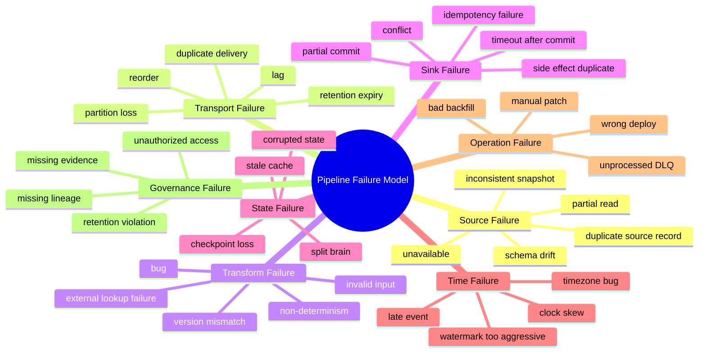
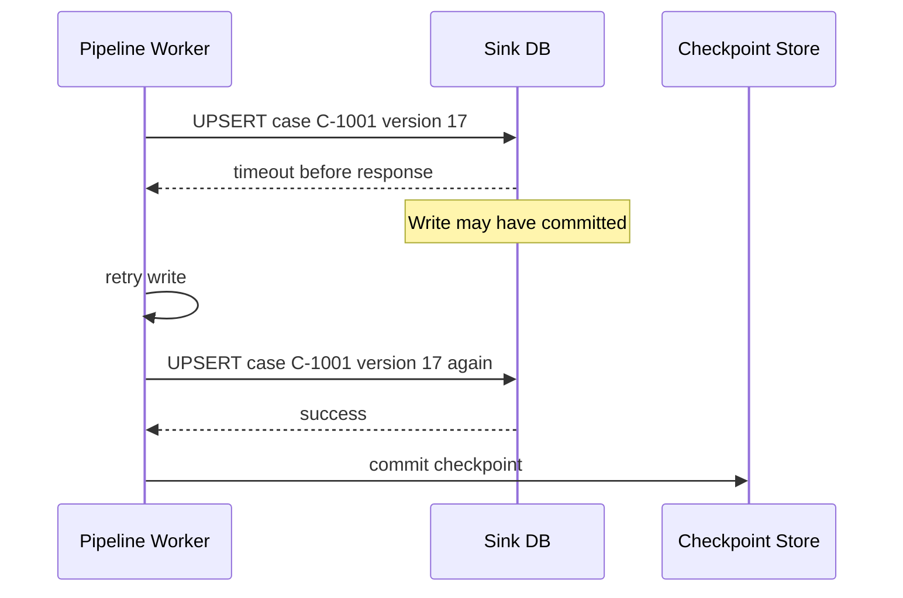
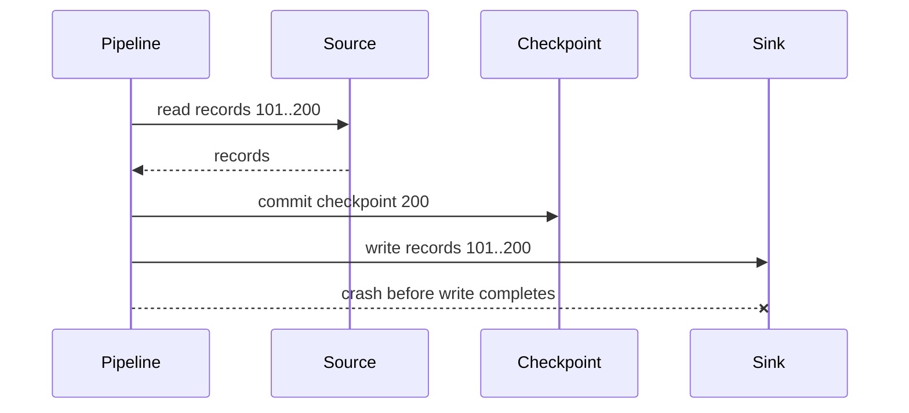
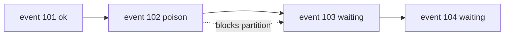
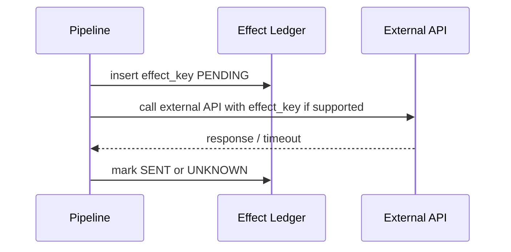

# Part 006 — Pipeline Failure Model

> Data pipeline gagal bukan hanya ketika job merah. Pipeline juga gagal ketika job hijau tetapi data hilang, duplicate tidak terdeteksi, urutan rusak, sink berisi state mustahil, atau laporan terlihat benar tetapi tidak bisa diaudit.

Bagian ini membangun failure model untuk pipeline Java production-grade.

Kita akan berpikir seperti ini:

```text
A pipeline is correct only relative to a failure model.
```

Tanpa failure model, statement seperti “pipeline ini reliable” tidak bermakna. Reliable terhadap apa?

- Broker mati?
- Worker restart?
- Duplicate event?
- Event telat?
- Sink timeout setelah commit?
- Database deadlock?
- Schema berubah?
- Backfill manual salah range?
- Operator menjalankan ulang job dua kali?
- Data source mengirim correction bulan depan?

Top engineer tidak mendesain pipeline dengan asumsi happy path. Ia mendesain pipeline dengan daftar failure yang eksplisit, lalu memilih invariant mana yang harus tetap dijaga.

---

## 1. Job Failure vs Data Failure

Kesalahan awal adalah menyamakan pipeline failure dengan job failure.

| Jenis failure | Contoh | Terlihat di dashboard job? | Dampak |
|---|---|---:|---|
| Job failure | process crash, exception, task failed | biasanya ya | pipeline berhenti |
| Data failure | missing rows, duplicate output, wrong status | sering tidak | keputusan bisnis salah |
| Semantic failure | field valid secara teknis tetapi salah makna | jarang | laporan menipu |
| Operational failure | alert tidak actionable, DLQ tidak diproses | sebagian | masalah menumpuk |
| Governance failure | lineage hilang, audit tidak cukup | jarang | tidak defensible |

Pipeline yang hanya memonitor “job success” belum production-grade.

Contoh:

```text
Job status: SUCCESS
Processed records: 1,000,000
Sink writes: 1,000,000
```

Terlihat sehat. Tetapi mungkin:

- 50.000 record duplicate;
- 10.000 case status lama menimpa status baru;
- 2 tenant tidak terbaca karena cursor bug;
- field `effectiveDate` salah timezone;
- delete event tidak diproses;
- retry mengirim email notifikasi dua kali.

Job hijau tidak membuktikan data benar.

---

## 2. Failure Model Dasar

Minimal pipeline failure model mencakup delapan kelas besar:



Setiap kelas failure punya bentuk mitigasi berbeda. Jangan pakai satu jawaban untuk semua, misalnya “tambahkan retry”. Retry membantu sebagian failure dan memperparah sebagian lain.

---

## 3. Duplicate: Failure Paling Umum dan Paling Normal

Duplicate bukan anomali. Dalam distributed system, duplicate adalah konsekuensi normal dari retry, uncertain acknowledgment, consumer restart, dan replay.

Duplicate bisa muncul di berbagai layer:

| Layer | Penyebab duplicate |
|---|---|
| Source | API mengembalikan page sama, CDC connector restart dari offset lama |
| Transport | producer retry, consumer rebalance, at-least-once delivery |
| Transform | transform 1->N dijalankan ulang |
| Sink | write sukses tetapi ack timeout, job retry |
| Operation | operator melakukan backfill range overlap |

Pertanyaan bukan “bagaimana mencegah semua duplicate”. Pertanyaan yang lebih realistis:

> Duplicate mana yang mungkin terjadi, dan boundary mana yang membuatnya tidak berbahaya?

---

## 4. Duplicate Example: Timeout After Commit

Misalnya pipeline menulis ke database:



Jika sink insert biasa:

```sql
INSERT INTO case_summary(case_id, version, status) VALUES (?, ?, ?);
```

Retry bisa gagal karena duplicate key, atau lebih buruk: menghasilkan dua row jika tidak ada unique constraint.

Idempotent sink:

```sql
INSERT INTO case_summary(case_id, source_version, status)
VALUES (?, ?, ?)
ON CONFLICT (case_id)
DO UPDATE SET
  source_version = EXCLUDED.source_version,
  status = EXCLUDED.status
WHERE case_summary.source_version < EXCLUDED.source_version;
```

Dengan idempotency/version guard, duplicate menjadi harmless.

---

## 5. Duplicate Taxonomy

Tidak semua duplicate sama.

| Duplicate type | Definisi | Contoh | Mitigasi |
|---|---|---|---|
| Byte duplicate | payload identik dikirim ulang | same Kafka event read twice | idempotency key |
| Semantic duplicate | payload berbeda tetapi efek bisnis sama | same case assignment with different metadata | business key dedupe |
| Attempt duplicate | operasi sama dicoba ulang | retry API call | idempotency token |
| Backfill duplicate | data range overlap | daily job + manual rerun | run ID + deterministic key |
| Correction duplicate | correction dikirim beberapa kali | reissued amendment | version/effective time |
| Fan-out duplicate | 1 input menghasilkan N output lalu retry | one order -> lines | output-level key |

Top engineer mendesain dedupe berdasarkan semantic effect, bukan hanya hash payload.

Payload hash bisa gagal karena metadata berubah:

```json
{
  "caseId": "C-1001",
  "version": 17,
  "status": "ESCALATED",
  "processedAt": "2026-07-04T08:00:00Z"
}
```

Jika `processedAt` berbeda saat retry, hash payload berbeda, padahal efek bisnis sama.

---

## 6. Data Loss: Failure Paling Mahal karena Sering Tidak Berisik

Data loss bisa terjadi tanpa exception.

Contoh umum:

```java
Instant cursor = Instant.now();
List<Row> rows = query("where updated_at > ?", lastCursor);
checkpoint.save(cursor);
```

Jika ada row committed dengan `updated_at` sebelum `cursor` tetapi visible setelah query, row bisa hilang.

Data loss juga bisa muncul dari:

- checkpoint maju sebelum sink sukses;
- filter tanpa reason;
- DLQ yang tidak pernah diproses;
- Kafka retention habis sebelum consumer replay;
- object storage file partial dianggap lengkap;
- source pagination bug;
- timestamp precision mismatch;
- timezone conversion salah;
- schema evolution membuat field diabaikan;
- join inner membuang record tanpa pasangan;
- watermark terlalu agresif membuang late event.

Data loss harus dipikirkan sebagai kelas failure sendiri, bukan sekadar “tidak ada error”.

---

## 7. Loss Example: Checkpoint Before Write



Setelah restart, pipeline mulai dari checkpoint 200. Records 101..200 tidak akan dibaca ulang. Data hilang.

Aturan dasar:

```text
Never advance source checkpoint before output is safely accounted for.
```

“Safely accounted for” bisa berarti:

- sink write sukses;
- record ditulis ke quarantine dengan evidence;
- record dipindahkan ke DLQ yang durable;
- output sudah menjadi bagian transaction yang juga menyimpan checkpoint.

Bukan berarti “sudah dicoba”.

---

## 8. Loss Example: Timestamp Cursor dengan Ties

Query:

```sql
SELECT *
FROM cases
WHERE updated_at > :lastUpdatedAt
ORDER BY updated_at
LIMIT 1000;
```

Jika banyak row punya timestamp sama, sebagian bisa terlewat saat batch boundary.

Misalnya batch pertama membaca 1000 row sampai:

```text
lastUpdatedAt = 2026-07-04T10:00:00Z
```

Masih ada 200 row lain dengan timestamp sama. Query berikutnya memakai `>` sehingga 200 row itu hilang.

Mitigasi:

```sql
SELECT *
FROM cases
WHERE (updated_at, case_id, version) > (:lastUpdatedAt, :lastCaseId, :lastVersion)
ORDER BY updated_at, case_id, version
LIMIT 1000;
```

Cursor harus punya tie-breaker stabil.

---

## 9. Reorder: Urutan Rusak tetapi Sistem Terlihat Normal

Reorder berarti record diproses tidak sesuai urutan yang diasumsikan business logic.

Contoh case lifecycle:

```text
v10: CASE_OPENED
v11: CASE_ESCALATED
v12: CASE_CLOSED
```

Jika arrival order:

```text
v12 -> v11
```

Sink naive bisa menghasilkan status akhir `ESCALATED`, padahal seharusnya `CLOSED`.

Mitigasi:

- partition by entity key;
- version guard di sink;
- stateful reorder buffer;
- reject out-of-order beyond tolerance;
- design event as commutative bila memungkinkan;
- use event-time and watermark for windows.

Sink version guard:

```sql
UPDATE case_summary
SET status = :status,
    source_version = :sourceVersion
WHERE case_id = :caseId
  AND source_version < :sourceVersion;
```

Ini tidak mencegah reorder, tetapi mencegah reorder merusak final state.

---

## 10. Reorder Taxonomy

| Reorder type | Contoh | Dampak |
|---|---|---|
| Arrival reorder | event lama datang setelah event baru | latest state salah |
| Partition reorder | key salah sehingga entity pindah partition | consumer parallel merusak order |
| Retry reorder | failed record di-retry setelah later record sukses | state mundur |
| Backfill reorder | historical replay masuk setelah live stream | historical menimpa current |
| Join reorder | reference update datang setelah fact event | enrichment salah |
| Window reorder | late event datang setelah window closed | aggregate kurang |

Penting: tidak semua pipeline butuh strict order. Tetapi pipeline harus tahu ordering domain-nya.

Pertanyaan desain:

```text
Order matters globally, per tenant, per entity, per aggregate key, or not at all?
```

Jawaban paling umum: per entity atau per aggregate key.

---

## 11. Poison Data

Poison data adalah record yang membuat pipeline gagal berulang kali.

Contoh:

- payload malformed;
- enum value tidak dikenal;
- required field null;
- timestamp di luar range;
- record terlalu besar;
- schema version belum didukung;
- reference key tidak ditemukan;
- data valid secara teknis tetapi melanggar invariant bisnis.

Jika pipeline memproses ordered stream dan satu poison record membuat consumer berhenti, seluruh partition bisa macet.



Poison data harus diisolasi dengan policy, bukan hanya retry infinite.

---

## 12. Poison Handling Decision

| Policy | Cara kerja | Cocok untuk | Risiko |
|---|---|---|---|
| Fail fast | stop pipeline | critical correctness | availability rendah |
| Retry with limit | coba beberapa kali | transient dependency | poison tetap macet sampai limit |
| Quarantine and advance | simpan record + reason, lanjut | high-volume pipeline | butuh remediation disiplin |
| DLQ | kirim ke topic/table error | event-driven remediation | DLQ sering jadi kuburan |
| Skip | buang record | telemetry low value | data loss |
| Patch transform | deploy fix lalu replay | schema/logic bug | butuh rollback/replay plan |

Untuk pipeline yang memengaruhi keputusan regulasi, skip tanpa evidence hampir selalu salah.

Quarantine record minimal harus menyimpan:

```java
public record QuarantinedRecord(
        String pipelineName,
        String sourceName,
        RecordIdentity identity,
        byte[] rawPayload,
        String schemaVersion,
        String reasonCode,
        String reasonDetail,
        boolean retryable,
        Instant quarantinedAt,
        Checkpoint sourceCheckpoint,
        Map<String, String> metadata
) {}
```

Tanpa raw payload dan checkpoint, remediation sulit.

---

## 13. Partial Commit

Partial commit terjadi ketika sebagian output berhasil dan sebagian gagal.

Contoh batch:

```text
Input records: 1..100
Sink wrote: 1..73
Sink failed: 74
Unknown: 75..100
```

Jika pipeline retry seluruh batch, records 1..73 duplicate. Jika checkpoint maju, records 74..100 hilang. Jika pipeline berhenti, operator perlu tahu apa yang sudah committed.

Partial commit sangat tergantung sink.

| Sink | Partial behavior |
|---|---|
| DB transaction | bisa atomic jika satu transaction |
| DB per-row upsert | partial per row mungkin terjadi |
| Kafka producer | per record ack bisa berbeda; transaction dapat mengubah boundary |
| Object storage | object write mungkin sukses tetapi manifest belum commit |
| External API | partial dan uncertain response umum terjadi |
| Search index | bulk API sering mengembalikan per-item status |

Sink interface harus bisa menyatakan partial, bukan hanya throw exception.

```java
public record PartialCommit(
        List<OutputIdentity> knownCommitted,
        List<OutputIdentity> knownFailed,
        List<OutputIdentity> unknown,
        boolean retryWholeBatchSafe
) {}
```

Jika sink tidak bisa melaporkan partial dengan jelas, asumsikan unknown dan gunakan idempotency/reconciliation.

---

## 14. Unknown Outcome: Failure yang Paling Mengganggu

Distributed system sering menghasilkan outcome tidak diketahui.

Contoh:

```text
Client sends write request.
Server commits write.
Network breaks before response.
Client sees timeout.
```

Dari sisi client, write mungkin sukses atau gagal.

Mitigasi:

1. Idempotency key.
2. Read-after-write verification jika tersedia.
3. Commit token/job id.
4. Reconciliation process.
5. Retry only if operation is safe.

External API tanpa idempotency key adalah sink berisiko tinggi.

Contoh buruk:

```java
notificationApi.sendEmail(caseId, recipient, body);
```

Jika timeout setelah email terkirim, retry bisa mengirim email kedua.

Lebih baik:

```java
notificationApi.sendEmail(
    new SendEmailRequest(
        idempotencyKey,
        caseId,
        recipient,
        body
    )
);
```

Jika API tidak mendukung idempotency, kamu perlu side-effect ledger di sisi pipeline.

---

## 15. Side-Effect Ledger

Side-effect ledger menyimpan operasi eksternal sebelum/sesudah dieksekusi.

```sql
CREATE TABLE outbound_effect_ledger (
    effect_key text PRIMARY KEY,
    effect_type text NOT NULL,
    target text NOT NULL,
    request_payload jsonb NOT NULL,
    status text NOT NULL,
    attempts int NOT NULL DEFAULT 0,
    last_error text,
    created_at timestamptz NOT NULL,
    updated_at timestamptz NOT NULL
);
```

Flow:



Jika outcome unknown, reconciliation worker bisa memeriksa status atau melakukan manual remediation.

Rule:

> Non-idempotent external side effect must not be hidden inside transform logic.

---

## 16. Split Brain dan Multiple Writers

Split brain dalam pipeline terjadi ketika dua worker/job instance memproses partition/range yang sama dan keduanya percaya berhak menulis.

Penyebab:

- scheduler menjalankan job duplicate;
- lock tidak reliable;
- deployment lama dan baru berjalan bersamaan;
- consumer group salah konfigurasi;
- manual backfill overlap dengan live job;
- multi-region active-active tanpa ownership jelas.

Dampak:

- duplicate output;
- checkpoint saling menimpa;
- output version mundur;
- sink hot contention;
- inconsistent aggregate.

Mitigasi:

- partition ownership protocol;
- lease dengan fencing token;
- optimistic version in checkpoint store;
- sink idempotency;
- run isolation untuk backfill;
- explicit writer identity di metadata.

---

## 17. Fencing Token

Lease biasa tidak cukup jika worker lama freeze lalu hidup lagi.

Contoh:

```text
Worker A gets lease token 10.
Worker A freezes.
Lease expires.
Worker B gets lease token 11.
Worker A resumes and writes stale output.
```

Sink/checkpoint harus menolak token lama.

```sql
UPDATE pipeline_checkpoint
SET checkpoint_value = :checkpoint,
    fencing_token = :token
WHERE pipeline_name = :pipeline
  AND partition_key = :partition
  AND fencing_token = :expectedPreviousToken;
```

Atau setiap write membawa token dan sink menolak stale writer.

```java
public record WriterLease(
        String pipelineName,
        String partition,
        long fencingToken,
        Instant expiresAt
) {}
```

Fencing lebih penting daripada sekadar distributed lock. Lock menjawab “siapa sekarang memegang hak”. Fencing menjawab “bagaimana menolak penulis lama yang hidup kembali”.

---

## 18. Checkpoint Corruption

Checkpoint adalah state kritis. Jika salah, pipeline bisa:

- membaca ulang data terlalu banyak;
- melewatkan data;
- stuck di posisi lama;
- melompat ke future offset;
- tidak bisa replay karena metadata hilang.

Checkpoint harus diperlakukan seperti data produksi.

Minimal checkpoint record:

```java
public record CheckpointRecord(
        String pipelineName,
        String partitionKey,
        String checkpointValue,
        String checkpointType,
        long version,
        Instant committedAt,
        String committedBy,
        String sinkCommitToken,
        Map<String, String> metadata
) {}
```

Praktik penting:

- update checkpoint dengan optimistic locking;
- simpan history checkpoint;
- jangan overwrite tanpa audit;
- validasi monotonicity jika checkpoint harus maju;
- sediakan rollback terkontrol;
- checkpoint commit harus terkait dengan sink evidence.

---

## 19. State Corruption

Stateful stream processing menyimpan state seperti:

- dedupe set;
- aggregate window;
- join buffer;
- last-seen version;
- watermark progress;
- enrichment cache;
- session state.

State corruption bisa terjadi karena:

- bug serialization;
- schema state berubah tanpa migration;
- TTL terlalu pendek;
- restore dari checkpoint lama;
- operator UID berubah;
- cache stale;
- inconsistent reference data.

Mitigasi:

- versioned state schema;
- savepoint migration plan;
- deterministic state rebuild dari source log;
- periodic reconciliation dengan sink;
- metrics untuk state size dan eviction;
- canary replay.

Rule:

> State yang tidak bisa dijelaskan asal-usulnya akan menjadi liability saat incident.

---

## 20. Stale Reference Data

Pipeline sering melakukan enrichment:

```text
case event + officer reference table -> enriched case event
```

Failure: reference data stale.

Contoh:

- officer pindah unit;
- case event lama diproses dengan unit baru;
- laporan historis salah;
- replay menghasilkan output berbeda.

Mitigasi:

| Strategy | Cara kerja |
|---|---|
| Effective-dated reference | join berdasarkan event effective time |
| Snapshot reference | gunakan snapshot referensi per run/backfill |
| Versioned lookup | metadata output menyimpan reference version |
| CDC reference stream | reference update menjadi stream yang bisa di-join temporal |
| Cache TTL metrics | stale cache terlihat sebagai metric |

Jangan sebut enrichment deterministic jika reference lookup tidak versioned.

---

## 21. Late Data

Late data adalah record yang event time-nya lebih lama dari progress processing saat ini.

Late data bukan selalu error. Dalam dunia nyata:

- mobile/offline client sync terlambat;
- source melakukan correction;
- CDC snapshot dan stream overlap;
- network delay;
- partner API mengirim data batch terlambat;
- manual case update backdated.

Pipeline harus punya late data policy.

| Policy | Cara kerja | Risiko |
|---|---|---|
| Accept forever | semua late event diterima | state besar, output sering berubah |
| Accept within allowed lateness | terima sampai batas tertentu | late extreme jadi rejected |
| Send to correction lane | late event diproses khusus | kompleksitas consumer |
| Ignore after watermark | buang setelah window close | data loss |
| Recompute affected window | batch correction/reprocessing | biaya |

Untuk regulatory pipeline, late correction biasanya tidak boleh diabaikan. Yang berubah adalah jalur pemrosesan dan audit, bukan kebenaran data.

---

## 22. Clock Skew dan Timezone Failure

Time failure sering terlihat sepele tetapi efeknya besar.

Contoh:

```java
LocalDate reportDate = LocalDate.now();
```

Jika worker berjalan di timezone berbeda dari business timezone, report period bisa salah.

Masalah umum:

- memakai processing time untuk event time;
- timezone default JVM berbeda antar environment;
- daylight saving tidak dipikirkan;
- source timestamp tanpa timezone;
- precision mismatch millis vs micros;
- database `timestamp without time zone` disalahartikan;
- ordering berdasarkan clock dari banyak host.

Aturan:

- simpan instant teknis sebagai UTC instant;
- simpan business date/time dengan timezone eksplisit;
- jangan gunakan `LocalDateTime` untuk instant global;
- bedakan `eventTime`, `sourceCommitTime`, `processingTime`, dan `effectiveTime`;
- jangan gunakan wall clock sebagai source cursor kecuali contract benar-benar mendukungnya.

Java tip:

```java
Clock clock = Clock.systemUTC();
Instant now = clock.instant();
```

Untuk domain date:

```java
ZoneId businessZone = ZoneId.of("Asia/Jakarta");
LocalDate businessDate = LocalDate.now(clock.withZone(businessZone));
```

---

## 23. Schema Drift dan Semantic Drift

Schema drift:

```text
field added / removed / renamed / type changed
```

Semantic drift:

```text
field masih ada, tetapi maknanya berubah
```

Semantic drift lebih berbahaya karena schema validation bisa tetap hijau.

Contoh:

```json
{
  "status": "CLOSED"
}
```

Sebelumnya `CLOSED` berarti case selesai final. Setelah product change, `CLOSED` berarti closed sementara menunggu review. Schema tidak berubah, tetapi meaning berubah.

Mitigasi semantic drift:

- domain event naming spesifik;
- data contract mencakup meaning, bukan hanya type;
- consumer-driven contract review;
- versioned enum semantics;
- data quality distribution monitoring;
- release note wajib untuk producer changes;
- business owner sign-off untuk semantic fields.

---

## 24. Retention Expiry

Retention expiry terjadi ketika source log tidak lagi menyimpan data yang dibutuhkan untuk replay/recovery.

Contoh:

```text
Kafka retention: 7 days
Consumer down: 10 days
Last committed offset expired
```

Pipeline tidak bisa melanjutkan dari offset lama. Pilihan:

- reset ke earliest yang tersedia: data loss;
- reset ke latest: data loss lebih besar;
- restore dari snapshot/lake;
- full reload dari source;
- manual remediation.

Retention harus dihitung berdasarkan recovery objective, bukan default.

Pertanyaan desain:

- Berapa lama pipeline bisa down tanpa kehilangan replay capability?
- Apakah ada cold storage untuk raw events?
- Apakah snapshot berkala tersedia?
- Apakah sink bisa direbuild dari source?
- Berapa biaya full reprocess?

---

## 25. Backfill Failure

Backfill adalah operasi berbahaya karena sering melewati jalur normal.

Failure umum:

- range salah;
- overlap dengan live pipeline;
- transform version berbeda;
- output lama menimpa output baru;
- idempotency key tidak mencakup run/version;
- throughput backfill menghantam sink;
- DLQ backfill tidak dimonitor;
- data historis memakai schema lama yang tidak lagi didukung.

Backfill harus punya run contract:

```yaml
backfill:
  run_id: bf-2026-07-case-status
  input_range:
    from: 2026-01-01T00:00:00Z
    to: 2026-07-01T00:00:00Z
  transform_version: normalize-case-status.v2
  sink_mode: upsert_if_newer_version
  live_pipeline_interaction: do_not_override_newer_versions
  rate_limit: 500 records/second
  validation:
    expected_min_records: 1000000
    reconciliation_required: true
```

Backfill bukan sekadar “run ulang job”. Ia adalah controlled data mutation.

---

## 26. Operator-Induced Failure

Manusia adalah bagian dari failure model.

Contoh:

- menjalankan job dua kali;
- menghapus checkpoint;
- replay topic salah;
- deploy config topic salah;
- override schema compatibility;
- truncate sink table tanpa snapshot;
- memindahkan file sebelum lengkap;
- mengabaikan DLQ karena job utama hijau;
- menjalankan patch SQL manual tanpa audit.

Mitigasi:

- runbook dengan precondition;
- dry-run mode;
- approval untuk destructive operation;
- immutable audit log;
- scoped permissions;
- guardrail di tooling;
- automatic diff sebelum backfill;
- post-run reconciliation.

Jangan desain platform pipeline seolah hanya kode yang gagal. Operasi manual harus masuk model.

---

## 27. Failure Matrix

Gunakan matrix ini saat desain.

| Failure | Deteksi | Mitigasi | Evidence |
|---|---|---|---|
| Duplicate | dedupe count, unique conflict | idempotency key, version guard | duplicate metrics, conflict logs |
| Loss | reconciliation, count gap | checkpoint after sink, durable DLQ | source/sink count, checksum |
| Reorder | version regression metric | partition key, version guard | rejected stale update logs |
| Poison | rejection metric | quarantine/DLQ | raw payload + reason |
| Partial commit | sink result detail | transaction/idempotency/retry | commit token, per-record status |
| Unknown outcome | timeout metric | idempotency/read-after-write | ledger status |
| Split brain | writer token conflict | fencing, lease, idempotency | token history |
| Late data | watermark/late metric | allowed lateness/correction lane | late event log |
| Schema drift | contract test/schema registry | compatibility rules | schema version evidence |
| Backfill mistake | reconciliation diff | dry-run, run id, approval | backfill manifest |

---

## 28. Java Failure Modeling

Jangan model semua error sebagai `Exception`.

Kita perlu domain failure type.

```java
public sealed interface PipelineFailure
        permits SourceFailure, TransformFailure, SinkFailure, StateFailure, OperationFailure {

    String code();
    boolean retryable();
    FailureSeverity severity();
    Map<String, String> attributes();
}

public enum FailureSeverity {
    INFO,
    WARNING,
    ERROR,
    CRITICAL
}
```

Source failure:

```java
public record SourceFailure(
        String code,
        boolean retryable,
        FailureSeverity severity,
        Map<String, String> attributes
) implements PipelineFailure {}
```

Sink failure:

```java
public record SinkFailure(
        String code,
        boolean retryable,
        FailureSeverity severity,
        SinkOutcome outcome,
        Map<String, String> attributes
) implements PipelineFailure {}

public enum SinkOutcome {
    NO_COMMIT,
    COMMITTED,
    PARTIAL_COMMIT,
    UNKNOWN
}
```

`UNKNOWN` harus explicit. Jika tidak, engineer sering salah menganggap timeout berarti no commit.

---

## 29. Retry Classification

Retry hanya aman untuk failure tertentu.

| Failure | Retry? | Catatan |
|---|---:|---|
| network timeout before source read | yes | safe jika read side-effect free |
| sink timeout after possible commit | only with idempotency | outcome unknown |
| malformed payload | no | retry tidak mengubah data |
| unsupported schema | no until deploy | butuh transform/schema update |
| rate limit | yes with backoff | respect retry-after |
| DB deadlock | yes | retry transaction |
| duplicate key | depends | mungkin success semantic |
| validation failed | usually no | source/domain issue |
| checkpoint optimistic lock conflict | yes/inspect | mungkin split brain |

Retry policy harus berbasis classification.

```java
public final class RetryDecider {
    public RetryDecision decide(PipelineFailure failure) {
        if (!failure.retryable()) {
            return RetryDecision.doNotRetry(failure.code());
        }

        if (failure instanceof SinkFailure sink
                && sink.outcome() == SinkOutcome.UNKNOWN) {
            return RetryDecision.retryOnlyIfIdempotent("sink outcome unknown");
        }

        return RetryDecision.retryWithBackoff();
    }
}
```

---

## 30. Error Budget untuk Failure

Tidak semua failure punya toleransi sama.

Contoh SLO:

```yaml
slo:
  freshness:
    p95: 5 minutes
  completeness:
    monthly: 99.999%
  duplicate_effect_rate:
    monthly: 0
  unprocessed_quarantine_age:
    max: 24 hours
  schema_break_detection:
    max: 10 minutes
```

Beberapa hal boleh degrade. Beberapa tidak.

| Property | Bisa degrade? | Contoh |
|---|---:|---|
| Freshness | sering ya | dashboard terlambat 10 menit |
| Throughput | ya | backlog sementara |
| Completeness | tergantung | analytics mungkin toleran, regulatory tidak |
| Duplicate side effect | hampir tidak | email/payment/decision duplicate |
| Audit lineage | tidak untuk regulated output | output harus defensible |
| PII protection | tidak | compliance breach |

Failure model harus dikaitkan dengan SLO dan risk appetite.

---

## 31. Observability untuk Failure Model

Metrik pipeline harus mengukur failure model, bukan hanya resource.

Metrik minimal:

```text
pipeline_records_read_total
pipeline_records_emitted_total
pipeline_records_filtered_total{reason}
pipeline_records_rejected_total{reason,retryable}
pipeline_sink_writes_total{outcome}
pipeline_duplicate_records_total{dedupe_type}
pipeline_late_records_total{lateness_bucket}
pipeline_checkpoint_age_seconds
pipeline_source_lag_seconds
pipeline_quarantine_oldest_age_seconds
pipeline_reconciliation_mismatch_total{type}
pipeline_backfill_active_runs
pipeline_writer_fencing_conflicts_total
```

Metric names bukan dogma. Yang penting adalah failure dapat dilihat.

Bad dashboard:

```text
CPU, memory, job status
```

Better dashboard:

```text
freshness, completeness, duplicate, rejection, lag, quarantine age, checkpoint age, sink latency, reconciliation mismatch
```

---

## 32. Reconciliation sebagai Safety Net

Reconciliation membandingkan source dan sink untuk mendeteksi data failure.

Level reconciliation:

| Level | Contoh |
|---|---|
| Count | source count vs sink count |
| Key set | missing/extra IDs |
| Checksum | hash aggregate per partition/window |
| Balance | total amount/source of funds |
| Version | max version per entity |
| Semantic | status distribution, impossible transitions |
| Lineage | output row traceable to input event |

Contoh reconciliation query:

```sql
-- Source-derived expected count per day
SELECT effective_date, count(*)
FROM case_events_raw
WHERE event_type = 'CASE_STATUS_CHANGED'
GROUP BY effective_date;

-- Sink count per day
SELECT effective_date, count(*)
FROM case_status_fact
GROUP BY effective_date;
```

Untuk latest-state sink, count saja tidak cukup. Periksa version.

```sql
SELECT s.case_id, s.source_version AS sink_version, e.max_version AS expected_version
FROM case_status_summary s
JOIN (
  SELECT case_id, max(case_version) AS max_version
  FROM case_status_events_raw
  GROUP BY case_id
) e ON s.case_id = e.case_id
WHERE s.source_version <> e.max_version;
```

---

## 33. Failure Injection

Pipeline reliability tidak bisa dibuktikan hanya dengan unit test happy path.

Inject failure:

- source timeout;
- duplicate page;
- partial page;
- malformed payload;
- schema version unknown;
- sink timeout after commit;
- sink partial success;
- checkpoint write failure;
- worker crash after sink before checkpoint;
- reorder events;
- late event beyond window;
- duplicate backfill run;
- stale reference data.

Test harness sederhana:

```java
public final class FaultInjectingSink<O> implements PipelineSink<O> {
    private final PipelineSink<O> delegate;
    private final FaultPlan faultPlan;

    @Override
    public SinkResult write(List<OutputRecord<O>> records, SinkContext context) {
        if (faultPlan.shouldTimeoutAfterCommit(context.attempt())) {
            delegate.write(records, context);
            throw new SimulatedTimeoutException("timeout after commit");
        }

        if (faultPlan.shouldPartialCommit(context.attempt())) {
            return new SinkResult.Partial(
                    records.stream().limit(5).map(OutputRecord::identity).toList(),
                    records.stream().skip(5).map(OutputRecord::identity).toList(),
                    false,
                    "simulated partial commit"
            );
        }

        return delegate.write(records, context);
    }
}
```

Tujuannya bukan membuat test rumit. Tujuannya membuktikan invariant tetap bertahan saat failure yang diprediksi terjadi.

---

## 34. Incident Thinking

Saat pipeline incident, jangan mulai dari “exception apa?” saja. Mulai dari invariant.

Pertanyaan incident:

1. Apa invariant yang mungkin rusak?
2. Apakah data hilang, duplicate, terlambat, salah urut, atau salah makna?
3. Range waktu/entity/tenant mana yang terdampak?
4. Apakah sink menerima partial commit?
5. Checkpoint terakhir yang aman apa?
6. Apakah raw input masih tersedia untuk replay?
7. Apakah transform version berubah selama incident?
8. Apakah ada manual operation/backfill/deploy?
9. Apakah downstream sudah mengonsumsi output salah?
10. Apa evidence yang bisa membuktikan remediation selesai?

Incident pipeline yang baik harus bisa menjawab “berapa blast radius data”, bukan hanya “service sudah up”.

---

## 35. Case Study: Wrong Enforcement Status

Scenario:

```text
Pipeline: case-status-summary
Bug: late event v11 overwrites current status v12
Impact: dashboard shows case ESCALATED although case is CLOSED
```

Root cause:

- sink update tidak punya version guard;
- pipeline mengasumsikan arrival order sama dengan business version order;
- backfill replay historical events masuk ke sink yang sama dengan live stream;
- no metric for stale update attempts.

Naive sink:

```sql
UPDATE case_status_summary
SET status = :status,
    updated_at = now()
WHERE case_id = :caseId;
```

Fixed sink:

```sql
INSERT INTO case_status_summary(case_id, status, source_version, effective_time)
VALUES (:caseId, :status, :sourceVersion, :effectiveTime)
ON CONFLICT (case_id)
DO UPDATE SET
  status = EXCLUDED.status,
  source_version = EXCLUDED.source_version,
  effective_time = EXCLUDED.effective_time
WHERE case_status_summary.source_version < EXCLUDED.source_version;
```

Additional metric:

```text
pipeline_stale_update_rejected_total{pipeline="case-status-summary"}
```

Post-incident remediation:

1. Identify affected case IDs where sink version lower than source max version.
2. Rebuild sink state for affected case IDs from raw event log.
3. Deploy version guard.
4. Add failure injection test for reorder.
5. Add backfill isolation rule.
6. Add stale update metric and alert threshold.

---

## 36. Failure Model Review Checklist

Sebelum pipeline production, jawab ini.

### Duplicate

- Dari mana duplicate bisa muncul?
- Apa idempotency key setiap output?
- Apakah key merepresentasikan efek bisnis?
- Apakah retry sink aman?
- Apakah backfill overlap aman?

### Loss

- Kapan checkpoint maju?
- Apakah checkpoint bisa maju untuk rejected record?
- Apakah quarantine durable?
- Bagaimana membuktikan tidak ada missing key?
- Apakah retention cukup untuk recovery?

### Reorder

- Ordering diperlukan per apa?
- Apakah partition key menjaga ordering domain?
- Apakah sink punya version guard?
- Apakah late historical replay bisa menimpa live data?

### Poison

- Apa policy untuk malformed/invalid record?
- Apakah retry dibatasi?
- Apakah quarantine punya raw payload?
- Siapa owner remediation?

### Partial / Unknown Commit

- Apakah sink atomic?
- Apakah sink bisa melaporkan per-record result?
- Apa yang dilakukan saat outcome unknown?
- Apakah reconciliation tersedia?

### Split Brain

- Apakah dua job bisa memproses range sama?
- Apakah ada lease/fencing?
- Apakah checkpoint update memakai optimistic locking?
- Apakah backfill terisolasi dari live writer?

### Time

- Time field apa saja yang digunakan?
- Apakah timezone eksplisit?
- Apakah event time berbeda dari processing time?
- Apa late data policy?

### Governance

- Apakah lineage tersedia?
- Apakah output bisa ditelusuri ke input?
- Apakah manual operation punya audit?
- Apakah PII/sensitive data failure masuk model?

---

## 37. Apa yang Harus Kamu Kuasai dari Part Ini

Setelah bagian ini, kamu harus mampu:

- membedakan job failure dan data failure;
- menjelaskan duplicate, loss, reorder, poison, partial commit, unknown outcome, split brain, late data, schema drift, dan backfill failure;
- mendesain idempotency dan version guard;
- menjelaskan kenapa timeout tidak selalu berarti write gagal;
- membuat quarantine record yang berguna untuk remediation;
- mendesain checkpoint agar tidak menyebabkan data loss;
- memakai fencing token untuk mencegah stale writer;
- menghubungkan failure model ke metrics, SLO, dan incident response;
- menulis Java failure type yang lebih informatif daripada generic exception.

---

## 38. Latihan Praktis

Ambil pipeline:

```text
Kafka topic: case.events
Processor: Java case lifecycle projector
Sink: PostgreSQL case_summary
```

Buat failure model:

1. Duplicate sources.
2. Loss scenarios.
3. Reorder scenarios.
4. Poison data examples.
5. Partial commit behavior.
6. Unknown outcome behavior.
7. Split brain risk.
8. Late data policy.
9. Backfill policy.
10. Metrics for each failure.
11. Reconciliation query.
12. Runbook action for each critical failure.

Jika kamu hanya menemukan “consumer crash” sebagai failure, ulangi. Itu baru job failure, belum data failure.

---

## 39. Ringkasan

Pipeline production-grade harus didesain dari failure model, bukan dari happy path API.

Failure utama:

- duplicate;
- data loss;
- reorder;
- poison data;
- partial commit;
- unknown outcome;
- split brain;
- checkpoint/state corruption;
- stale reference data;
- late data;
- clock/timezone error;
- schema/semantic drift;
- retention expiry;
- backfill failure;
- operator-induced failure;
- governance/audit failure.

Respons yang matang bukan “tambahkan retry”. Respons yang matang adalah:

```text
classify failure -> decide retry safety -> preserve evidence -> protect invariant -> reconcile -> remediate
```

Di part berikutnya, kita akan membedah delivery semantics: at-most-once, at-least-once, effectively-once, dan exactly-once. Fokusnya bukan definisi textbook, tetapi boundary nyata: apa yang benar-benar dijamin oleh source, transport, processor, sink, dan checkpoint.

---

## Referensi Lanjutan

- Apache Kafka Documentation — delivery semantics, producer idempotence, transactions, consumers: `https://kafka.apache.org/documentation/`
- Apache Flink Documentation — checkpoints, state, event time, watermarks, fault tolerance: `https://nightlies.apache.org/flink/flink-docs-stable/`
- Apache Beam Programming Guide — windowing, triggers, late data, allowed lateness: `https://beam.apache.org/documentation/programming-guide/`
- Debezium Documentation — CDC connector offsets, snapshots, transaction logs, outbox routing: `https://debezium.io/documentation/`
- Martin Kleppmann, Designing Data-Intensive Applications — distributed systems failure and data correctness concepts
