# Part 007 — Delivery Semantics Reality

Most engineers learn delivery semantics as three labels:

- **at-most-once**
- **at-least-once**
- **exactly-once**

That list is dangerously incomplete.

In production, delivery semantics is not a property of a single tool. It is the emergent behavior of five boundaries:

1. how the source exposes progress,
2. how the transport stores and redelivers records,
3. how the processor commits state,
4. how the sink applies side effects,
5. how downstream consumers interpret the result.

A Java pipeline can use a broker that supports idempotent writes, a processor with checkpointing, a database with transactions, and still produce duplicate business effects if the commit boundary is wrong.

The real question is not:

> Does this technology support exactly-once?

The real question is:

> For this business effect, across which boundaries can we prove no loss, no unintended duplicate, and replay-safe recovery?

This part builds that proof model.

---

## 1. The Core Model: Delivery, Processing, and Effect Are Different

A record can be delivered once but applied twice.
A record can be delivered twice but applied once.
A record can be processed successfully but not committed.
A record can be committed but not made visible.

So the first invariant is:

> **Delivery semantics is about observed effects, not merely message arrival.**

A pipeline record moves through these stages:

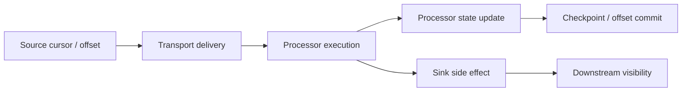

Each arrow can fail independently.

The most common production mistake is treating a successful `process(record)` call as the same thing as a durable business effect. It is not.

A pipeline only has a meaningful semantic guarantee when the following are defined together:

| Boundary | Question |
|---|---|
| Source | What does it mean to consume progress? Offset, timestamp, cursor, file marker, CDC LSN? |
| Transport | Can the same record be redelivered? Can it be reordered? Can it be retained for replay? |
| Processor | Is transformation deterministic? Is state checkpointed with input progress? |
| Sink | Is the side effect idempotent, transactional, or append-only? |
| Visibility | When is output considered committed and queryable by downstream readers? |

Delivery semantics collapses when one boundary is undefined.

---

## 2. The Smallest Failure Timeline

Assume this simple consumer loop:

```java
while (running) {
    Record record = source.poll();
    Output output = transform(record);
    sink.write(output);
    source.commit(record.offset());
}
```

It looks reasonable.

But correctness depends on where the process crashes.

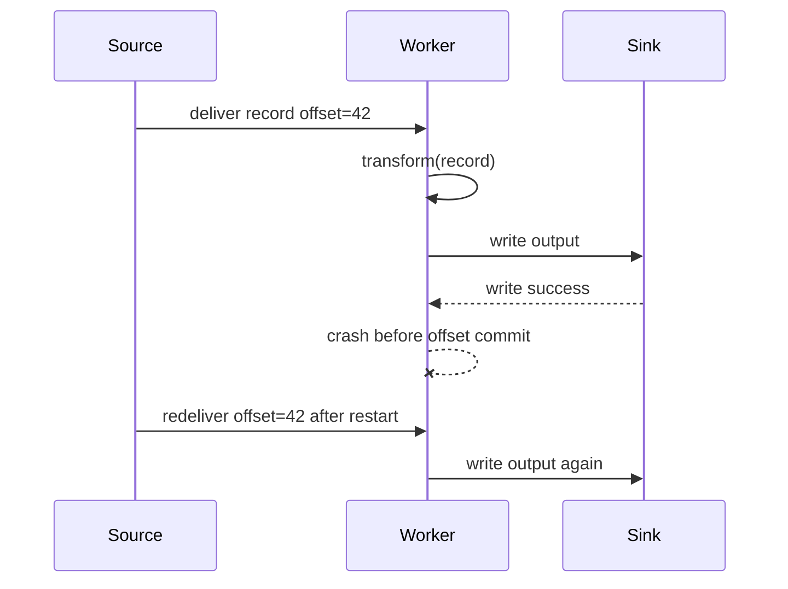

The sink sees the same business effect twice unless it is idempotent.

Now reverse the order:

```java
while (running) {
    Record record = source.poll();
    Output output = transform(record);
    source.commit(record.offset());
    sink.write(output);
}
```

Failure timeline:

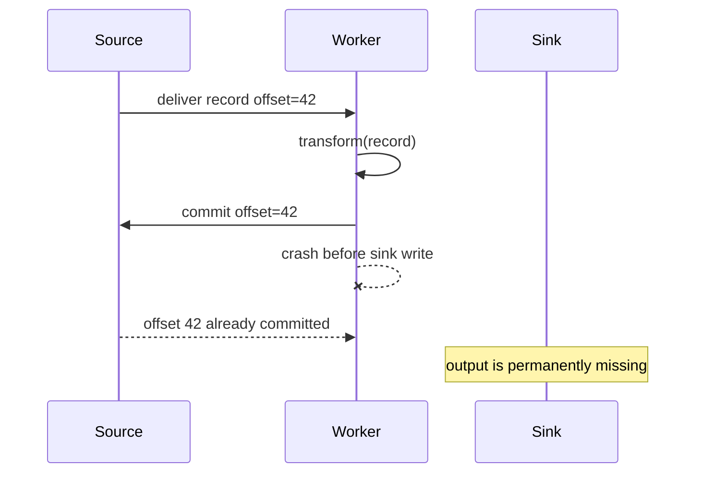

This is the central trade-off:

- commit **before** side effect: possible loss,
- commit **after** side effect: possible duplicate.

The only way out is to make the side effect and progress update atomic, or to make duplicates harmless.

---

## 3. At-Most-Once

### 3.1 Definition

**At-most-once** means a record affects the system zero or one times.

It allows loss.
It avoids duplicates.
It is usually implemented by acknowledging progress before the effect is durable.

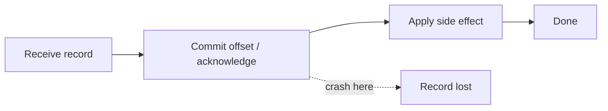

### 3.2 When At-Most-Once Is Acceptable

At-most-once is valid when missing data is tolerable or can be repaired by another process.

Examples:

| Use case | Why loss may be acceptable |
|---|---|
| UI click telemetry | Aggregate trends survive small loss. |
| debug logs | Missing log lines are inconvenient, not usually business-corrupting. |
| cache invalidation with periodic refresh | Later refresh can heal missed invalidation. |
| low-value sampling | Sampling already accepts incompleteness. |

It is usually wrong for:

- billing,
- enforcement decisions,
- entitlement changes,
- compliance evidence,
- case escalation,
- inventory movement,
- financial ledger updates.

### 3.3 Java Shape

```java
public final class AtMostOnceConsumer {
    private final Source source;
    private final Sink sink;

    public void run() {
        while (!Thread.currentThread().isInterrupted()) {
            PipelineRecord record = source.poll();
            if (record == null) continue;

            // Commit first: prevents duplicate processing after crash,
            // but introduces possible data loss before sink.write().
            source.commit(record.position());

            sink.write(transform(record));
        }
    }
}
```

This code is not "bad" by itself. It is bad only when the business requires completeness.

A top-tier engineer does not ban at-most-once. They label it honestly and restrict it to domains where loss is acceptable.

### 3.4 At-Most-Once Checklist

Use at-most-once only if all are true:

- loss has bounded business impact,
- data can be regenerated or is non-critical,
- downstream users understand the incompleteness,
- metrics measure loss or sampling rate,
- the pipeline is not a source of legal/audit truth.

---

## 4. At-Least-Once

### 4.1 Definition

**At-least-once** means a record affects the system one or more times.

It prevents loss under normal recoverable failures, but permits duplicates.

Implementation usually commits progress only after the effect is durable.

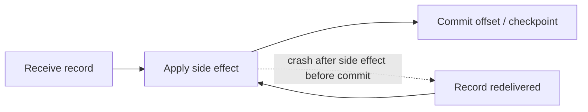

### 4.2 Why At-Least-Once Is the Default Production Baseline

Most serious pipelines start here because loss is harder to repair than duplicates.

Duplicates are often manageable with:

- idempotent writes,
- deterministic keys,
- dedupe tables,
- upserts,
- compare-and-set versions,
- event IDs,
- sequence numbers,
- append-only correction logic.

Data loss often requires forensic recovery.

### 4.3 Java Shape

```java
public final class AtLeastOnceConsumer {
    private final Source source;
    private final Sink sink;

    public void run() {
        while (!Thread.currentThread().isInterrupted()) {
            PipelineRecord record = source.poll();
            if (record == null) continue;

            sink.write(transform(record));

            // Commit after side effect.
            // Crash before this line means redelivery.
            source.commit(record.position());
        }
    }
}
```

This is safe only if `sink.write(...)` can tolerate redelivery.

### 4.4 Duplicate Is Not One Problem

"Duplicate" has several meanings.

| Duplicate type | Example | Required defense |
|---|---|---|
| transport duplicate | Kafka consumer reprocesses offset after rebalance | idempotent sink or offset transaction |
| source duplicate | upstream API emits same event twice with same event ID | event-level dedupe |
| business duplicate | two different events represent same real-world action | business key and domain rule |
| retry duplicate | HTTP sink receives request twice after timeout | idempotency key |
| replay duplicate | backfill re-emits historical records | run ID, output partition isolation, merge policy |

Do not say "we dedupe" without saying which duplicate class is covered.

### 4.5 At-Least-Once Failure Timeline

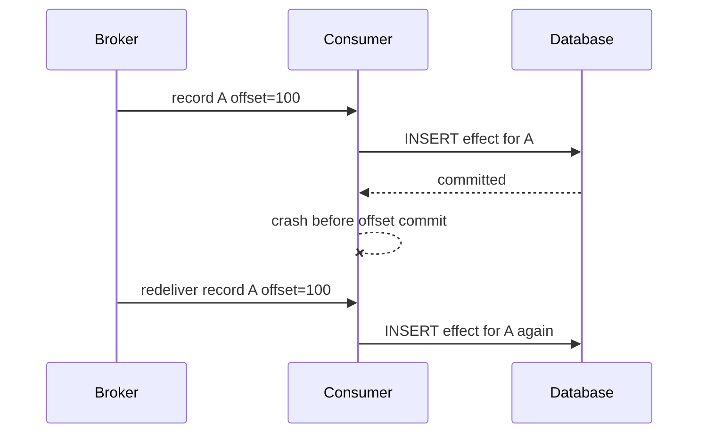

A naive insert corrupts the sink.
An idempotent upsert preserves correctness.

---

## 5. Effectively-Once

### 5.1 Definition

**Effectively-once** means records may be delivered and processed more than once, but the externally visible business effect is equivalent to one successful application.

This is the most useful production target.

It is not magic. It is built from:

1. stable record identity,
2. deterministic transformation,
3. idempotent sink behavior,
4. replay-safe side effects,
5. bounded dedupe state or natural overwrite semantics,
6. explicit correction strategy.

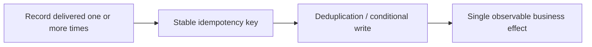

### 5.2 The Idempotency Key Is the Center

An idempotency key answers:

> If this same logical input is seen again, how do we recognize it?

Common choices:

| Key | Good for | Risk |
|---|---|---|
| event ID from producer | domain events | producer must guarantee uniqueness |
| source offset | Kafka topic/partition/offset, CDC LSN | not portable after republish or compaction |
| business natural key | account ID + period, case ID + decision ID | business may allow legitimate repeated changes |
| content hash | immutable files, static payloads | small changes create new key; hash collision unlikely but not semantic |
| generated UUID at consumer | almost never good | redelivery generates new UUID, so dedupe fails |

Top-tier rule:

> Never generate the idempotency key after consuming the record unless you persist it before any side effect.

### 5.3 Idempotent Sink Pattern

For a relational sink, a common pattern is a unique constraint on `idempotency_key`.

```sql
CREATE TABLE pipeline_effects (
    idempotency_key varchar(200) PRIMARY KEY,
    source_name varchar(100) NOT NULL,
    source_position varchar(200) NOT NULL,
    payload_hash varchar(64) NOT NULL,
    applied_at timestamp NOT NULL DEFAULT current_timestamp
);
```

Then write the business effect and idempotency marker in the same transaction.

```java
public final class IdempotentJdbcSink implements Sink<OutputRecord> {
    private final DataSource dataSource;

    @Override
    public void write(OutputRecord output) {
        try (Connection c = dataSource.getConnection()) {
            c.setAutoCommit(false);

            if (alreadyApplied(c, output.idempotencyKey())) {
                c.rollback();
                return;
            }

            applyBusinessEffect(c, output);
            insertIdempotencyMarker(c, output);

            c.commit();
        } catch (SQLException e) {
            throw new SinkWriteException("failed to apply output", e);
        }
    }
}
```

The important part is not the table. The important part is the atomicity:

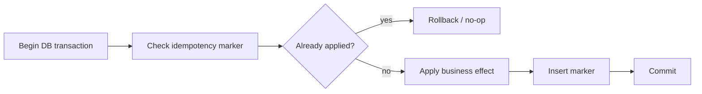

If the marker is written without the business effect, future retries skip a missing effect.
If the business effect is written without the marker, future retries duplicate it.

The marker and effect must commit together.

### 5.4 Upsert Is Not Always Idempotency

An upsert can be idempotent, but it is not automatically correct.

```sql
INSERT INTO account_status(account_id, status, updated_at)
VALUES (?, ?, ?)
ON CONFLICT (account_id)
DO UPDATE SET status = excluded.status,
              updated_at = excluded.updated_at;
```

This is safe only if replacing the current status with the event value is correct under reorder and replay.

Bad case:

```text
Event 1: account A -> SUSPENDED at 10:00
Event 2: account A -> ACTIVE    at 10:05
Replay order: Event 2, then Event 1
Final status becomes SUSPENDED, which is wrong.
```

A safer version compares event time or sequence:

```sql
INSERT INTO account_status(account_id, status, version, updated_at)
VALUES (?, ?, ?, ?)
ON CONFLICT (account_id)
DO UPDATE SET status = excluded.status,
              version = excluded.version,
              updated_at = excluded.updated_at
WHERE account_status.version < excluded.version;
```

Now replaying an older version does not overwrite newer state.

The invariant is:

> Idempotency prevents duplicate application. Ordering/version rules prevent stale application.

You usually need both.

---

## 6. Exactly-Once

### 6.1 The Phrase Is Usually Too Broad

"Exactly-once" is often misunderstood.

In real systems, exactly-once is scoped.

Examples:

| System | What the guarantee usually covers | What it does not automatically cover |
|---|---|---|
| Kafka producer idempotence | duplicate producer retries to a partition | external database side effects |
| Kafka transactions | atomic write to Kafka topics plus offset commit in Kafka | arbitrary HTTP call or non-transactional sink |
| Flink checkpointing | state and source position recovery consistency | sink correctness unless sink participates correctly |
| Database transaction | atomic changes inside one database | broker offset unless coordinated |

A precise statement sounds like this:

> This Flink job provides exactly-once state updates and exactly-once output to this transactional sink under checkpoint recovery, assuming the source is replayable and the sink commit protocol participates in checkpoint completion.

That is an engineering statement.

This is not:

> We use Flink, so the pipeline is exactly-once.

### 6.2 Kafka Exactly-Once Boundary

Kafka can provide exactly-once semantics within Kafka when configured and used correctly: idempotent producers prevent duplicate writes caused by retries, and transactions can atomically write records to multiple partitions/topics and commit consumed offsets as part of the transaction.

A simplified flow:

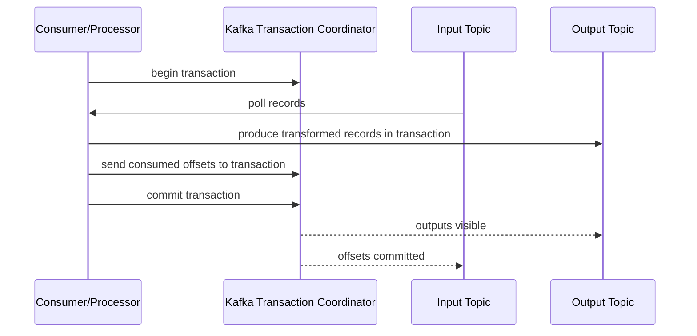

This is powerful, but the boundary is still Kafka.

If the processor also sends an email, updates PostgreSQL, calls a payment API, or writes a file, Kafka transactions do not automatically make those external effects exactly-once.

### 6.3 Flink Exactly-Once Boundary

Flink's fault tolerance model uses checkpoints to recover both operator state and positions in source streams so the application can resume consistently. For stateful stream processing, this means a record may be physically replayed after a failure, but its effect on Flink-managed state is equivalent to one failure-free execution.

The boundary depends on the sink.

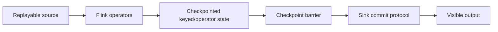

For end-to-end exactly-once, the sink must coordinate with checkpoints. A sink that writes to an external system immediately without idempotency or transaction coordination can still duplicate effects after recovery.

### 6.4 Exactly-Once Requires a Commit Protocol

To get stronger guarantees across boundaries, you need one of these:

| Strategy | How it works | Common use |
|---|---|---|
| single transactional resource | input progress and output effect stored in same DB transaction | polling DB table into another DB table |
| Kafka transaction | output records and consumed offsets committed atomically in Kafka | Kafka-to-Kafka transformation |
| two-phase commit sink | precommit output, publish on checkpoint commit | Flink transactional sinks |
| idempotent sink | retries are harmless due to stable key/version | Kafka-to-DB, API sink |
| append-only + reconciliation | duplicates/corrections are later resolved by deterministic read model | ledger/event-sourced systems |
| outbox/inbox | local transaction writes event/effect marker; relay handles delivery | operational services emitting data |

Without a commit protocol, "exactly-once" is usually an aspiration, not a guarantee.

---

## 7. Atomicity Patterns

### 7.1 Same Database Transaction

The cleanest pipeline is sometimes the least glamorous: store source cursor and sink effect in the same database transaction.

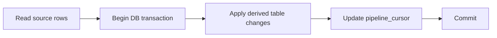

Example cursor table:

```sql
CREATE TABLE pipeline_cursor (
    pipeline_name varchar(100) PRIMARY KEY,
    cursor_value varchar(500) NOT NULL,
    updated_at timestamp NOT NULL DEFAULT current_timestamp
);
```

Java sketch:

```java
public void runBatchWindow(Cursor cursor) {
    List<InputRow> rows = source.readAfter(cursor, 1_000);

    try (Connection c = dataSource.getConnection()) {
        c.setAutoCommit(false);

        Cursor latest = cursor;
        for (InputRow row : rows) {
            DerivedRow derived = transform(row);
            upsertDerived(c, derived);
            latest = latest.max(row.cursor());
        }

        updateCursor(c, "customer-derived-view", latest);
        c.commit();
    }
}
```

This gives strong atomicity but limited scalability and coupling. It works best when:

- source and sink are in the same transactional database,
- transformation is bounded,
- latency requirement is moderate,
- transaction size is controlled.

### 7.2 Transactional Outbox

When an operational service changes state and emits events, do not write the database and publish to Kafka independently.

Bad dual-write:

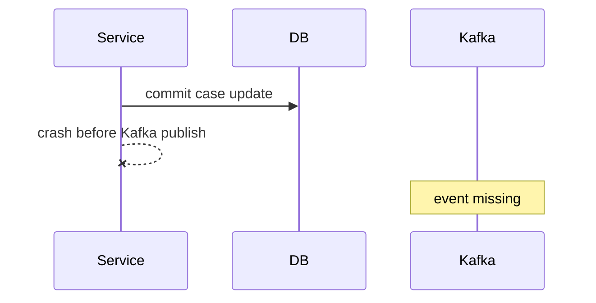

Outbox:

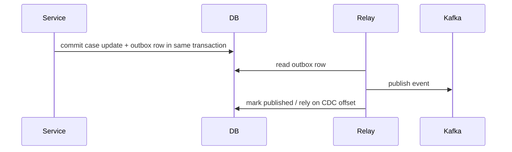

The outbox does not mean no duplicate publish. It means no lost event relative to the database commit. Consumers still need idempotency.

### 7.3 Inbox / Consumer Dedupe

An inbox table stores consumed event identity before or with the business effect.

```sql
CREATE TABLE consumed_events (
    consumer_name varchar(100) NOT NULL,
    event_id varchar(200) NOT NULL,
    consumed_at timestamp NOT NULL DEFAULT current_timestamp,
    PRIMARY KEY (consumer_name, event_id)
);
```

Pattern:

```java
try (Connection c = dataSource.getConnection()) {
    c.setAutoCommit(false);

    boolean firstTime = insertConsumedEvent(c, consumerName, event.id());
    if (!firstTime) {
        c.rollback();
        return;
    }

    applyBusinessEffect(c, event);
    c.commit();
}
```

This is effectively-once for that consumer's business effect.

### 7.4 Two-Phase Commit

Two-phase commit separates preparation and visibility.

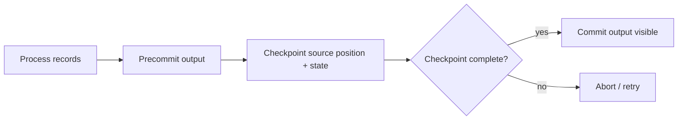

This gives strong semantics but has operational cost:

- in-doubt transactions,
- timeout handling,
- transaction log growth,
- sink-specific complexity,
- recovery edge cases,
- lower throughput if commit coordination is heavy.

Use it where the sink supports it and the correctness requirement justifies the cost.

---

## 8. Delivery Semantics by Sink Type

### 8.1 Relational Database Sink

Strong options:

- transaction with idempotency marker,
- unique constraint on event ID,
- versioned upsert,
- append-only table with deterministic aggregation,
- cursor and effect in same transaction.

Weak options:

- blind insert,
- last-write-wins without event version,
- update by processing time,
- offset commit separate from non-idempotent write.

### 8.2 Object Storage Sink

Object storage has different semantics. File creation is often the effect.

Patterns:

| Pattern | Description |
|---|---|
| write temp then atomic publish marker | readers only consume files listed in committed manifest |
| deterministic file path | retry overwrites same logical output, if safe |
| partition replace | write new partition version then atomically swap metadata |
| append with compaction | tolerate duplicate files then compact/reconcile |

Example:

```text
/tmp/run_id=abc/part-0001.parquet
/tmp/run_id=abc/part-0002.parquet
/manifests/dt=2026-07-04/run_id=abc.json
```

Downstream readers trust the manifest, not random files appearing in a directory.

### 8.3 API Sink

HTTP APIs are dangerous because the client may not know whether a timed-out request succeeded.

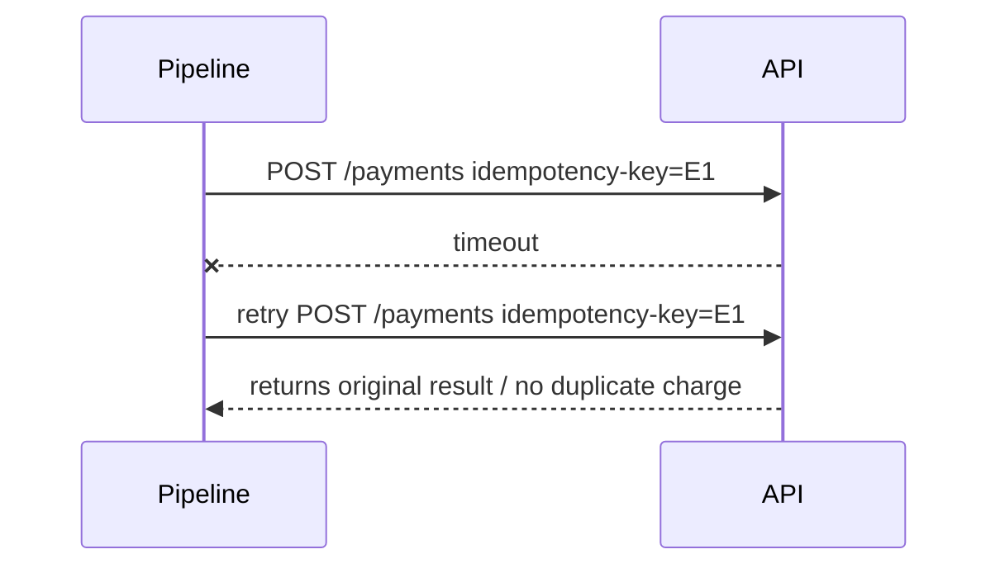

For an API sink, require:

- idempotency key support,
- deterministic request body,
- retry-safe status handling,
- conflict semantics,
- read-after-write verification when needed,
- dead-lettering for unknown outcomes.

If the API does not support idempotency, treat it as non-transactional and design compensation.

### 8.4 Search Index Sink

Search sinks often use upserts by document ID.

This is effectively-once only if:

- document ID is stable,
- event version prevents stale overwrite,
- delete/tombstone events are handled,
- full rebuild can reproduce the same index.

### 8.5 Email / Notification Sink

Notifications are usually non-idempotent human-visible effects.

Do not assume retries are harmless.

Patterns:

- notification table with unique business key,
- send state machine: `PENDING -> SENDING -> SENT -> FAILED`,
- provider idempotency key if available,
- explicit resend action instead of automatic duplicate sends,
- audit trail of attempts.

---

## 9. Processing Semantics Are Not Business Semantics

Suppose the pipeline sends case breach alerts.

Input event:

```json
{
  "eventId": "evt-101",
  "caseId": "CASE-9",
  "type": "SLA_BREACHED",
  "breachType": "RESPONSE_TIME",
  "effectiveAt": "2026-07-04T09:10:00Z"
}
```

You can dedupe by `eventId`, but business may require only one alert per case and breach type per day.

So the idempotency key might be:

```text
caseId + breachType + localBusinessDate
```

The event ID prevents duplicate record application.
The business key prevents duplicate human notification.

These are not the same.

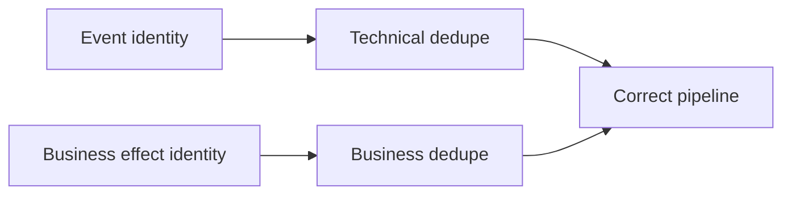

A mature design separates both.

---

## 10. Replay Changes the Meaning of Semantics

Replay is where fake exactly-once designs fail.

A pipeline must answer:

1. If we replay the same input range, will it produce the same output?
2. Will old output be overwritten, appended, or versioned?
3. Are external side effects suppressed during replay?
4. Is the replay output isolated by run ID?
5. Can downstream readers distinguish correction from duplicate?

### 10.1 Replay Modes

| Mode | Meaning | Example |
|---|---|---|
| destructive recompute | replace prior output | rebuild daily aggregate partition |
| additive replay | append another result version | audit/event ledger |
| correction replay | emit compensating records | reverse wrong balance then apply correct balance |
| shadow replay | run without publishing | validate new transformation |
| dual-run | publish old and new outputs side by side | migration from v1 to v2 transform |

### 10.2 Replay-Safe Output Schema

A replayable pipeline often includes metadata like:

```json
{
  "outputId": "case-sla:CASE-9:2026-07-04",
  "sourceEventId": "evt-101",
  "transformVersion": "sla-v3",
  "runId": "replay-20260704-01",
  "isReplay": true,
  "effectiveAt": "2026-07-04T09:10:00Z",
  "producedAt": "2026-07-04T15:30:00Z"
}
```

`effectiveAt` and `producedAt` must not be confused.

---

## 11. The Delivery Semantics Matrix

Use this table in design reviews.

| Requirement | At-most-once | At-least-once | Effectively-once | Exactly-once scoped |
|---|---:|---:|---:|---:|
| Allows loss | yes | no under recoverable replay | no under recoverable replay | no within guarantee boundary |
| Allows duplicate delivery | no/rare | yes | yes | maybe physical replay |
| Allows duplicate business effect | no if commit first, but loss possible | yes unless sink handles it | no by design | no within scoped boundary |
| Needs idempotent sink | no | strongly yes | yes | depends on commit protocol |
| Needs replayable source | not always | yes for recovery | yes | yes |
| Operational complexity | low | medium | medium-high | high |
| Best use | telemetry, sampling | general reliable pipelines | business-critical pipelines | tightly scoped transactional topologies |

The practical default for production business data is:

> **At-least-once delivery + effectively-once business effect.**

---

## 12. Java Design Pattern: Semantic Policy as Code

Do not bury semantics in comments. Model them explicitly.

```java
public enum DeliveryPolicy {
    AT_MOST_ONCE,
    AT_LEAST_ONCE,
    EFFECTIVELY_ONCE,
    EXACTLY_ONCE_SCOPED
}

public record PipelineSemanticContract(
    DeliveryPolicy deliveryPolicy,
    boolean sourceReplayable,
    boolean transformDeterministic,
    boolean sinkIdempotent,
    boolean progressAndEffectAtomic,
    String idempotencyKeyDescription,
    String replayStrategy
) {
    public void validate() {
        if (deliveryPolicy == DeliveryPolicy.EFFECTIVELY_ONCE && !sinkIdempotent) {
            throw new IllegalArgumentException("effectively-once requires idempotent sink");
        }
        if (deliveryPolicy != DeliveryPolicy.AT_MOST_ONCE && !sourceReplayable) {
            throw new IllegalArgumentException("reliable recovery requires replayable source");
        }
    }
}
```

This may look simple, but it changes the architecture conversation.

Instead of saying:

> The consumer commits after processing.

You force the team to say:

> The source is replayable, the transform is deterministic, the sink is idempotent by `caseId + decisionId`, and replay uses partition replacement.

That is a production-grade statement.

---

## 13. Java Pattern: Commit Strategy Interface

A reusable pipeline framework should separate processing from commit strategy.

```java
public interface CommitStrategy<I, O> {
    void beforeProcess(I input);
    O process(I input, Transformer<I, O> transformer);
    void afterSink(I input, O output);
    void onFailure(I input, Throwable error);
}
```

At-least-once strategy:

```java
public final class CommitAfterSink<I, O> implements CommitStrategy<I, O> {
    private final SourcePositionStore<I> positions;
    private final Sink<O> sink;

    @Override
    public void beforeProcess(I input) {
        // no-op
    }

    @Override
    public O process(I input, Transformer<I, O> transformer) {
        return transformer.apply(input);
    }

    @Override
    public void afterSink(I input, O output) {
        sink.write(output);
        positions.commit(input);
    }

    @Override
    public void onFailure(I input, Throwable error) {
        // no commit: input remains replayable
    }
}
```

At-most-once strategy:

```java
public final class CommitBeforeSink<I, O> implements CommitStrategy<I, O> {
    private final SourcePositionStore<I> positions;
    private final Sink<O> sink;

    @Override
    public void beforeProcess(I input) {
        positions.commit(input);
    }

    @Override
    public O process(I input, Transformer<I, O> transformer) {
        return transformer.apply(input);
    }

    @Override
    public void afterSink(I input, O output) {
        sink.write(output);
    }

    @Override
    public void onFailure(I input, Throwable error) {
        // already committed: record may be lost
    }
}
```

This makes semantics testable.

---

## 14. Testing Delivery Semantics

You cannot test delivery semantics with happy-path unit tests only.

You need failure-injection tests.

### 14.1 Crash Points

Inject failures at these points:

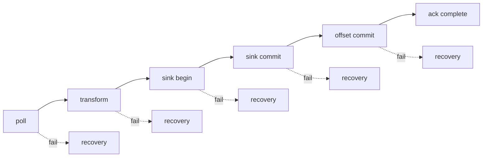

For each crash point, assert final business state.

### 14.2 Example Test Matrix

| Crash point | Expected after restart |
|---|---|
| before transform | record reprocessed, one effect |
| after transform before sink | record reprocessed, one effect |
| after sink commit before offset commit | record reprocessed, duplicate delivery, one business effect |
| after offset commit | no reprocessing, effect already visible |
| during sink timeout unknown outcome | retry or reconcile, one business effect |

### 14.3 Property Test Idea

For a deterministic pipeline, this property should hold:

> For any input sequence and any injected crash schedule, final materialized state equals the state produced by a single failure-free run.

Pseudo-test:

```java
for (CrashSchedule crashSchedule : generatedCrashSchedules()) {
    TestHarness harness = new TestHarness(crashSchedule);

    harness.feed(inputs);
    harness.runUntilCompleteWithRestarts();

    assertThat(harness.materializedState())
        .isEqualTo(referenceRun(inputs).materializedState());
}
```

This is how you test semantics, not by asserting `process()` was called once.

---

## 15. Anti-Patterns

### 15.1 "Exactly-Once Because Kafka"

Kafka can provide exactly-once semantics within Kafka boundaries. It does not make arbitrary side effects exactly-once.

Ask:

- Are consumed offsets committed in the same transaction as produced Kafka records?
- Are external sinks part of the transaction?
- Are consumers configured to read committed data when needed?
- What happens during replay?

### 15.2 Offset as Business Idempotency Key

Topic-partition-offset is stable for a specific Kafka log, but it is not a business identity.

It fails when:

- events are republished to another topic,
- data is migrated,
- records are compacted or transformed,
- backfill uses different offsets,
- multiple input events represent the same business action.

Use offset for technical dedupe only when the output is tied to that log.

### 15.3 Blind Last-Write-Wins

Last-write-wins by processing time is almost always wrong for historical correction.

Prefer:

- event version,
- effective timestamp,
- sequence number,
- source transaction order,
- domain conflict resolution rule.

### 15.4 Non-Idempotent Notification in Automatic Retry

Automatic retry around email/SMS/WhatsApp is a duplicate-notification generator unless protected by a send ledger.

### 15.5 DLQ as Semantic Escape Hatch

A DLQ prevents the main pipeline from blocking. It does not solve correctness. A DLQ record still needs ownership, replay policy, and business impact analysis.

---

## 16. Decision Framework

Use this sequence:

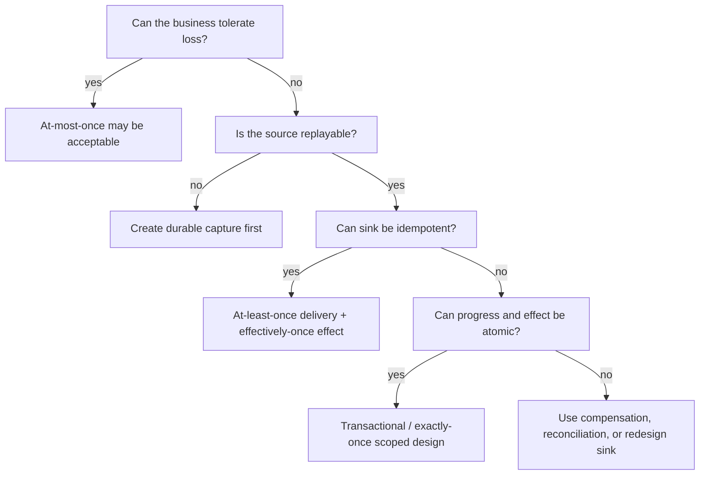

For most Java enterprise pipelines, choose:

```text
Replayable source
+ deterministic transform
+ at-least-once processing
+ idempotent/versioned sink
+ reconciliation
= production-grade effectively-once
```

---

## 17. Regulatory Enforcement Example

Imagine an enforcement platform emits this event:

```json
{
  "eventId": "evt-883",
  "caseId": "CASE-2026-0091",
  "eventType": "CASE_ESCALATED",
  "escalationLevel": "LEVEL_2",
  "sourceTransactionId": "tx-441",
  "effectiveAt": "2026-07-04T03:10:00Z",
  "sequence": 19
}
```

Pipeline output: materialized escalation summary.

Bad sink:

```sql
UPDATE case_summary
SET escalation_level = ?, updated_at = now()
WHERE case_id = ?;
```

Problem: an older replay can overwrite a newer escalation.

Better sink:

```sql
INSERT INTO case_summary(case_id, escalation_level, source_sequence, effective_at)
VALUES (?, ?, ?, ?)
ON CONFLICT (case_id)
DO UPDATE SET escalation_level = excluded.escalation_level,
              source_sequence = excluded.source_sequence,
              effective_at = excluded.effective_at
WHERE case_summary.source_sequence < excluded.source_sequence;
```

Also store event consumption:

```sql
INSERT INTO consumed_events(consumer_name, event_id)
VALUES ('case-summary-pipeline', ?)
ON CONFLICT DO NOTHING;
```

Correctness statement:

> This pipeline uses at-least-once delivery from Kafka and effectively-once materialization in PostgreSQL. Duplicate events are suppressed by `eventId`. Stale updates are blocked by source sequence. Replay is safe because transformations are deterministic and updates are version-guarded.

That is the level of precision expected in a serious engineering review.

---

## 18. Production Checklist

Before claiming any semantic guarantee, answer these:

### Source

- What is the source position type?
- Is it replayable?
- How long is replay retained?
- Is source ordering guaranteed? Per what key?
- Can source emit duplicates independently of transport retries?

### Transform

- Is transformation deterministic?
- Does it use wall-clock time?
- Does it call external services?
- Is enrichment versioned?
- Can old input be transformed under old rules?

### Sink

- What is the business idempotency key?
- Is the sink write atomic?
- Does it support conditional write/version guard?
- What happens on timeout after unknown success?
- Can replay be isolated or safely merged?

### Commit

- Is offset/checkpoint committed before or after side effect?
- Can progress and effect commit atomically?
- What happens if worker crashes between them?
- What happens during rebalance?
- What happens after partial batch failure?

### Operations

- Is duplicate rate measured?
- Is data loss detectable by reconciliation?
- Is DLQ owned?
- Are replays audited?
- Is the stated guarantee documented in the pipeline contract?

---

## 19. Summary

Delivery semantics is not a label attached to a framework.

It is a proof over boundaries.

The practical mental model:

- **At-most-once**: no duplicate attempt, but possible loss.
- **At-least-once**: no loss under replayable recovery, but possible duplicate.
- **Effectively-once**: duplicates may occur internally, but the business effect is idempotent and replay-safe.
- **Exactly-once**: strong but scoped; valid only across specific transactional/checkpoint boundaries.

For most production Java data pipelines, the best default is:

> **At-least-once delivery with effectively-once business effects, backed by deterministic transforms, stable idempotency keys, versioned sinks, and reconciliation.**

That is not weaker than blindly claiming exactly-once. It is more honest, more testable, and usually more reliable.

---

## 20. References

- Apache Kafka Documentation — event streaming, topics, producers, consumers, and guarantees: https://kafka.apache.org/documentation/
- Apache Flink Fault Tolerance Documentation — checkpointing, replay, and state consistency: https://nightlies.apache.org/flink/flink-docs-stable/docs/learn-flink/fault_tolerance/
- Apache Flink Checkpointing Documentation — state and stream position recovery: https://nightlies.apache.org/flink/flink-docs-stable/docs/dev/datastream/fault-tolerance/checkpointing/
- Apache Beam Programming Guide — pipeline model and data processing abstractions: https://beam.apache.org/documentation/programming-guide/
