# Part 008 — Pipeline Decision Framework

Most pipeline architecture mistakes do not come from choosing a bad tool.

They come from choosing a tool before naming the shape of the problem.

A team says:

> We need a Flink job.

But the real requirement is:

> We need to pull a paginated vendor API every hour, normalize records, store them in a warehouse, and alert if the data is stale.

That may not need Flink.

Another team says:

> We can just write a Spring Boot consumer.

But the real requirement is:

> We need event-time joins, late-arriving correction handling, checkpointed state, high-volume keyed aggregation, and replay-safe exactly-once output.

That probably should not be a hand-rolled consumer.

This part gives a decision framework for Java data pipelines. The goal is not to memorize which tool is "best". The goal is to map problem shape to execution model.

---

## 1. The Seven Questions Before Choosing Technology

Before naming a framework, answer these seven questions.

| # | Question | Why it matters |
|---:|---|---|
| 1 | Is the input bounded or unbounded? | Batch file and infinite event streams need different recovery models. |
| 2 | Is the pipeline record-at-a-time, windowed, or workflow-like? | Determines whether you need stream operators, batch transforms, or durable orchestration. |
| 3 | Is there state? How large? | Local memory, embedded state store, distributed state backend, or database? |
| 4 | What time semantics matter? | Processing time is simpler; event time and late data need watermarks/windows. |
| 5 | What is the correctness target? | At-least-once, effectively-once, transactional, audit replay, reconciliation. |
| 6 | What is the operational ownership model? | App team, data platform, infra team, self-service users. |
| 7 | What is the failure recovery unit? | Record, partition, task, DAG task, workflow activity, full job, data asset. |

You can now select an execution model instead of chasing fashionable architecture.

---

## 2. Tool Categories Are Execution Models

A pipeline tool is not merely a library. It encodes an execution model.

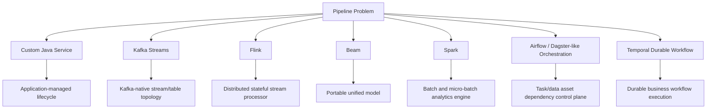

The question becomes:

> Which execution model matches the dominant complexity?

---

## 3. Summary Matrix

| Option | Best fit | Weak fit | Java relevance |
|---|---|---|---|
| Custom Java service | simple ingestion, API polling, light transform, custom protocol | large stateful stream joins, event-time windows, complex backfills | full control, low platform overhead |
| Kafka Streams | Kafka-to-Kafka/table transformations, embedded state, service-owned stream apps | non-Kafka sources, huge state, complex orchestration | native Java library |
| Flink | high-volume stateful streaming, event time, windows, joins, checkpointed state | simple cron ingestion, low-volume ETL | strong Java API and JVM runtime |
| Beam | portable batch/streaming model, multiple runners, unified transform design | when runner-specific tuning dominates | Java SDK is mature |
| Spark | large batch, lakehouse transforms, SQL/DataFrame analytics, micro-batch | low-latency per-event decisions | Java possible, Scala/Python often more ergonomic |
| Airflow | orchestration, scheduling, dependencies, data movement jobs | record-level processing or long-running stream operators | Java jobs can be tasks, but Airflow itself is Python-centric |
| Temporal | durable workflows, human/system interaction, retries, compensation | high-throughput record stream processing | Java SDK useful for workflow orchestration |

The mistake is using a control-flow orchestrator as a stream processor, or using a stream processor as a business workflow engine.

---

## 4. Custom Java Pipeline Service

### 4.1 When It Is the Right Choice

A custom Java service is appropriate when the pipeline is mostly application logic and the data volume/state complexity is bounded.

Good examples:

- poll a vendor API every few minutes,
- ingest files from object storage,
- read a database incrementally with a cursor,
- normalize records and write to Kafka,
- perform simple Kafka consume-transform-sink logic,
- call an internal service with idempotency keys,
- maintain a small local cache,
- run inside an existing Spring/Quarkus/Micronaut service model.

### 4.2 When It Becomes a Trap

It becomes a trap when the team slowly rebuilds a stream processor:

- manual partition assignment,
- manual checkpointing,
- custom watermark logic,
- ad hoc state snapshots,
- hand-written windowing,
- custom retry scheduler,
- improvised backpressure,
- manual scale-out rebalancing,
- hidden exactly-once claims.

If your service needs keyed state, event-time windows, late data, checkpoint restore, and distributed parallelism, stop and reconsider.

### 4.3 Architecture Shape

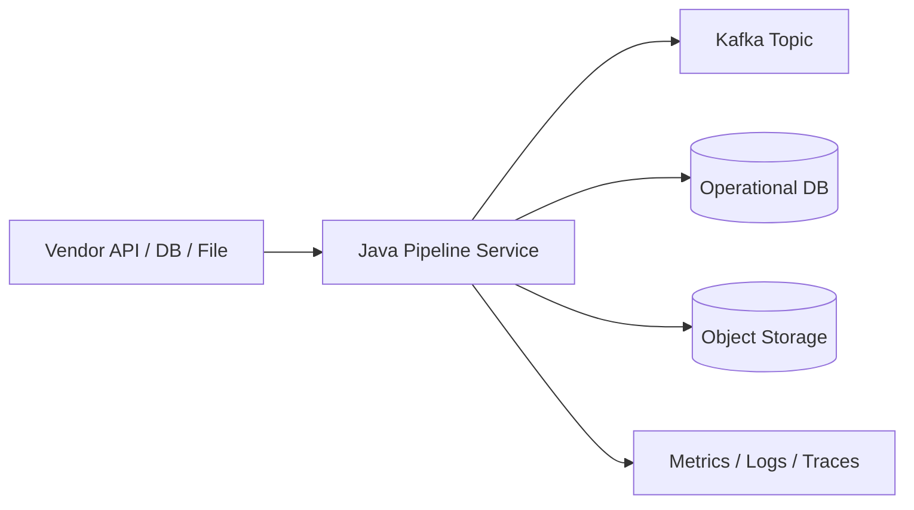

### 4.4 Implementation Bias

A strong custom Java service should have explicit internal contracts:

```java
public interface PipelineSource<T> {
    Batch<T> poll(SourceCursor cursor, int maxRecords);
}

public interface PipelineTransform<I, O> {
    List<O> apply(I input, TransformContext context);
}

public interface PipelineSink<O> {
    SinkResult write(List<O> outputs, SinkContext context);
}

public interface CursorStore {
    SourceCursor load(String pipelineName);
    void commit(String pipelineName, SourceCursor cursor);
}
```

The service is acceptable when these interfaces remain simple.

### 4.5 Decision Rule

Use a custom Java service when:

```text
state is small
+ time semantics are simple
+ correctness can be handled with idempotent sink/cursor
+ operational ownership belongs to the application team
= custom Java service is reasonable
```

---

## 5. Kafka Streams

### 5.1 Mental Model

Kafka Streams is a Java library for building stream processing applications on top of Kafka. It treats Kafka topics as input/output logs and provides abstractions such as streams, tables, joins, aggregations, repartitioning, and local state stores.

It is not a separate cluster. Your application instances are the processing nodes.

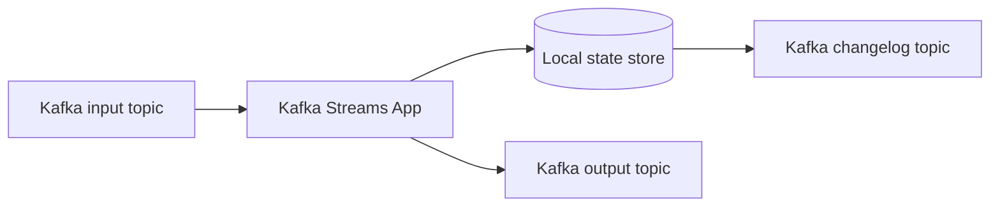

### 5.2 Good Fit

Kafka Streams is strong when:

- input and output are Kafka topics,
- team wants Java library integration,
- topology is service-owned,
- state is partition-local and manageable,
- transformations are stream/table oriented,
- deployment follows normal service deployment,
- latency target is low-to-moderate.

Examples:

- enrich orders with customer table,
- maintain latest case status table,
- compute rolling counters per key,
- transform domain events into downstream events,
- build Kafka-backed materialized views.

### 5.3 Weak Fit

Kafka Streams is weaker when:

- source/sink is not Kafka-centric,
- very large state needs sophisticated distributed management,
- event-time handling is complex,
- job lifecycle should be platform-managed,
- you need SQL-heavy lakehouse batch processing,
- you need complex multi-step workflow orchestration.

### 5.4 Decision Rule

Use Kafka Streams when:

```text
Kafka is the system of movement
+ transformation is continuous
+ state is keyed by Kafka partition
+ the app team can own deployment
= Kafka Streams is a strong fit
```

---

## 6. Flink

### 6.1 Mental Model

Flink is a distributed engine for stateful computations over bounded and unbounded data streams. It is designed around operators, parallelism, keyed state, event time, watermarks, checkpointing, and recovery.

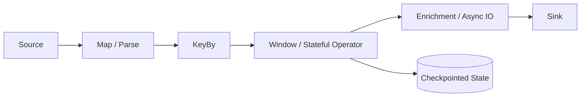

### 6.2 Good Fit

Flink is strong when:

- stream is high-volume and long-running,
- event-time correctness matters,
- late events are expected,
- keyed state is large or critical,
- joins/windows are non-trivial,
- recovery must restore state and source position,
- the platform team can operate Flink clusters/jobs,
- low latency matters more than batch simplicity.

Examples:

- SLA breach detection from enforcement events,
- fraud/risk scoring over event streams,
- real-time sessionization,
- temporal joins between events and reference data,
- CDC stream normalization with stateful dedupe,
- real-time aggregates feeding operational dashboards.

### 6.3 Weak Fit

Flink is overkill when:

- job runs once per day over files,
- transformation is SQL-only batch,
- state is tiny,
- team has no operational maturity for stateful streaming,
- data source is a slow API with strict rate limits,
- failure recovery can happen at file/job level.

### 6.4 Flink Decision Rule

Use Flink when:

```text
unbounded stream
+ keyed state
+ event time / late data
+ high correctness requirements
+ platform can operate checkpointed jobs
= Flink is a strong fit
```

### 6.5 The Hidden Cost

Flink's power comes with obligations:

- checkpoint tuning,
- savepoint management,
- state schema evolution,
- operator UID stability,
- backpressure analysis,
- memory/state backend tuning,
- deployment lifecycle discipline,
- failure recovery drills.

If no one owns those, Flink becomes expensive magic.

---

## 7. Apache Beam

### 7.1 Mental Model

Beam is a unified programming model for batch and streaming pipelines. You define a pipeline using abstractions such as `Pipeline`, `PCollection`, and `PTransform`, then execute it on a runner.

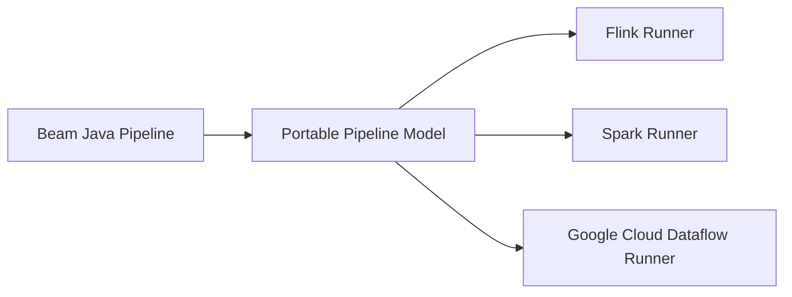

Beam separates pipeline definition from execution backend.

### 7.2 Good Fit

Beam is strong when:

- you want one model for batch and streaming,
- portability matters,
- transformations should be reusable,
- team wants runner flexibility,
- windowing/event-time concepts are central,
- managed runner is available and preferred.

Examples:

- define business transforms once and run batch backfill plus streaming update,
- build cloud-portable data processing pipelines,
- standardize transforms across multiple execution engines.

### 7.3 Weak Fit

Beam is weaker when:

- you need deep runner-specific optimization,
- platform only supports one engine and portability is irrelevant,
- developers need direct access to engine-specific APIs,
- operational team lacks Beam runner knowledge.

### 7.4 Decision Rule

Use Beam when:

```text
unified batch/stream semantics matter
+ transform portability matters
+ runner constraints are acceptable
= Beam is a strong fit
```

---

## 8. Spark

### 8.1 Mental Model

Spark is a distributed engine widely used for large-scale batch analytics and SQL/DataFrame workloads. Structured Streaming extends the model to streaming using incremental execution, commonly micro-batch oriented.

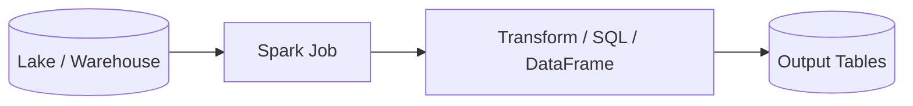

### 8.2 Good Fit

Spark is strong when:

- input is large bounded data,
- transformation is analytical,
- SQL/DataFrame style is natural,
- lakehouse tables are central,
- backfills are frequent,
- throughput matters more than per-event latency,
- data engineers already operate Spark.

Examples:

- rebuild customer risk features daily,
- transform bronze CDC tables into silver/gold tables,
- run large joins over historical data,
- compute daily compliance reports,
- compact and optimize lakehouse tables.

### 8.3 Weak Fit

Spark is weaker when:

- latency must be milliseconds,
- each event triggers business action immediately,
- long-lived per-key state is central,
- workload is a human/system workflow,
- Java API ergonomics matter more than SQL/DataFrame productivity.

### 8.4 Decision Rule

Use Spark when:

```text
bounded or micro-batch workload
+ large historical data
+ table/lakehouse processing
+ SQL/DataFrame transforms
= Spark is a strong fit
```

---

## 9. Airflow and Control-Flow Orchestration

### 9.1 Mental Model

Airflow models workflows as DAGs of tasks with dependencies. It is a scheduler and orchestrator. It does not process individual records inside a stream graph.

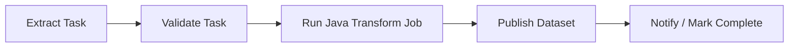

A task can launch a Java job, Spark job, SQL query, Kubernetes pod, or API call. But Airflow's unit is the task, not the record.

### 9.2 Good Fit

Airflow is strong when:

- tasks are scheduled,
- dependencies matter,
- rerun/backfill is task-level,
- humans need visibility into job status,
- pipeline is batch or periodic,
- data assets have freshness dependencies,
- Java jobs need a control plane.

Examples:

- run daily extraction from vendor API,
- wait for files to land,
- launch Java validation job,
- run Spark transformation,
- publish success marker,
- trigger downstream report refresh.

### 9.3 Weak Fit

Airflow is wrong for:

- per-record stream processing,
- long-running low-latency consumers,
- stateful event-time windows,
- high-throughput message handling,
- business workflows that wait months for human actions.

### 9.4 Decision Rule

Use Airflow when:

```text
dependency graph is the core problem
+ jobs are bounded tasks
+ scheduling/backfill/visibility matter
= Airflow is a strong fit
```

Do not use it as a substitute for Kafka Streams or Flink.

---

## 10. Temporal Durable Workflow

### 10.1 Mental Model

Temporal is for durable execution of workflows. It records workflow history so long-running processes can survive worker crashes and resume. It is excellent for business process orchestration, retries, timers, compensation, and human/system interaction.

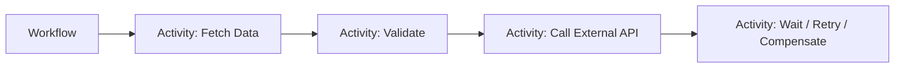

The unit is a workflow execution, not a streaming operator over millions of records per second.

### 10.2 Good Fit

Temporal is strong when:

- work is long-running,
- external calls are unreliable,
- retries must be durable,
- compensation matters,
- human approval may be required,
- state machine is business-visible,
- each workflow instance has identity.

Examples:

- coordinate regulatory case export to multiple agencies,
- perform multi-step data correction approval,
- orchestrate backfill request lifecycle,
- call external compliance API with durable retries,
- manage data access review workflow.

### 10.3 Weak Fit

Temporal is not a replacement for stream processing.

Avoid it for:

- high-volume record transformation,
- windowed aggregations,
- large keyed state across event streams,
- lakehouse SQL transforms,
- broker-level event processing.

### 10.4 Decision Rule

Use Temporal when:

```text
workflow state machine is the core problem
+ actions are long-running / retryable / compensatable
+ each execution has business identity
= Temporal is a strong fit
```

---

## 11. Decision Tree

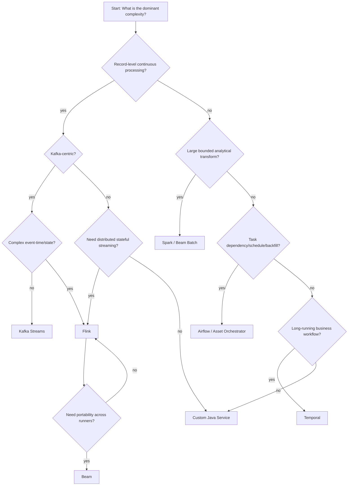

This tree is intentionally imperfect. It is a thinking tool, not a law.

---

## 12. Choosing by State

State is the most important hidden dimension.

| State shape | Example | Suitable option |
|---|---|---|
| no state | parse and forward | custom Java, Kafka Streams, Beam, Spark |
| small local state | lookup cache | custom Java, Kafka Streams |
| partitioned embedded state | latest value per key | Kafka Streams |
| large checkpointed keyed state | event-time aggregations, dedupe windows | Flink |
| historical table state | large joins, aggregates over lake | Spark |
| workflow state | case export process, approval flow | Temporal |
| task state | job succeeded/failed/skipped | Airflow |

Bad architecture often comes from storing the wrong kind of state in the wrong place.

Example:

- millions of event-time session windows in a Spring Boot map: bad,
- human approval workflow in Flink keyed state: bad,
- record-level dedupe in Airflow XCom: bad,
- daily table rebuild in Kafka Streams: usually bad.

---

## 13. Choosing by Time Semantics

| Time requirement | Implication | Better fit |
|---|---|---|
| processing-time only | simple scheduling/triggering is enough | Java service, Airflow, Spark |
| event time | need timestamp extraction and late event policy | Flink, Beam, Spark Structured Streaming |
| low-latency continuous | long-running processor | Kafka Streams, Flink |
| daily/monthly cutoff | batch partitioning and rerun | Spark, Airflow |
| long wait/timer per business object | durable workflow timer | Temporal |
| correction by effective time | bitemporal model, replay, versioning | Spark/Flink + lakehouse design |

If the phrase "late arriving event" appears in the requirement, do not default to cron.

If the phrase "wait for approval" appears, do not default to stream processing.

---

## 14. Choosing by Failure Recovery Unit

| Recovery unit | Meaning | Tool style |
|---|---|---|
| record | retry one record or send to DLQ | Java consumer, Kafka Streams |
| partition offset | replay from log offset | Kafka-based systems |
| operator state + source position | restore stream processor state | Flink |
| micro-batch checkpoint | rerun batch increment | Spark Structured Streaming |
| task | rerun extract/transform/load task | Airflow |
| workflow activity | retry durable step | Temporal |
| table snapshot | rollback/replace table version | Iceberg/lakehouse + Spark/Flink |

Match failure recovery unit to business impact.

If a single bad record should not block an entire daily run, task-level retry is too coarse unless the job internally quarantines records.

If a whole partition must be recomputed atomically, record-level retry may be too fine.

---

## 15. Choosing by Output Type

| Output | Main risk | Better fit |
|---|---|---|
| Kafka topic | duplicate/reorder/schema evolution | Kafka Streams, Flink, Beam |
| RDBMS materialized view | idempotent upsert/versioning | Java service, Kafka Streams, Flink |
| lakehouse table | partition correctness, compaction, schema evolution | Spark, Flink, Beam |
| external API | unknown outcome, rate limit | Java service, Temporal for workflow-like calls |
| notification | duplicate human-visible side effects | Java service + send ledger, Temporal |
| report dataset | freshness/completeness | Airflow + Spark/Java jobs |
| search index | stale overwrite/delete handling | Kafka Streams, Flink, Java service |

External APIs and notifications are not just sinks. They are side-effect boundaries and often need workflow semantics.

---

## 16. Hybrid Architectures

Real platforms rarely use one tool.

### 16.1 Airflow + Java + Spark

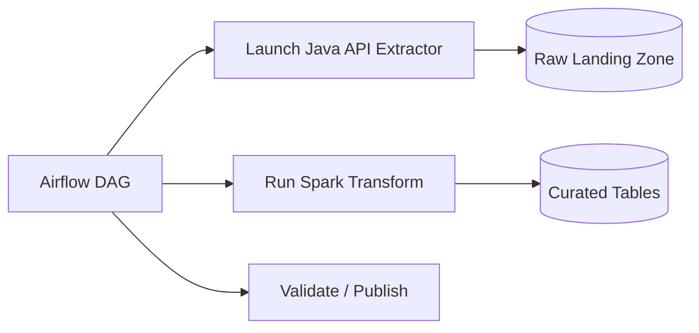

Good for periodic ingestion and table production.

### 16.2 Kafka + Kafka Streams + Java Service

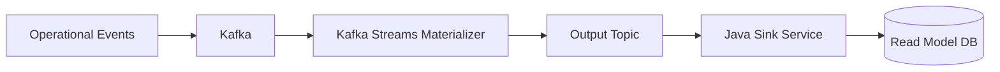

Good when Kafka topology and external sink behavior should be separated.

### 16.3 Kafka + Flink + Lakehouse

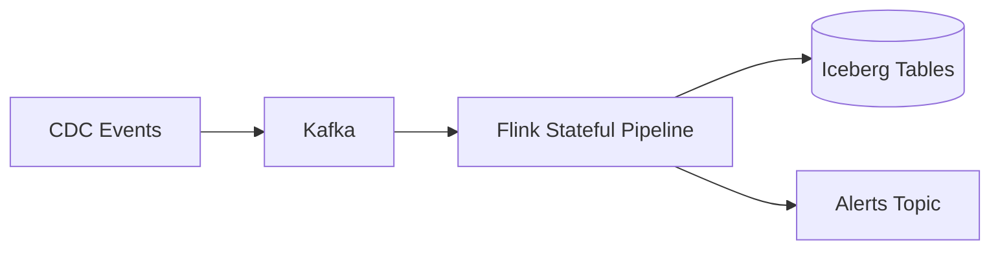

Good for real-time normalization, dedupe, enrichment, and table materialization.

### 16.4 Airflow + Temporal

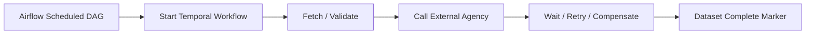

Good when a scheduled data operation contains long-running external interactions.

### 16.5 Beam + Runner

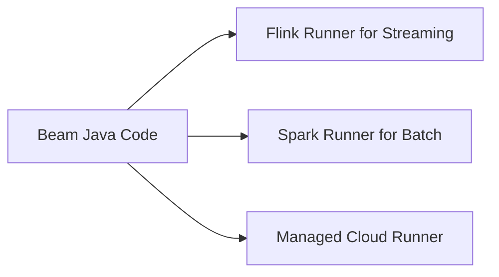

Good when transform portability is a platform goal.

---

## 17. Decision Scenarios

### 17.1 Scenario A: Vendor API Daily Ingestion

Requirement:

- vendor API has pagination,
- rate limit is strict,
- job runs every hour,
- writes raw JSON and normalized table,
- failure should retry from last page cursor.

Recommended:

```text
Airflow for schedule/dependency
+ custom Java extractor for API protocol/cursor/idempotency
+ object storage or DB landing zone
+ Spark/Java transform depending on volume
```

Not ideal:

- Flink, unless API stream is high-volume and continuous,
- Kafka Streams, unless Kafka is central to downstream movement.

### 17.2 Scenario B: Case Escalation Real-Time Alerts

Requirement:

- consume case events from Kafka,
- detect SLA breach using event time,
- handle late correction events,
- maintain per-case state,
- emit alert once.

Recommended:

```text
Flink
+ keyed state by caseId
+ event-time timers/watermarks
+ idempotent alert sink
```

Kafka Streams may fit if event-time complexity and state size are moderate. Custom Java consumer is risky if late-event correctness matters.

### 17.3 Scenario C: Kafka Topic Normalization

Requirement:

- consume raw events,
- validate schema,
- enrich with compacted reference topic,
- produce normalized topic,
- no external sink.

Recommended:

```text
Kafka Streams
+ schema-aware validation
+ KTable enrichment
+ Kafka transactions if needed
```

Flink is possible but may be heavier than needed.

### 17.4 Scenario D: Monthly Regulatory Report

Requirement:

- join many historical tables,
- apply effective-date logic,
- produce auditable output,
- rerun previous periods after correction.

Recommended:

```text
Spark or Beam batch
+ lakehouse table snapshots
+ Airflow orchestration
+ reconciliation checks
```

Kafka Streams is the wrong core engine for large historical recomputation.

### 17.5 Scenario E: External Agency Submission

Requirement:

- submit generated package to external agency API,
- API can timeout,
- approval may take days,
- retries and compensation are required,
- each submission has business identity.

Recommended:

```text
Temporal workflow
+ Java activities
+ idempotency key per submission
+ audit state machine
```

Airflow can schedule the start, but Temporal is better for durable long-running interaction.

---

## 18. Anti-Patterns

### 18.1 Flink for Everything

Flink is powerful, but using it for simple scheduled ingestion creates unnecessary operational load.

Signal:

- no keyed state,
- no event-time requirement,
- one source, one sink,
- low volume,
- cron-like trigger.

Use a simpler tool.

### 18.2 Airflow as Stream Processor

Airflow DAGs are task dependency graphs. They are not designed for per-record event processing.

Signal:

- DAG triggered per message,
- XCom used as record transport,
- sensors used as event consumers,
- high-frequency scheduling to mimic streaming.

Use Kafka/Flink/Kafka Streams.

### 18.3 Spring Boot Consumer as Distributed Stream Engine

A custom Java consumer becomes dangerous when it grows:

- windowing,
- state snapshots,
- late-event rules,
- rebalance-sensitive state,
- exactly-once claims,
- custom checkpoint restore.

Use Kafka Streams or Flink.

### 18.4 Spark for Low-Latency Operational Decisions

Spark can process large data, but it is not usually the first choice for millisecond-level operational reactions.

Signal:

- decision must happen per event immediately,
- downstream system waits for action,
- state changes continuously.

Use Kafka Streams/Flink/custom service depending on state complexity.

### 18.5 Temporal as Queue Consumer

Temporal workflows are not a high-throughput record processing substitute.

Signal:

- one workflow per low-value event,
- millions of short-lived transformations,
- no durable business state machine.

Use stream processing.

---

## 19. Platform-Level Decision Matrix

For an engineering organization, the decision is not only technical. It is also operational.

| Axis | Custom Java | Kafka Streams | Flink | Beam | Spark | Airflow | Temporal |
|---|---:|---:|---:|---:|---:|---:|---:|
| Java ergonomics | high | high | high | high | medium | low-medium | high |
| Stream processing | medium | high | very high | high | medium | low | low |
| Batch processing | medium | low | medium | high | very high | orchestrates | low |
| Stateful processing | custom | medium-high | very high | runner-dependent | batch state | task state | workflow state |
| Event-time support | custom | medium | very high | high | medium-high | no | timer-oriented |
| Orchestration | custom | low | low | low | low | high | high |
| Operational complexity | low-medium | medium | high | medium-high | high | medium | medium-high |
| Replay/backfill | custom | Kafka-log based | strong but complex | strong | very strong | task-level | workflow history/activity-level |
| Best owner | app team | app/platform | data platform | data platform | data platform | platform/data ops | platform/app team |

A top-tier engineer does not ask only:

> Can this tool do it?

They ask:

> Can our organization operate the failure model this tool implies?

---

## 20. Java-Centric Selection Heuristics

### 20.1 Choose Custom Java Service If

- transformation is domain-heavy,
- source protocol is custom,
- state is small,
- business team owns the logic,
- deployment as a normal service is desired,
- idempotent sink is straightforward.

### 20.2 Choose Kafka Streams If

- Kafka is both input and output,
- transformation is continuous,
- state is partition-local,
- app teams can own stream services,
- you want a library rather than separate cluster engine.

### 20.3 Choose Flink If

- stateful streaming is the hard part,
- event time is required,
- late data matters,
- checkpointed recovery is critical,
- throughput/latency requirements are serious,
- platform can manage Flink lifecycle.

### 20.4 Choose Beam If

- unified batch/stream code matters,
- runner portability is valuable,
- organization standardizes transforms across backends,
- windowing semantics should be expressed once.

### 20.5 Choose Spark If

- historical data volume dominates,
- table/lakehouse processing dominates,
- SQL/DataFrame operations are central,
- backfill/recompute is common,
- latency tolerance is minutes/hours.

### 20.6 Choose Airflow If

- scheduling/dependencies are the hard part,
- tasks are bounded,
- human visibility of jobs matters,
- backfill is task/date-partition oriented,
- Java jobs need orchestration, not record processing.

### 20.7 Choose Temporal If

- durable business process is the hard part,
- external calls need retry/compensation,
- workflows can run for hours/days/months,
- each execution has business identity,
- state machine clarity matters.

---

## 21. Architecture Review Template

Use this template before approving a pipeline design.

```md
## Pipeline Decision Record

### Problem Shape
- Input bounded/unbounded:
- Trigger model:
- Expected volume:
- Latency target:
- State required:
- Time semantics:
- Replay/backfill requirement:
- Business criticality:

### Selected Execution Model
- Chosen tool:
- Why this fits:
- Why simpler options are insufficient:
- Why heavier options are unnecessary:

### Correctness
- Delivery semantics:
- Idempotency key:
- Ordering/version rule:
- Checkpoint/commit boundary:
- Replay strategy:
- Reconciliation strategy:

### Operations
- Owner:
- Deployment model:
- Scaling model:
- Observability:
- Failure recovery unit:
- DLQ/quarantine ownership:
- Cost risk:

### Exit Criteria
- When should this design be replaced?
- What signal indicates state/volume/time complexity outgrew the tool?
```

The most important field is often:

> Why heavier options are unnecessary.

This protects the organization from architecture inflation.

---

## 22. Regulatory Enforcement Platform Example

Assume a regulatory platform has these needs:

1. case lifecycle events from operational services,
2. CDC from PostgreSQL for legacy tables,
3. real-time SLA breach detection,
4. daily compliance reporting,
5. external agency submissions,
6. auditable correction and replay.

A reasonable architecture:

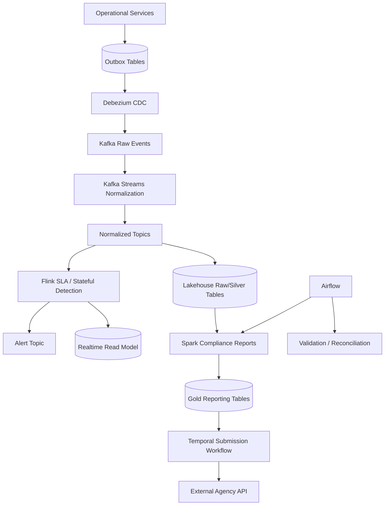

Why this split makes sense:

| Need | Tool | Reason |
|---|---|---|
| outbox capture | Debezium/Kafka | durable movement from DB changes |
| event normalization | Kafka Streams | Kafka-native stream/table transformations |
| SLA detection | Flink | keyed state, event time, timers, late events |
| compliance reports | Spark | historical table joins and recomputation |
| scheduling/report DAG | Airflow | task dependency, date partitions, visibility |
| agency submission | Temporal | durable workflow, retries, compensation |

One platform, multiple execution models.

That is normal.

---

## 23. Summary

Pipeline architecture should start from problem shape, not tool preference.

The core distinctions:

- **Custom Java service**: application-owned ingestion or simple processing.
- **Kafka Streams**: Kafka-native continuous transformations with local state.
- **Flink**: distributed stateful stream processing with event-time correctness.
- **Beam**: unified batch/stream programming model with runner portability.
- **Spark**: large-scale batch, micro-batch, lakehouse, and analytical transforms.
- **Airflow**: task orchestration, scheduling, dependency visibility, backfill control.
- **Temporal**: durable business workflows, retries, timers, and compensation.

The strongest architecture is often hybrid, but hybrid should mean clean separation of execution models, not random accumulation of tools.

A mature decision sounds like this:

> We use Kafka Streams for Kafka-native normalization, Flink for stateful event-time SLA detection, Spark for historical report recomputation, Airflow for scheduling and dependency control, and Temporal only for long-running external agency submissions. Each tool owns the failure model it is good at.

That is the decision quality expected from a top-level engineer.

---

## 24. References

- Apache Kafka Documentation — event streaming, topics, producers, consumers, and guarantees: https://kafka.apache.org/documentation/
- Apache Flink Documentation — bounded/unbounded streams, stateful processing, and fault tolerance: https://nightlies.apache.org/flink/flink-docs-stable/docs/learn-flink/overview/
- Apache Flink Fault Tolerance Documentation — checkpointing and state recovery: https://nightlies.apache.org/flink/flink-docs-stable/docs/learn-flink/fault_tolerance/
- Apache Beam Programming Guide — `Pipeline`, `PCollection`, `PTransform`, runners: https://beam.apache.org/documentation/programming-guide/
- Apache Beam Basics — basic model concepts: https://beam.apache.org/documentation/basics/
- Apache Airflow DAG Documentation — DAGs as task dependency graphs: https://airflow.apache.org/docs/apache-airflow/stable/core-concepts/dags.html
- Apache Airflow Task Documentation — task as unit of execution: https://airflow.apache.org/docs/apache-airflow/stable/core-concepts/tasks.html
