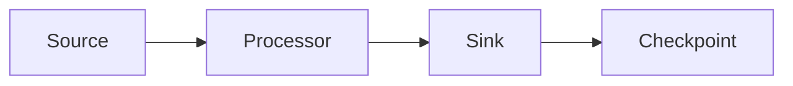
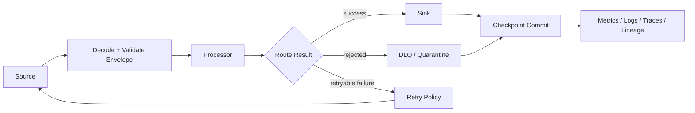
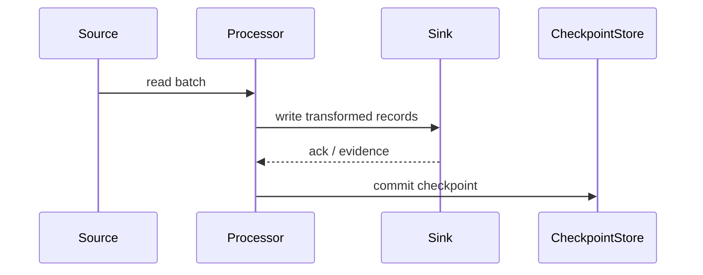
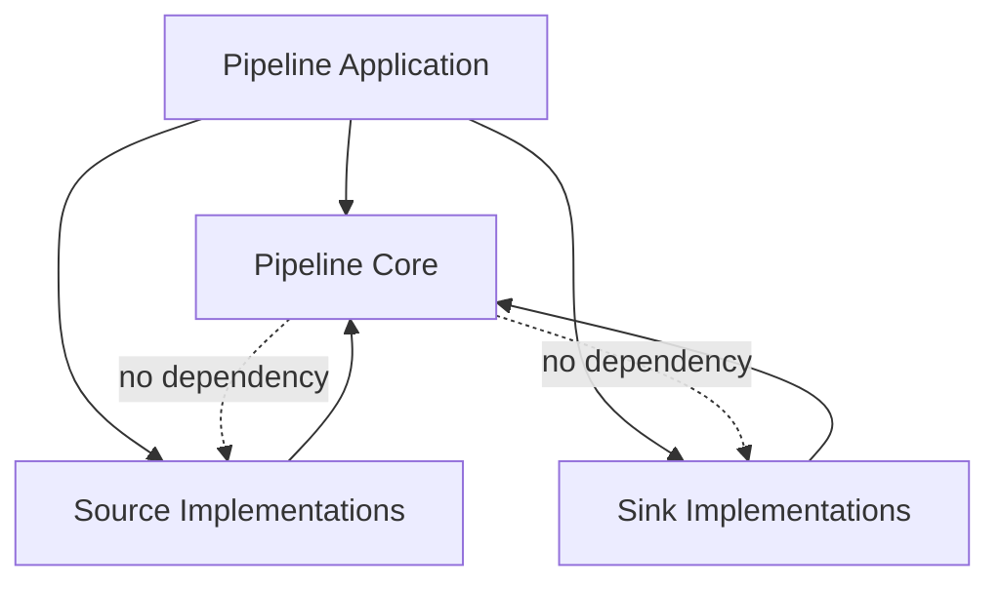
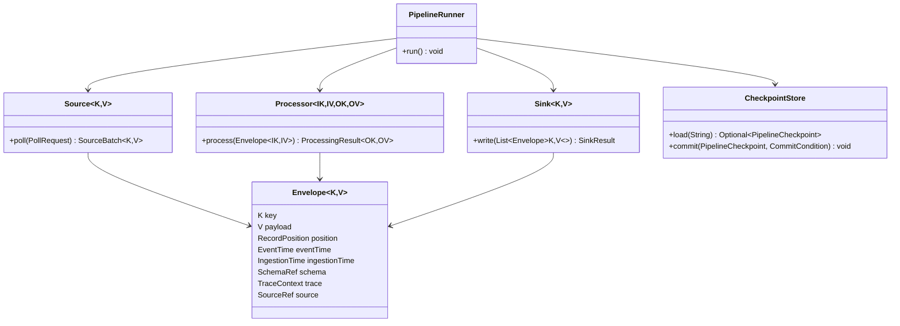

# Part 009 — Java Pipeline Core Abstractions

> Pipeline yang baik bukan dimulai dari Kafka, Flink, Spark, atau Airflow. Pipeline yang baik dimulai dari boundary yang benar: apa yang dibaca, apa yang diproses, apa yang ditulis, kapan dianggap sukses, dan bagaimana ia pulih setelah gagal.

Pada bagian sebelumnya kita sudah membedah taxonomy dan failure model. Sekarang kita masuk ke titik yang lebih konkret: bagaimana mendesain abstraksi dasar pipeline di Java.

Tujuan bagian ini bukan membuat framework mainan. Tujuannya membangun mental model implementation-level yang membuat kita bisa membaca, mengevaluasi, atau membangun pipeline engine apa pun dengan kepala dingin.

Kita akan membangun kosakata inti:

- `Record`
- `Envelope`
- `Source`
- `Processor`
- `Sink`
- `Checkpoint`
- `PipelineRunner`
- `Lifecycle`
- `ErrorPolicy`
- `Observation`

Ini adalah fondasi sebelum masuk ke Kafka consumer loop, CDC ingestion, Flink operator, Beam transform, Spark job, dan orchestration.

---

## 1. Masalah yang Sedang Kita Selesaikan

Dalam Java application biasa, kita sering menulis kode seperti ini:

```java
var rows = repository.findPendingRows();
for (var row : rows) {
    var output = transform(row);
    targetRepository.save(output);
}
```

Kode ini terlihat sederhana, tetapi menyembunyikan banyak pertanyaan produksi:

1. Apa identitas setiap record?
2. Apakah record bisa diproses ulang dengan aman?
3. Kapan offset/cursor boleh di-commit?
4. Apa yang terjadi jika sink berhasil tetapi checkpoint gagal?
5. Bagaimana membedakan invalid data dengan transient infrastructure failure?
6. Apakah transform deterministic?
7. Bagaimana observability per record, per batch, dan per stage?
8. Apa yang terjadi saat graceful shutdown?
9. Bagaimana mengontrol backpressure?
10. Bagaimana melakukan replay tanpa efek samping ganda?

Core abstraction pipeline harus membuat pertanyaan-pertanyaan ini eksplisit.

Bukan karena kita suka abstraction. Tapi karena distributed failure tidak peduli apakah kodenya terlihat sederhana.

---

## 2. Pipeline sebagai Mesin Transisi

Cara paling stabil memahami pipeline adalah sebagai mesin transisi:

```text
Input State + Source Cursor + Processor Logic + Sink State
        -> Output State + New Cursor + Observability Evidence
```

Pipeline tidak hanya memindahkan data. Pipeline mengubah state di beberapa tempat:

- state source: offset, cursor, watermark, snapshot progress
- state internal: dedupe cache, aggregation state, enrichment cache
- state sink: inserted row, upserted document, published event, written file
- state control: checkpoint, job status, retry state, DLQ marker
- state observability: metric, trace, log, lineage event

Kalau salah satu state ini tidak dikelola secara eksplisit, pipeline akan terlihat benar saat happy path dan rusak saat replay.

---

## 3. Bentuk Umum Pipeline

Kita mulai dari flow paling sederhana:



Tapi bentuk produksi yang lebih jujur seperti ini:



Pipeline production-grade hampir selalu punya lebih banyak lane daripada `read-transform-write`.

---

## 4. Abstraksi 1 — `Record`

`Record` adalah unit data yang sedang diproses.

Kesalahan umum: menganggap record hanya payload.

Dalam pipeline, record minimal harus membawa:

- key
- payload
- position/cursor
- event timestamp
- ingestion timestamp
- metadata/header
- schema version
- trace/correlation id
- source identity

Contoh interface awal:

```java
public interface PipelineRecord<K, V> {
    K key();
    V value();
    RecordPosition position();
    RecordMetadata metadata();
}
```

Namun interface ini masih terlalu miskin untuk produksi. Kita butuh envelope.

---

## 5. Abstraksi 2 — `Envelope`

`Envelope` membungkus payload dengan konteks operasional.

```java
public record Envelope<K, V>(
        K key,
        V payload,
        RecordPosition position,
        EventTime eventTime,
        IngestionTime ingestionTime,
        SchemaRef schema,
        TraceContext trace,
        Map<String, String> headers,
        SourceRef source
) {}
```

Mengapa payload tidak boleh telanjang?

Karena pipeline membutuhkan informasi non-domain untuk membuat keputusan:

- Apakah record ini lebih tua dari watermark?
- Apakah record ini duplicate?
- Apakah schema version masih kompatibel?
- Dari source mana record ini datang?
- Apakah record ini hasil replay atau live traffic?
- Ke mana trace harus diteruskan?
- Apa position yang harus di-commit setelah sink sukses?

Payload menjawab “apa isi data”. Envelope menjawab “bagaimana data ini harus diperlakukan”.

---

## 6. Abstraksi 3 — `RecordPosition`

`RecordPosition` adalah posisi record di source.

Bentuknya berbeda tergantung source:

| Source | Position |
|---|---|
| Kafka | topic, partition, offset |
| File | path, byte offset, line number, manifest entry |
| Database polling | table, primary key, updated_at high watermark |
| CDC | log sequence number, binlog filename/position, transaction id |
| API | cursor token, page number, item index |
| Object storage | bucket, key, version, etag |

Jangan paksa semua source memakai `long offset`.

Desain yang lebih fleksibel:

```java
public sealed interface RecordPosition
        permits KafkaPosition, FilePosition, JdbcWatermarkPosition, ApiCursorPosition {
    String sourceType();
    String stableRepresentation();
}

public record KafkaPosition(
        String topic,
        int partition,
        long offset
) implements RecordPosition {
    @Override
    public String sourceType() {
        return "kafka";
    }

    @Override
    public String stableRepresentation() {
        return topic + ":" + partition + ":" + offset;
    }
}
```

`stableRepresentation()` berguna untuk logging, dedupe, observability, dan checkpoint store.

---

## 7. Abstraksi 4 — `Source`

`Source` bertanggung jawab membaca record dari sistem asal.

Jangan campur source dengan transform. Jangan campur source dengan sink. Source hanya mengurus retrieval, cursor, dan lifecycle baca.

Versi pull-based:

```java
public interface Source<K, V> extends AutoCloseable {
    SourceBatch<K, V> poll(PollRequest request) throws SourceException;
}
```

`SourceBatch`:

```java
public record SourceBatch<K, V>(
        List<Envelope<K, V>> records,
        SourceCheckpoint checkpointCandidate,
        boolean endOfInput
) {}
```

Mengapa `checkpointCandidate` ada di batch?

Karena checkpoint yang bisa di-commit sering kali bukan sekadar posisi record terakhir. Misalnya:

- Kafka consumer perlu commit offset setelah record terakhir yang sukses.
- File reader perlu menandai file selesai hanya setelah semua line valid diproses.
- API cursor baru boleh disimpan setelah page selesai ditulis ke sink.
- CDC snapshot state harus tahu table, chunk, dan LSN boundary.

Source harus bisa mengatakan: “kalau batch ini sudah aman, inilah state source yang boleh disimpan.”

---

## 8. `PollRequest`: Jangan Poll Tanpa Budget

Pipeline yang baik tidak melakukan polling secara liar.

```java
public record PollRequest(
        int maxRecords,
        Duration maxWait,
        MemoryBudget memoryBudget,
        ShutdownSignal shutdownSignal
) {}
```

`PollRequest` membuat source sadar terhadap:

- batas jumlah record
- batas waktu menunggu
- batas memori
- sinyal shutdown
- backpressure dari downstream

Tanpa ini, source mudah mengambil data lebih cepat daripada kemampuan processor/sink.

---

## 9. Abstraksi 5 — `Processor`

`Processor` mengubah satu atau banyak input menjadi satu atau banyak output.

Jangan asumsikan transform selalu 1:1.

Transform bisa:

- 1 input -> 1 output
- 1 input -> 0 output karena filter
- 1 input -> N output karena explode
- N input -> 1 output karena aggregation
- N input -> N output karena windowed transform

Untuk tahap awal, kita mulai dari stateless 1-record processor:

```java
public interface Processor<IK, IV, OK, OV> {
    ProcessingResult<OK, OV> process(Envelope<IK, IV> input) throws ProcessingException;
}
```

`ProcessingResult` tidak boleh hanya output value.

```java
public sealed interface ProcessingResult<K, V>
        permits ProcessingResult.Success, ProcessingResult.Filtered, ProcessingResult.Rejected {

    record Success<K, V>(List<Envelope<K, V>> outputs) implements ProcessingResult<K, V> {}

    record Filtered<K, V>(String reason) implements ProcessingResult<K, V> {}

    record Rejected<K, V>(String reason, Map<String, Object> evidence) implements ProcessingResult<K, V> {}
}
```

Kenapa `Filtered` dan `Rejected` dibedakan?

Karena filtering adalah keputusan bisnis yang valid. Rejection adalah data yang tidak bisa diterima oleh kontrak.

Contoh:

- Filtered: event status `DRAFT` tidak perlu masuk analytics.
- Rejected: field wajib `caseId` kosong.

Keduanya tidak boleh diperlakukan sama di observability.

---

## 10. Abstraksi 6 — `Sink`

`Sink` menulis output ke sistem tujuan.

```java
public interface Sink<K, V> extends AutoCloseable {
    SinkResult write(List<Envelope<K, V>> records) throws SinkException;
}
```

`SinkResult` harus eksplisit:

```java
public sealed interface SinkResult permits SinkResult.Ack, SinkResult.PartialFailure {

    record Ack(int acceptedCount, SinkCommitEvidence evidence) implements SinkResult {}

    record PartialFailure(
            List<SinkRecordFailure> failures,
            SinkCommitEvidence evidence
    ) implements SinkResult {}
}
```

Mengapa perlu `SinkCommitEvidence`?

Karena pipeline production-grade harus bisa menjawab:

- Apakah data benar-benar masuk?
- Dengan idempotency key apa?
- Versi/upsert mana yang menang?
- Apa transaction id atau batch id-nya?
- Apakah sink melakukan dedupe?
- Apa evidence untuk audit?

Contoh:

```java
public record SinkCommitEvidence(
        String sinkName,
        String operationId,
        Instant committedAt,
        Map<String, String> attributes
) {}
```

---

## 11. Sink Harus Mengungkap Semantik Write

Semua sink tidak sama.

| Sink Type | Semantik Umum | Risiko |
|---|---|---|
| Append-only log | append event baru | duplicate jika retry |
| Upsert table | insert/update by key | lost update jika version salah |
| Object storage file | write file | partial file, overwrite, manifest mismatch |
| Search index | eventually consistent update | stale read, partial indexing |
| External API | side effect remote | unknown outcome saat timeout |
| Data warehouse | batch load | partial load, duplicate partition |

Karena itu sink perlu deklarasi capability:

```java
public interface SinkCapability {
    boolean supportsIdempotentWrite();
    boolean supportsTransaction();
    boolean supportsPartialFailureReport();
    boolean supportsReplaySafeWrite();
}
```

Ini bukan kosmetik. Runner perlu tahu apakah aman melakukan retry otomatis.

---

## 12. Abstraksi 7 — `Checkpoint`

Checkpoint adalah state yang membuat pipeline bisa melanjutkan setelah gagal.

Checkpoint bukan sekadar “last processed id”.

Checkpoint bisa terdiri dari:

- source cursor
- processed offset
- watermark
- snapshot progress
- schema version boundary
- sink commit marker
- batch id
- transform version

Contoh:

```java
public record PipelineCheckpoint(
        String pipelineId,
        SourceCheckpoint source,
        Optional<Watermark> watermark,
        Optional<String> transformVersion,
        Optional<String> sinkCommitId,
        Instant createdAt
) {}
```

Checkpoint store:

```java
public interface CheckpointStore {
    Optional<PipelineCheckpoint> load(String pipelineId);

    void commit(PipelineCheckpoint checkpoint, CommitCondition condition)
            throws CheckpointException;
}
```

`CommitCondition` penting untuk mencegah checkpoint regression:

```java
public record CommitCondition(
        Optional<PipelineCheckpoint> expectedPrevious,
        boolean preventRegression
) {}
```

Tanpa guard, dua runner bisa saling menimpa checkpoint.

---

## 13. Commit Order: Bagian yang Sering Salah

Urutan commit yang umum:



Jika sink sukses tetapi checkpoint gagal, record akan diproses ulang.

Karena itu sink harus replay-safe.

Kalau checkpoint sukses tetapi sink gagal, data hilang.

Karena itu checkpoint tidak boleh di-commit sebelum sink aman.

Rule dasar:

> Commit checkpoint hanya setelah semua side effect yang diperlukan sudah aman, atau setelah rejection/quarantine tercatat secara durable.

---

## 14. Abstraksi 8 — `PipelineRunner`

Runner mengikat source, processor, sink, checkpoint, error policy, dan observability.

```java
public final class PipelineRunner<IK, IV, OK, OV> {
    private final Source<IK, IV> source;
    private final Processor<IK, IV, OK, OV> processor;
    private final Sink<OK, OV> sink;
    private final CheckpointStore checkpointStore;
    private final ErrorPolicy errorPolicy;
    private final PipelineObserver observer;

    public PipelineRunner(
            Source<IK, IV> source,
            Processor<IK, IV, OK, OV> processor,
            Sink<OK, OV> sink,
            CheckpointStore checkpointStore,
            ErrorPolicy errorPolicy,
            PipelineObserver observer
    ) {
        this.source = source;
        this.processor = processor;
        this.sink = sink;
        this.checkpointStore = checkpointStore;
        this.errorPolicy = errorPolicy;
        this.observer = observer;
    }
}
```

Runner bukan tempat business logic. Runner adalah control loop.

Tugas runner:

1. Load checkpoint.
2. Poll source dengan budget.
3. Process record.
4. Route success/filter/reject/error.
5. Write ke sink.
6. Commit checkpoint.
7. Emit observability.
8. Respect shutdown.
9. Apply retry/backoff.
10. Maintain invariant.

---

## 15. Runner Loop Minimal

Contoh skeleton:

```java
public void run() {
    var checkpoint = checkpointStore.load(pipelineId);
    source.seek(checkpoint.map(PipelineCheckpoint::source));

    while (!shutdownSignal.isShutdownRequested()) {
        SourceBatch<IK, IV> batch = source.poll(new PollRequest(
                config.maxRecordsPerPoll(),
                config.maxPollWait(),
                memoryBudget.current(),
                shutdownSignal
        ));

        if (batch.records().isEmpty()) {
            observer.idle(pipelineId);
            continue;
        }

        try {
            BatchProcessingOutcome<OK, OV> outcome = processBatch(batch.records());
            handleRejected(outcome.rejected());
            SinkResult sinkResult = sink.write(outcome.successfulOutputs());

            PipelineCheckpoint newCheckpoint = checkpointFrom(batch, sinkResult);
            checkpointStore.commit(newCheckpoint, CommitCondition.preventRegression());

            observer.batchSucceeded(batch, sinkResult, newCheckpoint);
        } catch (Exception e) {
            ErrorDecision decision = errorPolicy.onBatchFailure(batch, e);
            apply(decision);
        }
    }
}
```

Skeleton ini belum sempurna, tetapi memperlihatkan boundary.

Yang penting: checkpoint dibuat setelah sink result diketahui.

---

## 16. Error Policy sebagai Komponen Mandiri

Error handling tidak boleh tersebar di seluruh kode.

```java
public interface ErrorPolicy {
    ErrorDecision onRecordFailure(Envelope<?, ?> record, Exception error);
    ErrorDecision onBatchFailure(SourceBatch<?, ?> batch, Exception error);
    ErrorDecision onSinkFailure(List<? extends Envelope<?, ?>> records, Exception error);
}
```

Decision:

```java
public sealed interface ErrorDecision
        permits ErrorDecision.Retry, ErrorDecision.Quarantine, ErrorDecision.Stop, ErrorDecision.Skip {

    record Retry(Duration delay, int maxAttempts) implements ErrorDecision {}

    record Quarantine(String reason) implements ErrorDecision {}

    record Stop(String reason) implements ErrorDecision {}

    record Skip(String reason) implements ErrorDecision {}
}
```

Production guideline:

- transient infrastructure failure -> retry with backoff
- deterministic invalid data -> reject/quarantine
- unknown sink outcome -> retry only if sink idempotent
- invariant violation -> stop
- schema incompatibility -> stop or route to compatibility lane

`Skip` harus sangat jarang dan harus meninggalkan evidence.

---

## 17. Lifecycle: Start, Drain, Stop

Pipeline bukan method `main` yang hidup selamanya tanpa protocol.

Lifecycle minimal:

```java
public interface PipelineLifecycle {
    void start();
    void requestStop(StopMode mode);
    PipelineStatus status();
}

public enum StopMode {
    IMMEDIATE,
    DRAIN_CURRENT_BATCH,
    DRAIN_AND_COMMIT
}
```

Perbedaan mode penting:

| Mode | Perilaku | Risiko |
|---|---|---|
| `IMMEDIATE` | stop secepat mungkin | batch bisa diulang |
| `DRAIN_CURRENT_BATCH` | selesaikan proses batch | sink mungkin sudah sebagian |
| `DRAIN_AND_COMMIT` | selesaikan sink dan checkpoint | stop lebih lambat tapi bersih |

Untuk pipeline critical, default biasanya drain-and-commit dengan timeout.

---

## 18. Observability sebagai First-Class Abstraction

Jangan tempel metric belakangan.

```java
public interface PipelineObserver {
    void recordReceived(Envelope<?, ?> record);
    void recordProcessed(Envelope<?, ?> input, ProcessingResult<?, ?> result);
    void recordRejected(Envelope<?, ?> input, String reason);
    void sinkWritten(SinkResult result);
    void checkpointCommitted(PipelineCheckpoint checkpoint);
    void batchSucceeded(SourceBatch<?, ?> batch, SinkResult sinkResult, PipelineCheckpoint checkpoint);
    void batchFailed(SourceBatch<?, ?> batch, Exception error, ErrorDecision decision);
    void idle(String pipelineId);
}
```

Minimal metrics:

- records read
- records processed
- records written
- records rejected
- records retried
- processing latency
- sink latency
- poll latency
- commit latency
- lag
- watermark delay
- DLQ rate
- checkpoint age
- batch size
- heap usage

Observability bukan dashboard cantik. Observability adalah alat untuk membuktikan invariant.

---

## 19. Batch vs Record Boundary

Ada dua desain umum:

### Record-at-a-time Processor

```text
record -> process -> output
```

Cocok untuk:

- stateless transform
- validation
- enrichment sederhana
- routing
- event normalization

### Batch Processor

```text
list<record> -> process -> list<output>
```

Cocok untuk:

- bulk DB lookup
- vectorized transformation
- batch sink
- reconciliation
- compression
- file generation

Interface batch:

```java
public interface BatchProcessor<IK, IV, OK, OV> {
    BatchProcessingResult<OK, OV> process(List<Envelope<IK, IV>> inputs)
            throws ProcessingException;
}
```

Trade-off:

| Model | Kelebihan | Kekurangan |
|---|---|---|
| Record-level | isolasi error bagus, mudah reason | throughput lebih rendah |
| Batch-level | efisien, cocok sink bulk | partial failure lebih kompleks |

Production system sering memakai keduanya: record-level untuk validation, batch-level untuk sink.

---

## 20. Transform Harus Punya Versi

Pipeline transform adalah bagian dari data lineage.

```java
public interface VersionedProcessor<IK, IV, OK, OV>
        extends Processor<IK, IV, OK, OV> {
    TransformVersion version();
}

public record TransformVersion(String name, String semver, String gitSha) {}
```

Kenapa penting?

Karena output hari ini mungkin berbeda dari output kemarin walaupun input sama.

Tanpa versioning, backfill dan audit menjadi kabur.

Minimal setiap output harus bisa menjawab:

- input apa yang dipakai?
- transform versi apa yang menghasilkan output?
- schema versi apa?
- kapan diproses?
- pipeline instance mana?

---

## 21. Pure Transform vs Effectful Transform

Pisahkan transform murni dari efek samping.

Pure transform:

```java
CaseEvent -> CaseFact
```

Effectful transform:

```java
CaseEvent -> call external API -> enriched CaseFact
```

Pure transform lebih mudah:

- dites
- di-replay
- di-backfill
- di-cache
- diverifikasi dengan golden dataset

Effectful transform butuh policy:

- timeout
- retry
- circuit breaker
- cache
- stale fallback
- external version evidence
- idempotency

Guideline:

> Transform utama pipeline sebaiknya pure. Efek eksternal sebaiknya dipindah ke enrichment stage yang eksplisit.

---

## 22. Envelope Propagation

Saat processor membuat output, metadata tertentu harus diteruskan.

Contoh:

```java
public Envelope<CaseId, CaseFact> toOutput(
        Envelope<EventId, CaseEvent> input,
        CaseFact fact
) {
    return new Envelope<>(
            fact.caseId(),
            fact,
            input.position(),
            input.eventTime(),
            IngestionTime.now(),
            SchemaRef.of("case-fact", 3),
            input.trace(),
            Map.of(
                    "sourceEventId", input.key().toString(),
                    "transformVersion", "case-fact-normalizer@1.4.0"
            ),
            input.source()
    );
}
```

Hati-hati: output `position` bukan berarti posisi output di sink. Itu adalah posisi input yang menjadi basis checkpoint.

Untuk traceability, output perlu membawa causal metadata.

---

## 23. Causal Chain

Pipeline produksi harus bisa menjawab “output ini berasal dari input mana?”

Buat struktur causal reference:

```java
public record CausalRef(
        String sourceName,
        String sourcePosition,
        String inputKey,
        String inputSchema,
        String transformVersion
) {}
```

Jika transform N:1, gunakan banyak causal refs.

```java
public record DerivedEnvelope<K, V>(
        Envelope<K, V> envelope,
        List<CausalRef> causes
) {}
```

Ini penting untuk:

- audit
- debugging
- lineage
- compensation
- selective replay
- impact analysis

---

## 24. Idempotency Key sebagai Konsep Inti

Idempotency key tidak boleh ditambahkan di akhir.

```java
public record IdempotencyKey(String value) {
    public static IdempotencyKey from(String pipelineId, String sourcePosition, String transformVersion) {
        return new IdempotencyKey(pipelineId + ":" + sourcePosition + ":" + transformVersion);
    }
}
```

Namun key ini tidak selalu benar.

Untuk append sink, key berbasis source position bisa cocok.

Untuk materialized view, key harus berbasis business entity:

```text
case-status-view:{caseId}
```

Untuk event output, bisa berbasis:

```text
sourceEventId + transformName + transformVersion
```

Idempotency key adalah desain domain + teknis.

---

## 25. Minimal Package Structure

Untuk proyek Java pipeline internal:

```text
com.company.pipeline
  core/
    Envelope.java
    RecordPosition.java
    Source.java
    Processor.java
    Sink.java
    CheckpointStore.java
    PipelineRunner.java
    ErrorPolicy.java
    PipelineObserver.java
  source/
    kafka/
    jdbc/
    file/
    api/
  sink/
    kafka/
    jdbc/
    objectstore/
    search/
  contract/
    SchemaRef.java
    DataContract.java
    Compatibility.java
  observability/
    MetricsObserver.java
    TracingObserver.java
    StructuredLogger.java
  testing/
    InMemorySource.java
    CapturingSink.java
    GoldenDatasetRunner.java
```

Yang penting bukan nama package-nya. Yang penting dependency direction:



Core tidak boleh tergantung Kafka, JDBC, S3, Flink, atau vendor tertentu.

---

## 26. Dependency Direction yang Benar

Core abstraction harus stabil.

Buruk:

```java
public interface Source {
    ConsumerRecord<String, byte[]> poll();
}
```

Ini membuat core pipeline tergantung Kafka.

Lebih baik:

```java
public interface Source<K, V> {
    SourceBatch<K, V> poll(PollRequest request);
}
```

Kafka-specific detail masuk ke adapter:

```java
public final class KafkaSource implements Source<String, byte[]> {
    // wraps KafkaConsumer internally
}
```

Rule:

> Framework detail berada di edge. Pipeline invariant berada di core.

---

## 27. Testing Abstraction dengan In-Memory Components

Core abstraction yang baik mudah dites tanpa Kafka, DB, atau cloud.

```java
public final class InMemorySource<K, V> implements Source<K, V> {
    private final Queue<Envelope<K, V>> queue;

    @Override
    public SourceBatch<K, V> poll(PollRequest request) {
        var records = new ArrayList<Envelope<K, V>>();
        while (records.size() < request.maxRecords() && !queue.isEmpty()) {
            records.add(queue.poll());
        }
        return new SourceBatch<>(records, checkpointFor(records), queue.isEmpty());
    }
}
```

Capturing sink:

```java
public final class CapturingSink<K, V> implements Sink<K, V> {
    private final List<Envelope<K, V>> captured = new ArrayList<>();

    @Override
    public SinkResult write(List<Envelope<K, V>> records) {
        captured.addAll(records);
        return new SinkResult.Ack(records.size(), new SinkCommitEvidence(
                "capturing-sink",
                UUID.randomUUID().toString(),
                Instant.now(),
                Map.of()
        ));
    }

    public List<Envelope<K, V>> captured() {
        return List.copyOf(captured);
    }
}
```

Dengan ini kita bisa mengetes invariant:

- input duplicate tidak membuat output duplicate
- invalid record masuk quarantine
- sink failure tidak commit checkpoint
- replay menghasilkan output sama
- filtered record tetap membuat checkpoint maju jika memang valid untuk dilewati

---

## 28. Anti-Pattern: Generic Pipeline yang Terlalu Generic

Abstraction yang terlalu generic akan kehilangan makna.

Contoh buruk:

```java
interface Step {
    Object execute(Object input);
}
```

Masalah:

- tidak ada type safety
- tidak ada envelope
- tidak ada checkpoint
- tidak ada error semantics
- tidak ada observability contract
- tidak bisa reason replay

Generic bukan berarti production-grade. Sering kali generic yang salah hanya memindahkan kompleksitas ke runtime.

---

## 29. Anti-Pattern: Business Logic di Runner

Runner harus netral.

Buruk:

```java
if (event.type().equals("CASE_ESCALATED")) {
    escalationRepository.save(...);
}
```

Runner yang baik tidak tahu domain event.

Domain logic masuk ke processor:

```java
public final class CaseEscalationProcessor
        implements Processor<EventId, CaseEvent, CaseId, CaseEscalationFact> {
    // domain transformation here
}
```

Runner hanya mengatur mechanics.

---

## 30. Anti-Pattern: Checkpoint di Source Saja

Banyak implementasi custom pipeline menyimpan cursor di source adapter.

Masalahnya: source tidak tahu apakah sink sudah sukses.

Buruk:

```java
var records = source.poll();
source.commit();
sink.write(records);
```

Ini bisa menyebabkan data loss jika sink gagal setelah source commit.

Checkpoint harus dikoordinasikan oleh runner setelah sink outcome diketahui.

---

## 31. Anti-Pattern: Fire-and-Forget Sink

Buruk:

```java
sink.write(output);
checkpoint.commit(offset);
```

Jika `write` asynchronous dan belum benar-benar durable, checkpoint terlalu cepat.

Sink harus menjelaskan kapan write dianggap aman:

- setelah broker ack?
- setelah DB commit?
- setelah object storage put selesai?
- setelah warehouse load job completed?
- setelah index refresh?

Untuk pipeline, “submitted” tidak sama dengan “committed”.

---

## 32. Production Checklist untuk Core Abstractions

Sebelum abstraction dianggap layak, jawab pertanyaan ini:

### Record and Envelope

- Apakah setiap record punya stable identity?
- Apakah position/cursor bisa direpresentasikan tanpa kehilangan informasi?
- Apakah schema version terbawa?
- Apakah event time dan ingestion time dibedakan?
- Apakah trace/correlation context tersedia?

### Source

- Apakah source bisa resume dari checkpoint?
- Apakah source bisa membatasi max records dan max wait?
- Apakah source bisa graceful shutdown?
- Apakah source membedakan empty poll dan end-of-input?

### Processor

- Apakah output cardinality eksplisit?
- Apakah filter/reject/error dibedakan?
- Apakah transform version tersedia?
- Apakah pure logic dipisah dari external calls?

### Sink

- Apakah write semantics jelas?
- Apakah sink idempotent?
- Apakah partial failure bisa dilaporkan?
- Apakah sink result memberi commit evidence?

### Checkpoint

- Apakah checkpoint commit dilakukan setelah sink aman?
- Apakah checkpoint store mencegah regression?
- Apakah checkpoint cukup untuk replay?
- Apakah checkpoint mencatat transform version bila perlu?

### Runner

- Apakah runner bebas business logic?
- Apakah retry policy eksplisit?
- Apakah shutdown mode jelas?
- Apakah observability terpasang di semua boundary?

---

## 33. Mini Blueprint

Berikut blueprint minimal yang akan kita kembangkan di part berikutnya:



---

## 34. What Good Looks Like

Abstraction yang baik membuat pipeline mudah dijelaskan:

> Pipeline membaca `CaseEvent` dari Kafka, membungkusnya dalam envelope yang membawa topic/partition/offset, event time, schema version, dan trace context. Processor versi `case-fact-normalizer@1.4.0` mengubah event menjadi `CaseFact`. Sink melakukan idempotent upsert berdasarkan `caseId + factType + effectiveTime`. Checkpoint Kafka offset hanya di-commit setelah sink mengembalikan commit evidence. Jika record invalid, record masuk quarantine dan checkpoint tetap bisa maju karena rejection durable. Jika sink timeout dengan unknown outcome, retry hanya dilakukan karena sink idempotent.

Kalimat seperti ini menunjukkan pipeline yang bisa direason.

Jika pipeline hanya bisa dijelaskan sebagai “job yang ambil data, transform, lalu save”, desainnya belum cukup.

---

## 35. Ringkasan

Core abstraction pipeline di Java harus merepresentasikan realitas produksi:

- record bukan payload telanjang
- source bukan sekadar reader
- processor bukan sekadar function
- sink bukan sekadar writer
- checkpoint bukan sekadar last id
- runner bukan tempat business logic
- error policy bukan catch-all
- observability bukan tambahan belakangan

Mental model terpenting:

> Pipeline adalah koordinasi state antar source, processor, sink, checkpoint, dan observability di bawah kemungkinan failure.

Kalau abstraction membuat koordinasi ini eksplisit, pipeline bisa diuji, dioperasikan, di-replay, dan diaudit.

Kalau abstraction menyembunyikannya, pipeline hanya terlihat sederhana sampai hari pertama insiden.

---

## 36. Latihan Praktis

Sebelum lanjut, coba desain interface untuk pipeline sederhana:

```text
Source: file CSV berisi case events
Processor: normalize menjadi CaseFact
Sink: PostgreSQL table dengan upsert by case_id + event_id
Checkpoint: file path + line number
```

Jawab:

1. Apa bentuk `RecordPosition`?
2. Apa isi envelope minimal?
3. Apa idempotency key sink?
4. Kapan checkpoint boleh di-commit?
5. Apa yang dilakukan jika row CSV invalid?
6. Apa yang dilakukan jika PostgreSQL timeout?
7. Apakah retry aman?
8. Evidence apa yang harus dicatat?

Kalau jawabanmu sudah jelas, berarti abstraction mulai bekerja.

