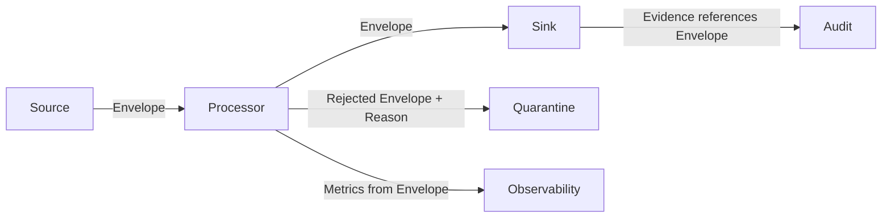
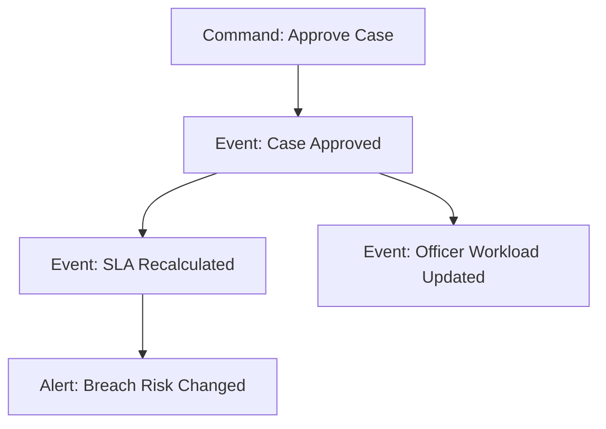
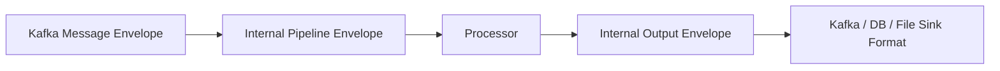
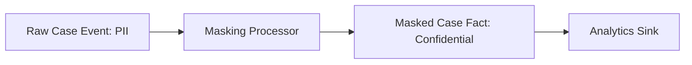

# Part 010 — Record Envelope Design

> Payload memberi tahu apa yang terjadi. Envelope memberi tahu bagaimana pipeline harus memperlakukan kejadian itu.

Pada Part 009 kita membuat abstraksi inti pipeline. Sekarang kita zoom ke satu objek yang kelihatannya kecil tetapi menentukan banyak hal: `Envelope`.

Envelope sering diremehkan. Banyak pipeline hanya membawa JSON payload, lalu metadata penting tersebar di log, header broker, nama file, atau bahkan hilang total.

Akibatnya:

- replay sulit
- dedupe rapuh
- audit kabur
- event-time processing salah
- schema evolution berantakan
- tracing putus
- sink tidak tahu idempotency key
- late data tidak bisa diputuskan dengan benar
- incident analysis bergantung pada tebakan

Bagian ini membahas bagaimana mendesain record envelope production-grade di Java.

---

## 1. Definisi Envelope

Dalam konteks data pipeline, envelope adalah wrapper yang membawa payload beserta konteks teknis dan semantik yang diperlukan untuk memproses payload secara benar.

Bentuk minimal:

```java
public record Envelope<K, V>(
        K key,
        V payload,
        RecordPosition position,
        EventTime eventTime,
        IngestionTime ingestionTime,
        SchemaRef schema,
        TraceContext trace,
        Map<String, String> headers,
        SourceRef source
) {}
```

Namun untuk sistem besar, kita sering butuh bentuk lebih kaya:

```java
public record Envelope<K, V>(
        RecordIdentity<K> identity,
        V payload,
        SourceContext source,
        TimeContext time,
        SchemaContext schema,
        TraceContext trace,
        ProcessingContext processing,
        SecurityContext security,
        CausalityContext causality,
        Map<String, String> attributes
) {}
```

Versi kedua lebih verbose, tetapi lebih stabil untuk sistem enterprise.

---

## 2. Mengapa Envelope Bukan Detail Teknis

Envelope adalah tempat pipeline menyimpan jawaban atas pertanyaan penting:

| Pertanyaan | Field Envelope |
|---|---|
| Record ini siapa? | identity |
| Dari mana asalnya? | source |
| Posisi source-nya apa? | position |
| Kapan kejadian bisnis terjadi? | event time |
| Kapan pipeline melihatnya? | ingestion time |
| Format payload versi berapa? | schema |
| Ini bagian dari trace/request mana? | trace context |
| Apakah ini replay/backfill/live? | processing context |
| Output ini diturunkan dari input mana? | causality |
| Apakah mengandung data sensitif? | security/classification |

Tanpa envelope, jawaban ini biasanya tercecer.

---

## 3. Envelope sebagai Boundary Kontrak

Envelope adalah kontrak antara source, processor, sink, dan observability.



Source tidak hanya mengirim payload. Source mengirim payload + konteks.

Processor tidak hanya menghasilkan payload baru. Processor menghasilkan payload baru + konteks derivasi.

Sink tidak hanya menulis data. Sink menggunakan envelope untuk idempotency, partitioning, audit, dan write semantics.

---

## 4. Envelope Layering

Envelope yang baik bisa dipikirkan dalam beberapa layer:

```text
Identity Layer
Source Layer
Time Layer
Schema Layer
Trace Layer
Processing Layer
Security Layer
Causality Layer
Payload Layer
```

Tidak semua pipeline membutuhkan semua layer di awal. Tetapi pipeline platform yang matang harus tahu di mana setiap concern ditempatkan.

---

## 5. Identity Layer

Identity menjawab: record ini apa?

```java
public record RecordIdentity<K>(
        K key,
        Optional<String> eventId,
        Optional<IdempotencyKey> idempotencyKey
) {}
```

Perbedaan penting:

| Field | Makna |
|---|---|
| `key` | key untuk routing/partitioning/grouping |
| `eventId` | identitas unik event dari producer/source |
| `idempotencyKey` | identitas operasi agar sink aman terhadap retry/replay |

Jangan selalu menyamakan ketiganya.

Contoh:

```text
key             = case-123
eventId         = evt-789
idempotencyKey  = pipeline-a:topic-1:partition-2:offset-991:transform-v3
```

Untuk materialized view:

```text
key             = case-123
eventId         = evt-789
idempotencyKey  = case-view:case-123:status
```

Key bisa sama untuk banyak event. Event id harus unik per event. Idempotency key tergantung efek sink.

---

## 6. Key Design

Key bukan hanya field teknis. Key memengaruhi:

- partitioning
- ordering
- parallelism
- state locality
- dedupe
- join
- sink upsert
- hot partition risk

Contoh domain enforcement lifecycle:

| Use Case | Key yang Cocok | Alasan |
|---|---|---|
| Case status stream | `caseId` | menjaga ordering per case |
| Officer workload aggregation | `officerId` | grouping by assignee |
| Breach alert event | `caseId` atau `breachId` | tergantung consumer |
| Audit event append | `eventId` | distribusi lebih merata |
| Materialized case view | `caseId` | upsert by entity |

Key design harus mengikuti invariant.

Kalau invariant-nya “event per case harus diproses berurutan”, key harus `caseId`, bukan random UUID.

---

## 7. Event ID Design

Event ID idealnya dibuat di producer, bukan di pipeline consumer.

Karakteristik event ID yang baik:

- stable across retries
- unique dalam scope yang jelas
- tidak berubah saat replay
- bisa dibawa ke downstream
- bisa dipakai untuk dedupe
- tidak bergantung pada timestamp saja

Contoh:

```java
public record EventId(String value) {
    public EventId {
        if (value == null || value.isBlank()) {
            throw new IllegalArgumentException("event id must not be blank");
        }
    }
}
```

Anti-pattern:

```java
String eventId = UUID.randomUUID().toString(); // dibuat saat consumer memproses
```

Jika event ID dibuat oleh consumer saat setiap processing attempt, replay akan menghasilkan ID berbeda.

---

## 8. Idempotency Key Design

Idempotency key harus dipilih berdasarkan side effect yang ingin dibuat aman.

### Append Event Sink

```text
idempotencyKey = sourceEventId + transformName + transformVersion
```

### Upsert View Sink

```text
idempotencyKey = viewName + businessKey
```

### File Output Sink

```text
idempotencyKey = partitionPath + batchId + transformVersion
```

### External API Sink

```text
idempotencyKey = externalOperationType + businessOperationId
```

Java type:

```java
public record IdempotencyKey(String value) {
    public IdempotencyKey {
        if (value == null || value.isBlank()) {
            throw new IllegalArgumentException("idempotency key must not be blank");
        }
        if (value.length() > 512) {
            throw new IllegalArgumentException("idempotency key too long");
        }
    }
}
```

Jangan membuat idempotency key terlalu pendek sehingga collision, atau terlalu detail sehingga replay dianggap operasi baru.

---

## 9. Source Layer

Source context menjawab: record ini berasal dari mana dan pada posisi apa?

```java
public record SourceContext(
        SourceRef ref,
        RecordPosition position,
        Optional<SnapshotContext> snapshot,
        Optional<TransactionContext> transaction
) {}
```

`SourceRef`:

```java
public record SourceRef(
        String system,
        String dataset,
        Optional<String> shard
) {}
```

Contoh:

```text
system  = kafka
dataset = enforcement.case-events.v1
shard   = partition-4
```

Atau:

```text
system  = postgres
dataset = enforcement.case_table
shard   = primary-db-1
```

Source context harus cukup untuk melakukan replay dan investigasi.

---

## 10. Record Position

`RecordPosition` harus stabil dan lossless.

```java
public sealed interface RecordPosition
        permits KafkaPosition, JdbcPosition, FilePosition, CdcPosition, ApiPosition {
    String asStableString();
}
```

Contoh Kafka:

```java
public record KafkaPosition(
        String topic,
        int partition,
        long offset
) implements RecordPosition {
    @Override
    public String asStableString() {
        return topic + ":" + partition + ":" + offset;
    }
}
```

Contoh file:

```java
public record FilePosition(
        String path,
        Optional<String> version,
        long lineNumber,
        Optional<Long> byteOffset
) implements RecordPosition {
    @Override
    public String asStableString() {
        return path + "#line=" + lineNumber + version.map(v -> "#version=" + v).orElse("");
    }
}
```

Contoh JDBC polling:

```java
public record JdbcPosition(
        String table,
        String highWatermarkColumn,
        String highWatermarkValue,
        Optional<String> tieBreakerColumn,
        Optional<String> tieBreakerValue
) implements RecordPosition {
    @Override
    public String asStableString() {
        return table + ":" + highWatermarkColumn + "=" + highWatermarkValue
                + tieBreakerColumn.map(c -> ":" + c + "=" + tieBreakerValue.orElse("")).orElse("");
    }
}
```

High-watermark tanpa tie-breaker sering berbahaya jika beberapa row punya timestamp sama.

---

## 11. Snapshot Context

Untuk CDC atau batch snapshot, record bisa berasal dari fase snapshot, bukan live stream.

```java
public record SnapshotContext(
        String snapshotId,
        boolean snapshotRecord,
        Optional<String> chunkId,
        Optional<Long> chunkSequence
) {}
```

Kenapa penting?

Karena pipeline sering memperlakukan snapshot dan live event berbeda:

- snapshot boleh mengisi initial state
- live event mungkin memicu alert
- snapshot mungkin tidak boleh menghasilkan notification
- snapshot bisa memiliki timestamp lama
- snapshot bisa diprioritaskan berbeda

Tanpa snapshot context, consumer bisa salah menganggap backfill sebagai kejadian baru.

---

## 12. Transaction Context

CDC dan beberapa source transactional membawa boundary transaksi.

```java
public record TransactionContext(
        String transactionId,
        long sequenceInTransaction,
        Optional<Long> transactionSize,
        Optional<Instant> committedAt
) {}
```

Ini berguna untuk:

- menjaga ordering antar perubahan dalam transaksi
- grouping perubahan yang harus diproses bersama
- audit
- debugging partial transaction visibility
- reconciliation

Tidak semua source punya transaksi. Karena itu field ini optional.

---

## 13. Time Layer

Time adalah salah satu sumber bug terbesar dalam pipeline.

Kita minimal membedakan:

```java
public record TimeContext(
        Optional<Instant> eventTime,
        Instant ingestionTime,
        Optional<Instant> sourceObservedTime,
        Optional<Instant> processingTime,
        Optional<Instant> businessEffectiveTime
) {}
```

| Time | Makna |
|---|---|
| `eventTime` | kapan kejadian terjadi menurut domain/source |
| `ingestionTime` | kapan pipeline menerima record |
| `sourceObservedTime` | kapan source system mencatat/melihat event |
| `processingTime` | kapan processor menjalankan transform |
| `businessEffectiveTime` | kapan data berlaku secara bisnis |

Contoh:

```text
case assigned at              = 2026-07-01T09:00:00Z
source row updated at         = 2026-07-01T09:00:03Z
pipeline consumed at          = 2026-07-01T09:00:10Z
processor transformed at      = 2026-07-01T09:00:11Z
assignment effective from     = 2026-07-01T08:30:00Z
```

Kelima waktu ini bisa berbeda.

---

## 14. Event Time vs Processing Time

Bug umum:

```java
var eventDate = LocalDate.now();
```

Ini memakai processing time, bukan event time.

Untuk analytics, windowing, SLA, dan audit, gunakan time yang benar.

Contoh buruk:

```java
boolean breached = Duration.between(Instant.now(), deadline).isNegative();
```

Lebih baik:

```java
boolean breached = Duration.between(eventTime, deadline).isNegative();
```

Atau jika aturan bisnis memang berdasarkan waktu evaluasi:

```java
boolean breached = Duration.between(evaluationTime, deadline).isNegative();
```

Selalu beri nama eksplisit. Jangan memakai `timestamp` generik.

---

## 15. Business Effective Time

Dalam domain regulasi, effective time sangat penting.

Contoh:

- keputusan dibuat tanggal 10
- berlaku surut dari tanggal 1
- data masuk pipeline tanggal 12
- laporan bulan sebelumnya harus dikoreksi

Envelope perlu membawa effective time bila output downstream bergantung pada validitas historis.

```java
public record BusinessEffectiveTime(
        Instant validFrom,
        Optional<Instant> validTo
) {}
```

Tanpa effective time, correction pipeline hampir pasti salah.

---

## 16. Schema Layer

Schema context menjawab: payload ini mengikuti kontrak apa?

```java
public record SchemaContext(
        String subject,
        int version,
        String format,
        Optional<String> fingerprint
) {}
```

Contoh:

```text
subject     = enforcement.case-event
version     = 5
format      = avro
fingerprint = 9e4a7...
```

Schema context penting untuk:

- deserialization
- compatibility check
- routing version
- migration
- audit
- debugging consumer failure

Jika pipeline menerima JSON bebas tanpa schema context, pipeline kehilangan kemampuan untuk reason evolution.

---

## 17. Payload Type vs Schema Type

Di Java, payload type dan schema type tidak selalu sama.

```java
Envelope<String, CaseEventV5>
```

Java type `CaseEventV5` bisa berasal dari:

- Avro generated class
- Protobuf generated class
- Jackson-bound DTO
- manually written record
- internal canonical model

Schema context tetap perlu dibawa karena Java class name bukan contract publik.

Buruk:

```java
payload.getClass().getSimpleName(); // dianggap schema
```

Lebih baik:

```java
schema.subject();
schema.version();
schema.fingerprint();
```

---

## 18. Trace Layer

Trace context menghubungkan pipeline dengan request, event, atau workflow upstream.

```java
public record TraceContext(
        Optional<String> traceId,
        Optional<String> spanId,
        Optional<String> correlationId,
        Optional<String> causationId
) {}
```

Perbedaan umum:

| Field | Makna |
|---|---|
| `traceId` | distributed trace teknis |
| `spanId` | span saat ini |
| `correlationId` | mengelompokkan operasi bisnis/request |
| `causationId` | event/command yang menyebabkan event ini |

Pipeline sering asynchronous. Trace tidak selalu linear. Karena itu correlation dan causation sering lebih berguna daripada trace id saja.

---

## 19. Correlation vs Causation

Contoh:

```text
correlationId = case-journey-123
causationId   = command-approve-case-999
eventId       = event-case-approved-1001
```

Jika event menghasilkan event baru:

```text
new.correlationId = old.correlationId
new.causationId   = old.eventId
new.eventId       = generated stable event id
```

Ini membentuk causal graph.



Tanpa causation id, investigasi “kenapa alert ini muncul?” menjadi mahal.

---

## 20. Processing Layer

Processing context menjawab bagaimana record sedang diproses.

```java
public record ProcessingContext(
        String pipelineId,
        String pipelineRunId,
        String transformName,
        String transformVersion,
        ProcessingMode mode,
        int attempt
) {}

public enum ProcessingMode {
    LIVE,
    REPLAY,
    BACKFILL,
    REPAIR,
    SHADOW,
    DRY_RUN
}
```

Mode sangat penting.

Contoh aturan:

| Mode | Behavior |
|---|---|
| `LIVE` | tulis output normal, trigger alert |
| `REPLAY` | tulis idempotent output, jangan kirim notification eksternal |
| `BACKFILL` | tulis historical partition, throttle sink |
| `REPAIR` | override output rusak dengan evidence |
| `SHADOW` | hitung output pembanding, jangan expose |
| `DRY_RUN` | validasi saja, tidak ada side effect |

Tanpa mode, backfill bisa memicu email, alert, atau webhook yang seharusnya tidak terjadi.

---

## 21. Attempt Number

Attempt count berguna untuk observability dan policy.

```java
public record Attempt(int value) {
    public Attempt next() {
        return new Attempt(value + 1);
    }
}
```

Jangan menyimpan attempt hanya di log. Retry policy dan DLQ butuh data ini.

Contoh:

```java
if (context.attempt() >= 5) {
    return ErrorDecision.Quarantine("max attempts exceeded");
}
```

---

## 22. Security Layer

Envelope bisa membawa klasifikasi data.

```java
public record SecurityContext(
        DataClassification classification,
        Set<String> policyTags,
        Optional<String> tenantId,
        Optional<String> ownerTeam
) {}

public enum DataClassification {
    PUBLIC,
    INTERNAL,
    CONFIDENTIAL,
    RESTRICTED,
    PII,
    SENSITIVE_PII
}
```

Ini membantu:

- masking
- access control
- logging policy
- sink routing
- retention
- audit
- tenant isolation

Contoh: observer tidak boleh log payload penuh jika classification `PII`.

```java
if (envelope.security().classification() == DataClassification.PII) {
    logger.info("processed pii record key={}", envelope.identity().key());
} else {
    logger.info("processed record payload={}", envelope.payload());
}
```

---

## 23. Causality Layer

Causality context menjawab: output ini berasal dari input mana?

```java
public record CausalityContext(
        List<CausalRef> causes
) {}

public record CausalRef(
        String sourceSystem,
        String sourceDataset,
        String sourcePosition,
        String inputKey,
        Optional<String> inputEventId,
        Optional<String> transformVersion
) {}
```

Untuk transform 1:1, satu cause cukup.

Untuk aggregation/window/join, bisa banyak cause.

Contoh aggregation:

```text
OfficerDailyWorkloadFact
  causes:
    case-assigned evt-1
    case-reassigned evt-2
    case-closed evt-3
```

Causality bukan hanya untuk lineage cantik. Ini memungkinkan selective repair.

---

## 24. Attribute Map: Gunakan Secara Terkontrol

`Map<String, String> attributes` berguna untuk metadata tambahan.

Tetapi jangan jadikan tempat sampah.

Aturan:

1. Field yang dipakai untuk invariant harus typed field.
2. Attribute boleh untuk metadata non-core.
3. Attribute key harus punya naming convention.
4. Attribute tidak boleh menggantikan schema.
5. Attribute penting harus terdokumentasi.

Contoh baik:

```text
source.file.name
source.file.etag
pipeline.replay.reason
quality.rule.id
```

Contoh buruk:

```text
misc
flag
data
x
```

---

## 25. Immutable Envelope

Envelope harus immutable.

Java `record` cocok untuk ini.

Kenapa immutable?

- aman untuk concurrency
- mudah dites
- menghindari mutation tersembunyi antar stage
- mendukung retry/replay
- memudahkan audit

Jika perlu memperbarui context, buat envelope baru.

```java
public Envelope<K, V> withProcessingContext(ProcessingContext newContext) {
    return new Envelope<>(
            identity,
            payload,
            source,
            time,
            schema,
            trace,
            newContext,
            security,
            causality,
            attributes
    );
}
```

Pada Java record, method helper bisa ditempatkan di record untuk copy-on-write.

---

## 26. Builder vs Constructor

Envelope punya banyak field. Constructor panjang mudah salah.

Gunakan builder, tetapi tetap hasilkan immutable record.

```java
Envelope<EventId, CaseEvent> envelope = EnvelopeBuilder.<EventId, CaseEvent>create()
        .identity(identity)
        .payload(event)
        .source(source)
        .time(time)
        .schema(schema)
        .trace(trace)
        .processing(processing)
        .security(security)
        .causality(causality)
        .attributes(attributes)
        .build();
```

Builder harus melakukan validation.

```java
public Envelope<K, V> build() {
    requireNonNull(identity, "identity");
    requireNonNull(payload, "payload");
    requireNonNull(source, "source");
    requireNonNull(time, "time");
    requireNonNull(schema, "schema");
    return new Envelope<>(identity, payload, source, time, schema, trace, processing, security, causality, Map.copyOf(attributes));
}
```

---

## 27. Validation Rules

Envelope validation minimal:

| Rule | Alasan |
|---|---|
| key tidak kosong | routing/dedupe |
| source ada | replay/debugging |
| position ada | checkpoint |
| ingestion time ada | lag/freshness |
| schema ada | compatibility |
| processing mode ada | side effect policy |
| classification ada | logging/security |
| attributes immutable | thread safety |

Jangan validasi semua business rule di envelope. Business validation berada di processor/contract validation.

Envelope validation memastikan konteks operasional cukup.

---

## 28. Envelope Size Trade-off

Envelope yang terlalu besar punya cost:

- memory pressure
- serialization overhead
- network overhead
- log noise
- storage overhead
- cache inefficiency

Tetapi envelope yang terlalu kecil menciptakan debugging nightmare.

Guideline:

- bawa metadata yang diperlukan untuk correctness
- bawa reference untuk metadata besar
- jangan bawa payload audit besar di setiap record jika bisa pakai object reference
- jangan log seluruh envelope secara default
- pisahkan internal envelope dan external event envelope jika perlu

---

## 29. Internal vs External Envelope

External envelope adalah kontrak antar sistem.

Internal envelope adalah representasi runtime pipeline.

Jangan selalu memaksa keduanya sama.



Kafka headers mungkin menjadi input bagi internal envelope. Tetapi internal envelope bisa memiliki field tambahan seperti `attempt`, `pipelineRunId`, atau `securityContext`.

---

## 30. Serialization Strategy

Envelope bisa hidup hanya di memory atau diserialisasi ke storage/log.

Pertanyaan desain:

1. Apakah envelope disimpan di DLQ?
2. Apakah envelope dikirim downstream?
3. Apakah envelope dicatat di audit store?
4. Apakah envelope dipakai untuk replay?
5. Apakah envelope harus backward-compatible?

Jika envelope disimpan durable, envelope sendiri butuh schema evolution.

Format umum:

- JSON untuk debugging dan DLQ manusiawi
- Avro/Protobuf untuk compact typed event
- database columns untuk audit/query
- object storage JSONL/Parquet untuk replay besar

---

## 31. DLQ Envelope

DLQ tidak boleh hanya menyimpan payload invalid.

DLQ record minimal:

```java
public record DeadLetterRecord(
        Envelope<?, ?> originalEnvelope,
        String failureType,
        String failureMessage,
        Optional<String> stackTraceHash,
        Instant failedAt,
        String failedStage,
        int attempt,
        Map<String, String> diagnosticAttributes
) {}
```

Kenapa original envelope perlu disimpan?

Karena replay DLQ butuh:

- source position
- schema version
- event time
- processing mode
- transform version
- correlation id
- classification

Payload saja tidak cukup.

---

## 32. Envelope and Logging

Structured log sebaiknya mengambil field envelope yang aman.

```java
logger.info("pipeline_record_processed pipelineId={} runId={} source={} position={} key={} eventTime={} schema={} mode={}",
        env.processing().pipelineId(),
        env.processing().pipelineRunId(),
        env.source().ref().dataset(),
        env.source().position().asStableString(),
        env.identity().key(),
        env.time().eventTime().orElse(null),
        env.schema().subject() + ":" + env.schema().version(),
        env.processing().mode());
```

Jangan log payload penuh secara default.

Rule:

> Log identity and evidence, not sensitive data.

---

## 33. Envelope and Metrics

Metrics dari envelope:

- `records_processed_total{pipeline,source,schema,mode}`
- `records_rejected_total{pipeline,reason,schema}`
- `event_lag_seconds{pipeline,source}`
- `ingestion_lag_seconds{pipeline,source}`
- `processing_attempts{pipeline}`
- `late_records_total{pipeline,source}`

Lag:

```java
Duration eventLag = Duration.between(eventTime, Instant.now());
Duration ingestionLag = Duration.between(ingestionTime, Instant.now());
```

Hati-hati: `Instant.now()` di test membuat nondeterminism. Gunakan `Clock` injection.

---

## 34. Envelope and Tracing

Pipeline asynchronous harus membuat span baru dari trace context jika ada.

Pseudo-flow:

```text
extract trace context from envelope
start processing span
add attributes: pipelineId, sourcePosition, schemaVersion, processingMode
process record
record result
end span
```

Trace attribute jangan berisi payload sensitif.

Gunakan:

- record key hash bila key sensitif
- source position
- schema subject/version
- result status
- error category

---

## 35. Envelope and Partitioning

Sink bisa memakai envelope key untuk partitioning.

Contoh Kafka sink:

```java
ProducerRecord<String, byte[]> record = new ProducerRecord<>(
        topic,
        envelope.identity().key().toString(),
        serializedPayload
);
```

Namun kadang sink partitioning berbeda dari source key.

Contoh:

- source key `eventId`
- output key `caseId`

Processor harus eksplisit mengganti key.

```java
RecordIdentity<CaseId> outputIdentity = new RecordIdentity<>(
        fact.caseId(),
        Optional.of(outputEventId),
        Optional.of(idempotencyKey)
);
```

Key propagation yang salah bisa menghancurkan ordering downstream.

---

## 36. Envelope and Watermark

Watermark biasanya dihitung dari event time dan source progress.

Envelope harus menyediakan event time yang jelas.

Jika event time optional, processor harus punya policy:

| Kondisi | Policy |
|---|---|
| event time ada | gunakan event time |
| event time kosong tapi source observed time ada | fallback jika disetujui |
| semua time domain kosong | reject atau pakai ingestion time dengan flag |

Jangan diam-diam memakai ingestion time sebagai event time tanpa evidence.

---

## 37. Envelope and Replay

Replay membutuhkan envelope stabil.

Saat replay, field yang seharusnya tetap:

- original event id
- original source position
- original event time
- original schema
- original payload
- original causality

Field yang boleh berubah:

- pipeline run id
- processing time
- attempt
- processing mode
- observer metadata

Jika idempotency key bergantung pada run id, replay akan menghasilkan duplicate.

---

## 38. Envelope and Backfill

Backfill bukan live processing biasa.

Backfill envelope harus membawa:

```java
public record BackfillContext(
        String backfillId,
        String reason,
        Optional<Instant> rangeStart,
        Optional<Instant> rangeEnd,
        boolean allowExternalSideEffects
) {}
```

Bisa dimasukkan ke processing context attributes atau typed field jika sering dipakai.

Rule:

> Backfill harus eksplisit di envelope agar downstream bisa membedakan historical correction dari live business event.

---

## 39. Envelope and Multi-Tenancy

Jika pipeline multi-tenant, tenant context harus typed field.

```java
public record TenantContext(
        String tenantId,
        Optional<String> region,
        Optional<String> dataResidencyZone
) {}
```

Jangan simpan tenant hanya sebagai header bebas.

Tenant memengaruhi:

- routing
- authorization
- encryption key
- retention
- observability cardinality
- sink partition
- incident blast radius

---

## 40. Envelope and Data Classification

Data classification harus bisa mengalir bersama record.

Contoh pipeline:



Processor dapat menurunkan classification:

```java
SecurityContext outputSecurity = input.security().withClassification(DataClassification.CONFIDENTIAL);
```

Atau menaikkan classification jika enrichment menambahkan data sensitif.

---

## 41. Envelope Evolution

Envelope structure juga bisa berubah.

Jangan asumsikan envelope internal tidak perlu versi jika disimpan durable.

Tambahkan envelope version:

```java
public record EnvelopeVersion(int value) {}
```

Atau di schema context:

```text
envelope.schema.subject = internal.pipeline-envelope
envelope.schema.version = 2
payload.schema.subject  = enforcement.case-event
payload.schema.version  = 5
```

Envelope evolution harus kompatibel untuk DLQ lama, replay lama, dan audit lama.

---

## 42. Java Implementation Blueprint

Salah satu desain final yang cukup sehat:

```java
public record Envelope<K, V>(
        EnvelopeVersion envelopeVersion,
        RecordIdentity<K> identity,
        V payload,
        SourceContext source,
        TimeContext time,
        SchemaContext schema,
        TraceContext trace,
        ProcessingContext processing,
        SecurityContext security,
        CausalityContext causality,
        Map<String, String> attributes
) {
    public Envelope {
        Objects.requireNonNull(envelopeVersion, "envelopeVersion");
        Objects.requireNonNull(identity, "identity");
        Objects.requireNonNull(payload, "payload");
        Objects.requireNonNull(source, "source");
        Objects.requireNonNull(time, "time");
        Objects.requireNonNull(schema, "schema");
        Objects.requireNonNull(trace, "trace");
        Objects.requireNonNull(processing, "processing");
        Objects.requireNonNull(security, "security");
        Objects.requireNonNull(causality, "causality");
        attributes = Map.copyOf(attributes == null ? Map.of() : attributes);
    }

    public Optional<IdempotencyKey> idempotencyKey() {
        return identity.idempotencyKey();
    }

    public String sourcePosition() {
        return source.position().asStableString();
    }
}
```

---

## 43. Example: Case Event Envelope

Domain payload:

```java
public record CaseStatusChanged(
        String caseId,
        String previousStatus,
        String newStatus,
        Instant changedAt,
        String changedBy
) {}
```

Envelope:

```java
Envelope<String, CaseStatusChanged> envelope = new Envelope<>(
        new EnvelopeVersion(1),
        new RecordIdentity<>(
                "case-123",
                Optional.of("evt-456"),
                Optional.of(new IdempotencyKey("case-status-pipeline:evt-456:v1"))
        ),
        new CaseStatusChanged(
                "case-123",
                "UNDER_REVIEW",
                "ESCALATED",
                Instant.parse("2026-07-04T01:10:00Z"),
                "officer-77"
        ),
        new SourceContext(
                new SourceRef("kafka", "enforcement.case-events.v1", Optional.of("partition-2")),
                new KafkaPosition("enforcement.case-events.v1", 2, 99881L),
                Optional.empty(),
                Optional.empty()
        ),
        new TimeContext(
                Optional.of(Instant.parse("2026-07-04T01:10:00Z")),
                Instant.parse("2026-07-04T01:10:03Z"),
                Optional.of(Instant.parse("2026-07-04T01:10:01Z")),
                Optional.empty(),
                Optional.of(Instant.parse("2026-07-04T01:10:00Z"))
        ),
        new SchemaContext("enforcement.case-status-changed", 3, "avro", Optional.empty()),
        new TraceContext(
                Optional.of("trace-abc"),
                Optional.empty(),
                Optional.of("case-journey-123"),
                Optional.of("cmd-escalate-123")
        ),
        new ProcessingContext(
                "case-status-normalizer",
                "run-20260704-001",
                "normalize-case-status",
                "1.2.0",
                ProcessingMode.LIVE,
                1
        ),
        new SecurityContext(
                DataClassification.PII,
                Set.of("case-data", "officer-id"),
                Optional.of("tenant-a"),
                Optional.of("regulatory-platform")
        ),
        new CausalityContext(List.of()),
        Map.of("source.producer", "case-service")
);
```

Verbose? Ya.

Tetapi saat insiden, envelope seperti ini menghemat jam investigasi.

---

## 44. Example: Transform Output Envelope

Input `CaseStatusChanged` menjadi `CaseStatusFact`.

```java
public record CaseStatusFact(
        String caseId,
        String status,
        Instant effectiveAt,
        String sourceEventId
) {}
```

Output envelope:

```java
Envelope<String, CaseStatusFact> output = new Envelope<>(
        input.envelopeVersion(),
        new RecordIdentity<>(
                input.payload().caseId(),
                Optional.of("fact-" + input.identity().eventId().orElseThrow()),
                Optional.of(new IdempotencyKey("case-status-fact:" + input.payload().caseId()))
        ),
        new CaseStatusFact(
                input.payload().caseId(),
                input.payload().newStatus(),
                input.payload().changedAt(),
                input.identity().eventId().orElseThrow()
        ),
        input.source(),
        input.time(),
        new SchemaContext("analytics.case-status-fact", 1, "json", Optional.empty()),
        input.trace(),
        input.processing(),
        input.security(),
        new CausalityContext(List.of(new CausalRef(
                input.source().ref().system(),
                input.source().ref().dataset(),
                input.sourcePosition(),
                input.identity().key().toString(),
                input.identity().eventId(),
                Optional.of(input.processing().transformVersion())
        ))),
        Map.of("derived.from", "case-status-changed")
);
```

Perhatikan idempotency key output berubah karena sink output adalah materialized fact per case.

---

## 45. Common Envelope Mistakes

### Mistake 1 — Payload-only Pipeline

```java
void process(CaseEvent event) { ... }
```

Tidak ada source position, schema, trace, event time, atau idempotency.

### Mistake 2 — Timestamp Ambiguity

```java
Instant timestamp;
```

Timestamp apa? Event? Ingestion? Processing? Effective?

### Mistake 3 — Random ID During Processing

```java
var id = UUID.randomUUID();
```

Membuat replay tidak stabil.

### Mistake 4 — Header Stringly-Typed Everywhere

```java
headers.get("tenant")
headers.get("schema")
headers.get("eventTime")
```

Field invariant harus typed.

### Mistake 5 — Missing Processing Mode

Backfill dianggap live event dan memicu side effect.

### Mistake 6 — No Causality

Output tidak bisa ditelusuri ke input.

### Mistake 7 — Logging Full Envelope

Data sensitif bocor ke log.

---

## 46. Envelope Review Checklist

Gunakan checklist ini saat review desain pipeline.

### Identity

- Apakah key berbeda jelas dari event id?
- Apakah event id stable saat retry/replay?
- Apakah idempotency key sesuai side effect sink?
- Apakah key mendukung ordering/partitioning invariant?

### Source

- Apakah source ref jelas?
- Apakah position lossless?
- Apakah snapshot/live bisa dibedakan?
- Apakah transaction context tersedia jika perlu?

### Time

- Apakah event time dan ingestion time dibedakan?
- Apakah effective time diperlukan?
- Apakah fallback time policy eksplisit?
- Apakah timezone ambiguity dihindari dengan `Instant`?

### Schema

- Apakah schema subject/version tersedia?
- Apakah payload type tidak disamakan dengan schema contract?
- Apakah envelope version dibutuhkan?

### Trace

- Apakah correlation id ada?
- Apakah causation id ada untuk event turunan?
- Apakah trace attribute aman dari PII?

### Processing

- Apakah mode live/replay/backfill eksplisit?
- Apakah transform version tercatat?
- Apakah attempt count tersedia?

### Security

- Apakah classification tersedia?
- Apakah tenant/owner tersedia bila multi-tenant?
- Apakah logging policy memakai classification?

### Causality

- Apakah output bisa ditelusuri ke input?
- Apakah join/aggregation menyimpan multiple causes?
- Apakah selective repair memungkinkan?

---

## 47. Practical Minimum Envelope

Untuk pipeline kecil, gunakan minimum ini:

```java
public record MinimalEnvelope<K, V>(
        K key,
        Optional<String> eventId,
        V payload,
        RecordPosition position,
        Instant eventTime,
        Instant ingestionTime,
        String schemaSubject,
        int schemaVersion,
        String pipelineId,
        String transformVersion,
        ProcessingMode mode,
        Optional<String> correlationId,
        Map<String, String> headers
) {}
```

Jangan lebih kecil dari ini untuk pipeline yang butuh replay, audit, dan debugging.

---

## 48. Advanced Envelope

Untuk platform internal besar:

```java
public record AdvancedEnvelope<K, V>(
        EnvelopeVersion envelopeVersion,
        RecordIdentity<K> identity,
        V payload,
        SourceContext source,
        TimeContext time,
        SchemaContext schema,
        TraceContext trace,
        ProcessingContext processing,
        SecurityContext security,
        TenantContext tenant,
        CausalityContext causality,
        QualityContext quality,
        Map<String, String> attributes
) {}
```

Quality context bisa berisi hasil validation:

```java
public record QualityContext(
        List<String> passedRules,
        List<String> warnings,
        List<String> failedRules
) {}
```

Tetapi jangan over-engineer dari hari pertama. Tambahkan saat invariant menuntut.

---

## 49. Ringkasan

Envelope adalah salah satu desain paling penting dalam data pipeline.

Payload-only pipeline terlihat sederhana, tetapi kehilangan kemampuan untuk:

- checkpoint dengan aman
- dedupe
- replay
- backfill
- trace
- audit
- enforce schema
- membedakan event time dan processing time
- menghindari side effect saat replay
- melakukan impact analysis

Mental model utamanya:

> Payload adalah data. Envelope adalah operational truth yang membuat data itu bisa diproses secara benar di sistem terdistribusi.

Desain envelope yang baik tidak harus besar, tetapi harus menjawab pertanyaan produksi yang benar.

---

## 50. Latihan Praktis

Ambil satu event domain, misalnya:

```text
CaseEscalated
```

Desain envelope untuk event tersebut:

1. Apa key-nya?
2. Apa event id-nya?
3. Apa idempotency key untuk append sink?
4. Apa idempotency key untuk materialized view sink?
5. Apa event time?
6. Apa ingestion time?
7. Apa business effective time?
8. Apa schema subject/version?
9. Apa correlation id?
10. Apa causation id?
11. Apa data classification?
12. Apa processing mode saat replay?
13. Apa causal ref untuk output turunannya?

Jika semua jawaban eksplisit, pipeline-mu sudah jauh lebih siap untuk production daripada mayoritas script ETL yang hanya memindahkan payload.

