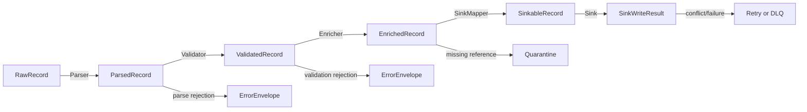

# Part 011 — Pipeline Type System

> Pipeline yang kuat bukan hanya pipeline yang bisa memproses banyak data. Pipeline yang kuat adalah pipeline yang membuat operasi salah menjadi sulit dilakukan.

Pada Part 009 kita membuat abstraksi inti pipeline: `Source`, `Processor`, `Sink`, `CheckpointStore`, dan `PipelineRunner`.

Pada Part 010 kita memperkuat objek paling penting di jalur data: `Envelope`.

Sekarang kita masuk ke pertanyaan yang lebih dalam: **bagaimana Java type system membantu kita mencegah bug pipeline sebelum runtime?**

Ini bukan materi generic “belajar generics Java”. Fokusnya adalah bagaimana engineer production-grade memakai type system untuk menjaga boundary pipeline:

- source tidak boleh mengeluarkan posisi yang tidak bisa di-commit
- transform tidak boleh diam-diam mengubah semantic event
- sink tidak boleh menulis payload yang belum tervalidasi
- DLQ tidak boleh kehilangan alasan kegagalan
- event mentah tidak boleh dipakai sebagai event canonical
- command tidak boleh diproses sebagai fact
- PII tidak boleh bocor ke sink yang tidak boleh menerimanya
- record hasil backfill tidak boleh bercampur dengan live stream tanpa context

Di sistem data skala besar, bug paling mahal sering bukan `NullPointerException`. Bug paling mahal adalah data salah yang berhasil diproses.

Type system tidak menyelesaikan semua problem. Tetapi ia memberi pagar yang murah, cepat, dan lokal.

---

## 1. Masalah Utama: Pipeline Primitive Obsession

Banyak pipeline Java dimulai seperti ini:

```java
String payload = consumerRecord.value();
Map<String, String> headers = extractHeaders(consumerRecord);
String eventId = headers.get("event_id");
String eventType = headers.get("event_type");
String source = headers.get("source");
long offset = consumerRecord.offset();
```

Lalu transform seperti ini:

```java
Map<String, Object> event = objectMapper.readValue(payload, Map.class);
String caseId = (String) event.get("case_id");
String status = (String) event.get("status");
```

Kode seperti ini terasa cepat. Tetapi ia menyimpan banyak kegagalan laten:

| Primitive | Hidden meaning | Bug yang sering muncul |
|---|---|---|
| `String eventId` | unique event identity | tertukar dengan business id |
| `String caseId` | aggregate id | salah pakai sebagai idempotency key |
| `String status` | domain state | invalid state masuk ke sink |
| `long offset` | source position | offset Kafka dianggap sama dengan cursor DB |
| `Instant timestamp` | event/processing/ingestion time | salah windowing dan SLA |
| `Map headers` | control metadata | metadata wajib hilang tanpa compile error |
| `Map payload` | unknown structure | runtime error dan schema drift tersembunyi |

Primitive obsession membuat semua terlihat kompatibel padahal tidak.

Contoh paling berbahaya:

```java
writeToAuditLog(eventId, caseId, status, timestamp);
```

Apakah `timestamp` di sini event time, ingestion time, processing time, atau effective business time? Compiler tidak tahu. Reviewer juga sering tidak tahu.

Production-grade pipeline perlu lebih eksplisit.

---

## 2. Target Desain Type System Pipeline

Kita ingin type system membantu menjaga lima hal.

### 2.1 Boundary correctness

Setiap boundary punya tipe yang jelas:

```text
Raw source record -> Parsed record -> Validated domain event -> Canonical event -> Sink command
```

Tidak semua stage boleh menerima semua tipe.

### 2.2 Semantic distinction

Dua nilai yang sama-sama `String` belum tentu sama makna.

```java
public record EventId(String value) {}
public record CaseId(String value) {}
public record TenantId(String value) {}
public record IdempotencyKey(String value) {}
```

Sekarang ini tidak bisa tertukar tanpa compiler marah:

```java
CaseId caseId = new EventId("evt-123"); // compile error
```

### 2.3 State transition visibility

Pipeline stage harus terlihat mengubah state record:

```text
Raw<CasePayload> -> Parsed<CaseEvent> -> Validated<CaseEvent> -> Enriched<CaseEvent> -> Sinkable<CaseProjection>
```

Jika sink hanya menerima `Sinkable<T>`, event mentah tidak bisa langsung ditulis.

### 2.4 Error as data

Kegagalan parsing, validation, enrichment, dan sink write harus bisa dimodelkan, bukan dilempar sembarangan.

```java
StageResult<Validated<CaseEvent>> result = validator.validate(parsed);
```

### 2.5 Compile-time affordance

Kita ingin API yang mengarahkan engineer ke urutan benar.

Bukan hanya:

```java
process(anything);
```

Melainkan:

```java
Parsed<RawCaseEvent> parsed = parser.parse(raw).orThrow();
Validated<CaseEvent> validated = validator.validate(parsed).orThrow();
Enriched<CaseEvent> enriched = enricher.enrich(validated).orThrow();
sink.write(enriched.toSinkCommand());
```

Lebih panjang sedikit, tetapi failure mode lebih jelas.

---

## 3. Value Object untuk Identity dan Metadata

Mari mulai dari value object.

### 3.1 Jangan pakai `String` untuk semua id

```java
public record EventId(String value) {
    public EventId {
        if (value == null || value.isBlank()) {
            throw new IllegalArgumentException("event id must not be blank");
        }
    }
}

public record CaseId(String value) {
    public CaseId {
        if (value == null || value.isBlank()) {
            throw new IllegalArgumentException("case id must not be blank");
        }
    }
}

public record TenantId(String value) {
    public TenantId {
        if (value == null || value.isBlank()) {
            throw new IllegalArgumentException("tenant id must not be blank");
        }
    }
}
```

Ini membuat domain boundary lebih tajam.

### 3.2 Idempotency key harus tipe sendiri

Idempotency key bukan selalu event id.

```java
public record IdempotencyKey(String value) {
    public IdempotencyKey {
        if (value == null || value.isBlank()) {
            throw new IllegalArgumentException("idempotency key must not be blank");
        }
    }

    public static IdempotencyKey of(String source, String entityId, String version) {
        return new IdempotencyKey(source + ":" + entityId + ":" + version);
    }
}
```

Perbedaan penting:

| Concept | Meaning | Example |
|---|---|---|
| `EventId` | identitas kejadian | `evt-923` |
| `CaseId` | identitas aggregate/domain entity | `case-77` |
| `IdempotencyKey` | key untuk mencegah efek ganda di sink | `cases:case-77:v12` |
| `CorrelationId` | menghubungkan flow lintas service | `corr-abc` |
| `CausationId` | event/command yang menyebabkan event ini | `cmd-555` |

Kalau semuanya `String`, bug konseptual tidak terlihat.

### 3.3 Time juga harus dibedakan

```java
public record EventTime(Instant value) {}
public record IngestionTime(Instant value) {}
public record ProcessingTime(Instant value) {}
public record EffectiveTime(Instant value) {}
```

Ini mencegah code seperti ini:

```java
Duration latency = Duration.between(event.ingestionTime(), Instant.now());
```

Yang sebenarnya mungkin ingin mengukur freshness dari event time:

```java
Duration freshness = Duration.between(event.eventTime().value(), Instant.now());
```

### 3.4 Source position juga harus polymorphic

Offset Kafka tidak sama dengan cursor file atau LSN database.

```java
public sealed interface SourcePosition
        permits KafkaPosition, FilePosition, JdbcCursorPosition, CdcLogPosition {
}

public record KafkaPosition(
        String topic,
        int partition,
        long offset
) implements SourcePosition {}

public record FilePosition(
        String path,
        long byteOffset,
        String contentHash
) implements SourcePosition {}

public record JdbcCursorPosition(
        String table,
        String cursorColumn,
        String cursorValue
) implements SourcePosition {}

public record CdcLogPosition(
        String connector,
        String logFile,
        long logOffset,
        String transactionId
) implements SourcePosition {}
```

Dengan desain ini, commit logic bisa menolak posisi yang tidak ia mengerti.

---

## 4. Sealed Interface untuk Domain Event Taxonomy

Pipeline sering mengolah banyak event.

Desain buruk:

```java
public record GenericEvent(String type, Map<String, Object> payload) {}
```

Desain lebih kuat:

```java
public sealed interface CaseEvent
        permits CaseOpened, CaseAssigned, CaseEscalated, CaseClosed {
    CaseId caseId();
    EventId eventId();
    EventTime eventTime();
}

public record CaseOpened(
        EventId eventId,
        CaseId caseId,
        TenantId tenantId,
        EventTime eventTime,
        String openedBy
) implements CaseEvent {}

public record CaseAssigned(
        EventId eventId,
        CaseId caseId,
        TenantId tenantId,
        EventTime eventTime,
        String assignee
) implements CaseEvent {}

public record CaseEscalated(
        EventId eventId,
        CaseId caseId,
        TenantId tenantId,
        EventTime eventTime,
        String escalationLevel,
        String reason
) implements CaseEvent {}

public record CaseClosed(
        EventId eventId,
        CaseId caseId,
        TenantId tenantId,
        EventTime eventTime,
        String outcome
) implements CaseEvent {}
```

Keuntungannya:

- event taxonomy eksplisit
- compiler membantu exhaustive handling
- transform lebih mudah diuji
- invalid event type tidak diam-diam lewat
- refactor event lebih aman

Contoh handler:

```java
public CaseProjection apply(CaseProjection current, CaseEvent event) {
    return switch (event) {
        case CaseOpened e -> current.open(e.caseId(), e.openedBy(), e.eventTime());
        case CaseAssigned e -> current.assign(e.assignee(), e.eventTime());
        case CaseEscalated e -> current.escalate(e.escalationLevel(), e.reason(), e.eventTime());
        case CaseClosed e -> current.close(e.outcome(), e.eventTime());
    };
}
```

Di sini compiler mengetahui seluruh subtype `CaseEvent`.

Jika nanti ditambah event baru:

```java
public record CaseReopened(...) implements CaseEvent {}
```

Maka handler yang belum mengurus `CaseReopened` bisa terlihat saat compile.

---

## 5. Bedakan Command, Event, State, Projection

Salah satu kesalahan desain pipeline adalah mencampur:

- command
- event
- snapshot state
- projection
- correction
- audit entry

Padahal masing-masing punya semantics berbeda.

### 5.1 Command

Command adalah permintaan melakukan sesuatu.

```java
public sealed interface CaseCommand permits OpenCase, AssignCase, CloseCase {
    CaseId caseId();
    CorrelationId correlationId();
}
```

Command bisa ditolak.

### 5.2 Event

Event adalah fakta bahwa sesuatu sudah terjadi.

```java
public sealed interface CaseEvent permits CaseOpened, CaseAssigned, CaseClosed {
    EventId eventId();
    CaseId caseId();
    EventTime eventTime();
}
```

Event tidak “ditolak” dalam pipeline; jika invalid, ia dikarantina atau dikoreksi.

### 5.3 State

State adalah hasil akumulasi event.

```java
public record CaseState(
        CaseId caseId,
        CaseStatus status,
        Optional<String> assignee,
        long version,
        EventTime lastEventTime
) {}
```

### 5.4 Projection

Projection adalah bentuk baca/serving.

```java
public record CaseDashboardRow(
        CaseId caseId,
        String status,
        String assignee,
        Duration age,
        boolean breached
) {}
```

### 5.5 Correction

Correction bukan sekadar update biasa.

```java
public record CaseCorrection(
        EventId correctionId,
        EventId correctedEventId,
        CaseId caseId,
        String reason,
        EventTime effectiveTime
) {}
```

Jika semua diperlakukan sebagai `Map`, pipeline akan kehilangan kemampuan audit dan reasoning.

---

## 6. Stage Types: Raw, Parsed, Validated, Enriched, Sinkable

Kita bisa memodelkan perjalanan record sebagai state machine type-level.

```java
public sealed interface RecordStage permits Raw, Parsed, Validated, Enriched, Sinkable {}

public record Raw<T>(Envelope<String, String> envelope) implements RecordStage {}

public record Parsed<T>(Envelope<String, T> envelope) implements RecordStage {}

public record Validated<T>(Envelope<String, T> envelope, ValidationReport report) implements RecordStage {}

public record Enriched<T>(Envelope<String, T> envelope, EnrichmentContext enrichment) implements RecordStage {}

public record Sinkable<T>(Envelope<String, T> envelope, SinkPolicy sinkPolicy) implements RecordStage {}
```

Tetapi contoh di atas kehilangan hubungan generic antar stage. Versi lebih baik:

```java
public sealed interface PipelineRecord<T>
        permits RawRecord, ParsedRecord, ValidatedRecord, EnrichedRecord, SinkableRecord {
    Envelope<?, T> envelope();
}

public record RawRecord<T>(Envelope<?, T> envelope) implements PipelineRecord<T> {}
public record ParsedRecord<T>(Envelope<?, T> envelope) implements PipelineRecord<T> {}
public record ValidatedRecord<T>(Envelope<?, T> envelope, ValidationReport report) implements PipelineRecord<T> {}
public record EnrichedRecord<T>(Envelope<?, T> envelope, EnrichmentContext context) implements PipelineRecord<T> {}
public record SinkableRecord<T>(Envelope<?, T> envelope, SinkPolicy policy) implements PipelineRecord<T> {}
```

Kemudian API stage dibuat spesifik:

```java
public interface Parser<I, O> {
    StageResult<ParsedRecord<O>> parse(RawRecord<I> input);
}

public interface Validator<T> {
    StageResult<ValidatedRecord<T>> validate(ParsedRecord<T> input);
}

public interface Enricher<T> {
    StageResult<EnrichedRecord<T>> enrich(ValidatedRecord<T> input);
}

public interface SinkMapper<T, C> {
    StageResult<SinkableRecord<C>> mapToSinkCommand(EnrichedRecord<T> input);
}
```

Hasilnya:

```java
sink.write(parsedRecord); // compile error jika sink hanya menerima SinkableRecord
```

Kita tidak mengandalkan disiplin manusia saja.

---

## 7. Phantom Types untuk Boundary yang Lebih Ketat

Kadang kita ingin membedakan record berdasarkan state tanpa menambah field runtime.

Kita bisa memakai marker interface.

```java
public sealed interface Stage permits RawStage, ParsedStage, ValidatedStage, EnrichedStage, SinkableStage {}
public final class RawStage implements Stage { private RawStage() {} }
public final class ParsedStage implements Stage { private ParsedStage() {} }
public final class ValidatedStage implements Stage { private ValidatedStage() {} }
public final class EnrichedStage implements Stage { private EnrichedStage() {} }
public final class SinkableStage implements Stage { private SinkableStage() {} }
```

Lalu:

```java
public record TypedRecord<S extends Stage, T>(Envelope<?, T> envelope) {}
```

API:

```java
public interface TypedParser<I, O> {
    StageResult<TypedRecord<ParsedStage, O>> parse(TypedRecord<RawStage, I> input);
}

public interface TypedValidator<T> {
    StageResult<TypedRecord<ValidatedStage, T>> validate(TypedRecord<ParsedStage, T> input);
}

public interface TypedSink<T> {
    SinkWriteResult write(TypedRecord<SinkableStage, T> input);
}
```

Transform stage:

```java
TypedRecord<RawStage, String> raw = source.read();
TypedRecord<ParsedStage, CaseEvent> parsed = parser.parse(raw).orThrow();
TypedRecord<ValidatedStage, CaseEvent> valid = validator.validate(parsed).orThrow();
```

`Stage` tidak harus punya data runtime. Ia hanya memberi compiler informasi.

Ini bukan pattern yang selalu perlu dipakai. Tetapi untuk platform internal yang ingin strong boundaries, phantom type sangat berguna.

---

## 8. Result Type: Jangan Semua Error Jadi Exception

Exception cocok untuk unexpected failure.

Tetapi dalam pipeline, banyak kegagalan adalah expected data outcome:

- payload tidak parseable
- field wajib kosong
- enum tidak dikenal
- referential lookup missing
- duplicate event
- event terlambat melewati threshold
- schema tidak kompatibel
- sink conflict

Jika semua dilempar sebagai exception, pipeline runner kehilangan kemampuan mengambil keputusan granular.

Kita butuh result type.

```java
public sealed interface StageResult<T> permits StageSuccess, StageRejected, StageFailed {
    boolean isSuccess();
}

public record StageSuccess<T>(T value) implements StageResult<T> {
    @Override public boolean isSuccess() { return true; }
}

public record StageRejected<T>(
        RejectionReason reason,
        ErrorEnvelope errorEnvelope
) implements StageResult<T> {
    @Override public boolean isSuccess() { return false; }
}

public record StageFailed<T>(
        FailureReason reason,
        Throwable cause,
        ErrorEnvelope errorEnvelope
) implements StageResult<T> {
    @Override public boolean isSuccess() { return false; }
}
```

Bedakan rejected dan failed.

| Outcome | Meaning | Typical action |
|---|---|---|
| success | record valid dan lanjut | continue |
| rejected | data tidak memenuhi kontrak | DLQ/quarantine/skip with evidence |
| failed | infrastructure atau unexpected failure | retry/backoff/fail job |

Contoh parser:

```java
public final class JsonCaseEventParser implements Parser<String, CaseEvent> {
    private final ObjectMapper mapper;

    public JsonCaseEventParser(ObjectMapper mapper) {
        this.mapper = mapper;
    }

    @Override
    public StageResult<ParsedRecord<CaseEvent>> parse(RawRecord<String> input) {
        try {
            CaseEvent event = mapper.readValue(input.envelope().payload(), CaseEvent.class);
            Envelope<?, CaseEvent> parsedEnvelope = input.envelope().withPayload(event);
            return new StageSuccess<>(new ParsedRecord<>(parsedEnvelope));
        } catch (JsonProcessingException e) {
            return new StageRejected<>(
                    RejectionReason.malformedPayload("invalid JSON"),
                    ErrorEnvelope.from(input.envelope(), e)
            );
        } catch (Exception e) {
            return new StageFailed<>(
                    FailureReason.unexpected("parser failed"),
                    e,
                    ErrorEnvelope.from(input.envelope(), e)
            );
        }
    }
}
```

Policy runner bisa berbeda untuk rejected vs failed.

---

## 9. Validation as Type Transition

Validasi tidak cukup sebagai boolean.

Desain buruk:

```java
if (isValid(event)) {
    sink.write(event);
}
```

Masalahnya, setelah `if`, event tetap bertipe sama. API lain tidak tahu event sudah valid atau belum.

Desain lebih baik:

```java
public interface Validator<T> {
    StageResult<Validated<T>> validate(Parsed<T> parsed);
}

public record Validated<T>(T value, ValidationReport report) {}
```

Sekarang sink bisa hanya menerima validated data.

```java
public interface ProjectionSink<T> {
    SinkWriteResult write(Validated<T> validated);
}
```

Atau jika butuh enrichment:

```java
public interface ProjectionSink<T> {
    SinkWriteResult write(Sinkable<T> sinkable);
}
```

Pipeline menjadi explicit state machine.

---

## 10. Modeling Validation Report

Validation report harus cukup kaya untuk audit dan debugging.

```java
public record ValidationReport(
        List<ValidationViolation> violations,
        ValidationSeverity maxSeverity
) {
    public boolean accepted() {
        return violations.stream().noneMatch(v -> v.severity() == ValidationSeverity.ERROR);
    }
}

public record ValidationViolation(
        String ruleId,
        String fieldPath,
        String message,
        ValidationSeverity severity,
        Map<String, String> attributes
) {}

public enum ValidationSeverity {
    INFO,
    WARNING,
    ERROR
}
```

Rule id lebih penting daripada message.

Message bisa berubah untuk readability. Rule id dipakai untuk:

- metrics
- alerting
- DLQ grouping
- trend analysis
- suppression policy
- governance review

Contoh:

```java
new ValidationViolation(
        "CASE_EVENT_ASSIGNEE_REQUIRED",
        "$.assignee",
        "assignee is required for CaseAssigned",
        ValidationSeverity.ERROR,
        Map.of("eventType", "CaseAssigned")
);
```

---

## 11. Error Envelope Type

DLQ bukan tempat membuang string error. DLQ adalah jalur data resmi untuk record yang tidak bisa diproses.

```java
public record ErrorEnvelope(
        OriginalRecordRef original,
        ErrorClassification classification,
        String stage,
        String reasonCode,
        String message,
        Map<String, String> diagnosticContext,
        Instant failedAt
) {}

public enum ErrorClassification {
    MALFORMED_PAYLOAD,
    SCHEMA_INCOMPATIBLE,
    VALIDATION_FAILED,
    ENRICHMENT_MISSING_REFERENCE,
    SINK_CONFLICT,
    INFRASTRUCTURE_FAILURE,
    UNKNOWN
}
```

Error envelope harus menyimpan:

- original event id
- source position
- source name
- schema reference
- pipeline version
- stage name
- reason code
- retryability
- tenant
- trace id
- timestamp kegagalan

Ini bukan sekadar logging. Ini data product untuk operasi pipeline.

---

## 12. Retryability as Type/Policy

Tidak semua error boleh retry.

```java
public enum Retryability {
    RETRYABLE,
    NON_RETRYABLE,
    RETRYABLE_AFTER_FIX,
    UNKNOWN
}

public record FailureReason(
        String code,
        String message,
        Retryability retryability
) {
    public static FailureReason sinkTimeout(String message) {
        return new FailureReason("SINK_TIMEOUT", message, Retryability.RETRYABLE);
    }

    public static FailureReason schemaIncompatible(String message) {
        return new FailureReason("SCHEMA_INCOMPATIBLE", message, Retryability.RETRYABLE_AFTER_FIX);
    }

    public static FailureReason malformedPayload(String message) {
        return new FailureReason("MALFORMED_PAYLOAD", message, Retryability.NON_RETRYABLE);
    }
}
```

Runner bisa mengambil keputusan:

```java
switch (reason.retryability()) {
    case RETRYABLE -> retryLater(record);
    case NON_RETRYABLE -> sendToDlq(record);
    case RETRYABLE_AFTER_FIX -> quarantine(record);
    case UNKNOWN -> failFast(record);
}
```

Ini lebih baik daripada `catch Exception` lalu retry semua record.

---

## 13. Sink Command Type

Sink sering menjadi boundary paling berisiko karena memiliki side effect.

Jangan biarkan sink menerima domain event langsung jika sink butuh command spesifik.

```java
public sealed interface SinkCommand permits UpsertCaseProjection, DeleteCaseProjection, AppendAuditEntry {
    IdempotencyKey idempotencyKey();
}

public record UpsertCaseProjection(
        IdempotencyKey idempotencyKey,
        CaseId caseId,
        CaseDashboardRow row,
        long sourceVersion
) implements SinkCommand {}

public record DeleteCaseProjection(
        IdempotencyKey idempotencyKey,
        CaseId caseId,
        String reason
) implements SinkCommand {}

public record AppendAuditEntry(
        IdempotencyKey idempotencyKey,
        AuditEntry entry
) implements SinkCommand {}
```

Sink API:

```java
public interface Sink<C extends SinkCommand> {
    SinkWriteResult write(C command);
}
```

Dengan ini, transform harus secara eksplisit memutuskan side effect apa yang diinginkan.

---

## 14. Sink Write Result

Sink result juga harus typed.

```java
public sealed interface SinkWriteResult permits SinkWriteSuccess, SinkWriteDuplicate, SinkWriteConflict, SinkWriteFailure {}

public record SinkWriteSuccess(
        IdempotencyKey idempotencyKey,
        SinkPosition position
) implements SinkWriteResult {}

public record SinkWriteDuplicate(
        IdempotencyKey idempotencyKey,
        SinkPosition existingPosition
) implements SinkWriteResult {}

public record SinkWriteConflict(
        IdempotencyKey idempotencyKey,
        String conflictReason
) implements SinkWriteResult {}

public record SinkWriteFailure(
        IdempotencyKey idempotencyKey,
        FailureReason reason,
        Throwable cause
) implements SinkWriteResult {}
```

Jangan hanya mengembalikan `void`.

`void` menghilangkan informasi penting:

- apakah write sukses?
- apakah duplicate?
- apakah conflict?
- apakah retryable?
- apakah sink menghasilkan position?
- apakah checkpoint aman dilakukan?

Commit source position seharusnya hanya terjadi setelah sink result memenuhi policy.

---

## 15. Type-Safe Checkpoint

Checkpoint juga tidak boleh terlalu generic.

```java
public sealed interface Checkpoint permits KafkaCheckpoint, FileCheckpoint, JdbcCheckpoint, CdcCheckpoint {}

public record KafkaCheckpoint(
        String consumerGroup,
        String topic,
        int partition,
        long nextOffset
) implements Checkpoint {}

public record FileCheckpoint(
        String path,
        long nextByteOffset,
        String contentHash
) implements Checkpoint {}

public record JdbcCheckpoint(
        String table,
        String cursorColumn,
        String lastValue
) implements Checkpoint {}

public record CdcCheckpoint(
        String connectorName,
        String logFile,
        long logOffset,
        String snapshotId
) implements Checkpoint {}
```

Checkpoint store bisa generic:

```java
public interface CheckpointStore<C extends Checkpoint> {
    Optional<C> load(PipelineId pipelineId, SourcePartition partition);
    void save(PipelineId pipelineId, SourcePartition partition, C checkpoint);
}
```

Ini mencegah Kafka checkpoint disimpan sebagai file checkpoint secara tidak sengaja.

---

## 16. Pipeline Identity

Setiap pipeline harus punya identity yang stabil.

```java
public record PipelineId(String value) {
    public PipelineId {
        if (value == null || value.isBlank()) {
            throw new IllegalArgumentException("pipeline id must not be blank");
        }
    }
}

public record PipelineVersion(String value) {}

public record PipelineRunId(String value) {}
```

Bedakan:

| Type | Meaning |
|---|---|
| `PipelineId` | identitas logical pipeline, stabil lintas deployment |
| `PipelineVersion` | versi kode/config transform |
| `PipelineRunId` | eksekusi spesifik, terutama batch/backfill |

Tanpa pembedaan ini, audit menjadi kabur.

Contoh:

```java
public record ProcessingContext(
        PipelineId pipelineId,
        PipelineVersion pipelineVersion,
        PipelineRunId runId,
        ProcessingMode mode
) {}
```

---

## 17. Processing Mode as Type/Enum

Live stream, replay, dan backfill tidak selalu boleh diperlakukan sama.

```java
public enum ProcessingMode {
    LIVE,
    REPLAY,
    BACKFILL,
    REPAIR,
    DRY_RUN
}
```

Tetapi enum saja kadang kurang kuat. Untuk policy berbeda, gunakan sealed type:

```java
public sealed interface ProcessingModeContext
        permits LiveMode, ReplayMode, BackfillMode, RepairMode, DryRunMode {
}

public record LiveMode() implements ProcessingModeContext {}

public record ReplayMode(
        Instant replayFrom,
        Instant replayTo,
        String reason
) implements ProcessingModeContext {}

public record BackfillMode(
        Instant dataFrom,
        Instant dataTo,
        String ticketId
) implements ProcessingModeContext {}

public record RepairMode(
        List<EventId> targetEvents,
        String incidentId
) implements ProcessingModeContext {}

public record DryRunMode(
        String requestedBy
) implements ProcessingModeContext {}
```

Kenapa penting?

Karena sink behavior bisa berbeda:

| Mode | Sink behavior |
|---|---|
| LIVE | write real sink, alert enabled |
| REPLAY | write idempotently, maybe suppress external notification |
| BACKFILL | write partitioned/bulk, alert suppressed |
| REPAIR | write targeted, audit mandatory |
| DRY_RUN | no side effect, only validation/report |

Type system membantu mencegah dry-run menulis ke production sink.

---

## 18. Security Classification Type

Untuk pipeline enterprise, data classification bukan komentar.

```java
public enum DataClassification {
    PUBLIC,
    INTERNAL,
    CONFIDENTIAL,
    RESTRICTED,
    PII,
    FINANCIAL,
    REGULATORY_SECRET
}

public record SecurityContext(
        TenantId tenantId,
        Set<DataClassification> classifications,
        Optional<String> policyTag
) {
    public boolean contains(DataClassification classification) {
        return classifications.contains(classification);
    }
}
```

Sink bisa memvalidasi:

```java
public interface SecureSink<C extends SinkCommand> {
    SinkWriteResult write(C command, SecurityContext securityContext);
}
```

Atau lebih kuat dengan sink policy:

```java
public record SinkSecurityPolicy(
        String sinkName,
        Set<DataClassification> allowedClassifications
) {
    public void assertAllowed(SecurityContext context) {
        for (DataClassification c : context.classifications()) {
            if (!allowedClassifications.contains(c)) {
                throw new SecurityException("classification not allowed: " + c);
            }
        }
    }
}
```

Jika classification hanya ada di dokumentasi, ia akan dilanggar saat incident atau deadline.

---

## 19. Tenant Boundary Type

Multi-tenant pipeline membutuhkan tenant boundary eksplisit.

```java
public record TenantScoped<T>(TenantId tenantId, T value) {}
```

Contoh:

```java
TenantScoped<CaseEvent> scopedEvent = new TenantScoped<>(tenantId, event);
```

Enricher harus tenant-aware:

```java
public interface TenantAwareReferenceLookup<K, V> {
    Optional<V> find(TenantId tenantId, K key);
}
```

Bug umum:

```java
lookupUser(assigneeId); // tenant tidak ikut, rawan data leak
```

Lebih aman:

```java
lookupUser(tenantId, assigneeId);
```

Lebih kuat:

```java
public record UserId(String value) {}
public record TenantUserRef(TenantId tenantId, UserId userId) {}

Optional<UserProfile> lookupUser(TenantUserRef ref);
```

---

## 20. Generic Processor Composition

Kita ingin processor bisa dikomposisi dengan tipe yang jelas.

```java
@FunctionalInterface
public interface Processor<I, O> {
    StageResult<O> process(I input);

    default <N> Processor<I, N> then(Processor<O, N> next) {
        return input -> switch (this.process(input)) {
            case StageSuccess<O> success -> next.process(success.value());
            case StageRejected<O> rejected -> new StageRejected<>(rejected.reason(), rejected.errorEnvelope());
            case StageFailed<O> failed -> new StageFailed<>(failed.reason(), failed.cause(), failed.errorEnvelope());
        };
    }
}
```

Contoh composition:

```java
Processor<RawRecord<String>, ParsedRecord<CaseEvent>> parser = rawParser::parse;
Processor<ParsedRecord<CaseEvent>, ValidatedRecord<CaseEvent>> validator = caseValidator::validate;
Processor<ValidatedRecord<CaseEvent>, EnrichedRecord<CaseEvent>> enricher = caseEnricher::enrich;

Processor<RawRecord<String>, EnrichedRecord<CaseEvent>> pipeline =
        parser.then(validator).then(enricher);
```

Compile-time memastikan urutannya benar.

Ini tidak bisa dikomposisi:

```java
validator.then(parser); // compile error
```

Karena output validator tidak cocok dengan input parser.

---

## 21. Cardinality Type: One-to-One, One-to-Many, Filter

Transform pipeline tidak selalu one-to-one.

Kadang:

- satu input menjadi satu output
- satu input menjadi banyak output
- satu input menjadi nol output
- satu input menjadi output plus side channel

Jangan sembunyikan cardinality.

```java
public sealed interface TransformOutput<O> permits One, Many, None {
}

public record One<O>(O value) implements TransformOutput<O> {}
public record Many<O>(List<O> values) implements TransformOutput<O> {}
public record None<O>(String reason) implements TransformOutput<O> {}
```

Processor:

```java
public interface CardinalityProcessor<I, O> {
    StageResult<TransformOutput<O>> process(I input);
}
```

Contoh:

```java
public final class CaseEventSplitter implements CardinalityProcessor<CaseBatchEvent, CaseEvent> {
    @Override
    public StageResult<TransformOutput<CaseEvent>> process(CaseBatchEvent input) {
        if (input.events().isEmpty()) {
            return new StageSuccess<>(new None<>("empty batch"));
        }
        return new StageSuccess<>(new Many<>(input.events()));
    }
}
```

Ini penting untuk checkpoint.

Jika satu input menghasilkan banyak output, source position boleh di-commit hanya setelah semua output berhasil diproses sesuai policy.

---

## 22. Side Output Type

Dalam stream processing, sering ada side output:

- invalid record
- late event
- audit event
- metric event
- correction needed

Modelkan secara eksplisit.

```java
public record ProcessingOutput<M, S>(
        List<M> mainOutputs,
        List<S> sideOutputs
) {}
```

Atau typed channel:

```java
public sealed interface OutputChannel permits MainOutput, DlqOutput, AuditOutput, LateOutput {}

public record MainOutput<T>(T value) implements OutputChannel {}
public record DlqOutput(ErrorEnvelope error) implements OutputChannel {}
public record AuditOutput(AuditEntry entry) implements OutputChannel {}
public record LateOutput<T>(T value, Duration lateness) implements OutputChannel {}
```

Dengan sealed output, runner bisa memutuskan routing:

```java
for (OutputChannel output : outputs) {
    switch (output) {
        case MainOutput<?> main -> writeMain(main.value());
        case DlqOutput dlq -> writeDlq(dlq.error());
        case AuditOutput audit -> writeAudit(audit.entry());
        case LateOutput<?> late -> writeLate(late.value(), late.lateness());
    }
}
```

---

## 23. Avoid `Optional` Misuse in Pipeline Records

`Optional` cocok untuk return value, tetapi hati-hati untuk field domain.

```java
public record CaseAssigned(
        CaseId caseId,
        Optional<String> assignee
) {}
```

Jika assignee wajib untuk `CaseAssigned`, jangan gunakan `Optional`. Buat invariant di constructor.

```java
public record CaseAssigned(
        CaseId caseId,
        String assignee
) {
    public CaseAssigned {
        if (assignee == null || assignee.isBlank()) {
            throw new IllegalArgumentException("assignee is required");
        }
    }
}
```

Gunakan `Optional` ketika domain memang optional.

```java
public record CaseClosed(
        CaseId caseId,
        String outcome,
        Optional<String> appealReference
) {}
```

Tetapi untuk pipeline validation, kadang lebih baik menerima raw nullable DTO lalu mengubah menjadi domain type setelah validasi.

```java
public record RawCaseAssigned(String caseId, String assignee) {}
public record CaseAssigned(CaseId caseId, AssigneeId assignee) {}
```

Raw DTO boleh longgar. Domain event harus ketat.

---

## 24. DTO vs Domain Type vs Canonical Type

Jangan campur external DTO dengan internal domain type.

```java
public record SourceCaseAssignedDto(
        String case_id,
        String assigned_to,
        String assigned_at
) {}
```

Internal canonical:

```java
public record CaseAssigned(
        EventId eventId,
        CaseId caseId,
        AssigneeId assigneeId,
        EventTime eventTime
) implements CaseEvent {}
```

Mapping:

```java
public final class CaseAssignedMapper {
    public StageResult<ParsedRecord<CaseAssigned>> map(ParsedRecord<SourceCaseAssignedDto> input) {
        SourceCaseAssignedDto dto = input.envelope().payload();

        CaseAssigned event = new CaseAssigned(
                EventIdGenerator.from(input.envelope()),
                new CaseId(dto.case_id()),
                new AssigneeId(dto.assigned_to()),
                new EventTime(Instant.parse(dto.assigned_at()))
        );

        return new StageSuccess<>(new ParsedRecord<>(input.envelope().withPayload(event)));
    }
}
```

Kenapa harus dipisah?

| Layer | Type character | Change driver |
|---|---|---|
| Source DTO | mengikuti source system | upstream change |
| Domain event | mengikuti business semantics | domain model |
| Canonical event | mengikuti data platform contract | consumer compatibility |
| Sink command | mengikuti target side effect | sink model |

Jika satu class dipakai untuk semua, setiap perubahan kecil menjadi breaking change luas.

---

## 25. Schema Version as Type

Schema version harus terlihat dalam envelope.

```java
public record SchemaRef(
        String subject,
        int version,
        String fingerprint
) {}
```

Untuk transform tertentu, kita bisa encode expected schema.

```java
public interface SchemaAwareParser<I, O> {
    SchemaRef expectedSchema();
    StageResult<ParsedRecord<O>> parse(RawRecord<I> input);
}
```

Atau:

```java
public record Versioned<T>(T value, SchemaRef schemaRef) {}
```

Lalu:

```java
ParsedRecord<Versioned<CaseEvent>> parsed;
```

Ini berguna saat pipeline menerima beberapa versi schema dan melakukan normalization.

---

## 26. Exhaustiveness and Unknown Event Types

Realitas production: selalu ada unknown event.

Dengan sealed interface, unknown event tidak otomatis masuk jika class tidak dikenal. Tetapi source payload bisa membawa type baru.

Kita perlu model eksplisit:

```java
public sealed interface ParsedCaseEvent permits KnownCaseEvent, UnknownCaseEvent {}

public record KnownCaseEvent(CaseEvent event) implements ParsedCaseEvent {}

public record UnknownCaseEvent(
        String rawType,
        String rawPayload,
        SchemaRef schemaRef,
        SourcePosition position
) implements ParsedCaseEvent {}
```

Validator bisa memutuskan:

```java
public StageResult<ValidatedRecord<CaseEvent>> validate(ParsedRecord<ParsedCaseEvent> parsed) {
    return switch (parsed.envelope().payload()) {
        case KnownCaseEvent known -> validateKnown(known.event(), parsed);
        case UnknownCaseEvent unknown -> new StageRejected<>(
                RejectionReason.unknownEventType(unknown.rawType()),
                ErrorEnvelope.from(parsed.envelope(), "UNKNOWN_EVENT_TYPE")
        );
    };
}
```

Jangan biarkan unknown event berubah menjadi `Map` lalu diproses setengah benar.

---

## 27. Type System untuk Reprocessing Safety

Backfill/replay butuh guard.

```java
public record Reprocessable<T>(T value, ReprocessPolicy policy) {}

public record ReprocessPolicy(
        boolean allowSinkWrite,
        boolean allowExternalNotification,
        boolean requireIdempotency,
        boolean requireAudit
) {}
```

Sink bisa menerima:

```java
public interface ReprocessAwareSink<C extends SinkCommand> {
    SinkWriteResult write(C command, ProcessingModeContext mode);
}
```

Atau lebih ketat:

```java
public sealed interface SinkExecutionMode permits RealWrite, DryRunWrite, AuditOnlyWrite {}

public record RealWrite() implements SinkExecutionMode {}
public record DryRunWrite() implements SinkExecutionMode {}
public record AuditOnlyWrite() implements SinkExecutionMode {}
```

Command executor:

```java
public interface SinkCommandExecutor<C extends SinkCommand, M extends SinkExecutionMode> {
    SinkWriteResult execute(C command, M mode);
}
```

Ini memaksa caller menyatakan mode side effect.

---

## 28. Compile-Time Boundary for PII

Java type system bisa dipakai untuk membedakan data raw dan redacted.

```java
public sealed interface PrivacyState permits RawPii, RedactedPii, TokenizedPii {}
public final class RawPii implements PrivacyState { private RawPii() {} }
public final class RedactedPii implements PrivacyState { private RedactedPii() {} }
public final class TokenizedPii implements PrivacyState { private TokenizedPii() {} }

public record PrivacyScoped<S extends PrivacyState, T>(T value) {}
```

Sink publik hanya menerima redacted data:

```java
public interface PublicAnalyticsSink<T> {
    SinkWriteResult write(PrivacyScoped<RedactedPii, T> value);
}
```

Tokenizer:

```java
public interface PiiRedactor<T> {
    PrivacyScoped<RedactedPii, T> redact(PrivacyScoped<RawPii, T> raw);
}
```

Ini tidak menggantikan security review, tetapi memperkecil peluang kesalahan API.

---

## 29. Configuration Type

Pipeline config sering rawan karena semua string.

```yaml
sourceTopic: case-events
sinkTable: case_dashboard
batchSize: 500
retry: true
```

Di Java, ubah menjadi typed config.

```java
public record PipelineConfig(
        PipelineId pipelineId,
        SourceConfig source,
        ProcessingConfig processing,
        SinkConfig sink,
        ErrorHandlingConfig errorHandling
) {}

public sealed interface SourceConfig permits KafkaSourceConfig, FileSourceConfig, JdbcSourceConfig {}

public record KafkaSourceConfig(
        String bootstrapServers,
        String topic,
        String consumerGroup,
        int maxPollRecords
) implements SourceConfig {}

public record SinkConfig(
        String sinkName,
        int maxBatchSize,
        Duration writeTimeout,
        boolean idempotencyRequired
) {}

public record ErrorHandlingConfig(
        int maxRetries,
        Duration initialBackoff,
        Duration maxBackoff,
        DlqPolicy dlqPolicy
) {}
```

Config validation:

```java
public final class PipelineConfigValidator {
    public ValidationReport validate(PipelineConfig config) {
        List<ValidationViolation> violations = new ArrayList<>();

        if (config.sink().idempotencyRequired() && config.sink().sinkName().isBlank()) {
            violations.add(new ValidationViolation(
                    "SINK_NAME_REQUIRED",
                    "sink.sinkName",
                    "sink name is required when idempotency is enabled",
                    ValidationSeverity.ERROR,
                    Map.of()
            ));
        }

        return new ValidationReport(violations, maxSeverity(violations));
    }
}
```

Production pipeline harus fail fast saat config invalid.

---

## 30. Avoid Over-Typing

Strong type system bisa berlebihan.

Tanda desain terlalu berat:

- setiap field punya wrapper tetapi tidak punya invariant
- terlalu banyak generic parameter sehingga API sulit dibaca
- engineer menghabiskan waktu melawan compiler tanpa benefit correctness
- mapping antar type terlalu banyak tanpa boundary value
- runtime behavior tetap tidak aman walau type banyak

Rule praktis:

Buat type sendiri jika minimal satu benar:

1. Nilai itu mudah tertukar dengan nilai lain.
2. Nilai itu punya invariant penting.
3. Nilai itu menentukan policy.
4. Nilai itu muncul di audit/observability.
5. Nilai itu melintasi boundary sistem.
6. Nilai itu dipakai untuk idempotency/checkpoint/security.

Jangan buat type sendiri hanya untuk terlihat “clean architecture”.

---

## 31. Recommended Package Structure

Untuk mini pipeline kernel:

```text
com.acme.pipeline
├── core
│   ├── Envelope.java
│   ├── Source.java
│   ├── Processor.java
│   ├── Sink.java
│   ├── StageResult.java
│   └── CheckpointStore.java
├── identity
│   ├── PipelineId.java
│   ├── EventId.java
│   ├── IdempotencyKey.java
│   └── TenantId.java
├── time
│   ├── EventTime.java
│   ├── IngestionTime.java
│   ├── ProcessingTime.java
│   └── EffectiveTime.java
├── position
│   ├── SourcePosition.java
│   ├── KafkaPosition.java
│   ├── FilePosition.java
│   └── CdcLogPosition.java
├── error
│   ├── ErrorEnvelope.java
│   ├── FailureReason.java
│   ├── RejectionReason.java
│   └── Retryability.java
├── validation
│   ├── ValidationReport.java
│   ├── ValidationViolation.java
│   └── Validator.java
└── security
    ├── SecurityContext.java
    ├── DataClassification.java
    └── SinkSecurityPolicy.java
```

Untuk domain pipeline:

```text
com.acme.casepipeline
├── source
├── dto
├── domain
│   ├── CaseEvent.java
│   ├── CaseOpened.java
│   ├── CaseAssigned.java
│   └── CaseClosed.java
├── transform
├── enrichment
├── sink
└── app
```

Pisahkan kernel pipeline dari domain pipeline.

Kernel harus reusable. Domain pipeline boleh spesifik.

---

## 32. Full Example: Typed Case Event Pipeline

Berikut contoh alur sederhana.

### 32.1 Domain event

```java
public sealed interface CaseEvent permits CaseOpened, CaseAssigned, CaseClosed {
    EventId eventId();
    CaseId caseId();
    EventTime eventTime();
}
```

### 32.2 Raw source

```java
public record RawSourceRecord(
        String key,
        String payload,
        SourcePosition position,
        Map<String, String> headers
) {}
```

### 32.3 Parser

```java
public final class CaseEventParser implements Processor<RawRecord<String>, ParsedRecord<CaseEvent>> {
    private final ObjectMapper objectMapper;

    public CaseEventParser(ObjectMapper objectMapper) {
        this.objectMapper = objectMapper;
    }

    @Override
    public StageResult<ParsedRecord<CaseEvent>> process(RawRecord<String> input) {
        try {
            CaseEvent event = objectMapper.readValue(input.envelope().payload(), CaseEvent.class);
            return new StageSuccess<>(new ParsedRecord<>(input.envelope().withPayload(event)));
        } catch (JsonProcessingException e) {
            return new StageRejected<>(
                    RejectionReason.malformedPayload("CASE_EVENT_JSON_INVALID"),
                    ErrorEnvelope.from(input.envelope(), e)
            );
        }
    }
}
```

### 32.4 Validator

```java
public final class CaseEventValidator implements Processor<ParsedRecord<CaseEvent>, ValidatedRecord<CaseEvent>> {
    @Override
    public StageResult<ValidatedRecord<CaseEvent>> process(ParsedRecord<CaseEvent> input) {
        CaseEvent event = input.envelope().payload();
        List<ValidationViolation> violations = new ArrayList<>();

        if (event.caseId().value().isBlank()) {
            violations.add(new ValidationViolation(
                    "CASE_ID_REQUIRED",
                    "caseId",
                    "caseId is required",
                    ValidationSeverity.ERROR,
                    Map.of()
            ));
        }

        ValidationReport report = ValidationReport.from(violations);
        if (!report.accepted()) {
            return new StageRejected<>(
                    RejectionReason.validationFailed("CASE_EVENT_VALIDATION_FAILED"),
                    ErrorEnvelope.from(input.envelope(), report)
            );
        }

        return new StageSuccess<>(new ValidatedRecord<>(input.envelope(), report));
    }
}
```

### 32.5 Sink mapper

```java
public final class CaseProjectionMapper implements Processor<ValidatedRecord<CaseEvent>, SinkableRecord<UpsertCaseProjection>> {
    @Override
    public StageResult<SinkableRecord<UpsertCaseProjection>> process(ValidatedRecord<CaseEvent> input) {
        CaseEvent event = input.envelope().payload();

        UpsertCaseProjection command = new UpsertCaseProjection(
                IdempotencyKey.of("case-projection", event.caseId().value(), event.eventId().value()),
                event.caseId(),
                CaseDashboardRow.from(event),
                extractVersion(event)
        );

        Envelope<?, UpsertCaseProjection> commandEnvelope = input.envelope().withPayload(command);
        return new StageSuccess<>(new SinkableRecord<>(commandEnvelope, SinkPolicy.idempotent()));
    }
}
```

### 32.6 Composition

```java
Processor<RawRecord<String>, ParsedRecord<CaseEvent>> parser = new CaseEventParser(objectMapper);
Processor<ParsedRecord<CaseEvent>, ValidatedRecord<CaseEvent>> validator = new CaseEventValidator();
Processor<ValidatedRecord<CaseEvent>, SinkableRecord<UpsertCaseProjection>> mapper = new CaseProjectionMapper();

Processor<RawRecord<String>, SinkableRecord<UpsertCaseProjection>> pipeline =
        parser.then(validator).then(mapper);
```

Pipeline ini tidak bisa memanggil mapper sebelum validator tanpa compile error.

---

## 33. Mermaid: Type Transition Graph



---

## 34. Testing Type-Level Design

Ada dua jenis test.

### 34.1 Runtime test

```java
@Test
void rejects_case_assigned_without_assignee() {
    ParsedRecord<CaseEvent> parsed = Fixtures.parsedCaseAssignedWithoutAssignee();

    StageResult<ValidatedRecord<CaseEvent>> result = validator.process(parsed);

    assertThat(result).isInstanceOf(StageRejected.class);
}
```

### 34.2 Compile-time design test

Compile-time test biasanya tidak ditulis sebagai unit test biasa. Tetapi desain API harus membuat kode ini tidak mungkin:

```java
// harus gagal compile
sink.write(parsedRecord);
```

Prinsipnya:

> Unit test membuktikan behavior benar untuk input tertentu. Type system mencegah seluruh kelas misuse.

---

## 35. Anti-Patterns

### 35.1 Everything is `Map<String, Object>`

Cepat di awal, mahal di operasi.

### 35.2 Everything is JSON string

Tidak ada compile-time boundary, tidak ada schema awareness lokal.

### 35.3 `boolean isValid()`

Menghilangkan alasan validasi dan tidak mengubah type state.

### 35.4 `void write(T value)`

Menghilangkan informasi sink result.

### 35.5 One generic `PipelineRecord`

Jika semua stage memakai type sama, urutan pipeline tidak dijaga.

### 35.6 Exception-only error handling

Mencampur data rejection dengan infrastructure failure.

### 35.7 Domain event dipakai sebagai sink command

Menyembunyikan side effect dan idempotency policy.

### 35.8 Source DTO dipakai sebagai canonical event

Membuat upstream format menjadi kontrak internal permanen.

---

## 36. Production Review Checklist

Gunakan checklist ini saat review desain pipeline Java:

- Apakah identity penting memiliki value object?
- Apakah event id, aggregate id, idempotency key, dan correlation id dibedakan?
- Apakah event time, ingestion time, processing time, dan effective time dibedakan?
- Apakah source position typed per source?
- Apakah stage pipeline terlihat di type?
- Apakah sink hanya menerima data yang sudah valid/sinkable?
- Apakah command, event, state, projection, dan correction dipisahkan?
- Apakah parser, validator, enricher, dan sink mapper punya input/output type yang jelas?
- Apakah validation menghasilkan report, bukan boolean?
- Apakah error modeled sebagai data?
- Apakah retryability eksplisit?
- Apakah sink write result typed?
- Apakah processing mode membedakan live/replay/backfill/repair/dry-run?
- Apakah PII/security classification dibawa dalam context?
- Apakah tenant boundary eksplisit?
- Apakah unknown event type punya model?
- Apakah source DTO dipisah dari canonical domain type?
- Apakah config typed dan divalidasi saat startup?
- Apakah desain type memberi benefit nyata, bukan sekadar ceremony?

---

## 37. Key Takeaways

Type system bukan pengganti observability, test, schema registry, atau governance. Tetapi type system adalah pagar pertama yang murah dan kuat.

Mental model utama:

```text
Pipeline = sequence of semantic state transitions
```

Bukan:

```text
Pipeline = functions over JSON strings
```

Desain production-grade berusaha membuat hal-hal berikut eksplisit:

- identity
- time semantics
- source position
- stage state
- validation state
- error class
- retryability
- side effect command
- sink result
- processing mode
- security classification
- tenant boundary

Semakin besar pipeline, semakin mahal ambiguity.

Type system membantu kita menghapus ambiguity sebelum data masuk ke production.

Pada Part 012, kita akan memakai abstraksi ini untuk membangun **local pipeline runner**: loop eksekusi kecil yang membaca source, menjalankan processor, menulis sink, mengatur checkpoint, menangani error, dan memberi mental model konkret sebelum masuk Kafka/Flink/Airflow.
