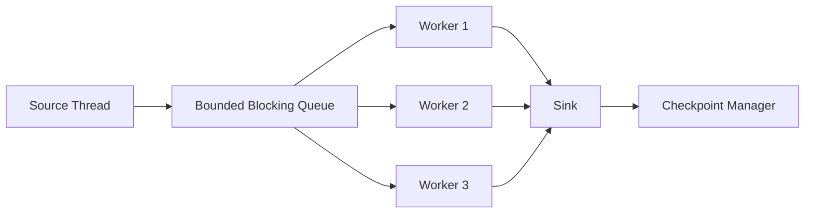
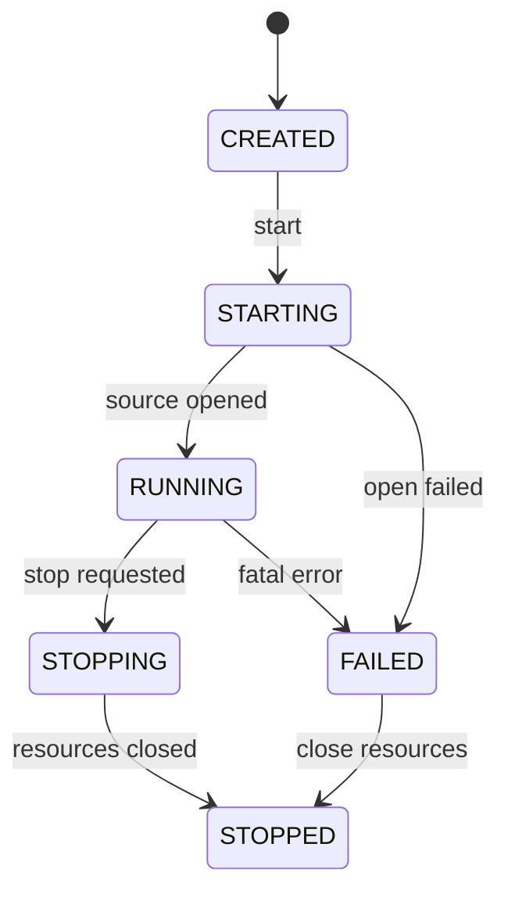
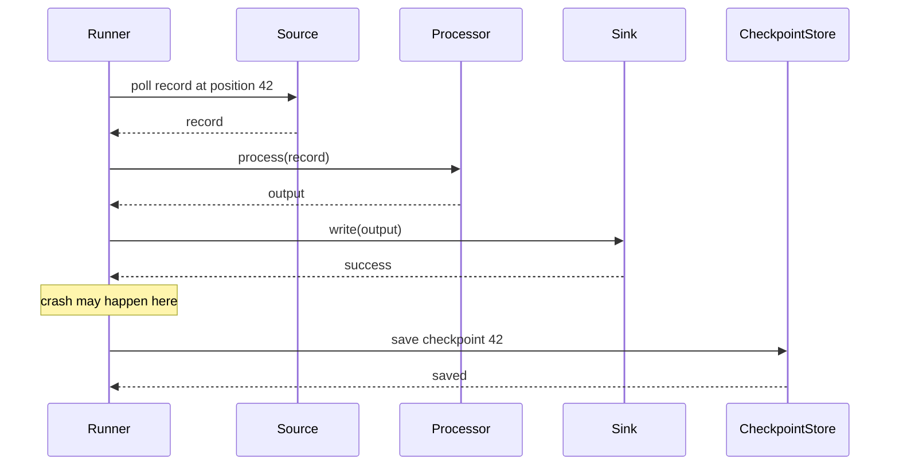
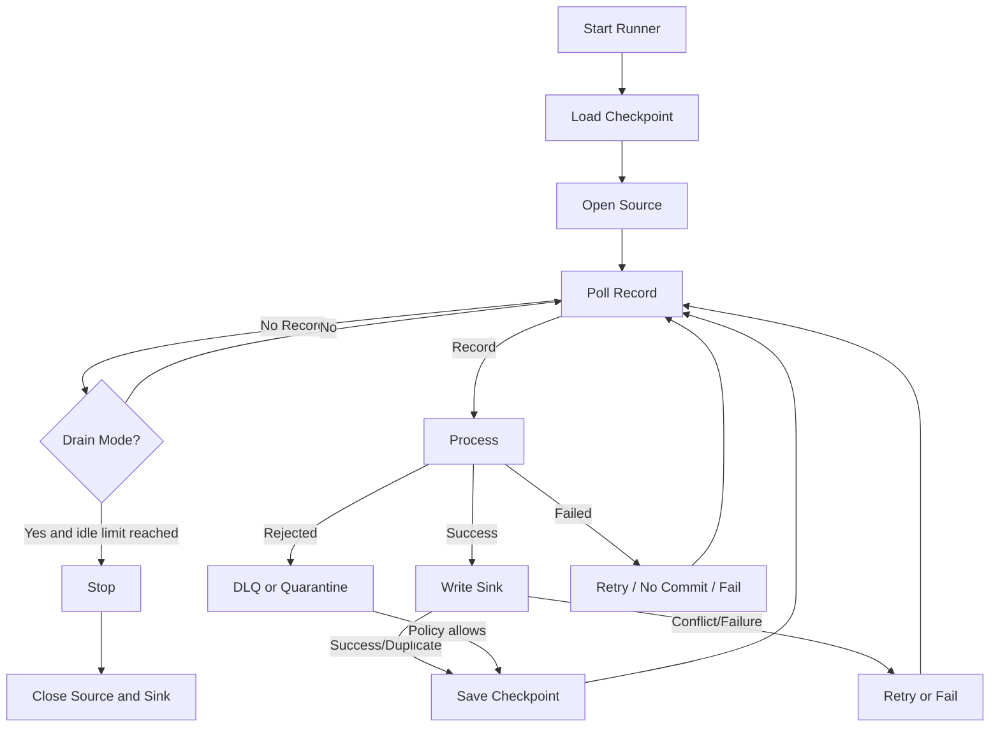

# Part 012 — Local Pipeline Runner

> Sebelum memakai Kafka Streams, Flink, Spark, atau Beam, engineer perlu memahami loop kecil yang selalu ada di dalam pipeline: read, process, write, commit, recover.

Pada Part 011 kita mendesain type system pipeline agar urutan dan boundary tidak mudah disalahgunakan.

Sekarang kita membangun runner lokal.

Tujuannya bukan membuat framework baru untuk menggantikan Kafka/Flink/Beam. Tujuannya adalah memahami mesin dasar yang ada di semua pipeline engine:

```text
read records
process records
write output
commit progress
handle failure
repeat
```

Jika Anda memahami loop ini, Anda akan lebih tajam saat membaca dokumentasi framework besar. Anda akan tahu pertanyaan yang harus diajukan:

- kapan offset di-commit?
- apa yang terjadi jika sink sukses tapi commit gagal?
- apa yang terjadi jika processor gagal setelah sebagian output tertulis?
- apakah runner push atau pull?
- bagaimana backpressure muncul?
- bagaimana shutdown aman dilakukan?
- apa yang harus di-retry?
- apakah record bisa diproses paralel tanpa merusak ordering?
- apakah checkpoint merepresentasikan input yang sudah aman atau input yang sedang dicoba?

Bagian ini membangun local runner secara bertahap dengan Java.

---

## 1. Runner Adalah Control Loop

Pipeline runner adalah komponen yang menjalankan lifecycle pipeline.

Ia bukan domain logic.

Domain logic ada di processor.

Runner bertanggung jawab atas:

- membuka source
- membaca record
- memanggil processor
- menulis sink
- mengelola checkpoint
- menangani retry/DLQ
- mengatur lifecycle
- menghormati shutdown
- mengeluarkan metrics/log
- menjaga memory tidak meledak

Pseudocode paling sederhana:

```java
while (running) {
    SourceRecord record = source.read();
    Output output = processor.process(record);
    sink.write(output);
    checkpointStore.save(record.position());
}
```

Ini terlalu sederhana untuk production, tetapi cukup untuk melihat bentuk dasarnya.

---

## 2. Commit Order Adalah Inti Correctness

Pertanyaan terpenting:

> Kapan source position boleh dianggap selesai?

Jawaban production-grade:

```text
Source position boleh di-commit hanya setelah seluruh side effect yang diwajibkan policy sudah aman.
```

Jika commit dilakukan sebelum sink write:

```text
read -> commit -> write
```

Lalu proses crash sebelum write, data hilang.

Jika write dilakukan sebelum commit:

```text
read -> write -> commit
```

Lalu proses crash setelah write tapi sebelum commit, record akan dibaca ulang dan sink harus idempotent.

Inilah alasan at-least-once + idempotent sink sering menjadi fondasi realistis.

Runner kita akan memakai order:

```text
read -> process -> write -> commit
```

Dengan konsekuensi:

- duplicate mungkin terjadi saat crash setelah write sebelum commit
- sink harus idempotent
- checkpoint menyatakan input sudah aman dari perspektif pipeline policy

---

## 3. Core Interfaces

Kita mulai dengan interface kecil.

```java
public interface Source<R, P extends SourcePosition> extends AutoCloseable {
    void open(Optional<P> lastCheckpoint);
    Optional<SourceRecord<R, P>> poll(Duration timeout);
    @Override void close();
}
```

Record dari source:

```java
public record SourceRecord<R, P extends SourcePosition>(
        Envelope<?, R> envelope,
        P position
) {}
```

Processor:

```java
public interface Processor<I, O> {
    StageResult<O> process(I input);
}
```

Sink:

```java
public interface Sink<O> extends AutoCloseable {
    SinkWriteResult write(O output);
    @Override void close();
}
```

Checkpoint store:

```java
public interface CheckpointStore<P extends SourcePosition> {
    Optional<P> load(PipelineId pipelineId);
    void save(PipelineId pipelineId, P position);
}
```

Runner config:

```java
public record RunnerConfig(
        PipelineId pipelineId,
        Duration pollTimeout,
        Duration idleSleep,
        ErrorPolicy errorPolicy,
        int maxConsecutiveFailures
) {}
```

---

## 4. Minimal Single-Thread Pull Runner

Runner pertama: single-thread, pull-based.

```java
public final class LocalPipelineRunner<I, O, P extends SourcePosition> {
    private final RunnerConfig config;
    private final Source<I, P> source;
    private final Processor<SourceRecord<I, P>, O> processor;
    private final Sink<O> sink;
    private final CheckpointStore<P> checkpointStore;
    private volatile boolean running;

    public LocalPipelineRunner(
            RunnerConfig config,
            Source<I, P> source,
            Processor<SourceRecord<I, P>, O> processor,
            Sink<O> sink,
            CheckpointStore<P> checkpointStore
    ) {
        this.config = config;
        this.source = source;
        this.processor = processor;
        this.sink = sink;
        this.checkpointStore = checkpointStore;
    }

    public void start() {
        running = true;
        Optional<P> checkpoint = checkpointStore.load(config.pipelineId());
        source.open(checkpoint);

        int consecutiveFailures = 0;

        try {
            while (running) {
                Optional<SourceRecord<I, P>> maybeRecord = source.poll(config.pollTimeout());

                if (maybeRecord.isEmpty()) {
                    sleep(config.idleSleep());
                    continue;
                }

                SourceRecord<I, P> record = maybeRecord.get();

                try {
                    handleRecord(record);
                    consecutiveFailures = 0;
                } catch (Exception e) {
                    consecutiveFailures++;
                    if (consecutiveFailures >= config.maxConsecutiveFailures()) {
                        throw new PipelineRunnerException("too many consecutive failures", e);
                    }
                    handleUnexpectedFailure(record, e);
                }
            }
        } finally {
            closeQuietly(source);
            closeQuietly(sink);
        }
    }

    public void stop() {
        running = false;
    }

    private void handleRecord(SourceRecord<I, P> record) {
        StageResult<O> result = processor.process(record);

        switch (result) {
            case StageSuccess<O> success -> {
                SinkWriteResult writeResult = sink.write(success.value());
                handleSinkResult(record, writeResult);
            }
            case StageRejected<O> rejected -> handleRejected(record, rejected);
            case StageFailed<O> failed -> handleFailed(record, failed);
        }
    }

    private void handleSinkResult(SourceRecord<I, P> record, SinkWriteResult writeResult) {
        switch (writeResult) {
            case SinkWriteSuccess success -> checkpointStore.save(config.pipelineId(), record.position());
            case SinkWriteDuplicate duplicate -> checkpointStore.save(config.pipelineId(), record.position());
            case SinkWriteConflict conflict -> throw new SinkConflictException(conflict.conflictReason());
            case SinkWriteFailure failure -> throw new SinkWriteException(failure.reason().message(), failure.cause());
        }
    }

    private void handleRejected(SourceRecord<I, P> record, StageRejected<O> rejected) {
        config.errorPolicy().onRejected(record, rejected);
        checkpointStore.save(config.pipelineId(), record.position());
    }

    private void handleFailed(SourceRecord<I, P> record, StageFailed<O> failed) {
        config.errorPolicy().onFailed(record, failed);
    }

    private void handleUnexpectedFailure(SourceRecord<I, P> record, Exception e) {
        config.errorPolicy().onUnexpectedFailure(record, e);
    }

    private static void sleep(Duration duration) {
        try {
            Thread.sleep(duration.toMillis());
        } catch (InterruptedException e) {
            Thread.currentThread().interrupt();
        }
    }

    private static void closeQuietly(AutoCloseable closeable) {
        try {
            closeable.close();
        } catch (Exception ignored) {
        }
    }
}
```

Ini belum sempurna, tetapi sudah menunjukkan struktur inti.

---

## 5. Rejection vs Failure di Runner

Perhatikan perbedaan ini:

```java
case StageRejected<O> rejected -> handleRejected(record, rejected);
case StageFailed<O> failed -> handleFailed(record, failed);
```

Rejected berarti record tidak memenuhi kontrak data. Biasanya aman untuk dikarantina/DLQ lalu checkpoint, karena retry record yang sama tidak akan memperbaiki payload.

Failed berarti proses gagal karena sesuatu yang mungkin transient atau bug.

Contoh:

| Case | Outcome | Runner behavior |
|---|---|---|
| JSON malformed | rejected | DLQ + commit |
| required field missing | rejected | quarantine/DLQ + commit |
| DB lookup timeout | failed | retry/no commit |
| sink unavailable | failed | retry/no commit |
| schema unknown | rejected atau retry-after-fix | quarantine/no commit atau commit sesuai policy |
| unexpected NPE | failed | fail fast/no commit |

Policy bisa berbeda per organisasi. Tetapi runner harus punya tempat untuk membedakannya.

---

## 6. Error Policy Interface

```java
public interface ErrorPolicy {
    <I, P extends SourcePosition, O> void onRejected(
            SourceRecord<I, P> record,
            StageRejected<O> rejected
    );

    <I, P extends SourcePosition, O> void onFailed(
            SourceRecord<I, P> record,
            StageFailed<O> failed
    );

    <I, P extends SourcePosition> void onUnexpectedFailure(
            SourceRecord<I, P> record,
            Exception exception
    );
}
```

Implementasi sederhana:

```java
public final class DlqErrorPolicy implements ErrorPolicy {
    private final DlqSink dlqSink;

    public DlqErrorPolicy(DlqSink dlqSink) {
        this.dlqSink = dlqSink;
    }

    @Override
    public <I, P extends SourcePosition, O> void onRejected(
            SourceRecord<I, P> record,
            StageRejected<O> rejected
    ) {
        dlqSink.write(rejected.errorEnvelope());
    }

    @Override
    public <I, P extends SourcePosition, O> void onFailed(
            SourceRecord<I, P> record,
            StageFailed<O> failed
    ) {
        if (failed.reason().retryability() == Retryability.NON_RETRYABLE) {
            dlqSink.write(failed.errorEnvelope());
        } else {
            throw new RetryablePipelineException(failed.reason().message(), failed.cause());
        }
    }

    @Override
    public <I, P extends SourcePosition> void onUnexpectedFailure(
            SourceRecord<I, P> record,
            Exception exception
    ) {
        throw new PipelineRunnerException("unexpected failure", exception);
    }
}
```

Policy inilah yang memisahkan mechanism dari keputusan bisnis/operasional.

---

## 7. Source Implementation: In-Memory Source

Untuk test dan local learning, buat source in-memory.

```java
public final class InMemorySource<R> implements Source<R, InMemoryPosition> {
    private final List<R> records;
    private int index;

    public InMemorySource(List<R> records) {
        this.records = List.copyOf(records);
    }

    @Override
    public void open(Optional<InMemoryPosition> lastCheckpoint) {
        this.index = lastCheckpoint
                .map(position -> position.nextIndex())
                .orElse(0);
    }

    @Override
    public Optional<SourceRecord<R, InMemoryPosition>> poll(Duration timeout) {
        if (index >= records.size()) {
            return Optional.empty();
        }

        R payload = records.get(index);
        InMemoryPosition position = new InMemoryPosition(index);

        Envelope<String, R> envelope = Envelope.simple(
                String.valueOf(index),
                payload,
                position
        );

        index++;
        return Optional.of(new SourceRecord<>(envelope, position));
    }

    @Override
    public void close() {
    }
}
```

Position:

```java
public record InMemoryPosition(int index) implements SourcePosition {
    public int nextIndex() {
        return index + 1;
    }
}
```

Catatan penting: position di record adalah posisi record yang sedang diproses. Saat reload checkpoint, source mulai dari `nextIndex()`.

Dalam sistem lain, checkpoint bisa menyimpan next offset secara langsung. Yang penting adalah semantics-nya jelas.

---

## 8. Sink Implementation: Collecting Sink

Untuk test:

```java
public final class CollectingSink<O> implements Sink<O> {
    private final List<O> outputs = new ArrayList<>();

    @Override
    public SinkWriteResult write(O output) {
        outputs.add(output);
        return new SinkWriteSuccess(
                IdempotencyKey.synthetic(),
                SinkPosition.none()
        );
    }

    public List<O> outputs() {
        return List.copyOf(outputs);
    }

    @Override
    public void close() {
    }
}
```

Ini berguna untuk deterministic test:

```java
@Test
void processes_all_records() {
    InMemorySource<String> source = new InMemorySource<>(List.of("a", "b", "c"));
    CollectingSink<String> sink = new CollectingSink<>();

    LocalPipelineRunner<String, String, InMemoryPosition> runner = new LocalPipelineRunner<>(
            config,
            source,
            record -> new StageSuccess<>(record.envelope().payload().toUpperCase()),
            sink,
            new InMemoryCheckpointStore<>()
    );

    runner.startUntilIdle();

    assertThat(sink.outputs()).containsExactly("A", "B", "C");
}
```

Untuk test, kita butuh `startUntilIdle()`. Jangan paksa infinite loop.

---

## 9. Runner Mode: Continuous vs Drain

Production streaming runner biasanya continuous.

Batch/local test runner sering drain sampai source kosong.

Tambahkan mode:

```java
public enum RunnerMode {
    CONTINUOUS,
    DRAIN_UNTIL_IDLE
}
```

Config:

```java
public record RunnerConfig(
        PipelineId pipelineId,
        RunnerMode mode,
        Duration pollTimeout,
        Duration idleSleep,
        int maxIdlePolls,
        ErrorPolicy errorPolicy,
        int maxConsecutiveFailures
) {}
```

Loop:

```java
int idlePolls = 0;

while (running) {
    Optional<SourceRecord<I, P>> maybeRecord = source.poll(config.pollTimeout());

    if (maybeRecord.isEmpty()) {
        idlePolls++;
        if (config.mode() == RunnerMode.DRAIN_UNTIL_IDLE && idlePolls >= config.maxIdlePolls()) {
            break;
        }
        sleep(config.idleSleep());
        continue;
    }

    idlePolls = 0;
    handleRecord(maybeRecord.get());
}
```

Ini membuat runner bisa dipakai untuk:

- unit test
- local batch utility
- file ingestion CLI
- replay tool
- integration test
- small operational job

---

## 10. Checkpoint Store: In-Memory

```java
public final class InMemoryCheckpointStore<P extends SourcePosition> implements CheckpointStore<P> {
    private final AtomicReference<P> checkpoint = new AtomicReference<>();

    @Override
    public Optional<P> load(PipelineId pipelineId) {
        return Optional.ofNullable(checkpoint.get());
    }

    @Override
    public void save(PipelineId pipelineId, P position) {
        checkpoint.set(position);
    }
}
```

Ini cukup untuk test. Production membutuhkan durable checkpoint:

- Kafka offset commit
- database table
- object storage manifest
- workflow state
- Flink checkpoint
- Spark checkpoint directory

Tetapi semantics-nya sama: menyimpan progress yang aman.

---

## 11. Checkpoint Table Example

Untuk runner sederhana dengan JDBC:

```sql
CREATE TABLE pipeline_checkpoint (
    pipeline_id       VARCHAR(200) PRIMARY KEY,
    source_type       VARCHAR(50) NOT NULL,
    position_payload  TEXT NOT NULL,
    updated_at        TIMESTAMP NOT NULL
);
```

Java model:

```java
public record SerializedCheckpoint(
        PipelineId pipelineId,
        String sourceType,
        String positionPayload,
        Instant updatedAt
) {}
```

Checkpoint store:

```java
public final class JdbcCheckpointStore<P extends SourcePosition> implements CheckpointStore<P> {
    private final DataSource dataSource;
    private final SourcePositionSerde<P> serde;

    public JdbcCheckpointStore(DataSource dataSource, SourcePositionSerde<P> serde) {
        this.dataSource = dataSource;
        this.serde = serde;
    }

    @Override
    public Optional<P> load(PipelineId pipelineId) {
        // SELECT position_payload FROM pipeline_checkpoint WHERE pipeline_id = ?
        // return serde.deserialize(payload)
        throw new UnsupportedOperationException("implementation omitted");
    }

    @Override
    public void save(PipelineId pipelineId, P position) {
        // UPSERT checkpoint atomically
        throw new UnsupportedOperationException("implementation omitted");
    }
}
```

Untuk production, checkpoint write harus atomic dan durable.

---

## 12. Important Checkpoint Rule

Jangan menyimpan checkpoint terlalu awal.

Salah:

```java
checkpointStore.save(config.pipelineId(), record.position());
SinkWriteResult result = sink.write(output);
```

Benar untuk at-least-once:

```java
SinkWriteResult result = sink.write(output);
if (result.isSafeToCommit()) {
    checkpointStore.save(config.pipelineId(), record.position());
}
```

Tetapi `isSafeToCommit()` harus policy-aware.

```java
public final class SinkCommitPolicy {
    public boolean safeToCommit(SinkWriteResult result) {
        return switch (result) {
            case SinkWriteSuccess ignored -> true;
            case SinkWriteDuplicate ignored -> true;
            case SinkWriteConflict ignored -> false;
            case SinkWriteFailure ignored -> false;
        };
    }
}
```

Duplicate bisa safe jika sink benar-benar idempotent dan duplicate berarti output sudah ada dengan content sama.

Conflict tidak safe karena bisa berarti data berbeda dengan idempotency key sama.

---

## 13. Graceful Shutdown

Runner tidak boleh berhenti di tengah record tanpa policy.

Minimal behavior:

- stop menerima record baru
- selesaikan record yang sedang diproses
- tulis sink jika processor sudah sukses
- commit jika sink sukses
- close source/sink

```java
public void stop() {
    running = false;
}
```

Tetapi ini hanya memberi sinyal. Loop harus mengecek flag di boundary aman.

```java
while (running) {
    Optional<SourceRecord<I, P>> maybeRecord = source.poll(config.pollTimeout());
    if (maybeRecord.isPresent()) {
        handleRecord(maybeRecord.get());
    }
}
```

Jika source poll blocking terlalu lama, shutdown lambat. Karena itu poll harus memakai timeout.

Untuk production, tambahkan shutdown hook:

```java
Runtime.getRuntime().addShutdownHook(new Thread(runner::stop));
```

Tetapi jangan mengandalkan shutdown hook untuk correctness. Crash tetap bisa terjadi kapan pun.

---

## 14. Push Runner vs Pull Runner

Pull runner:

```text
runner asks source for records
```

Push runner:

```text
source calls runner when records arrive
```

Pull cocok untuk:

- Kafka consumer poll loop
- file reader
- JDBC incremental read
- controlled backpressure
- simple lifecycle

Push cocok untuk:

- HTTP webhook
- async callback
- reactive stream
- message listener container

Pull lebih mudah dipahami karena runner mengontrol pace.

Push membutuhkan buffer atau direct processing.

---

## 15. Push Runner Shape

```java
public interface PushSource<R, P extends SourcePosition> extends AutoCloseable {
    void subscribe(RecordHandler<R, P> handler);
    void start();
    void stop();
}

public interface RecordHandler<R, P extends SourcePosition> {
    void onRecord(SourceRecord<R, P> record);
    void onError(Throwable error);
}
```

Runner:

```java
public final class PushPipelineRunner<I, O, P extends SourcePosition> {
    private final PushSource<I, P> source;
    private final Processor<SourceRecord<I, P>, O> processor;
    private final Sink<O> sink;
    private final CheckpointStore<P> checkpointStore;

    public void start() {
        source.subscribe(new RecordHandler<>() {
            @Override
            public void onRecord(SourceRecord<I, P> record) {
                handleRecord(record);
            }

            @Override
            public void onError(Throwable error) {
                handleSourceError(error);
            }
        });
        source.start();
    }
}
```

Problem push runner:

- jika source push lebih cepat dari sink, memory bisa naik
- jika handler blocking, source thread bisa terganggu
- jika parallel callback, ordering bisa rusak
- checkpoint harus thread-safe

Karena itu push runner sering butuh bounded queue.

---

## 16. Bounded Queue Runner

Desain umum:



Queue memberi buffer terbatas.

```java
public final class QueuedPipelineRunner<I, O, P extends SourcePosition> {
    private final BlockingQueue<SourceRecord<I, P>> queue;
    private final ExecutorService workers;
    private volatile boolean running;

    public QueuedPipelineRunner(int queueCapacity, int workerCount) {
        this.queue = new ArrayBlockingQueue<>(queueCapacity);
        this.workers = Executors.newFixedThreadPool(workerCount);
    }
}
```

Source loop:

```java
private void sourceLoop() {
    while (running) {
        Optional<SourceRecord<I, P>> maybeRecord = source.poll(config.pollTimeout());
        maybeRecord.ifPresent(record -> putWithBackpressure(record));
    }
}

private void putWithBackpressure(SourceRecord<I, P> record) {
    try {
        queue.put(record); // blocks when full
    } catch (InterruptedException e) {
        Thread.currentThread().interrupt();
        running = false;
    }
}
```

Worker loop:

```java
private void workerLoop() {
    while (running || !queue.isEmpty()) {
        SourceRecord<I, P> record = queue.poll(100, TimeUnit.MILLISECONDS);
        if (record != null) {
            handleRecord(record);
        }
    }
}
```

Queue capacity adalah backpressure boundary.

---

## 17. Parallelism Can Break Ordering

Jika record diproses paralel, checkpoint menjadi sulit.

Contoh input offset:

```text
0, 1, 2, 3, 4
```

Worker selesai dalam urutan:

```text
0, 2, 1, 4, 3
```

Bolehkah checkpoint offset 4 setelah record 4 selesai?

Tidak, jika record 1 atau 3 belum selesai.

Checkpoint harus advanced hanya sampai contiguous completed position.

```text
completed: 0, 2, 4
safe checkpoint: 0

completed: 0, 1, 2, 4
safe checkpoint: 2

completed: 0, 1, 2, 3, 4
safe checkpoint: 4
```

Ini alasan banyak engine memakai partition-level ordering.

---

## 18. Partition-Aware Runner

Jika source punya partition, kita bisa menjaga ordering per partition.

```java
public interface PartitionedPosition extends SourcePosition {
    SourcePartition partition();
    long sequence();
}

public record SourcePartition(String value) {}
```

Checkpoint per partition:

```java
public interface PartitionedCheckpointStore<P extends PartitionedPosition> {
    Optional<P> load(PipelineId pipelineId, SourcePartition partition);
    void save(PipelineId pipelineId, SourcePartition partition, P position);
}
```

Worker assignment:

```text
partition hash -> worker
```

Semua record partition yang sama masuk worker sama, sehingga order per partition terjaga.

```java
int workerIndex = Math.floorMod(record.position().partition().hashCode(), workerCount);
queues.get(workerIndex).put(record);
```

Trade-off:

- ordering per partition lebih aman
- hot partition bisa bottleneck
- scaling dibatasi jumlah partition efektif
- checkpoint lebih sederhana daripada arbitrary parallelism

---

## 19. In-Flight Tracking

Jika ingin parallelism tanpa strict per-partition single worker, butuh in-flight tracker.

```java
public final class InFlightTracker {
    private long highestCommitted = -1;
    private final NavigableSet<Long> completed = new TreeSet<>();

    public synchronized OptionalLong markCompleted(long sequence) {
        completed.add(sequence);

        long next = highestCommitted + 1;
        boolean advanced = false;

        while (completed.contains(next)) {
            completed.remove(next);
            highestCommitted = next;
            next++;
            advanced = true;
        }

        return advanced ? OptionalLong.of(highestCommitted) : OptionalLong.empty();
    }
}
```

Ini bekerja untuk sequence monoton tunggal.

Untuk Kafka-like source, lakukan per partition.

---

## 20. Backpressure from Bounded Queue

Unbounded queue terlihat nyaman tetapi berbahaya.

```java
Queue<Record> queue = new LinkedList<>(); // dangerous if producer faster than consumer
```

Jika sink lambat, queue tumbuh sampai memory habis.

Gunakan bounded queue:

```java
BlockingQueue<Record> queue = new ArrayBlockingQueue<>(10_000);
```

Ketika queue penuh:

- source thread block
- poll melambat
- upstream pressure bisa muncul
- memory tetap bounded

Backpressure bukan fitur mewah. Backpressure adalah mekanisme agar sistem tidak mati karena sukses menerima terlalu banyak data.

Part 013 nanti akan membahas backpressure lebih dalam.

---

## 21. Batch Sink in Runner

Menulis satu record per call sering mahal.

Sink bisa batch.

```java
public interface BatchSink<O> extends AutoCloseable {
    SinkWriteResult writeBatch(List<O> outputs);
    @Override void close();
}
```

Runner batching:

```java
List<SourceRecord<I, P>> batch = source.pollBatch(config.maxBatchSize(), config.pollTimeout());
List<O> outputs = new ArrayList<>();

for (SourceRecord<I, P> record : batch) {
    StageResult<O> result = processor.process(record);
    if (result instanceof StageSuccess<O> success) {
        outputs.add(success.value());
    } else {
        handleNonSuccess(record, result);
    }
}

SinkWriteResult result = sink.writeBatch(outputs);
if (safeToCommit(result)) {
    commitBatch(batch);
}
```

Batching memperbaiki throughput, tetapi memperumit error handling.

Jika batch sink gagal, apakah semua record gagal? Atau hanya sebagian?

Production batch sink sebaiknya punya per-record result.

```java
public record BatchSinkWriteResult<O>(
        List<RecordSinkResult<O>> results
) {}

public record RecordSinkResult<O>(
        O output,
        SinkWriteResult result
) {}
```

---

## 22. Partial Batch Failure

Partial failure adalah kenyataan.

Contoh batch berisi 5 output:

```text
A success
B success
C conflict
D success
E timeout unknown
```

Jika runner hanya tahu “batch failed”, semua akan diulang. Itu aman jika sink idempotent, tetapi mahal.

Jika runner tahu per-record result, ia bisa commit sampai posisi aman.

Namun commit batch tetap harus hati-hati dengan ordering.

Jika C gagal, D sukses, checkpoint tidak boleh melewati C jika source ordering harus dipertahankan.

```text
source: A B C D E
result: S S F S F
safe checkpoint: B
```

D akan diulang walau sudah sukses. Sink D harus idempotent.

---

## 23. Metrics Hooks

Runner harus punya hooks untuk metrics.

```java
public interface RunnerMetrics {
    void recordPolled(PipelineId pipelineId);
    void recordProcessed(PipelineId pipelineId, Duration duration);
    void recordRejected(PipelineId pipelineId, String reasonCode);
    void recordFailed(PipelineId pipelineId, String reasonCode);
    void sinkWriteSucceeded(PipelineId pipelineId, Duration duration);
    void sinkWriteFailed(PipelineId pipelineId, String reasonCode);
    void checkpointSaved(PipelineId pipelineId);
    void queueDepth(PipelineId pipelineId, int depth);
}
```

No-op implementation:

```java
public final class NoopRunnerMetrics implements RunnerMetrics {
    // all methods empty
}
```

Metrics penting:

- records polled
- records processed
- records succeeded
- records rejected
- records failed
- sink write latency
- checkpoint latency
- queue depth
- source lag
- processing latency
- end-to-end freshness
- retry count
- DLQ count

Tanpa metrics, runner hanya “kelihatan jalan”.

---

## 24. Structured Logging Context

Log runner harus membawa context.

```java
public record LogContext(
        PipelineId pipelineId,
        PipelineRunId runId,
        String source,
        SourcePosition position,
        Optional<EventId> eventId,
        Optional<TenantId> tenantId,
        Optional<String> traceId
) {}
```

Gunakan log context di boundary penting:

- source open
- record received
- processor rejected
- sink failed
- checkpoint saved
- shutdown requested
- runner stopped

Jangan log payload penuh secara default. Payload bisa besar, sensitif, atau berisi PII.

---

## 25. Lifecycle State Machine

Runner harus punya lifecycle eksplisit.

```java
public enum RunnerState {
    CREATED,
    STARTING,
    RUNNING,
    STOPPING,
    STOPPED,
    FAILED
}
```

Transition:



State membantu:

- mencegah double start
- memberi health check
- debugging deployment
- graceful shutdown
- test deterministic

Implementation:

```java
private final AtomicReference<RunnerState> state = new AtomicReference<>(RunnerState.CREATED);

public RunnerState state() {
    return state.get();
}
```

Start guard:

```java
if (!state.compareAndSet(RunnerState.CREATED, RunnerState.STARTING)) {
    throw new IllegalStateException("runner already started: " + state.get());
}
```

---

## 26. Health Check

Local runner dalam service perlu health check.

```java
public record RunnerHealth(
        RunnerState state,
        Instant lastRecordAt,
        Instant lastSuccessAt,
        Optional<String> lastFailureReason,
        long consecutiveFailures,
        int queueDepth
) {
    public boolean healthy() {
        return state == RunnerState.RUNNING && consecutiveFailures < 10;
    }
}
```

Health check tidak boleh hanya “process alive”.

Process bisa hidup tetapi pipeline macet.

Signal penting:

- last poll time
- last successful commit time
- consecutive failures
- queue depth
- lag/freshness
- DLQ spike
- sink latency

---

## 27. Deterministic Test Harness

Runner lokal harus mudah diuji.

Tambahkan method:

```java
public RunSummary runUntilIdle() {
    config = config.withMode(RunnerMode.DRAIN_UNTIL_IDLE);
    start();
    return summary();
}
```

Summary:

```java
public record RunSummary(
        long polled,
        long succeeded,
        long rejected,
        long failed,
        Optional<SourcePosition> finalCheckpoint
) {}
```

Test scenario:

```java
@Test
void commits_after_successful_sink_write() {
    InMemorySource<String> source = new InMemorySource<>(List.of("one"));
    InMemoryCheckpointStore<InMemoryPosition> checkpoints = new InMemoryCheckpointStore<>();
    CollectingSink<String> sink = new CollectingSink<>();

    LocalPipelineRunner<String, String, InMemoryPosition> runner = runner(source, sink, checkpoints);

    RunSummary summary = runner.runUntilIdle();

    assertThat(summary.succeeded()).isEqualTo(1);
    assertThat(checkpoints.load(PIPELINE_ID)).contains(new InMemoryPosition(0));
}
```

Test crash scenario:

```java
@Test
void does_not_commit_when_sink_fails() {
    FailingSink<String> sink = new FailingSink<>(FailureMode.ALWAYS_FAIL);

    RunSummary summary = runner(source, sink, checkpoints).runUntilIdleIgnoringFatal();

    assertThat(checkpoints.load(PIPELINE_ID)).isEmpty();
}
```

Test rejection:

```java
@Test
void rejected_record_goes_to_dlq_and_commits_when_policy_allows() {
    Processor<SourceRecord<String, InMemoryPosition>, String> processor = record ->
            new StageRejected<>(
                    RejectionReason.validationFailed("INVALID"),
                    ErrorEnvelope.from(record.envelope(), "INVALID")
            );

    runnerWith(processor).runUntilIdle();

    assertThat(dlq.outputs()).hasSize(1);
    assertThat(checkpoints.load(PIPELINE_ID)).contains(new InMemoryPosition(0));
}
```

---

## 28. Failure Injection Sink

Untuk memahami delivery semantics, buat sink yang bisa gagal di titik tertentu.

```java
public final class FailingAfterWriteSink<O> implements Sink<O> {
    private final List<O> outputs = new ArrayList<>();
    private final int failAfterWrites;
    private int writes;

    public FailingAfterWriteSink(int failAfterWrites) {
        this.failAfterWrites = failAfterWrites;
    }

    @Override
    public SinkWriteResult write(O output) {
        outputs.add(output);
        writes++;

        if (writes >= failAfterWrites) {
            throw new RuntimeException("simulated crash after write");
        }

        return new SinkWriteSuccess(IdempotencyKey.synthetic(), SinkPosition.none());
    }

    public List<O> outputs() {
        return List.copyOf(outputs);
    }

    @Override
    public void close() {
    }
}
```

Ini memperlihatkan problem klasik:

```text
write succeeded internally -> runner crashed before checkpoint
```

Saat restart, record diproses ulang. Sink harus idempotent.

---

## 29. Idempotent Collecting Sink

```java
public final class IdempotentCollectingSink<O extends HasIdempotencyKey> implements Sink<O> {
    private final Map<IdempotencyKey, O> outputs = new LinkedHashMap<>();

    @Override
    public SinkWriteResult write(O output) {
        O existing = outputs.get(output.idempotencyKey());

        if (existing == null) {
            outputs.put(output.idempotencyKey(), output);
            return new SinkWriteSuccess(output.idempotencyKey(), SinkPosition.none());
        }

        if (existing.equals(output)) {
            return new SinkWriteDuplicate(output.idempotencyKey(), SinkPosition.none());
        }

        return new SinkWriteConflict(
                output.idempotencyKey(),
                "same idempotency key with different payload"
        );
    }

    @Override
    public void close() {
    }
}
```

Ini mengajarkan tiga outcome penting:

- success: first write
- duplicate: same write repeated
- conflict: same idempotency key different content

Conflict jauh lebih serius daripada duplicate.

---

## 30. Runner with Retry Policy

Retry jangan sekadar loop cepat.

```java
public record RetryPolicy(
        int maxAttempts,
        Duration initialDelay,
        Duration maxDelay,
        double multiplier
) {
    public Duration delayForAttempt(int attempt) {
        long millis = (long) (initialDelay.toMillis() * Math.pow(multiplier, attempt - 1));
        return Duration.ofMillis(Math.min(millis, maxDelay.toMillis()));
    }
}
```

Retry wrapper:

```java
private SinkWriteResult writeWithRetry(O output) {
    for (int attempt = 1; attempt <= retryPolicy.maxAttempts(); attempt++) {
        SinkWriteResult result = sink.write(output);

        if (result instanceof SinkWriteFailure failure
                && failure.reason().retryability() == Retryability.RETRYABLE) {
            sleep(retryPolicy.delayForAttempt(attempt));
            continue;
        }

        return result;
    }

    return new SinkWriteFailure(
            extractIdempotencyKey(output),
            FailureReason.retryExhausted("sink retry exhausted"),
            null
    );
}
```

Production retry perlu jitter agar tidak menciptakan thundering herd.

```java
public Duration withJitter(Duration base) {
    double factor = 0.8 + ThreadLocalRandom.current().nextDouble() * 0.4;
    return Duration.ofMillis((long) (base.toMillis() * factor));
}
```

---

## 31. Poison Record Handling

Poison record adalah record yang selalu menyebabkan kegagalan.

Jika runner retry tanpa batas, pipeline macet.

Policy:

```java
public record PoisonRecordPolicy(
        int maxAttemptsPerRecord,
        boolean sendToDlqAfterMaxAttempts,
        boolean commitAfterDlq
) {}
```

Attempt tracker:

```java
public final class AttemptTracker<P extends SourcePosition> {
    private final Map<P, Integer> attempts = new HashMap<>();

    public int increment(P position) {
        int next = attempts.getOrDefault(position, 0) + 1;
        attempts.put(position, next);
        return next;
    }

    public void clear(P position) {
        attempts.remove(position);
    }
}
```

Jika record mencapai max attempts:

```java
if (attempt >= policy.maxAttemptsPerRecord()) {
    dlq.write(errorEnvelope);
    if (policy.commitAfterDlq()) {
        checkpointStore.save(config.pipelineId(), record.position());
    }
}
```

Trade-off:

- commit after DLQ membuat pipeline lanjut, tetapi record tidak masuk main sink
- no commit menjaga completeness main sink, tetapi pipeline bisa stuck

Tidak ada jawaban universal. Pilih berdasarkan domain.

---

## 32. Runner and Transactions

Local runner bisa memakai transaksi sink + checkpoint jika keduanya ada di database yang sama.

```text
BEGIN
  write sink row
  update checkpoint
COMMIT
```

Ini memberi atomicity antara sink dan checkpoint.

```java
transactionTemplate.execute(status -> {
    sink.writeWithinTransaction(output);
    checkpointStore.saveWithinTransaction(config.pipelineId(), record.position());
    return null;
});
```

Tetapi ini hanya bekerja jika:

- sink dan checkpoint berbagi transaction manager
- source bisa replay dari checkpoint eksternal
- side effect lain tidak berada di luar transaksi

Jika sink adalah API eksternal dan checkpoint di DB, tidak ada atomic transaction sederhana.

Maka kembali ke:

```text
at-least-once + idempotent sink
```

---

## 33. Mermaid: Commit Failure Window



Jika crash terjadi setelah sink success sebelum checkpoint, record 42 akan diproses ulang saat restart.

Karena itu sink harus idempotent.

---

## 34. Start from Checkpoint

Saat restart:

```java
Optional<P> checkpoint = checkpointStore.load(config.pipelineId());
source.open(checkpoint);
```

Setiap source harus mendefinisikan arti checkpoint.

Untuk in-memory:

```text
checkpoint index 5 -> start from index 6
```

Untuk Kafka-style offset:

```text
checkpoint nextOffset 6 -> start from offset 6
```

Dua model ini beda.

Pilih satu dan dokumentasikan.

Lebih aman menyimpan `nextPosition` daripada `lastProcessedPosition`, tetapi tidak semua source natural begitu.

Contoh:

```java
public interface SourcePosition {
    String describe();
}

public interface ResumeStrategy<P extends SourcePosition> {
    void resume(SourceHandle handle, Optional<P> checkpoint);
}
```

---

## 35. Avoid Hidden Auto-Commit

Beberapa client source punya auto-commit.

Untuk runner yang ingin kontrol correctness, auto-commit biasanya harus dimatikan.

Alasan:

```text
source auto-commit bisa menandai record selesai sebelum sink write aman
```

Dalam local abstraction, source tidak boleh commit sendiri kecuali memang source semantics-nya demikian dan eksplisit.

Runner harus menjadi pemilik commit decision.

---

## 36. Record Lease and Visibility Timeout

Untuk queue-based source seperti work queue, record bisa punya lease/visibility timeout.

Model:

```java
public record LeasedSourceRecord<R, P extends SourcePosition>(
        Envelope<?, R> envelope,
        P position,
        Instant leaseExpiresAt,
        Runnable ack,
        Runnable nack
) {}
```

Runner harus memutuskan:

- `ack` setelah sink aman
- `nack` jika retry ingin dilakukan segera
- biarkan lease expire jika crash

Ini mirip commit, tetapi source semantics berbeda.

Jangan paksakan semua source menjadi offset log.

---

## 37. Pull Loop for File Ingestion

File source punya problem unik.

Position bisa:

```java
public record FileLinePosition(
        Path path,
        long lineNumber,
        String fileFingerprint
) implements SourcePosition {}
```

Source harus menghindari partial file.

Runner tidak cukup. Source contract harus menjamin file siap diproses.

Contoh source open:

```java
public void open(Optional<FileLinePosition> checkpoint) {
    if (checkpoint.isPresent()) {
        resumeFrom(checkpoint.get());
    } else {
        startFromFirstReadyFile();
    }
}
```

Checkpoint setelah setiap line aman tetapi mahal. Checkpoint per batch lebih efisien tetapi meningkatkan replay window.

---

## 38. Pull Loop for JDBC Incremental Ingestion

JDBC source biasanya memakai high-watermark.

Position:

```java
public record JdbcHighWatermarkPosition(
        String table,
        String column,
        String lastValue
) implements SourcePosition {}
```

Problem:

- rows dengan timestamp sama
- update out of order
- transaction isolation
- deleted rows tidak terlihat
- clock source tidak monoton

Runner bisa sama, tetapi source implementation lebih rumit.

High-watermark aman biasanya butuh tie-breaker:

```sql
WHERE (updated_at, id) > (?, ?)
ORDER BY updated_at, id
LIMIT ?
```

Position:

```java
public record JdbcCompositeWatermarkPosition(
        Instant updatedAt,
        String id
) implements SourcePosition {}
```

---

## 39. Runner Should Not Hide Source Semantics

Jangan buat abstraction terlalu generic sampai semantics hilang.

Buruk:

```java
interface Source<T> {
    T read();
}
```

Lebih baik:

```java
interface Source<R, P extends SourcePosition> {
    void open(Optional<P> checkpoint);
    Optional<SourceRecord<R, P>> poll(Duration timeout);
}
```

Karena source bukan hanya data. Source membawa posisi, resume semantics, dan failure model.

---

## 40. Small Runner vs Framework Engine

Local runner cocok untuk:

- memahami semantics
- unit/integration test
- lightweight ingestion tool
- migration/backfill utility kecil
- internal admin pipeline
- deterministic replay experiment
- embedded pipeline dalam service

Tidak cocok untuk:

- stateful stream processing besar
- event-time windowing kompleks
- distributed checkpointing
- cluster scaling
- exactly-once state management
- large shuffle/join
- petabyte batch
- multi-tenant data platform

Framework besar tetap dibutuhkan. Tetapi runner kecil membuat Anda tidak buta terhadap semantics framework.

---

## 41. Full Example: Local Case Pipeline

### 41.1 Input DTO

```java
public record RawCaseEventJson(String json) {}
```

### 41.2 Output command

```java
public record UpsertCaseProjectionCommand(
        IdempotencyKey idempotencyKey,
        CaseId caseId,
        String status
) implements HasIdempotencyKey {
}
```

### 41.3 Processor

```java
public final class LocalCasePipelineProcessor implements Processor<SourceRecord<String, InMemoryPosition>, UpsertCaseProjectionCommand> {
    private final ObjectMapper objectMapper;

    public LocalCasePipelineProcessor(ObjectMapper objectMapper) {
        this.objectMapper = objectMapper;
    }

    @Override
    public StageResult<UpsertCaseProjectionCommand> process(SourceRecord<String, InMemoryPosition> input) {
        try {
            CaseEvent event = objectMapper.readValue(input.envelope().payload(), CaseEvent.class);

            if (event.caseId().value().isBlank()) {
                return new StageRejected<>(
                        RejectionReason.validationFailed("CASE_ID_REQUIRED"),
                        ErrorEnvelope.from(input.envelope(), "CASE_ID_REQUIRED")
                );
            }

            UpsertCaseProjectionCommand command = new UpsertCaseProjectionCommand(
                    IdempotencyKey.of("case-projection", event.caseId().value(), event.eventId().value()),
                    event.caseId(),
                    deriveStatus(event)
            );

            return new StageSuccess<>(command);
        } catch (JsonProcessingException e) {
            return new StageRejected<>(
                    RejectionReason.malformedPayload("CASE_EVENT_JSON_INVALID"),
                    ErrorEnvelope.from(input.envelope(), e)
            );
        } catch (Exception e) {
            return new StageFailed<>(
                    FailureReason.unexpected("CASE_PROCESSOR_FAILED"),
                    e,
                    ErrorEnvelope.from(input.envelope(), e)
            );
        }
    }
}
```

### 41.4 Runner assembly

```java
List<String> input = List.of(
        "{\"eventId\":\"evt-1\",\"caseId\":\"case-1\",\"type\":\"OPENED\"}",
        "{\"eventId\":\"evt-2\",\"caseId\":\"case-1\",\"type\":\"ASSIGNED\"}"
);

InMemorySource<String> source = new InMemorySource<>(input);
IdempotentCollectingSink<UpsertCaseProjectionCommand> sink = new IdempotentCollectingSink<>();
InMemoryCheckpointStore<InMemoryPosition> checkpointStore = new InMemoryCheckpointStore<>();

RunnerConfig config = new RunnerConfig(
        new PipelineId("case-projection-local"),
        RunnerMode.DRAIN_UNTIL_IDLE,
        Duration.ofMillis(100),
        Duration.ofMillis(10),
        3,
        new DlqErrorPolicy(new InMemoryDlqSink()),
        5
);

LocalPipelineRunner<String, UpsertCaseProjectionCommand, InMemoryPosition> runner =
        new LocalPipelineRunner<>(
                config,
                source,
                new LocalCasePipelineProcessor(objectMapper),
                sink,
                checkpointStore
        );

RunSummary summary = runner.runUntilIdle();
```

---

## 42. Mermaid: Local Runner Control Loop



---

## 43. Design Trade-Offs

| Decision | Simpler choice | Stronger choice | Cost |
|---|---|---|---|
| Execution | single-thread | partitioned workers | concurrency complexity |
| Commit | per record | batch commit | replay window |
| Sink | void write | typed result | more code |
| Error | exception | result type + policy | more modeling |
| Queue | unbounded | bounded | source blocking |
| Processing | one-to-one | cardinality-aware | checkpoint complexity |
| Checkpoint | last processed | next position | source-specific modeling |
| Shutdown | kill process | graceful stop | lifecycle code |
| Retry | immediate | backoff+jitter+budget | policy design |

Production engineering adalah memilih trade-off secara sadar, bukan memilih framework paling populer.

---

## 44. Common Bugs in DIY Pipeline Runners

### 44.1 Commit before write

Menyebabkan data loss.

### 44.2 Infinite retry on poison record

Membuat pipeline stuck.

### 44.3 Unbounded queue

Menyebabkan memory pressure dan crash.

### 44.4 Parallel processing without checkpoint ordering

Menyebabkan skipped records.

### 44.5 Treating duplicate as conflict

Membuat replay aman menjadi incident palsu.

### 44.6 Treating conflict as duplicate

Menyembunyikan data corruption.

### 44.7 Logging payload by default

Membocorkan data sensitif.

### 44.8 No drain mode

Membuat runner sulit dites.

### 44.9 No lifecycle state

Membuat service health misleading.

### 44.10 Source abstraction hides resume semantics

Membuat checkpoint salah.

---

## 45. Production Readiness Checklist

Sebelum runner dipakai untuk job nyata, cek:

- Apakah source resume semantics jelas?
- Apakah checkpoint berarti last processed atau next position?
- Apakah commit dilakukan setelah sink safe?
- Apakah sink idempotent?
- Apakah duplicate dan conflict dibedakan?
- Apakah rejected dan failed dibedakan?
- Apakah DLQ menyimpan original context?
- Apakah poison record punya policy?
- Apakah retry punya max attempt, backoff, dan jitter?
- Apakah queue bounded?
- Apakah parallelism menjaga ordering/commit safety?
- Apakah graceful shutdown menyelesaikan in-flight record?
- Apakah runner punya drain mode untuk test?
- Apakah metrics minimal tersedia?
- Apakah log membawa pipeline id, run id, source position, dan reason code?
- Apakah payload sensitif tidak di-log sembarangan?
- Apakah config divalidasi saat startup?
- Apakah failure injection test tersedia?
- Apakah restart test membuktikan replay aman?

---

## 46. Key Takeaways

Local pipeline runner mengajarkan mekanisme inti semua pipeline engine:

```text
read -> process -> write -> commit
```

Urutan ini menentukan delivery semantics.

Jika commit sebelum write, risiko data loss.

Jika write sebelum commit, risiko duplicate.

Karena duplicate lebih mudah dikendalikan daripada data loss, banyak pipeline realistis memilih:

```text
at-least-once processing + idempotent sink
```

Runner kecil juga mengajarkan bahwa pipeline bukan hanya transform function. Pipeline adalah lifecycle system dengan:

- source resume
- checkpoint
- sink side effect
- error classification
- retry
- DLQ
- backpressure
- concurrency
- shutdown
- observability

Pada Part 013, kita akan masuk lebih dalam ke **backpressure from first principles**: bagaimana queue, sink latency, polling rate, batching, dan memory pressure saling berinteraksi, serta bagaimana merancang pipeline yang melambat secara sehat daripada crash secara dramatis.
